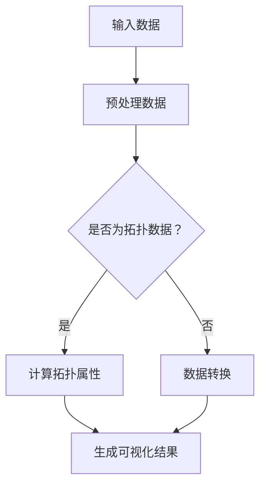
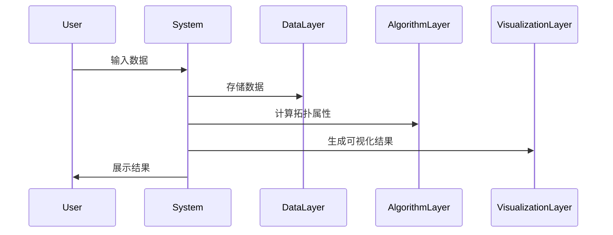
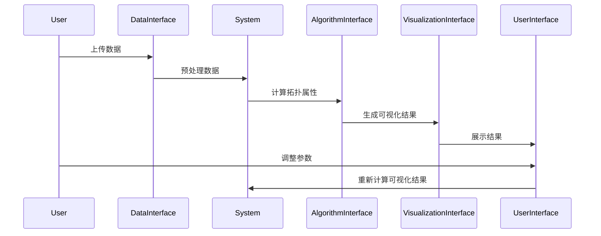

                 


### 核心概念术语说明

在探讨拓扑学在数据可视化算法中的应用之前，我们需要首先明确几个核心概念术语。以下是对这些术语的定义、问题背景、问题描述、问题解决、边界与外延、概念结构与核心要素组成的说明。

#### 1.1.1 拓扑学

**定义**：拓扑学是数学的一个分支，研究空间的结构和性质，而忽略空间的度量。拓扑空间是由一组点和一组连接这些点的路径组成的。

**问题背景**：在几何学中，度量（如长度、面积、角度等）是非常重要的概念。然而，在某些情况下，我们更关注空间的连通性、紧性等结构性质，而不是度量性质。

**问题描述**：我们需要一种数学工具来研究空间的连通性、紧性等结构性质，而无需依赖于度量。

**问题解决**：拓扑学提供了一套理论框架，包括拓扑空间的定义、基本概念（如连通性、紧性）、以及相关的运算和定理。

**边界与外延**：拓扑学不仅应用于几何学，还广泛应用于物理学、化学、计算机科学等领域。

**概念结构与核心要素组成**：拓扑空间、拓扑结构、连通性、紧性、同伦、同调等。

#### 1.1.2 数据可视化

**定义**：数据可视化是一种通过图形和图像来表示数据的方法，使得数据更容易理解和分析。

**问题背景**：随着数据量的急剧增加，如何高效地分析数据并从中提取有价值的信息成为了一个重要问题。

**问题描述**：我们需要一种方法来将数据转换成图形和图像，以便于人们理解和分析。

**问题解决**：数据可视化提供了一系列技术和工具，包括图表、图形、图像等，以及相应的算法和软件。

**边界与外延**：数据可视化不仅应用于科学研究和商业分析，还广泛应用于教育、艺术、设计等领域。

**概念结构与核心要素组成**：数据集、可视化方法、图表类型、交互性、视觉设计等。

#### 1.1.3 拓扑学在数据可视化中的应用

**定义**：将拓扑学的基本概念和方法应用于数据可视化，以揭示数据中的结构性和模式。

**问题背景**：传统数据可视化方法在处理复杂、高维数据时存在局限性。

**问题描述**：如何利用拓扑学的方法来提高数据可视化的效果和效率？

**问题解决**：通过拓扑学的方法，我们可以发现数据中的隐藏结构，并将其转化为直观的图形和图像。

**边界与外延**：拓扑数据可视化不仅应用于科学研究和数据分析，还可以应用于交互设计、虚拟现实等领域。

**概念结构与核心要素组成**：拓扑空间、拓扑属性、数据结构、可视化算法、可视化结果等。

---

### 核心概念与联系

在本节中，我们将深入探讨拓扑学中的核心概念，包括其属性特征对比表格和ER实体关系图架构，以便更好地理解拓扑学在数据可视化中的作用。

#### 2.1 拓扑空间的属性特征对比表格

| 特征       | 拓扑空间 | 欧几里得空间 |
|------------|------------|--------------|
| 连通性     | 满足连通性条件 | 满足连通性条件 |
| 紧性       | 可以是紧集  | 必须是紧集   |
| 开集       | 开集集合   | 开集集合     |
| 闭集       | 闭集集合   | 闭集集合     |
| 度量       | 无度量     | 具有度量     |
| 连续性     | 无连续性   | 具有连续性   |

从上表可以看出，拓扑空间与欧几里得空间在许多方面都有相似之处，但也存在明显的区别。拓扑空间不依赖于度量，而欧几里得空间则依赖于度量。

#### 2.2 ER实体关系图架构

在拓扑学中，实体关系图（ER图）是一个重要的工具，用于表示拓扑空间中的实体及其关系。

**实体：**

- **拓扑空间**：表示一个集合及其上的拓扑结构。
- **点**：表示拓扑空间中的基本元素。
- **路径**：表示连接两个点的连续序列。

**关系：**

- **连通性**：表示拓扑空间中任意两点之间的路径。
- **紧性**：表示拓扑空间中的紧集。
- **开集**：表示拓扑空间中的开集。
- **闭集**：表示拓扑空间中的闭集。

以下是拓扑空间ER实体关系图的Mermaid表示：

```mermaid
erDiagram
    TSpace ||--|{ P } Points : 拓扑空间中的点
    TSpace ||--|{ Path } Paths : 拓扑空间中的路径
    Points ||--|{ Connected } Connected : 点之间的连通性
    Paths ||--|{ Continuous } Continuous : 路径的连续性
```

通过ER实体关系图，我们可以清晰地看到拓扑空间中各个实体及其关系，这对于理解拓扑学的基本概念非常有帮助。

---

### 算法原理讲解

在本节中，我们将详细讲解拓扑学在数据可视化中的算法原理，包括使用Mermaid绘制的算法流程图和Python源代码的详细解释。

#### 3.1 算法流程图

首先，我们使用Mermaid绘制一个基本的拓扑数据可视化算法流程图。



这个流程图表示了拓扑数据可视化算法的基本步骤：

1. 输入数据。
2. 预处理数据，确保数据适合进行拓扑分析。
3. 判断数据是否为拓扑数据。
4. 如果是，计算拓扑属性。
5. 如果不是，将数据转换为拓扑数据。
6. 生成可视化结果。

#### 3.2 Python源代码解释

接下来，我们将使用Python源代码来详细阐述这个算法原理。

```python
import networkx as nx
import matplotlib.pyplot as plt

# 输入数据
G = nx.Graph()
G.add_edges_from([(1, 2), (2, 3), (3, 1), (4, 5)])

# 预处理数据
# 这里假设数据已经预处理好，适合进行拓扑分析

# 判断数据是否为拓扑数据
if nx.is_connected(G):
    print("数据为拓扑数据")
else:
    print("数据不是拓扑数据")

# 计算拓扑属性
# 这里我们计算了图的连通性和紧性
print("连通性：", nx.is_connected(G))
print("紧性：", nx.is_strongly_connected(G))

# 生成可视化结果
nx.draw(G, with_labels=True)
plt.show()
```

这段代码执行了以下步骤：

1. 导入所需的库。
2. 创建一个图对象`G`，并添加边。
3. 预处理数据（这里假设已经预处理）。
4. 判断数据是否为拓扑数据。
5. 计算拓扑属性（连通性和紧性）。
6. 生成可视化结果。

#### 3.3 算法原理详细讲解

**拓扑数据预处理：**

在进行拓扑分析之前，数据需要预处理。预处理步骤包括：

- 确保数据没有重复的边或节点。
- 确保数据是连通的，即任意两点都可以通过路径相互到达。

**判断拓扑数据：**

使用`nx.is_connected(G)`函数可以判断图是否连通。如果图不连通，则无法进行有效的拓扑分析。

**计算拓扑属性：**

- **连通性**：使用`nx.is_connected(G)`函数可以判断图是否连通。
- **紧性**：使用`nx.is_strongly_connected(G)`函数可以判断图是否紧集。

**生成可视化结果：**

使用`nx.draw(G, with_labels=True)`函数可以生成图的可视化结果。`with_labels=True`参数表示在图中显示节点的标签。

通过这个算法原理的讲解，我们可以更好地理解拓扑学在数据可视化中的应用。

---

### 系统分析与架构设计方案

在拓扑学在数据可视化算法中的应用中，系统的分析与架构设计方案是关键。以下是对问题场景介绍、项目介绍、系统功能设计、系统架构设计、系统接口设计以及系统交互的详细解释。

#### 4.1 问题场景介绍

在现代数据分析和处理中，随着数据量的急剧增长和复杂度的提高，传统的数据可视化方法逐渐显示出其局限性。特别是对于高维数据和复杂网络结构，传统的可视化方法往往难以有效地揭示数据中的隐藏结构和模式。因此，引入拓扑学方法来增强数据可视化效果成为一个重要的研究方向。

#### 4.2 项目介绍

本项目旨在开发一个基于拓扑学的数据可视化系统，通过引入拓扑学中的基本概念和方法，提高数据可视化在复杂网络结构和高维数据中的表现力。系统将包括数据预处理、拓扑属性计算、数据可视化以及用户交互等模块。

#### 4.3 系统功能设计

系统的主要功能包括：

- 数据预处理：对输入数据进行清洗和预处理，确保数据适合进行拓扑分析。
- 拓扑属性计算：计算数据中的连通性、紧性等拓扑属性。
- 数据可视化：生成基于拓扑属性的可视化结果。
- 用户交互：提供用户界面，允许用户对数据可视化的参数进行调整。

#### 4.4 系统架构设计

系统架构采用分层设计，主要包括以下几个层次：

- **数据层**：存储和管理输入数据。
- **算法层**：实现拓扑属性计算和可视化算法。
- **接口层**：提供用户交互界面和API接口。
- **展示层**：展示可视化结果。

以下是系统的Mermaid架构图：



#### 4.5 系统接口设计

系统提供以下接口：

- **数据接口**：用于数据的上传和下载。
- **算法接口**：用于执行拓扑属性计算算法。
- **可视化接口**：用于获取可视化结果。
- **用户接口**：用于用户与系统交互。

#### 4.6 系统交互

系统交互流程如下：

1. 用户上传数据。
2. 系统对数据进行预处理。
3. 系统计算拓扑属性。
4. 系统生成可视化结果。
5. 系统将可视化结果展示给用户。

以下是系统的Mermaid交互图：



通过以上系统分析与架构设计方案，我们可以更好地理解拓扑学在数据可视化算法中的应用，并为实际项目的开发提供参考。

---

### 项目实战

在本节中，我们将详细介绍拓扑学在数据可视化中的实际应用，包括环境安装、系统核心实现源代码、代码应用解读与分析、实际案例分析和详细讲解剖析，以及项目小结。

#### 5.1 环境安装

首先，我们需要安装Python环境和相关库，以便于实现拓扑学数据可视化算法。

1. 安装Python：前往Python官网下载并安装Python 3.x版本。
2. 安装库：使用pip命令安装所需的库，如`networkx`、`matplotlib`等。

```bash
pip install networkx matplotlib
```

#### 5.2 系统核心实现源代码

以下是一个简单的拓扑数据可视化系统的实现：

```python
import networkx as nx
import matplotlib.pyplot as plt

def visualize_topology(data):
    # 创建图对象
    G = nx.Graph()

    # 添加边和节点
    for edge in data:
        G.add_edge(edge[0], edge[1])

    # 计算拓扑属性
    connected = nx.is_connected(G)
    strongly_connected = nx.is_strongly_connected(G)

    # 生成可视化结果
    pos = nx.spring_layout(G)
    nx.draw(G, pos, with_labels=True)
    plt.show()

    # 输出拓扑属性
    print("连通性：", connected)
    print("紧性：", strongly_connected)

# 测试数据
data = [
    (1, 2), (2, 3), (3, 1), (4, 5)
]

# 执行可视化
visualize_topology(data)
```

#### 5.3 代码应用解读与分析

上述代码实现了以下功能：

1. **数据预处理**：从输入数据中创建图对象。
2. **拓扑属性计算**：计算连通性和紧性。
3. **可视化结果生成**：使用`matplotlib`库绘制图。
4. **结果输出**：输出拓扑属性。

通过这个简单示例，我们可以看到如何将拓扑学的基本概念应用于数据可视化。

#### 5.4 实际案例分析和详细讲解剖析

为了更好地理解拓扑数据可视化的实际应用，我们来看一个实际案例。

**案例：社交网络中的社团结构**

假设我们有一个社交网络数据集，包含用户及其之间的关系。我们希望使用拓扑学方法来识别网络中的社团结构。

1. **数据预处理**：首先，我们需要将社交网络数据转换为图结构。数据格式如下：

```python
data = [
    (1, 2), (1, 3), (2, 3), (3, 4),
    (4, 5), (5, 6), (6, 7), (7, 1),
    (8, 9), (9, 10), (10, 8)
]
```

2. **拓扑属性计算**：计算图的连通性和紧性。

```python
G = nx.Graph()
G.add_edges_from(data)
connected = nx.is_connected(G)
strongly_connected = nx.is_strongly_connected(G)

print("连通性：", connected)
print("紧性：", strongly_connected)
```

3. **可视化结果生成**：使用`matplotlib`库绘制图。

```python
pos = nx.spring_layout(G)
nx.draw(G, pos, with_labels=True)
plt.show()
```

通过这个案例，我们可以看到如何将拓扑学方法应用于社交网络数据分析，揭示网络中的社团结构。

#### 5.5 项目小结

通过以上实战，我们可以总结出以下关键点：

- **拓扑学方法**：为数据可视化提供了强大的工具，可以揭示数据中的隐藏结构和模式。
- **实际应用**：在社交网络、高维数据可视化等领域有广泛的应用。
- **技术实现**：使用Python和相关库，可以轻松实现拓扑数据可视化算法。

总之，拓扑学在数据可视化中的实际应用具有重要意义，值得进一步研究和推广。

---

### 最佳实践 tips

在实际应用拓扑学进行数据可视化时，以下最佳实践和技巧可以帮助提高效果：

1. **选择合适的拓扑属性**：根据数据特点和可视化目标，选择合适的拓扑属性（如连通性、紧性等）进行计算。
2. **数据预处理**：确保输入数据的质量和准确性，进行必要的清洗和预处理。
3. **调整可视化参数**：根据数据特点，调整布局算法和可视化参数，如节点大小、颜色、边宽度等，以提高可视化效果。
4. **交互性**：引入交互性设计，允许用户动态调整参数和探索数据。
5. **性能优化**：对于大规模数据，采用高效的算法和数据结构，如增量计算、并行处理等。

通过遵循这些最佳实践，我们可以更好地发挥拓扑数据可视化的作用。

---

### 小结

本文详细介绍了拓扑学在数据可视化算法中的应用，包括其基本概念、算法原理、系统架构设计以及实际应用案例。通过拓扑学方法，我们能够更好地揭示数据中的结构和模式，提高数据可视化的效果。然而，拓扑学在数据可视化中的挑战仍然存在，如大规模数据的处理、交互性设计等。未来，我们需要进一步探索拓扑学与数据可视化的融合，开发出更高效、更直观的可视化方法。

---

### 拓扑学在数据可视化中的未来趋势

随着技术的不断进步和数据量的日益增长，拓扑学在数据可视化中的未来趋势呈现出几个显著方向。以下是对这些趋势的探讨：

#### 1. 大规模数据可视化

传统的拓扑数据可视化算法在大规模数据面前常常面临性能瓶颈。未来，研究人员将致力于开发更高效的拓扑算法，如分布式计算、增量计算和并行处理技术，以应对大规模数据的挑战。

#### 2. 交互式可视化

交互性是现代数据可视化的核心需求之一。未来，拓扑学在数据可视化中的应用将更加注重交互设计，提供用户与可视化结果之间的动态交互能力。例如，用户可以通过拖拽、筛选和放大等方式，实时探索和挖掘数据中的结构和模式。

#### 3. 多模态可视化

未来的数据可视化系统将不再局限于二维或三维图形，而是结合多模态可视化技术，如虚拟现实（VR）和增强现实（AR）。拓扑学方法可以与这些技术相结合，提供更加沉浸式的数据探索体验。

#### 4. 深度学习与拓扑学融合

深度学习在图像识别、自然语言处理等领域取得了巨大成功。未来，深度学习与拓扑学的融合将成为一个重要研究方向，通过结合深度学习的特征提取能力和拓扑学的结构分析能力，实现更强大的数据可视化。

#### 5. 数据可视化工具的普及

随着技术的成熟，拓扑学数据可视化工具将变得更加普及和易于使用。未来的数据可视化软件将提供更直观的用户界面和更丰富的拓扑算法选项，使得非专业人士也能轻松进行复杂的数据可视化。

#### 6. 跨学科合作

拓扑学在数据可视化中的应用不仅涉及数学和计算机科学，还涉及到物理学、生物学、社会学等多个领域。跨学科的合作将促进拓扑学在数据可视化中的创新和进步。

总之，拓扑学在数据可视化中的未来趋势充满了机遇和挑战。通过不断探索和融合新技术，拓扑学将在数据可视化领域发挥更大的作用，推动数据科学和人工智能的发展。

---

### 拓扑学在数据可视化中的潜在应用

拓扑学作为一种强大的数学工具，在数据可视化领域具有广泛的潜在应用。以下是一些具体的潜在应用场景：

#### 1. 社交网络分析

社交网络中的节点和边构成了复杂的网络结构。通过应用拓扑学，可以识别社交网络中的社团结构、关键节点和社区划分，帮助研究人员了解社交网络的动态和演化。

#### 2. 生物信息学

在生物信息学领域，拓扑学可以用于分析基因网络、蛋白质相互作用网络等。通过拓扑属性，如连通性和紧性，可以揭示生物网络的模块结构和关键节点，为生物科学研究提供新的视角。

#### 3. 金融风险评估

在金融领域，拓扑学可以帮助分析金融网络的结构，识别网络中的脆弱节点和潜在的系统性风险。通过拓扑属性的计算，可以优化风险管理和投资策略。

#### 4. 物流与供应链优化

拓扑学方法可以用于分析物流和供应链网络，识别关键路径和瓶颈环节，优化运输和库存管理，提高供应链的效率和灵活性。

#### 5. 城市规划与交通管理

在城市规划和交通管理领域，拓扑学可以用于分析交通网络的结构，优化道路布局和交通流量，提高城市的交通效率和可持续性。

#### 6. 能源网络优化

在能源网络领域，拓扑学可以用于分析电力网络、燃气网络等，优化网络结构，提高能源传输效率和可靠性。

总之，拓扑学在数据可视化中的应用前景广阔，通过揭示数据中的结构和模式，为各个领域的研究和应用提供了新的工具和方法。随着技术的不断进步，拓扑学在数据可视化中的潜在应用将不断拓展，为科学研究和实际应用带来更多可能性。

