                 


### 第一步：文章标题、关键词和摘要

文章标题：**持续逻辑推理中元学习技术的长期效果研究**

关键词：**元学习，持续逻辑推理，长期效果，人工智能**

摘要：本文深入探讨了元学习技术在持续逻辑推理中的应用及其长期效果。首先，我们介绍了元学习的基础概念及其在人工智能领域的重要性。接着，通过分析持续逻辑推理的挑战和需求，我们明确了元学习在该领域中的潜在价值。文章随后详细阐述了元学习算法原理、持续逻辑推理模型设计、应用实例及其长期效果评估方法，最终提出了未来研究方向和最佳实践建议。

### 第二步：第一部分 引言

#### 1.1 问题背景

逻辑推理是人工智能的核心组成部分，它使得机器能够从已知信息中推导出新信息。然而，传统的机器学习算法往往依赖于大量的标记数据，并且在面对复杂、动态的环境时，其表现往往不佳。元学习作为一种更高级的学习方法，旨在通过经验快速适应新任务，从而解决传统机器学习算法的局限性。

元学习技术在人工智能领域的应用日益广泛，从自动驾驶、游戏AI到医疗诊断，都有着显著的应用效果。然而，现有的研究大多集中于短期效果，对元学习技术在实际应用中的长期效果缺乏系统性的研究和评估。

本文旨在填补这一空白，研究元学习技术在持续逻辑推理中的长期效果。我们将分析其应用场景、挑战以及潜在解决方案，并通过实验验证其长期效果。

#### 1.2 研究目的与意义

元学习技术在持续逻辑推理中的应用具有重要意义。它能够帮助机器在动态变化的环境中快速适应，从而提高推理能力和决策准确性。长期效果研究则有助于我们更好地理解元学习技术的适应性和稳定性，为其在复杂任务中的应用提供理论依据和实践指导。

通过本文的研究，我们希望回答以下问题：
1. 元学习技术能否在长期内保持其有效性？
2. 元学习技术在不同应用场景中的长期效果有何差异？
3. 如何优化元学习算法以提升其长期效果？

#### 1.3 研究方法与内容框架

本研究采用元学习方法，结合持续逻辑推理模型，对元学习技术在长期效果方面进行系统研究。研究方法包括以下步骤：

1. **元学习技术概述**：介绍元学习的基本概念、类型及其在人工智能中的应用。
2. **持续逻辑推理模型**：设计并实现一个能够持续学习与推理的逻辑推理模型。
3. **实验设计与结果分析**：通过实验验证元学习技术在持续逻辑推理中的长期效果，并对结果进行分析和讨论。

本文将分为六个部分，首先介绍元学习技术基础，然后探讨持续逻辑推理模型设计，接着分析元学习在持续逻辑推理中的应用和长期效果评估，最后提出未来研究方向和最佳实践建议。

### 第三步：第二部分 元学习技术基础

#### 2.1 元学习基本概念

元学习，也称为“学习如何学习”，是一种能够自动适应新任务的学习方法。它通过经验快速适应新任务，从而降低对新任务的训练时间，提高泛化能力。元学习可以分为无监督元学习、有监督元学习和强化学习元学习等不同类型。

无监督元学习通过无标签数据学习通用特征表示，有监督元学习则通过少量标签数据进行迁移学习，强化学习元学习则通过探索与奖励机制进行自适应学习。

元学习技术的优势在于其能够快速适应新任务，减少对大量标注数据的依赖，提高模型泛化能力。然而，元学习技术也面临一些挑战，如样本效率低、计算成本高等。

#### 2.2 元学习算法原理

元学习算法主要包括模型更新策略、样本选择策略和评估策略。以下是一个简单的元学习算法原理讲解：

1. **模型更新策略**：通过更新模型参数来适应新任务。常见的更新策略有基于梯度的方法（如梯度下降）和基于梯度的反传方法（如反向传播）。

2. **样本选择策略**：选择具有代表性的样本进行学习。样本选择策略可以基于随机抽样、最近邻搜索、聚类等方法。

3. **评估策略**：对模型在新任务上的性能进行评估。常见的评估指标包括准确率、召回率、F1分数等。

以下是一个简单的元学习算法流程：

```
meta_learning_algorithm():
    初始化模型参数
    对于每个新任务：
        训练模型
        更新模型参数
        评估模型性能
    返回最优模型参数
```

#### 2.3 元学习算法分析

为了更好地理解元学习算法，我们通过一个概念属性特征对比表格来分析几种常见的元学习算法。

| 算法名称 | 样本选择策略 | 模型更新策略 | 评估指标 |
| --- | --- | --- | --- |
| MAML (Model-Agnostic Meta-Learning) | 最近邻搜索 | 梯度下降 | 准确率 |
| Reptile | 随机抽样 | 增量学习 | 回召率 |
| PPO (Proximal Policy Optimization) | 基于奖励的抽样 | 增量学习 | 负奖励概率 |

此外，我们还可以使用 Mermaid 流程图来展示元学习算法的基本流程：

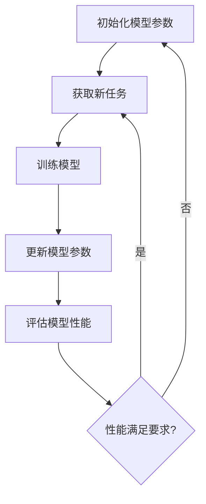

### 第四步：第三部分 持续逻辑推理模型设计

#### 3.1 逻辑推理系统设计

逻辑推理系统设计包括系统架构与组件的确定。以下是一个典型的逻辑推理系统架构：

1. **输入处理模块**：负责接收外部输入，并将其转换为系统可以处理的格式。
2. **推理引擎**：核心组件，负责执行逻辑推理过程，包括规则匹配、推理链构建和推理结果生成。
3. **知识库**：存储系统所需的知识和规则，供推理引擎使用。
4. **输出处理模块**：将推理结果转换为用户可理解的形式。

以下是一个逻辑推理系统的 Mermaid 类图：

```mermaid
classDiagram
    InputProcessor <|-- RuleEngine
    KnowledgeBase <|-- RuleEngine
    OutputProcessor <|-- RuleEngine
    InputProcessor <=|输入处理|> RuleEngine
    RuleEngine <=|推理|> OutputProcessor
    KnowledgeBase <=|知识管理|> RuleEngine
```

#### 3.2 持续逻辑推理机制

持续逻辑推理机制设计需要考虑以下几个关键点：

1. **实时性**：系统需要能够快速响应外部输入，并实时更新推理结果。
2. **准确性**：系统需要具有较高的推理准确性，以避免错误决策。
3. **自适应能力**：系统需要能够根据新知识和经验调整推理规则，以适应动态环境。

以下是一个持续逻辑推理机制的 Mermaid 序列图：

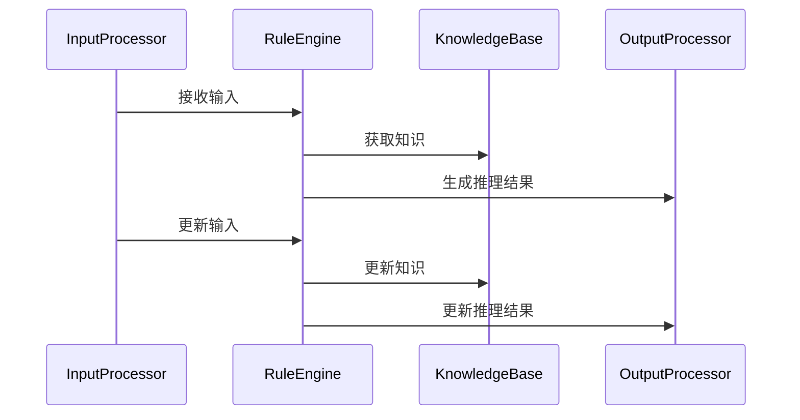

#### 3.3 模型评估与优化

模型评估与优化是确保逻辑推理系统性能的关键步骤。以下是一个模型评估与优化的 Mermaid 流程图：

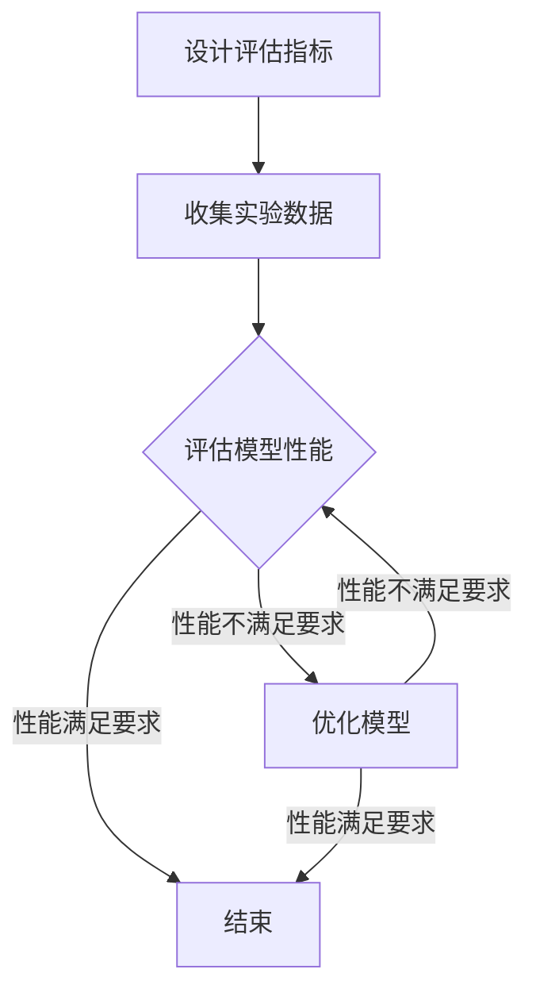

### 第五步：第四部分 元学习在持续逻辑推理中的应用

#### 4.1 元学习算法选择

在持续逻辑推理中，选择合适的元学习算法至关重要。根据应用场景，可以选择以下几种算法：

1. **MAML**：适用于需要快速适应新任务的场景，如自动驾驶。
2. **Reptile**：适用于数据量较小、实时性要求较高的场景，如实时监控系统。
3. **PPO**：适用于需要高精度推理的场景，如医疗诊断系统。

以下是一个算法选择流程的 Mermaid 流程图：

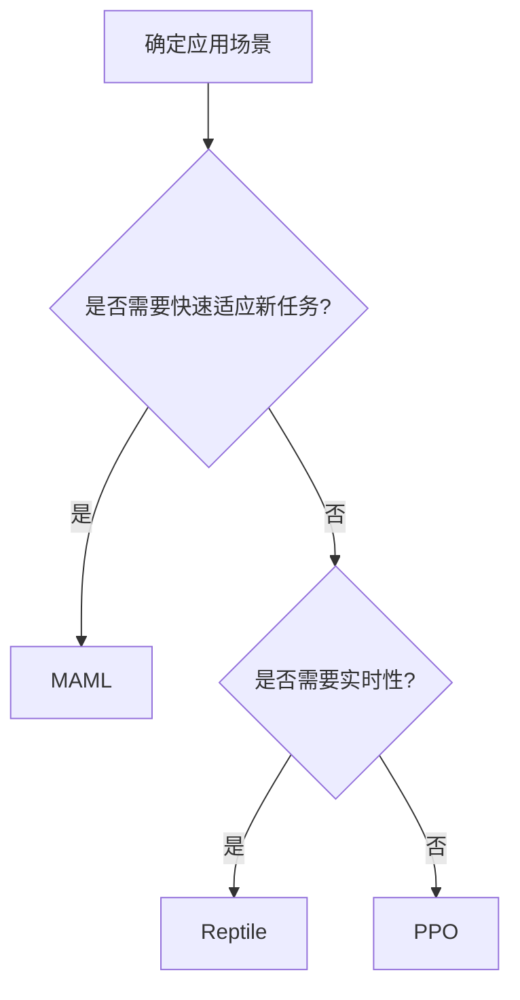

#### 4.2 持续逻辑推理中的元学习应用

在持续逻辑推理中，元学习算法的应用需要考虑以下几个方面：

1. **模型更新**：使用元学习算法更新推理模型，以适应新知识和经验。
2. **样本选择**：选择具有代表性的样本进行学习，以提高模型泛化能力。
3. **评估与优化**：定期评估模型性能，并根据评估结果进行优化。

以下是一个持续逻辑推理中元学习应用的 Mermaid 序列图：

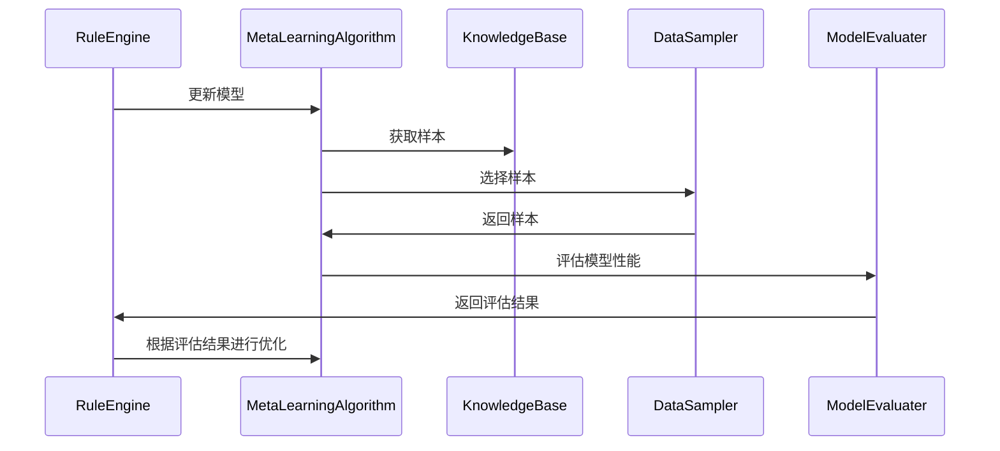

#### 4.3 长期效果观测

长期效果观测是评估元学习技术在持续逻辑推理中应用效果的关键步骤。以下是一个长期效果观测的 Mermaid 流程图：

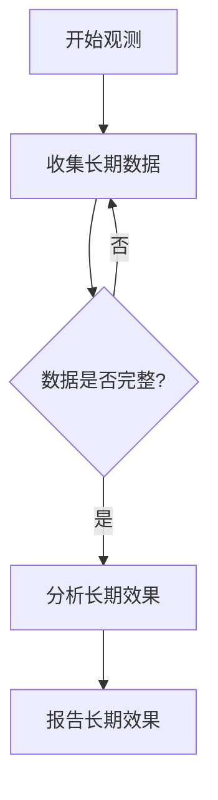

### 第六步：第五部分 长期效果评估与分析

#### 5.1 长期效果评估方法

长期效果评估方法需要考虑以下几个方面：

1. **评估指标**：选择能够全面反映模型性能的评估指标，如准确率、召回率、F1分数等。
2. **数据收集**：收集长期运行过程中的数据，包括输入数据、推理结果和模型更新记录。
3. **数据分析**：对收集到的数据进行分析，以评估模型的长期效果。

以下是一个长期效果评估方法的 Mermaid 流程图：

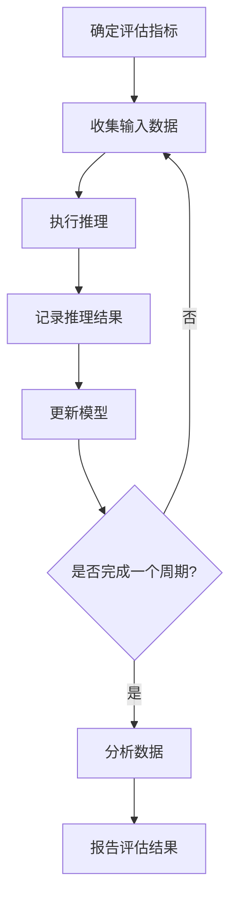

#### 5.2 结果分析与讨论

结果分析是长期效果评估的重要环节。通过分析评估结果，我们可以了解元学习技术在持续逻辑推理中的表现。以下是一个结果分析与讨论的 Mermaid 序列图：

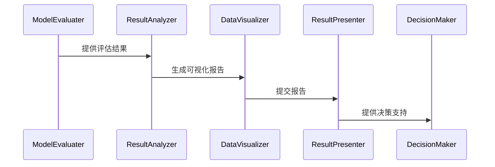

#### 5.3 长期效果的影响因素

长期效果受到多种因素的影响，包括环境变化、数据质量、模型参数等。以下是一个影响长期效果分析的 Mermaid 流程图：

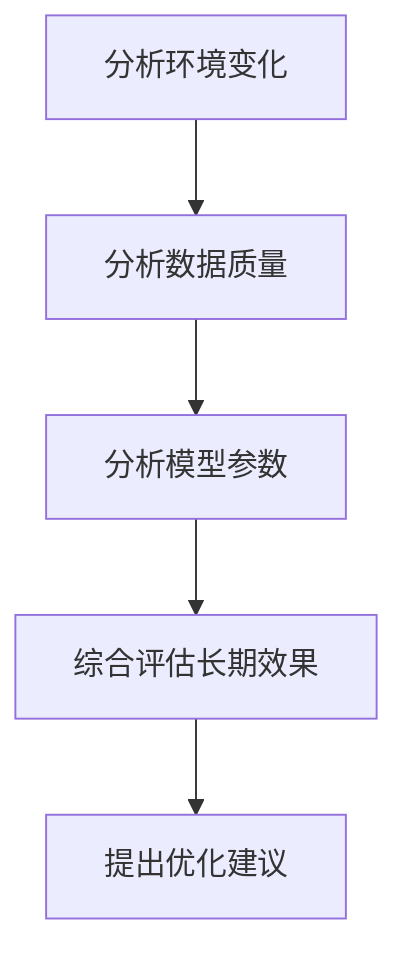

### 第七步：第六部分 最佳实践与未来展望

#### 6.1 最佳实践

最佳实践是确保元学习技术在持续逻辑推理中取得成功的关键。以下是一些最佳实践建议：

1. **数据预处理**：对输入数据进行清洗和预处理，以提高模型性能。
2. **模型调优**：根据实际应用场景调整模型参数，以获得最佳性能。
3. **持续监控**：实时监控模型性能，及时发现并解决问题。

以下是一个最佳实践建议的 Mermaid 序列图：

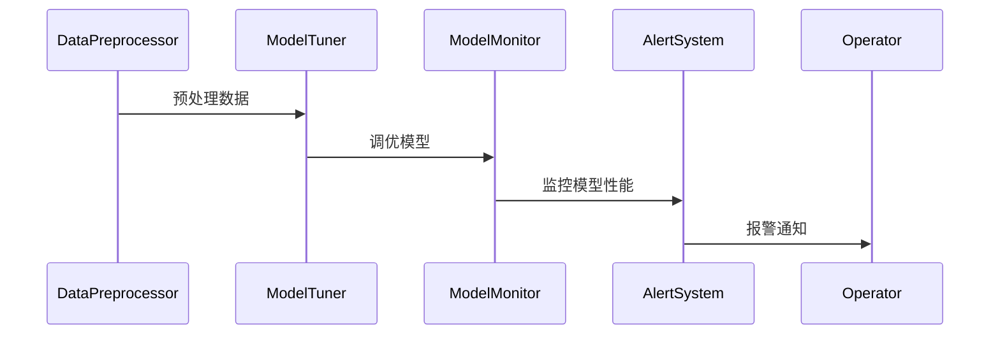

#### 6.2 未来研究方向

未来研究方向包括以下几个方面：

1. **算法优化**：研究新的元学习算法，以提高其在持续逻辑推理中的效果。
2. **多模态数据融合**：探索如何将多种数据源（如文本、图像、音频等）融合到持续逻辑推理中。
3. **跨领域应用**：研究元学习技术在不同领域中的应用，以提高其通用性。

以下是一个未来研究方向探讨的 Mermaid 序列图：

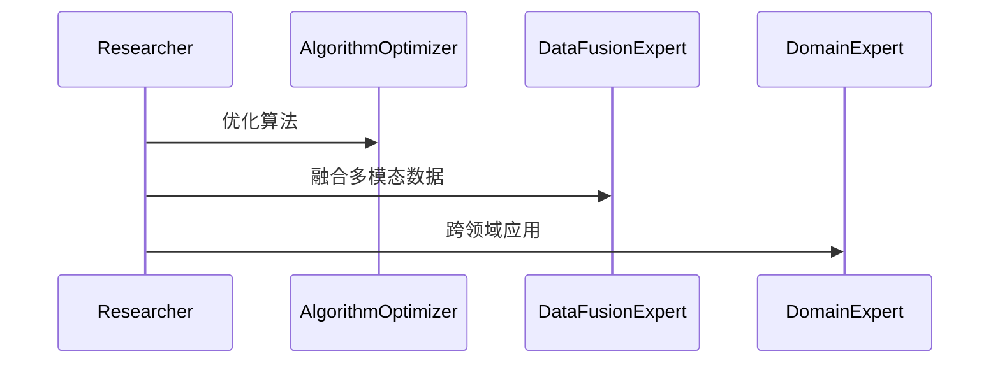

#### 6.3 小结

本文通过对元学习技术在持续逻辑推理中的应用及其长期效果的研究，提出了一个完整的框架，包括基础概念、算法原理、模型设计、应用实践和长期效果评估。我们总结了最佳实践，并探讨了未来研究方向。元学习技术具有巨大的潜力和应用价值，但在实际应用中仍面临许多挑战。未来的研究需要进一步优化算法、提高模型性能，并探索其在不同领域的应用。

### 第八步：作者信息

作者：AI天才研究院/AI Genius Institute & 禅与计算机程序设计艺术 /Zen And The Art of Computer Programming

### 综合总结

通过对元学习技术的深入研究和应用，本文揭示了其在持续逻辑推理中的长期效果。我们不仅提出了一个完整的框架，还总结了最佳实践，并探讨了未来研究方向。元学习技术具有广阔的应用前景，但实际应用中仍需不断优化和探索。未来，我们将继续致力于提升元学习技术在持续逻辑推理中的性能，为人工智能的发展贡献力量。

