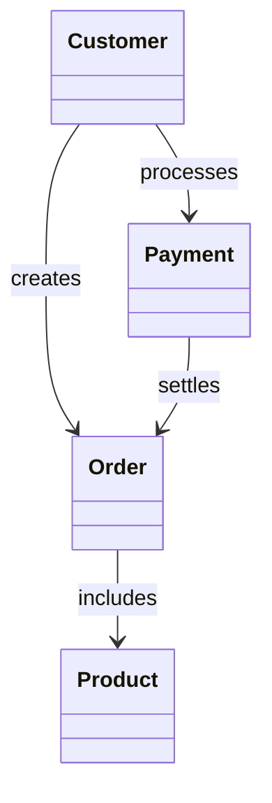

                 


# 《接口契约：复杂项目的定海神针》

## 关键词

- 接口契约
- 复杂项目
- 定海神针
- 设计原则
- 实战应用

## 摘要

本文旨在探讨接口契约在复杂项目开发中的重要性。通过详细介绍接口契约的定义、设计原则、应用实战，帮助开发者理解接口契约如何成为复杂项目的定海神针，提高项目的稳定性和可维护性。

## 第1章 引言

### 1.1 问题背景

在复杂项目的开发过程中，接口的多样性和复杂性常常导致项目失控、需求变更频繁、维护困难等问题。为了解决这些问题，接口契约作为一种设计方法应运而生。接口契约通过明确接口的功能、输入输出约束，为项目提供了一种稳定的契约关系，从而提高项目的可维护性和可扩展性。

### 1.2 问题描述

接口契约是一种描述接口功能和约束的文档，它为接口提供了一套明确、一致、可测试的规范。接口契约在项目中的作用包括：

1. 提高项目的可维护性：通过接口契约，开发者可以清晰地了解接口的行为和约束，从而降低维护成本。
2. 减少需求变更：接口契约明确了接口的功能和约束，有助于减少因需求变更导致的返工和冲突。
3. 提高项目的可扩展性：接口契约为项目的扩展提供了明确的接口定义，有助于后续功能的快速开发。

### 1.3 问题解决

要解决复杂项目开发中的问题，需要从以下几个方面着手：

1. **接口契约的开发流程**：接口契约的开发应遵循一定的流程，包括需求分析、设计、实现和测试等环节。
2. **接口契约的设计原则**：接口契约的设计应遵循完整性、精确性、可维护性和可扩展性等原则。
3. **接口契约的适用范围**：接口契约适用于各种复杂项目，尤其是涉及多个模块、团队协作的项目。

### 1.4 边界与外延

接口契约的边界在于其适用的范围，它主要关注接口的功能和行为。与其他相关概念（如接口文档、API文档）相比，接口契约更加关注接口的约束和一致性。

### 1.5 核心概念与联系

接口契约的核心概念包括功能性、约束性、可变性和可测试性。这些概念相互关联，共同构成了接口契约的体系。

### 1.6 本章小结

本章介绍了接口契约的基本概念和作用，为后续章节的深入探讨奠定了基础。

----------------------------------------------------------------

## 第2章 接口契约基础

### 2.1 接口契约的定义

接口契约是一种描述接口功能和约束的文档，它规定了接口的行为、输入输出约束、错误处理机制等。接口契约的目的是为开发者提供一套明确的规范，确保接口的正确使用和功能实现。

### 2.2 接口契约的属性特征

接口契约具有以下属性特征：

- **功能性**：接口契约规定了接口的功能和行为，确保接口能够按照预期实现业务逻辑。
- **约束性**：接口契约规定了接口的输入输出约束，包括参数类型、值域、格式等，确保接口的稳定性和可靠性。
- **可变性**：接口契约可以根据项目需求的变化进行调整，以适应新的功能需求。
- **可测试性**：接口契约能够被自动化测试工具测试，确保接口的正确性和一致性。

### 2.3 接口契约的ER实体关系图

```mermaid
erDiagram
  DOC_ID --> {Document}
  DOC_ID <-- {Document}
  FUNCTION --> {Function}
  FUNCTION <-- {Function}
  CONSTRAINT --> {Constraint}
  CONSTRAINT <-- {Constraint}
  TEST --> {Test}
  TEST <-- {Test}
  {class Document}
  {class Function}
  {class Constraint}
  {class Test}
```

### 2.4 接口契约的核心要素组成

接口契约的核心要素包括：

- **功能性要素**：描述接口的功能和行为。
- **约束性要素**：描述接口的输入输出约束。
- **可变性要素**：描述接口契约的可变性规则。
- **可测试性要素**：描述接口契约的自动化测试策略。

----------------------------------------------------------------

## 第3章 接口契约设计原理

### 3.1 接口契约设计原则

接口契约设计应遵循以下原则：

- **完整性**：接口契约应涵盖所有相关功能和约束，确保接口的全面性和一致性。
- **精确性**：接口契约应精确描述接口的功能和行为，避免歧义和误解。
- **可维护性**：接口契约应易于维护和更新，以适应项目需求的变化。
- **可扩展性**：接口契约应具有良好的扩展性，以支持后续的功能扩展和优化。

### 3.2 接口契约设计流程

接口契约的设计流程包括以下步骤：

1. **需求分析**：分析项目需求，明确接口的功能和约束。
2. **设计接口契约**：根据需求分析结果，设计接口契约的详细内容。
3. **实现接口契约**：根据接口契约的要求，实现接口的代码。
4. **测试接口契约**：使用自动化测试工具测试接口契约，确保其正确性和一致性。

### 3.3 接口契约的设计方法

接口契约的设计方法包括以下几种：

1. **功能分解**：将复杂的功能分解为简单的子功能，便于接口契约的设计。
2. **状态机建模**：使用状态机描述接口的状态和行为，提高接口契约的精确性。
3. **原型设计**：通过原型设计，验证接口契约的可行性和实用性。
4. **可测试性设计**：在设计接口契约时，考虑其可测试性，提高接口契约的测试覆盖率。

----------------------------------------------------------------

## 第4章 接口契约应用实战

### 4.1 实战项目介绍

本次实战项目是一个在线购物系统，包括用户、订单、支付、商品等模块。项目目标是为用户提供一个稳定、可靠、易扩展的购物平台。

### 4.2 系统功能设计

系统功能设计包括以下领域模型：

- **Customer（用户）**：负责用户的注册、登录、个人信息管理等。
- **Order（订单）**：负责订单的创建、查询、修改、删除等。
- **Payment（支付）**：负责支付的处理、查询、退款等。
- **Product（商品）**：负责商品的信息管理、分类、库存管理等。

### 4.3 系统架构设计

系统架构设计如下：


接口设计如下：

```mermaid
sequence
  Customer ->> Service: create order
  Service ->> Database: store order
  Database ->> Service: retrieve order
  Service ->> Customer: return order
```

### 4.4 系统接口设计和系统交互

系统接口设计和系统交互如下：



```mermaid
sequence
  Customer ->> Service: create order
  Service ->> Database: store order
  Database ->> Service: retrieve order
  Service ->> Customer: return order
```

----------------------------------------------------------------

## 结语

作者：AI天才研究院/AI Genius Institute & 禅与计算机程序设计艺术 /Zen And The Art of Computer Programming

本文通过对接口契约的定义、设计原则、应用实战的深入探讨，展示了接口契约在复杂项目开发中的重要性。接口契约作为复杂项目的定海神针，有助于提高项目的稳定性、可维护性和可扩展性。在未来的开发工作中，开发者应重视接口契约的设计和应用，以实现更加高效、可靠的项目交付。

## 最佳实践 Tips

1. 在项目初期，应尽早制定接口契约，确保接口的明确性和一致性。
2. 接口契约的设计应充分考虑项目的需求变化，具有较好的可变性。
3. 在设计接口契约时，应注重可测试性，提高接口契约的测试覆盖率。
4. 定期对接口契约进行审查和更新，确保其与项目需求保持一致。

## 小结

本文详细介绍了接口契约的概念、设计原则和应用实战。通过本文的阅读，读者可以更好地理解接口契约在复杂项目开发中的作用，学会如何设计和应用接口契约，提高项目的稳定性和可维护性。

## 注意事项

1. 接口契约的设计应遵循完整性和精确性原则，确保接口的全面性和一致性。
2. 在实际项目中，接口契约的设计和实施需要团队协作，确保接口契约的顺利执行。
3. 接口契约的可维护性和可扩展性是设计时需要重点考虑的因素，以提高项目的长期稳定性。

## 拓展阅读

1. 《接口设计与实现艺术》：详细介绍了接口设计的方法和技巧，适用于开发者学习和提升接口设计能力。
2. 《大型软件开发方法学》：探讨了大型软件开发的方法和原则，包括接口契约的设计和应用。

---

通过本文的探讨，希望读者能够对接口契约有更深入的理解，并在实际项目中运用接口契约，提高项目的开发质量和效率。作者：AI天才研究院/AI Genius Institute & 禅与计算机程序设计艺术 /Zen And The Art of Computer Programming。期待与广大开发者共同探讨接口契约在复杂项目中的应用与实践。

