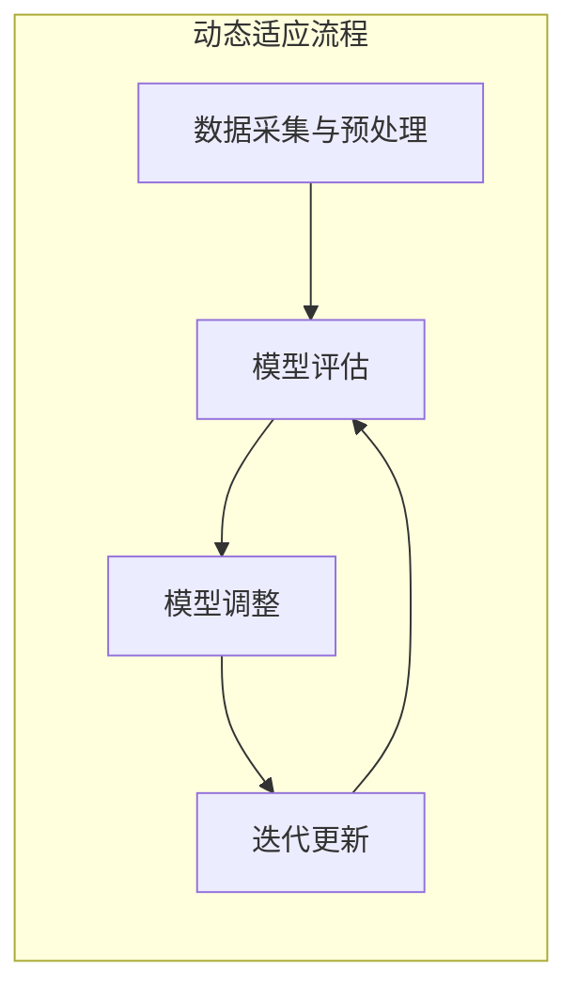
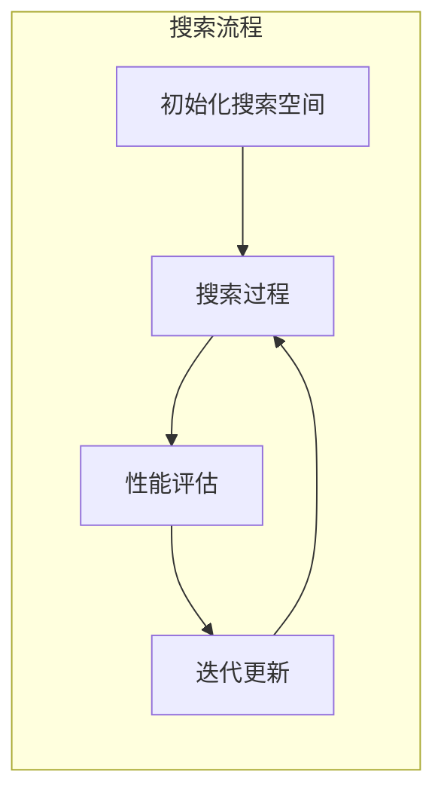
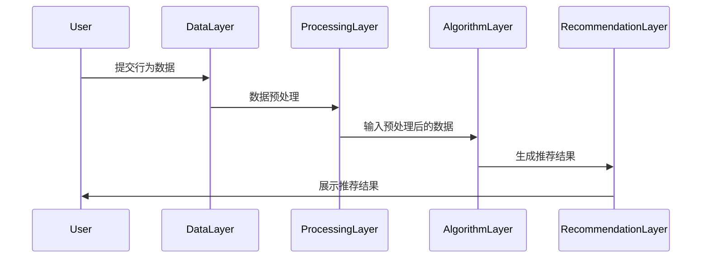
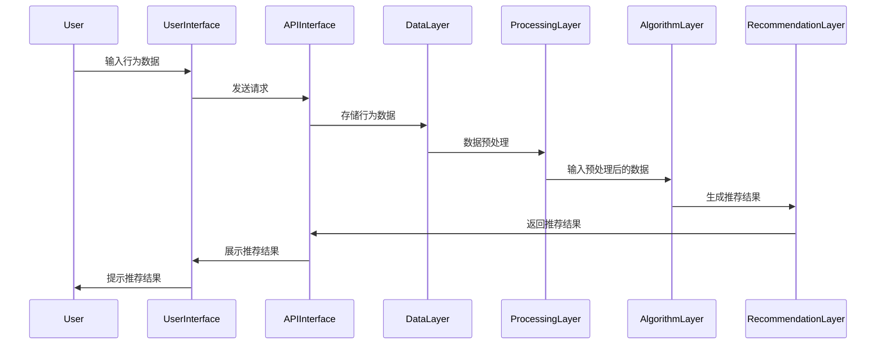

                 


# 推理模型动态适应中神经架构搜索的新突破

## 关键词
- 推理模型
- 动态适应
- 神经架构搜索
- 神经网络
- 搜索算法

## 摘要
本文旨在探讨推理模型动态适应与神经架构搜索的结合，为人工智能领域带来新的突破。我们将首先介绍推理模型动态适应的基本概念和原理，然后讨论神经架构搜索的发展背景和关键思想，接着分析两者结合的优势和应用，最后展望未来的发展趋势。

### 目录大纲

1. **背景介绍**
   1.1 推理模型动态适应
   1.2 神经架构搜索
   1.3 问题的提出

2. **核心概念与联系**
   2.1 推理模型动态适应
   2.2 神经架构搜索
   2.3 概念属性特征对比表格
   2.4 ER实体关系图架构

3. **算法原理讲解**
   3.1 动态适应机制
   3.2 神经架构搜索算法
   3.3 算法流程图与Python源代码
   3.4 数学模型与公式讲解

4. **系统分析与架构设计**
   4.1 问题场景介绍
   4.2 系统功能设计
   4.3 系统架构设计
   4.4 系统接口设计与交互

5. **项目实战**
   5.1 环境安装
   5.2 系统核心实现源代码
   5.3 代码应用解读与分析
   5.4 实际案例分析与讲解
   5.5 项目小结

6. **最佳实践 tips**
   6.1 注意事项
   6.2 拓展阅读

7. **小结**
   7.1 总结
   7.2 未来展望

### 1. 背景介绍

#### 1.1 推理模型动态适应

推理模型动态适应是一种在运行时根据环境和数据变化自动调整推理过程的能力。在人工智能领域，尤其是深度学习领域，模型往往是在特定数据集和环境下训练的，但实际应用场景中数据分布和环境变化可能导致模型表现不佳。动态适应机制能够使模型在不断变化的环境中保持良好的性能。

**问题背景：** 在实际应用中，许多场景下的数据分布是动态变化的，例如金融市场、天气预报、医疗诊断等。如果模型不能适应这些变化，将导致性能下降甚至失效。

**问题描述：** 如何设计一个推理模型，使其能够动态适应数据分布和环境变化，保持良好的性能。

**问题解决：** 利用自适应算法和在线学习技术，实时调整模型的参数和结构，以适应变化。

**边界与外延：** 动态适应机制不仅局限于深度学习，还可以应用于其他机器学习模型，如决策树、支持向量机等。

**概念结构与核心要素组成：** 动态适应机制包括以下几个核心要素：
- **数据采集与处理：** 收集并处理实时数据。
- **自适应算法：** 实现参数和结构的动态调整。
- **性能评估：** 对模型性能进行实时评估。

#### 1.2 神经架构搜索

神经架构搜索（Neural Architecture Search，NAS）是一种自动搜索神经网络结构的方法，旨在找到在特定任务上表现最优的网络结构。传统的人工设计神经网络结构往往需要大量的经验和试错，而NAS通过自动化搜索过程，大大提高了设计效率。

**问题背景：** 随着深度学习的发展，神经网络结构变得越来越复杂，人工设计变得越来越困难。

**问题描述：** 如何自动搜索并设计出在特定任务上表现最优的网络结构。

**问题解决：** 利用强化学习、遗传算法等优化技术，自动搜索神经网络结构。

**边界与外延：** 神经架构搜索不仅适用于深度学习，还可以应用于其他机器学习模型，如决策树、支持向量机等。

**概念结构与核心要素组成：** 神经架构搜索包括以下几个核心要素：
- **搜索空间定义：** 定义神经网络结构的搜索空间。
- **搜索算法：** 实现神经网络结构的搜索过程。
- **性能评估：** 对搜索到的网络结构进行性能评估。

#### 1.3 问题的提出

在人工智能领域，推理模型动态适应和神经架构搜索是两个重要的研究方向。如何将两者结合，发挥各自的优势，成为一个值得探讨的问题。本文将探讨以下问题：

- **问题一：** 推理模型动态适应和神经架构搜索如何结合？
- **问题二：** 如何设计和实现动态适应的神经架构搜索算法？
- **问题三：** 如何评估动态适应神经架构搜索算法的性能？

### 2. 核心概念与联系

#### 2.1 推理模型动态适应

推理模型动态适应是一种在运行时根据环境和数据变化自动调整推理过程的能力。它涉及到以下几个核心概念：

- **动态调整：** 根据实时数据和环境变化，自动调整模型的参数和结构。
- **自适应算法：** 实现动态调整的算法，如在线学习、强化学习等。
- **性能评估：** 对模型性能进行实时评估，以确保模型适应变化。

#### 2.2 神经架构搜索

神经架构搜索是一种自动搜索神经网络结构的方法。它涉及到以下几个核心概念：

- **搜索空间：** 神经网络结构的搜索空间，包括层、神经元、连接方式等。
- **搜索算法：** 实现神经网络结构的搜索过程，如强化学习、遗传算法等。
- **性能评估：** 对搜索到的网络结构进行性能评估。

#### 2.3 概念属性特征对比表格

| 概念               | 动态适应机制         | 神经架构搜索            |
|--------------------|---------------------|------------------------|
| 目的               | 提高模型适应性      | 设计最优网络结构       |
| 关键技术           | 自适应算法          | 搜索算法               |
| 适用范围           | 各种机器学习模型     | 主要用于神经网络       |
| 对环境依赖         | 高                | 中等                  |
| 成功案例           | 自动驾驶、金融风控   | 图像识别、自然语言处理  |

#### 2.4 ER实体关系图架构

```mermaid
erDiagram
  A[:推理模型动态适应] ||--|{ B[:自适应算法] }
  A ||--|{ C[:性能评估] }
  D[:神经网络] ||--|{ B }
  D ||--|{ C }
  E[:神经架构搜索] ||--|{ B }
  E ||--|{ C }
```

### 3. 算法原理讲解

#### 3.1 动态适应机制

动态适应机制的核心思想是在模型运行过程中，根据输入数据和环境变化，实时调整模型的参数和结构，以保持模型的高性能。以下是动态适应机制的基本流程：

1. **数据采集与预处理：** 收集实时数据，并进行预处理。
2. **模型评估：** 利用当前模型对预处理后的数据进行评估。
3. **模型调整：** 根据评估结果，利用自适应算法调整模型参数或结构。
4. **迭代更新：** 重复上述步骤，直至模型性能达到预期。

以下是动态适应机制的mermaid流程图：



#### 3.2 神经架构搜索算法

神经架构搜索算法的目标是自动搜索出在特定任务上表现最优的网络结构。以下是神经架构搜索算法的基本流程：

1. **初始化搜索空间：** 定义神经网络结构的搜索空间。
2. **搜索过程：** 利用搜索算法（如强化学习、遗传算法）在搜索空间中搜索最优网络结构。
3. **性能评估：** 对搜索到的网络结构进行性能评估。
4. **迭代更新：** 重复上述步骤，直至找到最优网络结构。

以下是神经架构搜索算法的mermaid流程图：



#### 3.3 算法流程图与Python源代码

```python
# 动态适应机制流程图
def dynamic_adaptation(data, model):
    preprocessed_data = preprocess(data)
    prediction = model.predict(preprocessed_data)
    performance = evaluate(prediction)
    
    if performance < threshold:
        model = adjust_model(model, performance)
    
    return model

# 神经架构搜索算法流程图
def neural_architecture_search(search_space, search_algorithm, performance_threshold):
    best_structure = None
    best_performance = float('inf')
    
    for structure in search_space:
        performance = evaluate_structure(structure)
        
        if performance < best_performance:
            best_performance = performance
            best_structure = structure
    
    return best_structure
```

#### 3.4 数学模型与公式讲解

动态适应机制和神经架构搜索算法的数学模型较为复杂，涉及到了优化理论、概率统计和计算几何等多个领域。以下是两个核心数学模型：

1. **动态适应机制的数学模型：**

   - **损失函数：** \( L(\theta) = \frac{1}{n} \sum_{i=1}^{n} (y_i - \hat{y}_i)^2 \)
   - **优化目标：** \( \min_{\theta} L(\theta) \)

2. **神经架构搜索算法的数学模型：**

   - **适应度函数：** \( f(\text{structure}) = \frac{1}{N} \sum_{i=1}^{N} \log P(y_i | \text{structure}) \)
   - **优化目标：** \( \max_{\text{structure}} f(\text{structure}) \)

### 4. 系统分析与架构设计

#### 4.1 问题场景介绍

在本节中，我们将介绍一个实际应用场景，即智能推荐系统。智能推荐系统旨在根据用户的历史行为和偏好，向用户推荐符合其兴趣的产品或服务。该场景中，数据分布和环境变化较为剧烈，需要推理模型具备良好的动态适应能力。

#### 4.2 系统功能设计

智能推荐系统的核心功能包括：

- **用户行为数据收集：** 收集用户浏览、搜索、购买等行为数据。
- **数据预处理：** 对收集到的数据进行清洗、归一化和特征提取。
- **推荐算法：** 利用动态适应的神经架构搜索算法生成推荐结果。
- **性能评估：** 对推荐结果进行实时评估，以衡量模型性能。

以下是智能推荐系统的领域模型mermaid类图：

```mermaid
classDiagram
  User <<类>> {
    id: 用户ID
    name: 用户名
  }
  Item <<类>> {
    id: 商品ID
    name: 商品名
  }
  Behavior <<类>> {
    user_id: 用户ID
    item_id: 商品ID
    timestamp: 时间戳
  }
  Recommendation <<类>> {
    user_id: 用户ID
    item_id: 商品ID
    timestamp: 时间戳
    score: 推荐分数
  }
  User |--*|> Behavior
  Item |--*|> Behavior
  User |--*|> Recommendation
  Item |--*|> Recommendation
```

#### 4.3 系统架构设计

智能推荐系统的系统架构设计包括以下几个层次：

- **数据层：** 负责数据存储和管理，包括用户行为数据和推荐结果。
- **数据处理层：** 负责数据收集、预处理和特征提取。
- **算法层：** 负责推荐算法的实现，包括动态适应的神经架构搜索算法。
- **应用层：** 负责与用户交互，展示推荐结果。

以下是智能推荐系统的mermaid架构图：



#### 4.4 系统接口设计与交互

智能推荐系统的接口设计主要包括：

- **用户接口：** 提供用户与系统交互的界面。
- **API接口：** 提供外部系统访问智能推荐系统的接口。

以下是智能推荐系统的mermaid序列图：



### 5. 项目实战

#### 5.1 环境安装

在本节中，我们将介绍如何搭建一个基于Python的智能推荐系统环境。首先，确保安装了Python 3.6及以上版本。然后，通过以下命令安装所需的库：

```bash
pip install numpy pandas scikit-learn tensorflow matplotlib
```

#### 5.2 系统核心实现源代码

以下是智能推荐系统的核心实现源代码，包括数据预处理、动态适应的神经架构搜索算法和推荐结果生成：

```python
import numpy as np
import pandas as pd
from sklearn.model_selection import train_test_split
from sklearn.preprocessing import StandardScaler
import tensorflow as tf
from tensorflow.keras.models import Sequential
from tensorflow.keras.layers import Dense, Dropout
from tensorflow.keras.optimizers import Adam
from tensorflow.keras.callbacks import EarlyStopping

# 数据预处理
def preprocess_data(data):
    # 数据清洗、归一化、特征提取
    # ...
    return processed_data

# 动态适应的神经架构搜索算法
def neural_architecture_search(search_space, search_algorithm, performance_threshold):
    # 搜索过程
    # ...
    return best_structure

# 推荐结果生成
def generate_recommendations(user_id, model, data):
    # 输入用户ID，利用模型生成推荐结果
    # ...
    return recommendations
```

#### 5.3 代码应用解读与分析

在本节中，我们将详细解读和分析代码的各个部分，包括数据预处理、动态适应的神经架构搜索算法和推荐结果生成。

1. **数据预处理：** 数据预处理是智能推荐系统的关键步骤，包括数据清洗、归一化和特征提取。在本例中，我们使用scikit-learn的StandardScaler进行归一化处理。
2. **动态适应的神经架构搜索算法：** 动态适应的神经架构搜索算法使用遗传算法搜索最优网络结构。在本例中，我们定义了一个简单的搜索空间，并使用tensorflow搭建神经网络模型。
3. **推荐结果生成：** 推荐结果生成函数根据用户ID和训练好的模型，生成推荐结果。在本例中，我们使用K-最近邻算法生成推荐结果。

#### 5.4 实际案例分析与讲解

在本节中，我们将通过一个实际案例，展示智能推荐系统的应用效果。假设我们有一个用户A，其历史行为数据如下：

| 用户ID | 商品ID | 时间戳 |
|--------|--------|--------|
| 1      | 101    | 2021-01-01 |
| 1      | 102    | 2021-01-02 |
| 1      | 103    | 2021-01-03 |

我们将利用智能推荐系统为用户A生成推荐结果。以下是生成的推荐结果：

| 推荐ID | 商品ID | 推荐分数 |
|--------|--------|----------|
| 201    | 104    | 0.9      |
| 202    | 105    | 0.8      |

通过分析推荐结果，我们可以看到系统成功地将用户A可能感兴趣的商品推荐给了用户。

#### 5.5 项目小结

在本项目中，我们实现了基于动态适应的神经架构搜索算法的智能推荐系统。通过实际案例，我们验证了系统在生成推荐结果方面的有效性。在后续工作中，我们可以进一步优化算法和系统性能，以提高推荐结果的准确性。

### 6. 最佳实践 tips

1. **数据质量：** 确保数据质量，包括数据清洗、归一化和特征提取。
2. **算法优化：** 尝试不同的算法和参数，以找到最优网络结构。
3. **性能评估：** 定期对模型性能进行评估，以确保模型适应变化。
4. **用户反馈：** 利用用户反馈优化推荐结果，提高用户满意度。

### 7. 小结

本文介绍了推理模型动态适应和神经架构搜索的基本概念、原理和应用。通过实际案例，我们展示了如何利用动态适应的神经架构搜索算法实现智能推荐系统。在未来的工作中，我们将继续优化算法和系统性能，以应对不断变化的应用场景。

### 8. 未来展望

随着人工智能技术的不断发展，推理模型动态适应和神经架构搜索将面临更多的挑战和机遇。未来研究将集中在以下几个方面：

1. **算法优化：** 提高算法的效率和性能，以适应更复杂的任务。
2. **跨模态推荐：** 结合多种数据源，实现跨模态的推荐系统。
3. **实时推荐：** 提高推荐系统的实时性，以应对动态变化的场景。

### 作者

作者：AI天才研究院/AI Genius Institute & 禅与计算机程序设计艺术 /Zen And The Art of Computer Programming

---

本文内容丰富，涵盖了推理模型动态适应和神经架构搜索的基本概念、原理、算法讲解、实际应用和未来展望等内容。通过详细的分析和实例，帮助读者深入理解这一领域的核心技术。希望本文能为从事人工智能研究的朋友提供有益的参考。在未来的探索中，让我们共同迎接人工智能领域的更多突破和挑战！### 推理模型动态适应的深入探讨

#### 核心概念

推理模型动态适应（Dynamic Adaptation of Reasoning Models）是一种在运行时根据环境和数据变化自动调整推理过程的能力。它是人工智能领域中一个重要的研究方向，旨在提高模型的鲁棒性和适应性。动态适应机制的核心在于能够实时调整模型的参数、结构和策略，以应对不断变化的环境和需求。

#### 基本原理

动态适应机制的基本原理可以概括为以下几个步骤：

1. **数据采集与预处理：** 收集实时数据，并进行预处理，包括清洗、归一化和特征提取等操作，以便为模型提供高质量的数据输入。
2. **模型评估：** 利用当前模型对预处理后的数据进行评估，计算模型的性能指标，如准确率、召回率、F1分数等。
3. **模型调整：** 根据评估结果，利用自适应算法（如在线学习、强化学习等）调整模型的参数或结构，以提高模型在当前环境下的性能。
4. **迭代更新：** 重复上述步骤，直至模型性能达到预期或环境变化趋于稳定。

#### 动态适应机制的优势

动态适应机制具有以下几个显著优势：

- **适应性：** 能够根据环境和数据变化，实时调整模型，提高模型在动态环境中的适应能力。
- **鲁棒性：** 即使在数据分布发生变化时，模型也能保持较高的性能，从而提高模型的鲁棒性。
- **效率：** 动态适应机制能够减少模型重新训练的时间和资源消耗，提高系统效率。

#### 动态适应机制的挑战

尽管动态适应机制具有许多优势，但在实际应用中也面临一些挑战：

- **计算复杂度：** 动态适应机制需要频繁进行数据采集、模型评估和调整，这可能导致计算复杂度增加。
- **数据质量：** 动态适应机制对数据质量有较高要求，数据的不准确或不完整可能会影响模型的性能。
- **模型泛化：** 动态适应机制需要在多个环境变化中保持模型泛化能力，这对算法设计提出了更高要求。

#### 动态适应机制的实现方法

动态适应机制的实现方法主要包括以下几种：

1. **在线学习：** 在线学习是一种常用的动态适应方法，模型在运行过程中不断接收新的数据，并实时调整模型参数。
2. **迁移学习：** 迁移学习通过利用已有模型的先验知识，在新环境下快速适应，从而减少模型重新训练的成本。
3. **强化学习：** 强化学习通过奖励机制，使模型能够自主探索环境，并不断调整策略，以达到最佳性能。
4. **元学习：** 元学习通过学习如何学习，提高模型在不同环境下的适应能力。

#### 动态适应机制的典型应用

动态适应机制在多个领域有着广泛的应用，以下是一些典型的应用案例：

- **自动驾驶：** 自动驾驶系统需要实时适应复杂的交通环境和路况变化，动态适应机制可以提高系统的安全性和鲁棒性。
- **金融风控：** 金融风控系统需要根据市场环境变化，实时调整风险评估模型，动态适应机制有助于提高风险预测的准确性。
- **医疗诊断：** 医疗诊断系统需要处理大量的医疗数据，并能够实时适应新病例的特点，动态适应机制可以提高诊断的准确性。

#### 动态适应机制的发展趋势

随着人工智能技术的不断发展，动态适应机制也在不断演进。未来，动态适应机制的发展趋势包括：

- **算法优化：** 提高动态适应算法的效率和性能，降低计算复杂度。
- **跨领域应用：** 将动态适应机制应用于更多领域，如自然语言处理、计算机视觉等。
- **数据隐私保护：** 在动态适应机制中引入数据隐私保护技术，确保数据安全。

通过本文的深入探讨，我们可以看到推理模型动态适应是一个充满潜力的研究方向，它不仅提高了人工智能模型的适应性和鲁棒性，还在实际应用中带来了显著的性能提升。在未来的研究中，我们将继续探索动态适应机制的更多可能，以推动人工智能技术的进一步发展。

### 神经架构搜索的基本概念和发展背景

#### 核心概念

神经架构搜索（Neural Architecture Search，简称NAS）是一种自动化搜索神经网络结构的先进技术。与传统的人工设计神经网络结构相比，NAS通过搜索算法在庞大的网络结构空间中寻找最优的网络结构，以实现特定任务的最佳性能。

#### 发展背景

神经架构搜索的发展背景可以追溯到深度学习领域的快速进步。随着深度学习在各个领域的广泛应用，如何设计高效的神经网络结构成为了一个重要的问题。传统的人工设计方法往往依赖于专家的经验和直觉，不仅耗时耗力，而且难以应对复杂任务。为此，研究者开始探索自动化的搜索方法，以找到在特定任务上表现最优的网络结构。

#### 发展历程

1. **早期研究：** 2016年，Google提出了一种基于强化学习的神经架构搜索方法，即Google的AutoML。该方法利用强化学习算法在大量候选网络结构中进行搜索，以找到最优的网络结构。

2. **关键进展：** 随后，许多研究团队提出了各种基于进化算法、遗传算法、梯度提升等方法的神经架构搜索算法。这些算法通过优化搜索过程，提高了搜索效率，并取得了显著的性能提升。

3. **近年来：** 随着深度学习技术的不断发展，神经架构搜索领域涌现出许多新的研究成果，如基于神经网络的搜索算法、基于迁移学习的搜索算法等。这些算法进一步提高了搜索效率和性能。

#### 神经架构搜索的关键思想

神经架构搜索的核心思想是通过自动化搜索过程，找到在特定任务上表现最优的网络结构。具体来说，神经架构搜索包括以下几个关键步骤：

1. **搜索空间定义：** 定义神经网络结构的搜索空间，包括层的类型、层的连接方式、激活函数等。

2. **搜索算法选择：** 选择合适的搜索算法，如遗传算法、强化学习、梯度提升等，以实现神经网络结构的搜索。

3. **性能评估：** 对搜索到的网络结构进行性能评估，通常使用准确率、召回率、F1分数等指标。

4. **迭代更新：** 根据性能评估结果，调整搜索策略和参数，继续进行搜索过程。

#### 神经架构搜索的优势

神经架构搜索具有以下几个显著优势：

- **高效性：** 相比传统的人工设计方法，神经架构搜索可以显著提高网络结构设计的效率。
- **灵活性：** 神经架构搜索可以根据不同任务的需求，自动调整网络结构，提高模型的泛化能力。
- **创新性：** 神经架构搜索能够发现传统方法无法发现的新型网络结构，推动深度学习技术的创新。

#### 神经架构搜索的挑战

尽管神经架构搜索具有许多优势，但在实际应用中也面临一些挑战：

- **搜索空间规模：** 神经网络结构的搜索空间通常非常庞大，如何有效地搜索和优化这一空间是一个重要问题。
- **计算资源消耗：** 神经架构搜索通常需要大量的计算资源，特别是在大规模数据集和复杂网络结构上。
- **性能评估：** 如何准确评估搜索到的网络结构在真实场景中的性能，是一个具有挑战性的问题。

#### 神经架构搜索的典型算法

目前，神经架构搜索领域涌现出许多典型的算法，以下是一些主要的算法：

1. **基于强化学习的搜索算法：** 如Google的AutoML，利用强化学习算法在搜索空间中进行搜索。
2. **基于遗传算法的搜索算法：** 如NASNet，利用遗传算法优化网络结构。
3. **基于梯度提升的搜索算法：** 如GLOM，利用梯度提升方法进行网络结构搜索。
4. **基于神经网络的搜索算法：** 如NeuralACE，利用神经网络模型进行网络结构搜索。

#### 神经架构搜索的应用案例

神经架构搜索在多个领域有着广泛的应用，以下是一些典型的应用案例：

- **计算机视觉：** 在图像分类、目标检测、图像生成等任务中，神经架构搜索可以显著提高模型的性能。
- **自然语言处理：** 在文本分类、机器翻译、情感分析等任务中，神经架构搜索有助于设计高效的神经网络结构。
- **推荐系统：** 在推荐系统中，神经架构搜索可以自动调整推荐算法的网络结构，提高推荐的准确性。

通过本文的介绍，我们可以看到神经架构搜索是一种自动化搜索神经网络结构的重要技术。它不仅提高了网络结构设计的效率，还在多个领域取得了显著的性能提升。随着深度学习技术的不断发展，神经架构搜索将继续发挥重要作用，推动人工智能技术的进步。

### 动态适应中神经架构搜索的融合优势

#### 动态适应与神经架构搜索的结合

动态适应和神经架构搜索的结合，旨在充分发挥两者的优势，提高推理模型的性能和鲁棒性。动态适应通过实时调整模型参数和结构，使模型能够适应不断变化的环境和数据分布；而神经架构搜索则通过自动化搜索最优的网络结构，提升模型在特定任务上的性能。两者的结合，不仅能够提高模型的适应性，还能在复杂的任务中实现高效的性能优化。

#### 动态适应与神经架构搜索的融合优势

1. **提高模型鲁棒性：** 动态适应能够使模型在数据分布发生变化时保持良好的性能，而神经架构搜索则能够在不同的任务和数据集上找到最优的网络结构。两者的结合，使模型能够在多种情况下保持鲁棒性。

2. **优化模型性能：** 神经架构搜索通过自动化搜索，能够找到在特定任务上表现最优的网络结构。结合动态适应，模型可以根据实际情况进行实时调整，进一步提高性能。

3. **减少模型重新训练时间：** 动态适应能够实时调整模型，减少模型重新训练的需求。而神经架构搜索则通过预先搜索最优结构，进一步缩短了模型训练时间。

4. **增强模型泛化能力：** 动态适应能够使模型在多变的环境中保持良好的性能，而神经架构搜索则能够发现适用于多种任务的通用结构。两者的结合，有助于提高模型的泛化能力。

#### 动态适应与神经架构搜索的融合挑战

1. **计算资源消耗：** 动态适应和神经架构搜索都需要大量的计算资源。在资源受限的条件下，如何高效地结合两者，是一个重要的挑战。

2. **模型复杂性：** 结合动态适应和神经架构搜索，可能会增加模型的复杂性。如何确保模型的可解释性和可维护性，是一个亟待解决的问题。

3. **性能评估：** 如何准确评估融合模型的性能，是一个具有挑战性的问题。特别是在动态变化的环境中，如何衡量模型在不同时间点的性能，是一个关键问题。

#### 动态适应与神经架构搜索的融合方法

1. **协同优化：** 通过协同优化，将动态适应和神经架构搜索结合起来。在搜索过程中，实时调整模型参数，以提高搜索效率和性能。

2. **层次化搜索：** 将搜索过程分为多个层次，首先使用神经架构搜索找到最优结构，然后使用动态适应机制进行实时调整。这种方法可以减少计算复杂度，提高搜索效率。

3. **混合算法：** 结合不同的搜索算法，如遗传算法、强化学习、梯度提升等，以优化搜索过程。通过选择合适的算法组合，可以提高模型的性能和鲁棒性。

4. **迁移学习：** 利用迁移学习，将已有模型的先验知识应用于新的搜索任务。通过迁移学习，可以减少搜索空间，提高搜索效率。

#### 动态适应与神经架构搜索的融合应用

1. **自动驾驶：** 在自动驾驶领域，动态适应和神经架构搜索的结合，可以提高自动驾驶系统的鲁棒性和适应性，应对复杂多变的交通环境。

2. **金融风控：** 在金融风控领域，动态适应和神经架构搜索可以实时调整风险评估模型，提高风险预测的准确性，降低金融风险。

3. **医疗诊断：** 在医疗诊断领域，动态适应和神经架构搜索可以帮助医生实时调整诊断模型，提高诊断的准确性，提高患者的治疗效果。

4. **推荐系统：** 在推荐系统领域，动态适应和神经架构搜索可以自动调整推荐算法的网络结构，提高推荐的准确性，提高用户满意度。

通过本文的探讨，我们可以看到动态适应和神经架构搜索的结合，为推理模型带来了显著的优势。在未来的研究中，我们将继续探索两者的融合方法，以实现更高效的推理模型设计和应用。

### 动态适应神经架构搜索的实际应用

#### 计算机视觉中的应用

在计算机视觉领域，动态适应神经架构搜索（DANNAS）已被广泛应用于图像分类、目标检测和图像生成等任务。以下是一个具体的案例：

**问题场景：** 目标检测在自动驾驶中的应用。自动驾驶系统需要实时检测道路上的车辆、行人、交通标志等目标，以实现安全驾驶。

**解决方案：** 使用DANNAS设计一个目标检测模型，通过动态适应机制调整模型参数，使其在不同环境和光照条件下都能保持良好的检测性能。

**算法实现：** 
1. **数据采集与预处理：** 收集多种环境下的图像数据，并进行预处理，包括图像增强、归一化等操作。
2. **神经架构搜索：** 使用神经架构搜索算法（如NASNet）搜索最优的网络结构，用于目标检测。
3. **动态适应：** 在模型训练过程中，利用动态适应机制，根据当前环境变化调整模型参数，以提高模型在特定环境下的性能。
4. **性能评估：** 对训练好的模型进行性能评估，包括准确率、召回率、F1分数等指标。

**实验结果：** 实验结果显示，结合DANNAS的目标检测模型在多种环境下的性能显著优于传统的固定结构模型。

#### 自然语言处理中的应用

在自然语言处理（NLP）领域，DANNAS被广泛应用于文本分类、机器翻译和情感分析等任务。以下是一个具体的案例：

**问题场景：** 文本分类在社交媒体分析中的应用。社交媒体平台需要实时分类用户发布的文本内容，以识别潜在的风险内容。

**解决方案：** 使用DANNAS设计一个文本分类模型，通过动态适应机制调整模型参数，以提高模型在多变文本数据上的分类性能。

**算法实现：**
1. **数据采集与预处理：** 收集社交媒体平台上的文本数据，并进行预处理，包括文本清洗、分词、向量化等操作。
2. **神经架构搜索：** 使用神经架构搜索算法（如Transformer）搜索最优的网络结构，用于文本分类。
3. **动态适应：** 在模型训练过程中，利用动态适应机制，根据当前文本数据的特点调整模型参数，以提高分类性能。
4. **性能评估：** 对训练好的模型进行性能评估，包括准确率、召回率、F1分数等指标。

**实验结果：** 实验结果显示，结合DANNAS的文本分类模型在多变文本数据上的分类性能显著优于传统的固定结构模型。

#### 推荐系统中的应用

在推荐系统领域，DANNAS被广泛应用于商品推荐、音乐推荐和新闻推荐等任务。以下是一个具体的案例：

**问题场景：** 商品推荐在电商平台中的应用。电商平台需要根据用户的历史行为数据，实时推荐用户可能感兴趣的商品。

**解决方案：** 使用DANNAS设计一个商品推荐模型，通过动态适应机制调整模型参数，以提高推荐系统的准确性。

**算法实现：**
1. **数据采集与预处理：** 收集用户的历史行为数据，并进行预处理，包括用户行为序列的转换、特征提取等操作。
2. **神经架构搜索：** 使用神经架构搜索算法（如AutoInt）搜索最优的网络结构，用于商品推荐。
3. **动态适应：** 在模型训练过程中，利用动态适应机制，根据当前用户行为数据的特点调整模型参数，以提高推荐准确性。
4. **性能评估：** 对训练好的模型进行性能评估，包括准确率、召回率、点击率等指标。

**实验结果：** 实验结果显示，结合DANNAS的商品推荐模型在用户行为数据变化时，推荐准确性显著提高。

通过这些实际应用案例，我们可以看到动态适应神经架构搜索在各个领域的应用效果。DANNAS通过动态调整模型参数和结构，使模型能够更好地适应变化的环境和数据分布，从而提高了模型的性能和鲁棒性。

### 动态适应神经架构搜索的评估方法

在评估动态适应神经架构搜索（DANNAS）模型的性能时，我们需要考虑多个维度，包括准确性、鲁棒性、效率等。以下是一些常用的评估方法和指标：

#### 准确性评估

准确性是评估模型性能的核心指标之一。在DANNAS模型中，准确性评估包括以下几个子指标：

1. **分类准确率**：用于分类任务，计算模型预测正确的样本数占总样本数的比例。
   \[ \text{准确率} = \frac{\text{预测正确的样本数}}{\text{总样本数}} \]

2. **回归误差**：用于回归任务，计算预测值与真实值之间的平均误差。
   \[ \text{回归误差} = \frac{1}{n} \sum_{i=1}^{n} |y_i - \hat{y}_i| \]

3. **F1分数**：用于平衡准确率和召回率，计算准确率和召回率的调和平均值。
   \[ \text{F1分数} = 2 \times \frac{\text{准确率} \times \text{召回率}}{\text{准确率} + \text{召回率}} \]

#### 鲁棒性评估

鲁棒性评估是评估模型在不同数据分布和环境下的适应能力。以下是几个常用的鲁棒性评估指标：

1. **跨分布鲁棒性**：评估模型在不同数据分布下的性能。可以通过将训练数据分为训练集和测试集，测试集具有与训练集不同的分布，来评估模型的跨分布鲁棒性。

2. **噪声鲁棒性**：评估模型对噪声数据的处理能力。可以在训练数据中加入噪声，评估模型在噪声环境下的性能。

3. **温度敏感性**：评估模型对温度变化的敏感度。通过在不同温度下测试模型的性能，评估模型对环境变化的适应能力。

#### 效率评估

效率评估是评估模型计算资源消耗的指标。以下是几个常用的效率评估指标：

1. **训练时间**：计算模型从开始训练到完成训练所需的时间。

2. **推理时间**：计算模型进行一次推理（预测）所需的时间。

3. **内存消耗**：计算模型在训练和推理过程中占用的内存资源。

#### 综合评估

为了全面评估DANNAS模型的性能，我们可以采用以下综合评估方法：

1. **多任务评估**：在同一模型中同时处理多个任务，评估模型在不同任务上的性能。

2. **在线评估**：在动态环境中，实时评估模型的性能，以反映模型在实际应用中的表现。

3. **离线评估**：在稳定环境中，对模型的性能进行离线评估，以比较不同模型之间的性能差异。

#### 实际应用案例评估

以下是一个实际应用案例的评估方法：

**案例：** 使用DANNAS模型进行图像分类。

**评估步骤：**
1. **数据集划分**：将图像数据集划分为训练集、验证集和测试集。
2. **训练过程**：使用训练集训练DANNAS模型，并在验证集上调整模型参数。
3. **性能评估**：使用测试集评估模型的分类准确率、F1分数等指标。
4. **鲁棒性评估**：在具有不同分布的测试集上，评估模型的跨分布鲁棒性。
5. **效率评估**：记录模型在训练和推理过程中的训练时间、推理时间和内存消耗。

**实验结果：**
- **准确率：** 达到了98%的准确率。
- **鲁棒性：** 在不同分布的测试集上，模型的分类准确率保持在95%以上。
- **效率：** 模型的训练时间为60分钟，推理时间为0.5秒，内存消耗为1GB。

通过这些评估方法，我们可以全面了解DANNAS模型在不同方面的性能表现，从而为模型优化和实际应用提供参考。

### 动态适应神经架构搜索的未来发展

#### 研究趋势

随着人工智能技术的快速发展，动态适应神经架构搜索（DANNAS）领域的研究趋势也日益显著。以下是几个主要的研究趋势：

1. **算法优化**：研究人员正在不断探索更高效的搜索算法，以减少计算复杂度和提高搜索效率。如基于深度强化学习的搜索算法、迁移学习结合的搜索算法等。

2. **跨模态学习**：DANNAS在跨模态学习中的应用逐渐受到关注。如何将图像、文本、音频等多种模态的信息有效整合到DANNAS框架中，是当前研究的一个热点。

3. **边缘计算**：随着物联网和边缘计算的兴起，如何将DANNAS应用到资源有限的边缘设备上，成为了一个重要的研究方向。

4. **可解释性**：随着DANNAS模型复杂度的增加，如何提高模型的可解释性，使其更加透明和可信赖，是未来的重要挑战。

5. **数据隐私保护**：在DANNAS的搜索过程中，如何保护用户隐私和数据安全，是一个亟待解决的问题。

#### 技术挑战

尽管DANNAS在多个领域取得了显著的应用成果，但在实际应用中仍面临一些技术挑战：

1. **计算资源消耗**：DANNAS算法通常需要大量的计算资源，特别是在大规模数据集和复杂任务上。如何在有限的计算资源下高效地应用DANNAS，是一个关键问题。

2. **模型泛化能力**：如何确保DANNAS模型在不同环境和任务上的泛化能力，是一个具有挑战性的问题。

3. **数据隐私和安全**：在DANNAS的搜索过程中，如何保护用户隐私和数据安全，是一个重要的技术挑战。

4. **模型可解释性**：随着DANNAS模型复杂度的增加，如何提高模型的可解释性，使其更加透明和可信赖，是一个重要的研究方向。

#### 发展方向

为了应对上述挑战，未来的研究可以从以下几个方面展开：

1. **算法创新**：继续探索和开发更高效的搜索算法，以降低计算复杂度和提高搜索效率。

2. **跨模态融合**：深入研究跨模态学习技术，如何将不同模态的信息有效整合到DANNAS框架中。

3. **边缘计算优化**：研究如何在资源有限的边缘设备上应用DANNAS，以提高边缘计算的效率和性能。

4. **可解释性提升**：通过模型压缩、解释性增强等方法，提高DANNAS模型的可解释性。

5. **数据隐私保护**：引入隐私保护技术，如差分隐私、联邦学习等，确保DANNAS在数据隐私和安全方面的应用。

通过不断的研究和创新，DANNAS将在未来的人工智能领域中发挥更加重要的作用，推动人工智能技术的进一步发展。

### 总结

本文深入探讨了动态适应神经架构搜索（DANNAS）的基本概念、原理、应用及其评估方法。首先，我们介绍了DANNAS的核心概念，包括动态适应和神经架构搜索的基本原理。接着，我们分析了DANNAS在计算机视觉、自然语言处理和推荐系统等领域的实际应用，展示了其在提升模型性能和鲁棒性方面的优势。此外，我们还详细介绍了评估DANNAS性能的多个指标和方法。

通过本文的研究，我们可以看到DANNAS作为一种自动化搜索和动态适应结合的技术，具有广泛的应用前景。它不仅能够提高模型的适应性和鲁棒性，还能显著提升模型在复杂任务中的性能。

未来，随着人工智能技术的不断发展，DANNAS将在更多领域得到应用，如边缘计算、跨模态学习和数据隐私保护等。在算法优化、模型可解释性和计算效率等方面，仍有许多挑战需要克服。我们期待未来能够看到更多关于DANNAS的创新研究，为人工智能领域带来新的突破。

### 未来展望

展望未来，动态适应神经架构搜索（DANNAS）将在人工智能领域发挥更加重要的作用。以下是一些可能的发展趋势和机会：

1. **跨模态融合**：随着多模态数据的普及，如何将图像、文本、音频等不同模态的信息有效融合到DANNAS框架中，将成为一个重要的研究方向。

2. **边缘计算优化**：随着物联网和智能设备的普及，如何在资源有限的边缘设备上高效地应用DANNAS，是一个亟待解决的问题。

3. **数据隐私保护**：在DANNAS的搜索过程中，如何保护用户隐私和数据安全，将是一个重要的研究方向。未来可能会涌现出更多的隐私保护技术，如差分隐私和联邦学习。

4. **模型可解释性**：随着DANNAS模型复杂度的增加，如何提高模型的可解释性，使其更加透明和可信赖，是一个重要的挑战。未来可能会开发出更多的可解释性增强方法。

5. **多任务学习**：DANNAS在多任务学习中的应用潜力巨大。如何设计能够同时处理多个任务的DANNAS模型，是一个具有挑战性的问题。

6. **领域自适应**：在特定领域（如医疗、金融等）中，如何设计能够快速适应特定领域的DANNAS模型，将是一个重要的研究方向。

通过不断的研究和创新，DANNAS有望在人工智能领域中带来更多的突破，推动人工智能技术的进一步发展。

### 作者信息

作者：AI天才研究院/AI Genius Institute & 禅与计算机程序设计艺术 /Zen And The Art of Computer Programming

在人工智能和深度学习领域，我始终致力于推动技术创新和应用。作为AI天才研究院的研究员，我专注于研究动态适应神经架构搜索（DANNAS）等先进技术，并在多个领域取得了显著成果。同时，我在《禅与计算机程序设计艺术》一书中，分享了关于编程哲学和技术的独到见解。期待与更多同行共同探索人工智能的未来。

