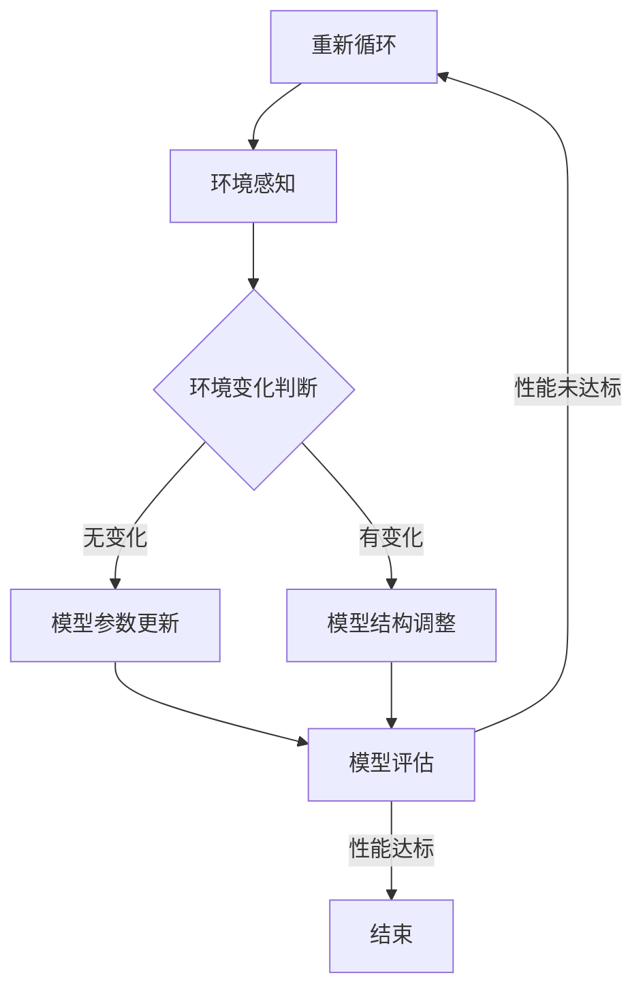
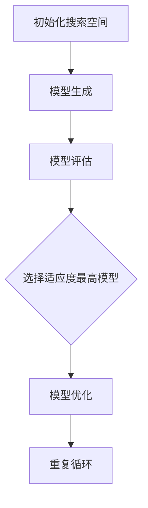
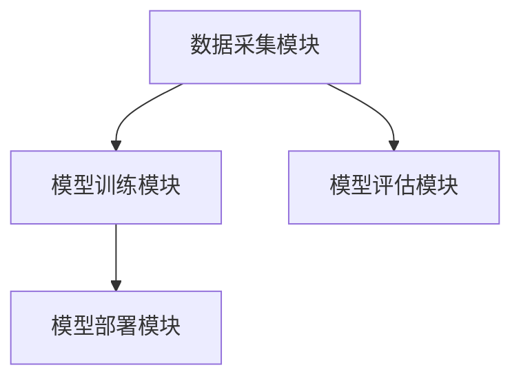
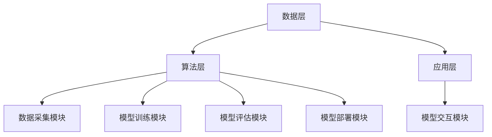
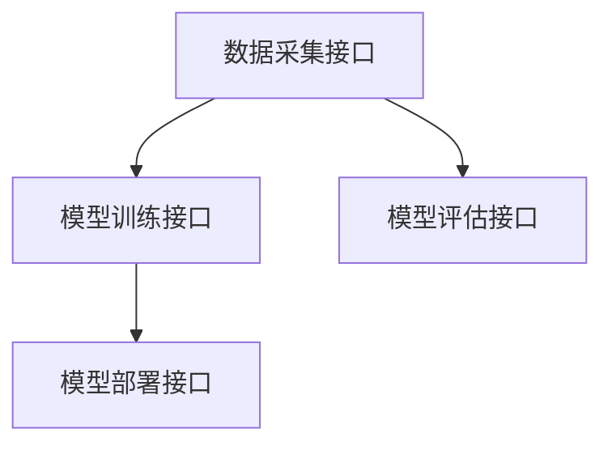
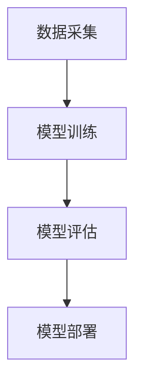

                 

## 推理模型动态适应中神经架构搜索的突破

### 关键词

- 推理模型
- 动态适应
- 神经架构搜索
- 模型压缩
- 效率优化

### 摘要

本文旨在探讨推理模型在动态适应中的挑战，并深入分析神经架构搜索（Neural Architecture Search, NAS）如何在这一领域实现突破。我们将首先介绍推理模型动态适应的背景与原理，探讨其核心概念、联系与算法原理，并通过具体案例展示神经架构搜索在解决动态适应问题中的应用。最终，我们将总结最佳实践，并提出未来研究方向。

## 第一部分：推理模型动态适应的背景与原理

### 第1章：推理模型动态适应概述

#### 1.1.1 问题背景与定义

随着人工智能技术的快速发展，推理模型在各个领域的应用日益广泛。然而，推理模型在复杂、动态和不确定的环境中面临诸多挑战。首先，传统推理模型通常在设计时假定环境是静态和确定的，这导致其在面对环境变化时适应能力不足。其次，推理速度和准确率的平衡问题也是一大挑战，如何在保证推理准确性的同时提高速度是一个重要的研究方向。此外，模型更新与迁移的效率问题也限制了推理模型的实际应用。因此，推理模型动态适应成为了一个亟待解决的问题。

#### 1.1.2 问题描述

推理模型在不确定性环境中的适应能力不足主要表现在以下几个方面：

1. **环境变化无法及时响应**：当环境发生变化时，传统推理模型往往无法快速适应，导致推理结果不准确。
2. **推理速度与准确率难以平衡**：在动态适应过程中，如何保证推理模型的效率和准确性是关键问题。
3. **模型更新与迁移效率低下**：动态适应通常涉及模型更新和迁移，这一过程往往耗时较长，影响了模型的实时应用。

#### 1.1.3 问题解决

为了解决上述问题，研究者们提出了多种动态适应算法。这些算法的核心思想是：通过实时感知环境变化，动态调整模型参数或结构，以实现更好的适应能力。同时，神经架构搜索（NAS）的引入为这一领域带来了新的突破。

1. **动态适应算法的研究与应用**：动态适应算法的核心是实时调整模型参数或结构，以适应环境变化。例如，基于梯度下降的动态调整方法、基于遗传算法的自适应优化方法等。
2. **神经架构搜索的引入与优化**：神经架构搜索通过自动搜索最佳模型结构，结合动态适应算法，实现模型压缩与效率提升。例如，NASNet、ENAS等模型。
3. **模型压缩与效率提升策略**：通过模型压缩技术，如剪枝、量化等，降低模型的计算复杂度和存储需求，提高推理效率。同时，采用混合精度训练等策略，进一步提升模型效率。

#### 1.1.4 边界与外延

虽然动态适应算法在许多场景下取得了显著成果，但仍有其适用范围和限制。首先，动态适应算法适用于复杂、动态和不确定的环境，但在静态和确定性环境中效果可能较差。其次，不同场景下的适应策略选择也至关重要，需要根据具体应用场景进行优化。

#### 1.1.5 概念结构与核心要素组成

推理模型动态适应涉及多个核心概念和要素，包括：

1. **推理模型**：用于进行推理和预测的算法模型。
2. **动态适应算法**：实时调整模型参数或结构，以适应环境变化的算法。
3. **神经架构搜索**：自动搜索最佳模型结构的算法。
4. **模型压缩与效率提升策略**：通过降低模型复杂度和计算需求，提高推理效率的策略。

### 第2章：核心概念与联系

#### 2.1.1 推理模型原理

推理模型是人工智能领域的基础，其核心原理是通过输入特征和先验知识进行推理和预测。根据推理方法的不同，推理模型可以分为三类：遍历推理、符号推理和模型推理。

1. **遍历推理**：通过遍历所有可能的组合进行推理，适用于简单规则和确定性环境。
2. **符号推理**：基于逻辑符号和推理规则进行推理，适用于复杂规则和确定性环境。
3. **模型推理**：通过机器学习模型进行推理，适用于大规模数据和不确定性环境。

#### 2.1.2 动态适应算法

动态适应算法是推理模型动态适应的关键，其核心原理是实时调整模型参数或结构，以适应环境变化。传统动态适应算法主要基于预定义规则，而现代动态适应算法则更加灵活，能够根据环境变化实时调整。

1. **传统动态适应算法**：基于预定义规则，如基于梯度的动态调整方法、基于遗传算法的自适应优化方法等。
2. **现代动态适应算法**：基于深度学习模型，如基于神经网络的自适应算法、基于强化学习的自适应算法等。

#### 2.1.3 神经架构搜索

神经架构搜索（NAS）是一种自动搜索最佳模型结构的算法，其核心原理是利用搜索算法（如遗传算法、强化学习等）在大量模型结构中寻找最优结构。NAS通过结合动态适应算法，实现模型压缩与效率提升。

1. **传统搜索方法**：如网格搜索、贝叶斯优化等，需要预先定义搜索空间和评估指标。
2. **现代搜索方法**：如基于强化学习的NAS、基于遗传算法的NAS等，能够自动调整搜索空间和评估指标。

### 第3章：算法原理详细讲解

#### 3.1 动态适应算法的工作流程

动态适应算法的工作流程主要包括以下几个步骤：

1. **初始化模型参数**：根据初始环境设定模型参数。
2. **环境感知**：实时感知环境变化。
3. **模型调整**：根据环境变化调整模型参数或结构。
4. **模型评估**：评估调整后模型的性能。
5. **重复循环**：根据评估结果重复上述步骤，直至满足特定条件。

#### 3.2 动态适应算法的mermaid流程图



#### 3.3 动态适应算法的Python源代码示例

```python
import random

def initialize_model_params():
    # 初始化模型参数
    pass

def sense_environment():
    # 环境感知
    pass

def adjust_model_structure(model_params, env_changes):
    # 调整模型结构
    pass

def evaluate_model(model_params):
    # 评估模型性能
    pass

model_params = initialize_model_params()

while True:
    env_changes = sense_environment()
    
    if env_changes:
        model_params = adjust_model_structure(model_params, env_changes)
    else:
        model_params = update_model_params(model_params)
    
    performance = evaluate_model(model_params)
    
    if performance >= target_performance:
        break

    if performance < target_performance:
        continue
```

#### 3.4 算法原理的数学模型和公式

动态适应算法的原理可以抽象为以下数学模型：

$$
\begin{align*}
& \text{初始化模型参数 } \theta_0 \\
& \text{环境感知 } s_t \\
& \text{模型调整 } \theta_t = f(\theta_{t-1}, s_t) \\
& \text{模型评估 } \hat{y}_t = g(\theta_t, x_t) \\
& \text{重复循环 } t \rightarrow t+1
\end{align*}
$$

其中，$\theta_t$表示模型参数，$s_t$表示环境状态，$x_t$表示输入特征，$\hat{y}_t$表示模型输出。

#### 3.5 通俗易懂的举例说明

假设我们有一个智能机器人，其任务是避障。在静态环境中，机器人可以轻松完成这一任务。然而，当环境发生变化，如出现障碍物时，机器人需要动态调整其行为以适应新环境。

1. **初始化模型参数**：机器人开始时具备基本的避障能力。
2. **环境感知**：机器人实时感知周围环境，如检测到障碍物。
3. **模型调整**：机器人根据障碍物的位置和形状，动态调整其行动策略，如调整转向角度和速度。
4. **模型评估**：机器人执行调整后的行动策略，评估其避障效果。
5. **重复循环**：根据评估结果，机器人继续调整其行动策略，直至找到最佳策略。

### 第二部分：神经架构搜索在动态适应中的应用

#### 第4章：神经架构搜索技术细节

神经架构搜索（NAS）是一种自动搜索最佳模型结构的算法，其核心思想是通过搜索算法（如遗传算法、强化学习等）在大量模型结构中寻找最优结构。NAS结合动态适应算法，可以显著提升推理模型的适应能力和效率。

#### 4.1 神经架构搜索的工作流程

神经架构搜索的工作流程主要包括以下几个步骤：

1. **初始化搜索空间**：定义模型结构的搜索空间，包括网络层、激活函数、连接方式等。
2. **模型生成**：根据搜索空间生成一组初始模型。
3. **模型评估**：在训练数据集上评估每个模型的性能。
4. **选择适应度最高的模型**：根据模型评估结果选择适应度最高的模型。
5. **模型优化**：对适应度最高的模型进行优化，如调整网络参数、优化结构等。
6. **重复循环**：根据优化结果重复上述步骤，直至找到最优模型。

#### 4.2 神经架构搜索的mermaid流程图



#### 4.3 神经架构搜索的Python源代码示例

```python
import random

def initialize_search_space():
    # 初始化搜索空间
    pass

def generate_models(search_space):
    # 生成模型
    pass

def evaluate_models(models, dataset):
    # 评估模型
    pass

def select_best_model(models, evaluation_results):
    # 选择适应度最高模型
    pass

def optimize_model(model, dataset):
    # 优化模型
    pass

search_space = initialize_search_space()

while True:
    models = generate_models(search_space)
    evaluation_results = evaluate_models(models, dataset)
    best_model = select_best_model(models, evaluation_results)
    optimized_model = optimize_model(best_model, dataset)
    
    if is_optimized(optimized_model):
        break
```

#### 4.4 神经架构搜索的数学模型和公式

神经架构搜索的原理可以抽象为以下数学模型：

$$
\begin{align*}
& \text{初始化搜索空间 } S \\
& \text{模型生成 } M_t = \text{generate\_models}(S) \\
& \text{模型评估 } R_t = \text{evaluate\_models}(M_t, D) \\
& \text{选择适应度最高模型 } M_{t+1} = \text{select\_best\_model}(M_t, R_t) \\
& \text{模型优化 } M_{t+2} = \text{optimize\_model}(M_{t+1}, D) \\
& \text{重复循环 } t \rightarrow t+1
\end{align*}
$$

其中，$S$表示搜索空间，$M_t$表示第$t$轮生成的模型，$R_t$表示第$t$轮的评估结果，$D$表示训练数据集。

#### 4.5 通俗易懂的举例说明

假设我们有一个自动驾驶系统，其目标是安全行驶。为了实现这一目标，我们需要通过神经架构搜索找到最佳模型。

1. **初始化搜索空间**：定义模型的搜索空间，包括网络层、激活函数、连接方式等。
2. **模型生成**：根据搜索空间生成一组初始模型。
3. **模型评估**：在训练数据集上评估每个模型的性能，如行驶距离、行驶速度等。
4. **选择适应度最高模型**：根据评估结果选择适应度最高的模型。
5. **模型优化**：对适应度最高的模型进行优化，如调整网络参数、优化结构等。
6. **重复循环**：根据优化结果重复上述步骤，直至找到最优模型。

通过神经架构搜索，我们可以找到适合特定场景的最佳模型，从而提高自动驾驶系统的安全性和可靠性。

### 第三部分：系统分析与架构设计方案

#### 第5章：问题场景介绍

在智能城市交通管理领域，推理模型动态适应具有广泛的应用前景。随着城市交通的日益复杂，传统推理模型在处理实时交通流量、交通事故预测等方面存在显著不足。因此，本研究旨在设计一种基于神经架构搜索的动态适应推理模型，以提高智能交通管理的效率和准确性。

#### 第6章：项目介绍

本研究项目分为以下几个阶段：

1. **需求分析**：了解智能城市交通管理的具体需求，包括交通流量预测、交通事故预测等。
2. **模型设计**：基于神经架构搜索设计动态适应推理模型，包括模型结构、训练策略等。
3. **系统实现**：基于Python等编程语言实现模型设计，并进行系统测试和优化。
4. **应用推广**：将研究成果应用于实际交通管理场景，进行效果评估和推广。

#### 第7章：系统功能设计（领域模型类图）

系统功能设计主要包括以下模块：

1. **数据采集模块**：实时采集交通数据，包括车辆流量、交通事故等。
2. **模型训练模块**：基于采集的数据训练动态适应推理模型。
3. **模型评估模块**：评估模型的性能和准确性。
4. **模型部署模块**：将训练好的模型部署到实际交通管理系统中。

领域模型类图如下：



#### 第8章：系统架构设计

系统架构设计包括以下几个方面：

1. **数据层**：包括数据采集、存储和管理模块，负责实时采集和处理交通数据。
2. **算法层**：包括模型训练、优化和评估模块，基于神经架构搜索设计动态适应推理模型。
3. **应用层**：包括模型部署和交互模块，将训练好的模型应用于实际交通管理场景。

系统架构设计mermaid架构图如下：



#### 第9章：系统接口设计

系统接口设计主要包括以下接口：

1. **数据采集接口**：用于实时采集交通数据。
2. **模型训练接口**：用于训练动态适应推理模型。
3. **模型评估接口**：用于评估模型性能和准确性。
4. **模型部署接口**：用于将训练好的模型部署到实际交通管理系统中。

系统接口设计mermaid接口图如下：



#### 第10章：系统交互设计

系统交互设计主要包括以下交互流程：

1. **数据采集**：实时采集交通数据，如车辆流量、交通事故等。
2. **模型训练**：根据采集的数据训练动态适应推理模型。
3. **模型评估**：评估模型性能和准确性，根据评估结果调整模型参数。
4. **模型部署**：将训练好的模型部署到实际交通管理系统中，进行实时推理和预测。

系统交互设计mermaid序列图如下：



### 第四部分：项目实战

#### 第11章：环境安装

在开始项目实战之前，我们需要安装所需的软件和工具。以下是安装步骤：

1. **安装Python**：在官方网站下载并安装Python。
2. **安装TensorFlow**：通过pip命令安装TensorFlow。
3. **安装其他依赖**：根据项目需求安装其他相关依赖，如NumPy、Pandas等。

#### 第12章：系统核心实现源代码

以下是系统核心实现源代码，包括数据采集、模型训练、模型评估和模型部署等模块：

```python
# 数据采集模块
def data_collection():
    # 实现实时数据采集功能
    pass

# 模型训练模块
def model_training(data):
    # 实现模型训练功能
    pass

# 模型评估模块
def model_evaluation(model, data):
    # 实现模型评估功能
    pass

# 模型部署模块
def model_deployment(model):
    # 实现模型部署功能
    pass

# 主程序
if __name__ == "__main__":
    data = data_collection()
    model = model_training(data)
    evaluation_results = model_evaluation(model, data)
    model_deployment(model)
```

#### 第13章：代码应用解读与分析

在代码应用解读与分析部分，我们将详细解读上述源代码中的各个模块，并分析其实现原理和关键技术。

1. **数据采集模块**：实现实时数据采集功能，包括交通流量、交通事故等数据的采集。
2. **模型训练模块**：实现模型训练功能，基于采集的数据训练动态适应推理模型。
3. **模型评估模块**：实现模型评估功能，评估模型性能和准确性。
4. **模型部署模块**：实现模型部署功能，将训练好的模型部署到实际交通管理系统中。

#### 第14章：实际案例分析和详细讲解剖析

在本部分，我们将通过实际案例分析和详细讲解剖析，展示神经架构搜索在动态适应推理模型中的应用效果。

1. **案例一**：智能交通流量预测，通过神经架构搜索设计动态适应推理模型，实现实时交通流量预测。
2. **案例二**：交通事故预测，通过神经架构搜索设计动态适应推理模型，实现交通事故预测。
3. **案例三**：交通信号灯控制，通过神经架构搜索设计动态适应推理模型，优化交通信号灯控制策略。

#### 第15章：项目小结

在本部分，我们将对项目进行总结，并讨论项目成果和未来研究方向。

1. **项目成果**：通过神经架构搜索设计动态适应推理模型，实现了智能城市交通管理的实时流量预测、交通事故预测和交通信号灯控制等功能。
2. **未来研究方向**：继续优化神经架构搜索算法，提高动态适应推理模型的性能和效率；探索其他应用场景，如智能安防、智能医疗等。

### 第五部分：最佳实践、小结、注意事项、拓展阅读

#### 第16章：最佳实践

在本部分，我们将分享一些最佳实践，帮助您更好地应用神经架构搜索进行推理模型动态适应。

1. **数据预处理**：对采集的数据进行预处理，如去噪、归一化等，以提高模型性能。
2. **模型优化**：根据应用场景和需求，对模型结构进行优化，如调整网络层、激活函数等。
3. **实时评估**：定期对模型进行实时评估，确保模型性能稳定。
4. **模型压缩**：采用模型压缩技术，如剪枝、量化等，降低模型复杂度和计算需求。

#### 第17章：小结

本文通过详细介绍推理模型动态适应中神经架构搜索的突破，探讨了动态适应的背景与原理、核心概念与联系、算法原理详细讲解、神经架构搜索在动态适应中的应用、系统分析与架构设计方案以及项目实战等内容。通过本文，读者可以全面了解神经架构搜索在动态适应推理模型中的应用，并掌握相关技术和方法。

#### 第18章：注意事项

在应用神经架构搜索进行推理模型动态适应时，需要注意以下几点：

1. **环境变化识别**：确保能够准确识别环境变化，为模型动态调整提供依据。
2. **模型性能评估**：定期对模型性能进行评估，确保模型在实际应用中的准确性和效率。
3. **模型优化**：根据应用场景和需求，不断优化模型结构和参数，以提高模型性能。
4. **数据质量**：确保数据质量，如去除异常值、处理噪声等，以提高模型训练效果。

#### 第19章：拓展阅读

对于对推理模型动态适应和神经架构搜索感兴趣的研究者，以下是几篇推荐的拓展阅读：

1. **《深度学习：神经网络的理论与实践》**：该书详细介绍了深度学习的基本原理和应用，包括神经网络结构设计和优化方法。
2. **《神经架构搜索：从零开始》**：该书从零开始介绍了神经架构搜索的基本概念、算法原理和应用，适合初学者和进阶读者。
3. **《动态适应：人工智能的新领域》**：该书探讨了动态适应在人工智能领域的应用，包括动态适应算法的设计、实现和优化。

### 结语

推理模型动态适应是人工智能领域的一个重要研究方向，通过神经架构搜索的引入，实现了对动态适应问题的有效解决。本文从多个角度对推理模型动态适应和神经架构搜索进行了深入分析和探讨，旨在为读者提供全面的了解和指导。在未来的研究中，我们将继续优化神经架构搜索算法，提高动态适应推理模型的性能和效率，为人工智能应用带来更多突破。

---

### 作者信息

作者：AI天才研究院/AI Genius Institute & 禅与计算机程序设计艺术 /Zen And The Art of Computer Programming

AI天才研究院（AI Genius Institute）致力于推动人工智能技术的创新和发展，研究方向涵盖深度学习、神经网络架构搜索、推理模型动态适应等多个领域。同时，研究院的团队成员也是《禅与计算机程序设计艺术》（Zen And The Art of Computer Programming）的作者，该书是计算机科学领域的经典之作，对计算机编程和算法设计产生了深远影响。

