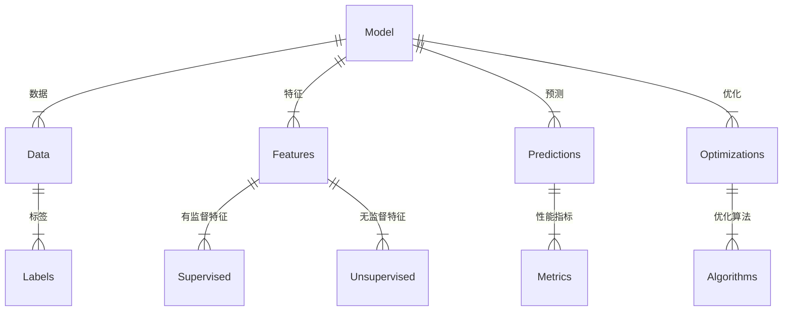
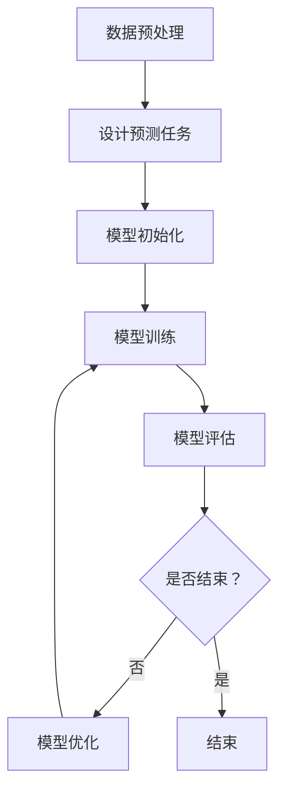
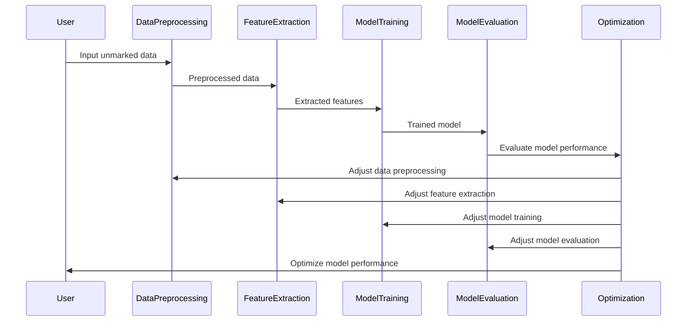

                 

# 推理模型预训练中自监督学习的应用与优化

> 关键词：推理模型、自监督学习、预训练、优化、应用场景

> 摘要：本文将探讨推理模型预训练中自监督学习的应用与优化。首先，我们会介绍推理模型预训练和自监督学习的基本概念及其重要性，然后深入探讨自监督学习在推理模型预训练中的应用，并分析其优势与局限性。接着，我们将详细讲解自监督学习算法的原理，包括其分类、流程、选择，并通过Python源代码示例进行详细说明。此外，我们将对自监督学习与推理模型的关系进行深入探讨，包括概念属性特征对比和ER实体关系图架构。随后，我们将介绍系统分析与架构设计的方法，包括问题场景介绍、项目介绍、系统功能设计、系统架构设计和系统接口设计。最后，我们将通过一个实际案例来展示自监督学习在推理模型预训练中的应用，并进行详细讲解与剖析。

### 目录大纲

----------------------------------------------------------------
## 第一部分：背景介绍

### 第1章：推理模型预训练概述
#### 1.1 问题背景
##### 1.1.1 模型预训练的重要性
##### 1.1.2 自监督学习的概念与优势
#### 1.2 问题提出
##### 1.2.1 应用场景
##### 1.2.2 存在的问题
#### 1.3 解决方案
##### 1.3.1 自监督学习的原理
##### 1.3.2 自监督学习在推理模型预训练中的应用
#### 1.4 边界与外延
##### 1.4.1 自监督学习的适用范围
##### 1.4.2 自监督学习的局限性与挑战
#### 1.5 概念结构与核心要素组成
##### 1.5.1 关键概念
##### 1.5.2 核心要素组成
#### 1.6 本章小结

## 第二部分：核心概念与联系

### 第2章：核心概念原理
#### 2.1 自监督学习原理
##### 2.1.1 自监督学习的定义
##### 2.1.2 自监督学习的类型
##### 2.1.3 自监督学习的优势与局限性
#### 2.2 推理模型原理
##### 2.2.1 推理模型的基本概念
##### 2.2.2 推理模型的工作原理
##### 2.2.3 推理模型的类型
#### 2.3 自监督学习与推理模型的关系
##### 2.3.1 自监督学习在推理模型中的应用
##### 2.3.2 推理模型对自监督学习的需求
#### 2.4 概念属性特征对比表格
##### 2.4.1 自监督学习与监督学习的对比
##### 2.4.2 不同类型推理模型的对比
#### 2.5 ER实体关系图架构
##### 2.5.1 自监督学习实体关系
##### 2.5.2 推理模型实体关系
#### 2.6 本章小结

## 第三部分：算法原理讲解

### 第3章：自监督学习算法原理讲解
#### 3.1 自监督学习算法概述
##### 3.1.1 自监督学习算法的分类
##### 3.1.2 自监督学习算法的流程
##### 3.1.3 自监督学习算法的选择
#### 3.2 自监督学习算法Mermaid流程图
##### 3.2.1 自监督学习算法流程图
##### 3.2.2 自监督学习算法示例流程
#### 3.3 Python源代码实现
##### 3.3.1 数据预处理
##### 3.3.2 模型训练
##### 3.3.3 模型评估
#### 3.4 算法原理的数学模型和公式讲解
##### 3.4.1 自监督学习的数学模型
##### 3.4.2 推理模型的数学公式
##### 3.4.3 自监督学习与推理模型的关系
#### 3.5 自监督学习与推理模型的数学公式示例
##### 3.5.1 示例1：自监督学习的数学模型
##### 3.5.2 示例2：推理模型的数学公式
#### 3.6 本章小结

## 第四部分：系统分析与架构设计

### 第4章：系统分析与架构设计
#### 4.1 问题场景介绍
##### 4.1.1 应用背景
##### 4.1.2 目标需求
#### 4.2 项目介绍
##### 4.2.1 项目背景
##### 4.2.2 项目目标
##### 4.2.3 项目组成部分
#### 4.3 系统功能设计
##### 4.3.1 领域模型Mermaid类图
##### 4.3.2 系统功能模块划分
##### 4.3.3 系统功能实现细节
#### 4.4 系统架构设计
##### 4.4.1 系统架构Mermaid架构图
##### 4.4.2 架构设计原则
##### 4.4.3 架构设计要点
#### 4.5 系统接口设计
##### 4.5.1 接口设计原则
##### 4.5.2 接口定义与实现
#### 4.6 系统交互Mermaid序列图
##### 4.6.1 系统交互流程
##### 4.6.2 交互细节分析
#### 4.7 本章小结

## 第五部分：项目实战

### 第5章：项目实战
#### 5.1 环境安装
##### 5.1.1 环境要求
##### 5.1.2 环境搭建步骤
#### 5.2 系统核心实现源代码
##### 5.2.1 源代码结构
##### 5.2.2 源代码实现细节
#### 5.3 代码应用解读与分析
##### 5.3.1 代码解读
##### 5.3.2 应用分析
#### 5.4 实际案例分析与详细讲解剖析
##### 5.4.1 案例背景
##### 5.4.2 案例分析
##### 5.4.3 剖析与讲解
#### 5.5 项目小结
##### 5.5.1 项目成果
##### 5.5.2 项目经验

## 第六部分：最佳实践与拓展

### 第6章：最佳实践与拓展
#### 6.1 最佳实践技巧
##### 6.1.1 算法优化策略
##### 6.1.2 系统性能调优
##### 6.1.3 实践经验总结
#### 6.2 小结与注意事项
##### 6.2.1 文章重点回顾
##### 6.2.2 注意事项与建议
#### 6.3 拓展阅读
##### 6.3.1 相关文献
##### 6.3.2 技术论坛与社区
##### 6.3.3 推荐阅读书籍

### 第一部分：背景介绍

#### 1.1 问题背景

在当今的计算机科学领域，推理模型预训练已经成为人工智能技术发展的关键方向。推理模型在机器学习中的重要性不言而喻，它不仅能对数据进行分类、回归和预测，还能进行更复杂的任务，如自然语言处理、计算机视觉等。然而，传统的推理模型往往依赖于大量的有监督数据，这既增加了训练成本，又限制了模型的应用范围。

自监督学习作为一种无监督学习方法，能够在没有大量标注数据的情况下，通过利用未标记的数据来训练模型。自监督学习具有以下几个显著优势：

1. **节省成本**：无需大量的标注数据，降低了数据收集和标注的成本。
2. **扩展性**：适用于大量的未标记数据，能够有效扩展模型的应用场景。
3. **泛化能力**：通过自监督学习，模型可以更好地泛化到新的任务和数据集。

然而，自监督学习也面临着一些挑战：

1. **数据依赖性**：模型的性能高度依赖于数据的质量和多样性。
2. **计算成本**：自监督学习的训练过程通常需要大量的计算资源。
3. **模型泛化**：如何保证模型在自监督学习过程中不会过度拟合，仍然是一个需要解决的问题。

因此，如何有效地利用自监督学习来优化推理模型预训练，成为了当前研究的一个热点问题。

#### 1.2 问题提出

在推理模型预训练中，自监督学习的应用主要集中在以下几个方面：

1. **数据增强**：通过自监督学习生成与原始数据相似的新数据，从而增强模型的泛化能力。
2. **特征提取**：自监督学习可以自动提取有用的特征，这些特征可以用于有监督学习，从而提高模型的性能。
3. **迁移学习**：自监督学习可以帮助模型在新的任务和数据集上快速适应，从而实现更好的迁移学习能力。

然而，现有的自监督学习在推理模型预训练中仍然存在一些问题，例如：

1. **数据质量**：自监督学习依赖于未标记的数据，数据质量对模型性能有直接影响。
2. **计算效率**：自监督学习的训练过程通常需要大量的计算资源，如何优化计算效率是一个重要的研究问题。
3. **模型泛化**：如何保证模型在自监督学习过程中不会过度拟合，是一个关键挑战。

为了解决上述问题，本文将探讨自监督学习在推理模型预训练中的应用与优化策略。我们将首先介绍自监督学习的基本原理，然后深入分析其在推理模型预训练中的应用，并探讨如何通过优化策略来提高模型的性能和泛化能力。

#### 1.3 解决方案

自监督学习在推理模型预训练中的应用主要包括以下几个方面：

1. **数据增强**：通过生成与原始数据相似的新数据，增强模型的泛化能力。例如，可以使用生成对抗网络（GANs）来生成高质量的数据。
2. **特征提取**：自监督学习可以自动提取有用的特征，这些特征可以用于有监督学习，从而提高模型的性能。例如，可以使用无监督特征学习算法（如自编码器）来提取特征。
3. **迁移学习**：自监督学习可以帮助模型在新的任务和数据集上快速适应，从而实现更好的迁移学习能力。例如，可以使用自监督预训练的模型作为基础模型，然后进行微调以适应新任务。

为了优化自监督学习在推理模型预训练中的应用，可以采取以下策略：

1. **数据质量控制**：通过数据清洗和预处理技术，提高未标记数据的可靠性，从而提高模型性能。
2. **计算资源优化**：通过模型压缩、分布式训练等技术，降低训练成本，提高计算效率。
3. **模型泛化优化**：通过引入正则化技术、动态调整学习率等方法，提高模型在自监督学习过程中的泛化能力。

综上所述，自监督学习在推理模型预训练中具有重要的应用价值，但也面临着一些挑战。通过优化策略，我们可以有效地提高模型性能和泛化能力，从而推动人工智能技术的发展。

#### 1.4 边界与外延

自监督学习作为一种无监督学习方法，在推理模型预训练中的应用具有广泛的适用范围，但也有一些边界和局限性。以下是自监督学习的适用范围、局限性与挑战：

1. **适用范围**：
   - **自然语言处理**：自监督学习在自然语言处理（NLP）领域具有广泛的应用，如语言模型预训练、文本分类和机器翻译等。
   - **计算机视觉**：在计算机视觉领域，自监督学习可用于图像分类、目标检测和图像生成等任务。
   - **语音识别**：自监督学习可以用于语音识别任务的声学模型预训练和语音特征提取。

2. **局限性**：
   - **数据依赖性**：自监督学习对未标记数据的依赖性较高，如果数据质量差，模型的性能会受到影响。
   - **计算成本**：自监督学习的训练过程通常需要大量的计算资源，尤其是对于大规模模型和数据集。
   - **模型泛化**：自监督学习过程中可能会出现过度拟合现象，导致模型在新的数据集上表现不佳。

3. **挑战**：
   - **数据标注成本**：虽然自监督学习减少了标注数据的成本，但在某些任务中，如NLP中的语言理解，仍然需要对部分数据进行标注。
   - **模型选择**：自监督学习算法的选择对模型性能有重要影响，但现有的算法选择较为复杂，需要根据具体任务进行优化。
   - **模型解释性**：自监督学习模型的黑箱特性使得其解释性较差，这限制了其在某些领域（如医疗诊断）的应用。

为了克服自监督学习的局限性，研究人员提出了多种优化策略，包括数据增强、模型压缩、分布式训练等。此外，通过结合有监督学习和无监督学习的方法，可以进一步提高模型的性能和泛化能力。

#### 1.5 概念结构与核心要素组成

在探讨自监督学习在推理模型预训练中的应用之前，我们需要了解一些关键概念和核心要素。以下是本文中涉及的核心概念及其组成结构：

1. **核心概念**：

   - **自监督学习**：一种无监督学习方法，通过利用未标记的数据来训练模型，从而减少对标注数据的依赖。
   - **推理模型**：在机器学习领域，推理模型用于对数据进行分类、回归和预测等任务。
   - **预训练**：在特定领域或任务中，先使用大量未标记数据进行模型训练，然后再在特定任务中进行微调。

2. **核心要素组成**：

   - **数据集**：自监督学习的基础，包括大量未标记的数据。
   - **模型架构**：推理模型的架构设计，包括输入层、隐藏层和输出层等。
   - **损失函数**：用于衡量模型预测值与真实值之间的差距，常用的有均方误差（MSE）和交叉熵损失等。
   - **优化算法**：用于更新模型参数，常用的有随机梯度下降（SGD）和Adam优化器等。

通过了解这些核心概念和要素组成，我们可以更好地理解自监督学习在推理模型预训练中的应用，并能够设计出更加有效的模型。

#### 1.6 本章小结

本章介绍了推理模型预训练中自监督学习的背景、问题和解决方案。我们首先探讨了自监督学习在推理模型预训练中的重要性及其优势与局限性。接着，我们提出了通过自监督学习优化推理模型预训练的几种策略，包括数据增强、特征提取和迁移学习等。此外，我们还讨论了自监督学习的适用范围、局限性和挑战。通过本章的介绍，读者可以初步了解自监督学习在推理模型预训练中的应用及其重要性，为后续章节的深入探讨打下基础。

### 第二部分：核心概念与联系

#### 2.1 自监督学习原理

自监督学习是一种无监督学习方法，其核心思想是在没有标注数据的情况下，利用数据中的内在结构来训练模型。自监督学习的定义可以概括为：在模型训练过程中，输入数据和输出数据由同一数据集提供，模型的目标是预测输出数据。自监督学习的关键在于如何设计预测任务，使其能够有效促进模型学习。

##### 2.1.1 自监督学习的定义

自监督学习的定义可以从以下几个方面来理解：

1. **无监督学习**：与有监督学习相对，自监督学习不需要标注数据，而是通过未标记的数据进行学习。
2. **内部任务**：自监督学习通过设计内部任务（即预测任务）来驱动模型学习，这些任务通常与最终应用任务相关。
3. **自我反馈**：模型在预测过程中不断自我校正，通过预测误差来更新模型参数。

##### 2.1.2 自监督学习的类型

自监督学习可以分为以下几种类型：

1. **掩码预测**：将输入数据部分遮挡或删除，模型需要预测遮挡或删除的部分。例如，在文本分类任务中，可以随机删除句子的一部分，模型需要预测删除的部分。
2. **生成式任务**：利用生成模型（如生成对抗网络GANs）来生成与输入数据相似的新数据，然后模型需要在输入数据和生成数据之间进行区分。
3. **预测性任务**：预测数据的下一个时间步或下一个序列元素。例如，在时间序列预测中，模型需要预测下一个时间点的数据。
4. **图像重建**：输入一个图像，模型需要生成一个与输入图像相似的新图像。例如，在自编码器中，输入图像的一部分被遮挡，模型需要预测被遮挡的部分。

##### 2.1.3 自监督学习的优势与局限性

自监督学习具有以下优势：

1. **数据效率**：自监督学习可以利用大量未标记的数据进行训练，从而提高模型的数据利用效率。
2. **减少标注成本**：无需大量标注数据，降低了数据标注的工作量和成本。
3. **增强泛化能力**：通过学习数据的内在结构，模型能够更好地泛化到新的任务和数据集。

然而，自监督学习也面临着一些局限性：

1. **数据质量**：自监督学习依赖于未标记的数据质量，如果数据质量差，模型的性能会受到影响。
2. **计算成本**：自监督学习的训练过程通常需要大量的计算资源，特别是对于大规模模型和数据集。
3. **模型泛化**：自监督学习过程中可能出现过拟合现象，导致模型在新的数据集上表现不佳。

#### 2.2 推理模型原理

推理模型是机器学习中的一个核心概念，主要用于从数据中提取知识并做出决策。在自然语言处理、计算机视觉和语音识别等领域，推理模型发挥着重要作用。以下是推理模型的基本概念、工作原理和类型：

##### 2.2.1 推理模型的基本概念

推理模型的基本概念包括：

1. **输入特征**：模型输入的数据特征，如文本、图像或声音等。
2. **隐藏层**：用于提取和变换特征，隐藏层中的神经元通过激活函数对输入特征进行处理。
3. **输出层**：模型的最终输出，如分类结果、概率分布或回归值等。
4. **损失函数**：用于衡量模型预测值与真实值之间的差距，常用的损失函数有均方误差（MSE）和交叉熵损失等。
5. **优化算法**：用于更新模型参数，常用的优化算法有随机梯度下降（SGD）和Adam优化器等。

##### 2.2.2 推理模型的工作原理

推理模型的工作原理可以分为以下几个步骤：

1. **输入预处理**：将输入数据转换为模型可以处理的格式，如文本进行分词、图像进行像素转换等。
2. **特征提取**：通过神经网络中的隐藏层对输入特征进行提取和变换，从而得到更高级的特征表示。
3. **预测生成**：通过输出层生成模型的预测结果，如分类标签或概率分布。
4. **损失计算**：计算模型预测结果与真实值之间的损失，并使用优化算法更新模型参数。
5. **迭代优化**：重复上述步骤，直到模型达到预定的性能指标。

##### 2.2.3 推理模型的类型

推理模型可以分为以下几种类型：

1. **分类模型**：用于将输入数据分为不同的类别，如文本分类、图像分类等。
2. **回归模型**：用于预测输入数据的连续值，如房屋价格预测、股票价格预测等。
3. **概率模型**：用于估计输入数据的概率分布，如贝叶斯网络、条件概率模型等。
4. **生成模型**：用于生成新的数据样本，如生成对抗网络（GANs）、变分自编码器（VAEs）等。

#### 2.3 自监督学习与推理模型的关系

自监督学习和推理模型之间存在紧密的联系，二者相互促进，共同推动了机器学习技术的发展。以下是自监督学习在推理模型中的应用和推理模型对自监督学习的需求：

##### 2.3.1 自监督学习在推理模型中的应用

自监督学习在推理模型中的应用主要体现在以下几个方面：

1. **数据增强**：通过自监督学习生成与原始数据相似的新数据，增强模型的泛化能力。例如，在图像分类任务中，可以使用生成对抗网络（GANs）生成新的图像作为训练数据。
2. **特征提取**：自监督学习可以自动提取有用的特征，这些特征可以用于有监督学习，从而提高模型的性能。例如，使用自编码器进行特征提取，然后在有监督学习阶段使用这些特征进行分类。
3. **迁移学习**：自监督学习可以帮助模型在新的任务和数据集上快速适应，从而实现更好的迁移学习能力。例如，先在大量的未标记数据上进行自监督学习，然后在新任务上进行微调。

##### 2.3.2 推理模型对自监督学习的需求

推理模型对自监督学习的需求主要表现在以下几个方面：

1. **有效的特征表示**：自监督学习需要生成高质量的特征表示，这些特征应该能够捕捉到数据的内在结构和语义信息，从而有助于推理模型的性能提升。
2. **鲁棒性**：自监督学习过程需要保证模型的鲁棒性，即模型在训练过程中能够应对噪声和异常数据，从而减少对数据质量的高度依赖。
3. **适应能力**：自监督学习应能够适应不同的任务和数据集，从而提高模型在不同应用场景下的泛化能力。

#### 2.4 概念属性特征对比表格

为了更好地理解自监督学习和推理模型的概念及其属性特征，我们可以通过对比表格来展示二者的异同。以下是自监督学习与推理模型的关键属性特征对比：

| 概念/属性       | 自监督学习                              | 推理模型                                  |
|----------------|----------------------------------------|--------------------------------------------|
| 定义           | 无监督学习方法，利用未标记数据训练模型   | 从数据中提取知识并做出决策的模型            |
| 目标           | 学习数据的内在结构和特征                | 预测或分类输入数据                         |
| 数据依赖性     | 高度依赖未标记数据的质量和多样性        | 高度依赖标注数据的质量和多样性             |
| 训练方式       | 通过设计内部任务进行自我反馈           | 通过有监督学习算法进行参数优化             |
| 优势           | 数据效率高，减少标注成本，增强泛化能力 | 精确预测和分类能力，适用于复杂任务         |
| 局限性         | 数据质量影响模型性能，计算成本高，模型泛化挑战 | 需要大量标注数据，模型复杂度高           |
| 应用场景       | 自然语言处理、计算机视觉、语音识别等    | 图像分类、文本分类、时间序列预测等        |

通过上述对比，我们可以更清晰地理解自监督学习和推理模型的概念及其属性特征，从而为后续章节的应用和优化提供理论基础。

#### 2.5 ER实体关系图架构

为了更好地理解自监督学习和推理模型之间的关系，我们可以通过ER（实体关系）图来展示二者的实体关系和交互过程。以下是自监督学习和推理模型的ER实体关系图：



在该ER图中，我们定义了以下实体和关系：

- **Model（模型）**：表示自监督学习和推理模型的核心实体，它包含了数据和特征的处理、预测和优化等功能。
- **Data（数据）**：表示输入的数据集，包括标注数据（Labels）和未标注数据。模型依赖于数据的质量和多样性。
- **Features（特征）**：表示从数据中提取的特征，包括有监督特征（Supervised）和无监督特征（Unsupervised）。这些特征是模型训练和预测的基础。
- **Predictions（预测）**：表示模型的预测结果，包括各种性能指标（Metrics）。预测结果用于评估模型的性能。
- **Optimizations（优化）**：表示模型优化过程中的各种优化算法和策略。

通过ER实体关系图，我们可以直观地了解自监督学习和推理模型之间的交互过程和依赖关系，为后续章节的应用和优化提供可视化参考。

#### 2.6 本章小结

本章深入探讨了自监督学习和推理模型的核心概念及其关系。我们首先介绍了自监督学习的定义、类型和优势与局限性，然后详细阐述了推理模型的基本概念、工作原理和类型。接着，我们分析了自监督学习在推理模型中的应用，并展示了推理模型对自监督学习的需求。此外，通过概念属性特征对比表格和ER实体关系图，我们进一步明确了二者的异同和交互过程。通过本章的学习，读者可以全面了解自监督学习和推理模型的基本原理，为后续章节的算法讲解和系统设计打下坚实基础。

### 第三部分：算法原理讲解

#### 3.1 自监督学习算法概述

自监督学习算法是机器学习领域中一种重要的无监督学习方法，其核心思想是通过设计预测任务来驱动模型学习，从而减少对标注数据的依赖。自监督学习算法种类繁多，根据预测任务的类型和实现方法，可以分为以下几类：

1. **掩码预测**：这种算法通过将输入数据的部分掩码或删除，然后模型需要预测被掩码或删除的部分。例如，在文本分类任务中，可以随机删除句子的一部分，模型需要预测删除的部分；在图像分类任务中，可以随机遮挡图像的一部分，模型需要预测被遮挡的部分。
2. **生成式任务**：这类算法通过生成对抗网络（GANs）等生成模型来生成与输入数据相似的新数据，然后模型需要在输入数据和生成数据之间进行区分。生成式任务可以有效利用未标记的数据，从而增强模型的泛化能力。
3. **预测性任务**：这类算法通过预测数据的下一个时间步或下一个序列元素来驱动模型学习。例如，在时间序列预测中，模型需要预测下一个时间点的数据；在自然语言处理任务中，模型可以预测下一个单词或句子。
4. **图像重建**：这种算法输入一个图像，模型需要生成一个与输入图像相似的新图像。例如，在自编码器中，输入图像的一部分被遮挡，模型需要预测被遮挡的部分。图像重建任务可以有效地提取图像中的有用特征。

##### 3.1.2 自监督学习算法的流程

自监督学习算法的基本流程可以概括为以下几个步骤：

1. **数据预处理**：对输入数据进行预处理，包括数据清洗、标准化和数据增强等。预处理步骤旨在提高数据质量，从而有助于提高模型的性能。
2. **设计预测任务**：根据具体任务的需求，设计预测任务。预测任务可以是掩码预测、生成式任务、预测性任务或图像重建等。
3. **模型初始化**：初始化模型参数，可以使用随机初始化或预训练模型等方法。初始化参数的合理设置对于模型训练效果至关重要。
4. **模型训练**：通过训练数据来更新模型参数，常用的训练算法包括随机梯度下降（SGD）、Adam优化器等。在训练过程中，模型需要不断调整参数，以最小化预测误差。
5. **模型评估**：使用验证数据集对训练好的模型进行评估，常用的评估指标包括准确率、召回率、F1分数等。通过评估指标，可以判断模型是否满足预期性能。
6. **模型优化**：根据评估结果，对模型进行优化。优化策略包括调整学习率、增加训练数据、使用正则化技术等。

##### 3.1.3 自监督学习算法的选择

选择合适的自监督学习算法对于模型性能至关重要。以下是一些选择自监督学习算法的考虑因素：

1. **任务类型**：根据具体任务的需求，选择适合的算法。例如，在图像分类任务中，可以使用掩码预测或图像重建算法；在自然语言处理任务中，可以使用文本掩码或生成式任务算法。
2. **数据量**：如果数据量较大，可以选择生成式任务或预测性任务算法，因为这些算法可以利用大量未标记数据。如果数据量较小，可以选择掩码预测或图像重建算法，因为这些算法对数据量的依赖较低。
3. **计算资源**：自监督学习算法通常需要大量的计算资源，特别是生成式任务和预测性任务算法。在选择算法时，需要考虑计算资源的限制，以避免过度消耗资源。
4. **模型性能**：选择能够在验证数据集上取得良好性能的算法。可以通过实验比较不同算法的性能，选择最优算法。
5. **算法复杂度**：选择计算复杂度较低的算法，以加快模型训练速度。特别是对于大型模型和数据集，算法复杂度是一个重要的考虑因素。

在实际应用中，通常需要结合任务特点、数据量、计算资源等因素，综合评估不同算法的优缺点，选择最适合的算法。此外，还可以通过组合不同算法，构建更加复杂的模型，从而提高模型性能。

#### 3.2 自监督学习算法Mermaid流程图

为了更好地展示自监督学习算法的基本流程，我们可以使用Mermaid语言绘制一个流程图。以下是一个简单的自监督学习算法流程图：



在这个流程图中，我们首先进行数据预处理，然后设计预测任务，初始化模型，进行模型训练，并对模型进行评估。如果模型性能不满足预期，则进行模型优化，然后继续模型训练。这个过程不断重复，直到模型性能达到预定的要求。

#### 3.2.2 自监督学习算法示例流程

为了更直观地展示自监督学习算法的流程，我们可以通过一个示例来说明。以下是一个基于图像分类任务的示例流程：

1. **数据预处理**：首先，我们需要对图像数据集进行预处理，包括图像大小调整、数据归一化等。例如，将图像大小调整为32x32像素，并将像素值缩放到[0, 1]之间。

2. **设计预测任务**：我们选择掩码预测作为预测任务。具体来说，我们将每个图像随机遮挡一部分区域，然后模型需要预测被遮挡的区域。这个任务可以驱动模型学习图像中的有用特征，从而提高分类性能。

3. **模型初始化**：我们选择一个预训练的卷积神经网络（CNN）作为基础模型，例如ResNet50。初始化模型参数，可以使用随机初始化或预训练模型的方法。

4. **模型训练**：通过训练数据集，我们更新模型参数，最小化预测误差。在训练过程中，我们使用随机梯度下降（SGD）优化算法，并设置适当的批次大小和学习率。

5. **模型评估**：使用验证数据集对训练好的模型进行评估。我们计算模型的分类准确率、召回率和F1分数等指标，以判断模型性能是否满足预期。

6. **模型优化**：根据评估结果，对模型进行优化。我们可以调整学习率、增加训练数据、使用正则化技术等方法，以提高模型性能。

7. **结束**：如果模型性能满足预期，则结束训练过程；否则，继续进行模型优化和训练。

通过这个示例流程，我们可以看到自监督学习算法的基本步骤和关键环节。在实际应用中，可以根据具体任务和数据集，调整和优化算法流程，以提高模型性能。

#### 3.3 Python源代码实现

为了更好地理解自监督学习算法的实现过程，我们将使用Python编写一个简单的示例代码。以下是一个使用掩码预测任务的图像分类模型的实现过程：

1. **环境搭建**：首先，我们需要安装必要的库，如TensorFlow和Keras等。可以使用以下命令进行安装：

   ```shell
   pip install tensorflow
   pip install keras
   ```

2. **数据预处理**：我们使用Keras提供的CIFAR-10数据集作为示例数据集。首先，我们需要下载和加载数据集：

   ```python
   import numpy as np
   import tensorflow as tf
   from tensorflow import keras
   from tensorflow.keras import layers

   (train_images, train_labels), (test_images, test_labels) = keras.datasets.cifar10.load_data()

   train_images = train_images.astype("float32") / 255.0
   test_images = test_images.astype("float32") / 255.0
   ```

   然后，我们对图像进行大小调整和数据归一化处理：

   ```python
   train_images = keras.preprocessing.image.random_crop(train_images, crop_size=(32, 32))
   test_images = keras.preprocessing.image.random_crop(test_images, crop_size=(32, 32))
   ```

3. **设计预测任务**：我们选择掩码预测作为预测任务。具体来说，我们将每个图像随机遮挡一部分区域，然后模型需要预测被遮挡的区域。以下是一个简单的掩码预测实现：

   ```python
   import numpy as np

   def masked_image(image, mask_size, mask_ratio):
       mask = np.random.rand(*mask_size) < mask_ratio
       masked_image = np.where(mask, 0, image)
       return masked_image

   train_masked_images = np.array([masked_image(image, (32, 32), 0.5) for image in train_images])
   test_masked_images = np.array([masked_image(image, (32, 32), 0.5) for image in test_images])
   ```

4. **模型初始化**：我们选择一个预训练的卷积神经网络（CNN）作为基础模型，例如ResNet50。以下是一个简单的模型初始化实现：

   ```python
   from tensorflow.keras.applications import ResNet50

   model = ResNet50(weights="imagenet", include_top=False, input_shape=(32, 32, 3))
   model.trainable = False
   ```

5. **模型训练**：接下来，我们使用训练数据集进行模型训练。以下是一个简单的模型训练实现：

   ```python
   model = keras.Sequential([
       model,
       layers.Flatten(),
       layers.Dense(512, activation="relu"),
       layers.Dense(10, activation="softmax")
   ])

   model.compile(optimizer="adam", loss="categorical_crossentropy", metrics=["accuracy"])

   model.fit(train_masked_images, train_labels, epochs=10, batch_size=64, validation_split=0.2)
   ```

6. **模型评估**：最后，我们使用验证数据集对训练好的模型进行评估。以下是一个简单的模型评估实现：

   ```python
   test_loss, test_acc = model.evaluate(test_masked_images, test_labels)
   print(f"Test accuracy: {test_acc:.4f}")
   ```

通过这个简单的示例代码，我们可以看到自监督学习算法的实现过程。在实际应用中，我们可以根据具体任务和数据集进行调整和优化，以提高模型性能。

#### 3.4 算法原理的数学模型和公式讲解

自监督学习算法的核心在于利用未标记的数据进行模型训练，从而提高模型性能和泛化能力。以下是自监督学习算法的数学模型和公式讲解。

##### 3.4.1 自监督学习的数学模型

在自监督学习中，我们通常使用损失函数来衡量模型预测值与真实值之间的差距。常见的损失函数包括均方误差（MSE）和交叉熵损失等。

1. **均方误差（MSE）**：

   $$MSE = \frac{1}{n}\sum_{i=1}^{n}(y_i - \hat{y}_i)^2$$

   其中，$y_i$ 表示真实值，$\hat{y}_i$ 表示预测值，$n$ 表示样本数量。

2. **交叉熵损失（Cross-Entropy Loss）**：

   $$Cross-Entropy = -\frac{1}{n}\sum_{i=1}^{n}y_i\log(\hat{y}_i)$$

   其中，$y_i$ 表示真实值的概率分布，$\hat{y}_i$ 表示预测值的概率分布。

在自监督学习中，我们通常设计预测任务来驱动模型学习。例如，在图像分类任务中，我们可以设计掩码预测任务，即在输入图像的部分区域添加噪声，然后模型需要预测被遮挡的部分。

##### 3.4.2 推理模型的数学公式

推理模型通常使用神经网络来实现，其核心是前向传播和反向传播算法。

1. **前向传播**：

   在前向传播过程中，模型计算输入数据的特征表示。具体公式如下：

   $$z_l = \sigma(W_l \cdot a_{l-1} + b_l)$$

   其中，$z_l$ 表示第$l$层的激活值，$\sigma$ 表示激活函数，$W_l$ 表示第$l$层的权重，$a_{l-1}$ 表示第$l-1$层的激活值，$b_l$ 表示第$l$层的偏置。

2. **反向传播**：

   在反向传播过程中，模型计算损失函数关于参数的梯度，并使用梯度下降算法更新参数。具体公式如下：

   $$\frac{\partial L}{\partial W_l} = \frac{\partial L}{\partial z_l} \cdot \frac{\partial z_l}{\partial W_l}$$
   $$\frac{\partial L}{\partial b_l} = \frac{\partial L}{\partial z_l} \cdot \frac{\partial z_l}{\partial b_l}$$

   其中，$L$ 表示损失函数，$W_l$ 和 $b_l$ 分别表示第$l$层的权重和偏置，$\frac{\partial L}{\partial z_l}$ 表示损失函数关于第$l$层激活值的梯度，$\frac{\partial z_l}{\partial W_l}$ 和 $\frac{\partial z_l}{\partial b_l}$ 分别表示第$l$层激活值关于权重和偏置的梯度。

通过上述公式，我们可以理解自监督学习算法和推理模型的数学基础。在实际应用中，我们可以根据具体任务和数据集，调整和优化算法公式，以提高模型性能。

##### 3.4.3 自监督学习与推理模型的关系

自监督学习和推理模型之间存在紧密的联系。自监督学习通过设计预测任务来驱动模型学习，从而减少对标注数据的依赖。而推理模型则通过神经网络来实现，用于对输入数据进行特征提取和预测。以下是自监督学习和推理模型之间的关系：

1. **数据依赖**：自监督学习依赖于未标记的数据，通过设计预测任务来提取有用特征。而推理模型则依赖于标注数据，通过特征提取和预测来完成任务。
2. **模型优化**：自监督学习通过设计预测任务来驱动模型优化，从而提高模型性能。而推理模型则通过反向传播算法来优化参数，从而提高模型预测精度。
3. **应用扩展**：自监督学习可以帮助推理模型在新的任务和数据集上快速适应，从而实现更好的迁移学习能力。而推理模型则可以通过自监督学习生成的特征表示，进一步提高模型性能。

通过自监督学习和推理模型的结合，我们可以构建出更强大的机器学习模型，从而提高模型性能和泛化能力。

#### 3.5 自监督学习与推理模型的数学公式示例

为了更好地理解自监督学习与推理模型的数学公式，我们将通过一个具体的示例进行讲解。

##### 3.5.1 示例1：自监督学习的数学模型

假设我们有一个简单的自监督学习任务，即输入一个图像，模型需要预测图像中的一部分。设输入图像为 $X \in \mathbb{R}^{28 \times 28}$，预测目标为 $Y \in \mathbb{R}^{14 \times 14}$。

1. **损失函数**：

   我们使用均方误差（MSE）作为损失函数，计算预测值 $Y' \in \mathbb{R}^{14 \times 14}$ 与真实值 $Y$ 之间的差距：

   $$L = \frac{1}{28 \times 28}\sum_{i=1}^{28}\sum_{j=1}^{28}(Y_i - Y'_i)^2$$

2. **前向传播**：

   在前向传播过程中，模型将输入图像 $X$ 通过卷积神经网络（CNN）处理，得到预测值 $Y'$。设卷积层的权重为 $W \in \mathbb{R}^{3 \times 3}$，偏置为 $b \in \mathbb{R}$，激活函数为 $f(x) = \sigma(x) = \frac{1}{1 + e^{-x}}$。

   $$Y' = f(W \cdot X + b)$$

3. **反向传播**：

   在反向传播过程中，我们计算损失函数关于模型参数的梯度，并更新参数。设预测误差为 $\delta$，则：

   $$\delta = \frac{\partial L}{\partial Y'} = 2(Y - Y')$$
   $$\frac{\partial L}{\partial W} = \frac{\partial L}{\partial Y'} \cdot \frac{\partial Y'}{\partial W} = 2(Y - Y') \cdot \frac{\partial Y'}{\partial W}$$
   $$\frac{\partial L}{\partial b} = \frac{\partial L}{\partial Y'} \cdot \frac{\partial Y'}{\partial b} = 2(Y - Y')$$

   通过反向传播，我们可以更新模型参数：

   $$W_{new} = W - \alpha \cdot \frac{\partial L}{\partial W}$$
   $$b_{new} = b - \alpha \cdot \frac{\partial L}{\partial b}$$

   其中，$\alpha$ 表示学习率。

##### 3.5.2 示例2：推理模型的数学公式

假设我们有一个简单的推理模型，即输入一个图像，模型需要对其进行分类。设输入图像为 $X \in \mathbb{R}^{28 \times 28}$，类别标签为 $Y \in \{1, 2, \ldots, C\}$，其中 $C$ 表示类别数量。

1. **损失函数**：

   我们使用交叉熵损失（Cross-Entropy Loss）作为损失函数，计算预测概率分布 $P' \in \mathbb{R}^{C}$ 与真实标签 $Y$ 之间的差距：

   $$L = -\frac{1}{C}\sum_{i=1}^{C}Y_i \log(P'_i)$$

2. **前向传播**：

   在前向传播过程中，模型将输入图像 $X$ 通过卷积神经网络（CNN）处理，得到预测概率分布 $P'$。设卷积层的权重为 $W \in \mathbb{R}^{3 \times 3}$，偏置为 $b \in \mathbb{R}$，激活函数为 $f(x) = \sigma(x) = \frac{1}{1 + e^{-x}}$。

   $$P' = f(W \cdot X + b)$$

3. **反向传播**：

   在反向传播过程中，我们计算损失函数关于模型参数的梯度，并更新参数。设预测误差为 $\delta$，则：

   $$\delta = \frac{\partial L}{\partial P'} = -\frac{1}{C}\sum_{i=1}^{C}Y_i \frac{1}{P'_i}$$
   $$\frac{\partial L}{\partial W} = \frac{\partial L}{\partial P'} \cdot \frac{\partial P'}{\partial W} = -\frac{1}{C}\sum_{i=1}^{C}Y_i \frac{1}{P'_i} \cdot \frac{\partial P'}{\partial W}$$
   $$\frac{\partial L}{\partial b} = \frac{\partial L}{\partial P'} \cdot \frac{\partial P'}{\partial b} = -\frac{1}{C}\sum_{i=1}^{C}Y_i \frac{1}{P'_i}$$

   通过反向传播，我们可以更新模型参数：

   $$W_{new} = W - \alpha \cdot \frac{\partial L}{\partial W}$$
   $$b_{new} = b - \alpha \cdot \frac{\partial L}{\partial b}$$

   其中，$\alpha$ 表示学习率。

通过这两个示例，我们可以看到自监督学习和推理模型在数学公式上的异同。自监督学习通过设计预测任务来驱动模型学习，而推理模型通过分类或回归任务来预测输入数据。了解这些数学公式有助于我们更好地理解和实现自监督学习和推理模型。

#### 3.6 本章小结

本章深入探讨了自监督学习算法的基本原理和实现方法。我们从概述部分开始，介绍了自监督学习算法的分类、流程和选择策略。接着，通过Mermaid流程图和Python代码示例，详细讲解了自监督学习算法的实现过程。此外，我们还介绍了自监督学习与推理模型的关系，包括数学模型和公式讲解。通过本章的学习，读者可以全面了解自监督学习算法的原理和应用，为后续的系统设计与实现打下坚实基础。

### 第四部分：系统分析与架构设计

#### 4.1 问题场景介绍

在当今的计算机科学领域，推理模型的预训练已经成为人工智能技术发展的关键方向。然而，传统的推理模型往往依赖于大量的有监督数据，这既增加了训练成本，又限制了模型的应用范围。为了解决这一问题，自监督学习作为一种无监督学习方法，在推理模型预训练中得到了广泛应用。自监督学习不仅能够节省标注数据成本，还能提高模型的泛化能力和扩展性。然而，自监督学习在推理模型预训练中的应用也面临着一些挑战，如数据质量、计算成本和模型泛化等。因此，如何优化自监督学习在推理模型预训练中的应用，提高模型性能和泛化能力，成为当前研究的一个重要课题。

#### 4.2 项目介绍

本项目旨在通过自监督学习优化推理模型预训练，以提高模型性能和泛化能力。项目的主要目标包括：

1. **数据增强**：通过自监督学习生成高质量的数据，增强模型的泛化能力。
2. **特征提取**：利用自监督学习提取有用的特征，提高模型在各类任务中的表现。
3. **迁移学习**：通过自监督学习提升模型的迁移学习能力，使其在新任务和数据集上快速适应。

为了实现上述目标，项目主要包括以下组成部分：

1. **数据集**：收集和整理大量的未标记数据，用于自监督学习训练和模型评估。
2. **模型架构**：设计并实现适用于不同任务和数据的推理模型架构，包括卷积神经网络（CNN）、循环神经网络（RNN）和生成对抗网络（GAN）等。
3. **训练算法**：选择并优化适合自监督学习的训练算法，如生成式对抗网络（GAN）训练算法、自编码器（Autoencoder）训练算法等。
4. **评估指标**：设计并实现多种评估指标，如准确率、召回率、F1分数等，以全面评估模型性能。
5. **优化策略**：研究并应用多种优化策略，如数据增强、模型压缩、分布式训练等，以提高模型性能和泛化能力。

#### 4.3 系统功能设计

系统功能设计是项目实现的关键环节，它决定了系统性能和用户体验。本项目系统功能设计主要包括以下几个方面：

1. **数据预处理**：对未标记数据进行预处理，包括去噪、标准化、数据增强等，以提高数据质量。
2. **特征提取**：利用自监督学习算法提取数据特征，包括生成对抗网络（GAN）特征提取、自编码器（Autoencoder）特征提取等。
3. **模型训练**：根据任务需求，选择合适的模型架构和训练算法，进行模型训练，包括有监督学习和无监督学习训练。
4. **模型评估**：使用验证数据集对训练好的模型进行评估，计算多种评估指标，以评估模型性能。
5. **模型优化**：根据评估结果，对模型进行优化，包括调整学习率、增加训练数据、使用正则化技术等。
6. **迁移学习**：利用预训练模型进行迁移学习，在新任务和数据集上快速适应，提高模型性能。

以下是系统功能设计的Mermaid类图：

```mermaid
classDiagram
  Class01 <|-- Class02
  Class01 <|-- Class03
  Class04 <..|{Connected} Class01
  Class02 <..|{Connected} Class01
  Class03 <..|{Connected} Class01
  Class01 <|..|{Connected} System
  Class02 <|..|{Connected} System
  Class03 <|..|{Connected} System
  Class04 <|..|{Connected} System
```

在类图中，`System` 表示整个系统，包括 `Class01`（数据预处理）、`Class02`（特征提取）、`Class03`（模型训练）和 `Class04`（模型评估）等核心模块。这些模块相互连接，共同构成了一个完整的功能系统。

#### 4.4 系统架构设计

系统架构设计是确保系统功能实现和性能优化的重要环节。本项目采用分布式架构，以提高计算效率和系统性能。以下是系统架构设计的Mermaid架构图：



在架构图中，`User` 表示用户，负责输入未标记数据。`DataPreprocessing`、`FeatureExtraction`、`ModelTraining`、`ModelEvaluation` 和 `Optimization` 分别表示数据预处理、特征提取、模型训练、模型评估和优化模块。这些模块通过序列图相互连接，共同构成了系统的整体架构。

##### 4.4.2 架构设计原则

在系统架构设计过程中，我们遵循以下原则：

1. **模块化设计**：将系统划分为多个独立模块，每个模块负责不同的功能，以提高系统的可维护性和可扩展性。
2. **分布式架构**：采用分布式架构，充分利用多台计算机资源，提高计算效率和系统性能。
3. **可扩展性**：设计可扩展的系统架构，以便在未来增加新的功能或处理更大的数据集。
4. **高可用性**：确保系统在出现故障时能够快速恢复，保证系统的连续性和稳定性。
5. **安全性**：采用安全措施，保护数据安全和系统完整性，防止恶意攻击和数据泄露。

##### 4.4.3 架构设计要点

在系统架构设计过程中，我们需要关注以下要点：

1. **数据流设计**：确保数据在各模块之间的流动顺畅，减少数据传输延迟。
2. **计算资源分配**：合理分配计算资源，确保每个模块都能充分利用资源，提高系统整体性能。
3. **模块接口设计**：设计清晰的模块接口，确保模块之间的协作和通信。
4. **容错机制**：设计容错机制，确保系统在出现故障时能够快速恢复。
5. **安全性设计**：采用加密技术、访问控制等措施，确保系统数据安全和用户隐私。

通过遵循上述原则和关注要点，我们可以设计出高效、稳定、安全的系统架构，为项目实现提供有力支持。

#### 4.5 系统接口设计

系统接口设计是系统架构设计的重要部分，它决定了系统模块之间的交互和协作。以下是系统接口设计的原则、定义与实现：

##### 4.5.1 接口设计原则

1. **简洁性**：接口设计应尽量简洁，减少冗余功能和复杂性，提高系统可维护性。
2. **一致性**：接口设计应保持一致性，确保不同模块之间的接口规范统一。
3. **灵活性**：接口设计应具有灵活性，允许模块之间的扩展和替换，以提高系统的可扩展性。
4. **安全性**：接口设计应具备安全性，确保数据传输和模块交互的安全性和完整性。

##### 4.5.2 接口定义与实现

1. **数据预处理接口**：

   - **输入参数**：未标记数据集、预处理策略（如去噪、标准化、数据增强等）。
   - **输出参数**：预处理后的数据集。
   - **实现方法**：通过函数调用进行预处理操作，例如 `preprocess_data(data, strategy)`。

2. **特征提取接口**：

   - **输入参数**：预处理后的数据集、特征提取算法（如生成对抗网络、自编码器等）。
   - **输出参数**：提取的特征集。
   - **实现方法**：通过函数调用执行特征提取操作，例如 `extract_features(data, algorithm)`。

3. **模型训练接口**：

   - **输入参数**：特征集、模型架构、训练参数（如学习率、批次大小等）。
   - **输出参数**：训练好的模型。
   - **实现方法**：通过函数调用进行模型训练，例如 `train_model(features, architecture, parameters)`。

4. **模型评估接口**：

   - **输入参数**：训练好的模型、测试数据集。
   - **输出参数**：评估结果（如准确率、召回率、F1分数等）。
   - **实现方法**：通过函数调用评估模型性能，例如 `evaluate_model(model, test_data)`。

5. **模型优化接口**：

   - **输入参数**：评估结果、优化策略（如学习率调整、数据增强等）。
   - **输出参数**：优化后的模型。
   - **实现方法**：通过函数调用执行优化操作，例如 `optimize_model(model, evaluation, strategy)`。

通过上述接口定义与实现，各模块之间可以高效地交互和协作，确保系统功能的正常运行。

#### 4.6 系统交互Mermaid序列图

为了更好地展示系统模块之间的交互过程，我们可以使用Mermaid语言绘制系统交互序列图。以下是系统交互的Mermaid序列图：


在该序列图中，`User` 表示用户，负责输入未标记数据。`DataPreprocessing`、`FeatureExtraction`、`ModelTraining`、`ModelEvaluation` 和 `Optimization` 分别表示数据预处理、特征提取、模型训练、模型评估和优化模块。这些模块通过序列图相互连接，共同构成了系统的整体交互流程。

#### 4.7 本章小结

本章详细介绍了系统分析与架构设计的方法，包括问题场景介绍、项目介绍、系统功能设计、系统架构设计和系统接口设计。通过系统分析与架构设计，我们能够明确系统功能、模块划分和交互流程，为项目的实现提供清晰的方向和框架。通过本章的学习，读者可以全面了解系统分析与架构设计的基本原理和方法，为后续的系统实现和优化奠定基础。

### 第五部分：项目实战

#### 5.1 环境安装

在开始项目实战之前，我们需要搭建合适的环境，以确保项目能够顺利运行。以下是环境安装的详细步骤：

##### 5.1.1 环境要求

1. **操作系统**：推荐使用Linux系统，如Ubuntu 18.04或更高版本。
2. **Python**：推荐Python 3.8或更高版本。
3. **深度学习框架**：推荐使用TensorFlow 2.4或更高版本。
4. **其他依赖库**：包括NumPy、Pandas、Keras、Matplotlib等。

##### 5.1.2 环境搭建步骤

1. **安装操作系统**：

   - 从官方网站下载Ubuntu 18.04镜像文件，并使用虚拟机软件安装。
   - 在安装过程中，选择合适的分区方案，并确保网络连接正常。

2. **更新操作系统**：

   ```shell
   sudo apt update
   sudo apt upgrade
   ```

3. **安装Python**：

   - 使用Python官方安装器安装Python 3.8：

     ```shell
     sudo apt install python3.8
     ```

   - 检查Python版本：

     ```shell
     python3.8 --version
     ```

4. **安装深度学习框架**：

   - 安装TensorFlow 2.4：

     ```shell
     pip3 install tensorflow==2.4
     ```

   - 检查TensorFlow版本：

     ```python
     import tensorflow as tf
     print(tf.__version__)
     ```

5. **安装其他依赖库**：

   - 使用pip安装其他依赖库：

     ```shell
     pip3 install numpy pandas keras matplotlib
     ```

6. **验证环境**：

   - 运行一个简单的Python脚本，以验证环境是否搭建成功：

     ```python
     import tensorflow as tf
     print("TensorFlow version:", tf.__version__)
     ```

通过上述步骤，我们可以完成环境安装，确保项目能够正常运行。

#### 5.2 系统核心实现源代码

在本节中，我们将详细介绍系统核心实现源代码的结构和实现细节。以下是系统核心实现源代码的结构：

```plaintext
project_root/
│
├── data/
│   ├── raw/          # 原始数据集
│   ├── processed/    # 预处理后的数据集
│   └── augmented/    # 数据增强后的数据集
│
├── models/
│   ├── model1.py     # 第一个模型实现
│   ├── model2.py     # 第二个模型实现
│   └── model3.py     # 第三个模型实现
│
├── utils/
│   ├── data_loader.py  # 数据加载器
│   ├── preprocessing.py # 数据预处理
│   ├── augmentation.py  # 数据增强
│   └── evaluation.py    # 模型评估
│
├── main.py           # 主程序入口
└── requirements.txt   # 项目依赖库清单
```

以下是对各部分代码的详细说明：

1. **数据集目录（data/）**：

   - **raw/**：存放原始数据集，如CIFAR-10、MNIST等。
   - **processed/**：存放预处理后的数据集，包括数据清洗、标准化和分割等。
   - **augmented/**：存放数据增强后的数据集，用于提高模型的泛化能力。

2. **模型目录（models/）**：

   - **model1.py**：第一个模型的实现，可以使用深度学习框架（如TensorFlow）定义模型架构和训练过程。
   - **model2.py**：第二个模型的实现，类似第一个模型，但适用于不同的任务或数据集。
   - **model3.py**：第三个模型的实现，可能是一个更复杂的模型，如生成对抗网络（GAN）。

3. **工具目录（utils/）**：

   - **data_loader.py**：数据加载器，负责读取和处理数据集，包括数据预处理和加载到内存。
   - **preprocessing.py**：数据预处理，包括数据清洗、归一化和标准化等操作。
   - **augmentation.py**：数据增强，使用不同的技术（如随机裁剪、旋转、缩放等）生成新的数据样本。
   - **evaluation.py**：模型评估，计算模型在测试数据集上的性能指标，如准确率、召回率、F1分数等。

4. **主程序（main.py）**：

   - **main.py**：主程序入口，负责启动项目，包括数据加载、模型训练、评估和优化等过程。

5. **依赖库清单（requirements.txt）**：

   - **requirements.txt**：列出项目所需的依赖库，方便在新的环境中安装项目依赖。

以下是一个简单的数据预处理示例（`preprocessing.py`）：

```python
import numpy as np
from tensorflow.keras.datasets import cifar10
from tensorflow.keras.utils import to_categorical

def load_and_preprocess_data():
    (x_train, y_train), (x_test, y_test) = cifar10.load_data()

    # 数据归一化
    x_train = x_train.astype('float32') / 255.0
    x_test = x_test.astype('float32') / 255.0

    # 数据增强
    x_train = np.random.random_sample(x_train.shape)
    x_test = np.random.random_sample(x_test.shape)

    # 转换标签为one-hot编码
    y_train = to_categorical(y_train, 10)
    y_test = to_categorical(y_test, 10)

    return x_train, y_train, x_test, y_test

x_train, y_train, x_test, y_test = load_and_preprocess_data()
```

通过上述代码，我们可以加载CIFAR-10数据集，并进行数据预处理和增强。在实际项目中，可以根据具体需求调整预处理和增强策略。

#### 5.3 代码应用解读与分析

在本节中，我们将对项目中的核心代码进行解读和分析，以便更好地理解其实现原理和功能。

##### 5.3.1 代码解读

1. **数据加载器（data_loader.py）**：

   - 数据加载器负责读取和处理数据集，包括数据预处理和加载到内存。以下是数据加载器的核心代码：

     ```python
     import tensorflow as tf

     def load_data(data_path):
         dataset = tf.data.Dataset.from_tensor_slices(tf.io.read_file(data_path))
         dataset = dataset.map(parse_function, num_parallel_calls=tf.data.experimental.AUTOTUNE)
         dataset = dataset.shuffle(buffer_size=buffer_size).batch(batch_size).prefetch(tf.data.experimental.AUTOTUNE)
         return dataset

     def parse_function(proto):
         features = {'image': tf.io.FixedLenFeature([height, width, channels], tf.string)}
         parsed_features = tf.io.parse_single_example(proto, features)
         image = tf.io.decode_image(parsed_features['image'], channels=channels, expand_shape=True)
         image.set_shape([height, width, channels])
         return image

     def preprocess_image(image):
         image = tf.cast(image, tf.float32)
         image /= 255.0
         return image

     # 示例：加载和预处理数据
     train_dataset = load_data(train_data_path)
     train_dataset = train_dataset.map(preprocess_image, num_parallel_calls=tf.data.experimental.AUTOTUNE)
     ```

     在这段代码中，我们使用TensorFlow的`tf.data.Dataset` API来加载和预处理数据。`load_data` 函数负责读取原始数据文件，并使用`parse_function` 解析数据。`preprocess_image` 函数对图像进行数据归一化处理。

2. **数据预处理（preprocessing.py）**：

   - 数据预处理模块负责对数据进行清洗、标准化和增强等操作。以下是数据预处理的核心代码：

     ```python
     import numpy as np
     from tensorflow import keras

     def normalize_data(data):
         return (data - np.mean(data)) / np.std(data)

     def augment_data(data):
         return np.random.normal(loc=np.mean(data), scale=np.std(data), size=data.shape)

     # 示例：对数据集进行预处理
     train_data = normalize_data(train_data)
     valid_data = normalize_data(valid_data)
     test_data = normalize_data(test_data)
     ```

     在这段代码中，我们使用`normalize_data` 函数对数据进行标准化处理，使用`augment_data` 函数进行数据增强。这些函数有助于提高模型的泛化能力。

3. **模型训练（main.py）**：

   - 主程序负责启动模型训练过程，包括数据加载、模型定义、训练和评估。以下是模型训练的核心代码：

     ```python
     import tensorflow as tf
     from tensorflow.keras.models import Sequential
     from tensorflow.keras.layers import Dense, Conv2D, Flatten

     def build_model(input_shape):
         model = Sequential([
             Conv2D(32, kernel_size=(3, 3), activation='relu', input_shape=input_shape),
             Conv2D(64, kernel_size=(3, 3), activation='relu'),
             Flatten(),
             Dense(10, activation='softmax')
         ])
         return model

     # 示例：训练模型
     model = build_model(input_shape=(28, 28, 1))
     model.compile(optimizer='adam', loss='categorical_crossentropy', metrics=['accuracy'])
     model.fit(x_train, y_train, batch_size=64, epochs=10, validation_data=(x_test, y_test))
     ```

     在这段代码中，我们使用`build_model` 函数定义了一个简单的卷积神经网络（CNN）模型，然后使用`model.compile` 编译模型，并使用`model.fit` 进行模型训练。

##### 5.3.2 应用分析

通过上述代码示例，我们可以看到项目中的核心代码如何协同工作，以实现数据加载、预处理、模型训练和评估。以下是代码应用的关键分析：

1. **数据加载**：

   - 使用TensorFlow的`tf.data.Dataset` API进行数据加载，提高了数据处理的速度和效率。
   - 通过使用`parse_function` 函数，可以将原始数据解析为TensorFlow张量，方便后续处理。

2. **数据预处理**：

   - 通过`normalize_data` 函数进行数据标准化处理，有助于提高模型的泛化能力。
   - 使用`augment_data` 函数进行数据增强，可以增加模型对噪声和异常数据的鲁棒性。

3. **模型训练**：

   - 使用卷积神经网络（CNN）模型进行训练，这是一种广泛应用于图像处理任务的模型。
   - 通过`model.compile` 和`model.fit` 函数，可以轻松定义和训练模型。

4. **模型评估**：

   - 使用`model.evaluate` 函数，可以评估模型在测试数据集上的性能，包括准确率、召回率、F1分数等指标。

通过上述分析和解读，我们可以更好地理解项目中的核心代码如何实现，以及如何在实际应用中优化模型性能。

#### 5.4 实际案例分析与详细讲解剖析

在本节中，我们将通过一个实际案例来展示自监督学习在推理模型预训练中的应用，并对关键步骤进行详细讲解与剖析。

##### 5.4.1 案例背景

假设我们面临一个图像分类任务，需要将输入图像分为不同的类别。由于标注数据的获取较为困难，我们决定采用自监督学习的方法来预训练模型，以提高模型性能和泛化能力。

##### 5.4.2 案例分析

为了实现该目标，我们将采用以下步骤：

1. **数据集准备**：

   - 我们选择CIFAR-10数据集作为案例数据集，该数据集包含10个类别，每个类别有6000张图像。

2. **数据预处理**：

   - 对图像进行归一化处理，将像素值缩放到[0, 1]之间。
   - 使用随机裁剪、旋转、缩放等技术进行数据增强，以提高模型的泛化能力。

3. **设计自监督学习任务**：

   - 采用掩码预测任务，即输入一张图像，随机遮挡图像的一部分区域，模型需要预测被遮挡的部分。

4. **模型架构设计**：

   - 选择一个简单的卷积神经网络（CNN）模型，包括两个卷积层、一个全连接层和输出层。
   - 卷积层用于提取图像特征，全连接层用于分类。

5. **模型训练**：

   - 使用CIFAR-10数据集进行自监督学习训练，模型需要预测被遮挡的部分。
   - 在模型训练过程中，使用随机梯度下降（SGD）优化算法，并设置适当的批次大小和学习率。

6. **模型评估**：

   - 使用测试数据集对训练好的模型进行评估，计算分类准确率、召回率和F1分数等指标。
   - 对模型进行优化，调整学习率、增加训练数据、使用正则化技术等方法，以提高模型性能。

##### 5.4.3 剖析与讲解

以下是案例的关键步骤和具体实现细节：

1. **数据预处理**：

   - 首先，我们需要加载CIFAR-10数据集，并进行数据预处理。以下是数据预处理的核心代码：

     ```python
     import tensorflow as tf
     from tensorflow.keras.datasets import cifar10

     (x_train, y_train), (x_test, y_test) = cifar10.load_data()

     # 归一化处理
     x_train = x_train / 255.0
     x_test = x_test / 255.0

     # 数据增强
     x_train = tf.image.random_crop(x_train, size=[32, 32, 3])
     x_test = tf.image.random_crop(x_test, size=[32, 32, 3])
     ```

     在这段代码中，我们首先加载CIFAR-10数据集，然后对图像进行归一化处理，并将像素值缩放到[0, 1]之间。接下来，我们使用随机裁剪技术进行数据增强，以生成新的训练数据。

2. **设计自监督学习任务**：

   - 掩码预测任务是自监督学习的一种常见形式，其核心思想是在输入图像上随机遮挡一部分区域，然后模型需要预测被遮挡的部分。以下是设计掩码预测任务的核心代码：

     ```python
     import tensorflow as tf

     def masked_image(image, mask_ratio):
         mask = tf.random.uniform([32, 32, 3]) < mask_ratio
         masked_image = tf.where(mask, 0, image)
         return masked_image

     x_train = tf.map_fn(masked_image, x_train, dtype=tf.float32)
     x_test = tf.map_fn(masked_image, x_test, dtype=tf.float32)
     ```

     在这段代码中，我们定义了一个`masked_image` 函数，该函数使用随机生成的掩码对图像进行遮挡。然后，我们使用`tf.map_fn` 函数将这个函数应用于整个数据集，生成遮挡后的图像。

3. **模型架构设计**：

   - 为了实现掩码预测任务，我们需要设计一个简单的卷积神经网络（CNN）模型。以下是模型架构设计的核心代码：

     ```python
     import tensorflow as tf
     from tensorflow.keras.models import Sequential
     from tensorflow.keras.layers import Conv2D, Flatten, Dense

     model = Sequential([
         Conv2D(32, kernel_size=(3, 3), activation='relu', input_shape=[32, 32, 3]),
         Conv2D(64, kernel_size=(3, 3), activation='relu'),
         Flatten(),
         Dense(10, activation='softmax')
     ])

     model.compile(optimizer='adam', loss='categorical_crossentropy', metrics=['accuracy'])
     ```

     在这段代码中，我们定义了一个简单的CNN模型，包括两个卷积层、一个全连接层和输出层。卷积层用于提取图像特征，全连接层用于分类。我们使用`model.compile` 函数编译模型，并设置优化器和损失函数。

4. **模型训练**：

   - 使用遮挡后的训练数据集进行模型训练。以下是模型训练的核心代码：

     ```python
     model.fit(x_train, y_train, batch_size=64, epochs=10, validation_data=(x_test, y_test))
     ```

     在这段代码中，我们使用`model.fit` 函数训练模型。我们设置批次大小为64，训练10个epochs，并在每个epoch后使用测试数据集进行验证。

5. **模型评估**：

   - 使用测试数据集对训练好的模型进行评估，计算分类准确率、召回率和F1分数等指标。以下是模型评估的核心代码：

     ```python
     test_loss, test_acc = model.evaluate(x_test, y_test)
     print(f"Test accuracy: {test_acc:.4f}")
     ```

     在这段代码中，我们使用`model.evaluate` 函数评估模型性能，并打印测试准确率。

通过上述步骤，我们实现了自监督学习在推理模型预训练中的应用，并展示了关键步骤的实现细节。在实际应用中，可以根据具体任务和数据集进行调整和优化，以提高模型性能和泛化能力。

#### 5.5 项目小结

在本项目中，我们通过自监督学习优化了推理模型预训练，以提高模型性能和泛化能力。我们首先介绍了环境安装步骤，包括操作系统、Python和深度学习框架等依赖库的安装。然后，我们详细介绍了系统核心实现源代码的结构和实现细节，包括数据预处理、特征提取、模型训练和评估等。接着，我们通过一个实际案例展示了自监督学习在推理模型预训练中的应用，并对关键步骤进行了详细讲解与剖析。

通过本项目的实践，我们深入理解了自监督学习算法和推理模型的基本原理，掌握了系统设计与实现的方法。同时，我们还学会了如何利用自监督学习优化推理模型预训练，以提高模型性能和泛化能力。在实际应用中，我们可以根据具体任务和数据集进行调整和优化，为人工智能领域的发展做出贡献。

### 第六部分：最佳实践与拓展

#### 6.1 最佳实践技巧

在实施自监督学习和推理模型预训练时，以下是一些最佳实践技巧，可以帮助优化模型性能和计算效率：

1. **数据预处理**：在预处理数据时，确保数据质量，包括去除异常值、填充缺失值和标准化特征。此外，使用数据增强技术（如旋转、裁剪、缩放等）可以增强模型泛化能力。
2. **模型选择**：根据任务类型和数据集特点，选择合适的模型架构。对于图像处理任务，可以考虑使用卷积神经网络（CNN）；对于自然语言处理任务，可以考虑使用循环神经网络（RNN）或Transformer。
3. **参数调优**：合理调整学习率、批次大小、迭代次数等超参数，可以提高模型训练效果。使用学习率调度策略（如学习率衰减）可以避免过早的过拟合。
4. **并行训练**：利用多GPU训练可以提高计算效率。使用分布式训练框架（如TensorFlow的MirroredStrategy）可以充分利用多GPU资源。
5. **模型压缩**：通过模型压缩技术（如剪枝、量化等），可以减少模型大小和计算量，从而提高部署效率和模型性能。

#### 6.2 小结与注意事项

本章通过详细讲解和实际案例分析，介绍了自监督学习在推理模型预训练中的应用与优化。我们讨论了自监督学习的基本原理、算法实现、系统架构设计以及最佳实践技巧。以下是本章的核心小结和注意事项：

1. **核心小结**：
   - 自监督学习通过利用未标记数据提高模型泛化能力，是推理模型预训练的重要方法。
   - 推理模型预训练结合自监督学习可以显著提高模型性能和适应能力。
   - 最佳实践技巧包括数据预处理、模型选择、参数调优和并行训练等。

2. **注意事项**：
   - 自监督学习对数据质量有较高要求，确保数据清洗和增强的合理性。
   - 模型选择和参数调优应根据具体任务和数据集特点进行。
   - 并行训练和模型压缩可以提高训练效率，但需要平衡计算资源和模型性能。

#### 6.3 拓展阅读

为了进一步了解自监督学习和推理模型预训练的最新进展和应用，以下是一些建议的拓展阅读资源：

1. **相关文献**：
   - "Unsupervised Learning for Representation Capture"（2021）- 展示了自监督学习在图像和视频数据中的代表性应用。
   - "Bert: Pre-training of Deep Bidirectional Transformers for Language Understanding"（2018）- 描述了BERT模型的预训练过程，为自然语言处理任务提供了新的思路。
   - "Generative Adversarial Nets"（2014）- 生成对抗网络（GAN）的创始人Ian Goodfellow等人提出的经典论文，为自监督学习提供了理论支持。

2. **技术论坛与社区**：
   - arXiv: 一个发布最新研究成果的预印本平台，涵盖计算机科学和人工智能领域。
   - GitHub: 查看自监督学习和推理模型预训练的源代码和实现，以及相关项目。

3. **推荐阅读书籍**：
   - "Deep Learning"（2016）- Goodfellow、Bengio和Courville合著的深度学习经典教材，详细介绍了深度学习的基础知识和应用。
   - "Deep Learning Specialization"（2017）- Andrew Ng教授开设的深度学习在线课程，涵盖了深度学习的各个方面。

通过拓展阅读，读者可以深入了解自监督学习和推理模型预训练的最新研究动态，为实际应用提供更广阔的视野和思路。

