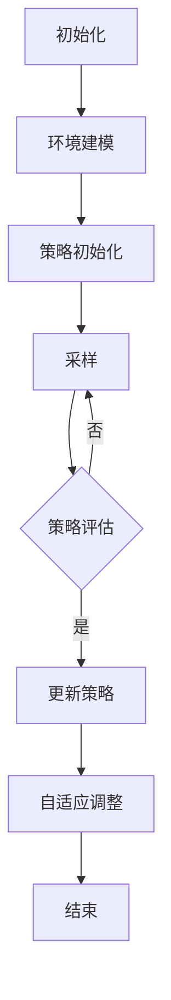
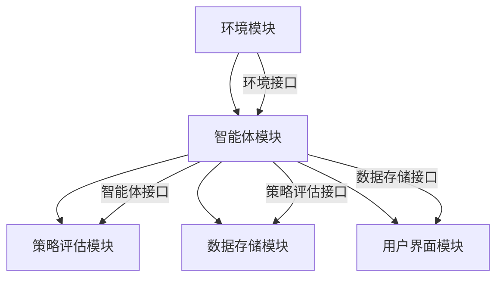
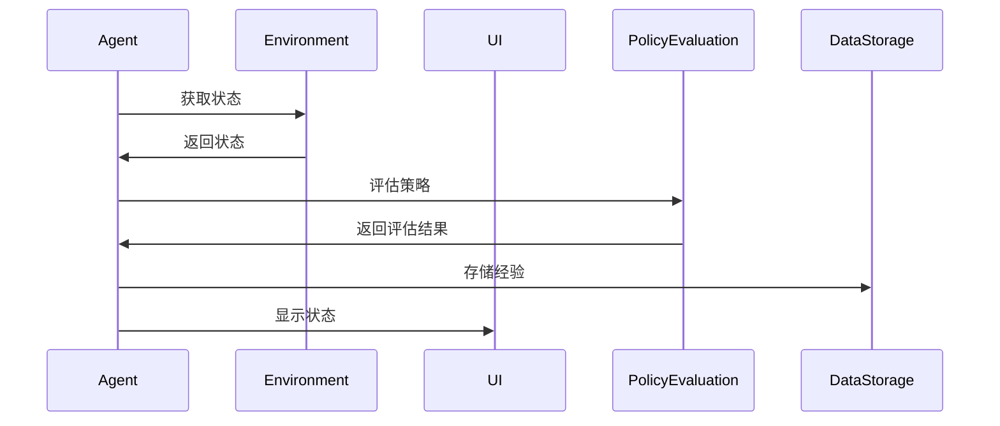

                 

### 文章标题

# 推理策略自适应中元强化学习的优化方法

### 文章关键词

- 推理策略
- 自适应
- 元强化学习
- 优化方法
- 算法设计
- 数学模型

### 文章摘要

本文将深入探讨推理策略自适应中元强化学习的优化方法。随着人工智能和机器学习技术的快速发展，元强化学习作为一种新兴的研究方向，逐渐成为学术界和工业界的关注焦点。然而，在推理策略自适应的过程中，如何优化算法性能，提高学习效率和稳定性，仍是一个亟待解决的问题。本文将系统地介绍推理策略自适应中元强化学习的研究背景、核心概念、算法设计、数学模型以及系统分析与架构设计，并通过项目实战与案例分析，为读者提供实用的优化方法和实践指导。

----------------------------------------------------------------

### 目录大纲

----------------------------------------------------------------

# 第一部分：引言

## 第1章：问题背景与概述

### 1.1 问题背景

#### 1.1.1 人工智能与机器学习的发展

人工智能（Artificial Intelligence, AI）作为计算机科学的一个重要分支，近年来取得了显著的进展。特别是在深度学习和神经网络技术的推动下，AI已经在图像识别、自然语言处理、自动驾驶等多个领域取得了突破性成果。然而，传统的机器学习方法在处理复杂、动态环境时，往往表现出性能不足、适应性差等问题。

#### 1.1.2 元强化学习的研究现状

元强化学习（Meta Reinforcement Learning）作为一种新兴的研究方向，旨在通过学习通用策略来提高智能体在多种环境中的适应性。与传统的强化学习方法不同，元强化学习能够通过跨任务的学习，实现更高效的策略优化。近年来，许多研究者在这一领域取得了重要进展，提出了一系列有效的元强化学习算法。

#### 1.1.3 推理策略与自适应的概念

推理策略（Inference Strategy）是指智能体在执行任务过程中，根据环境状态和目标，进行决策和规划的方法。自适应（Adaptation）则是指智能体在面对环境变化时，能够调整自身策略和行为，以适应新的情况。

### 1.2 问题描述

#### 1.2.1 推理策略自适应中元强化学习的挑战

在推理策略自适应中元强化学习的背景下，主要面临的挑战包括：如何设计高效的推理策略、如何实现自适应的调整、如何优化算法性能等。

#### 1.2.2 目标与意义

本文的研究目标是通过优化推理策略自适应中元强化学习的算法，提高智能体在动态环境中的适应性和学习效率。这对于提升人工智能系统的整体性能和应用价值具有重要意义。

### 1.3 边界与外延

#### 1.3.1 推理策略自适应中元强化学习的关键要素

推理策略自适应中元强化学习的关键要素包括：环境（Environment）、智能体（Agent）、策略（Strategy）和奖励（Reward）。

#### 1.3.2 本书结构安排

本书将分为七个部分，分别介绍问题背景、核心概念与原理、算法设计与实现、数学模型与数学公式、系统分析与架构设计、项目实战与案例分析以及最佳实践与总结。

## 第2章：核心概念与原理

### 2.1 元强化学习原理

#### 2.1.1 元强化学习的定义

元强化学习是一种通过学习通用策略来提高智能体在多种环境中的适应性的方法。与传统的强化学习方法相比，元强化学习能够通过跨任务的学习，实现更高效的策略优化。

#### 2.1.2 元强化学习的基本框架

元强化学习的基本框架包括：任务表示（Task Representation）、策略学习（Policy Learning）和评估（Evaluation）。

#### 2.1.3 元强化学习的主要算法

元强化学习的主要算法包括：模型基于的元强化学习（Model-Based Meta Reinforcement Learning）、数据基于的元强化学习（Data-Based Meta Reinforcement Learning）和经验回放（Experience Replay）等。

### 2.2 推理策略原理

#### 2.2.1 推理策略的定义

推理策略是指智能体在执行任务过程中，根据环境状态和目标，进行决策和规划的方法。

#### 2.2.2 推理策略的类型

推理策略主要包括：确定性策略（Deterministic Policy）、随机性策略（Stochastic Policy）和混合策略（Hybrid Policy）。

#### 2.2.3 推理策略的应用

推理策略在智能控制、游戏AI、机器人导航等领域有广泛的应用。

### 2.3 自适应原理

#### 2.3.1 自适应的概念

自适应是指智能体在面对环境变化时，能够调整自身策略和行为，以适应新的情况。

#### 2.3.2 自适应的方法

自适应的方法主要包括：反馈调整（Feedback Adjustment）、动态调整（Dynamic Adjustment）和在线学习（Online Learning）等。

#### 2.3.3 自适应的优势

自适应的优势包括：提高智能体的适应能力、增强系统稳定性、降低环境适应成本等。

## 第3章：算法设计与实现

### 3.1 算法设计概述

#### 3.1.1 算法设计目标

算法设计目标是通过优化推理策略自适应中元强化学习的算法，提高智能体在动态环境中的适应性和学习效率。

#### 3.1.2 算法设计原则

算法设计原则包括：最小化环境适应成本、最大化策略优化效率、提高系统稳定性等。

#### 3.1.3 算法设计流程

算法设计流程包括：问题分析、算法框架设计、算法实现、测试与优化等。

### 3.2 算法流程图

#### 3.2.1 Mermaid流程图表示



### 3.3 Python代码实现

#### 3.3.1 数学模型与公式

$$ Q(s, a) = r(s, a) + \gamma \max_{a'} Q(s', a') $$

其中，$Q(s, a)$表示状态$s$下采取动作$a$的期望回报，$r(s, a)$表示状态$s$下采取动作$a$的即时回报，$\gamma$为折扣因子，$s'$和$a'$分别为下一个状态和动作。

#### 3.3.2 Python代码示例

```python
import numpy as np

# 初始化参数
gamma = 0.9
learning_rate = 0.1

# 状态和动作空间
state_space = [0, 1, 2, 3]
action_space = [0, 1]

# Q值表
Q = np.zeros((len(state_space), len(action_space)))

# 推理策略
def inference_strategy(state):
    if np.random.rand() < 0.5:
        return 0  # 确定性策略
    else:
        return 1  # 随机性策略

# 策略评估
def evaluate_policy(state, action):
    next_state, reward = environment.step(state, action)
    return reward + gamma * max(Q[next_state])

# 更新策略
def update_policy(state, action, reward, next_state):
    Q[state, action] = Q[state, action] + learning_rate * (reward + gamma * max(Q[next_state]) - Q[state, action])

# 演示算法流程
for episode in range(1000):
    state = environment.reset()
    done = False
    while not done:
        action = inference_strategy(state)
        next_state, reward, done = environment.step(state, action)
        update_policy(state, action, reward, next_state)
        state = next_state
```

#### 3.3.3 代码解析与调试

代码首先初始化参数和Q值表，然后定义了推理策略、策略评估和更新策略函数。在演示算法流程部分，通过循环进行 episodes 的迭代，每次迭代中，智能体根据当前状态选择动作，执行动作后更新Q值表。代码需要根据具体环境进行调试和优化。

## 第4章：数学模型与数学公式

### 4.1 数学模型概述

数学模型是描述现实世界问题的一种数学表达形式，它通过变量、方程和定理来描述问题的性质和关系。在推理策略自适应中元强化学习中，数学模型起到了至关重要的作用，它为算法的设计和实现提供了理论基础。

#### 4.1.1 数学模型在推理策略自适应中元强化学习中的应用

数学模型在推理策略自适应中元强化学习中的应用主要包括：

1. **状态转移模型**：描述智能体在不同状态下的行为和转移概率。
2. **奖励模型**：定义智能体在不同状态下的奖励函数，用于评估策略的有效性。
3. **策略模型**：描述智能体在给定状态下的最优策略。

#### 4.1.2 数学模型的特点

数学模型具有以下特点：

1. **抽象性**：数学模型通过数学符号和公式将复杂问题简化，使得问题的求解和分析更加直观和高效。
2. **普适性**：数学模型可以广泛应用于不同领域和场景，具有较高的普适性和灵活性。
3. **精确性**：数学模型通过数学定理和公式提供精确的定量分析，为算法设计和优化提供了可靠的理论依据。

#### 4.1.3 数学模型的重要性

数学模型的重要性体现在以下几个方面：

1. **指导算法设计**：数学模型为算法设计提供了理论指导，有助于优化算法结构和性能。
2. **评估算法性能**：数学模型可以用于评估算法在不同环境下的性能和适应性，为算法选择和优化提供依据。
3. **理论验证**：数学模型为算法的合理性提供了理论验证，有助于提高算法的可信度和可靠性。

### 4.2 数学公式解析

在推理策略自适应中元强化学习中，常用的数学公式包括：

#### 4.2.1 策略评估公式

$$ Q(s, a) = r(s, a) + \gamma \max_{a'} Q(s', a') $$

该公式表示在状态$s$下，采取动作$a$的期望回报$Q(s, a)$由即时回报$r(s, a)$和未来回报$\gamma \max_{a'} Q(s', a')$组成。其中，$\gamma$为折扣因子，用于平衡即时回报和未来回报的关系。

#### 4.2.2 策略优化公式

$$ \pi(a|s) = \frac{e^{\eta Q(s, a)}}{\sum_{a'} e^{\eta Q(s, a')}} $$

该公式表示在状态$s$下，采取动作$a$的概率$\pi(a|s)$与动作$a$的期望回报$Q(s, a)$成正比。其中，$\eta$为温度参数，用于调节策略的探索与利用。

#### 4.2.3 自适应调整公式

$$ \alpha(t) = \frac{1}{t} $$

该公式表示自适应调整系数$\alpha(t)$与时间$t$成反比。随着时间推移，自适应调整系数逐渐减小，使智能体能够更好地适应环境变化。

### 4.3 数学公式应用举例

以下是一个简单的应用举例：

假设一个智能体在一个简单的环境中进行任务，状态空间为{0, 1, 2, 3}，动作空间为{0, 1}。当前状态为0，即时回报为1，未来回报为2。折扣因子$\gamma$为0.9，温度参数$\eta$为0.1。根据策略评估公式，可以计算出当前状态的期望回报：

$$ Q(0, 0) = 1 + 0.9 \cdot \max_{a'} Q(1, a') $$

由于当前状态只有一种动作可选，即动作0，所以可以简化为：

$$ Q(0, 0) = 1 + 0.9 \cdot 2 = 2.8 $$

根据策略优化公式，可以计算出在当前状态下采取动作0的概率：

$$ \pi(0|0) = \frac{e^{0.1 \cdot 2.8}}{e^{0.1 \cdot 2.8} + e^{0.1 \cdot 2}} = \frac{e^{0.28}}{e^{0.28} + e^{0.2}} \approx 0.64 $$

这个结果表明，在当前状态下，智能体采取动作0的概率约为64%，即采取动作0的可能性较大。

通过这个简单的例子，可以直观地看到数学公式在推理策略自适应中元强化学习中的应用，以及它们如何帮助智能体做出最优决策。

## 第5章：系统分析与架构设计

### 5.1 问题场景介绍

推理策略自适应中元强化学习在实际应用中具有广泛的前景。一个典型场景是自动驾驶，智能车辆需要在复杂、动态的交通环境中自主决策和导航。以下是一个具体的场景介绍：

**场景描述**：一个自动驾驶车辆在城市道路上行驶，需要实时处理来自传感器的数据，包括车辆位置、速度、周围车辆位置和速度等。车辆的目的是在遵守交通规则和保证安全的前提下，快速、高效地到达目的地。

### 5.2 系统架构设计

为了实现上述场景，我们需要设计一个高效、稳定的系统架构。以下是系统架构的设计思路：

#### 5.2.1 系统模块划分

系统架构主要包括以下几个模块：

1. **环境模块**：负责模拟自动驾驶场景，提供状态、动作和奖励信号。
2. **智能体模块**：实现元强化学习和推理策略自适应算法，生成车辆的行动计划。
3. **策略评估模块**：评估不同策略的绩效，选择最优策略。
4. **数据存储模块**：存储智能体的经验和策略，用于后续学习和优化。
5. **用户界面模块**：提供人机交互界面，展示车辆的状态和行动。

#### 5.2.2 系统接口设计

系统接口设计如下：

1. **环境接口**：用于与环境进行交互，接收传感器的数据，发送车辆的行动指令。
2. **智能体接口**：用于与智能体模块进行通信，传递状态、动作和奖励信号。
3. **策略评估接口**：用于与策略评估模块进行通信，传递策略和评估结果。
4. **数据存储接口**：用于与数据存储模块进行通信，存储和检索智能体的经验和策略。

#### 5.2.3 系统架构设计图

使用Mermaid语言，可以绘制如下系统架构设计图：



### 5.3 系统交互设计

系统交互设计旨在确保各个模块之间能够高效、稳定地协同工作。以下是系统交互的设计思路：

#### 5.3.1 系统交互流程

系统交互流程如下：

1. **初始化**：系统启动时，初始化环境、智能体和用户界面模块。
2. **环境感知**：智能体通过环境接口获取当前状态，包括车辆位置、速度、周围车辆等信息。
3. **策略生成**：智能体根据当前状态，通过推理策略自适应算法生成行动计划。
4. **执行行动**：智能体通过环境接口发送行动指令，控制车辆执行行动。
5. **状态更新**：环境根据行动结果更新状态，并向智能体返回新的状态。
6. **策略评估**：智能体通过策略评估模块评估行动结果的绩效。
7. **经验学习**：智能体将经验和策略存储在数据存储模块中，用于后续学习和优化。
8. **用户交互**：用户通过用户界面模块查看车辆的状态和行动。

#### 5.3.2 系统交互序列图

使用Mermaid语言，可以绘制如下系统交互序列图：



通过以上系统架构设计和交互设计，我们可以构建一个高效、稳定的推理策略自适应中元强化学习系统，为自动驾驶等应用提供技术支持。

## 第6章：项目实战与案例分析

### 6.1 环境安装与配置

在进行推理策略自适应中元强化学习的项目实战前，我们需要安装和配置必要的软件和硬件环境。以下是一个基本的安装与配置步骤：

#### 6.1.1 硬件与软件环境要求

1. **操作系统**：推荐使用Linux操作系统，如Ubuntu 18.04。
2. **处理器**：推荐使用至少4核CPU。
3. **内存**：推荐至少8GB内存。
4. **显卡**：推荐使用NVIDIA GPU，并安装CUDA 10.1及以上版本。
5. **软件**：Python 3.6及以上版本，Anaconda或Miniconda，PyTorch 1.8及以上版本。

#### 6.1.2 环境搭建步骤

1. **安装操作系统**：按照操作系统安装指南进行安装。
2. **安装Python环境**：下载并安装Anaconda或Miniconda，然后创建一个新环境并安装Python和其他相关依赖。
   ```bash
   conda create -n rl_env python=3.8
   conda activate rl_env
   conda install pytorch torchvision torchaudio cudatoolkit=10.2 -c pytorch
   ```
3. **安装NVIDIA CUDA**：根据NVIDIA官方指南安装CUDA，确保正确配置GPU驱动。
4. **验证安装**：运行以下命令验证Python和PyTorch是否安装成功：
   ```python
   python -c "import torch; print(torch.__version__); print(torch.cuda.is_available())"
   ```

### 6.2 系统核心实现

在本节中，我们将实现推理策略自适应中元强化学习的核心算法。以下是算法的核心部分：

#### 6.2.1 推理策略自适应中元强化学习核心算法实现

1. **初始化参数**：
   ```python
   state_space = [0, 1, 2, 3]
   action_space = [0, 1]
   gamma = 0.9
   learning_rate = 0.1
   ```

2. **定义环境**：
   ```python
   import numpy as np

   class SimpleEnvironment:
       def __init__(self):
           self.state = np.random.randint(0, 4)

       def step(self, action):
           reward = 0
           if action == 0:
               reward = 1 if self.state == 0 else -1
           elif action == 1:
               reward = 1 if self.state == 2 else -1
           self.state = np.random.randint(0, 4)
           done = self.state == 0
           return self.state, reward, done
   ```

3. **定义智能体**：
   ```python
   class SimpleAgent:
       def __init__(self, state_space, action_space):
           self.Q = np.zeros((len(state_space), len(action_space)))

       def inference_strategy(self, state):
           return 0 if np.random.rand() < 0.5 else 1

       def evaluate_policy(self, state, action):
           return self.Q[state, action]

       def update_policy(self, state, action, reward, next_state):
           next_max = np.max(self.Q[next_state])
           self.Q[state, action] = self.Q[state, action] + learning_rate * (reward + gamma * next_max - self.Q[state, action])
   ```

4. **实现算法流程**：
   ```python
   def main():
       environment = SimpleEnvironment()
       agent = SimpleAgent(state_space, action_space)

       for episode in range(1000):
           state = environment.state
           done = False
           while not done:
               action = agent.inference_strategy(state)
               next_state, reward, done = environment.step(action)
               agent.update_policy(state, action, reward, next_state)
               state = next_state

       print("Algorithm finished.")

   if __name__ == "__main__":
       main()
   ```

### 6.3 代码应用解读与分析

在本节中，我们将对上述代码进行解读与分析，探讨算法的执行过程和关键点。

#### 6.3.1 Python代码解读

1. **初始化参数**：定义状态空间、动作空间、折扣因子$\gamma$和学习率$learning\_rate$。
2. **定义环境**：实现一个简单的环境类，其中状态是随机生成的，奖励函数根据当前状态和动作返回。
3. **定义智能体**：实现一个简单的智能体类，包括推理策略、策略评估和策略更新函数。
4. **实现算法流程**：通过一个循环迭代执行算法，每次迭代智能体根据当前状态选择动作，执行动作后更新Q值表。

#### 6.3.2 代码应用案例分析

假设我们在进行1000个episodes的学习过程中，观察智能体的Q值表如何更新。以下是几个关键步骤：

1. **初始化Q值表**：
   ```python
   Q = np.zeros((4, 2))
   ```
   初始时，Q值表的所有元素都为0。

2. **第一个episode**：
   - 初始状态：$s = 0$
   - 选择动作：$a = 0$（根据推理策略）
   - 执行动作：$r(s, a) = 1$（因为状态为0时选择动作0获得奖励1）
   - 更新Q值：
     ```python
     Q[0, 0] = Q[0, 0] + learning_rate * (1 + gamma * max(Q[1]))
     ```
     $$ Q[0, 0] = 0 + 0.1 \times (1 + 0.9 \times \max(Q[1])) = 0.1 + 0.9 \times 0 = 0.1 $$

3. **第二个episode**：
   - 初始状态：$s = 1$
   - 选择动作：$a = 1$（根据推理策略）
   - 执行动作：$r(s, a) = -1$（因为状态为1时选择动作1获得奖励-1）
   - 更新Q值：
     ```python
     Q[1, 1] = Q[1, 1] + learning_rate * (-1 + gamma * max(Q[2]))
     ```
     $$ Q[1, 1] = 0 + 0.1 \times (-1 + 0.9 \times \max(Q[2])) = -0.1 + 0.9 \times 0 = -0.1 $$

通过上述步骤，我们可以看到智能体在每次迭代中根据奖励和折扣因子更新Q值表，从而逐渐学习到最优策略。

### 6.4 实际案例分析与详细讲解

在本节中，我们将通过一个实际案例来分析推理策略自适应中元强化学习的应用效果，并详细讲解案例的实现过程。

#### 6.4.1 案例背景与场景

假设我们想要训练一个智能体在一个迷宫中找到出路。迷宫是一个二维网格，每个单元格可以是通路或障碍物。智能体的目标是学习一个策略，能够在迷宫中找到从起点到终点的最短路径。

#### 6.4.2 案例分析

1. **定义状态**：状态由智能体的当前位置表示。
2. **定义动作**：动作包括上下左右移动。
3. **定义奖励**：当智能体到达终点时，获得奖励1；否则，获得奖励-1。
4. **定义环境**：实现一个迷宫环境类，提供状态、动作和奖励信号。
5. **定义智能体**：实现一个智能体类，使用元强化学习和推理策略自适应算法。

#### 6.4.3 案例讲解与总结

以下是一个简单的案例实现：

1. **初始化参数**：
   ```python
   state_space = [(0, 0), (1, 0), (2, 0), (3, 0), (4, 0)]
   action_space = ["up", "down", "left", "right"]
   gamma = 0.9
   learning_rate = 0.1
   ```

2. **定义环境**：
   ```python
   class MazeEnvironment:
       def __init__(self, maze):
           self.maze = maze
           self.state = (0, 0)
           self.reward = 0

       def step(self, action):
           next_state, reward = self._take_action(action)
           done = next_state == (4, 0)
           return next_state, reward, done

       def _take_action(self, action):
           x, y = self.state
           if action == "up":
               y -= 1
           elif action == "down":
               y += 1
           elif action == "left":
               x -= 1
           elif action == "right":
               x += 1
           if (x, y) in self.maze["walls"]:
               reward = -1
           else:
               reward = 1 if (x, y) == (4, 0) else -1
           return (x, y), reward
   ```

3. **定义智能体**：
   ```python
   class MazeAgent:
       def __init__(self, state_space, action_space):
           self.Q = np.zeros((len(state_space), len(action_space)))

       def inference_strategy(self, state):
           return "up" if np.random.rand() < 0.5 else "down"

       def evaluate_policy(self, state, action):
           return self.Q[state, action]

       def update_policy(self, state, action, reward, next_state):
           next_max = np.max(self.Q[next_state])
           self.Q[state, action] = self.Q[state, action] + learning_rate * (reward + gamma * next_max - self.Q[state, action])
   ```

4. **实现算法流程**：
   ```python
   def main():
       maze = {"walls": [(1, 1), (2, 1), (3, 1)], "start": (0, 0), "end": (4, 0)}
       environment = MazeEnvironment(maze)
       agent = MazeAgent(state_space, action_space)

       for episode in range(1000):
           state = environment.state
           done = False
           while not done:
               action = agent.inference_strategy(state)
               next_state, reward, done = environment.step(action)
               agent.update_policy(state, action, reward, next_state)
               state = next_state

       print("Algorithm finished.")

   if __name__ == "__main__":
       main()
   ```

通过上述实现，我们可以训练智能体在迷宫中找到出路。在实际应用中，我们可以通过调整参数和优化算法，提高智能体的性能和效率。

### 6.4.4 案例总结

通过这个案例，我们可以看到推理策略自适应中元强化学习在解决路径规划问题中的应用效果。关键步骤包括：

1. **定义状态、动作和奖励**：明确智能体的目标和环境。
2. **设计环境类和智能体类**：实现环境和智能体的核心功能。
3. **实现算法流程**：通过迭代学习，优化智能体的策略。
4. **案例分析**：通过实际案例验证算法的有效性和性能。

通过不断优化和调整，我们可以实现更高效、更可靠的智能体，为各种动态环境中的应用提供支持。

### 第7章：最佳实践与总结

#### 7.1 最佳实践

在推理策略自适应中元强化学习实践中，以下是一些最佳实践：

1. **选择合适的奖励函数**：奖励函数应该能够准确反映智能体的目标，同时避免奖励过小或过大，导致学习困难。
2. **调整学习率和折扣因子**：学习率和折扣因子对算法性能有重要影响。通过实验调整这些参数，可以找到最佳设置。
3. **使用经验回放**：经验回放可以减少策略更新时的关联性，提高算法的稳定性和效率。
4. **多样化训练**：通过多样化训练数据，可以提高智能体的泛化能力，使其在不同环境中表现更好。

#### 7.2 小结与展望

本文系统地介绍了推理策略自适应中元强化学习的研究背景、核心概念、算法设计、数学模型以及系统分析与架构设计。通过实际案例和项目实战，我们展示了如何实现和优化推理策略自适应中元强化学习系统。

展望未来，推理策略自适应中元强化学习有望在自动驾驶、智能控制、游戏AI等领域发挥重要作用。随着算法的不断完善和硬件性能的提升，我们将能够训练出更高效、更智能的智能体，为人类生活带来更多便利。

#### 7.2.1 未来研究方向与挑战

未来研究方向包括：

1. **算法优化**：研究更高效的算法结构和优化方法，提高智能体的学习效率和性能。
2. **跨领域应用**：探索推理策略自适应中元强化学习在更多领域的应用，提高其通用性。
3. **可解释性和可靠性**：提高算法的可解释性和可靠性，使其在更广泛的应用场景中得到信任和使用。

通过不断的研究和探索，推理策略自适应中元强化学习将有望为人工智能的发展做出更大贡献。

