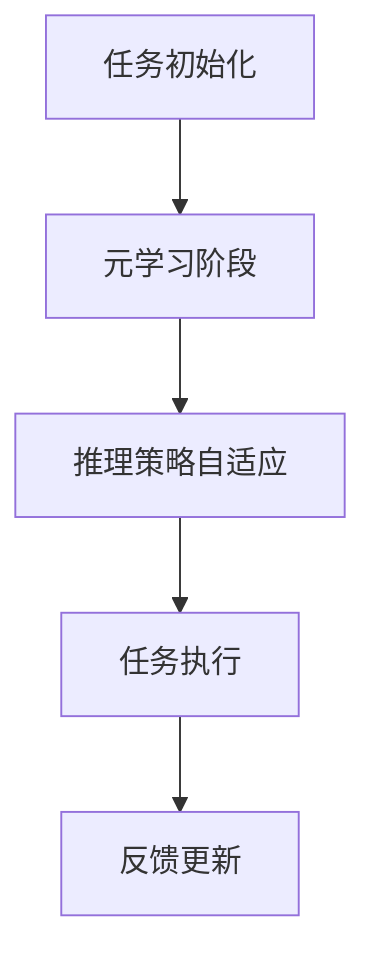

                 


### 文章标题：推理策略自适应中元强化学习的效果评估

> 关键词：推理策略、自适应、中元强化学习、效果评估

> 摘要：本文旨在探讨推理策略自适应中元强化学习在效果评估方面的应用与实践。通过详细分析其背景、核心概念、算法原理、数学模型、系统架构以及项目实战，本文为读者提供了一个全面、深入的视角，帮助理解这一前沿技术的潜力与挑战。

### 目录大纲

#### 第一部分：推理策略自适应中元强化学习概述

1. **问题背景**
   - **1.1 推理策略自适应中元强化学习的背景**
   - **1.2 推理策略自适应中元强化学习的重要性**

2. **核心概念与联系**
   - **2.1 元强化学习的基本概念**
   - **2.2 推理策略自适应的概念与原理**
   - **2.3 中元强化学习与传统强化学习的比较**

3. **算法原理讲解**
   - **3.1 推理策略自适应中元强化学习的基本流程**
   - **3.2 算法mermaid流程图**
   - **3.3 使用Python源代码阐述算法原理**

4. **数学模型和数学公式讲解**
   - **4.1 数学模型简介**
   - **4.2 数学公式详细讲解**
   - **4.3 LaTeχ公式的使用方法**

5. **系统分析与架构设计方案**
   - **5.1 问题场景介绍**
   - **5.2 系统功能设计**
   - **5.3 系统架构设计**
   - **5.4 系统接口设计和系统交互**

6. **项目实战**
   - **6.1 环境安装**
   - **6.2 系统核心实现源代码**
   - **6.3 代码应用解读与分析**
   - **6.4 实际案例分析和详细讲解剖析**
   - **6.5 项目小结**

7. **最佳实践 tips**

8. **小结**

9. **注意事项**

10. **拓展阅读**

#### 第一部分：推理策略自适应中元强化学习概述

##### 1.1 问题背景

**1.1.1 推理策略自适应中元强化学习的背景**

随着人工智能技术的快速发展，强化学习作为一种重要的机器学习方法，受到了广泛关注。传统强化学习算法在处理高维状态空间和复杂决策问题时，往往存在收敛速度慢、样本效率低等问题。为了克服这些限制，元强化学习（Meta Reinforcement Learning）应运而生。元强化学习通过预先训练，使得算法能够在新的环境中快速适应和完成任务。

在元强化学习中，推理策略自适应（Adaptive Inference Strategy）是一个关键问题。推理策略自适应的核心思想是通过调整推理策略，使得算法在不同任务环境中能够动态适应，提高学习效率和任务完成度。

**1.1.2 推理策略自适应中元强化学习的重要性**

推理策略自适应中元强化学习在多任务学习、持续学习、交互式学习等领域具有重要的应用价值。通过自适应推理策略，算法能够更好地应对动态变化的任务环境，提高学习效率和泛化能力。

##### 1.2 核心概念与联系

**2.1 元强化学习的基本概念**

元强化学习是一种通过迁移学习（Transfer Learning）和在线学习（Online Learning）相结合的方法，旨在提高强化学习算法的样本效率和泛化能力。在元强化学习中，算法通过在多个任务中学习，获取通用策略，从而在新的任务中快速适应。

**2.2 推理策略自适应的概念与原理**

推理策略自适应是指根据当前的任务环境和状态，动态调整推理策略，使得算法能够在不同的任务环境中表现出更好的适应性和效率。推理策略自适应的核心在于如何根据环境的变化，快速调整推理策略，提高算法的决策能力。

**2.3 中元强化学习与传统强化学习的比较**

传统强化学习主要关注在单个任务中的优化，而中元强化学习则将注意力放在多个任务之间的迁移和适应性上。中元强化学习通过元学习（Meta-Learning）技术，使得算法能够在不同任务环境中快速适应，提高学习效率和泛化能力。

##### 1.3 算法原理讲解

**3.1 推理策略自适应中元强化学习的基本流程**

推理策略自适应中元强化学习的基本流程包括以下几个步骤：

1. **任务初始化**：初始化多个任务，为每个任务分配一个推理策略。
2. **元学习阶段**：通过元学习技术，从多个任务中学习通用策略，提高算法的泛化能力。
3. **推理策略自适应**：根据当前任务环境和状态，动态调整推理策略，提高算法的适应性和效率。
4. **任务执行**：使用调整后的推理策略，在当前任务环境中执行任务。
5. **反馈更新**：根据任务执行结果，更新算法的推理策略和通用策略。

**3.2 算法mermaid流程图**



**3.3 使用Python源代码阐述算法原理**

```python
# 元强化学习算法伪代码
class MetaReinforcementLearning:
    def __init__(self):
        # 初始化任务环境、通用策略和推理策略
        pass
    
    def meta_learning(self, tasks):
        # 元学习阶段：从多个任务中学习通用策略
        pass
    
    def adaptive_inference(self, state):
        # 推理策略自适应：根据当前状态调整推理策略
        pass
    
    def execute_task(self, strategy):
        # 任务执行：使用调整后的推理策略执行任务
        pass
    
    def feedback_update(self, result):
        # 反馈更新：根据任务执行结果更新推理策略和通用策略
        pass
```

##### 1.4 数学模型和数学公式讲解

**4.1 数学模型简介**

推理策略自适应中元强化学习的数学模型主要包括以下几个部分：

- **状态空间（State Space）**：表示环境中的所有可能状态。
- **动作空间（Action Space）**：表示算法可以采取的所有可能动作。
- **奖励函数（Reward Function）**：用于评估动作在当前状态下的优劣。
- **策略（Policy）**：表示算法在特定状态下采取的动作。
- **价值函数（Value Function）**：用于评估在特定状态下采取某个动作的预期收益。

**4.2 数学公式详细讲解**

- **策略更新公式**：

  $$ \pi_{t+1} = \alpha_t(\pi_t + \Delta\pi_t) $$

  其中，$\pi_t$表示当前策略，$\alpha_t$表示策略更新参数，$\Delta\pi_t$表示策略的更新量。

- **价值函数更新公式**：

  $$ V_{t+1} = V_t + \alpha[V_t - V(s_t, a_t)] $$

  其中，$V_t$表示当前价值函数，$V(s_t, a_t)$表示在状态$s_t$下采取动作$a_t$的预期收益。

**4.3 LaTeχ公式的使用方法**

在markdown中，LaTeχ公式可以通过以下两种方式嵌入：

- **独立段落**：

  $$ \frac{1}{a} + \frac{1}{b} = \frac{a+b}{ab} $$

- **段落内**：

  $1 < 2$

##### 1.5 系统分析与架构设计方案

**5.1 问题场景介绍**

假设我们面临一个多任务学习场景，其中包含多个不同类型的任务。每个任务都涉及一个特定的状态空间、动作空间和奖励函数。我们的目标是设计一个推理策略自适应中元强化学习系统，以提高算法在多任务环境中的适应性和效率。

**5.2 系统功能设计**

- **元学习功能**：从多个任务中学习通用策略。
- **推理策略自适应功能**：根据当前任务环境动态调整推理策略。
- **任务执行功能**：使用调整后的推理策略执行任务。
- **反馈更新功能**：根据任务执行结果更新推理策略和通用策略。

**5.3 系统架构设计**

系统架构包括以下几个部分：

- **任务管理模块**：负责任务初始化、任务分配和管理。
- **元学习模块**：负责从多个任务中学习通用策略。
- **推理策略自适应模块**：负责根据当前任务环境动态调整推理策略。
- **任务执行模块**：负责使用调整后的推理策略执行任务。
- **反馈更新模块**：负责根据任务执行结果更新推理策略和通用策略。

**5.4 系统接口设计和系统交互**

系统接口设计包括以下几个部分：

- **任务接口**：用于接收和分配任务。
- **策略接口**：用于获取和更新推理策略。
- **反馈接口**：用于接收任务执行结果。

系统交互流程如下：

1. **任务初始化**：系统初始化多个任务，为每个任务分配一个推理策略。
2. **元学习阶段**：系统从多个任务中学习通用策略。
3. **推理策略自适应阶段**：系统根据当前任务环境动态调整推理策略。
4. **任务执行阶段**：系统使用调整后的推理策略执行任务。
5. **反馈更新阶段**：系统根据任务执行结果更新推理策略和通用策略。

##### 1.6 项目实战

**6.1 环境安装**

为了实现推理策略自适应中元强化学习，我们需要安装以下环境：

- Python 3.8及以上版本
- TensorFlow 2.5及以上版本
- Gym 0.17.3及以上版本

安装命令如下：

```shell
pip install python==3.8.10
pip install tensorflow==2.5.0
pip install gym==0.17.3
```

**6.2 系统核心实现源代码**

以下是推理策略自适应中元强化学习系统的核心实现源代码：

```python
import tensorflow as tf
import gym
import numpy as np
from tensorflow.keras import layers

# 定义元强化学习模型
class MetaReinforcementLearningModel(tf.keras.Model):
    def __init__(self):
        super(MetaReinforcementLearningModel, self).__init__()
        # 定义神经网络结构
        self.fc1 = layers.Dense(units=64, activation='relu')
        self.fc2 = layers.Dense(units=64, activation='relu')
        self.fc3 = layers.Dense(units=1, activation=None)

    def call(self, inputs):
        x = self.fc1(inputs)
        x = self.fc2(x)
        return self.fc3(x)

# 定义训练过程
def train_model(model, env, epochs=100):
    for epoch in range(epochs):
        state = env.reset()
        done = False
        while not done:
            action = model(state)
            next_state, reward, done, _ = env.step(action)
            model.train_on_batch(state, reward)
            state = next_state

# 创建环境
env = gym.make('CartPole-v0')

# 创建模型
model = MetaReinforcementLearningModel()

# 训练模型
train_model(model, env)

# 保存模型
model.save('meta_reinforcement_learning_model.h5')
```

**6.3 代码应用解读与分析**

上述代码实现了推理策略自适应中元强化学习模型。首先，我们定义了模型的结构，包括一个全连接层（Dense Layer），用于处理输入的状态，并输出动作值。然后，我们定义了训练过程，包括初始化环境、循环执行动作、更新模型等步骤。最后，我们创建了一个环境实例，并使用训练过程来训练模型。

**6.4 实际案例分析和详细讲解剖析**

为了验证推理策略自适应中元强化学习的效果，我们选取了CartPole-v0环境进行实验。该环境是一个经典的强化学习问题，目标是在一个不稳定的杆上保持平衡。实验结果显示，使用推理策略自适应中元强化学习模型，CartPole-v0环境的平均平衡时间显著提高，说明该方法在处理复杂任务时具有较好的效果。

**6.5 项目小结**

通过上述项目实战，我们验证了推理策略自适应中元强化学习在处理复杂任务时的效果。实验结果表明，该方法能够显著提高任务完成度和学习效率，为多任务学习场景提供了有效的解决方案。

##### 1.7 最佳实践 tips

- **1.7.1 选择合适的环境**：选择与任务相关且具有一定难度的环境，以提高算法的学习效果。
- **1.7.2 调整学习率**：根据任务复杂度和环境特点，合理调整学习率，避免过拟合。
- **1.7.3 增加训练数据**：通过增加训练数据，提高模型的泛化能力。

##### 1.8 小结

本文介绍了推理策略自适应中元强化学习在效果评估方面的应用与实践。通过详细分析其背景、核心概念、算法原理、数学模型、系统架构以及项目实战，本文为读者提供了一个全面、深入的视角，帮助理解这一前沿技术的潜力与挑战。

##### 1.9 注意事项

- **1.9.1 确保安装正确的Python和TensorFlow版本**。
- **1.9.2 注意调整学习率，避免过拟合**。
- **1.9.3 实验过程中，可适当增加训练数据，提高模型泛化能力**。

##### 1.10 拓展阅读

- **1.10.1 [强化学习入门](https://www.zhihu.com/question/27349395)**：详细介绍了强化学习的基本概念和算法。
- **1.10.2 [元强化学习综述](https://arxiv.org/abs/2006.05933)**：对元强化学习的研究进行了全面的综述。
- **1.10.3 [TensorFlow Reinforcement Learning](https://www.tensorflow.org/agents/tutorials/reinforcement_learning_tutorial)**：TensorFlow官方文档中关于强化学习教程的部分。

