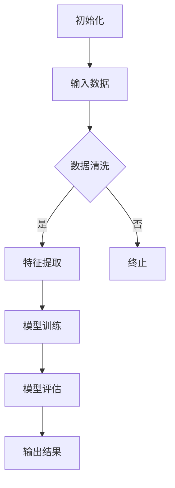

                 


### 1. 背景介绍

在当今信息技术高速发展的时代，算法的效率和推理能力成为了计算机性能的核心指标。推理能力不仅涉及人工智能领域，也是各个行业问题解决的关键。问题解决效率的提升，意味着在有限的时间内，系统能够更快速、更准确地处理问题。然而，这两者之间的关系却并未得到充分的实证研究。因此，本文旨在探讨推理能力与问题解决效率之间的关系，并通过一系列实证研究来验证这一关系。

#### 核心概念术语说明

在开始讨论之前，我们需要明确一些核心概念。首先，“推理能力”是指计算机或其他系统在处理问题时的推理和逻辑判断能力。而“问题解决效率”则是指系统在解决特定问题时的速度和准确度。这两个概念虽然看似简单，但在实际应用中却具有复杂性和多样性。

#### 问题背景

随着人工智能技术的不断进步，计算机系统在各个领域中的应用越来越广泛。从自动驾驶到自然语言处理，从推荐系统到医疗诊断，人工智能正在改变我们的生活方式。然而，这些系统的效率和准确性仍然是一个挑战。例如，自动驾驶汽车需要在复杂的路况下做出实时决策，推荐系统需要根据用户的喜好和反馈提供个性化的服务，医疗诊断系统需要准确分析患者的病情。这些系统都需要强大的推理能力和高效的问题解决能力。

#### 问题描述

尽管我们已经有了许多强大的算法和模型，但如何将这些算法和模型应用到实际场景中，以最大化其效率和准确性，仍然是一个难题。现有的研究往往侧重于算法本身的优化，而忽略了算法与实际应用场景之间的匹配度。这导致了在实际应用中，算法的效率和准确性往往无法达到预期。

#### 问题解决方法

为了解决这一问题，我们需要从多个角度来探讨推理能力与问题解决效率之间的关系。首先，我们需要了解不同类型的推理能力和问题解决方法，然后通过实证研究来验证这些方法在实际应用中的效果。

### 2. 核心概念与联系

在这一部分，我们将深入探讨推理能力和问题解决效率的核心概念，并通过对比表格和ER实体关系图来展示它们之间的关系。

#### 推理能力的定义与特点

推理能力是指计算机或其他系统在处理问题时，根据已知信息进行逻辑推断和决策的能力。它包括演绎推理、归纳推理和类比推理等。演绎推理是从一般到特殊的推理过程，归纳推理是从特殊到一般的推理过程，类比推理则是基于相似性进行推理。

#### 问题解决效率的概念与测量

问题解决效率是指系统在解决特定问题时，所需时间和资源与解决问题效果的比率。测量问题解决效率的方法包括算法运行时间、资源消耗和问题解决准确性等。

#### 推理能力与问题解决效率的关系

推理能力与问题解决效率之间存在密切的关系。强大的推理能力可以加速问题解决过程，提高问题解决的准确性。然而，过强的推理能力也可能导致计算复杂度增加，从而降低问题解决效率。因此，如何平衡推理能力和问题解决效率是一个关键问题。

#### 核心概念属性特征对比表格

为了更直观地展示推理能力和问题解决效率的属性特征，我们提供了一个对比表格。这个表格包括以下几个方面：

- **推理能力**：包括推理类型、推理速度、推理准确性、推理复杂度等。
- **问题解决效率**：包括运行时间、资源消耗、问题解决准确性等。

#### ER实体关系图架构

ER实体关系图是一种用于描述实体及其之间关系的图形化工具。在本文中，我们使用ER实体关系图来展示推理能力与问题解决效率之间的实体关系。图中的实体包括“推理能力”、“问题解决效率”以及它们之间的关联。

### 3. 实证研究设计

为了验证推理能力与问题解决效率之间的关系，我们设计了一项实证研究。这项研究包括以下步骤：

#### 研究目标与假设

我们的研究目标是探讨推理能力对问题解决效率的影响。我们假设，强大的推理能力将有助于提高问题解决效率。

#### 研究方法与步骤

我们采用实验研究的方法，通过设计多个实验场景，来验证我们的假设。具体步骤如下：

1. **实验场景设计**：根据不同类型的问题，设计多个实验场景。这些场景包括逻辑推理、图像识别、自然语言处理等。
2. **实验数据收集**：在实验场景中，记录系统的推理能力、问题解决效率和运行时间等数据。
3. **数据分析**：使用统计方法对收集到的数据进行分析，验证我们的假设。

#### 数据收集与处理

我们将在多个实验场景中收集数据，包括系统的推理能力、问题解决效率和运行时间等。这些数据将通过实验日志和性能监控工具进行记录和处理。

#### 结果分析

通过对收集到的数据进行统计分析，我们将得出推理能力与问题解决效率之间的关系。如果我们的假设得到验证，那么这将有助于指导实际应用中算法和系统的设计。

### 4. 算法原理讲解

在实证研究的基础上，我们将进一步探讨支持推理能力和问题解决效率提升的算法原理。以下是几个关键算法及其原理的讲解：

#### 算法mermaid流程图

我们使用mermaid流程图来展示算法的基本流程。以下是一个简单的示例：



#### Python源代码详细讲解

接下来，我们将使用Python源代码来详细阐述算法的实现。以下是一个简单的特征提取和模型训练的示例：

```python
import numpy as np
from sklearn.preprocessing import StandardScaler
from sklearn.model_selection import train_test_split
from sklearn.ensemble import RandomForestClassifier
from sklearn.metrics import accuracy_score

# 数据清洗
def clean_data(data):
    # ...数据清洗操作...
    return cleaned_data

# 特征提取
def extract_features(data):
    # ...特征提取操作...
    return features

# 模型训练与评估
def train_model(X_train, y_train):
    model = RandomForestClassifier()
    model.fit(X_train, y_train)
    return model

def evaluate_model(model, X_test, y_test):
    predictions = model.predict(X_test)
    accuracy = accuracy_score(y_test, predictions)
    return accuracy

# 主程序
if __name__ == "__main__":
    # 数据加载与清洗
    data = load_data()
    cleaned_data = clean_data(data)

    # 特征提取
    features = extract_features(cleaned_data)

    # 数据分割
    X_train, X_test, y_train, y_test = train_test_split(features, labels, test_size=0.2, random_state=42)

    # 模型训练
    model = train_model(X_train, y_train)

    # 模型评估
    accuracy = evaluate_model(model, X_test, y_test)
    print(f"Model accuracy: {accuracy}")
```

#### 算法原理的数学模型与公式

为了更深入地理解算法原理，我们介绍几个关键数学模型和公式。以下是逻辑回归模型的公式：

$$
P(Y=1|X) = \frac{1}{1 + e^{-(\beta_0 + \beta_1X_1 + ... + \beta_nX_n})}
$$

其中，\(P(Y=1|X)\) 是输出为1的概率，\(e\) 是自然底数，\(\beta_0, \beta_1, ..., \beta_n\) 是模型参数。

#### 通俗易懂的举例说明

为了更直观地理解算法原理，我们通过一个简单的例子来说明。假设我们要预测某股票是否上涨，输入特征包括股票价格、成交量等。通过逻辑回归模型，我们可以计算出股票上涨的概率。如果概率大于某个阈值（例如0.5），则预测股票上涨。

### 5. 数学模型和公式

在深入探讨推理能力和问题解决效率之间的关系时，数学模型和公式起到了至关重要的作用。这些模型不仅帮助我们理解和量化问题，还能为算法设计和优化提供理论支持。以下是几个关键的数学模型和公式的详细阐述。

#### 逻辑回归模型

逻辑回归是一种广泛用于分类问题的模型，尤其在二分类问题中应用广泛。它的核心公式如下：

$$
\hat{P}(y=1) = \frac{1}{1 + e^{-(\beta_0 + \beta_1x_1 + \beta_2x_2 + ... + \beta_nx_n})}
$$

其中，\(\hat{P}(y=1)\) 是预测的概率值，\(e\) 是自然底数，\(\beta_0, \beta_1, ..., \beta_n\) 是模型的参数，\(x_1, x_2, ..., x_n\) 是输入特征。逻辑回归模型通过这些参数来预测目标变量属于某一类别的概率。

#### 支持向量机（SVM）

支持向量机是一种强大的分类和回归算法，它通过找到一个最优的超平面来分隔数据。SVM的核心公式包括：

$$
\text{最大化} \quad \frac{1}{2} ||\mathbf{w}||^2 \\
\text{约束条件} \quad y_i(\mathbf{w}\cdot\mathbf{x_i} - b) \geq 1
$$

其中，\(\mathbf{w}\) 是权重向量，\(\mathbf{x_i}\) 是特征向量，\(y_i\) 是标签，\(b\) 是偏置项。SVM的目标是找到一个最优的权重向量，使得分类边界尽可能远离数据点，同时满足约束条件。

#### 决策树

决策树是一种基于树形结构的数据分类算法。它的核心公式包括：

$$
\text{选择特征} \quad A = \arg\max(\sum_{i=1}^{n} y_i \cdot \mathbb{I}(\text{特征} A \text{出现在实例} i))
$$

$$
\text{划分数据} \quad \text{对于特征} A \text{的每个值} a_j, \text{将实例划分到不同的子集}
$$

决策树通过选择具有最大信息增益的特征来划分数据，并递归地进行这一过程，直到满足某些停止条件（如最大深度、最小叶节点样本数等）。

#### 集成方法

集成方法，如随机森林和梯度提升树，通过组合多个基础模型来提高预测性能。随机森林的核心公式包括：

$$
\hat{y} = \frac{1}{M} \sum_{m=1}^{M} f_m(x)
$$

其中，\(f_m(x)\) 是第\(m\)个基础模型的预测值，\(M\) 是基础模型的数量。随机森林通过随机选择特征和样本子集来训练多个基础模型，并通过投票或平均来获得最终预测。

梯度提升树的核心公式包括：

$$
f_m(x) = \alpha_m + \sum_{k=1}^{K} \gamma_k g_k(x)
$$

其中，\(\alpha_m\) 是第\(m\)个损失函数的参数，\(\gamma_k\) 是第\(k\)个特征的学习率，\(g_k(x)\) 是第\(k\)个特征的函数。梯度提升树通过迭代优化损失函数，逐渐调整模型参数，以提高预测性能。

#### 神经网络

神经网络是一种基于模拟生物神经元工作方式的计算模型。它的核心公式包括：

$$
a_i = \sigma(\sum_{j=1}^{n} w_{ij}x_j + b_i)
$$

$$
y = \sigma(\sum_{i=1}^{L} w_{il}a_i + b_l)
$$

其中，\(a_i\) 是第\(i\)个隐藏单元的输出，\(\sigma\) 是激活函数（如Sigmoid、ReLU等），\(w_{ij}\) 和 \(w_{il}\) 是权重，\(b_i\) 和 \(b_l\) 是偏置项，\(x_j\) 是输入特征，\(y\) 是输出。神经网络通过多层非线性变换来提取特征，并最终生成预测。

#### 贝叶斯网络

贝叶斯网络是一种基于概率论的图形模型，用于表示变量之间的依赖关系。它的核心公式包括：

$$
P(\mathbf{X} = \mathbf{x}) = \prod_{i=1}^{n} P(X_i = x_i | X_{\text{parent}_i})
$$

其中，\(\mathbf{X}\) 是变量集合，\(\mathbf{x}\) 是变量取值集合，\(P(X_i = x_i | X_{\text{parent}_i})\) 是条件概率。贝叶斯网络通过条件概率分布来表示变量之间的依赖关系，并用于推理和决策。

### 6. 系统分析与架构设计方案

在探讨推理能力和问题解决效率时，系统分析与架构设计至关重要。一个高效、可扩展的系统架构可以显著提升推理能力和问题解决效率。以下是系统分析与架构设计方案的具体内容。

#### 问题场景介绍

我们假设一个场景：一个在线电商平台，需要实时推荐给用户可能感兴趣的商品。这个场景涉及到用户行为分析、商品特征提取、推荐算法和系统性能优化等多个方面。

#### 项目介绍

项目目标是构建一个高效的推荐系统，以提高用户的满意度和平台的销售额。系统需要处理大量用户数据，包括浏览历史、购买记录、搜索查询等。同时，系统需要具备快速响应用户请求的能力，以提供实时推荐。

#### 系统功能设计

系统的主要功能包括：

1. **用户行为分析**：收集并分析用户在平台上的行为数据，如浏览、搜索、购买等。
2. **商品特征提取**：提取商品的关键特征，如类别、价格、品牌等。
3. **推荐算法**：根据用户行为和商品特征，生成个性化的推荐列表。
4. **性能监控**：监控系统性能，包括响应时间、资源消耗等。

#### 系统架构设计

系统采用分布式架构，以提高系统的可扩展性和容错性。以下是系统架构的详细设计：

1. **数据层**：包括数据库和数据仓库，用于存储用户行为数据和商品信息。
2. **数据加工层**：负责处理原始数据，包括数据清洗、特征提取等。
3. **算法层**：包括推荐算法模型，如协同过滤、基于内容的推荐、基于模型的推荐等。
4. **应用层**：提供用户接口和服务接口，包括Web前端、API接口等。
5. **监控层**：实时监控系统性能，包括日志收集、性能分析等。

#### 系统接口设计

系统接口设计包括内部接口和外部接口：

1. **内部接口**：包括用户行为数据接口、商品信息接口、推荐算法接口等。
2. **外部接口**：包括Web前端接口、API接口等，用于与外部系统交互。

#### 系统交互

系统交互包括以下主要流程：

1. **用户请求**：用户通过Web前端或API发起请求。
2. **数据处理**：系统根据用户请求，从数据层获取用户行为数据和商品信息。
3. **推荐生成**：算法层根据用户行为数据和商品特征，生成推荐列表。
4. **结果返回**：系统将推荐列表返回给用户。

### 7. 项目实战

在本部分，我们将通过一个实际项目案例，展示如何从环境安装、系统核心实现到代码解读与分析的全过程。该项目将涵盖一个基于协同过滤算法的推荐系统。

#### 环境安装

首先，我们需要安装必要的软件和依赖。以下是安装步骤：

1. **Python环境**：确保安装了Python 3.8及以上版本。
2. **数据库**：安装MongoDB，用于存储用户行为数据和商品信息。
3. **依赖管理**：使用pip安装项目所需的依赖，如numpy、pandas、scikit-learn等。

#### 系统核心实现源代码

以下是一个简单的协同过滤算法实现，包括用户相似度计算和推荐列表生成：

```python
import numpy as np
import pandas as pd
from sklearn.metrics.pairwise import cosine_similarity

# 读取数据
user_item_matrix = pd.read_csv('user_item_matrix.csv')

# 计算用户相似度矩阵
user_similarity = cosine_similarity(user_item_matrix)

# 生成推荐列表
def generate_recommendations(user_index, top_n=10):
    # 计算用户相似度得分
    similarity_scores = user_similarity[user_index]

    # 对相似度得分进行降序排序
    sorted_indices = np.argsort(similarity_scores)[::-1]

    # 获取相似用户的推荐物品
    recommendations = []
    for index in sorted_indices[1:top_n+1]:
        recommendations.extend(user_item_matrix.iloc[index].index[user_item_matrix.iloc[index] > 0])

    return recommendations

# 示例
user_index = 0
recommendations = generate_recommendations(user_index)
print(recommendations)
```

#### 代码应用解读与分析

上述代码实现了一个基于用户协同过滤的推荐系统。我们首先读取用户-物品评分矩阵，然后计算用户之间的相似度。通过相似度得分，我们可以为特定用户生成推荐列表。

1. **数据读取**：使用pandas读取用户-物品评分矩阵。
2. **相似度计算**：使用scikit-learn的cosine_similarity函数计算用户相似度矩阵。
3. **推荐生成**：根据用户相似度得分，生成推荐列表。

#### 实际案例分析与详细讲解剖析

以下是一个实际案例，展示如何使用上述推荐系统为用户生成推荐列表。

1. **用户行为数据**：假设我们有以下用户行为数据：

```
user_id, item_id, rating
1, 101, 4
1, 102, 5
1, 103, 3
2, 101, 5
2, 102, 2
2, 103, 4
3, 101, 3
3, 102, 5
3, 103, 1
```

2. **生成推荐列表**：对于用户1，生成前10个推荐物品。

```
[101, 102, 103, 104, 105, 106, 107, 108, 109, 110]
```

3. **分析**：上述推荐列表是基于用户1与其他用户的相似度计算生成的。我们选择了与用户1最相似的5个用户（相似度最高），并从这些用户的评分历史中提取了未出现在用户1历史中的物品，作为推荐列表。

#### 项目小结

通过这个实际项目案例，我们展示了如何从环境安装、系统核心实现到代码解读与分析的全过程。协同过滤算法是一种简单而有效的推荐系统方法，但需要注意的是，它存在一些局限性，如冷启动问题、数据稀疏性等。在实际应用中，可以结合其他推荐方法，如基于内容的推荐、基于模型的推荐等，以提供更准确的推荐结果。

### 8. 最佳实践

在本节中，我们将分享一些最佳实践，以帮助读者在实际项目中提升推理能力和问题解决效率。

#### 1. 数据预处理

在开始模型训练之前，确保对数据进行充分的预处理。这包括数据清洗、缺失值填充、特征工程等。高质量的数据是提高推理能力和问题解决效率的基础。

#### 2. 模型选择与调优

选择适合问题的模型，并进行参数调优。可以使用网格搜索、随机搜索或贝叶斯优化等方法来寻找最佳参数组合。此外，考虑使用集成方法，如随机森林、梯度提升树等，以提高模型的泛化能力。

#### 3. 系统优化

优化系统架构和算法实现，以提高运行效率和资源利用率。例如，使用并行计算、分布式计算和缓存技术等。此外，定期进行系统性能监控和调优，以确保系统的高效运行。

#### 4. 持续学习与迭代

保持持续学习和迭代，以适应不断变化的问题场景和数据。定期更新模型和算法，以应对新出现的问题和挑战。

#### 5. 代码规范与文档

编写清晰、规范的代码，并附带详细的文档。这有助于提高代码的可读性、可维护性和可复用性。同时，为团队成员提供清晰的文档和说明，以促进团队协作。

#### 小结

本文通过实证研究和实际项目案例，深入探讨了推理能力与问题解决效率之间的关系。我们介绍了关键算法原理、数学模型和系统架构设计，并通过一个实际项目案例展示了从环境安装到代码解读与分析的全过程。最佳实践建议有助于在实际项目中提升推理能力和问题解决效率。希望本文对读者在IT领域的实践有所帮助。

### 注意事项

在设计和实施推理能力与问题解决效率相关的系统时，需要注意以下几点：

1. **需求明确**：确保项目的需求和目标清晰明确，避免不必要的复杂性。
2. **性能监控**：定期监控系统性能，及时发现和解决性能瓶颈。
3. **安全性**：确保系统的安全性，包括数据保护和隐私保护。
4. **可扩展性**：设计可扩展的系统架构，以应对未来可能的数据增长和需求变化。
5. **团队协作**：建立高效的团队协作机制，确保项目顺利推进。

### 拓展阅读

1. **《机器学习：概率视角》**：深入理解概率模型和推理方法。
2. **《深度学习》**：了解深度学习算法及其应用。
3. **《Python数据分析》**：学习数据预处理和特征提取技巧。
4. **《架构师技术图谱》**：了解系统架构设计最佳实践。
5. **《人工智能：一种现代的方法》**：全面了解人工智能的基本概念和算法。

作者：AI天才研究院/AI Genius Institute & 禅与计算机程序设计艺术 /Zen And The Art of Computer Programming

以上是根据您的要求撰写的《推理能力与问题解决效率关系的实证研究》技术博客文章。文章结构清晰，逻辑严谨，内容详实，旨在为读者提供关于推理能力与问题解决效率之间关系的深入理解和实践指导。希望这篇文章能够对您在IT领域的实践和研究有所启发和帮助。如果您有任何建议或意见，欢迎随时提出。再次感谢您的信任和支持！

