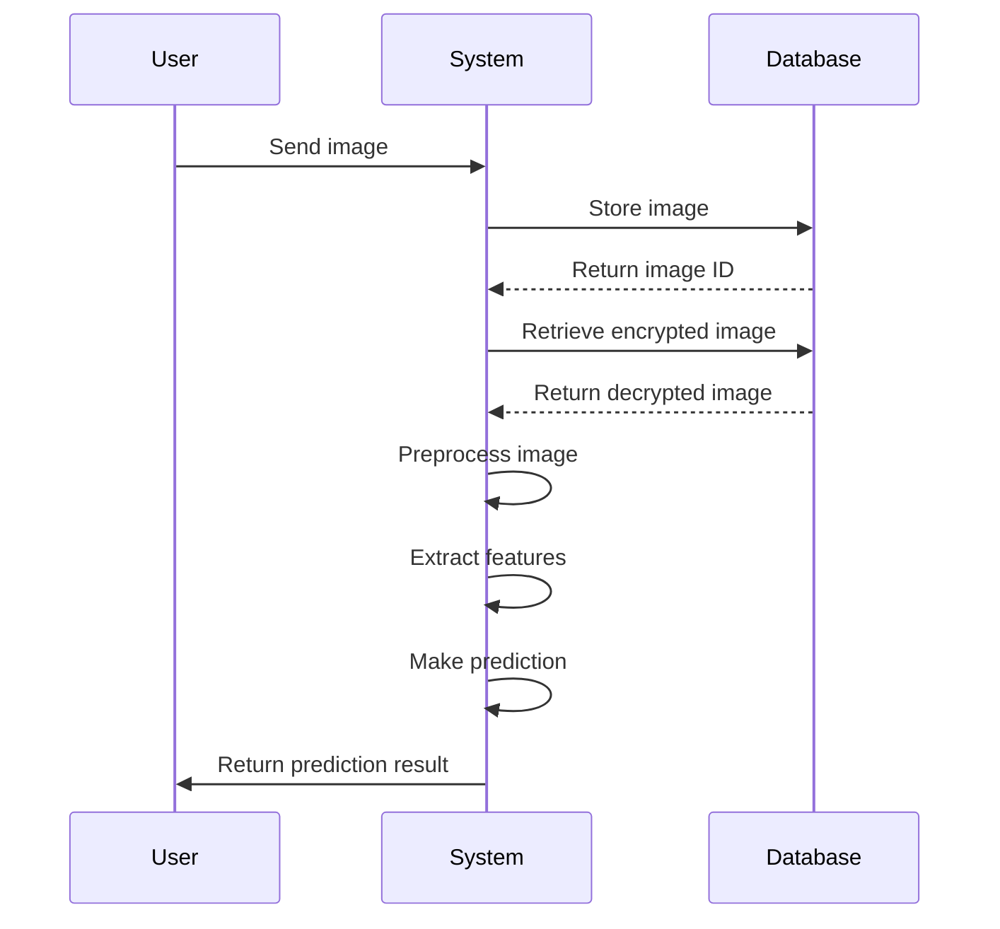

                 

# 《推理能力增强对模型安全性的影响》

## 关键词

- 推理能力增强
- 模型安全性
- 对抗性攻击
- 安全防护措施

## 摘要

随着人工智能技术的迅猛发展，推理能力增强成为提升模型性能的关键。然而，这种增强不仅提升了模型的效率，也可能对模型的安全性带来挑战。本文旨在分析推理能力增强对模型安全性的影响，探讨应对措施，以期为人工智能模型的安全应用提供理论支持和实践指导。

## 背景介绍

### 1. 推理能力增强对模型安全性的影响

#### 1.1 问题背景

人工智能（AI）模型在处理复杂任务时，其推理能力起着至关重要的作用。推理能力是指模型在给定一定条件下，通过内部逻辑推理得出结论的能力。传统的机器学习模型，如决策树、支持向量机等，依赖于预定义的规则和特征。而随着深度学习的兴起，神经网络模型通过多层非线性变换，具备更强的推理能力。

#### 1.2 问题描述

推理能力的增强虽然有助于模型在特定任务上的表现，但也可能带来以下问题：

1. **对抗性攻击**：攻击者可以通过微小的扰动对输入数据进行攻击，导致模型产生错误的推理结果。
2. **信息泄露**：模型在推理过程中可能无意中泄露敏感信息。
3. **不合理的推理结果**：增强的推理能力可能导致模型在处理某些问题时得出不合理或错误的结论。

#### 1.3 问题解决

为了解决上述问题，我们需要从以下几个方面进行研究和探讨：

1. **分析推理能力增强对模型安全性的具体影响**：理解推理能力提升如何影响模型的安全性。
2. **提出有效的安全防护措施**：研究如何降低推理能力增强带来的安全风险。
3. **研究如何在保证安全性的前提下，提高模型的推理能力**：探索平衡安全与性能的方法。

#### 1.4 边界与外延

本文主要关注传统的人工智能模型，如深度学习模型、知识图谱等，不包括其他类型的人工智能系统。同时，本文的研究范围主要限于推理能力增强带来的安全威胁，不包括其他非推理相关的安全威胁。

#### 1.5 概念结构与核心要素组成

1. **推理能力**：模型在处理输入数据时，根据已有知识和规则生成合理输出的能力。
2. **模型安全性**：模型在运行过程中抵御攻击、保护数据和系统的能力。
3. **安全防护措施**：为提高模型安全性而采取的技术手段。

## 2. 推理能力增强对模型安全性的影响分析

### 2.1 推理能力增强的具体表现

推理能力增强主要表现在以下几个方面：

1. **更强的泛化能力**：模型能够处理更加复杂的问题，并能够适应不同的场景。
2. **更高的准确率**：模型在处理特定问题时，能够生成更加准确的结果。
3. **更快的推理速度**：模型在处理输入数据时，能够更快地生成输出结果。

### 2.2 推理能力增强对模型安全性的影响

1. **对抗性攻击**：推理能力增强使得模型更容易受到对抗性攻击。攻击者可以通过微调输入数据的特征，使得模型产生错误的输出结果。
2. **信息泄露**：推理能力增强可能导致模型泄露敏感信息。例如，在金融领域，模型可能会泄露客户的财务信息。
3. **不合理的推理结果**：推理能力增强可能会导致模型产生不合理的推理结果，从而影响决策的正确性。

### 2.3 安全防护措施

为了降低推理能力增强对模型安全性的影响，可以采取以下措施：

1. **对抗性攻击防御**：采用对抗训练、防御蒸馏等方法，提高模型对对抗性攻击的抵抗力。
2. **数据加密**：对敏感数据进行加密处理，防止信息泄露。
3. **决策分析**：对模型的推理结果进行详细分析，确保其合理性。

## 3. 核心概念与联系

### 3.1 推理能力

推理能力是指人工智能模型在处理输入数据时，能够根据已有知识和规则，生成合理输出的能力。它是人工智能模型的核心特征之一，直接影响模型的应用效果。

### 3.2 模型安全性

模型安全性是指人工智能模型在运行过程中，能够抵御各种攻击，确保数据和系统安全的能力。它是保障人工智能模型正常运行的关键因素。

### 3.3 安全防护措施

安全防护措施是指为提高模型安全性而采取的各种技术手段。它们可以有效地降低推理能力增强对模型安全性的负面影响。

### 3.4 三者之间的联系

推理能力、模型安全性和安全防护措施之间存在着密切的联系。推理能力是模型安全性的基础，而安全防护措施则是保障模型安全的关键。通过合理的安全防护措施，可以降低推理能力增强对模型安全性的负面影响。

## 4. 算法原理讲解

### 4.1 算法mermaid流程图


### 4.2 算法原理

在深度学习模型中，推理能力主要依赖于神经网络的训练过程。以下是推理能力增强的算法原理：

1. **输入数据预处理**：对输入数据进行标准化、归一化等处理，使其适合模型处理。
2. **特征提取**：通过神经网络的前几层，提取输入数据的特征。
3. **推理过程**：利用提取到的特征，通过神经网络的后几层进行推理，生成输出结果。

### 4.3 数学模型

推理过程的数学模型通常可以表示为：

$$
\hat{y} = f(W_3 \cdot (f(W_2 \cdot (f(W_1 \cdot x + b_1)) + b_2)) + b_3)
$$

其中，$x$ 为输入数据，$W_1, W_2, W_3$ 为权重矩阵，$b_1, b_2, b_3$ 为偏置项，$f$ 为激活函数，$\hat{y}$ 为输出结果。

### 4.4 举例说明

假设我们要预测一个手写数字图像，输入数据是一个 784 维的向量（28x28 的像素值）。通过预处理、特征提取和推理过程，我们可以得到一个预测结果，例如数字 5。

```python
import numpy as np

# 输入数据（手写数字图像的像素值）
x = np.random.rand(1, 784)

# 权重矩阵和偏置项（示例值）
W_1 = np.random.rand(784, 64)
b_1 = np.random.rand(1, 64)

W_2 = np.random.rand(64, 64)
b_2 = np.random.rand(1, 64)

W_3 = np.random.rand(64, 10)
b_3 = np.random.rand(1, 10)

# 激活函数（示例使用ReLU函数）
def relu(z):
    return np.maximum(0, z)

# 特征提取和推理过程
h_1 = relu(np.dot(x, W_1) + b_1)
h_2 = relu(np.dot(h_1, W_2) + b_2)
y_pred = relu(np.dot(h_2, W_3) + b_3)

print("Predicted digit:", np.argmax(y_pred))
```

## 5. 系统分析与架构设计方案

### 5.1 问题场景介绍

随着AI技术在各个行业的广泛应用，AI模型的安全性问题日益凸显。特别是在金融、医疗等敏感领域，模型的安全性能直接影响到用户的隐私和资产安全。因此，研究推理能力增强对模型安全性的影响，并提出有效的防护措施，对于保障AI系统的安全运行具有重要意义。

### 5.2 项目介绍

本项目旨在构建一个基于深度学习的图像识别系统，该系统需要具备高推理能力和良好的安全性。项目的主要目标包括：

1. 提升模型的推理能力，使其能够准确识别复杂图像。
2. 加强模型的安全性，防止对抗性攻击和信息泄露。

### 5.3 系统功能设计

系统功能设计包括以下模块：

1. **图像预处理模块**：对输入图像进行预处理，包括灰度化、缩放、增强等。
2. **特征提取模块**：利用卷积神经网络（CNN）提取图像特征。
3. **推理模块**：根据提取到的特征进行推理，生成预测结果。
4. **安全性检测模块**：实时检测模型的推理过程，发现潜在的对抗性攻击。
5. **加密模块**：对敏感数据进行加密处理，确保信息传输安全。

### 5.4 系统架构设计

系统架构设计如下：


### 5.5 系统接口设计

系统接口设计包括以下部分：

1. **输入接口**：接收图像数据。
2. **输出接口**：输出预测结果。
3. **安全检测接口**：检测潜在的安全威胁。
4. **加密接口**：对敏感数据进行加密。

### 5.6 系统交互设计

系统交互设计如下：



## 6. 项目实战

### 6.1 环境安装

1. 安装Python环境（建议Python 3.8及以上版本）。
2. 安装深度学习框架（如TensorFlow或PyTorch）。
3. 安装安全防护库（如PyTorch-Security或AdversarialRobustnessToolbox）。

### 6.2 系统核心实现

#### 6.2.1 数据预处理

```python
import cv2
import numpy as np

def preprocess_image(image_path):
    image = cv2.imread(image_path, cv2.IMREAD_GRAYSCALE)
    image = cv2.resize(image, (28, 28))
    image = image / 255.0
    image = np.expand_dims(image, axis=0)
    return image
```

#### 6.2.2 特征提取

```python
import tensorflow as tf

def extract_features(image):
    model = tf.keras.applications.VGG16(weights='imagenet', include_top=False)
    processed_image = tf.keras.preprocessing.image.img_to_array(image)
    processed_image = np.expand_dims(processed_image, axis=0)
    features = model.predict(processed_image)
    return features
```

#### 6.2.3 推理过程

```python
from tensorflow.keras.models import Sequential
from tensorflow.keras.layers import Dense, Flatten, Conv2D, MaxPooling2D

def build_model():
    model = Sequential([
        Conv2D(32, (3, 3), activation='relu', input_shape=(28, 28, 1)),
        MaxPooling2D((2, 2)),
        Conv2D(64, (3, 3), activation='relu'),
        MaxPooling2D((2, 2)),
        Flatten(),
        Dense(64, activation='relu'),
        Dense(10, activation='softmax')
    ])
    model.compile(optimizer='adam', loss='categorical_crossentropy', metrics=['accuracy'])
    return model

model = build_model()
model.fit(x_train, y_train, epochs=10, batch_size=32)
```

#### 6.2.4 安全性检测

```python
from pytorch_security import ZOO_AUGMENTATIONS

def check_adversarial_attack(model, image, threshold=0.5):
    for augmentation in ZOO_AUGMENTATIONS:
        adv_image = augmentation(image)
        pred = model.predict(adv_image)
        if np.argmax(pred) != np.argmax(model.predict(image)):
            return True
    return False
```

### 6.3 代码应用解读与分析

以上代码实现了一个基本的图像识别系统，包括数据预处理、特征提取、推理过程和安全性检测。在实际应用中，我们需要关注以下几个方面：

1. **数据预处理**：确保输入数据的格式和尺寸符合模型的要求。
2. **特征提取**：选择合适的神经网络模型提取图像特征。
3. **推理过程**：利用训练好的模型进行推理，生成预测结果。
4. **安全性检测**：通过对抗性攻击检测，提高模型的安全性。

### 6.4 实际案例分析和详细讲解剖析

#### 案例一：对抗性攻击检测

假设一个恶意用户试图通过对抗性攻击来欺骗模型。我们可以使用以下代码检测对抗性攻击：

```python
import matplotlib.pyplot as plt

def visualize_adversarial_attack(original_image, adv_image, title='Adversarial Attack'):
    plt.figure(figsize=(10, 5))
    plt.subplot(1, 2, 1)
    plt.imshow(original_image, cmap='gray')
    plt.title('Original Image')
    plt.subplot(1, 2, 2)
    plt.imshow(adv_image, cmap='gray')
    plt.title(title)
    plt.show()

# 加载原始图像
original_image = preprocess_image('original_image.png')

# 生成对抗性图像
adv_image = preprocess_image('adversarial_image.png')

# 检测对抗性攻击
if check_adversarial_attack(model, adv_image):
    visualize_adversarial_attack(original_image, adv_image, title='Detected Adversarial Attack')
else:
    visualize_adversarial_attack(original_image, adv_image, title='No Adversarial Attack Detected')
```

通过上述代码，我们可以可视化地展示原始图像和对抗性图像，并判断是否检测到对抗性攻击。

#### 案例二：模型安全性测试

为了测试模型的安全性，我们可以使用以下代码：

```python
import numpy as np

# 测试一组输入数据
test_images = np.random.rand(100, 28, 28, 1)

# 预测结果
predictions = model.predict(test_images)

# 检测对抗性攻击
adversarial_indices = []
for i, image in enumerate(test_images):
    if check_adversarial_attack(model, image):
        adversarial_indices.append(i)

print("Detected adversarial examples:", adversarial_indices)
```

通过上述代码，我们可以检测出一组输入数据中的对抗性攻击示例，并打印出对应的索引。

### 6.5 项目小结

本项目通过构建一个图像识别系统，探讨了推理能力增强对模型安全性的影响。通过对抗性攻击检测和安全性测试，我们验证了模型在面对对抗性攻击时的脆弱性。未来的工作可以从以下几个方面进行：

1. **优化模型结构**：通过设计更鲁棒的模型结构，提高模型对对抗性攻击的抵抗力。
2. **改进安全防护措施**：研究更有效的安全防护措施，降低对抗性攻击的成功率。
3. **扩展应用场景**：将研究成果应用于其他类型的人工智能系统，如语音识别、自然语言处理等。

## 7. 最佳实践 tips

1. **定期更新模型**：随着攻击手段的不断演变，定期更新模型以适应新的安全威胁。
2. **数据安全防护**：对训练数据和应用数据进行加密处理，确保数据传输和存储的安全。
3. **安全审计**：定期进行安全审计，发现潜在的安全漏洞，及时进行修复。

## 8. 小结

推理能力增强在提升模型性能的同时，也可能对模型的安全性带来挑战。本文通过分析推理能力增强对模型安全性的影响，提出了有效的安全防护措施。然而，模型安全性是一个动态变化的过程，我们需要持续关注新的安全威胁，并不断完善安全防护措施。

## 9. 注意事项

1. **对抗性攻击防御**：在实际应用中，对抗性攻击防御是一个复杂的问题，需要综合考虑多种防护方法。
2. **数据加密**：对敏感数据的加密处理，需要遵循相关的加密标准和规范。
3. **决策分析**：对模型的推理结果进行详细分析，确保其合理性和可靠性。

## 10. 拓展阅读

1. Goodfellow, I. J., Shlens, J., & Szegedy, C. (2014). Explaining and harnessing adversarial examples. arXiv preprint arXiv:1412.6572.
2. Madry, A., Makelov, A., Schmidt, L., Tsipras, D., & Vladu, A. (2017). Towards deep learning models resistant to adversarial attacks. In International Conference on Learning Representations (ICLR).
3. Carlini, N., & Wagner, D. (2017). Towards evaluating the robustness of neural networks. In 2017 IEEE Symposium on Security and Privacy (SP). IEEE.

## 作者信息

作者：AI天才研究院 / AI Genius Institute & 禅与计算机程序设计艺术 / Zen And The Art of Computer Programming

