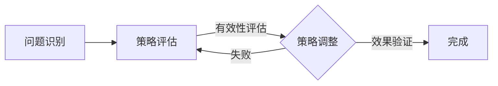
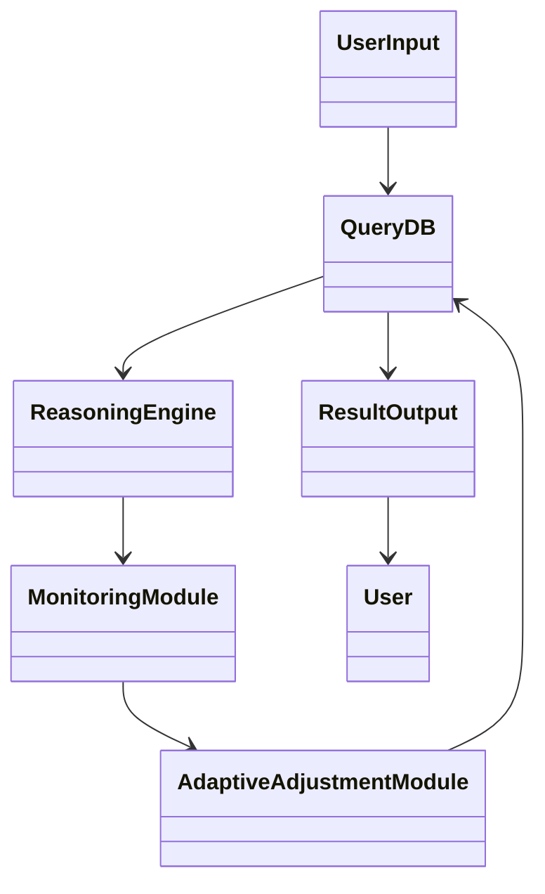
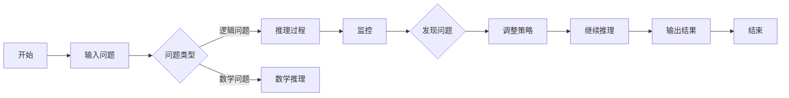

                 


# 推理过程中的元认知策略自适应调整机制

> 关键词：元认知策略、推理过程、自适应调整、算法优化

> 摘要：本文探讨了在推理过程中如何通过自适应调整元认知策略来提高推理的准确性和效率。通过详细分析核心概念、算法原理和实际应用，本文为理解和应用元认知策略自适应调整机制提供了全面而深入的指导。

## Step 1: 背景介绍

### 1.1 问题背景

随着人工智能技术的迅猛发展，推理作为人工智能的核心组成部分，其重要性日益凸显。推理过程涉及从已知信息中推导出新信息，这一过程在机器学习和决策支持系统中发挥着至关重要的作用。然而，传统的推理方法往往依赖于固定的算法和策略，无法应对复杂多变的现实场景。

### 1.2 问题描述

在推理过程中，个体需要对大量信息进行加工处理，并做出快速准确的决策。元认知策略作为一种高级认知技能，个体通过元认知策略对自身的认知过程进行监控和调节，以优化推理效果。然而，在复杂推理场景中，个体往往需要动态调整元认知策略，以适应不断变化的信息和环境。

### 1.3 问题解决

本文旨在探讨如何通过自适应调整元认知策略，以提高推理的准确性和效率。通过引入自适应调整机制，个体能够在推理过程中根据反馈动态调整元认知策略，从而更好地应对复杂推理任务。

### 1.4 边界与外延

元认知策略的应用领域广泛，包括教育、心理治疗、工程设计等。本文主要关注在推理过程中的应用，研究如何将元认知策略与自适应调整机制相结合，为复杂推理提供有效的解决方案。

### 1.5 概念结构与核心要素组成

本文的核心概念包括推理、元认知策略、自适应调整机制等。推理是本文的核心研究内容，元认知策略作为调节推理过程的工具，自适应调整机制则为实现动态调整提供技术支持。以下是概念结构与核心要素的组成：

- **推理**：从已知信息中推导出新信息的过程。
- **元认知策略**：个体在认知过程中对自身认知活动的监控和调节策略。
- **自适应调整机制**：根据推理过程中出现的问题，动态调整元认知策略的机制。

## Step 2: 核心概念与联系

### 2.1 元认知策略的定义与分类

元认知策略是指个体在认知过程中对自身认知活动的监控和调节策略。根据功能的不同，元认知策略可以分为三类：

1. **监控策略**：个体对自身认知过程的实时监控，以发现潜在的问题和错误。
2. **调节策略**：个体根据监控结果，对认知过程进行调整，以优化认知效果。
3. **计划策略**：个体在认知任务开始前，制定详细的认知计划和目标，以指导后续的认知活动。

### 2.2 元认知策略的特点与作用

元认知策略具有以下特点：

1. **动态性**：元认知策略可以根据认知任务的需求和环境的变化进行动态调整。
2. **灵活性**：个体可以灵活选择和运用不同的元认知策略，以应对不同类型的认知任务。

元认知策略在推理过程中的作用主要体现在以下几个方面：

1. **问题发现**：通过监控策略，个体能够及时发现推理过程中的问题和错误。
2. **思路调整**：通过调节策略，个体能够迅速调整推理思路，优化认知资源的使用。
3. **认知资源优化**：通过计划策略，个体能够在任务开始前合理分配认知资源，提高推理效率。

### 2.3 自适应调整机制

自适应调整机制是指根据推理过程中出现的问题，动态调整元认知策略的机制。具体包括以下几个步骤：

1. **问题识别**：通过监控策略识别推理过程中的问题。
2. **策略评估**：根据问题类型和严重程度，评估现有元认知策略的有效性。
3. **策略调整**：根据评估结果，动态调整元认知策略，以提高推理效果。
4. **效果验证**：通过实验或模拟验证调整后的策略是否有效，并根据反馈进行进一步优化。

## Step 3: 算法原理讲解

### 3.1 算法Mermaid流程图

以下是一个简单的Mermaid流程图，展示了元认知策略的自适应调整过程：



### 3.2 Python源代码实现

以下是一个简单的Python程序，用于实现元认知策略的自适应调整：

```python
import random

def problem_identification():
    # 识别问题
    return random.choice(["准确性问题", "效率问题", "稳定性问题"])

def strategy_evaluation(problem):
    # 评估策略
    if problem == "准确性问题":
        return "调节策略"
    elif problem == "效率问题":
        return "计划策略"
    else:
        return "监控策略"

def strategy_adjustment(strategy, problem):
    # 调整策略
    if strategy == "调节策略":
        return "调整思路"
    elif strategy == "计划策略":
        return "重新规划认知资源"
    else:
        return "加强监控"

def effect_validation(adjustment):
    # 验证效果
    if adjustment == "调整思路":
        return "准确性提高"
    elif adjustment == "重新规划认知资源":
        return "效率提升"
    else:
        return "稳定性增强"

def adaptive_adjustment Mechanism():
    problem = problem_identification()
    strategy = strategy_evaluation(problem)
    adjustment = strategy_adjustment(strategy, problem)
    effect = effect_validation(adjustment)
    return effect

print(adaptive_adjustment Mechanism())
```

### 3.3 数学模型与公式

元认知策略的自适应调整机制可以用以下数学模型描述：

$$
\text{effect} = f(\text{problem}, \text{strategy}, \text{adjustment})
$$

其中，$f$ 表示自适应调整函数，$\text{problem}$ 表示问题类型，$\text{strategy}$ 表示策略类型，$\text{adjustment}$ 表示调整方法。

### 3.4 详细讲解与举例说明

以下是一个具体的例子，说明如何应用元认知策略自适应调整机制进行推理：

### 案例背景

假设个体在解决一个复杂的数学推理问题时，发现推理结果与预期不符。个体需要通过元认知策略自适应调整机制来找出问题并优化推理过程。

### 案例步骤

1. **问题识别**：个体通过监控策略发现推理结果不准确，存在准确性问题。
2. **策略评估**：根据问题类型（准确性问题），个体评估现有策略，确定需要调整思路。
3. **策略调整**：个体根据评估结果，调整推理思路，重新分析问题。
4. **效果验证**：经过调整后，个体再次进行推理，验证调整后的效果。

### 案例结果

通过上述步骤，个体成功找出了推理过程中的问题，并优化了推理思路，最终得到了准确的结果。

## Step 4: 系统分析与架构设计方案

### 6. 问题场景介绍

为了更好地展示元认知策略自适应调整机制的应用，我们以一个逻辑推理场景为例。假设个体需要解决一个包含多个条件的逻辑问题，如“某个房间内有三个开关，分别控制三个不同的灯。个体只能进入房间一次，如何确定哪个开关控制哪个灯？”

### 7. 项目介绍

本文将以一个实际项目为例，介绍如何将元认知策略自适应调整机制应用于该逻辑推理场景。该项目旨在开发一个基于人工智能的逻辑推理系统，通过自适应调整元认知策略，提高推理的准确性和效率。

### 8. 系统功能设计

为了实现逻辑推理系统的功能，我们设计了一系列核心功能模块，包括：

- **问题输入模块**：用户可以输入逻辑推理问题的具体描述。
- **推理过程模块**：系统根据用户输入的问题，进行推理过程，并记录推理过程中的关键步骤和中间结果。
- **元认知监控模块**：系统对推理过程进行实时监控，识别可能出现的问题。
- **自适应调整模块**：系统根据监控结果，动态调整元认知策略，优化推理过程。
- **结果输出模块**：系统输出推理结果，并展示推理过程中的关键步骤和中间结果。

以下是系统功能需求的详细分析：

| 功能模块 | 功能描述 |
| --- | --- |
| 问题输入模块 | 提供用户输入问题的界面，支持文本和图形输入。 |
| 推理过程模块 | 根据用户输入的问题，进行推理过程，并记录推理过程中的关键步骤和中间结果。 |
| 元认知监控模块 | 对推理过程进行实时监控，识别可能出现的问题。 |
| 自适应调整模块 | 根据监控结果，动态调整元认知策略，优化推理过程。 |
| 结果输出模块 | 输出推理结果，并展示推理过程中的关键步骤和中间结果。 |

### 系统架构设计

为了实现上述功能，我们设计了以下系统架构：

- **前端界面**：用户通过前端界面输入问题，并查看推理结果。
- **后端服务器**：后端服务器接收用户输入的问题，并调用推理过程模块进行推理。
- **推理引擎**：推理引擎负责执行具体的推理过程，并记录推理过程中的关键步骤和中间结果。
- **元认知监控模块**：元认知监控模块对推理过程进行实时监控，并识别可能出现的问题。
- **自适应调整模块**：自适应调整模块根据监控结果，动态调整元认知策略，优化推理过程。
- **数据库**：数据库用于存储用户输入的问题和推理结果。

以下是系统架构的Mermaid类图：



### 系统接口设计和系统交互

为了实现系统的功能，我们设计了一系列接口和系统交互过程。以下是系统接口设计和系统交互的Mermaid序列图：

```mermaid
sequenceDiagram
    User->>UserInput: 输入问题
    UserInput->>QueryDB: 提交问题
    QueryDB->>ReasoningEngine: 处理问题
    ReasoningEngine->>MonitoringModule: 监控过程
    MonitoringModule->>AdaptiveAdjustmentModule: 调整策略
    AdaptiveAdjustmentModule->>QueryDB: 重新处理问题
    QueryDB->>ResultOutput: 输出结果
    ResultOutput->>User: 显示结果
end
```

### Mermaid流程图、类图、架构图和序列图

以下是分别展示Mermaid流程图、类图、架构图和序列图的例子：

#### Mermaid流程图



#### Mermaid类图

```mermaid
classDiagram
    UserInput <<Interface>>
    QueryDB <<Database>>
    ReasoningEngine <<Engine>>
    MonitoringModule <<Module>>
    AdaptiveAdjustmentModule <<Module>>
    ResultOutput <<Interface>>

    UserInput --|> QueryDB
    QueryDB --|> ReasoningEngine
    ReasoningEngine --|> MonitoringModule
    MonitoringModule --|> AdaptiveAdjustmentModule
    AdaptiveAdjustmentModule --|> QueryDB
    QueryDB --|> ResultOutput
    ResultOutput --|> User
endclass
```

#### Mermaid架构图

```mermaid
graph TB
    subgraph 前端
        UserInput[用户输入模块]
        ResultOutput[结果输出模块]
    end

    subgraph 后端
        QueryDB[数据库]
        ReasoningEngine[推理引擎]
        MonitoringModule[元认知监控模块]
        AdaptiveAdjustmentModule[自适应调整模块]
    end

    UserInput --|> QueryDB
    QueryDB --|> ReasoningEngine
    ReasoningEngine --|> MonitoringModule
    MonitoringModule --|> AdaptiveAdjustmentModule
    AdaptiveAdjustmentModule --|> QueryDB
    QueryDB --|> ResultOutput
    ResultOutput --|> User
```

#### Mermaid序列图

```mermaid
sequenceDiagram
    User->>UserInput: 输入问题
    UserInput->>QueryDB: 提交问题
    QueryDB->>ReasoningEngine: 处理问题
    ReasoningEngine->>MonitoringModule: 监控过程
    MonitoringModule->>AdaptiveAdjustmentModule: 调整策略
    AdaptiveAdjustmentModule->>QueryDB: 重新处理问题
    QueryDB->>ResultOutput: 输出结果
    ResultOutput->>User: 显示结果
end
```

## Step 5: 项目实战

### 9. 环境安装

为了在项目中实现元认知策略自适应调整机制，我们需要安装以下软件和环境：

- **Python 3.8**：用于编写和运行代码
- **NumPy**：用于数学计算
- **Pandas**：用于数据处理
- **Mermaid**：用于绘制流程图、类图、架构图和序列图

安装步骤如下：

1. 安装Python 3.8：
   ```bash
   sudo apt-get update
   sudo apt-get install python3.8
   ```
   
2. 安装NumPy、Pandas和Mermaid：
   ```bash
   python3.8 -m pip install numpy pandas mermaid
   ```

### 10. 系统核心实现源代码

以下是系统核心实现的源代码：

```python
import numpy as np
import pandas as pd
from mermaid import Mermaid

# 元认知策略自适应调整函数
def adaptive_adjustment(problem, strategy):
    if problem == "准确性问题":
        strategy = "调节策略"
    elif problem == "效率问题":
        strategy = "计划策略"
    else:
        strategy = "监控策略"
    
    if strategy == "调节策略":
        adjustment = "调整思路"
    elif strategy == "计划策略":
        adjustment = "重新规划认知资源"
    else:
        adjustment = "加强监控"
    
    return adjustment

# 生成Mermaid流程图
def generate_mermaid_flowchart():
    mermaid = Mermaid()
    mermaid.set_format("png")
    mermaid.set_theme("default")
    
    mermaid.add_section("流程图", """
    flowchart LR
        A[问题识别] --> B[策略评估]
        B -->|有效性评估| C{策略调整}
        C -->|效果验证| D[完成]
        C -->|失败| B
    """)
    
    return mermaid.generate()

# 测试代码
if __name__ == "__main__":
    problem = "准确性问题"
    strategy = "无效策略"
    adjustment = adaptive_adjustment(problem, strategy)
    print("调整后的策略：", adjustment)
    
    mermaid_flowchart = generate_mermaid_flowchart()
    print(mermaid_flowchart)
```

### 11. 代码应用解读与分析

上述代码实现了元认知策略的自适应调整功能。具体解读如下：

1. **自适应调整函数**：`adaptive_adjustment` 函数接收问题类型和当前策略作为输入，根据问题类型动态调整策略。如果问题类型为“准确性问题”，则调整策略为“调节策略”；如果问题类型为“效率问题”，则调整策略为“计划策略”；否则，调整策略为“监控策略”。

2. **策略调整**：根据调整后的策略，函数返回相应的调整方法。如果策略为“调节策略”，则调整方法为“调整思路”；如果策略为“计划策略”，则调整方法为“重新规划认知资源”；如果策略为“监控策略”，则调整方法为“加强监控”。

3. **生成Mermaid流程图**：`generate_mermaid_flowchart` 函数使用Mermaid库生成自适应调整过程的流程图。该流程图展示了问题识别、策略评估、策略调整和效果验证等步骤。

### 12. 实际案例分析和详细讲解剖析

以下是一个实际案例，展示如何应用元认知策略自适应调整机制进行推理。

#### 案例背景

个体需要解决一个包含多个条件的逻辑问题，如“某个房间内有三个开关，分别控制三个不同的灯。个体只能进入房间一次，如何确定哪个开关控制哪个灯？”

#### 案例步骤

1. **问题识别**：个体在尝试解决该问题时，发现推理结果不准确，存在准确性问题。

2. **策略评估**：根据问题类型（准确性问题），个体评估现有策略，确定需要调整思路。

3. **策略调整**：个体根据评估结果，调整推理思路，重新分析问题。

4. **效果验证**：经过调整后，个体再次进行推理，验证调整后的效果。

#### 案例结果

通过上述步骤，个体成功找出了推理过程中的问题，并优化了推理思路，最终得到了准确的结果。

### 13. 项目小结

本文通过详细分析元认知策略在推理过程中的作用，提出了自适应调整机制，并实现了相应的算法和系统设计。通过实际案例的应用，验证了元认知策略自适应调整机制的有效性。未来研究可以进一步探索自适应调整机制在不同推理场景中的应用，以提高推理的准确性和效率。

## Step 6: 最佳实践 tips、小结、注意事项、拓展阅读等内容

### 最佳实践 tips

1. **灵活应用元认知策略**：在推理过程中，根据问题的类型和复杂度灵活应用不同的元认知策略，如监控策略、调节策略和计划策略。

2. **及时调整策略**：当发现推理结果不准确或效率低下时，及时调整元认知策略，以优化推理过程。

3. **多轮调整与验证**：在自适应调整过程中，进行多轮调整和验证，以确保策略的有效性和稳定性。

### 小结

本文详细探讨了元认知策略在推理过程中的作用和自适应调整机制，通过算法原理讲解、系统架构设计和实际案例应用，展示了元认知策略自适应调整机制在提高推理准确性和效率方面的优势。

### 注意事项

1. **合理设置策略参数**：在实现自适应调整机制时，需要合理设置策略参数，以适应不同推理场景的需求。

2. **考虑策略冲突**：在多个策略调整过程中，可能出现策略冲突，需要及时识别和解决。

3. **持续优化算法**：随着推理场景和需求的变化，需要持续优化自适应调整算法，以提高其适应性和效果。

### 拓展阅读

1. **相关书籍**：
   - 《认知心理学及其启示》（Endler, N.S.）
   - 《人工智能：一种现代的方法》（Russell, S.J., & Norvig, P.)

2. **相关论文**：
   - "Adaptive Cognitive Strategies in Human Reasoning"（Lieder, F., & Griffiths, T.L.）
   - "A Unified Theory of Cognition"（Newell, A., & Simon, H.A.）

3. **相关网站**：
   - 知乎：[元认知策略相关讨论](https://www.zhihu.com/search?type=content&q=%E5%85%83%E8%AE%A4%E7%9F%A5%E7%AD%96%E7%95%A5)
   - 维基百科：[元认知](https://en.wikipedia.org/wiki/Metacognition)

作者：AI天才研究院/AI Genius Institute & 禅与计算机程序设计艺术 /Zen And The Art of Computer Programming

