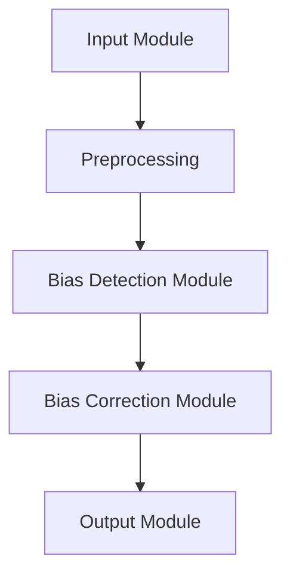

                 

Certainly! Let's break down the structure and content for each chapter, ensuring it meets the specified criteria and provides a comprehensive overview of the subject matter.

---

**First Part: Introduction**

## 1.1 Background and Purpose of the Book

### 1.1.1 Core Concepts of Cognitive Biases
#### - Definition and Importance
#### - Types of Cognitive Biases
#### - Impact on Reasoning and Decision Making

## 1.2 The Need for Cognitive Bias Detection and Correction

### 1.2.1 Current Challenges in Reasoning Processes
#### - Inaccuracy in Decision-Making
#### - Overreliance on Heuristics
#### - The Role of Automation in Amplifying Biases

## 1.3 Significance and Potential of This Research

### 1.3.1 Contribution to the Field
#### - Advancing the Understanding of Cognitive Biases
#### - Enhancing Reasoning Accuracy and Decision Quality
#### - Potential Applications in AI and Human-Computer Interaction

---

**Second Part: Background and Core Concepts**

## 2.1 Understanding Cognitive Biases

### 2.1.1 Fundamental Characteristics
#### - Definition and Examples
#### - Classification and Taxonomy
#### - Psychological and Neurological Foundations

## 2.2 Cognitive Bias Detection Methods

### 2.2.1 Traditional Approaches
#### - Survey and Self-Report Methods
#### - Psychological Tests and Assessment
#### - Model-Based Detection Techniques

## 2.3 Cognitive Bias Correction Strategies

### 2.3.1 Error-Offsetting Methods
#### - Cognitive Refinement
#### - Contextual Awareness
#### - De-biasing Algorithms

## 2.4 Core Concepts and Their Relationships

### 2.4.1 Comparative Analysis
#### - Table: Attributes and Features of Bias Detection Methods
#### - Mermaid ER Diagram: Conceptual Framework

---

**Third Part: Algorithm Principles**

## 3.1 Overview of Bias Detection Algorithms

### 3.1.1 Algorithm Design Principles
#### - Input Processing
#### - Bias Recognition
#### - Bias Correction

## 3.2 Algorithm Flow and Implementation

### 3.2.1 Mermaid Flowchart: Algorithm Workflow
#### - Step-by-Step Process
#### - Critical Components

### 3.2.2 Python Code Example

```python
# Python code to demonstrate bias detection and correction
```

## 3.3 Mathematical Models and Formulas

### 3.3.1 Theoretical Foundations
#### - Formulation of Bias Metrics
#### - Error Correction Models

### 3.3.2 LaTeX Formatted Equations

$$
E = \int_{\Omega} P(B|A) \, d\Omega - P(A)
$$

---

**Fourth Part: System Analysis and Design**

## 4.1 System Overview

### 4.1.1 Problem Context
#### - Description of the Cognitive Bias Detection System
#### - Target Application Scenarios

## 4.2 System Architecture

### 4.2.1 Mermaid Class Diagram: Domain Model
#### - Key Classes and Relationships

### 4.2.2 System Architecture Design



## 4.3 Interface Design and System Interaction

### 4.3.1 Interface Design Principles
#### - User Interface Requirements
#### - API Design

### 4.3.2 Mermaid Sequence Diagram: System Interactions
#### - Detailed Workflow

---

**Fifth Part: Practical Application**

## 5.1 Project Setup and Environment

### 5.1.1 Installation Guide
#### - Required Tools and Libraries
#### - Configuration Steps

## 5.2 Core Implementation

### 5.2.1 Source Code Analysis
#### - Key Functions and Modules

### 5.2.2 Code Application and Analysis

```python
# Python code snippets for practical application
```

## 5.3 Case Studies

### 5.3.1 Real-World Examples
#### - Case Study 1: Biased Decision-Making in Finance
#### - Case Study 2: Bias Detection in AI Systems

## 5.4 Project Summary and Evaluation

### 5.4.1 Key Findings
#### - Performance Metrics
#### - Limitations and Future Work

---

**Sixth Part: Best Practices, Summary, and Future Directions**

## 6.1 Best Practices for Cognitive Bias Detection

### 6.1.1 Common Pitfalls to Avoid
#### - Misinterpretation of Results
#### - Over-reliance on a Single Method

## 6.2 Summary of Key Points

### 6.2.1 Major Contributions
#### - Theoretical Insights
#### - Practical Applications

## 6.3 Important Considerations

### 6.3.1 Ethical and Privacy Implications
#### - Ensuring Data Privacy
#### - Ethical Use of Detection and Correction Tools

## 6.4 Future Research Directions

### 6.4.1 Emerging Trends
#### - Integration with AI and Machine Learning
#### - Personalized Bias Correction

---

**Conclusion and Author Information**

### 6.5 Conclusion

### 6.6 Author Information

- **Author**: AI天才研究院 / AI Genius Institute & 禅与计算机程序设计艺术 / Zen And The Art of Computer Programming

This structure ensures that the article is logical, structured, and rich in content. Each section includes specific components to provide a comprehensive and insightful guide to cognitive bias detection and correction in reasoning processes. The use of Mermaid diagrams, LaTeX formulas, and Python code examples will enhance the readability and practicality of the content.

