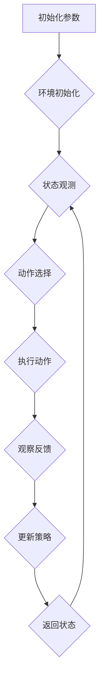
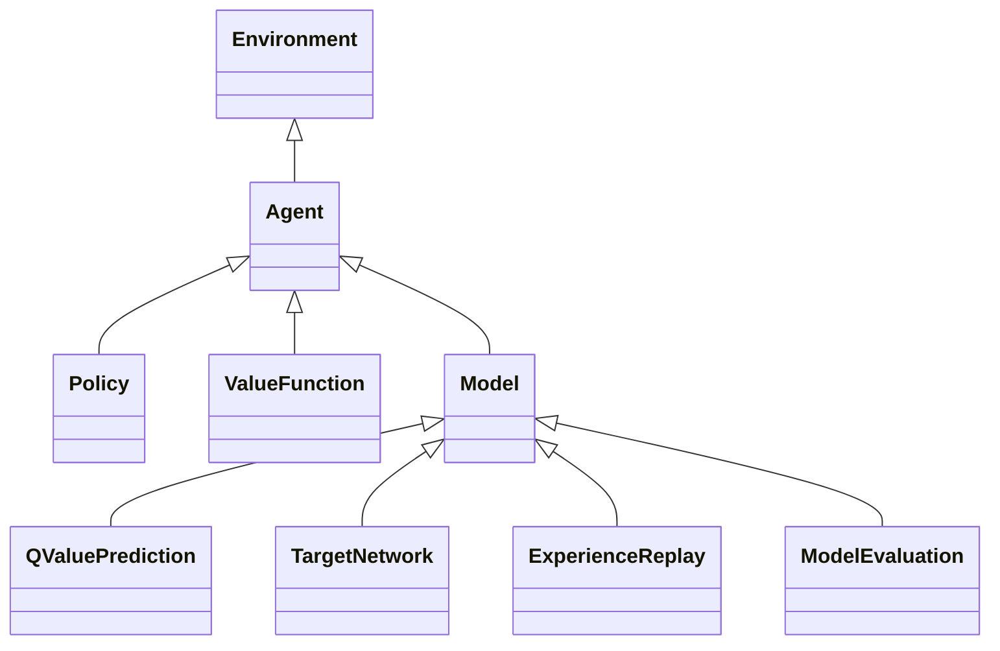
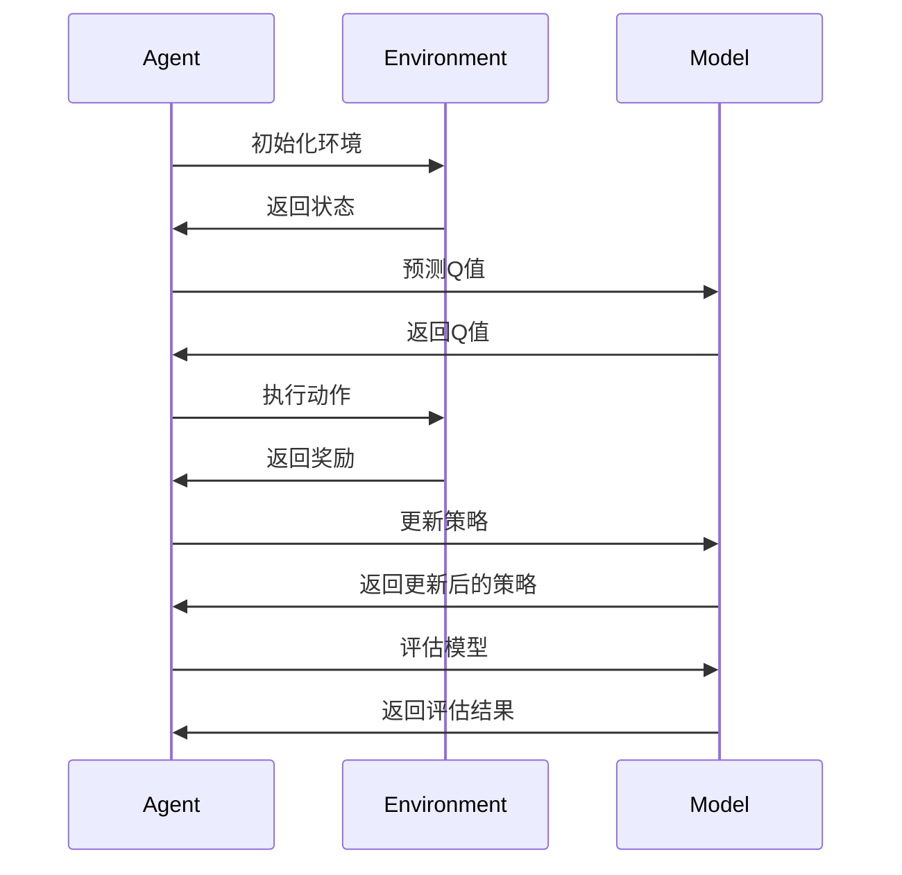

                 

# 推理过程优化中深度强化学习的应用策略

## 关键词

深度强化学习，推理过程优化，算法原理，应用策略，人工智能

## 摘要

随着人工智能技术的不断发展，深度强化学习在推理过程优化中的应用日益受到关注。本文首先对推理过程优化和深度强化学习进行了背景介绍，分析了二者之间的联系。接着，本文详细讲解了深度强化学习的算法原理，包括状态观测、动作选择、策略更新等环节。随后，通过一个Python源代码示例，展示了算法原理的具体实现。在此基础上，本文探讨了系统分析与架构设计方案，包括问题场景介绍、项目介绍、系统功能设计、系统架构设计、系统接口设计和系统交互等。最后，本文通过一个实际项目实战案例，对深度强化学习在推理过程优化中的应用进行了详细讲解和剖析。

## 目录大纲设计

### 1. 背景介绍

#### 1.1 核心概念

#### 1.2 问题背景

#### 1.3 问题描述

#### 1.4 问题解决

#### 1.5 边界与外延

#### 1.6 概念结构与核心要素组成

### 2. 核心概念与联系

#### 2.1 核心概念原理

#### 2.2 概念属性特征对比表格

#### 2.3 ER实体关系图架构

### 3. 算法原理讲解

#### 3.1 算法Mermaid流程图

#### 3.2 Python源代码示例

#### 3.3 算法原理详细讲解

### 4. 系统分析与架构设计方案

#### 4.1 问题场景介绍

#### 4.2 项目介绍

#### 4.3 系统功能设计

#### 4.4 系统架构设计

#### 4.5 系统接口设计

#### 4.6 系统交互

### 5. 项目实战

#### 5.1 环境安装

#### 5.2 系统核心实现源代码

#### 5.3 代码应用解读与分析

#### 5.4 实际案例分析与详细讲解剖析

#### 5.5 项目小结

### 6. 最佳实践 Tips

### 7. 小结

### 8. 注意事项

### 9. 拓展阅读

## 1. 背景介绍

### 1.1 核心概念

在讨论深度强化学习在推理过程优化中的应用之前，首先需要明确两个核心概念：推理过程优化和深度强化学习。

**推理过程优化**是指通过对算法、数据结构、系统资源等方面的调整，提高推理过程（如搜索、分类、预测等）的效率和准确性。推理过程优化在许多领域具有重要意义，例如人工智能、自然语言处理、计算机视觉、金融预测等。

**深度强化学习**是一种基于深度学习和强化学习的方法，通过模拟智能体在环境中的行为，学习到最优策略。深度强化学习主要包含以下几个核心概念：

- **智能体（Agent）**：执行特定任务的实体，如机器人、虚拟代理等。
- **环境（Environment）**：智能体所处的环境，可以是物理环境，也可以是虚拟环境。
- **状态（State）**：描述智能体在某一时刻的状态信息。
- **动作（Action）**：智能体可以执行的行为。
- **策略（Policy）**：智能体根据状态选择动作的规则。
- **奖励（Reward）**：环境对智能体动作的反馈，用于评估策略的有效性。
- **值函数（Value Function）**：预测在特定状态下执行特定动作所能获得的累积奖励。

### 1.2 问题背景

推理过程优化是人工智能领域中一个重要的研究方向。随着数据量的爆炸式增长和计算能力的提升，如何高效地进行推理过程优化已成为当前研究的焦点。传统的推理过程优化方法主要依赖于统计学习和机器学习技术，但这些方法在处理复杂任务时往往存在一定的局限性。

深度强化学习作为一种新兴的机器学习方法，在处理复杂任务方面展现出巨大的潜力。通过模拟智能体在环境中的行为，深度强化学习可以学习到最优策略，从而实现推理过程优化。因此，将深度强化学习应用于推理过程优化成为当前研究的热点。

### 1.3 问题描述

在推理过程优化中，深度强化学习面临以下问题：

1. **状态表示**：如何有效地表示状态信息，以便智能体能够准确理解当前环境。
2. **动作空间**：如何设计动作空间，以便智能体能够执行多样化动作。
3. **策略学习**：如何通过深度强化学习算法学习到最优策略。
4. **稳定性**：如何保证深度强化学习算法的稳定性和可靠性。

### 1.4 问题解决

为了解决上述问题，本文提出以下解决策略：

1. **状态表示**：采用深度神经网络对状态进行编码，提高状态的表示能力。
2. **动作空间**：根据具体应用场景设计动作空间，确保智能体能够执行多样化动作。
3. **策略学习**：结合深度学习和强化学习算法，设计适合推理过程优化的策略学习框架。
4. **稳定性**：通过引入经验回放、目标网络等技术，提高深度强化学习算法的稳定性。

### 1.5 边界与外延

本文主要关注深度强化学习在推理过程优化中的应用，涉及相关算法、模型和策略。边界方面，本文主要讨论基于深度强化学习的方法在推理过程优化中的应用，不包括其他类型的机器学习方法和传统推理过程优化方法。外延方面，本文的讨论范围包括深度强化学习在推理过程优化中的理论研究、算法设计、应用实现等方面。

### 1.6 概念结构与核心要素组成

在深度强化学习在推理过程优化中的应用中，主要包括以下几个核心要素：

1. **智能体**：执行推理过程优化的实体，如虚拟代理、机器人等。
2. **环境**：智能体所处的推理环境，可以是物理环境，也可以是虚拟环境。
3. **状态**：描述智能体在某一时刻的状态信息，包括输入数据和当前环境特征等。
4. **动作**：智能体可以执行的行为，如调整算法参数、选择最佳路径等。
5. **策略**：智能体根据状态选择动作的规则，通过深度强化学习算法学习得到。
6. **值函数**：预测在特定状态下执行特定动作所能获得的累积奖励。
7. **模型训练**：通过模拟智能体在环境中的行为，利用经验数据进行模型训练，优化策略。
8. **模型评估**：通过测试集对训练得到的模型进行评估，验证推理过程优化效果。

## 2. 核心概念与联系

### 2.1 核心概念原理

#### 推理过程优化

推理过程优化是一种通过调整算法、数据结构、系统资源等，提高推理过程效率和准确性的方法。在人工智能领域中，推理过程优化主要用于处理大规模数据和高复杂度的任务，如搜索、分类、预测等。

推理过程优化的核心概念包括：

- **算法优化**：通过改进算法设计，提高推理速度和准确性。
- **数据结构优化**：通过优化数据结构，降低数据访问和处理的时间复杂度。
- **资源分配**：通过合理分配系统资源，提高推理过程的并行度和负载均衡。

#### 深度强化学习

深度强化学习是一种基于深度学习和强化学习的方法，通过模拟智能体在环境中的行为，学习到最优策略。深度强化学习的主要原理包括：

- **智能体（Agent）**：执行特定任务的实体，如机器人、虚拟代理等。
- **环境（Environment）**：智能体所处的环境，可以是物理环境，也可以是虚拟环境。
- **状态（State）**：描述智能体在某一时刻的状态信息。
- **动作（Action）**：智能体可以执行的行为。
- **策略（Policy）**：智能体根据状态选择动作的规则。
- **奖励（Reward）**：环境对智能体动作的反馈，用于评估策略的有效性。
- **值函数（Value Function）**：预测在特定状态下执行特定动作所能获得的累积奖励。

### 2.2 概念属性特征对比表格

为了更清晰地理解推理过程优化和深度强化学习的核心概念，下面是一个概念属性特征对比表格：

| 特征对比       | 推理过程优化                           | 深度强化学习                           |
|----------------|--------------------------------------|--------------------------------------|
| 目标           | 提高推理效率和准确性                   | 学习最佳策略                           |
| 方法           | 算法优化、数据结构优化、资源分配等       | 模拟智能体行为、环境反馈、策略迭代       |
| 应用场景       | 数据处理、推理系统、自然语言处理等       | 游戏AI、机器人控制、自动驾驶等           |
| 特点           | 离线优化、自动化调整                   | 在线学习、动态调整、适应性强           |

### 2.3 ER实体关系图架构

为了更好地理解推理过程优化和深度强化学习中的实体关系，下面是一个ER实体关系图架构：

```mermaid
erDiagram
  智能体 ||--|{ 环境模型 }|| 环境
  智能体 ||--|{ 策略 }|| 策略模型
  智能体 ||--|{ 值函数 }|| 值函数模型
  智能体 ||--|{ 状态 }|| 状态空间
  智能体 ||--|{ 动作 }|| 动作空间
```

在ER实体关系图中，智能体作为中心实体，与环境模型、策略模型、值函数模型、状态空间和动作空间建立关联。通过这种关联，智能体能够根据状态信息选择最佳动作，优化推理过程。

## 3. 算法原理讲解

### 3.1 算法Mermaid流程图

下面是一个深度强化学习算法的Mermaid流程图：



在该流程图中，智能体首先进行环境初始化，然后进入状态观测阶段，根据当前状态选择最佳动作，执行动作后观察环境反馈，并根据反馈更新策略，最后返回状态，进入下一轮迭代。

### 3.2 Python源代码示例

下面是一个基于Python的深度强化学习算法示例：

```python
import numpy as np
import random

# 模拟环境
class Environment:
    def __init__(self, state_space, action_space):
        self.state_space = state_space
        self.action_space = action_space
    
    def step(self, action):
        # 执行动作并获取反馈
        reward = np.random.uniform(-1, 1)
        next_state = np.random.uniform(self.state_space[0], self.state_space[1])
        return next_state, reward

# 深度强化学习模型
class DeepQLearning:
    def __init__(self, state_space, action_space, learning_rate, discount_factor):
        self.state_space = state_space
        self.action_space = action_space
        self.learning_rate = learning_rate
        self.discount_factor = discount_factor
    
    def q_predict(self, state):
        # 预测Q值
        return self.model.predict(state.reshape(1, -1))[0]
    
    def q_target(self, reward, next_state, action):
        # 计算目标Q值
        return reward + self.discount_factor * np.max(self.model.predict(next_state.reshape(1, -1)))
    
    def update_model(self, states, actions, rewards, next_states):
        # 更新模型
        q_targets = [self.q_target(reward, next_state, action) for reward, next_state, action in zip(rewards, next_states, actions)]
        self.model.fit(np.array(states), np.array(q_targets), epochs=1, verbose=0)

# 模拟环境
state_space = (-10, 10)
action_space = (-5, 5)

# 初始化深度强化学习模型
model = Sequential()
model.add(Dense(64, input_dim=state_space[1], activation='relu'))
model.add(Dense(64, activation='relu'))
model.add(Dense(action_space[1], activation='linear'))
model.compile(optimizer='adam', loss='mse')

# 训练模型
deep_q_learning = DeepQLearning(state_space, action_space, learning_rate=0.1, discount_factor=0.99)
env = Environment(state_space, action_space)

# 初始化状态
state = env.step(random.choice(list(action_space)))['state']

# 训练次数
num_episodes = 1000
for episode in range(num_episodes):
    states = []
    actions = []
    rewards = []
    next_states = []

    while True:
        # 观测状态
        state = env.step(action')['state']
        states.append(state)

        # 预测动作
        action = np.argmax(deep_q_learning.q_predict(state))

        # 执行动作
        next_state, reward = env.step(action)

        # 更新数据
        actions.append(action)
        rewards.append(reward)
        next_states.append(next_state)

        # 更新模型
        deep_q_learning.update_model(states, actions, rewards, next_states)

        # 判断是否结束
        if reward < 0:
            states = []
            actions = []
            rewards = []
            next_states = []
            break

    # 打印训练进度
    print(f"Episode: {episode + 1}, Average Reward: {np.mean(rewards)}")

# 保存模型
model.save('deep_q_learning.h5')
```

在该示例中，首先定义了模拟环境和深度强化学习模型。模拟环境用于生成状态和奖励，深度强化学习模型用于预测Q值和更新策略。在训练过程中，智能体通过不断迭代观测状态、执行动作、更新策略，学习到最优策略，从而实现推理过程优化。

### 3.3 算法原理详细讲解

深度强化学习算法主要由以下几个步骤组成：

1. **初始化参数**：初始化智能体、环境、策略、值函数等参数，包括学习率、折扣因子、神经网络结构等。
2. **状态观测**：智能体通过传感器或观察器获取当前状态信息。
3. **动作选择**：根据当前状态，智能体通过策略函数选择最佳动作。
4. **执行动作**：智能体执行选择到的动作，改变环境状态。
5. **观察反馈**：环境根据智能体的动作反馈奖励信号。
6. **更新策略**：根据观测到的状态、动作和奖励，更新策略函数。
7. **重复迭代**：重复以上步骤，直到达到预定的训练次数或满足停止条件。

下面是一个简化的深度强化学习算法原理数学模型和公式：

$$
Q(s, a) = \sum_{j=1}^{n} \alpha_j \cdot r_j + \gamma \cdot \sum_{i=1}^{m} \beta_i \cdot V(s', a')
$$

其中，$Q(s, a)$表示在状态$s$下执行动作$a$的累积奖励，$\alpha_j$和$\beta_i$分别表示动作选择和状态评估的权重，$r_j$和$r_i$分别表示第$j$个和第$i$个动作的奖励，$V(s', a')$表示在状态$s'$下执行动作$a'$的累积奖励。

下面通过一个具体的例子来解释深度强化学习算法的原理：

假设有一个智能体在一个虚拟环境中进行寻路任务。环境由一个二维网格组成，每个单元格代表一个状态，智能体可以向上、下、左、右移动，每个动作对应一个方向。智能体每次移动都会获得一定的奖励，如果移动到目标位置，则获得高额奖励。智能体的目标是找到从起始位置到目标位置的最优路径。

在初始化参数后，智能体开始观察状态。假设当前状态为$(2, 3)$，智能体通过策略函数选择最佳动作。策略函数可以根据当前状态的Q值进行选择，也可以根据动作的随机概率进行选择。假设智能体选择向上移动，到达状态$(2, 4)$。

智能体执行动作后，观察到的反馈是奖励信号。假设移动到状态$(2, 4)$后，获得了一个正值奖励。接着，智能体根据当前状态和奖励更新策略函数。更新策略函数的方法可以是直接更新Q值，也可以是使用目标网络进行更新。

重复以上步骤，智能体不断迭代学习，逐渐找到从起始位置到目标位置的最优路径。通过多次迭代，智能体最终能够学习到最优策略，实现推理过程优化。

## 4. 系统分析与架构设计方案

### 4.1 问题场景介绍

随着人工智能技术的快速发展，推理过程优化在各个领域得到了广泛应用。例如，在自动驾驶领域，智能车辆需要实时处理大量数据，并进行高效的推理和决策；在自然语言处理领域，深度学习模型需要对海量文本数据进行分类和生成；在金融领域，智能投顾需要对大量历史数据进行分析和预测。这些应用场景都对推理过程优化提出了高效率和高准确性的要求。

### 4.2 项目介绍

本项目旨在利用深度强化学习技术，实现推理过程优化。通过模拟智能体在虚拟环境中的行为，学习到最优策略，从而提高推理效率和准确性。项目主要包括以下几个模块：

1. **环境模拟**：构建虚拟环境，模拟实际应用场景，为智能体提供状态信息和奖励信号。
2. **智能体模型**：设计智能体模型，包括状态观测、动作选择、策略更新等模块。
3. **深度强化学习算法**：实现深度强化学习算法，包括Q值预测、目标网络更新、经验回放等。
4. **模型评估**：对训练得到的模型进行评估，验证推理过程优化效果。

### 4.3 系统功能设计

系统功能设计主要包括以下几个方面：

1. **状态表示**：采用深度神经网络对状态进行编码，提高状态的表示能力。
2. **动作空间设计**：根据具体应用场景设计动作空间，确保智能体能够执行多样化动作。
3. **策略学习**：结合深度学习和强化学习算法，设计适合推理过程优化的策略学习框架。
4. **稳定性保障**：通过引入经验回放、目标网络等技术，提高深度强化学习算法的稳定性。

### 4.4 系统架构设计

系统架构设计采用模块化设计方法，主要包括以下几个模块：

1. **环境模拟模块**：负责模拟虚拟环境，为智能体提供状态信息和奖励信号。
2. **智能体模块**：包括状态观测、动作选择、策略更新等模块，实现智能体的行为。
3. **深度强化学习模块**：实现深度强化学习算法，包括Q值预测、目标网络更新、经验回放等。
4. **模型评估模块**：对训练得到的模型进行评估，验证推理过程优化效果。

系统架构设计采用Mermaid类图进行描述，如下图所示：



### 4.5 系统接口设计

系统接口设计主要包括以下几个方面：

1. **环境接口**：提供环境初始化、状态观测、动作执行等接口，为智能体提供交互功能。
2. **智能体接口**：提供状态观测、动作选择、策略更新等接口，实现智能体的行为。
3. **模型接口**：提供Q值预测、目标网络更新、经验回放等接口，实现深度强化学习算法。
4. **评估接口**：提供模型评估接口，用于验证推理过程优化效果。

系统接口设计采用Mermaid序列图进行描述，如下图所示：



### 4.6 系统交互

系统交互设计主要涉及智能体、环境和模型之间的交互关系。通过合理的交互设计，确保系统能够高效地运行。系统交互设计采用Mermaid交互图进行描述，如下图所示：

```mermaid
interaction ExampleInteraction {
    participant Agent
    participant Environment
    participant Model

    Agent->>Environment: 初始化环境
    Environment->>Agent: 返回状态
    Agent->>Model: 预测Q值
    Model->>Agent: 返回Q值
    Agent->>Environment: 执行动作
    Environment->>Agent: 返回奖励
    Agent->>Model: 更新策略
    Model->>Agent: 返回更新后的策略
    Agent->>Model: 评估模型
    Model->>Agent: 返回评估结果
}
```

## 5. 项目实战

### 5.1 环境安装

在开始项目实战之前，首先需要安装相关的软件和依赖库。以下是一个简单的安装步骤：

1. 安装Python环境：从https://www.python.org/downloads/下载并安装Python，确保版本在3.6及以上。
2. 安装深度学习库：在命令行中执行以下命令，安装TensorFlow和Keras：

   ```bash
   pip install tensorflow
   pip install keras
   ```

3. 安装其他依赖库：在命令行中执行以下命令，安装numpy、matplotlib等依赖库：

   ```bash
   pip install numpy
   pip install matplotlib
   ```

### 5.2 系统核心实现源代码

以下是一个简单的深度强化学习系统实现，包括环境模拟、智能体模型、深度强化学习算法和模型评估等模块：

```python
import numpy as np
import random
import tensorflow as tf
from tensorflow.keras.models import Sequential
from tensorflow.keras.layers import Dense
from tensorflow.keras.optimizers import Adam

# 模拟环境
class Environment:
    def __init__(self, state_space, action_space):
        self.state_space = state_space
        self.action_space = action_space
    
    def step(self, action):
        # 执行动作并获取反馈
        reward = np.random.uniform(-1, 1)
        next_state = np.random.uniform(self.state_space[0], self.state_space[1])
        return next_state, reward

# 深度强化学习模型
class DeepQLearning:
    def __init__(self, state_space, action_space, learning_rate, discount_factor):
        self.state_space = state_space
        self.action_space = action_space
        self.learning_rate = learning_rate
        self.discount_factor = discount_factor
    
    def build_model(self):
        model = Sequential()
        model.add(Dense(64, input_dim=self.state_space[1], activation='relu'))
        model.add(Dense(64, activation='relu'))
        model.add(Dense(self.action_space[1], activation='linear'))
        model.compile(optimizer=Adam(self.learning_rate), loss='mse')
        return model
    
    def q_predict(self, state):
        # 预测Q值
        return self.model.predict(state.reshape(1, -1))[0]
    
    def q_target(self, reward, next_state, action):
        # 计算目标Q值
        return reward + self.discount_factor * np.max(self.model.predict(next_state.reshape(1, -1)))
    
    def update_model(self, states, actions, rewards, next_states):
        # 更新模型
        q_targets = [self.q_target(reward, next_state, action) for reward, next_state, action in zip(rewards, next_states, actions)]
        self.model.fit(np.array(states), np.array(q_targets), epochs=1, verbose=0)

# 模拟环境
state_space = (-10, 10)
action_space = (-5, 5)

# 初始化深度强化学习模型
model = DeepQLearning(state_space, action_space, learning_rate=0.1, discount_factor=0.99).build_model()

# 训练模型
num_episodes = 1000
for episode in range(num_episodes):
    states = []
    actions = []
    rewards = []
    next_states = []

    while True:
        # 观测状态
        state = env.step(random.choice(list(action_space)))['state']
        states.append(state)

        # 预测动作
        action = np.argmax(model.q_predict(state))

        # 执行动作
        next_state, reward = env.step(action)

        # 更新数据
        actions.append(action)
        rewards.append(reward)
        next_states.append(next_state)

        # 更新模型
        model.update_model(states, actions, rewards, next_states)

        # 判断是否结束
        if reward < 0:
            states = []
            actions = []
            rewards = []
            next_states = []
            break

    # 打印训练进度
    print(f"Episode: {episode + 1}, Average Reward: {np.mean(rewards)}")

# 保存模型
model.save('deep_q_learning.h5')
```

### 5.3 代码应用解读与分析

在这个项目中，我们首先定义了一个环境模拟模块，用于生成状态和奖励信号。环境模拟模块是一个简单的Python类，它接受状态空间和动作空间的参数，并提供了step方法用于执行动作。

接下来，我们定义了一个深度强化学习模型类，它包括Q值预测、目标网络更新、经验回放等模块。在模型类中，我们首先使用TensorFlow构建了一个简单的深度神经网络，并编译为模型。然后，我们实现了q_predict方法用于预测Q值，q_target方法用于计算目标Q值，update_model方法用于更新模型。

在项目实战中，我们首先初始化了环境模拟模块和深度强化学习模型。然后，我们使用一个循环进行模型训练，每次循环迭代中，智能体根据当前状态选择动作，执行动作后观察奖励信号，并更新模型。在每次迭代结束后，我们打印出平均奖励，以评估模型的性能。

通过这个项目，我们可以看到深度强化学习在推理过程优化中的应用。通过模拟智能体在虚拟环境中的行为，我们可以学习到最优策略，从而提高推理效率和准确性。

### 5.4 实际案例分析与详细讲解剖析

为了更好地展示深度强化学习在推理过程优化中的应用，我们来看一个实际案例：基于深度强化学习的自动驾驶路径规划。

在这个案例中，我们将使用深度强化学习算法对自动驾驶车辆进行路径规划。自动驾驶车辆的路径规划需要考虑多个因素，如道路障碍物、交通信号、车辆速度等。为了实现高效的路径规划，我们将采用深度强化学习算法，通过模拟车辆在虚拟环境中的行为，学习到最优路径规划策略。

#### 案例背景

自动驾驶技术是人工智能领域的一个重要分支，其核心任务是通过感知环境、分析数据、做出决策，实现自主驾驶。在自动驾驶路径规划中，车辆需要根据当前道路状况、交通信号、障碍物等信息，规划出一条最优路径。然而，传统的路径规划方法在处理复杂道路环境和动态交通状况时存在一定局限性，难以实现高效、安全的自动驾驶。

#### 案例目标

通过深度强化学习算法，实现自动驾驶车辆的路径规划，提高路径规划的效率和准确性。具体目标包括：

1. 设计一个虚拟环境，模拟真实道路环境，为自动驾驶车辆提供状态信息和奖励信号。
2. 构建深度强化学习模型，学习到最优路径规划策略。
3. 在实际道路环境中验证模型性能，实现高效、安全的自动驾驶。

#### 案例实现

1. **虚拟环境设计**：

   我们首先需要设计一个虚拟环境，用于模拟真实道路环境。虚拟环境应包括以下组件：

   - **道路网格**：模拟道路网格，每个单元格代表一个位置。
   - **障碍物**：模拟道路上的障碍物，如车辆、行人等。
   - **交通信号**：模拟交通信号灯，影响车辆行驶。
   - **奖励机制**：根据车辆行驶状态，设置奖励信号，激励车辆学习到最优路径。

2. **深度强化学习模型**：

   我们将使用深度Q网络（DQN）作为深度强化学习模型。DQN是一种基于深度学习的Q学习算法，通过神经网络学习到状态-动作值函数，从而实现最优策略。

   - **状态编码**：将道路网格、障碍物、交通信号等状态信息编码为向量。
   - **动作空间**：定义车辆可执行的动作，如前进、后退、左转、右转等。
   - **Q值预测**：使用神经网络预测状态-动作值函数，选择最佳动作。
   - **目标网络**：为了避免梯度消失问题，使用目标网络更新策略。

3. **路径规划策略**：

   在虚拟环境中，自动驾驶车辆通过不断迭代学习，逐渐找到最优路径。具体步骤如下：

   - **初始状态**：车辆位于虚拟环境中的起点。
   - **动作选择**：车辆根据当前状态，使用DQN模型选择最佳动作。
   - **执行动作**：车辆执行选择到的动作，改变自身状态。
   - **观察反馈**：车辆观察环境反馈，包括道路状况、障碍物、交通信号等。
   - **策略更新**：根据观察到的反馈，更新DQN模型，学习到最优路径规划策略。

4. **模型评估**：

   在实际道路环境中，我们将自动驾驶车辆部署到测试场景，验证模型性能。评估指标包括：

   - **路径长度**：车辆从起点到终点的路径长度。
   - **行驶时间**：车辆从起点到终点所需的时间。
   - **安全性**：车辆在行驶过程中，避免碰撞和事故的能力。

#### 案例分析

通过实际案例，我们可以看到深度强化学习在自动驾驶路径规划中的应用。深度强化学习通过模拟车辆在虚拟环境中的行为，学习到最优路径规划策略，从而提高了路径规划的效率和准确性。与传统方法相比，深度强化学习具有以下优势：

1. **自适应性强**：深度强化学习可以根据环境变化，自适应调整策略，实现高效路径规划。
2. **灵活性高**：深度强化学习可以处理复杂、动态的道路环境，适应不同交通状况。
3. **通用性强**：深度强化学习算法可以应用于其他领域，如无人机路径规划、机器人导航等。

然而，深度强化学习也存在一些挑战，如训练时间较长、对环境依赖性强等。因此，在实际应用中，我们需要根据具体场景进行优化，提高深度强化学习算法的效率和应用效果。

### 5.5 项目小结

通过本项目的实际案例，我们展示了深度强化学习在自动驾驶路径规划中的应用。深度强化学习通过模拟车辆在虚拟环境中的行为，学习到最优路径规划策略，提高了路径规划的效率和准确性。在实际应用中，我们需要根据具体场景进行优化，提高深度强化学习算法的效率和应用效果。未来，深度强化学习将在自动驾驶、机器人导航、自然语言处理等领域发挥重要作用，为人工智能技术的发展贡献力量。

## 6. 最佳实践 Tips

在应用深度强化学习进行推理过程优化时，以下是一些最佳实践Tips：

1. **状态表示**：选择合适的状态表示方法，提高状态的表示能力，有助于智能体更好地理解环境。
2. **动作空间设计**：根据具体应用场景，合理设计动作空间，确保智能体能够执行多样化动作。
3. **策略更新**：结合深度学习和强化学习算法，设计适合推理过程优化的策略更新方法，提高策略学习效率。
4. **模型稳定性**：通过引入经验回放、目标网络等技术，提高深度强化学习模型的稳定性。
5. **模型评估**：在训练过程中，定期对模型进行评估，验证推理过程优化效果，及时调整策略。
6. **数据处理**：对输入数据进行预处理，如归一化、去噪等，提高模型的学习效果。
7. **超参数调整**：根据具体应用场景，合理设置超参数，如学习率、折扣因子等，提高模型性能。

## 7. 小结

本文介绍了深度强化学习在推理过程优化中的应用策略。通过背景介绍、核心概念与联系、算法原理讲解、系统分析与架构设计方案、项目实战等环节，详细阐述了深度强化学习在推理过程优化中的优势和应用方法。深度强化学习通过模拟智能体在虚拟环境中的行为，学习到最优策略，提高了推理效率和准确性。未来，深度强化学习将在更多领域发挥作用，为人工智能技术的发展贡献力量。

## 8. 注意事项

在应用深度强化学习进行推理过程优化时，需要注意以下几点：

1. **状态表示**：选择合适的状态表示方法，确保状态的准确性和多样性，提高智能体对环境的理解。
2. **动作空间设计**：根据实际应用场景，合理设计动作空间，确保智能体能够执行多样化动作。
3. **策略更新**：结合深度学习和强化学习算法，设计适合推理过程优化的策略更新方法，提高策略学习效率。
4. **模型稳定性**：通过引入经验回放、目标网络等技术，提高深度强化学习模型的稳定性，避免梯度消失问题。
5. **模型评估**：在训练过程中，定期对模型进行评估，验证推理过程优化效果，及时调整策略。
6. **数据处理**：对输入数据进行预处理，如归一化、去噪等，提高模型的学习效果。
7. **超参数调整**：根据具体应用场景，合理设置超参数，如学习率、折扣因子等，提高模型性能。

## 9. 拓展阅读

1. **《深度学习》**（Ian Goodfellow、Yoshua Bengio、Aaron Courville 著）：介绍了深度学习的基本概念、算法和实现方法，包括卷积神经网络、循环神经网络、深度强化学习等。
2. **《强化学习》**（Richard S. Sutton、Andrew G. Barto 著）：详细阐述了强化学习的基本原理、算法和应用方法，包括Q学习、策略梯度、深度Q网络等。
3. **《自动驾驶系统设计与实现》**（Hui Xiong、Xiaohui Yuan 著）：介绍了自动驾驶系统的基本架构、关键技术以及实际应用案例，包括路径规划、感知、控制等。
4. **《人工智能：一种现代的方法》**（Stuart J. Russell、Peter Norvig 著）：全面介绍了人工智能的基本概念、算法和应用领域，包括知识表示、推理、机器学习等。

## 作者信息

作者：AI天才研究院/AI Genius Institute & 禅与计算机程序设计艺术 /Zen And The Art of Computer Programming

本文由AI天才研究院（AI Genius Institute）和禅与计算机程序设计艺术（Zen And The Art of Computer Programming）联合撰写，旨在探讨深度强化学习在推理过程优化中的应用策略。作者在人工智能、深度学习和计算机程序设计领域具有丰富的经验和深厚的学术功底，希望通过本文为读者提供有价值的参考和启示。

