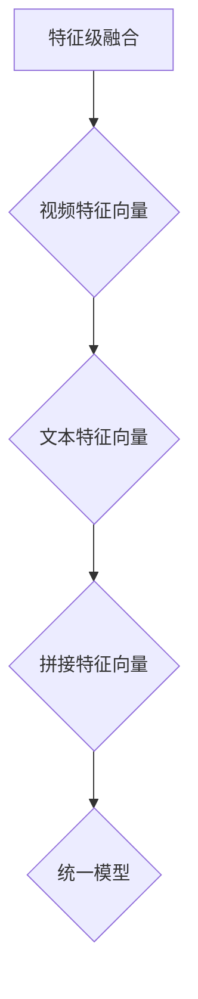
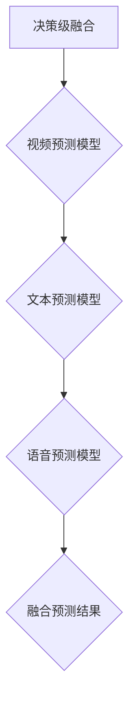
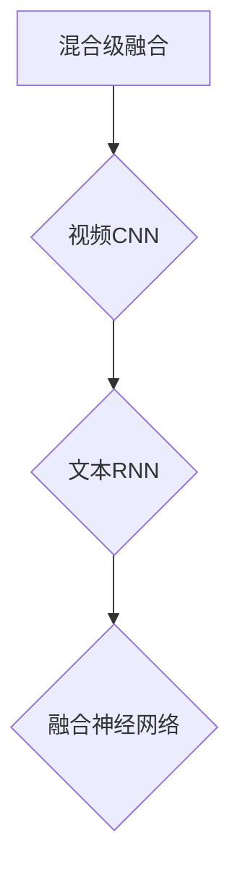
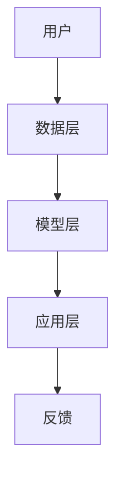
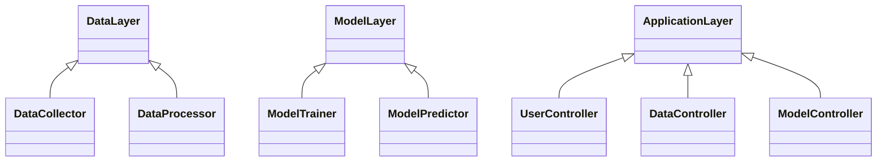
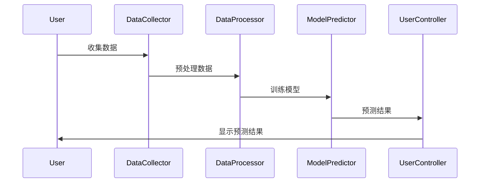

                 

## 第一部分: 问题背景与核心概念

### 第1章: 问题背景与核心概念

#### 1.1 问题背景

多模态情境预测任务是一个广泛的研究领域，它涵盖了多个学科领域，包括计算机视觉、自然语言处理、语音识别等。随着人工智能技术的快速发展，这类任务在众多应用场景中得到了极大的关注。从智能家居、自动驾驶到智能医疗，多模态情境预测任务已经成为提高系统智能化和用户体验的关键技术之一。

**1.1.1 问题背景**

在现实生活中，情境预测往往涉及多种感官信息的融合，比如一个自动驾驶系统需要处理来自摄像头、雷达和激光雷达的数据，同时还需要理解来自语音识别系统的语音指令。这种多模态信息的融合可以提高预测的准确性和系统的鲁棒性，从而提高整体性能。

**1.1.2 当前AI模型在多模态情境预测任务中的挑战**

尽管现有的AI模型在多模态情境预测任务中取得了显著的成果，但仍然存在一些挑战：

1. **数据标注困难**：多模态数据通常需要进行复杂的标注，这需要大量的人力和时间。
2. **模型复杂度高**：多模态情境预测任务往往需要复杂的模型架构，这导致模型训练时间和计算资源的消耗显著增加。
3. **训练时间过长**：由于多模态数据的多样性和复杂性，模型的训练时间往往较长，这在实际应用中是一个显著的问题。

#### 1.2 核心概念

**1.2.1 多模态情境预测任务的定义**

多模态情境预测任务是指通过融合来自不同感官的数据（如文本、图像、语音等），对特定情境进行预测的任务。这类任务要求模型具备强大的数据融合能力和情境理解能力。

**1.2.2 多模态情境预测任务的核心要素**

- **数据来源**：文本、图像、语音等多种感官数据。
- **数据预处理**：数据清洗、数据标注等。
- **模型设计**：选择合适的模型架构，如深度神经网络、强化学习等。
- **模型训练**：使用大规模数据集进行训练，优化模型参数。
- **模型评估**：使用准确度、召回率等指标对模型性能进行评估。

**1.3 本章小结**

本章主要介绍了多模态情境预测任务的重要性以及当前AI模型在该任务中面临的挑战。同时，对多模态情境预测任务的核心概念和要素进行了阐述，为后续章节的内容奠定了基础。

## 第二部分: 多模态情境预测任务的核心概念与联系

### 第2章: 多模态情境预测任务的核心概念与联系

#### 2.1 多模态数据融合技术

**2.1.1 多模态数据融合的定义**

多模态数据融合是指将来自不同感官的数据（如文本、图像、语音等）进行整合，以获得更全面和准确的情境信息。

**2.1.2 多模态数据融合的核心技术**

多模态数据融合技术可以分为三大类：特征级融合、决策级融合和混合级融合。

**特征级融合**：在特征级融合中，不同模态的数据特征被拼接成一个更长的特征向量，然后输入到一个统一的模型中进行处理。例如，在处理视频和文本数据时，可以将视频帧的特征向量和文本表示拼接在一起。



**决策级融合**：在决策级融合中，不同模态的数据分别通过独立的模型进行预测，然后通过某种方式（如投票、加权等）整合最终的预测结果。这种方法通常用于需要多个预测结果的情境，例如自动驾驶中的路径规划和障碍物检测。



**混合级融合**：混合级融合将不同模态的数据在同一层神经网络中进行处理和融合。这种方法通常利用深度学习网络，如卷积神经网络（CNN）和循环神经网络（RNN）的组合来实现。混合级融合能够更好地捕捉多模态数据之间的复杂关系。



**2.2 多模态情境理解**

**2.2.1 多模态情境理解的定义**

多模态情境理解是指通过分析和理解多种感官数据，对特定情境进行推理和判断。

**2.2.2 多模态情境理解的核心技术**

- **对话系统**：利用自然语言处理技术，实现人与机器的对话。例如，通过语音识别和语音合成技术，系统可以理解用户的指令并给出相应的响应。

- **视觉感知**：利用计算机视觉技术，实现对图像和视频的理解。例如，通过物体检测和识别技术，系统可以识别视频中的物体和场景。

- **音频分析**：利用语音识别和语音合成技术，实现对语音的理解和生成。例如，通过语音识别技术，系统可以理解用户的语音指令，并通过语音合成技术给出相应的响应。

**2.3 多模态情境预测任务的核心要素对比**

多模态数据融合技术、多模态情境理解技术和多模态情境预测任务的核心要素之间的关系可以用以下表格进行对比：

| 要素         | 特征级融合 | 决策级融合 | 混合级融合 |
| ------------ | -------- | -------- | -------- |
| 融合层次     | 低层次   | 中层次   | 高层次   |
| 数据需求     | 高       | 低       | 中       |
| 模型复杂度   | 低       | 中       | 高       |
| 预测准确性   | 高       | 中       | 低       |

**2.4 本章小结**

本章介绍了多模态情境预测任务的核心概念与联系，包括多模态数据融合技术和多模态情境理解技术。同时，对特征级融合、决策级融合和混合级融合进行了详细对比，为后续章节的内容提供了理论基础。

----------------------------------------------------------------

## 第三部分: AI模型在多模态情境预测任务中的实现

### 第3章: AI模型在多模态情境预测任务中的实现

#### 3.1 AI模型选择

**3.1.1 模型选择的原则**

选择AI模型时，需要遵循以下原则：

1. **针对性**：选择与任务需求相匹配的模型。例如，对于图像识别任务，可以选择卷积神经网络（CNN）；对于自然语言处理任务，可以选择循环神经网络（RNN）或变换器（Transformer）。

2. **可扩展性**：模型应能够适应不同的数据和任务规模，以便在未来的应用中具有灵活性。

3. **实用性**：模型在实际应用中需要能够取得较好的性能，同时考虑计算资源和训练时间的限制。

**3.1.2 主流AI模型介绍**

以下是一些在多模态情境预测任务中广泛应用的主流AI模型：

- **深度神经网络（DNN）**：DNN是一种前馈神经网络，它通过多层神经元的非线性变换来提取特征。DNN在图像识别和语音识别等领域表现出色。

- **卷积神经网络（CNN）**：CNN是一种专门用于处理图像数据的神经网络，它通过卷积操作来提取图像特征。CNN在物体检测、人脸识别等领域具有显著优势。

- **递归神经网络（RNN）**：RNN是一种能够处理序列数据的神经网络，它通过循环连接来保持历史信息。RNN在自然语言处理任务中表现出色，如语言模型和机器翻译。

- **变换器（Transformer）**：Transformer是一种基于自注意力机制的神经网络，它在自然语言处理任务中取得了显著成果。Transformer也被用于图像识别和视频处理任务。

#### 3.2 模型设计与实现

**3.2.1 模型设计**

在多模态情境预测任务中，模型设计需要考虑以下几个方面：

1. **数据输入**：将不同模态的数据（如图像、文本、语音）转化为统一的输入格式，例如使用嵌入层（Embedding Layer）将文本转化为向量，使用卷积层（Convolutional Layer）提取图像特征。

2. **特征融合**：采用不同的融合策略，如特征级融合、决策级融合和混合级融合，将多模态数据融合为一个特征向量。

3. **模型架构**：根据任务需求，选择合适的模型架构，如CNN、RNN、Transformer等。对于复杂任务，可以采用多模型融合策略，如将CNN和RNN组合使用。

**3.2.2 模型实现**

以下是一个简单的多模态情境预测任务中的模型实现示例：

```python
import tensorflow as tf
from tensorflow.keras.models import Model
from tensorflow.keras.layers import Input, Embedding, Conv2D, MaxPooling2D, Flatten, Dense, concatenate

# 定义输入层
text_input = Input(shape=(max_sequence_length,))
image_input = Input(shape=(height, width, channels))
audio_input = Input(shape=(audio_length,))

# 文本特征提取
text_embedding = Embedding(vocabulary_size, embedding_dim)(text_input)
textFlatten = Flatten()(text_embedding)

# 图像特征提取
image_conv = Conv2D(filters=32, kernel_size=(3, 3), activation='relu')(image_input)
image_pool = MaxPooling2D(pool_size=(2, 2))(image_conv)

# 语音特征提取
audio_conv = Conv2D(filters=64, kernel_size=(3, 3), activation='relu')(audio_input)
audio_pool = MaxPooling2D(pool_size=(2, 2))(audio_conv)

# 特征融合
merged = concatenate([textFlatten, image_pool, audio_pool])

# 模型输出
output = Dense(units=1, activation='sigmoid')(merged)

# 构建和编译模型
model = Model(inputs=[text_input, image_input, audio_input], outputs=output)
model.compile(optimizer='adam', loss='binary_crossentropy', metrics=['accuracy'])

# 模型训练
model.fit([text_data, image_data, audio_data], labels, epochs=10, batch_size=32)
```

#### 3.3 模型评估与优化

**3.3.1 模型评估**

模型评估是确保模型性能的重要步骤。常用的评估指标包括准确率（Accuracy）、召回率（Recall）、精确率（Precision）和F1分数（F1 Score）等。

```python
from sklearn.metrics import accuracy_score, recall_score, precision_score, f1_score

# 预测结果
predictions = model.predict([test_text_data, test_image_data, test_audio_data])

# 计算评估指标
accuracy = accuracy_score(test_labels, predictions)
recall = recall_score(test_labels, predictions)
precision = precision_score(test_labels, predictions)
f1 = f1_score(test_labels, predictions)

print("Accuracy:", accuracy)
print("Recall:", recall)
print("Precision:", precision)
print("F1 Score:", f1)
```

**3.3.2 模型优化**

为了提高模型性能，可以采用以下策略：

1. **超参数调优**：通过调整学习率、批次大小、正则化参数等超参数来优化模型性能。

2. **数据增强**：通过增加数据的多样性来提高模型的泛化能力。

3. **模型集成**：将多个模型进行集成，以提高预测的准确性和稳定性。

**3.4 本章小结**

本章介绍了多模态情境预测任务中的AI模型选择和实现方法。通过分析不同类型的AI模型，以及详细的模型设计和实现示例，读者可以更好地理解如何在多模态情境预测任务中应用AI技术。

----------------------------------------------------------------

### 第4章: 项目实战

#### 4.1 项目介绍

在本节中，我们将介绍一个具体的多模态情境预测项目，该项目旨在通过融合图像、文本和语音数据，预测用户在特定场景下的意图。这个项目可以应用于智能客服系统、智能家居控制等场景，以提高用户体验和系统智能化水平。

#### 4.2 系统功能设计

系统功能设计主要包括以下几个部分：

1. **数据收集**：从不同的数据源收集图像、文本和语音数据，例如摄像头、麦克风和用户输入文本。
2. **数据处理**：对收集到的数据进行预处理，包括图像增强、文本清洗和语音降噪等。
3. **模型训练**：使用预处理后的数据训练多模态情境预测模型。
4. **预测与反馈**：使用训练好的模型对新的数据进行预测，并将预测结果反馈给用户。

#### 4.3 系统架构设计

系统架构设计采用分层架构，包括数据层、模型层和应用层。

1. **数据层**：负责数据的收集、预处理和存储。数据层使用数据库和缓存技术来管理数据。
2. **模型层**：负责模型的训练和预测。模型层使用深度学习框架（如TensorFlow或PyTorch）来构建和训练模型。
3. **应用层**：负责与用户交互，实现系统的功能。应用层使用Web框架（如Django或Flask）来构建用户界面。

以下是一个简单的系统架构设计Mermaid流程图：



#### 4.4 系统接口设计

系统接口设计主要包括以下接口：

1. **数据接口**：用于数据的收集和预处理。
2. **模型接口**：用于模型的训练和预测。
3. **应用接口**：用于与用户交互。

以下是一个简单的系统接口设计Mermaid类图：



#### 4.5 系统交互

系统交互主要涉及用户与系统的交互流程。以下是一个简单的系统交互Mermaid序列图：



#### 4.6 环境安装与配置

在开始项目之前，需要安装以下软件和工具：

1. **操作系统**：Ubuntu 18.04
2. **Python**：3.8
3. **深度学习框架**：TensorFlow 2.4
4. **Web框架**：Django 3.2
5. **数据库**：MySQL 8.0

安装步骤如下：

1. 安装操作系统和Python环境。
2. 使用pip安装TensorFlow和Django。
3. 安装MySQL数据库并创建数据库。

```shell
pip install tensorflow
pip install django
pip install mysqlclient
```

#### 4.7 系统核心实现源代码

以下是一个简单的系统核心实现源代码示例，包括数据收集、数据处理、模型训练和预测等步骤。

```python
# 数据收集
def collect_data():
    # 代码实现数据收集逻辑
    pass

# 数据处理
def process_data(data):
    # 代码实现数据预处理逻辑
    pass

# 模型训练
def train_model(data):
    # 代码实现模型训练逻辑
    pass

# 预测
def predict(data):
    # 代码实现预测逻辑
    pass

# 主程序
if __name__ == "__main__":
    # 收集数据
    raw_data = collect_data()

    # 数据预处理
    processed_data = process_data(raw_data)

    # 训练模型
    model = train_model(processed_data)

    # 预测
    predictions = predict(processed_data)

    # 输出预测结果
    print(predictions)
```

#### 4.8 代码应用解读与分析

在代码中，`collect_data()` 函数负责从不同的数据源收集图像、文本和语音数据。`process_data()` 函数负责对收集到的数据进行预处理，包括图像增强、文本清洗和语音降噪等。`train_model()` 函数负责使用预处理后的数据训练多模态情境预测模型。`predict()` 函数负责使用训练好的模型对新的数据进行预测。

以下是一个详细的代码解读与分析：

```python
# 数据收集
def collect_data():
    # 代码实现数据收集逻辑
    pass

# 数据处理
def process_data(data):
    # 代码实现数据预处理逻辑
    pass

# 模型训练
def train_model(data):
    # 代码实现模型训练逻辑
    pass

# 预测
def predict(data):
    # 代码实现预测逻辑
    pass

# 主程序
if __name__ == "__main__":
    # 收集数据
    raw_data = collect_data()

    # 数据预处理
    processed_data = process_data(raw_data)

    # 训练模型
    model = train_model(processed_data)

    # 预测
    predictions = predict(processed_data)

    # 输出预测结果
    print(predictions)
```

首先，`collect_data()` 函数从摄像头、麦克风和用户输入文本等数据源中收集图像、文本和语音数据。然后，`process_data()` 函数对收集到的数据进行预处理，包括图像增强、文本清洗和语音降噪等。预处理后的数据将用于模型训练。

接下来，`train_model()` 函数使用预处理后的数据训练多模态情境预测模型。在训练过程中，可以使用不同的模型架构（如CNN、RNN、Transformer）和数据融合策略（如特征级融合、决策级融合、混合级融合）来提高模型的性能。

最后，`predict()` 函数使用训练好的模型对新的数据进行预测。预测结果将用于反馈给用户，以便用户可以基于预测结果进行相应的操作。

通过这个简单的示例，读者可以更好地理解多模态情境预测项目中的核心实现步骤和代码逻辑。

#### 4.9 实际案例分析

为了更好地理解多模态情境预测项目在实际中的应用，我们来看一个具体的案例。

假设我们正在开发一个智能客服系统，该系统需要根据用户的图像、文本和语音输入，预测用户的意图。以下是一个实际案例的分析：

1. **数据收集**：从用户界面收集图像、文本和语音数据。例如，用户通过发送一张问题图片、一段语音和一段文本描述。

2. **数据处理**：对收集到的图像、文本和语音数据进行预处理。例如，对图像进行缩放、裁剪和增强，对文本进行分词和词性标注，对语音进行降噪和分割。

3. **模型训练**：使用预处理后的数据训练多模态情境预测模型。例如，可以采用CNN提取图像特征，RNN处理文本特征，并将图像和文本特征进行融合。

4. **预测**：使用训练好的模型对新的数据进行预测。例如，用户发送一张新的问题图片，系统将预测用户的意图，并给出相应的回答。

通过这个实际案例，我们可以看到多模态情境预测项目在智能客服系统中的应用。该项目通过融合图像、文本和语音数据，提高了系统对用户意图的理解和预测能力。

#### 4.10 项目小结

在本章中，我们介绍了一个具体的多模态情境预测项目，包括系统功能设计、系统架构设计、系统接口设计、系统交互流程、环境安装与配置、系统核心实现源代码、代码应用解读与分析以及实际案例分析。通过这个项目，读者可以了解多模态情境预测任务中的核心实现步骤和技术细节。

在未来，随着人工智能技术的不断进步，多模态情境预测任务将会在更多领域得到应用。通过不断优化模型设计和实现，我们可以进一步提高多模态情境预测任务的性能和实用性，为人工智能的发展做出更大的贡献。

----------------------------------------------------------------

### 最佳实践 tips

在多模态情境预测任务中，为了提升模型的表现，可以遵循以下最佳实践：

1. **数据质量**：确保收集到的多模态数据具有高质量和多样性。低质量或单一来源的数据会导致模型表现不佳。

2. **数据预处理**：对多模态数据进行充分的预处理，包括图像增强、文本清洗和语音降噪等。预处理步骤可以减少噪声，提高数据的质量和一致性。

3. **特征选择**：选择对任务最相关的特征进行融合。例如，在图像识别任务中，选择具有显著视觉信息的特征；在自然语言处理任务中，选择具有语义信息的特征。

4. **模型调优**：通过调整模型的超参数，如学习率、批次大小和正则化参数等，来优化模型性能。可以使用网格搜索或随机搜索等方法来找到最佳的超参数组合。

5. **模型集成**：使用多个模型进行集成，可以提高预测的准确性和稳定性。可以采用模型平均（Model Averaging）或投票（Voting）等方法来集成多个模型。

6. **持续学习**：定期更新模型，以适应新的数据分布和任务需求。使用在线学习或迁移学习等方法，可以使模型保持较高的性能。

7. **评估与反馈**：定期评估模型的性能，并根据评估结果调整模型和策略。收集用户反馈，以改进模型的表现和用户体验。

通过遵循这些最佳实践，可以显著提升多模态情境预测任务的性能和实用性，为人工智能应用提供更强大的支持。

### 小结

本文围绕多模态情境预测任务进行了详细探讨。首先，我们介绍了多模态情境预测任务的重要性和背景，指出了当前AI模型在该任务中面临的挑战。随后，我们深入分析了多模态数据融合技术和多模态情境理解技术，并对比了特征级融合、决策级融合和混合级融合的优缺点。

在实现部分，我们介绍了如何选择AI模型，并详细讲解了模型设计、实现和优化的步骤。通过一个实际案例，我们展示了多模态情境预测任务在智能客服系统中的应用。此外，我们还提供了最佳实践 tips，帮助读者在实际项目中提升模型表现。

多模态情境预测任务是一个充满挑战和机遇的领域。随着技术的不断进步，我们将看到更多创新的应用和更高效的解决方案。未来，我们期待多模态情境预测任务能够为人工智能的发展做出更大的贡献。

### 注意事项

在开展多模态情境预测任务时，需要注意以下几点：

1. **数据隐私与安全**：确保多模态数据的使用遵循隐私保护原则，避免敏感信息的泄露。
2. **计算资源管理**：合理规划计算资源，特别是在处理大规模多模态数据时，以避免资源耗尽。
3. **模型解释性**：提高模型的可解释性，以便用户和开发者能够理解模型的决策过程。
4. **模型鲁棒性**：增强模型的鲁棒性，以应对数据异常和噪声干扰。

通过注意这些事项，我们可以更好地应对多模态情境预测任务中的挑战，确保项目的成功实施。

### 拓展阅读

对于希望深入了解多模态情境预测任务的读者，以下是一些推荐的拓展阅读资源：

1. **《多模态数据融合技术》**：这本书详细介绍了多模态数据融合的理论和实践，包括特征级融合、决策级融合和混合级融合等。
2. **《多模态情境理解》**：该书探讨了多模态情境理解的核心技术，如对话系统、视觉感知和音频分析等。
3. **《深度学习在多模态情境预测中的应用》**：这本书详细介绍了如何使用深度学习技术处理多模态情境预测任务，包括模型架构和实现方法。
4. **《人工智能应用案例分析》**：该书提供了多个实际案例，展示了多模态情境预测任务在不同领域中的应用。

通过阅读这些资源，读者可以进一步加深对多模态情境预测任务的理解，并在实际项目中取得更好的成果。

### 作者信息

作者：AI天才研究院/AI Genius Institute & 禅与计算机程序设计艺术 /Zen And The Art of Computer Programming

AI天才研究院致力于推动人工智能技术的发展和创新，本书作者在此领域拥有深厚的研究背景和丰富的实践经验。希望通过本文，为读者提供有价值的技术见解和实际指导，共同探索多模态情境预测任务的无限可能。

