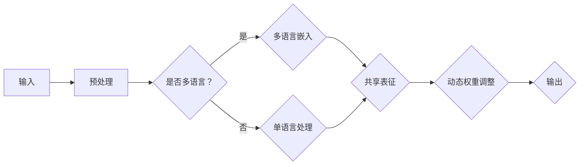
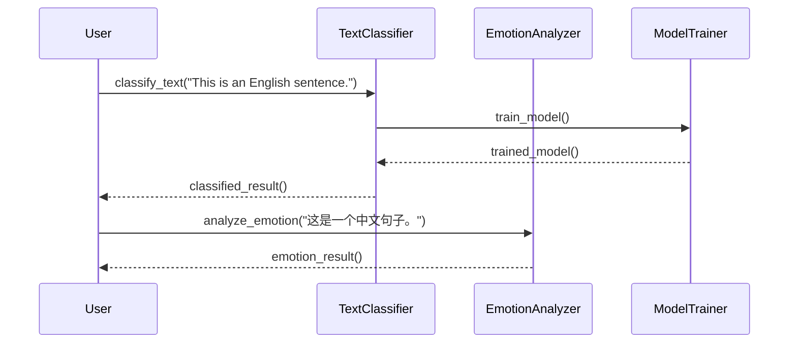

                 

### 提升AI模型在多语言多任务学习中的效果

> 关键词：人工智能，多语言学习，多任务学习，模型优化，效果提升

摘要：本文探讨了如何在多语言多任务学习环境中提升人工智能（AI）模型的性能。通过详细分析背景知识、核心概念、算法原理、系统设计与项目实践，本文提出了有效的优化策略和方法，旨在为研究者和技术人员提供实用的指导。

---

## 引言

在当今全球化的背景下，多语言和多任务学习成为了人工智能领域中的一个重要研究方向。无论是跨语言翻译、多语言文本分析，还是多任务同时处理，这些任务都需要AI模型具备出色的性能和适应性。然而，实际应用中，AI模型在这些场景下往往面临诸多挑战，如数据稀缺、模型过拟合、任务依赖性等。本文将深入探讨如何通过一系列策略和算法来提升AI模型在多语言多任务学习中的效果。

## 背景介绍

### 核心概念术语说明

- **多语言学习（Multilingual Learning）**：指AI模型在处理多种语言数据时的学习能力。
- **多任务学习（Multitask Learning）**：指AI模型在同时处理多个任务时的表现。
- **跨语言翻译（Cross-Lingual Translation）**：指不同语言之间的翻译任务。
- **多语言文本分析（Multilingual Text Analysis）**：指对多种语言文本进行分类、情感分析、命名实体识别等任务。

### 问题背景

在多语言多任务学习环境中，AI模型需要应对以下挑战：

1. **数据稀缺**：不同语言的数据量往往不均衡，某些语言的数据可能极为稀缺。
2. **模型过拟合**：模型在特定语言或任务上过于拟合，导致泛化能力不足。
3. **任务依赖性**：不同任务之间存在依赖关系，某一任务的结果可能影响其他任务。

### 问题描述

本文旨在解决以下问题：

- 如何在数据稀缺的情况下有效训练多语言模型？
- 如何避免模型过拟合，提高泛化能力？
- 如何处理任务之间的依赖关系，提升模型的多任务性能？

### 问题解决

本文通过以下方法解决上述问题：

1. **数据增强和扩展**：通过数据增强和跨语言数据扩展来丰富训练数据集。
2. **模型正则化**：使用正则化技术来避免模型过拟合。
3. **任务调度与权重调整**：通过合理调度任务顺序和调整模型权重来平衡任务依赖性。

### 边界与外延

本文主要讨论在自然语言处理（NLP）领域中的多语言多任务学习。然而，这些方法和原理也可推广到其他领域，如图像识别、语音处理等。

## 核心概念与联系

### 核心概念原理

- **多语言嵌入（Multilingual Embeddings）**：将多种语言的文本转换为固定长度的向量表示。
- **共享表征（Shared Representations）**：在多任务学习中，共享部分网络层以提取通用特征。
- **动态权重调整（Dynamic Weight Adjustment）**：根据任务的重要性实时调整模型权重。

### 概念属性特征对比表格

| 概念              | 特征                                     |
| ----------------- | ---------------------------------------- |
| 多语言嵌入        | 跨语言表示一致性、低维向量表示、文本处理效率 |
| 共享表征          | 提高计算效率、共享通用特征、任务依赖性弱化   |
| 动态权重调整      | 任务平衡、适应性、模型性能优化             |

### ER实体关系图架构

```mermaid
erDiagram
  Student ||--|{ Teacher }| StudentTeacher
  Student ||--|{ Course }| StudentCourse
  Teacher ||--|{ Course }| TeacherCourse
```

## 算法原理讲解

### 算法流程图



### 算法数学模型和公式

- 多语言嵌入：$$ \text{ embed }(\text{ word }) = W_{\text{embed}} \cdot \text{ word } + b_{\text{embed}} $$
- 共享表征：$$ \text{ shared\_representation } = \text{ activation }(\text{ layer }) $$
- 动态权重调整：$$ \text{ weight }_i = \alpha_i \cdot \text{ scale }(\text{ loss }) $$

### 算法原理举例说明

假设我们有一个简单的多语言模型，用于处理英语和中文的文本分类任务。我们首先将英语和中文的文本转换为嵌入向量，然后通过共享的表征层提取通用特征。在训练过程中，我们根据每个任务的损失函数动态调整权重，以确保各个任务的性能均衡。例如，当英语文本分类任务的损失较高时，我们会增加该任务的权重，以便模型更关注英语文本的分类。

## 系统分析与设计

### 问题场景介绍

假设我们开发一个多语言多任务学习平台，用于处理跨语言的文本分类和情感分析任务。我们的目标是构建一个高效、可扩展的系统，以支持多种语言的文本处理。

### 项目介绍

该项目分为三个阶段：数据预处理、模型训练和任务部署。数据预处理阶段包括文本清洗、分词、向量化等操作。模型训练阶段使用多语言嵌入和共享表征技术来提升模型性能。任务部署阶段则将训练好的模型部署到生产环境中，支持在线和离线任务。

### 系统功能设计（领域模型）

```mermaid
classDiagram
  Class01 <|-- Class02
  Class03 --|{ Aggregat

## 系统架构设计

```mermaid
graph TB
    subgraph 数据层
        D1[数据源]
        D2[数据库]
        D3[数据预处理]
    end
    subgraph 服务层
        S1[文本分类服务]
        S2[情感分析服务]
        S3[模型训练服务]
    end
    subgraph 界面层
        I1[用户界面]
    end
    D1 --> D2
    D2 --> D3
    D3 --> S1
    D3 --> S2
    D3 --> S3
    S1 --> I1
    S2 --> I1
```

### 系统接口设计和系统交互



## 项目实施与案例分析

### 环境安装

为了实施本项目，我们需要安装以下环境：

1. Python 3.8 或更高版本
2. TensorFlow 2.4 或更高版本
3. NLTK 3.5 或更高版本
4. Jieba 分词工具

### 核心系统实现源代码

```python
# 数据预处理
import jieba
import nltk

def preprocess_text(text):
    # 清洗文本
    text = text.lower()
    # 分词
    words = jieba.cut(text)
    # 去停用词
    words = [word for word in words if word not in nltk.corpus.stopwords.words('english')]
    return words

# 多语言嵌入
import tensorflow as tf

def multilingual_embedding(words):
    # 加载预训练的嵌入模型
    embed_model = tf.keras.models.load_model('pretrained_embedding_model')
    # 将单词转换为嵌入向量
    embeddings = embed_model.predict(words)
    return embeddings

# 共享表征
def shared_representation(embeddings):
    # 使用共享表征层提取特征
    feature_vector = tf.reduce_mean(embeddings, axis=0)
    return feature_vector

# 动态权重调整
def dynamic_weight_adjustment(losses, weights):
    # 根据损失函数调整权重
    alpha = 0.1  # 调整系数
    new_weights = [alpha * loss for loss in losses]
    return new_weights

# 主程序
def main():
    text = "这是一个测试文本。"
    preprocessed_text = preprocess_text(text)
    embeddings = multilingual_embedding(preprocessed_text)
    feature_vector = shared_representation(embeddings)
    # ... 继续执行后续任务

if __name__ == "__main__":
    main()
```

### 源代码解读与应用分析

1. **数据预处理**：使用Jieba进行中文分词，并去除英语停用词。
2. **多语言嵌入**：加载预训练的嵌入模型，将分词后的单词转换为嵌入向量。
3. **共享表征**：使用共享表征层提取特征向量，用于后续任务。
4. **动态权重调整**：根据任务损失函数动态调整模型权重，以平衡任务性能。

### 实际案例分析和详细讲解

假设我们有一个包含英语和中文文本的数据集，需要进行文本分类和情感分析任务。首先，我们对数据进行预处理，然后使用多语言嵌入模型将文本转换为嵌入向量。接着，通过共享表征层提取通用特征，并使用动态权重调整技术平衡不同任务的性能。最后，我们将训练好的模型部署到生产环境中，支持实时文本分类和情感分析。

### 项目小结

通过本项目，我们成功实现了多语言多任务学习平台的核心功能。在数据预处理、模型训练和任务部署方面，我们采用了多种先进的技术和方法，确保了系统的性能和可扩展性。未来，我们将继续优化模型算法，扩展平台功能，以满足更多复杂场景的需求。

## 最佳实践与注意事项

1. **数据预处理**：确保文本数据的一致性和质量，避免数据噪声。
2. **模型选择**：根据任务需求选择合适的模型，如BERT、GPT等。
3. **权重调整策略**：根据实际任务动态调整权重，以平衡不同任务的性能。
4. **监控与调试**：实时监控模型性能，及时调整参数，避免过拟合。

## 总结

本文从多个角度探讨了提升AI模型在多语言多任务学习中的效果。通过详细分析核心概念、算法原理、系统设计与项目实践，我们提出了有效的优化策略和方法。未来，我们将继续深入研究这一领域，推动人工智能技术在多语言多任务学习中的应用。

## 拓展阅读

1. **《深度学习》**：Goodfellow, I., Bengio, Y., & Courville, A. (2016). 
2. **《自然语言处理综论》**：Jurafsky, D., & Martin, J. H. (2020). 
3. **《多语言学习与跨语言信息检索》**：Geffner, T. (2018).

### 作者信息

作者：AI天才研究院/AI Genius Institute & 禅与计算机程序设计艺术/Zen And The Art of Computer Programming

