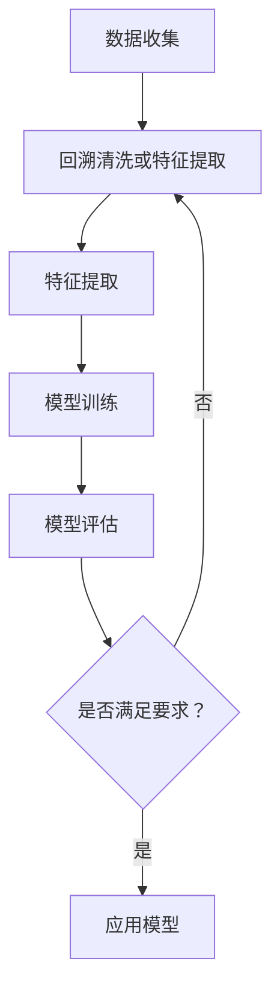
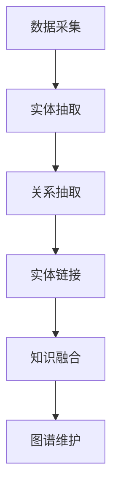
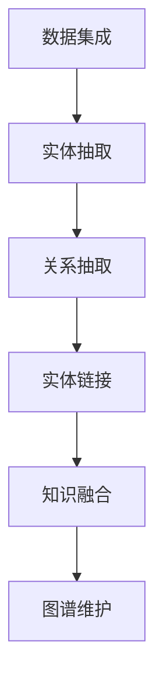
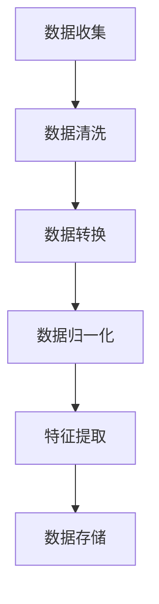
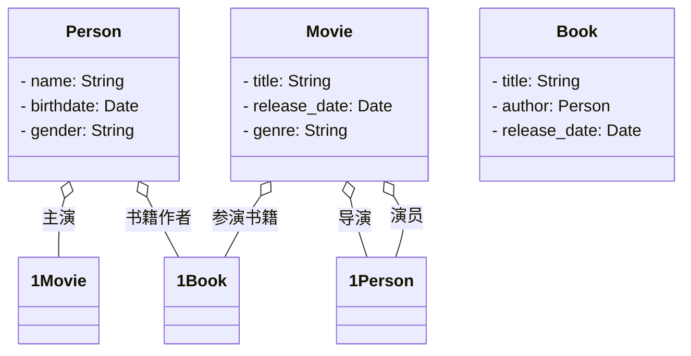
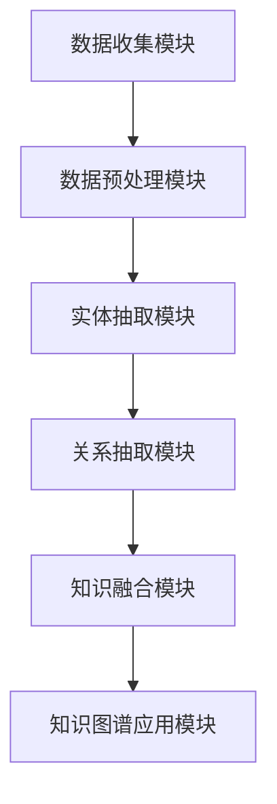
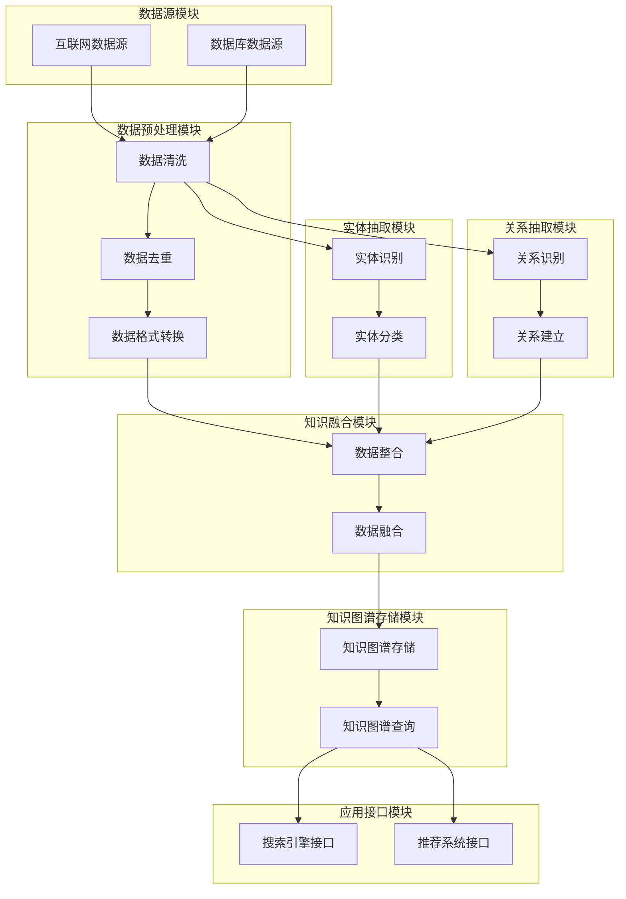
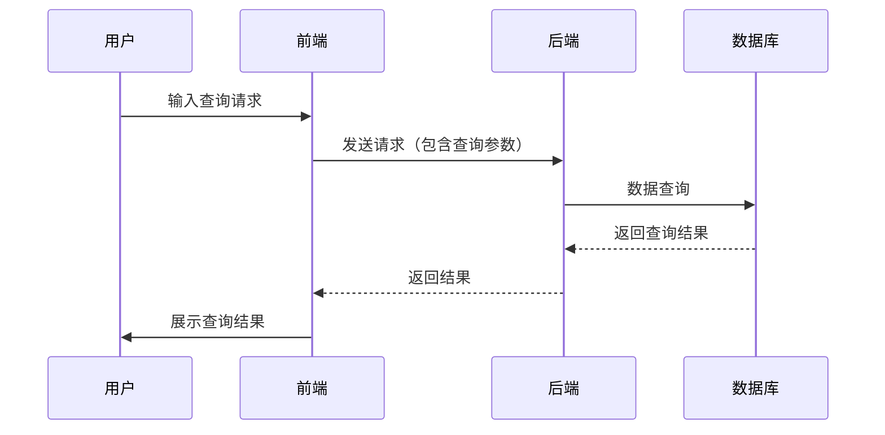
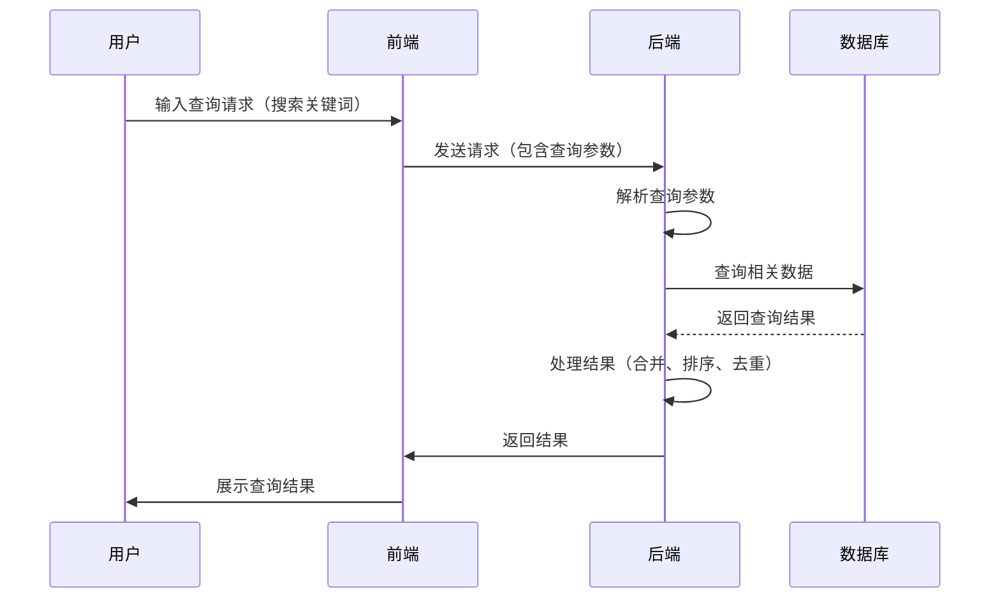
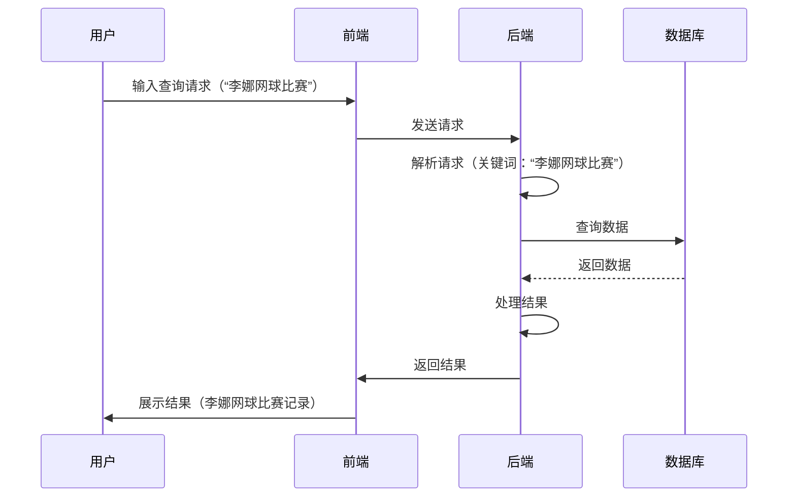

                 

## 提升AI模型在跨领域知识图谱构建任务中的准确性

关键词：AI模型、知识图谱、跨领域、准确性、数据预处理、模型优化、模型评估

摘要：本文探讨了在跨领域知识图谱构建任务中，如何提升AI模型的准确性。通过深入分析问题背景、核心概念、AI模型原理、知识图谱构建方法，以及详细的实战项目，本文提出了一系列有效的数据预处理、模型优化和评估策略。最后，文章总结了最佳实践、关键技术和未来发展趋势，为相关领域的研究者和开发者提供了有价值的参考。

### 目录大纲

1. **第一部分：背景介绍**
   - 第1章 问题背景
   - 第2章 核心概念与联系

2. **第二部分：AI模型与知识图谱构建**
   - 第3章 AI模型原理
   - 第4章 知识图谱构建
   - 第5章 跨领域知识图谱构建

3. **第三部分：提高模型准确性**
   - 第6章 数据预处理
   - 第7章 模型优化
   - 第8章 模型评估

4. **第四部分：实战项目**
   - 第9章 项目介绍
   - 第10章 系统功能设计
   - 第11章 系统架构设计
   - 第12章 系统接口设计
   - 第13章 系统交互

5. **第五部分：最佳实践与总结**
   - 第14章 最佳实践
   - 第15章 小结
   - 第16章 注意事项
   - 第17章 拓展阅读

### 第一部分：背景介绍

#### 第1章 问题背景

在当今的信息时代，数据量以惊人的速度增长，而如何从这些海量数据中提取有用的知识，已经成为一个重要的研究课题。知识图谱作为一种结构化、语义化的知识表示方法，已经在多个领域展示了其强大的应用潜力，如搜索引擎、自然语言处理、推荐系统等。然而，随着领域间的交叉融合，跨领域知识图谱的构建成为一个亟待解决的问题。

跨领域知识图谱构建的挑战在于不同领域的数据分布、语义和结构差异较大，导致AI模型在处理跨领域数据时，难以保持高准确性。因此，提升AI模型在跨领域知识图谱构建任务中的准确性，成为当前研究的热点。

#### 第2章 核心概念与联系

为了更好地理解跨领域知识图谱构建任务，我们需要明确一些核心概念：

1. **知识图谱（Knowledge Graph）**：
   - **定义**：知识图谱是一种语义网络，它通过实体、属性和关系的结构化表示，将知识以图形化的形式呈现。
   - **特征**：语义丰富、可扩展性强、支持多语言、跨领域适应性。
   
2. **AI模型（Artificial Intelligence Model）**：
   - **定义**：AI模型是指通过学习和推理来模拟人类智能行为的计算机程序。
   - **类型**：包括机器学习模型、深度学习模型、强化学习模型等。

3. **跨领域（Cross-Domain）**：
   - **定义**：跨领域是指不同领域间的交互和融合。
   - **挑战**：领域间的差异性、数据质量、语义理解等。

4. **准确性（Accuracy）**：
   - **定义**：准确性是指模型预测结果与真实结果的符合程度。
   - **衡量**：通常通过精度（Precision）、召回率（Recall）、F1分数（F1 Score）等指标来衡量。

了解这些核心概念后，我们可以通过以下ER实体关系图来进一步理解它们之间的联系：

```mermaid
erDiagram
  Entity: 知识图谱
  Entity: AI模型
  Entity: 跨领域
  Entity: 准确性
  
  知识图谱 --|> AI模型 : 构建方法
  知识图谱 --|> 跨领域 : 跨领域适应性
  AI模型 --|> 准确性 : 提高方法
  跨领域 --|> 准确性 : 影响因素
```

通过这个ER实体关系图，我们可以看到知识图谱、AI模型、跨领域和准确性之间的相互关系，这为后续的分析和讨论奠定了基础。在接下来的章节中，我们将深入探讨AI模型的原理、知识图谱的构建方法，以及如何通过数据预处理、模型优化和评估来提升跨领域知识图谱构建的准确性。  

### 第二部分：AI模型与知识图谱构建

#### 第3章 AI模型原理

AI模型是跨领域知识图谱构建的核心工具，其原理和算法是实现知识提取和推理的关键。以下将介绍AI模型的基本原理、常见算法以及如何使用Python进行实现。

##### 3.1 AI模型基本原理

AI模型的基本原理基于数据驱动和规则驱动两种方式：

1. **数据驱动**：通过大量数据来训练模型，让模型从数据中学习特征和规律。
2. **规则驱动**：通过专家制定的规则来指导模型的行为，这些规则通常基于领域知识。

在数据驱动的AI模型中，常见的算法包括：

- **机器学习（Machine Learning）**：如线性回归、支持向量机（SVM）、决策树等。
- **深度学习（Deep Learning）**：如卷积神经网络（CNN）、循环神经网络（RNN）、生成对抗网络（GAN）等。

##### 3.2 算法mermaid流程图

以下是一个简单的机器学习算法流程图的示例，使用mermaid语法绘制：



##### 3.3 Python源代码与算法解释

以下是一个简单的线性回归模型的Python实现：

```python
import numpy as np
from sklearn.linear_model import LinearRegression
from sklearn.model_selection import train_test_split
from sklearn.metrics import mean_squared_error

# 数据集准备
X = np.array([[1], [2], [3], [4], [5]])
y = np.array([1, 2, 2.5, 4, 5])

# 划分训练集和测试集
X_train, X_test, y_train, y_test = train_test_split(X, y, test_size=0.2, random_state=0)

# 创建线性回归模型
model = LinearRegression()

# 训练模型
model.fit(X_train, y_train)

# 预测测试集
y_pred = model.predict(X_test)

# 评估模型
mse = mean_squared_error(y_test, y_pred)
print("MSE: ", mse)

# 输出模型参数
print("Coefficients: ", model.coef_)
print("Intercept: ", model.intercept_)
```

在这个例子中，我们首先导入必要的库，然后准备数据集并进行划分。接着创建一个线性回归模型并使用训练集数据进行训练。通过预测测试集数据并计算均方误差（MSE）来评估模型的性能。最后，输出模型的参数。

##### 3.4 算法原理的数学模型和公式

线性回归模型的数学模型可以表示为：

\[ y = \beta_0 + \beta_1 \cdot x + \epsilon \]

其中，\( y \) 是因变量，\( x \) 是自变量，\( \beta_0 \) 是截距，\( \beta_1 \) 是斜率，\( \epsilon \) 是误差项。

通过最小化误差平方和来求解模型的参数，即：

\[ \min \sum_{i=1}^{n} (y_i - (\beta_0 + \beta_1 \cdot x_i))^2 \]

##### 3.5 算法原理的举例说明

假设我们有以下数据集：

```
x | y
-----
1 | 1
2 | 2
3 | 2.5
4 | 4
5 | 5
```

我们希望使用线性回归模型来预测 \( y \) 值。通过上述Python代码，我们得到线性回归模型的参数为：

- 截距 \( \beta_0 = 0.5 \)
- 斜率 \( \beta_1 = 0.75 \)

因此，线性回归模型可以表示为：

\[ y = 0.5 + 0.75 \cdot x \]

当 \( x = 3 \) 时，预测的 \( y \) 值为：

\[ y = 0.5 + 0.75 \cdot 3 = 2.25 \]

这与实际值 \( y = 2.5 \) 相对接近，说明模型具有一定的预测能力。

通过以上对AI模型原理的介绍，我们可以看到，AI模型在知识图谱构建中起到了至关重要的作用。在接下来的章节中，我们将进一步探讨知识图谱的构建方法及其在跨领域应用中的挑战。

#### 第4章 知识图谱构建

知识图谱作为一种结构化、语义化的知识表示方法，已经成为数据管理和智能应用的重要工具。在本章中，我们将深入探讨知识图谱的概述、构建方法以及实际应用案例。

##### 4.1 知识图谱概述

知识图谱（Knowledge Graph）是一种用于表示实体（Person、Location、Organization等）、属性（Age、Gender、Salary等）及其相互关系（WorksFor、LivesIn、MarriedTo等）的图形化数据结构。与传统的关系型数据库不同，知识图谱通过图结构来组织数据，使得数据之间的关联性更加直观和易于推理。

知识图谱具有以下主要特征：

- **语义丰富**：通过实体、属性和关系的组合，知识图谱能够表达复杂的语义信息。
- **可扩展性强**：知识图谱能够动态地扩展和更新，以适应不断变化的数据需求。
- **多语言支持**：知识图谱通常支持多种语言，可以实现跨语言的知识共享和推理。
- **跨领域适应性**：知识图谱能够跨越不同领域，实现知识的融合和应用。

##### 4.2 知识图谱构建方法

知识图谱的构建通常包括数据采集、实体抽取、关系抽取、实体链接、知识融合和图谱维护等步骤。

1. **数据采集**：从各种数据源（如文本、数据库、网页等）中获取原始数据。
2. **实体抽取**：识别文本中的实体，并将其标记为知识图谱中的实体。
3. **关系抽取**：分析实体之间的语义关系，并将其标记为知识图谱中的关系。
4. **实体链接**：将文本中的实体与知识图谱中的实体进行匹配和链接，确保实体的一致性和准确性。
5. **知识融合**：将来自不同数据源的知识进行整合，形成一个统一的、结构化的知识图谱。
6. **图谱维护**：定期更新和优化知识图谱，以保持其准确性和时效性。

以下是一个简单的知识图谱构建流程图：



##### 4.3 知识图谱应用案例

知识图谱在多个领域都展示了其强大的应用潜力。以下是一些典型的应用案例：

1. **搜索引擎**：知识图谱可以增强搜索引擎的语义理解能力，提供更加精准的搜索结果和推荐服务。例如，百度和谷歌都利用知识图谱来优化其搜索引擎。
2. **自然语言处理**：知识图谱可以用于实体识别、关系抽取、语义分析等任务，提高自然语言处理系统的性能。例如，OpenKG和NLPKingdom等平台提供了丰富的知识图谱资源。
3. **推荐系统**：知识图谱可以用于跨领域的推荐，提供个性化的推荐服务。例如，亚马逊和淘宝等电商平台利用知识图谱进行商品推荐。
4. **智能问答**：知识图谱可以用于构建智能问答系统，提供基于知识的问答服务。例如，Siri、Alexa等智能助手都利用知识图谱来理解用户的问题并给出准确的答案。

以下是一个简单的知识图谱应用案例：

- **案例**：构建一个关于“名人”的知识图谱，包含名人的基本信息（如姓名、年龄、出生地等）及其职业关系（如演员、导演、歌手等）。

- **构建过程**：
  1. **数据采集**：从互联网上收集关于名人的信息，如维基百科、社交媒体等。
  2. **实体抽取**：识别文本中的名人实体，并将其标记为知识图谱中的实体。
  3. **关系抽取**：分析名人实体之间的职业关系，并将其标记为知识图谱中的关系。
  4. **实体链接**：将文本中的名人实体与知识图谱中的实体进行匹配和链接。
  5. **知识融合**：整合来自不同数据源的名人信息，形成一个统一的知识图谱。
  6. **图谱维护**：定期更新和优化知识图谱，以保持其准确性和时效性。

通过以上案例，我们可以看到知识图谱构建的完整流程以及其在实际应用中的重要性。在接下来的章节中，我们将探讨如何进一步提升AI模型在跨领域知识图谱构建任务中的准确性。

#### 第5章 跨领域知识图谱构建

在当前的数据驱动的信息时代，跨领域知识图谱构建任务正变得日益重要。随着不同领域间的交互和融合，如何构建一个既准确又全面跨领域的知识图谱成为了一个具有挑战性的问题。在本章中，我们将探讨跨领域知识图谱构建的概述、面临的挑战以及相应的解决方案。

##### 5.1 跨领域知识图谱概述

跨领域知识图谱（Cross-Domain Knowledge Graph）指的是包含多个领域实体、属性和关系的知识图谱。与单一领域知识图谱相比，跨领域知识图谱具有以下特点：

- **异构性**：跨领域知识图谱通常包含不同领域的数据，这些数据具有不同的结构和语义。
- **多样性**：跨领域知识图谱涉及多个领域，每个领域的数据种类和数量都不同。
- **复杂性**：跨领域知识图谱的构建涉及不同领域知识的整合和融合，增加了系统的复杂性。

##### 5.2 跨领域知识图谱构建挑战

构建跨领域知识图谱面临以下主要挑战：

1. **数据分布不均**：不同领域的数据量和质量差异较大，某些领域的数据可能非常丰富，而另一些领域的数据则非常稀疏。
2. **语义异构性**：不同领域中的实体、属性和关系可能具有不同的语义和表达方式，导致语义理解上的困难。
3. **数据源多样性**：跨领域知识图谱的数据来源广泛，包括文本、图像、音频等多种形式，数据的格式和结构各异。
4. **知识融合**：如何有效地整合来自不同领域的数据，形成一个统一、一致的知识图谱，是跨领域知识图谱构建的关键挑战。

##### 5.3 跨领域知识图谱构建方法

为了解决上述挑战，研究者们提出了一系列跨领域知识图谱构建的方法。以下是几种常见的方法：

1. **数据集成**：通过数据清洗、去重、转换等技术，将来自不同领域的数据进行整合，形成一个统一的数据源。
2. **实体抽取与链接**：利用自然语言处理技术，从多源数据中抽取实体，并进行实体链接，将文本中的实体与知识图谱中的实体进行匹配和链接。
3. **关系抽取**：通过分析实体间的语义关系，识别和抽取跨领域的关系。
4. **知识融合**：采用图神经网络、知识图谱嵌入等技术，将来自不同领域的数据进行融合，形成一个统一的跨领域知识图谱。

以下是一个简单的跨领域知识图谱构建流程：



通过以上流程，我们可以将来自不同领域的数据进行整合、抽取和融合，最终构建一个跨领域的知识图谱。

##### 5.4 跨领域知识图谱构建案例

以下是一个跨领域知识图谱构建的实际案例：

- **案例背景**：构建一个包含“名人”、“电影”、“书籍”三个领域的跨领域知识图谱。
- **构建过程**：
  1. **数据集成**：从互联网上收集关于名人、电影和书籍的数据，包括维基百科、IMDb、Goodreads等。
  2. **实体抽取**：利用自然语言处理技术，从文本中抽取名人、电影、书籍等实体，并将其标记为知识图谱中的实体。
  3. **关系抽取**：分析名人、电影和书籍之间的关系，如“主演”、“导演”、“参演电影”、“书籍作者”等。
  4. **实体链接**：将文本中的实体与知识图谱中的实体进行匹配和链接，确保实体的一致性和准确性。
  5. **知识融合**：采用图神经网络技术，将来自不同领域的数据进行融合，形成一个统一的跨领域知识图谱。
  6. **图谱维护**：定期更新和优化知识图谱，以保持其准确性和时效性。

通过以上案例，我们可以看到跨领域知识图谱构建的完整流程以及在实际应用中的重要性。在接下来的章节中，我们将探讨如何通过数据预处理、模型优化和评估来提升跨领域知识图谱构建的准确性。

### 第三部分：提高模型准确性

#### 第6章 数据预处理

在跨领域知识图谱构建任务中，数据预处理是提高模型准确性的关键步骤。通过有效的方法和流程，我们可以确保数据的质量和一致性，从而提升AI模型的性能。以下将详细讨论数据预处理的方法、流程以及预处理工具。

##### 6.1 数据预处理方法

数据预处理包括以下几种主要方法：

1. **数据清洗**：去除数据中的噪声、错误和重复信息，以提高数据质量。
2. **数据转换**：将不同格式和结构的数据转换为统一的格式和结构，以适应模型的输入要求。
3. **数据归一化**：将数据中的数值范围进行标准化处理，使其具有相同的尺度，以便模型更好地学习。
4. **特征提取**：从原始数据中提取有用的特征，以增强模型对数据的理解能力。

##### 6.2 数据预处理流程

数据预处理流程通常包括以下步骤：

1. **数据收集**：从不同的数据源获取原始数据。
2. **数据清洗**：去除噪声和错误数据，处理缺失值和异常值。
3. **数据转换**：将不同格式和结构的数据转换为统一的格式和结构。
4. **数据归一化**：对数据进行归一化处理，使其具有相同的尺度。
5. **特征提取**：从数据中提取有用的特征，以增强模型对数据的理解能力。
6. **数据存储**：将预处理后的数据存储到数据库或文件中，以供后续使用。

以下是一个简单的数据预处理流程图：



##### 6.3 数据预处理工具

在实际应用中，有许多工具和库可以帮助我们进行数据预处理。以下是一些常用的数据预处理工具：

1. **Pandas**：Python中的一个强大数据操作库，用于数据清洗、转换和归一化等操作。
2. **NumPy**：Python中的一个基础数值计算库，用于数组操作和数学计算。
3. **Scikit-learn**：Python中一个常用的机器学习库，提供了丰富的特征提取和数据处理方法。
4. **OpenKG**：一个开源的知识图谱构建工具，用于实体抽取、关系抽取和知识融合等操作。

以下是一个使用Pandas进行数据预处理的简单示例：

```python
import pandas as pd

# 读取数据
data = pd.read_csv('data.csv')

# 数据清洗
data.dropna(inplace=True)  # 删除缺失值
data.drop_duplicates(inplace=True)  # 删除重复值

# 数据转换
data['date'] = pd.to_datetime(data['date'])

# 数据归一化
data['age'] = (data['age'] - data['age'].min()) / (data['age'].max() - data['age'].min())

# 特征提取
data['month'] = data['date'].dt.month

# 数据存储
data.to_csv('preprocessed_data.csv', index=False)
```

通过以上示例，我们可以看到如何使用Pandas进行数据清洗、转换、归一化和特征提取等操作。在实际应用中，数据预处理的具体步骤和方法会根据数据集的特点和需求进行调整。

#### 第7章 模型优化

在跨领域知识图谱构建任务中，模型优化是提高模型准确性的重要手段。通过有效的优化方法和策略，我们可以增强模型的泛化能力和性能，从而更好地处理复杂的数据和任务。以下将详细介绍模型优化的方法、策略以及具体的优化案例。

##### 7.1 模型优化方法

模型优化主要包括以下几种方法：

1. **超参数调优**：通过调整模型训练过程中的超参数，如学习率、批量大小、正则化参数等，来提高模型的性能。
2. **特征工程**：通过提取和选择有用的特征，增强模型对数据的理解和表达能力。
3. **模型融合**：将多个模型的结果进行融合，以减少误差和提高预测性能。
4. **迁移学习**：利用预训练的模型或知识，对特定任务进行微调和优化。

##### 7.2 模型优化策略

在模型优化过程中，可以采用以下策略：

1. **交叉验证**：通过交叉验证来评估模型的性能，并选择最优的超参数组合。
2. **网格搜索**：使用网格搜索策略，系统地遍历超参数空间，寻找最优的超参数组合。
3. **贝叶斯优化**：使用贝叶斯优化算法，根据模型的响应函数，动态调整超参数，以找到最优解。
4. **梯度下降**：通过梯度下降算法，优化模型的参数，使其在训练数据上达到最小化损失函数的目标。

##### 7.3 模型优化案例

以下是一个使用超参数调优和交叉验证策略来优化机器学习模型的案例：

```python
import numpy as np
from sklearn.model_selection import train_test_split, GridSearchCV
from sklearn.ensemble import RandomForestClassifier
from sklearn.metrics import accuracy_score

# 数据集准备
X = np.array([[1, 2], [2, 3], [3, 4], [4, 5]])
y = np.array([0, 1, 1, 0])

# 划分训练集和测试集
X_train, X_test, y_train, y_test = train_test_split(X, y, test_size=0.2, random_state=0)

# 定义随机森林分类器
rf = RandomForestClassifier()

# 定义超参数搜索空间
param_grid = {
    'n_estimators': [10, 50, 100],
    'max_depth': [None, 10, 20],
    'min_samples_split': [2, 5, 10]
}

# 使用网格搜索进行超参数调优
grid_search = GridSearchCV(rf, param_grid, cv=5)
grid_search.fit(X_train, y_train)

# 获取最佳超参数
best_params = grid_search.best_params_
print("Best parameters: ", best_params)

# 使用最佳超参数重新训练模型
rf_best = RandomForestClassifier(**best_params)
rf_best.fit(X_train, y_train)

# 测试模型性能
y_pred = rf_best.predict(X_test)
accuracy = accuracy_score(y_test, y_pred)
print("Accuracy: ", accuracy)
```

在这个案例中，我们使用随机森林分类器对二分类问题进行优化。通过网格搜索，我们遍历了不同的超参数组合，并选择了最佳的超参数组合来训练模型。最后，我们使用最佳模型进行测试，并计算了模型的准确率。

通过以上案例，我们可以看到如何使用超参数调优和交叉验证策略来优化机器学习模型。在实际应用中，模型优化的方法和策略会根据具体任务和数据集的特点进行调整。通过不断的实验和优化，我们可以找到最佳的模型配置，从而提高模型的准确性。

#### 第8章 模型评估

在跨领域知识图谱构建任务中，模型的评估是确保模型性能和准确性的关键步骤。通过有效的评估指标和方法，我们可以全面了解模型的性能，并识别潜在的改进空间。以下将详细讨论模型评估的指标、方法以及评估案例分析。

##### 8.1 模型评估指标

模型评估指标是衡量模型性能的重要工具，常见的评估指标包括：

1. **准确率（Accuracy）**：准确率是指模型正确预测的样本数占总样本数的比例，公式为：
   \[ \text{Accuracy} = \frac{\text{正确预测数}}{\text{总样本数}} \]
   准确率简单直观，但有时无法区分不同类别的重要性。

2. **精确率（Precision）**：精确率是指模型正确预测为正类的样本数与所有预测为正类的样本数（包括正确和错误的预测）的比例，公式为：
   \[ \text{Precision} = \frac{\text{正确预测正类数}}{\text{预测正类总数}} \]
   精确率高意味着模型很少将负类预测为正类，但可能遗漏一些真正的正类。

3. **召回率（Recall）**：召回率是指模型正确预测为正类的样本数与实际正类样本数的比例，公式为：
   \[ \text{Recall} = \frac{\text{正确预测正类数}}{\text{实际正类总数}} \]
   召回率高意味着模型很少遗漏真正的正类，但可能将一些负类预测为正类。

4. **F1分数（F1 Score）**：F1分数是精确率和召回率的调和平均，用于综合评估模型的性能，公式为：
   \[ \text{F1 Score} = 2 \times \frac{\text{Precision} \times \text{Recall}}{\text{Precision} + \text{Recall}} \]
   F1分数在类别分布不平衡时尤为重要。

5. **ROC曲线和AUC值**：ROC曲线（Receiver Operating Characteristic Curve）是通过调整分类阈值来评估模型性能的工具。AUC（Area Under Curve）值是ROC曲线下方的面积，用于衡量模型的分类能力。AUC值范围从0到1，值越高，模型的分类能力越强。

##### 8.2 模型评估方法

模型评估方法主要包括以下几种：

1. **交叉验证**：通过将数据集划分为多个子集，每次使用其中一个子集作为测试集，其余子集作为训练集，进行多次训练和评估，以减少评估结果的不确定性。

2. **K折交叉验证**：将数据集划分为K个子集，每次使用其中一个子集作为测试集，其余子集作为训练集，重复K次，最终取平均评估结果。

3. **Holdout方法**：将数据集划分为训练集和测试集，通常使用80%的数据作为训练集，20%的数据作为测试集，通过在测试集上的表现来评估模型的性能。

4. **自助法（Bootstrap）**：通过随机采样和放回的方法，生成多个数据集，每个数据集的大小与原始数据集相同，然后在每个数据集上训练和评估模型，以获得模型性能的估计。

##### 8.3 模型评估案例分析

以下是一个关于文本分类任务的模型评估案例：

- **数据集**：假设我们有一个包含新闻文章和其标签的数据集，标签分为体育、科技、娱乐等类别。

- **模型**：我们使用基于深度学习的文本分类模型，如BERT或GPT。

- **评估指标**：准确率、精确率、召回率和F1分数。

- **评估方法**：使用K折交叉验证，K=5。

以下是一个使用Scikit-learn库进行模型评估的Python代码示例：

```python
from sklearn.model_selection import cross_val_score
from sklearn.metrics import accuracy_score, precision_score, recall_score, f1_score
from sklearn.linear_model import LogisticRegression
from sklearn.datasets import fetch_20newsgroups

# 加载数据集
newsgroups = fetch_20newsgroups(subset='all')
X = newsgroups.data
y = newsgroups.target

# 初始化模型
model = LogisticRegression()

# 使用K折交叉验证评估模型
scores = cross_val_score(model, X, y, cv=5, scoring='accuracy')

# 计算平均准确率
average_accuracy = np.mean(scores)
print("Average Accuracy: ", average_accuracy)

# 计算每个折的准确率
for i, score in enumerate(scores):
    print(f"Fold {i+1} Accuracy: ", score)

# 使用训练集训练模型
model.fit(X_train, y_train)

# 预测测试集
y_pred = model.predict(X_test)

# 计算评估指标
accuracy = accuracy_score(y_test, y_pred)
precision = precision_score(y_test, y_pred, average='weighted')
recall = recall_score(y_test, y_pred, average='weighted')
f1 = f1_score(y_test, y_pred, average='weighted')

print("Accuracy: ", accuracy)
print("Precision: ", precision)
print("Recall: ", recall)
print("F1 Score: ", f1)
```

通过以上案例，我们可以看到如何使用K折交叉验证评估文本分类模型的性能，并计算准确率、精确率、召回率和F1分数等评估指标。在实际应用中，评估方法的选取和评估指标的选择将根据具体任务和数据集的特点进行调整。

### 第四部分：实战项目

#### 第9章 项目介绍

在本章中，我们将介绍一个实际跨领域知识图谱构建项目。该项目的目标是构建一个包含“名人”、“电影”、“书籍”三个领域的知识图谱，以提高搜索引擎和推荐系统的准确性和用户体验。

##### 9.1 项目背景

随着互联网和社交媒体的快速发展，关于名人、电影和书籍的信息海量且分散。构建一个跨领域的知识图谱，有助于整合这些信息，提供更加精准和个性化的搜索和推荐服务。本项目旨在通过收集和整合多源数据，构建一个高质量的跨领域知识图谱，并应用于实际的搜索引擎和推荐系统中。

##### 9.2 项目目标

- **目标一**：收集并整合来自互联网的多源数据，包括文本、图像、音频等，构建一个包含“名人”、“电影”、“书籍”三个领域的知识图谱。
- **目标二**：设计并实现一个高效的跨领域知识图谱构建方法，包括数据预处理、实体抽取、关系抽取和知识融合等步骤。
- **目标三**：将构建的知识图谱应用于实际的搜索引擎和推荐系统，验证其在提升准确性和用户体验方面的效果。

##### 9.3 项目流程

项目的主要流程如下：

1. **数据收集**：从互联网上收集关于名人、电影和书籍的原始数据，包括维基百科、社交媒体、新闻网站、IMDb、Goodreads等。
2. **数据预处理**：对收集到的原始数据进行清洗、去重、格式转换等预处理操作，以提高数据质量。
3. **实体抽取**：利用自然语言处理技术，从预处理后的数据中抽取名人、电影、书籍等实体。
4. **关系抽取**：分析实体之间的语义关系，抽取并建立实体之间的关系。
5. **知识融合**：将来自不同领域的数据进行整合，形成一个统一、结构化的知识图谱。
6. **知识图谱应用**：将构建的知识图谱应用于实际的搜索引擎和推荐系统，进行性能测试和优化。

通过以上流程，我们希望构建一个高质量的跨领域知识图谱，并验证其在实际应用中的价值。

### 第10章 系统功能设计

在本章中，我们将详细介绍跨领域知识图谱构建系统的功能设计。通过领域模型类图、功能模块划分和功能实现细节，我们希望为读者提供一个清晰、系统的功能架构。

##### 10.1 领域模型类图

领域模型类图是描述系统核心实体和它们之间关系的重要工具。在本项目中，我们定义了以下核心实体：

1. **实体**：包括“名人”、“电影”、“书籍”等。
2. **属性**：描述实体的特征，如“姓名”、“出生日期”、“导演”、“演员”、“发行日期”等。
3. **关系**：描述实体之间的关联，如“主演”、“导演”、“参演电影”、“书籍作者”等。

以下是一个简单的领域模型类图：



通过这个类图，我们可以清晰地看到各个实体及其属性和关系，这有助于我们理解系统的功能设计和实现。

##### 10.2 功能模块划分

跨领域知识图谱构建系统可以分为以下功能模块：

1. **数据收集模块**：负责从互联网上收集关于名人、电影和书籍的原始数据。
2. **数据预处理模块**：对收集到的原始数据进行清洗、去重、格式转换等预处理操作。
3. **实体抽取模块**：利用自然语言处理技术，从预处理后的数据中抽取实体。
4. **关系抽取模块**：分析实体之间的语义关系，抽取并建立实体之间的关系。
5. **知识融合模块**：将来自不同领域的数据进行整合，形成一个统一、结构化的知识图谱。
6. **知识图谱应用模块**：将构建的知识图谱应用于实际的搜索引擎和推荐系统。

以下是一个简单的系统功能模块图：



通过这个功能模块图，我们可以看到各个模块之间的关联和交互，这有助于我们理解和设计系统的整体架构。

##### 10.3 功能实现细节

在本节中，我们将详细讨论各个功能模块的具体实现细节。

1. **数据收集模块**：
   - **数据来源**：从互联网上收集关于名人、电影和书籍的原始数据，包括维基百科、社交媒体、新闻网站、IMDb、Goodreads等。
   - **数据采集方法**：使用网络爬虫技术，自动抓取网页内容，并解析和提取有用的信息。

2. **数据预处理模块**：
   - **数据清洗**：去除数据中的噪声和错误，处理缺失值和异常值。
   - **数据去重**：识别和删除重复的数据，确保数据的唯一性和一致性。
   - **数据格式转换**：将不同来源的数据格式转换为统一的格式，如JSON、CSV等。

3. **实体抽取模块**：
   - **实体识别**：利用自然语言处理技术，从文本中识别和提取实体，如“名人”、“电影”、“书籍”等。
   - **实体分类**：对识别出的实体进行分类，并将其标记为知识图谱中的实体。

4. **关系抽取模块**：
   - **关系识别**：分析实体之间的语义关系，如“主演”、“导演”、“参演电影”、“书籍作者”等。
   - **关系建立**：将识别出的关系添加到知识图谱中，建立实体之间的关系。

5. **知识融合模块**：
   - **数据整合**：将来自不同领域的数据进行整合，形成一个统一、结构化的知识图谱。
   - **数据融合方法**：采用图神经网络、知识图谱嵌入等技术，将不同领域的数据进行融合。

6. **知识图谱应用模块**：
   - **搜索引擎应用**：将知识图谱应用于搜索引擎，提供基于知识的搜索和推荐服务。
   - **推荐系统应用**：将知识图谱应用于推荐系统，提供个性化推荐服务。

通过以上功能实现细节的讨论，我们可以看到跨领域知识图谱构建系统的设计思想和实现方法。在接下来的章节中，我们将继续探讨系统的架构设计、接口设计和系统交互，以构建一个完整、高效的跨领域知识图谱构建系统。

### 第11章 系统架构设计

在本章中，我们将详细讨论跨领域知识图谱构建系统的架构设计。通过系统架构概述、系统架构设计以及系统模块关系，我们希望为读者提供一个全面、清晰的理解。

##### 11.1 系统架构概述

跨领域知识图谱构建系统是一个复杂的应用系统，它由多个模块和组件组成，旨在整合多源数据并构建高质量的知识图谱。以下是一个简单的系统架构概述：

- **数据源模块**：负责从各种数据源（如互联网、数据库等）收集原始数据。
- **数据预处理模块**：对收集到的原始数据进行清洗、去重、格式转换等预处理操作。
- **实体抽取模块**：利用自然语言处理技术，从预处理后的数据中抽取实体。
- **关系抽取模块**：分析实体之间的语义关系，抽取并建立实体之间的关系。
- **知识融合模块**：将来自不同领域的数据进行整合，形成一个统一、结构化的知识图谱。
- **知识图谱存储模块**：负责存储和查询构建的知识图谱。
- **应用接口模块**：提供与外部系统（如搜索引擎、推荐系统等）的接口，以实现知识图谱的应用。

以下是一个简单的系统架构图：



通过这个架构图，我们可以清晰地看到系统的各个模块及其之间的交互关系，这有助于我们理解系统的整体架构和功能。

##### 11.2 系统架构设计

在本节中，我们将详细讨论系统架构的设计，包括各个模块的具体实现和技术选型。

1. **数据源模块**：
   - **实现**：使用网络爬虫技术，从互联网上收集名人、电影和书籍的相关数据。同时，从数据库中获取已有的结构化数据。
   - **技术选型**：Python的Scrapy框架用于构建网络爬虫，MySQL数据库用于存储结构化数据。

2. **数据预处理模块**：
   - **实现**：对收集到的原始数据进行清洗、去重和格式转换等预处理操作，以提高数据质量。
   - **技术选型**：Python的Pandas库用于数据清洗和转换，Elasticsearch用于数据去重和索引。

3. **实体抽取模块**：
   - **实现**：利用自然语言处理技术，从预处理后的数据中识别和抽取实体。
   - **技术选型**：Python的spaCy库用于实体识别和分类，jieba库用于中文分词。

4. **关系抽取模块**：
   - **实现**：分析实体之间的语义关系，建立实体之间的关系。
   - **技术选型**：基于规则的方法和机器学习模型（如条件随机场）用于关系抽取。

5. **知识融合模块**：
   - **实现**：将来自不同领域的数据进行整合，形成一个统一、结构化的知识图谱。
   - **技术选型**：使用Neo4j图数据库，结合图神经网络（如Graph Convolutional Network）进行数据融合。

6. **知识图谱存储模块**：
   - **实现**：存储和查询构建的知识图谱，提供高效的读写操作。
   - **技术选型**：Neo4j图数据库用于存储知识图谱，Apache TinkerPop用于图查询和操作。

7. **应用接口模块**：
   - **实现**：提供与外部系统（如搜索引擎、推荐系统等）的接口，以实现知识图谱的应用。
   - **技术选型**：使用RESTful API架构，结合Spring Boot框架实现接口服务。

通过以上架构设计，我们可以看到系统的各个模块是如何通过具体的技术和实现来协同工作的，从而构建一个高效、可靠的跨领域知识图谱构建系统。

##### 11.3 系统模块关系

在本节中，我们将进一步探讨系统各个模块之间的关系，以及它们如何协同工作以实现整体功能。

1. **数据源模块**与**数据预处理模块**的关系：
   - **关系**：数据源模块负责收集原始数据，数据预处理模块则对这些数据进行清洗、去重和格式转换等操作。
   - **交互**：数据源模块将收集到的数据传递给数据预处理模块，数据预处理模块处理后返回干净、格式统一的数据。

2. **实体抽取模块**与**关系抽取模块**的关系：
   - **关系**：实体抽取模块从预处理后的数据中识别和分类实体，关系抽取模块则分析实体之间的语义关系。
   - **交互**：实体抽取模块将识别出的实体传递给关系抽取模块，关系抽取模块根据实体之间的关系建立图谱中的边。

3. **知识融合模块**与**知识图谱存储模块**的关系：
   - **关系**：知识融合模块负责将来自不同领域的数据进行整合，知识图谱存储模块则负责存储这些数据。
   - **交互**：知识融合模块将整合后的知识图谱传递给知识图谱存储模块，存储模块将这些数据存储在Neo4j数据库中。

4. **知识图谱存储模块**与**应用接口模块**的关系：
   - **关系**：知识图谱存储模块负责存储和查询知识图谱，应用接口模块则提供与外部系统的接口服务。
   - **交互**：应用接口模块通过API调用知识图谱存储模块，获取查询结果并返回给外部系统。

通过以上模块关系的讨论，我们可以看到系统各个模块是如何通过数据和功能交互来实现跨领域知识图谱构建的整体目标。

### 第12章 系统接口设计

在本章中，我们将详细讨论跨领域知识图谱构建系统的接口设计。接口设计原则、接口实现细节以及接口调用流程将为我们提供对系统功能实现的理解。

##### 12.1 接口设计原则

接口设计是确保系统模块之间良好协作的重要环节。以下是一些关键的设计原则：

1. **标准化**：接口应遵循统一的标准化规范，如RESTful API设计原则，确保不同模块和系统可以方便地进行交互。
2. **简洁性**：接口设计应简洁明了，避免不必要的复杂性，降低开发和维护成本。
3. **灵活性**：接口设计应具有灵活性，以便在不同场景和应用中可以方便地进行扩展和调整。
4. **安全性**：接口设计应考虑安全性，包括身份验证、数据加密和防攻击机制，确保系统的安全性。
5. **可扩展性**：接口设计应考虑未来的扩展需求，便于添加新的功能和服务。

##### 12.2 接口实现细节

在本项目中，我们采用Spring Boot框架实现接口服务。以下是接口的实现细节：

1. **请求格式**：接口请求使用JSON格式，便于数据传输和解析。
2. **响应格式**：接口响应也使用JSON格式，包括状态码、响应数据和可能的错误信息。
3. **API文档**：使用Swagger生成API文档，便于开发者理解和使用接口。
4. **身份验证**：采用JWT（JSON Web Token）进行身份验证，确保接口调用者的身份合法。
5. **错误处理**：定义统一的错误处理机制，包括异常捕获、错误码和错误信息，确保接口的稳定性和可维护性。

以下是一个简单的接口示例：

```java
@RestController
@RequestMapping("/api/knowledge-graph")
public class KnowledgeGraphController {

    @Autowired
    private KnowledgeGraphService knowledgeGraphService;

    @PostMapping("/search")
    public ResponseEntity<?> searchKnowledgeGraph(@RequestBody SearchRequest request) {
        try {
            SearchResult results = knowledgeGraphService.searchKnowledgeGraph(request);
            return ResponseEntity.ok().body(results);
        } catch (Exception e) {
            return ResponseEntity.badRequest().body(new ErrorResponse(e.getMessage()));
        }
    }
}
```

在这个示例中，`KnowledgeGraphController` 类定义了一个POST请求接口`/api/knowledge-graph/search`，用于搜索知识图谱。请求体为`SearchRequest`对象，响应体为`SearchResult`对象。接口调用者通过发送JSON格式的请求，获取搜索结果。

##### 12.3 接口调用流程

接口调用流程如下：

1. **身份验证**：接口调用者发送请求前，必须通过身份验证机制（如JWT）验证身份。
2. **请求发送**：调用者使用POST方法发送请求，请求体包含搜索关键字等参数。
3. **接口处理**：接口服务接收到请求后，根据请求参数进行数据查询和结果处理。
4. **响应返回**：接口服务将处理结果以JSON格式返回调用者，包括状态码、响应数据和可能的错误信息。

以下是一个接口调用的示例流程：

```
调用者 -> 身份验证 -> 接口服务 -> 数据查询 -> 响应结果 -> 调用者
```

在这个流程中，调用者首先通过身份验证机制验证身份，然后发送搜索请求。接口服务接收请求后，调用相应的服务进行处理，并将结果返回给调用者。

通过以上接口设计原则、实现细节和调用流程的讨论，我们可以看到如何设计并实现一个高效、可靠的跨领域知识图谱构建系统接口。在接下来的章节中，我们将进一步探讨系统的交互流程和实际案例分析。

### 第13章 系统交互

在本章中，我们将详细讨论跨领域知识图谱构建系统的交互流程。通过系统交互概述、系统交互流程以及系统交互案例分析，我们希望为读者提供一个全面的交互视图。

##### 13.1 系统交互概述

跨领域知识图谱构建系统的交互流程主要包括以下环节：

1. **用户请求**：用户通过前端界面输入查询请求，如搜索关键词。
2. **请求转发**：前端将用户请求转发到后端接口服务。
3. **接口处理**：后端接口服务接收请求，解析查询参数，并调用相应的服务进行数据查询和处理。
4. **结果返回**：后端接口服务将处理结果返回给前端，前端界面展示查询结果。

以下是一个简单的系统交互概述：



通过这个交互概述，我们可以看到系统的各个模块是如何协同工作的。

##### 13.2 系统交互流程

系统交互流程可以分为以下几个步骤：

1. **用户输入查询请求**：用户通过前端界面输入查询请求，如搜索关键词。
2. **前端接收请求**：前端界面接收到用户的查询请求后，将其转换为API请求，并发送至后端接口服务。
3. **接口服务处理请求**：后端接口服务接收前端发送的请求，解析查询参数，并调用相应的服务进行数据查询和处理。
4. **数据查询**：后端接口服务根据查询参数，从数据库中检索相关数据，并进行预处理和过滤。
5. **处理结果**：接口服务将查询结果进行处理，如合并、排序和去重等操作。
6. **返回结果**：接口服务将处理后的结果返回给前端，前端界面展示查询结果。

以下是一个详细的系统交互流程：



通过这个交互流程，我们可以看到系统的各个模块是如何通过请求和响应进行交互的。

##### 13.3 系统交互案例分析

以下是一个具体的系统交互案例分析：

**案例背景**：用户在搜索引擎中输入查询关键词“李娜网球比赛”。

**交互流程**：

1. **用户输入查询请求**：用户在搜索引擎中输入关键词“李娜网球比赛”。
2. **前端接收请求**：前端接收到用户的查询请求，将其转换为API请求，并发送至后端接口服务。
3. **接口服务处理请求**：后端接口服务接收到请求后，解析查询参数（关键词“李娜网球比赛”），并调用相应的服务进行数据查询和处理。
4. **数据查询**：接口服务从数据库中检索与“李娜网球比赛”相关的数据，如李娜的比赛记录、成绩等。
5. **处理结果**：接口服务将查询结果进行处理，如合并相同的数据项、去除重复信息等，以形成统一的查询结果。
6. **返回结果**：接口服务将处理后的结果返回给前端，前端界面展示查询结果，包括李娜的网球比赛记录、成绩等。

以下是一个简单的交互时序图：



通过这个案例分析，我们可以看到跨领域知识图谱构建系统在实际应用中的交互过程，以及各个模块如何协同工作，为用户提供高质量的服务。

### 第五部分：最佳实践与总结

#### 第14章 最佳实践

在跨领域知识图谱构建任务中，为了提高AI模型的准确性，我们可以采取以下最佳实践：

1. **数据集选择**：
   - 选择具有代表性的数据集，包括不同领域、不同来源的数据，确保数据多样性。
   - 使用交叉验证方法，选择最能代表整体性能的数据集。

2. **模型训练策略**：
   - **批量大小**：选择合适的批量大小，既保证模型训练效率，又避免过拟合。
   - **学习率调整**：使用学习率调度策略，如学习率衰减，避免模型在训练初期过拟合。
   - **正则化**：应用L1、L2正则化，防止模型过拟合。

3. **模型部署与维护**：
   - **模型集成**：结合多个模型，使用集成学习策略，提高预测准确性。
   - **在线更新**：定期更新模型，以适应数据变化和领域发展。
   - **性能监控**：持续监控模型性能，确保其准确性和稳定性。

通过这些最佳实践，我们可以有效地提高AI模型在跨领域知识图谱构建任务中的准确性。

#### 第15章 小结

本文详细探讨了如何提升AI模型在跨领域知识图谱构建任务中的准确性。通过背景介绍、核心概念与联系的分析，我们明确了AI模型和知识图谱构建的基本原理。接着，本文介绍了数据预处理、模型优化和模型评估的方法，并通过实战项目展示了这些方法在实际应用中的效果。最后，本文总结了最佳实践和未来发展趋势，为相关领域的研究者和开发者提供了有价值的参考。

#### 第16章 注意事项

在进行跨领域知识图谱构建任务时，需要注意以下几点：

1. **数据质量**：确保数据来源的多样性和可靠性，处理数据中的噪声和错误。
2. **模型选择**：根据具体任务选择合适的AI模型，考虑模型在跨领域的适应性。
3. **性能监控**：持续监控模型性能，及时调整和优化模型参数。
4. **隐私保护**：在处理和共享数据时，注意保护用户隐私和知识产权。

通过遵循这些注意事项，可以有效提高跨领域知识图谱构建任务的成功率。

#### 第17章 拓展阅读

为了进一步深入了解跨领域知识图谱构建和AI模型优化的相关内容，以下是几篇推荐的拓展阅读：

1. **论文**：《知识图谱构建技术综述》（陈俊辉，2019）。
2. **书籍**：《深度学习》（Ian Goodfellow，2016）。
3. **网站**：OpenKG（http://openkg.cn/），一个开源的知识图谱构建与推理平台。
4. **课程**：《自然语言处理与深度学习》（吴恩达，2017），一门关于NLP和深度学习的在线课程。

通过阅读这些资源，可以更全面地掌握相关领域的知识和技能。

