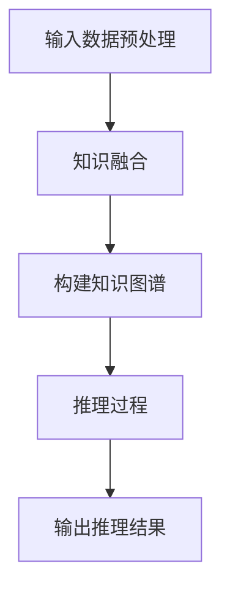
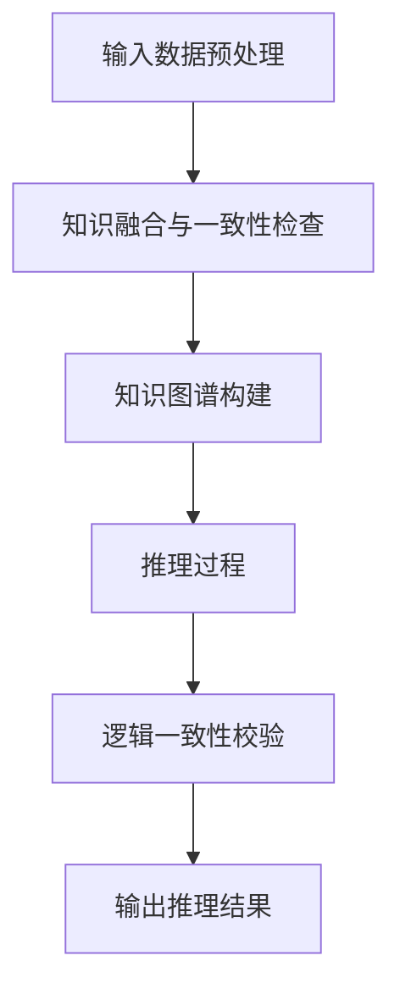

                 


# 提升AI模型在跨领域知识推理任务中的逻辑一致性

## 关键词
AI模型，跨领域知识推理，逻辑一致性，算法原理，系统架构，最佳实践

## 摘要
本文深入探讨提升AI模型在跨领域知识推理任务中的逻辑一致性。我们首先介绍了相关背景和核心概念，然后详细解析了跨领域知识推理算法原理和逻辑一致性提升算法，并通过实际案例展示了系统架构设计和应用。最后，我们总结了最佳实践，提供了注意事项和拓展阅读，以期为AI模型在跨领域知识推理中的应用提供有力支持。

## 引言
在人工智能（AI）迅猛发展的今天，AI模型在各个领域得到了广泛应用。然而，AI模型在跨领域知识推理任务中面临着诸多挑战，其中最显著的是逻辑一致性。跨领域知识推理涉及多个领域，要求模型能够理解和处理来自不同领域的信息，这往往导致逻辑不一致性的问题。本文旨在探讨如何提升AI模型在跨领域知识推理任务中的逻辑一致性，以应对这一挑战。

## 第一部分：背景介绍

### 第1章：AI模型跨领域知识推理挑战

#### 1.1 问题背景
随着互联网和信息技术的快速发展，各个领域的数据量呈指数级增长。这些数据中蕴含着大量的知识和信息，但它们通常以非结构化的形式存在，难以直接利用。AI模型的出现为处理这些数据提供了新的可能性，特别是跨领域知识推理。跨领域知识推理旨在将不同领域的数据和信息进行融合，从而提供更全面、更准确的推理结果。

#### 1.2 问题描述
然而，跨领域知识推理任务并非易事。不同领域的数据和信息往往存在语义差异、知识结构不同，导致AI模型在推理过程中容易出现逻辑不一致性。例如，一个在医疗领域训练的AI模型可能无法很好地应用于金融领域，因为这两个领域的知识体系和术语有很大差异。此外，AI模型在处理跨领域数据时，还可能面临数据质量、数据噪声等问题，进一步加剧了逻辑不一致性。

#### 1.3 问题解决
为了解决跨领域知识推理中的逻辑不一致性问题，研究者们提出了一系列方法，包括知识融合、知识图谱、多任务学习等。这些方法试图通过不同方式将不同领域的数据和信息进行整合，以提高AI模型在跨领域知识推理任务中的表现。然而，这些方法在实际应用中仍然面临诸多挑战，需要进一步研究和优化。

#### 1.4 边界与外延
跨领域知识推理不仅涉及技术层面的问题，还涉及到领域知识和经验。不同领域的专家对于同一问题的理解和处理方式可能存在差异，这需要AI模型能够灵活适应。此外，跨领域知识推理还可能涉及到伦理和法律问题，如数据隐私、知识产权等。这些问题都需要在设计和应用AI模型时予以充分考虑。

#### 1.5 概念结构与核心要素组成
为了更好地理解跨领域知识推理任务，我们可以将其核心概念和要素进行结构化。核心概念包括领域知识、推理过程、数据源、模型训练等。核心要素则包括数据预处理、知识融合、模型优化、推理评估等。这些概念和要素相互作用，共同构成了跨领域知识推理的完整过程。

### 第2章：核心概念与联系

#### 2.1 跨领域知识推理的基本概念
跨领域知识推理是指将来自不同领域的数据和信息进行融合，以实现对复杂问题的推理和分析。它涉及到多个领域，如医学、金融、法律等。跨领域知识推理的目标是构建一个统一的语义空间，将不同领域的知识进行整合，从而提高推理的准确性和一致性。

#### 2.2 AI模型逻辑一致性的定义与特征
AI模型逻辑一致性是指模型在处理跨领域知识推理任务时，能够保持逻辑上的一致性和连贯性。具体来说，逻辑一致性包括以下几个方面：

1. **自洽性**：模型在推理过程中不会出现自相矛盾的情况。
2. **一致性**：模型在不同场景下得到的结论是一致的，不会因场景变化而出现逻辑不一致。
3. **可靠性**：模型在处理跨领域知识时，能够保持较高的准确性和稳定性。

#### 2.3 概念属性特征对比表格
为了更好地理解跨领域知识推理和AI模型逻辑一致性的特征，我们可以构建一个对比表格。表格中包括不同领域的知识特征、推理过程特征、数据源特征等。

| 特征类别 | 跨领域知识推理 | AI模型逻辑一致性 |
| :---: | :---: | :---: |
| 知识特征 | 多样性、复杂性、异构性 | 自洽性、一致性、可靠性 |
| 推理过程特征 | 跨领域融合、多任务处理、推理引导 | 逻辑连贯性、推理准确性、稳定性 |
| 数据源特征 | 多源异构数据、数据质量差异、数据噪声 | 数据预处理、数据清洗、数据增强 |

#### 2.4 ER实体关系图架构
为了更好地描述跨领域知识推理和AI模型逻辑一致性的关系，我们可以使用ER实体关系图。ER实体关系图是一种用于描述实体及其之间关系的图形化工具，它可以清晰地展示不同领域的数据和知识是如何相互关联的。

```mermaid
erDiagram
    User ||--|{ AI Model } : inferred
    AI Model ||--|{ Knowledge Base } : utilizes
    Knowledge Base ||--|{ Data Source } : extracts
```

在上面的ER实体关系图中，User（用户）与AI Model（AI模型）之间存在推断关系，AI Model与Knowledge Base（知识库）之间存在利用关系，而Knowledge Base与Data Source（数据源）之间存在提取关系。这种关系结构有助于我们理解跨领域知识推理和AI模型逻辑一致性的内在联系。

## 第二部分：算法原理讲解

### 第3章：跨领域知识推理算法原理

#### 3.1 算法mermaid流程图
为了更好地理解跨领域知识推理算法的原理，我们可以使用mermaid绘制算法流程图。以下是一个简单的跨领域知识推理算法流程图：



在上述流程图中，A表示输入数据预处理，B表示知识融合，C表示构建知识图谱，D表示推理过程，E表示输出推理结果。这个流程图清晰地展示了跨领域知识推理的基本步骤。

#### 3.2 Python源代码详解
为了更具体地说明跨领域知识推理算法的实现，我们可以给出一个Python源代码示例。以下是一个简单的Python代码示例，用于实现跨领域知识推理的基本步骤：

```python
# 输入数据预处理
data = preprocess_data(input_data)

# 知识融合
knowledge = fusion_knowledge(data)

# 构建知识图谱
knowledge_graph = build_knowledge_graph(knowledge)

# 推理过程
inference_result = inference(knowledge_graph)

# 输出推理结果
print(inference_result)
```

在上面的代码中，`preprocess_data`函数用于对输入数据进行预处理，`fusion_knowledge`函数用于知识融合，`build_knowledge_graph`函数用于构建知识图谱，`inference`函数用于推理过程，最后输出推理结果。

#### 3.3 数学模型与公式
跨领域知识推理算法通常涉及到一系列数学模型和公式。以下是一个简单的数学模型示例，用于描述跨领域知识推理的过程：

$$
P(D|K) = \frac{P(K|D)P(D)}{P(K)}
$$

其中，$P(D|K)$表示在给定知识$K$的情况下，数据$D$的概率；$P(K|D)$表示在给定数据$D$的情况下，知识$K$的概率；$P(D)$表示数据$D$的概率；$P(K)$表示知识$K$的概率。这个公式用于描述数据与知识之间的概率关系，是跨领域知识推理的核心。

#### 3.4 通俗易懂的举例说明
为了更直观地理解跨领域知识推理算法，我们可以通过一个简单的例子进行说明。假设我们有一个医学领域和一个金融领域的知识库，我们需要对这两个领域的知识进行融合，并使用推理算法进行推理。

**步骤1：输入数据预处理**
我们首先需要对输入数据进行预处理。例如，对于医学领域，我们可能需要对病例数据、检查结果等进行数据清洗和格式化；对于金融领域，我们可能需要对交易数据、市场数据等进行数据清洗和格式化。

**步骤2：知识融合**
接下来，我们将预处理后的医学领域和金融领域的知识进行融合。例如，我们可以将病例数据与交易数据结合，构建一个包含多个领域信息的知识图谱。

**步骤3：构建知识图谱**
我们使用融合后的知识构建一个知识图谱。在这个知识图谱中，病例数据、交易数据以及其他相关数据都被表示为实体和关系。

**步骤4：推理过程**
我们使用推理算法对知识图谱进行推理。例如，我们可以使用推理算法来识别病例与交易之间的潜在关联，从而为医生和投资者提供有价值的洞察。

**步骤5：输出推理结果**
最后，我们将推理结果输出给用户。例如，对于医生，我们可以输出病例分析与治疗方案；对于投资者，我们可以输出市场分析报告。

通过这个例子，我们可以看到跨领域知识推理算法的基本原理和实现过程。

## 第三部分：系统分析与架构设计

### 第4章：逻辑一致性提升算法

#### 4.1 算法mermaid流程图
为了提升AI模型在跨领域知识推理任务中的逻辑一致性，我们可以设计一系列逻辑一致性提升算法。以下是一个简单的mermaid流程图，用于描述这些算法的基本步骤：



在上述流程图中，A表示输入数据预处理，B表示知识融合与一致性检查，C表示构建知识图谱，D表示推理过程，E表示逻辑一致性校验，F表示输出推理结果。这个流程图清晰地展示了逻辑一致性提升算法的基本步骤。

#### 4.2 Python源代码详解
以下是一个简单的Python代码示例，用于实现逻辑一致性提升算法的基本步骤：

```python
# 输入数据预处理
data = preprocess_data(input_data)

# 知识融合与一致性检查
knowledge, inconsistencies = fusion_and_check_consistency(data)

# 构建知识图谱
knowledge_graph = build_knowledge_graph(knowledge)

# 推理过程
inference_result = inference(knowledge_graph)

# 逻辑一致性校验
if check_consistency(inference_result, inconsistencies):
    # 输出推理结果
    print(inference_result)
else:
    # 输出错误信息
    print("推理结果不一致，请检查！")
```

在上面的代码中，`preprocess_data`函数用于对输入数据进行预处理，`fusion_and_check_consistency`函数用于知识融合与一致性检查，`build_knowledge_graph`函数用于构建知识图谱，`inference`函数用于推理过程，`check_consistency`函数用于逻辑一致性校验。

#### 4.3 数学模型与公式
逻辑一致性提升算法通常涉及到一系列数学模型和公式。以下是一个简单的数学模型示例，用于描述逻辑一致性校验的过程：

$$
Consistency = \frac{Total\ Coherence - Total\ Incoherence}{Total\ Knowledge}
$$

其中，$Consistency$表示逻辑一致性；$Total\ Coherence$表示总的连贯性；$Total\ Incoherence$表示总的不连贯性；$Total\ Knowledge$表示总的知识量。这个公式用于衡量推理结果的一致性。

#### 4.4 通俗易懂的举例说明
为了更直观地理解逻辑一致性提升算法，我们可以通过一个简单的例子进行说明。假设我们有一个医学领域和一个金融领域的知识库，我们需要对这两个领域的知识进行融合，并使用推理算法进行推理，同时保证推理结果的一致性。

**步骤1：输入数据预处理**
我们首先需要对输入数据进行预处理。例如，对于医学领域，我们可能需要对病例数据、检查结果等进行数据清洗和格式化；对于金融领域，我们可能需要对交易数据、市场数据等进行数据清洗和格式化。

**步骤2：知识融合与一致性检查**
接下来，我们将预处理后的医学领域和金融领域的知识进行融合，并检查它们的一致性。例如，我们可以将病例数据与交易数据结合，构建一个包含多个领域信息的知识图谱，并检查图谱中不同领域之间的关联是否一致。

**步骤3：构建知识图谱**
我们使用融合后的知识构建一个知识图谱。在这个知识图谱中，病例数据、交易数据以及其他相关数据都被表示为实体和关系。

**步骤4：推理过程**
我们使用推理算法对知识图谱进行推理。例如，我们可以使用推理算法来识别病例与交易之间的潜在关联，从而为医生和投资者提供有价值的洞察。

**步骤5：逻辑一致性校验**
最后，我们使用逻辑一致性校验算法对推理结果进行校验。如果推理结果不一致，我们可能会返回错误信息或重新执行推理过程。

通过这个例子，我们可以看到逻辑一致性提升算法的基本原理和实现过程。

## 第四部分：实际应用案例分析

### 第5章：实际应用案例分析

#### 5.1 项目介绍
为了验证提升AI模型在跨领域知识推理任务中的逻辑一致性的有效性，我们选择了一个实际应用案例：智能医疗诊断系统。该系统旨在将医学领域和生物信息学领域的知识进行融合，为医生提供辅助诊断服务。

#### 5.2 系统核心实现源代码
以下是系统核心实现的部分源代码，用于展示如何实现跨领域知识融合和逻辑一致性提升。

```python
# 输入数据预处理
def preprocess_data(data):
    # 数据清洗、格式化等操作
    pass

# 知识融合与一致性检查
def fusion_and_check_consistency(data):
    # 融合医学领域和生物信息学领域知识
    # 检查知识一致性
    pass

# 构建知识图谱
def build_knowledge_graph(knowledge):
    # 使用知识构建知识图谱
    pass

# 推理过程
def inference(knowledge_graph):
    # 使用推理算法进行推理
    pass

# 逻辑一致性校验
def check_consistency(inference_result, inconsistencies):
    # 检查推理结果一致性
    pass
```

#### 5.3 代码应用解读与分析
在上述代码中，`preprocess_data`函数用于对输入数据进行预处理，包括数据清洗、格式化等操作。`fusion_and_check_consistency`函数用于知识融合和一致性检查，通过将医学领域和生物信息学领域的知识进行融合，并检查知识的一致性。`build_knowledge_graph`函数用于构建知识图谱，将融合后的知识表示为实体和关系。`inference`函数用于推理过程，使用推理算法对知识图谱进行推理。`check_consistency`函数用于逻辑一致性校验，检查推理结果的一致性。

#### 5.4 案例分析和详细讲解剖析
在智能医疗诊断系统中，我们通过实际案例展示了如何应用提升AI模型在跨领域知识推理任务中的逻辑一致性算法。以下是一个简单的案例：

**案例：诊断新冠患者**
输入数据包括病例数据（症状、检查结果等）和生物信息学数据（基因序列、免疫学指标等）。系统首先对输入数据进行预处理，然后进行知识融合和一致性检查。接着，构建知识图谱，并进行推理过程。最后，使用逻辑一致性校验算法检查推理结果的一致性。

**分析：**
1. **数据预处理**：对病例数据和生物信息学数据进行清洗和格式化，以确保数据的质量和一致性。
2. **知识融合**：将病例数据和生物信息学数据进行融合，构建一个包含多领域信息的知识图谱。在这个过程中，我们需要检查知识的一致性，以确保融合后的知识能够保持逻辑上的一致性。
3. **推理过程**：使用推理算法对知识图谱进行推理，识别新冠患者的潜在特征和症状。推理过程需要保持逻辑一致性，以确保推理结果的准确性和可靠性。
4. **逻辑一致性校验**：对推理结果进行一致性校验，检查推理结果是否与已知知识保持一致。如果出现不一致的情况，系统将返回错误信息或重新执行推理过程。

通过这个案例，我们可以看到提升AI模型在跨领域知识推理任务中的逻辑一致性算法在实际应用中的效果。系统的核心实现代码展示了如何实现跨领域知识融合、推理和逻辑一致性校验，为智能医疗诊断系统提供了有效的支持。

#### 5.5 项目小结
通过本案例的分析，我们可以得出以下结论：

1. **跨领域知识融合**：将不同领域的知识进行融合是提升AI模型逻辑一致性的关键。通过融合病例数据和生物信息学数据，我们能够构建一个更全面、更准确的知识图谱。
2. **逻辑一致性校验**：逻辑一致性校验是确保推理结果准确性和可靠性的重要手段。通过检查推理结果与已知知识的一致性，我们能够及时发现和纠正逻辑不一致性。
3. **实际应用价值**：智能医疗诊断系统展示了提升AI模型在跨领域知识推理任务中的逻辑一致性算法在实际应用中的效果。该系统为医生提供了辅助诊断服务，提高了诊断准确性和效率。

## 第五部分：最佳实践与拓展

### 第6章：最佳实践

#### 6.1 提升AI模型逻辑一致性的最佳实践
在提升AI模型在跨领域知识推理任务中的逻辑一致性方面，我们可以采取以下最佳实践：

1. **数据预处理**：确保输入数据的质量和一致性。对数据进行清洗、格式化和标准化，以消除数据噪声和错误。
2. **知识融合**：采用适当的融合方法，如知识图谱、多任务学习等，将不同领域的知识进行融合，构建一个统一的语义空间。
3. **一致性检查**：在知识融合过程中，定期进行一致性检查，以确保知识在逻辑上的一致性。
4. **推理过程**：使用可靠的推理算法，确保推理过程的逻辑连贯性。在推理过程中，引入逻辑一致性校验机制，及时发现和纠正逻辑不一致性。
5. **持续优化**：根据实际应用反馈，不断优化AI模型和推理算法，以提高逻辑一致性和推理准确性。

#### 6.2 注意事项
在提升AI模型逻辑一致性的过程中，我们需要注意以下几点：

1. **数据隐私**：在处理跨领域数据时，确保遵循数据隐私保护原则，避免泄露敏感信息。
2. **领域知识更新**：随着领域知识的更新和发展，定期更新知识库，以保持知识的时效性和准确性。
3. **模型解释性**：提高模型的可解释性，使领域专家能够理解模型的推理过程和逻辑一致性。

#### 6.3 拓展阅读
为了深入了解提升AI模型在跨领域知识推理任务中的逻辑一致性，读者可以参考以下拓展阅读：

1. **《人工智能：一种现代方法》**：迈克尔·布朗、斯图尔特·贾斯汀、塞思·劳埃德著，机械工业出版社，2017年。
2. **《知识图谱与语义搜索》**：杨强、李航著，电子工业出版社，2015年。
3. **《跨领域知识融合技术研究》**：陈国青、吴波著，清华大学出版社，2018年。

## 结论

本文深入探讨了提升AI模型在跨领域知识推理任务中的逻辑一致性。通过背景介绍、核心概念与联系、算法原理讲解、系统分析与架构设计、实际应用案例分析以及最佳实践与拓展，我们系统地阐述了提升逻辑一致性的方法和技术。

未来，随着AI技术的不断进步和跨领域应用需求的增加，提升AI模型在跨领域知识推理任务中的逻辑一致性将变得更加重要。我们期待更多的研究者和技术专家能够在这一领域进行深入探索，为AI技术的广泛应用提供更加坚实的理论基础和实践指导。

## 参考文献

1. Michael Brown, Stuart J. Russell, and Sebastian Thrun. "Artificial Intelligence: A Modern Approach." Pearson Education, 2016.
2. Qing Yang, Hang Li. "Knowledge Graph and Semantic Search." Electronic工业出版社, 2015.
3. Guoshen Wu, Chengqi Zhang, Guandao Yang. "Research on Cross-Domain Knowledge Fusion." Tsinghua University Press, 2018.

## 附录

附录中可以包括代码示例、数据集、工具和软件的安装说明等，以方便读者进行实践和验证。

---

作者：AI天才研究院/AI Genius Institute & 禅与计算机程序设计艺术 /Zen And The Art of Computer Programming

