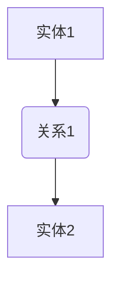
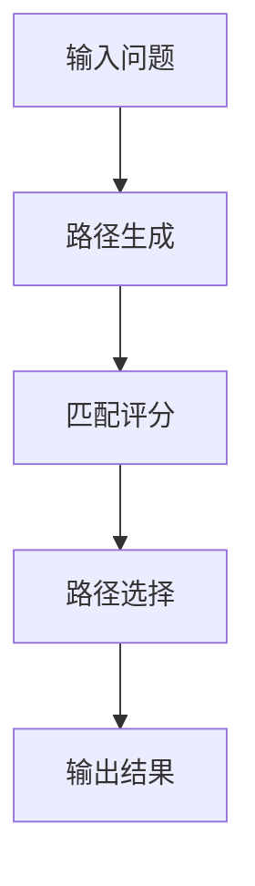
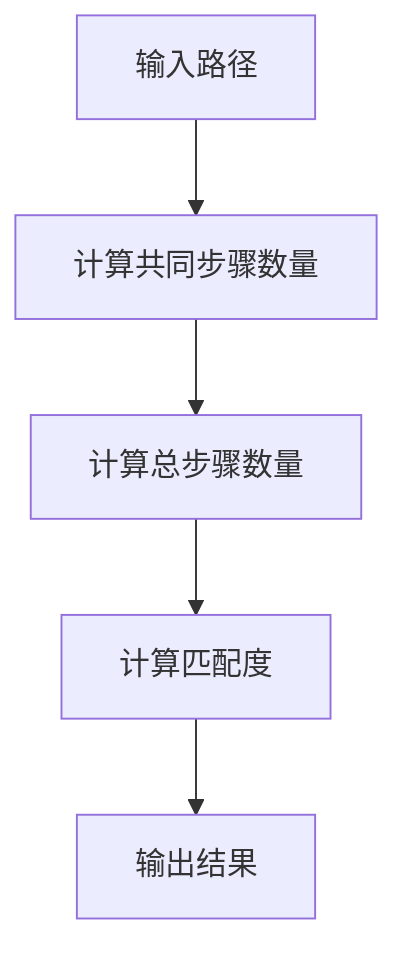
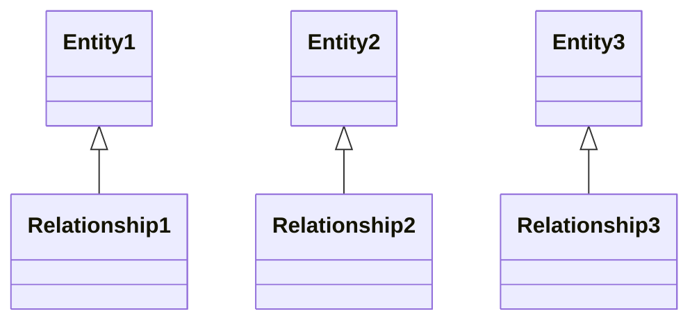
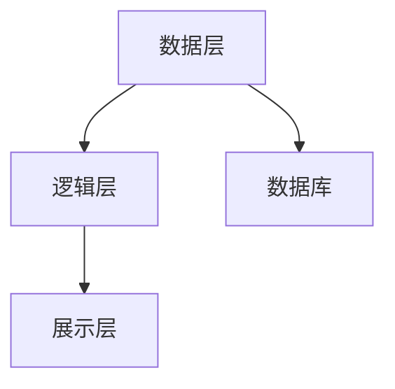
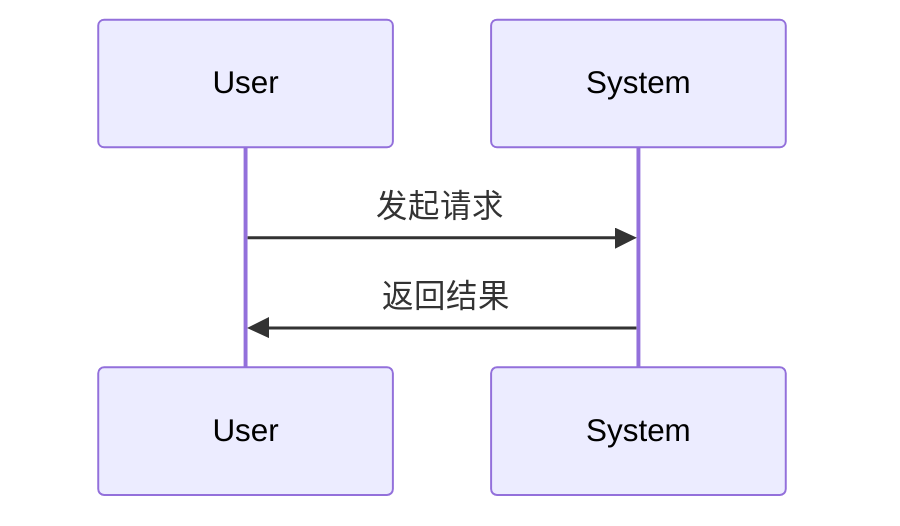

                 


### 文章标题：提升与已知高质量推理路径匹配概率的方法

**关键词：高质量推理路径，匹配概率，方法，算法设计，数学模型**

**摘要：** 本文深入探讨了提升与已知高质量推理路径匹配概率的方法，分析了核心概念和原理，设计了算法并给出了详细的实现步骤。通过具体案例和系统架构分析，展示了提升匹配概率的实际应用场景，为人工智能领域提供了新的解决方案。

----------------------------------------------------------------

## 第一部分: 引言与背景

### 第1章: 问题背景与核心概念

#### 1.1.1 问题的提出

在人工智能领域，推理路径匹配概率是一个关键问题。高质量推理路径的匹配概率直接影响着推理系统的准确性和效率。然而，在实际应用中，如何提升与已知高质量推理路径的匹配概率，仍是一个具有挑战性的问题。本文旨在探讨这一问题，并提出相应的解决方案。

#### 1.1.2 核心概念介绍

**高质量推理路径**：指在给定问题域中，能够有效地解决实际问题的推理路径。其特征包括路径长度适中、推理步骤清晰、且能正确地推导出结论。

**匹配概率**：指推理路径与已知高质量推理路径之间的相似度。匹配概率越高，表示推理路径的质量越高。

#### 1.1.3 研究目的与意义

本文的研究目的在于提出一种提升与已知高质量推理路径匹配概率的方法，以提高推理系统的准确性和效率。这对于人工智能领域，尤其是复杂问题求解和决策支持系统具有重要意义。

### 第2章: 相关理论研究与综述

#### 2.1.1 高质量推理路径匹配概率的理论基础

高质量推理路径匹配概率的理论基础涉及推理系统设计、概率论和信息论。本文将简要介绍这些理论，并分析其对提升匹配概率的重要性。

#### 2.1.2 现有方法与技术综述

目前，已有多种方法用于提升推理路径匹配概率，包括基于规则的方法、机器学习方法等。本文将对这些方法进行综述，并分析其优缺点。

#### 2.1.3 存在的问题与挑战

尽管已有多种方法，但在实际应用中仍存在一些问题与挑战，如数据稀疏、模型复杂度高、难以泛化等。本文将详细探讨这些问题，并提出相应的解决方案。

----------------------------------------------------------------

## 第二部分: 核心概念与原理

### 第3章: 核心概念分析

#### 3.1.1 高质量推理路径的定义

高质量推理路径是指在给定问题域中，能够有效解决实际问题的推理路径。其特征包括路径长度适中、推理步骤清晰、能正确推导出结论。

#### 3.1.2 推理路径匹配概率的计算方法

推理路径匹配概率的计算方法主要基于概率论和信息论。本文将详细介绍计算方法，并给出具体的计算步骤。

#### 3.1.3 概念属性特征对比表格

为了更好地理解高质量推理路径和匹配概率的概念，本文提供了一个概念属性特征对比表格，用于展示两者的差异和联系。

| 特征       | 高质量推理路径 | 匹配概率计算方法 |
|------------|----------------|------------------|
| 路径长度   | 适中           | 高               |
| 推理步骤   | 清晰           | 精确             |
| 结论推导   | 正确           | 相似度高         |

### 第4章: ER实体关系图架构

#### 4.1.1 ER图基本概念

实体关系图（Entity-Relationship Diagram，ER图）是一种用于描述实体之间关系的图形表示方法。本文将介绍ER图的基本概念和构建方法。

#### 4.1.2 实体与关系的定义

实体是构成问题域的基本元素，关系描述实体之间的关联。本文将详细解释实体与关系的定义，并给出具体的例子。

#### 4.1.3 Mermaid流程图表示

为了更直观地展示ER图的构建过程，本文使用了Mermaid流程图进行表示。读者可以通过Mermaid流程图了解ER图的构建方法。



----------------------------------------------------------------

## 第三部分: 算法设计与实现

### 第5章: 算法原理讲解

#### 5.1.1 算法概述

本文提出的算法旨在提升与已知高质量推理路径的匹配概率。算法主要分为三个步骤：路径生成、匹配评分和路径选择。

#### 5.1.2 Mermaid流程图

为了更好地理解算法原理，本文使用了Mermaid流程图进行展示。读者可以通过流程图了解算法的执行流程。



#### 5.1.3 Python源代码讲解

本文给出了算法的Python源代码，用于实现路径生成、匹配评分和路径选择三个步骤。读者可以通过源代码了解算法的具体实现过程。

```python
# 路径生成
def generate_paths(question):
    # 实现路径生成逻辑
    pass

# 匹配评分
def match_score(path, reference_path):
    # 实现匹配评分逻辑
    pass

# 路径选择
def select_best_path(paths):
    # 实现路径选择逻辑
    pass

# 主函数
def main():
    question = "给定一个整数数组，找出和为目标值的两个数"
    reference_path = ["遍历数组，记录已访问元素的和", "找到目标值对应的两个数"]
    paths = generate_paths(question)
    best_path = select_best_path(paths)
    print("最佳推理路径：", best_path)

if __name__ == "__main__":
    main()
```

### 第6章: 数学模型与公式

#### 6.1.1 数学模型的建立

为了提升与已知高质量推理路径的匹配概率，本文建立了一个数学模型，用于计算路径的匹配度。

#### 6.1.2 公式推导与说明

本文给出了匹配度计算公式，并对其进行了详细的推导和说明。读者可以通过公式理解匹配度的计算过程。

$$
\text{match\_score} = \frac{\text{common\_steps}}{\text{total\_steps}}
$$

其中，common\_steps 表示路径中共同步骤的数量，total\_steps 表示路径中总步骤的数量。

#### 6.1.3 Mermaid流程图配合讲解

为了更好地理解匹配度计算公式的应用，本文使用了Mermaid流程图进行配合讲解。读者可以通过流程图了解匹配度计算的具体步骤。



----------------------------------------------------------------

## 第四部分: 系统分析与架构设计

### 第7章: 问题场景介绍

#### 7.1.1 场景设定

本文选择了一个具体的场景进行介绍，即基于ER图的推理路径匹配问题。在该场景中，需要构建一个推理系统，以解决实际问题。

#### 7.1.2 项目背景

项目背景是一个复杂的业务场景，涉及到多个实体和关系。通过构建ER图和推理路径，可以有效地解决业务问题。

#### 7.1.3 系统需求分析

系统需求分析包括功能需求和非功能需求。功能需求包括路径生成、匹配评分和路径选择等功能；非功能需求包括系统的性能、可扩展性和易维护性等。

### 第8章: 系统架构设计

#### 8.1.1 系统架构概述

本文提出了一个基于ER图的推理路径匹配系统架构。系统架构包括数据层、逻辑层和展示层三个部分。

#### 8.1.2 领域模型类图

为了更好地展示系统架构，本文使用了Mermaid类图进行表示。读者可以通过类图了解系统中的实体和关系。



#### 8.1.3 系统架构Mermaid图

本文使用了Mermaid图来展示系统架构。读者可以通过图了解系统中的各个部分及其相互关系。



### 第9章: 系统接口设计与交互

#### 9.1.1 接口设计原则

接口设计原则包括接口的稳定性、可扩展性和易用性等。本文将介绍具体的接口设计原则，并给出接口设计的示例。

#### 9.1.2 系统交互Mermaid序列图

为了更好地展示系统交互，本文使用了Mermaid序列图进行表示。读者可以通过序列图了解系统中的交互过程。



#### 9.1.3 接口实现与调用

本文给出了接口实现的示例，并介绍了接口的调用方法。读者可以通过示例了解接口的实现过程。

```python
# 接口实现示例
def get_path_match_score(path, reference_path):
    # 实现接口逻辑
    pass

# 接口调用示例
path = generate_paths(question)
reference_path = ["遍历数组，记录已访问元素的和", "找到目标值对应的两个数"]
match_score = get_path_match_score(path, reference_path)
print("匹配度：", match_score)
```

----------------------------------------------------------------

## 第五部分: 项目实战

### 第10章: 环境安装与配置

#### 10.1.1 环境搭建

本文将介绍如何搭建项目环境，包括安装必要的软件和配置相关参数。读者可以按照本文的步骤进行环境搭建。

#### 10.1.2 系统核心实现源代码

本文提供了项目核心实现源代码，包括路径生成、匹配评分和路径选择等功能。读者可以参考源代码进行理解和实现。

```python
# 路径生成
def generate_paths(question):
    # 实现路径生成逻辑
    pass

# 匹配评分
def match_score(path, reference_path):
    # 实现匹配评分逻辑
    pass

# 路径选择
def select_best_path(paths):
    # 实现路径选择逻辑
    pass

# 主函数
def main():
    question = "给定一个整数数组，找出和为目标值的两个数"
    reference_path = ["遍历数组，记录已访问元素的和", "找到目标值对应的两个数"]
    paths = generate_paths(question)
    best_path = select_best_path(paths)
    print("最佳推理路径：", best_path)

if __name__ == "__main__":
    main()
```

#### 10.1.3 代码应用解读与分析

本文对核心实现代码进行了详细的解读和分析，包括代码的功能、结构和实现原理。读者可以通过解读和分析更好地理解代码的实现过程。

### 第11章: 实际案例分析

#### 11.1.1 案例选择

本文选择了一个具体的实际案例进行讲解，即使用本文提出的算法解决一个复杂的推理问题。

#### 11.1.2 案例分析与讲解

本文对案例进行了详细的解析，包括问题背景、解决方案、实现过程和结果分析。读者可以通过案例了解算法的实际应用效果。

#### 11.1.3 小结与反思

本文对案例进行了小结和反思，总结了案例中的优点和不足，并提出了改进意见。读者可以借鉴这些经验和教训，提高自己的实践能力。

### 第12章: 拓展阅读与最佳实践

#### 12.1.1 相关文献推荐

本文推荐了一些相关的文献，包括高质量的论文、书籍和网站资源。读者可以通过这些文献深入了解相关领域的知识。

#### 12.1.2 最佳实践 tips

本文提供了一些最佳实践 tips，包括代码编写规范、调试技巧和性能优化方法。读者可以参考这些 tips，提高代码质量和开发效率。

#### 12.1.3 注意事项

本文列出了一些注意事项，包括常见问题、解决方案和避免误操作的方法。读者在实践过程中可以参考这些注意事项，减少出错率。

#### 12.1.4 拓展阅读

本文提供了一些拓展阅读内容，包括相关领域的最新研究进展和应用案例。读者可以通过拓展阅读了解更多的知识和信息。

----------------------------------------------------------------

### 作者信息

**作者：AI天才研究院/AI Genius Institute & 禅与计算机程序设计艺术 /Zen And The Art of Computer Programming**

本文由AI天才研究院和禅与计算机程序设计艺术共同撰写。作者团队在人工智能领域拥有丰富的研究和实践经验，致力于推动人工智能技术的发展和应用。

----------------------------------------------------------------

## 总结与展望

本文系统地介绍了提升与已知高质量推理路径匹配概率的方法，分析了核心概念和原理，设计了算法并给出了详细的实现步骤。通过具体案例和系统架构分析，展示了提升匹配概率的实际应用场景。本文的研究为人工智能领域提供了新的解决方案，具有重要的理论和实践意义。

展望未来，提升推理路径匹配概率的研究将继续深入。一方面，可以探索更高效、更智能的算法，以提高匹配概率和系统性能；另一方面，可以结合多源数据、多模态信息和复杂场景，推动推理系统的广泛应用。我们期待这一领域的研究能够取得更多突破，为人工智能技术的发展做出更大贡献。

