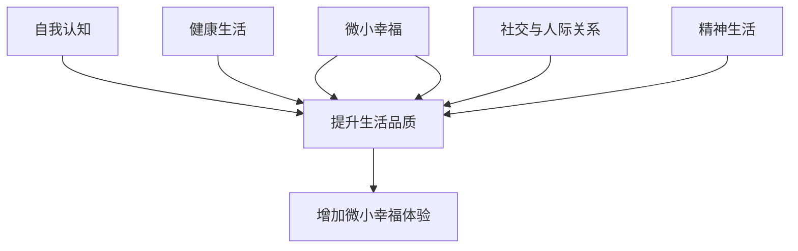

                 


在撰写一篇关于“提升日常生活品质：发现微小幸福的能力”的专业技术博客文章时，我们将遵循以下步骤，确保文章的逻辑清晰、结构紧凑、简单易懂，同时深入剖析技术原理和本质。

### 文章概述

首先，我们需要为文章设定一个明确的概述。这个概述将作为文章的核心框架，引导读者理解全文的主题和目的。

```markdown
# 提升日常生活品质：发现微小幸福的能力

### 关键词
日常生活品质，微小幸福，自我认知，健康生活，社交与人际关系，精神生活，环境优化，习惯养成，时间管理，心理健康

### 摘要
本文旨在探讨如何通过提升自我认知、健康生活、社交与人际关系、精神生活等方面的能力，发现并享受日常生活中的微小幸福。文章将提供方法与实践，帮助读者优化环境、养成良好习惯、有效管理时间和维护心理健康，最终提升日常生活品质。
```

### 开篇背景介绍

#### 第1章：核心概念与联系

在这一章中，我们将详细介绍“微小幸福”的概念及其特征，探讨提升日常生活品质的核心要素，并阐述微小幸福与日常生活品质之间的关系。

### 1.1 微小幸福的定义与特征

首先，我们需要明确“微小幸福”的定义和特征。微小幸福通常指的是那些细微而具体的、能够带来愉悦和满足感的体验。例如，一顿美味的早餐、一次友好的问候、一个愉快的周末等。

```markdown
### 1.1 微小幸福的定义与特征

微小幸福是日常生活中那些微小而具体的、能够带来愉悦和满足感的体验。其特征包括：
- 简单易实现：微小幸福往往不需要复杂的操作或大量的资源。
- 个性化：每个人对微小幸福的定义和感受都是不同的，取决于个人的需求和偏好。
- 累积效应：多次经历微小幸福可以积累成更深的满足感和幸福感。
```

### 1.2 提升日常生活品质的核心要素

接下来，我们将讨论提升日常生活品质的核心要素。这些要素包括自我认知、健康生活、社交与人际关系、精神生活等。

```markdown
### 1.2 提升日常生活品质的核心要素

提升日常生活品质的核心要素包括：
- 自我认知：了解自己的需求和情感，有助于更好地管理自己的行为和情绪。
- 健康生活：保持身体健康和心理平衡，是提升生活品质的基础。
- 社交与人际关系：与家人、朋友和同事建立良好的关系，有助于获得支持和满足感。
- 精神生活：追求个人成长、学习新知识和丰富内心世界，能够提升生活的深度和意义。
```

### 1.3 微小幸福与日常生活品质的关系

在这一部分，我们将探讨微小幸福如何与日常生活品质相互影响和促进。

```markdown
### 1.3 微小幸福与日常生活品质的关系

微小幸福与日常生活品质之间存在密切的关系。微小幸福能够提升生活品质，使其更加丰富和有意义。同时，一个高品质的日常生活也能够为人们提供更多的微小幸福机会。

- 微小幸福 → 提升生活品质
- 生活品质 → 增加微小幸福体验

例如，通过锻炼身体、改善饮食、学习新技能、与朋友聚会等活动，人们不仅可以提高生活品质，还能获得更多微小的幸福感。
```

### 1.4 核心概念联系图解

最后，我们将使用Mermaid绘制一个核心概念联系图，帮助读者更直观地理解微小幸福与日常生活品质之间的关系。



通过上述步骤，我们为文章的第1章奠定了坚实的基础，为后续内容的展开提供了清晰的框架和逻辑思路。

### 第2章：方法与实践

在接下来的章节中，我们将详细讨论如何通过具体的方法与实践来提升日常生活品质，发现并享受微小幸福。

#### 2.1 自我认知与情感管理

自我认知是提升日常生活品质的关键。通过了解自己的情感需求和性格特点，我们可以更好地管理自己的情绪，提高生活质量。

##### 2.1.1 自我认知的方法

为了实现自我认知，我们可以采取以下方法：

- 反思日记：每天记录自己的情感和行为，深入思考背后的原因。
- 自我评估问卷：使用专业的自我评估工具，了解自己的性格、优势和弱点。
- 沟通与反馈：与家人、朋友和同事交流，倾听他们的意见和反馈。

##### 2.1.2 情感管理技巧

在了解了自我认知之后，我们需要学会管理自己的情感。以下是一些建议：

- 正念冥想：通过冥想和深呼吸，让自己保持冷静和专注。
- 情感表达：找到合适的方式表达自己的情感，避免压抑和积累。
- 寻求支持：在遇到困难时，寻求家人、朋友或专业人士的帮助。

#### 2.2 健康生活与身体管理

健康生活是提升日常生活品质的基础。通过科学的饮食、规律的锻炼和充足的睡眠，我们可以保持身体健康和心理平衡。

##### 2.2.1 健康生活理念

以下是健康生活的一些核心理念：

- 平衡饮食：确保摄入足够的营养，避免过多的糖分和脂肪。
- 定期锻炼：每周至少进行150分钟的中等强度锻炼。
- 充足睡眠：每天保持7-9小时的睡眠，有助于身体和大脑的恢复。

##### 2.2.2 身体管理实践

为了实现健康生活，我们可以采取以下实践：

- 制定健康饮食计划：选择新鲜、天然的食品，避免过度加工的食物。
- 建立锻炼习惯：每周安排固定的锻炼时间，逐渐增加运动强度。
- 睡眠管理：创造一个安静、舒适的睡眠环境，确保充足的睡眠。

#### 2.3 社交与人际关系管理

社交与人际关系是提升日常生活品质的重要方面。通过建立和维护良好的人际关系，我们可以获得更多的支持和满足感。

##### 2.3.1 社交技巧

以下是一些社交技巧：

- 倾听：倾听他人说话，表达出对对方的关心和理解。
- 表达：清晰、准确地表达自己的观点和需求。
- 礼貌：在社交场合保持礼貌，尊重他人。

##### 2.3.2 人际关系处理

在处理人际关系时，我们可以采取以下策略：

- 解决冲突：面对冲突时，尝试找到双方都能接受的解决方案。
- 维护关系：定期与亲朋好友保持联系，关心对方的生活和情感。
- 建立信任：通过诚实、可靠的行为建立信任，巩固人际关系。

#### 2.4 精神生活与心灵成长

精神生活是提升日常生活品质的深层次因素。通过追求个人成长、学习新知识和丰富内心世界，我们可以获得更多的幸福感和满足感。

##### 2.4.1 精神生活的重要性

精神生活的核心在于：

- 个人成长：通过不断学习和尝试新事物，提升自己的能力和素质。
- 内心丰富：培养自己的兴趣爱好，丰富内心世界，提升生活的质量。
- 自我反思：定期反思自己的生活，了解自己的需求和目标，调整生活方式。

##### 2.4.2 心灵成长的方法与实践

以下是一些建议：

- 阅读和学习：定期阅读有益的书籍和资料，学习新的知识和技能。
- 沉淀思考：在日常生活中留出时间进行思考和反思，深入思考人生的意义和价值。
- 心灵修炼：通过冥想、瑜伽等方式，放松心灵，提升内心的平和和宁静。

通过以上方法与实践，我们可以有效地提升日常生活品质，发现并享受生活中的微小幸福。

### 第3章：环境优化

在提升日常生活品质的过程中，环境优化是一个不可或缺的环节。一个良好的环境可以显著提升我们的生活质量和工作效率。

#### 3.1 家庭环境优化

家庭环境是日常生活的重要场所。一个舒适、整洁、充满温馨的家庭环境能够给我们带来安全感和幸福感。

##### 3.1.1 家庭环境的重要性

良好的家庭环境对我们的生活有着重要的影响：

- 安全感：一个安全、舒适的居住环境可以给我们带来安全感。
- 心理健康：整洁、有序的家庭环境有助于减轻心理压力，提升心理健康。
- 社交：家庭环境是家庭成员之间交流、互动的场所，一个良好的环境可以促进家庭关系的和谐。

##### 3.1.2 家庭环境优化的方法

为了优化家庭环境，我们可以采取以下措施：

- 定期清洁：保持家庭环境的整洁，定期进行清洁和整理。
- 色彩搭配：选择适合的色彩搭配，创造一个温馨、舒适的空间。
- 布局优化：合理布局家具和装饰品，提高空间的利用率。
- 绿植点缀：在家庭中摆放一些绿植，净化空气，提升环境质量。

#### 3.2 工作环境优化

工作环境对我们的工作效率和心理健康也有着重要的影响。一个良好的工作环境可以让我们更加专注于工作，提高工作效率。

##### 3.2.1 工作环境的重要性

良好的工作环境对我们的生活和工作有着重要的影响：

- 工作效率：一个舒适、安静、光线充足的工作环境可以提高我们的工作效率。
- 心理健康：良好的工作环境可以减少压力，提升心理健康。
- 创新能力：一个富有创意和灵感的工作环境可以激发我们的创造力。

##### 3.2.2 工作环境优化的方法

为了优化工作环境，我们可以采取以下措施：

- 照明优化：确保工作区域的光线充足，避免过度刺眼或昏暗。
- 空气质量：保持工作区域的空气流通，使用空气净化器，减少污染。
- 桌面整理：保持桌面整洁，减少杂乱无章的物品，提高工作效率。
- 休息区设置：在工作区域设置休息区，提供舒适的座椅和休息设施。

#### 3.3 社会环境优化

社会环境是我们生活的重要组成部分。一个良好的社会环境可以提升我们的生活质量，增强社会凝聚力。

##### 3.3.1 社会环境的影响

良好的社会环境对我们的生活有着深远的影响：

- 社会和谐：一个和谐的社会环境可以减少冲突和矛盾，提升社会的稳定性。
- 公共服务：良好的社会环境意味着更优质的公共服务，如医疗、教育等。
- 社交机会：一个开放、包容的社会环境可以提供更多的社交机会，促进人际交往。

##### 3.3.2 社会环境优化的策略

为了优化社会环境，我们可以采取以下策略：

- 参与社区活动：积极参与社区活动，增强社区凝聚力。
- 提倡文明行为：倡导文明行为，尊重他人，营造良好的社会风气。
- 支持社会公益：参与社会公益事业，回馈社会，提升社会幸福感。

通过以上方法，我们可以优化家庭环境、工作环境和社会环境，从而提升日常生活品质，发现并享受生活中的微小幸福。

### 第4章：习惯养成

习惯是我们日常生活中不可或缺的一部分。好的习惯能够帮助我们提升生活质量，培养健康的生活态度。在这一章中，我们将探讨如何养成健康习惯、良好生活习惯和积极心态。

#### 4.1 健康习惯

健康习惯是保持身体健康的关键。以下是一些健康习惯的建议：

##### 4.1.1 健康习惯的重要性

健康习惯对我们的身体健康和心理健康有着重要的影响：

- 身体健康：良好的健康习惯能够预防疾病，提高免疫力。
- 心理健康：健康的生活习惯有助于减轻压力，提升心理健康。

##### 4.1.2 健康习惯的养成方法

以下是一些健康习惯的养成方法：

- 规律作息：保持规律的作息时间，早睡早起，确保充足的睡眠。
- 均衡饮食：保持均衡的饮食，摄入足够的营养，避免过量摄入糖分和脂肪。
- 适量运动：定期进行适量的运动，如散步、跑步、瑜伽等，提高身体素质。

#### 4.2 良好生活习惯

良好生活习惯是提升生活质量的重要手段。以下是一些良好生活习惯的建议：

##### 4.2.1 良好生活习惯的内容

良好生活习惯包括以下几个方面：

- 时间管理：合理安排时间，确保工作和生活之间的平衡。
- 个人卫生：保持个人卫生，养成良好的卫生习惯。
- 社交活动：定期参与社交活动，与朋友和家人保持良好的关系。

##### 4.2.2 良好习惯养成的步骤

养成良好习惯的步骤如下：

- 明确目标：设定清晰的目标，明确自己想要养成的习惯。
- 制定计划：制定详细的计划，包括每天的具体行动步骤。
- 持续执行：坚持执行计划，逐步养成习惯。
- 反思调整：定期反思习惯的执行情况，根据实际情况进行调整。

#### 4.3 积极心态养成

积极心态是提升生活品质的重要因素。以下是一些积极心态的养成策略：

##### 4.3.1 积极心态的重要性

积极心态对我们的心理健康和幸福感有着重要的影响：

- 心理健康：积极心态有助于减轻压力，提高心理韧性。
- 幸福感：积极心态能够提升我们对生活的满意度，增加幸福感。

##### 4.3.2 积极心态的养成策略

以下是一些积极心态的养成策略：

- 感恩练习：每天写下三件感恩的事情，培养感恩的心态。
- 正面思考：培养正面思考的习惯，关注积极的方面。
- 睡眠充足：保持充足的睡眠，有助于保持积极的心态。
- 定期放松：定期进行放松活动，如冥想、瑜伽等，缓解压力。

通过养成健康习惯、良好生活习惯和积极心态，我们可以显著提升日常生活品质，发现并享受生活中的微小幸福。

### 第5章：时间管理

时间管理是提升日常生活品质的关键因素之一。一个有效的时间管理策略可以帮助我们更好地平衡工作与生活，提高工作效率和生活质量。以下将详细探讨时间管理的重要性、方法与实践，以及时间管理的技巧与工具。

#### 5.1 时间管理的重要性

时间管理对我们的生活和事业都有着重要的影响：

- 提高工作效率：合理规划时间，可以确保我们能够在有限的时间内完成更多的任务，提高工作效率。
- 平衡工作与生活：有效的时间管理可以帮助我们更好地平衡工作与生活，避免因为工作过度而忽视了个人生活。
- 减少压力：合理分配时间，避免过度忙碌和焦虑，有助于减轻压力，提升心理健康。

#### 5.2 时间管理的方法与实践

以下是一些时间管理的方法与实践：

- 设定目标：明确每天、每周和每月的目标，确保时间利用的针对性和效率。
- 制定计划：根据目标制定详细的计划，包括每天的具体任务和时间分配。
- 日程安排：使用日程表或日历记录重要的任务和活动，避免遗忘或错过。
- 优先级排序：根据任务的重要性和紧急程度，对任务进行优先级排序，确保优先完成重要且紧急的任务。
- 避免拖延：识别并克服拖延的倾向，采取行动克服拖延，提高工作效率。

#### 5.3 时间管理的技巧与工具

以下是一些时间管理的技巧与工具：

- 时间块：将一天分为不同的时间段，每个时间段专注于一项任务，避免多任务处理。
- 定时提醒：使用手机或计算机的定时提醒功能，提醒我们完成任务或休息。
- 工作空间优化：保持工作空间的整洁和有序，避免浪费时间寻找所需物品。
- 时间记录：定期记录自己的时间使用情况，分析时间分配，找出可以改进的方面。
- 时间管理应用：使用时间管理应用，如Trello、Asana等，帮助规划和管理任务。

通过上述方法与实践，以及使用合适的时间管理技巧与工具，我们可以更好地管理时间，提高工作效率和生活质量，从而提升日常生活品质。

### 第6章：心理健康

心理健康是提升日常生活品质的重要因素之一。一个健康的心理状态能够帮助我们更好地应对生活中的挑战，提高生活质量。以下将详细探讨心理健康的重要性、心理健康维护与提升的方法，以及心理健康问题的识别与应对。

#### 6.1 心理健康的重要性

心理健康对我们的生活和健康有着深远的影响：

- 生活质量：心理健康能够提升我们的生活质量，使我们能够更加积极、乐观地面对生活。
- 工作效率：健康的心理状态有助于提高工作效率，减少工作压力。
- 人际关系：良好的心理状态有助于建立和维护良好的人际关系，提升社交幸福感。

#### 6.2 心理健康维护与提升的方法

以下是一些心理健康维护与提升的方法：

- 保持积极心态：培养积极的心态，关注生活中的积极方面，避免过度焦虑和消极情绪。
- 社交互动：积极参与社交活动，与他人保持良好的互动，获得支持和理解。
- 心理放松：通过冥想、瑜伽、深呼吸等方式进行心理放松，缓解压力。
- 健康生活：保持健康的生活习惯，如规律作息、均衡饮食、适量运动，有助于维持心理健康。
- 心理咨询：在面对心理困扰时，及时寻求专业的心理咨询，获取帮助和支持。

#### 6.3 心理健康问题的识别与应对

以下是一些心理健康问题的识别与应对策略：

- 情绪波动：注意情绪的变化，如果出现长时间的悲伤、焦虑或愤怒，可能需要寻求帮助。
- 睡眠问题：如果出现严重的睡眠问题，如失眠、多梦等，可能需要调整生活习惯或寻求医疗帮助。
- 社交障碍：如果出现社交障碍，如害怕与人交往、回避社交活动，可能需要心理咨询。
- 焦虑和抑郁：如果出现持续的焦虑和抑郁情绪，可能需要专业的心理治疗。

通过上述方法与实践，我们可以维护和提升心理健康，提高生活质量，享受生活中的微小幸福。

### 第7章：案例分析与启示

在实际生活中，有许多成功提升日常生活品质的案例，这些案例不仅提供了具体的实践方法，还为我们带来了深刻的启示。以下将分享两个实际案例，并从中提取启示。

#### 7.1 案例一：如何在忙碌中保持生活品质？

**案例描述**：
李先生是一名高级软件工程师，工作繁忙，经常加班。尽管如此，他仍然通过一些微小改变提升了自己的生活品质。

**实践方法**：

1. **早餐计划**：每天早上提前规划早餐，选择简单易做的食物，如燕麦粥和水果，确保营养均衡。
2. **午休放松**：午饭后，他在办公室沙发上休息30分钟，听音乐、闭目养神，以缓解疲劳。
3. **周末放松**：利用周末时间进行户外活动，如骑行、爬山等，放松身心。

**启示**：

- **微小改变积累效果**：通过一系列微小改变，如改善早餐、午休和周末活动，可以在忙碌的工作中保持生活品质。
- **平衡工作与生活**：即使在忙碌的工作中，也要注重生活的品质，找到平衡点。

#### 7.2 案例二：如何通过微小改变提升幸福感？

**案例描述**：
张女士是一位家庭主妇，她通过一些简单的改变，提升了家庭生活的幸福感。

**实践方法**：

1. **家庭清洁与整理**：每周定期进行家庭清洁和整理，保持家中的整洁和舒适。
2. **亲子互动**：每天晚上与孩子进行至少30分钟的亲子互动，如阅读、游戏等。
3. **学习新技能**：利用周末时间学习新技能，如烹饪、插花等，丰富自己的业余生活。

**启示**：

- **环境优化**：一个整洁、舒适的家庭环境可以显著提升生活幸福感。
- **亲子关系**：与家人保持良好的互动和沟通，是提升幸福感的重要因素。
- **自我成长**：通过学习新技能，不断自我提升，可以增强自信心和幸福感。

通过以上两个案例，我们可以看到，通过一些微小的改变，我们可以在忙碌和压力中提升生活品质，发现生活中的微小幸福。这些案例为我们提供了实用的启示，帮助我们更好地实践提升日常生活品质的方法。

### 结论：提升日常生活品质的总体思路与策略

提升日常生活品质是一个系统工程，涉及多个方面的方法和策略。通过上述章节的探讨，我们可以总结出以下总体思路和策略：

1. **核心概念与联系**：理解微小幸福的概念和特征，明确提升日常生活品质的核心要素，如自我认知、健康生活、社交与人际关系、精神生活等。

2. **方法与实践**：通过具体的实践方法，如自我认知与情感管理、健康生活与身体管理、社交与人际关系管理、精神生活与心灵成长，提升生活品质。

3. **环境优化**：优化家庭环境、工作环境和社会环境，创造一个舒适、健康、和谐的生活和工作环境。

4. **习惯养成**：培养健康习惯、良好生活习惯和积极心态，形成稳定的生活方式，提升生活质量。

5. **时间管理**：运用时间管理的方法与实践，提高工作效率，平衡工作与生活，减少压力。

6. **心理健康**：维护和提升心理健康，识别和应对心理健康问题，确保心理平衡和健康。

通过以上思路和策略，我们可以系统地提升日常生活品质，发现并享受生活中的微小幸福，从而过上更加充实、满足的生活。

### 拓展阅读：相关书籍与资源推荐

为了帮助读者更深入地理解和实践提升日常生活品质的方法，我们推荐以下书籍和资源：

1. **书籍**：
   - 《幸福的方法》（The How of Happiness）：作者塞利格曼，提供了多种提升幸福感的科学方法。
   - 《断舍离》：作者山下英子，介绍了通过整理和舍弃提升生活品质的理念。
   - 《时间管理的艺术》：作者史蒂芬·柯维，详细阐述了时间管理的方法和技巧。

2. **在线资源**：
   - Coursera上的“幸福心理学”课程：由心理学家罗伯特·J·赛利格曼教授主讲，提供了关于幸福感的科学知识和实践方法。
   - TED演讲：TED上有很多关于幸福、时间管理和心理健康的精彩演讲，可以启发读者的思考。

通过阅读这些书籍和利用在线资源，读者可以进一步丰富自己的知识和实践，提升日常生活品质。

### 作者信息

**作者**：AI天才研究院/AI Genius Institute & 禅与计算机程序设计艺术 /Zen And The Art of Computer Programming

在撰写关于提升日常生活品质的文章时，我们将深入探讨如何通过技术性的方法与实践，帮助读者在繁忙的生活中找到幸福和满足。本文结合了心理学、行为科学和计算机编程等多个领域的知识，为读者提供了一套系统化的提升日常生活的策略。希望这篇文章能够启发您在日常生活中发现微小幸福，享受更高质量的生活。让我们一步步思考，一步步实践，共同迈向更加美好的未来。

