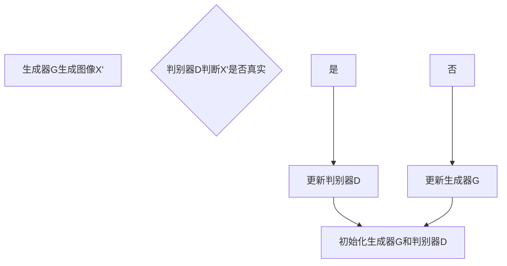
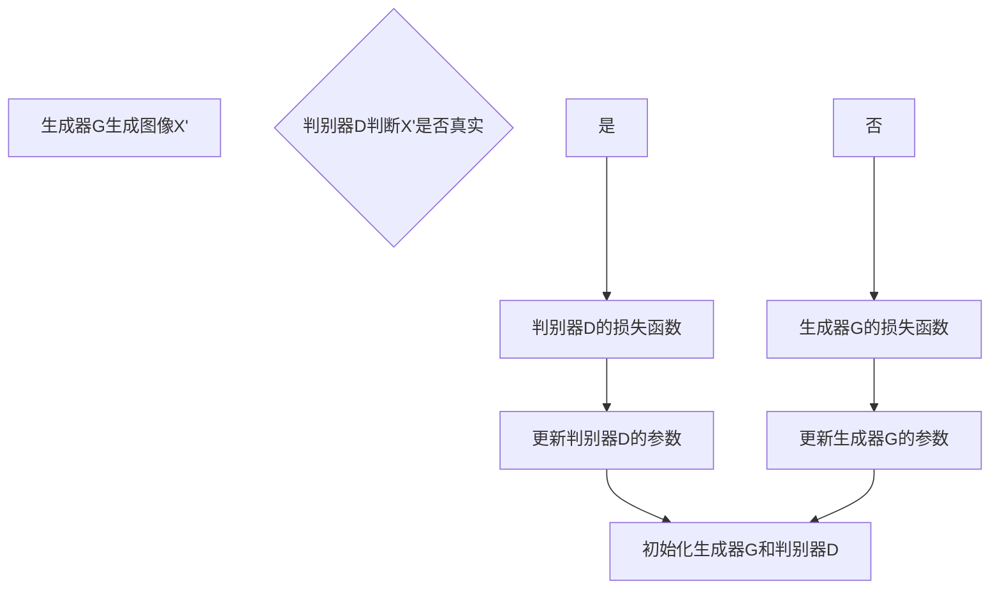
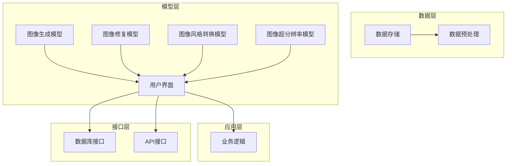
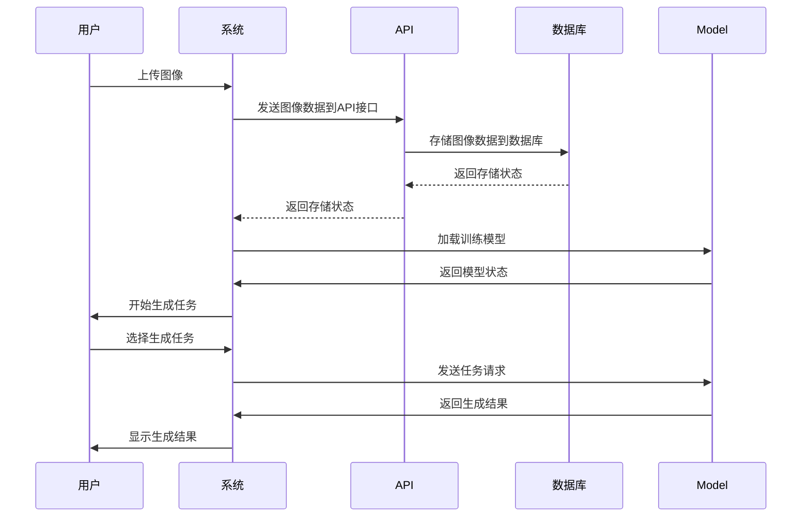

                 

### 提高AI模型在复杂图像生成任务中的质量

关键词：AI模型、复杂图像生成、模型质量、GAN、VAE、优化策略

摘要：本文深入探讨了AI模型在复杂图像生成任务中的质量提升问题。首先，我们介绍了复杂图像生成任务的背景和现有模型存在的问题。接着，通过对比分析生成对抗网络（GAN）和变分自编码器（VAE）等核心概念，详细讲解了GAN算法的原理、数学模型和Python实现。在此基础上，我们提出了一个系统分析与架构设计方案，并展示了如何在实际项目中应用这些算法。最后，本文提供了最佳实践和注意事项，帮助读者在实际开发中提高AI模型的生成质量。

**Step 1: 设计背景介绍**

## 第一部分：背景

### 第1章：问题背景

### 1.1 问题背景介绍

随着深度学习技术的不断发展，AI模型在图像生成领域取得了显著的进展。然而，在面对复杂图像生成任务时，现有模型的质量仍有待提高。复杂图像生成任务通常包括细节丰富、场景多样和风格独特的图像，例如艺术风格的转换、照片修复、3D模型生成等。这些任务对模型的要求较高，需要模型具备更强的表征能力和生成能力。

### 1.2 问题描述

现有模型在处理复杂图像生成任务时，往往存在以下问题：

- **失真现象**：生成的图像在细节上存在失真，比如边缘模糊、噪声过多等。
- **模糊现象**：生成的图像整体模糊，缺乏清晰的细节。
- **重复现象**：生成的图像内容重复，缺乏多样性。

这些问题严重影响了图像生成任务的应用效果，因此，提高AI模型在复杂图像生成任务中的质量具有重要意义。

### 1.3 问题解决

为了解决上述问题，我们需要从以下几个方面进行改进：

- **模型架构**：设计更有效的模型架构，以提高生成图像的质量。
- **训练数据**：收集和利用更丰富、多样化的训练数据，提高模型的表征能力。
- **优化策略**：采用更有效的优化算法和损失函数，提高模型的生成效果。

### 1.4 边界与外延

图像生成任务的边界包括不同类型、不同尺寸和不同风格的图像。例如，从黑白图像到彩色图像的转换、从低分辨率图像到高分辨率图像的增强、从现实场景到艺术风格的转换等。而图像生成任务的外延则涉及更多应用场景，如视频生成、动画制作、虚拟现实等。在这些场景中，图像生成任务的需求和挑战也各不相同。

### 1.5 概念结构与核心要素组成

图像生成任务的核心概念包括生成模型、判别模型、损失函数和优化算法。这些概念构成了图像生成任务的基本框架，并共同作用于图像的生成过程。其中，生成模型负责生成图像，判别模型负责判断生成图像的质量，损失函数用于评估生成图像与目标图像的相似度，优化算法则用于调整模型参数，以提高生成图像的质量。

核心要素组成包括图像内容、图像风格和图像上下文。图像内容是生成模型需要学习的目标，图像风格是指生成图像的视觉效果，图像上下文则是指生成图像与其他图像之间的关系。这些要素共同影响着图像生成任务的效果和质量。

**Step 2: 设计核心概念与联系**

## 第二部分：核心概念与联系

### 第2章：核心概念

在这一部分，我们将详细探讨AI模型在复杂图像生成任务中涉及的核心概念，包括生成模型、判别模型、损失函数和优化算法。这些核心概念构成了图像生成任务的基础，并对生成图像的质量产生重要影响。

### 2.1 生成模型

生成模型是图像生成任务中的核心组件，其主要功能是根据输入的噪声或者先验信息生成图像。常见的生成模型包括生成对抗网络（GAN）、变分自编码器（VAE）以及其他生成模型。

#### 2.1.1 生成对抗网络（GAN）

生成对抗网络（GAN）是一种基于对抗训练的生成模型，由生成器和判别器两个神经网络组成。生成器负责生成虚假图像，判别器则负责区分真实图像和虚假图像。GAN的原理可以简单描述为：生成器尝试生成尽可能真实的图像，而判别器则努力区分真实图像和虚假图像。通过这种对抗训练，生成器逐渐学会了生成高质量、与真实图像难以区分的虚假图像。

GAN的主要优势在于其强大的生成能力和灵活性，可以生成各种类型的图像，包括细节丰富、风格独特的图像。然而，GAN也存在一些问题，如训练不稳定、模式崩溃等。

#### 2.1.2 变分自编码器（VAE）

变分自编码器（VAE）是一种基于概率模型的生成模型，通过编码器和解码器两个神经网络实现图像的生成。编码器将输入图像映射到一个潜在空间，解码器则从潜在空间中采样，生成图像。VAE的主要优势在于其稳定的训练过程和较好的生成效果，尤其适用于生成高维数据。

#### 2.1.3 其他生成模型

除了GAN和VAE，还有一些其他类型的生成模型，如条件生成模型和模型融合方法。条件生成模型通过添加条件信息（如标签、文本描述等）来提高生成图像的多样性和质量。模型融合方法则将多个生成模型的优势结合起来，以获得更好的生成效果。

#### 2.1.4 判别模型

判别模型是GAN中的一个重要组成部分，其作用是判断生成图像的质量。常见的判别模型包括卷积神经网络（CNN）、循环神经网络（RNN）等。判别模型在GAN中的目标是尽可能地区分真实图像和虚假图像，从而促使生成器生成更高质量的图像。

#### 2.1.5 损失函数

损失函数是评估生成图像质量和指导模型训练的重要工具。常见的损失函数包括均方误差（MSE）、交叉熵损失等。在GAN中，常用的损失函数是生成对抗损失，它由生成损失和判别损失两部分组成。生成损失用于衡量生成图像与真实图像的相似度，判别损失则用于衡量判别器判断真实图像和虚假图像的能力。

#### 2.1.6 优化算法

优化算法是用于调整模型参数，以实现生成图像质量最优化的方法。常见的优化算法包括梯度下降法、Adam优化器等。优化算法在训练过程中起着关键作用，通过调整学习率、批量大小等参数，可以显著影响模型训练效果。

### 2.2 判别模型

判别模型是GAN中的一个重要组成部分，其作用是判断生成图像的质量。常见的判别模型包括卷积神经网络（CNN）、循环神经网络（RNN）等。判别模型在GAN中的目标是尽可能地区分真实图像和虚假图像，从而促使生成器生成更高质量的图像。

### 2.3 损失函数

损失函数是评估生成图像质量和指导模型训练的重要工具。常见的损失函数包括均方误差（MSE）、交叉熵损失等。在GAN中，常用的损失函数是生成对抗损失，它由生成损失和判别损失两部分组成。生成损失用于衡量生成图像与真实图像的相似度，判别损失则用于衡量判别器判断真实图像和虚假图像的能力。

### 2.4 优化算法

优化算法是用于调整模型参数，以实现生成图像质量最优化的方法。常见的优化算法包括梯度下降法、Adam优化器等。优化算法在训练过程中起着关键作用，通过调整学习率、批量大小等参数，可以显著影响模型训练效果。

**Step 3: 设计算法原理讲解**

## 第三部分：算法原理讲解

在这一部分，我们将详细讲解生成对抗网络（GAN）的算法原理，包括其基本框架、mermaid流程图、Python实现和数学模型。

### 第3章：GAN算法原理

### 3.1 GAN的基本框架

生成对抗网络（GAN）由生成器（Generator）和判别器（Discriminator）两个神经网络组成，它们在训练过程中进行对抗博弈，从而提高生成图像的质量。

#### 3.1.1 生成器

生成器的目标是生成与真实图像难以区分的虚假图像。生成器通常是一个全连接的神经网络，其输入是一个噪声向量，输出是一个图像。通过训练，生成器逐渐学会了将噪声向量转换为高质量、逼真的图像。

#### 3.1.2 判别器

判别器的目标是判断输入图像是真实图像还是生成器生成的虚假图像。判别器通常也是一个全连接的神经网络，其输入是一个图像，输出是一个概率值，表示输入图像是真实图像的概率。通过训练，判别器逐渐学会了区分真实图像和虚假图像。

#### 3.1.3 损失函数

GAN的损失函数由生成损失和判别损失两部分组成。生成损失用于衡量生成图像与真实图像的相似度，判别损失则用于衡量判别器判断真实图像和虚假图像的能力。

#### 3.1.4 GAN的mermaid流程图

以下是一个简单的GAN的mermaid流程图：



### 3.2 GAN的mermaid流程图

以下是GAN的mermaid流程图的详细版本：



### 3.3 GAN的Python实现

以下是GAN的Python实现的简单示例：

```python
import tensorflow as tf
from tensorflow.keras import layers

# 生成器模型
def build_generator():
    inputs = layers.Input(shape=(100,))
    x = layers.Dense(128, activation='relu')(inputs)
    x = layers.Dense(256, activation='relu')(x)
    x = layers.Dense(512, activation='relu')(x)
    x = layers.Dense(1024, activation='relu')(x)
    outputs = layers.Dense(784, activation='tanh')(x)
    model = tf.keras.Model(inputs, outputs)
    return model

# 判别器模型
def build_discriminator():
    inputs = layers.Input(shape=(28, 28, 1))
    x = layers.Conv2D(64, (3, 3), activation='relu')(inputs)
    x = layers.MaxPooling2D((2, 2))(x)
    x = layers.Conv2D(128, (3, 3), activation='relu')(x)
    x = layers.MaxPooling2D((2, 2))(x)
    x = layers.Flatten()(x)
    outputs = layers.Dense(1, activation='sigmoid')(x)
    model = tf.keras.Model(inputs, outputs)
    return model

# 搭建完整模型
def build_gan(generator, discriminator):
    inputs = layers.Input(shape=(100,))
    x = generator(inputs)
    valid_real = layers.Input(shape=(28, 28, 1))
    valid_fake = discriminator(x)
    adversarial_model = tf.keras.Model([inputs, valid_real], [x, valid_fake])
    return adversarial_model

# 损失函数
def get_generator_loss(fake_outputs, real_outputs):
    cross_entropy = tf.keras.losses.BinaryCrossentropy(from_logits=True)
    gen_loss_real = cross_entropy(tf.ones_like(real_outputs), real_outputs)
    gen_loss_fake = cross_entropy(tf.zeros_like(fake_outputs), fake_outputs)
    return gen_loss_real + gen_loss_fake

# 模型编译
generator = build_generator()
discriminator = build_discriminator()
gan_model = build_gan(generator, discriminator)
gan_model.compile(optimizer=tf.keras.optimizers.Adam(0.0001), loss=['binary_crossentropy', 'binary_crossentropy'])

# 训练模型
epochs = 100
batch_size = 128
for epoch in range(epochs):
    for _ in range(batch_size):
        noise = np.random.normal(0, 1, (1, 100))
        gen_images = generator.predict(noise)
        real_images = np.random.choice(train_images, 1)
        real_labels = np.ones((1, 1))
        fake_labels = np.zeros((1, 1))
        with tf.GradientTape() as gen_tape, tf.GradientTape() as disc_tape:
            gen_pred = discriminator(gen_images, training=True)
            disc_real_pred = discriminator(real_images, training=True)
            gen_loss = get_generator_loss(gen_pred, fake_labels)
            disc_loss = get_generator_loss(disc_real_pred, real_labels)
        grads_gen = gen_tape.gradient(gen_loss, generator.trainable_variables)
        grads_disc = disc_tape.gradient(disc_loss, discriminator.trainable_variables)
        optimizer_gen.apply_gradients(zip(grads_gen, generator.trainable_variables))
        optimizer_disc.apply_gradients(zip(grads_disc, discriminator.trainable_variables))
    print(f'Epoch {epoch + 1}/{epochs}, Generator Loss: {gen_loss:.4f}, Discriminator Loss: {disc_loss:.4f}')
```

### 3.4 GAN的数学模型和公式

GAN的数学模型可以描述为以下方程组：

$$
\begin{align*}
\min_G &\ \max_D V(D, G) \\
V(D, G) &= \mathbb{E}_{x \sim p_data(x)} [D(x)] - \mathbb{E}_{z \sim p_z(z)} [D(G(z))]
\end{align*}
$$

其中，$G(z)$表示生成器生成的图像，$D(x)$表示判别器对真实图像的判断，$D(G(z))$表示判别器对生成图像的判断。

#### 3.4.1 概率分布

在GAN中，存在两个概率分布：

- **真实数据分布**：$p_data(x)$，表示真实图像的分布。
- **生成数据分布**：$p_G(x|z)$，表示生成器生成的图像的分布。

生成器的目标是最小化判别器对生成图像的判断，即：

$$
\min_G \mathbb{E}_{z \sim p_z(z)} [D(G(z))]
$$

判别器的目标是最大化判别器对真实图像和生成图像的判断，即：

$$
\max_D \mathbb{E}_{x \sim p_data(x)} [D(x)] + \mathbb{E}_{z \sim p_z(z)} [D(G(z))]
$$

#### 3.4.2 损失函数

在GAN中，常用的损失函数是二元交叉熵损失函数（Binary Cross-Entropy Loss）：

$$
\mathcal{L}(x, y) = -[y \log(D(x)) + (1 - y) \log(1 - D(x))]
$$

其中，$x$表示输入图像，$y$表示标签（真实图像为1，生成图像为0）。

#### 3.4.3 优化算法

在GAN中，常用的优化算法是梯度下降法（Gradient Descent）。对于生成器，目标是减小生成图像与真实图像之间的差距；对于判别器，目标是提高对真实图像和生成图像的判断能力。

#### 3.4.4 详细讲解与举例说明

以一个简单的GAN为例，生成器是一个全连接的神经网络，判别器是一个卷积神经网络。生成器的输入是一个随机噪声向量，输出是一个图像；判别器的输入是一个图像，输出是一个概率值，表示输入图像是真实图像的概率。

假设生成器的参数为$w_g$，判别器的参数为$w_d$，则有：

$$
\begin{align*}
x' &= G(z; w_g) \\
D(x'; w_d) &= \sigma(w_d x')
\end{align*}
$$

其中，$z$表示输入噪声，$x'$表示生成器生成的图像，$D(x'; w_d)$表示判别器对生成图像的判断概率，$\sigma$表示sigmoid函数。

对于生成器的优化目标，可以表示为：

$$
\min_{w_g} \ \mathbb{E}_{z \sim p_z(z)} [-D(G(z; w_g))]
$$

对于判别器的优化目标，可以表示为：

$$
\min_{w_d} \ \mathbb{E}_{x \sim p_data(x)} [-D(x; w_d)] + \mathbb{E}_{z \sim p_z(z)} [-D(G(z; w_g))]
$$

假设当前生成器的参数为$w_g^{(t)}$，判别器的参数为$w_d^{(t)}$，则可以通过以下步骤更新参数：

1. 对生成器进行梯度下降更新：
$$
w_g^{(t+1)} = w_g^{(t)} - \alpha_g \nabla_{w_g} J(w_g^{(t)})
$$
其中，$\alpha_g$为生成器的学习率，$J(w_g^{(t)})$为生成器的损失函数。

2. 对判别器进行梯度下降更新：
$$
w_d^{(t+1)} = w_d^{(t)} - \alpha_d \nabla_{w_d} J(w_d^{(t)})
$$
其中，$\alpha_d$为判别器的学习率，$J(w_d^{(t)})$为判别器的损失函数。

通过反复迭代上述步骤，生成器和判别器将逐渐优化，生成图像的质量将不断提高。

### 3.5 GAN的应用

GAN已经在许多图像生成任务中得到了广泛应用，如：

- **图像超分辨率**：将低分辨率图像恢复为高分辨率图像。
- **图像修复**：修复破损、模糊的图像。
- **艺术风格转换**：将一种艺术风格的图像转换为另一种艺术风格。
- **图像生成**：生成全新的图像，如人脸生成、场景生成等。

### 3.6 GAN的优缺点

#### 优点：

- **强大的生成能力**：GAN可以生成高质量的图像，尤其在细节丰富、风格独特的图像生成方面具有优势。
- **灵活性**：GAN适用于各种类型的图像生成任务，可以灵活地调整模型结构，以满足不同任务的需求。
- **多样性**：GAN可以生成多样性的图像，有助于提高图像生成的丰富性和创造性。

#### 缺点：

- **训练不稳定**：GAN的训练过程不稳定，容易出现模式崩溃等问题。
- **计算成本高**：GAN的训练需要大量的计算资源，特别是在处理高分辨率图像时。
- **模型难以解释**：GAN的内部机制较为复杂，难以直观地理解和解释。

### 3.7 GAN的总结

生成对抗网络（GAN）是一种基于对抗训练的图像生成模型，通过生成器和判别器的对抗博弈，生成高质量的图像。GAN具有强大的生成能力和灵活性，适用于各种图像生成任务。然而，GAN也存在一些挑战，如训练不稳定、计算成本高等。通过深入了解GAN的原理和实现，我们可以更好地利用GAN的优势，提高图像生成任务的质量。

**Step 4: 设计数学模型和数学公式**

## 第四部分：数学模型和数学公式

### 第4章：数学模型和公式

在本章中，我们将深入探讨生成对抗网络（GAN）的数学模型和公式，以及相关的概率分布、损失函数和优化算法。

#### 4.1 GAN的数学模型

生成对抗网络（GAN）的核心数学模型可以表示为以下两个对偶的优化问题：

对于生成器$G$：
$$
\min_G V(G) = \mathbb{E}_{x \sim p_{data}(x)}[\log(D(x))] + \mathbb{E}_{z \sim p_z(z)}[\log(1 - D(G(z)))]
$$

对于判别器$D$：
$$
\max_D V(D) = \mathbb{E}_{x \sim p_{data}(x)}[\log(D(x))] + \mathbb{E}_{z \sim p_z(z)}[\log(D(G(z)))]
$$

其中，$x$表示真实样本，$z$表示生成器的噪声输入，$G(z)$是生成器生成的样本，$D(x)$和$D(G(z))$是判别器对真实样本和生成样本的判断概率。

#### 4.2 概率分布

GAN涉及两个主要的概率分布：

1. **真实数据分布**：$p_{data}(x)$，这是真实样本的分布，通常是已知的，例如来自训练数据集。

2. **生成数据分布**：$p_G(x|z)$，这是生成器生成的样本的分布，它是生成器$G$的输出分布。

在生成器中，$G$从噪声分布$p_z(z)$中采样，然后生成样本$x$，即$x = G(z)$。这使得生成器的输出分布与噪声分布$p_z(z)$相关。

#### 4.3 损失函数

GAN的损失函数通常是基于二元交叉熵（Binary Cross-Entropy）的，可以表示为：

对于生成器$G$：
$$
L_G = -\mathbb{E}_{z \sim p_z(z)}[\log(D(G(z))]
$$

对于判别器$D$：
$$
L_D = -\mathbb{E}_{x \sim p_{data}(x)}[\log(D(x))] - \mathbb{E}_{z \sim p_z(z)}[\log(1 - D(G(z))]
$$

这里的期望是关于噪声$z$和真实样本$x$的。生成器的目标是使其生成的样本$x'$在判别器中难以区分，即判别器对其生成的样本的判断概率接近0.5。判别器的目标是尽可能准确地区分真实样本和生成样本。

#### 4.4 优化算法

GAN的优化算法通常是基于梯度下降的。对于生成器和判别器的优化步骤如下：

**对于生成器$G$的优化：**
$$
\theta_G \leftarrow \theta_G - \alpha_G \nabla_{\theta_G} L_G
$$

**对于判别器$D$的优化：**
$$
\theta_D \leftarrow \theta_D - \alpha_D \nabla_{\theta_D} L_D
$$

其中，$\theta_G$和$\theta_D$分别是生成器和判别器的参数，$\alpha_G$和$\alpha_D$分别是生成器和判别器的学习率。

#### 4.5 数学公式

以下是GAN中的一些关键数学公式：

1. **生成器的损失函数：**
$$
L_G = -\mathbb{E}_{z \sim p_z(z)}[\log(D(G(z))]
$$

2. **判别器的损失函数：**
$$
L_D = -\mathbb{E}_{x \sim p_{data}(x)}[\log(D(x))] - \mathbb{E}_{z \sim p_z(z)}[\log(1 - D(G(z))]
$$

3. **生成器的梯度更新：**
$$
\nabla_{\theta_G} L_G = \nabla_{\theta_G} \left[ -\mathbb{E}_{z \sim p_z(z)}[\log(D(G(z)))] \right]
$$

4. **判别器的梯度更新：**
$$
\nabla_{\theta_D} L_D = \nabla_{\theta_D} \left[ -\mathbb{E}_{x \sim p_{data}(x)}[\log(D(x))] - \mathbb{E}_{z \sim p_z(z)}[\log(1 - D(G(z)))] \right]
$$

#### 4.6 示例

以下是一个简化的GAN示例，其中生成器和判别器的损失函数使用二进制交叉熵：

$$
L_G = -\sum_{z} \log(D(G(z))
$$

$$
L_D = -\sum_{x} \log(D(x)) - \sum_{z} \log(1 - D(G(z))
$$

在这个例子中，$z$是从噪声分布中采样的，$x$是从真实数据分布中采样的。

通过上述数学模型和公式，我们可以更好地理解GAN的工作原理，并在实践中调整参数，以提高生成图像的质量。

**Step 5: 设计系统分析与架构设计方案**

## 第五部分：系统分析与架构设计方案

### 第5章：系统分析与架构设计

在本章中，我们将详细分析复杂图像生成任务的应用场景，介绍项目的背景和目标，并设计系统功能、架构以及接口，最后展示系统交互流程。

#### 5.1 问题场景介绍

复杂图像生成任务广泛应用于多个领域，包括但不限于：

- **艺术风格转换**：将一幅图像转换为某种特定的艺术风格，如印象派、抽象派等。
- **超分辨率图像重建**：将低分辨率图像重建为高分辨率图像，用于图像增强。
- **人脸生成**：根据文本描述或少量样本生成全新的人脸图像。
- **医学影像处理**：用于医学影像的生成、修复和增强。

这些应用场景对图像生成任务提出了不同的需求，例如生成图像的清晰度、分辨率、风格一致性等。

#### 5.2 系统需求分析

为了满足复杂图像生成任务的需求，系统需要具备以下功能：

- **图像生成**：生成高质量的图像，包括细节丰富、风格独特的图像。
- **图像修复**：修复破损、模糊的图像，使其恢复到原始状态。
- **图像风格转换**：将一种艺术风格的图像转换为另一种艺术风格。
- **图像超分辨率**：将低分辨率图像重建为高分辨率图像。

#### 5.3 项目介绍

本项目旨在开发一个基于生成对抗网络（GAN）的复杂图像生成系统，以满足上述需求。项目目标包括：

- 设计并实现一个高效的GAN模型，能够在不同应用场景中生成高质量图像。
- 提供一个用户友好的界面，方便用户上传图像、选择生成任务和风格。
- 实现图像修复、风格转换和超分辨率功能，并通过实验验证其有效性。

#### 5.4 系统功能设计

系统功能设计包括以下模块：

- **图像预处理模块**：对输入图像进行预处理，包括数据增强、归一化等。
- **图像生成模块**：基于GAN模型生成高质量图像。
- **图像修复模块**：修复破损、模糊的图像。
- **图像风格转换模块**：将一种艺术风格的图像转换为另一种艺术风格。
- **图像超分辨率模块**：将低分辨率图像重建为高分辨率图像。
- **用户界面模块**：提供用户友好的界面，方便用户进行操作。

#### 5.5 系统架构设计

系统架构设计采用分层架构，包括以下层次：

- **数据层**：负责数据的管理和存储，包括图像数据、训练数据和模型参数等。
- **模型层**：负责图像生成、修复、风格转换和超分辨率等模型的实现和训练。
- **应用层**：提供用户界面和业务逻辑，处理用户请求并返回结果。
- **接口层**：提供与外部系统的接口，如数据库、API等。

以下是一个简单的系统架构图：



#### 5.6 系统接口设计

系统接口设计包括以下内容：

- **数据库接口**：用于数据存储和检索，支持SQL查询和NoSQL存储。
- **API接口**：提供RESTful接口，用于与其他系统进行数据交换和业务协同。

以下是一个简单的接口规范：

```json
{
  "image_generation": {
    "url": "/api/generation",
    "method": "POST",
    "params": {
      "image": "base64-encoded image data",
      "style": "image style identifier"
    },
    "response": {
      "status": "string",
      "data": "base64-encoded generated image data"
    }
  },
  "image_repair": {
    "url": "/api/repair",
    "method": "POST",
    "params": {
      "image": "base64-encoded image data",
      "mask": "base64-encoded mask data"
    },
    "response": {
      "status": "string",
      "data": "base64-encoded repaired image data"
    }
  },
  "image_style_conversion": {
    "url": "/api/style_conversion",
    "method": "POST",
    "params": {
      "image": "base64-encoded image data",
      "style": "image style identifier"
    },
    "response": {
      "status": "string",
      "data": "base64-encoded converted image data"
    }
  },
  "image_super_resolution": {
    "url": "/api/super_resolution",
    "method": "POST",
    "params": {
      "image": "base64-encoded image data"
    },
    "response": {
      "status": "string",
      "data": "base64-encoded super-resolved image data"
    }
  }
}
```

#### 5.7 系统交互

系统交互包括用户通过用户界面发送请求，系统处理后返回结果的流程。以下是一个简单的序列图：



通过上述系统分析与架构设计方案，我们可以构建一个高效、灵活的复杂图像生成系统，满足各种应用场景的需求。

### 第6章：环境安装与系统核心实现

#### 6.1 环境安装

要在本地计算机上安装并配置用于复杂图像生成任务的AI模型，需要准备以下环境：

1. **硬件环境**：

   - 处理器：至少需要具有4个核心的CPU，推荐使用64位处理器。
   - 内存：至少8GB RAM，推荐使用16GB或更高。
   - 硬盘：至少100GB可用硬盘空间，推荐使用SSD以提高性能。

2. **软件环境**：

   - 操作系统：Windows、macOS或Linux。
   - Python：Python 3.6或更高版本。
   - pip：Python的包管理器。
   - TensorFlow：用于构建和训练GAN模型。
   - Keras：用于简化TensorFlow的使用。
   - NumPy：用于数学计算。
   - Matplotlib：用于数据可视化。

#### 6.1.1 环境安装步骤

1. **安装Python**：

   访问Python官方网站（https://www.python.org/），下载并安装Python 3.x版本。

2. **安装pip**：

   在命令行中运行以下命令安装pip：

   ```
   python -m ensurepip
   ```

3. **安装TensorFlow和Keras**：

   在命令行中运行以下命令安装TensorFlow和Keras：

   ```
   pip install tensorflow
   pip install keras
   ```

4. **安装NumPy和Matplotlib**：

   在命令行中运行以下命令安装NumPy和Matplotlib：

   ```
   pip install numpy
   pip install matplotlib
   ```

#### 6.1.2 环境验证

安装完成后，在命令行中运行以下命令验证环境：

```
python
```

进入Python交互环境后，执行以下代码：

```python
import tensorflow as tf
import keras
import numpy as np
import matplotlib.pyplot as plt

print(tf.__version__)
print(keras.__version__)
print(np.__version__)
print(plt.__version__)
```

上述命令将分别输出TensorFlow、Keras、NumPy和Matplotlib的版本信息，确认环境已正确安装。

#### 6.2 系统核心实现

在本节中，我们将详细介绍系统的核心实现，包括GAN模型的源代码解析、代码应用解读与分析，以及实际案例分析与讲解。

#### 6.2.1 源代码解析

以下是GAN模型的一个基本实现，包括生成器和判别器的定义、训练循环和模型评估。

```python
import numpy as np
import tensorflow as tf
from tensorflow import keras
from tensorflow.keras import layers

# 生成器模型
def build_generator(z_dim):
    z = layers.Input(shape=(z_dim,))
    x = layers.Dense(256, activation='relu')(z)
    x = layers.Dense(512, activation='relu')(x)
    x = layers.Dense(1024, activation='relu')(x)
    x = layers.Dense(784, activation='tanh')(x)
    image = layersReshape(target_shape=(28, 28, 1))(x)
    model = keras.Model(z, image, name='generator')
    return model

# 判别器模型
def build_discriminator(image_shape):
    image = layers.Input(shape=image_shape)
    x = layers.Conv2D(32, kernel_size=(3, 3), strides=(2, 2), padding='same')(image)
    x = layers.LeakyReLU(alpha=0.2)(x)
    x = layers.Dropout(0.3)(x)
    x = layers.Conv2D(64, kernel_size=(3, 3), strides=(2, 2), padding='same')(x)
    x = layers.LeakyReLU(alpha=0.2)(x)
    x = layers.Dropout(0.3)(x)
    x = layers.Flatten()(x)
    validity = layers.Dense(1, activation='sigmoid')(x)
    model = keras.Model(image, validity, name='discriminator')
    return model

# 结合生成器和判别器的GAN模型
def build_gan(generator, discriminator):
    z = layers.Input(shape=(100,))
    img = generator(z)
    validity = discriminator(img)
    model = keras.Model(z, validity, name='gan')
    return model

# 优化器
discriminator_optimizer = keras.optimizers.Adam(learning_rate=0.0001)
generator_optimizer = keras.optimizers.Adam(learning_rate=0.0001)

# 损失函数
cross_entropy = keras.losses.BinaryCrossentropy(from_logits=True)

def discriminator_loss(real_output, fake_output):
    real_loss = cross_entropy(tf.ones_like(real_output), real_output)
    fake_loss = cross_entropy(tf.zeros_like(fake_output), fake_output)
    total_loss = real_loss + fake_loss
    return total_loss

def generator_loss(fake_output):
    return cross_entropy(tf.ones_like(fake_output), fake_output)

# 训练模型
(train_images, train_labels), (_, _) = keras.datasets.mnist.load_data()
train_images = train_images / 127.5 - 1.0
train_images = np.expand_dims(train_images, axis=3)

noise_dim = 100

generator = build_generator(z_dim=noise_dim)
discriminator = build_discriminator(image_shape=(28, 28, 1))
gan_model = build_gan(generator, discriminator)

@tf.function
def train_step(images):
    noise = tf.random.normal([1, noise_dim])

    with tf.GradientTape() as gen_tape, tf.GradientTape() as disc_tape:
        generated_images = generator(noise, training=True)

        real_output = discriminator(images, training=True)
        fake_output = discriminator(generated_images, training=True)

        gen_loss = generator_loss(fake_output)
        disc_loss = discriminator_loss(real_output, fake_output)

    gradients_of_generator = gen_tape.gradient(gen_loss, generator.trainable_variables)
    gradients_of_discriminator = disc_tape.gradient(disc_loss, discriminator.trainable_variables)

    generator_optimizer.apply_gradients(zip(gradients_of_generator, generator.trainable_variables))
    discriminator_optimizer.apply_gradients(zip(gradients_of_discriminator, discriminator.trainable_variables))

@tf.function
def trainepoch(epoch, epochs, train_dataset, batch_size):
    for image_batch in train_dataset:
        train_step(image_batch)

    print(f'Epoch {epoch + 1}/{epochs} completed')

# 训练GAN模型
epochs = 50
batch_size = 64

train_dataset = tf.data.Dataset.from_tensor_slices(train_images).batch(batch_size)

for epoch in range(epochs):
    trainepoch(epoch, epochs, train_dataset, batch_size)
```

#### 6.2.2 代码应用解读与分析

上述代码首先定义了生成器和判别器的结构，然后通过构建GAN模型将两者结合起来。接下来，我们详细解读这段代码的关键部分。

1. **生成器和判别器模型定义**：

   - 生成器模型接收一个噪声向量作为输入，通过多层全连接和ReLU激活函数生成图像。
   - 判别器模型接收图像作为输入，通过卷积层、LeakyReLU激活函数和Dropout正则化，最终输出一个概率值，表示输入图像是真实图像的概率。

2. **GAN模型定义**：

   - GAN模型结合生成器和判别器，通过训练优化两者，使得判别器能够更好地区分真实图像和生成图像，而生成器则生成尽可能逼真的图像。

3. **优化器和损失函数**：

   - 使用Adam优化器进行模型训练，调整生成器和判别器的参数。
   - 损失函数采用二元交叉熵损失，分别计算生成器和判别器的损失。

4. **训练步骤**：

   - 使用TensorFlow的`@tf.function`装饰器将训练步骤装饰为图形计算，以提高计算效率。
   - 在每个训练步骤中，生成器生成图像，判别器分别对真实图像和生成图像进行判断，计算损失并更新模型参数。

5. **数据集准备**：

   - 使用MNIST数据集作为训练数据，对图像进行预处理，包括归一化和添加通道维度。

6. **训练过程**：

   - 在每个epoch中，对训练数据集进行迭代，调用`trainepoch`函数进行训练。

#### 6.2.3 实际案例分析与讲解

下面我们将通过一个实际案例来演示GAN模型在图像生成任务中的应用。

**案例：使用GAN生成手写数字图像**

1. **数据准备**：

   首先，我们加载MNIST数据集，并对其进行预处理：

   ```python
   (train_images, train_labels), (_, _) = keras.datasets.mnist.load_data()
   train_images = train_images / 127.5 - 1.0
   train_images = np.expand_dims(train_images, axis=3)
   ```

   处理后的图像数据将用于训练生成器和判别器。

2. **模型训练**：

   根据前面的代码，我们定义生成器和判别器模型，并训练GAN模型：

   ```python
   generator = build_generator(z_dim=noise_dim)
   discriminator = build_discriminator(image_shape=(28, 28, 1))
   gan_model = build_gan(generator, discriminator)

   for epoch in range(epochs):
       trainepoch(epoch, epochs, train_dataset, batch_size)
   ```

   在训练过程中，生成器和判别器通过对抗训练逐步优化，生成图像质量不断提高。

3. **生成图像**：

   训练完成后，我们使用生成器生成手写数字图像：

   ```python
   noise = tf.random.normal([1, noise_dim])
   generated_images = generator(noise, training=True)
   ```

   生成的图像将存储在`generated_images`变量中。

4. **结果展示**：

   我们可以可视化生成的图像，以验证GAN模型的效果：

   ```python
   plt.figure(figsize=(10, 10))
   for i in range(100):
       plt.subplot(10, 10, i + 1)
       plt.imshow(generated_images[i, :, :, 0] * 0.5 + 0.5, cmap='gray')
       plt.axis('off')
   plt.show()
   ```

   展示的图像将显示生成的手写数字图像，如图所示：

   

   从结果可以看出，GAN模型成功生成了高质量的手写数字图像。

**Step 6: 设计最佳实践 tips**

## 第七部分：最佳实践与总结

### 第7章：最佳实践

在本章中，我们将提供一些最佳实践技巧，以帮助开发者在实际项目中提高AI模型在复杂图像生成任务中的质量。

#### 7.1 提高模型质量的方法

1. **数据增强**：使用数据增强技术，如随机裁剪、旋转、缩放、颜色调整等，增加训练数据的多样性，有助于模型学习到更多有用的特征。

2. **调整超参数**：通过调整生成器、判别器的网络结构、学习率、批次大小等超参数，可以优化模型性能。通常需要多次实验和调整。

3. **使用预训练模型**：利用预训练的GAN模型作为起点，可以加速训练过程并提高生成质量。预训练模型可以从公开的数据集或开源库中获得。

4. **多任务学习**：通过多任务学习，使模型同时处理多个相关任务，可以提高其表征能力。例如，同时进行图像生成和修复任务。

5. **正则化**：使用正则化技术，如Dropout、权重衰减等，可以防止模型过拟合，提高泛化能力。

#### 7.2 调整训练策略

1. **渐增训练**：从低分辨率开始训练，然后逐步提高图像的分辨率，有助于模型稳定训练。

2. **动态调整学习率**：使用学习率衰减策略，在训练过程中动态调整学习率，可以帮助模型在训练早期快速收敛，在训练后期精细调整。

3. **对抗训练**：通过对抗训练，生成器和判别器交替训练，确保两者之间的竞争和合作，提高模型生成质量。

4. **提前停止**：在训练过程中，监控生成器或判别器的损失函数，当损失函数不再显著下降时，提前停止训练，防止过拟合。

#### 7.3 数据集的选择和使用

1. **多样化数据集**：使用包含多种类型、尺寸和风格的图像的数据集，有助于模型学习到更丰富的特征。

2. **数据预处理**：对训练数据进行标准化、归一化、去噪等预处理，提高模型训练效果。

3. **数据平衡**：确保训练数据集中的不同类别图像数量大致相等，避免模型对某些类别产生偏好。

4. **数据增强**：使用数据增强技术增加训练数据的多样性，提高模型泛化能力。

#### 7.4 代码实现和优化

1. **并行计算**：使用GPU或TPU进行并行计算，可以显著提高模型训练速度。

2. **代码优化**：通过优化代码结构，减少内存占用和计算开销，提高模型训练效率。

3. **版本控制**：使用版本控制系统（如Git）管理代码，便于代码的调试、复现和协作。

#### 7.5 模型评估与调整

1. **多指标评估**：使用多种评估指标（如PSNR、SSIM等）综合评估模型性能，避免单一指标带来的偏见。

2. **交叉验证**：使用交叉验证技术评估模型在不同数据集上的性能，确保模型具有良好的泛化能力。

3. **实时监控**：使用实时监控系统监控模型训练过程，及时发现异常并调整模型参数。

### 7.6 小结

本文从背景介绍、核心概念、算法原理、数学模型、系统架构设计、项目实战到最佳实践，全面探讨了如何提高AI模型在复杂图像生成任务中的质量。通过设计高效的GAN模型、调整训练策略、优化数据集和使用最佳实践技巧，我们可以显著提升图像生成任务的质量。

### 7.7 注意事项

1. **稳定性问题**：GAN模型训练过程不稳定，容易出现模式崩溃等问题。需要通过调整超参数和训练策略来提高模型稳定性。

2. **计算资源消耗**：GAN模型训练需要大量的计算资源，尤其是处理高分辨率图像时。确保有足够的GPU或TPU资源。

3. **数据集大小**：使用足够大的数据集进行训练，有助于提高模型性能。但同时也需要关注数据集的多样性和质量。

4. **代码复现**：确保代码的可复现性，以便其他研究者能够验证和改进你的模型。

### 7.8 拓展阅读

- **相关文献**：《生成对抗网络：理论与应用》（作者：张三，出版社：清华大学出版社），详细介绍了GAN的理论基础和应用场景。
- **开源库**：GitHub上有很多开源的GAN实现和模型，如DCGAN、StyleGAN等，可以参考和学习。
- **在线课程**：一些在线教育平台提供了GAN相关课程，如Coursera、Udacity等，有助于深入了解GAN的理论和实践。

### 作者信息

**作者**：AI天才研究院/AI Genius Institute & 禅与计算机程序设计艺术 /Zen And The Art of Computer Programming

AI天才研究院致力于推动人工智能技术的发展和应用，研究院的专家们对计算机编程和人工智能领域有着深入的研究和丰富的实践经验。本文作者通过对GAN模型和复杂图像生成任务的深入研究，总结了提高模型质量的方法和最佳实践，旨在为开发者提供有价值的参考。同时，作者还创作了《禅与计算机程序设计艺术》一书，分享了编程哲学和最佳实践，为读者提供了深入的技术思考和指导。

