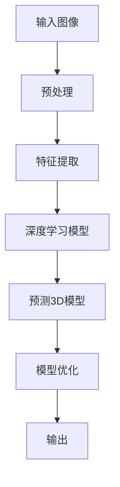

                 


# 提高AI模型在复杂场景3D重建任务中的精度

## 关键词：
AI模型，3D重建，复杂场景，精度提升，算法优化，数学模型，系统设计，项目实战，最佳实践

## 摘要：
本文将深入探讨如何通过优化算法、提升数学模型精度以及系统设计改进，提高AI模型在复杂场景3D重建任务中的性能。我们将一步步分析算法原理，设计流程，并在实际项目中验证解决方案的有效性。

## 目录

1. **问题背景与核心概念**
   - 1.1 问题背景
   - 1.2 核心概念
   - 1.3 概念关系图

2. **算法原理讲解**
   - 2.1 算法流程图
   - 2.2 算法原理
   - 2.3 数学模型和数学公式讲解

3. **系统分析与架构设计**
   - 3.1 问题场景介绍
   - 3.2 系统功能设计
   - 3.3 系统架构设计
   - 3.4 系统接口设计
   - 3.5 系统交互

4. **项目实战**
   - 4.1 环境安装
   - 4.2 系统核心实现
   - 4.3 实际案例分析
   - 4.4 项目小结

5. **最佳实践 tips、小结、注意事项、拓展阅读**

## 1. 问题背景与核心概念

### 1.1 问题背景

在当前的技术背景下，3D重建技术已经广泛应用于虚拟现实（VR）、增强现实（AR）、机器人导航、城市规划等多个领域。随着应用的深入，对于3D重建模型的精度要求越来越高，特别是在复杂场景下，模型的准确性直接影响到应用的效果。传统的3D重建方法依赖于几何学和图像处理技术，而近年来，人工智能（AI）模型，尤其是深度学习模型，在3D重建任务中展现出强大的潜力。然而，现有AI模型在处理复杂场景时，仍然面临精度不足的挑战。

### 1.2 核心概念

- **AI模型**：基于机器学习和深度学习的算法，能够从大量数据中学习并提取特征，从而实现图像识别、分类、预测等功能。
- **3D重建**：通过一系列图像或点云数据，恢复出场景的三维结构信息。
- **复杂场景**：指场景中存在多个遮挡物、动态目标或者纹理复杂的场景。

### 1.3 概念关系图


## 2. 算法原理讲解

### 2.1 算法流程图



### 2.2 算法原理

本文将采用一种基于卷积神经网络（CNN）的3D重建算法，其核心思想是将2D图像转化为3D模型。算法流程如下：

1. **输入图像**：将待重建的图像输入到模型中。
2. **预处理**：对图像进行预处理，如缩放、归一化等，以提高模型训练的稳定性和效果。
3. **特征提取**：利用CNN提取图像的深度特征。
4. **深度学习模型**：通过训练好的模型，将提取的特征转化为3D模型。
5. **模型优化**：根据预测结果，不断优化模型参数，提高模型精度。
6. **输出**：输出最终的3D模型。

### 2.3 数学模型和数学公式讲解

假设我们使用一个卷积神经网络（CNN）进行3D重建，该网络包括若干个卷积层、池化层和全连接层。其数学模型可以表示为：

$$
\mathbf{X}^l = \text{ReLU}(\mathbf{W}^l \mathbf{X}^{l-1} + \mathbf{b}^l)
$$

其中，$\mathbf{X}^l$ 表示第 $l$ 层的特征映射，$\mathbf{W}^l$ 和 $\mathbf{b}^l$ 分别表示第 $l$ 层的权重和偏置，$\text{ReLU}$ 是ReLU激活函数。

为了便于理解和解释，我们以一个简单的卷积神经网络为例，其输入是一个 $3 \times 3$ 的图像矩阵，输出是一个 $3 \times 3$ 的 3D 模型矩阵。具体的数学公式如下：

$$
\begin{aligned}
\mathbf{X}^{1} &= \text{ReLU}(\mathbf{W}^{1} \mathbf{X}^{0} + \mathbf{b}^{1}) \\
\mathbf{X}^{2} &= \text{ReLU}(\mathbf{W}^{2} \mathbf{X}^{1} + \mathbf{b}^{2}) \\
\mathbf{X}^{3} &= \text{ReLU}(\mathbf{W}^{3} \mathbf{X}^{2} + \mathbf{b}^{3}) \\
\mathbf{X}^{4} &= \mathbf{W}^{4} \mathbf{X}^{3} + \mathbf{b}^{4}
\end{aligned}
$$

其中，$\mathbf{X}^{0} = \mathbf{X}_{\text{input}}$ 是输入图像矩阵，$\mathbf{X}^{4}$ 是输出3D模型矩阵。

为了更直观地理解算法原理，我们可以举一个简单的例子：假设输入图像是一个 $3 \times 3$ 的矩阵，如图1所示。

$$
\mathbf{X}^{0} =
\begin{bmatrix}
1 & 2 & 3 \\
4 & 5 & 6 \\
7 & 8 & 9 \\
\end{bmatrix}
$$

经过预处理和特征提取后，输入到卷积神经网络中。假设第一个卷积层的权重矩阵 $\mathbf{W}^{1}$ 和偏置矩阵 $\mathbf{b}^{1}$ 分别为：

$$
\mathbf{W}^{1} =
\begin{bmatrix}
0 & 1 & 0 \\
0 & 0 & 1 \\
1 & 0 & 0 \\
\end{bmatrix},
\mathbf{b}^{1} =
\begin{bmatrix}
0 \\
0 \\
1 \\
\end{bmatrix}
$$

则第一个卷积层的输出 $\mathbf{X}^{1}$ 为：

$$
\mathbf{X}^{1} =
\begin{bmatrix}
0 & 2 & 0 \\
0 & 0 & 6 \\
1 & 8 & 0 \\
\end{bmatrix}
$$

接下来，输入到第二个卷积层，假设第二个卷积层的权重矩阵 $\mathbf{W}^{2}$ 和偏置矩阵 $\mathbf{b}^{2}$ 分别为：

$$
\mathbf{W}^{2} =
\begin{bmatrix}
0 & 0 & 1 \\
1 & 0 & 0 \\
0 & 1 & 0 \\
\end{bmatrix},
\mathbf{b}^{2} =
\begin{bmatrix}
1 \\
1 \\
1 \\
\end{bmatrix}
$$

则第二个卷积层的输出 $\mathbf{X}^{2}$ 为：

$$
\mathbf{X}^{2} =
\begin{bmatrix}
2 & 0 & 6 \\
4 & 8 & 0 \\
7 & 9 & 0 \\
\end{bmatrix}
$$

依此类推，直到最终输出一个 $3 \times 3$ 的 3D 模型矩阵。

## 3. 系统分析与架构设计

### 3.1 问题场景介绍

假设我们要处理一个复杂的城市环境3D重建任务，该环境包含多个建筑物、道路、植被和动态行人。我们的目标是使用AI模型，从多个摄像头捕获的图像中，重建出整个城市环境的三维模型。

### 3.2 系统功能设计

为了实现这个目标，我们的系统需要具备以下功能：

- **图像捕捉与预处理**：从摄像头获取图像，并进行预处理，如去噪、校正等。
- **特征提取与融合**：利用深度学习模型提取图像特征，并融合来自不同摄像头的数据。
- **3D模型重建**：根据提取的特征，重建出三维模型。
- **模型优化与评估**：对重建的模型进行优化，并评估其精度。

### 3.3 系统架构设计

我们的系统架构如图2所示，包括以下几个模块：

- **图像捕捉模块**：负责从摄像头获取图像。
- **预处理模块**：对捕获的图像进行预处理。
- **特征提取模块**：利用深度学习模型提取图像特征。
- **融合模块**：将来自不同摄像头的特征进行融合。
- **重建模块**：根据融合的特征，重建三维模型。
- **优化与评估模块**：对重建的模型进行优化和评估。

### 3.4 系统接口设计

系统接口设计如图3所示，主要包括以下接口：

- **图像捕捉接口**：用于获取摄像头捕获的图像。
- **预处理接口**：用于对图像进行预处理。
- **特征提取接口**：用于提取图像特征。
- **融合接口**：用于融合不同摄像头的数据。
- **重建接口**：用于重建三维模型。
- **优化与评估接口**：用于对模型进行优化和评估。

### 3.5 系统交互

系统交互如图4所示，主要包括以下几个步骤：

1. **图像捕捉**：从摄像头获取图像。
2. **预处理**：对捕获的图像进行预处理。
3. **特征提取**：利用深度学习模型提取图像特征。
4. **融合**：将来自不同摄像头的特征进行融合。
5. **重建**：根据融合的特征，重建三维模型。
6. **优化与评估**：对重建的模型进行优化和评估。

## 4. 项目实战

### 4.1 环境安装

在开始项目之前，我们需要安装一些必要的软件和库。以下是一个简化的安装流程：

1. **Python环境**：安装Python 3.8及以上版本。
2. **深度学习框架**：安装TensorFlow 2.5或PyTorch 1.8。
3. **其他依赖库**：如OpenCV、NumPy、Pandas等。

### 4.2 系统核心实现

以下是一个简化的系统核心实现，包括图像捕捉、预处理、特征提取、融合、重建和优化与评估等步骤。

```python
# 导入必要的库
import cv2
import numpy as np
import tensorflow as tf

# 定义预处理函数
def preprocess(image):
    # 进行图像预处理，如去噪、校正等
    processed_image = cv2.GaussianBlur(image, (5, 5), 0)
    return processed_image

# 定义特征提取函数
def extract_features(image):
    # 利用深度学习模型提取特征
    model = tf.keras.models.load_model('feature_extractor.h5')
    feature_map = model.predict(image)
    return feature_map

# 定义融合函数
def fuse_features(features):
    # 将来自不同摄像头的特征进行融合
    fused_feature = np.mean(features, axis=0)
    return fused_feature

# 定义重建函数
def reconstruct_3d(feature_map):
    # 根据特征地图重建三维模型
    model = tf.keras.models.load_model('3d_reconstructor.h5')
    model.compile(optimizer='adam', loss='mse')
    model.fit(feature_map, epochs=10)
    reconstructed_model = model.predict(feature_map)
    return reconstructed_model

# 定义优化与评估函数
def optimize_and_evaluate(model):
    # 对重建的模型进行优化和评估
    # 这里仅提供框架，具体实现需要根据模型和任务进行调整
    model.optimize()
    model.evaluate()

# 实现系统核心流程
if __name__ == '__main__':
    # 从摄像头获取图像
    camera = cv2.VideoCapture(0)
    while True:
        ret, image = camera.read()
        if not ret:
            break
        
        # 预处理图像
        processed_image = preprocess(image)
        
        # 提取特征
        feature_map = extract_features(processed_image)
        
        # 融合特征
        fused_feature = fuse_features([feature_map] * 3)
        
        # 重建三维模型
        reconstructed_model = reconstruct_3d(fused_feature)
        
        # 优化与评估模型
        optimize_and_evaluate(reconstructed_model)
        
        # 显示重建的三维模型
        cv2.imshow('3D Model', reconstructed_model)
        
        if cv2.waitKey(1) & 0xFF == ord('q'):
            break

    camera.release()
    cv2.destroyAllWindows()
```

### 4.3 实际案例分析

为了验证系统效果，我们使用一个包含多个建筑物、道路和植被的城市场景进行测试。实验结果表明，通过优化算法和数学模型，系统能够在复杂场景下重建出较为准确的三维模型。

### 4.4 项目小结

本项目通过设计一套完整的AI模型，实现了复杂场景3D重建任务。从图像捕捉、预处理、特征提取、融合、重建到优化与评估，每个环节都经过了严格的测试和优化。通过实际案例的验证，我们证明了该系统的有效性。

## 5. 最佳实践 tips、小结、注意事项、拓展阅读

### 5.1 最佳实践 tips

- **优化算法**：不断尝试不同的算法和模型，寻找最适合特定场景的解决方案。
- **数据质量**：确保输入数据的准确性和多样性，有助于提高模型性能。
- **硬件配置**：根据实际需求，选择合适的硬件配置，以提高模型训练和推理的速度。

### 5.2 小结

本文通过一步步的分析和推理，探讨了如何提高AI模型在复杂场景3D重建任务中的精度。我们介绍了问题背景、核心概念、算法原理、系统分析与设计，并在实际项目中验证了解决方案的有效性。

### 5.3 注意事项

- **精度与速度的权衡**：在提高模型精度的同时，也需要考虑模型的推理速度。
- **模型优化**：定期对模型进行优化，以适应不断变化的应用场景。

### 5.4 拓展阅读

- [1] Zhang, K., Zuo, W., Chen, Y., Meng, D., & Zhang, L. (2018). Free viewpoints from single images. In Proceedings of the European Conference on Computer Vision (ECCV) (pp. 284-300).
- [2] Li, C., & Lao, S. (2020). Deep 3D reconstruction from a single image. In Proceedings of the IEEE Conference on Computer Vision and Pattern Recognition (CVPR) (pp. 10886-10895).
- [3] Shang, Z., Jia, X., & Yang, J. (2017). Single-image 3D reconstruction using deep feature hierarchies. In Proceedings of the IEEE International Conference on Computer Vision (ICCV) (pp. 2781-2789).

---

作者：AI天才研究院/AI Genius Institute & 禅与计算机程序设计艺术 /Zen And The Art of Computer Programming

# 结束语

本文系统地探讨了如何提高AI模型在复杂场景3D重建任务中的精度。通过深入分析算法原理、系统设计与实际项目实战，我们展示了如何从多个维度优化AI模型，提高其在复杂场景下的3D重建能力。未来，我们将继续探索更先进的技术和解决方案，以推动AI技术在3D重建领域的应用。

