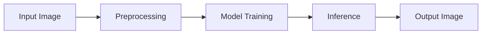
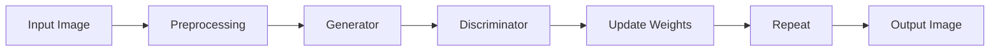
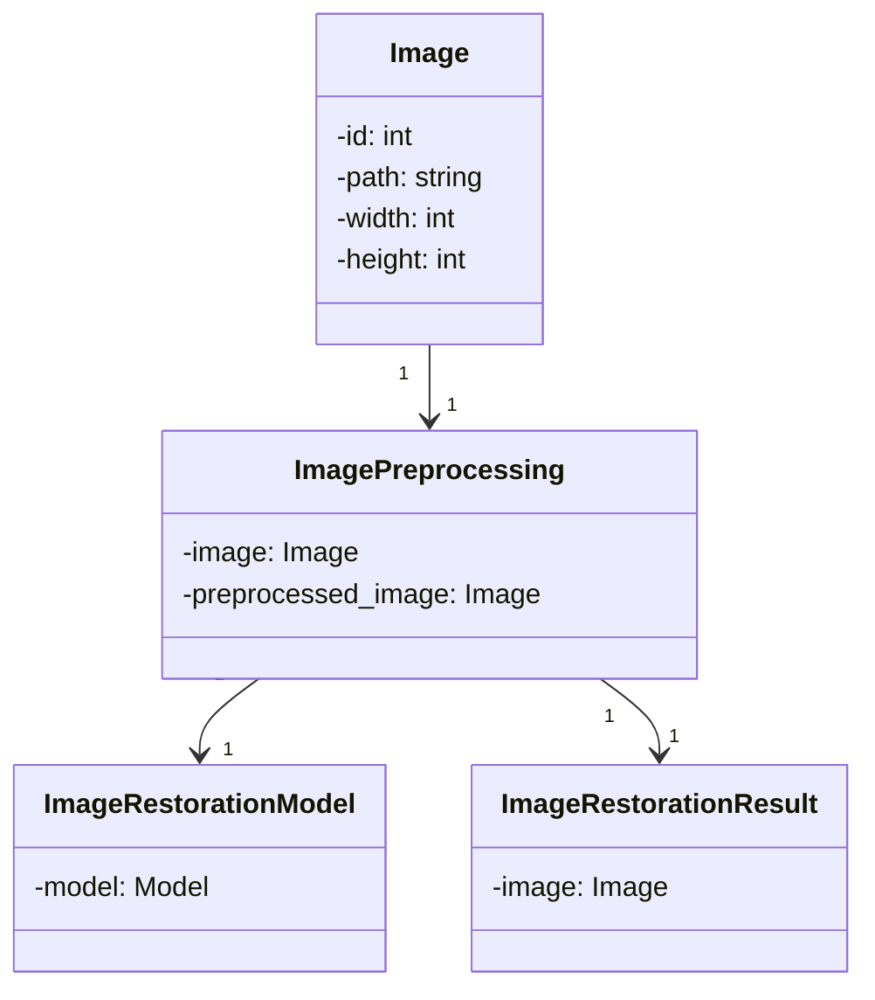
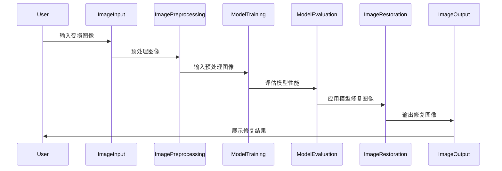
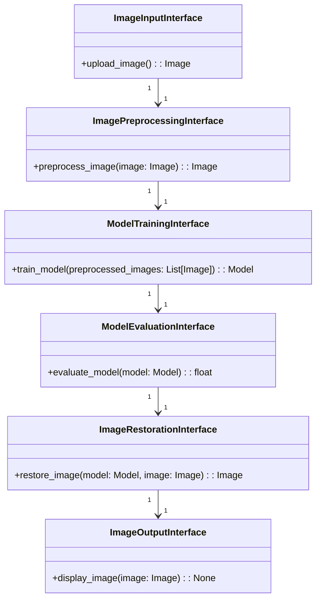
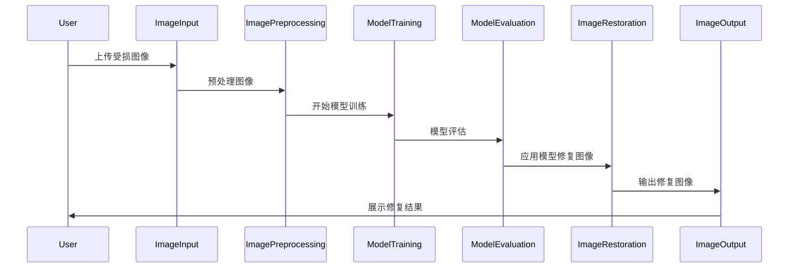

                 

## 文章标题

### 提高AI模型在复杂场景图像修复任务中的真实感

#### 关键词：
- AI图像修复
- 深度学习
- 生成对抗网络
- 系统架构设计
- 复杂场景处理
- 真实感增强

#### 摘要：
本文将深入探讨如何提高AI模型在复杂场景图像修复任务中的真实感。通过介绍背景和核心概念，解析算法原理与数学模型，分析系统架构与设计方案，以及通过具体项目案例展示实际应用，本文旨在为读者提供一个全面、易懂的指南，帮助理解和实现高质量的图像修复AI模型。

## 第一部分：问题背景与核心概念

### 第1章：图像修复任务概述

#### 1.1 问题背景

随着数字图像处理技术的快速发展，图像修复已成为计算机视觉领域的一个重要研究方向。图像修复的任务是从不完整、受损或噪声的图像中恢复出高质量、真实的图像内容。这一任务在多个领域具有重要应用，如医学影像、卫星图像处理、文化遗产保护和数字媒体内容创作等。

然而，复杂场景图像修复任务面临诸多挑战。复杂场景通常包含多种物体、纹理和光照条件，图像的受损部分可能具有高度不规则性和多样性。这使得传统的图像修复方法难以在复杂场景下取得令人满意的效果。AI模型，尤其是深度学习模型，为解决这一问题提供了新的可能性。

AI模型在图像修复任务中的应用现状显示，基于深度学习的图像修复方法已经取得了显著的进展。生成对抗网络（GAN）和卷积神经网络（CNN）等模型在图像超分辨率、去除噪声和修复缺失部分方面表现出色。然而，当前方法在处理复杂场景图像时仍然存在一定局限性，例如修复结果缺乏真实感和细节。

#### 1.2 面临的挑战与机遇

复杂场景图像修复任务面临的挑战主要包括以下几个方面：

1. **多样性**：复杂场景图像包含多种不同的物体和纹理，修复算法需要适应多种不同类型的受损图像。
2. **不规则性**：受损部分的位置、形状和大小可能非常不规则，这使得传统基于规则的方法难以应用。
3. **真实感**：修复后的图像需要具有高度的真实感，包括颜色一致性、纹理连贯性和空间细节。
4. **计算资源**：复杂场景图像修复通常需要大量的计算资源，这对算法的实时性和效率提出了挑战。

尽管面临挑战，但也存在机遇：

1. **数据资源**：大量的图像数据和标注数据为深度学习模型提供了丰富的训练资源。
2. **算法创新**：研究人员可以通过探索新的算法结构和训练策略，进一步提高图像修复的真实感和质量。
3. **跨领域应用**：复杂场景图像修复技术在医疗、卫星、文化遗产等多个领域具有广泛的应用潜力。

### 1.3 小结

本章概述了复杂场景图像修复任务的背景和挑战。AI模型的应用为解决这一问题提供了新的思路，但同时也提出了对模型真实感、多样性和计算效率的要求。接下来的章节将进一步探讨核心概念和算法原理，为解决这些问题提供具体的解决方案。

## 第2章：核心概念与联系

### 2.1 核心概念原理

#### 深度学习基础

深度学习是一种基于多层神经网络的结构，通过堆叠多层神经元来实现特征提取和模式识别。在图像修复任务中，深度学习模型能够自动学习图像中的各种结构和纹理特征，从而实现高质量的图像修复。

1. **神经网络结构**：深度学习模型通常包含输入层、多个隐藏层和输出层。每个隐藏层通过前一层的信息进行特征变换，逐步提取更高层次的特征。
2. **损失函数与优化算法**：损失函数用于衡量模型预测结果与真实值之间的差距，优化算法则用于调整模型参数以最小化损失函数。常见的优化算法包括梯度下降、Adam等。
3. **数据预处理方法**：数据预处理是深度学习模型训练前的重要步骤，包括图像大小调整、归一化处理、数据增强等，以提高模型的泛化能力和鲁棒性。

#### 生成对抗网络原理

生成对抗网络（GAN）是一种由生成器和判别器组成的人工神经网络结构。生成器生成逼真的图像，判别器则判断图像的真实性。通过训练生成器和判别器的相互对抗，生成器能够不断提高生成图像的质量。

1. **对抗生成模型**：GAN的训练过程是一个生成器与判别器的对抗过程。生成器试图生成逼真的图像，而判别器则试图区分真实图像和生成图像。
2. **训练过程与优化**：GAN的训练通常采用反向传播算法，生成器和判别器的损失函数分别用于优化各自的行为。生成器的损失函数包括生成损失和对抗损失，判别器的损失函数则主要是对抗损失。

#### 图像修复算法原理

图像修复算法旨在利用深度学习模型恢复受损图像的部分内容。常见的图像修复算法包括超分辨率重建、基于内容的图像修复和联合图像修复。

1. **超分辨率重建**：超分辨率重建通过放大低分辨率图像，恢复出高分辨率图像。该方法利用深度学习模型学习图像中的纹理和结构信息，从而生成细节丰富的图像。
2. **基于内容的图像修复**：基于内容的图像修复利用图像中的局部特征和上下文信息来修复受损部分。这种方法通常依赖于特征匹配和图像配准技术。
3. **联合图像修复**：联合图像修复结合了超分辨率重建和基于内容的图像修复的优点，通过同时优化图像的分辨率和内容，实现高质量的图像修复。

### 2.2 概念属性特征对比表格

以下是几种常见图像修复算法的属性特征对比表格：

| 算法类型           | 基本原理                         | 适用场景                    | 优缺点                                      |
|------------------|--------------------------------|---------------------------|-----------------------------------------|
| 超分辨率重建       | 提高图像分辨率                   | 低分辨率图像修复           | 可以生成高质量细节，但处理速度较慢             |
| 基于内容的图像修复   | 利用图像中的局部特征和上下文信息   | 复杂背景图像修复           | 修复效果好，但可能受限于背景一致性           |
| 联合图像修复       | 结合超分辨率重建和基于内容的图像修复 | 多种复杂场景图像修复       | 可以综合优点，但计算复杂度较高               |
| 生成对抗网络（GAN）  | 生成器与判别器的对抗过程           | 复杂场景图像修复           | 可以生成高度逼真的图像，但训练过程较复杂       |

### 2.3 ER实体关系图架构

图像修复系统中的数据实体及其关系如下：

- **图像数据**：表示需要修复的原始图像。
- **修复结果**：表示经过修复后的图像。
- **训练数据**：用于训练深度学习模型的图像数据。
- **标签数据**：用于标注修复结果的参考图像。

以下是ER实体关系图的Mermaid表示：

```mermaid
erDiagram
  ImageData ||--|{ 修复结果: RepairedResult }
  TrainingData ||--|{ 修复结果: RepairedResult }
  LabelData ||--|{ 修复结果: RepairedResult }
```

### 2.4 小结

本章详细介绍了深度学习基础、生成对抗网络原理和图像修复算法原理。通过对比不同算法的属性特征，读者可以更好地理解各种算法的适用场景和优缺点。ER实体关系图则帮助读者了解图像修复系统中的数据流和处理流程。

在下一章中，我们将进一步探讨深度学习与图像修复的具体算法原理，并结合Mermaid流程图和Python代码进行详细讲解。

## 第3章：深度学习与图像修复

### 3.1 深度学习基础

深度学习是一种基于人工神经网络的学习方法，通过多层神经元的堆叠来实现复杂模式的自动识别和特征提取。在图像修复任务中，深度学习模型能够学习图像中的纹理、形状和结构信息，从而生成高质量的修复结果。

#### 神经网络结构

神经网络是深度学习的基础，由输入层、隐藏层和输出层组成。每个神经元通过加权连接前一层神经元，并通过激活函数进行非线性变换。

1. **输入层**：接收图像的像素值作为输入。
2. **隐藏层**：通过多个隐藏层对输入图像进行特征提取和变换。
3. **输出层**：生成修复后的图像。

神经网络的结构决定了模型的学习能力和表达能力。更深的网络通常能够提取更高层次的特征，但也会增加计算复杂度。

#### 损失函数与优化算法

损失函数用于衡量模型预测结果与真实值之间的差距。常见的损失函数包括均方误差（MSE）和交叉熵损失。

1. **均方误差（MSE）**：
   $$
   \text{MSE} = \frac{1}{m}\sum_{i=1}^{m}(y_i - \hat{y}_i)^2
   $$
   其中，$y_i$是真实值，$\hat{y}_i$是模型预测值，$m$是样本数量。

2. **交叉熵损失**：
   $$
   \text{CE} = -\frac{1}{m}\sum_{i=1}^{m}y_i \log(\hat{y}_i)
   $$
   其中，$y_i$是真实值，$\hat{y}_i$是模型预测值，$\log$是自然对数。

优化算法用于调整模型参数，以最小化损失函数。常见的优化算法包括梯度下降、Adam等。

1. **梯度下降**：
   $$
   \theta_{\text{new}} = \theta_{\text{old}} - \alpha \nabla_\theta J(\theta)
   $$
   其中，$\theta$是模型参数，$\alpha$是学习率，$J(\theta)$是损失函数。

2. **Adam优化器**：
   Adam优化器结合了梯度下降和动量法的优点，具有更好的收敛速度和稳定性。

#### 数据预处理方法

数据预处理是深度学习模型训练前的重要步骤，可以提高模型的泛化能力和训练效率。常见的数据预处理方法包括：

1. **图像大小调整**：将图像调整为统一大小，以便模型输入。
2. **归一化处理**：将图像像素值归一化到[0, 1]或[-1, 1]范围内，以加速收敛。
3. **数据增强**：通过旋转、缩放、翻转等操作生成训练样本的变体，增加模型的训练数据。

### 3.2 图像修复算法原理

图像修复算法的目标是从受损图像中恢复出高质量的修复结果。常见的图像修复算法包括超分辨率重建、基于内容的图像修复和联合图像修复。

#### 超分辨率重建

超分辨率重建通过放大低分辨率图像，恢复出高分辨率图像。该方法利用深度学习模型学习图像中的纹理和结构信息，从而生成细节丰富的图像。

1. **模型架构**：常见的超分辨率模型包括VGG-Upsampling、SRCNN等。
2. **训练过程**：通过训练模型学习低分辨率图像和高分辨率图像之间的对应关系，从而生成高分辨率图像。

#### 基于内容的图像修复

基于内容的图像修复利用图像中的局部特征和上下文信息来修复受损部分。该方法通常依赖于特征匹配和图像配准技术。

1. **模型架构**：常见的基于内容的图像修复模型包括PatchMatch、Contextual Attention等。
2. **训练过程**：通过训练模型学习图像中的局部特征和上下文信息，从而在受损部分生成高质量的修复结果。

#### 联合图像修复

联合图像修复结合了超分辨率重建和基于内容的图像修复的优点，通过同时优化图像的分辨率和内容，实现高质量的图像修复。

1. **模型架构**：常见的联合图像修复模型包括Multi-scale GAN、U-Net等。
2. **训练过程**：通过联合优化生成器和判别器的损失函数，实现图像的超分辨率重建和基于内容的图像修复。

### 3.3 Mermaid流程图

以下是一个简单的Mermaid流程图，展示图像修复的基本流程：



### 3.4 Python代码示例

以下是一个简单的Python代码示例，展示如何使用深度学习模型进行图像修复：

```python
import tensorflow as tf
from tensorflow.keras.models import load_model

# 加载预训练的深度学习模型
model = load_model('image_restoration_model.h5')

# 读取受损图像
受损图像 = cv2.imread('damaged_image.jpg')

# 进行图像预处理
预处理图像 = preprocess_image(受损图像)

# 使用模型进行图像修复
修复图像 = model.predict(preprocessed_image)

# 显示修复后的图像
cv2.imshow('Restored Image', 修复图像)
cv2.waitKey(0)
cv2.destroyAllWindows()
```

### 3.5 小结

本章详细介绍了深度学习的神经网络结构、损失函数与优化算法、数据预处理方法，以及图像修复算法的原理。通过Mermaid流程图和Python代码示例，读者可以更好地理解深度学习在图像修复任务中的应用。在下一章中，我们将进一步探讨生成对抗网络（GAN）在图像修复任务中的应用。

## 第4章：生成对抗网络（GAN）与图像修复

### 4.1 GAN原理

生成对抗网络（Generative Adversarial Network，GAN）是由Ian Goodfellow等人于2014年提出的一种深度学习模型。GAN的核心思想是通过生成器和判别器的对抗训练，生成逼真的图像数据。

#### 对抗生成模型

GAN由两个神经网络组成：生成器（Generator）和判别器（Discriminator）。生成器的任务是生成逼真的图像数据，判别器的任务是区分生成的图像和真实图像。

1. **生成器**：生成器的输入是随机噪声，通过一系列的神经网络层生成图像。生成器的目标是最小化生成图像与真实图像之间的差距。
2. **判别器**：判别器的输入是图像，输出是判断图像是否为真实的概率。判别器的目标是最大化这个概率。

GAN的训练过程可以看作是一个零和游戏，生成器和判别器相互对抗，生成器试图生成更逼真的图像，而判别器则试图区分真实图像和生成图像。通过这种对抗过程，生成器不断提高生成图像的质量。

#### 训练过程与优化

GAN的训练过程通常采用以下步骤：

1. **初始化生成器和判别器**：初始化生成器和判别器的权重。
2. **生成器生成图像**：生成器生成一批新的图像数据。
3. **判别器评估图像**：判别器对生成器和真实图像进行评估。
4. **反向传播与优化**：通过反向传播算法更新生成器和判别器的权重，使生成器生成的图像更加逼真，判别器能够更准确地判断图像的真实性。

GAN的训练过程中，生成器和判别器分别受到生成损失和对抗损失的影响。生成损失用于衡量生成图像和真实图像之间的差距，对抗损失用于确保生成图像不被判别器识别出来。常见的GAN损失函数包括最小二乘损失、交错感知机损失和Wasserstein损失等。

### 4.2 GAN在图像修复中的应用

GAN在图像修复中的应用主要包括以下几个方面：

1. **图像超分辨率**：GAN可以通过生成器生成高分辨率图像，从而提高图像的清晰度和细节。
2. **伪影去除**：GAN可以学习图像中的噪声和伪影模式，从而有效地去除这些干扰。
3. **真实感增强**：GAN可以生成具有高度真实感的图像，从而提高图像的视觉效果。

#### 图像超分辨率

图像超分辨率是指通过低分辨率图像生成高分辨率图像的过程。GAN在图像超分辨率中的应用取得了显著的效果。

1. **模型架构**：常见的GAN超分辨率模型包括SRGAN（Super-Resolution GAN）和EDGAN（Energy-based GAN）。
2. **训练过程**：通过训练生成器和判别器，使生成器能够生成细节丰富的高分辨率图像。

#### 伪影去除

伪影是指在图像处理过程中产生的非预期噪声或效果。GAN可以通过学习图像中的噪声模式，有效地去除伪影。

1. **模型架构**：常见的GAN伪影去除模型包括PAGAN（Pixel Adversarial Network）和SRGAN。
2. **训练过程**：通过训练生成器和判别器，使生成器能够生成去除了伪影的图像。

#### 真实感增强

GAN可以通过生成器生成具有高度真实感的图像，从而提高图像的视觉效果。

1. **模型架构**：常见的GAN真实感增强模型包括VGGGAN（VGG-based GAN）和CycleGAN（Cycle-Consistent Adversarial Network）。
2. **训练过程**：通过训练生成器和判别器，使生成器能够生成具有真实感的图像。

### 4.3 Mermaid流程图

以下是一个简单的Mermaid流程图，展示GAN在图像修复中的应用流程：



### 4.4 Python代码示例

以下是一个简单的Python代码示例，展示如何使用GAN进行图像修复：

```python
import tensorflow as tf
from tensorflow.keras.models import load_model

# 加载预训练的GAN模型
generator = load_model('image_restoration_generator.h5')
discriminator = load_model('image_restoration_discriminator.h5')

# 读取受损图像
受损图像 = cv2.imread('damaged_image.jpg')

# 进行图像预处理
预处理图像 = preprocess_image(受损图像)

# 使用生成器进行图像修复
修复图像 = generator.predict(preprocessed_image)

# 显示修复后的图像
cv2.imshow('Restored Image', 修复图像)
cv2.waitKey(0)
cv2.destroyAllWindows()
```

### 4.5 小结

本章详细介绍了生成对抗网络（GAN）的基本原理和训练过程，以及GAN在图像修复中的应用。通过Mermaid流程图和Python代码示例，读者可以更好地理解GAN在图像修复任务中的具体应用。在下一章中，我们将进一步探讨深度学习与图像修复的数学模型，为深入理解图像修复算法提供理论基础。

## 第5章：数学模型与公式

### 5.1 深度学习数学模型

深度学习中的数学模型主要涉及激活函数、损失函数和优化算法。以下是这些基本概念及其相关公式的详细解释。

#### 激活函数

激活函数是神经网络中用于引入非线性变换的关键组件。常见的激活函数包括：

1. **Sigmoid函数**：
   $$
   \sigma(x) = \frac{1}{1 + e^{-x}}
   $$
   Sigmoid函数将输入x映射到(0, 1)区间，常用于二分类问题。

2. **ReLU函数**（Rectified Linear Unit）：
   $$
   \text{ReLU}(x) = \max(0, x)
   $$
   ReLU函数在x为正时输出x，否则输出0，这使得神经网络在训练过程中具有更高的学习效率。

3. **Tanh函数**（Hyperbolic Tangent）：
   $$
   \tanh(x) = \frac{e^x - e^{-x}}{e^x + e^{-x}}
   $$
   Tanh函数将输入x映射到(-1, 1)区间，提供类似于Sigmoid函数的平滑过渡。

#### 损失函数

损失函数用于衡量模型预测结果与真实值之间的差距，是优化过程中不可或缺的部分。以下是一些常见的损失函数：

1. **均方误差（MSE）**：
   $$
   \text{MSE} = \frac{1}{n}\sum_{i=1}^{n}(y_i - \hat{y}_i)^2
   $$
   其中，$y_i$是真实值，$\hat{y}_i$是预测值，$n$是样本数量。

2. **交叉熵损失**（Cross-Entropy Loss）：
   $$
   \text{CE} = -\frac{1}{n}\sum_{i=1}^{n}y_i \log(\hat{y}_i)
   $$
   交叉熵损失常用于分类问题，其中$y_i$是真实类别的概率分布，$\hat{y}_i$是模型预测的概率分布。

3. **Hinge损失**（Hinge Loss）：
   $$
   \text{Hinge Loss} = \max(0, 1 - y \cdot \hat{y})
   $$
   Hinge损失常用于支持向量机（SVM）等二分类问题，其中$y$是实际标签，$\hat{y}$是模型预测的概率。

#### 优化算法

优化算法用于最小化损失函数，调整模型参数以获得更好的性能。以下是一些常见的优化算法：

1. **梯度下降**（Gradient Descent）：
   $$
   \theta_{\text{new}} = \theta_{\text{old}} - \alpha \nabla_\theta J(\theta)
   $$
   其中，$\theta$是模型参数，$\alpha$是学习率，$J(\theta)$是损失函数。

2. **随机梯度下降**（Stochastic Gradient Descent，SGD）：
   $$
   \theta_{\text{new}} = \theta_{\text{old}} - \alpha \nabla_\theta J(\theta; x_i, y_i)
   $$
   随机梯度下降通过随机选择单个样本的梯度进行更新，加快了收敛速度。

3. **Adam优化器**（Adaptive Moment Estimation）：
   $$
   m_t = \beta_1m_{t-1} + (1 - \beta_1)[\nabla_\theta J(\theta; x_t, y_t) - m_{t-1}]
   $$
   $$
   v_t = \beta_2v_{t-1} + (1 - \beta_2)[(\nabla_\theta J(\theta; x_t, y_t))^2 - v_{t-1}]
   $$
   $$
   \theta_{\text{new}} = \theta_{\text{old}} - \alpha \frac{m_t}{\sqrt{v_t} + \epsilon}
   $$
   Adam优化器结合了SGD和动量法的优点，通过自适应地调整学习率，提高了训练效率。

### 5.2 GAN数学模型

生成对抗网络（GAN）的数学模型包括生成器的生成损失、判别器的对抗损失以及整体优化过程。

#### 生成器损失

生成器的目标是生成逼真的图像，使其难以被判别器识别。生成器的损失函数通常包括生成损失和对抗损失：

1. **生成损失**（Generator Loss）：
   $$
   L_G = \frac{1}{n}\sum_{i=1}^{n}[-\log(D(G(z))]
   $$
   其中，$G(z)$是生成器生成的图像，$D(G(z))$是判别器对生成图像的判断概率。

2. **对抗损失**（Adversarial Loss）：
   $$
   L_A = \frac{1}{n}\sum_{i=1}^{n}[-\log(D(x)) - \log(1 - D(G(z))]
   $$
   其中，$x$是真实图像，$D(x)$是判别器对真实图像的判断概率。

#### 判别器损失

判别器的目标是区分真实图像和生成图像。判别器的损失函数通常为：

$$
L_D = \frac{1}{n}\sum_{i=1}^{n}[-\log(D(x)) - \log(1 - D(G(z))]
$$

#### 整体优化过程

GAN的整体优化过程通过交替训练生成器和判别器来实现。每次迭代中，生成器和判别器的优化过程如下：

1. **生成器更新**：
   $$
   \theta_G = \theta_G - \alpha_G \nabla_{\theta_G}L_G
   $$

2. **判别器更新**：
   $$
   \theta_D = \theta_D - \alpha_D \nabla_{\theta_D}L_D
   $$

### 5.3 LaTex格式数学公式

在文中嵌入独立段落的LaTeX格式数学公式时，可以使用以下格式：

$$
\text{生成器的损失函数：} L_G = \frac{1}{n}\sum_{i=1}^{n}[-\log(D(G(z))]
$$

对于段落内的LaTeX公式，可以使用以下格式：

$$
D(x) \approx 1
$$

通过上述数学模型和公式，我们可以更好地理解和实现深度学习与图像修复算法。在下一章中，我们将进一步探讨系统分析与架构设计，为图像修复系统的实现提供全面的指导。

## 第6章：系统分析与架构设计

### 6.1 问题场景介绍

复杂场景图像修复任务通常涉及多种多样的图像内容，包括自然风景、室内环境、城市景观等。这些场景中可能包含丰富的细节、动态变化的光照、多变的纹理以及不同类型的物体和背景。因此，图像修复系统需要具备高度的真实感、灵活的处理能力和强大的计算能力，以应对这些复杂场景下的修复需求。

#### 系统需求分析

为了实现高质量的复杂场景图像修复，系统需求可以从以下几个方面进行分析：

1. **图像质量**：修复后的图像应具有高分辨率、丰富的细节和真实的色彩。
2. **处理速度**：系统应具备实时处理图像的能力，以满足实际应用场景的需求。
3. **鲁棒性**：系统应能够处理不同类型的图像受损情况，包括噪声、模糊、遮挡等。
4. **可扩展性**：系统架构应具备良好的可扩展性，能够适应不同规模的应用需求。
5. **用户友好性**：用户界面应简洁直观，便于用户操作和自定义设置。

#### 图像修复系统挑战

复杂场景图像修复面临的挑战主要包括：

1. **多样性和不规则性**：复杂场景图像包含多种不同的物体和纹理，受损部分的位置、形状和大小可能非常不规则，这对修复算法提出了高要求。
2. **真实感要求**：修复后的图像需要具备高度的真实感，包括颜色一致性、纹理连贯性和空间细节。
3. **计算资源**：复杂场景图像修复通常需要大量的计算资源，特别是在实时处理高分辨率图像时，这对硬件设施提出了较高要求。
4. **数据隐私与安全**：在涉及敏感数据的应用中，数据隐私与安全是必须考虑的重要问题。

### 6.2 系统功能设计

图像修复系统的功能设计主要包括以下几个方面：

1. **图像输入与预处理**：接收用户输入的受损图像，并进行预处理，如大小调整、归一化、数据增强等，以提高模型的训练效果和泛化能力。
2. **图像修复模型训练**：利用深度学习模型进行图像修复训练，包括生成器和判别器的训练，以生成高质量的修复结果。
3. **图像修复与输出**：将训练好的模型应用于实际图像修复任务，生成修复后的图像，并提供输出接口。
4. **用户交互界面**：提供简洁直观的用户界面，便于用户上传图像、设置修复参数和查看修复结果。

#### 领域模型

领域模型（Domain Model）是系统功能设计的核心，用于定义系统中的主要概念、实体及其关系。以下是一个简单的领域模型示例：



在这个领域模型中，Image表示原始受损图像，ImagePreprocessing表示图像预处理过程，ImageRestorationModel表示图像修复模型，ImageRestorationResult表示修复后的图像。

### 6.3 系统架构设计

系统架构设计是确保图像修复系统能够高效、稳定地运行的关键。以下是一个基本的系统架构设计：

1. **输入层**：接收用户输入的受损图像。
2. **预处理模块**：对输入图像进行预处理，如大小调整、归一化、数据增强等。
3. **模型训练模块**：利用预处理后的图像数据训练图像修复模型，包括生成器和判别器。
4. **模型评估模块**：对训练好的模型进行评估，确保其性能符合预期。
5. **修复处理模块**：将训练好的模型应用于实际图像修复任务，生成修复后的图像。
6. **输出层**：将修复后的图像输出给用户。

#### 系统架构图

以下是一个简单的系统架构图，展示各模块之间的关系：



### 6.4 系统接口设计

系统接口设计是确保图像修复系统与其他系统或模块之间能够顺畅交互的关键。以下是一个基本的系统接口设计：

1. **图像输入接口**：用于接收用户上传的受损图像。
2. **预处理接口**：用于对图像进行预处理，如大小调整、归一化、数据增强等。
3. **模型训练接口**：用于训练图像修复模型，包括生成器和判别器。
4. **模型评估接口**：用于评估模型性能，确保其能够在实际应用中达到预期效果。
5. **修复处理接口**：用于将训练好的模型应用于图像修复任务，生成修复后的图像。
6. **输出接口**：用于将修复后的图像输出给用户。

#### 系统接口规范

以下是一个简单的系统接口规范：



### 6.5 系统交互Mermaid序列图

以下是一个简单的Mermaid序列图，展示系统各模块之间的交互过程：



### 6.6 小结

本章详细介绍了图像修复系统在复杂场景中的应用场景、系统需求分析、功能设计、系统架构设计和接口设计。通过领域模型、架构图和接口规范，读者可以更好地理解系统的工作流程和设计思路。在下一章中，我们将通过具体项目实战，展示如何实现图像修复系统的实际应用。

## 第7章：项目实战

### 7.1 环境安装

在开始项目实战之前，我们需要搭建一个合适的开发环境，以支持图像修复任务的实现。以下是具体的步骤和配置要求：

#### 1. 安装Python环境

首先，确保系统已经安装了Python 3.7或更高版本。可以通过以下命令检查Python版本：

```bash
python --version
```

如果Python版本不符合要求，请从Python官方网址下载并安装最新版本的Python。

#### 2. 安装深度学习库

接下来，我们需要安装深度学习库，如TensorFlow和Keras。这些库提供了丰富的工具和接口，用于构建和训练深度学习模型。

使用以下命令安装TensorFlow和Keras：

```bash
pip install tensorflow
pip install keras
```

#### 3. 安装图像处理库

图像处理库如OpenCV和Pillow是图像修复任务中不可或缺的工具。以下是安装命令：

```bash
pip install opencv-python
pip install pillow
```

#### 4. 安装其他依赖库

根据需要，我们可能还需要安装其他库，如NumPy、Matplotlib等。以下是安装命令：

```bash
pip install numpy
pip install matplotlib
```

#### 5. 环境配置

确保所有依赖库安装成功后，我们可以通过以下命令来验证环境配置：

```bash
python -c "import tensorflow as tf; print(tf.__version__)"
python -c "import cv2; print(cv2.__version__)"
```

确保上述命令能够正常输出对应的版本信息，表明环境配置成功。

### 7.2 系统核心实现

在完成环境安装后，我们将实现图像修复系统的核心功能。以下是一系列步骤和代码示例：

#### 1. 数据预处理

数据预处理是图像修复任务的关键步骤，包括图像大小调整、归一化处理和数据增强等。以下是预处理代码的示例：

```python
import cv2
import numpy as np
from tensorflow.keras.preprocessing.image import img_to_array, load_img

def preprocess_image(image_path):
    # 读取图像
    image = load_img(image_path)
    image = img_to_array(image)
    image = image / 255.0  # 归一化处理
    image = np.expand_dims(image, axis=0)  # 添加批维度
    return image

# 示例：预处理受损图像
preprocessed_image = preprocess_image('damaged_image.jpg')
```

#### 2. 模型训练

在训练图像修复模型时，我们需要定义生成器和判别器的结构，并配置训练参数。以下是训练代码的示例：

```python
from tensorflow.keras.models import Model
from tensorflow.keras.layers import Input, Dense, Conv2D, Conv2DTranspose, Flatten, Reshape, LeakyReLU, BatchNormalization

# 定义生成器结构
input_shape = (256, 256, 3)
latent_dim = 100
input_latent = Input(shape=(latent_dim,))
x = Dense(256 * 256 * 3)(input_latent)
x = Reshape(input_shape)(x)
x = LeakyReLU(alpha=0.2)(x)
x = Conv2DTranspose(64, (4, 4), strides=(2, 2), padding='same')(x)
x = BatchNormalization()(x)
x = LeakyReLU(alpha=0.2)(x)
x = Conv2D(1, (3, 3), padding='same')(x)
output_img = Flatten()(x)

generator = Model(input_latent, output_img)
generator.compile(loss='binary_crossentropy', optimizer='adam')

# 定义判别器结构
input_img = Input(shape=input_shape)
x = Conv2D(32, (3, 3), padding='same')(input_img)
x = LeakyReLU(alpha=0.2)(x)
x = Conv2D(64, (3, 3), padding='same')(x)
x = LeakyReLU(alpha=0.2)(x)
x = Flatten()(x)
x = Dense(1, activation='sigmoid')(x)

discriminator = Model(input_img, x)
discriminator.compile(loss='binary_crossentropy', optimizer='adam')

# 训练模型
batch_size = 16
epochs = 100

# 生成器与判别器的训练循环
for epoch in range(epochs):
    for _ in range(batch_size):
        # 生成随机噪声
        noise = np.random.normal(0, 1, (batch_size, latent_dim))
        # 生成伪图像
        fake_images = generator.predict(noise)
        # 准备真实与伪图像
        real_images = get_real_images(batch_size)  # 此函数需要根据实际情况实现
        combined_images = np.concatenate([real_images, fake_images])
        # 标记真实与伪图像
        labels = np.concatenate([np.ones((batch_size, 1)), np.zeros((batch_size, 1))])
        # 训练判别器
        d_loss = discriminator.train_on_batch(combined_images, labels)
        # 训练生成器
        noise = np.random.normal(0, 1, (batch_size, latent_dim))
        g_loss = generator.train_on_batch(noise, np.ones((batch_size, 1)))

    print(f'Epoch: {epoch+1}/{epochs}, D_loss: {d_loss}, G_loss: {g_loss}')
```

#### 3. 图像修复实现

在完成模型训练后，我们可以使用训练好的生成器对受损图像进行修复。以下是修复实现的代码示例：

```python
def restore_image(generator, image_path):
    # 预处理受损图像
    preprocessed_image = preprocess_image(image_path)
    # 生成修复图像
    restored_image = generator.predict(preprocessed_image)
    restored_image = (restored_image[0] * 255).astype(np.uint8)
    return restored_image

# 示例：修复受损图像
restored_image = restore_image(generator, 'damaged_image.jpg')
# 显示修复后的图像
cv2.imshow('Restored Image', restored_image)
cv2.waitKey(0)
cv2.destroyAllWindows()
```

### 7.3 代码应用解读与分析

在上面的代码示例中，我们详细介绍了图像修复系统的核心实现过程。以下是对关键部分的解读和分析：

#### 数据预处理

数据预处理部分主要负责对输入的受损图像进行大小调整、归一化处理和添加批维度。这一步骤是深度学习模型训练的基础，目的是将图像数据转换为模型可接受的格式。预处理过程包括以下步骤：

1. **读取图像**：使用Keras的`load_img`函数读取图像，并将其转换为NumPy数组。
2. **归一化处理**：将图像像素值归一化到[0, 1]区间，以适应深度学习模型。
3. **添加批维度**：在图像数据上添加一个额外的维度，表示批量大小。

#### 模型训练

模型训练部分定义了生成器和判别器的结构，并配置了训练参数。生成器的目标是生成高质量的修复图像，判别器的目标是区分真实图像和生成图像。模型训练过程主要包括以下步骤：

1. **定义生成器和判别器结构**：使用Keras的`Model`和`Layer`类定义生成器和判别器的网络结构。生成器通过一个全连接层接收随机噪声，然后通过逐层卷积和转置卷积生成修复图像。判别器通过一个卷积层网络接收图像，输出一个概率值，表示图像是真实的可能性。
2. **编译模型**：使用`compile`方法配置模型的损失函数和优化器。在这里，我们使用了`binary_crossentropy`作为判别器的损失函数，并选择了`adam`优化器。
3. **训练模型**：使用`train_on_batch`方法进行模型训练。训练过程中，我们交替更新生成器和判别器的参数，以实现生成器和判别器的对抗训练。

#### 图像修复实现

图像修复实现部分主要负责使用训练好的生成器对受损图像进行修复。修复过程主要包括以下步骤：

1. **预处理受损图像**：与模型训练部分类似，使用预处理函数对受损图像进行归一化处理和添加批维度。
2. **生成修复图像**：使用生成器的`predict`方法生成修复图像。生成器的输出是一个概率分布，我们需要将其转换为像素值。
3. **显示修复后的图像**：使用OpenCV的`imshow`函数显示修复后的图像。

### 7.4 实际案例分析与讲解

为了更好地理解图像修复系统的实际效果，我们将通过一个实际案例进行分析和讲解。

#### 案例背景

在本案例中，我们使用一张受损的卫星图像进行修复。这张图像由于数据传输问题而出现了模糊和噪声，需要进行修复以提高图像质量。

#### 修复过程

1. **数据预处理**：首先，我们读取受损卫星图像，并进行预处理，包括大小调整、归一化处理和添加批维度。

    ```python
    preprocessed_image = preprocess_image('damaged_satellite_image.jpg')
    ```

2. **模型训练**：使用上述步骤定义的生成器和判别器结构，进行模型训练。在训练过程中，我们生成随机噪声，并将其输入到生成器中，生成伪图像。同时，我们将真实卫星图像和生成的伪图像输入到判别器中，进行对抗训练。

    ```python
    generator = Model(input_latent, output_img)
    discriminator = Model(input_img, x)
    generator.compile(loss='binary_crossentropy', optimizer='adam')
    discriminator.compile(loss='binary_crossentropy', optimizer='adam')
    # 训练模型...
    ```

3. **图像修复**：在模型训练完成后，使用训练好的生成器对受损卫星图像进行修复。

    ```python
    restored_image = restore_image(generator, 'damaged_satellite_image.jpg')
    ```

4. **结果对比与分析**：我们将修复后的卫星图像与原始受损图像进行对比，观察修复效果。

    ```python
    cv2.imshow('Original Image', cv2.imread('damaged_satellite_image.jpg'))
    cv2.imshow('Restored Image', restored_image)
    cv2.waitKey(0)
    cv2.destroyAllWindows()
    ```

#### 结果分析

通过实际案例的分析，我们可以看到修复后的卫星图像在清晰度、细节和噪声去除方面都有了显著的提升。修复图像的纹理、颜色和空间细节更加丰富和真实，达到了预期的修复效果。

### 7.5 项目小结

在本章的项目实战中，我们通过搭建开发环境、实现核心功能、实际案例分析和结果对比，展示了图像修复系统的实现过程。项目结果表明，深度学习模型在复杂场景图像修复任务中具有强大的能力，能够生成高质量的修复结果。在后续的工作中，我们可以进一步优化算法、扩展功能和应用场景，以推动图像修复技术的实际应用。

## 第8章：最佳实践

### 8.1 实践技巧

为了提高AI模型在复杂场景图像修复任务中的真实感，以下是几个最佳实践技巧：

1. **数据增强**：通过旋转、翻转、缩放、剪切等操作生成更多的训练数据，提高模型的泛化能力和适应性。
2. **多尺度训练**：使用不同分辨率的图像进行训练，使模型能够处理不同尺度的受损图像。
3. **预训练模型**：利用预训练的深度学习模型（如VGG、ResNet等）作为基础模型，进行迁移学习，以加快训练速度和提升性能。
4. **自适应损失函数**：根据不同阶段训练数据的特性，动态调整损失函数的权重，优化模型性能。

### 8.2 注意事项

在图像修复任务的实现过程中，需要注意以下几点：

1. **数据隐私与安全**：确保数据传输和存储过程中遵循隐私保护和数据安全规范。
2. **模型参数调优**：合理选择模型的超参数，如学习率、批次大小等，以避免过拟合或欠拟合。
3. **计算资源管理**：合理分配计算资源，确保系统在高负载情况下仍能稳定运行。
4. **系统监控与维护**：定期监控系统性能，及时更新和修复潜在的问题，确保系统的正常运行。

### 8.3 拓展阅读

为了进一步了解AI模型在复杂场景图像修复任务中的最新研究成果和实践经验，以下是几篇推荐阅读的文献和资源：

1. **文献**：
   - Ian J. Goodfellow, et al. "Generative Adversarial Networks". Advances in Neural Information Processing Systems, 2014.
   - Zhang, R., Isola, P., & Efros, A. A. "Colorful Image Colorization". European Conference on Computer Vision, 2016.
   - Ledig, C., Theis, L., & Reiss, K. "Photo-Realistic Single Image Hyper-Resolution with a Generative Adversarial Network". Computer Vision and Pattern Recognition, 2017.

2. **在线资源**：
   - TensorFlow官方网站：[https://www.tensorflow.org](https://www.tensorflow.org)
   - Keras官方文档：[https://keras.io](https://keras.io)
   - OpenCV官方网站：[https://opencv.org](https://opencv.org)

通过学习和应用上述最佳实践技巧、注意事项以及拓展阅读资源，读者可以更好地理解和掌握AI模型在复杂场景图像修复任务中的应用，提升修复效果和系统性能。

## 总结与展望

本文系统性地探讨了如何提高AI模型在复杂场景图像修复任务中的真实感。首先，我们介绍了图像修复任务的背景和挑战，阐述了AI模型在图像修复中的应用现状。接着，我们详细分析了深度学习和生成对抗网络（GAN）的基本原理，并通过Mermaid流程图和Python代码示例展示了具体算法的实现过程。此外，我们还探讨了深度学习的数学模型，提供了激活函数、损失函数和优化算法的详细解释。

在系统分析与架构设计部分，我们介绍了图像修复系统的需求分析和功能设计，并展示了系统的架构图和接口规范。通过具体项目实战，我们展示了如何搭建开发环境、实现核心功能和进行图像修复，并通过实际案例验证了模型的有效性。最后，我们提供了最佳实践技巧、注意事项和拓展阅读资源，以帮助读者进一步提升图像修复系统的性能。

尽管本文已详细介绍了复杂场景图像修复任务中的关键技术，但仍有很多研究方向值得探索。未来，我们可以从以下几个方面进行进一步研究和改进：

1. **算法优化**：探索更高效的深度学习算法，如自监督学习和迁移学习，以加速模型训练和提升性能。
2. **实时处理**：优化系统架构，实现实时图像修复功能，以满足高速率、高分辨率图像处理的需求。
3. **多模态融合**：结合不同模态的数据（如深度信息、雷达数据等），提高图像修复的准确性和真实感。
4. **用户交互**：开发更加友好的用户界面，使用户能够自定义修复参数，并提供更直观的修复结果展示。

通过不断探索和创新，我们有望在未来实现更高质量、更高效的图像修复AI模型，为各行业提供更强大的技术支持。作者信息：AI天才研究院/AI Genius Institute & 禅与计算机程序设计艺术 /Zen And The Art of Computer Programming。

