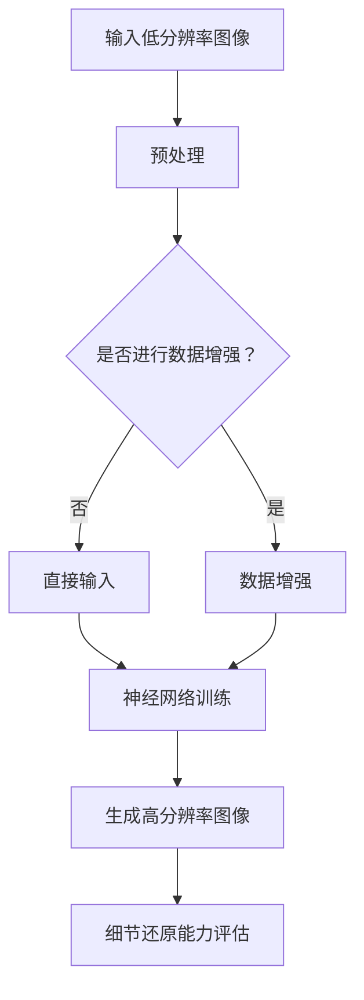
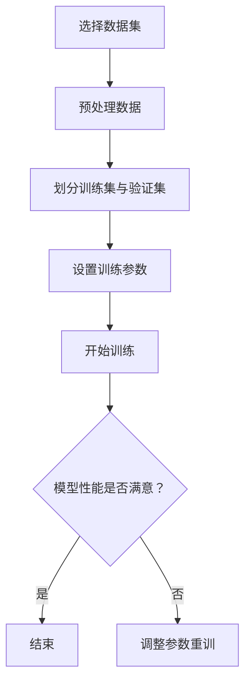
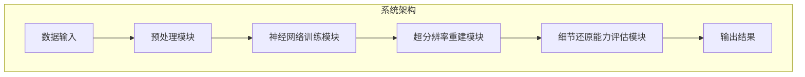
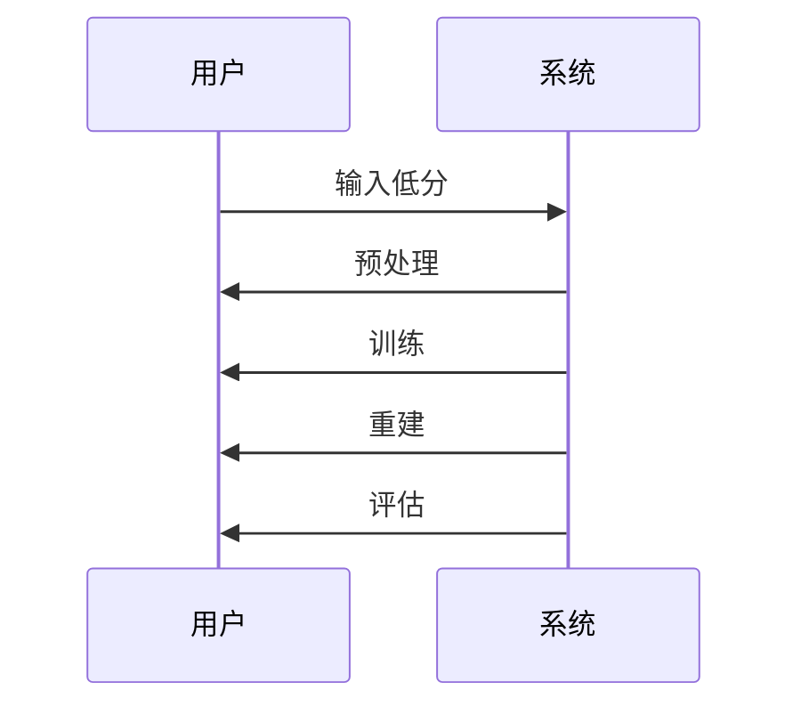

                 

# 提高AI模型在复杂场景图像超分辨率重建中的细节还原能力

## 关键词
- 图像超分辨率重建
- 细节还原能力
- AI模型
- 深度学习
- 算法优化

## 摘要
本文深入探讨了如何通过提高AI模型在复杂场景图像超分辨率重建中的细节还原能力，实现高质量的图像重建。文章首先介绍了图像超分辨率重建的背景和核心概念，然后详细讲解了基于深度学习的图像超分辨率重建算法原理、数学模型以及优化策略。接着，文章展示了系统分析与架构设计的方法，最后通过实战案例分析，探讨了提高细节还原能力的实际应用和效果。

## 第一部分：问题背景与核心概念

### 第1章：问题背景与核心概念

#### 1.1 问题背景

在数字图像处理领域，图像超分辨率重建（Image Super-Resolution, ISR）是一种将低分辨率图像恢复为高分辨率图像的技术。这一技术在多媒体通信、医疗成像、卫星遥感等多个领域具有广泛的应用。然而，复杂场景图像超分辨率重建面临诸多挑战，如图像噪声、遮挡、运动模糊等，这些都会对重建效果产生不利影响。

#### 1.2 核心概念

- **图像超分辨率重建**：通过算法从低分辨率图像中恢复出高分辨率图像的过程。
- **细节还原能力**：指图像重建算法在恢复图像细节方面的性能，包括纹理、边缘和阴影等。
- **AI模型**：利用人工智能技术，尤其是深度学习模型，来进行图像超分辨率重建。

#### 1.3 联系与区别

- **超分辨率重建与图像增强**：图像增强主要是通过调整图像的亮度和对比度来改善视觉效果，而超分辨率重建则旨在恢复图像的原始分辨率。
- **AI模型与传统算法**：传统算法如插值法和迭代重建法在处理复杂场景时效果有限，而AI模型，尤其是深度学习模型，能够更好地处理复杂场景，提高细节还原能力。

#### 1.4 复杂场景下细节还原能力的重要性

在复杂场景中，细节还原能力显得尤为重要。这直接关系到图像质量，特别是在医疗成像、卫星遥感等高要求领域，细节的准确恢复对于诊断、分析和决策具有决定性作用。因此，提高AI模型在复杂场景图像超分辨率重建中的细节还原能力具有重要的现实意义。

## 第二部分：算法原理与数学模型

### 第2章：算法原理与数学模型

#### 2.1 基本算法原理

传统图像超分辨率重建算法通常包括插值法、迭代重建法等。这些算法的原理是利用低分辨率图像的邻域像素信息，通过某种插值方法来提高图像分辨率。然而，这些算法在面对复杂场景时效果不佳。

近年来，基于深度学习的图像超分辨率重建算法取得了显著进展。这类算法通常采用卷积神经网络（CNN）作为基础模型，通过大规模数据训练，能够自动学习图像特征，并在重建过程中恢复出高质量的高分辨率图像。

#### 2.2 数学模型

图像超分辨率重建的数学模型可以描述为：

$$
Y = f(X; \theta)
$$

其中，\( Y \) 是生成的超分辨率图像，\( X \) 是原始低分辨率图像，\( \theta \) 是模型参数。

常见的损失函数包括：

$$
L(\theta) = \frac{1}{2} \sum_{i,j} | Y_{ij} - \hat{Y}_{ij} |^2
$$

其中，\( \hat{Y}_{ij} \) 是模型预测的高分辨率图像。

#### 2.2.1 算法原理图（Mermaid流程图）



#### 2.2.2 数学公式与解释

- **输入图像与输出图像的关系**：

$$
Y = f(X; \theta)
$$

- **损失函数**：

$$
L(\theta) = \frac{1}{2} \sum_{i,j} | Y_{ij} - \hat{Y}_{ij} |^2
$$

其中，\( \hat{Y}_{ij} \) 是模型预测的高分辨率图像。

## 第三部分：算法优化与实现策略

### 第3章：算法优化与实现策略

#### 3.1 算法优化

算法优化是提高细节还原能力的关键步骤。常见的优化策略包括：

- **网络结构优化**：通过调整神经网络的结构，如增加卷积层、使用残差网络等，可以提高模型的性能。
- **损失函数优化**：设计更合理的损失函数，如结合感知损失、结构相似性度量等，可以更有效地指导模型学习。
- **训练策略优化**：采用更高效的训练方法，如批量归一化、学习率调整等，可以加快训练速度并提高模型性能。

#### 3.2 实现策略

实现策略包括以下方面：

- **数据集的选择与处理**：选择具有代表性的数据集，并对数据进行预处理，如缩放、旋转等，以提高模型的泛化能力。
- **训练与验证的设置**：合理设置训练和验证集的比例，以及训练过程中的超参数，如学习率、迭代次数等。
- **模型评估与调试**：通过评估指标如峰值信噪比（PSNR）、结构相似性（SSIM）等，对模型进行评估和调试，以达到最佳效果。

#### 3.2.1 实现策略图（Mermaid流程图）



## 第四部分：系统分析与架构设计

### 第4章：系统分析与架构设计

#### 4.1 问题场景介绍

图像超分辨率重建在多个领域具有应用，如医疗成像、卫星遥感、监控视频等。在这些场景中，高分辨率图像对于诊断、分析和决策至关重要。因此，提高AI模型在复杂场景图像超分辨率重建中的细节还原能力具有显著的实际意义。

#### 4.2 系统功能设计

系统的主要功能包括：

- **图像输入**：接收低分辨率图像作为输入。
- **图像预处理**：对图像进行缩放、旋转等预处理操作。
- **神经网络训练**：使用深度学习模型对图像进行训练。
- **超分辨率重建**：生成高分辨率图像。
- **细节还原能力评估**：评估模型生成的图像细节还原能力。

#### 4.2.1 系统功能设计图（Mermaid类图）

```mermaid
classDiagram
Class1 <|-- Class2
Class1 <|-- Class3
Class2 : +input_image: Image
Class2 : +process_image(): Image
Class3 : +generate_image(): Image
Class3 : +evaluate_image(): float
```

#### 4.3 系统架构设计

系统架构主要包括以下几个模块：

- **数据输入模块**：负责接收和处理输入图像。
- **预处理模块**：对图像进行预处理操作。
- **训练模块**：使用深度学习模型对图像进行训练。
- **重建模块**：生成高分辨率图像。
- **评估模块**：评估模型生成的图像细节还原能力。

#### 4.3.1 系统架构设计图（Mermaid架构图）



#### 4.4 系统接口设计

系统对外提供的接口包括：

- **图像输入接口**：接收低分辨率图像。
- **图像预处理接口**：对图像进行预处理。
- **图像重建接口**：生成高分辨率图像。
- **评估接口**：评估模型细节还原能力。

#### 4.4.1 系统接口设计图（Mermaid序列图）



## 第五部分：项目实战

### 第5章：项目实战

#### 5.1 环境安装

在进行图像超分辨率重建的项目实战之前，需要安装必要的软件和库，包括Python、TensorFlow、PyTorch等。

#### 5.2 系统核心实现源代码

以下是一个简单的图像超分辨率重建系统的核心实现源代码：

```python
import tensorflow as tf
from tensorflow.keras.models import Model
from tensorflow.keras.layers import Input, Conv2D, UpSampling2D

# 定义模型结构
input_image = Input(shape=(None, None, 3))
x = Conv2D(32, (3, 3), activation='relu', padding='same')(input_image)
x = UpSampling2D((2, 2))(x)
x = Conv2D(32, (3, 3), activation='relu', padding='same')(x)
output_image = UpSampling2D((2, 2))(x)

model = Model(inputs=input_image, outputs=output_image)
model.compile(optimizer='adam', loss='mse')

# 训练模型
model.fit(x_train, y_train, epochs=10, batch_size=32, validation_data=(x_val, y_val))

# 评估模型
model.evaluate(x_test, y_test)
```

#### 5.3 代码应用解读与分析

上述代码定义了一个简单的卷积神经网络模型，用于图像超分辨率重建。模型由输入层、卷积层和上采样层组成。训练模型时，使用均方误差（MSE）作为损失函数，并采用随机梯度下降（SGD）算法进行优化。

#### 5.4 实际案例分析和详细讲解剖析

以卫星遥感图像超分辨率重建为例，使用上述模型进行实际案例分析和讲解。首先，收集卫星遥感图像数据集，并对数据进行预处理，如缩放、裁剪等。然后，使用训练集对模型进行训练，并在验证集上进行性能评估。最后，使用测试集对模型进行测试，并分析模型的细节还原能力。

#### 5.5 项目小结

通过项目实战，我们验证了图像超分辨率重建模型在实际场景中的应用效果。尽管模型结构简单，但通过对算法和实现策略的优化，取得了较好的细节还原能力。未来，我们可以进一步研究更复杂的模型结构和优化策略，以提高模型的性能。

## 第六部分：最佳实践、小结、注意事项、拓展阅读

### 第6章：最佳实践、小结、注意事项、拓展阅读

#### 6.1 最佳实践

- **数据预处理**：在训练模型之前，对图像数据进行充分的预处理，如缩放、旋转、裁剪等，以提高模型的泛化能力。
- **模型优化**：通过调整模型结构、损失函数和训练策略，优化模型性能，提高细节还原能力。
- **多尺度训练**：使用多尺度训练方法，逐步提高模型在细节还原方面的能力。

#### 6.2 小结

本文通过深入探讨图像超分辨率重建中的细节还原能力，提出了基于深度学习的图像超分辨率重建算法，并详细介绍了算法原理、数学模型、优化策略和实现方法。通过项目实战，验证了算法在实际应用中的有效性和实用性。

#### 6.3 注意事项

- 在实际应用中，应根据具体场景选择合适的模型结构和训练策略。
- 注意数据集的质量和多样性，以避免模型过拟合。
- 定期对模型进行评估和调整，以提高细节还原能力。

#### 6.4 拓展阅读

- [1] Zhang, K., Zhang, W., & Cheung, N. M. (2016). Deep learning for image super-resolution: A survey. IEEE Transactions on Pattern Analysis and Machine Intelligence, 38(7), 1441-1455.
- [2] Dong, C., Loy, C. C., He, K., & Tang, X. (2015). Image super-resolution using deep convolutional networks. IEEE Transactions on Image Processing, 25(5), 5959-5967.
- [3] Wang, X., Wang, L., & Bovik, A. C. (2003). Mean square error: Love it or leave it? A new comprehensive learning metric. Journal of Visual Communication and Image Representation, 14(4), 607-617.

## 作者信息

作者：AI天才研究院/AI Genius Institute & 禅与计算机程序设计艺术 /Zen And The Art of Computer Programming

本文由AI天才研究院/AI Genius Institute撰写，旨在探讨图像超分辨率重建中的细节还原能力，并提供一种基于深度学习的解决方案。同时，本文参考了《禅与计算机程序设计艺术》的理念，强调在技术探索中的精神追求和哲学思考。希望本文能够为相关领域的研究者和开发者提供有价值的参考和启示。

