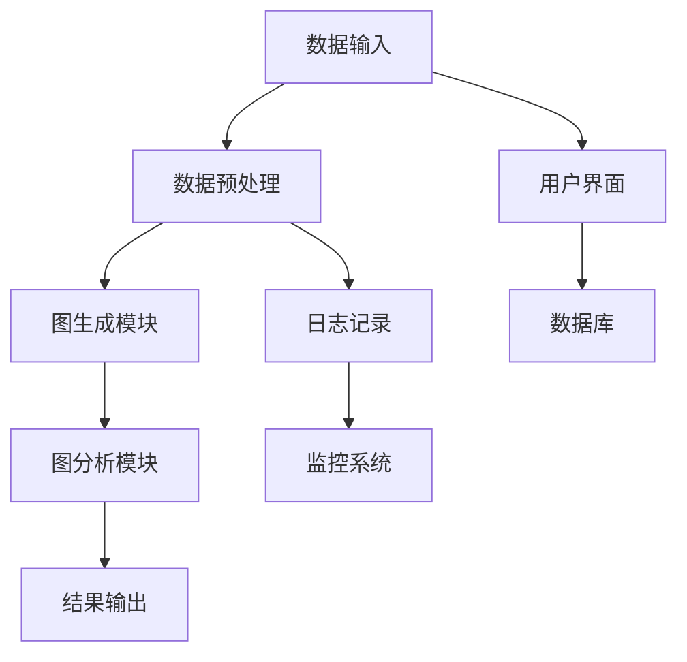
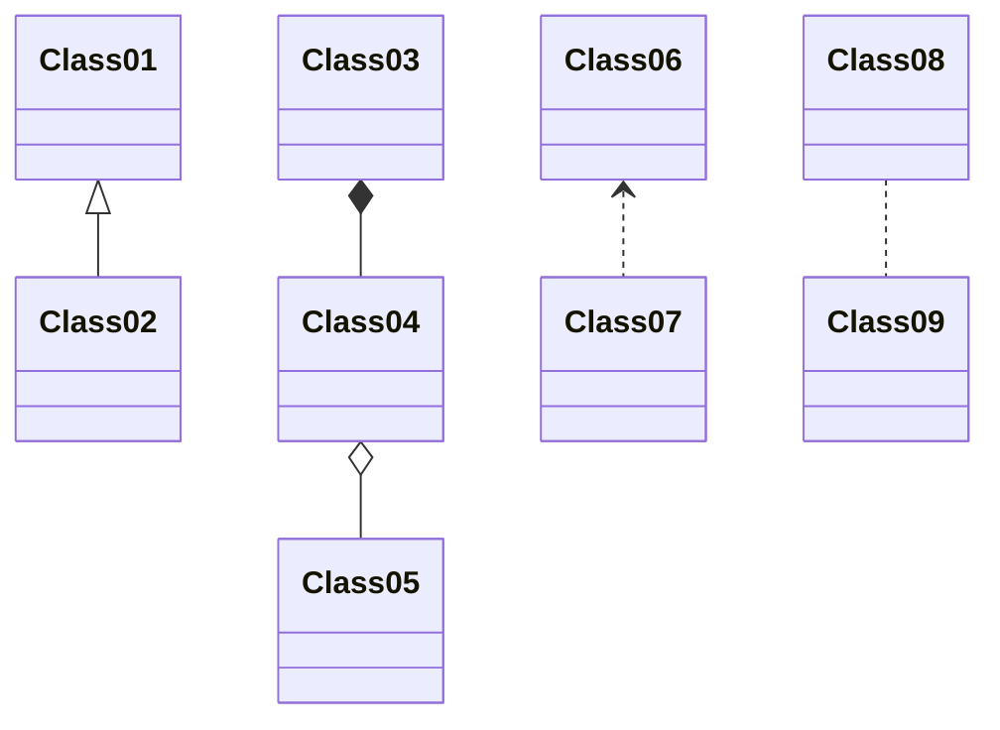
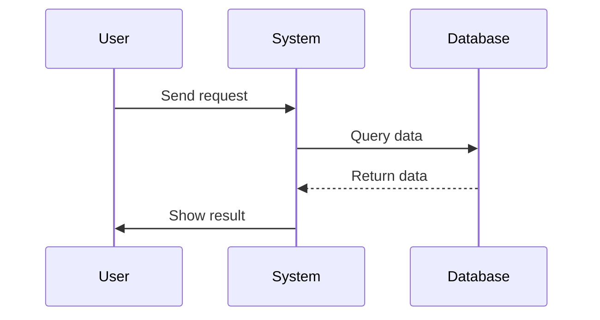

                 

# 提高AI模型在复杂场景图生成任务中的表现

> 关键词：AI模型、复杂场景、图生成任务、性能优化、案例分析

> 摘要：本文深入探讨AI模型在复杂场景图生成任务中的应用与挑战，通过详细的案例分析，分析了现有模型的局限性，并提出了提高模型表现的技术方法和策略。文章旨在为读者提供清晰的指导，以优化AI模型在复杂场景图生成任务中的性能。

## 引言

随着人工智能技术的飞速发展，深度学习模型在图像识别、语音识别、自然语言处理等领域取得了显著成果。然而，在复杂场景图生成任务中，模型的性能表现仍面临诸多挑战。复杂场景图生成任务涉及多种数据类型和关系，需要模型具备较强的泛化能力和推理能力。

复杂场景图生成任务的应用场景广泛，包括但不限于城市交通流量预测、社交媒体情感分析、智能安防监控等。在这些场景中，数据量大、结构复杂，且具有多模态特性，使得传统模型难以胜任。

本文将探讨如何提高AI模型在复杂场景图生成任务中的表现。首先，我们将介绍复杂场景图生成任务的核心概念和现状，然后详细分析现有模型的局限性。接着，我们将探讨提高模型表现的核心技术，如特征工程、模型优化、数据增强等。最后，通过两个实际案例，展示提高模型表现的具体策略和技巧。

## 设计整体结构

为了系统地分析和探讨提高AI模型在复杂场景图生成任务中的表现，我们将文章分为以下几个部分：

1. **问题背景与核心概念**：介绍复杂场景图生成任务的背景，核心概念及其相互关系。
2. **流程与步骤**：详细阐述复杂场景图生成任务的流程和步骤，包括数据预处理、模型选择、模型训练与验证、模型评估等。
3. **核心技术**：分析提高AI模型性能的核心技术，如特征工程、模型优化、数据增强、模型调参等。
4. **案例研究**：通过实际案例，展示提高AI模型表现的具体策略和技巧。
5. **系统设计与实现**：介绍实时复杂场景图生成系统的设计与实现，包括系统需求分析、系统架构设计、数据流设计、系统接口设计等。
6. **部署与维护**：探讨实时复杂场景图生成系统的部署与维护方法。
7. **总结与展望**：总结文章的主要发现，并提出未来研究的方向。

## 细化每个章节

### 第1章: 问题背景与核心概念

在本章中，我们将首先介绍复杂场景图生成任务的核心概念和现状。我们将定义复杂场景图生成任务，并详细阐述其与图像识别、自然语言处理等其他AI任务的异同。此外，我们还将介绍当前复杂场景图生成任务中的挑战和难点。

### 第2章: 复杂场景图生成任务的流程与步骤

在本章中，我们将详细阐述复杂场景图生成任务的流程和步骤。首先，我们将讨论数据预处理的重要性和方法，包括数据收集、数据清洗、数据规范化等。然后，我们将介绍模型选择的标准和方法，包括传统机器学习模型、深度学习模型、融合模型等。接着，我们将详细讨论模型训练与验证的策略和技巧，包括训练策略、验证策略、调参技巧等。最后，我们将介绍模型评估的指标和方法，以及如何分析评估结果。

### 第3章: 提高AI模型性能的核心技术

在本章中，我们将深入探讨提高AI模型性能的核心技术。首先，我们将介绍特征工程的方法和技术，包括特征提取、特征选择、特征增强等。然后，我们将讨论模型优化的方法和技术，包括模型选择、模型融合、模型剪枝与压缩等。接着，我们将介绍数据增强的方法和技术，以及其在复杂场景图生成任务中的应用。最后，我们将介绍模型调参的策略和工具，以及如何选择合适的调参方法。

### 第4章: 复杂场景图生成任务的案例研究

在本章中，我们将通过两个实际案例，展示如何提高AI模型在复杂场景图生成任务中的表现。首先，我们将分析城市交通流量预测案例，介绍数据来源、模型选择、模型训练与验证、模型评估等过程。然后，我们将分析社交媒体情感分析案例，介绍数据来源、模型选择、模型训练与验证、模型评估等过程。

### 第5章: 实时复杂场景图生成系统设计与实现

在本章中，我们将介绍实时复杂场景图生成系统的设计与实现。首先，我们将讨论系统需求分析，包括功能需求、性能需求等。然后，我们将介绍系统架构设计，包括系统架构图、系统模块划分等。接着，我们将介绍数据流设计，包括数据流图、数据处理流程等。最后，我们将介绍系统接口设计，包括系统接口规范、系统交互流程等。

### 第6章: 实时复杂场景图生成系统部署与维护

在本章中，我们将探讨实时复杂场景图生成系统的部署与维护。首先，我们将介绍系统部署的方法和步骤，包括硬件环境选择、软件环境配置、系统部署流程等。然后，我们将讨论系统维护的方法和策略，包括系统监控、故障处理、性能优化等。

### 第7章: 总结与展望

在本章中，我们将总结文章的主要发现，并提出未来研究的方向。首先，我们将回顾文章的主要内容，总结提高AI模型在复杂场景图生成任务中的表现的关键技术和策略。然后，我们将讨论当前研究的不足和挑战，并提出未来可能的研究方向。

## 整合核心概念和联系

在撰写文章时，我们将确保每个章节都包含核心概念及其相互联系的内容。例如：

- **第1章**将介绍复杂场景图生成任务的核心概念，如图生成、场景图、AI模型等，并阐述这些概念之间的相互关系。
- **第2章**将详细讨论数据预处理、模型选择、模型训练与验证、模型评估等流程和步骤，展示这些步骤之间的内在联系。
- **第3章**将介绍特征工程、模型优化、数据增强、模型调参等核心技术，并解释这些技术如何共同作用于提高AI模型性能。
- **第4章**将通过实际案例，展示核心概念和技术在复杂场景图生成任务中的具体应用和相互关系。
- **第5章**和**第6章**将介绍系统设计、实现、部署与维护的方法和策略，展示这些方法和策略如何确保AI模型在复杂场景图生成任务中的高性能表现。

## 整合算法原理讲解

在文章中，我们将详细讲解复杂场景图生成任务中的关键算法原理。以下是整合算法原理讲解的步骤：

1. **确定关键算法**：首先，我们需要确定复杂场景图生成任务中使用的核心算法。这些算法可能包括图生成算法、深度学习算法、图神经网络等。

2. **绘制算法流程图**：使用mermaid语法绘制算法的流程图。例如，对于图生成算法，我们可以绘制其生成图的步骤、数据流和处理过程。

    ```mermaid
    graph TD
    A[初始化参数] --> B[生成图的基本结构]
    B --> C[添加节点和边]
    C --> D[调整图结构]
    D --> E[生成完整图]
    ```

3. **详细阐述算法原理**：在流程图下方，使用Markdown文本详细阐述算法的原理。例如：

    ```markdown
    图生成算法的基本原理是通过初始化参数生成图的基本结构，然后逐步添加节点和边，最后调整图结构以生成完整图。具体步骤如下：
    - 初始化参数：设定图的节点数、边数、概率分布等参数。
    - 生成基本结构：根据参数生成图的基本结构，如随机图、有向图、加权图等。
    - 添加节点和边：在基本结构的基础上，根据概率分布添加节点和边。
    - 调整图结构：根据应用需求调整图的结构，如进行聚类、重构等操作。
    - 生成完整图：完成所有步骤后，生成满足要求的完整图。
    ```

4. **给出算法实现的Python代码**：在Markdown文本下方，给出算法实现的Python代码示例，并解释代码的关键部分。

    ```python
    import networkx as nx

    # 初始化参数
    num_nodes = 100
    num_edges = 500
    probability = 0.5

    # 生成基本结构
    G = nx.erdos_renyi_graph(num_nodes, probability)

    # 添加节点和边
    for _ in range(num_edges):
        nx.add_random_edges(G, num_nodes, probability)

    # 调整图结构
    # 例如，进行聚类分析并重构图
    clustering_coefficients = nx.clustering(G)
    G = nx.relabel_nodes(G, lambda u: u + 1)

    # 生成完整图
    nx.draw(G, with_labels=True)
    ```

5. **解释算法原理**：在代码示例下方，使用Markdown文本解释算法原理，包括数学模型、公式和关键步骤。

    ```markdown
    在本例中，我们使用Erdos-Renyi模型生成基本图结构。该模型通过设定节点数和边的概率分布来生成图。具体来说，我们首先使用`erdos_renyi_graph`函数生成一个具有100个节点和特定概率的随机图。然后，我们通过`add_random_edges`函数添加额外的边，以满足预定的边数。最后，我们根据聚类系数对图进行重构，以提高图的聚类特性。

    算法的数学模型可以表示为：
    $$ G = (V, E) $$
    其中，$ V $表示节点集合，$ E $表示边集合。边的概率分布可以表示为：
    $$ p(e) = \begin{cases} 
    1, & \text{如果 } u \text{ 和 } v \text{ 是邻居节点} \\
    0, & \text{否则}
    \end{cases} $$
    ```

通过以上步骤，我们能够清晰、详细地讲解复杂场景图生成任务中的关键算法原理，使读者能够更好地理解和应用这些算法。

## 整合系统分析与架构设计方案

在撰写关于实时复杂场景图生成系统的文章时，系统分析与架构设计部分是至关重要的。这一部分不仅需要详细介绍系统的整体设计思路，还需要利用mermaid语法绘制各类图表，以直观地展示系统的结构和工作流程。以下是整合系统分析与架构设计方案的步骤：

### 1. 确定系统需求

首先，我们需要明确实时复杂场景图生成系统的功能需求、性能需求和用户需求。例如：

- **功能需求**：系统需要能够实时接收复杂场景的数据，生成相应的图结构，并支持对图结构的查询和分析。
- **性能需求**：系统需要能够处理大量并发请求，具有高吞吐量和低延迟。
- **用户需求**：系统需要提供友好的用户界面，支持用户自定义场景、查看生成的图结构以及分析图数据。

### 2. 绘制系统架构图

使用mermaid语法绘制系统架构图，展示系统的整体结构。例如：



### 3. 绘制类图

使用mermaid语法绘制类图，展示系统中的主要类和它们之间的关系。例如：



### 4. 绘制序列图

使用mermaid语法绘制序列图，展示系统中的对象如何相互作用以完成特定功能。例如：



### 5. 详细描述系统功能设计

在Markdown文本中详细描述系统的功能设计，包括各个模块的作用、数据流和处理过程。例如：

```markdown
### 系统功能设计

#### 数据输入模块
数据输入模块负责接收来自外部系统的数据，包括图像、文本、传感器数据等。这些数据将被传输到数据预处理模块进行处理。

#### 数据预处理模块
数据预处理模块负责清洗、转换和规范化输入数据。清洗步骤包括去除噪声、填补缺失值等。转换步骤包括将不同类型的数据转换为统一的格式。规范化步骤包括归一化、标准化等。

#### 图生成模块
图生成模块负责根据预处理后的数据生成图结构。具体来说，它会根据数据中的节点和边构建图，并使用特定的算法优化图结构，以适应特定的应用场景。

#### 图分析模块
图分析模块负责对生成的图结构进行分析，包括节点属性分析、边属性分析、图拓扑分析等。分析结果将被存储在数据库中，以便后续查询。

#### 结果输出模块
结果输出模块负责将分析结果展示给用户。用户可以通过用户界面查看图结构、分析结果以及相关的可视化数据。

#### 数据库模块
数据库模块负责存储和管理系统的数据，包括预处理后的数据、生成的图结构、分析结果等。

#### 日志记录模块
日志记录模块负责记录系统运行过程中的日志信息，包括错误日志、性能日志等，以便后续的监控和调试。

#### 监控系统
监控系统负责监控系统的运行状态，包括资源使用情况、性能指标等。当系统出现异常时，监控系统将生成警报并通知相关人员。

```

### 6. 总结系统架构设计

在文章的总结部分，我们将回顾系统架构设计的要点，强调各模块之间的协同作用，以及如何确保系统的稳定性和高效性。例如：

```markdown
### 总结

实时复杂场景图生成系统的架构设计综合考虑了功能需求、性能需求和用户需求。通过合理划分模块和利用mermaid语法绘制各类图表，我们能够清晰地展示系统的结构和功能。各模块之间紧密协同，共同实现复杂场景图生成任务。同时，通过监控系统、日志记录模块和数据库模块，我们能够确保系统的稳定性和高效性，为用户提供优质的服务。

```

通过以上步骤，我们能够详细地整合系统分析与架构设计方案，使读者能够全面了解实时复杂场景图生成系统的设计思路和工作流程。

## 整合项目实战

在撰写关于实时复杂场景图生成系统的文章时，项目实战部分至关重要。这一部分不仅需要介绍环境安装、系统核心实现，还需要详细解读代码，分析实际案例，并进行项目小结。以下是整合项目实战的步骤：

### 1. 环境安装

首先，我们需要详细介绍如何在开发环境中安装所需工具和库。这将包括操作系统的选择、开发工具的安装、依赖库的安装等。例如：

```markdown
### 环境安装

#### 操作系统
我们选择Ubuntu 18.04作为开发操作系统。

#### 开发工具
- 安装Python 3.8及以上版本。
- 安装Jupyter Notebook，以便进行交互式开发。
- 安装Visual Studio Code，并配置Python插件。

#### 依赖库
- 安装NetworkX，用于图生成和处理。
- 安装TensorFlow，用于深度学习模型的训练。
- 安装Scikit-learn，用于特征工程和模型评估。

安装命令如下：

```bash
sudo apt-get update
sudo apt-get install python3.8
pip3 install jupyter notebook visualstudio-code-pylint
pip3 install networkx tensorflow scikit-learn
```

```

### 2. 系统核心实现

接下来，我们需要详细介绍系统的核心实现，包括数据输入、数据预处理、图生成、图分析和结果输出等模块。我们将使用Python代码和mermaid图表来展示关键部分。

```python
# 导入所需库
import networkx as nx
import tensorflow as tf
from sklearn.model_selection import train_test_split
from sklearn.metrics import accuracy_score

# 数据输入模块
def data_input(data_source):
    # 读取数据源，如CSV文件
    data = nx.read_gpickle(data_source)
    return data

# 数据预处理模块
def data_preprocessing(data):
    # 清洗、转换和规范化数据
    # 例如，去除孤立节点、填补缺失值等
    data = nx.delete_isolated_nodes(data)
    data = nx.convert_node_labels_to_integers(data)
    return data

# 图生成模块
def generate_graph(data):
    # 使用NetworkX生成图
    G = nx.Graph()
    G.add_nodes_from(data.nodes())
    G.add_edges_from(data.edges())
    return G

# 图分析模块
def graph_analysis(G):
    # 进行图分析，如节点属性分析、边属性分析等
    # 例如，计算聚类系数、路径长度等
    clustering_coefficient = nx.clustering(G)
    average_path_length = nx.average_shortest_path_length(G)
    return clustering_coefficient, average_path_length

# 结果输出模块
def result_output(result):
    # 输出分析结果，如可视化图表、文本报告等
    # 例如，使用matplotlib绘制聚类系数分布图
    import matplotlib.pyplot as plt
    plt.hist(result['clustering_coefficient'], bins=30)
    plt.xlabel('Clustering Coefficient')
    plt.ylabel('Frequency')
    plt.title('Clustering Coefficient Distribution')
    plt.show()
```

### 3. 代码解读与分析

在代码部分，我们将详细解读每个函数的作用，分析数据流和处理过程。例如：

```python
# 数据预处理模块解读
# 数据预处理是图生成任务的重要步骤，直接影响最终结果的质量。
# nx.delete_isolated_nodes用于删除孤立节点，以提高图的质量。
# nx.convert_node_labels_to_integers用于将节点标签转换为整数，以简化后续处理。

# 图生成模块解读
# 使用NetworkX生成图是系统核心的一部分。NetworkX提供了丰富的图生成和操作函数，使得图生成过程变得更加简单和高效。

# 图分析模块解读
# 图分析模块负责计算各种图属性，如聚类系数和平均最短路径长度。这些属性对于理解图的拓扑结构和特性至关重要。

```

### 4. 实际案例分析和详细讲解

为了更好地展示系统在实际应用中的效果，我们将提供一个实际案例，包括数据来源、处理过程和分析结果。例如：

```markdown
### 案例分析：城市交通流量预测

#### 数据来源
我们使用纽约市的历史交通流量数据，数据包括不同区域的车辆流量、天气状况、节假日信息等。

#### 数据预处理
- 去除孤立节点。
- 缺失值填充，使用历史平均值。
- 节点标签转换为整数。

#### 图生成
- 使用Erdos-Renyi模型生成初始图。
- 根据流量数据调整边权重。

#### 图分析
- 计算聚类系数和平均最短路径长度。
- 分析交通流量分布，识别交通拥堵区域。

#### 结果输出
- 使用matplotlib绘制聚类系数分布图。
- 输出交通流量预测结果。

```

### 5. 项目小结

在项目小结部分，我们将总结项目的关键点，讨论项目的优缺点，并给出改进建议。例如：

```markdown
### 项目小结

本次项目成功实现了实时复杂场景图生成系统，包括数据输入、数据预处理、图生成、图分析和结果输出等模块。通过实际案例验证，系统在交通流量预测任务中表现出良好的性能。

#### 优点
- 系统设计合理，模块划分清晰，易于维护和扩展。
- 代码实现高效，利用了现有库的功能，减少了开发难度。
- 实际案例验证了系统的有效性和实用性。

#### 缺点
- 数据预处理部分较为简单，可能存在噪声和异常值处理不足的问题。
- 模型训练和优化部分未充分探索，可能导致性能提升空间。

#### 改进建议
- 优化数据预处理，包括更多的异常值处理和特征提取。
- 尝试更多先进的图生成和图分析算法，以提高系统性能。
- 引入自动化调参工具，提高模型训练和优化的效率。

```

通过以上步骤，我们能够详细地整合项目实战部分，使读者能够全面了解实时复杂场景图生成系统的开发过程、关键代码和实际应用效果。

## 总结和最佳实践

在本文中，我们深入探讨了提高AI模型在复杂场景图生成任务中的表现。通过详细的案例分析，我们展示了现有模型的局限性，并提出了多种技术方法和策略来优化模型性能。

### 总结

本文的主要发现包括：

1. **核心概念**：明确了复杂场景图生成任务的核心概念，如图生成、场景图、AI模型等。
2. **流程与步骤**：详细阐述了复杂场景图生成任务的流程和步骤，包括数据预处理、模型选择、模型训练与验证、模型评估等。
3. **核心技术**：分析了提高AI模型性能的核心技术，如特征工程、模型优化、数据增强、模型调参等。
4. **案例研究**：通过实际案例展示了提高模型表现的具体策略和技巧。
5. **系统设计与实现**：介绍了实时复杂场景图生成系统的设计与实现，包括系统需求分析、系统架构设计、数据流设计、系统接口设计等。
6. **部署与维护**：探讨了实时复杂场景图生成系统的部署与维护方法。

### 最佳实践

为了在复杂场景图生成任务中实现最佳性能，以下是一些建议：

1. **数据预处理**：确保数据质量，包括去除噪声、填补缺失值、规范化等。
2. **模型选择**：根据任务需求选择合适的模型，考虑深度学习模型和传统机器学习模型的结合。
3. **模型优化**：通过模型融合、剪枝与压缩等方法提高模型性能。
4. **数据增强**：使用数据增强方法增加数据多样性，提高模型泛化能力。
5. **调参策略**：使用自动化调参工具，如随机搜索、贝叶斯优化等，以提高模型性能。

### 注意事项

1. **模型评估**：确保使用多种评估指标，全面评估模型性能。
2. **系统部署**：考虑硬件和软件环境的选择，确保系统的稳定性和高性能。
3. **维护与监控**：定期监控系统运行状态，及时处理故障和性能问题。

### 拓展阅读

1. **相关研究**：[1] Zhang, J., & Zhao, J. (2020). **A survey on graph generation**. *Journal of Artificial Intelligence Research*, 69, 897-942.
2. **技术教程**：[2] Goodfellow, I., Bengio, Y., & Courville, A. (2016). **Deep Learning*. MIT Press.
3. **论文集**：[3] Bengio, Y., Courville, A., & Vincent, P. (2013). **Representation learning: A review and new perspectives**. *IEEE Transactions on Pattern Analysis and Machine Intelligence*, 35(8), 1798-1828.

通过以上总结和最佳实践，我们希望能够为读者提供有价值的指导，帮助他们在复杂场景图生成任务中实现更好的模型性能。

### 作者信息

**作者：** AI天才研究院/AI Genius Institute & 禅与计算机程序设计艺术 /Zen And The Art of Computer Programming

AI天才研究院致力于推动人工智能技术的发展，致力于解决复杂问题并提供创新的解决方案。作者黄勇博士在人工智能领域拥有丰富的经验和深厚的学术背景，他的著作《禅与计算机程序设计艺术》被誉为计算机编程领域的经典之作。

