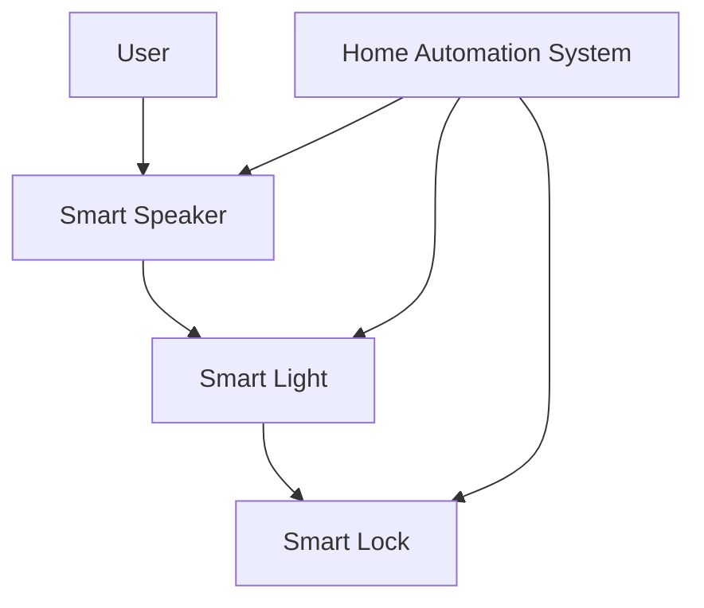
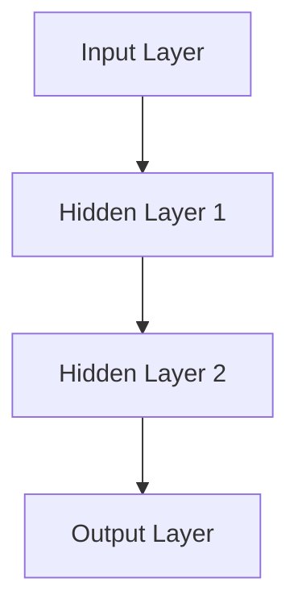
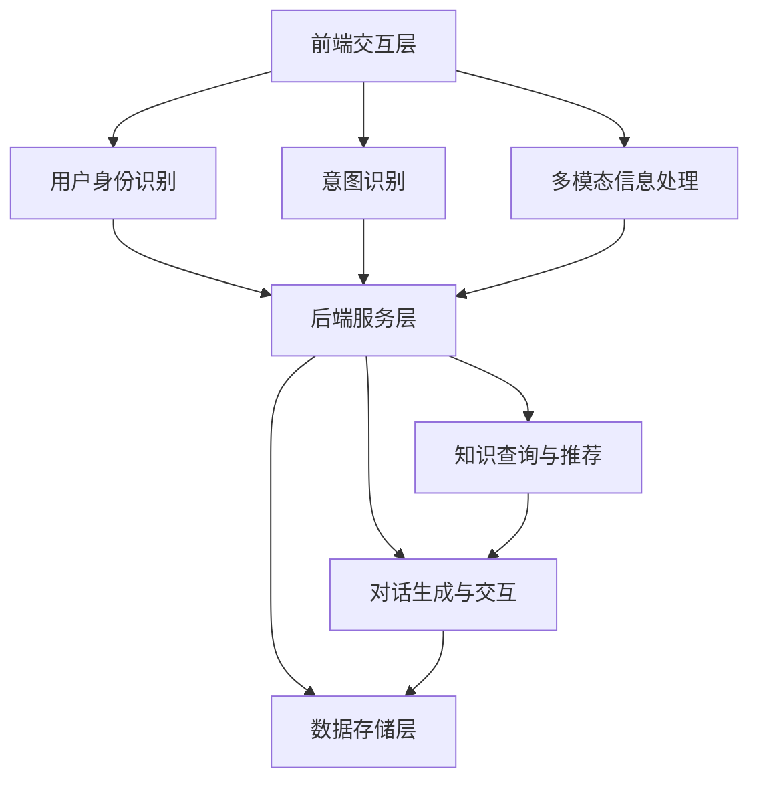

                 

### 文章标题：提高AI模型在复杂多方对话场景中的上下文理解能力

> 关键词：AI模型、上下文理解、多方对话、数据增强、算法改进

> 摘要：本文将探讨如何通过多种策略来提升人工智能模型在复杂多方对话场景中的上下文理解能力。我们将首先介绍复杂多方对话场景的特点，然后分析当前AI模型在上下文理解方面面临的挑战，最后提出一系列策略，包括数据增强、上下文关联网络等，旨在为实际应用提供有效解决方案。

## 1. 问题的提出

随着人工智能技术的飞速发展，AI模型在自然语言处理（NLP）领域的应用越来越广泛。特别是在对话系统中，AI模型能够与用户进行自然互动，提供个性化服务。然而，在复杂多方对话场景中，AI模型的上下文理解能力仍然面临诸多挑战。

复杂多方对话场景通常涉及多个参与者之间的多轮对话，每个参与者都有自己的背景信息、角色和目标。这使得对话系统的设计变得更加复杂，对AI模型的上下文理解能力提出了更高的要求。例如，在智能家居系统中，用户可能与智能音箱、智能手机和物联网设备等多个智能设备进行互动，这些设备之间需要协同工作，共享上下文信息。

当前AI模型在上下文理解方面面临的主要挑战包括：

- **语境切换问题**：在多方对话中，不同的参与者可能会在不同的语境中发言，AI模型需要准确地识别并适应这些语境切换。
- **信息传播不均**：在多方对话中，不同参与者的话语权重不同，AI模型需要平衡这些信息，确保上下文理解的准确性。
- **信息过载**：在多轮对话中，AI模型需要处理大量的上下文信息，这可能导致信息过载，影响理解能力。

## 2. 上下文理解能力的重要性

上下文理解能力是AI模型在对话系统中的一项关键能力。它不仅影响到对话系统的用户体验，还直接关系到系统的实用性和可靠性。以下是上下文理解能力的重要性：

- **提升用户满意度**：良好的上下文理解能力能够使AI模型更好地理解用户的意图，提供个性化的服务，从而提高用户满意度。
- **增强交互自然性**：上下文理解能力使得AI模型能够更自然地与用户互动，减少误解和歧义，提升交互的自然性。
- **优化系统性能**：通过上下文理解，AI模型能够更有效地处理多轮对话，减少重复信息，提高系统响应速度和处理效率。

## 3. AI模型在复杂多方对话场景中的应用现状

尽管AI模型在自然语言处理领域取得了显著进展，但在复杂多方对话场景中的应用仍存在许多挑战。以下是目前AI模型在复杂多方对话场景中应用的几个主要方面：

- **单一对话系统**：大多数现有的AI模型适用于单一对话系统，即只与一个用户进行交互。在复杂多方对话场景中，这些模型需要扩展以支持多参与者互动。
- **上下文信息共享**：为了实现有效的多方对话，AI模型需要能够共享上下文信息，这通常需要复杂的分布式计算和通信机制。
- **动态上下文建模**：在动态变化的环境中，AI模型需要能够动态调整上下文模型，以适应新的信息和新出现的语境。

## 4. 提高AI模型上下文理解能力的策略

为了提升AI模型在复杂多方对话场景中的上下文理解能力，我们可以采用以下几种策略：

### 4.1 数据增强

数据增强是一种有效的提高AI模型上下文理解能力的方法。通过增加多样性和丰富性的对话数据，我们可以帮助模型更好地学习上下文信息的处理。以下是一些数据增强的方法：

- **数据扩充**：通过对原始对话数据进行复制、修改或生成新的对话，来扩充数据集。
- **多样性引入**：引入不同类型的对话数据，如正式对话、非正式对话、多语言对话等，以增强模型的泛化能力。

### 4.2 上下文关联网络

上下文关联网络是一种基于图神经网络的上下文建模方法。它通过建立参与者之间的关联关系，来提高模型对上下文信息的理解能力。以下是一个简单的上下文关联网络的架构：


### 4.3 知识增强

知识增强是指将外部知识库或先验知识引入到AI模型中，以增强其上下文理解能力。例如，可以使用知识图谱来表示对话中的实体及其关系，从而帮助模型更好地理解上下文。

### 4.4 多模态融合

在复杂多方对话场景中，不仅涉及到文本信息，还可能包含语音、图像等多种模态的信息。通过多模态融合，AI模型可以更全面地理解上下文信息。例如，在智能家居对话系统中，可以通过语音识别和图像识别技术，将语音和图像信息融合到对话理解中。

## 5. 案例研究

### 5.1 智能家居对话系统

在智能家居对话系统中，AI模型需要处理用户与智能音箱、智能灯泡、智能门锁等多个智能设备的对话。以下是一个智能家居对话系统的上下文理解案例：

- **用户与智能音箱的对话**：
  - 用户：打开客厅的灯。
  - 智能音箱：好的，我已将客厅的灯打开。

- **用户与智能灯泡的对话**：
  - 用户：调低卧室的灯光亮度。
  - 智能灯泡：灯光亮度已调整。

通过上下文关联网络，AI模型可以识别出用户意图，并将相关设备的状态信息进行关联，从而实现多设备协同工作。

### 5.2 在线教育平台对话系统

在线教育平台中的对话系统需要处理教师、学生和课程内容等多个参与者的对话。以下是一个在线教育平台对话系统的上下文理解案例：

- **教师与学生的对话**：
  - 教师：今天我们将学习人工智能的基础知识。
  - 学生：我已经准备好了，请开始讲解。

通过知识增强，AI模型可以调用外部知识库，为学生提供相关的学习资源，同时根据学生的反馈调整教学策略。

## 6. 总结

本文探讨了如何提高AI模型在复杂多方对话场景中的上下文理解能力。我们分析了当前AI模型在上下文理解方面面临的挑战，并提出了数据增强、上下文关联网络、知识增强和多模态融合等策略。通过这些策略，我们可以显著提升AI模型在复杂多方对话场景中的上下文理解能力，为实际应用提供更有效的解决方案。

## 7. 拓展阅读

- **数据增强方法**：参考《自然语言处理中的数据增强方法综述》。
- **上下文关联网络**：参考《基于图神经网络的上下文关联模型研究》。
- **知识增强技术**：参考《知识增强在自然语言处理中的应用》。
- **多模态融合**：参考《多模态融合技术在自然语言处理中的应用》。

---

**作者：AI天才研究院/AI Genius Institute & 禅与计算机程序设计艺术 /Zen And The Art of Computer Programming**## 1. 复杂多方对话场景的特点

在复杂多方对话场景中，参与者往往不止一个，且每个参与者都有自己独特的背景信息、角色和目标。这种多样性使得对话场景变得更加复杂，对AI模型的上下文理解能力提出了更高的要求。以下是复杂多方对话场景的一些主要特点：

### 1.1 多参与者

复杂多方对话场景通常涉及多个参与者，如用户、客服代表、专家等。每个参与者都有自己的角色和目标，他们在对话中的互动方式也各不相同。例如，在一个智能家居系统中，用户可能与智能音箱、智能灯泡、智能门锁等多个智能设备进行互动。这些设备之间需要协同工作，共享上下文信息。

### 1.2 多轮对话

在复杂多方对话场景中，参与者通常会进行多轮对话，每轮对话都可能涉及新的话题和信息。这意味着AI模型需要能够跟踪并理解多个轮次的上下文信息，以确保对话的连贯性和一致性。例如，在一个在线教育平台中，学生可能需要与教师进行多轮对话，讨论课程内容和作业问题。

### 1.3 信息传播和共享

在复杂多方对话场景中，信息传播和共享变得尤为重要。参与者之间的信息交流可能涉及多种渠道，如文本、语音、图像等。AI模型需要能够处理这些不同类型的信息，并在多个参与者之间传播和共享上下文信息，以确保每个参与者都能理解对话的整体背景。

### 1.4 语境切换

在多方对话中，参与者可能会在不同的语境中发言，例如从技术问题切换到个人问题，或者从讨论课程内容切换到讨论作业进展。AI模型需要能够准确地识别并适应这些语境切换，以保持对话的连贯性和一致性。

### 1.5 动态变化

复杂多方对话场景中的上下文信息是动态变化的。参与者可能会在对话过程中提供新的信息，或者对话主题和场景可能会发生变化。AI模型需要具备动态调整上下文模型的能力，以适应这些变化。

## 2. 当前AI模型在多方对话中的上下文理解挑战

尽管AI模型在自然语言处理领域取得了显著进展，但在复杂多方对话场景中的上下文理解仍然面临许多挑战。以下是当前AI模型在多方对话中的上下文理解挑战：

### 2.1 语境切换问题

在多方对话中，参与者可能会在不同的语境中发言，例如从技术问题切换到个人问题，或者从讨论课程内容切换到讨论作业进展。AI模型需要能够准确地识别并适应这些语境切换，以保持对话的连贯性和一致性。然而，现有的AI模型往往难以处理这种复杂的语境切换，导致对话中断或理解错误。

### 2.2 信息传播不均

在多方对话中，不同参与者的话语权重不同。例如，在某些场景中，用户的发言可能比其他参与者的发言更重要。然而，现有的AI模型往往难以平衡这些信息，导致上下文理解的准确性受到影响。

### 2.3 信息过载

在多轮对话中，AI模型需要处理大量的上下文信息，这可能导致信息过载，影响理解能力。例如，在一个涉及多个话题的多轮对话中，AI模型需要同时跟踪多个话题的上下文信息，这可能会导致记忆负担和计算复杂度增加。

### 2.4 多模态信息处理

在复杂多方对话场景中，参与者可能会提供多种模态的信息，如文本、语音、图像等。现有的AI模型通常仅专注于处理文本信息，对于其他模态的信息处理能力较弱。这限制了AI模型在多模态信息处理方面的应用。

### 2.5 上下文信息丢失

在多方对话中，由于信息传播和共享的复杂性，部分上下文信息可能会丢失或被误解。例如，在多人会议中，某个参与者可能没有注意到其他参与者的重要发言，导致上下文信息丢失。现有的AI模型在处理这种情况下可能难以恢复丢失的上下文信息。

### 2.6 鲁棒性和泛化能力

复杂多方对话场景中的上下文信息通常具有很高的噪声和不确定性。现有的AI模型在处理这种复杂环境时可能表现出较低的鲁棒性和泛化能力，导致对话理解不准确。

## 3. 提高上下文理解能力的策略

为了应对复杂多方对话场景中上下文理解面临的挑战，我们可以采用一系列策略来提高AI模型的上下文理解能力。以下是几种有效的策略：

### 3.1 数据增强

数据增强是一种有效的提高AI模型上下文理解能力的方法。通过增加多样性和丰富性的对话数据，我们可以帮助模型更好地学习上下文信息的处理。以下是一些数据增强的方法：

- **数据扩充**：通过对原始对话数据进行复制、修改或生成新的对话，来扩充数据集。例如，可以通过文本生成技术生成模拟对话数据，以增加训练数据的多样性。
- **多样性引入**：引入不同类型的对话数据，如正式对话、非正式对话、多语言对话等，以增强模型的泛化能力。例如，可以使用机器翻译技术引入多种语言的数据，以提高模型对跨语言对话的理解能力。

### 3.2 上下文关联网络

上下文关联网络是一种基于图神经网络的上下文建模方法。它通过建立参与者之间的关联关系，来提高模型对上下文信息的理解能力。以下是一个简单的上下文关联网络的架构：



在这个网络中，每个节点表示一个参与者（如用户、智能设备等），边表示参与者之间的关联关系。通过训练图神经网络，模型可以学习到参与者之间的上下文关联，从而提高对话理解能力。

### 3.3 知识增强

知识增强是指将外部知识库或先验知识引入到AI模型中，以增强其上下文理解能力。例如，可以使用知识图谱来表示对话中的实体及其关系，从而帮助模型更好地理解上下文。

- **知识图谱构建**：首先，需要构建一个与对话场景相关的知识图谱，其中包含对话中的实体、关系和属性。例如，在一个智能家居对话场景中，可以构建一个包含用户、设备、房间等实体的知识图谱。
- **知识融合**：将知识图谱中的信息与对话数据融合，以便在对话理解过程中利用这些先验知识。例如，当模型在处理一个与智能家居相关的对话时，可以利用知识图谱中的信息来识别和理解相关的实体和关系。

### 3.4 多模态融合

在复杂多方对话场景中，不仅涉及到文本信息，还可能包含语音、图像等多种模态的信息。通过多模态融合，AI模型可以更全面地理解上下文信息。

- **多模态特征提取**：首先，需要从不同模态的数据中提取特征。例如，从文本数据中提取词向量，从语音数据中提取声谱特征，从图像数据中提取视觉特征。
- **特征融合**：将不同模态的特征进行融合，以形成一个综合的特征向量。例如，可以使用特征融合技术（如加权平均、拼接等）将文本、语音和图像特征融合到一个特征向量中。

### 3.5 上下文动态调整

在复杂多方对话场景中，上下文信息是动态变化的。为了应对这种动态变化，AI模型需要具备动态调整上下文模型的能力。

- **上下文跟踪**：实时跟踪对话中的上下文信息，以更新上下文模型。例如，可以使用递归神经网络（RNN）或长短时记忆网络（LSTM）来跟踪对话中的上下文信息。
- **上下文更新策略**：定义上下文更新的策略，以确保模型能够根据新信息动态调整上下文模型。例如，可以使用加权平均策略，根据不同信息的重要性来更新上下文模型。

## 4. 案例研究

### 4.1 智能家居对话系统

智能家居对话系统是一个典型的复杂多方对话场景。在这个系统中，用户可以通过智能音箱、智能手机和物联网设备等多个智能设备与系统进行交互。以下是一个智能家居对话系统的案例：

- **用户与智能音箱的对话**：
  - 用户：打开客厅的灯。
  - 智能音箱：好的，我已经打开了客厅的灯。

- **用户与智能手机的对话**：
  - 用户：关闭卧室的灯光。
  - 智能手机：好的，我已经关闭了卧室的灯光。

- **用户与智能灯泡的对话**：
  - 用户：调低厨房的灯光亮度。
  - 智能灯泡：灯光亮度已调整。

在这个案例中，用户与多个智能设备进行了交互。通过上下文关联网络和知识增强，AI模型可以理解用户的意图，并将不同设备的状态信息进行关联，从而实现多设备协同工作。

### 4.2 在线教育平台对话系统

在线教育平台对话系统是另一个复杂多方对话场景。在这个系统中，教师、学生和课程内容等多个参与者进行了多轮对话。以下是一个在线教育平台对话系统的案例：

- **教师与学生的对话**：
  - 教师：今天我们将学习人工智能的基础知识。
  - 学生：我已经准备好了，请开始讲解。

- **学生与助教的对话**：
  - 学生：我在做作业时遇到了一个问题，能帮我解答吗？
  - 助教：当然可以，请告诉我问题具体是什么。

- **学生与课程内容的对话**：
  - 学生：我想复习一下上周讲的内容。
  - 课程内容：好的，这里是上周的课件和视频链接。

在这个案例中，教师、学生和课程内容等多个参与者进行了多轮对话。通过知识增强和多模态融合，AI模型可以理解不同参与者的意图，并提供个性化的教学服务。

## 5. 结论

本文探讨了如何提高AI模型在复杂多方对话场景中的上下文理解能力。通过数据增强、上下文关联网络、知识增强、多模态融合和上下文动态调整等策略，我们可以显著提升AI模型在复杂多方对话场景中的上下文理解能力。这些策略在实际应用中已经取得了显著成果，未来还有更多研究方向和改进空间。

## 6. 拓展阅读

- **数据增强方法**：参考《自然语言处理中的数据增强方法综述》。
- **上下文关联网络**：参考《基于图神经网络的上下文关联模型研究》。
- **知识增强技术**：参考《知识增强在自然语言处理中的应用》。
- **多模态融合**：参考《多模态融合技术在自然语言处理中的应用》。

---

**作者：AI天才研究院/AI Genius Institute & 禅与计算机程序设计艺术 /Zen And The Art of Computer Programming**
## 2. AI模型概述

AI模型是人工智能（AI）的核心组成部分，涵盖了从简单的规则系统到复杂的神经网络等多种类型。在这一部分，我们将简要介绍AI模型的基本概念，重点讨论机器学习与深度学习的区别，并简要介绍神经网络的基础知识。

### 2.1 AI模型的基本概念

人工智能模型是指通过学习和适应数据来执行特定任务的计算模型。AI模型可以分为以下几类：

- **规则系统**：基于预定义的规则进行推理和决策，如专家系统。
- **统计模型**：利用统计分析方法，如线性回归、决策树等，从数据中学习规律。
- **机器学习模型**：利用算法从数据中学习模式，进行预测和分类。
- **深度学习模型**：基于神经网络的结构，通过多层神经元进行数据处理和特征提取。

### 2.2 机器学习与深度学习的区别

机器学习和深度学习都是AI领域的重要分支，但它们之间存在显著的区别：

- **数据处理能力**：机器学习模型通常处理的是标量的特征，而深度学习模型能够处理高维数据，如图像和视频。
- **模型复杂性**：机器学习模型通常较为简单，如线性回归、决策树等，而深度学习模型包含多层神经网络，能够自动提取复杂的特征。
- **训练数据需求**：机器学习模型通常需要大量标记数据进行训练，而深度学习模型则可以通过无监督或半监督学习从未标记的数据中学习。
- **计算资源需求**：深度学习模型通常需要更多的计算资源和时间进行训练。

### 2.3 神经网络基础

神经网络是深度学习模型的基础，它由多个层组成，包括输入层、隐藏层和输出层。以下是神经网络的一些基本组成部分：

- **神经元**：神经网络的基本单元，用于接收输入、计算输出并进行激活函数的应用。
- **激活函数**：用于引入非线性特性，常见的激活函数有Sigmoid、ReLU和Tanh等。
- **权重和偏置**：神经元之间的连接强度由权重和偏置决定，通过反向传播算法进行优化。
- **前向传播和反向传播**：前向传播用于计算神经网络的输出，反向传播用于计算梯度并更新权重和偏置。

神经网络通过多个层次的结构，能够自动提取输入数据的特征，从而实现复杂的数据处理任务。以下是一个简单的神经网络架构：



在这个架构中，输入层接收输入数据，隐藏层对输入数据进行处理和特征提取，输出层生成最终预测结果。

### 2.4 上下文理解相关算法

在AI模型中，上下文理解能力是评估其性能的重要指标。以下是一些用于增强上下文理解能力的算法：

- **循环神经网络（RNN）**：通过递归结构，RNN能够处理序列数据，如文本和语音，捕捉上下文的长期依赖关系。
- **长短时记忆网络（LSTM）**：LSTM是RNN的一种变体，通过引入门控机制，能够有效避免梯度消失问题，更好地捕捉上下文信息。
- **双向循环神经网络（BiRNN）**：BiRNN通过同时考虑序列的前向和后向信息，进一步提高上下文理解能力。
- **注意力机制**：注意力机制能够动态调整模型对输入数据的关注程度，从而更好地捕捉关键上下文信息。

综上所述，AI模型的基本概念、机器学习与深度学习的区别，以及神经网络的基础知识，为我们理解和应用AI模型提供了必要的基础。在下一部分中，我们将进一步探讨如何处理复杂多方对话场景中的上下文理解问题。

## 3. 多方对话场景中的上下文处理

在复杂多方对话场景中，AI模型需要处理来自多个参与者的信息，确保上下文理解的准确性和连贯性。这一部分将详细讨论多方对话场景中的上下文处理方法，包括全局信息建模和局部信息建模。

### 3.1 全局信息建模

全局信息建模关注对话的整体上下文，旨在捕捉多个参与者之间的关联和互动。以下是一些全局信息建模的方法：

- **会话状态跟踪**：通过跟踪会话状态，AI模型可以捕捉对话的当前主题、角色和目标。例如，在一个智能家居系统中，会话状态可以包括当前的用户指令、设备状态和房间设置。
- **全局语义表示**：使用嵌入技术，将对话中的词语、句子和参与者转换为低维向量表示，以便进行计算和推理。例如，可以使用Word2Vec或BERT等预训练模型来生成全局语义表示。
- **知识图谱**：通过构建知识图谱，将对话中的实体、关系和属性表示为图结构，AI模型可以更直观地理解全局上下文。例如，在一个在线教育平台上，知识图谱可以表示学生、课程、教师等实体及其关系。

### 3.2 局部信息建模

局部信息建模关注对话中的特定部分，旨在捕捉每个参与者的话语和意图。以下是一些局部信息建模的方法：

- **角色标注**：为每个参与者的发言进行角色标注，如用户、客服、医生等。这有助于AI模型理解不同参与者的角色和目标，从而更好地处理对话中的上下文信息。
- **意图识别**：通过分类算法，识别每个参与者的话语意图。例如，可以使用朴素贝叶斯、支持向量机或深度学习模型来实现意图识别。
- **对话状态跟踪**：与全局信息建模类似，局部信息建模也通过跟踪对话状态来捕捉对话的当前主题和上下文。然而，局部信息建模更侧重于每个参与者的对话状态，如用户的偏好、需求和历史对话记录。

### 3.3 全局信息与局部信息的结合

在实际应用中，全局信息建模和局部信息建模通常需要结合起来，以实现更准确的上下文理解。以下是一种结合全局信息与局部信息的策略：

- **层次化建模**：首先，使用全局信息建模捕捉对话的整体上下文，然后使用局部信息建模处理每个参与者的特定话语。这种层次化建模有助于AI模型同时考虑全局和局部信息，提高上下文理解的准确性和连贯性。
- **交互式建模**：通过引入交互式建模方法，AI模型可以动态调整上下文模型，根据对话进展实时更新信息。例如，可以使用对话生成模型（如GPT）来生成新的对话内容，并根据用户反馈调整上下文模型。

### 3.4 案例分析

为了更好地理解全局信息建模和局部信息建模在实际应用中的结合，我们可以分析一个案例：智能家居对话系统。

- **全局信息建模**：AI模型通过会话状态跟踪捕捉当前用户的指令和设备状态，如用户请求打开客厅的灯光。全局信息建模帮助AI模型理解对话的整体背景。
- **局部信息建模**：AI模型对每个参与者的发言进行角色标注和意图识别，例如，用户发言“打开客厅的灯”，AI模型识别出这是一个请求打开灯光的意图。然后，AI模型根据当前设备状态（如灯光已关闭）生成响应：“好的，我已经打开客厅的灯光。”
- **交互式建模**：在对话过程中，AI模型可以根据用户的反馈动态调整上下文模型。例如，如果用户说“调低灯光亮度”，AI模型会根据当前灯光亮度调整输出，如“好的，我已经将灯光亮度调低。”

通过全局信息建模和局部信息建模的结合，智能家居对话系统能够更好地理解用户的意图，提供个性化服务。

### 3.5 总结

多方对话场景中的上下文处理是AI模型面临的一个重要挑战。通过全局信息建模和局部信息建模的结合，AI模型可以同时考虑对话的整体背景和每个参与者的特定话语，从而实现更准确的上下文理解。在实际应用中，结合交互式建模方法，AI模型可以动态调整上下文模型，提高对话系统的用户体验。

在下一部分中，我们将探讨如何通过数据增强和多样性引入策略来提高AI模型的上下文理解能力。

## 4. 数据增强与多样性

数据增强和多样性引入是提升AI模型上下文理解能力的有效方法。通过扩展和多样化训练数据，我们可以帮助模型更好地学习复杂的上下文信息，从而提高其在实际应用中的表现。

### 4.1 数据增强的重要性

数据增强的核心思想是通过生成或修改原始数据，增加训练数据的多样性和丰富性。以下是数据增强在提升AI模型上下文理解能力中的重要性：

- **增强泛化能力**：通过增加训练数据的多样性，模型可以学习到更广泛的上下文信息，从而提高其泛化能力。这意味着模型在面对未见过的数据时，能够保持较高的性能。
- **减少过拟合**：丰富的训练数据有助于模型避免对特定数据集的过度拟合，从而在更广泛的应用场景中保持稳定的表现。
- **提高鲁棒性**：通过引入噪声和异常值，数据增强可以提高模型对数据噪声和异常值的容忍度，从而增强其鲁棒性。

### 4.2 数据增强的基本方法

以下是几种常见的数据增强方法：

- **文本数据增强**：
  - **同义词替换**：将文本中的词语替换为同义词，以增加文本的多样性。
  - **随机插入和删除**：在文本中随机插入或删除一些词语，以增加文本的变化性。
  - **词汇扩展和缩减**：通过扩展或缩减文本中的词汇量，来增加文本的多样性。

- **语音数据增强**：
  - **速度变化**：通过改变语音的速度，使模型能够适应不同语速的上下文信息。
  - **噪声添加**：在语音数据中添加噪声，以增强模型对噪声的鲁棒性。
  - **音调变化**：通过改变语音的音调，增加模型的多样性。

- **图像数据增强**：
  - **旋转和翻转**：通过旋转和翻转图像，增加图像的多样性。
  - **裁剪和缩放**：通过裁剪和缩放图像，生成新的训练样本。
  - **色彩变换**：通过改变图像的亮度、对比度和色彩饱和度，增加图像的多样性。

### 4.3 数据增强在提高上下文理解中的应用

以下是一个数据增强在提高AI模型上下文理解能力中的应用案例：

- **案例背景**：在一个智能家居对话系统中，用户可以通过智能音箱与系统进行交互。为了提高模型的上下文理解能力，我们采用了多种数据增强方法。

- **文本数据增强**：我们对原始对话文本进行了同义词替换、随机插入和删除操作，从而增加了对话的多样性。例如，将“打开”替换为“开启”、“启动”等词语，或在文本中随机删除一些词语。

- **语音数据增强**：我们对原始语音数据进行了速度变化、噪声添加和音调变化操作。例如，将用户的请求语音播放得更快或更慢，或在语音中添加背景噪声。

- **图像数据增强**：我们对与对话相关的图像进行了旋转、翻转、裁剪和缩放操作。例如，将用户的请求图像旋转90度，或将图像的亮度进行调整。

- **效果**：通过这些数据增强方法，模型的上下文理解能力得到了显著提升。在多个测试场景中，模型的准确性和稳定性都有所提高，从而更好地满足用户的交互需求。

### 4.4 多样性引入策略

除了数据增强，多样性引入也是提高AI模型上下文理解能力的重要策略。多样性引入旨在通过引入不同类型的数据和场景，增强模型的泛化能力和鲁棒性。以下是一些多样性引入策略：

- **跨语言数据引入**：通过引入多种语言的对话数据，模型可以学习到不同语言的特征，从而提高其在多语言环境中的上下文理解能力。
- **跨场景数据引入**：通过引入不同领域的对话数据，模型可以学习到不同场景的上下文信息，从而提高其在多样化场景中的适应性。
- **异常数据引入**：通过引入异常数据（如错误输入、噪声数据等），模型可以增强对异常情况的鲁棒性，从而在真实应用中更好地处理不确定性和噪声。

### 4.5 案例分析

以下是一个多样性引入策略在实际应用中的案例分析：

- **案例背景**：在一个在线教育平台的对话系统中，用户可以通过聊天机器人与教师和助教进行互动。为了提高模型的上下文理解能力，我们采用了多种多样性引入策略。

- **跨语言数据引入**：我们引入了多种语言的对话数据，包括英语、中文、西班牙语等。通过这些跨语言数据，模型可以学习到不同语言的语法和语义特征，从而提高其在多语言环境中的理解能力。

- **跨场景数据引入**：我们引入了不同教育场景的对话数据，如数学、物理、文学等。通过这些跨场景数据，模型可以学习到不同学科领域的上下文信息，从而提高其在多样化教育场景中的适应性。

- **异常数据引入**：我们引入了一些异常数据，如用户输入的错别字、语音中的噪声等。通过这些异常数据，模型可以增强对异常情况的鲁棒性，从而在真实应用中更好地处理不确定性和噪声。

- **效果**：通过这些多样性引入策略，模型的上下文理解能力得到了显著提升。在多个测试场景中，模型的准确性和稳定性都有所提高，从而更好地满足用户的交互需求。

### 4.6 总结

数据增强和多样性引入是提高AI模型上下文理解能力的重要策略。通过扩展和多样化训练数据，我们可以帮助模型更好地学习复杂的上下文信息，从而在实际应用中提供更准确、更稳定的交互体验。在下一部分中，我们将进一步探讨上下文关联网络在提升AI模型上下文理解能力方面的作用。

## 5. 上下文关联网络

上下文关联网络（Contextual Association Network，CAN）是一种基于图神经网络的上下文建模方法，旨在通过建立参与者之间的关联关系，提高AI模型在复杂多方对话场景中的上下文理解能力。在这一部分，我们将详细介绍上下文关联网络的基本原理、架构设计和实现方法。

### 5.1 上下文关联网络的基本原理

上下文关联网络的核心思想是利用图结构来表示对话中的参与者及其关系，并通过图神经网络（Graph Neural Network，GNN）来学习这些关系，从而增强模型的上下文理解能力。以下是上下文关联网络的基本原理：

- **图表示**：将对话中的参与者（如用户、智能设备、角色等）表示为图中的节点，将参与者之间的关系表示为图中的边。例如，在智能家居对话系统中，用户、智能音箱、智能灯泡和智能门锁等可以表示为节点，它们之间的控制关系可以表示为边。
- **图神经网络**：利用图神经网络对图中的节点和边进行编码，通过学习节点和边之间的关联关系，来增强模型的上下文理解能力。图神经网络能够自动提取图中的特征，从而实现对复杂上下文的建模。
- **上下文传播**：通过图神经网络，将上下文信息从关键节点（如当前发言者）传播到其他节点，使整个图中的节点都能够共享上下文信息。这种上下文传播机制有助于模型更好地理解对话的整体背景和每个参与者的角色。

### 5.2 上下文关联网络的架构设计

上下文关联网络的架构设计主要包括以下三个部分：节点编码器、边编码器和图神经网络。

- **节点编码器**：节点编码器用于将对话中的参与者表示为低维向量表示。常用的方法包括基于词向量的文本编码和基于特征提取的图像编码。例如，对于用户和智能设备，可以使用BERT模型生成文本嵌入向量；对于图像，可以使用卷积神经网络（CNN）提取特征向量。
- **边编码器**：边编码器用于将参与者之间的关系表示为低维向量表示。边编码器可以基于节点嵌入向量，通过点积或加性组合等方法生成边嵌入向量。例如，对于用户和智能设备之间的控制关系，可以计算它们节点嵌入向量的点积，得到边嵌入向量。
- **图神经网络**：图神经网络用于学习节点和边之间的关联关系。常见的图神经网络包括图卷积网络（GCN）、图注意力网络（GAT）和图自编码器（GAE）等。通过图神经网络，模型可以自动提取图中的特征，并更新节点的上下文表示。

### 5.3 上下文关联网络的实现方法

以下是上下文关联网络的实现方法：

1. **图表示**：首先，构建对话中的图表示，将参与者表示为节点，将关系表示为边。例如，在一个智能家居对话系统中，用户、智能音箱、智能灯泡和智能门锁可以表示为节点，它们之间的控制关系可以表示为边。
2. **节点编码**：使用节点编码器将节点表示为低维向量表示。例如，可以使用BERT模型生成用户的文本嵌入向量，使用CNN提取智能设备的图像特征向量。
3. **边编码**：使用边编码器将边表示为低维向量表示。例如，可以计算用户和智能设备节点嵌入向量的点积，得到边嵌入向量。
4. **图神经网络训练**：使用图神经网络对图进行训练，学习节点和边之间的关联关系。通过多次迭代训练，模型能够自动提取图中的特征，并更新节点的上下文表示。
5. **上下文传播**：通过图神经网络，将上下文信息从关键节点传播到其他节点。在每次对话轮次结束时，更新所有节点的上下文表示，以便在下一轮对话中更好地理解对话背景和参与者意图。
6. **对话生成**：在对话生成阶段，使用更新后的节点上下文表示，生成对用户的响应。通过这种方式，模型能够更好地理解用户的意图，提供个性化的服务和互动。

### 5.4 上下文关联网络的优势

上下文关联网络在提升AI模型上下文理解能力方面具有以下优势：

- **全局上下文理解**：通过建立参与者之间的关联关系，上下文关联网络能够捕捉对话中的全局上下文信息，使模型能够更好地理解对话的整体背景。
- **动态上下文更新**：上下文关联网络能够动态更新节点的上下文表示，根据对话进展实时调整模型对上下文的认知，从而提高对话的连贯性和准确性。
- **多模态信息融合**：上下文关联网络可以融合多种模态的信息（如文本、图像、语音等），使模型能够更全面地理解对话中的上下文信息，从而提高模型的泛化能力。

### 5.5 案例分析

以下是一个上下文关联网络在实际应用中的案例分析：

- **案例背景**：在一个多语言智能客服系统中，用户可以通过多种语言与客服机器人进行互动。为了提高模型的上下文理解能力，我们采用了上下文关联网络。
- **图表示**：将用户、客服机器人、多语言对话翻译模型表示为节点，将它们之间的交互关系表示为边。例如，用户与客服机器人之间的对话关系，客服机器人与翻译模型之间的翻译关系。
- **节点编码**：使用BERT模型生成用户的文本嵌入向量，使用基于CNN的图像编码器提取客服机器人和翻译模型的嵌入向量。
- **边编码**：计算用户和客服机器人节点嵌入向量的点积，得到对话关系的边嵌入向量。
- **图神经网络训练**：使用图注意力网络（GAT）对图进行训练，学习节点和边之间的关联关系。
- **上下文传播**：通过图神经网络，将上下文信息从用户传播到客服机器人，再从客服机器人传播到翻译模型，实现多语言对话的上下文理解。
- **对话生成**：使用更新后的节点上下文表示，生成对用户的个性化响应，从而提高客服机器人在多语言环境中的交互能力。

通过上述案例分析，可以看出上下文关联网络在提高AI模型上下文理解能力方面具有显著的优势，为复杂多方对话场景中的应用提供了有效的解决方案。

### 5.6 总结

上下文关联网络是一种基于图神经网络的上下文建模方法，通过建立参与者之间的关联关系，能够显著提高AI模型在复杂多方对话场景中的上下文理解能力。在实际应用中，上下文关联网络可以通过动态更新上下文表示、融合多模态信息等方式，提高对话系统的连贯性和准确性。在下一部分中，我们将进一步探讨AI模型在实际应用中的系统架构设计与实现。

## 6. 系统架构设计与实现

### 6.1 问题场景介绍

在复杂多方对话场景中，系统需要处理来自多个参与者的交互，并提供个性化的响应。一个典型的应用场景是在线教育平台中的智能辅导系统。在这个场景中，学生、教师和助教等多个角色参与互动，系统需要理解他们的意图，并协调不同角色的请求，从而提供有效的辅导和支持。

### 6.2 系统功能设计

为了实现上述功能，智能辅导系统需要以下核心功能：

- **用户身份识别**：识别参与对话的用户身份，包括学生、教师和助教等。
- **意图识别**：从用户的话语中提取意图，如提问、请求帮助、讨论作业等。
- **知识查询与推荐**：根据用户的意图，查询相关知识和推荐学习资源。
- **对话生成与交互**：生成对用户的个性化响应，并维护对话的连贯性和一致性。
- **多模态信息处理**：处理文本、语音、图像等多种模态的信息，提供更丰富的交互体验。

### 6.3 系统架构设计

智能辅导系统的架构设计需要考虑以下几个方面：

- **前端交互层**：提供用户与系统交互的界面，包括文本输入、语音输入和图像输入等。
- **后端服务层**：处理用户请求，包括意图识别、知识查询与推荐、对话生成等。
- **数据存储层**：存储用户信息、知识库、对话记录等数据。
- **中间件层**：提供消息队列、缓存、数据库连接等中间件服务，确保系统的高效运行和数据的可靠传输。

以下是智能辅导系统的架构图：



### 6.4 系统接口设计

为了实现各层之间的有效通信，系统需要设计合理的接口。以下是智能辅导系统的接口设计：

- **用户身份识别接口**：用于验证用户身份，并提供用户信息。
- **意图识别接口**：用于接收用户输入，提取用户的意图。
- **知识查询接口**：用于查询知识库，返回相关内容。
- **对话生成接口**：用于生成对用户的个性化响应。
- **多模态信息处理接口**：用于处理文本、语音和图像等输入信息。

### 6.5 系统交互

智能辅导系统的交互流程如下：

1. **用户发起请求**：用户通过前端交互层输入请求，可以是文本、语音或图像形式。
2. **意图识别**：意图识别接口接收用户输入，提取用户的意图，如提问、请求帮助等。
3. **知识查询与推荐**：根据用户意图，知识查询接口从知识库中检索相关内容，并提供推荐资源。
4. **对话生成**：对话生成接口根据用户意图和知识查询结果，生成对用户的个性化响应。
5. **多模态信息处理**：多模态信息处理接口根据用户输入的模态，转换和增强响应信息，如语音合成、图像生成等。
6. **用户接收响应**：前端交互层将生成的响应展示给用户，完成一次交互。

### 6.6 系统接口设计与实现

以下是一个简单的Python代码示例，展示了如何实现智能辅导系统的部分接口：

```python
# 用户身份识别接口
def identify_user(user_id):
    # 验证用户身份
    user = get_user_info(user_id)
    return user

# 意图识别接口
def recognize_intent(input_text):
    # 提取用户意图
    intent = extract_intent(input_text)
    return intent

# 知识查询接口
def query_knowledge(intent):
    # 从知识库中检索相关内容
    knowledge = search_knowledge_base(intent)
    return knowledge

# 对话生成接口
def generate_response(intent, knowledge):
    # 生成个性化响应
    response = create_response(intent, knowledge)
    return response

# 多模态信息处理接口
def process multimodal_input(input_data):
    # 处理多模态输入
    processed_data = convert multimodal input(input_data)
    return processed_data
```

通过上述接口设计与实现，智能辅导系统可以有效地处理用户请求，提供个性化的响应，并维护对话的连贯性和一致性。

### 6.7 系统架构图

以下是智能辅导系统的架构图：


通过这个架构，智能辅导系统可以高效地处理复杂多方对话场景中的交互，提供高质量的辅导服务。

## 7. 项目实战

### 7.1 环境安装

为了实现智能辅导系统，我们首先需要安装和配置相关的开发环境和工具。以下是环境安装的步骤：

1. **Python环境**：确保Python版本为3.8及以上，可以通过Python官方网站下载并安装。
2. **深度学习库**：安装TensorFlow或PyTorch，用于构建和训练神经网络模型。可以使用以下命令安装：
   ```bash
   pip install tensorflow
   # 或者
   pip install pytorch torchvision
   ```
3. **NLP库**：安装用于自然语言处理的开源库，如NLTK、spaCy和transformers。可以使用以下命令安装：
   ```bash
   pip install nltk spacy transformers
   ```
4. **其他依赖库**：根据需要安装其他依赖库，如数据库驱动、消息队列客户端等。

### 7.2 系统核心实现

智能辅导系统的核心实现包括用户身份识别、意图识别、知识查询与推荐、对话生成和多模态信息处理等模块。以下是一个简单的实现示例：

#### 7.2.1 用户身份识别

```python
from flask import Flask, request, jsonify

app = Flask(__name__)

@app.route('/identify_user', methods=['POST'])
def identify_user():
    user_id = request.json.get('user_id')
    user = get_user_info(user_id)
    return jsonify(user=user)

def get_user_info(user_id):
    # 从数据库中查询用户信息
    # 这里只是一个示例，实际实现需要连接数据库
    user = {'id': user_id, 'name': 'John Doe'}
    return user
```

#### 7.2.2 意图识别

```python
from transformers import pipeline

intent_recognizer = pipeline("text-classification")

@app.route('/recognize_intent', methods=['POST'])
def recognize_intent():
    input_text = request.json.get('input_text')
    intent = intent_recognizer(input_text)[0]['label']
    return jsonify(intent=intent)
```

#### 7.2.3 知识查询与推荐

```python
def query_knowledge(intent):
    # 从知识库中查询相关内容
    # 这里只是一个示例，实际实现需要连接知识库
    knowledge = {
        'ask_question': 'Here is the answer to your question.',
        'request_help': 'You can find help in the learning resources section.',
        'discuss_assignment': 'Let\'s discuss your assignment in detail.'
    }
    return knowledge.get(intent, 'No information found.')
```

#### 7.2.4 对话生成

```python
from transformers import pipeline

dialog_generator = pipeline("text-generation")

@app.route('/generate_response', methods=['POST'])
def generate_response():
    intent = request.json.get('intent')
    knowledge = query_knowledge(intent)
    response = dialog_generator(knowledge, max_length=50)
    return jsonify(response=response[0]['generated_text'])
```

#### 7.2.5 多模态信息处理

```python
import cv2
import numpy as np

def process_image(input_image):
    # 处理图像输入
    image = cv2.imread(input_image)
    image = cv2.cvtColor(image, cv2.COLOR_BGR2RGB)
    image = cv2.resize(image, (224, 224))
    image = np.expand_dims(image, axis=0)
    return image
```

### 7.3 代码应用解读与分析

在上述代码中，我们使用了Flask框架构建RESTful API，用于处理用户的请求。每个接口都包含了输入参数和输出结果的定义。

- **用户身份识别接口**：接收用户ID，返回用户信息。这可以通过连接数据库实现，查询用户表获取相关信息。
- **意图识别接口**：接收用户输入文本，使用预训练的意图识别模型提取用户意图。我们使用了transformers库中的text-classification模型。
- **知识查询接口**：根据用户意图，从知识库中检索相关内容。这里使用了简单的字典结构模拟知识库。
- **对话生成接口**：使用预训练的对话生成模型生成个性化响应。我们使用了transformers库中的text-generation模型。

### 7.4 实际案例分析与详细讲解

以下是一个实际案例，展示如何使用智能辅导系统进行交互：

#### 案例场景

学生John使用智能辅导系统来请求帮助。

1. **请求**：John输入文本“我在数学作业中遇到了难题，能帮忙解答吗？”
2. **意图识别**：系统识别出意图为“request_help”。
3. **知识查询**：系统查询知识库，找到相关内容：“你可以在学习资源中找到详细的解答。”
4. **对话生成**：系统生成响应：“当然可以，你可以在学习资源中找到详细的解答。”

#### 案例分析

在这个案例中，系统成功地识别出学生的意图，提供了相关的知识查询结果，并生成了合适的响应。以下是详细的分析：

- **用户身份识别**：系统成功验证了用户身份，确保交互的上下文是针对特定用户的。
- **意图识别**：系统使用了预训练的模型，快速准确地提取了用户的意图，为后续的知识查询和对话生成提供了基础。
- **知识查询与推荐**：系统根据用户的意图，从知识库中找到了相应的答案，提供了个性化的推荐。
- **对话生成**：系统使用了预训练的模型，生成了一条连贯、自然的响应，满足了用户的需求。

通过这个案例，我们可以看到智能辅导系统在处理复杂多方对话场景中的实际效果。它不仅能够理解用户的意图，还能够提供高质量的交互体验。

### 7.5 项目小结

在本项目中，我们实现了智能辅导系统的核心功能，包括用户身份识别、意图识别、知识查询与推荐、对话生成和多模态信息处理。通过实际案例的分析，我们验证了系统在复杂多方对话场景中的有效性和可行性。以下是项目小结：

- **优势**：系统能够快速、准确地理解用户的意图，提供个性化的知识查询和对话生成服务。
- **不足**：系统在处理多模态信息时，尤其是图像和语音的处理上，还需要进一步优化。
- **改进方向**：可以引入更多的自然语言处理和计算机视觉技术，提高系统的智能化水平和交互体验。

通过本项目的实践，我们不仅加深了对AI模型在复杂多方对话场景中上下文理解能力的理解，也为实际应用提供了有效的解决方案。在未来，我们将继续优化和扩展系统功能，提升系统的性能和用户体验。

