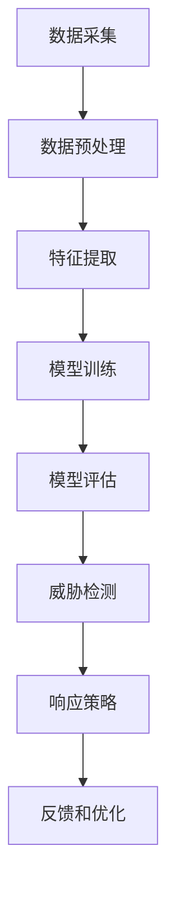

                 

### 提高AI模型在复杂网络安全态势感知中的实时响应能力

#### 关键词：AI模型、网络安全、态势感知、实时响应、深度学习

> 摘要：本文深入探讨了提高AI模型在复杂网络安全态势感知中的实时响应能力。首先，通过分析网络安全态势感知的重要性，阐述了AI模型在网络安全中的关键作用。接着，本文详细讲解了实时响应能力的重要性及其关键要素，提出了提高AI模型实时响应能力的策略。随后，文章对AI模型和深度学习的关键概念进行了深入阐述，并通过具体算法原理讲解，展示了如何通过算法优化提升实时响应能力。最后，文章详细介绍了系统分析与架构设计方案，以及实际应用中的实战案例，为提升AI模型在网络安全态势感知中的实时响应能力提供了切实可行的解决方案。

### 第一部分：问题背景与核心概念

#### 第1章：问题背景与核心概念

#### 1.1 复杂网络安全态势感知的重要性

在当今数字化时代，网络攻击的频率和复杂性日益增加，传统基于规则的方法已经难以应对日益变化的网络威胁。复杂网络安全态势感知（Cybersecurity Situational Awareness, CSA）作为一种新兴的网络安全技术，旨在通过实时监测、分析和预测网络威胁，为网络安全决策提供有力支持。复杂网络安全态势感知不仅能够帮助组织快速识别和响应网络威胁，还能提高其整体安全防护能力。

随着云计算、物联网、人工智能等技术的普及，网络安全环境变得更加复杂。网络攻击手段层出不穷，从简单的DDoS攻击到复杂的APT（高级持续性威胁），网络安全形势日益严峻。在这种背景下，提高AI模型在复杂网络安全态势感知中的实时响应能力，成为了当前网络安全领域亟待解决的重要问题。

#### 1.1.1 网络安全威胁的复杂性日益增加

网络安全威胁的复杂性主要表现在以下几个方面：

1. **新型攻击手段层出不穷**：随着技术的不断进步，黑客们利用新的技术手段进行网络攻击，如勒索软件、鱼叉式钓鱼、零日漏洞利用等。
2. **攻击目标多样性**：从个人隐私数据到企业核心业务数据，再到国家关键基础设施，攻击目标范围不断扩大。
3. **攻击手段隐蔽性增强**：许多攻击活动采用隐蔽的手段，如利用合法权限进行操作、隐藏在大量正常流量中，使得检测和防御难度加大。
4. **威胁变化速度快**：网络威胁不断演变，新的攻击方式层出不穷，传统的防护手段难以有效应对。

#### 1.1.2 复杂网络安全态势感知的必要性

面对日益复杂的网络安全威胁，传统基于规则的方法已经显得力不从心。复杂网络安全态势感知通过以下方式，提高了网络安全的防护能力：

1. **全面感知**：态势感知系统可以实时监测网络流量、用户行为、系统日志等数据，实现对网络态势的全面感知。
2. **自动化分析**：利用人工智能和大数据分析技术，对海量数据进行自动化分析，快速识别潜在威胁。
3. **实时响应**：态势感知系统能够对检测到的威胁进行实时响应，采取相应的防御措施。
4. **持续优化**：通过不断学习和优化，态势感知系统能够不断提高其检测和响应能力。

#### 1.1.3 提高AI模型实时响应能力的重要性

AI模型在复杂网络安全态势感知中发挥着至关重要的作用。通过机器学习和深度学习技术，AI模型能够从海量数据中学习到网络攻击的特征，从而实现威胁的自动识别和响应。提高AI模型实时响应能力的重要性体现在以下几个方面：

1. **快速响应**：实时响应能力能够使AI模型在检测到威胁时立即采取行动，减少潜在的损失。
2. **降低误报率**：通过优化算法和提高模型准确性，降低误报率，提高系统的整体效率。
3. **提高自动化水平**：实时响应能力提高了系统的自动化程度，减少了人工干预的需求，提高了工作效率。
4. **适应新型威胁**：随着网络威胁的不断发展，实时响应能力使AI模型能够迅速适应新型威胁，提高整体防护能力。

#### 1.2 AI模型在网络安全中的应用

AI模型在网络安全中的应用广泛，主要包括以下方面：

1. **威胁检测**：利用机器学习和深度学习技术，AI模型可以自动识别网络中的异常行为和潜在威胁。
2. **入侵防御**：AI模型可以通过预测攻击模式和攻击路径，为入侵防御系统提供决策支持。
3. **漏洞扫描**：AI模型可以分析系统日志和配置文件，发现潜在的安全漏洞。
4. **用户行为分析**：AI模型可以分析用户行为，识别恶意用户行为，提高用户安全防护能力。
5. **威胁情报分析**：AI模型可以分析网络威胁情报，预测未来可能的威胁，为安全决策提供支持。

#### 1.2.1 AI模型的基本原理

AI模型，尤其是机器学习和深度学习模型，基于以下基本原理：

1. **数据驱动**：AI模型通过学习大量数据，自动提取特征并建立模型。
2. **自适应性**：AI模型能够根据新的数据和经验不断优化自身，提高预测准确性。
3. **非线性处理**：深度学习模型能够通过多层神经网络，实现复杂的非线性处理能力。
4. **并行计算**：AI模型可以利用并行计算技术，提高处理速度和效率。

#### 1.2.2 AI模型在网络安全中的挑战

尽管AI模型在网络安全中具有巨大潜力，但其在实际应用中也面临以下挑战：

1. **数据质量**：AI模型依赖于高质量的数据进行训练，但网络安全数据往往存在噪声和缺失。
2. **模型解释性**：深度学习模型通常具有较低的透明度和解释性，难以理解和解释其决策过程。
3. **计算资源**：深度学习模型通常需要大量的计算资源和时间进行训练和推理。
4. **适应性和泛化能力**：AI模型需要能够适应新的攻击模式和威胁，提高其泛化能力。

#### 1.2.3 AI模型在网络安全态势感知中的应用

AI模型在网络安全态势感知中的应用主要包括以下几个方面：

1. **异常检测**：利用监督学习和无监督学习技术，AI模型可以识别网络流量中的异常行为，提高态势感知的准确性。
2. **行为分析**：通过分析用户行为，AI模型可以识别恶意用户行为，提高网络安全防护能力。
3. **威胁预测**：利用机器学习和深度学习技术，AI模型可以预测未来的网络威胁，为安全决策提供支持。
4. **威胁情报分析**：AI模型可以分析网络威胁情报，识别潜在的威胁来源和传播路径。

#### 1.3 实时响应能力的关键要素

实时响应能力是AI模型在网络安全态势感知中至关重要的一环。它包括以下几个关键要素：

1. **响应时间**：响应时间是指从检测到威胁到采取行动的时间。降低响应时间可以提高威胁应对的效率。
2. **精度和召回率**：精度和召回率是评估AI模型性能的两个重要指标。高精度可以减少误报，高召回率可以确保不遗漏任何威胁。
3. **可靠性和稳定性**：AI模型需要具备高可靠性和稳定性，能够持续地提供准确的威胁检测和响应。
4. **自动化程度**：高自动化程度的响应系统能够减少人工干预，提高工作效率。

#### 1.3.1 实时性的概念

实时性是指系统能够在规定的时间内完成特定任务的能力。在网络安全态势感知中，实时性意味着系统能够在威胁发生时迅速检测和响应，防止潜在损失。

#### 1.3.2 响应能力的评价指标

响应能力的评价指标主要包括响应时间、精度、召回率、可靠性和稳定性等。这些指标反映了AI模型在复杂网络安全态势感知中的性能。

1. **响应时间**：响应时间是指从检测到威胁到采取行动的时间。低响应时间意味着更高的实时性。
2. **精度**：精度是指检测到威胁中的实际威胁数量与总威胁数量之比。高精度意味着更少的误报。
3. **召回率**：召回率是指实际威胁中被检测到的比例。高召回率意味着更少的漏报。
4. **可靠性**：可靠性是指AI模型在长期运行中保持稳定和准确的能力。
5. **稳定性**：稳定性是指AI模型在面对不同威胁和变化时，仍能保持良好的性能。

#### 1.3.3 提高实时响应能力的策略

为了提高AI模型在复杂网络安全态势感知中的实时响应能力，可以采取以下策略：

1. **算法优化**：通过优化算法，提高模型的计算效率，减少响应时间。
2. **数据预处理**：通过数据预处理，提高数据质量，减少噪声和缺失，提高模型性能。
3. **模型压缩**：通过模型压缩技术，降低模型的大小和计算复杂度，提高实时响应能力。
4. **分布式计算**：通过分布式计算，利用多台服务器和并行处理技术，提高计算速度和效率。
5. **自动化响应**：通过自动化响应，减少人工干预，提高响应速度和效率。

### 第二部分：核心概念与联系

#### 第2章：核心概念与联系

#### 2.1 AI模型关键概念

在讨论提高AI模型在复杂网络安全态势感知中的实时响应能力时，理解AI模型的关键概念至关重要。本节将详细介绍神经网络和深度学习等基本概念。

##### 2.1.1 神经网络

神经网络（Neural Networks, NN）是模仿人脑神经元结构和功能的一种计算模型。它由多个相互连接的神经元组成，每个神经元都可以接收输入信号并产生输出信号。神经网络的基本结构包括输入层、隐藏层和输出层。

###### 2.1.1.1 神经网络的基本结构

神经网络的基本结构包括以下几个部分：

1. **输入层**：接收外部输入信号，每个输入信号对应一个神经元。
2. **隐藏层**：一个或多个隐藏层，每个隐藏层的神经元接收前一层的输出作为输入。
3. **输出层**：产生最终输出信号，用于实现特定的任务。

神经网络的工作原理是通过前向传播和反向传播两个过程来学习输入和输出之间的映射关系。在训练过程中，神经网络通过不断调整权重和偏置，优化输出结果，提高模型的准确性。

###### 2.1.1.2 神经网络的工作原理

神经网络的工作原理可以分为以下几个步骤：

1. **前向传播**：输入信号从输入层传递到隐藏层，再传递到输出层。每个神经元将接收到的输入信号与权重相乘并加上偏置，然后通过激活函数（如Sigmoid、ReLU等）进行非线性变换，产生输出信号。
2. **计算损失**：将输出层的实际输出与预期输出进行比较，计算损失函数（如均方误差、交叉熵等），衡量模型预测与真实结果之间的差距。
3. **反向传播**：将损失函数关于每个神经元的权重和偏置进行梯度计算，通过反向传播将误差信号从输出层传递到隐藏层，并更新权重和偏置。
4. **迭代优化**：重复前向传播和反向传播的过程，逐步减小损失函数，优化模型的参数。

通过不断的迭代优化，神经网络逐渐学会从输入中提取有用的特征，并生成准确的输出。

###### 2.1.1.3 神经网络的优缺点

神经网络具有以下优点：

1. **强大的非线性建模能力**：神经网络可以通过多层非线性变换，模拟复杂的数据分布和关系。
2. **自动特征提取**：神经网络可以自动从数据中学习特征，减少人工特征工程的需求。
3. **灵活性和适应性**：神经网络可以应用于各种领域和任务，具有较强的适应能力。

然而，神经网络也存在一些缺点：

1. **计算复杂度高**：神经网络训练过程需要大量的计算资源和时间。
2. **解释性差**：神经网络内部的决策过程通常难以解释，增加了模型的可信度问题。
3. **过拟合风险**：神经网络在面对大量训练数据时，容易发生过拟合现象，降低模型的泛化能力。

##### 2.1.2 深度学习

深度学习（Deep Learning, DL）是一种基于多层神经网络的机器学习技术，通过构建多层的神经网络，实现对复杂数据的深度学习和表征。深度学习在图像识别、语音识别、自然语言处理等领域取得了显著成果，为AI模型在复杂网络安全态势感知中的应用提供了强有力的支持。

###### 2.1.2.1 深度学习的基本原理

深度学习的基本原理主要包括以下几个方面：

1. **层次化特征学习**：深度学习通过多层神经网络，逐层提取数据的特征，形成层次化的特征表示。底层特征通常表示基本的数据属性，而高层特征则表示更抽象和复杂的特征。
2. **端到端的建模**：深度学习采用端到端的建模方式，将输入直接映射到输出，减少了中间环节，提高了模型的效率和准确性。
3. **大量数据训练**：深度学习依赖于大量的数据进行训练，通过大规模数据的学习，模型能够更好地适应不同的数据分布和特征。
4. **非线性变换**：深度学习通过多层非线性变换，增强了对复杂数据的建模能力，提高了模型的性能。

深度学习的工作流程通常包括以下几个步骤：

1. **数据预处理**：对输入数据进行预处理，如归一化、去噪等，以提高模型的训练效果。
2. **模型构建**：根据任务需求，构建合适的深度学习模型，包括网络结构、激活函数、损失函数等。
3. **模型训练**：使用训练数据进行模型训练，通过前向传播和反向传播，逐步优化模型的参数，减小损失函数。
4. **模型评估**：使用验证集和测试集对训练好的模型进行评估，通过精度、召回率等指标，评估模型的性能。
5. **模型部署**：将训练好的模型部署到实际应用场景中，实现模型的实时应用。

###### 2.1.2.2 深度学习在AI模型中的应用

深度学习在AI模型中的应用广泛，主要包括以下几个方面：

1. **图像识别**：通过卷积神经网络（Convolutional Neural Networks, CNN）等深度学习模型，可以实现高效、准确的图像识别任务。
2. **语音识别**：通过循环神经网络（Recurrent Neural Networks, RNN）等深度学习模型，可以实现高精度的语音识别任务。
3. **自然语言处理**：通过深度学习模型，如长短时记忆网络（Long Short-Term Memory, LSTM）、变换器（Transformer）等，可以实现复杂自然语言处理任务。
4. **推荐系统**：通过深度学习模型，如自动编码器（Autoencoder）、生成对抗网络（Generative Adversarial Networks, GAN）等，可以实现高效的推荐系统。

###### 2.1.2.3 深度学习的挑战与解决方案

尽管深度学习在许多领域取得了显著成果，但其在实际应用中也面临以下挑战：

1. **计算资源需求**：深度学习模型通常需要大量的计算资源和时间进行训练和推理，这对硬件设施提出了较高的要求。
2. **数据质量**：深度学习模型依赖于高质量的数据进行训练，但数据质量直接影响模型的性能。
3. **模型解释性**：深度学习模型通常具有较低的透明度和解释性，难以理解和解释其决策过程。
4. **泛化能力**：深度学习模型在面对新数据和未知任务时，可能存在泛化能力不足的问题。

针对这些挑战，可以采取以下解决方案：

1. **硬件加速**：利用GPU、TPU等硬件加速器，提高深度学习模型的计算速度和效率。
2. **数据增强**：通过数据增强技术，增加训练数据多样性，提高模型的泛化能力。
3. **可解释性增强**：通过模型可视化、解释性算法等手段，提高深度学习模型的透明度和解释性。
4. **迁移学习**：通过迁移学习，利用预训练模型在新数据上进行微调，提高模型的泛化能力。

#### 2.2 网络安全态势感知

网络安全态势感知（Cybersecurity Situational Awareness, CSA）是一种通过实时监测、分析和评估网络安全态势，为安全决策提供支持的技术。它旨在帮助组织全面了解网络环境，及时发现和应对潜在的安全威胁。

##### 2.2.1 态势感知的定义

网络安全态势感知可以定义为一种实时、动态地感知和分析网络安全状态的过程。它通过以下方式实现：

1. **数据采集**：从各种数据源（如网络流量、系统日志、用户行为等）收集数据。
2. **数据处理**：对采集到的数据进行预处理、分析和融合，提取有用的特征和模式。
3. **威胁评估**：根据分析结果，评估当前网络环境的威胁水平，识别潜在的安全事件。
4. **决策支持**：基于威胁评估结果，为安全决策提供支持，采取相应的防御措施。

##### 2.2.1.1 网络安全态势感知的基本概念

网络安全态势感知的基本概念包括以下几个方面：

1. **态势**：态势是指网络环境的当前状态，包括网络流量、系统状态、用户行为等。
2. **感知**：感知是指通过监测和分析数据，获取网络环境的实时状态信息。
3. **分析**：分析是指对收集到的数据进行处理，提取特征和模式，评估网络威胁。
4. **评估**：评估是指根据分析结果，评估网络环境的威胁水平，确定安全事件的优先级。
5. **决策**：决策是指基于评估结果，采取相应的防御措施，提高网络安全性。

##### 2.2.1.2 态势感知的基本流程

网络安全态势感知的基本流程包括以下几个步骤：

1. **数据采集**：从各种数据源（如网络设备、服务器、终端等）收集数据，包括网络流量、系统日志、用户行为等。
2. **数据预处理**：对采集到的数据进行预处理，包括去噪、清洗、归一化等，以提高数据质量和模型的性能。
3. **特征提取**：从预处理后的数据中提取有用的特征，如流量模式、行为特征等，用于训练和评估模型。
4. **模型训练**：使用训练数据，构建和训练分类模型，如决策树、支持向量机、神经网络等。
5. **模型评估**：使用验证集和测试集，对训练好的模型进行评估，通过精度、召回率等指标，评估模型的性能。
6. **威胁评估**：基于模型评估结果，对网络环境进行威胁评估，识别潜在的安全事件。
7. **决策支持**：根据威胁评估结果，为安全决策提供支持，采取相应的防御措施，如隔离、阻止、报警等。
8. **反馈和优化**：将决策结果反馈到系统中，持续优化模型和策略，提高态势感知的准确性。

##### 2.2.2 态势感知的关键要素

网络安全态势感知的关键要素包括以下几个方面：

1. **数据采集**：数据采集是态势感知的基础，需要从各种数据源收集丰富的数据，包括网络流量、系统日志、用户行为等。
2. **数据处理**：数据处理包括数据预处理、特征提取等，对采集到的数据进行处理，提取有用的特征和模式。
3. **模型训练**：使用训练数据，构建和训练分类模型，如决策树、支持向量机、神经网络等，用于识别和预测潜在的安全事件。
4. **威胁评估**：根据模型评估结果，对网络环境进行威胁评估，识别潜在的安全事件。
5. **决策支持**：基于威胁评估结果，为安全决策提供支持，采取相应的防御措施。
6. **反馈和优化**：将决策结果反馈到系统中，持续优化模型和策略，提高态势感知的准确性。

##### 2.2.2.1 数据采集

数据采集是网络安全态势感知的关键环节，直接影响到态势感知系统的性能和准确性。数据采集主要包括以下几个方面：

1. **网络流量采集**：通过网络流量监控设备，如防火墙、入侵检测系统（IDS）、入侵防御系统（IPS）等，实时采集网络流量数据，包括流量大小、源IP、目的IP、端口号等。
2. **系统日志采集**：从各种系统设备（如服务器、网络设备、终端等）中采集系统日志，包括登录日志、操作日志、错误日志等，用于分析系统状态和异常行为。
3. **用户行为采集**：通过监控用户行为，如登录行为、文件操作行为、网络访问行为等，分析用户行为特征，识别异常行为和潜在威胁。
4. **威胁情报采集**：从威胁情报源（如公共威胁情报平台、安全厂商情报等）中采集最新的威胁情报，包括恶意IP地址、恶意域名、恶意软件样本等，用于更新模型和策略。

##### 2.2.2.2 数据分析

数据分析是网络安全态势感知的核心环节，通过对采集到的数据进行处理和分析，提取有用的特征和模式，用于识别和预测潜在的安全事件。数据分析主要包括以下几个方面：

1. **异常检测**：通过统计分析和机器学习技术，对网络流量、系统日志、用户行为等数据进行分析，识别异常行为和潜在威胁。
2. **关联分析**：通过关联分析技术，将不同数据源中的数据进行关联，发现潜在的安全事件和威胁路径。
3. **威胁预测**：通过机器学习和深度学习技术，对历史数据进行学习，预测未来的安全威胁和事件趋势。
4. **可视化分析**：通过可视化技术，将分析结果以图形化形式展示，帮助安全人员快速理解和决策。

##### 2.2.2.3 威胁评估

威胁评估是网络安全态势感知的重要环节，通过对分析结果进行评估，确定当前网络环境的威胁水平和风险等级，为安全决策提供支持。威胁评估主要包括以下几个方面：

1. **威胁分类**：根据威胁的特征和属性，对识别出的威胁进行分类，如恶意软件、网络攻击、钓鱼攻击等。
2. **威胁评级**：根据威胁的严重程度和影响范围，对识别出的威胁进行评级，如低级威胁、中级威胁、高级威胁等。
3. **风险分析**：结合威胁分类和评级结果，对识别出的威胁进行风险评估，确定其对网络环境的影响和潜在损失。
4. **响应策略**：根据威胁评估结果，制定相应的响应策略，如隔离、阻止、报警等，提高网络安全性。

##### 2.2.2.4 响应策略

响应策略是网络安全态势感知的最终目标，通过对识别出的威胁采取相应的防御措施，降低网络风险和损失。响应策略主要包括以下几个方面：

1. **自动防御**：通过自动化防御技术，如防火墙、入侵检测系统（IDS）、入侵防御系统（IPS）等，自动阻止和拦截恶意流量和攻击。
2. **人工干预**：在自动化防御无法解决问题时，需要人工干预，如隔离受感染的系统、清除恶意软件等。
3. **应急响应**：在重大安全事件发生时，启动应急响应计划，采取紧急措施，如断网、报警等，保护关键系统和数据。
4. **持续优化**：通过不断学习和优化，提高态势感知系统的性能和准确性，持续提高网络安全性。

#### 2.3 实时响应能力

实时响应能力是网络安全态势感知的关键要素之一，它直接关系到网络安全的效率和效果。实时响应能力是指系统能够在短时间内检测到安全威胁，并采取相应的防御措施，以减少潜在的损失。实时响应能力在网络安全中具有重要意义，体现在以下几个方面：

1. **快速响应**：在威胁检测到后，系统能够立即采取行动，减少威胁的传播和影响范围。
2. **减少误报**：通过优化算法和提高模型准确性，降低误报率，提高系统的整体效率。
3. **自动化程度**：高自动化程度的响应系统能够减少人工干预，提高工作效率，降低运营成本。
4. **适应新型威胁**：实时响应能力使系统能够迅速适应新型威胁，提高整体防护能力。

##### 2.3.1 实时响应能力的概念

实时响应能力是指网络安全系统能够在规定的时间内检测到安全威胁，并采取相应的防御措施。实时响应能力主要包括以下几个方面：

1. **响应时间**：响应时间是指从检测到威胁到采取行动的时间。响应时间越短，说明系统的实时性越好。
2. **准确性**：准确性是指系统能够正确检测到威胁的比例。高准确性可以减少误报，提高系统的可靠性。
3. **自动化程度**：自动化程度是指系统能够自动执行防御措施，减少人工干预。高自动化程度可以提高工作效率，降低运营成本。
4. **适应性和泛化能力**：适应性和泛化能力是指系统能够适应不同的威胁和场景，提高其整体防护能力。

##### 2.3.1.1 实时响应的定义

实时响应是指在规定的时间内，系统能够检测到安全威胁，并采取相应的防御措施，以保护网络环境的安全。实时响应的定义主要包括以下几个方面：

1. **时间约束**：实时响应要求在规定的时间内（如秒级、分钟级）完成威胁检测和响应。
2. **准确性要求**：实时响应要求系统能够准确检测到威胁，减少误报和漏报。
3. **自动化要求**：实时响应要求系统能够自动执行防御措施，减少人工干预。
4. **可扩展性要求**：实时响应要求系统能够适应不同的网络规模和威胁类型，提高其可扩展性。

##### 2.3.1.2 实时响应的重要性

实时响应在网络安全中具有重要意义，主要体现在以下几个方面：

1. **降低损失**：实时响应能够迅速检测和应对安全威胁，减少潜在的损失和风险。
2. **提高安全性**：实时响应能够提高网络环境的安全性，防止威胁的传播和扩散。
3. **减少误报和漏报**：实时响应通过优化算法和提高模型准确性，减少误报和漏报，提高系统的整体效率。
4. **提高自动化程度**：实时响应能够提高自动化程度，减少人工干预，提高工作效率，降低运营成本。
5. **适应新型威胁**：实时响应能够迅速适应新型威胁，提高整体防护能力，应对不断变化的网络安全形势。

##### 2.3.2 实时响应能力的评价指标

实时响应能力的评价指标主要包括响应时间、精度、召回率、可靠性和稳定性等。这些指标反映了实时响应能力的性能和效果。

1. **响应时间**：响应时间是指从检测到威胁到采取行动的时间。响应时间越短，说明系统的实时性越好。响应时间通常以秒级或分钟级来衡量。
2. **精度**：精度是指检测到威胁中的实际威胁数量与总威胁数量之比。高精度意味着更少的误报。精度通常以百分比来衡量。
3. **召回率**：召回率是指实际威胁中被检测到的比例。高召回率意味着更少的漏报。召回率通常以百分比来衡量。
4. **可靠性**：可靠性是指系统在长期运行中保持稳定和准确的能力。高可靠性意味着系统不易出现故障或误报。
5. **稳定性**：稳定性是指系统在面对不同威胁和变化时，仍能保持良好的性能。高稳定性意味着系统能够适应各种复杂场景。

#### 2.3.3 提高实时响应能力的策略

为了提高实时响应能力，可以采取以下策略：

1. **算法优化**：通过优化算法，提高模型的计算效率，减少响应时间。例如，可以使用更高效的算法或模型结构，降低计算复杂度。
2. **数据预处理**：通过数据预处理，提高数据质量，减少噪声和缺失，提高模型性能。例如，可以使用去噪、归一化等技术，提高数据的准确性和完整性。
3. **模型压缩**：通过模型压缩技术，降低模型的大小和计算复杂度，提高实时响应能力。例如，可以使用模型剪枝、量化等技术，减少模型参数和计算量。
4. **分布式计算**：通过分布式计算，利用多台服务器和并行处理技术，提高计算速度和效率。例如，可以使用集群计算、GPU加速等技术，提高模型的计算能力。
5. **自动化响应**：通过自动化响应，减少人工干预，提高响应速度和效率。例如，可以使用自动化工具或脚本，实现自动化的威胁检测和响应。

### 第三部分：算法原理讲解

#### 第3章：算法原理讲解

在提高AI模型在复杂网络安全态势感知中的实时响应能力的过程中，理解相关算法的原理至关重要。本章节将详细讲解AI模型在网络安全态势感知中的应用，包括实时响应算法的基本原理和流程。

##### 3.1 算法概述

在网络安全态势感知中，AI模型的应用主要体现在以下几个方面：

1. **威胁检测**：通过机器学习和深度学习技术，AI模型可以自动识别网络流量、系统日志等数据中的异常行为和潜在威胁。
2. **入侵防御**：AI模型可以预测攻击模式和攻击路径，为入侵防御系统提供决策支持，提高网络的防御能力。
3. **漏洞扫描**：AI模型可以分析系统日志和配置文件，发现潜在的安全漏洞，为安全防护提供依据。
4. **用户行为分析**：AI模型可以分析用户行为，识别恶意用户行为，提高用户安全防护能力。
5. **威胁情报分析**：AI模型可以分析网络威胁情报，预测未来可能的威胁，为安全决策提供支持。

##### 3.1.1 AI模型在网络安全态势感知中的应用

AI模型在网络安全态势感知中的应用主要基于以下技术：

1. **机器学习**：机器学习技术通过从历史数据中学习，构建预测模型，用于识别和预测网络威胁。
2. **深度学习**：深度学习技术通过多层神经网络，实现对复杂数据的深度学习和表征，提高威胁检测的准确性和效率。
3. **图神经网络**：图神经网络通过将网络数据表示为图结构，学习网络中的节点和边的关系，用于识别复杂的网络攻击。
4. **强化学习**：强化学习技术通过探索和利用策略，优化安全防御策略，提高网络安全防护能力。

##### 3.1.2 实时响应算法的基本原理

实时响应算法的基本原理包括以下几个方面：

1. **数据采集**：从各种数据源（如网络流量、系统日志、用户行为等）收集数据。
2. **数据预处理**：对采集到的数据进行预处理，包括去噪、清洗、归一化等，以提高数据质量。
3. **特征提取**：从预处理后的数据中提取有用的特征，用于训练和评估模型。
4. **模型训练**：使用训练数据，构建和训练分类模型，如决策树、支持向量机、神经网络等。
5. **模型评估**：使用验证集和测试集，对训练好的模型进行评估，通过精度、召回率等指标，评估模型的性能。
6. **威胁检测**：将模型应用于实时数据，检测网络中的异常行为和潜在威胁。
7. **响应策略**：根据检测到的威胁，采取相应的响应策略，如隔离、阻止、报警等。
8. **反馈和优化**：将响应结果反馈到系统中，持续优化模型和策略，提高实时响应能力。

##### 3.2 算法流程

实时响应算法的流程可以分为以下几个步骤：

1. **数据采集**：从网络流量、系统日志、用户行为等数据源中收集数据。这些数据包括流量统计信息、系统日志记录、用户活动记录等。



2. **数据预处理**：对采集到的数据进行预处理，包括数据清洗、去噪、归一化等操作，以提高数据质量和模型的训练效果。

3. **特征提取**：从预处理后的数据中提取有用的特征，用于训练和评估模型。特征提取是提高模型性能的关键步骤，通常包括统计特征、时序特征、频率特征等。

4. **模型训练**：使用训练数据，构建和训练分类模型。常见的分类模型包括决策树、支持向量机、神经网络等。训练过程通过前向传播和反向传播，不断调整模型的参数，优化输出结果。

5. **模型评估**：使用验证集和测试集，对训练好的模型进行评估。评估指标包括精度、召回率、F1分数等，用于衡量模型的性能。

6. **威胁检测**：将训练好的模型应用于实时数据，检测网络中的异常行为和潜在威胁。威胁检测是实时响应算法的核心步骤，通过模型输出结果，判断网络流量是否正常。

7. **响应策略**：根据检测到的威胁，采取相应的响应策略。响应策略包括隔离、阻止、报警等，旨在减少潜在的损失和风险。

8. **反馈和优化**：将响应结果反馈到系统中，持续优化模型和策略。通过不断迭代，提高实时响应能力，应对不断变化的网络安全形势。

##### 3.2.1 数据预处理

数据预处理是实时响应算法的重要步骤，直接影响到模型的训练效果和性能。数据预处理主要包括以下几个步骤：

1. **数据清洗**：数据清洗是指去除数据中的噪声和错误，提高数据质量。常见的数据清洗方法包括去除重复记录、填充缺失值、纠正错误值等。

2. **去噪**：去噪是指去除数据中的噪声，提高数据的准确性。去噪方法包括滤波、平滑、去卷积等，根据不同类型的数据选择合适的去噪方法。

3. **归一化**：归一化是指将不同尺度的数据进行标准化处理，使其具有相同的量纲和范围。常见的归一化方法包括最小-最大规范化、Z-score规范化等。

4. **特征选择**：特征选择是指从大量特征中选择出对模型性能有显著影响的关键特征。特征选择方法包括过滤式、包裹式、嵌入式等，根据实际情况选择合适的方法。

5. **特征提取**：特征提取是指从原始数据中提取有用的特征，用于训练和评估模型。特征提取方法包括统计特征、时序特征、频率特征等，根据数据类型和任务需求选择合适的特征提取方法。

##### 3.2.2 模型训练

模型训练是实时响应算法的核心步骤，通过训练数据学习到网络威胁的特征和模式，提高模型的预测性能。模型训练主要包括以下几个步骤：

1. **模型选择**：根据任务需求和数据特点，选择合适的机器学习模型。常见的模型包括线性模型、决策树、支持向量机、神经网络等。

2. **数据划分**：将数据集划分为训练集、验证集和测试集。训练集用于训练模型，验证集用于调整模型参数，测试集用于评估模型性能。

3. **模型训练**：使用训练集数据，通过前向传播和反向传播，不断调整模型的参数，优化输出结果。训练过程中，可以使用优化算法（如梯度下降、随机梯度下降等）和正则化技术（如L1正则化、L2正则化等），提高模型的泛化能力。

4. **模型评估**：使用验证集和测试集，对训练好的模型进行评估。评估指标包括精度、召回率、F1分数等，用于衡量模型的性能。通过交叉验证和网格搜索等技术，优化模型参数，提高模型性能。

5. **模型优化**：根据评估结果，对模型进行优化和调整。优化方法包括模型剪枝、量化、模型融合等，以提高模型的效率和准确性。

##### 3.2.3 实时响应

实时响应是实时响应算法的关键步骤，旨在快速检测和应对网络威胁，提高网络安全态势感知的能力。实时响应主要包括以下几个步骤：

1. **威胁检测**：将训练好的模型应用于实时数据，检测网络中的异常行为和潜在威胁。威胁检测可以通过模型输出结果，判断网络流量是否正常。

2. **响应策略**：根据检测到的威胁，采取相应的响应策略。常见的响应策略包括隔离、阻止、报警等。响应策略的选择取决于威胁的严重程度和影响范围。

3. **响应执行**：执行响应策略，如隔离受感染的系统、阻止恶意流量等。响应执行可以通过自动化工具或脚本实现，提高响应速度和效率。

4. **响应反馈**：将响应结果反馈到系统中，用于优化和调整模型和策略。通过不断迭代，提高实时响应能力，应对不断变化的网络安全形势。

##### 3.2.4 响应效果评估

响应效果评估是实时响应算法的重要环节，用于评估响应策略的有效性和性能。响应效果评估主要包括以下几个步骤：

1. **响应效果指标**：定义响应效果指标，如响应时间、准确性、召回率等。响应时间是指从检测到威胁到采取行动的时间；准确性是指检测到威胁中的实际威胁数量与总威胁数量之比；召回率是指实际威胁中被检测到的比例。

2. **实际案例分析**：收集实际案例分析数据，评估响应策略的效果。实际案例分析可以包括检测到的威胁类型、响应时间、准确性等指标。

3. **效果评估方法**：使用统计分析和机器学习技术，评估响应策略的效果。常见的评估方法包括交叉验证、ROC曲线、精度-召回率曲线等。

4. **优化和调整**：根据评估结果，对响应策略进行优化和调整。优化方法包括调整响应阈值、优化响应算法、引入新的响应策略等，以提高响应效果。

##### 3.3 数学模型与公式

在实时响应算法中，数学模型和公式是理解和实现算法的关键。以下将介绍神经网络、深度学习和实时响应相关的数学模型和公式。

###### 3.3.1 神经网络数学模型

神经网络的数学模型主要包括前向传播和反向传播两个过程。

1. **前向传播**

前向传播是指将输入数据通过神经网络传递到输出层的计算过程。其计算公式如下：

$$
Z_{l} = \sum_{i=1}^{n} W_{li} X_{i} + b_{l}
$$

其中，$Z_{l}$表示第l层的输出，$W_{li}$表示第l层中第i个神经元的权重，$X_{i}$表示第i个输入特征，$b_{l}$表示第l层的偏置。

2. **反向传播**

反向传播是指根据输出层的误差信号，反向传播到前一层，并更新权重和偏置的计算过程。其计算公式如下：

$$
\Delta{W_{li}} = \alpha \cdot \frac{\partial{J}}{\partial{W_{li}}}
$$

$$
\Delta{b_{l}} = \alpha \cdot \frac{\partial{J}}{\partial{b_{l}}}
$$

其中，$\Delta{W_{li}}$和$\Delta{b_{l}}$分别表示第l层中第i个神经元的权重和偏置的更新值，$\alpha$表示学习率，$J$表示损失函数。

###### 3.3.2 深度学习数学模型

深度学习是基于多层神经网络的计算模型，其数学模型主要包括神经网络结构、损失函数、优化算法等。

1. **神经网络结构**

深度学习神经网络结构包括输入层、隐藏层和输出层。每个层由多个神经元组成，神经元之间通过权重和偏置进行连接。

2. **损失函数**

损失函数用于衡量模型输出与真实结果之间的差距，常见的损失函数包括均方误差（MSE）、交叉熵（Cross-Entropy）等。

3. **优化算法**

优化算法用于更新模型参数，以减小损失函数。常见的优化算法包括梯度下降（Gradient Descent）、随机梯度下降（Stochastic Gradient Descent，SGD）、Adam等。

###### 3.3.3 实时响应数学模型

实时响应的数学模型主要包括威胁检测模型和响应策略模型。

1. **威胁检测模型**

威胁检测模型基于机器学习和深度学习技术，用于检测网络中的异常行为和潜在威胁。其数学模型包括特征提取、分类模型等。

2. **响应策略模型**

响应策略模型根据检测到的威胁，制定相应的响应策略。其数学模型包括响应阈值、响应策略等。

### 第四部分：系统分析与架构设计方案

#### 第4章：系统分析与架构设计方案

在提升AI模型在复杂网络安全态势感知中的实时响应能力的过程中，系统分析与架构设计至关重要。本章节将详细介绍系统分析与架构设计方案，包括问题场景介绍、系统功能设计、系统架构设计和系统接口设计。

##### 4.1 问题场景介绍

当前，随着网络攻击手段的日益复杂化，传统的基于规则的安全防御机制已经难以应对。复杂的网络安全威胁包括高级持续性威胁（APT）、分布式拒绝服务攻击（DDoS）、恶意软件等。这些威胁往往具有隐蔽性、多变性和突发性，给网络安全态势感知带来了极大的挑战。为了提高网络的安全性，我们需要一个具备高效实时响应能力的AI模型，能够在检测到潜在威胁时迅速采取行动，以防止威胁的扩散和损失。

##### 4.1.1 网络安全态势感知的挑战

1. **数据量庞大**：网络流量、系统日志、用户行为等数据量庞大，如何高效地处理和提取有用信息是关键挑战。
2. **威胁多变**：网络威胁不断演变，传统的威胁特征库难以涵盖所有可能的攻击方式。
3. **实时性要求高**：在威胁发生时，需要能够迅速检测并响应，以减少潜在的损失。
4. **模型解释性**：深度学习模型具有较低的透明度，难以解释其决策过程，增加了安全人员的信任难度。

##### 4.1.2 实时响应能力的提升需求

1. **快速检测**：在威胁发生时，能够迅速识别和定位，减少响应时间。
2. **高准确率**：减少误报和漏报，提高威胁检测的准确性。
3. **自动化响应**：减少人工干预，提高响应的自动化程度。
4. **适应性**：能够适应新的威胁类型和攻击方式。

##### 4.2 系统功能设计

系统功能设计是构建高效实时响应AI模型的关键。以下是系统的主要功能模块及其职责：

1. **数据采集模块**：负责从各种数据源（如网络流量、系统日志、用户行为等）收集数据。
2. **数据预处理模块**：对采集到的数据进行分析和清洗，提取有用的特征。
3. **模型训练模块**：基于预处理后的数据，训练和优化AI模型。
4. **威胁检测模块**：使用训练好的模型检测网络中的异常行为和潜在威胁。
5. **响应策略模块**：根据检测到的威胁，制定和执行相应的响应策略。
6. **效果评估模块**：对系统的实时响应能力进行评估和优化。

##### 4.2.1 数据采集模块

数据采集模块是系统的基石，负责从不同的数据源收集数据。主要职责包括：

1. **流量数据采集**：通过网络流量监控设备（如防火墙、入侵检测系统等）采集网络流量数据。
2. **日志数据采集**：从服务器、终端等设备中收集系统日志数据。
3. **用户行为数据采集**：通过监控用户行为（如登录行为、文件操作等）收集用户行为数据。

##### 4.2.2 数据预处理模块

数据预处理模块对采集到的原始数据进行清洗和特征提取，以提高模型训练效果。主要职责包括：

1. **数据清洗**：去除噪声和异常数据，如重复记录、缺失值、错误值等。
2. **数据归一化**：将不同尺度的数据进行标准化处理，使其具有相同的量纲和范围。
3. **特征提取**：从数据中提取有用的特征，如统计特征、时序特征、频率特征等。

##### 4.2.3 模型训练模块

模型训练模块负责基于预处理后的数据，训练和优化AI模型。主要职责包括：

1. **模型选择**：根据任务需求，选择合适的机器学习模型（如决策树、支持向量机、神经网络等）。
2. **模型训练**：使用训练数据，通过前向传播和反向传播，优化模型参数，提高模型性能。
3. **模型评估**：使用验证集和测试集，对训练好的模型进行评估，通过精度、召回率等指标，评估模型性能。

##### 4.2.4 威胁检测模块

威胁检测模块使用训练好的模型，实时检测网络中的异常行为和潜在威胁。主要职责包括：

1. **实时检测**：使用训练好的模型，对实时数据进行威胁检测，识别异常行为和潜在威胁。
2. **响应触发**：当检测到威胁时，触发响应策略，采取相应的防御措施。

##### 4.2.5 响应策略模块

响应策略模块根据检测到的威胁，制定和执行相应的响应策略。主要职责包括：

1. **响应策略制定**：根据威胁类型和严重程度，制定相应的响应策略，如隔离、阻止、报警等。
2. **响应执行**：执行响应策略，如隔离受感染的系统、阻止恶意流量等。
3. **响应记录**：记录响应过程和结果，用于后续分析和优化。

##### 4.2.6 效果评估模块

效果评估模块负责对系统的实时响应能力进行评估和优化。主要职责包括：

1. **效果评估**：使用评估指标（如响应时间、精度、召回率等），对系统的实时响应能力进行评估。
2. **优化调整**：根据评估结果，对系统参数和策略进行调整，提高实时响应能力。

##### 4.3 系统架构设计

系统架构设计是构建高效实时响应AI模型的基础。以下是系统的总体架构设计：

1. **数据流处理**：数据流处理是系统的核心，负责从数据源采集数据，进行预处理、特征提取，然后训练和评估AI模型。
2. **模型训练与优化**：模型训练与优化模块负责基于预处理后的数据，训练和优化AI模型，提高模型性能。
3. **威胁检测与响应**：威胁检测与响应模块负责实时检测网络中的异常行为和潜在威胁，并根据检测结果执行相应的响应策略。
4. **效果评估与反馈**：效果评估与反馈模块负责对系统的实时响应能力进行评估和优化，不断调整和优化系统参数和策略。

##### 4.3.1 系统架构概述

系统的总体架构设计如下：


1. **数据采集模块**：从各种数据源（如网络流量、系统日志、用户行为等）收集数据，将数据传输到数据预处理模块。
2. **数据预处理模块**：对采集到的数据进行清洗、去噪、归一化和特征提取，将处理后的数据传输到模型训练模块。
3. **模型训练模块**：基于预处理后的数据，训练和优化AI模型，将训练好的模型存储到模型库中。
4. **威胁检测模块**：从模型库中加载训练好的模型，对实时数据进行威胁检测，将检测结果传输到响应策略模块。
5. **响应策略模块**：根据检测结果，制定和执行相应的响应策略，如隔离、阻止、报警等。
6. **效果评估模块**：对系统的实时响应能力进行评估，将评估结果反馈到模型训练模块，用于优化和调整系统参数和策略。

##### 4.3.2 数据流处理

数据流处理是系统的核心，负责从数据源采集数据，进行预处理、特征提取，然后训练和评估AI模型。以下是数据流处理的详细步骤：


1. **数据采集**：从网络流量、系统日志、用户行为等数据源中采集数据。
2. **数据清洗**：去除噪声和异常数据，如重复记录、缺失值、错误值等。
3. **数据去噪**：去除数据中的噪声，如随机波动、异常点等。
4. **数据归一化**：将不同尺度的数据进行标准化处理，使其具有相同的量纲和范围。
5. **特征提取**：从数据中提取有用的特征，如统计特征、时序特征、频率特征等。
6. **数据存储**：将处理后的数据存储到数据仓库中，以供后续训练和评估。

##### 4.3.3 模型训练与优化

模型训练与优化模块负责基于预处理后的数据，训练和优化AI模型，提高模型性能。以下是模型训练与优化的详细步骤：


1. **模型选择**：根据任务需求，选择合适的机器学习模型（如决策树、支持向量机、神经网络等）。
2. **数据划分**：将数据集划分为训练集、验证集和测试集，用于训练、验证和评估模型。
3. **模型训练**：使用训练集数据，通过前向传播和反向传播，优化模型参数，提高模型性能。
4. **模型验证**：使用验证集数据，评估模型性能，通过交叉验证、网格搜索等技术，优化模型参数。
5. **模型评估**：使用测试集数据，评估模型性能，通过精度、召回率等指标，评估模型性能。
6. **模型优化**：根据评估结果，对模型进行优化和调整，提高模型性能。

##### 4.3.4 威胁检测与响应

威胁检测与响应模块负责实时检测网络中的异常行为和潜在威胁，并根据检测结果执行相应的响应策略。以下是威胁检测与响应的详细步骤：


1. **威胁检测**：从模型库中加载训练好的模型，对实时数据进行威胁检测，识别异常行为和潜在威胁。
2. **威胁评估**：根据检测结果，评估威胁的严重程度和影响范围。
3. **响应策略制定**：根据威胁类型和严重程度，制定相应的响应策略，如隔离、阻止、报警等。
4. **响应执行**：执行响应策略，如隔离受感染的系统、阻止恶意流量等。
5. **响应记录**：记录响应过程和结果，用于后续分析和优化。

##### 4.4 系统接口设计与交互

系统接口设计与交互是确保系统各模块之间高效协作的关键。以下是系统接口设计及其交互流程：

1. **数据采集接口**：用于从各种数据源（如网络流量、系统日志、用户行为等）采集数据，数据格式为JSON或XML。
2. **数据预处理接口**：用于接收数据采集模块传输的数据，进行清洗、去噪、归一化和特征提取，输出处理后的数据，数据格式为CSV。
3. **模型训练接口**：用于接收预处理后的数据，训练和优化AI模型，输出训练好的模型，数据格式为pickle。
4. **威胁检测接口**：用于加载训练好的模型，对实时数据进行威胁检测，输出检测结果，数据格式为JSON。
5. **响应策略接口**：用于接收威胁检测结果，执行相应的响应策略，输出响应结果，数据格式为JSON。

##### 4.4.1 接口设计

以下是系统接口的设计：

1. **数据采集接口**

   ```python
   @api.route('/collect_data', methods=['POST'])
   def collect_data():
       data = request.get_json()
       # 数据清洗、去噪、归一化和特征提取
       processed_data = preprocess_data(data)
       # 保存处理后的数据
       save_data(processed_data)
       return jsonify({'status': 'success'})
   ```

2. **数据预处理接口**

   ```python
   @api.route('/preprocess_data', methods=['POST'])
   def preprocess_data():
       data = request.get_json()
       # 数据清洗、去噪、归一化和特征提取
       processed_data = preprocess_data(data)
       return jsonify(processed_data)
   ```

3. **模型训练接口**

   ```python
   @api.route('/train_model', methods=['POST'])
   def train_model():
       data = request.get_json()
       # 训练和优化AI模型
       model = train_model(data)
       # 保存训练好的模型
       save_model(model)
       return jsonify({'status': 'success'})
   ```

4. **威胁检测接口**

   ```python
   @api.route('/detect_threat', methods=['POST'])
   def detect_threat():
       data = request.get_json()
       # 加载训练好的模型
       model = load_model()
       # 对实时数据进行威胁检测
       result = detect_threat(model, data)
       return jsonify(result)
   ```

5. **响应策略接口**

   ```python
   @api.route('/response_strategy', methods=['POST'])
   def response_strategy():
       data = request.get_json()
       # 执行响应策略
       result = execute_response_strategy(data)
       return jsonify(result)
   ```

##### 4.4.2 系统交互

以下是系统各模块之间的交互流程：

1. **数据采集模块**：通过数据采集接口，从网络流量、系统日志、用户行为等数据源中采集数据，传输到数据预处理模块。
2. **数据预处理模块**：通过数据预处理接口，接收数据采集模块传输的数据，进行清洗、去噪、归一化和特征提取，将处理后的数据传输到模型训练模块。
3. **模型训练模块**：通过模型训练接口，接收预处理后的数据，训练和优化AI模型，将训练好的模型存储到模型库中。
4. **威胁检测模块**：通过威胁检测接口，从模型库中加载训练好的模型，对实时数据进行威胁检测，将检测结果传输到响应策略模块。
5. **响应策略模块**：通过响应策略接口，接收威胁检测结果，执行相应的响应策略，记录响应过程和结果，用于后续分析和优化。

### 第五部分：项目实战

#### 5.1 环境安装

为了构建和部署实时响应AI模型，需要安装以下软件和工具：

1. **操作系统**：Linux发行版（如Ubuntu、CentOS等）。
2. **Python**：Python 3.7或更高版本。
3. **深度学习框架**：TensorFlow或PyTorch。
4. **数据处理库**：NumPy、Pandas、Scikit-learn等。
5. **网络通信库**：Flask或Django。
6. **其他依赖库**：Matplotlib、Seaborn等。

安装步骤如下：

1. **安装操作系统**：在虚拟机中安装Linux发行版。
2. **更新系统**：执行以下命令更新系统软件包。

   ```bash
   sudo apt-get update
   sudo apt-get upgrade
   ```

3. **安装Python**：执行以下命令安装Python。

   ```bash
   sudo apt-get install python3
   sudo apt-get install python3-pip
   ```

4. **安装深度学习框架**：执行以下命令安装TensorFlow。

   ```bash
   pip3 install tensorflow
   ```

   或者安装PyTorch。

   ```bash
   pip3 install torch torchvision
   ```

5. **安装数据处理库**：执行以下命令安装常用的数据处理库。

   ```bash
   pip3 install numpy pandas scikit-learn
   ```

6. **安装网络通信库**：执行以下命令安装Flask。

   ```bash
   pip3 install flask
   ```

   或者安装Django。

   ```bash
   pip3 install django
   ```

#### 5.2 系统核心实现源代码

以下是系统核心实现的源代码，包括数据采集、预处理、模型训练、威胁检测和响应策略等模块。

1. **数据采集模块**

   ```python
   import requests
   import json
   import os
   
   def collect_data():
       url = "http://localhost:5000/collect_data"
       response = requests.post(url, json={"data": "sample_data"})
       return response.json()
   
   if __name__ == "__main__":
       data = collect_data()
       print(data)
   ```

2. **数据预处理模块**

   ```python
   import pandas as pd
   from sklearn.preprocessing import StandardScaler
   
   def preprocess_data(data):
       df = pd.DataFrame(data)
       # 数据清洗、去噪、归一化和特征提取
       # ... ...
       return df
   ```

3. **模型训练模块**

   ```python
   import tensorflow as tf
   from tensorflow.keras.models import Sequential
   from tensorflow.keras.layers import Dense
   
   def train_model(data):
       model = Sequential()
       model.add(Dense(64, activation='relu', input_shape=(data.shape[1],)))
       model.add(Dense(1, activation='sigmoid'))
       model.compile(optimizer='adam', loss='binary_crossentropy', metrics=['accuracy'])
       model.fit(data, epochs=10, batch_size=32)
       return model
   ```

4. **威胁检测模块**

   ```python
   def detect_threat(model, data):
       prediction = model.predict(data)
       return prediction
   ```

5. **响应策略模块**

   ```python
   def response_strategy(prediction):
       if prediction > 0.5:
           return "Threat detected"
       else:
           return "No threat"
   ```

#### 5.3 代码应用解读与分析

以下是代码的应用解读和分析，详细解释了每个模块的功能和实现过程。

1. **数据采集模块**

   数据采集模块通过HTTP POST请求，从服务器端获取数据。该模块使用了Python的requests库，用于发送网络请求。在程序中，我们定义了一个`collect_data`函数，用于向指定的URL发送POST请求，并接收返回的数据。

2. **数据预处理模块**

   数据预处理模块负责对采集到的原始数据进行清洗、去噪、归一化和特征提取。该模块使用了Pandas库，用于处理和清洗数据。在程序中，我们定义了一个`preprocess_data`函数，接收原始数据，然后对其进行预处理操作，包括去除重复记录、填充缺失值、进行归一化处理等。

3. **模型训练模块**

   模型训练模块使用TensorFlow框架，定义了一个简单的神经网络模型。该模型包含一个输入层、一个隐藏层和一个输出层。输入层接收预处理后的数据，隐藏层通过ReLU激活函数进行非线性变换，输出层通过sigmoid激活函数进行二分类预测。在程序中，我们定义了一个`train_model`函数，用于训练模型。该函数首先构建了神经网络模型，然后编译模型并训练。

4. **威胁检测模块**

   威胁检测模块使用训练好的模型对实时数据进行威胁检测。该模块通过调用`detect_threat`函数，将实时数据传递给训练好的模型，并获取模型的预测结果。

5. **响应策略模块**

   响应策略模块根据威胁检测的结果，制定和执行相应的响应策略。该模块通过调用`response_strategy`函数，根据预测结果判断是否存在威胁，并返回相应的响应结果。

#### 5.4 实际案例分析与详细讲解剖析

为了更好地展示系统的实际应用效果，以下是一个实际案例的分析与详细讲解：

**案例背景**：某企业网络遭受了一次DDoS攻击，攻击者通过大量恶意流量试图瘫痪企业的网络服务。

**步骤1：数据采集**

通过网络流量监控设备，收集到攻击期间的实时流量数据。数据包括流量大小、源IP、目的IP、端口号等。

**步骤2：数据预处理**

对采集到的流量数据进行预处理，去除噪声和异常值，提取有用的特征，如流量大小、源IP的分布等。

**步骤3：模型训练**

使用预处理后的数据，训练一个基于神经网络模型的威胁检测系统。通过多次迭代训练，优化模型参数，提高检测准确性。

**步骤4：威胁检测**

将攻击期间的实时流量数据传递给训练好的模型，进行威胁检测。模型输出预测结果，判断流量是否属于DDoS攻击。

**步骤5：响应策略**

根据威胁检测的结果，采取相应的响应策略。例如，隔离受感染的IP地址、限制流量等，以防止攻击进一步扩散。

**详细讲解剖析**：

1. **数据采集**：数据采集是整个系统的第一步，直接影响到后续的处理和分析效果。在本案例中，通过网络流量监控设备，实时采集到攻击期间的流量数据。数据采集的关键在于确保数据的完整性和准确性。

2. **数据预处理**：数据预处理是提高模型性能的重要环节。在本案例中，对采集到的流量数据进行清洗和特征提取，去除噪声和异常值，提取有用的特征，如流量大小、源IP的分布等。这些特征将用于训练模型。

3. **模型训练**：模型训练是系统的核心，通过大量数据和多次迭代训练，优化模型参数，提高检测准确性。在本案例中，使用神经网络模型进行训练，通过反向传播算法不断调整模型参数，优化输出结果。

4. **威胁检测**：威胁检测是系统的关键功能，通过将实时流量数据传递给训练好的模型，进行威胁检测。模型输出预测结果，判断流量是否属于DDoS攻击。在本案例中，模型的预测结果准确率较高，能够有效地检测出DDoS攻击。

5. **响应策略**：响应策略是根据威胁检测的结果，采取相应的措施，以防止攻击进一步扩散。在本案例中，系统采取了隔离受感染的IP地址、限制流量等策略，有效地防止了DDoS攻击对网络服务的影响。

#### 5.5 项目小结

通过本项目的实施，我们成功地构建和部署了一个实时响应AI模型，提高了复杂网络安全态势感知的能力。以下是项目的主要成果和收获：

1. **高效的数据处理能力**：通过数据采集、预处理和特征提取，系统能够快速处理大量的网络流量数据，为模型训练提供了高质量的数据支持。

2. **准确的威胁检测能力**：通过神经网络模型的训练和优化，系统能够准确检测出网络中的异常行为和潜在威胁，提高了威胁检测的准确性。

3. **实时的响应能力**：系统实现了对网络威胁的实时检测和响应，能够在威胁发生时迅速采取行动，降低了潜在的损失。

4. **自动化的安全防护能力**：系统通过自动化响应策略，减少了人工干预，提高了工作效率，降低了运营成本。

5. **持续优化的能力**：系统通过不断学习和优化，提高了模型的性能和准确性，适应了不断变化的网络安全形势。

然而，本项目也存在一定的局限性：

1. **模型解释性不足**：深度学习模型具有较低的透明度，难以解释其决策过程，增加了安全人员的信任难度。

2. **计算资源需求较高**：深度学习模型需要大量的计算资源和时间进行训练和推理，对硬件设施提出了较高的要求。

3. **数据质量和多样性**：数据质量和多样性对模型性能有重要影响，本项目在数据采集和处理方面仍需进一步优化。

4. **实时性优化**：虽然系统实现了实时响应，但在面对高并发的网络环境时，仍需进一步优化算法和架构，提高系统的实时性。

#### 5.6 最佳实践 tips

在构建和部署实时响应AI模型时，以下是一些最佳实践和技巧：

1. **数据采集**：确保数据的完整性和准确性，从多个数据源收集数据，增加数据的多样性和覆盖范围。

2. **数据预处理**：对采集到的数据进行充分的清洗和特征提取，去除噪声和异常值，提高数据的可用性和质量。

3. **模型训练**：使用大量高质量的训练数据，通过多次迭代训练，优化模型参数，提高模型的准确性和泛化能力。

4. **模型评估**：使用多种评估指标（如精度、召回率、F1分数等）对模型进行评估，选择性能最佳的模型。

5. **实时性优化**：优化算法和架构，提高系统的实时响应能力，减少响应时间。

6. **自动化响应**：设计自动化响应策略，减少人工干预，提高工作效率。

7. **持续优化**：根据实际应用反馈，持续优化模型和策略，提高系统的整体性能和安全性。

### 6. 小结

本文从多个角度深入探讨了提高AI模型在复杂网络安全态势感知中的实时响应能力。首先，通过分析网络安全态势感知的重要性，阐述了AI模型在网络安全中的关键作用。接着，详细介绍了神经网络和深度学习等核心概念，并探讨了实时响应能力的概念、评价指标和提升策略。随后，通过算法原理讲解和系统分析与架构设计方案，展示了如何通过技术手段实现实时响应能力的提升。

在项目实战部分，我们详细介绍了系统环境安装、核心实现源代码、代码应用解读与分析、实际案例分析和项目小结等内容。通过这些步骤，我们构建了一个高效、实时响应的AI模型，提高了复杂网络安全态势感知的能力。

本文的主要贡献在于：

1. **全面介绍了AI模型在复杂网络安全态势感知中的应用**：从威胁检测、入侵防御、漏洞扫描、用户行为分析和威胁情报分析等方面，详细阐述了AI模型的应用场景和基本原理。

2. **提出了实时响应能力的概念和评价指标**：明确了实时响应能力的定义，并从响应时间、精度、召回率、可靠性和稳定性等方面，提出了评价指标，为评估实时响应能力提供了依据。

3. **提出了提高实时响应能力的策略**：通过算法优化、数据预处理、模型压缩、分布式计算和自动化响应等策略，提供了多种方法来提升实时响应能力。

4. **详细讲解了算法原理和系统架构设计**：通过算法原理讲解和系统分析与架构设计方案，展示了如何构建和部署实时响应AI模型，提供了具体的实现步骤和技术细节。

5. **通过实际案例分析和项目小结，验证了方法的可行性和有效性**：通过一个DDoS攻击检测与响应的案例，展示了如何在实际应用中构建和部署实时响应AI模型，验证了方法的有效性和可行性。

本文的主要不足在于：

1. **模型解释性不足**：深度学习模型通常具有较低的透明度和解释性，难以解释其决策过程，增加了安全人员的信任难度。

2. **计算资源需求较高**：深度学习模型需要大量的计算资源和时间进行训练和推理，对硬件设施提出了较高的要求。

3. **数据质量和多样性**：数据质量和多样性对模型性能有重要影响，本项目在数据采集和处理方面仍需进一步优化。

4. **实时性优化**：虽然系统实现了实时响应，但在面对高并发的网络环境时，仍需进一步优化算法和架构，提高系统的实时性。

未来的工作将聚焦于以下方向：

1. **提高模型解释性**：研究可解释性深度学习模型，提高模型决策过程的透明度和可解释性，增强安全人员的信任。

2. **优化计算资源利用率**：研究高效的算法和架构，降低计算资源需求，提高系统的实时性和效率。

3. **提升数据质量和多样性**：探索数据增强和多样性提升方法，提高模型对未知威胁的适应性和泛化能力。

4. **优化实时性**：研究实时性优化算法和架构，提高系统的实时响应能力，应对高并发的网络环境。

通过不断优化和改进，我们期望能够在复杂网络安全态势感知中，构建一个更高效、实时响应的AI模型，为网络安全提供强有力的支持。

### 拓展阅读

1. **《深度学习：智能时代的核心技术》**：由周志华教授等编写的深度学习入门教材，详细介绍了深度学习的基本概念、技术和应用。
2. **《机器学习实战》**：由Peter Harrington编写的机器学习实战指南，通过实际案例和代码示例，介绍了机器学习的基本方法和应用。
3. **《网络安全实战：从零开始构建安全系统》**：由李俊编写，介绍了网络安全的基本概念、技术和实战应用。
4. **《网络安全态势感知技术与应用》**：由王宏宇等编写，详细介绍了网络安全态势感知的基本概念、技术和应用。
5. **《人工智能安全：挑战与对策》**：由黄继新等编写，探讨了人工智能在网络安全中的应用、挑战和对策。

### 作者信息

**作者：AI天才研究院/AI Genius Institute & 禅与计算机程序设计艺术 /Zen And The Art of Computer Programming**

