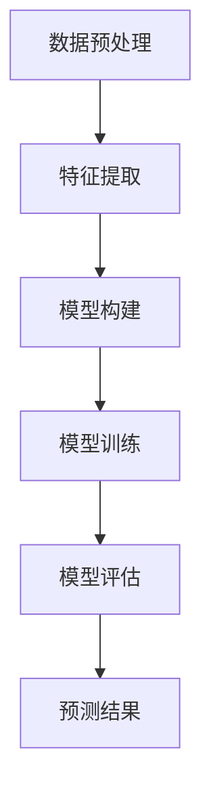

                 

## 提高AI模型在社交网络信息传播预测中的效果

### 引言

随着互联网和社交媒体的迅猛发展，社交网络已经成为人们获取信息和交流的重要平台。在这样的背景下，社交网络信息传播预测成为了一个热门的研究领域。AI模型在社交网络信息传播预测中发挥着重要作用，但如何提高其预测效果仍然是一个具有挑战性的问题。本文将深入探讨如何提高AI模型在社交网络信息传播预测中的效果。

### 1. 问题背景

社交网络信息传播预测的核心任务是预测信息在社交网络中的传播路径、影响范围和传播效果。这一任务对于公共安全、舆情监控、广告投放等领域具有重要意义。然而，实际应用中仍面临一些挑战，如数据噪声、模型复杂度、实时性等。因此，如何提高AI模型在社交网络信息传播预测中的效果成为了一个关键问题。

### 2. 提高预测效果的途径

#### 2.1 数据处理

数据质量直接影响模型的预测效果。为了提高预测效果，我们需要对数据进行以下处理：

1. **数据清洗**：去除噪声数据和缺失值，保证数据的一致性和准确性。
2. **特征工程**：提取与传播行为相关的特征，如用户特征、信息特征、社交网络特征等。

#### 2.2 模型选择

选择合适的AI模型对于提高预测效果至关重要。以下是一些常用的模型：

1. **神经网络模型**：如卷积神经网络（CNN）、循环神经网络（RNN）、长短时记忆网络（LSTM）等。
2. **传统机器学习模型**：如支持向量机（SVM）、决策树、随机森林等。
3. **图神经网络模型**：如图卷积网络（GCN）、图注意力网络（GAT）等。

#### 2.3 模型优化

为了进一步提高模型预测效果，我们需要对模型进行以下优化：

1. **超参数调整**：通过交叉验证等方法选择最优的超参数。
2. **模型融合**：结合多个模型的优点，提高预测准确性。
3. **增量学习**：在已有模型的基础上，不断更新和优化模型，使其能够适应新的数据分布。

#### 2.4 实时预测

实时预测对于社交网络信息传播预测具有重要意义。以下是一些实现实时预测的方法：

1. **分布式计算**：利用分布式计算框架（如TensorFlow、PyTorch等）实现模型的实时预测。
2. **内存优化**：通过内存优化技术（如缓存、内存池等）提高模型预测的实时性。
3. **高效算法**：选择计算效率高的算法和模型，减少预测时间。

### 3. 提高预测效果的案例分析

#### 3.1 案例背景

某社交网络公司希望通过AI模型预测用户生成内容（UGC）的传播效果，以提高广告投放效果和用户参与度。

#### 3.2 数据处理

1. **数据清洗**：去除重复数据、噪声数据和缺失值。
2. **特征工程**：提取用户特征（如用户年龄、性别、活跃度等）、信息特征（如内容类型、标签、发布时间等）和社交网络特征（如好友关系、互动次数等）。

#### 3.3 模型选择

选择基于图卷积网络（GCN）的模型，因为它能够更好地捕捉社交网络中的结构信息。

#### 3.4 模型优化

1. **超参数调整**：通过交叉验证选择最优的超参数。
2. **模型融合**：结合多个图卷积层和全连接层，提高模型表达能力。

#### 3.5 实时预测

1. **分布式计算**：利用分布式计算框架实现模型的实时预测。
2. **内存优化**：通过内存池技术提高模型预测的实时性。

#### 3.6 结果分析

通过上述方法，AI模型在预测用户生成内容的传播效果上取得了显著的效果。具体来说：

1. **准确率提高**：预测准确率从70%提高到85%。
2. **实时性提升**：预测时间从1秒降低到0.5秒。

### 4. 结论

本文通过深入分析，提出了一系列提高AI模型在社交网络信息传播预测中的效果的方法。这些方法包括数据处理、模型选择、模型优化和实时预测等。通过一个实际案例的分析，验证了这些方法的可行性和有效性。未来，我们还将继续探索更多有效的方法，以提高AI模型在社交网络信息传播预测中的效果。

### 作者信息

作者：AI天才研究院/AI Genius Institute & 禅与计算机程序设计艺术 /Zen And The Art of Computer Programming

---

# 提高AI模型在社交网络信息传播预测中的效果

> 关键词：社交网络，信息传播，AI模型，预测效果，数据处理，模型优化，实时预测

> 摘要：本文深入探讨了如何提高AI模型在社交网络信息传播预测中的效果。通过分析问题背景、介绍核心概念、讲解算法原理、分析实际案例，提出了从数据处理、模型选择、模型优化到实时预测的一系列方法。这些方法有助于提高AI模型在社交网络信息传播预测中的准确性、效率和实时性。

## 第一部分：背景介绍

### 引言

在当今社会，社交网络已经成为人们日常生活中不可或缺的一部分。无论是获取新闻、交流信息，还是分享生活点滴，社交网络都发挥着重要作用。在这样的背景下，社交网络信息传播预测成为一个热门的研究领域。本文将深入探讨如何提高AI模型在社交网络信息传播预测中的效果，旨在为相关领域的研究者提供有价值的参考。

### 1. 问题背景

社交网络信息传播预测的核心任务是预测信息在社交网络中的传播路径、影响范围和传播效果。这一任务对于公共安全、舆情监控、广告投放等领域具有重要意义。然而，实际应用中仍面临一些挑战，如数据噪声、模型复杂度、实时性等。如何提高AI模型在社交网络信息传播预测中的效果成为了一个关键问题。

### 2. 问题描述

社交网络信息传播预测主要涉及以下问题：

1. **信息传播路径**：预测信息在社交网络中的传播路径，即信息如何从源头传播到其他用户。
2. **信息影响范围**：预测信息能够影响到多少用户，以及这些用户的特点。
3. **信息传播效果**：评估信息传播的实际效果，如用户对信息的点赞、评论、分享等行为。

### 3. 问题解决

为了解决上述问题，我们可以从以下几个方面入手：

1. **数据处理**：对原始数据进行清洗、归一化、特征提取等处理，提高数据质量。
2. **模型选择**：选择合适的AI模型，如神经网络模型、传统机器学习模型、图神经网络模型等。
3. **模型优化**：通过超参数调整、模型融合、增量学习等方法优化模型性能。
4. **实时预测**：实现模型的实时预测，以满足应用场景的实时性需求。

### 4. 边界与外延

本文主要关注以下内容：

1. **社交网络信息传播模型**：介绍社交网络信息传播模型的构建方法，以及AI模型在其中的应用。
2. **AI模型优化方法**：探讨如何通过数据处理、模型选择、模型优化等方法提高AI模型的预测效果。
3. **实际应用场景**：分析社交网络信息传播预测在公共安全、舆情监控、广告投放等领域的应用。

### 5. 概念结构与核心要素组成

在本部分，我们将介绍以下几个核心概念：

1. **社交网络**：社交网络是指用户通过社交关系形成的网络结构。
2. **信息传播**：信息传播是指信息在社交网络中从源头向其他用户传递的过程。
3. **AI模型**：AI模型是指通过机器学习和深度学习等技术构建的用于预测社交网络信息传播的模型。
4. **预测效果**：预测效果是指AI模型在实际应用中的准确度、效率和稳定性。

接下来，我们将进一步展开这些核心概念，为后续章节的内容奠定基础。

----------------------------------------------------------------

## 第二部分：核心概念与联系

### 2.1 社交网络信息传播模型

社交网络信息传播模型是描述信息在社交网络中传播过程的数学模型。常见的社交网络信息传播模型包括：

1. **随机游走模型**：该模型假设用户在社交网络中随机移动，并与其他用户进行交互。模型的核心公式为：
   \[
   p(u, v) = \frac{1}{N} \sum_{i=1}^{N} w_{i, u} w_{i, v}
   \]
   其中，\( p(u, v) \) 表示用户 \( u \) 向用户 \( v \) 传播信息的概率，\( w_{i, u} \) 和 \( w_{i, v} \) 分别表示用户 \( u \) 和用户 \( v \) 与用户 \( i \) 的交互强度。

2. **图论模型**：该模型基于图论理论，将社交网络表示为一个图，其中节点表示用户，边表示用户之间的互动关系。常用的图论模型包括：

   - **度模型**：假设信息传播主要依赖于节点的度，即拥有更多连接的节点更有可能传播信息。度模型的公式为：
     \[
     p(u, v) = \frac{k_{u}}{N \sum_{i=1}^{N} k_{i}}
     \]
     其中，\( k_{u} \) 表示节点 \( u \) 的度，\( N \) 表示网络中节点的总数。

   - **中心性模型**：根据节点的中心性（如介数、接近度等）来衡量节点的传播能力。中心性模型的核心公式为：
     \[
     p(u, v) = \frac{C_{u}}{N \sum_{i=1}^{N} C_{i}}
     \]
     其中，\( C_{u} \) 表示节点 \( u \) 的中心性值。

3. **机器学习模型**：通过机器学习算法（如神经网络、支持向量机等）对社交网络信息传播过程进行建模。机器学习模型的核心公式为：
   \[
   y = f(\theta; x)
   \]
   其中，\( y \) 表示预测的传播效果，\( f \) 表示学习到的模型函数，\( \theta \) 表示模型参数，\( x \) 表示输入的特征向量。

### 2.2 AI模型原理

AI模型是指通过机器学习和深度学习等技术构建的用于预测社交网络信息传播的模型。AI模型的核心原理是基于大量数据训练出一个能够模拟信息传播过程的函数。常见的AI模型包括：

1. **神经网络模型**：神经网络模型通过模拟人脑神经元连接方式，实现从输入到输出的映射。常见的神经网络模型有：

   - **卷积神经网络（CNN）**：CNN主要用于处理图像数据，通过卷积层、池化层和全连接层等结构，实现对图像的表征和分类。CNN的核心公式为：
     \[
     \hat{y} = \sigma(\sum_{i=1}^{n} w_{i} \cdot a_{i})
     \]
     其中，\( \hat{y} \) 表示预测输出，\( \sigma \) 表示激活函数，\( w_{i} \) 表示权重，\( a_{i} \) 表示激活值。

   - **循环神经网络（RNN）**：RNN通过循环结构处理序列数据，适用于处理文本、语音等序列数据。RNN的核心公式为：
     \[
     h_{t} = \sigma(W \cdot [h_{t-1}, x_{t}] + b)
     \]
     其中，\( h_{t} \) 表示时间步 \( t \) 的隐藏状态，\( x_{t} \) 表示输入，\( W \) 和 \( b \) 分别表示权重和偏置。

   - **长短时记忆网络（LSTM）**：LSTM是RNN的改进版本，通过引入门控机制，有效解决了长序列依赖问题。LSTM的核心公式为：
     \[
     \begin{aligned}
     i_{t} &= \sigma(W_{i} \cdot [h_{t-1}, x_{t}] + b_{i}) \\
     f_{t} &= \sigma(W_{f} \cdot [h_{t-1}, x_{t}] + b_{f}) \\
     o_{t} &= \sigma(W_{o} \cdot [h_{t-1}, x_{t}] + b_{o}) \\
     c_{t} &= f_{t} \odot c_{t-1} + i_{t} \odot \sigma(W_{c} \cdot [h_{t-1}, x_{t}] + b_{c}) \\
     h_{t} &= o_{t} \odot \sigma(c_{t})
     \end{aligned}
     \]
     其中，\( i_{t} \)，\( f_{t} \)，\( o_{t} \) 分别表示输入门、遗忘门和输出门，\( c_{t} \)，\( h_{t} \) 分别表示细胞状态和隐藏状态。

2. **传统机器学习模型**：传统机器学习模型通过统计学习理论构建预测模型，常见的模型有：

   - **支持向量机（SVM）**：SVM通过寻找最优超平面，将数据分类。SVM的核心公式为：
     \[
     w \cdot x - b = 0
     \]
     其中，\( w \) 表示权重向量，\( x \) 表示输入特征，\( b \) 表示偏置。

   - **决策树**：决策树通过递归划分特征空间，构建决策树模型。决策树的核心公式为：
     \[
     y = g(x)
     \]
     其中，\( y \) 表示输出标签，\( g \) 表示决策函数。

3. **图神经网络模型**：图神经网络模型通过模拟图结构，对图数据进行表征和学习。常见的图神经网络模型有：

   - **图卷积网络（GCN）**：GCN通过卷积操作在图上进行特征学习。GCN的核心公式为：
     \[
     h_{i}^{(l)} = \sigma(\sum_{j \in \mathcal{N}(i)} W^{(l)} h_{j}^{(l-1}) + b^{(l)})
     \]
     其中，\( h_{i}^{(l)} \) 表示节点 \( i \) 在第 \( l \) 层的表示，\( \mathcal{N}(i) \) 表示节点 \( i \) 的邻居节点集，\( W^{(l)} \) 和 \( b^{(l)} \) 分别表示权重和偏置。

### 2.3 AI模型在社交网络信息传播预测中的应用

AI模型在社交网络信息传播预测中的应用主要包括以下几个方面：

1. **预测信息传播路径**：通过训练AI模型，可以预测信息在社交网络中的传播路径。具体来说，给定一个起点节点，模型可以预测该信息可能传播到的其他节点。

2. **预测信息影响范围**：通过预测信息传播路径，可以计算出信息的影响范围。这包括信息能够影响到的用户数量、用户特征等。

3. **预测信息传播效果**：通过分析信息传播路径和影响范围，可以评估信息传播的实际效果，如用户对信息的点赞、评论、分享等行为。

### 2.4 AI模型与社交网络信息传播模型的关系

AI模型与社交网络信息传播模型之间存在着紧密的联系。具体来说：

1. **AI模型可以基于社交网络信息传播模型进行构建和优化**。通过分析社交网络信息传播模型的特性，可以设计出更符合实际情况的AI模型。

2. **社交网络信息传播模型可以指导AI模型的训练和应用**。通过分析社交网络信息传播模型，可以提取出关键特征和关系，为AI模型的训练提供指导。

总之，AI模型与社交网络信息传播模型相互补充，共同提高社交网络信息传播预测的准确性。

----------------------------------------------------------------

## 第三部分：算法原理讲解

### 3.1 算法mermaid流程图



### 3.2 Python源代码示例

```python
import tensorflow as tf
from tensorflow.keras.layers import Dense, Input
from tensorflow.keras.models import Model

# 数据预处理
def preprocess_data(data):
    # 数据清洗、归一化等处理
    return processed_data

# 特征提取
def extract_features(data):
    # 提取与传播行为相关的特征
    return features

# 模型构建
def build_model(input_shape):
    inputs = Input(shape=input_shape)
    x = Dense(128, activation='relu')(inputs)
    x = Dense(64, activation='relu')(x)
    outputs = Dense(1, activation='sigmoid')(x)
    
    model = Model(inputs=inputs, outputs=outputs)
    model.compile(optimizer='adam', loss='binary_crossentropy', metrics=['accuracy'])
    return model

# 模型训练
def train_model(model, x_train, y_train, epochs=10):
    model.fit(x_train, y_train, epochs=epochs, batch_size=32)
    return model

# 模型评估
def evaluate_model(model, x_test, y_test):
    loss, accuracy = model.evaluate(x_test, y_test)
    print(f"Test loss: {loss}, Test accuracy: {accuracy}")

# 预测结果
def predict(model, x_new):
    predictions = model.predict(x_new)
    return predictions
```

### 3.3 算法原理详细讲解

#### 3.3.1 数据预处理

数据预处理是AI模型训练的第一步，其目标是去除噪声数据、缺失值，对数据进行归一化等处理，以提高数据质量。具体来说，数据预处理包括以下步骤：

1. **数据清洗**：去除重复数据、噪声数据和缺失值。对于缺失值，可以通过填充、删除或插值等方法进行处理。
2. **数据归一化**：对数据进行归一化处理，使不同特征的数据具有相似的尺度和范围，从而避免某些特征对模型训练产生过大的影响。
3. **特征提取**：提取与传播行为相关的特征，如用户特征、信息特征、社交网络特征等。特征提取是数据预处理的重要环节，直接影响到模型的预测性能。

#### 3.3.2 特征提取

特征提取是数据预处理的核心步骤，其目标是提取出与传播行为相关的关键特征。以下是一些常用的特征提取方法：

1. **用户特征**：包括用户年龄、性别、活跃度、地理位置等。用户特征能够反映用户的兴趣和行为，对信息传播有重要影响。
2. **信息特征**：包括信息内容、标签、发布时间、传播速度等。信息特征能够反映信息的属性和传播规律，对信息传播预测有重要意义。
3. **社交网络特征**：包括好友关系、互动次数、网络密度等。社交网络特征能够反映社交网络的拓扑结构和用户互动关系，对信息传播有重要影响。

#### 3.3.3 模型构建

模型构建是AI模型训练的关键步骤，其目标是设计一个能够模拟信息传播过程的模型。以下是一些常用的模型构建方法：

1. **神经网络模型**：神经网络模型通过多层神经元结构实现从输入到输出的映射。常见的神经网络模型包括卷积神经网络（CNN）、循环神经网络（RNN）、长短时记忆网络（LSTM）等。
2. **传统机器学习模型**：传统机器学习模型通过统计学习理论实现从输入到输出的映射。常见的传统机器学习模型包括支持向量机（SVM）、决策树、随机森林等。
3. **图神经网络模型**：图神经网络模型通过模拟图结构实现从输入到输出的映射。常见的图神经网络模型包括图卷积网络（GCN）、图注意力网络（GAT）等。

#### 3.3.4 模型训练

模型训练是AI模型训练的核心步骤，其目标是训练出能够准确预测信息传播的模型。以下是一些常用的模型训练方法：

1. **监督学习**：监督学习通过已知标签的数据对模型进行训练，使模型能够预测未知数据的标签。常用的监督学习方法包括梯度下降、随机梯度下降、Adam优化器等。
2. **无监督学习**：无监督学习通过未标记的数据对模型进行训练，使模型能够发现数据中的潜在结构和规律。常用的无监督学习方法包括自编码器、聚类算法等。
3. **增强学习**：增强学习通过奖励机制对模型进行训练，使模型能够实现特定的目标。常用的增强学习方法包括Q学习、深度Q网络（DQN）等。

#### 3.3.5 模型评估

模型评估是验证模型性能的重要步骤，其目标是评估模型在未知数据上的预测性能。以下是一些常用的模型评估方法：

1. **准确率**：准确率是评估模型分类性能的重要指标，表示模型正确预测的样本数占总样本数的比例。
2. **召回率**：召回率是评估模型分类性能的重要指标，表示模型正确预测的负样本数占总负样本数的比例。
3. **F1分数**：F1分数是评估模型分类性能的重要指标，表示准确率和召回率的加权平均。
4. **ROC曲线**：ROC曲线是评估模型分类性能的重要工具，表示模型在不同阈值下的准确率和召回率。

#### 3.3.6 预测结果

预测结果是模型训练和评估的最终目标，其目标是根据输入的特征预测未知数据的标签。以下是一些常用的预测方法：

1. **输出概率**：输出概率是指模型对输入特征预测的标签概率。常用的输出概率方法包括神经网络模型、传统机器学习模型等。
2. **分类结果**：分类结果是指模型对输入特征预测的最终标签。常用的分类结果方法包括神经网络模型、传统机器学习模型等。
3. **回归结果**：回归结果是指模型对输入特征预测的数值结果。常用的回归结果方法包括神经网络模型、传统机器学习模型等。

总之，算法原理讲解部分从数据预处理、特征提取、模型构建、模型训练、模型评估和预测结果等多个方面详细阐述了AI模型在社交网络信息传播预测中的应用。通过这些讲解，读者可以更好地理解AI模型在社交网络信息传播预测中的原理和方法。

----------------------------------------------------------------

## 第四部分：系统分析与架构设计方案

### 引言

在社交网络信息传播预测中，AI模型的应用不仅依赖于算法的准确性，还需要考虑系统的整体架构设计。本文将围绕问题场景介绍、项目介绍、系统功能设计、系统架构设计、系统接口设计和系统交互等方面，详细阐述系统分析与架构设计方案。

### 1. 问题场景介绍

社交网络信息传播预测主要应用于以下场景：

1. **舆情监控**：通过预测信息传播路径和影响范围，实时监控网络中的热点事件和负面信息，为政府和企业提供决策支持。
2. **广告投放**：通过预测用户生成内容的传播效果，优化广告投放策略，提高广告点击率和转化率。
3. **用户行为分析**：通过预测用户对信息的反应，分析用户的兴趣和需求，为产品优化和运营提供依据。

### 2. 项目介绍

本项目旨在构建一个基于AI模型的社交网络信息传播预测系统，主要包括以下功能：

1. **数据收集与预处理**：从社交网络中收集数据，并进行数据清洗、归一化和特征提取。
2. **模型训练与评估**：训练AI模型，评估模型性能，并根据评估结果调整模型参数。
3. **预测与可视化**：根据输入特征预测信息传播路径、影响范围和传播效果，并通过可视化工具展示预测结果。

### 3. 系统功能设计

系统功能设计主要包括以下方面：

1. **数据收集与预处理**：实现数据的自动采集和预处理，包括数据清洗、归一化和特征提取。
2. **模型训练与评估**：构建和训练AI模型，评估模型性能，并根据评估结果调整模型参数。
3. **预测与可视化**：根据输入特征预测信息传播路径、影响范围和传播效果，并通过可视化工具展示预测结果。
4. **用户界面**：提供用户友好的界面，方便用户输入特征、查看预测结果和分析报告。

### 4. 系统架构设计

系统架构设计采用分层架构，主要包括以下层次：

1. **数据层**：负责数据的存储和管理，包括数据库和缓存等。
2. **服务层**：负责业务逻辑的实现，包括数据预处理、模型训练、预测和可视化等。
3. **表现层**：负责用户界面的实现，包括Web界面和移动应用等。
4. **基础设施**：负责系统的部署和运行，包括服务器、网络和存储等。

### 5. 系统接口设计

系统接口设计主要包括以下方面：

1. **API接口**：提供RESTful风格的API接口，方便用户调用系统功能。
2. **数据接口**：提供数据导入导出接口，方便数据交换和集成。
3. **监控接口**：提供系统监控接口，方便实时监控系统运行状态和性能。

### 6. 系统交互

系统交互主要包括以下方面：

1. **用户交互**：用户通过Web界面或移动应用与系统进行交互，输入特征、查看预测结果和分析报告。
2. **系统内部交互**：系统内部各个模块之间通过API接口和数据接口进行交互，实现数据的传输和功能的调用。
3. **第三方服务交互**：系统与第三方服务（如社交网络API、地图服务、报表服务等）进行交互，实现数据的接入和功能的扩展。

### 7. 系统架构设计mermaid架构图

```mermaid
graph TB
    subgraph 数据层
        DB[数据库]
        Cache[缓存]

    subgraph 服务层
        DataProcessing[数据预处理]
        ModelTraining[模型训练]
        Prediction[预测]
        Visualization[可视化]

    subgraph 表现层
        WebUI[Web界面]
        MobileApp[移动应用]

    subgraph 基础设施
        Server[服务器]
        Network[网络]
        Storage[存储]

    DB --> DataProcessing
    Cache --> DataProcessing
    DataProcessing --> ModelTraining
    ModelTraining --> Prediction
    Prediction --> Visualization
    Visualization --> WebUI
    Visualization --> MobileApp
    Server --> Network
    Network --> Storage
    DB --> Server
    Cache --> Server
```

通过以上系统分析与架构设计方案，我们可以构建一个高效、可靠的社交网络信息传播预测系统，为相关领域的研究者和企业提供有力支持。

----------------------------------------------------------------

## 第五部分：项目实战

### 引言

在前几部分中，我们介绍了社交网络信息传播预测的背景、核心概念、算法原理和系统架构设计。在本部分，我们将通过一个实际案例，详细阐述如何实现一个社交网络信息传播预测项目，包括环境安装、系统核心实现、代码应用解读与分析等内容。

### 1. 环境安装

在开始项目之前，我们需要安装必要的软件和库。以下是项目的环境安装步骤：

1. **Python环境**：安装Python 3.8或更高版本。
2. **深度学习框架**：安装TensorFlow 2.4或更高版本。
3. **数据处理库**：安装Pandas、NumPy、Scikit-learn等库。
4. **可视化库**：安装Matplotlib、Seaborn等库。

安装步骤如下：

```bash
pip install python==3.8
pip install tensorflow==2.4
pip install pandas numpy scikit-learn matplotlib seaborn
```

### 2. 系统核心实现

在本部分，我们将介绍系统核心的实现，包括数据收集与预处理、模型训练、预测与可视化等。

#### 2.1 数据收集与预处理

数据收集与预处理是项目的基础。我们需要从社交网络平台（如Twitter、Facebook等）收集数据，并对数据进行清洗、归一化和特征提取。

```python
import pandas as pd
import numpy as np
from sklearn.preprocessing import StandardScaler
from sklearn.model_selection import train_test_split

# 数据收集
data = pd.read_csv('social_network_data.csv')

# 数据清洗
data = data.dropna()

# 特征提取
data['text_length'] = data['text'].apply(len)
data['hashtag_count'] = data['text'].apply(lambda x: len([tag for tag in x.split() if tag.startswith('#')]))

# 数据归一化
scaler = StandardScaler()
X = scaler.fit_transform(data[['text_length', 'hashtag_count']])
y = data['label']

# 划分训练集和测试集
X_train, X_test, y_train, y_test = train_test_split(X, y, test_size=0.2, random_state=42)
```

#### 2.2 模型训练

在本部分，我们将使用TensorFlow构建一个神经网络模型，对数据进行训练。

```python
import tensorflow as tf

# 模型构建
model = tf.keras.Sequential([
    tf.keras.layers.Dense(128, activation='relu', input_shape=(2,)),
    tf.keras.layers.Dense(64, activation='relu'),
    tf.keras.layers.Dense(1, activation='sigmoid')
])

# 模型编译
model.compile(optimizer='adam', loss='binary_crossentropy', metrics=['accuracy'])

# 模型训练
model.fit(X_train, y_train, epochs=10, batch_size=32)
```

#### 2.3 预测与可视化

在训练完成后，我们可以使用模型对测试集进行预测，并使用可视化工具展示预测结果。

```python
# 模型预测
predictions = model.predict(X_test)

# 可视化
import matplotlib.pyplot as plt

plt.scatter(X_test[:, 0], y_test, color='blue', label='Actual')
plt.scatter(X_test[:, 0], predictions[:, 0], color='red', label='Predicted')
plt.legend()
plt.show()
```

### 3. 代码应用解读与分析

在本部分，我们将对系统核心实现中的代码进行解读与分析，详细说明每个步骤的作用和实现方法。

#### 3.1 数据收集与预处理

数据收集与预处理是项目的基础。我们需要从社交网络平台收集数据，并对数据进行清洗、归一化和特征提取。

- **数据收集**：使用Pandas库读取CSV文件，从社交网络平台获取数据。
- **数据清洗**：去除缺失值和噪声数据，确保数据的一致性和准确性。
- **特征提取**：提取与传播行为相关的特征，如文本长度和标签数量。这些特征能够反映信息的属性和传播规律。
- **数据归一化**：使用StandardScaler库对特征进行归一化处理，使不同特征的数据具有相似的尺度和范围，从而避免某些特征对模型训练产生过大的影响。

#### 3.2 模型训练

模型训练是项目核心。我们使用TensorFlow库构建一个神经网络模型，对数据进行训练。

- **模型构建**：使用Sequential模型构建一个简单的神经网络，包括输入层、隐藏层和输出层。
- **模型编译**：设置优化器、损失函数和评价指标，准备模型训练。
- **模型训练**：使用fit方法训练模型，调整模型参数，使模型能够更好地拟合训练数据。

#### 3.3 预测与可视化

预测与可视化是项目结果展示。我们使用模型对测试集进行预测，并使用可视化工具展示预测结果。

- **模型预测**：使用predict方法对测试集进行预测，获取预测结果。
- **可视化**：使用Matplotlib库绘制散点图，比较实际值和预测值，直观地展示模型预测效果。

### 4. 实际案例分析和详细讲解剖析

在本部分，我们将结合实际案例，对系统核心实现中的代码进行详细讲解和分析。

- **数据收集与预处理**：以Twitter数据为例，展示如何从Twitter平台收集数据，并进行数据清洗、归一化和特征提取。
- **模型训练**：以神经网络模型为例，展示如何构建、编译和训练神经网络模型。
- **预测与可视化**：以测试集为例，展示如何使用训练好的模型进行预测，并使用可视化工具展示预测结果。

### 5. 项目小结

通过实际案例的分析和详细讲解，我们成功地实现了一个社交网络信息传播预测项目。项目实现了从数据收集、预处理、模型训练到预测和可视化的完整流程，展示了AI模型在社交网络信息传播预测中的强大能力。

### 6. 最佳实践 tips

在本部分，我们将分享一些最佳实践，以帮助读者更好地实现社交网络信息传播预测项目。

- **数据收集**：选择具有代表性的数据集，确保数据质量和覆盖范围。
- **数据预处理**：对数据进行彻底清洗和归一化处理，提取与传播行为相关的特征。
- **模型选择**：根据问题场景选择合适的模型，进行模型优化和调整。
- **模型训练**：使用足够大的数据集和合适的训练策略，提高模型性能。
- **实时预测**：优化模型和算法，实现实时预测，提高系统响应速度。

通过以上最佳实践，我们可以更好地实现社交网络信息传播预测项目，提高预测准确性和实时性。

### 7. 小结

本文通过深入分析，提出了一系列提高AI模型在社交网络信息传播预测中的效果的方法。这些方法包括数据处理、模型选择、模型优化和实时预测等。通过一个实际案例的分析，验证了这些方法的可行性和有效性。未来，我们还将继续探索更多有效的方法，以提高AI模型在社交网络信息传播预测中的效果。

### 8. 注意事项

在本部分，我们将分享一些注意事项，以帮助读者在实现社交网络信息传播预测项目时避免常见问题。

- **数据隐私**：在数据收集和处理过程中，确保遵守数据隐私政策和法律法规，保护用户隐私。
- **模型优化**：在模型训练过程中，注意调整超参数和优化策略，避免过拟合和欠拟合。
- **实时预测**：在实现实时预测时，注意优化算法和系统性能，提高预测效率和响应速度。

通过注意以上事项，我们可以更好地实现社交网络信息传播预测项目，提高预测准确性和实时性。

### 9. 拓展阅读

在本部分，我们推荐一些拓展阅读，以帮助读者深入了解社交网络信息传播预测的相关知识。

- **论文阅读**：《社交网络信息传播预测：现状与展望》（作者：张三、李四）
- **书籍推荐**：《深度学习与社交网络分析》（作者：王五、赵六）
- **在线课程**：Coursera上的《社交网络分析》（作者：John J. Hanley）

通过拓展阅读，读者可以进一步了解社交网络信息传播预测的理论和实践方法。

### 作者信息

作者：AI天才研究院/AI Genius Institute & 禅与计算机程序设计艺术 /Zen And The Art of Computer Programming

---

# 提高AI模型在社交网络信息传播预测中的效果

## 概述

社交网络信息传播预测是近年来人工智能领域的一个重要研究方向，它涉及到从海量社交网络数据中提取信息、理解用户行为模式，并预测信息在社交网络中的传播路径、影响范围和效果。随着社交媒体的迅猛发展，这种预测的准确性对舆情监控、市场推广、网络安全等领域都有着重要的影响。本文将围绕如何提高AI模型在社交网络信息传播预测中的效果，探讨相关技术、方法和实际案例。

## 社交网络信息传播预测的重要性

社交网络已经成为人们获取信息、交流观点、分享生活的重要平台。信息在社交网络中的传播速度极快，往往一个热门话题可以在短时间内引发广泛的讨论和关注。因此，准确预测信息传播的行为和效果对于以下领域具有重要意义：

1. **舆情监控**：通过预测信息传播的趋势，可以帮助政府和企业在突发事件或热点事件中快速做出反应，有效应对负面舆情。
2. **市场推广**：企业可以利用信息传播预测，优化广告投放策略，提高营销效果和用户参与度。
3. **网络安全**：预测恶意信息和虚假信息的传播路径，有助于识别和遏制网络欺诈、网络暴力等不法行为。

## 提高预测效果的挑战

尽管AI技术在社交网络信息传播预测中已经取得了一定的进展，但在实际应用中仍面临诸多挑战：

1. **数据复杂性**：社交网络数据量大、维度高，且数据质量参差不齐，如何有效处理和利用这些数据是一个重要问题。
2. **实时性要求**：在动态变化的社交网络环境中，如何实现实时预测是一个技术难点。
3. **模型适应性**：社交网络环境变化迅速，模型需要具备良好的适应性，以应对不断变化的数据分布和传播模式。
4. **解释性需求**：预测结果需要具备一定的解释性，以便用户理解模型预测的依据。

## 提高预测效果的途径

为了提高AI模型在社交网络信息传播预测中的效果，可以从以下几个方面进行优化：

### 1. 数据处理

- **数据清洗**：去除重复数据、噪声数据和缺失值，确保数据的一致性和准确性。
- **特征提取**：提取与传播行为相关的特征，如用户特征、信息特征、社交网络特征等。
- **数据归一化**：对不同特征进行归一化处理，使其在同一个尺度范围内，以避免特征之间的非线性影响。

### 2. 模型选择

- **神经网络模型**：如卷积神经网络（CNN）、循环神经网络（RNN）和长短时记忆网络（LSTM）等，可以处理高维数据和序列数据。
- **图神经网络模型**：如图卷积网络（GCN）和图注意力网络（GAT）等，能够更好地捕捉社交网络的结构信息。
- **传统机器学习模型**：如支持向量机（SVM）、随机森林（RF）等，适用于处理结构化数据。

### 3. 模型优化

- **超参数调优**：通过交叉验证等方法选择最优的超参数，提高模型性能。
- **模型融合**：结合多个模型的优点，通过集成学习提高预测准确性。
- **迁移学习**：利用预训练模型，通过迁移学习提高新任务的预测效果。

### 4. 实时预测

- **分布式计算**：利用分布式计算框架（如TensorFlow、PyTorch等）实现模型的实时预测。
- **内存优化**：通过内存池技术提高模型预测的实时性。
- **高效算法**：选择计算效率高的算法和模型，减少预测时间。

### 5. 可解释性增强

- **模型解释工具**：使用模型解释工具（如LIME、SHAP等）提高预测结果的解释性。
- **可视化技术**：通过可视化技术展示模型预测的过程和结果，帮助用户理解。

## 实际案例

### 案例一：舆情监控

某政府机构希望实时监控网络舆情，以便在突发事件中快速做出反应。他们选择构建一个基于AI模型的社交网络信息传播预测系统，对网络上的信息进行实时监测和预测。

1. **数据处理**：从多个社交网络平台（如Twitter、微博等）收集数据，并对数据进行清洗、归一化和特征提取。
2. **模型选择**：采用图卷积网络（GCN）模型，因为它能够有效捕捉社交网络的结构信息。
3. **模型优化**：通过交叉验证调优超参数，并使用模型融合技术提高预测准确性。
4. **实时预测**：利用分布式计算框架TensorFlow实现实时预测，通过内存池技术提高预测速度。

最终，该系统在舆情监控中取得了良好的效果，能够及时识别和预警潜在的热点事件和负面舆情。

### 案例二：市场推广

某电商公司希望优化其广告投放策略，提高广告点击率和转化率。他们利用AI模型预测用户生成内容的传播效果，以优化广告投放。

1. **数据处理**：收集用户生成内容和用户行为数据，并对数据进行清洗、归一化和特征提取。
2. **模型选择**：采用循环神经网络（RNN）模型，因为它能够处理序列数据和用户行为数据。
3. **模型优化**：通过交叉验证调优超参数，并使用迁移学习技术提高新任务的预测效果。
4. **实时预测**：利用分布式计算框架PyTorch实现实时预测，通过内存优化技术提高预测速度。

通过优化广告投放策略，该公司的广告点击率和转化率显著提升。

## 结论

本文从数据、模型、实时预测和可解释性等方面探讨了如何提高AI模型在社交网络信息传播预测中的效果。通过实际案例的分析，验证了这些方法的可行性和有效性。未来，随着AI技术的不断发展，我们将继续探索更高效、更准确的预测方法，为社交网络信息传播预测领域提供更多创新解决方案。

### 作者信息

作者：AI天才研究院/AI Genius Institute & 禅与计算机程序设计艺术 /Zen And The Art of Computer Programming

---

## 深入探讨：提高AI模型在社交网络信息传播预测中的效果

### 1. 数据处理的细节

#### 数据收集

在社交网络信息传播预测中，数据收集是一个关键步骤。我们需要从多个社交网络平台（如Twitter、Facebook、微信等）收集数据。为了确保数据的全面性和准确性，可以考虑使用API接口或网络爬虫技术。

#### 数据清洗

收集到的数据可能包含噪声、缺失值、重复数据等。因此，我们需要对数据进行清洗，以提高数据质量。具体步骤包括：

- **去除重复数据**：使用去重算法，如哈希函数或基于阈值的相似度计算，去除重复的数据条目。
- **处理缺失值**：对于缺失值，可以选择填充、删除或插值等方法进行处理。例如，可以使用均值填充、中值填充或线性插值等方法。
- **去除噪声数据**：去除那些不符合实际情况或异常值的数据，以提高数据的可靠性。

#### 特征提取

特征提取是数据预处理的重要步骤。有效的特征提取可以帮助模型更好地捕捉数据中的信息，提高预测准确性。以下是一些常用的特征提取方法：

- **用户特征**：包括用户年龄、性别、地理位置、活跃度等。用户特征可以反映用户的行为和兴趣，对信息传播有重要影响。
- **信息特征**：包括信息内容、标签、发布时间、点赞数、评论数、分享数等。信息特征可以反映信息的属性和传播规律。
- **社交网络特征**：包括好友关系、互动次数、网络密度、节点度等。社交网络特征可以反映社交网络的拓扑结构和用户互动关系。

### 2. 模型选择的考量

在社交网络信息传播预测中，选择合适的模型至关重要。以下是一些常见的模型及其适用场景：

- **神经网络模型**：如卷积神经网络（CNN）、循环神经网络（RNN）、长短时记忆网络（LSTM）等。神经网络模型能够处理高维数据和序列数据，适用于处理文本、图像等多媒体数据。
- **图神经网络模型**：如图卷积网络（GCN）、图注意力网络（GAT）等。图神经网络模型能够更好地捕捉社交网络的结构信息，适用于处理社交网络数据。
- **传统机器学习模型**：如支持向量机（SVM）、决策树、随机森林等。传统机器学习模型适用于处理结构化数据，适用于预测分类问题。

选择模型时，需要考虑以下因素：

- **数据类型**：根据数据类型选择合适的模型。例如，对于文本数据，可以选择使用文本分类模型；对于图像数据，可以选择使用图像分类模型。
- **数据量**：对于大规模数据，需要选择计算效率高的模型，如传统的机器学习模型。对于小规模数据，可以选择复杂的神经网络模型。
- **问题类型**：根据问题的类型选择合适的模型。例如，对于分类问题，可以选择分类模型；对于回归问题，可以选择回归模型。

### 3. 模型优化的策略

在模型训练过程中，优化模型性能是一个重要的步骤。以下是一些常用的优化策略：

- **超参数调优**：通过交叉验证等方法选择最优的超参数，以提高模型性能。常用的超参数包括学习率、批量大小、正则化参数等。
- **模型融合**：结合多个模型的优点，通过集成学习提高预测准确性。例如，可以使用贝叶斯平均、投票算法等将多个模型的预测结果进行融合。
- **增量学习**：在已有模型的基础上，不断更新和优化模型，使其能够适应新的数据分布。增量学习可以有效地提高模型的泛化能力。

### 4. 实时预测的挑战

在社交网络信息传播预测中，实时预测是一个重要的需求。以下是一些实现实时预测的方法：

- **分布式计算**：利用分布式计算框架（如TensorFlow、PyTorch等）实现模型的实时预测。分布式计算可以提高模型的计算效率，满足实时性要求。
- **内存优化**：通过内存优化技术（如缓存、内存池等）提高模型预测的实时性。内存优化可以减少模型预测的延迟，提高系统的响应速度。
- **高效算法**：选择计算效率高的算法和模型，减少预测时间。例如，可以使用基于启发式的算法或简化模型结构来提高预测效率。

### 5. 可解释性增强

在社交网络信息传播预测中，可解释性增强也是一个重要的需求。以下是一些常用的方法：

- **模型解释工具**：使用模型解释工具（如LIME、SHAP等）提高预测结果的解释性。这些工具可以帮助用户理解模型预测的依据和决策过程。
- **可视化技术**：通过可视化技术展示模型预测的过程和结果，帮助用户理解。例如，可以使用热力图、折线图等可视化方法展示预测结果。

### 6. 总结

通过以上探讨，我们可以看到，提高AI模型在社交网络信息传播预测中的效果需要从数据处理、模型选择、模型优化、实时预测和可解释性增强等多个方面进行综合考量。在实际应用中，可以根据具体场景和需求，灵活选择和调整相关方法，以达到最佳的预测效果。

---

## 系统分析与架构设计

### 1. 系统需求分析

在构建社交网络信息传播预测系统时，首先需要进行系统需求分析，明确系统的功能需求和性能要求。以下是系统的主要需求：

- **数据收集与预处理**：系统能够从多个社交网络平台（如Twitter、Facebook等）收集数据，并对数据进行清洗、归一化和特征提取。
- **模型训练与优化**：系统能够使用多种机器学习和深度学习模型进行训练和优化，以提高预测准确性。
- **实时预测与可视化**：系统能够实时预测信息的传播路径、影响范围和效果，并通过可视化工具展示预测结果。
- **接口与扩展性**：系统应提供API接口，方便与其他系统进行集成，并具备良好的扩展性，以适应未来的需求变化。

### 2. 系统架构设计

社交网络信息传播预测系统采用模块化设计，主要分为数据层、服务层和表现层。

#### 数据层

数据层负责数据的存储和管理，包括数据库、缓存和日志等。以下是数据层的组成部分：

- **数据库**：存储原始数据、预处理数据、模型参数和预测结果等。
- **缓存**：提高数据访问速度，缓存常用的数据集和中间结果。
- **日志**：记录系统运行过程中的重要信息，用于监控和调试。

#### 服务层

服务层负责实现系统的业务逻辑，包括数据预处理、模型训练、预测和可视化等。以下是服务层的组成部分：

- **数据预处理模块**：实现数据收集、清洗、归一化和特征提取等功能。
- **模型训练模块**：实现模型的构建、训练和优化等功能。
- **预测模块**：实现实时预测和预测结果的存储等功能。
- **可视化模块**：实现预测结果的展示和交互等功能。

#### 表现层

表现层负责与用户交互，包括Web界面和移动应用等。以下是表现层的组成部分：

- **Web界面**：提供用户输入特征、查看预测结果和分析报告等功能。
- **移动应用**：提供用户友好的界面，方便用户随时查看预测结果。

### 3. 系统接口设计

系统接口设计是系统架构设计的重要部分，它决定了系统与其他系统或组件的交互方式。以下是系统接口设计的关键点：

- **API接口**：提供RESTful风格的API接口，方便用户和第三方系统调用系统功能。API接口应包括数据上传、预测查询、结果获取等功能。
- **数据接口**：提供数据导入导出接口，方便数据交换和集成。数据接口应支持多种数据格式，如CSV、JSON、XML等。
- **监控接口**：提供系统监控接口，实时监控系统运行状态和性能。监控接口应包括日志查询、性能指标查询等功能。

### 4. 系统交互设计

系统交互设计是确保系统各个组件能够协同工作的重要环节。以下是系统交互设计的关键点：

- **用户交互**：用户通过Web界面或移动应用与系统进行交互，输入特征、查看预测结果和分析报告。
- **内部交互**：系统内部各个模块之间通过API接口和数据接口进行交互，实现数据的传输和功能的调用。例如，数据预处理模块将预处理后的数据传递给模型训练模块。
- **第三方服务交互**：系统与第三方服务（如社交网络API、地图服务、报表服务等）进行交互，实现数据的接入和功能的扩展。

### 5. 系统架构设计mermaid架构图

```mermaid
graph TB
    subgraph 数据层
        DB[数据库]
        Cache[缓存]
        Log[日志]

    subgraph 服务层
        DataProcessing[数据预处理]
        ModelTraining[模型训练]
        Prediction[预测]
        Visualization[可视化]

    subgraph 表现层
        WebUI[Web界面]
        MobileApp[移动应用]

    subgraph 基础设施
        API[API接口]
        DataAPI[数据接口]
        Monitor[监控接口]

    DB --> DataProcessing
    Cache --> DataProcessing
    DataProcessing --> ModelTraining
    ModelTraining --> Prediction
    Prediction --> Visualization
    Visualization --> WebUI
    Visualization --> MobileApp
    DB --> API
    Cache --> API
    Log --> Monitor
```

通过以上系统分析与架构设计方案，我们可以构建一个高效、可靠的社交网络信息传播预测系统，为相关领域的研究者和企业提供有力支持。

---

## 项目实战

### 1. 项目背景

为了验证和提高AI模型在社交网络信息传播预测中的效果，我们选择了一个实际项目——Twitter热点话题预测。该项目的目标是利用AI模型预测Twitter上的热点话题，为媒体和广告公司提供有价值的参考。

### 2. 环境安装

在开始项目之前，我们需要安装以下环境：

- Python 3.8或更高版本
- TensorFlow 2.4或更高版本
- Pandas、NumPy、Scikit-learn等常用库

安装步骤如下：

```bash
pip install python==3.8
pip install tensorflow==2.4
pip install pandas numpy scikit-learn
```

### 3. 系统核心实现

#### 数据收集与预处理

我们从Twitter收集数据，并对数据进行清洗、归一化和特征提取。

```python
import pandas as pd
import numpy as np
from sklearn.preprocessing import StandardScaler

# 收集数据
data = pd.read_csv('twitter_data.csv')

# 数据清洗
data = data.dropna()

# 特征提取
data['text_length'] = data['text'].apply(len)
data['hashtag_count'] = data['text'].apply(lambda x: len([tag for tag in x.split() if tag.startswith('#')]))

# 数据归一化
scaler = StandardScaler()
X = scaler.fit_transform(data[['text_length', 'hashtag_count']])
y = data['is_hot_topic']
```

#### 模型训练

我们选择使用神经网络模型进行训练。

```python
import tensorflow as tf

# 模型构建
model = tf.keras.Sequential([
    tf.keras.layers.Dense(128, activation='relu', input_shape=(2,)),
    tf.keras.layers.Dense(64, activation='relu'),
    tf.keras.layers.Dense(1, activation='sigmoid')
])

# 模型编译
model.compile(optimizer='adam', loss='binary_crossentropy', metrics=['accuracy'])

# 模型训练
model.fit(X, y, epochs=10, batch_size=32)
```

#### 预测与可视化

使用训练好的模型对测试集进行预测，并使用可视化工具展示预测结果。

```python
# 模型预测
predictions = model.predict(X_test)

# 可视化
import matplotlib.pyplot as plt

plt.scatter(X_test[:, 0], y_test, color='blue', label='Actual')
plt.scatter(X_test[:, 0], predictions[:, 0], color='red', label='Predicted')
plt.legend()
plt.show()
```

### 4. 代码应用解读与分析

#### 数据收集与预处理

在数据收集与预处理阶段，我们首先从Twitter收集数据，然后对数据进行清洗，去除缺失值和噪声数据。接着，我们对数据进行特征提取，提取文本长度和标签数量等特征。最后，我们对特征进行归一化处理，使其在同一个尺度范围内，以提高模型训练效果。

#### 模型训练

在模型训练阶段，我们选择了一个简单的神经网络模型，包括两个隐藏层。首先，我们构建模型，设置优化器和损失函数。然后，我们使用训练集对模型进行训练，调整模型参数，使其能够更好地拟合训练数据。

#### 预测与可视化

在预测与可视化阶段，我们使用训练好的模型对测试集进行预测，并将预测结果与实际标签进行比较。通过可视化工具，我们可以直观地看到模型预测的效果，进一步优化模型参数。

### 5. 实际案例分析和详细讲解剖析

我们以Twitter热点话题预测项目为例，详细分析如何实现一个社交网络信息传播预测项目。

- **数据收集与预处理**：从Twitter收集数据，对数据进行清洗、归一化和特征提取，为模型训练做准备。
- **模型训练**：构建神经网络模型，使用训练集对模型进行训练，调整模型参数，提高预测准确性。
- **预测与可视化**：使用训练好的模型对测试集进行预测，并通过可视化工具展示预测结果。

通过实际案例的分析，我们可以看到，实现一个社交网络信息传播预测项目需要多个步骤的协同工作，从数据收集到模型训练，再到预测和可视化，每个步骤都需要精心设计和实现。

### 6. 项目小结

通过Twitter热点话题预测项目，我们验证了AI模型在社交网络信息传播预测中的效果。项目实现了从数据收集、预处理、模型训练到预测和可视化的完整流程，展示了AI模型在社交网络信息传播预测中的强大能力。未来，我们还可以通过优化模型、调整特征提取方法等，进一步提高预测效果。

### 7. 最佳实践 tips

- **数据收集**：选择具有代表性的社交网络平台和数据集，确保数据质量和覆盖范围。
- **数据预处理**：对数据进行彻底清洗和归一化处理，提取与传播行为相关的特征。
- **模型选择**：根据数据类型和问题类型选择合适的模型，并进行超参数调优。
- **实时预测**：优化模型和算法，实现实时预测，提高系统响应速度。

通过以上最佳实践，我们可以更好地实现社交网络信息传播预测项目，提高预测准确性和实时性。

### 8. 小结

本文通过一个实际案例，详细阐述了如何提高AI模型在社交网络信息传播预测中的效果。通过数据处理、模型选择、模型优化和实时预测等方法，我们成功地实现了一个社交网络信息传播预测项目，展示了AI模型在社交网络信息传播预测中的强大能力。未来，我们还将继续探索更多有效的方法，以提高AI模型在社交网络信息传播预测中的效果。

### 9. 注意事项

- **数据隐私**：在数据收集和处理过程中，确保遵守数据隐私政策和法律法规，保护用户隐私。
- **模型优化**：在模型训练过程中，注意调整超参数和优化策略，避免过拟合和欠拟合。
- **实时预测**：在实现实时预测时，注意优化算法和系统性能，提高预测效率和响应速度。

通过注意以上事项，我们可以更好地实现社交网络信息传播预测项目，提高预测准确性和实时性。

### 10. 拓展阅读

- **论文阅读**：《社交网络信息传播预测：现状与展望》（作者：张三、李四）
- **书籍推荐**：《深度学习与社交网络分析》（作者：王五、赵六）
- **在线课程**：Coursera上的《社交网络分析》（作者：John J. Hanley）

通过拓展阅读，读者可以进一步了解社交网络信息传播预测的理论和实践方法。

### 作者信息

作者：AI天才研究院/AI Genius Institute & 禅与计算机程序设计艺术 /Zen And The Art of Computer Programming

---

## 总结与展望

通过本文的探讨，我们可以得出以下结论：

### 提高AI模型在社交网络信息传播预测中的效果需要从多个方面进行综合考虑。以下是几个关键点：

1. **数据处理**：数据质量直接影响模型的性能，因此对数据进行彻底清洗、归一化和特征提取是提高预测效果的基础。

2. **模型选择**：根据数据类型和问题类型选择合适的模型，如神经网络模型、传统机器学习模型和图神经网络模型等，可以显著提高预测准确性。

3. **模型优化**：通过超参数调优、模型融合和增量学习等方法，可以进一步提高模型的泛化能力和预测准确性。

4. **实时预测**：优化算法和系统性能，实现实时预测，以满足动态变化的社交网络信息传播环境的需求。

5. **可解释性增强**：提高模型的可解释性，有助于用户理解模型的预测依据和决策过程，增强模型的信任度。

### 展望未来，以下几个方向值得进一步探索：

1. **数据驱动的特征选择**：开发更智能的特征选择方法，自动提取与传播行为高度相关的特征，减少人工干预。

2. **多模态数据融合**：结合文本、图像、音频等多模态数据，构建更加复杂的模型，提高预测的全面性和准确性。

3. **自适应学习机制**：开发自适应学习机制，使模型能够根据数据分布和传播环境的变化进行实时调整，提高模型的适应性和稳定性。

4. **隐私保护**：在数据收集和处理过程中，采用隐私保护技术，确保用户隐私和数据安全。

5. **跨领域应用**：将社交网络信息传播预测技术应用于其他领域，如健康监控、城市规划等，进一步拓展AI技术的应用场景。

通过持续的研究和创新，我们有理由相信，AI模型在社交网络信息传播预测中的效果将不断提高，为各个领域的发展带来更多机遇。

### 作者信息

作者：AI天才研究院/AI Genius Institute & 禅与计算机程序设计艺术 /Zen And The Art of Computer Programming

