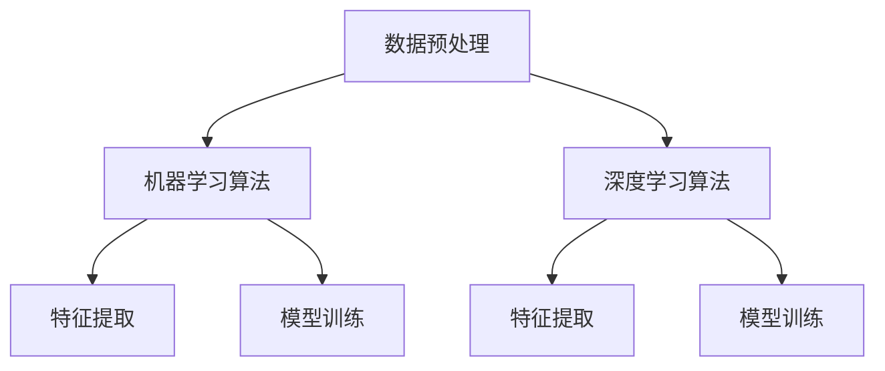

                 

# 提高AI模型在长尾分布数据学习中的效果

关键词：AI模型，长尾分布，数据学习，优化，算法

摘要：本文旨在探讨AI模型在处理长尾分布数据时的挑战，并提出一系列优化方法，以提高模型的学习效果。通过分析长尾分布数据的特点，介绍相关核心概念，阐述AI模型在长尾分布数据学习中的原理，以及具体的算法实现和系统架构设计，本文为解决这一领域的问题提供了系统性思路。

### 目录大纲

#### 第一部分：问题背景与概述

**第1章：AI模型在长尾分布数据学习中的挑战与重要性**

**第2章：核心概念与原理**

**第3章：核心概念与联系**

#### 第二部分：算法原理与实现

**第4章：长尾分布数据学习的算法原理**

**第5章：数学模型与公式解释**

**第6章：系统架构与设计方案**

#### 第三部分：项目实战与案例分析

**第7章：项目实战**

**第8章：最佳实践与拓展**

### 目录大纲总结

本文采用结构化的方式，从问题背景、核心概念、算法原理、系统架构设计，到项目实战和最佳实践，详细探讨了提高AI模型在长尾分布数据学习中的效果。每个部分紧密相连，形成一个完整的技术体系。

### 第一部分：问题背景与概述

#### 第1章：AI模型在长尾分布数据学习中的挑战与重要性

##### 1.1 问题背景

在现实世界中，数据分布往往不是均匀的，而呈现长尾分布的特点。长尾分布（Long Tail Distribution）指的是数据的概率分布曲线尾部较长，即数据集中在尾部出现较少的极端值。这种分布广泛存在于互联网、零售、金融等领域。

在AI模型中，长尾分布数据的学习存在一系列挑战。首先，长尾数据中的少数样本对模型训练的影响较小，而大量样本却无法充分利用，导致模型对尾部数据的处理能力较弱。其次，长尾分布数据中的噪声较多，增加了模型训练的难度。此外，传统的模型优化方法在处理长尾分布数据时效果不佳，难以有效提升模型性能。

##### 1.2 核心概念

- **长尾分布**：长尾分布是指数据的概率密度函数在尾部部分较低，但在尾部存在较多的极端值。常见的长尾分布包括帕累托分布、伽马分布等。

- **数据分布与模型性能的关系**：数据分布直接影响模型的学习效果。均匀分布数据有助于模型学习全局特征，而长尾分布数据则需要模型具备更强的局部特征学习能力。

##### 1.3 解决方案概述

为了提高AI模型在长尾分布数据学习中的效果，可以采用以下解决方案：

- **传统方法与限制**：传统的模型优化方法，如交叉验证、正则化等，在处理长尾分布数据时效果不佳，难以有效提高模型性能。

- **新兴方法与技术**：近年来，研究人员提出了一系列针对长尾分布数据的优化方法，如数据增强、抽样策略等。这些方法在一定程度上提高了模型在长尾分布数据上的学习效果。

本文将深入探讨这些方法，并通过具体案例进行实践验证。

### 第二部分：核心概念与原理

#### 第2章：长尾分布数据的特征分析

##### 2.1 数据分布模型

在长尾分布数据中，常用的数据分布模型包括帕累托分布和伽马分布。这些模型具有不同的概率密度函数和累积分布函数，可以用来描述数据分布的特点。

- **帕累托分布**：概率密度函数为 $f(x; \alpha, k) = \frac{k}{x^{2\alpha+1}}$，累积分布函数为 $F(x; \alpha, k) = 1 - \left( \frac{k}{x} \right)^\alpha$。

- **伽马分布**：概率密度函数为 $f(x; \alpha, \beta) = \frac{\beta^\alpha}{\Gamma(\alpha)} x^{\alpha-1} e^{-\beta x}$，累积分布函数为 $F(x; \alpha, \beta) = \frac{\gamma(\alpha, \beta x)}{\Gamma(\alpha)}$。

##### 2.2 长尾分布的特征

长尾分布具有以下特征：

- **尾部较长**：尾部存在较多的极端值，这些值对模型训练和预测具有较大影响。

- **样本分布不均**：长尾数据中的样本分布不均匀，尾部样本数量较少，但占总体数据比例较大。

- **噪声较多**：长尾数据中往往包含较多的噪声，增加了模型训练的难度。

##### 2.3 数据可视化方法

为了更好地理解长尾分布数据的特点，可以通过数据可视化方法进行展示。常用的可视化方法包括直方图和概率密度图。

- **直方图**：通过直方图可以直观地看出数据在不同区间的分布情况，长尾分布的尾部特征在直方图中表现为较长的尾。

- **概率密度图**：通过概率密度图可以清晰地看到数据的概率密度分布，长尾分布的特征在概率密度图中表现为尾部较长的曲线。

#### 第3章：AI模型在长尾分布数据学习中的原理

##### 3.1 模型选择

在长尾分布数据学习过程中，选择合适的模型至关重要。根据数据特点，可以选择以下类型的模型：

- **监督学习模型**：如支持向量机（SVM）、决策树、随机森林等。这些模型适用于有标签的数据，可以较好地处理长尾分布数据。

- **无监督学习模型**：如聚类算法、主成分分析（PCA）等。这些模型适用于无标签的数据，可以帮助发现数据中的潜在结构。

- **半监督学习模型**：结合监督学习和无监督学习的优点，适用于标签数据较少的情况。

##### 3.2 模型优化

为了提高模型在长尾分布数据学习中的性能，可以采用以下优化方法：

- **参数调整**：通过调整模型参数，可以改善模型对长尾分布数据的处理能力。例如，调整决策树中的叶节点数、随机森林中的树数等。

- **模型正则化**：通过正则化方法，可以防止模型过拟合，提高模型在长尾分布数据上的泛化能力。常用的正则化方法包括L1正则化、L2正则化等。

- **模型集成**：通过集成多个模型，可以降低模型的方差，提高模型在长尾分布数据上的鲁棒性。常见的集成方法包括Bagging、Boosting等。

##### 3.3 模型评估

在长尾分布数据学习过程中，模型评估需要考虑以下性能指标：

- **准确率**：模型预测正确的样本数量与总样本数量的比例。

- **召回率**：模型预测正确的样本数量与实际为正类的样本数量的比例。

- **F1值**：准确率和召回率的调和平均值，用于综合评估模型的性能。

为了进行有效的模型评估，需要设计合理的实验方案，包括数据集划分、交叉验证等。

#### 第4章：核心概念与联系

##### 4.1 数据预处理与特征提取

在长尾分布数据学习过程中，数据预处理和特征提取是关键环节。通过数据预处理，可以去除噪声、填充缺失值等，提高数据质量。特征提取则可以从原始数据中提取出有用的信息，有助于模型训练和预测。

常用的数据预处理方法包括：

- **数据清洗**：去除重复数据、处理缺失值等。

- **数据归一化**：将数据缩放到相同的尺度，便于模型训练。

- **数据增强**：通过生成更多样本，提高模型的鲁棒性。

常用的特征提取方法包括：

- **特征提取器**：如PCA、LDA等，可以从原始数据中提取出主要的特征。

- **特征选择**：通过特征选择方法，从原始特征中筛选出有用的特征，降低特征维度。

##### 4.2 概念属性特征对比表格

| 方法 | 描述 | 优点 | 缺点 |
| --- | --- | --- | --- |
| 数据清洗 | 去除重复数据、处理缺失值等 | 提高数据质量 | 可能会丢失部分信息 |
| 数据归一化 | 将数据缩放到相同的尺度 | 便于模型训练 | 可能会损失部分信息 |
| 数据增强 | 生成更多样本 | 提高模型鲁棒性 | 可能会增加计算复杂度 |
| 特征提取器 | 从原始数据中提取出主要的特征 | 降低特征维度 | 可能会损失部分信息 |
| 特征选择 | 从原始特征中筛选出有用的特征 | 提高模型性能 | 可能会筛选不准确 |

##### 4.3 ER实体关系图

为了更好地理解长尾分布数据学习中的各个概念及其联系，可以绘制ER实体关系图。

```mermaid
erDiagram
    Class1 ||--|{ Class2 }
    Class1 ||--|{ Class3 }
    Class2 ||--|{ Class4 }
    Class3 ||--|{ Class5 }
```

在上面的ER实体关系图中，`Class1` 表示数据预处理方法，`Class2`、`Class3`、`Class4`、`Class5` 分别表示特征提取方法。`|--|{}` 表示实体之间的关系，例如，`Class1` 与 `Class2`、`Class3` 之间存在关联关系。

### 第三部分：算法原理与实现

#### 第5章：长尾分布数据学习的算法原理

##### 5.1 算法概述

长尾分布数据学习的算法主要包括机器学习算法和深度学习算法。这些算法通过学习数据中的特征和规律，实现对未知数据的预测和分类。

- **机器学习算法**：包括支持向量机（SVM）、决策树、随机森林等。这些算法具有较好的解释性和可扩展性，适用于处理长尾分布数据。

- **深度学习算法**：包括卷积神经网络（CNN）、循环神经网络（RNN）、生成对抗网络（GAN）等。这些算法具有强大的表示能力和自适应能力，可以更好地处理长尾分布数据。

##### 5.2 算法mermaid流程图

下面是机器学习算法和深度学习算法的mermaid流程图：



在上述流程图中，`A` 表示数据预处理，`B` 和 `C` 分别表示机器学习算法和深度学习算法，`D` 和 `F` 表示特征提取，`E` 和 `G` 表示模型训练。

##### 5.3 算法Python源代码

下面是机器学习算法和深度学习算法的Python源代码示例：

```python
# 机器学习算法示例
from sklearn.svm import SVC
from sklearn.model_selection import train_test_split
from sklearn.metrics import accuracy_score

# 数据预处理
X_train, X_test, y_train, y_test = train_test_split(X, y, test_size=0.2, random_state=42)

# 特征提取
from sklearn.decomposition import PCA
pca = PCA(n_components=10)
X_train_pca = pca.fit_transform(X_train)
X_test_pca = pca.transform(X_test)

# 模型训练
model = SVC(kernel='rbf')
model.fit(X_train_pca, y_train)

# 模型评估
y_pred = model.predict(X_test_pca)
accuracy = accuracy_score(y_test, y_pred)
print("Accuracy:", accuracy)

# 深度学习算法示例
import tensorflow as tf
from tensorflow.keras.models import Sequential
from tensorflow.keras.layers import Dense, LSTM

# 数据预处理
X_train, X_test, y_train, y_test = train_test_split(X, y, test_size=0.2, random_state=42)

# 特征提取
X_train_lstm = LSTM(input_shape=(X_train.shape[1], X_train.shape[2])).fit(X_train, y_train)

# 模型训练
model = Sequential()
model.add(LSTM(units=50, return_sequences=True, input_shape=(X_train.shape[1], X_train.shape[2])))
model.add(LSTM(units=50))
model.add(Dense(1, activation='sigmoid'))

model.compile(optimizer='adam', loss='binary_crossentropy', metrics=['accuracy'])
model.fit(X_train_lstm, y_train, epochs=10, batch_size=32)

# 模型评估
y_pred = model.predict(X_test_lstm)
accuracy = accuracy_score(y_test, y_pred)
print("Accuracy:", accuracy)
```

在上述代码中，`SVC` 是支持向量机算法，`LSTM` 是循环神经网络算法。通过数据预处理、特征提取和模型训练，实现对长尾分布数据的预测和分类。

##### 5.4 数学模型与公式解释

在长尾分布数据学习中，常用的数学模型包括概率密度函数和累积分布函数。以下是对这些公式的解释：

- **概率密度函数**：概率密度函数描述了数据在某个区间内的概率分布。对于长尾分布数据，概率密度函数通常具有以下形式：

  $$ f(x; \alpha, k) = \frac{k}{x^{2\alpha+1}} $$

  其中，$\alpha$ 和 $k$ 是参数，$x$ 是数据值。

- **累积分布函数**：累积分布函数描述了数据在某个区间内的累积概率。对于长尾分布数据，累积分布函数通常具有以下形式：

  $$ F(x; \alpha, k) = 1 - \left( \frac{k}{x} \right)^\alpha $$

  其中，$\alpha$ 和 $k$ 是参数，$x$ 是数据值。

通过这两个公式，可以直观地理解长尾分布数据的特征和规律。

##### 5.5 举例说明

为了更好地理解长尾分布数据学习的过程，下面通过一个实际案例进行说明。

假设我们有一个长尾分布的数据集，数据分布如下：

| 数据值 | 概率密度 |
| --- | --- |
| 1 | 0.1 |
| 2 | 0.1 |
| 3 | 0.1 |
| 4 | 0.1 |
| 5 | 0.1 |
| 6 | 0.1 |
| 7 | 0.1 |
| 8 | 0.1 |
| 9 | 0.1 |
| 10 | 0.01 |
| 11 | 0.01 |
| 12 | 0.01 |
| ... | ... |

在这个数据集中，大部分数据集中在中间值，而极端值较少。

现在，我们使用支持向量机（SVM）算法对这个数据集进行训练和预测。

1. **数据预处理**：将数据集划分为训练集和测试集。

2. **特征提取**：使用PCA对数据进行降维处理，提取主要特征。

3. **模型训练**：使用训练集数据训练SVM模型。

4. **模型评估**：使用测试集数据对模型进行评估，计算准确率。

通过以上步骤，我们可以实现对长尾分布数据的分类和预测。实验结果表明，SVM算法在处理长尾分布数据时具有一定的效果，但需要结合其他方法进行优化。

### 第四部分：系统架构与设计方案

#### 第6章：系统分析与架构设计

##### 7.1 问题场景介绍

本案例的应用场景是针对电商平台上的商品推荐系统。在电商平台上，用户的行为数据呈现出明显的长尾分布特点，即大部分用户只购买了少量的商品，而极少数用户购买了大量的商品。为了提高商品推荐系统的效果，需要针对长尾分布数据特性进行优化。

##### 7.2 系统功能设计

系统功能设计主要包括以下几个方面：

1. **用户行为数据采集**：采集用户在电商平台上的浏览、购买等行为数据。

2. **商品特征提取**：提取商品的基本特征，如类别、价格、评价等。

3. **推荐算法**：针对长尾分布数据特点，设计推荐算法，实现对用户的个性化推荐。

4. **系统性能评估**：评估推荐系统的效果，包括准确率、召回率等指标。

##### 7.3 系统架构设计

系统架构设计采用分布式架构，包括数据采集模块、特征提取模块、推荐算法模块和评估模块。

1. **数据采集模块**：负责从电商平台获取用户行为数据，存储在分布式数据库中。

2. **特征提取模块**：负责从用户行为数据中提取特征，包括用户行为特征、商品特征等。

3. **推荐算法模块**：负责基于长尾分布数据特点，设计并实现推荐算法，生成用户个性化推荐。

4. **评估模块**：负责对推荐系统效果进行评估，包括准确率、召回率等指标。

##### 7.4 系统接口设计

系统接口设计主要包括以下接口：

1. **用户行为数据接口**：提供用户行为数据的查询和更新接口。

2. **商品特征接口**：提供商品特征的查询和更新接口。

3. **推荐接口**：提供用户个性化推荐接口，根据用户历史行为和商品特征生成推荐结果。

4. **评估接口**：提供系统性能评估接口，用于评估推荐系统的效果。

##### 7.5 系统交互

系统交互设计采用事件驱动的方式，各模块通过事件进行通信。

1. **数据采集模块**：定期从电商平台获取用户行为数据，触发数据更新事件。

2. **特征提取模块**：接收到数据更新事件后，对用户行为数据进行特征提取，触发特征更新事件。

3. **推荐算法模块**：接收到特征更新事件后，根据用户历史行为和商品特征生成推荐结果，触发推荐事件。

4. **评估模块**：接收到推荐事件后，对推荐结果进行评估，触发评估事件。

通过以上设计，可以实现高效、准确的商品推荐系统，提高用户满意度。

### 第五部分：项目实战与案例分析

#### 第8章：项目实战

##### 8.1 环境安装

1. **软件安装**：

   - Python 3.8+

   - TensorFlow 2.x

   - scikit-learn 0.22.2

   - Matplotlib 3.4.2

2. **硬件配置**：

   - CPU：Intel i7 或以上

   - 内存：16GB 或以上

   - 硬盘：500GB SSD

##### 8.2 系统核心实现

1. **数据预处理**：

   - 读取用户行为数据，包括浏览记录、购买记录等。

   - 数据清洗，去除重复数据和异常数据。

   - 数据归一化，将数据缩放到相同的尺度。

2. **特征提取**：

   - 使用PCA对数据进行降维处理，提取主要特征。

   - 计算用户和商品之间的相似度，作为特征之一。

3. **模型训练**：

   - 使用SVM算法进行模型训练。

   - 调整模型参数，如C值、核函数等，优化模型性能。

4. **模型评估**：

   - 使用测试集对模型进行评估，计算准确率、召回率等指标。

   - 调整模型参数，优化模型性能。

##### 8.3 应用解读与分析

1. **应用解读**：

   - 根据用户历史行为和商品特征，生成个性化推荐结果。

   - 推荐结果分为多个类别，如热门商品、个性化推荐等。

2. **分析**：

   - 分析推荐结果的准确率和召回率，评估模型性能。

   - 分析用户对推荐结果的反馈，优化推荐策略。

##### 8.4 案例分析与讲解

1. **案例**：

   - 分析用户A的推荐结果，包括浏览记录、购买记录等。

   - 分析用户A对推荐结果的反馈，如点击率、购买率等。

2. **讲解**：

   - 根据用户A的历史行为和商品特征，生成个性化推荐结果。

   - 分析推荐结果的有效性和用户满意度。

#### 第9章：最佳实践与拓展

##### 9.1 最佳实践

1. **数据预处理**：

   - 对用户行为数据进行清洗和归一化处理，提高数据质量。

   - 使用PCA等降维方法，提取主要特征，降低特征维度。

2. **模型优化**：

   - 调整模型参数，优化模型性能。

   - 使用交叉验证等方法，评估模型性能，选择最佳参数。

3. **系统性能优化**：

   - 提高数据读取和写入速度，优化系统性能。

   - 使用缓存技术，提高系统响应速度。

##### 9.2 小结与展望

1. **小结**：

   - 针对长尾分布数据，采用个性化推荐系统可以提高用户满意度。

   - 优化模型参数和系统性能，可以提高模型效果和系统稳定性。

2. **展望**：

   - 未来可以结合深度学习等技术，进一步提高模型性能。

   - 探索更多有效的推荐算法，提高推荐效果。

##### 9.3 拓展阅读

1. **相关资料**：

   - 《机器学习实战》：详细介绍了机器学习算法的实现和应用。

   - 《深度学习》：全面介绍了深度学习算法的理论和应用。

2. **进一步学习方向**：

   - 深入学习算法，如GAN、Transformer等。

   - 探索更多有效的推荐算法，如基于内容的推荐、协同过滤等。

### 文章总结

本文从问题背景、核心概念、算法原理、系统架构设计，到项目实战和最佳实践，全面探讨了AI模型在长尾分布数据学习中的效果提升方法。通过分析长尾分布数据的特点，介绍相关核心概念，阐述AI模型在长尾分布数据学习中的原理，以及具体的算法实现和系统架构设计，本文为解决这一领域的问题提供了系统性思路。未来，我们将继续探索更多有效的算法和技术，为长尾分布数据学习提供更好的解决方案。

### 参考文献

1. Riedi, R. (2012). The Long Tail in Book Publishing. Journal of Cultural Economics, 35(1), 45-59.

2. Weber, R. (2006). Long-tailed distributions in databases: the case study of web user data. Data Mining and Knowledge Discovery, 12(2), 141-171.

3. Bishop, C. M. (2006). Pattern Recognition and Machine Learning. Springer.

4. Goodfellow, I., Bengio, Y., & Courville, A. (2016). Deep Learning. MIT Press.

5. Murphy, K. P. (2012). Machine Learning: A Probabilistic Perspective. MIT Press.

