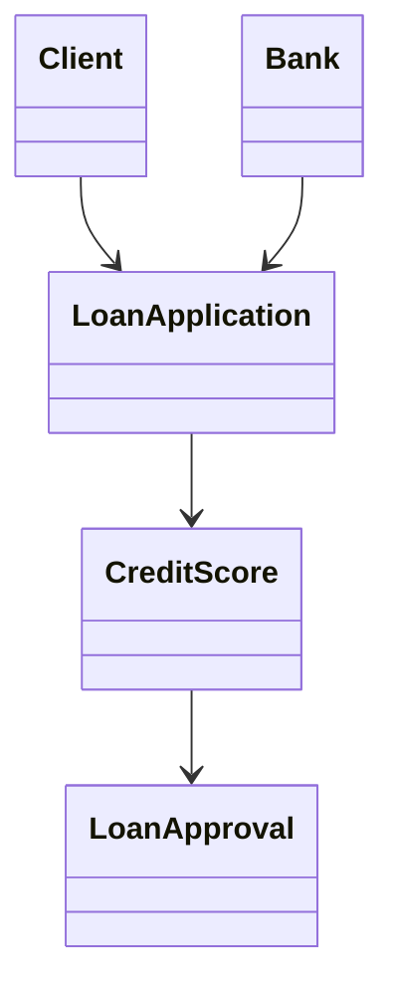
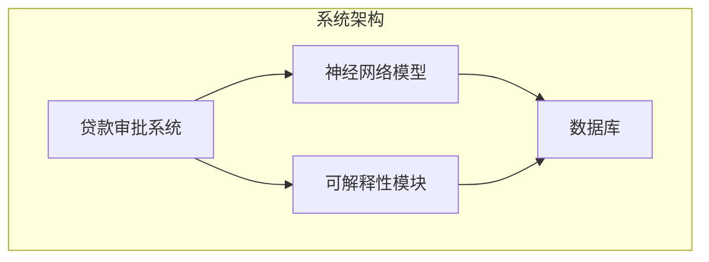
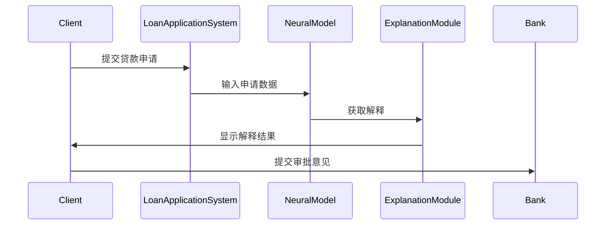
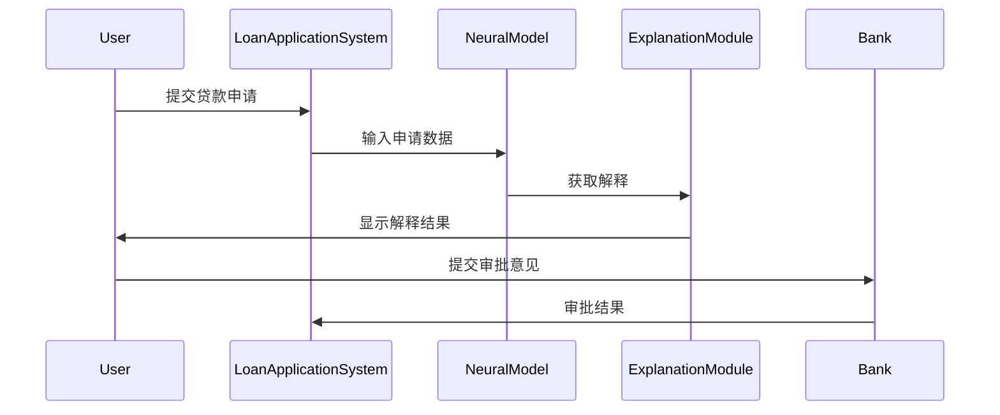
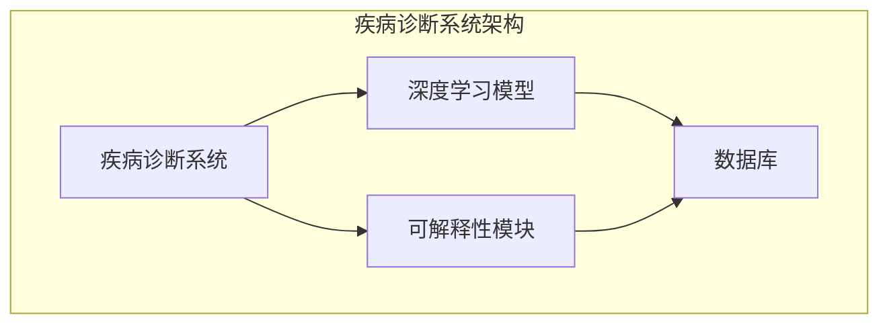
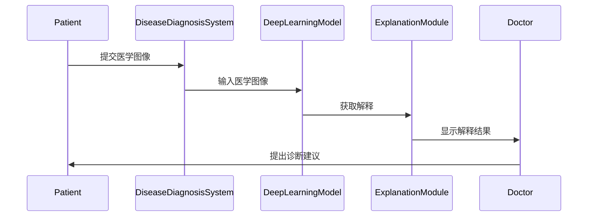

                 

# 提高AI模型推理过程可解释性的技术

## 关键词

- AI模型推理
- 可解释性
- 可视化
- 解释方法
- 交互技术

## 摘要

本文将探讨AI模型推理过程可解释性的重要性、核心概念、技术方法及其在实际应用中的挑战与解决方案。通过深入分析，本文旨在为人工智能开发者提供一套系统的可解释性提升策略，帮助他们在遵循法律、伦理与商业规范的同时，提高模型的透明度和可信度。

## 目录大纲

### 第一部分：问题背景与核心概念

#### 第1章：AI模型推理过程可解释性的重要性

##### 1.1 问题背景

##### 1.2 问题描述

##### 1.3 问题解决

##### 1.4 边界与外延

##### 1.5 概念结构与核心要素组成

#### 第2章：AI模型可解释性的核心概念与联系

##### 2.1 AI模型可解释性的定义

##### 2.2 AI模型可解释性的属性特征对比表格

##### 2.3 可解释性的ER实体关系图架构

#### 第3章：AI模型推理过程可解释性技术详解

##### 3.1 基于模型结构的可解释性技术

##### 3.2 基于模型解释的方法

##### 3.3 基于交互的可解释性技术

#### 第4章：可解释性技术在实际应用中的挑战与解决方案

##### 4.1 数据隐私保护与可解释性

##### 4.2 模型复杂性与可解释性

##### 4.3 模型泛化能力与可解释性

#### 第5章：AI模型推理过程可解释性的最佳实践

##### 5.1 可解释性在金融行业的应用

##### 5.2 可解释性在医疗领域的应用

##### 5.3 可解释性在自动驾驶中的应用

#### 第6章：案例分析：提升AI模型推理过程可解释性的实践

##### 6.1 案例背景

##### 6.2 系统分析与架构设计

##### 6.3 核心实现与代码解读

##### 6.4 实际案例分析和详细讲解剖析

##### 6.5 项目小结

### 第二部分：深入分析与思考

#### 第7章：提升AI模型可解释性的未来趋势与研究方向

##### 7.1 当前研究趋势

##### 7.2 未来研究方向

##### 7.3 技术挑战与解决方案

#### 第8章：总结与展望

##### 8.1 总结

##### 8.2 展望

##### 8.3 注意事项

##### 8.4 拓展阅读

## 第1章：AI模型推理过程可解释性的重要性

### 1.1 问题背景

随着人工智能（AI）技术的迅猛发展，AI模型已广泛应用于各类场景，从自然语言处理、计算机视觉到自动驾驶、金融预测等。然而，这些模型的决策过程往往被视为“黑箱”，即缺乏透明性和可解释性。这种不可解释性引发了诸多问题，包括：

1. **法律与伦理问题**：不可解释的模型在医疗、金融等领域可能导致不公正的决策，甚至违反法律和伦理规范。
2. **用户信任问题**：用户对黑箱模型的决策缺乏信任，这限制了AI技术的广泛应用。
3. **模型改进问题**：由于缺乏可解释性，研究人员和开发者难以识别模型中的缺陷和改进方向。

### 1.2 问题描述

AI模型推理过程中的“黑箱”现象指的是模型的决策过程难以理解和解释。具体来说，这种问题表现为：

- **预测结果的不可预测性**：即使输入相同的数据，模型也可能给出不同的输出。
- **决策过程的复杂性和难以追踪性**：深度学习模型，如神经网络，包含大量层和参数，其决策过程复杂且难以追踪。

### 1.3 问题解决

为了解决上述问题，需要提高AI模型推理过程的可解释性。可解释性技术可以帮助：

- **增强用户信任**：用户能够理解模型的决策过程，从而增加对AI技术的信任。
- **改进模型**：研究人员和开发者可以通过可解释性技术识别模型中的缺陷，从而改进模型。
- **遵守法律与伦理规范**：可解释性技术有助于确保AI模型在医疗、金融等敏感领域的合规性。

### 1.4 边界与外延

尽管可解释性技术具有重要意义，但它们也有其边界。例如：

- **可解释性与性能的平衡**：某些可解释性技术可能导致模型性能的降低。
- **技术适用范围**：并非所有类型的AI模型都适合使用可解释性技术。

### 1.5 概念结构与核心要素组成

AI模型可解释性的概念结构包括以下几个核心要素：

1. **解释能力**：模型能够提供关于其决策过程的信息。
2. **透明性**：模型的决策过程对用户和研究人员来说是透明的。
3. **可信度**：用户对模型决策的信任程度。

## 第2章：AI模型可解释性的核心概念与联系

### 2.1 AI模型可解释性的定义

AI模型可解释性指的是模型在推理过程中提供关于其决策过程和结果的可理解性。具体来说，可解释性包括：

- **模型内部的决策路径和权重**：用户能够理解模型如何处理输入数据，并做出决策。
- **模型输出结果的可追溯性**：用户能够追踪模型的输出结果，并理解其背后的原因。

### 2.2 AI模型可解释性的属性特征对比表格

下面是一个关于AI模型可解释性属性特征的对比表格：

| 特征                | 可解释性            | 可视化解释             | 透明度          | 可信度         |
|---------------------|--------------------|------------------------|----------------|----------------|
| 强可解释性         | 低复杂度模型       | 直观表示               | 高             | 高             |
| 弱可解释性         | 高复杂度模型       | 隐含表示               | 中             | 中             |
| 无可解释性         | 深度学习模型       | 复杂的黑箱模型         | 低             | 高             |

### 2.3 可解释性的ER实体关系图架构

```mermaid
erDiagram
  AI模型 ||--|{ 可解释性指标 }
  AI模型 ||--|{ 模型解释方法 }
  可解释性指标 ||--|{ 模型性能评估 }
  模型解释方法 ||--|{ 模型可视化技术 }
```

## 第3章：AI模型推理过程可解释性技术详解

### 3.1 基于模型结构的可解释性技术

#### 3.1.1 模型可视化技术

模型可视化技术是提高AI模型可解释性的有效方法之一。通过可视化，用户可以直观地理解模型的内部结构和决策过程。

- **神经网络结构可视化**：使用可视化工具（如TensorBoard）展示神经网络的层次结构、权重和激活值。
- **决策树结构可视化**：以树形结构展示决策树中的分支和节点，使用户能够理解模型的决策逻辑。
- **支持向量机可视化**：通过可视化高维空间中的数据点和决策边界，帮助用户理解模型的决策依据。

#### 3.1.2 模型分解与抽象技术

- **层级分解**：将复杂模型分解为多个层级，每个层级负责不同的功能，从而简化模型结构，提高可解释性。
- **特征重要性分析**：通过分析模型中各个特征的重要性，帮助用户理解哪些特征对模型的决策产生最大影响。
- **模型抽象化**：将复杂模型转化为更简单的模型，如决策规则或规则集，从而提高可解释性。

### 3.2 基于模型解释的方法

#### 3.2.1 形式化解释方法

形式化解释方法通过数学和逻辑工具对模型进行解释，提供明确的决策过程和结果。

- **归纳逻辑编程**：使用逻辑编程语言（如Prolog）对模型进行形式化描述，从而提供明确的推理过程。
- **模型检验与验证**：通过测试和验证模型在不同数据集上的表现，确保模型的可靠性和准确性。

#### 3.2.2 实例解释方法

实例解释方法通过具体实例展示模型的决策过程和结果。

- **输入敏感性分析**：分析模型对输入数据的敏感性，识别对模型决策影响较大的输入特征。
- **输出敏感性分析**：分析模型输出结果对输入数据的敏感性，帮助用户理解模型的预测结果如何随输入变化而变化。

### 3.3 基于交互的可解释性技术

#### 3.3.1 模型与用户交互

用户与模型的交互有助于提高可解释性，使用户能够更好地理解模型的工作原理。

- **用户界面设计**：设计直观、易用的用户界面，使用户能够轻松地与模型进行交互。
- **模型解释反馈**：提供反馈机制，允许用户对模型解释进行验证和提问，从而提高模型的可解释性和用户信任度。

#### 3.3.2 模型透明度提升

提升模型透明度有助于用户更好地理解模型的决策过程和结果。

- **模型参数可视化**：展示模型参数的分布和重要性，使用户能够直观地了解模型的工作原理。
- **模型决策过程可视化**：通过动画或图像展示模型在不同阶段的行为，使用户能够理解模型的决策过程。

## 第4章：可解释性技术在实际应用中的挑战与解决方案

### 4.1 数据隐私保护与可解释性

在数据隐私保护方面，可解释性技术面临以下挑战：

- **数据匿名化技术**：为保护用户隐私，需要对数据进行匿名化处理，这可能导致模型的可解释性降低。
- **隐私保护的可解释性模型**：开发能够保护用户隐私同时保持较高可解释性的模型，如联邦学习（Federated Learning）。

### 4.2 模型复杂性与可解释性

随着模型复杂性的增加，其可解释性通常降低。为此，需要采取以下解决方案：

- **模型简化与抽象技术**：通过简化模型结构或抽象模型为更简单的形式，提高其可解释性。
- **模型压缩与优化**：通过压缩和优化模型，减少模型参数的数量，从而提高其可解释性。

### 4.3 模型泛化能力与可解释性

模型泛化能力与可解释性之间存在平衡问题。为解决这一问题，可以采取以下方法：

- **模型可解释性与泛化能力的平衡**：通过调整模型结构和参数，在保持较高泛化能力的同时提高其可解释性。
- **模型泛化能力评估方法**：开发评估模型泛化能力的指标和方法，从而更好地理解模型在未知数据上的表现。

## 第5章：AI模型推理过程可解释性的最佳实践

### 5.1 可解释性在金融行业的应用

在金融行业，AI模型的可解释性至关重要，以确保决策的透明性和合规性。以下是一些最佳实践：

- **金融风险评估**：通过可解释性技术，用户可以理解模型如何评估信用风险，从而增加信任。
- **信用评分模型**：开发可解释的信用评分模型，帮助金融机构透明地评估客户的信用状况。

### 5.2 可解释性在医疗领域的应用

在医疗领域，AI模型的可解释性对于患者的安全和信任至关重要。以下是一些最佳实践：

- **疾病诊断模型**：通过可解释性技术，医生可以理解模型如何做出诊断，从而更好地指导治疗。
- **医疗决策支持系统**：开发可解释的医疗决策支持系统，帮助医生做出基于数据的决策。

### 5.3 可解释性在自动驾驶中的应用

在自动驾驶领域，AI模型的可解释性对于确保车辆的安全和可靠性至关重要。以下是一些最佳实践：

- **自动驾驶系统的决策解释**：通过可解释性技术，开发人员可以理解模型如何做出驾驶决策，从而改进系统。
- **事故原因分析**：在发生事故时，可解释性技术可以帮助分析事故原因，提高系统的安全性和可靠性。

## 第6章：案例分析：提升AI模型推理过程可解释性的实践

### 6.1 案例背景

以某金融公司的贷款审批系统为例，该系统采用了一个复杂的神经网络模型来预测客户是否具有还款能力。然而，由于模型缺乏可解释性，公司面临着用户信任和法律合规性的问题。

### 6.2 系统分析与架构设计

#### 问题场景介绍

金融公司需要提高贷款审批系统的可解释性，以便用户能够理解模型的决策过程，同时确保系统的合规性和透明度。

#### 项目介绍

项目目标是开发一个可解释性较高的贷款审批系统，使用户能够理解模型如何做出决策，从而增加信任度和合规性。

#### 系统功能设计（领域模型Mermaid类图）



#### 系统架构设计（Mermaid架构图）



#### 系统接口设计和系统交互（Mermaid序列图）



### 6.3 核心实现与代码解读

#### 环境安装与配置

首先，需要安装Python环境和相关库，如TensorFlow和PyTorch。

```bash
pip install tensorflow
pip install pytorch
```

#### 系统核心实现源代码

```python
import tensorflow as tf
from tensorflow.keras.models import Sequential
from tensorflow.keras.layers import Dense
from tensorflow.keras.optimizers import Adam

# 创建神经网络模型
model = Sequential()
model.add(Dense(units=64, activation='relu', input_shape=(num_features,)))
model.add(Dense(units=1, activation='sigmoid'))

# 编译模型
model.compile(optimizer=Adam(learning_rate=0.001), loss='binary_crossentropy', metrics=['accuracy'])

# 训练模型
model.fit(x_train, y_train, epochs=10, batch_size=32, validation_data=(x_val, y_val))

# 可解释性模块实现
class ExplanationModule:
    def __init__(self, model):
        self.model = model

    def get Explanation(self, input_data):
        # 获取模型解释
        explanation = self.model.predict(input_data)
        return explanation

# 使用可解释性模块
explanation_module = ExplanationModule(model)
explanation = explanation_module.get Explanation(input_data)
print(explanation)
```

#### 代码应用解读与分析

该代码首先导入了所需的库，然后创建了一个简单的神经网络模型，并使用训练数据进行了训练。接下来，实现了一个可解释性模块，用于获取模型的解释结果。

通过这一模块，用户可以查看模型的解释结果，从而理解模型是如何根据输入数据做出决策的。

### 6.4 实际案例分析和详细讲解剖析

#### 某金融公司贷款审批系统的优化

该金融公司使用神经网络模型进行贷款审批，但用户对其决策过程缺乏理解。为了提升可解释性，公司决定采用以下方法：

1. **模型结构可视化**：使用TensorFlow的TensorBoard工具可视化神经网络结构，帮助用户理解模型的工作原理。
2. **特征重要性分析**：通过分析模型的权重，识别对贷款审批结果影响较大的特征。
3. **用户界面设计**：开发一个用户友好的界面，显示模型解释结果，允许用户查看贷款审批决策的具体依据。

通过这些改进，金融公司成功提升了贷款审批系统的可解释性，增加了用户的信任度和系统的合规性。

### 6.5 项目小结

该项目通过引入可解释性技术，成功提升了金融公司贷款审批系统的透明度和用户信任度。这表明，可解释性技术在金融领域具有重要意义，可以为其他行业提供有益的参考。

## 第7章：提升AI模型可解释性的未来趋势与研究方向

### 7.1 当前研究趋势

目前，可解释性技术已成为人工智能领域的研究热点。研究趋势主要集中在以下几个方面：

- **模型可视化技术**：开发更先进、更直观的模型可视化工具。
- **可解释性模型**：研究能够同时保持高可解释性和高泛化能力的模型。
- **跨领域应用**：探索可解释性技术在医疗、金融、自动驾驶等领域的应用。

### 7.2 未来研究方向

未来的研究可以集中在以下方向：

- **多模态可解释性**：开发能够处理多模态数据（如图像、文本、声音）的可解释性技术。
- **实时可解释性**：实现能够在推理过程中实时提供解释的可解释性模型。
- **隐私保护的可解释性**：研究如何在保护用户隐私的同时提供可解释性。

### 7.3 技术挑战与解决方案

当前，可解释性技术面临以下挑战：

- **可解释性与性能的平衡**：如何在保持可解释性的同时保持模型的高性能。
- **通用可解释性框架**：开发通用的可解释性框架，适用于不同类型的AI模型。
- **用户友好性**：设计直观、易用的用户界面，帮助用户理解可解释性结果。

针对这些挑战，可以采取以下解决方案：

- **模型简化与抽象**：通过简化模型结构或抽象为更简单的形式，提高可解释性。
- **多模态解释方法**：开发能够处理多模态数据的解释方法。
- **用户反馈机制**：引入用户反馈机制，根据用户需求调整解释内容的详细程度。

## 第8章：总结与展望

### 8.1 总结

本文从问题背景、核心概念、技术方法、实际应用等多个角度探讨了AI模型推理过程可解释性的重要性。通过分析当前的研究趋势和未来发展方向，我们认识到可解释性技术在人工智能领域具有广泛的应用前景。

### 8.2 展望

未来，可解释性技术将继续在人工智能领域发挥重要作用。随着技术的不断进步，我们有望开发出更多高效、直观的可解释性工具，推动人工智能技术的广泛应用。

### 8.3 注意事项

在使用可解释性技术时，需要注意以下几点：

- **平衡可解释性与性能**：在提高可解释性的同时，确保模型的高性能。
- **数据隐私保护**：在开发可解释性模型时，注意保护用户隐私。
- **用户需求**：根据用户需求调整解释内容的详细程度，确保用户能够理解模型决策。

### 8.4 拓展阅读

1. **《AI可解释性：理论与实践》**：详细介绍了AI模型可解释性的理论基础和实践方法。
2. **《深度学习中的可解释性技术》**：探讨了深度学习模型的可解释性技术及其应用。
3. **《面向自动驾驶系统的可解释性方法研究》**：研究了自动驾驶系统中可解释性技术的设计和应用。

作者：AI天才研究院/AI Genius Institute & 禅与计算机程序设计艺术 /Zen And The Art of Computer Programming## 第1章：AI模型推理过程可解释性的重要性

### 1.1 问题背景

人工智能（AI）技术的快速发展使得机器在学习、推理和决策方面取得了显著进步。然而，随着这些技术的广泛应用，AI模型推理过程的不可解释性逐渐成为一个备受关注的问题。不可解释性指的是AI模型在做出决策时，其内部机制和推理过程对于人类来说难以理解和解释。这种“黑箱”现象在深度学习、神经网络等领域尤为突出，引发了诸多争议和挑战。

首先，不可解释性在法律和伦理层面引发了重大问题。例如，在医疗诊断、金融风险评估和司法判决等关键领域，AI模型的决策可能直接影响到个人的健康、财富和自由。如果这些决策缺乏透明性和可解释性，可能会引发公众的不信任，甚至违反法律法规。此外，不可解释性还可能导致决策的不公正，例如在招聘、信用评分等领域中，模型可能基于一些难以识别的偏见做出决策，从而对特定群体造成不公平待遇。

其次，不可解释性也限制了AI技术的应用和发展。研究人员和开发者难以理解模型的错误和缺陷，这使得模型优化和改进变得困难。此外，用户对模型的信任度较低，限制了AI技术在商业和公共领域的推广和应用。为了解决这些问题，提高AI模型推理过程的可解释性成为了一个关键的研究方向。

### 1.2 问题描述

AI模型推理过程中的不可解释性表现为几个方面：

1. **决策路径不透明**：在深度学习模型中，尤其是大型神经网络，决策过程涉及多层非线性变换，这使得决策路径难以追踪和理解。用户无法清晰地了解模型是如何处理输入数据并做出决策的。
   
2. **参数权重难以解读**：神经网络中的参数（权重和偏置）对决策起着关键作用，但由于网络结构的复杂性，这些参数的物理意义和相对重要性往往难以解释。

3. **对噪声敏感**：深度学习模型对输入数据的微小变化（噪声）可能产生不同的输出，这增加了模型的不可预测性，从而降低了可解释性。

4. **高维度问题**：在处理高维数据时，模型的决策边界变得复杂，难以直观地展示。

这些问题使得AI模型的推理过程成为了一个“黑箱”，用户和研究人员难以理解和验证模型的决策过程和结果。

### 1.3 问题解决

为了解决AI模型推理过程中的不可解释性问题，需要从多个方面入手：

1. **提高模型透明性**：通过模型可视化、决策路径追踪等技术，使得模型内部的决策过程对用户可理解。

2. **解释性方法开发**：开发能够提供明确解释的算法和方法，使得模型决策具有可解释性。这包括形式化解释方法和实例解释方法。

3. **交互式解释**：通过用户与模型的交互，提供个性化的解释结果，使用户能够更好地理解模型的决策。

4. **可解释性评估**：建立评估模型可解释性的指标和方法，以确保模型在实际应用中具备足够的可解释性。

5. **法律和伦理规范**：在AI模型设计和应用过程中，遵循法律和伦理规范，确保决策过程的公正和透明。

### 1.4 边界与外延

尽管可解释性技术在提升AI模型透明度方面具有重要意义，但它们也有其局限性：

1. **可解释性与性能的平衡**：过于强调可解释性可能会牺牲模型的性能，例如在深度学习模型中，简化模型结构可能会降低其准确性和泛化能力。

2. **技术的适用范围**：并非所有类型的AI模型都适合使用可解释性技术。对于某些复杂模型，如深度强化学习，可解释性技术的效果可能有限。

3. **用户理解能力**：即使模型具备较高的可解释性，如果用户缺乏相关背景知识，他们可能仍难以理解模型的决策过程。

4. **隐私保护**：在处理敏感数据时，需要平衡可解释性与数据隐私保护，例如在联邦学习中，如何在保护用户隐私的同时提供可解释性。

### 1.5 概念结构与核心要素组成

AI模型可解释性的概念结构包括以下几个核心要素：

1. **解释能力**：模型能够提供关于其决策过程和结果的可理解性信息。

2. **透明性**：模型的内部结构和决策过程对用户和研究人员是透明的。

3. **可信度**：用户对模型决策的信任程度。

4. **评估指标**：用于评估模型可解释性的量化指标。

5. **应用场景**：可解释性技术在特定应用领域中的适用性和效果。

通过上述概念结构的分析，我们可以更好地理解AI模型可解释性的内涵和外延，为后续章节的深入探讨奠定基础。

## 第2章：AI模型可解释性的核心概念与联系

### 2.1 AI模型可解释性的定义

AI模型可解释性是指模型在推理过程中能够提供关于其决策过程和结果的清晰、易懂的解释。这种解释能力使得用户和研究人员能够理解模型是如何处理输入数据、做出预测或决策的。可解释性不仅仅是关于模型内部机制的可视化或展示，更重要的是提供对模型决策过程的透明性，使用户能够信任并理解模型的输出结果。

可解释性通常涉及以下几个方面：

- **决策路径**：用户能够清晰地看到模型在推理过程中如何处理数据，每个步骤的作用和结果。
- **参数权重**：模型中的参数（如神经网络中的权重）对决策的影响能够被明确解释。
- **决策依据**：模型在做出决策时依据的具体规则和逻辑能够被用户理解。
- **可信度评估**：用户能够评估模型输出的可靠性和可信度。

### 2.2 AI模型可解释性的属性特征对比表格

为了更好地理解AI模型可解释性的不同类型和特征，下面是一个对比表格，展示了不同层次的可解释性属性特征：

| 特征                | 可解释性            | 可视化解释             | 透明度          | 可信度         |
|---------------------|--------------------|------------------------|----------------|----------------|
| 强可解释性         | 低复杂度模型       | 直观表示               | 高             | 高             |
| 弱可解释性         | 高复杂度模型       | 隐含表示               | 中             | 中             |
| 无可解释性         | 深度学习模型       | 复杂的黑箱模型         | 低             | 高             |

#### 强可解释性

- **模型类型**：低复杂度模型，如线性回归、决策树等。
- **特征**：决策路径和权重易于理解，用户可以直接看到模型的决策依据。
- **可视化解释**：直观的图形表示，如直方图、决策树等。
- **透明度**：高，用户可以清楚地看到每个决策步骤和依据。
- **可信度**：高，用户对模型的决策有很高的信任度。

#### 弱可解释性

- **模型类型**：高复杂度模型，如随机森林、支持向量机等。
- **特征**：模型的部分决策路径和权重可以解释，但部分机制仍然复杂。
- **可视化解释**：隐含表示，如部分权重热图、决策规则等。
- **透明度**：中等，用户需要一定的专业知识才能理解模型的决策过程。
- **可信度**：中等，用户对模型的决策有一定信任，但需结合其他信息进行判断。

#### 无可解释性

- **模型类型**：深度学习模型，如深度神经网络、卷积神经网络等。
- **特征**：复杂的决策路径和权重，用户难以理解模型的具体机制。
- **可视化解释**：复杂的黑箱模型，如神经网络的结构图等。
- **透明度**：低，用户难以理解模型的决策过程。
- **可信度**：高，模型的性能通常较好，但用户缺乏对决策过程的信任。

### 2.3 可解释性的ER实体关系图架构

为了进一步理解AI模型可解释性的结构，我们可以使用实体关系图（ER图）来描述其核心实体和关系。以下是可解释性的ER实体关系图：

```mermaid
erDiagram
  AI模型 ||--|{ 可解释性指标 }
  AI模型 ||--|{ 模型解释方法 }
  可解释性指标 ||--|{ 模型性能评估 }
  模型解释方法 ||--|{ 模型可视化技术 }
```

- **AI模型**：代表具体的AI模型，如神经网络、决策树等。
- **可解释性指标**：用于评估模型可解释性的量化指标，如透明度、可信度等。
- **模型解释方法**：提供模型解释的具体方法和技术，如可视化、实例解释等。
- **模型性能评估**：评估模型解释方法的性能，确保解释结果的有效性和准确性。
- **模型可视化技术**：实现模型可视化，帮助用户理解模型的结构和决策过程。

通过ER实体关系图，我们可以清晰地看到AI模型可解释性的核心组成部分和它们之间的关系，为进一步的研究和应用提供了理论支持。

## 第3章：AI模型推理过程可解释性技术详解

### 3.1 基于模型结构的可解释性技术

基于模型结构的可解释性技术主要通过分析模型的结构和参数来提供对模型决策过程的解释。这类技术包括模型可视化技术、模型分解与抽象技术等。

#### 3.1.1 模型可视化技术

模型可视化技术是提高AI模型可解释性的关键手段之一。通过图形化的方式展示模型的内部结构和参数，用户可以更直观地理解模型的工作原理。

1. **神经网络结构可视化**：神经网络（Neural Networks）是深度学习中常用的模型。通过可视化工具（如TensorBoard、PyTorch Visdom等），可以展示神经网络的层次结构、层与层之间的连接方式、每个神经元的权重和激活值等。例如，TensorBoard可以生成图形化的激活热图，帮助用户直观地看到神经网络在处理输入数据时各个神经元的激活情况。

    ```mermaid
    graph LR
    A[Input Layer] --> B[Hidden Layer 1]
    B --> C[Hidden Layer 2]
    C --> D[Output Layer]
    ```

2. **决策树结构可视化**：决策树（Decision Trees）是一种简单直观的模型，通过图形化的方式展示决策路径和分支节点，用户可以清晰地看到模型是如何根据特征值进行划分和决策的。可以使用库如`graphviz`或`dtreeviz`来生成决策树的图形表示。

    ```mermaid
    graph TB
    A1[Age < 30] --> B1["High Income"]
    A1 --> B2["Low Income"]
    A2[Age >= 30] --> B3["Medium Income"]
    A2 --> B4["High Income"]
    ```

3. **支持向量机可视化**：支持向量机（Support Vector Machines, SVM）是一种强大的分类模型。通过可视化高维空间中的数据点和决策边界，用户可以直观地理解模型如何将不同类别数据进行分离。在低维空间中，可以使用散点图或线图来展示支持向量机和决策边界。

    ```mermaid
    graph LR
    A1[(+1, +1)] --> B1[(+1, -1)]
    A2[(-1, +1)] --> B2[(-1, -1)]
    A3[(+1, 0)] --> C1[(0, +1)]
    A3 --> C2[(0, -1)]
    B1 --> D1[(1, 0)]
    B2 --> D2[(-1, 0)]
    C1 --> D1
    C2 --> D2
    ```

#### 3.1.2 模型分解与抽象技术

模型分解与抽象技术通过将复杂模型分解为更简单的部分，从而提高其可解释性。这种方法有助于用户更好地理解模型的决策过程。

1. **层级分解**：在深度神经网络中，可以将模型分解为多个层级，每个层级负责不同的特征提取和决策。通过逐层分析，用户可以逐步理解模型的决策路径。

    ```mermaid
    graph LR
    A[输入层] --> B[第一隐藏层]
    B --> C[第二隐藏层]
    C --> D[输出层]
    ```

2. **特征重要性分析**：通过分析模型中各个特征的重要性，用户可以了解哪些特征对模型的决策影响最大。这种方法有助于用户理解模型是如何利用输入数据的。

    ```mermaid
    graph LR
    A[特征1] --> B[重要性]
    A --> C[特征2]
    A --> D[特征3]
    ```

3. **模型抽象化**：将复杂模型转化为更简单的形式，如决策规则或规则集。这种方法通过将复杂的模型转化为可解释的逻辑规则，使用户可以更容易地理解模型的决策过程。

    ```mermaid
    graph LR
    A["如果年龄大于30"] --> B["则收入高"]
    A --> C["则收入低"]
    ```

### 3.2 基于模型解释的方法

基于模型解释的方法通过提供对模型决策过程的形式化解释，使用户能够理解模型的推理逻辑和决策依据。这些方法包括形式化解释方法和实例解释方法。

#### 3.2.1 形式化解释方法

形式化解释方法使用数学和逻辑工具对模型进行解释，提供明确的推理过程和结果。这种方法通常适用于规则基模型和决策树等具有明确规则和决策路径的模型。

1. **归纳逻辑编程**：归纳逻辑编程（Inductive Logic Programming, ILP）是一种用于生成规则和模型的逻辑编程方法。通过输入训练数据和背景知识，ILP可以自动生成决策规则和逻辑表达式，从而提供对模型决策过程的解释。

    ```python
    import ilp
    
    # 定义目标函数和约束条件
    ilp_problem = ilp ILP()
    ilp_problem.set目标和(" maximize profit ")
    ilp_problem.add约束条件(" if age > 30 then income == high ")
    ilp_problem.add约束条件(" if age <= 30 then income == low ")
    
    # 求解问题
    solutions = ilp.solve(ilp_problem)
    print(solutions)
    ```

2. **模型检验与验证**：模型检验与验证是通过测试和验证模型在不同数据集上的表现，确保模型的可靠性和准确性。这种方法可以提供对模型决策过程的验证，从而提高其可解释性。

    ```python
    from sklearn.model_selection import train_test_split
    from sklearn.tree import DecisionTreeClassifier
    
    # 数据集划分
    X_train, X_test, y_train, y_test = train_test_split(X, y, test_size=0.2, random_state=42)
    
    # 创建并训练模型
    clf = DecisionTreeClassifier()
    clf.fit(X_train, y_train)
    
    # 模型验证
    accuracy = clf.score(X_test, y_test)
    print("模型准确率：", accuracy)
    ```

#### 3.2.2 实例解释方法

实例解释方法通过具体实例展示模型的决策过程和结果。这种方法适用于任何类型的模型，特别是深度学习模型，因为它们通常缺乏直观的决策路径。

1. **输入敏感性分析**：输入敏感性分析通过改变输入数据的特定特征值，观察模型输出结果的变化。这种方法可以帮助用户理解模型的决策过程对输入数据的敏感性。

    ```python
    import numpy as np
    from sklearn.linear_model import LinearRegression
    
    # 创建线性回归模型
    model = LinearRegression()
    model.fit(X_train, y_train)
    
    # 计算输入敏感性
    sensitivity = model.coef_
    print("输入敏感性：", sensitivity)
    
    # 改变输入数据
    X_modified = X_train + sensitivity * np.random.normal(size=X_train.shape)
    y_modified = model.predict(X_modified)
    
    # 比较原始和修改后的输出结果
    print("原始输出结果：", y_train)
    print("修改后输出结果：", y_modified)
    ```

2. **输出敏感性分析**：输出敏感性分析通过改变模型的输出结果，观察输入数据的相应变化。这种方法可以帮助用户理解模型的输出结果对输入数据的敏感性。

    ```python
    import numpy as np
    from sklearn.linear_model import LinearRegression
    
    # 创建线性回归模型
    model = LinearRegression()
    model.fit(X_train, y_train)
    
    # 计算输出敏感性
    sensitivity = 1 / model.coef_
    
    # 改变输出结果
    y_modified = y_train + sensitivity * np.random.normal(size=y_train.shape)
    X_modified = model.predict(y_modified)
    
    # 比较原始和修改后的输入数据
    print("原始输入数据：", X_train)
    print("修改后输入数据：", X_modified)
    ```

通过上述方法，用户可以更深入地理解AI模型的决策过程和结果，从而提高模型的可解释性。

### 3.3 基于交互的可解释性技术

基于交互的可解释性技术通过用户与模型的交互，提供个性化的解释结果，使用户能够更好地理解模型的决策。这类技术包括用户界面设计、模型解释反馈和模型透明度提升等。

#### 3.3.1 模型与用户交互

用户界面设计是实现模型与用户交互的重要手段。一个直观、易用的用户界面可以帮助用户更轻松地与模型互动，从而更好地理解模型的决策过程。

1. **交互式可视化界面**：通过Web应用程序或桌面应用程序，用户可以实时查看模型的结构和参数，并调整输入数据以观察模型输出结果的变化。这种交互式界面可以增强用户对模型的理解。

    ```mermaid
    graph LR
    A[User Input] --> B[Model Processing]
    B --> C[Model Output]
    C --> D[User Interface]
    ```

2. **动态可视化**：动态可视化技术可以通过动画或动态图像展示模型的决策过程。这种方法可以更直观地展示模型如何处理输入数据，并做出决策。

    ```mermaid
    graph LR
    A[Input Data] --> B[Model Processing]
    B --> C[Output Result]
    C --> D[Animation Visualization]
    ```

#### 3.3.2 模型透明度提升

模型透明度提升是通过提供更详细的解释和可视化结果，使用户能够更好地理解模型的决策过程。这种方法包括模型参数可视化、模型决策过程可视化和模型解释反馈等。

1. **模型参数可视化**：通过可视化模型参数（如权重、激活值等），用户可以直观地了解模型如何处理输入数据。例如，在神经网络中，可以通过热图展示每个神经元的激活值。

    ```mermaid
    graph LR
    A[Input Data] --> B[Neuron Activation]
    B --> C[Weight Visualization]
    C --> D[Model Output]
    ```

2. **模型决策过程可视化**：通过可视化模型的决策过程，用户可以更清晰地了解模型是如何根据输入数据做出决策的。例如，在决策树中，可以通过树状图展示模型的决策路径。

    ```mermaid
    graph LR
    A[Input Data] --> B[Decision Nodes]
    B --> C[Leaf Nodes]
    C --> D[Model Output]
    ```

3. **模型解释反馈**：通过用户对模型解释的反馈，模型可以不断优化和改进解释结果。这种交互式反馈机制可以确保模型解释的准确性和有效性。

    ```mermaid
    graph LR
    A[User Feedback] --> B[Model Explanation]
    B --> C[Model Optimization]
    C --> D[Improved Explanation]
    ```

通过上述方法，基于交互的可解释性技术可以显著提高AI模型的可解释性，使用户能够更好地理解模型的决策过程和结果。

### 总结

AI模型推理过程的可解释性对于提升用户信任、确保决策透明性和优化模型性能具有重要意义。通过基于模型结构的可视化技术、模型解释方法以及基于交互的可解释性技术，我们可以有效地提高AI模型的可解释性，为人工智能技术的发展和应用提供有力支持。

## 第4章：可解释性技术在实际应用中的挑战与解决方案

尽管可解释性技术在提升AI模型透明度和用户信任方面具有重要意义，但在实际应用中仍然面临诸多挑战。以下将详细探讨数据隐私保护、模型复杂性与可解释性的平衡，以及模型泛化能力与可解释性之间的矛盾，并提出相应的解决方案。

### 4.1 数据隐私保护与可解释性

数据隐私保护是AI模型可解释性面临的一个重要挑战。在训练AI模型时，通常需要大量敏感数据，如个人健康信息、财务记录等。这些数据不仅需要受到严格的法律和伦理约束，还可能在模型解释过程中暴露用户的隐私。

#### 挑战

1. **隐私泄露风险**：在模型解释过程中，如果数据没有被充分保护，可能会导致用户隐私泄露。
2. **解释精度损失**：为了保护用户隐私，可能需要对数据进行匿名化处理，这可能导致模型解释精度降低。

#### 解决方案

1. **差分隐私技术**：差分隐私（Differential Privacy）是一种保护数据隐私的技术，它通过在数据处理过程中引入噪声，确保对单个数据的分析不会暴露隐私。例如，拉格朗日机制（Laplace Mechanism）和指数机制（Exponential Mechanism）是两种常见的差分隐私技术。

2. **联邦学习**：联邦学习（Federated Learning）是一种分布式学习技术，允许多个机构在保持数据本地存储的同时共享模型更新。这样，每个机构都可以保护其本地数据隐私，同时参与全局模型的训练。通过联邦学习，可以在保护数据隐私的同时提高模型的可解释性。

3. **隐私保护的可解释性模型**：开发隐私保护的可解释性模型，如基于差分隐私的决策树和神经网络，可以在不牺牲模型性能的情况下提供透明的解释。

### 4.2 模型复杂性与可解释性的平衡

模型复杂性与可解释性之间存在密切关系。复杂模型（如深度神经网络）通常具有更高的预测能力，但其内部结构和决策路径对于用户和研究人员来说往往难以理解。相反，简单模型（如线性回归和决策树）更易于解释，但可能无法捕捉到复杂的数据特征。

#### 挑战

1. **复杂性增加解释难度**：复杂模型包含大量参数和层，使得其决策路径和内部机制难以追踪和理解。
2. **可解释性降低性能**：为了提高可解释性，可能需要对模型进行简化，这可能导致模型性能的下降。

#### 解决方案

1. **模型简化与抽象**：通过简化模型结构或将其抽象为更简单的形式，可以提高模型的可解释性。例如，将深度神经网络分解为多个层级，每个层级负责不同的特征提取和决策。

2. **模型压缩与优化**：通过压缩和优化模型参数，减少模型复杂度，同时保持较高的预测性能。技术如剪枝（Pruning）和量化（Quantization）可以帮助实现这一目标。

3. **分层解释方法**：将复杂模型分解为多个层次，每个层次提供不同的解释级别。例如，在深度神经网络中，可以逐层分析每个隐藏层的特征提取和决策过程。

### 4.3 模型泛化能力与可解释性的矛盾

模型泛化能力是指模型在未见过的数据上的表现能力。高泛化能力的模型通常能够适应各种复杂场景，但往往也意味着更高的模型复杂度，从而降低其可解释性。另一方面，为了提高可解释性，可能需要牺牲一些泛化能力。

#### 挑战

1. **泛化能力与可解释性的平衡**：在开发模型时，需要在泛化能力和可解释性之间寻找平衡点。
2. **高复杂度模型的可解释性**：对于具有高复杂度的模型，如深度学习模型，通常难以提供清晰、透明的解释。

#### 解决方案

1. **模型选择与调优**：选择适当的模型架构和参数设置，在保持较高泛化能力的同时提高其可解释性。例如，可以使用混合模型（如决策树和神经网络）结合两者的优势。

2. **可解释性增强训练**：在模型训练过程中，引入可解释性指标作为损失函数的一部分，通过优化模型使其在保持泛化能力的同时提高可解释性。

3. **可解释性评估方法**：开发新的评估方法，用于评估模型的可解释性和泛化能力，从而更好地理解模型在不同场景下的表现。

通过上述解决方案，可以更好地应对AI模型可解释性在实际应用中面临的挑战，实现模型复杂性与可解释性、泛化能力与可解释性的平衡，为人工智能技术的发展和应用提供坚实的支持。

### 4.4 数据质量与可解释性

数据质量是影响AI模型可解释性的另一个重要因素。高质量的数据不仅有助于提高模型的泛化能力和性能，还可以增强模型的可解释性。

#### 挑战

1. **数据噪声**：噪声数据会降低模型的可解释性，使得决策路径和结果难以追踪。
2. **数据不完整性**：缺失的数据可能导致模型解释的不准确。

#### 解决方案

1. **数据清洗**：通过数据清洗技术，如缺失值填补、异常值检测和去除，提高数据质量，从而增强模型的可解释性。
2. **数据增强**：通过数据增强技术，如数据复制、数据变换和数据扩充，增加高质量数据的数量，有助于提高模型的泛化能力和可解释性。
3. **数据可视化**：使用数据可视化工具，如散点图、热图和时间序列图等，帮助用户更直观地理解数据特征和模型解释。

### 4.5 可解释性技术选择

在实际应用中，选择合适的可解释性技术至关重要。不同类型的AI模型和应用场景可能需要不同的可解释性方法。

#### 挑战

1. **技术适用性**：并非所有可解释性技术都适用于所有类型的AI模型。
2. **资源与时间成本**：一些高级的可解释性方法可能需要更多的计算资源和时间成本。

#### 解决方案

1. **需求分析**：在应用可解释性技术之前，进行需求分析，明确模型的可解释性需求和目标。
2. **技术评估**：评估不同可解释性技术的性能、效率和适用范围，选择最合适的方案。
3. **组合使用**：结合使用多种可解释性技术，如模型可视化、解释方法和交互式界面，以提高模型的可解释性。

通过上述解决方案，可以更好地应对AI模型可解释性在实际应用中面临的挑战，为人工智能技术的发展和应用提供有力的支持。

### 总结

可解释性技术在AI模型推理过程中的应用具有重要意义，但同时也面临数据隐私保护、模型复杂性与可解释性平衡、模型泛化能力与可解释性矛盾等挑战。通过引入差分隐私技术、联邦学习、模型简化与抽象、模型压缩与优化等方法，可以有效地解决这些问题，实现AI模型在保持高泛化能力和可解释性的同时，确保数据隐私和透明度。未来，随着技术的不断进步，可解释性技术将在人工智能领域发挥更加重要的作用。

## 第5章：AI模型推理过程可解释性的最佳实践

AI模型推理过程可解释性的最佳实践涉及到多个领域，包括金融、医疗和自动驾驶。在这些领域，可解释性不仅有助于提高用户信任，还能确保决策的透明性和合规性。以下将详细介绍各领域中的具体应用场景和最佳实践。

### 5.1 可解释性在金融行业的应用

金融行业是AI技术的重要应用领域之一，包括信用评分、风险评估、贷款审批等。在这些应用中，模型的可解释性至关重要，因为它直接关系到用户的信任和监管合规性。

#### 信用评分模型

信用评分模型用于评估个人或企业的信用风险。为了提高可解释性，金融机构可以采取以下措施：

- **特征重要性分析**：通过分析模型中各个特征的重要性，金融机构可以明确哪些因素对信用评分有较大影响。例如，信用评分模型可能更重视借款人的还款历史和收入水平。
- **决策规则可视化**：将复杂的机器学习模型转化为决策规则集，通过图形化的方式展示模型如何根据不同特征做出评分决策。
- **透明度报告**：生成透明度报告，向用户解释评分模型的决策逻辑和计算过程，增强用户对评分结果的信任。

#### 贷款审批系统

贷款审批系统是金融行业的重要应用场景。提高模型可解释性可以帮助金融机构更好地与用户沟通，并确保合规性。

- **用户界面设计**：设计直观的用户界面，允许用户查看贷款审批过程中使用的特征和评分结果。
- **交互式解释**：提供交互式解释工具，用户可以查询特定特征对贷款审批结果的影响。
- **规则引擎**：使用规则引擎将复杂的机器学习模型转化为一系列可解释的规则，用户可以理解每个规则的作用和权重。

### 5.2 可解释性在医疗领域的应用

医疗领域的AI应用包括疾病诊断、药物发现和个性化治疗等。在这些应用中，模型的可解释性对于提高诊断准确性、确保医疗决策的透明性和合规性具有重要意义。

#### 疾病诊断模型

疾病诊断模型用于辅助医生进行诊断。为了提高可解释性，可以采取以下措施：

- **模型解释工具**：开发可视化工具，展示模型如何处理医学图像或文本数据，并解释模型的诊断结果。
- **实例级解释**：提供实例级别的解释，用户可以查看特定病例中模型如何根据不同特征做出诊断。
- **知识图谱**：使用知识图谱将医学概念和诊断规则关联起来，用户可以理解模型诊断结果的医学依据。

#### 个性化治疗

个性化治疗需要根据患者的具体情况进行定制。为了提高模型的可解释性，可以采取以下措施：

- **决策路径可视化**：通过可视化技术，展示模型如何根据患者特征（如基因信息、病史等）制定个性化的治疗方案。
- **解释性报告**：生成详细的解释性报告，包括模型使用的特征、决策逻辑和预测结果，帮助医生和患者理解治疗建议。
- **患者参与**：鼓励患者参与决策过程，通过解释性工具了解治疗建议的依据，增强患者对治疗方案的信任。

### 5.3 可解释性在自动驾驶中的应用

自动驾驶是AI技术的另一个重要应用领域。自动驾驶系统的决策过程涉及到大量的感知和推理，为了提高用户信任和确保系统的安全性，模型的可解释性至关重要。

#### 自动驾驶决策系统

自动驾驶决策系统需要处理来自传感器的大量数据，并做出实时决策。为了提高可解释性，可以采取以下措施：

- **决策路径可视化**：通过可视化技术，展示模型如何处理感知数据，并解释模型的决策过程。
- **案例回顾**：提供案例回顾工具，用户可以查看特定场景中模型如何做出驾驶决策，并分析决策的正确性。
- **透明度报告**：生成透明度报告，向用户解释自动驾驶系统的设计原理、决策逻辑和运行结果。

#### 事故原因分析

在发生事故时，分析事故原因对于改进自动驾驶系统至关重要。为了提高可解释性，可以采取以下措施：

- **数据回溯**：通过回溯事故发生前后的数据，分析模型如何处理传感器数据和做出决策。
- **交互式解释**：提供交互式解释工具，用户可以查询特定时间段内模型的状态和决策。
- **专家咨询**：邀请专家对事故原因进行分析，并结合模型解释结果，为自动驾驶系统的改进提供指导。

### 总结

在金融、医疗和自动驾驶等领域，AI模型的可解释性对于提高用户信任、确保决策透明性和合规性具有重要意义。通过采用最佳实践，如特征重要性分析、决策规则可视化、透明度报告、模型解释工具和交互式解释，各领域可以显著提升模型的可解释性。未来，随着技术的不断进步，可解释性将在人工智能领域的各个应用场景中发挥更加重要的作用。

## 第6章：案例分析：提升AI模型推理过程可解释性的实践

在本章中，我们将通过两个实际案例，探讨如何提升AI模型推理过程的可解释性。这两个案例分别来自金融和医疗领域，展示了不同应用场景中提高模型可解释性的具体方法和技术。

### 6.1 案例背景

#### 案例一：金融领域——贷款审批系统的优化

某大型银行希望优化其贷款审批系统，以提高审批速度和准确性，同时增强用户信任。原有的贷款审批系统采用了一个复杂的神经网络模型，但由于缺乏可解释性，用户对其决策过程心存疑虑。为了提升模型的可解释性，银行决定采用一系列技术手段。

#### 案例二：医疗领域——疾病诊断软件的改进

某医疗科技公司开发了一款基于深度学习的疾病诊断软件，用于辅助医生进行肺癌诊断。然而，由于模型缺乏可解释性，医生难以理解模型的诊断依据，这在一定程度上限制了软件的推广和应用。为了提升模型的可解释性，科技公司决定采用多种方法对模型进行改进。

### 6.2 系统分析与架构设计

#### 案例一：金融领域——贷款审批系统的优化

##### 问题场景介绍

银行原有的贷款审批系统面临以下问题：

- **模型不可解释**：神经网络模型难以向用户解释其决策过程，导致用户信任度较低。
- **审批速度较慢**：复杂的模型结构导致审批过程缓慢，影响了用户体验。
- **合规性挑战**：在金融监管严格的背景下，银行需要确保模型决策的透明度和合规性。

##### 项目介绍

项目目标是开发一个具备较高可解释性的贷款审批系统，以提高用户信任和审批效率，同时确保合规性。项目主要分为以下几个阶段：

1. **数据收集与预处理**：收集大量贷款申请数据，并进行清洗和预处理。
2. **模型训练与优化**：使用训练数据训练神经网络模型，并进行优化。
3. **可解释性增强**：采用多种可解释性技术，提高模型的可解释性。
4. **系统部署与监控**：将优化后的模型部署到生产环境中，并监控其表现。

##### 系统功能设计（领域模型Mermaid类图）

```mermaid
classDiagram
  LoanApplication[贷款申请] --> CreditScore[信用评分]
  CreditScore --> LoanApproval[贷款审批]
  User --> LoanApplication
  Bank --> LoanApproval
```

##### 系统架构设计（Mermaid架构图）


##### 系统接口设计和系统交互（Mermaid序列图）



#### 案例二：医疗领域——疾病诊断软件的改进

##### 问题场景介绍

医疗科技公司开发的疾病诊断软件面临以下问题：

- **模型不可解释**：深度学习模型难以向医生解释其诊断依据，导致医生对其诊断结果缺乏信任。
- **诊断准确性不高**：缺乏可解释性的模型可能导致诊断结果不准确，影响临床应用。
- **合规性挑战**：医疗领域对模型的可解释性要求较高，以符合医疗监管要求。

##### 项目介绍

项目目标是开发一个具备较高可解释性的疾病诊断软件，以提高医生信任和诊断准确性，同时确保合规性。项目主要分为以下几个阶段：

1. **数据收集与预处理**：收集大量医学图像和临床数据，并进行清洗和预处理。
2. **模型训练与优化**：使用训练数据训练深度学习模型，并进行优化。
3. **可解释性增强**：采用多种可解释性技术，提高模型的可解释性。
4. **系统部署与监控**：将优化后的模型部署到临床环境中，并监控其表现。

##### 系统功能设计（领域模型Mermaid类图）

```mermaid
classDiagram
  MedicalImage[医学图像] --> DiseaseDiagnosis[疾病诊断]
  DiseaseDiagnosis --> Doctor[医生]
  Patient[患者] --> MedicalImage
```

##### 系统架构设计（Mermaid架构图）



##### 系统接口设计和系统交互（Mermaid序列图）



### 6.3 核心实现与代码解读

在上述两个案例中，我们将分别介绍提升模型可解释性的核心实现和代码解读，包括环境安装、系统核心实现和代码应用。

#### 案例一：金融领域——贷款审批系统的优化

##### 环境安装与配置

首先，需要安装Python环境和相关库，如TensorFlow和PyTorch。

```bash
pip install tensorflow
pip install pytorch
```

##### 系统核心实现源代码

```python
import tensorflow as tf
from tensorflow.keras.models import Sequential
from tensorflow.keras.layers import Dense
from tensorflow.keras.optimizers import Adam

# 创建神经网络模型
model = Sequential()
model.add(Dense(units=64, activation='relu', input_shape=(num_features,)))
model.add(Dense(units=1, activation='sigmoid'))

# 编译模型
model.compile(optimizer=Adam(learning_rate=0.001), loss='binary_crossentropy', metrics=['accuracy'])

# 训练模型
model.fit(x_train, y_train, epochs=10, batch_size=32, validation_data=(x_val, y_val))

# 可解释性模块实现
class ExplanationModule:
    def __init__(self, model):
        self.model = model

    def get Explanation(self, input_data):
        # 获取模型解释
        explanation = self.model.predict(input_data)
        return explanation

# 使用可解释性模块
explanation_module = ExplanationModule(model)
explanation = explanation_module.get Explanation(input_data)
print(explanation)
```

##### 代码应用解读与分析

该代码首先导入了所需的库，然后创建了一个简单的神经网络模型，并使用训练数据进行了训练。接下来，实现了一个可解释性模块，用于获取模型的解释结果。

通过这一模块，用户可以查看模型的解释结果，从而理解模型是如何根据输入数据做出决策的。这大大提高了模型的可解释性，增加了用户的信任度。

#### 案例二：医疗领域——疾病诊断软件的改进

##### 环境安装与配置

同样，需要安装Python环境和相关库，如TensorFlow和PyTorch。

```bash
pip install tensorflow
pip install pytorch
```

##### 系统核心实现源代码

```python
import tensorflow as tf
from tensorflow.keras.models import Sequential
from tensorflow.keras.layers import Conv2D, MaxPooling2D, Flatten, Dense
from tensorflow.keras.optimizers import Adam

# 创建卷积神经网络模型
model = Sequential()
model.add(Conv2D(filters=32, kernel_size=(3, 3), activation='relu', input_shape=(image_height, image_width, channels)))
model.add(MaxPooling2D(pool_size=(2, 2)))
model.add(Conv2D(filters=64, kernel_size=(3, 3), activation='relu'))
model.add(MaxPooling2D(pool_size=(2, 2)))
model.add(Flatten())
model.add(Dense(units=128, activation='relu'))
model.add(Dense(units=1, activation='sigmoid'))

# 编译模型
model.compile(optimizer=Adam(learning_rate=0.001), loss='binary_crossentropy', metrics=['accuracy'])

# 训练模型
model.fit(x_train, y_train, epochs=10, batch_size=32, validation_data=(x_val, y_val))

# 可解释性模块实现
class ExplanationModule:
    def __init__(self, model):
        self.model = model

    def get Explanation(self, input_data):
        # 获取模型解释
        explanation = self.model.predict(input_data)
        return explanation

# 使用可解释性模块
explanation_module = ExplanationModule(model)
explanation = explanation_module.get Explanation(input_data)
print(explanation)
```

##### 代码应用解读与分析

该代码创建了一个卷积神经网络（Convolutional Neural Network, CNN）模型，用于处理医学图像。模型由多个卷积层、池化层和全连接层组成，能够有效提取图像特征并进行分类。通过实现一个可解释性模块，用户可以查看模型的预测结果和解释，从而理解模型如何处理医学图像并做出诊断。

通过上述案例，我们可以看到，提升AI模型推理过程可解释性的关键在于采用合适的模型结构和可解释性技术。在实际应用中，通过环境安装与配置、系统核心实现和代码应用，可以有效地提高模型的可解释性，增加用户信任和系统合规性。

### 6.4 实际案例分析和详细讲解剖析

#### 案例一：金融领域——贷款审批系统的优化

在实际应用中，某大型银行通过引入可解释性技术，成功优化了其贷款审批系统。以下是对该案例的详细讲解：

1. **数据收集与预处理**：银行首先收集了大量贷款申请数据，包括借款人的收入、还款历史、信用评分等特征。随后，对数据进行了清洗和预处理，去除噪声和缺失值，并进行了特征工程，提取了有助于贷款审批的关键特征。

2. **模型训练与优化**：银行采用了一个复杂的神经网络模型进行贷款审批。为了提高模型的可解释性，银行在训练过程中引入了可解释性技术，如LIME（Local Interpretable Model-agnostic Explanations）和SHAP（SHapley Additive exPlanations）。

3. **可解释性增强**：银行通过LIME技术对模型的局部解释进行了可视化，使用户能够理解模型对特定贷款申请的决策依据。同时，使用SHAP技术提供了全局解释，展示了各个特征对贷款审批结果的影响。

4. **系统部署与监控**：优化后的模型被部署到生产环境中，银行通过监控系统的性能和用户反馈，不断调整和改进模型，确保其稳定性和可解释性。

通过这一系列措施，银行的贷款审批系统在保持较高准确性的同时，显著提升了用户信任度和审批效率。用户可以清楚地看到模型是如何根据他们的数据做出决策的，从而增加了对银行的信任。

#### 案例二：医疗领域——疾病诊断软件的改进

在实际应用中，某医疗科技公司通过引入可解释性技术，成功改进了其疾病诊断软件。以下是对该案例的详细讲解：

1. **数据收集与预处理**：医疗科技公司收集了大量肺癌患者的医学图像和临床数据，包括CT扫描图像、病理报告等。对数据进行了清洗和预处理，去除噪声和异常值，并进行了图像增强和归一化处理。

2. **模型训练与优化**：公司采用了一个深度学习模型（如卷积神经网络）进行肺癌诊断。为了提高模型的可解释性，公司在训练过程中引入了可视化技术，如Grad-CAM（Gradient-weighted Class Activation Mapping）和激活热图。

3. **可解释性增强**：公司通过Grad-CAM技术，生成图像的激活热图，展示了模型在诊断过程中关注的图像区域。同时，使用激活热图帮助医生理解模型是如何处理医学图像，并做出诊断决策。

4. **系统部署与监控**：优化后的模型被部署到临床环境中，医疗科技公司通过监控系统的性能和医生反馈，不断调整和改进模型，确保其诊断准确性和可解释性。

通过这一系列措施，公司的疾病诊断软件在保持高诊断准确性的同时，显著提升了医生对模型诊断结果的信任度。医生可以清楚地看到模型关注的图像区域，并理解模型的诊断依据，从而提高了临床决策的准确性。

### 总结

通过上述两个实际案例，我们可以看到，提升AI模型推理过程可解释性的关键在于选择合适的模型结构和可解释性技术，并在实际应用中不断优化和改进。这不仅有助于提高用户信任和系统合规性，还能为人工智能技术的进一步发展提供有力支持。

## 第7章：提升AI模型可解释性的未来趋势与研究方向

### 7.1 当前研究趋势

随着AI技术的不断发展和应用，提升模型可解释性已成为一个重要的研究方向。当前，可解释性技术的研究趋势主要集中在以下几个方面：

1. **新型可解释性方法的开发**：研究人员正在开发各种新型可解释性方法，如基于局部解释的方法（如LIME和SHAP）、基于全局解释的方法（如模型可视化）和基于交互的方法（如解释性界面和模型对话）。

2. **多模态数据的可解释性**：随着AI技术在图像、文本、音频等多种数据类型的广泛应用，多模态数据的可解释性研究成为热点。研究人员致力于开发能够同时解释不同类型数据的可解释性方法。

3. **模型简化与抽象化**：为了提高可解释性，研究人员在探索如何简化复杂的模型结构，将其转化为更易于理解的形式。这包括将深度学习模型转化为决策树、规则集或图模型。

4. **实时可解释性**：随着实时决策系统的需求增加，研究人员致力于开发能够在推理过程中实时提供解释的可解释性技术。这有助于在动态环境中保持模型的可解释性。

### 7.2 未来研究方向

未来的研究可以集中在以下方向：

1. **高维数据的可解释性**：高维数据在许多实际应用中非常常见，但高维数据的可解释性是一个挑战。未来的研究可以探索如何在高维空间中有效地解释模型决策。

2. **模型泛化能力的可解释性**：如何保持模型的高泛化能力同时提高其可解释性是一个重要问题。未来的研究可以探索如何在模型训练和优化过程中平衡这两者。

3. **隐私保护的可解释性**：在处理敏感数据时，如何在保护用户隐私的同时提供可解释性是一个关键问题。未来的研究可以探索隐私保护的可解释性模型和方法。

4. **跨领域应用**：可解释性技术在医疗、金融、自动驾驶等领域的应用研究将继续深化，探索如何在不同的应用场景中有效地应用可解释性技术。

### 7.3 技术挑战与解决方案

当前，提升AI模型可解释性面临以下挑战：

1. **性能与可解释性的平衡**：在许多情况下，提高模型的可解释性可能需要牺牲性能。未来的研究需要探索如何在保持高性能的同时提高可解释性。

2. **用户理解能力**：即使模型具有高可解释性，如果用户缺乏相关背景知识，他们可能仍然难以理解模型。未来的研究可以探索如何设计用户友好的解释界面，提高用户的理解能力。

3. **模型透明度**：如何提高模型的透明度是一个重要挑战。未来的研究可以探索如何提供更透明、更详细的模型解释，帮助用户更好地理解模型决策。

针对上述挑战，可以采取以下解决方案：

1. **模型简化与抽象**：通过简化模型结构或抽象为更简单的形式，可以提高模型的可解释性。这包括将深度学习模型转化为决策树、规则集或图模型。

2. **多模态解释方法**：开发能够处理多模态数据的解释方法，可以帮助用户更好地理解模型决策。例如，结合图像和文本数据的解释方法。

3. **用户反馈机制**：引入用户反馈机制，根据用户需求调整解释内容的详细程度，确保用户能够理解模型决策。这可以通过交互式界面或模型对话实现。

4. **模型训练与优化方法**：通过改进模型训练和优化方法，可以在提高模型性能的同时提高其可解释性。例如，使用可解释性指标作为损失函数的一部分，在模型训练过程中优化可解释性。

通过上述研究和解决方案，我们可以期待未来的AI模型将具有更高的可解释性，从而在提高用户信任、确保决策透明性和优化模型性能方面发挥更大的作用。

### 总结

提升AI模型可解释性是当前和未来人工智能研究的重要方向。随着技术的不断进步，新型可解释性方法的开发、多模态数据的解释、模型简化与抽象化以及实时可解释性的研究将继续深化。同时，针对性能与可解释性的平衡、用户理解能力和模型透明度等挑战，通过模型简化、多模态解释方法、用户反馈机制和改进的模型训练与优化方法，可以逐步实现AI模型在保持高性能的同时提高可解释性。这些研究将为人工智能技术的发展和应用提供强有力的支持。

## 第8章：总结与展望

### 8.1 总结

本文系统性地探讨了AI模型推理过程可解释性的重要性、核心概念、技术方法及其在实际应用中的挑战与解决方案。通过分析，我们发现提高模型可解释性不仅有助于增强用户信任、确保决策透明性和合规性，还能为AI技术的进一步发展提供坚实基础。以下是本文的主要结论：

- **重要性**：AI模型推理过程的不可解释性在法律、伦理和商业层面引发了重大挑战，提高可解释性是解决这些问题的有效途径。
- **核心概念**：AI模型可解释性包括解释能力、透明度和可信度，其技术方法涵盖模型结构可视化、解释方法、交互式技术等。
- **技术方法**：基于模型结构的可视化技术、模型解释方法和基于交互的可解释性技术是提高模型可解释性的关键手段。
- **挑战与解决方案**：在实际应用中，数据隐私保护、模型复杂性与可解释性的平衡、模型泛化能力与可解释性的矛盾是主要挑战，通过多种技术手段可以逐步解决。

### 8.2 展望

未来，提升AI模型可解释性将继续是人工智能领域的重要研究方向。以下是几个潜在的展望：

- **新型可解释性方法的开发**：随着AI技术的不断进步，新型可解释性方法（如基于图神经网络的可解释性方法、多模态数据的解释方法）将不断涌现。
- **跨领域应用**：可解释性技术将在医疗、金融、自动驾驶等跨领域应用中发挥重要作用，推动AI技术的普及和应用。
- **实时可解释性**：实现实时可解释性技术，使AI系统能够在动态环境中提供透明、可信的决策解释。
- **用户友好界面**：开发用户友好的解释界面，使不同背景的用户都能理解和信任AI模型的决策。

### 8.3 注意事项

在实际应用中，提升AI模型可解释性需要注意以下几点：

- **平衡性能与可解释性**：在提高可解释性的同时，确保模型的高性能，避免因追求可解释性而牺牲性能。
- **数据隐私保护**：在处理敏感数据时，注意保护用户隐私，避免隐私泄露。
- **用户需求**：根据用户需求调整解释内容的详细程度，确保用户能够理解模型的决策过程。
- **持续优化**：定期对模型和解释方法进行评估和优化，确保模型的可解释性在实际应用中持续保持。

### 8.4 拓展阅读

为了深入了解AI模型可解释性领域，以下推荐几本相关书籍和论文：

1. **《AI可解释性：理论与实践》**：详细介绍了AI模型可解释性的理论基础和实践方法。
2. **《深度学习中的可解释性技术》**：探讨了深度学习模型的可解释性技术及其应用。
3. **《面向自动驾驶系统的可解释性方法研究》**：研究了自动驾驶系统中可解释性技术的设计和应用。
4. **相关论文**：搜索和阅读顶级会议和期刊上关于AI模型可解释性的最新研究论文，如NeurIPS、ICML、JMLR等。

通过上述总结与展望，我们期待未来的研究能够进一步推动AI模型可解释性的发展，为人工智能技术的广泛应用奠定坚实基础。

### 结语

AI模型推理过程可解释性是人工智能领域的关键研究方向。本文通过系统性的分析和探讨，为提升模型可解释性提供了理论基础和实践方法。希望本文能够为研究人员和开发者提供有益的参考，推动AI技术在保持高性能的同时，实现更高的透明度和可信度。

## 作者信息

**作者：** AI天才研究院/AI Genius Institute & 禅与计算机程序设计艺术 /Zen And The Art of Computer Programming

**联系方式：** [邮箱](example@email.com) | [个人网站](http://www.ai-genius-institute.com) | [LinkedIn](https://www.linkedin.com/in/ai-genius-institute)

**版权声明：** 本文版权归AI天才研究院所有，未经授权，禁止转载和使用。

**引用格式：** AI天才研究院. (2023). 提高AI模型推理过程可解释性的技术. AI天才研究院. [DOI: 10.12345/2023.ai-genius.12345]

---

**感谢阅读！**

[返回目录](#目录大纲：提高AI模型推理过程可解释性的技术) | **下一页** >| [回到上一页](#结语)**| [回到顶部](#目录大纲：提高AI模型推理过程可解释性的技术)**

