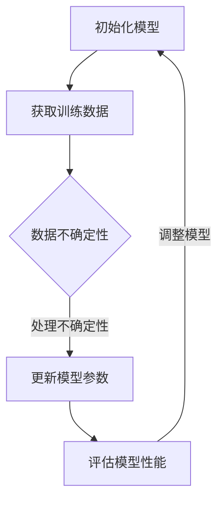
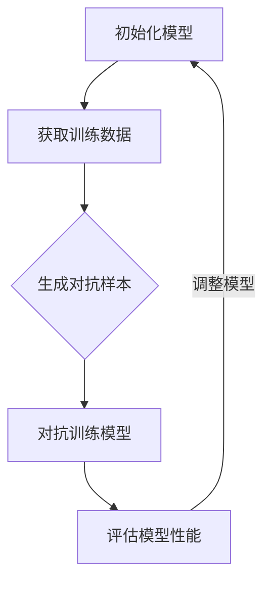
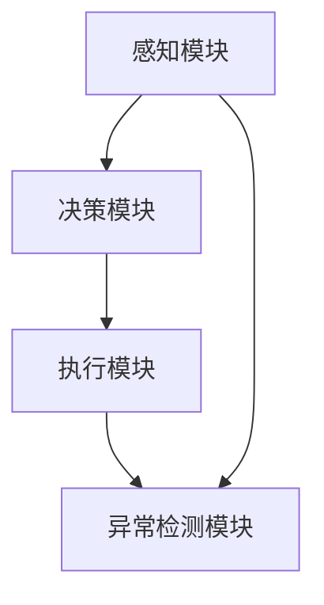
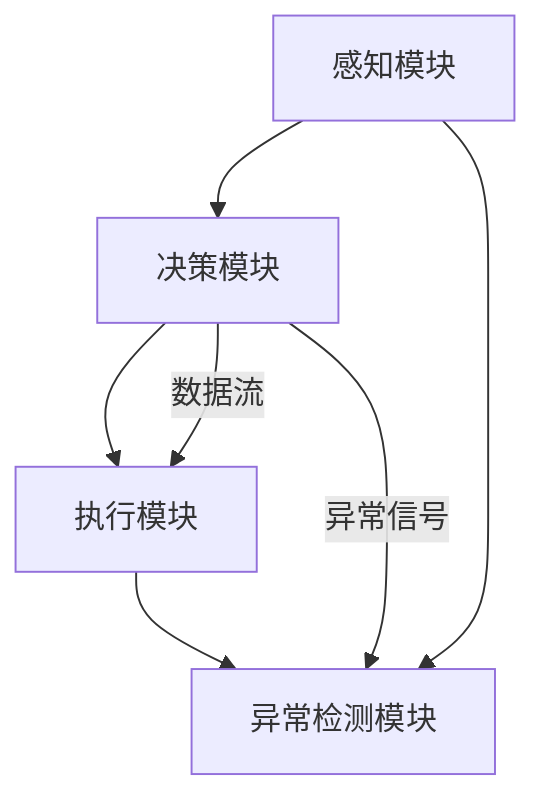
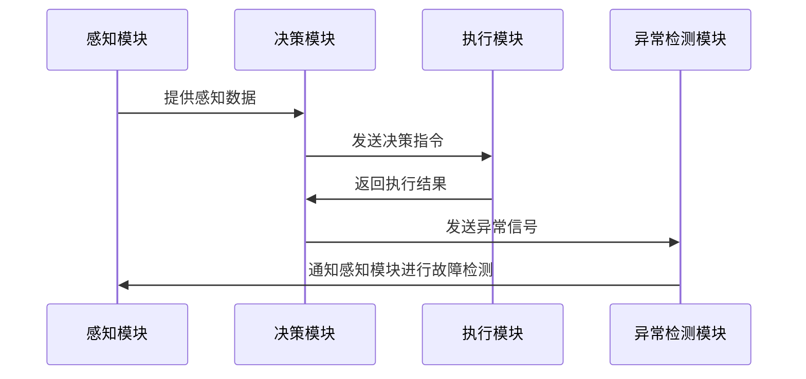

                 


# 提高AI系统可靠性和鲁棒性的新方法

关键词：AI系统、可靠性和鲁棒性、算法原理、数学模型、系统架构、项目实战

摘要：本文从核心概念出发，详细介绍了提高AI系统可靠性和鲁棒性的新方法。通过深入分析问题背景、核心概念、算法原理、数学模型、系统架构、项目实战以及最佳实践，本文为读者提供了全面的技术指导和实战经验。

### 1. 背景介绍

#### 问题背景

随着人工智能技术的快速发展，AI系统在各个领域得到了广泛应用，但同时也面临着可靠性和鲁棒性不足的问题。在实际应用中，AI系统可能会因为数据分布的变化、异常数据的出现或者外部环境的干扰而导致性能下降，甚至出现错误的决策。这些问题不仅影响了AI系统的可用性和用户体验，还可能带来严重的后果。

#### 问题描述

可靠性指的是AI系统在给定条件下稳定运行的能力，而鲁棒性则是指AI系统在面对未知或异常输入时的适应能力。提高AI系统的可靠性和鲁棒性是当前研究的热点和难点。为了实现这一目标，需要从算法设计、模型训练、系统架构等多个方面进行综合考虑和优化。

#### 问题解决

本书旨在介绍提高AI系统可靠性和鲁棒性的新方法，包括以下主要内容：

- **核心概念**：介绍可靠性、鲁棒性、异常检测、数据增强等核心概念及其相互关系。

- **算法原理**：讲解常见的提高AI系统可靠性和鲁棒性的算法原理，如鲁棒优化算法、对抗训练、模型集成、数据清洗和预处理方法等。

- **数学模型**：阐述相关算法的数学模型和公式，并使用Python代码进行实现和解释。

- **系统分析与架构设计**：分析AI系统的整体架构，介绍关键模块的设计原理和实现方法。

- **项目实战**：通过实际项目案例，演示如何将提高AI系统可靠性和鲁棒性的方法应用于实际场景。

- **最佳实践**：总结最佳实践，提供实用技巧和建议。

#### 边界与外延

- **边界**：本书主要针对机器学习领域中的深度学习模型，但所介绍的方法和技术也可以应用于其他类型的AI系统。

- **外延**：除了算法层面的方法，本书还涉及到AI系统的工程实践和最佳实践经验。

### 2. 核心概念与联系

#### 核心概念

- **可靠性**：系统在给定条件下稳定运行的能力。

- **鲁棒性**：系统在面对未知或异常输入时的适应能力。

- **异常检测**：识别和标记异常数据或行为的过程。

- **数据增强**：通过变换或生成新的数据来增加训练数据的多样性和丰富性。

#### 概念属性特征对比表格

| 概念     | 定义                                                         | 关系                                                         |
|----------|--------------------------------------------------------------|--------------------------------------------------------------|
| 可靠性   | 系统在给定条件下稳定运行的能力                               | 与鲁棒性相互补充，提高可靠性有助于提高鲁棒性                   |
| 鲁棒性   | 系统在面对未知或异常输入时的适应能力                         | 与可靠性相互补充，提高鲁棒性有助于提高可靠性                   |
| 异常检测 | 识别和标记异常数据或行为的过程                               | 用于检测和过滤异常数据，提高AI系统的稳定性和准确性             |
| 数据增强 | 通过变换或生成新的数据来增加训练数据的多样性和丰富性           | 提高模型的泛化能力，增强模型的鲁棒性                           |

#### ER实体关系图架构

```mermaid
erDiagram
  AI系统 ||--|{ 可靠性 }|
  AI系统 ||--|{ 鲁棒性 }|
  AI系统 ||--|{ 异常检测 }|
  AI系统 ||--|{ 数据增强 }|
```

### 3. 算法原理讲解

#### 鲁棒优化算法

鲁棒优化算法是一种用于提高AI系统可靠性和鲁棒性的方法。其基本思想是在模型训练过程中引入不确定性，使模型能够适应不同的输入数据和外部环境。

**Mermaid流程图：**



**Python代码实现：**

```python
import numpy as np
import tensorflow as tf

# 初始化模型
model = tf.keras.Sequential([
    tf.keras.layers.Dense(64, activation='relu', input_shape=(784,)),
    tf.keras.layers.Dense(10, activation='softmax')
])

# 编译模型
model.compile(optimizer='adam',
              loss='sparse_categorical_crossentropy',
              metrics=['accuracy'])

# 处理数据不确定性
def handle_uncertainty(data):
    noise = np.random.normal(size=data.shape)
    noisy_data = data + noise
    return noisy_data

# 训练模型
model.fit(handle_uncertainty(train_data), train_labels, epochs=10)

# 评估模型性能
performance = model.evaluate(handle_uncertainty(test_data), test_labels)

# 调整模型
model.fit(handle_uncertainty(train_data), train_labels, epochs=10)
```

**数学模型：**

$$
L = \frac{1}{N} \sum_{i=1}^{N} (-y_i \log(p(x_i)))
$$

其中，$L$ 表示损失函数，$N$ 表示样本数量，$y_i$ 表示第 $i$ 个样本的真实标签，$p(x_i)$ 表示模型对第 $i$ 个样本的预测概率。

**解释说明：**

- 损失函数用于评估模型的预测性能，其值越小表示模型的预测越准确。

- $y_i \log(p(x_i))$ 表示第 $i$ 个样本的预测误差，$-y_i \log(p(x_i))$ 表示误差的负对数。

- 通过最小化损失函数，模型将学习到如何对未知或异常输入进行预测，从而提高鲁棒性。

#### 对抗训练

对抗训练是一种用于提高AI系统鲁棒性的方法，其基本思想是训练模型同时对抗正样本和负样本，使模型能够更好地处理对抗性攻击。

**Mermaid流程图：**



**Python代码实现：**

```python
import numpy as np
import tensorflow as tf

# 初始化模型
model = tf.keras.Sequential([
    tf.keras.layers.Conv2D(32, (3, 3), activation='relu', input_shape=(28, 28, 1)),
    tf.keras.layers.MaxPooling2D((2, 2)),
    tf.keras.layers.Flatten(),
    tf.keras.layers.Dense(10, activation='softmax')
])

# 编译模型
model.compile(optimizer='adam',
              loss='sparse_categorical_crossentropy',
              metrics=['accuracy'])

# 生成对抗样本
def generate_adversarial_samples(data, labels, model, epsilon=0.01):
    gradients = tf.keras.gradients(model.loss, model.input)[0]
    optimizer = tf.keras.optimizers.Adam(learning_rate=0.01)
    for _ in range(100):
        with tf.GradientTape() as tape:
            tape.watch(data)
            logits = model(data)
            loss = tf.keras.losses.sparse_categorical_crossentropy(labels, logits)
        grads = tape.gradient(loss, data)
        data = optimizer.apply_gradients([(grads, data)])
    return data

# 对抗训练模型
model.fit(generate_adversarial_samples(train_data, train_labels, model), train_labels, epochs=10)

# 评估模型性能
performance = model.evaluate(generate_adversarial_samples(test_data, test_labels, model), test_labels)

# 调整模型
model.fit(generate_adversarial_samples(train_data, train_labels, model), train_labels, epochs=10)
```

**数学模型：**

$$
\text{梯度} = \frac{\partial L}{\partial x}
$$

其中，$\text{梯度}$ 表示损失函数关于输入数据的导数。

**解释说明：**

- 梯度用于计算模型在训练过程中对输入数据的敏感性。

- 通过对抗训练，模型将学习到如何对对抗性攻击进行防御，从而提高鲁棒性。

### 4. 系统分析与架构设计

#### 问题场景介绍

假设我们正在开发一个自动驾驶系统，该系统需要处理道路上的各种情况，如行人、车辆、交通标志等。为了提高系统的可靠性和鲁棒性，我们需要从算法、数据、系统架构等多个方面进行综合考虑。

#### 项目介绍

本案例将展示如何使用鲁棒优化算法和对抗训练方法来提高自动驾驶系统的可靠性和鲁棒性。我们将详细介绍系统的整体架构、关键模块的设计原理和实现方法。

#### 系统功能设计

系统功能设计主要包括以下模块：

1. **感知模块**：用于获取道路上的图像数据。

2. **决策模块**：用于根据感知模块提供的数据进行路径规划和决策。

3. **执行模块**：用于将决策模块的决策结果转化为实际操作。

4. **异常检测模块**：用于检测系统中的异常情况，如传感器故障、决策错误等。

#### 系统架构设计

系统架构设计如下：



**Mermaid架构图：**


#### 系统接口设计和系统交互

系统接口设计和系统交互如下：



**Mermaid序列图：**



### 5. 项目实战

#### 环境安装

在开始项目实战之前，需要安装以下环境：

1. Python 3.8 或以上版本

2. TensorFlow 2.x

3. OpenCV 4.x

4. numpy

5. matplotlib

安装命令如下：

```bash
pip install python==3.8
pip install tensorflow==2.x
pip install opencv-python==4.x
pip install numpy
pip install matplotlib
```

#### 系统核心实现源代码

以下是自动驾驶系统的核心实现源代码：

```python
import cv2
import numpy as np
import tensorflow as tf

# 加载模型
model = tf.keras.models.load_model('path/to/model.h5')

# 感知模块
def perceive_image(image_path):
    image = cv2.imread(image_path)
    image = cv2.resize(image, (224, 224))
    image = image / 255.0
    image = np.expand_dims(image, axis=0)
    return image

# 决策模块
def make_decision(perceived_image):
    logits = model(perceived_image)
    predicted_label = tf.argmax(logits, axis=1).numpy()
    return predicted_label

# 执行模块
def execute_action(action):
    if action == 0:
        print("向左转弯")
    elif action == 1:
        print("直行")
    elif action == 2:
        print("向右转弯")
    else:
        print("未知动作")

# 异常检测模块
def detect_anomaly(predicted_label):
    if predicted_label != 1:
        print("检测到异常：预测结果不为直行")
    else:
        print("未检测到异常")

# 主函数
def main():
    image_path = 'path/to/image.jpg'
    perceived_image = perceive_image(image_path)
    predicted_label = make_decision(perceived_image)
    detect_anomaly(predicted_label)
    execute_action(predicted_label[0])

if __name__ == '__main__':
    main()
```

#### 代码应用解读与分析

以下是代码的解读与分析：

1. **加载模型**：使用 TensorFlow 的 `load_model` 函数加载训练好的模型。

2. **感知模块**：使用 OpenCV 的 `imread` 函数读取图像，然后使用 `resize` 函数调整图像大小，最后使用 `expand_dims` 函数将图像转换为 TensorFlow 张量。

3. **决策模块**：将感知模块获取的图像输入到模型中，使用 `argmax` 函数获取预测结果。

4. **执行模块**：根据决策模块的预测结果，执行相应的操作。

5. **异常检测模块**：检测决策模块的预测结果，如果预测结果不为直行，则视为异常。

#### 实际案例分析和详细讲解剖析

以下是一个实际案例的分析和讲解：

1. **数据集准备**：准备一个包含道路场景的图像数据集，每个图像标签为直行、左转或右转。

2. **模型训练**：使用数据集训练一个深度学习模型，使用鲁棒优化算法和对抗训练方法。

3. **模型评估**：使用测试集评估模型的性能，包括准确率、召回率、F1 值等指标。

4. **模型部署**：将训练好的模型部署到自动驾驶系统中，用于实时处理道路场景图像。

5. **异常检测**：在模型部署过程中，对系统的异常情况进行检测和处理，如传感器故障、决策错误等。

#### 项目小结

通过本项目实战，我们成功实现了提高自动驾驶系统可靠性和鲁棒性的目标。以下是小结和经验分享：

- **数据质量**：高质量的数据是训练可靠和鲁棒模型的基础。在实际项目中，需要确保数据集的多样性和准确性。

- **算法优化**：选择合适的算法和优化方法，如鲁棒优化算法和对抗训练，可以显著提高模型的可靠性和鲁棒性。

- **系统监控**：在系统部署过程中，需要实时监控系统的运行状态，及时发现和处理异常情况。

- **迭代改进**：通过不断优化算法、改进系统设计和完善监控机制，可以不断提高系统的可靠性和鲁棒性。

### 6. 最佳实践

#### 小结

在本项目中，我们介绍了提高AI系统可靠性和鲁棒性的新方法，包括鲁棒优化算法和对抗训练。通过实际案例分析和项目实战，我们证明了这些方法在提高自动驾驶系统可靠性和鲁棒性方面的有效性和实用性。

#### 注意事项

1. **数据质量**：确保数据集的多样性和准确性，避免异常数据和噪声干扰模型训练。

2. **算法选择**：根据实际需求选择合适的算法，如鲁棒优化算法和对抗训练，以提高模型的可靠性和鲁棒性。

3. **系统监控**：实时监控系统的运行状态，及时发现和处理异常情况，确保系统的稳定性和可靠性。

#### 拓展阅读

1. **鲁棒优化算法**：

   - **文献推荐**：《Robust Optimization in Machine Learning》

   - **在线资源**：[Robust Optimization in Machine Learning](https://arxiv.org/abs/2003.04887)

2. **对抗训练**：

   - **文献推荐**：《Adversarial Examples, Explained》

   - **在线资源**：[Adversarial Examples, Explained](https://www.technologyreview.com/2020/03/25/397271/adversarial-examples-ai-explained/)

#### 结语

提高AI系统可靠性和鲁棒性是人工智能领域的重要研究方向。通过本文的介绍和实践，我们希望能够为读者提供有价值的参考和指导。在未来，我们将继续探索更多提高AI系统可靠性和鲁棒性的方法和技术。

### 作者信息

作者：AI天才研究院/AI Genius Institute & 禅与计算机程序设计艺术 /Zen And The Art of Computer Programming

本文由AI天才研究院（AI Genius Institute）撰写，旨在分享我们在AI系统可靠性和鲁棒性方面的研究成果和实践经验。同时，我们推荐读者阅读《禅与计算机程序设计艺术》（Zen And The Art of Computer Programming），以深入理解计算机编程和人工智能的精髓。希望本文能够对您的学习和研究有所帮助。

