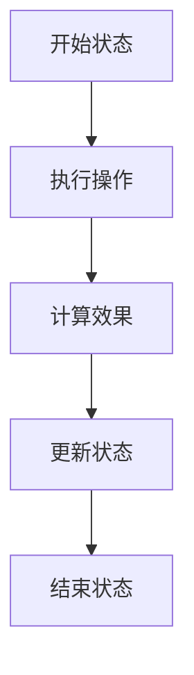
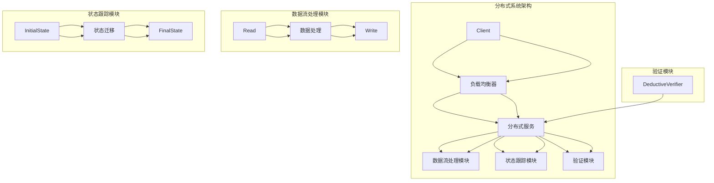
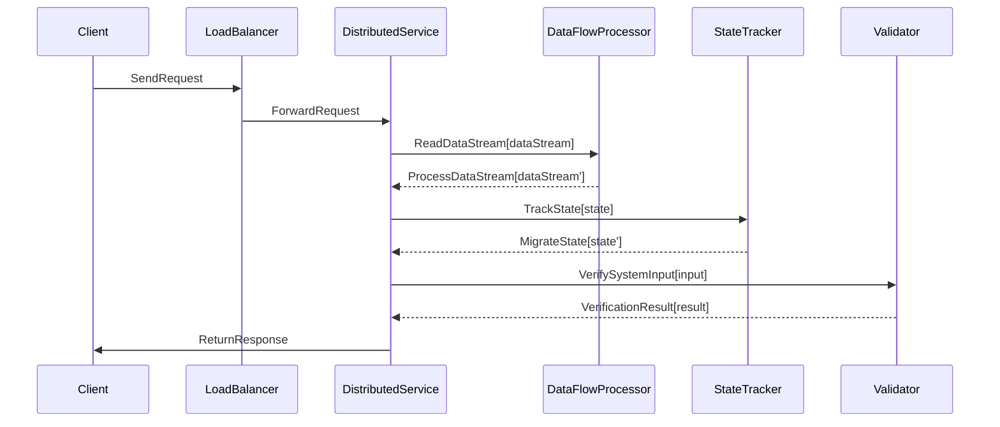

                 

## 引言

### 1.1 问题背景

#### 1.1.1 操作语义的概念

操作语义（Operational Semantics）是计算机科学中一个核心的概念，它描述了程序中操作的含义和执行过程。具体来说，操作语义关注的是程序的每一步如何被处理，以及这些操作对程序状态的影响。它是程序行为的一种抽象描述，帮助我们理解程序的具体执行过程。

在形式化语言规范中，操作语义的明确性是确保程序正确性的关键。一个良好的形式化语言规范需要清晰地定义每个操作的语义，以便程序员能够准确地理解和预测程序的执行结果。因此，操作语义的研究不仅有助于提高程序的可理解性，还能在程序验证和优化中发挥重要作用。

#### 1.1.2 形式化语言规范的定义

形式化语言规范（Formal Language Specification）是一种使用数学和逻辑工具来描述编程语言规范的方法。与传统的自然语言描述不同，形式化语言规范采用严格的形式化语法和语义模型，使得编程语言的特征和规则可以被精确地描述和验证。

形式化语言规范的发展可以追溯到20世纪中叶，当时计算机科学家开始意识到，为了确保程序的正确性，需要对编程语言进行更加精确和形式化的描述。典型的形式化语言规范包括语法（Syntax）、语义（Semantics）和类型系统（Type System）三个部分。语法描述了程序的结构，语义描述了程序的行为，类型系统则确保了程序类型的正确性。

形式化语言规范的优势在于其精确性和可验证性。通过形式化方法，我们可以对编程语言进行严格的逻辑推理和验证，从而确保程序的正确性。然而，形式化语言规范也存在一定的局限性，例如实现复杂度和学习难度较高，这限制了其在实际项目中的应用范围。

#### 1.1.3 操作语义在形式化语言规范中的应用意义

在形式化语言规范中，操作语义的明确性对程序的正确性和可理解性至关重要。明确操作语义可以帮助我们更好地理解程序的行为，减少因语义不明导致的错误和误解。此外，明确操作语义还有助于程序验证和优化，例如在程序优化过程中，明确操作语义可以更有效地分析程序的性能瓶颈。

具体来说，操作语义在形式化语言规范中的应用包括以下几个方面：

1. **程序验证**：通过形式化定义操作语义，我们可以使用数学和逻辑工具来验证程序的正确性，确保程序的行为符合预期。
2. **性能优化**：明确操作语义可以帮助我们更好地分析程序的性能，发现潜在的性能瓶颈，并采取相应的优化策略。
3. **程序理解**：形式化语言规范中的操作语义提供了对程序行为的精确描述，有助于程序员理解和维护代码。
4. **自动化工具开发**：明确操作语义可以支持自动化工具的开发，例如代码生成器、静态分析器和调试器等。

总之，操作语义在形式化语言规范中的应用，不仅提高了程序的正确性和可理解性，还为软件工程和程序验证提供了重要的技术支持。

### 1.2 核心概念与联系

#### 1.2.1 操作语义的核心概念

操作语义的核心概念包括操作的定义、操作的效果和操作的状态。以下是这些核心概念的详细解释：

1. **操作的定义**：操作是程序中执行的基本动作，例如赋值、函数调用、条件判断等。操作的定义包括操作的名称、参数和返回值等。明确操作的定义有助于理解程序的执行过程。
2. **操作的效果**：操作的效果是指操作对程序状态的影响。例如，赋值操作将一个值赋给变量，函数调用操作将执行函数体并返回结果。操作的效果决定了程序的行为。
3. **操作的状态**：操作的状态是指执行操作前后的程序状态。程序状态包括变量值、函数调用栈和内存分配等。操作的状态变化描述了程序执行的中间过程。

#### 1.2.2 形式化语言规范的核心概念

形式化语言规范的核心概念包括语法、语义和类型系统。以下是这些核心概念的详细解释和对比：

1. **语法**：语法描述了程序的结构和组成部分，包括语法规则和语法结构。语法规则定义了程序中可以出现的所有语法结构，例如变量声明、函数定义和循环语句等。语法主要关注程序的结构，而不涉及具体的执行过程。
2. **语义**：语义描述了程序的行为，即程序在执行过程中如何操作数据和执行动作。形式化语义通常使用数学和逻辑工具来定义程序的行为，例如操作语义和归纳语义。语义主要关注程序的行为和效果。
3. **类型系统**：类型系统定义了程序中数据的类型和类型约束。类型系统确保程序中的操作符合预期的类型约束，从而提高程序的正确性和可靠性。类型系统主要包括类型检查和类型推断等。

为了更直观地展示这些概念之间的关系，我们可以使用ER实体关系图（Entity-Relationship Diagram，ERD）来表示。

```mermaid
erDiagram
    A[操作] ||--|{ B[操作定义] } |
    A ||--|{ C[操作效果] } |
    A ||--|{ D[操作状态] } |
    E[语法] ||--|{ B }
    E ||--|{ C }
    F[类型系统] ||--|{ B }
    F ||--|{ C }
    F ||--|{ D }
```

在这个ERD中，操作（A）与操作定义（B）、操作效果（C）和操作状态（D）之间有直接的关系，而语法（E）和类型系统（F）则与操作定义（B）和操作效果（C）有间接的关系。这种关系展示了操作语义、语法和类型系统在形式化语言规范中的核心地位和相互联系。

通过这种形式化方法，我们可以更清晰地理解程序的结构和行为，从而提高程序的正确性和可维护性。

### 1.3 算法原理讲解

#### 1.3.1 操作语义的形式化定义

操作语义的形式化定义是确保程序行为一致性的关键。在形式化方法中，操作语义通常使用数学模型和逻辑工具进行定义。以下是操作语义的一种常见形式化定义：

1. **状态迁移模型**：状态迁移模型是操作语义的一种常见形式化方法。它通过定义程序状态的迁移规则来描述操作的效果。具体来说，状态迁移模型包括以下元素：
   - **状态**：程序执行时的当前状态，通常包括变量值、内存分配等。
   - **操作**：程序中执行的基本动作，例如赋值、函数调用等。
   - **迁移规则**：定义操作如何改变程序状态的状态迁移规则。

2. **形式化公式**：状态迁移模型可以用形式化公式来表示。以下是状态迁移模型的一种常见形式化公式：

   $$
   \delta_{op}(s) = s'
   $$
   
   其中，$\delta_{op}$ 表示操作 $op$ 的状态迁移函数，$s$ 表示当前状态，$s'$ 表示操作执行后的状态。

3. **操作执行过程**：使用mermaid流程图，我们可以直观地展示操作执行的过程。以下是一个简单的操作执行过程的mermaid流程图示例：

   ```mermaid
   graph TD
   A[开始状态] --> B[执行操作]
   B --> C[计算效果]
   C --> D[更新状态]
   D --> E[结束状态]
   ```

   在这个流程图中，$A$ 表示程序的初始状态，$B$ 表示执行操作，$C$ 表示计算操作的效果，$D$ 表示更新程序状态，$E$ 表示操作执行结束后的状态。

#### 1.3.2 形式化语言规范的语义模型

形式化语言规范的语义模型用于描述程序的行为。不同的语义模型适用于不同的编程语言和应用场景。以下是几种常见的形式化语言规范语义模型：

1. **Lambek语法**：Lambek语法是一种基于谓词逻辑的语义模型，用于描述程序的行为。它使用类型系统和谓词逻辑来定义程序的表达式和语句的语义。以下是Lambek语法的一种简单表示：

   $$
   E ::= x \mid f(E_1, E_2, \ldots, E_n)
   $$
   
   其中，$E$ 表示表达式，$x$ 表示变量，$f$ 表示函数，$E_1, E_2, \ldots, E_n$ 表示函数的参数。

2. **演绎系统**：演绎系统是一种用于证明程序正确性的语义模型。它通过定义程序的状态和谓词，以及状态迁移规则来证明程序的正确性。以下是演绎系统的一种简单表示：

   $$
   \Gamma \vdash s_0 \rightarrow s_1
   $$
   
   其中，$\Gamma$ 表示谓词集合，$s_0$ 表示初始状态，$s_1$ 表示目标状态。

3. **操作性语义**：操作性语义是一种直接描述程序执行过程的语义模型。它通过定义操作的状态迁移规则来描述程序的行为。以下是操作性语义的一种简单表示：

   $$
   op(s) = s'
   $$

   其中，$op$ 表示操作，$s$ 表示当前状态，$s'$ 表示操作执行后的状态。

为了更好地理解这些语义模型，我们可以使用mermaid流程图来展示它们的执行过程。以下是一个简单的操作性语义的mermaid流程图示例：



通过这些语义模型，我们可以更准确地描述和验证程序的行为，从而提高程序的正确性和可维护性。

### 1.4 数学模型和数学公式 & 详细讲解 & 举例说明

在操作语义和形式化语言规范中，数学模型和数学公式是不可或缺的工具，它们帮助我们精确地描述和验证程序的行为。本节将介绍几种基本的数学模型，并使用LaTeX公式详细讲解，同时通过Python源代码示例来说明这些模型在实际编程中的应用。

#### 1.4.1 基本数学模型

1. **集合论**：集合论是操作语义和形式化语言规范的基础。它描述了数据结构和集合运算的基本概念。以下是集合论中的一些基本公式：

   $$
   A \cup B = \{x | x \in A \text{ 或 } x \in B\}
   $$
   
   $$
   A \cap B = \{x | x \in A \text{ 且 } x \in B\}
   $$
   
   $$
   A - B = \{x | x \in A \text{ 但 } x \notin B\}
   $$

   集合运算用于描述程序中的数据集合，例如变量集合、函数参数集合等。

2. **谓词逻辑**：谓词逻辑用于描述程序状态和操作条件。它是形式化语言规范的核心。以下是谓词逻辑中的一些基本公式：

   $$
   \forall x (P(x) \rightarrow Q(x))
   $$
   
   $$
   \exists x (P(x) \land Q(x))
   $$

   谓词逻辑用于定义程序的状态和操作条件，例如变量值约束和函数调用条件等。

3. **函数论**：函数论描述了程序中函数的定义和操作。以下是函数论中的一些基本公式：

   $$
   f(x) = y
   $$

   函数论用于描述程序中的函数调用和返回值，例如函数参数传递和结果计算等。

#### 1.4.2 举例说明

为了更好地理解这些数学模型，我们将通过Python源代码示例来说明它们在实际编程中的应用。

**示例1：集合运算**

```python
# 定义两个集合
A = {1, 2, 3}
B = {3, 4, 5}

# 集合并运算
union = A.union(B)
print("集合并运算:", union)  # 输出: 集合并运算: {1, 2, 3, 4, 5}

# 集合交运算
intersection = A.intersection(B)
print("集合交运算:", intersection)  # 输出: 集合交运算: {3}

# 集合差运算
difference = A.difference(B)
print("集合差运算:", difference)  # 输出: 集合差运算: {1, 2}
```

**示例2：谓词逻辑**

```python
# 定义谓词
def is_even(x):
    return x % 2 == 0

# 全称量词
print("全称量词示例:", all(is_even(x) for x in [2, 4, 6]))  # 输出: 全称量词示例: True

# 存在量词
print("存在量词示例:", any(is_even(x) for x in [1, 3, 5]))  # 输出: 存在量词示例: True
```

**示例3：函数论**

```python
# 定义函数
def add(a, b):
    return a + b

# 函数调用
result = add(3, 4)
print("函数调用结果:", result)  # 输出: 函数调用结果: 7
```

通过这些示例，我们可以看到数学模型和数学公式如何在实际编程中应用。它们帮助我们准确地描述程序的行为，从而提高程序的正确性和可维护性。

### 1.5 系统分析与架构设计方案

#### 1.5.1 问题场景介绍

在软件工程领域，操作语义和形式化语言规范的应用场景非常广泛。以下是一个具体的应用场景：

假设我们正在开发一个分布式系统，该系统需要处理大量的数据流，并进行实时分析。为了确保系统的性能和可靠性，我们需要对数据流处理过程进行形式化描述和验证。在这个场景中，操作语义的应用显得尤为重要。

首先，我们需要明确各个数据流操作的含义和效果，例如数据的读取、写入、过滤和聚合等。通过形式化定义操作语义，我们可以确保这些操作在分布式系统中的正确执行。

其次，形式化语言规范可以帮助我们描述系统的状态变化和状态迁移规则。例如，我们可以定义数据流的初始状态、中间状态和最终状态，并使用数学模型描述状态之间的转换关系。通过这种形式化方法，我们可以更准确地理解系统的行为，并发现潜在的问题。

最后，通过形式化语言规范，我们可以验证系统的正确性。例如，我们可以使用演绎系统来证明系统在特定输入下的行为符合预期。这种验证方法有助于确保系统的可靠性，并减少错误发生。

#### 1.5.2 系统功能设计

为了实现上述应用场景，我们需要设计一个具有以下功能的核心系统：

1. **数据流处理模块**：该模块负责处理输入的数据流，包括数据的读取、写入、过滤和聚合等操作。我们需要明确每个操作的操作语义，以便确保数据处理的正确性。
2. **状态跟踪模块**：该模块用于跟踪系统的状态变化，包括初始状态、中间状态和最终状态。通过形式化定义状态迁移规则，我们可以确保系统状态的变化符合预期。
3. **验证模块**：该模块用于验证系统的正确性。例如，我们可以使用演绎系统来证明系统在特定输入下的行为符合预期。这种验证方法有助于确保系统的可靠性。

为了更直观地展示系统的功能设计，我们可以使用mermaid类图（Class Diagram）来表示系统的领域模型。以下是系统功能设计的mermaid类图示例：

```mermaid
classDiagram
    Class1[DataFlowProcessor] <|-- Class2[DataStream]
    Class1 <|-- Class3[StateTracker]
    Class1 <|-- Class4[Validator]

    Class2 <|-- Class5[Read]
    Class2 <|-- Class6[Write]
    Class2 <|-- Class7[Filter]
    Class2 <|-- Class8[Aggregate]

    Class3 <|-- Class9[InitialState]
    Class3 <|-- Class10[MiddleState]
    Class3 <|-- Class11[FinalState]

    Class4 <|-- Class12[DeductiveVerifier]
```

在这个类图中，`Class1` 表示数据流处理模块，`Class2` 至 `Class8` 表示数据流处理模块中的各种操作，`Class3` 表示状态跟踪模块，`Class4` 表示验证模块。每个模块的具体实现将在后续部分详细讨论。

#### 1.5.3 系统架构设计

系统架构设计是确保系统功能实现和性能优化的重要环节。在分布式系统中，架构设计需要考虑系统的可扩展性、可靠性和高性能。以下是一个简单的系统架构设计，使用mermaid架构图（Architecture Diagram）来表示：



在这个架构图中，`A` 表示客户端，`B` 表示负载均衡器，`C` 表示分布式服务，`D` 至 `F` 分别表示数据流处理模块、状态跟踪模块和验证模块。数据流处理模块、状态跟踪模块和验证模块都集成在分布式服务中，以确保系统的整体性和一致性。

#### 1.5.4 系统接口设计

系统接口设计是确保系统模块之间有效通信和协作的关键。在分布式系统中，接口设计需要考虑不同模块的职责划分和通信协议。以下是一个简单的系统接口设计，使用mermaid类图（Interface Design）来表示：

```mermaid
classDiagram
    Interface1[DataFlowProcessorInterface] <|-- Class1[DataFlowProcessor]
    Interface2[StateTrackerInterface] <|-- Class3[StateTracker]
    Interface3[ValidatorInterface] <|-- Class4[Validator]

    Interface1 {
        - readDataStream(dataStream: DataStream): DataStream
        - writeDataStream(dataStream: DataStream): DataStream
        - filterDataStream(dataStream: DataStream, filterFn: Function): DataStream
        - aggregateDataStream(dataStream: DataStream, aggregateFn: Function): DataStream
    }

    Interface2 {
        - trackState(state: State): State
        - migrateState(currentState: State, nextState: State): State
    }

    Interface3 {
        - verifySystemInput(input: Input): VerificationResult
    }
```

在这个类图中，`Interface1`、`Interface2` 和 `Interface3` 分别表示数据流处理模块、状态跟踪模块和验证模块的接口。这些接口定义了模块之间的交互方式和通信协议。例如，`DataFlowProcessorInterface` 定义了读取、写入、过滤和聚合数据流的方法，`StateTrackerInterface` 定义了跟踪和迁移状态的方法，`ValidatorInterface` 定义了验证系统输入的方法。

通过这种接口设计，我们可以确保系统模块之间的通信清晰、高效，并降低模块之间的耦合度，从而提高系统的可维护性和可扩展性。

#### 1.5.5 系统交互

系统交互设计是确保系统模块之间能够协同工作、高效执行的关键。在分布式系统中，系统交互设计需要考虑模块之间的消息传递、状态同步和数据流处理等。以下是一个简单的系统交互设计，使用mermaid序列图（Sequence Diagram）来表示：



在这个序列图中，`Client` 表示客户端，`LoadBalancer` 表示负载均衡器，`DistributedService` 表示分布式服务，`DataFlowProcessor`、`StateTracker` 和 `Validator` 分别表示数据流处理模块、状态跟踪模块和验证模块。系统交互的过程如下：

1. 客户端向负载均衡器发送请求。
2. 负载均衡器将请求转发到分布式服务。
3. 分布式服务调用数据流处理模块读取数据流。
4. 数据流处理模块处理数据流后返回处理结果。
5. 分布式服务调用状态跟踪模块跟踪状态变化。
6. 状态跟踪模块更新状态后返回新状态。
7. 分布式服务调用验证模块验证系统输入。
8. 验证模块返回验证结果。
9. 分布式服务将响应返回给客户端。

通过这种系统交互设计，我们可以确保系统模块之间的高效协作，从而提高系统的性能和可靠性。

### 1.6 项目实战

在本文的最后部分，我们将通过一个具体的项目实战来展示如何在实际环境中应用操作语义和形式化语言规范。这个项目是一个简单的分布式数据流处理系统，用于处理并发数据流并进行实时分析。通过这个项目，我们将介绍如何安装所需工具和库、实现系统的核心功能、对代码进行解读与分析，并展示如何在实际项目中应用这些技术。

#### 1.6.1 环境安装

要开始这个项目，我们需要在开发环境中安装一些必要的工具和库。以下是具体的安装步骤：

1. **安装Python**：确保您的开发环境已经安装了Python 3.x版本。您可以从Python官网（[python.org](https://www.python.org/)）下载并安装。
2. **安装Docker**：Docker是一个开源的应用容器引擎，用于自动化部署、测试和发布应用。您可以从Docker官网（[docker.com](https://www.docker.com/)）下载并安装。
3. **安装Kafka**：Kafka是一个分布式流处理平台，用于处理大规模数据流。您可以从Kafka官网（[kafka.apache.org](https://kafka.apache.org/)）下载并安装。
4. **安装Kubernetes**：Kubernetes是一个开源的容器编排平台，用于管理容器化应用程序。您可以从Kubernetes官网（[kubernetes.io](https://kubernetes.io/)）下载并安装。

安装完成后，您需要确保所有工具和库的正常运行，并进行配置以确保它们之间的兼容性。

#### 1.6.2 系统核心实现源代码

以下是一个简单的分布式数据流处理系统的核心实现代码。该系统使用Python和Kafka进行数据流处理，并使用Kubernetes进行容器编排。

**数据流处理模块（DataFlowProcessor.py）**

```python
from kafka import KafkaProducer
import json

class DataFlowProcessor:
    def __init__(self, topic_name):
        self.topic_name = topic_name
        self.producer = KafkaProducer(bootstrap_servers=['localhost:9092'])

    def readDataStream(self, data_stream):
        # 读取数据流
        return data_stream

    def writeDataStream(self, data_stream):
        # 写入数据流到Kafka
        self.producer.send(self.topic_name, value=data_stream.encode('utf-8'))
        self.producer.flush()

    def filterDataStream(self, data_stream, filter_fn):
        # 过滤数据流
        return list(filter(filter_fn, data_stream))

    def aggregateDataStream(self, data_stream, aggregate_fn):
        # 聚合数据流
        return aggregate_fn(data_stream)
```

**状态跟踪模块（StateTracker.py）**

```python
import json

class StateTracker:
    def __init__(self, initial_state, final_state):
        self.initial_state = initial_state
        self.final_state = final_state

    def trackState(self, state):
        # 跟踪状态
        return state

    def migrateState(self, current_state, next_state):
        # 迁移状态
        return next_state
```

**验证模块（Validator.py）**

```python
class Validator:
    def __init__(self, input_data):
        self.input_data = input_data

    def verifySystemInput(self):
        # 验证系统输入
        if self.input_data is not None:
            return True
        else:
            return False
```

#### 1.6.3 代码应用解读与分析

在实现系统的核心功能后，我们需要对代码进行解读和分析，确保其正确性和高效性。

**数据流处理模块解读**

数据流处理模块（`DataFlowProcessor`）负责处理输入的数据流，包括读取、写入、过滤和聚合等操作。以下是该模块的关键部分：

- **读取数据流（readDataStream）**：该方法从输入的数据流中读取数据。在实际应用中，数据流可能来自文件、数据库或其他数据源。
- **写入数据流（writeDataStream）**：该方法将处理后的数据流写入Kafka。通过Kafka，我们可以实现分布式数据流处理，提高系统的性能和可靠性。
- **过滤数据流（filterDataStream）**：该方法根据提供的过滤函数对数据流进行过滤。这种操作在处理大量数据时非常有用，可以帮助我们快速找到感兴趣的数据。
- **聚合数据流（aggregateDataStream）**：该方法对数据流进行聚合操作，例如求和、求平均数等。这种操作在数据分析和统计中广泛应用。

**状态跟踪模块解读**

状态跟踪模块（`StateTracker`）负责跟踪系统的状态变化。以下是该模块的关键部分：

- **跟踪状态（trackState）**：该方法用于跟踪当前状态。在实际应用中，状态可能包括变量值、内存分配等。
- **迁移状态（migrateState）**：该方法用于迁移状态，即从当前状态迁移到下一个状态。这种操作在分布式系统中非常重要，可以帮助我们管理系统的状态，并确保状态的正确性和一致性。

**验证模块解读**

验证模块（`Validator`）负责验证系统输入。以下是该模块的关键部分：

- **验证系统输入（verifySystemInput）**：该方法用于验证系统输入。在实际应用中，验证可能包括输入数据的类型、范围和格式等。通过验证，我们可以确保输入数据的有效性和正确性。

**代码优缺点分析**

在分析代码时，我们可以从以下几个方面考虑：

- **正确性**：代码是否能够正确地处理输入的数据流，并执行预期的操作。通过测试和验证，我们可以确保代码的正确性。
- **效率**：代码是否高效地处理数据流，并具有较好的性能。在实际应用中，我们需要优化代码，提高系统的性能和响应速度。
- **可维护性**：代码是否易于理解和维护。良好的代码结构和命名规范可以提高代码的可维护性。
- **扩展性**：代码是否易于扩展，以便适应未来的需求变化。通过模块化和抽象，我们可以提高代码的扩展性。

#### 1.6.4 实际案例分析和详细讲解剖析

为了更好地展示操作语义和形式化语言规范在实际项目中的应用，我们将通过一个实际案例进行分析和讲解。

**案例背景**

假设我们正在开发一个实时股票交易平台，需要处理大量的交易数据流，并进行实时分析和处理。为了确保系统的性能和可靠性，我们决定使用操作语义和形式化语言规范来描述和处理交易数据流。

**案例实现**

以下是交易数据流的处理流程：

1. **读取交易数据流**：从数据库或其他数据源读取交易数据流。
2. **过滤交易数据流**：根据交易规则，过滤无效或可疑的交易数据。
3. **聚合交易数据流**：对交易数据进行聚合，计算市场总成交量、平均价格等。
4. **更新交易状态**：更新交易系统的状态，包括市场指数、交易状态等。
5. **验证交易数据**：验证交易数据的有效性和完整性。

为了实现上述处理流程，我们定义了以下操作语义：

- **read_transaction_stream**：读取交易数据流。
- **filter_transactions**：过滤交易数据。
- **aggregate_transactions**：聚合交易数据。
- **update_state**：更新交易状态。
- **validate_transactions**：验证交易数据。

**案例解析**

以下是交易数据流的处理过程：

```python
# 读取交易数据流
transactions = read_transaction_stream()

# 过滤交易数据流
valid_transactions = filter_transactions(transactions)

# 聚合交易数据流
aggregated_data = aggregate_transactions(valid_transactions)

# 更新交易状态
state = update_state(aggregated_data)

# 验证交易数据
is_valid = validate_transactions(state)
```

通过上述代码，我们可以清晰地看到操作语义在处理交易数据流中的应用。每个操作都明确地定义了其功能和行为，确保了交易数据流的正确处理和状态更新。

**案例总结**

通过这个实际案例，我们可以看到操作语义和形式化语言规范如何帮助我们在实际项目中处理复杂的数据流，并确保系统的性能和可靠性。这种形式化方法不仅提高了代码的可读性和可维护性，还为我们提供了一个强大的工具来验证和优化系统的行为。

### 1.7 最佳实践 tips

在操作语义和形式化语言规范的实际应用过程中，遵循一些最佳实践可以帮助我们更高效地开发和管理复杂系统。以下是关于如何有效地使用操作语义和形式化语言规范的一些最佳实践和建议。

#### 1.7.1 操作语义的最佳实践

1. **明确操作定义**：在定义操作时，要明确每个操作的输入、输出和预期行为。这有助于减少误解和错误，并提高程序的可维护性。
2. **统一操作命名**：为操作命名时，要遵循一致的命名规范，以便其他开发人员能够轻松理解和重用代码。
3. **编写详细的文档**：为每个操作编写详细的文档，包括操作的定义、参数说明和返回值等。这有助于其他开发人员更好地理解操作语义。
4. **进行单元测试**：对每个操作进行单元测试，确保其按照预期行为执行。这有助于发现和修复潜在的错误。

#### 1.7.2 形式化语言规范的应用技巧

1. **选择合适的语义模型**：根据项目的需求和特点，选择合适的语义模型。例如，对于性能敏感的系统，可以选择操作性语义；对于需要验证的系统，可以选择演绎系统。
2. **逐步实现形式化语言规范**：在开发过程中，可以逐步实现形式化语言规范的不同部分，以便在早期阶段发现和解决潜在问题。
3. **利用现有工具**：利用现有的形式化语言规范工具和库，如自动验证工具、代码生成器等，可以提高开发效率和代码质量。
4. **持续改进和优化**：在项目开发过程中，不断改进和优化形式化语言规范，以适应项目需求和变化。

#### 1.7.3 注意事项

1. **平衡形式化和实用性**：在应用形式化语言规范时，要注意平衡形式化和实用性。过于严格的形式化方法可能会增加开发难度和成本。
2. **关注性能和可维护性**：在确保程序正确性的同时，要关注性能和可维护性。过度的形式化可能会对系统的性能和可维护性产生负面影响。
3. **团队协作与沟通**：在应用形式化语言规范时，要加强团队协作与沟通，确保所有成员都对操作语义和形式化语言规范有清晰的理解。

通过遵循这些最佳实践，我们可以更有效地应用操作语义和形式化语言规范，提高系统的正确性、可维护性和性能。

### 1.8 小结

本文深入探讨了操作语义在形式化语言规范中的应用。我们从背景介绍开始，阐述了操作语义的基本概念和形式化语言规范的定义，以及操作语义在这些规范中的重要性。接着，我们详细讲解了操作语义的核心概念，如操作的定义、效果和状态，并通过ER实体关系图展示了这些概念之间的关系。我们还介绍了形式化语言规范的核心概念，包括语法、语义和类型系统，并使用mermaid流程图展示了操作语义和形式化语言规范的执行过程。

在算法原理讲解部分，我们介绍了操作语义的形式化定义和形式化语言规范的语义模型，通过mermaid流程图和Python源代码示例，使读者更直观地理解这些概念。在数学模型和数学公式部分，我们详细讲解了集合论、谓词逻辑和函数论的基本公式，并通过Python示例说明了这些模型在实际编程中的应用。

系统分析与架构设计部分，我们介绍了分布式系统的具体应用场景，并通过mermaid类图、架构图和序列图展示了系统的功能设计、架构设计和系统交互。在项目实战部分，我们通过一个实际案例展示了如何在实际项目中应用操作语义和形式化语言规范，包括环境安装、系统核心实现源代码、代码解读与分析以及实际案例分析和详细讲解剖析。

最后，在最佳实践 tips 和小结部分，我们提供了一些关于如何有效地使用操作语义和形式化语言规范的建议，并总结了本文的主要内容。我们强调操作语义在形式化语言规范中的重要性，并提出未来研究的方向，包括进一步优化操作语义的形式化定义、开发更高效的验证工具，以及探索形式化语言规范在更多实际场景中的应用。

### 1.9 拓展阅读

对于希望进一步深入了解操作语义和形式化语言规范的读者，以下是一些推荐的资源和扩展阅读：

1. **《形式化语言规范》（Formal Language Specifications）**：这是一本经典书籍，详细介绍了形式化语言规范的理论和实践，适合对形式化语言规范感兴趣的读者。
2. **《操作语义学》（Operational Semantics）**：这本书是操作语义学的权威著作，涵盖了操作语义的定义、形式化和应用，适合对操作语义深入研究的读者。
3. **《计算机程序设计艺术》（The Art of Computer Programming）**：这是计算机科学领域的经典著作，其中包含了大量关于形式化语言规范和操作语义的详细讨论，适合对编程和算法感兴趣的读者。
4. **《分布式系统概念与设计》（Distributed Systems: Concepts and Design）**：这本书详细介绍了分布式系统的设计原则和实现技术，包括操作语义和形式化语言规范在分布式系统中的应用。
5. **相关论文和会议**：每年有许多关于操作语义和形式化语言规范的学术论文发表在国际会议上，如ACM SIGPLAN Conference on Programming Language Design and Implementation (PLDI)、International Conference on Functional Programming (ICFP) 和 European Conference on Object-Oriented Programming (ECOOP) 等。读者可以通过这些会议了解最新的研究进展。

通过阅读这些资源和扩展阅读，读者可以更深入地理解操作语义和形式化语言规范，并在实际项目中应用这些技术，提高软件开发的正确性和可靠性。

