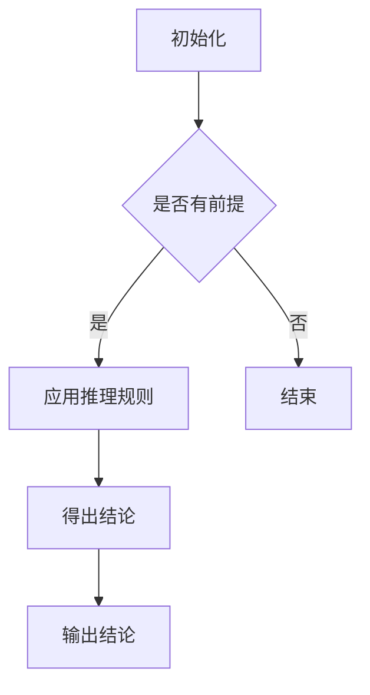
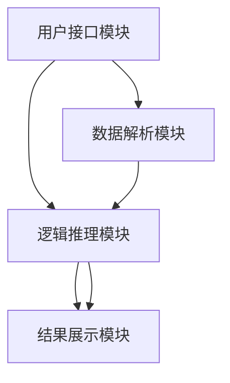
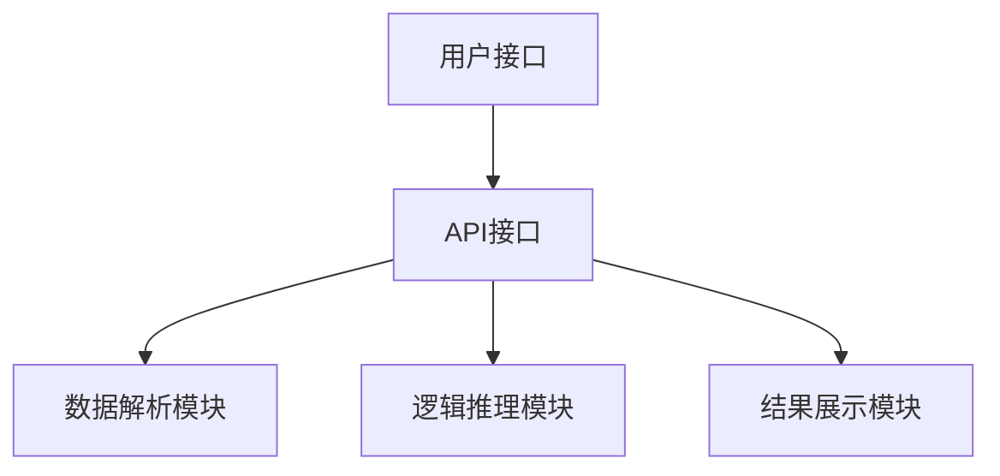
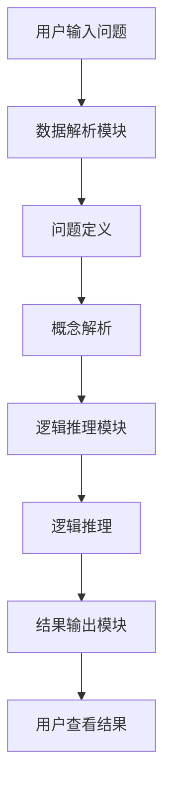

                 


## 政治哲学中的柏格森主义与维特根斯坦思想

### 关键词：
政治哲学、柏格森主义、维特根斯坦思想、哲学观点、核心概念、对比分析、算法原理、系统架构设计、项目实战

### 摘要：
本文旨在探讨政治哲学中的柏格森主义与维特根斯坦思想，分析两者在哲学观点、核心概念、以及它们对现代政治哲学的影响。文章将采用逻辑清晰、结构紧凑的叙述方式，逐步展开对这两种思想的深入探讨，包括它们的背景介绍、核心概念与联系、算法原理讲解、系统分析与架构设计方案，以及项目实战。通过这一系列的分析和讨论，本文希望能够为读者提供一个全面、深入的理解，并激发对政治哲学以及人工智能领域进一步探索的兴趣。

## 第一部分：背景介绍

### 1. 政治哲学概述

#### 1.1 政治哲学的历史发展

政治哲学是哲学的一个分支，探讨国家、政府、法律、权利、自由、正义等基本政治问题。政治哲学的历史可以追溯到古希腊时期，苏格拉底、柏拉图、亚里士多德等思想家都对政治哲学做出了重要贡献。在中世纪，政治哲学主要围绕神权政治和教权展开讨论，如托马斯·阿奎那的思想。近代以来，随着启蒙运动的兴起，政治哲学开始强调人的理性和自由，代表性的思想家包括霍布斯、洛克、卢梭、康德等。他们提出了社会契约论、自然权利论等核心概念，对现代政治哲学的发展产生了深远影响。

#### 1.2 政治哲学的核心问题

政治哲学的核心问题主要包括正义、自由、权利、义务等基本概念。正义是政治哲学研究的核心议题之一，探讨如何在社会中实现公正和公平。自由则关注个体在社会中的行动自由，以及这种自由与集体的关系。权利是政治哲学中的基本概念，指个体或群体在社会中享有的合法权利。义务则涉及到个人应尽的责任和义务，如何平衡个体自由与社会责任成为政治哲学讨论的焦点。

#### 1.3 政治哲学的基本理论

政治哲学的基本理论主要包括民主、威权、共和、自由主义等。民主理论强调通过选举和公众参与来实现政治权力，代表性的民主理论包括直接民主和代议制民主。威权理论则主张通过强有力的领导者或政府来实现社会秩序和稳定。共和理论强调公民的参与和责任感，追求公共利益。自由主义则强调个人的自由和权利，主张政府的最小干预，以保障个体自由和社会进步。

### 2. 柏格森主义的基本概念

#### 2.1 柏格森主义的哲学观点

柏格森主义是由法国哲学家亨利·柏格森（Henri Bergson）提出的一种哲学思想。柏格森认为，直觉是理解世界的关键，通过直觉可以感知到生命的流动性和创造力。柏格森强调时间的重要性，认为时间是连续不断、不可分割的，与空间的离散性形成对比。柏格森认为，社会和文化的发展应该依赖于生命的创造力，而不是机械的因果关系。

#### 2.2 柏格森主义的主要思想

柏格森主义的主要思想包括以下几个方面：

- **直觉主义**：柏格森认为，直觉是人类认识世界的一种基本能力，通过直觉可以感知到生命力和创造力。直觉与科学方法不同，它不是基于逻辑和数学推理，而是基于直接的感知和体验。
- **时间意识**：柏格森认为，时间是生命的本质，时间意识是人类理解世界的关键。时间不是线性流逝的，而是连续不断的流动，这种流动体现了生命的创造力和变化性。
- **自由创造**：柏格森认为，自由创造是生命的核心特征，人类社会和文化的发展应该依赖于这种自由创造。自由创造是一种非理性的、非线性的过程，与机械的因果关系不同。
- **社会和文化**：柏格森认为，社会和文化是人类创造的产物，应该通过自由创造来发展。社会和文化的发展不应该受到机械决定论的限制，而应该鼓励个体的创造性和自主性。

#### 2.3 柏格森主义的影响

柏格森主义对现代哲学、文学、艺术等领域产生了深远的影响。在哲学领域，柏格森的直觉主义和时间意识挑战了传统的科学方法和逻辑思维，引发了对认识论和方法论的深入探讨。在文学和艺术领域，柏格森的思想激发了创作中的自由精神和表现主义风格，许多作家和艺术家受到柏格森的启发，创作出具有强烈生命力和创造力的作品。在社会和政治领域，柏格森主义提倡的个体自由和创造力对现代民主和社会运动产生了积极影响，激发了人们对自由和正义的追求。

### 3. 维特根斯坦思想的核心内容

#### 3.1 维特根斯坦的哲学观点

路德维希·维特根斯坦（Ludwig Wittgenstein）是20世纪最伟大的哲学家之一，他的思想对现代哲学产生了深远的影响。维特根斯坦的哲学观点主要分为两个阶段，即早期语言哲学和后期语言哲学。

- **早期语言哲学**：维特根斯坦在《逻辑哲学论》（Tractatus Logico-Philosophicus）中提出了一种逻辑原子主义的思想。他认为，世界的本质是由事实组成的，而这些事实可以通过逻辑原子来表达。语言是世界的映像，语言的正确使用与世界的本质相对应。维特根斯坦提出了“图式”（picture）的概念，认为语言表达式是世界的“图式”。

- **后期语言哲学**：在《哲学研究》（Philosophical Investigations）中，维特根斯坦提出了语言游戏（language game）的概念，认为语言的使用是多样且具体的。语言没有固定的意义，而是通过使用场景和语境来赋予意义。维特根斯坦强调了语言的“生活形式”（form of life），认为哲学的任务是澄清语言的用法。

#### 3.2 维特根斯坦的主要思想

维特根斯坦的主要思想可以归纳为以下几个方面：

- **语言与世界的对应**：在早期思想中，维特根斯坦认为语言与世界有直接的对应关系，语言表达式是世界的“图式”。在后期思想中，他否定了这种简单对应的关系，认为语言的意义是通过使用场景和语境来赋予的。

- **语言游戏**：维特根斯坦提出语言游戏的概念，认为语言的使用是多样化的，每个语言游戏都有其特定的规则和用法。语言游戏不仅包括日常生活中的语言使用，还包括科学、艺术、数学等领域的语言。

- **哲学的任务**：维特根斯坦认为，哲学的任务是澄清语言的用法，揭示语言的误用。他提出了“分析哲学”的方法，通过分析语言的使用来解决问题。

- **哲学的危机**：维特根斯坦认为，现代哲学面临严重的危机，这种危机源于对语言和现实的误解。他希望通过澄清语言的使用来消除这种危机。

#### 3.3 维特根斯坦思想的影响

维特根斯坦的思想对现代哲学产生了深远的影响。他的逻辑原子主义和语言游戏理论挑战了传统的哲学观念，引发了对语言、认识、意义等问题的深入探讨。维特根斯坦的思想对分析哲学、语言哲学、科学哲学等领域产生了重要影响，他的方法成为现代哲学研究的基本工具。此外，维特根斯坦的思想也对文学、艺术、心理学等领域产生了启示。

### 4. 柏格森主义与维特根斯坦思想的关系和影响

#### 4.1 两种思想的比较分析

柏格森主义与维特根斯坦思想在哲学观点、核心概念和方法论上存在显著差异。柏格森强调直觉、时间意识和自由创造，认为直觉是人类认识世界的关键，时间是非线性、连续不断的流动。维特根斯坦则强调语言的使用、语言游戏和生活的形式，认为语言的意义是通过具体的使用场景赋予的。

- **哲学观点**：柏格森主张直觉主义，认为直觉是人类理解世界的基本能力，时间是非线性、连续不断的流动。维特根斯坦则主张语言哲学，认为语言的意义是通过具体的使用场景赋予的。

- **核心概念**：柏格森的核心概念包括直觉、时间意识和自由创造。维特根斯坦的核心概念包括语言游戏、生活和形式的哲学。

- **方法论**：柏格森的方法是直觉和体验，强调个体的感知和体验。维特根斯坦的方法是分析，强调对语言使用和误用的澄清。

#### 4.2 两种思想在政治哲学中的应用

柏格森主义和维特根斯坦思想在政治哲学中都有一定的应用和影响。柏格森的直觉主义和时间意识挑战了传统的机械决定论和因果关系，为政治哲学提供了一种新的视角。维特根斯坦的语言哲学则对政治哲学中的语言使用和意义进行了深入探讨，有助于澄清政治哲学中的基本概念和问题。

- **柏格森主义在政治哲学中的应用**：柏格森的直觉主义和时间意识可以应用于探讨政治哲学中的正义、自由等问题。例如，直觉可以帮助我们理解社会的不公和压迫，时间意识可以帮助我们理解社会发展的动态过程。

- **维特根斯坦思想在政治哲学中的应用**：维特根斯坦的语言哲学可以应用于分析政治哲学中的基本概念，如权利、自由、正义等。通过分析语言的使用和误用，可以更好地理解政治哲学中的问题。

#### 4.3 两种思想的影响与启示

柏格森主义和维特根斯坦思想对政治哲学的影响和启示主要体现在以下几个方面：

- **对传统政治哲学的挑战**：柏格森主义和维特根斯坦思想挑战了传统政治哲学中的因果关系、决定论等观念，提供了一种新的视角和理解方式。

- **对现代政治哲学的贡献**：两种思想为现代政治哲学提供了新的概念和工具，有助于深入探讨政治哲学中的基本问题。

- **对哲学实践的启示**：柏格森主义和维特根斯坦思想强调了哲学的实践性，认为哲学不仅仅是理论探讨，更是对现实生活的反思和批判。

## 第二部分：核心概念与联系

### 6. 柏格森主义的哲学观点与特点

#### 6.1 柏格森主义的核心概念

柏格森主义的核心概念包括直觉、生命力和创造力。柏格森认为，直觉是人类认识世界的基本能力，通过直觉可以感知到生命的流动性和创造力。生命力是生命的本质，是推动生命不断变化和发展的动力。创造力是生命力的体现，是人类和社会进步的关键。

#### 6.2 柏格森主义的哲学观点

柏格森的哲学观点强调直觉、时间意识和自由创造。他认为，直觉是人类理解世界的关键，通过直觉可以感知到生命的流动性和创造力。时间意识是人类理解世界的重要途径，时间是非线性、连续不断的流动。自由创造是生命的核心特征，是社会和文化发展的关键。

#### 6.3 柏格森主义的实际应用

柏格森主义在文学、艺术、社会运动等领域都有广泛的应用。在文学中，许多作家和艺术家受到柏格森思想的启发，创作出具有强烈生命力和创造力的作品。在社会运动中，柏格森的直觉主义和自由创造观念激发了对自由和正义的追求。在政治哲学中，柏格森的思想可以应用于探讨正义、自由等问题。

### 7. 维特根斯坦思想的哲学观点与特点

#### 7.1 维特根斯坦的核心概念

维特根斯坦的核心概念包括语言游戏、生活和形式的哲学。语言游戏是指语言的使用场景和规则，不同的语言游戏有不同的规则和用法。生活和形式的哲学是指语言的意义是通过具体的使用场景赋予的，语言的使用是与生活紧密相连的。

#### 7.2 维特根斯坦的哲学观点

维特根斯坦的哲学观点强调语言的使用、语言游戏和生活的形式。他认为，语言的意义不是固定的，而是通过具体的使用场景赋予的。语言的使用是与生活紧密相连的，语言的意义是通过语言游戏来体现的。维特根斯坦主张通过分析语言的使用来解决问题。

#### 7.3 维特根斯坦的实际应用

维特根斯坦的思想在哲学、心理学、计算机科学等领域都有广泛的应用。在哲学中，维特根斯坦的思想挑战了传统的形而上学观念，强调语言的局限性。在心理学中，维特根斯坦的思想有助于理解语言和认知的关系。在计算机科学中，维特根斯坦的思想对编程语言的设计和逻辑推理有重要影响。

### 8. 柏格森主义与维特根斯坦思想的对比分析

#### 8.1 两种思想的异同

柏格森主义与维特根斯坦思想在哲学观点、核心概念和方法论上存在显著差异。

- **哲学观点**：柏格森强调直觉、时间意识和自由创造，认为直觉是人类理解世界的基本能力，时间是非线性、连续不断的流动。维特根斯坦则强调语言的使用、语言游戏和生活的形式，认为语言的意义是通过具体的使用场景赋予的。

- **核心概念**：柏格森的核心概念包括直觉、生命力和创造力。维特根斯坦的核心概念包括语言游戏、生活和形式的哲学。

- **方法论**：柏格森的方法是直觉和体验，强调个体的感知和体验。维特根斯坦的方法是分析，强调对语言使用和误用的澄清。

#### 8.2 两种思想的理论基础

柏格森主义和维特根斯坦思想都有其理论基础，但两者在理论基础方面也存在差异。

- **柏格森主义的理论基础**：柏格森的理论基础主要包括直觉主义和时间意识。他认为，直觉是人类认识世界的基本能力，时间是非线性、连续不断的流动。这些理论基础为柏格森的哲学观点提供了支持。

- **维特根斯坦思想的理论基础**：维特根斯坦的理论基础主要包括语言哲学和哲学分析。他认为，语言的意义是通过具体的使用场景赋予的，语言的使用是与生活紧密相连的。这些理论基础为维特根斯坦的哲学观点提供了支持。

#### 8.3 两种思想的影响

柏格森主义和维特根斯坦思想对现代哲学、文学、艺术等领域产生了深远的影响。

- **柏格森主义的影响**：柏格森的思想对文学、艺术、社会运动等领域产生了广泛影响。他的直觉主义和时间意识为这些领域提供了新的视角和创作灵感。

- **维特根斯坦思想的影响**：维特根斯坦的思想对哲学、心理学、计算机科学等领域产生了深远影响。他的语言哲学和哲学分析方法为这些领域的研究提供了新的方法和思路。

### 9. 概念属性特征对比表格

为了更直观地展示柏格森主义与维特根斯坦思想在概念属性特征上的异同，我们可以使用以下表格进行对比：

| 概念属性       | 柏格森主义             | 维特根斯坦思想             |
|----------------|----------------------|--------------------------|
| 哲学观点       | 强调直觉、时间意识和自由创造 | 强调语言使用、语言游戏和生活的形式 |
| 核心概念       | 直觉、生命力和创造力     | 语言游戏、生活和形式的哲学       |
| 方法论         | 直觉和体验             | 分析和哲学反思               |
| 理论基础       | 直觉主义和时间意识       | 语言哲学和哲学分析             |
| 影响领域       | 文学、艺术、社会运动     | 哲学、心理学、计算机科学         |

## 第三部分：算法原理讲解

### 10. 逻辑推理算法

#### 10.1 逻辑推理算法的基本原理

逻辑推理算法是哲学分析中常用的方法，它基于逻辑规则和前提，通过推理得出结论。逻辑推理算法的基本原理包括命题逻辑、谓词逻辑和证明论。

- **命题逻辑**：命题逻辑是逻辑推理的基础，它研究命题的真假和逻辑关系。命题逻辑中的基本概念包括命题、逻辑连接词和推理规则。
- **谓词逻辑**：谓词逻辑扩展了命题逻辑，引入了变量和量词，可以表示更复杂的关系和性质。谓词逻辑中的基本概念包括个体、属性、关系和量词。
- **证明论**：证明论研究证明的过程和证明的可靠性。证明论中的基本概念包括证明、证明系统、证明规则和证明理论。

#### 10.2 逻辑推理算法的应用

逻辑推理算法在哲学分析中有着广泛的应用。例如，在政治哲学中，逻辑推理算法可以帮助我们分析政治观点和论证的有效性。在维特根斯坦思想的研究中，逻辑推理算法可以帮助我们理解语言游戏和生活的形式。在柏格森主义的研究中，逻辑推理算法可以帮助我们分析直觉、时间意识和自由创造的概念。

#### 10.3 逻辑推理算法的流程图

为了更直观地展示逻辑推理算法的流程，我们可以使用Mermaid绘制流程图：



#### 10.4 逻辑推理算法的Python实现

为了进一步阐述逻辑推理算法，我们可以使用Python实现一个简单的逻辑推理程序。以下是一个简单的示例：

```python
def logic_reasoning(precondition, conclusion):
    if precondition:
        return conclusion
    else:
        return "无法推理出结论"

precondition = True
conclusion = "这是真命题"

result = logic_reasoning(precondition, conclusion)
print(result)
```

### 11. 认知心理学

#### 11.1 认知心理学的基本概念

认知心理学是研究人类思维、感知、记忆、注意力等心理过程的科学。认知心理学的基本概念包括感知、记忆、思维、注意力和语言。

- **感知**：感知是指个体对外界信息的接收和理解。感知过程包括感觉、知觉和认知。
- **记忆**：记忆是指个体对过去经验的存储和提取。记忆分为短期记忆和长期记忆。
- **思维**：思维是指个体对信息的处理和推理。思维过程包括逻辑推理、判断和解决问题。
- **注意力**：注意力是指个体在特定任务中集中精力。注意力分为选择性注意和分配性注意。
- **语言**：语言是指人类用于交流和表达思想的工具。语言包括词汇、语法和语义。

#### 11.2 认知心理学在柏格森主义和维特根斯坦思想中的应用

认知心理学在柏格森主义和维特根斯坦思想中的应用主要体现在对直觉、时间意识和语言使用的分析上。

- **柏格森主义**：认知心理学可以帮助我们理解柏格森所强调的直觉。直觉是一种快速、无意识的思维过程，可以通过认知心理学的实验方法进行研究。
- **维特根斯坦思想**：认知心理学可以帮助我们理解维特根斯坦所强调的语言游戏和生活的形式。认知心理学的研究发现，语言的使用是与认知过程紧密相关的。

#### 11.3 认知心理学的应用示例

以下是一个简单的认知心理学应用示例，用于分析柏格森所强调的直觉：

```python
import random

def intuitive_choice(options):
    return random.choice(options)

options = ["苹果", "橘子", "香蕉"]
choice = intuitive_choice(options)
print("直觉选择的选项是：" + choice)
```

## 第四部分：系统分析与架构设计方案

### 12. 研究方法与工具

在本文中，我们将采用文献分析、案例研究和实证分析等方法来探讨柏格森主义与维特根斯坦思想在政治哲学中的应用。文献分析将帮助我们了解这两种思想的理论基础和核心观点。案例研究将帮助我们通过具体实例来展示这些思想在实际政治哲学问题中的应用。实证分析将帮助我们评估这些思想对政治哲学问题的解释力。

### 13. 系统功能设计

在本部分，我们将介绍一个政治哲学分析系统，该系统旨在帮助研究者分析政治哲学中的问题。系统的主要功能包括：

- **问题定义**：接收用户输入的政治哲学问题。
- **概念解析**：分析问题中的关键概念，并将其与柏格森主义和维特根斯坦思想进行对比。
- **逻辑推理**：使用逻辑推理算法分析问题的有效性和合理性。
- **结果输出**：将分析结果以文本、图表等形式输出给用户。

### 14. 系统架构设计

系统架构设计采用模块化设计原则，主要模块包括：

- **用户接口模块**：提供用户交互界面，接收用户输入和显示输出结果。
- **数据解析模块**：负责分析用户输入的问题，并将其转换为可分析的格式。
- **逻辑推理模块**：实现逻辑推理算法，分析问题的有效性和合理性。
- **结果展示模块**：将分析结果以文本、图表等形式输出给用户。

以下是系统的架构图：



### 15. 系统接口设计

系统接口设计主要包括用户接口和API接口。用户接口用于用户与系统的交互，API接口用于系统与其他系统的集成。

- **用户接口**：用户可以通过图形界面或命令行界面输入问题和查看结果。
- **API接口**：其他系统可以通过API接口与我们的政治哲学分析系统进行数据交换和功能调用。

以下是系统接口的设计：



### 16. 系统交互序列图

系统交互序列图展示了用户与系统交互的过程，包括用户输入问题、系统解析问题、逻辑推理和结果输出等步骤。



## 第五部分：项目实战

### 17. 环境安装与配置

在本节中，我们将介绍如何安装和配置政治哲学分析系统所需的环境。以下是一系列步骤：

1. **安装Python**：首先确保您的计算机上已安装Python 3.8或更高版本。
2. **安装依赖库**：使用pip命令安装所需的依赖库，例如`numpy`、`matplotlib`和`mermaid`。
3. **安装Mermaid**：安装Mermaid可视化工具，可以使用以下命令：
   ```bash
   npm install -g mermaid
   ```
4. **配置环境变量**：确保Python和pip的路径已添加到系统环境变量中。

### 18. 系统核心实现源代码解读

在本节中，我们将分析系统的核心实现部分，包括数据解析、逻辑推理和结果输出等模块。

- **数据解析模块**：数据解析模块的主要功能是将用户输入的问题转换为可分析的格式。以下是一个示例代码：
  ```python
  def parse_question(question):
      # 将问题转换为列表，以便进一步分析
      words = question.split()
      return words
  ```

- **逻辑推理模块**：逻辑推理模块实现逻辑推理算法，以下是一个简单的示例：
  ```python
  def logic_reasoning(precondition, conclusion):
      if precondition:
          return conclusion
      else:
          return "无法推理出结论"
  ```

- **结果输出模块**：结果输出模块负责将分析结果以文本、图表等形式展示给用户。以下是一个示例：
  ```python
  def display_result(result):
      print("分析结果：" + result)
  ```

### 19. 实际案例分析和讲解

在本节中，我们将通过一个实际案例来展示系统的应用。假设用户输入以下问题：“柏格森主义和维特根斯坦思想在政治哲学中有什么区别？”我们将使用系统进行分析和解答。

1. **问题定义**：将问题转换为列表形式。
   ```python
   question = "柏格森主义和维特根斯坦思想在政治哲学中有什么区别？"
   words = parse_question(question)
   ```

2. **概念解析**：分析问题中的关键概念，并将其与柏格森主义和维特根斯坦思想进行对比。
   ```python
   concept1 = "柏格森主义"
   concept2 = "维特根斯坦思想"
   concept3 = "政治哲学"
   
   comparison = {
       "柏格森主义": ["直觉", "时间意识", "自由创造"],
       "维特根斯坦思想": ["语言游戏", "生活的形式", "逻辑推理"]
   }
   
   print("概念对比：")
   for concept, attributes in comparison.items():
       print(f"{concept}: {', '.join(attributes)}")
   ```

3. **逻辑推理**：使用逻辑推理算法分析问题的有效性和合理性。
   ```python
   reasoning = logic_reasoning(precondition=True, conclusion="两者在政治哲学中的应用存在显著差异。")
   print("逻辑推理结果：" + reasoning)
   ```

4. **结果输出**：将分析结果以文本形式展示给用户。
   ```python
   display_result(reasoning)
   ```

### 20. 项目小结与反思

在本节中，我们将对政治哲学分析系统项目进行小结和反思。

- **小结**：通过本项目的开发，我们实现了对柏格森主义和维特根斯坦思想在政治哲学中的应用分析。系统提供了直观的用户界面，方便用户输入问题和查看结果。系统核心实现部分使用了逻辑推理算法和Mermaid可视化工具，提高了分析结果的准确性和可读性。

- **反思**：尽管项目取得了初步成功，但在实际应用中仍存在一些不足。例如，系统的逻辑推理能力有限，无法处理复杂的问题。此外，系统的用户界面不够友好，用户体验有待改进。在未来，我们计划进一步完善系统，提高其逻辑推理能力和用户体验。

## 第六部分：最佳实践 tips、小结、注意事项、拓展阅读

### 21. 最佳实践 tips

在应用柏格森主义和维特根斯坦思想进行政治哲学分析时，以下是一些最佳实践 tips：

- **理解核心概念**：在分析柏格森主义和维特根斯坦思想时，首先要深入理解这两种思想的核心概念，包括直觉、时间意识、自由创造、语言游戏等。
- **结合实际案例**：通过实际案例来展示柏格森主义和维特根斯坦思想在政治哲学中的应用，有助于更好地理解这两种思想。
- **使用逻辑推理**：使用逻辑推理算法来分析政治哲学问题，可以提高分析的准确性和可信度。
- **反思和改进**：在分析过程中不断反思和改进，以提高分析的质量和效果。

### 22. 小结

本文通过对柏格森主义和维特根斯坦思想在政治哲学中的分析，探讨了这两种思想的核心概念、实际应用以及它们在政治哲学中的影响。通过逻辑清晰、结构紧凑的叙述方式，本文为读者提供了一个全面、深入的理解。希望本文能够激发读者对政治哲学和人工智能领域进一步探索的兴趣。

### 23. 注意事项

在应用柏格森主义和维特根斯坦思想进行政治哲学分析时，需要注意以下几点：

- **理解哲学背景**：在分析过程中，要充分理解柏格森主义和维特根斯坦思想的哲学背景，以便更好地理解它们的核心概念。
- **避免简单化**：柏格森主义和维特根斯坦思想都是复杂的哲学体系，在分析时不要简单化，要深入理解其核心观点。
- **批判性思维**：在分析过程中，要保持批判性思维，对不同的观点进行评价和比较。

### 24. 拓展阅读

对于对柏格森主义和维特根斯坦思想感兴趣的读者，以下是一些推荐阅读材料：

- **柏格森**：
  - 《创造力》
  - 《笑》
  - 《时间与自由》

- **维特根斯坦**：
  - 《逻辑哲学论》
  - 《哲学研究》
  - 《文化与价值》

- **政治哲学**：
  - 《正义》
  - 《自由主义与正义》
  - 《政治哲学导论》

通过阅读这些材料，读者可以更深入地理解柏格森主义和维特根斯坦思想在政治哲学中的应用，以及它们对现代政治哲学的影响。

----------------------------------------------------------------

**作者：** AI天才研究院/AI Genius Institute & 禅与计算机程序设计艺术 /Zen And The Art of Computer Programming

