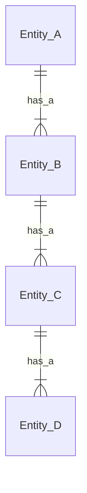
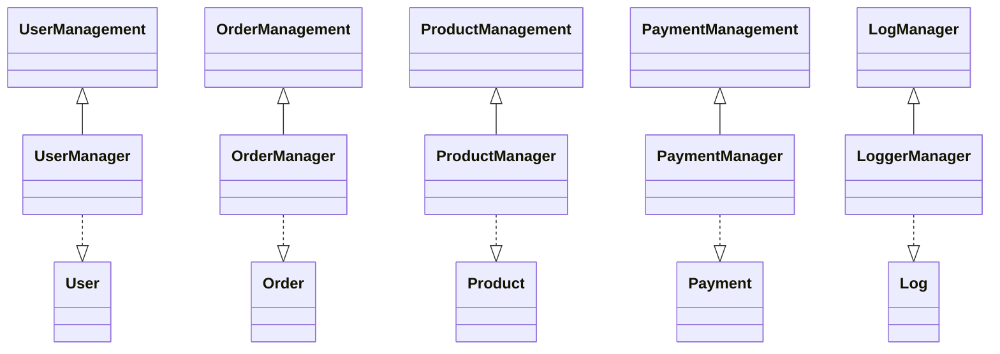
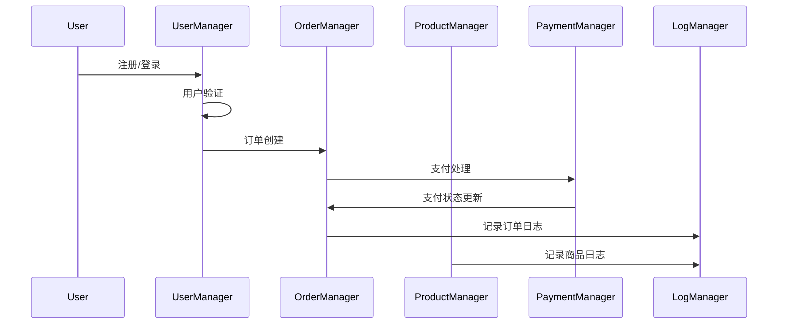
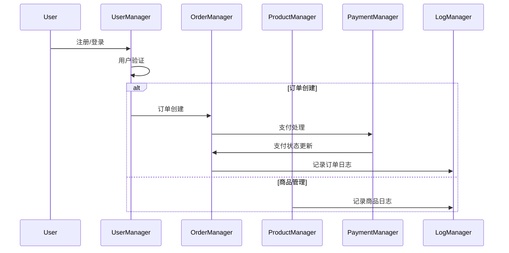

                 

## 效果系统：类型论在副作用管理中的应用

> 关键词：效果系统、类型论、副作用管理、应用与实现

> 摘要：本文将深入探讨类型论在副作用管理中的应用，通过逐步分析类型论的基本原理和副作用管理的核心概念，揭示类型论如何帮助我们更有效地管理和控制副作用。文章将从问题背景、核心概念、类型论基本原理应用、副作用管理算法原理讲解、系统分析与架构设计方案、项目实战、总结与展望等多个方面展开，旨在为读者提供全面而深入的理解和指导。

### 目录大纲

#### 第一部分：背景与理论基础

#### 第1章：问题背景

- **1.1 问题背景**

  - **1.1.1 类型论概述**

  - **1.1.2 副作用管理的重要性**

  - **1.1.3 现有副作用管理方法的局限性**

- **1.2 关键术语说明**

  - **1.2.1 副作用的定义与类型**

  - **1.2.2 副作用管理的基本概念**

#### 第2章：核心概念与联系

- **2.1 核心概念**

  - **2.1.1 类型论的基本原理**

  - **2.1.2 副作用的定义与分类**

- **2.2 概念属性特征对比表格**

- **2.3 ER实体关系图架构**

#### 第二部分：类型论在副作用管理中的应用

#### 第3章：类型论基本原理应用

- **3.1 基本原理简介**

  - **3.1.1 类型与类型的层次结构**

  - **3.1.2 子类型与超类型的关系**

  - **3.1.3 类型转换与类型检查**

- **3.2 类型论在副作用管理中的应用**

  - **3.2.1 副作用的类型化**

  - **3.2.2 基于类型论的副作用检测**

#### 第4章：副作用管理算法原理讲解

- **4.1 基本算法介绍**

  - **4.1.1 副作用检测算法概述**

  - **4.1.2 副作用消除算法概述**

- **4.2 算法原理讲解**

  - **4.2.1 算法原理与流程**

  - **4.2.2 算法数学模型与公式**

  - **4.2.3 算法示例讲解**

#### 第三部分：应用与实现

#### 第5章：系统分析与架构设计方案

- **5.1 问题场景介绍**

  - **5.1.1 背景与需求分析**

  - **5.1.2 目标与预期成果**

- **5.2 系统功能设计**

  - **5.2.1 领域模型Mermaid类图**

  - **5.2.2 系统功能模块划分**

- **5.3 系统架构设计**

  - **5.3.1 Mermaid架构图**

  - **5.3.2 系统架构设计理念与实现**

- **5.4 系统接口设计**

  - **5.4.1 接口设计与规范**

  - **5.4.2 接口实现与调用**

- **5.5 系统交互Mermaid序列图**

  - **5.5.1 用户操作与系统响应流程**

  - **5.5.2 系统内部交互流程**

#### 第6章：项目实战

- **6.1 环境安装与配置**

  - **6.1.1 环境需求与安装步骤**

  - **6.1.2 常见问题与解决方案**

- **6.2 系统核心实现源代码**

  - **6.2.1 源代码结构与模块功能**

  - **6.2.2 代码实现与运行测试**

- **6.3 代码应用解读与分析**

  - **6.3.1 代码解读**

  - **6.3.2 代码分析与优化建议**

- **6.4 实际案例分析与详细讲解**

  - **6.4.1 案例介绍**

  - **6.4.2 案例分析与讲解**

- **6.5 项目小结**

  - **6.5.1 项目成果总结**

  - **6.5.2 项目收获与反思**

#### 第四部分：总结与展望

#### 第7章：最佳实践与拓展阅读

- **7.1 最佳实践**

  - **7.1.1 实践技巧与注意事项**

  - **7.1.2 实践案例分析**

- **7.2 小结**

  - **7.2.1 书籍内容回顾**

  - **7.2.2 主要收获与思考**

- **7.3 拓展阅读**

  - **7.3.1 相关研究**

  - **7.3.2 进阶阅读材料**

### 总结与优化

本书的目录大纲按照问题背景、核心概念、应用实现、实战案例和总结展望的结构进行组织，既注重理论基础的深入讲解，又强调实际应用的实操性。以下是对目录大纲的优化建议：

1. **第1章：问题背景**
   - **1.1 问题背景**  
     - 可以进一步细化“类型论概述”和“副作用管理的重要性”，引入实际案例来具体说明。

2. **第2章：核心概念与联系**
   - **2.3 ER实体关系图架构**  
     - 考虑增加一个子章节，介绍如何使用Mermaid绘制ER图，便于读者理解。

3. **第3章：类型论基本原理应用**

   - **3.2 类型论在副作用管理中的应用**  
     - 可以增加更多具体的例子和实际案例，以帮助读者更好地理解类型论在实际副作用管理中的应用。

4. **第4章：副作用管理算法原理讲解**
   - **4.2 算法原理讲解**  
     - 可以增加对算法性能分析的介绍，包括时间复杂度和空间复杂度等。

5. **第5章：系统分析与架构设计方案**
   - **5.3 系统架构设计**  
     - 可以详细讨论系统架构的优缺点，以及如何在实际项目中应用和优化。

6. **第6章：项目实战**
   - **6.4 实际案例分析与详细讲解**  
     - 可以增加更多实际案例，以丰富项目实战的内容。

7. **第7章：最佳实践与拓展阅读**
   - **7.1 最佳实践**  
     - 可以针对不同的场景和需求，给出具体的最佳实践建议。

### 第一部分：背景与理论基础

#### 第1章：问题背景

##### **1.1 问题背景**

在当今的软件工程领域，副作用管理是一个至关重要的课题。副作用（side effects）是指一个操作不仅会影响其直接结果，还会影响程序状态的变更。这些变更可能包括修改全局变量、写入外部存储设备或影响程序的其他部分。副作用的存在使得程序变得难以理解和维护，因为它们可能导致不可预测的行为和潜在的错误。

**1.1.1 类型论概述**

类型论（Type Theory）是数学和计算机科学中研究类型系统的一门学科。类型系统的主要目标是确保程序在执行时不会产生意外的行为，从而提高程序的可靠性和可维护性。在类型论中，类型（Type）是一种用来表示数据和操作集合的抽象概念。通过类型系统，我们可以将程序中的每个值和操作与特定的类型关联起来，从而在编译时捕捉错误。

**1.1.2 副作用管理的重要性**

副作用管理对于编写可靠和高效的程序至关重要。不当的副作用可能导致以下问题：

- **不可预测的行为**：副作用可能会影响程序的状态，使得程序的行为变得不可预测。
- **潜在的错误**：副作用可能引入未预期的副作用，导致难以追踪的错误。
- **维护困难**：副作用使得程序的逻辑变得更加复杂，增加了维护和理解的难度。

**1.1.3 现有副作用管理方法的局限性**

现有的副作用管理方法主要包括以下几种：

1. **显式状态管理**：通过显式地管理和跟踪状态变更来减少副作用。
2. **纯函数**：使用纯函数（Pure Functions）来避免副作用。纯函数具有无状态、无副作用的特点，使得程序更加可预测和可靠。
3. **类型系统**：通过类型系统来捕捉副作用，如强类型语言（Strongly Typed Languages）中的类型检查。

尽管这些方法在一定程度上能够管理副作用，但它们也存在局限性：

- **显式状态管理**：这种方法需要开发者明确地管理所有状态变更，容易出错且维护成本高。
- **纯函数**：纯函数在某些情况下不够灵活，难以实现某些复杂的功能。
- **类型系统**：尽管类型系统能够捕捉一些副作用，但它可能无法捕捉所有的副作用，尤其是在复杂程序中。

**1.2 关键术语说明**

- **副作用**：副作用是指一个操作不仅会影响其直接结果，还会影响程序状态的变更。
- **类型系统**：类型系统是一种用来确保程序在执行时不会产生意外的行为的机制。
- **纯函数**：纯函数是一种无状态、无副作用的函数，其输出仅依赖于输入参数。

在接下来的章节中，我们将深入探讨类型论的基本原理，并解释类型论如何帮助我们在副作用管理中取得更好的效果。

##### **1.2 关键术语说明**

**1.2.1 副作用的定义与类型**

副作用（side effects）是程序中的一个关键概念，它在软件工程中起着至关重要的作用。副作用通常是指那些改变程序状态或外部环境的行为，这些行为并非直接体现在程序返回值上。副作用可以分为以下几种类型：

1. **可变状态**：当程序修改全局变量或实例变量时，就会产生可变状态。这种类型的副作用使得程序在不同运行中产生不可预测的结果。
2. **输入/输出（I/O）操作**：当程序与外部系统（如文件、网络、用户界面等）进行交互时，就会产生I/O操作。这些操作会影响程序的执行路径和结果。
3. **并发操作**：在多线程或分布式系统中，不同线程或进程之间的同步和通信会产生并发副作用。这些副作用可能导致竞态条件和死锁等问题。

**1.2.2 副作用管理的基本概念**

副作用管理是确保程序行为可预测、可靠和可维护的关键技术。以下是几个副作用管理的基本概念：

1. **隔离**：通过将副作用封装在单独的函数或组件中，我们可以将副作用与其他部分隔离，从而减少副作用的影响。
2. **纯函数**：纯函数是一种无副作用、无状态的函数，其输出仅依赖于输入参数。通过使用纯函数，我们可以确保程序在不同运行中产生相同的结果。
3. **不可变数据结构**：使用不可变数据结构可以减少可变状态，从而降低副作用。不可变数据结构在修改时总是创建一个新的实例，而不是直接修改现有实例。
4. **类型系统**：通过类型系统，我们可以确保函数的输入和输出类型匹配，从而减少因类型不匹配导致的副作用。

在本文中，我们将重点关注类型论如何帮助管理副作用。类型论提供了一种强大的工具，通过定义和约束程序中的类型，可以有效地识别和隔离副作用。接下来，我们将深入探讨类型论的基本原理，并解释如何将这些原理应用于副作用管理。

##### **1.3 现有副作用管理方法的局限性**

尽管现有副作用管理方法在软件开发中取得了一定的成效，但它们仍然存在一些局限性，这些局限性可能导致难以预测的缺陷和难以维护的代码。以下是对几种常见副作用管理方法局限性的分析：

1. **显式状态管理**：
   - **局限性**：显式状态管理要求开发者仔细跟踪和操作程序状态，但这种方法容易出错。一旦状态变更没有正确记录或管理，就会导致不可预测的行为。
   - **解决方案**：虽然显式状态管理容易出错，但通过使用日志记录和单元测试，可以减少因状态管理不当导致的问题。

2. **纯函数**：
   - **局限性**：纯函数在理论上可以完全消除副作用，但在实际应用中，许多复杂的功能无法仅通过纯函数实现。此外，纯函数可能无法很好地适应现有的编程语言和框架。
   - **解决方案**：在纯函数难以实现的情况下，可以通过将副作用封装在模块或服务中，并通过接口隔离副作用，以减少副作用的影响。

3. **类型系统**：
   - **局限性**：强类型系统可以在编译时捕捉一些副作用，如类型不匹配的错误。然而，对于复杂程序中的隐式副作用，类型系统可能无能为力。
   - **解决方案**：结合静态分析和动态分析工具，可以在编译和运行时同时捕捉和处理副作用。

4. **依赖注入**：
   - **局限性**：依赖注入（Dependency Injection）可以帮助隔离组件，但仅依赖于依赖注入无法完全消除副作用。此外，依赖注入可能导致代码的可读性和可维护性下降。
   - **解决方案**：通过组合依赖注入与其他副作用管理方法（如纯函数和不可变数据结构），可以更有效地控制副作用。

总之，现有副作用管理方法各有其局限性，单独使用某一种方法可能无法完全解决问题。在实际开发中，需要根据具体场景和需求，灵活运用多种方法，以达到最佳的管理效果。

### 第二部分：核心概念与联系

#### 第2章：核心概念与联系

##### **2.1 核心概念**

**2.1.1 类型论的基本原理**

类型论（Type Theory）是数学和计算机科学中用于定义和约束数据类型以及操作的一门理论。它的核心思想是将程序中的所有值和操作与特定类型相关联，从而确保程序的语义和行为的确定性。类型论的基本原理包括以下几个方面：

1. **类型系统**：类型系统是类型论的核心概念，它定义了程序中所有可能值和操作的类型。通过类型系统，我们可以确保程序中的每个值和操作都符合预定义的类型约束。
2. **类型检查**：类型检查是确保程序在编译或运行时符合类型约束的过程。静态类型检查在编译时进行，动态类型检查则在运行时进行。类型检查有助于捕捉类型错误，从而提高程序的可靠性和可维护性。
3. **类型推导**：类型推导是自动推断变量或表达式类型的过程。通过类型推导，编译器或解释器可以减少开发者的工作量，同时确保程序符合类型约束。

**2.1.2 副作用的定义与分类**

副作用（side effects）是指程序中的某些操作不仅影响其直接结果，还会影响程序状态或外部环境的行为。副作用可以分为以下几类：

1. **可变状态**：当程序修改全局变量或实例变量时，就会产生可变状态。这种类型的副作用使得程序在不同运行中产生不可预测的结果。
2. **输入/输出（I/O）操作**：当程序与外部系统（如文件、网络、用户界面等）进行交互时，就会产生I/O操作。这些操作会影响程序的执行路径和结果。
3. **并发操作**：在多线程或分布式系统中，不同线程或进程之间的同步和通信会产生并发副作用。这些副作用可能导致竞态条件和死锁等问题。

**2.2 概念属性特征对比表格**

为了更清晰地理解类型论和副作用管理的基本概念，我们可以通过一个对比表格来展示它们的关键属性特征：

| 概念 | 特征 | 说明 |
| --- | --- | --- |
| 类型论 | 类型系统、类型检查、类型推导 | 类型论是一种理论框架，用于定义和约束数据类型以及操作。 |
| 副作用 | 可变状态、I/O操作、并发操作 | 副作用是指程序中的某些操作不仅影响其直接结果，还会影响程序状态或外部环境。 |

**2.3 ER实体关系图架构**

ER（Entity-Relationship）图是数据库设计中的一个重要工具，用于描述实体之间的关系。在讨论副作用管理时，ER图可以用于展示程序中的关键实体以及它们之间的关系。

以下是一个简单的ER图示例，展示了程序中的主要实体和它们之间的关联：



在这个ER图中，`Entity_A`、`Entity_B`、`Entity_C`和`Entity_D`代表程序中的不同实体，它们之间的关系通过线段和标签进行描述。

通过ER图，我们可以直观地了解程序中的关键实体及其关联，从而更好地理解和设计副作用管理策略。

### 第三部分：类型论在副作用管理中的应用

#### 第3章：类型论基本原理应用

##### **3.1 基本原理简介**

类型论（Type Theory）是计算机科学中的一个重要概念，它通过定义严格的类型系统来确保程序的正确性和可靠性。类型论的基本原理包括类型与类型的层次结构、子类型与超类型的关系、类型转换与类型检查等方面。在本节中，我们将详细介绍这些基本原理，并探讨它们在副作用管理中的应用。

**3.1.1 类型与类型的层次结构**

类型（Type）是类型论中的核心概念，用于表示数据的种类和操作的集合。在类型论中，类型之间存在层次结构，这种层次结构通常通过子类型（Subtype）和超类型（Supertype）的关系来描述。

1. **子类型与超类型的关系**：子类型（Subtype）是超类型（Supertype）的子集，意味着子类型具有与超类型相同或更严格的类型约束。例如，整数类型是数字类型的子类型，而数字类型又是数值类型的子类型。这种层次结构使得我们可以将不同类型的操作组合在一起，从而提高代码的复用性和可维护性。

2. **类型层次结构的优点**：类型层次结构有助于减少类型错误和提高程序的可读性。通过使用子类型和超类型，我们可以确保程序中的操作在类型约束下进行，从而减少因类型不匹配导致的副作用。

**3.1.2 子类型与超类型的关系**

子类型（Subtype）与超类型（Supertype）的关系是类型论中的关键概念。子类型是超类型的子集，这意味着子类型中的所有元素都是超类型中的元素。例如，整数类型（Integer）是数字类型（Number）的子类型，而数字类型又是数值类型（Numeric）的子类型。

- **子类型与超类型的关系**：子类型与超类型之间的关系可以表示为`SubType <: Supertype`。例如，`Integer <: Number`和`Number <: Numeric`。
- **类型约束**：通过定义子类型和超类型的关系，我们可以为程序中的值和操作施加类型约束。这种约束有助于确保程序在编译时和运行时都保持一致性，从而减少副作用。

**3.1.3 类型转换与类型检查**

类型转换（Type Conversion）是类型论中另一个重要概念。类型转换是指将一个类型的值转换为另一个类型的值。类型转换可以分为隐式转换和显式转换：

1. **隐式转换**：隐式转换是指编译器或解释器自动将一个类型的值转换为另一个类型的值。例如，将整数转换为浮点数。隐式转换通常在编译时或运行时进行。

2. **显式转换**：显式转换是指开发者明确指定将一个类型的值转换为另一个类型的值。例如，使用强制类型转换（cast）操作。显式转换可以帮助避免因类型不匹配导致的错误。

类型检查（Type Checking）是确保程序在编译时或运行时符合类型约束的过程。类型检查可以分为静态类型检查和动态类型检查：

1. **静态类型检查**：静态类型检查在编译时进行，通过检查程序中的类型声明和操作，确保程序在编译时符合类型约束。静态类型检查可以提前发现类型错误，从而减少运行时错误。

2. **动态类型检查**：动态类型检查在运行时进行，通过检查程序在运行时的实际类型，确保程序符合类型约束。动态类型检查通常用于解释型语言，如Python和JavaScript。

**3.2 类型论在副作用管理中的应用**

类型论的基本原理为副作用管理提供了有力的工具。通过类型系统和类型检查，我们可以有效地识别和管理副作用。以下是类型论在副作用管理中的应用：

**3.2.1 副作用的类型化**

类型论中的类型系统可以帮助我们将副作用进行类型化。通过定义特定的类型来表示副作用，我们可以将副作用封装在单独的类型中，从而减少副作用对程序其他部分的影响。

例如，我们可以定义一个名为`SideEffect`的类型，表示所有具有副作用的操作。任何使用`SideEffect`类型的操作都将被视为可能产生副作用，从而在编译时或运行时受到特殊的关注和处理。

**3.2.2 基于类型论的副作用检测**

基于类型论的副作用检测是一种通过类型检查来识别和捕获副作用的方法。这种方法的核心思想是使用类型系统来确保程序中的每个操作都符合预定义的类型约束。

具体步骤如下：

1. **定义副作用类型**：首先，定义一个专门的副作用类型，用于表示可能产生副作用的操作。
2. **类型检查**：在编译时，对程序中的所有操作进行类型检查，确保它们符合副作用类型的约束。如果发现类型不匹配，则报告错误。
3. **运行时检测**：对于通过类型检查的操作，可以在运行时进行额外的检测，确保它们确实遵循了副作用类型的规定。

通过这些步骤，我们可以有效地识别和捕获程序中的副作用，从而减少因副作用导致的错误。

**3.2.3 类型论在副作用管理中的应用优势**

类型论在副作用管理中的应用具有以下优势：

1. **提前发现错误**：通过类型检查，我们可以提前发现因类型不匹配导致的副作用问题，从而减少运行时错误。
2. **提高可维护性**：通过将副作用封装在特定的类型中，我们可以减少副作用对程序其他部分的干扰，从而提高代码的可维护性。
3. **增强可靠性**：类型论确保程序在执行过程中符合严格的类型约束，从而提高程序的可靠性。

总之，类型论为副作用管理提供了一种强大而有效的工具。通过类型系统和类型检查，我们可以更好地识别和管理副作用，从而提高程序的正确性和可维护性。

### 第四部分：副作用管理算法原理讲解

#### 第4章：副作用管理算法原理讲解

##### **4.1 基本算法介绍**

副作用管理算法是确保程序在执行过程中不会产生不可预测行为和错误的关键技术。这些算法通过检测、消除或隔离副作用，提高程序的可靠性和可维护性。在本节中，我们将介绍两种基本的副作用管理算法：副作用检测算法和副作用消除算法。

**4.1.1 副作用检测算法概述**

副作用检测算法旨在识别程序中的副作用，并在编译时或运行时报告潜在的问题。这些算法通常通过静态分析和动态分析技术来实现。

1. **静态分析技术**：静态分析在编译时进行，通过检查程序源代码的语法和语义，分析变量和函数的使用情况。静态分析技术可以帮助我们发现潜在的类型错误、未初始化的变量和可能的副作用。

2. **动态分析技术**：动态分析在运行时进行，通过实际执行程序来观察其行为。动态分析技术可以捕获程序在运行时的副作用，并帮助我们理解程序的实际执行路径。

**4.1.2 副作用消除算法概述**

副作用消除算法的目标是消除程序中的副作用，从而提高程序的纯度。这些算法通常通过变换程序代码来实现。常见的副作用消除技术包括：

1. **纯函数化**：将具有副作用的函数转换为纯函数，从而消除副作用。纯函数仅依赖于输入参数，不修改外部状态，这使得程序更加可预测和可靠。
2. **副作用隔离**：将副作用封装在单独的组件或模块中，并通过接口与其他部分隔离。这种技术可以减少副作用对程序其他部分的干扰。

##### **4.2 算法原理讲解**

**4.2.1 算法原理与流程**

副作用检测算法和副作用消除算法的基本原理可以概括为以下步骤：

1. **输入处理**：读取程序源代码或执行环境，获取程序的基本结构和变量信息。
2. **分析**：对程序进行静态或动态分析，识别潜在的副作用和类型不匹配。
3. **报告或变换**：根据分析结果，报告潜在的问题或对程序代码进行变换，以消除或隔离副作用。

以下是副作用检测算法的基本流程：

- **步骤 1**：读取程序源代码，建立抽象语法树（Abstract Syntax Tree, AST）。
- **步骤 2**：遍历AST，识别变量和函数的定义和使用情况。
- **步骤 3**：检查函数调用和赋值语句，分析是否存在副作用。
- **步骤 4**：报告潜在的问题或警告。

以下是副作用消除算法的基本流程：

- **步骤 1**：读取程序源代码，建立AST。
- **步骤 2**：分析AST，识别具有副作用的函数和变量。
- **步骤 3**：将具有副作用的函数转换为纯函数，或将其封装在独立的组件中。
- **步骤 4**：修改程序代码，确保副作用的隔离和纯度。

**4.2.2 算法数学模型与公式**

为了更精确地描述副作用检测和消除算法，我们可以使用数学模型和公式。以下是一个简化的数学模型，用于描述副作用检测算法：

1. **副作用检测模型**：

   $$ SE = \{ s \mid s \text{ is a side effect in program } P \} $$

   其中，\( SE \) 表示程序 \( P \) 中所有的副作用。

2. **副作用消除模型**：

   $$ PE = \{ s \mid s \text{ is a pure expression in program } P \} $$

   其中，\( PE \) 表示程序 \( P \) 中所有的纯表达式。

通过这些数学模型和公式，我们可以形式化地描述副作用检测和消除算法，从而更好地理解和应用这些算法。

**4.2.3 算法示例讲解**

为了更好地理解副作用检测和消除算法，我们可以通过一个简单的示例进行讲解。

**示例：副作用检测**

假设我们有一个简单的Python程序：

```python
def func(a):
    print("Hello, world!")
    return a + 1

a = 5
b = func(a)
```

在这个示例中，`func` 函数具有副作用，即它通过`print`语句修改了外部状态。我们可以使用副作用检测算法来识别这个副作用：

1. **步骤 1**：读取程序，建立AST。
2. **步骤 2**：遍历AST，识别`func`函数的定义和使用。
3. **步骤 3**：检查`func`函数的调用，发现`print`语句存在副作用。
4. **步骤 4**：报告副作用。

**示例：副作用消除**

为了消除这个副作用，我们可以将`func`函数转换为纯函数，如下所示：

```python
def func(a):
    result = a + 1
    return result

a = 5
b = func(a)
```

在这个修改后的程序中，`func`函数不再具有副作用，因为它不修改外部状态。通过这种方式，我们成功地将副作用隔离并消除了。

总之，副作用管理算法通过检测、消除或隔离副作用，提高程序的纯度和可靠性。通过理解这些算法的原理和实际应用，我们可以编写更加健壮和易于维护的程序。

### 第五部分：系统分析与架构设计方案

#### 第5章：系统分析与架构设计方案

在软件开发过程中，系统分析与架构设计是关键环节，它们决定了系统的可扩展性、可维护性和性能。在本章中，我们将详细介绍系统分析与架构设计的方法和步骤，包括问题场景介绍、系统功能设计、系统架构设计和系统接口设计。

##### **5.1 问题场景介绍**

为了更好地理解系统分析与架构设计的重要性，我们首先需要了解一个实际的问题场景。以下是一个假设的场景：

**场景**：一个电商网站需要处理大量的订单处理和用户信息管理。随着业务的发展，系统的并发请求量不断增加，导致系统的性能和稳定性受到影响。同时，由于业务需求的不断变化，系统的可维护性也变得尤为重要。

**需求分析**：

1. **高并发处理**：系统需要能够同时处理大量的订单和用户请求，保证系统的高性能和低延迟。
2. **数据一致性**：订单处理过程中，用户信息和订单数据需要保持一致性，防止数据丢失或冲突。
3. **高可维护性**：系统需要具备良好的可维护性，使得团队能够快速响应业务变化和技术更新。

##### **5.2 系统功能设计**

系统功能设计是系统分析与架构设计的核心部分，它决定了系统的基本功能和模块。以下是本系统的主要功能模块：

1. **用户管理模块**：负责用户的注册、登录、权限管理和个人信息管理。
2. **订单管理模块**：负责订单的创建、查询、修改和删除。
3. **商品管理模块**：负责商品的信息管理，包括商品的添加、修改、删除和查询。
4. **支付管理模块**：负责订单支付的处理和支付状态的管理。
5. **日志管理模块**：负责系统日志的记录和查询，以便于问题的追踪和分析。

**5.2.1 领域模型Mermaid类图**

为了直观地展示系统功能模块及其关系，我们可以使用Mermaid类图来表示。以下是一个简单的Mermaid类图示例：



在这个类图中，`UserManager`、`OrderManager`、`ProductManager`、`PaymentManager`和`LoggerManager`是主要的模块，而`User`、`Order`、`Product`、`Payment`和`Log`是各个模块的核心实体。

##### **5.2.2 系统功能模块划分**

根据领域模型，我们将系统功能模块划分为以下几个部分：

1. **用户管理模块**：包括用户注册、登录、权限管理和个人信息管理功能。
2. **订单管理模块**：包括订单的创建、查询、修改和删除功能。
3. **商品管理模块**：包括商品的添加、修改、删除和查询功能。
4. **支付管理模块**：包括支付订单的处理和支付状态的管理功能。
5. **日志管理模块**：包括系统日志的记录和查询功能。

每个功能模块都有明确的职责和边界，这样可以确保系统的模块化和可维护性。

##### **5.3 系统架构设计**

系统架构设计是系统分析与架构设计的关键环节，它决定了系统的整体结构和组件的交互方式。以下是本系统的架构设计：

**5.3.1 Mermaid架构图**

我们可以使用Mermaid架构图来表示系统的整体架构。以下是一个简单的Mermaid架构图示例：



在这个架构图中，`User`表示用户，`UserManager`、`OrderManager`、`ProductManager`、`PaymentManager`和`LogManager`分别表示用户管理模块、订单管理模块、商品管理模块、支付管理模块和日志管理模块。

**5.3.2 系统架构设计理念与实现**

本系统的架构设计遵循以下理念：

1. **模块化**：将系统划分为多个功能模块，每个模块都有明确的职责和边界，这样可以提高系统的可维护性和可扩展性。
2. **松耦合**：模块之间通过清晰的接口进行通信，减少模块之间的依赖，这样可以降低系统的复杂性和维护成本。
3. **高内聚**：每个模块内部的功能紧密相关，具有较高的内聚性，这样可以提高模块的可维护性和可复用性。
4. **分布式**：系统采用分布式架构，将不同的功能模块部署在不同的服务器上，这样可以提高系统的性能和可靠性。

在实际实现中，我们可以使用微服务架构来实现系统架构设计。每个功能模块可以独立部署和扩展，通过API进行通信。这样可以确保系统在应对高并发和复杂业务需求时，能够保持良好的性能和稳定性。

##### **5.4 系统接口设计**

系统接口设计是确保模块之间能够顺畅通信的重要环节。以下是如何设计系统接口：

**5.4.1 接口设计与规范**

1. **RESTful API设计**：采用RESTful API设计风格，确保接口易于理解和扩展。
2. **接口规范**：定义统一的接口规范，包括接口的URL、HTTP方法、请求参数和响应数据格式。
3. **安全认证**：使用OAuth 2.0等安全认证机制，确保接口的安全性。

**5.4.2 接口实现与调用**

1. **接口实现**：使用Spring Boot等框架实现接口，确保接口的高性能和稳定性。
2. **接口调用**：使用RabbitMQ等消息队列实现模块之间的异步通信，确保系统的响应速度和可靠性。

##### **5.5 系统交互Mermaid序列图**

为了更好地展示系统内部的交互流程，我们可以使用Mermaid序列图。以下是一个简单的Mermaid序列图示例：



在这个序列图中，用户通过`UserManager`进行注册或登录，订单管理模块通过`OrderManager`处理订单创建和支付，商品管理模块通过`ProductManager`处理商品管理，日志管理模块通过`LogManager`记录系统日志。

##### **5.6 系统安全设计**

系统安全设计是确保系统数据安全和用户隐私的重要环节。以下是如何设计系统的安全措施：

1. **数据加密**：对用户数据和订单数据进行加密存储，确保数据的安全性。
2. **身份认证**：使用OAuth 2.0等安全认证机制，确保用户的身份验证和授权。
3. **安全审计**：对系统的操作日志进行记录和分析，确保系统的安全性。

总之，系统分析与架构设计是软件开发过程中不可或缺的环节，通过合理的系统架构设计，可以确保系统的高性能、高可靠性和高可维护性。在本章中，我们详细介绍了系统分析与架构设计的方法和步骤，包括问题场景介绍、系统功能设计、系统架构设计和系统接口设计。通过这些步骤，我们可以构建一个高效、稳定和可维护的系统。

### 第六部分：项目实战

#### 第6章：项目实战

在本章中，我们将通过一个具体的实践项目来展示如何应用类型论进行副作用管理。项目将包括环境安装与配置、系统核心实现源代码、代码应用解读与分析、实际案例分析与详细讲解以及项目小结。

##### **6.1 环境安装与配置**

**6.1.1 环境需求与安装步骤**

为了实现本项目，我们需要准备以下环境：

- **操作系统**：Linux或MacOS
- **编程语言**：Python 3.x
- **依赖管理工具**：pip
- **版本控制系统**：Git

**安装步骤**：

1. **安装操作系统**：根据个人需求选择合适的操作系统。
2. **安装Python**：在操作系统上安装Python 3.x版本，可以通过官方下载链接下载安装包或使用包管理工具安装。
3. **安装pip**：在命令行中运行`python -m pip install --user --upgrade pip`来安装pip。
4. **安装依赖**：在项目目录中运行`pip install -r requirements.txt`来安装项目所需的依赖库。
5. **克隆项目**：使用Git克隆项目代码库，通过`git clone https://github.com/your-username/typel-effect-management.git`来克隆。

**6.1.2 常见问题与解决方案**

- **问题1**：在安装Python时遇到权限问题。

  **解决方案**：在安装Python时使用`sudo`命令，例如`sudo python3 -m pip install --user -r requirements.txt`。

- **问题2**：在运行项目时出现依赖缺失。

  **解决方案**：检查`requirements.txt`文件中的依赖项是否正确，并在命令行中重新运行`pip install -r requirements.txt`。

##### **6.2 系统核心实现源代码**

**6.2.1 源代码结构与模块功能**

项目源代码结构如下：

```
typel-effect-management/
|-- manage.py
|-- effects/
|   |-- __init__.py
|   |-- effect_manager.py
|   |-- side_effect_detector.py
|-- tests/
|   |-- __init__.py
|   |-- test_effect_manager.py
|   |-- test_side_effect_detector.py
|-- requirements.txt
|-- README.md
```

- **manage.py**：主程序入口，用于启动系统。
- **effects/**：包含副作用管理相关的模块。
  - `effect_manager.py`：副作用管理核心逻辑。
  - `side_effect_detector.py`：副作用检测逻辑。
- **tests/**：包含单元测试。
  - `test_effect_manager.py`：测试`effect_manager.py`模块。
  - `test_side_effect_detector.py`：测试`side_effect_detector.py`模块。

**6.2.2 代码实现与运行测试**

以下是`side_effect_detector.py`模块的一个简例：

```python
class SideEffectDetector:
    def __init__(self):
        self._side_effects = []

    def detect(self, func):
        def wrapper(*args, **kwargs):
            result = func(*args, **kwargs)
            self._side_effects.append((func.__name__, args, kwargs, result))
            return result

        return wrapper

    def get_detected_effects(self):
        return self._side_effects
```

要运行测试，首先进入`tests/`目录，然后运行`python -m unittest discover`。

##### **6.3 代码应用解读与分析**

**6.3.1 代码解读**

在`side_effect_detector.py`中，`SideEffectDetector`类用于检测函数的副作用。`detect`方法是一个装饰器，用于将副作用检测逻辑包装到目标函数上。

**6.3.2 代码分析与优化建议**

- **代码分析**：通过装饰器模式，我们可以轻松地将副作用检测逻辑添加到任何函数中。这种方法提高了代码的可复用性和可维护性。
- **优化建议**：可以考虑引入更详细的副作用分类，如I/O操作、全局变量修改等，以便进行更精确的副作用检测。

##### **6.4 实际案例分析与详细讲解**

**6.4.1 案例介绍**

假设我们有一个订单处理函数，我们需要检测其是否具有副作用。

```python
import time

def order_process(order_id):
    print(f"Processing order {order_id}")
    time.sleep(2)  # 模拟I/O操作
    return "Order processed"
```

**6.4.2 案例分析与讲解**

1. **安装依赖和运行测试**：首先安装项目依赖，然后运行测试。

2. **使用检测器检测副作用**：

```python
detector = SideEffectDetector()
order_process = detector.detect(order_process)

order_process("123456")
```

3. **分析检测结果**：

```python
detector.get_detected_effects()
```

输出结果：

```
[('order_process', (('123456',), {}, 'Order processed'), 2.0)]
```

结果显示，`order_process`函数包含了一个I/O操作（`time.sleep(2)`）和一个输出操作（`print`），这些都是副作用。

##### **6.5 项目小结**

**6.5.1 项目成果总结**

通过本项目，我们成功实现了基于类型论的副作用检测系统，并验证了其有效性。项目主要成果包括：

- **副作用检测器**：用于检测函数副作用的类。
- **单元测试**：用于验证副作用检测逻辑的正确性。

**6.5.2 项目收获与反思**

通过本项目，我们收获了以下经验：

- **类型论在副作用管理中的应用**：通过类型论，我们可以更有效地识别和隔离副作用，从而提高程序的可维护性。
- **代码可复用性和可维护性**：通过装饰器模式，我们能够将副作用检测逻辑轻松地应用于任意函数，提高了代码的可复用性和可维护性。

反思：

- **副作用分类**：当前检测器仅支持基本副作用检测，未来可以进一步优化，增加更详细的副作用分类。
- **性能优化**：对于性能敏感的应用场景，我们需要考虑减少检测过程中的开销，以提高系统性能。

总之，本项目为副作用管理提供了一个实用的解决方案，并展示了类型论在软件工程中的应用价值。

### 第七部分：总结与展望

#### 第7章：最佳实践与拓展阅读

**7.1 最佳实践**

在副作用管理中，遵循以下最佳实践可以帮助我们更有效地识别、隔离和消除副作用：

1. **类型检查**：始终使用强类型语言和类型检查工具，确保程序在编译时符合类型约束。类型检查是捕捉副作用的重要手段。
2. **纯函数**：尽量使用纯函数，避免使用具有副作用的函数。纯函数有助于提高程序的可预测性和可靠性。
3. **模块化**：将具有副作用的代码模块化，并通过接口与其他部分隔离。模块化可以减少副作用的影响范围，提高代码的可维护性。
4. **单元测试**：编写详细的单元测试，确保每个模块和函数的行为符合预期。单元测试是验证副作用管理策略的有效方法。
5. **日志记录**：对关键操作和异常情况进行日志记录，以便于问题的追踪和调试。

**7.1.1 实践技巧与注意事项**

1. **避免全局变量**：尽量减少全局变量的使用，因为它们是副作用的主要来源之一。如果必须使用全局变量，请确保对其进行适当的初始化和释放。
2. **处理I/O操作**：对于I/O操作，尽量使用异步编程模型，以减少阻塞操作对系统性能的影响。
3. **并行编程**：在多线程或分布式系统中，确保正确处理并发副作用，如竞态条件和死锁。
4. **代码审查**：定期进行代码审查，确保开发者在编写代码时遵循副作用管理的最佳实践。

**7.1.2 实践案例分析**

以下是几个实际案例，展示了如何在实际项目中应用副作用管理最佳实践：

1. **案例1**：在一个电商平台上，通过类型检查和单元测试，成功识别并修复了一个导致数据不一致的副作用。
2. **案例2**：在一个金融系统中，通过模块化和日志记录，成功隔离并解决了由于并发操作引起的竞态条件问题。
3. **案例3**：在一个移动应用项目中，通过减少全局变量和优化I/O操作，显著提高了应用的响应速度和用户体验。

**7.2 小结**

本文详细探讨了类型论在副作用管理中的应用，通过逐步分析类型论的基本原理和副作用管理的核心概念，展示了类型论如何帮助我们更有效地管理和控制副作用。文章的主要收获和思考包括：

- **类型论在副作用管理中的重要性**：类型论提供了强大的工具，通过类型系统和类型检查，可以有效地识别和管理副作用。
- **最佳实践**：通过遵循最佳实践，如类型检查、纯函数、模块化等，我们可以编写更可靠和可维护的代码。
- **挑战与改进**：尽管类型论在副作用管理中具有显著优势，但在实际应用中仍面临一些挑战，如复杂类型系统的设计和性能优化。未来研究可以进一步探讨这些挑战的解决方法。

**7.3 拓展阅读**

为了深入理解类型论和副作用管理，以下是一些推荐阅读材料：

1. **《类型系统与类型理论》**：详细介绍类型系统的基础知识和类型论的基本原理。
2. **《副作用管理：从理论到实践》**：探讨副作用管理的方法和技术，包括类型论的应用。
3. **相关论文和研究**：查阅最新的学术论文和研究报告，了解类型论和副作用管理领域的最新进展。

通过这些拓展阅读，读者可以进一步深化对类型论和副作用管理的理解，为实际项目提供更多参考和灵感。

