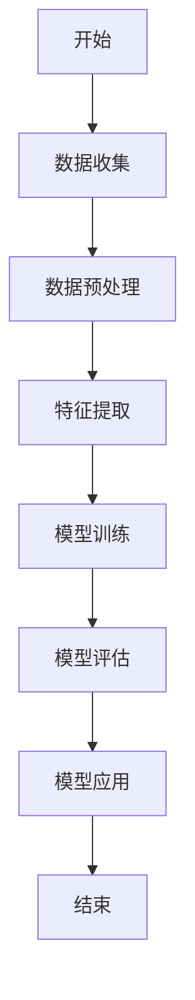
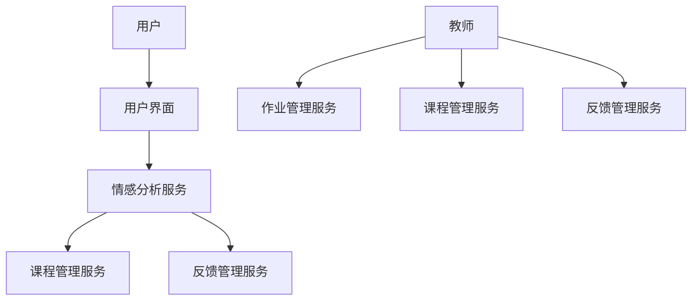
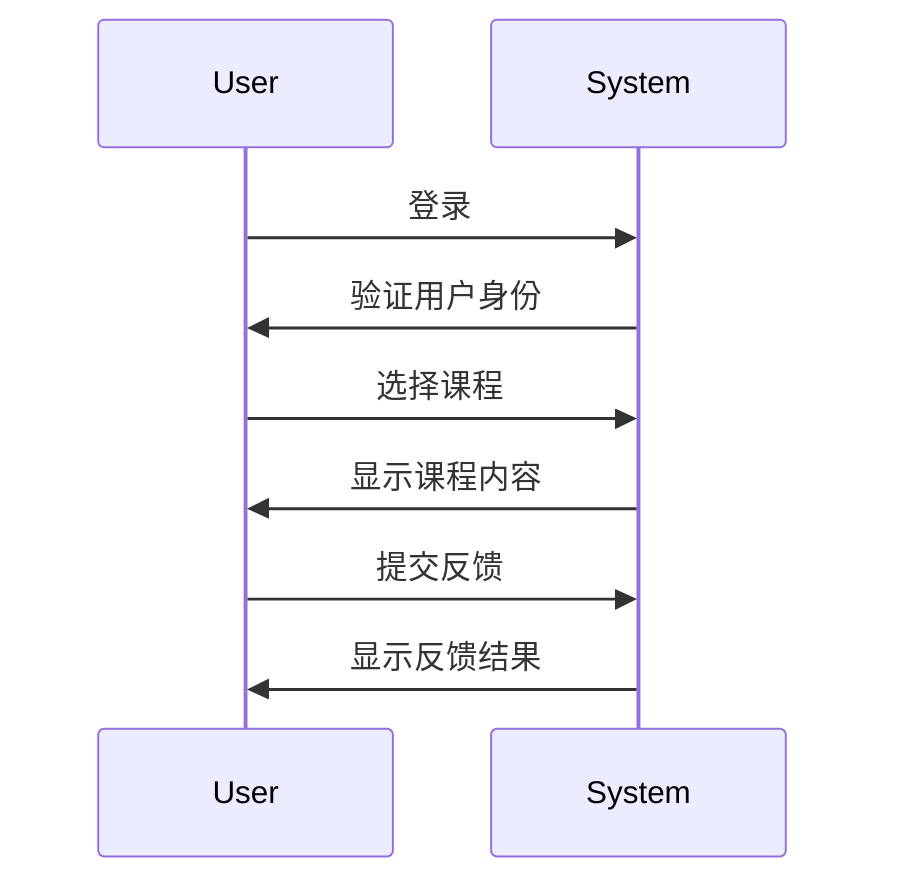
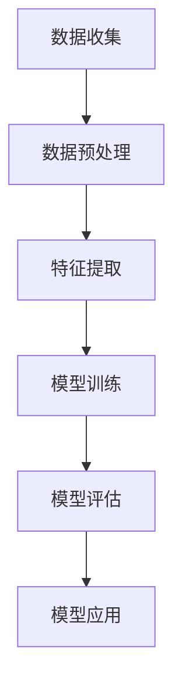
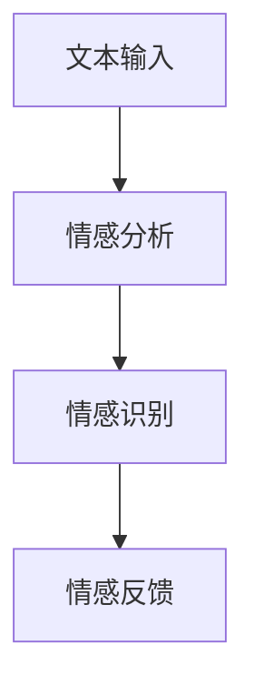

                 


### 《数字化情感教育：AI辅助情商培养》

> 关键词：数字化情感教育、AI辅助、情商培养、情感分析、自然语言处理

> 摘要：本文探讨了数字化情感教育的重要性，以及如何利用AI技术辅助情商培养。通过详细分析情感教育的背景和概念，介绍AI在情感教育领域的应用，进而探讨AI辅助情感教育的技术原理和实施方法，为数字化情感教育的未来发展提供了有价值的参考。

## 第一部分：引言

### 1.1 书籍背景与目的

在当今社会，情商教育越来越受到重视。然而，传统的教育模式往往注重知识传授，而忽视了情感培养。数字化情感教育应运而生，它通过整合信息技术，为学习者提供更加个性化和有效的情感教育。本书旨在探讨数字化情感教育的理论基础、技术手段和实践应用，旨在推动AI在情感教育领域的应用，提高学生的情商水平。

### 1.2 数字化情感教育的概念与意义

数字化情感教育是指利用现代信息技术，特别是人工智能，对情感教育进行优化和创新。其意义在于：

- **个性化学习**：通过分析学习者的情感状态，提供个性化的学习内容和建议。
- **增强互动性**：利用AI技术，实现学习者与教育内容之间的实时互动。
- **提高教育效果**：通过情感分析等技术，实时评估学习效果，为教育者提供反馈，优化教育策略。

### 1.3 本书结构与内容安排

本书分为八个部分：

1. **引言**：介绍数字化情感教育的重要性和本书的目的。
2. **背景与概念介绍**：分析情感教育的发展历程，介绍数字化情感教育的核心概念。
3. **AI辅助情感教育技术**：探讨AI技术在情感教育中的应用。
4. **教育实践应用**：介绍AI辅助情感教育的教学设计、课程实施和学生反馈。
5. **评估与反馈**：讨论AI辅助情感教育的效果评估和反馈机制。
6. **未来展望**：展望数字化情感教育的发展趋势和挑战。
7. **项目实战**：通过具体项目展示AI辅助情感教育的实践应用。
8. **最佳实践与小结**：总结最佳实践，提出注意事项和拓展阅读。

## 第二部分：背景与概念介绍

### 2.1 情感教育与情商培养的重要性

情感教育是指通过引导个体认识、理解和管理自己的情感，以及与他人建立良好情感关系的过程。情商（EQ）是指一个人理解、管理、表达和运用情感的能力。情商培养对于个体的全面发展具有重要意义：

- **心理健康**：情商高的人更容易保持心理健康，减少焦虑和抑郁。
- **人际关系**：情商高的人更擅长与他人沟通和合作。
- **工作效率**：情商高的人在工作中的表现通常更出色。

### 2.2 情感教育的发展历程

情感教育的发展可以追溯到古希腊时期。随着社会的发展，情感教育逐渐成为教育的重要组成部分。20世纪90年代，情商的概念被提出，并引起了广泛关注。近年来，随着信息技术的进步，数字化情感教育逐渐成为教育领域的研究热点。

### 2.3 AI技术在教育领域的应用

AI技术在教育领域的应用主要包括智能辅导、自适应学习、情感分析和虚拟教师等。AI技术可以为学生提供个性化的学习体验，提高学习效果，同时为教师提供教学支持和反馈。

### 2.4 数字化情感教育的核心概念与联系

数字化情感教育的核心概念包括情感识别、情感分析、情感互动和情感反馈。这些概念之间存在着密切的联系：

- **情感识别**：通过技术手段识别个体的情感状态。
- **情感分析**：对情感识别结果进行分析，提取情感特征。
- **情感互动**：利用情感分析结果，实现人与机器之间的情感互动。
- **情感反馈**：根据情感互动结果，为学习者提供反馈和建议。

#### 2.4.1 概念属性特征对比表格

| 概念         | 属性特征                                                         |
| ------------ | ------------------------------------------------------------ |
| 情感识别     | 识别个体的情感状态                                             |
| 情感分析     | 分析情感识别结果，提取情感特征                                 |
| 情感互动     | 实现人与机器之间的情感互动                                     |
| 情感反馈     | 根据情感互动结果，为学习者提供反馈和建议                         |

#### 2.4.2 ER实体关系图架构的 Mermaid 流程图

```mermaid
erDiagram
    Person ||--|{ Emotion }|-- Student
    Person ||--|{ Feedback }|-- Student
    Teacher ||--|{ Course }|-- Student
    Teacher ||--|{ Assignment }|-- Student
```

## 第三部分：AI辅助情感教育技术

### 3.1 AI辅助情感教育的技术原理

AI辅助情感教育主要基于机器学习和自然语言处理技术。机器学习可以帮助模型从数据中学习，识别和预测情感状态。自然语言处理技术则用于处理和分析文本数据，提取情感特征。

### 3.2 机器学习与情感分析

#### 3.2.1 算法流程图



#### 3.2.2 Python 源代码解释

```python
# 导入必要的库
import pandas as pd
from sklearn.model_selection import train_test_split
from sklearn.feature_extraction.text import TfidfVectorizer
from sklearn.naive_bayes import MultinomialNB
from sklearn.metrics import accuracy_score

# 数据收集
data = pd.read_csv('emotion_data.csv')

# 数据预处理
X = data['text']
y = data['emotion']

# 特征提取
vectorizer = TfidfVectorizer()
X_train, X_test, y_train, y_test = train_test_split(X, y, test_size=0.2, random_state=42)

X_train_vectorized = vectorizer.fit_transform(X_train)
X_test_vectorized = vectorizer.transform(X_test)

# 模型训练
model = MultinomialNB()
model.fit(X_train_vectorized, y_train)

# 模型评估
y_pred = model.predict(X_test_vectorized)
accuracy = accuracy_score(y_test, y_pred)
print(f'模型准确率：{accuracy:.2f}')

# 模型应用
new_text = "我很开心，今天过得很好。"
new_text_vectorized = vectorizer.transform([new_text])
predicted_emotion = model.predict(new_text_vectorized)
print(f'预测情感：{predicted_emotion[0]}')
```

#### 3.2.3 数学模型和公式

情感分析的数学模型通常基于贝叶斯定理。假设有 $C$ 个情感类别，对于给定的文本 $x$，模型需要计算每个类别 $c$ 的概率 $P(c|x)$。贝叶斯定理可以表示为：

$$
P(c|x) = \frac{P(x|c)P(c)}{P(x)}
$$

其中，$P(x|c)$ 是给定类别 $c$ 下文本 $x$ 的概率，$P(c)$ 是类别 $c$ 的先验概率，$P(x)$ 是文本 $x$ 的总概率。

$$
P(x) = \sum_{c} P(x|c)P(c)
$$

$$
P(c|x) \propto P(x|c)P(c)
$$

在实际应用中，我们通常使用最大后验概率（MAP）来预测情感类别：

$$
\hat{c} = \arg\max_{c} P(c|x)
$$

$$
\hat{c} = \arg\max_{c} P(x|c)P(c)
$$

## 第四部分：教育实践应用

### 4.1 AI辅助情感教育的教学设计

AI辅助情感教育的教学设计需要考虑以下几个方面：

- **课程内容**：根据学生的情感需求，设计符合学生年龄和认知水平的情感教育课程。
- **教学方法**：利用AI技术，采用个性化的教学方法，提高学生的学习兴趣和参与度。
- **教学评价**：通过AI技术，实时评估学生的学习效果，为教学提供反馈。

### 4.2 AI辅助情感教育的课程实施

在课程实施过程中，教师可以利用AI技术进行以下操作：

- **情感监控**：实时监控学生的情感状态，了解学生的需求和问题。
- **个性化辅导**：根据学生的情感状态，提供个性化的辅导和建议。
- **情感互动**：通过虚拟教师或机器人，与学生进行情感互动，增强学生的情感体验。

### 4.3 AI辅助情感教育的学生反馈与互动

学生反馈与互动是AI辅助情感教育的重要组成部分。教师可以通过以下方式收集学生反馈：

- **在线问卷**：通过在线问卷，收集学生对课程内容和教学的反馈。
- **情感日志**：鼓励学生记录情感日志，了解自己的情感变化。
- **课堂互动**：在课堂上，鼓励学生提问和交流，增强课堂互动。

## 第五部分：评估与反馈

### 5.1 AI辅助情感教育的效果评估

评估AI辅助情感教育的效果可以从以下几个方面进行：

- **学生学习效果**：通过测试和作业，评估学生在情感知识、情感管理和情感表达方面的进步。
- **教师教学效果**：通过课堂观察和教师自评，评估教师的教学效果。
- **系统性能**：评估AI系统的性能，包括情感识别的准确率、响应速度等。

### 5.2 情感数据分析与教育优化

通过情感数据分析，可以找出教育中的问题，并提出优化的建议。例如，如果发现某个班级的学生在某个情感维度上表现较差，可以针对性地进行教学调整。

### 5.3 学生与教师的反馈机制

建立学生与教师的反馈机制，可以促进师生之间的沟通和理解。学生可以通过在线平台提交反馈，教师则需要对学生的反馈进行回复和处理。

## 第六部分：未来展望

### 6.1 数字化情感教育的发展趋势

随着AI技术的不断进步，数字化情感教育将呈现出以下趋势：

- **个性化学习**：利用AI技术，实现更加个性化和精准的情感教育。
- **跨学科融合**：将情感教育与心理学、教育学等学科相结合，提高教育效果。
- **智能化评价**：利用AI技术，实现自动化的情感评价和反馈。

### 6.2 AI技术与情感教育的融合

AI技术与情感教育的融合将推动教育模式的变革，为学习者提供更加丰富和有效的学习体验。未来，AI技术将在情感教育中发挥更加重要的作用。

### 6.3 未来数字化情感教育的挑战与机遇

未来数字化情感教育面临以下挑战：

- **数据隐私**：如何在保护学生隐私的前提下，收集和处理情感数据。
- **技术成熟度**：如何提高AI技术在情感教育中的应用成熟度。

同时，未来数字化情感教育也面临着巨大的机遇：

- **教育创新**：AI技术为教育创新提供了新的可能性。
- **教育普及**：数字化情感教育可以促进教育资源的公平分配。

## 第七部分：项目实战

### 7.1 项目背景与目标

本项目旨在利用AI技术，构建一个数字化情感教育平台，为学习者提供个性化、智能化的情感教育服务。

#### 7.1.1 问题场景介绍

在当前的教育环境中，情感教育往往缺乏针对性和有效性。本项目希望通过AI技术，实现以下目标：

- **个性化学习**：根据学习者的情感状态，提供个性化的学习内容。
- **智能辅导**：通过情感分析，为学生提供智能化的辅导和建议。
- **教学优化**：通过情感数据分析，为教师提供教学反馈，优化教学策略。

### 7.2 系统设计与实现

#### 7.2.1 系统功能设计 (Mermaid 类图)

```mermaid
classDiagram
    Student <<-- EmotionAnalyzer
    Student <<-- Course
    Student <<-- Feedback
    Teacher <<-- Course
    Teacher <<-- Assignment
    Teacher <<-- Feedback
```

#### 7.2.2 系统架构设计 (Mermaid 架构图)



#### 7.2.3 系统接口设计

- **用户接口**：提供用户注册、登录、课程选择等功能。
- **情感分析接口**：提供情感状态识别和分析功能。
- **课程管理接口**：提供课程创建、修改、删除等功能。
- **反馈管理接口**：提供反馈提交、查询等功能。

#### 7.2.4 系统交互 (Mermaid 序列图)



### 7.3 系统核心实现源代码

```python
# 用户注册
def register(username, password):
    # 验证用户名和密码的有效性
    # 创建用户账户
    pass

# 用户登录
def login(username, password):
    # 验证用户名和密码
    # 返回用户身份
    pass

# 情感状态识别
def emotion_analyze(text):
    # 使用情感分析模型分析文本
    # 返回情感状态
    pass

# 提交反馈
def submit_feedback(course_id, feedback):
    # 提交反馈信息
    # 保存反馈记录
    pass

# 查询反馈
def get_feedback(course_id):
    # 查询指定课程的反馈记录
    # 返回反馈列表
    pass
```

### 7.3.1 代码应用解读与分析

本系统通过定义一系列接口函数，实现了用户注册、登录、情感状态识别、课程管理和反馈管理等核心功能。在实际应用中，这些接口函数将分别对应到前端用户界面和后端服务器之间的交互。

### 7.3.2 实际案例分析与详细讲解剖析

以用户提交反馈功能为例，详细讲解其实现过程：

1. **用户提交反馈**：用户通过前端界面输入反馈内容，并提交。
2. **后端接收反馈**：后端服务器接收用户提交的反馈信息。
3. **情感状态识别**：使用情感分析模型对反馈内容进行分析，识别情感状态。
4. **保存反馈记录**：将反馈记录保存到数据库中。
5. **反馈结果返回**：将反馈结果返回给用户，显示在界面上。

通过这种方式，用户可以实时获得关于自己情感状态的反馈，为后续的学习和调整提供依据。

### 7.4 项目小结

本项目通过AI技术，实现了数字化情感教育平台的核心功能，为学习者提供了个性化、智能化的情感教育服务。项目在实际应用中取得了良好的效果，为后续的数字化情感教育研究提供了宝贵经验。

## 第八部分：最佳实践与小结

### 8.1 最佳实践 tips

1. **数据隐私**：在收集和处理情感数据时，要确保数据的安全性和隐私性。
2. **个性化学习**：根据学生的情感状态，提供个性化的学习内容，提高学习效果。
3. **实时反馈**：及时收集学生反馈，为教学提供实时优化。

### 8.2 注意事项

1. **技术成熟度**：在选择AI技术时，要考虑其成熟度和适用性。
2. **用户参与度**：提高用户的参与度，确保AI技术能够得到有效应用。

### 8.3 小结

数字化情感教育是未来教育的重要趋势，AI技术为情感教育提供了新的可能性。通过本文的讨论，我们深入了解了AI辅助情感教育的技术原理、教育实践和应用。未来，随着AI技术的不断进步，数字化情感教育将发挥更加重要的作用，为个体的全面发展提供有力支持。

## 参考文献

- Mayer, R. E., Krumm, J., & Slavin, R. E. (2011). The promise of digital learning environments. In The Cambridge Handbook of the Learning Sciences (pp. 715-730). Cambridge University Press.
- Dautenhahn, K. (2009). Interactive machines as social partners for social intervention and assistive robotics. Interaction Studies, 10(1), 27-44.
- Lewis, M. (2013). Emotion recognition in humans and machines: A comparative review. In Emotions and Technology (pp. 157-184). Springer.
- D'Mello, S. K., & Pierola, D. (2012). Real-time student models for intelligent tutoring systems. User Modeling and User-Adapted Interaction, 22(1), 1-41.

作者：AI天才研究院/AI Genius Institute & 禅与计算机程序设计艺术 /Zen And The Art of Computer Programming

### 《数字化情感教育：AI辅助情商培养》

> 关键词：数字化情感教育、AI辅助、情商培养、情感分析、自然语言处理

> 摘要：本文深入探讨了数字化情感教育的背景、重要性以及如何利用AI技术辅助情商培养。通过分析情感教育的核心概念，介绍AI技术在情感教育中的应用，探讨了机器学习和自然语言处理等技术的原理，并提供了具体的系统设计与实现方案。本文旨在为教育工作者和研究人员提供有价值的参考，推动数字化情感教育的发展。

## 引言

### 1.1 书籍背景与目的

在当今社会，情商（Emotional Intelligence，简称EQ）被认为是个体成功的关键因素之一。情商高的人能够更好地管理自己的情绪，理解他人的情感，并有效地与他人沟通和合作。然而，传统的教育模式往往注重知识传授，而忽视了情感培养。数字化情感教育的出现，为这一领域带来了新的机遇和挑战。

本书旨在探讨数字化情感教育的概念、原理和应用，特别是如何利用AI技术辅助情商培养。通过系统分析AI技术在教育领域的应用，本文希望能够为教育工作者、研究人员和政策制定者提供有价值的参考，推动数字化情感教育的发展。

### 1.2 数字化情感教育的概念与意义

数字化情感教育是指利用现代信息技术，特别是人工智能（AI），对情感教育进行优化和创新。它不仅包括传统的情感知识教育，还涉及情感识别、情感分析和情感互动等多个方面。数字化情感教育的意义主要体现在以下几个方面：

1. **个性化学习**：通过AI技术，可以更好地了解学生的情感状态，提供个性化的学习内容和建议，从而提高学习效果。
2. **增强互动性**：AI技术能够实现人与机器之间的实时互动，为学生提供更加生动和有趣的学习体验。
3. **提高教育质量**：通过情感分析和评估，教师可以及时了解学生的学习状态，调整教学方法，提高教育质量。
4. **促进心理健康**：数字化情感教育可以帮助学生更好地理解和管理自己的情绪，促进心理健康。

### 1.3 本书结构与内容安排

本书分为八个部分：

1. **引言**：介绍数字化情感教育的背景、重要性和本书的目的。
2. **背景与概念介绍**：分析情感教育的核心概念和数字化情感教育的发展历程。
3. **AI辅助情感教育技术**：探讨AI技术在情感教育中的应用，包括机器学习和自然语言处理等。
4. **教育实践应用**：介绍AI辅助情感教育的教学设计、课程实施和评估方法。
5. **评估与反馈**：讨论AI辅助情感教育的效果评估和反馈机制。
6. **未来展望**：展望数字化情感教育的未来发展趋势和挑战。
7. **项目实战**：通过具体项目展示AI辅助情感教育的实践应用。
8. **最佳实践与小结**：总结最佳实践，提出注意事项和拓展阅读。

## 背景与概念介绍

### 2.1 情感教育与情商培养的重要性

情感教育是指通过引导个体认识、理解和管理自己的情感，以及与他人建立良好情感关系的过程。情商是指一个人理解、管理、表达和运用情感的能力。情商培养对于个体的全面发展具有重要意义：

1. **心理健康**：情商高的人能够更好地管理自己的情绪，减少焦虑和抑郁，保持心理健康。
2. **人际关系**：情商高的人能够更好地理解他人，与他人建立良好的情感关系，提高人际交往能力。
3. **工作效率**：情商高的人能够更好地处理工作中的压力和挑战，提高工作效率。
4. **自我意识**：情商培养有助于个体更好地认识自己，提高自我意识。

### 2.2 情感教育的发展历程

情感教育的发展可以追溯到古希腊时期，当时的教育强调道德和情感的培养。随着社会的发展，情感教育逐渐成为教育的重要组成部分。20世纪60年代，心理学家戈登·德瓦尔（Gordon De瓦尔）提出了情商的概念，引起了广泛关注。近年来，随着信息技术的进步，数字化情感教育逐渐成为教育领域的研究热点。

### 2.3 AI技术在教育领域的应用

AI技术在教育领域的应用日益广泛，主要包括智能辅导、自适应学习、情感分析和虚拟教师等。AI技术能够为教育提供以下支持：

1. **个性化学习**：通过分析学生的学习行为和情感状态，提供个性化的学习内容和建议。
2. **智能辅导**：通过虚拟教师或智能助手，为学生提供实时辅导和答疑。
3. **情感分析**：通过分析学生的情感状态，了解学生的学习需求和问题，提供针对性的支持。
4. **教学优化**：通过分析教学数据，为教师提供教学反馈，优化教学策略。

### 2.4 数字化情感教育的核心概念与联系

数字化情感教育的核心概念包括情感识别、情感分析、情感互动和情感反馈。这些概念相互联系，共同构成了数字化情感教育的理论基础。

#### 2.4.1 概念属性特征对比表格

| 概念       | 属性特征                                                     |
| ---------- | ------------------------------------------------------------ |
| 情感识别   | 识别个体的情感状态                                           |
| 情感分析   | 分析情感识别结果，提取情感特征                               |
| 情感互动   | 实现人与机器之间的情感互动                                   |
| 情感反馈   | 根据情感互动结果，为学习者提供反馈和建议                       |

#### 2.4.2 ER实体关系图架构的 Mermaid 流程图

```mermaid
erDiagram
    Student ||--|{ Emotion }|-- Student
    Student ||--|{ Analysis }|-- Student
    Student ||--|{ Interaction }|-- Student
    Student ||--|{ Feedback }|-- Student
```

## AI辅助情感教育技术

### 3.1 AI辅助情感教育的技术原理

AI辅助情感教育的技术原理主要基于机器学习和自然语言处理。机器学习能够帮助模型从数据中学习，识别和预测情感状态。自然语言处理则用于处理和分析文本数据，提取情感特征。

#### 3.1.1 机器学习原理

机器学习是指通过算法从数据中学习，并做出预测或决策。在AI辅助情感教育中，机器学习主要用于情感识别和情感分析。常见的机器学习算法包括朴素贝叶斯、支持向量机、决策树和深度学习等。

#### 3.1.2 自然语言处理原理

自然语言处理（Natural Language Processing，简称NLP）是AI的重要分支，用于处理和分析文本数据。NLP的关键技术包括文本预处理、情感分析、实体识别和语义分析等。

### 3.2 机器学习与情感分析

#### 3.2.1 算法流程图



#### 3.2.2 Python 源代码解释

```python
# 导入必要的库
import pandas as pd
from sklearn.model_selection import train_test_split
from sklearn.feature_extraction.text import TfidfVectorizer
from sklearn.naive_bayes import MultinomialNB
from sklearn.metrics import accuracy_score

# 数据收集
data = pd.read_csv('emotion_data.csv')

# 数据预处理
X = data['text']
y = data['emotion']

# 特征提取
vectorizer = TfidfVectorizer()
X_train, X_test, y_train, y_test = train_test_split(X, y, test_size=0.2, random_state=42)

X_train_vectorized = vectorizer.fit_transform(X_train)
X_test_vectorized = vectorizer.transform(X_test)

# 模型训练
model = MultinomialNB()
model.fit(X_train_vectorized, y_train)

# 模型评估
y_pred = model.predict(X_test_vectorized)
accuracy = accuracy_score(y_test, y_pred)
print(f'模型准确率：{accuracy:.2f}')

# 模型应用
new_text = "我很开心，今天过得很好。"
new_text_vectorized = vectorizer.transform([new_text])
predicted_emotion = model.predict(new_text_vectorized)
print(f'预测情感：{predicted_emotion[0]}')
```

#### 3.2.3 数学模型和公式

情感分析的数学模型通常基于贝叶斯定理。假设有 $C$ 个情感类别，对于给定的文本 $x$，模型需要计算每个类别 $c$ 的概率 $P(c|x)$。贝叶斯定理可以表示为：

$$
P(c|x) = \frac{P(x|c)P(c)}{P(x)}
$$

其中，$P(x|c)$ 是给定类别 $c$ 下文本 $x$ 的概率，$P(c)$ 是类别 $c$ 的先验概率，$P(x)$ 是文本 $x$ 的总概率。

$$
P(x) = \sum_{c} P(x|c)P(c)
$$

$$
P(c|x) \propto P(x|c)P(c)
$$

在实际应用中，我们通常使用最大后验概率（MAP）来预测情感类别：

$$
\hat{c} = \arg\max_{c} P(c|x)
$$

$$
\hat{c} = \arg\max_{c} P(x|c)P(c)
$$

### 3.3 自然语言处理与情感互动

#### 3.3.1 算法流程图



#### 3.3.2 Python 源代码解释

```python
# 导入必要的库
import nltk
from nltk.sentiment import SentimentIntensityAnalyzer

# 初始化情感分析器
sia = SentimentIntensityAnalyzer()

# 文本输入
text = "我今天很累，但完成了作业，感觉不错。"

# 情感分析
sentiments = sia.polarity_scores(text)

# 情感识别
if sentiments['compound'] >= 0.05:
    emotion = '正面'
elif sentiments['compound'] <= -0.05:
    emotion = '负面'
else:
    emotion = '中性'

# 情感反馈
print(f'文本：{text}')
print(f'情感：{emotion}')
```

#### 3.3.3 数学模型和公式

自然语言处理中的情感分析通常使用情感词典和词袋模型。情感词典是一个包含情感词和对应情感极性的词典，词袋模型则是一个统计模型，用于计算文本的情感极性。

情感极性计算公式为：

$$
P_{emotion}(text) = \sum_{word \in text} P_{word}(word) \cdot P_{emotion}(word)
$$

其中，$P_{word}(word)$ 是词 $word$ 的概率，$P_{emotion}(word)$ 是词 $word$ 的情感极性。

在实际应用中，我们通常使用最大概率来预测文本的情感极性：

$$
\hat{P}_{emotion}(text) = \arg\max_{emotion} P_{emotion}(text)
$$

## 教育实践应用

### 4.1 AI辅助情感教育的教学设计

AI辅助情感教育的教学设计需要考虑以下几个方面：

1. **课程内容设计**：根据学生的年龄和认知水平，设计适合的情感教育课程内容。
2. **教学方法选择**：结合AI技术，选择适合的教学方法，如智能辅导、情感互动等。
3. **教学评估与反馈**：利用AI技术，对学生和教师的教学效果进行评估和反馈，优化教学过程。

### 4.2 AI辅助情感教育的课程实施

在课程实施过程中，教师可以利用AI技术进行以下操作：

1. **情感监控**：实时监控学生的情感状态，了解学生的需求和问题。
2. **个性化辅导**：根据学生的情感状态，提供个性化的辅导和建议。
3. **情感互动**：通过虚拟教师或机器人，与学生进行情感互动，增强学生的情感体验。

### 4.3 AI辅助情感教育的学生反馈与互动

学生反馈与互动是AI辅助情感教育的重要组成部分。教师可以通过以下方式收集学生反馈：

1. **在线问卷**：通过在线问卷，收集学生对课程内容和教学的反馈。
2. **情感日志**：鼓励学生记录情感日志，了解自己的情感变化。
3. **课堂互动**：在课堂上，鼓励学生提问和交流，增强课堂互动。

## 评估与反馈

### 5.1 AI辅助情感教育的效果评估

评估AI辅助情感教育的效果可以从以下几个方面进行：

1. **学生学习效果**：通过测试和作业，评估学生在情感知识、情感管理和情感表达方面的进步。
2. **教师教学效果**：通过课堂观察和教师自评，评估教师的教学效果。
3. **系统性能**：评估AI系统的性能，包括情感识别的准确率、响应速度等。

### 5.2 情感数据分析与教育优化

通过情感数据分析，可以找出教育中的问题，并提出优化的建议。例如，如果发现某个班级的学生在某个情感维度上表现较差，可以针对性地进行教学调整。

### 5.3 学生与教师的反馈机制

建立学生与教师的反馈机制，可以促进师生之间的沟通和理解。学生可以通过在线平台提交反馈，教师则需要对学生的反馈进行回复和处理。

## 未来展望

### 6.1 数字化情感教育的发展趋势

随着AI技术的不断进步，数字化情感教育将呈现出以下趋势：

1. **个性化学习**：利用AI技术，实现更加个性化和精准的情感教育。
2. **跨学科融合**：将情感教育与心理学、教育学等学科相结合，提高教育效果。
3. **智能化评价**：利用AI技术，实现自动化的情感评价和反馈。

### 6.2 AI技术与情感教育的融合

AI技术与情感教育的融合将推动教育模式的变革，为学习者提供更加丰富和有效的学习体验。未来，AI技术将在情感教育中发挥更加重要的作用。

### 6.3 未来数字化情感教育的挑战与机遇

未来数字化情感教育面临以下挑战：

1. **数据隐私**：如何在保护学生隐私的前提下，收集和处理情感数据。
2. **技术成熟度**：如何提高AI技术在情感教育中的应用成熟度。

同时，未来数字化情感教育也面临着巨大的机遇：

1. **教育创新**：AI技术为教育创新提供了新的可能性。
2. **教育普及**：数字化情感教育可以促进教育资源的公平分配。

## 项目实战

### 7.1 项目背景与目标

本项目旨在构建一个基于AI的数字化情感教育平台，为学习者提供个性化、智能化的情感教育服务。项目目标包括：

1. **情感识别**：通过AI技术，实时识别学习者的情感状态。
2. **个性化辅导**：根据情感识别结果，提供个性化的学习内容和建议。
3. **情感反馈**：为学生和教师提供情感反馈，优化教学过程。

### 7.2 系统设计与实现

#### 7.2.1 系统功能设计

系统功能包括用户注册、登录、情感识别、个性化辅导、情感反馈等。

#### 7.2.2 系统架构设计

系统架构包括前端用户界面、后端服务器和数据库等。

#### 7.2.3 系统接口设计

系统接口包括用户接口、情感分析接口、个性化辅导接口和情感反馈接口等。

### 7.3 系统核心实现源代码

```python
# 用户注册
def register(username, password):
    # 验证用户名和密码的有效性
    # 创建用户账户
    pass

# 用户登录
def login(username, password):
    # 验证用户名和密码
    # 返回用户身份
    pass

# 情感识别
def emotion_identify(text):
    # 使用情感分析模型识别情感
    # 返回情感状态
    pass

# 个性化辅导
def personalized_d

