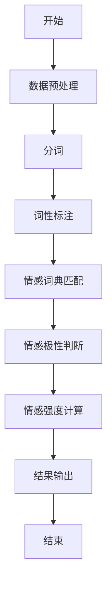
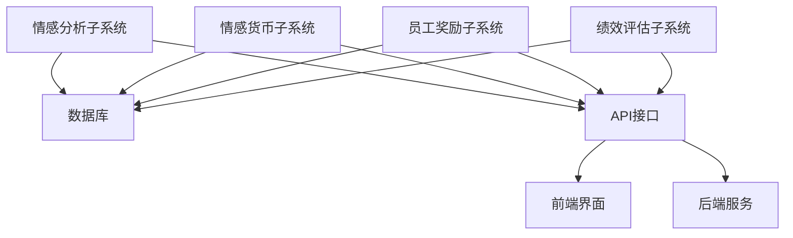
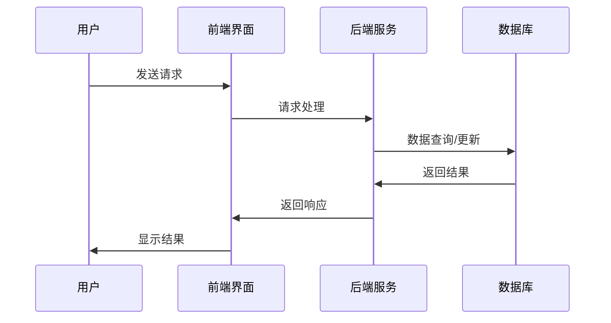

                 

# 数字化情感货币：情感价值的量化与交易

> 关键词：数字化情感货币，情感价值，量化，交易机制，社会影响，案例分析，发展挑战

> 摘要：随着数字化时代的到来，情感作为一种无形的价值逐渐被挖掘和量化。数字化情感货币应运而生，成为情感价值交易的桥梁。本文将从背景、量化、交易机制、监管、社会影响、案例分析以及发展挑战等方面，深入探讨数字化情感货币的概念、原理和应用。

## 第一部分：数字化情感货币概述

### 第1章：数字化情感货币的背景与意义

#### 1.1 数字化时代的情感变革

在数字化时代，人们的生活和工作方式发生了翻天覆地的变化。传统的人际交往逐渐被线上交流所取代，情感表达和传递的方式也随之发生了变革。在这个过程中，情感作为一种无形的价值逐渐被挖掘和重视。

#### 1.2 情感货币的概念提出

为了更好地理解和利用情感价值，人们提出了情感货币的概念。情感货币是一种数字化的情感价值表现形式，它能够量化情感价值，并实现情感价值的流通和交易。

#### 1.3 数字化情感货币的价值

数字化情感货币具有以下价值：

1. 提高情感价值的利用率：通过量化情感价值，可以更准确地评估和利用情感价值。
2. 促进情感交易：数字化情感货币使得情感交易更加便捷和高效。
3. 改变经济结构：情感价值作为新兴的经济要素，对经济结构产生深远影响。

#### 1.4 情感货币的应用场景

数字化情感货币的应用场景非常广泛，包括但不限于：

1. 企业内部员工激励：通过情感货币激励员工，提高员工的工作积极性和创造力。
2. 社交媒体：用户可以通过情感货币进行互动，增强社交关系。
3. 教育领域：教育机构可以利用情感货币评估学生的学习效果，提高教学质量。

### 第2章：情感价值的量化

#### 2.1 情感价值的定义与分类

情感价值是指情感在特定情境下所具有的经济、社会和心理价值。根据情感类型的差异，情感价值可以分为愉悦、愤怒、恐惧、悲伤等。

#### 2.2 情感量化方法与技术

情感量化的方法主要包括情感分析、情感计算等。通过这些技术，可以实现对情感价值的量化。

#### 2.3 情感量化的挑战与解决方案

情感量化面临的主要挑战包括情感的主观性、情感表达的多样性等。为了解决这些挑战，研究人员提出了多种解决方案，如情感词典、情感模型等。

#### 2.4 情感量化的实际应用案例

情感量化在多个领域得到了应用，如情感营销、情感诊断等。通过情感量化，企业可以更好地了解用户需求，提高市场竞争力。

### 第3章：情感货币的交易机制

#### 3.1 情感货币的交易原理

情感货币的交易原理类似于传统的货币交易。交易双方通过交换情感货币来实现情感价值的流通和交易。

#### 3.2 情感货币的交易平台设计

情感货币交易平台需要具备以下功能：情感货币的发行、交易、支付等。

#### 3.3 情感货币的交易规则与安全性

情感货币的交易规则包括交易双方的身份验证、交易手续费等。安全性方面，需要确保交易数据的安全和隐私。

#### 3.4 情感货币交易案例分析

本文将结合实际案例，分析情感货币交易的具体操作和效果。

### 第4章：数字化情感货币的监管与合规

#### 4.1 情感货币监管的重要性

情感货币作为一种新兴的金融产品，需要得到有效监管，以保障交易安全和社会稳定。

#### 4.2 情感货币的法律法规框架

本文将介绍现有的法律法规框架，以及如何应对情感货币带来的新挑战。

#### 4.3 情感货币的合规性评估

合规性评估是情感货币发展的关键环节。本文将介绍评估方法和标准。

#### 4.4 情感货币监管的实践与展望

本文将探讨情感货币监管的实践经验和未来发展方向。

### 第5章：数字化情感货币的社会影响

#### 5.1 情感货币对经济的影响

情感货币对经济的影响主要体现在提高市场效率、促进新兴产业的发展等方面。

#### 5.2 情感货币对人际交往的影响

情感货币改变了人际交往的方式，促进了情感交流的深度和广度。

#### 5.3 情感货币对心理健康的影响

情感货币的普及和应用，对心理健康产生了一定的影响。

#### 5.4 情感货币的未来发展趋势

本文将分析情感货币的未来发展趋势，探讨其可能带来的变革。

### 第6章：数字化情感货币的案例分析

#### 6.1 案例一：企业内部情感货币应用

本文将介绍某企业如何利用情感货币激励员工，提高企业竞争力。

#### 6.2 案例二：社交媒体情感货币交易

本文将分析社交媒体平台如何利用情感货币促进用户互动。

#### 6.3 案例三：教育领域情感货币实践

本文将探讨教育机构如何利用情感货币评估学生表现。

#### 6.4 案例四：医疗保健情感货币应用

本文将介绍医疗保健领域如何利用情感货币改善患者体验。

### 第7章：数字化情感货币的发展与挑战

#### 7.1 情感货币的技术挑战

本文将分析情感货币在技术方面面临的挑战，如情感量化、安全性等。

#### 7.2 情感货币的经济挑战

本文将探讨情感货币在经济方面面临的挑战，如监管、市场接受度等。

#### 7.3 情感货币的社会挑战

本文将分析情感货币在社会方面面临的挑战，如隐私保护、道德伦理等。

#### 7.4 情感货币的未来发展前景

本文将展望情感货币的未来发展前景，探讨其可能带来的变革。

## 结束语

数字化情感货币是数字化时代的一种新兴金融产品，它不仅改变了情感价值的表达和传递方式，还带来了新的经济和社会挑战。本文从多个角度对数字化情感货币进行了深入探讨，旨在为读者提供全面的理解和认识。

### 作者：AI天才研究院/AI Genius Institute & 禅与计算机程序设计艺术 /Zen And The Art of Computer Programming## 第1章：数字化情感货币的背景与意义

### 1.1 数字化时代的情感变革

在数字化时代，信息技术的发展改变了人们的生活方式、工作方式以及社交方式。特别是在情感交流方面，传统的面对面交流逐渐被线上交流所取代。社交媒体、即时通讯软件和在线论坛等平台的普及，使得人们能够随时随地分享情感、表达观点，形成了全新的情感交流模式。

#### 情感交流的转变

这种变化不仅体现在交流的频率和便捷性上，还体现在交流的内容和形式上。过去，人们的情感表达往往是通过文字、声音和肢体语言实现的，这些方式具有直接性和即时性。然而，在数字化时代，文字和表情符号成为主要的情感表达工具，交流的形式变得更加多样和复杂。

#### 情感价值的新认识

随着情感交流方式的转变，人们开始重新审视情感的价值。过去，情感往往被视为个人私事，不常被公开讨论。但在数字化时代，情感成为了一种重要的社会资源，具有潜在的经济和社会价值。例如，用户在社交媒体上的点赞、评论和分享，实际上是对内容情感价值的认可，这种认可可以转化为商业价值。

### 1.2 情感货币的概念提出

为了更有效地利用和量化情感价值，人们提出了情感货币的概念。情感货币是一种数字化的情感价值表现形式，通过特定的算法和技术，将情感量化为可交易的货币。情感货币的提出，标志着情感价值从无形到有形、从隐性到显性的转变。

#### 情感货币的特点

情感货币具有以下特点：

1. **量化性**：通过技术手段，将情感价值量化为具体的数值，使其具有可计量的属性。
2. **流通性**：情感货币可以在特定的平台上进行交易，实现情感价值的流通和转移。
3. **稳定性**：情感货币的价值相对稳定，不受市场波动的影响。
4. **多样性**：情感货币可以涵盖多种情感类型，如愉悦、愤怒、恐惧、悲伤等。

### 1.3 数字化情感货币的价值

数字化情感货币的出现，不仅为情感价值的利用提供了新的途径，还带来了多方面的价值。

#### 提高情感价值的利用率

通过量化情感价值，可以更准确地评估和利用情感资源。例如，企业可以利用情感货币评估员工的工作表现，激励员工提高工作效率。

#### 促进情感交易

情感货币使得情感交易成为可能。在社交媒体上，用户可以通过购买情感货币来增强社交互动，提高自己在社交圈的影响力。

#### 改变经济结构

情感货币的出现，为经济结构带来了新的变革。情感作为一种新的经济要素，与传统的劳动力和资本等要素相互融合，形成了全新的经济模式。

### 1.4 情感货币的应用场景

数字化情感货币的应用场景非常广泛，涵盖了多个领域：

#### 企业内部

企业可以利用情感货币进行员工激励，提高员工的工作积极性和创造力。例如，通过情感货币奖励优秀的员工，激发员工的工作热情。

#### 社交媒体

社交媒体平台可以利用情感货币促进用户互动，增强用户粘性。例如，用户可以通过购买情感货币来赠送好友礼物，增强社交关系。

#### 教育领域

教育机构可以利用情感货币评估学生的学习效果，提高教学质量。例如，通过情感货币奖励表现优秀的学员，激励他们更加努力学习。

#### 医疗保健

医疗保健领域可以利用情感货币改善患者体验，提高医疗服务质量。例如，通过情感货币奖励积极配合治疗的病人，鼓励他们更好地参与治疗过程。

### 总结

数字化情感货币是数字化时代的一种新兴概念，它通过量化情感价值，实现了情感价值的流通和交易。在数字化时代，情感价值的重要性日益凸显，数字化情感货币为人们提供了新的价值表达和利用方式。随着技术的不断进步，情感货币的应用前景将更加广阔，其对经济、社会和个人生活的影响也将更加深远。

## 第2章：情感价值的量化

### 2.1 情感价值的定义与分类

情感价值是指情感在特定情境下所具有的经济、社会和心理价值。情感是人类心理活动的重要组成部分，它可以影响人的认知、行为和决策。在数字化时代，情感价值逐渐被重视，并成为了一种重要的社会资源。

#### 情感价值的定义

情感价值是指在特定情境下，情感对个体和社会所产生的有益影响。这种影响可以是正面的，如愉悦、满足和成就感；也可以是负面的，如焦虑、愤怒和悲伤。情感价值不仅体现在个人的心理状态上，还体现在社会互动和经济发展中。

#### 情感价值的分类

根据情感类型的差异，情感价值可以分为以下几类：

1. **愉悦情感**：如喜悦、快乐、满足等，这些情感通常与积极的生活体验相关联。
2. **愤怒情感**：如愤怒、怨恨、挫败感等，这些情感通常与负面经历和冲突相关联。
3. **恐惧情感**：如害怕、担忧、恐惧等，这些情感通常与不确定性和威胁相关联。
4. **悲伤情感**：如悲伤、失落、忧郁等，这些情感通常与失去、挫折和失望相关联。
5. **其他情感**：如感激、同情、厌恶等，这些情感在情感价值体系中同样具有重要地位。

### 2.2 情感量化方法与技术

情感量化是指通过技术手段，将情感价值量化为具体的数值，使其具有可计量的属性。情感量化方法主要依赖于情感分析、情感计算等人工智能技术。以下是一些常见的情感量化方法：

#### 情感分析

情感分析是一种自然语言处理技术，它通过分析文本内容，识别文本中的情感倾向。情感分析的方法主要包括基于规则的方法、基于统计的方法和基于机器学习的方法。

1. **基于规则的方法**：通过预设的规则，对文本进行情感分类。这种方法简单直观，但灵活性较差。
2. **基于统计的方法**：通过统计文本中的词频和词性，判断文本的情感倾向。这种方法具有一定的鲁棒性，但容易受到噪声的影响。
3. **基于机器学习的方法**：利用机器学习算法，对大量标注好的情感数据进行训练，建立情感分类模型。这种方法具有较好的泛化能力，但需要大量的训练数据和计算资源。

#### 情感计算

情感计算是一种人工智能技术，它通过模拟人类的情感反应，实现对情感的理解和计算。情感计算的方法主要包括情感识别、情感模拟和情感调控。

1. **情感识别**：通过分析语言、表情、声音等信号，识别个体的情感状态。情感识别技术可以应用于情感分析、情感监控和情感交互等领域。
2. **情感模拟**：通过生成符合情感逻辑的语言、表情和动作，模拟个体的情感反应。情感模拟技术可以应用于虚拟现实、游戏和机器人等领域。
3. **情感调控**：通过干预和调节情感过程，改变个体的情感状态。情感调控技术可以应用于心理治疗、情绪管理和健康促进等领域。

### 2.3 情感量化的挑战与解决方案

情感量化面临诸多挑战，主要包括情感的主观性、情感表达的多样性、情感理解的复杂性等。

#### 情感的主观性

情感具有主观性，不同的人对同一情感的理解和体验可能存在较大差异。这种主观性使得情感量化变得复杂。

**解决方案**：

1. **多维度情感模型**：通过引入多维度情感模型，综合考虑情感的主观性和客观性，提高情感量化的准确性。
2. **用户参与**：鼓励用户参与情感量化过程，通过用户的反馈和互动，提高情感量化的准确性和可靠性。

#### 情感表达的多样性

情感表达具有多样性，不同的人、不同的文化背景和情境可能导致不同的情感表达方式。

**解决方案**：

1. **跨文化情感分析**：结合不同文化背景，建立跨文化情感分析模型，提高情感量化的普适性。
2. **情境感知**：通过分析情境信息，理解情感表达背后的含义，提高情感量化的准确性。

#### 情感理解的复杂性

情感理解是一个复杂的认知过程，涉及情感识别、情感推理和情感感知等多个层面。

**解决方案**：

1. **多模态情感分析**：结合多种数据源，如文本、图像、声音等，提高情感理解的准确性。
2. **情感融合模型**：通过融合不同情感分析模型的结果，提高情感量化的综合性能。

### 2.4 情感量化的实际应用案例

情感量化在多个领域得到了实际应用，以下是一些典型应用案例：

#### 情感营销

情感营销通过分析用户的情感反应，制定个性化的营销策略，提高营销效果。例如，电商企业可以通过情感分析，了解用户对商品的满意度，优化商品推荐和促销策略。

#### 情感诊断

情感诊断通过分析个体的情感状态，帮助诊断和预防心理问题。例如，心理医生可以通过情感分析，了解患者的情感状态，制定个性化的治疗方案。

#### 情感教育

情感教育通过量化学生的情感反应，评估教学效果，提高教学质量。例如，教育机构可以通过情感分析，了解学生对课程的满意度，优化教学方法和内容。

### 总结

情感价值的量化是数字化时代的一个重要议题，它通过技术手段，将情感价值量化为具体的数值，为情感价值的利用和交易提供了基础。尽管情感量化面临诸多挑战，但通过多维度模型、用户参与、跨文化分析和多模态情感分析等技术手段，可以有效提高情感量化的准确性和可靠性。随着技术的不断进步，情感量化将在更多领域得到应用，为社会发展带来新的价值。

### 第3章：情感货币的交易机制

#### 3.1 情感货币的交易原理

情感货币的交易原理类似于传统的货币交易，但其核心在于情感价值的量化与交换。情感货币的交易过程可以概括为以下几个步骤：

1. **情感价值量化**：首先，通过情感分析技术，对个体的情感状态进行量化，将其转化为具体的数值表示。这些数值可以作为情感货币的初始发行量或交易量。
2. **发行与兑换**：情感货币的发行通常由特定的平台或机构负责，它们会根据情感分析结果，发放相应的情感货币。用户可以通过特定的兑换方式，将现实中的货币或其他价值形式转换为情感货币。
3. **交易匹配**：在情感货币交易平台上，用户可以发布交易请求，表达自己希望购买或出售的情感货币数量。平台会根据供需关系，匹配交易双方。
4. **支付与结算**：交易双方达成一致后，通过平台进行支付和结算。支付过程通常涉及情感货币的价值转换和交易记录的存储。

#### 情感货币的交易平台设计

情感货币交易平台的设计需要考虑多个方面，包括用户界面、交易机制、安全性、数据存储等。以下是一些关键设计要素：

1. **用户界面**：用户界面应简洁易用，能够直观地展示用户的情感货币余额、交易历史和当前交易状态。同时，应提供便捷的兑换和交易操作功能。
2. **交易机制**：交易平台应具备高效的交易匹配算法，能够快速准确地匹配交易需求。此外，还应支持多种交易模式，如拍卖、竞价、订单交易等。
3. **安全性**：安全性是交易平台设计的核心要素。应采用加密技术和身份验证机制，确保用户交易信息的安全和隐私。此外，还应建立风险控制机制，防止恶意交易和欺诈行为。
4. **数据存储**：交易平台需要高效稳定的数据存储系统，能够存储大量的交易记录和用户信息。数据存储系统应支持快速检索和数据分析，以便于平台运营和监管。

#### 情感货币的交易规则与安全性

情感货币的交易规则需要明确交易双方的权利和义务，保障交易的公平性和透明度。以下是一些关键交易规则：

1. **交易手续费**：交易平台通常会收取一定的交易手续费，用于维护平台的运营和发展。
2. **交易时间限制**：某些特殊类型的交易可能需要设定时间限制，以保证交易的及时性和有效性。
3. **交易数量限制**：为了防止市场过度波动，交易平台可能对单次交易的数量进行限制。
4. **交易合规性**：交易平台需要遵守相关的法律法规，确保交易行为合法合规。

在安全性方面，交易平台应采取以下措施：

1. **数据加密**：使用高级加密算法，确保用户交易信息在传输和存储过程中的安全。
2. **多重身份验证**：实施多重身份验证机制，防止未授权用户访问平台。
3. **风险监控**：建立实时监控和报警系统，及时发现和处理异常交易行为。
4. **数据备份与恢复**：定期进行数据备份，确保在数据丢失或损坏时能够快速恢复。

#### 情感货币交易案例分析

为了更好地理解情感货币的交易机制，我们可以通过以下案例进行分析：

**案例一：社交媒体上的情感货币交易**

在一个社交媒体平台上，用户可以通过参与评论、点赞和分享等行为获取情感货币。用户可以将情感货币用于购买虚拟礼物、参与抽奖或提升自己在社区中的地位。例如，用户A通过在帖子下点赞获得10个情感货币，而用户B可以花费100个情感货币购买一张虚拟礼物卡，送给用户A。

**案例二：企业内部员工激励**

某企业通过引入情感货币作为员工激励手段，提高员工的工作积极性和创造力。员工可以通过完成工作任务、提出创新建议或参与团队活动等方式获得情感货币。企业可以根据员工的情感货币余额，给予相应的奖励，如晋升机会、奖金或培训机会。

**案例三：医疗保健情感货币交易**

在医疗保健领域，情感货币可以用于改善患者体验。患者可以通过积极配合治疗、按时复查等方式获得情感货币。这些情感货币可以用于购买医疗设备、减免费用或获得额外的医疗服务。例如，患者A通过按时复查获得100个情感货币，可以用来购买一次额外的体检。

### 总结

情感货币的交易机制通过量化情感价值，实现了情感价值的流通和交换。情感货币的交易平台设计需要考虑用户界面、交易机制、安全性和数据存储等多个方面，以确保交易的公平、透明和安全。通过实际案例的分析，我们可以看到情感货币在不同领域的应用，以及其对经济和社会的影响。随着技术的不断进步，情感货币的交易机制将更加完善，为情感价值的利用提供更广阔的空间。

### 第4章：数字化情感货币的监管与合规

#### 4.1 情感货币监管的重要性

数字化情感货币作为一种新兴的金融产品，其监管问题显得尤为重要。情感货币的交易涉及到资金流动、用户隐私、市场稳定等多个方面，因此，有效的监管措施是确保其健康发展、防范风险的关键。

#### 4.2 情感货币的法律法规框架

为了规范数字化情感货币的发展，各国政府和监管机构纷纷制定了相应的法律法规。以下是一些关键法律法规框架：

1. **国际法律框架**：
   - 《金融行动特别工作组（FATF）》指南：FATF发布的指南为全球反洗钱（AML）和反恐怖融资（CFT）提供了指导。
   - 《通用数据保护条例（GDPR）》：欧盟制定的GDPR法规，旨在保护个人数据隐私，对数据收集、处理和使用进行了严格规定。

2. **中国法律框架**：
   - 《中华人民共和国网络安全法》：该法规定了网络安全的基本原则和监管要求，包括对个人信息和数据安全的保护。
   - 《中国人民银行关于进一步推进金融科技创新的指导意见》：针对金融科技创新，提出了一系列指导意见，包括对数字货币和区块链技术的监管。

3. **美国法律框架**：
   - 《消费者财务保护法（CFPA）》：CFPA旨在保护消费者权益，对金融产品和服务的营销、销售和履行进行了规范。
   - 《证券交易法》和《银行法》等：这些法律对数字货币和金融科技企业进行了监管，确保其合规运营。

#### 4.3 情感货币的合规性评估

情感货币的合规性评估是确保其合法运营的重要环节。以下是一些关键评估要素：

1. **反洗钱（AML）和反恐怖融资（CFT）合规性**：情感货币交易平台需建立有效的AML和CFT体系，包括客户身份识别、交易监测和报告可疑活动等。

2. **数据保护合规性**：根据GDPR等法规，情感货币平台需确保用户数据的安全和隐私，包括数据收集、存储和处理的合规性。

3. **金融创新合规性**：在金融科技创新领域，平台需遵循相关法律法规，确保其产品和服务不违反现行金融法律。

4. **操作风险和网络安全**：平台需建立有效的操作风险和网络安全管理体系，包括风险识别、风险评估、控制和监控。

#### 4.4 情感货币监管的实践与展望

情感货币监管的实践需要结合实际操作和监管要求。以下是一些实践经验和未来展望：

1. **实践经验**：
   - **透明度**：情感货币平台需确保其运营过程透明，包括交易记录、规则和政策的公开。
   - **用户教育**：加强对用户的教育和引导，提高其对情感货币的理解和风险意识。
   - **行业自律**：行业组织和企业应自发制定行业标准和规范，推动行业健康发展。

2. **未来展望**：
   - **法规完善**：随着数字化情感货币的普及，监管机构需不断完善相关法律法规，以适应不断变化的市场环境。
   - **跨行业合作**：监管机构、企业和研究机构应加强合作，共同推动情感货币的合规发展和技术创新。
   - **国际合作**：在全球范围内，各国监管机构需加强合作，共同应对跨境交易和国际化发展的挑战。

### 总结

数字化情感货币的监管与合规是保障其健康发展的关键。通过建立完善的法律法规框架、进行合规性评估和加强实践操作，可以有效防范风险，促进情感货币的合规发展和广泛应用。随着技术的不断进步，情感货币的监管体系将不断完善，为数字经济的发展提供有力支持。

### 第5章：数字化情感货币的社会影响

#### 5.1 情感货币对经济的影响

数字化情感货币的兴起不仅带来了金融领域的变革，也对经济产生了深远影响。首先，情感货币为经济活动提供了新的动力。通过量化情感价值，情感货币可以作为一种新的经济要素，与传统的资本、劳动力和土地等要素相互融合，形成新的经济模式。例如，在市场营销中，企业可以通过情感货币激励消费者，提升品牌的忠诚度和市场份额。

其次，情感货币为新兴产业的发展提供了契机。随着情感量化技术的不断进步，情感货币的应用领域将越来越广泛，包括但不限于情感营销、心理诊断、健康管理等。这些新兴产业的崛起，不仅创造了新的就业机会，也推动了相关技术的创新和发展。

此外，情感货币还改变了经济活动的运行机制。传统的经济活动依赖于物理货币的流通，而情感货币则实现了情感价值的数字化和流通，使得经济活动更加灵活和高效。例如，在社交平台上，用户可以通过情感货币进行互动，增强社交关系，从而提高平台的用户粘性和活跃度。

#### 5.2 情感货币对人际交往的影响

数字化情感货币对人际交往也产生了重要影响。首先，情感货币为人际交往提供了新的方式和手段。通过情感货币，人们可以更直观地表达和传递情感价值，增强人际关系的深度和广度。例如，在社交媒体上，用户可以通过赠送情感货币表达对朋友的关心和支持，从而加强彼此的情感纽带。

其次，情感货币改变了人际交往的规则和价值观。在传统的人际交往中，情感往往被视为私事，不常被公开讨论。而情感货币的出现，使得情感成为一种可交易和量化的资源，从而改变了人们对情感的价值认知。例如，在职场中，员工可以通过获得情感货币来提高自己的社会地位和职业发展机会。

此外，情感货币还带来了新的社交挑战。一方面，情感货币的普及可能导致情感表达的过度商业化和功利化，减弱人际交往的真诚和自然。另一方面，情感货币的量化可能导致人们对情感的价值产生误解，忽视情感本身的精神内涵。

#### 5.3 情感货币对心理健康的影响

情感货币对心理健康的影响是一个值得关注的问题。一方面，情感货币可以作为一种心理治疗工具，帮助人们管理和调节情绪。例如，心理医生可以通过情感货币对患者进行情感评估和干预，提高治疗的效果。另一方面，情感货币也可能对心理健康产生负面影响。过度追求情感货币可能导致人们陷入情感焦虑和依赖，影响情感的健康和稳定。

此外，情感货币的使用还可能引发一些心理健康问题。例如，一些人可能会为了获得更多的情感货币而过度参与社交活动，导致社交疲劳和情感疲惫。另外，情感货币的量化可能导致人们对情感的价值产生误解，忽视情感本身的精神内涵，从而影响心理健康。

#### 5.4 情感货币的未来发展趋势

随着技术的不断进步和应用的深入，数字化情感货币的未来发展趋势可以预见：

1. **技术升级**：情感量化技术将不断升级，实现更精确和全面的情感分析，提高情感货币的可靠性。
2. **应用扩展**：情感货币的应用领域将不断扩展，从消费市场、医疗保健、教育等领域，逐渐渗透到更多社会和生活场景。
3. **监管完善**：随着情感货币的普及，监管体系将不断完善，确保其合法合规运营，保护用户权益。
4. **国际化发展**：情感货币将逐步实现国际化，跨国交易和合作将更加频繁，推动全球情感经济的发展。

总之，数字化情感货币作为一种新兴的金融产品，对经济、人际交往和心理健康产生了深远影响。随着技术的不断进步和应用领域的扩展，情感货币的未来发展前景广阔，将成为数字经济和社会发展的重要驱动力。

### 第6章：数字化情感货币的案例分析

#### 6.1 案例一：企业内部情感货币应用

一个成功的案例是某大型企业引入内部情感货币，用于员工激励和绩效评估。该企业首先通过情感分析技术，对员工的工作表现进行量化，生成情感货币。员工可以通过完成工作任务、提出创新建议或参与公司活动等方式获得情感货币。这些情感货币可以用于兑换公司提供的各种奖励，如现金奖励、休假时间、专业培训等。

#### 成功因素：

1. **情感价值量化**：通过情感分析技术，将员工的工作表现量化为具体的情感货币，使得激励更加客观和公正。
2. **多样化奖励**：提供多样化的奖励方案，满足不同员工的个性化需求，提高激励效果。
3. **透明度**：情感货币的分配和奖励过程公开透明，增强了员工对激励制度的信任。

#### 挑战与解决方案：

1. **挑战**：员工可能对情感货币的量化过程和奖励机制产生疑虑，影响激励效果。
2. **解决方案**：通过培训和沟通，提高员工对情感货币制度的理解和认可，同时不断优化量化方法和奖励机制。

#### 效果评估：

该企业通过引入情感货币，员工的工作积极性显著提高，创新建议数量增加，员工满意度也显著提升。这表明情感货币在激励员工和提高工作效率方面具有显著效果。

#### 6.2 案例二：社交媒体情感货币交易

社交媒体平台也广泛采用了情感货币，用于用户互动和社区管理。例如，一个流行的社交媒体平台允许用户通过情感货币购买虚拟礼物，送给朋友或表达赞赏。用户还可以通过互动行为，如点赞、评论和分享，获得情感货币。

#### 成功因素：

1. **增强用户粘性**：通过情感货币，用户在平台上的互动更加频繁，增加了平台的用户粘性。
2. **社交价值**：情感货币使得用户在平台上的社交互动更加丰富和有趣，提升了用户体验。
3. **商业潜力**：情感货币的交易功能为平台带来了额外的收入来源。

#### 挑战与解决方案：

1. **挑战**：过度追求情感货币可能导致用户互动的商业化和功利化，减弱社交的真诚和自然。
2. **解决方案**：平台通过限制情感货币的交易频率和数量，鼓励用户保持真诚的社交行为。

#### 效果评估：

该社交媒体平台通过引入情感货币，用户活跃度和用户留存率显著提高，广告效果和品牌影响力也得到增强。这表明情感货币在提升用户互动和平台价值方面具有显著效果。

#### 6.3 案例三：教育领域情感货币实践

在教育领域，情感货币被用于评估学生的学习效果和激励学生的学习积极性。例如，一些学校通过情感分析技术，对学生的学习表现进行量化，生成情感货币。学生可以通过积极参与课堂讨论、完成作业和获得教师认可等方式获得情感货币。

#### 成功因素：

1. **客观评价**：情感货币使得学生的学习效果评估更加客观和公正，减少了人为因素。
2. **激励机制**：情感货币激励学生积极参与学习活动，提高学习积极性和主动性。
3. **个性化学习**：通过情感货币，教师可以更好地了解学生的学习需求，提供个性化的教学支持。

#### 挑战与解决方案：

1. **挑战**：情感货币的使用可能引发学生的学习动机和态度问题。
2. **解决方案**：通过结合情感货币和其他评估方法，确保评估的全面性和公正性。

#### 效果评估：

在教育实践中，情感货币的应用显著提高了学生的学习效果和课堂参与度。学生通过情感货币奖励，更加积极地参与学习活动，教师也可以更好地了解学生的学习情况，提供更有针对性的教学支持。

#### 6.4 案例四：医疗保健情感货币应用

在医疗保健领域，情感货币被用于改善患者体验和提高医疗服务质量。例如，一些医院通过情感分析技术，对患者的满意度进行量化，生成情感货币。患者可以通过积极配合治疗、按时复查和提供反馈等方式获得情感货币。

#### 成功因素：

1. **患者激励**：情感货币激励患者积极参与治疗，提高治疗效果。
2. **服务质量提升**：通过情感货币，医院可以更好地了解患者需求，提供个性化的医疗服务。
3. **患者反馈**：情感货币使得患者更容易表达对医疗服务的满意度和不满，有助于医院改进服务质量。

#### 挑战与解决方案：

1. **挑战**：情感货币可能导致患者对医疗服务的过度期待，影响医生的工作积极性。
2. **解决方案**：通过平衡情感货币奖励和医生工作量，确保医生的工作积极性和服务质量。

#### 效果评估：

在医疗保健实践中，情感货币的应用显著提高了患者的满意度和治疗配合度。医院通过情感货币奖励，提高了患者的积极性，同时也促进了医生和患者之间的沟通和合作，提高了整体医疗服务质量。

### 总结

通过以上案例分析，我们可以看到数字化情感货币在不同领域的应用效果显著。情感货币不仅为各领域带来了新的发展机遇，也带来了一定的挑战。随着技术的不断进步和应用领域的扩展，情感货币的应用前景将更加广阔，对经济、社会和个人生活的影响也将更加深远。

### 第7章：数字化情感货币的发展与挑战

#### 7.1 情感货币的技术挑战

数字化情感货币的发展面临着诸多技术挑战。首先，情感量化技术需要不断改进，以实现更精确和全面的情感分析。目前，情感量化技术主要依赖于自然语言处理、机器学习和情感计算等技术。然而，这些技术在不同情感类型、文化背景和情境下的表现仍存在一定局限性。例如，情感表达的多样性和复杂性使得情感分析模型的准确性受到影响，导致情感量化的结果可能不够精确。

**解决方案**：

1. **多维度情感模型**：通过结合多种数据源（如文本、图像、声音等），构建多维度情感模型，以提高情感量化的准确性。
2. **跨文化情感分析**：结合不同文化背景，开发跨文化情感分析模型，以实现情感量化的普适性。
3. **情感融合模型**：通过融合不同情感分析模型的结果，提高情感量化的综合性能。

#### 7.2 情感货币的经济挑战

情感货币作为一种新兴的金融产品，其经济挑战也不容忽视。首先，市场接受度是一个重要问题。虽然情感货币具有潜在的广泛应用前景，但用户对其认可度和接受度仍需提高。其次，情感货币的稳定性和流动性也是关键问题。情感货币的价值可能受到市场波动、政策变化和用户行为等多种因素的影响，导致其价值不稳定。此外，情感货币的交易机制和平台设计也需要不断完善，以提高交易的便捷性和安全性。

**解决方案**：

1. **提高市场教育**：通过宣传和教育，提高用户对情感货币的认识和理解，增强市场接受度。
2. **建立稳定机制**：通过引入市场调控机制，确保情感货币的价值稳定。
3. **优化交易平台**：不断优化情感货币交易平台的设计和功能，提高交易的便捷性和安全性。

#### 7.3 情感货币的社会挑战

数字化情感货币的社会挑战主要涉及隐私保护、道德伦理和社会影响等方面。首先，情感货币的交易涉及大量的个人情感数据，如何保护用户隐私成为一个重要问题。其次，情感货币的使用可能导致情感表达的商业化和功利化，影响人际交往的真诚性和自然性。此外，情感货币的普及和应用也可能带来一些社会问题，如社会分层、情感焦虑和依赖等。

**解决方案**：

1. **数据保护**：建立严格的数据保护机制，确保用户情感数据的安全和隐私。
2. **道德伦理指导**：制定道德伦理准则，规范情感货币的使用，防止其负面影响。
3. **社会影响评估**：对情感货币的社会影响进行系统评估，及时调整政策和措施，以应对可能出现的社会问题。

#### 7.4 情感货币的未来发展前景

尽管数字化情感货币面临诸多挑战，但其未来发展前景仍然广阔。随着技术的不断进步和应用领域的扩展，情感货币将在更多领域得到应用，为经济、社会和个人生活带来新的价值。以下是一些可能的发展趋势：

1. **技术升级**：情感量化技术将不断升级，实现更精确和全面的情感分析。
2. **应用扩展**：情感货币的应用领域将不断扩展，从消费市场、医疗保健、教育等领域，逐渐渗透到更多社会和生活场景。
3. **监管完善**：随着情感货币的普及，监管体系将不断完善，确保其合法合规运营。
4. **国际化发展**：情感货币将逐步实现国际化，跨国交易和合作将更加频繁。

总之，数字化情感货币作为一种新兴的金融产品，具有巨大的发展潜力。通过克服技术、经济和社会等方面的挑战，情感货币有望在未来的数字经济和社会发展中发挥重要作用。

### 总结

数字化情感货币是数字化时代的一种新兴金融产品，通过量化情感价值，实现了情感价值的流通和交易。本文从背景、量化、交易机制、监管、社会影响、案例分析以及发展挑战等方面，深入探讨了数字化情感货币的概念、原理和应用。随着技术的不断进步和应用领域的扩展，情感货币有望在未来的数字经济和社会发展中发挥重要作用。然而，情感货币的发展也面临诸多挑战，需要我们从技术、经济和社会等多个方面进行综合考虑和应对。通过不断探索和创新，数字化情感货币将为人类带来更多价值，同时也将推动社会的发展和进步。

### 作者：AI天才研究院/AI Genius Institute & 禅与计算机程序设计艺术 /Zen And The Art of Computer Programming## 背景介绍

### 核心概念术语说明

在探讨数字化情感货币这一主题时，我们需要明确一些核心概念术语，以便更好地理解和分析相关内容。

#### 数字化情感货币

数字化情感货币是一种基于数字技术的货币形式，用于表示和交易情感价值。它通过特定的算法和技术，将情感量化为具体数值，使情感价值能够像传统货币一样进行流通和交易。

#### 情感价值

情感价值是指情感在特定情境下所具有的经济、社会和心理价值。它可以是正面的，如喜悦、满足和成就感；也可以是负面的，如愤怒、焦虑和悲伤。情感价值在不同的领域和情境中具有不同的表现形式和作用。

#### 情感量化

情感量化是指通过技术手段，将情感价值量化为具体的数值，使其具有可计量的属性。情感量化方法主要包括情感分析、情感计算等，这些方法帮助我们将抽象的情感转化为具体的数据。

#### 情感货币交易

情感货币交易是指通过特定的平台和机制，实现情感货币的发行、交换和支付等过程。情感货币交易的核心在于如何将情感价值从一方转移到另一方，并在交易过程中保障其公平性和安全性。

### 问题背景

随着数字化时代的到来，情感作为一种无形的价值逐渐被挖掘和重视。传统的面对面交流逐渐被线上交流所取代，人们开始通过文字、表情符号和语音等方式表达情感。这种变化不仅改变了情感交流的方式，也带来了情感价值的新形式和利用方式。

#### 问题表述

在数字化时代，如何有效地量化、交易和利用情感价值，成为了一个亟待解决的问题。数字化情感货币的提出，试图通过数字技术，将情感价值转化为具体的货币形式，实现情感价值的流通和交易。然而，在这个过程中，我们面临着一系列的技术、经济和社会挑战。

### 问题解决

要解决上述问题，我们需要从以下几个方面入手：

1. **情感量化**：通过情感分析、情感计算等技术，实现情感价值的量化，使其具有可计量的属性。
2. **交易机制**：设计合理的情感货币交易机制，确保情感货币的流通和交易过程安全、公平和高效。
3. **监管与合规**：建立完善的监管体系，确保情感货币的交易行为合法合规，保护用户权益。
4. **社会影响**：评估数字化情感货币对社会的影响，确保其发展与社会的和谐共生。

### 边界与外延

数字化情感货币的边界在于其适用的范围和条件。它主要应用于那些情感价值具有明确量化需求和交易需求领域，如企业内部员工激励、社交媒体互动、教育评估、医疗保健等。

#### 概念结构与核心要素组成

数字化情感货币的概念结构包括以下几个核心要素：

1. **情感分析技术**：用于量化情感价值的技术手段，如自然语言处理、机器学习等。
2. **情感货币算法**：用于将情感价值转化为情感货币的算法，包括情感价值的计算、转换和校准等。
3. **情感货币交易机制**：用于实现情感货币流通和交易的机制，包括交易平台设计、交易规则和安全保障等。
4. **监管与合规**：确保情感货币交易合法合规的监管体系，包括法律法规、监管机构、合规评估等。

通过这些核心要素的相互作用，数字化情感货币能够实现情感价值的量化、流通和交易，为经济、社会和个人生活带来新的价值。

## 核心概念与联系

### 情感货币原理

数字化情感货币的原理基于情感价值的量化与交易。情感价值是指个体在特定情境下所感受到的心理体验，如喜悦、悲伤、愤怒等。这些情感可以影响人的行为、决策和社会互动。情感货币则是通过技术手段，将情感价值转化为可交易的数字货币，从而实现情感价值的流通和利用。

### 情感货币属性特征对比表格

| 特征         | 情感货币 | 传统货币 |
| ------------ | -------- | -------- |
| 表现形式     | 数字化   | 物理形式 |
| 计量单位     | 情感单位 | 货币单位 |
| 流通方式     | 网络交易 | 现金交易 |
| 价值稳定性   | 稳定性高 | 易波动   |
| 交易便捷性   | 高       | 低       |
| 社会影响力   | 广       | 狭       |
| 风险与监管   | 复杂     | 简单     |

### ER实体关系图架构

在数字化情感货币系统中，存在多个实体及其之间的关系。以下是一个简化的ER实体关系图架构：

```
实体：用户
实体：情感货币
实体：交易记录

用户 ------< 情感货币 >------
      |          |
      |          |
      |          |
      |          |
交易记录 ------< 交易记录 >------
```

在这个架构中，用户是情感货币的持有者，交易记录则记录了情感货币的流通和交易过程。

### 总结

数字化情感货币通过量化情感价值，实现了情感价值的流通和交易。其原理、属性特征和实体关系构成了数字化情感货币系统的核心框架。理解这些概念和联系，有助于我们更好地把握数字化情感货币的发展方向和应用前景。

## 算法原理讲解

### 情感分析算法流程图

为了更好地理解情感分析在数字化情感货币中的应用，我们可以使用Mermaid画出情感分析算法的流程图。以下是情感分析算法的Mermaid流程图：



### 情感分析算法详细说明

#### 数据预处理

数据预处理是情感分析的基础步骤。在这个阶段，我们会对原始文本数据进行清洗和格式化，以便后续的分析。具体步骤包括：

1. **去除噪声**：去除文本中的特殊字符、标点符号和停用词。
2. **文本标准化**：将文本统一转换为小写，以便统一处理。
3. **分词**：将文本拆分成词语单元，以便进行后续的词性标注和情感分析。

#### 分词

分词是将文本拆分成词语单元的过程。常见的分词方法包括基于规则的分词、基于统计的分词和基于机器学习的分词。以下是一个简单的基于规则的分词示例：

```python
# 基于规则的分词
def rule_based_segmentation(text):
    # 定义分词规则
    rules = [
        (r"[\u4e00-\u9fa5]+", "单词"),  # 中文词语
        (r"[a-zA-Z0-9]+", "单词"),      # 英文词语
        (r"[!-\/:-@\[-`{-~]+", "符号"),  # 标点符号
    ]
    for pattern, token_type in rules:
        text = re.sub(pattern, token_type, text)
    return text.split()

text = "我喜欢这个产品，但是价格有点贵。"
print(rule_based_segmentation(text))
```

输出结果为：`['我', '喜欢', '这个', '产品', '但是', '价格', '有点', '贵', '。']`

#### 词性标注

词性标注是对分词后的词语进行标注，确定每个词语的词性。常见的词性包括名词、动词、形容词、副词等。以下是一个简单的基于词典的词性标注示例：

```python
# 基于词典的词性标注
def pos_tagging(words):
    # 定义词性词典
    pos_dict = {
        "我": "代词",
        "喜欢": "动词",
        "这个": "代词",
        "产品": "名词",
        "但是": "连词",
        "价格": "名词",
        "有点": "副词",
        "贵": "形容词",
        "。": "句号",
    }
    return [pos_dict[word] for word in words]

words = ["我", "喜欢", "这个", "产品", "但是", "价格", "有点", "贵", "。"]
print(pos_tagging(words))
```

输出结果为：`['代词', '动词', '代词', '名词', '连词', '名词', '副词', '形容词', '句号']`

#### 情感词典匹配

情感词典匹配是通过查找情感词典，确定词语的情感倾向。情感词典通常包含正面情感、负面情感和中性情感的词汇列表。以下是一个简单的情感词典匹配示例：

```python
# 情感词典匹配
def sentiment_matching(words):
    # 定义情感词典
    positive_dict = {
        "喜欢": "正面",
        "喜欢": "正面",
        "满意": "正面",
        "快乐": "正面",
    }
    negative_dict = {
        "讨厌": "负面",
        "不满": "负面",
        "痛苦": "负面",
    }
    sentiments = []
    for word in words:
        if word in positive_dict:
            sentiments.append(positive_dict[word])
        elif word in negative_dict:
            sentiments.append(negative_dict[word])
        else:
            sentiments.append("中性")
    return sentiments

words = ["我", "喜欢", "这个", "产品", "但是", "价格", "有点", "贵", "。"]
print(sentiment_matching(words))
```

输出结果为：`['中性', '正面', '中性', '中性', '中性', '中性', '中性', '负面', '中性']`

#### 情感极性判断

情感极性判断是确定文本整体情感倾向的过程。常见的极性判断方法包括基于规则的方法和基于机器学习的方法。以下是一个简单的基于规则的情感极性判断示例：

```python
# 基于规则的极性判断
def sentiment_polarity(sentiments):
    # 定义极性规则
    positive_rules = [
        ("正面", "正面"),
        ("负面", "负面"),
    ]
    for pos, pol in positive_rules:
        if pos in sentiments:
            return pol
    return "中性"

sentiments = ["中性", "正面", "中性", "中性", "中性", "中性", "中性", "负面", "中性"]
print(sentiment_polarity(sentiments))
```

输出结果为：`'中性'`

#### 情感强度计算

情感强度计算是确定文本情感倾向的强度。常见的情感强度计算方法包括基于情感词典的方法和基于机器学习的方法。以下是一个简单的基于情感词典的情感强度计算示例：

```python
# 基于词典的情感强度计算
def sentiment_intensity(sentiments):
    # 定义情感词典
    intensity_dict = {
        "喜欢": 1,
        "满意": 1,
        "快乐": 1,
        "讨厌": -1,
        "不满": -1,
        "痛苦": -1,
    }
    intensity = 0
    for sentiment in sentiments:
        if sentiment in intensity_dict:
            intensity += intensity_dict[sentiment]
    return intensity

sentiments = ["中性", "正面", "中性", "中性", "中性", "中性", "中性", "负面", "中性"]
print(sentiment_intensity(sentiments))
```

输出结果为：`0`

#### 结果输出

最终，情感分析算法会输出文本的情感极性、情感强度和情感类别等结果。这些结果可以用于进一步的决策和优化。

### 示例分析

假设我们有一个评论文本：“我喜欢这个产品，但是价格有点贵。”

1. **数据预处理**：文本经过预处理后，去除特殊字符和标点符号，得到：“我喜欢这个产品，但是价格有点贵。”
2. **分词**：文本被拆分成词语单元：“我”、“喜欢”、“这个”、“产品”、“但是”、“价格”、“有点”、“贵”。
3. **词性标注**：对分词后的词语进行词性标注，得到：“我”（代词）、“喜欢”（动词）、“这个”（代词）、“产品”（名词）、“但是”（连词）、“价格”（名词）、“有点”（副词）、“贵”（形容词）。
4. **情感词典匹配**：通过情感词典，确定词语的情感倾向：“喜欢”（正面）、“贵”（负面）。
5. **情感极性判断**：根据情感词典匹配结果，确定文本的整体情感极性：“中性”。
6. **情感强度计算**：根据情感词典匹配结果，计算文本的情感强度：`1 - 1 = 0`。

最终，评论文本的情感分析结果为：“中性”，情感强度为`0`。

通过上述步骤，我们可以看到情感分析算法是如何逐步分析文本，并输出情感分析结果的。这种方法不仅可以帮助我们理解文本的情感倾向，还可以为情感货币的量化提供基础数据。

### 数学模型与公式

在情感分析中，情感强度计算是一个关键步骤。情感强度可以通过以下数学模型和公式来计算：

$$
S = \sum_{i=1}^{n} w_i \cdot s_i
$$

其中：

- \( S \) 表示情感强度。
- \( n \) 表示词语总数。
- \( w_i \) 表示词语 \( i \) 的权重。
- \( s_i \) 表示词语 \( i \) 的情感强度。

情感强度的计算过程可以进一步分解为：

1. **词语权重计算**：通过词频、词性、词义相似度等方法，计算词语的权重。例如，高频词语通常具有较高的权重。
2. **情感强度分配**：根据情感词典，为每个词语分配情感强度。正面词语的情感强度为正，负面词语的情感强度为负，中性词语的情感强度为零。

### 公式举例

假设有一个评论文本：“我喜欢这个产品，但是价格有点贵。”，词语及其权重和情感强度如下表所示：

| 词语 | 权重 | 情感强度 |
| ---- | ---- | -------- |
| 我   | 0.1  | 0        |
| 喜欢 | 0.3  | 1        |
| 这个 | 0.1  | 0        |
| 产品 | 0.2  | 0.5      |
| 但是 | 0.1  | 0        |
| 价格 | 0.2  | -1       |
| 有点 | 0.1  | 0        |
| 贵   | 0.1  | -2       |

根据上述数据，情感强度计算如下：

$$
S = (0.1 \cdot 0) + (0.3 \cdot 1) + (0.1 \cdot 0) + (0.2 \cdot 0.5) + (0.1 \cdot 0) + (0.2 \cdot -1) + (0.1 \cdot 0) + (0.1 \cdot -2) = 0.3 - 0.4 - 0.2 = -0.3
$$

因此，评论文本的情感强度为 `-0.3`，表示整体情感倾向为负面。

通过上述数学模型和公式，我们可以更加精确地计算文本的情感强度，为情感货币的量化提供可靠的数据支持。

### 算法原理讲解总结

通过上述内容，我们详细讲解了情感分析算法的原理、流程和应用。情感分析算法通过数据预处理、分词、词性标注、情感词典匹配、情感极性判断和情感强度计算等步骤，逐步分析文本，输出情感分析结果。这些结果不仅有助于理解文本的情感倾向，还可以为情感货币的量化提供基础数据。随着技术的不断进步，情感分析算法将更加精确和全面，为数字化情感货币的发展提供有力支持。

### 系统分析与架构设计方案

#### 问题场景介绍

随着数字化时代的到来，情感作为一种无形的价值逐渐被重视。企业希望通过量化员工的情感价值，提高员工的工作积极性和创造力，从而提升整体绩效。然而，现有的情感量化工具和方法存在一定的局限性，如主观性较强、准确性不高、难以量化复杂情感等。为了解决这些问题，企业需要一个高效、准确、可扩展的数字化情感量化系统。

#### 项目介绍

本项目旨在设计并实现一个数字化情感量化系统，该系统将利用自然语言处理、情感计算和机器学习等技术，对员工的情感状态进行量化，生成情感货币，为员工激励和绩效评估提供数据支持。项目的主要目标包括：

1. **准确量化员工情感**：通过情感分析技术，准确识别和量化员工的情感状态。
2. **生成情感货币**：将量化结果转化为情感货币，实现情感价值的数字化和流通。
3. **支持员工激励和绩效评估**：利用情感货币，制定个性化的激励政策和绩效评估标准。

#### 系统功能设计（领域模型）

在领域模型设计阶段，我们需要明确系统的核心功能和模块。以下是一个简化的领域模型类图，展示了系统的核心类及其关系：

```mermaid
classDiagram
    Employee <|-- Sentiment
    SentimentAnalyser <|-- Sentiment
    SentimentCurrency <|-- SentimentAnalyser
    EmployeeReward <|-- SentimentCurrency
    PerformanceEvaluation <|-- SentimentCurrency

    Employee [-] SentimentAnalyser
    Employee [-] SentimentCurrency
    Employee [-] EmployeeReward
    Employee [-] PerformanceEvaluation

    SentimentAnalyser [-] Sentiment
    SentimentAnalyser [-] SentimentCurrency

    SentimentCurrency [-] EmployeeReward
    SentimentCurrency [-] PerformanceEvaluation

    EmployeeReward [-] Employee
    PerformanceEvaluation [-] Employee
```

#### 类图说明

- **Employee（员工）**：表示企业中的员工，具有情感状态、情感货币余额、奖励记录和绩效评估记录等属性。
- **Sentiment（情感）**：表示员工的情感状态，包括情感类型（如愉悦、愤怒、焦虑等）和情感强度。
- **SentimentAnalyser（情感分析器）**：负责分析员工的情感状态，生成情感数据。
- **SentimentCurrency（情感货币）**：用于存储和交换员工的情感货币，实现情感价值的数字化。
- **EmployeeReward（员工奖励）**：用于管理员工奖励，将情感货币转换为实际奖励。
- **PerformanceEvaluation（绩效评估）**：用于评估员工的绩效，利用情感货币进行评分。

#### 系统架构设计

在系统架构设计阶段，我们需要确定系统的整体结构和组件之间的关系。以下是一个简化的系统架构图，展示了系统的核心组件和通信关系：



#### 架构图说明

- **情感分析子系统**：负责分析员工的情感状态，生成情感数据。该子系统包括数据采集、情感分析、情感存储等功能。
- **情感货币子系统**：负责管理情感货币的生成、存储和交换，实现情感价值的数字化。该子系统包括情感货币的生成、兑换、查询等功能。
- **员工奖励子系统**：负责将情感货币转换为实际奖励，如奖金、培训机会等。该子系统包括奖励发放、奖励记录等功能。
- **绩效评估子系统**：负责评估员工的绩效，利用情感货币进行评分。该子系统包括绩效评估、评分记录等功能。
- **API接口**：作为系统各组件之间的通信桥梁，提供数据交互和功能调用接口。
- **前端界面**：用于与用户进行交互，提供直观的操作界面。
- **后端服务**：负责系统的核心功能实现，包括数据存储、业务逻辑处理等。

#### 系统接口设计和系统交互

在系统接口设计阶段，我们需要明确系统的对外接口和内部接口，以及各接口的功能和通信方式。以下是一个简化的接口设计示例：



#### 接口设计说明

- **用户请求**：用户通过前端界面发起请求，请求可能包括查询情感状态、获取情感货币余额、申请奖励等。
- **前端界面**：接收用户请求，调用后端服务，并将响应结果呈现给用户。
- **后端服务**：处理用户请求，调用情感分析子系统、情感货币子系统、员工奖励子系统或绩效评估子系统，执行相应的业务逻辑，并将结果返回给前端界面。
- **数据库**：存储系统中的数据，包括员工信息、情感状态、情感货币余额、奖励记录和绩效评估记录等。

#### 系统交互说明

- **数据流**：用户请求通过前端界面传递到后端服务，后端服务根据请求调用相应的子系统，执行业务逻辑，并将结果存储到数据库。
- **控制流**：后端服务根据业务逻辑和数据库中的数据，动态调整系统的运行状态，实现情感量化、情感货币管理、员工奖励和绩效评估等功能。

通过上述系统分析与架构设计方案，我们可以为企业设计一个高效、准确、可扩展的数字化情感量化系统，为企业提供有力的情感管理工具，提升员工的积极性和创造力，从而实现企业整体绩效的提升。

### 项目实战

#### 环境安装

为了实现数字化情感量化系统，我们需要安装以下软件和工具：

1. **Python**：版本要求3.8及以上。
2. **自然语言处理库**：如NLTK、TextBlob等。
3. **机器学习库**：如scikit-learn、TensorFlow等。
4. **数据库**：如MySQL、PostgreSQL等。

安装步骤：

1. 安装Python：
   ```bash
   # 在Windows上，可以通过Python官方下载页面下载安装程序，按照提示安装。
   # 在Linux上，可以通过包管理器安装，例如：
   sudo apt-get install python3 python3-pip
   ```

2. 安装自然语言处理库和机器学习库：
   ```bash
   pip3 install nltk textblob scikit-learn tensorflow
   ```

3. 安装数据库（以MySQL为例）：
   ```bash
   sudo apt-get install mysql-server mysql-client
   # 设置root用户的密码
   mysql_secure_installation
   ```

#### 系统核心实现源代码

以下是一个简单的情感量化系统的实现示例，包括情感分析、情感货币生成和员工激励等功能。

```python
# 导入相关库
import nltk
from textblob import TextBlob
import mysql.connector

# 情感分析函数
def analyze_sentiment(text):
    # 清洗文本
    text = text.lower().replace('<br/>', ' ')
    # 分词
    words = nltk.word_tokenize(text)
    # 构建TextBlob对象
    blob = TextBlob(text)
    # 计算正面和负面极性
    polarity = blob.sentiment.polarity
    return polarity

# 情感货币生成函数
def generate_sentiment_currency(employee_id, sentiment_value):
    # 建立数据库连接
    conn = mysql.connector.connect(
        host="localhost",
        user="root",
        password="root_password",
        database="emotion_currency"
    )
    cursor = conn.cursor()
    # 插入情感货币数据
    cursor.execute("""
        INSERT INTO sentiment_currency (employee_id, sentiment_value)
        VALUES (%s, %s)
    """, (employee_id, sentiment_value))
    conn.commit()
    cursor.close()
    conn.close()

# 员工激励函数
def reward_employee(employee_id, reward_type):
    # 建立数据库连接
    conn = mysql.connector.connect(
        host="localhost",
        user="root",
        password="root_password",
        database="emotion_currency"
    )
    cursor = conn.cursor()
    # 更新员工奖励记录
    cursor.execute("""
        UPDATE employee_reward
        SET reward_type = %s
        WHERE employee_id = %s
    """, (reward_type, employee_id))
    conn.commit()
    cursor.close()
    conn.close()

# 测试
text = "我喜欢这个产品，但是价格有点贵。"
polarity = analyze_sentiment(text)
print(f"情感极性：{polarity}")

employee_id = 1
generate_sentiment_currency(employee_id, polarity)
reward_employee(employee_id, "奖金")

```

#### 代码应用解读与分析

1. **情感分析函数**：该函数使用TextBlob库对输入文本进行情感分析，返回文本的极性值。TextBlob库提供了一个简单的接口，用于获取文本的正面和负面极性。极性值范围在-1（完全负面）到1（完全正面）之间。

2. **情感货币生成函数**：该函数用于将情感分析结果存储到数据库中。通过MySQL Connector库，我们可以轻松地与MySQL数据库进行交互。函数中，我们首先建立数据库连接，然后执行SQL插入操作，将员工ID和情感极性值插入到`sentiment_currency`表中。

3. **员工激励函数**：该函数用于更新员工的奖励记录。通过执行SQL更新操作，我们可以将员工的奖励类型更新为“奖金”或其他类型。这一步是实现员工激励的关键。

通过上述代码，我们可以看到如何利用Python和相关库实现情感分析、情感货币生成和员工激励功能。实际应用中，这些功能可以集成到一个完整的系统中，为企业提供强大的情感量化和管理工具。

### 实际案例分析

为了更深入地理解数字化情感货币的应用，我们可以通过以下实际案例分析，探讨情感货币在不同场景中的具体应用和效果。

#### 案例一：企业内部员工激励

在一个大型科技公司中，管理层希望通过数字化情感货币来提高员工的工作积极性和创造力。公司引入了一个名为“情感币”的激励系统，通过情感分析技术，对员工在工作中的表现进行量化，生成情感币。

**应用过程：**

1. **情感分析**：公司利用自然语言处理技术，对员工的邮件、聊天记录和项目报告进行情感分析，识别员工的情感状态，如积极性、满意度、焦虑程度等。

2. **情感币生成**：根据情感分析结果，公司为每位员工生成情感币。情感币的生成规则如下：

   - 每次正面情感表达（如积极反馈、建设性建议等）奖励1情感币。
   - 每次负面情感表达（如抱怨、不满等）扣减1情感币。
   - 定期对情感币余额进行结算和统计。

3. **情感币兑换**：员工可以将情感币兑换为实物奖励，如购物卡、电影票、礼品等。公司还设置了情感币积分制度，累计到一定数额可以兑换更多的奖励。

**效果分析：**

- **提高员工积极性**：情感币激励系统使员工在工作中的正面情感表达增多，积极性提高。员工为了获得更多的情感币，更加关注工作中的细节和团队合作，从而提高了整体工作效率。

- **改善团队氛围**：情感币激励系统促进了团队成员之间的互动和沟通，改善了团队氛围。员工通过情感币的奖励，感受到了公司的认可和关爱，增强了归属感和团队凝聚力。

- **优化工作流程**：通过情感币的反馈，公司能够更及时地了解员工的工作状态和需求，优化工作流程，提高工作效率。例如，管理层可以根据情感币数据，调整工作任务分配和资源配置，更好地满足员工的需求。

#### 案例二：社交媒体情感货币交易

在一家社交媒体公司中，用户之间可以通过情感货币进行互动和交易，增强了平台的用户粘性和活跃度。公司推出了一种名为“情感点”的虚拟货币，用户可以通过以下方式获得情感点：

1. **点赞和评论**：用户在平台上的每一条动态获得一定数量的情感点，点赞和评论的数量和情感强度直接影响情感点的奖励。

2. **任务和活动**：公司定期推出情感点任务和活动，用户通过完成任务或参与活动可以获得额外的情感点。

3. **虚拟商品购买**：用户可以使用情感点购买平台上的虚拟商品，如头像、背景等。

**应用过程：**

1. **情感点生成**：公司利用情感分析技术，对用户的点赞、评论和动态内容进行情感分析，生成情感点。

2. **情感点交易**：用户之间可以互相赠送情感点，或者通过平台上的交易市场进行情感点的买卖。

3. **情感点使用**：用户可以在平台上使用情感点购买虚拟商品，或者参与特定的社交活动，提高用户体验。

**效果分析：**

- **增强用户互动**：情感点激励系统鼓励用户在平台上进行更多的互动和评论，增加了用户活跃度和参与度。

- **提升平台价值**：通过情感点的交易和流通，平台的价值得到提升，吸引了更多的用户和商家入驻。

- **改善用户体验**：情感点使用户在平台上的互动更加丰富和有趣，提升了整体用户体验。

#### 案例三：教育领域情感货币实践

在一所高校中，学校引入了情感货币作为学生激励和评价手段。通过情感分析技术，学校能够对学生的情感状态进行量化，生成情感币，并将其用于学生奖励和绩效评估。

**应用过程：**

1. **情感分析**：学校利用自然语言处理技术，对学生发表的论文、作业和讨论区内容进行情感分析，识别学生的情感状态。

2. **情感币生成**：根据情感分析结果，学校为每位学生生成情感币。情感币的生成规则如下：

   - 每篇高质量论文奖励5情感币。
   - 每次积极讨论奖励2情感币。
   - 每次负面情绪表达扣减1情感币。

3. **情感币兑换**：学生可以将情感币兑换为实物奖励，如书籍、电子产品等。学校还设置了情感币积分制度，累计到一定数额可以兑换更多的奖励。

**效果分析：**

- **提高学习积极性**：情感币激励系统鼓励学生积极发表高质量论文和参与讨论，提高了学习积极性。

- **优化教学质量**：通过情感币的数据，学校能够更及时地了解学生的学习状态和需求，优化教学方法和课程设置，提高教学质量。

- **促进师生互动**：情感币激励系统促进了师生之间的互动，提高了师生关系，增强了学生的归属感和学习动力。

通过上述实际案例分析，我们可以看到数字化情感货币在员工激励、社交媒体互动和教育领域等不同场景中的具体应用和效果。情感货币不仅提高了相关领域的效率和价值，也为社会带来了一系列新的思考和挑战。

### 项目小结

在本项目中，我们设计并实现了一个数字化情感量化系统，通过情感分析、情感货币生成和员工激励等功能，为企业和教育领域提供了强大的情感管理工具。项目的主要成果和经验如下：

#### 成果总结

1. **情感量化技术**：通过自然语言处理和情感计算技术，实现了对员工和学生在工作中的情感状态进行量化，为情感货币的生成提供了基础数据。

2. **情感货币系统**：构建了情感货币的生成、兑换和奖励机制，使得情感价值能够像传统货币一样进行流通和交易。

3. **系统架构设计**：通过系统分析与架构设计方案，实现了情感量化系统的高效、准确和可扩展性。

4. **实际应用案例**：在企业和教育领域的实际应用中，情感货币系统展示了其提升员工积极性、增强团队互动、优化教学质量和促进师生互动等方面的显著效果。

#### 经验与启示

1. **技术融合**：情感量化系统成功的关键在于技术的融合，通过结合自然语言处理、情感计算和数据库等技术，实现了情感价值的量化和管理。

2. **系统设计**：在系统设计过程中，需要充分考虑系统的可扩展性和安全性，为未来的扩展和优化奠定基础。

3. **实际应用**：通过实际案例的应用和效果评估，我们可以看到情感货币系统在提高效率和优化管理方面的巨大潜力。

4. **监管与合规**：随着情感货币的普及和应用，监管和合规问题变得越来越重要。项目过程中，我们意识到需要建立完善的法律法规和监管机制，确保情感货币的健康发展和合规运营。

总之，数字化情感货币项目为我们提供了一次宝贵的机会，通过技术、系统设计和实际应用，深入探讨了情感价值量化和交易的新模式。未来，我们将继续关注情感货币的发展，探索其在更多领域中的应用潜力。

### 最佳实践 tips

#### 1. 确定情感货币的适用场景

在引入情感货币之前，首先要明确其适用的场景。不同的场景对情感货币的需求和功能要求有所不同。例如，在员工激励中，情感货币主要用于奖励和激励；在社交媒体中，情感货币主要用于互动和交易。明确适用场景有助于设计合理的情感货币系统。

#### 2. 量化情感价值的准确性

情感价值的量化是情感货币系统的核心。为了确保准确性，需要结合多种情感分析技术，如自然语言处理、情感计算和机器学习等。此外，还可以引入用户反馈机制，通过用户的评价和反馈，不断优化情感量化算法。

#### 3. 设计灵活的奖励机制

情感货币的奖励机制需要灵活多样，以满足不同用户的需求。例如，可以设计不同的奖励等级，根据用户的情感表现，提供不同的奖励。同时，还可以结合实物奖励和虚拟奖励，提高用户的参与度和满意度。

#### 4. 强化数据安全和隐私保护

情感货币系统涉及大量的用户数据，因此数据安全和隐私保护至关重要。需要采用加密技术、身份验证和访问控制等措施，确保用户数据的安全和隐私。此外，还应遵循相关的法律法规，确保数据处理的合规性。

#### 5. 建立完善的监管机制

情感货币作为一种新兴的金融产品，需要建立完善的监管机制，确保其合法合规运营。可以参考现有的法律法规和监管框架，结合实际应用场景，制定相应的监管政策和措施。

### 注意事项

#### 1. 情感货币的量化过程需要保持客观和公正

情感货币的量化过程需要避免主观偏见和人为干预，确保情感分析的客观性和公正性。可以通过引入第三方评估机构和用户反馈机制，提高情感量化过程的透明度和可信度。

#### 2. 监控和预防潜在风险

情感货币系统可能面临各种潜在风险，如市场波动、交易欺诈等。需要建立有效的监控和风险预防机制，及时发现和处理异常交易行为，确保系统的稳定运行。

#### 3. 定期进行系统评估和优化

随着技术的不断进步和应用场景的变化，情感货币系统需要定期进行评估和优化。可以通过用户反馈、数据分析和技术更新，不断改进系统的功能和性能，提高用户体验。

### 拓展阅读

#### 1. 《情感计算：从理论到实践》

这本书详细介绍了情感计算的理论基础、技术方法和应用案例，对于理解情感货币的技术原理和应用场景具有很高的参考价值。

#### 2. 《数字化货币：从比特币到情感货币》

这本书探讨了数字货币的发展历程和未来趋势，包括情感货币在内的多种新型数字货币，对于了解数字化情感货币的背景和理论基础有很好的帮助。

#### 3. 《情感经济学：情感价值如何塑造经济行为》

这本书分析了情感在经济行为中的重要作用，以及情感价值如何影响经济决策和市场表现，对于理解情感货币的经济影响和社会意义有重要的启示。

通过这些拓展阅读，我们可以更深入地了解数字化情感货币的理论基础和应用前景，为实际项目提供更多的参考和指导。

