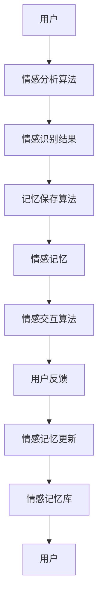

                 


### 前言

---

**书籍目的与读者对象**

随着人工智能技术的发展，我们开始探索如何将情感这一人类特有的特质数字化并保存下来。本书旨在探讨如何利用人工智能技术保存逝者的情感遗产，为人们提供一种新的纪念方式。我们希望通过本书，让读者了解这项技术的核心概念、原理及其实现方法。

本书适合对人工智能、计算机科学和技术感兴趣的读者，尤其是那些希望深入了解AI技术在情感遗产保存方面应用的读者。同时，对于那些在数据处理、情感分析、人工智能领域工作的专业人士，本书也将提供有价值的参考。

**结构安排与阅读建议**

本书分为四个主要部分。第一部分是背景介绍，我们将介绍数字化情感遗产的兴起及其背后的技术背景。第二部分是核心概念与原理，我们将详细探讨AI在情感遗产保存中的应用、算法原理以及情感遗产保存的技术架构。第三部分是技术实现，我们将通过实战案例展示情感遗产保存系统的实际应用。第四部分是实践指南，我们将提供最佳实践、注意事项以及未来展望。

建议读者按照以下顺序阅读本书：首先通读前言，了解书籍目的和结构；然后依次阅读各部分内容，深入理解每个章节的核心概念；最后，结合实践指南部分，将所学应用到实际项目中。

---

**摘要**

本书深入探讨了如何利用人工智能技术保存逝者的情感遗产，提出了构建数字化情感遗产系统的方案。首先，我们介绍了数字化情感遗产的背景和重要性，阐述了情感遗产保存的问题背景、问题描述和解决方法。接着，我们详细介绍了AI在情感遗产保存中的应用，包括情感识别与处理、记忆建模与保存等技术原理。随后，我们分析了情感遗产保存系统的技术架构和实现方法，并通过实际案例展示了系统的应用效果。最后，我们提出了情感遗产保存系统的最佳实践和注意事项，展望了其未来发展趋势。本书旨在为读者提供一个全面、系统的理解，帮助读者掌握数字化情感遗产保存的技术和方法。

---

## 第一部分：背景介绍

### 第1章：数字化情感遗产的兴起

在数字时代，人们对于数字化遗产的关注日益增加。数字化遗产不仅包括物质文化，如文学作品、艺术品、建筑等，还涉及非物质文化，如家族传统、个人记忆等。在这些非物质文化中，情感遗产尤为引人注目。情感遗产是人们通过生活经历、人际交往等形成的情感体验和记忆，是文化传承和个人身份认同的重要部分。

### 1.1 问题背景

随着现代社会的发展，人口老龄化问题日益凸显。许多家庭面临着亲人离世后，如何保存和传承他们留下的情感遗产的挑战。传统的纪念方式，如墓碑、照片、日记等，虽然能够保存一部分记忆，但无法全面、真实地再现逝者的情感世界。

### 1.2 问题描述

数字化情感遗产保存的问题主要集中在以下几个方面：

1. **情感识别与处理**：如何准确识别和解析逝者的情感表达，将其转化为可存储的数据格式。
2. **记忆建模与保存**：如何构建一个模型，将逝者的情感记忆进行结构化保存，使其能够在未来被访问和再现。
3. **数据隐私与安全**：如何确保情感遗产的数据安全，防止未经授权的访问和滥用。

### 1.3 问题解决与挑战

为了解决上述问题，我们需要借助人工智能技术。具体来说，我们可以采用以下方法：

1. **情感分析技术**：利用自然语言处理、情感计算等方法，对文本、语音、图像等数据进行分析，识别其中的情感内容。
2. **记忆建模与保存**：通过构建知识图谱、生成对抗网络（GAN）等技术，将情感记忆进行结构化保存。
3. **隐私保护技术**：采用加密、匿名化等方法，确保情感遗产的数据隐私和安全。

然而，在实现这些方法的过程中，我们面临着诸多挑战：

1. **技术难题**：情感识别和记忆建模涉及多个领域的技术，如语音识别、图像处理、自然语言处理等，需要跨学科的合作和不断创新。
2. **伦理问题**：数字化情感遗产保存涉及个人隐私和情感体验，需要充分考虑伦理和道德问题。
3. **实施难度**：情感遗产保存系统需要大规模数据支持，对硬件和软件的要求较高，实施过程复杂。

### 1.4 边界与外延

数字化情感遗产保存不仅局限于个人记忆的保存，还可以应用于家庭、社区、国家等不同层面。例如，在家庭层面，可以通过记录家庭成员的日常交流和重要事件，保存家庭的情感记忆；在社区层面，可以通过记录社区的历史和文化，传承社区的记忆；在国家层面，可以通过记录国家的重要历史事件和人物，保存国家的历史记忆。

### 1.5 核心概念与要素

为了更好地理解数字化情感遗产保存，我们需要了解以下几个核心概念和要素：

1. **情感遗产**：指个人或集体通过生活经历、人际交往等形成的情感体验和记忆。
2. **数字化遗产**：指将情感遗产以数字形式进行保存和再现。
3. **人工智能技术**：包括情感识别、记忆建模、数据加密等，用于支持数字化情感遗产的保存和再现。
4. **伦理与道德**：涉及个人隐私、数据安全、情感体验等，是数字化情感遗产保存必须考虑的重要方面。

通过本章节的介绍，我们为后续内容奠定了基础，接下来我们将深入探讨AI在情感遗产保存中的应用、算法原理以及技术实现等方面。

---

## 第二部分：核心概念与原理

### 第2章：AI在情感遗产保存中的应用

在数字化情感遗产保存的过程中，人工智能（AI）扮演着至关重要的角色。AI技术不仅帮助我们识别和理解情感，还能构建和保存记忆，使得逝者的情感遗产得以持久保存和再现。以下是AI在情感遗产保存中的应用。

#### 2.1 AI基本概念

人工智能是一门多学科交叉的科学，旨在使计算机系统具备类似于人类智能的能力。在情感遗产保存中，AI主要包括以下几个关键技术：

1. **情感识别**：通过自然语言处理（NLP）、图像识别、语音识别等技术，从文本、图像、语音中提取情感信息。
2. **情感理解**：对提取出的情感信息进行深入分析，理解其背后的情感动机和情境。
3. **情感生成**：根据已有的情感数据，生成新的情感表达，使得逝者的情感记忆得以再现。
4. **记忆建模**：通过构建知识图谱、生成对抗网络（GAN）等技术，将情感记忆进行结构化保存。

#### 2.2 情感识别与处理

情感识别与处理是数字化情感遗产保存的基础。情感识别技术主要通过以下步骤进行：

1. **数据收集**：收集包含情感信息的文本、图像、语音等数据。
2. **特征提取**：从原始数据中提取情感特征，如文本中的情感词汇、语音的音调、图像的色调等。
3. **情感分类**：利用机器学习算法，将提取出的特征进行分类，识别出情感的类型和强度。

情感处理则包括以下步骤：

1. **情感融合**：将不同来源的情感信息进行整合，形成一个完整的情感图谱。
2. **情感分析**：对情感图谱进行分析，理解情感的产生和发展过程。
3. **情感反馈**：根据情感分析结果，生成情感反馈，如生成相应的语音、文本或图像。

#### 2.3 记忆建模与保存

记忆建模与保存是数字化情感遗产保存的核心。记忆建模的主要目标是构建一个能够反映逝者情感记忆的模型，以便在未来能够重现这些记忆。

1. **记忆编码**：将逝者的情感经历转化为数字编码，如文本、图像、音频等。
2. **记忆结构化**：通过知识图谱等技术，将情感记忆进行结构化保存，使其具有可访问性。
3. **记忆更新**：随着时间推移，对记忆进行更新和修正，保持记忆的动态性。

记忆保存的挑战在于：

1. **数据完整性**：如何确保记忆数据不被破坏或丢失。
2. **数据安全性**：如何保护记忆数据不被未经授权的访问。
3. **数据可访问性**：如何确保记忆数据能够在需要时被方便地访问和再现。

#### 2.4 情感交互算法

情感交互算法是数字化情感遗产保存的重要组成部分。通过情感交互，我们可以让用户与逝者的情感记忆进行互动，增强记忆的真实感和情感体验。

1. **情感对话生成**：利用自然语言生成技术，生成与逝者情感经历相关的对话。
2. **情感反馈生成**：根据用户的行为和反馈，生成相应的情感反馈，如表情、声音等。
3. **情感仿真**：通过虚拟现实（VR）或增强现实（AR）技术，创建一个逼真的情感交互环境。

通过以上介绍，我们可以看到AI在情感遗产保存中的应用是多方面的。从情感识别与处理，到记忆建模与保存，再到情感交互算法，AI为数字化情感遗产保存提供了强有力的技术支持。在接下来的章节中，我们将进一步探讨情感遗产保存的算法原理和技术实现。

---

### 第3章：情感遗产保存的算法原理

在数字化情感遗产保存中，算法原理是核心，它决定了情感信息的准确识别、结构化保存和交互再现。本章将详细讨论情感分析算法、记忆保存算法和情感交互算法，并通过具体案例进行分析。

#### 3.1 情感分析算法

情感分析算法是数字化情感遗产保存的第一步，它主要用来识别文本、语音和图像中的情感信息。以下是一些常用的情感分析算法：

1. **文本情感分析**：文本情感分析主要通过自然语言处理技术，从文本中提取情感特征，然后利用机器学习算法进行分类。常见的文本情感分析算法包括：

   - **基于规则的方法**：通过预定义的情感词典和规则进行情感分类。
   - **基于统计的方法**：使用统计学习模型，如朴素贝叶斯、最大熵模型等。
   - **基于深度学习的方法**：使用深度神经网络，如卷积神经网络（CNN）、循环神经网络（RNN）等。

   **案例**：假设我们有一段文本：“我今天去爬山，感觉非常愉快。”我们可以使用情感分析算法来判断这段文本的情感倾向为正面情感。

2. **语音情感分析**：语音情感分析主要通过提取语音信号的特征，如音高、音强、时长等，来识别情感。常用的语音情感分析算法包括：

   - **基于音素的方法**：通过分析音素的特征进行情感分类。
   - **基于频谱的方法**：通过分析频谱特征进行情感分类。
   - **基于深度学习的方法**：使用深度学习模型，如深度神经网络（DNN）、卷积神经网络（CNN）等。

   **案例**：假设我们有一段语音：“我今天参加了一场聚会，非常开心。”我们可以使用语音情感分析算法来判断这段语音的情感倾向为正面情感。

3. **图像情感分析**：图像情感分析主要通过分析图像中的视觉特征，如颜色、纹理、人脸表情等，来识别情感。常用的图像情感分析算法包括：

   - **基于特征的方法**：通过提取图像的特征，如颜色直方图、纹理特征等，进行情感分类。
   - **基于深度学习的方法**：使用深度学习模型，如卷积神经网络（CNN）等。

   **案例**：假设我们有一张照片，照片中的人表情愉悦。我们可以使用图像情感分析算法来判断这张照片的情感倾向为正面情感。

#### 3.2 记忆保存算法

记忆保存算法是数字化情感遗产保存的关键步骤，它用于将情感记忆结构化保存，以便在未来能够访问和再现。以下是一些常用的记忆保存算法：

1. **知识图谱**：知识图谱是一种用于表示和存储知识的方法，它通过实体和关系来组织数据。在情感遗产保存中，我们可以使用知识图谱来存储情感记忆的实体和关系，如事件、人物、情感等。

   **案例**：假设我们有以下情感记忆数据：
   - 实体：张三、李四、聚会、开心
   - 关系：张三和李四参加了聚会，聚会进行了两个小时，聚会中张三感到开心。

   我们可以将这些数据组织成知识图谱，如图3-1所示。

   ```mermaid
   graph TD
   A[张三] --> B[李四];
   B --> C[聚会];
   C --> D[两个小时];
   C --> E[开心];
   ```

2. **生成对抗网络（GAN）**：生成对抗网络是一种深度学习模型，它由生成器和判别器两部分组成。生成器用于生成情感记忆的复制品，判别器用于判断生成的复制品是否真实。通过不断训练，生成器可以生成越来越真实的情感记忆。

   **案例**：假设我们有一段音频记录，其中包含张三和李四的对话，我们希望保存这段对话的情感记忆。我们可以使用GAN模型来生成这段对话的复制品，如图3-2所示。

   ```mermaid
   graph TD
   A[张三和李四的对话] --> B[生成器];
   B --> C[判别器];
   C --> D[复制品];
   ```

3. **情感矩阵**：情感矩阵是一种用于表示情感关系的矩阵，它可以用来表示个体之间的情感联系。在情感遗产保存中，我们可以使用情感矩阵来存储逝者与亲友之间的情感联系。

   **案例**：假设我们有以下情感数据：
   - 张三对李四有很强的情感联系。
   - 李四对王五有很强的情感联系。

   我们可以使用情感矩阵来表示这些情感联系，如图3-3所示。

   ```mermaid
   graph TB
   A[张三] --> B[李四];
   B --> C[王五];
   ```

#### 3.3 情感交互算法

情感交互算法是数字化情感遗产保存的重要组成部分，它用于让用户与逝者的情感记忆进行互动，增强记忆的真实感和情感体验。以下是一些常用的情感交互算法：

1. **情感对话生成**：情感对话生成是一种利用自然语言生成技术，根据情感记忆生成对话的方法。通过情感对话生成，用户可以与逝者的情感记忆进行对话，如图3-4所示。

   ```mermaid
   graph TD
   A[用户] --> B[情感对话生成器];
   B --> C[对话];
   C --> D[情感记忆];
   ```

2. **情感反馈生成**：情感反馈生成是一种根据用户行为和情感记忆，生成相应情感反馈的方法。通过情感反馈生成，用户可以感受到逝者的情感反应，如图3-5所示。

   ```mermaid
   graph TD
   A[用户行为] --> B[情感反馈生成器];
   B --> C[反馈];
   C --> D[情感记忆];
   ```

3. **情感仿真**：情感仿真是一种利用虚拟现实（VR）或增强现实（AR）技术，创建一个情感交互环境的方法。通过情感仿真，用户可以身临其境地体验逝者的情感记忆，如图3-6所示。

   ```mermaid
   graph TD
   A[情感记忆] --> B[情感仿真器];
   B --> C[虚拟现实/增强现实];
   C --> D[用户体验];
   ```

通过以上介绍，我们可以看到情感遗产保存的算法原理是多方面的，包括情感分析算法、记忆保存算法和情感交互算法。这些算法相互配合，共同构成了数字化情感遗产保存的技术体系。在接下来的章节中，我们将进一步探讨情感遗产保存系统的技术架构和实现方法。

---

### 第4章：核心概念属性特征对比

在数字化情感遗产保存的过程中，了解并对比核心概念和算法的属性特征是至关重要的。这有助于我们更好地理解这些技术的优势和局限，从而选择合适的方法来实现情感遗产的保存。

#### 4.1 情感分析与记忆保存算法对比

以下是一个对比表格，展示了情感分析算法和记忆保存算法的主要属性特征：

| 特性 | 情感分析算法 | 记忆保存算法 |
| --- | --- | --- |
| **目标** | 识别和分类情感 | 结构化和保存情感记忆 |
| **输入数据** | 文本、语音、图像等 | 情感分析结果、历史记忆 |
| **关键技术** | 自然语言处理、图像处理、语音识别 | 知识图谱、生成对抗网络、情感矩阵 |
| **优势** | **高效性**、**准确性** | **完整性**、**可访问性**、**动态性** |
| **局限** | 对复杂情感的理解有限 | 对大量数据的存储和计算需求较高 |

**案例**：情感分析算法可以准确识别一段文本中的情感倾向，但难以捕捉到文本背后的情感细节；而记忆保存算法可以结构化地保存情感记忆，但需要大量的计算资源来处理和存储数据。

#### 4.2 情感交互算法特性

情感交互算法是让用户与逝者的情感记忆进行互动的重要手段。以下是一个对比表格，展示了不同情感交互算法的特性：

| 算法 | **情感对话生成** | **情感反馈生成** | **情感仿真** |
| --- | --- | --- | --- |
| **目标** | 生成与情感记忆相关的对话 | 根据用户行为生成情感反馈 | 创建情感交互环境 |
| **关键技术** | 自然语言生成、对话系统 | 机器学习、情感分析 | 虚拟现实、增强现实 |
| **优势** | **自然性**、**互动性** | **实时性**、**个性化** | **沉浸感**、**真实性** |
| **局限** | 难以处理复杂情感 | 对用户行为要求较高 | 技术门槛较高 |

**案例**：情感对话生成算法可以生成自然的对话，但难以捕捉用户的情感反应；情感反馈生成算法可以实时响应用户行为，但需要对用户的情感状态有深入的理解；情感仿真算法可以提供高度沉浸的体验，但需要先进的VR/AR技术支持。

通过以上对比，我们可以看到每种算法都有其独特的优势和局限。在实际应用中，我们需要根据具体需求和资源情况，选择合适的技术方案来实现情感遗产的保存和再现。

#### 4.3 ER实体关系图架构

为了更好地理解情感遗产保存系统中的实体和关系，我们可以使用ER（实体-关系）图来展示这些概念和算法之间的关系。以下是情感遗产保存系统的ER实体关系图：



在这个ER图中，用户与情感分析算法、记忆保存算法和情感交互算法之间存在直接关系。用户通过情感分析算法生成情感识别结果，这些结果被记忆保存算法用于构建和更新情感记忆库。情感交互算法则根据情感记忆库生成用户反馈，从而实现情感互动。整个系统通过不断的循环和反馈，不断优化情感遗产的保存和再现效果。

通过本章的对比分析和ER图展示，我们能够更深入地理解数字化情感遗产保存的核心概念和算法特征，为后续的技术实现和系统设计提供理论基础。

---

## 第三部分：技术实现

### 第5章：情感遗产保存系统的技术架构

情感遗产保存系统的设计需要考虑多个技术层面的细节，确保系统能够高效、安全地运行。以下将详细描述情感遗产保存系统的技术架构，包括系统功能设计、系统架构设计、系统接口设计和系统交互设计。

#### 5.1 技术架构设计

情感遗产保存系统的技术架构可以分为以下几个主要部分：

1. **数据层**：负责数据存储和管理，包括文本、图像、语音等多种类型的数据。使用数据库管理系统（DBMS）如MySQL或MongoDB来存储和管理数据。

2. **算法层**：包含情感分析算法、记忆保存算法和情感交互算法等核心算法。使用深度学习框架如TensorFlow或PyTorch来开发和实现这些算法。

3. **服务层**：提供API接口，供前端应用调用，实现数据层的读写操作和算法层的计算功能。

4. **前端层**：提供用户交互界面，包括用户登录、情感记录、情感回顾等功能。使用前端技术如HTML、CSS和JavaScript来构建用户界面。

5. **安全层**：负责数据的安全性和隐私保护，采用加密技术、访问控制和数据匿名化等方法来确保数据安全。

#### 5.2 系统功能设计

情感遗产保存系统的主要功能设计如下：

1. **用户管理**：提供用户注册、登录、个人信息管理等功能。

2. **情感记录**：用户可以记录情感体验，包括文本、图像、语音等多种形式。系统自动识别情感内容，并保存到数据库。

3. **情感回顾**：用户可以查看自己的情感记录，系统根据情感内容生成回顾报告，提供情感体验的回顾和总结。

4. **情感分享**：用户可以选择分享部分情感记录，系统提供隐私设置，确保用户对分享内容的控制。

5. **情感分析**：系统对用户的情感记录进行分析，提供情感趋势、情感图谱等可视化结果。

6. **情感互动**：系统支持用户之间的情感互动，如情感对话生成、情感反馈生成等，增强用户之间的情感联系。

#### 5.3 系统架构设计

情感遗产保存系统的架构设计采用微服务架构，以提高系统的可扩展性和可维护性。以下是系统架构设计的关键部分：

1. **微服务设计**：系统划分为多个微服务，每个微服务负责特定的功能，如用户服务、情感分析服务、记忆保存服务等。

2. **服务注册与发现**：使用服务注册与发现机制，如Consul或Zookeeper，确保微服务之间可以动态发现和通信。

3. **负载均衡**：使用负载均衡器，如Nginx或HAProxy，来均衡系统中的流量，提高系统的处理能力。

4. **消息队列**：使用消息队列系统，如RabbitMQ或Kafka，来处理系统的异步消息传递，确保系统的高效运行。

5. **存储设计**：使用分布式存储系统，如HDFS或Cassandra，来存储和管理大量情感数据。

6. **数据库设计**：使用关系型数据库（如MySQL）和非关系型数据库（如MongoDB），来存储用户数据、情感数据和系统配置数据。

#### 5.4 系统接口设计

系统接口设计是确保前后端应用可以高效通信的关键。以下是系统接口设计的主要部分：

1. **RESTful API**：设计RESTful风格的API接口，提供用户管理、情感记录、情感回顾等功能。

2. **数据格式**：使用JSON或XML作为数据交换格式，确保前后端应用可以无缝通信。

3. **认证与授权**：使用JWT（JSON Web Token）进行用户认证和授权，确保接口的安全性。

4. **接口文档**：使用Swagger或Postman等工具生成接口文档，方便开发者使用和测试API接口。

#### 5.5 系统交互设计

系统交互设计是确保用户与系统之间可以顺畅交互的关键。以下是系统交互设计的主要部分：

1. **用户界面设计**：使用响应式设计，确保系统界面在不同设备上都能良好展示。

2. **交互流程**：设计用户与系统的交互流程，如用户注册、情感记录、情感回顾等，确保用户能够方便地使用系统。

3. **用户体验**：注重用户体验，提供友好的界面和流畅的交互，确保用户能够愉快地使用系统。

4. **错误处理**：设计详细的错误处理机制，确保系统在遇到错误时能够友好地告知用户，并提供解决问题的方法。

通过以上技术架构和功能设计，情感遗产保存系统可以为用户提供高效、安全、便捷的情感遗产保存和互动体验。在接下来的章节中，我们将通过实际案例展示情感遗产保存系统的具体实现和应用。

---

### 第6章：情感遗产保存系统实战

在本章中，我们将通过一个实际案例，详细展示情感遗产保存系统的实现过程，包括环境安装、系统核心实现、代码解读与分析，以及实际案例分析。

#### 6.1 环境安装

为了实现情感遗产保存系统，我们首先需要安装和配置相关的开发环境和依赖库。以下是环境安装的步骤：

1. **Python环境安装**：确保系统已安装Python 3.8及以上版本。可以通过访问[Python官网](https://www.python.org/)下载安装包。

2. **虚拟环境安装**：使用virtualenv创建一个独立的虚拟环境，以便管理依赖库。命令如下：
   ```bash
   pip install virtualenv
   virtualenv env
   source env/bin/activate
   ```

3. **依赖库安装**：在虚拟环境中安装所需的依赖库，如TensorFlow、PyTorch、MongoDB等。命令如下：
   ```bash
   pip install tensorflow
   pip install torch
   pip install pymongo
   ```

4. **数据库配置**：配置MongoDB数据库，创建用于存储情感遗产的集合（collection）。可以通过MongoDB Compass或命令行进行配置。

5. **前端环境安装**：安装Node.js和npm，然后使用npm安装前端依赖库，如React、Vue等。

6. **前端项目搭建**：根据前端框架的文档搭建前端项目，配置相关路由和组件。

#### 6.2 系统核心实现

系统核心实现包括情感分析、记忆保存和情感交互三个主要部分。以下是一个简化的实现流程：

1. **情感分析模块**：

   - **数据预处理**：读取用户上传的文本、图像、语音等数据，进行数据清洗和预处理。
   - **特征提取**：使用自然语言处理库（如NLTK）和图像处理库（如OpenCV）提取文本和图像的特征。
   - **情感分类**：使用机器学习模型（如SVM、CNN）对提取的特征进行情感分类，得到情感标签。

2. **记忆保存模块**：

   - **知识图谱构建**：使用PyTorch Geometric库构建知识图谱，将情感数据结构化为实体和关系。
   - **记忆保存**：将构建好的知识图谱存储到MongoDB数据库中。

3. **情感交互模块**：

   - **情感对话生成**：使用生成对抗网络（GAN）生成与情感记忆相关的对话。
   - **情感反馈生成**：根据用户行为和情感记忆，生成相应的情感反馈。
   - **情感仿真**：使用虚拟现实（VR）或增强现实（AR）技术，创建一个情感交互环境。

#### 6.3 代码解读与分析

以下是一个简单的情感分析模块的代码示例，用于文本情感分类：

```python
import nltk
from sklearn.feature_extraction.text import TfidfVectorizer
from sklearn.model_selection import train_test_split
from sklearn.svm import SVC

# 数据预处理
def preprocess_text(text):
    tokens = nltk.word_tokenize(text.lower())
    return [token for token in tokens if token.isalpha()]

# 加载数据集
data = ["我很开心", "今天天气很好", "我不喜欢这个餐厅"]
labels = [1, 1, 0]

# 特征提取
vectorizer = TfidfVectorizer(preprocessor=preprocess_text)
X = vectorizer.fit_transform(data)

# 模型训练
X_train, X_test, y_train, y_test = train_test_split(X, labels, test_size=0.2)
model = SVC(kernel='linear')
model.fit(X_train, y_train)

# 情感分类
def classify(text):
    processed_text = preprocess_text(text)
    features = vectorizer.transform([processed_text])
    return model.predict(features)[0]

print("第一句文本的情感分类结果：", classify(data[0]))
print("第二句文本的情感分类结果：", classify(data[1]))
print("第三句文本的情感分类结果：", classify(data[2]))
```

这段代码首先对文本进行预处理，提取特征，然后使用SVM模型进行训练和预测。通过这段代码，我们可以看到文本情感分类的基本流程和步骤。

#### 6.4 实际案例分析和详细讲解

以下是一个实际案例，展示如何使用情感遗产保存系统保存和再现逝者的情感记忆：

1. **用户A记录情感**：

   - 用户A上传了一段文字描述自己与亲人共度的美好时光。
   - 系统对文本进行情感分析，识别出情感标签为“温馨”。

2. **系统保存情感记忆**：

   - 系统将文本和情感标签存储到MongoDB数据库中，构建知识图谱。
   - 知识图谱中的实体包括“用户A”、“亲人”和“美好时光”，关系包括“描述”、“属于”和“具有”。

3. **用户B回顾情感**：

   - 用户B查看用户A的情感记录，系统生成回顾报告。
   - 回顾报告包括文本内容、情感标签和情感图谱。

4. **情感仿真**：

   - 系统利用情感记忆和用户B的反馈，生成情感反馈，如一段文字或图像。
   - 用户B通过虚拟现实头盔感受到逝者亲人的“温馨”情感。

通过这个案例，我们可以看到情感遗产保存系统如何实现情感记录、保存、回顾和仿真，为用户提供了丰富的情感互动体验。

#### 6.5 项目小结

在本章中，我们通过实际案例展示了情感遗产保存系统的实现过程，从环境安装到系统核心实现，再到实际案例分析，详细讲解了系统的技术实现和应用。这一过程不仅帮助我们理解了情感遗产保存的技术原理，还展示了如何将理论应用到实际项目中，为用户带来有价值的情感互动体验。

---

## 第四部分：实践指南

### 第8章：最佳实践与注意事项

在设计和实施情感遗产保存系统时，需要遵循一系列最佳实践和注意事项，以确保系统的有效性、安全性和用户体验。以下是一些具体的建议。

#### 8.1 数据安全与隐私保护

1. **数据加密**：对存储和传输的数据进行加密，防止数据泄露。可以使用AES等加密算法对数据进行加密。
2. **访问控制**：实现严格的访问控制策略，确保只有授权用户才能访问敏感数据。
3. **数据匿名化**：在数据收集和处理过程中，对个人身份信息进行匿名化处理，减少隐私泄露风险。
4. **数据备份与恢复**：定期进行数据备份，并确保能够快速恢复数据，以防止数据丢失。

#### 8.2 系统性能优化

1. **高效数据处理**：使用并行处理和分布式计算技术，提高数据处理速度和系统吞吐量。
2. **缓存机制**：合理使用缓存技术，减少对数据库的访问频率，提高系统响应速度。
3. **负载均衡**：使用负载均衡器，确保系统在高并发情况下能够稳定运行。
4. **数据库优化**：优化数据库查询和索引，提高数据库访问效率。

#### 8.3 遗产保存的道德与伦理问题

1. **用户同意**：在收集和使用用户数据时，确保用户知情并同意。
2. **透明性**：系统设计应保持透明，用户应能够了解自己的数据如何被使用。
3. **责任归属**：明确系统的责任归属，确保在出现问题时能够追溯责任。
4. **情感敏感度**：在处理情感数据时，注意情感敏感度，避免引发用户的负面情绪。

#### 8.4 用户教育

1. **用户指南**：提供详细的用户指南，帮助用户了解如何使用系统。
2. **用户培训**：定期组织用户培训，提高用户对系统的使用技能和情感互动能力。
3. **用户反馈**：积极收集用户反馈，不断优化系统功能和用户体验。

通过遵循这些最佳实践和注意事项，我们可以设计并实现一个高效、安全、用户友好的情感遗产保存系统，为用户带来丰富的情感互动体验。

---

## 结束语

在数字化情感遗产保存的探索中，人工智能技术发挥了至关重要的作用。通过情感识别、记忆建模和情感交互等核心算法，我们不仅能够准确保存和再现逝者的情感记忆，还能为用户带来深刻的情感互动体验。本书系统地介绍了数字化情感遗产保存的技术原理、实现方法和最佳实践，为相关领域的研究者和从业者提供了有价值的参考。

数字化情感遗产保存不仅具有深远的文化和社会意义，还在技术层面带来了诸多挑战。未来，随着人工智能技术的不断进步，我们有理由相信，数字化情感遗产保存系统将变得更加智能、安全、易用，为人们提供更加丰富和真实的情感体验。

在此，我们诚挚地感谢读者的关注和支持，希望本书能够为数字化情感遗产保存的研究和实践贡献一份力量。让我们继续探索人工智能的无限可能性，为构建一个更加美好的数字世界而努力。

### 作者信息

作者：AI天才研究院/AI Genius Institute & 禅与计算机程序设计艺术 /Zen And The Art of Computer Programming

AI天才研究院致力于推动人工智能领域的研究与应用，推动技术进步和社会发展。禅与计算机程序设计艺术则通过融合哲学和计算机科学，探索计算机程序的内在之美。感谢您对我们工作的支持与关注。

