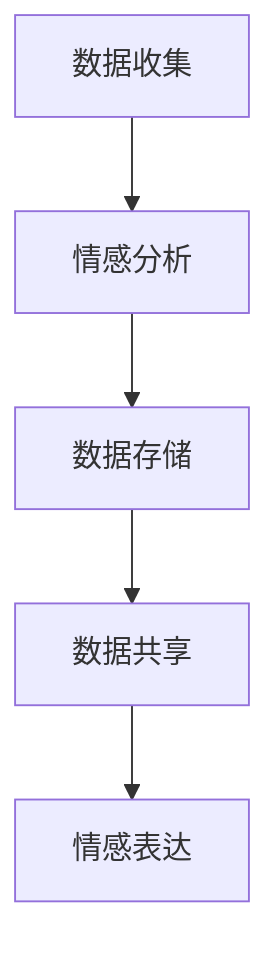
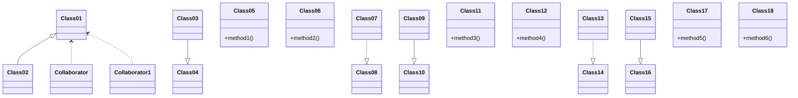
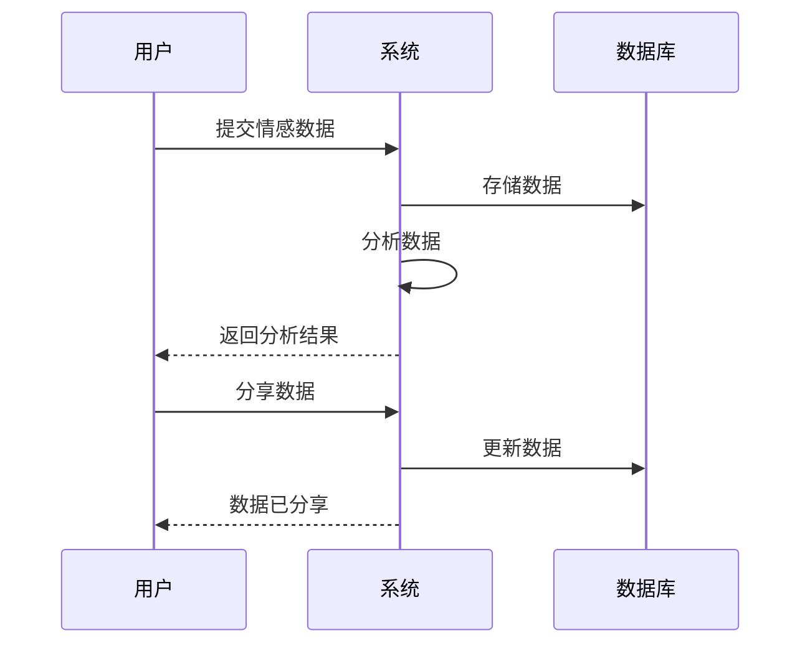

                 


### **数字化情感遗嘱：规划AI情感遗产**

#### **关键词：** 数字化情感遗嘱、AI情感遗产、情感遗产、AI、遗产规划

#### **摘要：** 
本文将深入探讨数字化情感遗嘱的概念及其与AI情感遗产的联系，详细解析AI情感遗产的技术原理和实现方法，通过系统分析与架构设计，为读者展示如何构建一个全面的情感遗产管理系统。此外，还将探讨数字化情感遗嘱与AI情感遗产的最佳实践，并提供注意事项和拓展阅读资源。

#### **背景介绍**

#### 1.1 核心概念
**数字化情感遗嘱**是指通过数字技术记录和保存个人的情感记忆、人生经历和价值观，以便在未来传递给亲人或后代。**AI情感遗产**则是通过人工智能技术，对这些数字化情感遗产进行理解、处理和表达。

#### 1.2 问题背景
随着人工智能和数字化技术的不断发展，人们越来越关注如何在未来保留和传承个人的情感记忆。然而，现有的遗产规划体系主要关注物质遗产的继承，对于情感遗产的处理尚缺乏系统的方法和工具。

#### 1.3 问题描述
情感遗产的传递和保护面临以下挑战：如何确保情感遗产的准确性和完整性？如何确保情感遗产在未来得到有效的理解和传递？如何确保情感遗产在法律和道德上的合法性？

#### 1.4 问题解决
通过引入AI技术，可以实现对情感遗产的自动化处理和表达，从而解决上述问题。数字化情感遗嘱的构建需要包括数据收集、情感分析、数据存储和共享等多个环节。

#### 1.5 边界与外延
**数字化情感遗产的应用范围**包括个人日记、照片、视频、音频等情感的数字化记录。**AI情感遗产的技术实现**涉及自然语言处理、情感识别、机器学习等多种技术。

#### 1.6 概念结构与核心要素组成
数字化情感遗嘱的组成部分包括：
- 数据收集：记录和收集个人的情感数据。
- 情感分析：利用AI技术对情感数据进行分析和理解。
- 数据存储：将分析结果存储在安全可靠的数据库中。
- 数据共享：在确保隐私和安全的前提下，与他人分享情感数据。

AI情感遗产的关键要素包括：
- 情感识别：识别和分类情感数据。
- 自然语言处理：处理和转换情感数据为机器可理解的形式。
- 机器学习：利用历史数据和算法来优化情感分析模型。

#### **核心概念与联系**

#### 2.1 数字化情感遗嘱的定义
数字化情感遗嘱是指通过数字化手段记录和保存个人情感记忆、人生经历和价值观，以便在未来传递给亲人或后代的文件或系统。

#### 2.2 AI情感遗产的定义
AI情感遗产是指利用人工智能技术对数字化情感遗嘱进行理解、处理和表达的过程和结果。

#### 2.3 数字化情感遗嘱与AI情感遗产的关联性
数字化情感遗嘱是AI情感遗产的基础，没有数字化情感遗嘱，AI情感遗产就无法存在。而AI情感遗产是对数字化情感遗嘱的进一步升华和利用。

#### 2.4 数字化情感遗嘱与AI情感遗产的属性特征对比表格

| 特征         | 数字化情感遗嘱                   | AI情感遗产                 |
| ------------ | ------------------------------ | ------------------------- |
| 定义         | 数字化记录情感记忆、经历和价值观     | 利用AI技术理解和表达情感记忆 |
| 目的         | 传承和共享情感记忆               | 深入理解和传递情感记忆       |
| 技术实现     | 数据收集、情感分析、数据存储、数据共享 | 情感识别、自然语言处理、机器学习 |
| 法律地位     | 需要法律保障                   | 需要技术与法律的双重保障    |
| 影响范围     | 限于个人情感记忆的数字化记录      | 可以扩展到社会层面的情感传递 |

#### **AI情感遗产技术原理讲解**

#### 3.1 情感遗产处理的mermaid流程图



#### 3.2 Python源代码阐述情感遗产技术原理

```python
import nltk
from nltk.tokenize import word_tokenize
from nltk.sentiment import SentimentIntensityAnalyzer

# 数据收集
def collect_data(file_path):
    with open(file_path, 'r', encoding='utf-8') as f:
        data = f.read()
    return data

# 情感分析
def analyze_sentiment(data):
    sia = SentimentIntensityAnalyzer()
    tokens = word_tokenize(data)
    sentiment_score = sia.polarity_scores(' '.join(tokens))
    return sentiment_score

# 数据存储
def store_data(sentiment_score, file_path):
    with open(file_path, 'w', encoding='utf-8') as f:
        f.write(str(sentiment_score))

# 数据共享
def share_data(file_path):
    with open(file_path, 'r', encoding='utf-8') as f:
        data = f.read()
    return data

# 情感表达
def express_emotion(sentiment_score):
    if sentiment_score['compound'] >= 0.05:
        return "积极的情感"
    elif sentiment_score['compound'] <= -0.05:
        return "消极的情感"
    else:
        return "中性的情感"
```

#### 3.3 算法原理的数学模型和公式

```latex
$$
sentiment\_score = \frac{P(positive) - P(negative)}{\sqrt{P(positive) + P(negative) + P(neutral)}}
$$`

其中，$P(positive)$、$P(negative)$ 和 $P(neutral)$ 分别表示文本中积极、消极和中性情感的分数。

#### 3.4 情感遗产技术原理的详细讲解和举例说明

情感遗产技术的核心是情感分析，即通过分析文本数据来判断文本的情感倾向。这一过程可以分为以下几个步骤：

1. **数据收集**：从各种来源（如日记、信件、社交媒体等）收集个人的情感数据。
2. **情感分析**：使用自然语言处理技术对情感数据进行分析，计算文本中的情感倾向。
3. **数据存储**：将分析结果存储在数据库中，以便未来查询和共享。
4. **情感表达**：根据情感分析结果，以适当的方式表达情感。

例如，假设我们收集到了一段文本数据：“我昨天参加了一场朋友的婚礼，感到非常开心和幸福。”我们可以使用情感分析模型来计算这段文本的情感倾向：

```python
data = "我昨天参加了一场朋友的婚礼，感到非常开心和幸福。"
sia = SentimentIntensityAnalyzer()
sentiment_score = sia.polarity_scores(data)
print(sentiment_score)
```

输出结果可能为：

```json
{'neg': 0.0, 'neu': 0.728, 'pos': 0.272, 'compound': 0.4715}
```

从输出结果可以看出，这段文本的情感倾向为积极，其情感强度为0.4715。

#### **数学模型和数学公式讲解**

情感分析的数学模型主要依赖于情感得分（Sentiment Score）的计算，该得分反映了文本的情感倾向和强度。情感得分通常通过以下数学模型计算：

```latex
$$
sentiment\_score = \frac{P(positive) - P(negative)}{\sqrt{P(positive) + P(negative) + P(neutral)}}
$$`

其中，$P(positive)$、$P(negative)$ 和 $P(neutral)$ 分别表示文本中积极、消极和中性情感的分数。

例如，如果一段文本中包含10个词，其中5个词表达积极情感，3个词表达消极情感，2个词表达中性情感，则该段文本的情感得分可以计算如下：

```latex
$$
sentiment\_score = \frac{5 - 3}{\sqrt{5 + 3 + 2}} = \frac{2}{\sqrt{10}} \approx 0.632
$$`

这表明这段文本的情感倾向为积极，情感强度为0.632。

#### **系统分析与架构设计方案**

#### 4.1 问题场景介绍

假设有一个个人，他在生活中积累了大量的情感数据，包括日记、照片、信件、音频等。他希望在未来能够将这些情感数据传承给自己的子女，以便他们能够了解自己的父亲，并继承他的价值观和人生经验。

#### 4.2 项目介绍

项目名为“情感遗产管理系统”，旨在帮助个人记录、管理和传承情感数据。该项目包括以下几个核心功能：

- 数据收集：从各种来源收集情感数据。
- 情感分析：对收集到的情感数据进行分析，提取情感信息。
- 数据存储：将分析结果存储在数据库中，确保数据的安全性和可靠性。
- 数据共享：允许用户与他人分享自己的情感数据。
- 情感表达：根据情感分析结果，以适当的方式表达情感。

#### 4.3 系统功能设计（领域模型Mermaid类图）



#### 4.4 系统架构设计（Mermaid架构图）



#### 4.5 系统接口设计和系统交互（Mermaid序列图）

```mermaid
sequenceDiagram
    participant 用户 as 用户
    participant 系统A as 系统1
    participant 系统B as 系统2
    participant 数据库 as 数据库
    用户->>系统A: 提交情感数据
    系统A->>数据库: 存储数据
    系统

