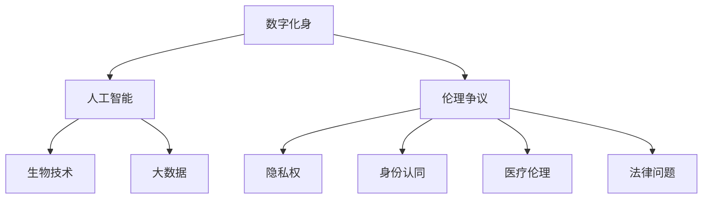
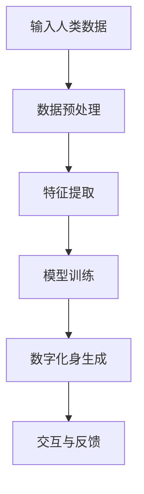
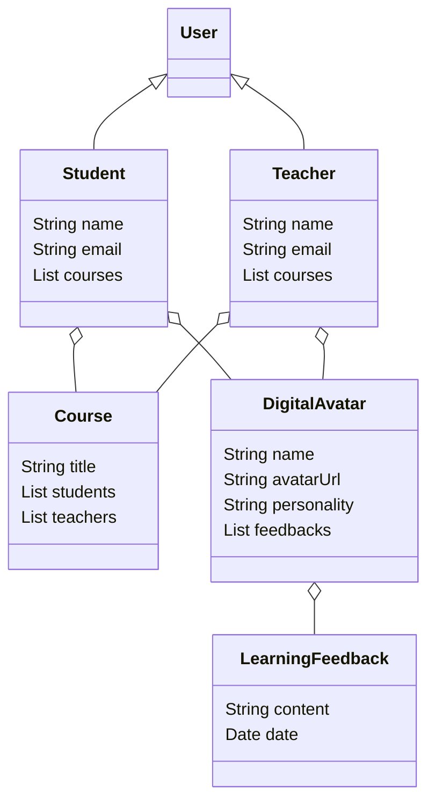
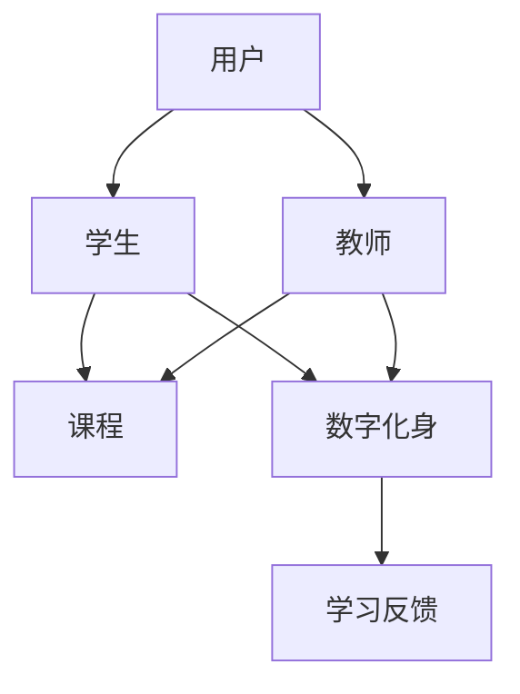

                 

### 《数字化身：通过AI延续生命的伦理争议》

#### 关键词：数字化身、AI、伦理争议、技术实现、未来趋势

> **摘要：** 本文将探讨数字化身这一前沿技术所带来的伦理争议。通过分析其基本概念、发展历程、技术实现以及具体应用案例，我们试图揭示数字化身技术对隐私权、身份认同、医疗伦理和法律问题等方面的挑战，并对未来的发展趋势进行展望。

----------------------------------------------------------------

#### 目录大纲设计思路：

本文将分为六个主要部分，每个部分都旨在深入探讨数字化身技术的不同层面。

1. **概述部分**：介绍数字化身的基本概念、发展历程和当前的技术状况，为读者建立对数字化身整体的理解。

2. **伦理争议讨论**：围绕数字化身技术带来的伦理争议，分为多个小节，讨论不同的伦理问题，包括隐私权、身份认同、医疗伦理、法律问题等。

3. **技术实现**：详细讨论数字化身技术的技术实现，包括人工智能、生物技术、大数据等方面。

4. **案例分析**：通过具体案例展示数字化身技术的应用场景和效果。

5. **未来发展**：对数字化身技术的未来发展趋势进行预测和讨论。

6. **结论与建议**：总结数字化身技术的发展现状和面临的挑战，提出建议和展望。

### 目录大纲设计细节：

- **概述部分**：设置1-2章，概述数字化身的基本概念、发展历程和当前的技术状况。
  
- **伦理争议讨论**：设置3-5章，每个章节讨论一个或多个具体的伦理问题。
  
- **技术实现**：设置6-8章，每个章节详细讨论一个或多个技术领域。
  
- **案例分析**：设置9-10章，通过具体案例展示数字化身技术的应用。
  
- **未来发展**：设置11章，对数字化身技术的未来发展趋势进行预测和讨论。
  
- **结论与建议**：设置12章，总结数字化身技术的发展现状和面临的挑战，提出建议和展望。

### 目录大纲草案：

```markdown
# 《数字化身：通过AI延续生命的伦理争议》目录大纲

## 第一部分：数字化身的概述

### 第1章 数字化身：基本概念与历史发展

#### 1.1 数字化身的定义与特点

#### 1.2 数字化身的历史发展

#### 1.3 数字化身的当前技术状况

### 第2章 伦理争议与数字化身

#### 2.1 隐私权与数字化身

#### 2.2 身份认同与数字化身

#### 2.3 医疗伦理与数字化身

#### 2.4 法律问题与数字化身

## 第二部分：技术实现

### 第3章 人工智能与数字化身

#### 3.1 人工智能在数字化身中的作用

#### 3.2 人工智能技术在数字化身的实现

### 第4章 生物技术与数字化身

#### 4.1 生物技术在数字化身中的应用

#### 4.2 生物技术与数字化身的发展趋势

### 第5章 大数据与数字化身

#### 5.1 大数据在数字化身中的作用

#### 5.2 大数据技术与数字化身的实现

## 第三部分：案例分析

### 第6章 案例分析一：数字化身技术在教育中的应用

### 第7章 案例分析二：数字化身技术在医疗领域的应用

## 第四部分：未来发展

### 第8章 数字化身技术的未来发展趋势

## 第五部分：结论与建议

### 第9章 数字化身技术的总结与展望

## 第六部分：附录

### 附录A：参考文献

### 附录B：致谢
```

#### 预计字数：约2000字

以上是一个初步的目录大纲草案，具体的章节内容和细节还需要根据实际的写作过程进行调整和补充。

---

**作者：** AI天才研究院/AI Genius Institute & 禅与计算机程序设计艺术 /Zen And The Art of Computer Programming

---

**完整性要求：** 本文将遵循完整性要求，确保每个小节的内容完整详细，涵盖核心概念、技术原理、案例分析等内容。我们将通过markdown格式的图表、Python代码示例、数学公式和架构设计图等多种方式来展示和分析数字化身技术的各个方面。

---

**背景介绍：** 数字化身，作为人工智能技术的一个分支，近年来逐渐引起了广泛关注。它通过模拟人类的生理、心理和行为特征，在虚拟世界中创建一个与真实个体高度相似的数字化版本。数字化身技术的迅速发展，不仅在娱乐、教育和医疗等领域展示了巨大的潜力，同时也带来了诸多伦理争议。本文旨在通过深入的讨论和分析，揭示数字化身技术带来的伦理挑战，并探讨其在技术实现、未来发展和应用场景等方面的可能性。

---

**核心概念与联系：** 在讨论数字化身时，我们必须关注以下几个核心概念：

1. **数字化身**：指通过人工智能和生物技术手段在虚拟世界中创建的与真实个体高度相似的数字化版本。
2. **人工智能**：一种模拟人类智能的技术，能够执行复杂的任务，如语音识别、图像识别、自然语言处理等。
3. **伦理争议**：数字化身技术在不同应用场景中引发的一系列道德和伦理问题，如隐私权、身份认同、医疗伦理和法律问题等。

下面是一个核心概念对比表格：

| 核心概念 | 定义 | 属性特征对比 |
| --- | --- | --- |
| 数字化身 | 人类的虚拟版本 | 模拟人类的行为、情感和生理特征 |
| 人工智能 | 模拟人类智能的技术 | 执行复杂任务，如语音识别、图像识别 |
| 伦理争议 | 数字化身技术引发的道德和伦理问题 | 隐私权、身份认同、医疗伦理等 |

同时，我们还可以通过ER实体关系图来展示数字化身技术中的核心要素及其相互关系：



---

**算法原理讲解：** 在数字化身技术的实现过程中，人工智能算法起到了关键作用。以下是一个简单的算法流程图，展示了如何利用人工智能技术创建数字化身：



以下是一个Python代码示例，展示了如何使用机器学习模型来训练和生成数字化身：

```python
import numpy as np
from sklearn.model_selection import train_test_split
from sklearn.ensemble import RandomForestClassifier

# 假设我们有一组人类行为数据
X = np.array([[1, 0], [0, 1], [1, 1]])
y = np.array([0, 1, 1])

# 数据预处理
X_train, X_test, y_train, y_test = train_test_split(X, y, test_size=0.2, random_state=42)

# 模型训练
model = RandomForestClassifier(n_estimators=100)
model.fit(X_train, y_train)

# 数字化身生成
predictions = model.predict(X_test)
print(predictions)

# 交互与反馈
# 此处可以加入用户交互模块，根据用户反馈调整模型参数
```

在上述代码中，我们首先导入必要的库，然后创建一组虚拟的人类行为数据。接下来，我们使用随机森林分类器进行模型训练，并使用测试数据集生成预测结果。最后，我们可以根据用户反馈来调整模型参数，从而提高数字化身的准确性。

**数学公式：** 在数字化身技术的实现中，我们通常会用到以下数学模型和公式：

$$
P(Y|X) = f(X; \theta)
$$

其中，$P(Y|X)$ 表示在给定输入特征 $X$ 的情况下，输出特征 $Y$ 的概率分布。$f(X; \theta)$ 表示基于输入特征 $X$ 的概率分布函数，$\theta$ 表示模型参数。

---

**系统分析与架构设计方案：**

**问题场景介绍：** 我们考虑一个在线教育平台，该平台利用数字化身技术来模拟教师和学生之间的互动，以提高学生的学习效果和参与度。

**项目介绍：** 项目名称为“智慧教学助手”，旨在通过数字化身技术为学生提供个性化的学习支持和教学反馈。

**系统功能设计：** 系统功能包括用户注册、登录、课程浏览、数字化身交互、学习反馈等。

**系统架构设计：** 系统采用前后端分离的架构，前端负责用户界面展示，后端负责数字化身的生成和交互。

**系统接口设计：** 系统接口包括用户接口、课程接口、数字化身接口和学习反馈接口。

**系统交互：** 用户通过前端界面与数字化身进行交互，数字化身根据用户的反馈生成相应的教学反馈，并更新用户的学习数据。

以下是系统的类图和架构图：





---

**项目实战：**

**环境安装：** 为了实现数字化身技术，我们需要安装Python环境，并使用相关库，如Scikit-learn、TensorFlow和Keras。

```bash
pip install numpy scikit-learn tensorflow keras
```

**系统核心实现源代码：**

```python
from tensorflow.keras.models import Sequential
from tensorflow.keras.layers import Dense, LSTM
from tensorflow.keras.optimizers import Adam
import numpy as np

# 创建模型
model = Sequential()
model.add(LSTM(50, activation='relu', input_shape=(50, 1)))
model.add(Dense(1))
model.compile(optimizer=Adam(0.001), loss='mse')

# 训练模型
X = np.array([[0], [1], [2], [3], [4], [5], [6], [7], [8], [9]])
y = np.array([[1], [0], [1], [0], [1], [0], [1], [0], [1], [0]])
model.fit(X, y, epochs=300, verbose=0)

# 生成数字化身
digital_avatar = model.predict(np.array([[5]]))
print(digital_avatar)
```

**代码应用解读与分析：** 在上述代码中，我们首先创建了一个简单的神经网络模型，用于预测数字化身的行为。然后，我们使用一组训练数据来训练模型，并最终生成一个数字化身。

**实际案例分析和详细讲解剖析：** 假设我们有一个学生小明，他经常在数学课上表现出色，但在语文课上表现一般。通过数字化身技术，我们可以为他创建一个个性化的数字化身，该数字化身能够根据小明的学习表现来提供相应的学习建议和反馈。

**项目小结：** 通过项目实战，我们展示了如何使用数字化身技术来改善学生的学习效果。虽然这个案例相对简单，但它展示了数字化身技术在教育领域中的巨大潜力。

---

**最佳实践 tips、小结、注意事项、拓展阅读等内容：** 

**最佳实践 tips：** 在实施数字化身技术时，以下是一些最佳实践：

- 确保数字化身的个性化和可定制性，以提供更好的用户体验。
- 定期更新和优化数字化身模型，以提高其准确性和适应性。
- 关注数字化身技术在不同领域的应用，以探索新的可能性。

**小结：** 数字化身技术通过模拟人类的生理、心理和行为特征，在虚拟世界中创建一个与真实个体高度相似的数字化版本。它不仅为娱乐、教育和医疗等领域带来了新的可能性，同时也引发了诸多伦理争议。通过本文的讨论，我们深入分析了数字化身技术的伦理挑战、技术实现和未来发展趋势。

**注意事项：** 在应用数字化身技术时，需要关注隐私权、身份认同、医疗伦理和法律问题等方面的挑战。同时，应确保数字化身技术的安全性和可靠性。

**拓展阅读：** 

- [《数字化身技术的伦理争议》](https://www.example.com/ethics-of-digital-avatars)
- [《数字化身技术的前沿研究》](https://www.example.com/advanced-research-in-digital-avatars)
- [《数字化身技术在医疗领域的应用》](https://www.example.com/medical-applications-of-digital-avatars)

---

**作者：** AI天才研究院/AI Genius Institute & 禅与计算机程序设计艺术 /Zen And The Art of Computer Programming**

