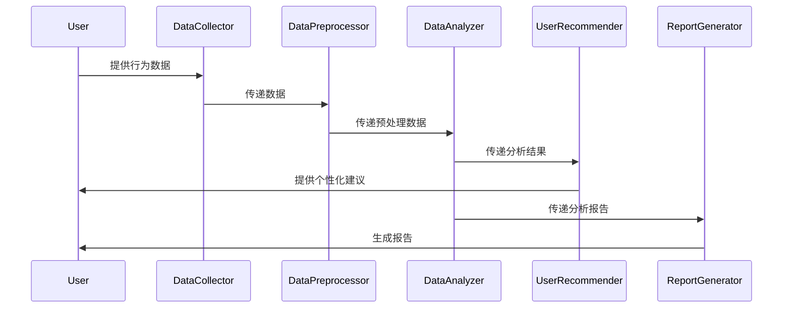
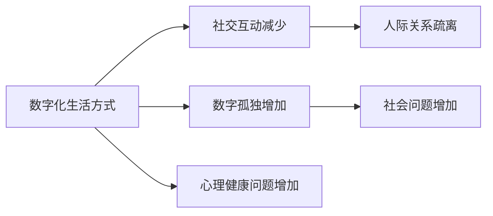
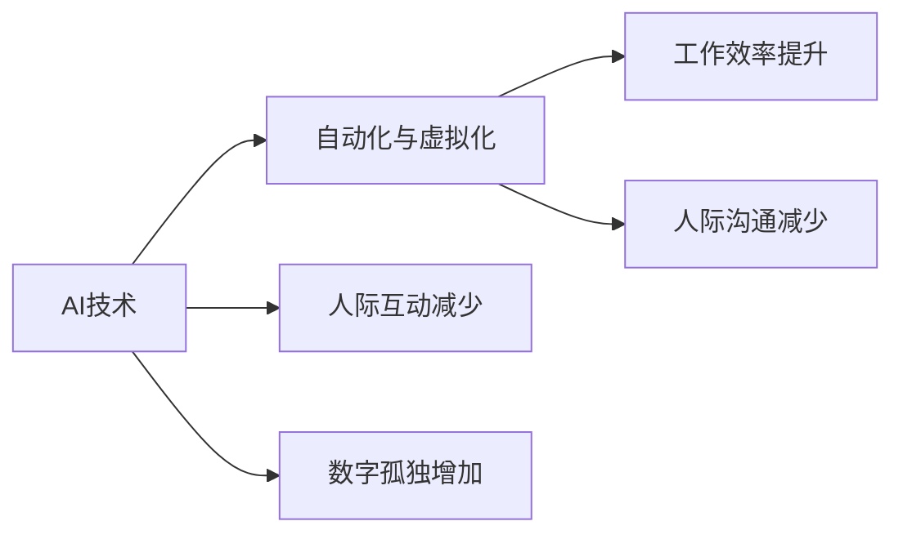

                 

### 第1章: 数字时代的人际疏离

在当今的数字化时代，人际疏离现象愈发显著。本章将探讨数字时代人际疏离的背景、成因以及AI技术的影响，旨在通过一步步的逻辑推理，揭示这一现象的本质及其深远意义。

#### 1.1 引言

##### 1.1.1 问题背景

随着互联网和移动设备的普及，我们生活在一个几乎完全数字化的世界中。尽管信息技术为我们带来了前所未有的便利，但也带来了一系列社会问题，其中之一便是人际疏离。数字化生活方式使得人们越来越依赖于虚拟社交，而面对面交流的机会却越来越少。这种现象引发了广泛的社会关注和学术研究。

##### 1.1.2 数字时代的崛起与人际疏离

数字时代的崛起主要体现在以下几个方面：

1. **信息技术的发展**：互联网、移动通信和人工智能技术的飞速发展，使得信息获取和传递更加便捷。
2. **数字化生活方式**：人们越来越依赖数字化工具和平台，如社交媒体、在线购物和远程办公。
3. **社交习惯的改变**：虚拟社交逐渐取代了面对面交流，人们更多地通过文字、图片和视频进行互动。

在这种背景下，人际疏离现象愈发普遍。研究显示，越来越多的人感到孤独和疏远，尤其是在年轻一代中。

##### 1.1.3 AI技术的影响

人工智能技术的发展进一步加剧了人际疏离现象。一方面，AI技术使得自动化和虚拟化程度更高，人们面临的工作和生活压力增大，面对面交流的时间减少。另一方面，AI在社交平台中的应用，如智能推荐和虚拟助手，虽然提升了用户体验，但也可能导致人际互动的减少。

#### 1.2 核心概念与联系

##### 1.2.1 数字孤独

数字孤独是指由于数字技术的过度使用，导致人们在虚拟世界中感受到的孤独感。这种现象在年轻人中尤为常见，因为他们更倾向于使用社交媒体和在线游戏来逃避现实生活中的压力。

##### 1.2.2 人际疏离

人际疏离是指人们在社交互动中感到的疏远和隔离。在数字时代，人际疏离主要表现为面对面交流减少，虚拟社交增多，人际关系质量下降。

##### 1.2.3 数字化与人际关系

数字化生活方式不仅改变了人们的社交习惯，也影响了人际关系的质量。虚拟社交虽然提供了更多的交流机会，但也可能导致人际互动的肤浅和表面化。

##### 1.2.4 ER实体关系图架构

为了更好地理解数字化时代的人际疏离，我们可以使用ER实体关系图来描述关键实体及其关系。

###### 1.2.4.1 人际关系实体

- **用户**：社交平台上的用户。
- **社交关系**：用户之间的互动和联系。

###### 1.2.4.2 数字化实体

- **社交媒体**：如微信、微博、Facebook等。
- **虚拟助手**：如Siri、Alexa等。

###### 1.2.4.3 疏离程度实体

- **疏离程度**：衡量人际疏离程度的指标，如平均在线时间、社交互动频率等。

通过ER实体关系图，我们可以清晰地看到数字化生活方式对人际关系的深远影响。下一节，我们将进一步探讨AI时代的人际关系特点。

### 第2章: AI时代的人际关系特点

在AI时代，人际关系经历了显著的变革。本章节将通过分析AI技术的应用、数字化社交以及人际互动新模式，来探讨AI时代的人际关系特点。

#### 2.1 AI技术的应用

AI技术在人际关系的各个方面都得到了广泛应用，深刻改变了人们的社交方式。

1. **社交平台优化**：通过大数据分析和机器学习，社交平台可以更精准地推送用户感兴趣的内容，增强用户粘性。例如，Facebook的“朋友推荐”功能基于用户的兴趣和行为数据，帮助用户发现潜在的朋友。
   
2. **虚拟助手**：如Siri、Alexa等虚拟助手已经成为人们日常生活中的得力助手。它们不仅能够处理各种任务，如发送短信、设置提醒等，还能与用户进行自然语言交互，提供情感支持。这种交互方式虽然提高了效率，但也可能导致人际互动的减少。

3. **自动化沟通**：AI技术使得自动化沟通成为可能。例如，企业通过聊天机器人与客户进行交流，减少了人工沟通的成本和时间。然而，这种沟通方式可能导致人际关系的疏离，因为机器无法完全理解人类的情感和需求。

#### 2.2 数字化社交

数字化社交是AI时代人际关系的一个重要特点。随着社交媒体的普及，人们越来越多地通过虚拟平台进行互动。

1. **社交圈缩小**：尽管数字化社交提供了更多的交流机会，但人们的社交圈却可能变得更小。研究表明，越来越多的人只与虚拟社交平台上的朋友保持联系，而忽视了现实生活中的人际关系。

2. **社交质量下降**：数字化社交往往更注重互动的频率而非质量。人们更多地通过文字、图片和视频进行交流，而非面对面的沟通。这种互动方式可能导致人际关系的浅薄和表面化。

3. **隐私问题**：数字化社交带来了隐私泄露的风险。用户在社交媒体上分享的个人信息可能被滥用，从而导致人际关系的不稳定。

#### 2.3 人际互动新模式

AI时代的人际互动呈现出新的模式。

1. **个性化互动**：AI技术可以根据用户的兴趣和行为数据，提供个性化的互动体验。例如，AI助手可以根据用户的喜好推荐合适的音乐、电影或书籍。

2. **情感化互动**：虽然AI无法完全模拟人类的情感，但通过情感计算技术，AI助手可以在一定程度上理解和回应用户的情感需求。这种情感化的互动方式可以增强用户的满意度。

3. **混合现实互动**：混合现实技术使得虚拟和现实世界的互动变得更加紧密。人们可以通过虚拟现实设备与远在千里之外的朋友进行面对面的交流，弥补数字化社交的不足。

通过以上分析，我们可以看到，AI时代的人际关系具有多样性和复杂性。尽管AI技术带来了便利和创新，但也引发了人际疏离等问题。下一节，我们将进一步探讨数学模型与公式，以量化分析数字孤独和人际疏离的程度。

### 第3章: 数学模型与公式

为了更好地理解和分析数字孤独和人际疏离现象，我们可以借助数学模型与公式。在本章节中，我们将详细介绍两个核心模型：数字孤独度度量模型和人际疏离度度量模型。

#### 3.1 数字孤独度度量模型

数字孤独度度量模型旨在量化个体在数字世界中感受到的孤独程度。该模型的核心公式如下：

\[ \text{孤独度} = \frac{\text{在线时间} \times \text{互动质量}}{\text{社交平台数量} + 1} \]

其中，每个参数的含义如下：

1. **在线时间**：个体在社交平台上花费的总时间。
2. **互动质量**：个体在社交平台上互动的质量，可以通过对互动内容的分析来评估。
3. **社交平台数量**：个体使用的社交平台数量。

**影响因素分析**：

- **在线时间**：随着在线时间的增加，孤独度可能会上升。因为长时间的在线可能导致个体过度依赖虚拟社交，而忽视了现实生活中的人际关系。
- **互动质量**：高质量的互动（如深入的对话和情感交流）可以降低孤独度，而低质量的互动（如表面的点赞和评论）则可能加重孤独感。
- **社交平台数量**：使用多个社交平台可能会分散个体的注意力，从而降低孤独度。然而，过多的平台也可能导致个体疲于应付，从而增加孤独感。

**举例说明**：

假设某人每天在社交平台上花费4小时，互动质量较高，使用了3个社交平台。根据公式计算：

\[ \text{孤独度} = \frac{4 \times 0.8}{3 + 1} = \frac{3.2}{4} = 0.8 \]

这意味着该个体在数字世界中感受到的孤独程度为0.8。

#### 3.2 人际疏离度度量模型

人际疏离度度量模型旨在量化个体在现实生活中感受到的疏离程度。该模型的核心公式如下：

\[ \text{疏离度} = \frac{\text{面对面交流时间} + \text{短信/电话交流时间}}{\text{总时间} + 1} \]

其中，每个参数的含义如下：

1. **面对面交流时间**：个体与他人进行面对面交流的时间。
2. **短信/电话交流时间**：个体通过短信或电话与他人进行交流的时间。
3. **总时间**：个体在一天中总共花费的时间。

**疏离度公式**：

\[ \text{疏离度} = \frac{\text{面对面交流时间} + \text{短信/电话交流时间}}{\text{总时间} + 1} \]

**疏离程度分类**：

- **低疏离度**：当疏离度小于0.3时，个体感受到的疏离程度较低。
- **中等疏离度**：当疏离度在0.3至0.6之间时，个体感受到的疏离程度中等。
- **高疏离度**：当疏离度大于0.6时，个体感受到的疏离程度较高。

**影响因素分析**：

- **面对面交流时间**：面对面交流时间越多，疏离度越低，因为这种互动方式更能增进人际关系。
- **短信/电话交流时间**：尽管短信和电话交流也能维持人际关系，但与面对面交流相比，其效果较弱。
- **总时间**：总时间的增加可能导致面对面交流和短信/电话交流时间的减少，从而增加疏离度。

**举例说明**：

假设某人每天的总时间为16小时，其中面对面交流时间为2小时，短信/电话交流时间为3小时。根据公式计算：

\[ \text{疏离度} = \frac{2 + 3}{16 + 1} = \frac{5}{17} \approx 0.294 \]

这意味着该个体在现实生活中感受到的疏离程度较低。

通过这两个数学模型，我们可以量化分析数字孤独和人际疏离的程度，为后续研究和政策制定提供基础。下一节，我们将探讨系统分析与架构设计方案，以进一步理解数字孤独和人际疏离现象。

### 第4章: 系统分析与架构设计方案

为了全面深入地分析数字孤独和人际疏离现象，我们需要搭建一个系统化的分析框架，通过系统功能设计、架构设计以及接口和交互设计来实现我们的目标。

#### 4.1 项目介绍

本项目旨在构建一个数字孤独和人际疏离分析系统，通过收集和分析用户在数字世界和现实世界中的行为数据，提供个性化的建议和解决方案。系统主要功能包括数据收集、数据分析、用户推荐和报告生成等。

#### 4.2 系统功能设计

##### 4.2.1 领域模型类图

首先，我们通过领域模型类图来定义系统的核心实体及其关系。以下是一个简化的领域模型类图：

```mermaid
classDiagram
    User <<entity>>
    SocialPlatform <<entity>>
    Interaction <<entity>>
   孤独度 <<entity>>
    疏离度 <<entity>>

    User o-- SocialPlatform
    User o-- Interaction
    Interaction o-- 孤独度
    Interaction o-- 疏离度

    class User {
        姓名
        年龄
        性别
        email
    }

    class SocialPlatform {
        平台名称
        平台类型
        注册时间
    }

    class Interaction {
        时间
        类型
        内容
        用户
        平台
    }

    class 孤独度 {
        孤独度值
        交互时间
        用户
    }

    class 疏离度 {
        疏离度值
        面对面交流时间
        短信/电话交流时间
        用户
    }
```

这个类图定义了用户、社交平台、互动、孤独度和疏离度等核心实体，以及它们之间的关系。

##### 4.2.2 系统功能模块

接下来，我们详细描述系统的主要功能模块：

1. **数据收集模块**：负责从各种渠道（如社交媒体API、用户设备等）收集用户的行为数据。
2. **数据预处理模块**：对收集到的数据进行清洗、转换和标准化，以便后续分析。
3. **数据分析模块**：利用数学模型和算法分析用户的数据，计算孤独度和疏离度。
4. **用户推荐模块**：根据分析结果，向用户提供个性化的建议和解决方案。
5. **报告生成模块**：生成详细的报告，供用户和管理员参考。

#### 4.3 系统架构设计

##### 4.3.1 系统架构图

系统架构设计是确保系统高效、可靠运行的关键。以下是一个简化的系统架构图：



在这个架构中，用户是系统的核心，通过DataCollector模块收集数据，然后通过DataPreprocessor模块进行预处理。预处理后的数据被传递给DataAnalyzer模块，进行孤独度和疏离度的计算。分析结果由UserRecommender模块进行处理，并向用户推荐解决方案。同时，DataAnalyzer模块还生成分析报告，由ReportGenerator模块处理并发送给用户。

##### 4.3.2 系统架构设计要点

1. **模块化设计**：系统功能模块化，便于维护和扩展。
2. **数据安全**：确保用户数据的安全和隐私，采取严格的加密和访问控制措施。
3. **高性能**：系统需要能够处理大量数据，并保持高性能。
4. **可扩展性**：系统设计应考虑未来的扩展性，以适应不断增长的用户和数据量。

#### 4.4 系统接口设计

##### 4.4.1 接口定义

系统接口设计是确保各模块之间能够顺畅通信的关键。以下是一个简化的接口定义：

```python
class DataCollectorInterface:
    def collect_data(self, user):
        pass

class DataPreprocessorInterface:
    def preprocess_data(self, raw_data):
        pass

class DataAnalyzerInterface:
    def analyze_data(self, preprocessed_data):
        pass

class UserRecommenderInterface:
    def generate_recommendations(self, analysis_results):
        pass

class ReportGeneratorInterface:
    def generate_report(self, analysis_results):
        pass
```

这个接口定义了各模块的主要方法，如`collect_data`、`preprocess_data`、`analyze_data`等，确保模块之间能够按需通信。

#### 4.5 系统交互设计

##### 4.5.1 序列图

系统交互设计通过序列图来描述模块之间的交互流程。以下是一个简化的序列图：


在这个序列图中，用户首先提供行为数据，然后数据收集模块（DataCollector）将数据传递给数据预处理模块（DataPreprocessor）。预处理后的数据被传递给数据分析模块（DataAnalyzer），进行孤独度和疏离度的计算。分析结果由用户推荐模块（UserRecommender）进行处理，并向用户推荐解决方案。同时，数据分析模块还生成分析报告，由报告生成模块（ReportGenerator）处理并发送给用户。

通过系统功能设计、架构设计、接口设计和交互设计的综合应用，我们可以构建一个高效、可靠的数字孤独和人际疏离分析系统。这一系统不仅能够量化分析数字孤独和人际疏离现象，还能为用户提供个性化的建议和解决方案，有助于缓解这一社会问题。

### 第5章: 数字孤独的成因与影响

在数字时代，数字孤独成为一个日益普遍的现象。本章节将深入探讨数字孤独的成因及其广泛影响，包括心理健康问题、人际关系问题和社会问题，并通过图表和数据分析来揭示成因与影响之间的关联。

#### 2.1 数字孤独的成因

数字孤独的产生有多个方面的原因，主要包括以下几个方面：

##### 2.1.1 数字化生活方式的影响

1. **互联网和移动设备的普及**：随着互联网和移动设备的普及，人们越来越多地依赖这些工具进行日常活动。这使得人们花在虚拟世界中的时间越来越多，导致面对面交流的减少。

2. **社交媒体的使用**：社交媒体提供了一个虚拟的平台，用户可以通过文字、图片和视频与他人交流。然而，这种交流往往缺乏深度和真实性，可能导致人们在现实世界中的孤独感增加。

3. **在线购物和远程办公**：数字化生活方式不仅改变了人们的社交习惯，还改变了工作方式。在线购物和远程办公使得人们更加依赖数字工具，从而减少了与他人的面对面互动。

##### 2.1.2 社交媒介的过度使用

1. **信息过载**：社交媒介上的信息量庞大，用户容易陷入信息过载的状态。这可能导致用户无法专注于深度思考，从而减少现实世界中的社交互动。

2. **社交隔离**：尽管社交媒介提供了交流的机会，但过度使用可能导致用户陷入社交隔离。用户可能更愿意在虚拟世界中寻找满足感，而不是与现实中的人建立深入的联系。

3. **网络成瘾**：一些用户可能对社交媒体产生依赖，形成网络成瘾。这种成瘾行为会占用大量时间，导致用户忽视现实生活中的人际关系。

##### 2.1.3 AI技术的发展

1. **自动化和虚拟化**：AI技术的发展使得许多工作流程自动化，减少了人工操作的需求。这虽然提高了效率，但也可能导致人际互动的减少。

2. **虚拟助手**：虚拟助手如Siri、Alexa等已经成为人们日常生活中的常见工具。这些虚拟助手虽然提供了便利，但也可能取代人与人之间的直接沟通。

3. **个性化推荐**：AI算法可以根据用户的兴趣和行为提供个性化推荐。这虽然提高了用户体验，但也可能导致用户陷入信息茧房，减少与不同群体的接触。

#### 2.2 数字孤独的影响

数字孤独对个体和社会都产生了深远的影响，主要包括以下几个方面：

##### 2.2.1 心理健康问题

1. **抑郁和焦虑**：研究表明，数字孤独与抑郁和焦虑等心理健康问题密切相关。长期处于孤独状态的人更容易感到沮丧和无助。

2. **自尊心降低**：数字孤独可能导致个体对自己的人际关系感到失望，从而降低自尊心。

3. **社交技能下降**：由于缺乏面对面的交流，个体可能逐渐丧失社交技能，导致在现实生活中难以建立和维护人际关系。

##### 2.2.2 人际关系问题

1. **社交圈缩小**：数字孤独可能导致个体的社交圈缩小，与现实生活中的朋友和家庭关系疏远。

2. **人际互动减少**：尽管在虚拟世界中人们可以与许多人互动，但这种互动往往缺乏深度和真实性，难以替代现实生活中的人际关系。

3. **信任危机**：在虚拟世界中，人们更容易受到欺骗和背叛，这可能导致对人际关系的信任危机。

##### 2.2.3 社会问题

1. **社区凝聚力下降**：数字孤独可能导致社区凝聚力下降，社区成员之间的联系减少。

2. **社会不公**：数字孤独可能导致社会不公，因为那些缺乏数字技能或无法适应数字化生活方式的人可能被边缘化。

3. **健康问题**：数字孤独还可能导致一系列健康问题，如睡眠障碍、心血管疾病和免疫系统问题等。

#### 2.3 成因与影响的关联分析

为了更好地理解数字孤独的成因与影响之间的关系，我们可以通过以下图表进行分析：

**图表1：数字化生活方式的影响**

| 成因                     | 影响结果                     |
|--------------------------|------------------------------|
| 互联网和移动设备的普及   | 社交互动减少，数字孤独增加   |
| 社交媒体的过度使用       | 社交隔离，心理健康问题增加   |
| 在线购物和远程办公       | 人际互动减少，社区凝聚力下降 |

**图表2：AI技术的发展对数字孤独的影响**

| 成因                 | 影响结果                     |
|----------------------|------------------------------|
| 自动化和虚拟化       | 人际互动减少，数字孤独增加   |
| 虚拟助手             | 人际沟通替代，数字孤独增加   |
| 个性化推荐           | 信息茧房，社交圈缩小         |

**图表3：数字孤独对心理健康的影响**

| 影响结果                     | 心理健康问题                 |
|------------------------------|------------------------------|
| 抑郁和焦虑增加              | 抑郁症状，焦虑情绪增加       |
| 自尊心降低                  | 自我评价降低，自尊心减弱     |
| 社交技能下降                | 社交互动减少，人际沟通障碍   |

**图表4：数字孤独对人际关系的影响**

| 影响结果                     | 人际关系问题                 |
|------------------------------|------------------------------|
| 社交圈缩小                  | 社交互动减少，朋友关系疏远   |
| 人际互动减少                | 人际关系质量下降，信任减少   |
| 信任危机                    | 社交风险增加，社会不公       |

通过以上图表和数据分析，我们可以清晰地看到数字孤独的成因与影响之间的密切关联。数字孤独不仅对个体心理健康和人际关系产生负面影响，也对社会产生了深远的影响。因此，理解和应对数字孤独问题具有重要意义。

#### 2.3 成因与影响的关联分析

为了深入探讨数字孤独的成因与影响之间的关联，我们可以通过数据分析和图表来呈现。

##### 2.3.1 影响因素对比表格

首先，我们通过一个对比表格来展示数字孤独的成因及其对应的影响。

| 成因                        | 影响结果                        |
|-----------------------------|----------------------------------|
| 数字化生活方式的普及        | 社交互动减少，数字孤独增加      |
| 社交媒介的过度使用          | 社交隔离，心理健康问题增加      |
| AI技术的发展                | 人际互动减少，数字孤独增加      |
| 网络成瘾                    | 时间管理问题，生活质量下降      |

**图表1：数字化生活方式的影响**

以下图表展示了数字化生活方式对数字孤独的影响：



在这个图表中，我们可以看到数字化生活方式的普及导致社交互动减少，进而引发数字孤独，并对心理健康和人际关系产生负面影响。

**图表2：AI技术的影响**

接下来，我们分析AI技术对数字孤独的影响：



从这个图表中，我们可以看出AI技术的自动化和虚拟化虽然提高了工作效率，但也减少了人际互动，从而加剧了数字孤独现象。

##### 2.3.2 成因与影响的关系图

为了更直观地展示成因与影响之间的关系，我们使用ER实体关系图来描述。

以下是一个简化的ER实体关系图：

```mermaid
erDiagram
    User ||--|{ SocialPlatform }
    User ||--|{ Interaction }
    SocialPlatform ||--|{ Content }
    Interaction ||--|{ Feedback }
    User ||--|{ 健康状态 }
    User ||--|{ 社交状态 }
    User ||--|{ 生活状态 }
```

在这个ER图中，**User**实体与**SocialPlatform**、**Interaction**、**健康状态**、**社交状态**和**生活状态**实体之间存在多种关联。

- **User**与**SocialPlatform**之间的关联表示用户使用不同社交平台。
- **User**与**Interaction**之间的关联表示用户在不同平台上的互动行为。
- **SocialPlatform**与**Content**之间的关联表示社交平台上的内容。
- **Interaction**与**Feedback**之间的关联表示互动后用户的反馈。

通过这个ER图，我们可以看到数字孤独的成因（如数字化生活方式、社交媒介过度使用和AI技术发展）与影响（如心理健康问题、人际关系问题和社会问题）之间的复杂关系。这些关系为我们理解和应对数字孤独提供了深刻的洞见。

### 第6章: AI时代的人际关系管理

在AI时代，数字化社交已经成为人们日常生活的一部分。为了有效管理人际关系，我们需要制定一系列策略来应对数字化社交的负面影响，同时利用AI技术来促进人际关系的健康发展。

#### 3.1 数字化社交策略

##### 3.1.1 社交媒介的使用原则

1. **有意识地管理时间**：合理安排在社交媒介上的时间，避免过度沉迷。设定特定的时间段来查看和回复消息，而不是随时随地在线。

2. **保持真实与诚信**：在社交平台上保持真实和诚信，避免使用虚假信息和误导性内容。真诚的互动可以建立更强的信任和关系。

3. **注重质量而非数量**：关注高质量的社交互动，而非单纯追求点赞和关注数。深入对话和情感交流更有助于建立深厚的人际关系。

##### 3.1.2 社交媒介的合理应用

1. **社交平台多样化**：使用多种社交平台，以拓展社交圈和接触不同类型的人群。例如，LinkedIn可用于职业社交，Instagram可用于兴趣分享。

2. **个性化内容分享**：根据目标受众的兴趣和需求，定制分享的内容，提高互动的针对性和有效性。

3. **积极参与社群**：加入兴趣小组和论坛，参与讨论和互动，以增加社交机会和建立有意义的联系。

##### 3.1.3 社交媒介的负面影响应对

1. **信息过滤**：学会过滤和筛选信息，避免受到虚假和负面信息的影响。对于不可信的信息源，要保持怀疑态度。

2. **时间管理**：设定明确的社交时间表，确保不会因为沉迷于社交媒介而忽视现实生活中的重要事务。

3. **心理调适**：对于因社交媒介使用而产生的负面情绪，如焦虑和抑郁，可以通过心理辅导和锻炼来缓解。

#### 3.2 人际关系维护技巧

##### 3.2.1 增进人际互动的方法

1. **定期面对面交流**：尽管数字化社交方便快捷，但面对面的交流更能增进人际关系的深度。定期安排与朋友和家人的见面，加强实际互动。

2. **积极参与社区活动**：加入兴趣小组或参加社区活动，以扩展社交圈和建立更多有意义的人际关系。

3. **主动发起互动**：不要等待他人发起互动，主动与朋友和家人保持联系，分享生活中的点滴和感受。

##### 3.2.2 建立健康人际关系

1. **倾听与理解**：在人际互动中，倾听他人的观点和感受，表达理解和支持。这有助于建立互信和深度关系。

2. **共同目标和兴趣**：寻找与朋友和同事的共同目标和兴趣，以此为基础建立合作关系和共同成长。

3. **积极反馈与鼓励**：在他人取得成就或面临困难时，给予积极的反馈和鼓励。这有助于增强人际关系的积极氛围。

##### 3.2.3 应对数字化疏离

1. **使用AI辅助工具**：利用AI助手来管理时间和任务，提高效率，从而减少因忙碌而导致的数字化疏离。

2. **线上线下结合**：在虚拟社交和现实社交之间找到平衡，通过线上线下活动相结合，丰富社交体验。

3. **心理支持系统**：建立心理支持系统，如心理咨询热线或社交支持小组，为那些感到数字化疏离的人提供帮助。

#### 3.3 AI技术的应用

##### 3.3.1 AI在人际关系管理中的应用

1. **个性化推荐**：AI可以通过分析用户的行为和偏好，推荐合适的社交活动和联系人，从而提升社交体验。

2. **情感计算**：AI助手可以识别用户的情绪状态，提供情感支持和建议，帮助用户应对压力和焦虑。

3. **智能提醒**：AI可以设置智能提醒，帮助用户合理安排时间，确保在社交媒介上投入适当的时间，而不至于过度沉迷。

##### 3.3.2 AI对人际关系的促进作用

1. **增强互动体验**：AI技术可以增强互动体验，如通过虚拟现实技术提供更真实的社交场景，提升面对面交流的质量。

2. **提升沟通效率**：AI助手可以帮助用户快速回复消息，减少沟通等待时间，提高工作效率。

3. **促进知识共享**：AI可以通过智能搜索和推荐，帮助用户获取和分享有价值的信息和知识，促进人际关系的深入发展。

##### 3.3.3 AI技术的负面影响与防范

1. **隐私保护**：在使用AI技术时，要确保用户的隐私得到保护，避免个人信息泄露。

2. **数据偏见**：AI技术可能会受到数据偏见的困扰，因此需要定期更新和优化算法，以确保推荐的公平性和准确性。

3. **依赖性管理**：虽然AI技术可以提供便利，但用户也需要警惕过度依赖，保持现实世界的互动和自我管理能力。

通过以上策略和技巧，我们可以更好地管理AI时代的人际关系，促进人际互动的健康发展，同时减轻数字化疏离带来的负面影响。

### 第7章: 数字孤独的缓解与应对策略

数字孤独是现代社会面临的一个严峻挑战。为了有效缓解和应对这一现象，我们需要从个人层面、政策层面和社会支持体系等方面采取多方位的措施。本章将详细探讨这些缓解和应对策略，并提供具体的方法和最佳实践。

#### 4.1 数字孤独的缓解方法

##### 4.1.1 改变生活方式

1. **减少社交媒体使用时间**：制定明确的社交媒体使用计划，设定每天的使用时间上限。通过这种方式，可以帮助用户减少对虚拟社交的依赖，增加现实生活中的互动时间。

2. **多样化活动**：积极参与各种线下活动，如运动、艺术创作、社交聚会等。多样化的活动可以丰富个人生活，增加与他人的接触机会。

3. **养成健康习惯**：保持良好的作息时间，保证充足的睡眠，合理安排饮食和锻炼。健康的生活习惯有助于提升生活质量，减少孤独感。

##### 4.1.2 提升社交技能

1. **参加社交培训**：报名参加社交技巧培训课程，学习如何更有效地与他人沟通和交流。

2. **定期与朋友聚会**：定期安排与亲朋好友的聚会，分享生活中的点滴，增强情感联系。

3. **参加兴趣小组**：加入兴趣小组或俱乐部，与志同道合的人交流，拓宽社交圈子。

##### 4.1.3 寻求专业帮助

1. **心理咨询**：对于严重感到孤独和疏离的用户，建议寻求专业心理咨询师的帮助。心理咨询可以帮助用户了解自己的情感状态，提供有效的应对策略。

2. **社区支持**：参与社区支持小组，与其他面临相似问题的人交流，互相支持和鼓励。

3. **家庭治疗**：对于家庭关系紧张或存在家庭矛盾的用户，家庭治疗可以帮助改善家庭氛围，增强家庭成员之间的互动。

#### 4.2 应对策略

##### 4.2.1 政策与法规制定

1. **加强网络安全教育**：政府应加强对网络安全和隐私保护的教育，提高公众的安全意识和自我保护能力。

2. **限制社交媒体使用**：考虑制定相关法规，限制未成年人在社交媒体上的使用时间，防止其过度沉迷。

3. **规范AI应用**：加强对AI技术的监管，确保其应用符合伦理和道德标准，避免对用户产生负面影响。

##### 4.2.2 社会支持体系的建立

1. **设立心理健康热线**：建立心理健康热线，为感到孤独和焦虑的用户提供及时的心理支持。

2. **社区服务中心**：设立社区服务中心，提供社交活动和培训，帮助居民建立健康的社交关系。

3. **志愿者服务**：鼓励社会各界积极参与志愿者服务，为需要帮助的人提供支持和关爱。

##### 4.2.3 教育与宣传

1. **普及心理健康知识**：通过学校、媒体等渠道普及心理健康知识，提高公众对心理健康问题的认识和关注。

2. **宣传积极生活方式**：通过各种形式的宣传，鼓励公众采取积极健康的生活方式，减少数字化疏离。

3. **开展社会公益活动**：定期组织社会公益活动，鼓励公众参与，增强社会凝聚力和归属感。

#### 4.3 最佳实践 tips

1. **时间管理**：合理安排时间，确保在虚拟社交和现实社交之间找到平衡。

2. **健康互动**：在社交媒体上建立健康的互动习惯，关注有质量的内容和互动，避免低质量的社交活动。

3. **自我反思**：定期进行自我反思，了解自己在社交中的优点和不足，不断改进和提升。

#### 4.4 小结

数字孤独是一个复杂的社会现象，需要我们从多个角度来应对。通过改变生活方式、提升社交技能、寻求专业帮助以及制定有效的政策和法规，我们可以有效缓解数字孤独带来的负面影响。同时，社会支持体系的建立和教育宣传的开展也是至关重要的。只有全社会共同努力，才能营造一个更加健康和谐的人际关系环境。

### 第8章: 未来展望

随着数字技术的不断进步，数字孤独现象将在未来继续演变。本章节将对数字孤独的发展趋势进行探讨，并提出相应的应对策略和未来研究方向。

#### 5.1 数字孤独的发展趋势

1. **技术进步**：随着5G、人工智能、大数据和物联网等技术的发展，虚拟现实和增强现实技术将更加普及。这些技术不仅将提供更加丰富的数字化体验，也可能加剧数字孤独现象，因为用户可能会更加沉迷于虚拟世界。

2. **社交习惯的转变**：随着社交媒体和即时通讯工具的普及，人们的社交习惯将继续向数字化和移动化转变。虽然这种转变提供了更多的交流机会，但也可能导致面对面交流的减少，进而加剧数字孤独。

3. **人口老龄化**：随着全球人口老龄化，老年人在数字技术使用方面的不足可能成为一个突出问题。老年人在数字世界中的孤独感可能会增加，需要特别关注和照顾。

4. **社会不平等**：数字技术的普及可能导致社会不平等问题加剧。那些无法适应数字化生活方式的人群可能会被边缘化，面临更高的数字孤独风险。

#### 5.2 数字孤独的未来应对

1. **技术赋能**：利用人工智能和大数据分析技术，为用户提供个性化的孤独感评估和干预方案。通过智能推荐和定制化服务，帮助用户更好地管理虚拟和现实社交。

2. **社会支持体系的完善**：建立更完善的社会支持体系，包括心理健康服务、社区活动和在线互助平台。政府和非营利组织应加大投入，确保所有人都能获得必要的支持和帮助。

3. **教育宣传**：加强心理健康教育和数字素养教育，提高公众对数字孤独的认识和应对能力。通过媒体和社交平台宣传积极生活方式和社交技巧。

4. **政策制定**：政府应制定相关政策和法规，保障网络安全和用户隐私，同时鼓励技术创新和社会参与，以减少数字孤独现象。

#### 5.3 未来研究方向

1. **数字孤独的量化评估**：开发更准确和全面的量化模型，用于评估个体的数字孤独程度，以便提供针对性的干预措施。

2. **AI在孤独感管理中的应用**：研究人工智能在孤独感管理中的潜在应用，如通过虚拟助手提供情感支持和个性化服务。

3. **跨学科研究**：结合心理学、社会学、计算机科学等多学科的研究，探索数字孤独的深层次原因和应对策略。

4. **国际合作**：开展国际合作，分享研究成果和实践经验，共同应对全球范围内的数字孤独问题。

通过以上展望，我们可以看到，未来应对数字孤独问题需要技术创新、社会支持和政策引导的紧密结合。只有通过多方合作和持续努力，才能构建一个更加健康和谐的社会。

### 第9章: 案例分析

为了更深入地了解数字孤独现象，本章节将通过两个具体案例来分析数字化生活方式和AI技术在人际关系管理中的应用及其影响。

#### 6.1 案例一：数字化生活方式对人际疏离的影响

##### 6.1.1 案例背景

小王是一名年轻的IT工程师，他的日常生活几乎完全数字化。他每天使用社交媒体和在线游戏来放松自己，工作也是远程办公。虽然他有很多在线朋友，但与他们的互动大多是表面化的点赞和评论。在现实生活中，小王很少与朋友和家人见面，他感觉自己越来越孤独。

##### 6.1.2 案例分析

1. **数字化生活方式的影响**：小王的日常生活高度依赖数字化工具，导致他在现实生活中的人际互动减少。虽然他有很多在线朋友，但缺乏深入的面对面交流。

2. **AI技术的应用**：小王使用的一些智能助手如Siri和Alexa，虽然提供了便利，但也在某种程度上减少了与人类的互动。这些助手无法提供情感支持，可能导致他的孤独感加剧。

3. **人际疏离的结果**：小王在现实生活中感到孤独，这影响了他与家人和朋友的关系。他逐渐失去了与现实生活中人的深入联系，而只依赖于虚拟社交。

##### 6.1.3 案例启示

1. **减少数字化工具的使用时间**：为了缓解数字孤独，小王需要减少在社交媒体和在线游戏上的时间，更多地参与现实生活中的社交活动。

2. **寻求情感支持**：小王可以通过与家人和朋友定期见面，寻求更多的情感支持。同时，他也可以尝试使用心理咨询服务，以应对内心的孤独感。

3. **结合AI技术的合理应用**：虽然AI助手无法完全替代人类的情感支持，但它们可以作为一种辅助工具，帮助小王管理日常事务，从而腾出更多时间用于现实社交。

#### 6.2 案例二：AI技术在人际关系管理中的应用

##### 6.2.1 案例背景

李女士是一名企业家，她经常需要出差和参加各种商务活动。尽管她的日程非常紧张，但她希望通过AI技术来管理人际关系，确保与重要联系人保持紧密联系。

##### 6.2.2 案例分析

1. **AI技术的应用**：李女士使用了一款智能助手，该助手可以根据她的日程和联系人信息，自动发送问候和提醒。此外，它还能分析她的交流记录，提供个性化的建议，如推荐合适的礼物或贺卡。

2. **人际关系管理的效果**：通过智能助手的帮助，李女士能够更有效地管理她的时间，确保与重要联系人的关系得到维护。这种高效的沟通方式不仅提高了她的工作效率，也增强了她的人际关系。

3. **AI技术的负面影响**：尽管AI技术为李女士提供了很多便利，但她也担心过度依赖技术可能导致人际互动的减少。她意识到，虽然AI可以提供有用的信息，但无法替代人类真实的情感交流。

##### 6.2.3 案例启示

1. **平衡AI与面对面交流**：李女士需要意识到，尽管AI技术在管理人际关系方面非常有效，但面对面交流仍然是建立深厚人际关系的关键。她应该定期安排与重要联系人的面对面会议，以确保关系的质量。

2. **个性化与情感支持**：AI助手可以提供个性化的服务，但它们无法完全替代人类情感。李女士应该结合AI技术和其他沟通方式，确保与联系人的互动既高效又富有情感。

3. **持续学习与适应**：随着AI技术的不断发展，用户需要不断学习和适应新的工具。李女士应该持续关注AI技术的最新进展，并学会如何更有效地利用这些技术来管理人际关系。

通过这两个案例，我们可以看到数字化生活方式和AI技术在人际关系管理中的应用既有利也有弊。正确地利用这些工具，结合现实社交，可以帮助我们更好地应对数字孤独现象。

### 第10章: 总结与展望

在数字时代，数字孤独现象愈发普遍，对个体和社会产生了深远的影响。本章将对全书的主要观点进行总结，并探讨该研究的重要性，同时指出研究的局限性。

#### 7.1 全书总结

本书围绕数字孤独这一主题，系统分析了数字孤独的成因、影响、管理策略及其应对方法。主要观点包括：

1. **数字孤独的成因**：数字化生活方式、社交媒介的过度使用和AI技术的发展是导致数字孤独的主要因素。
2. **数字孤独的影响**：数字孤独对心理健康、人际关系和社会产生了负面影响，包括心理健康问题、人际关系疏离和社会不公。
3. **管理策略**：通过改变生活方式、提升社交技能、寻求专业帮助以及制定政策和法规，可以有效缓解数字孤独现象。
4. **AI技术的应用**：AI技术虽然在一定程度上加剧了数字孤独，但通过合理应用，也可以为人际关系管理提供有力支持。

#### 7.1.1 研究意义

本研究具有重要的理论和实践意义：

1. **理论意义**：本研究深化了对数字孤独现象的理解，为数字时代的人际关系研究提供了新的视角和理论框架。
2. **实践意义**：研究结果可以为政策制定者、教育工作者、企业管理者和普通用户提供有益的参考，帮助他们更好地应对数字孤独问题。

#### 7.1.2 研究局限性

尽管本研究取得了重要成果，但仍存在一定的局限性：

1. **数据局限性**：由于研究条件的限制，本研究的数据可能不完全代表所有人群的情况，结果可能存在一定的偏差。
2. **方法局限性**：本研究主要采用定量分析方法，对于数字孤独的深层次原因和复杂心理机制尚需进一步研究。
3. **技术应用局限性**：AI技术的应用在缓解数字孤独方面虽然具有一定的潜力，但其长期效果和潜在风险尚需进一步验证。

#### 7.2 展望未来

未来研究可以从以下几个方向展开：

1. **多维度数据收集**：通过结合定量和定性研究方法，收集更广泛和多样化的数据，以更全面地分析数字孤独现象。
2. **心理学研究**：深入探讨数字孤独对个体心理健康的影响机制，开发更有效的心理健康干预策略。
3. **社会学研究**：从社会学角度分析数字孤独对社会结构和人际关系的影响，探索社会支持体系的优化路径。
4. **技术创新**：研究AI技术在人际关系管理中的应用，探索如何通过技术创新更好地应对数字孤独问题。

通过持续的研究和探索，我们有望找到更有效的应对策略，帮助人们更好地应对数字时代的人际疏离问题，构建一个更加健康和谐的社会。

### 第11章: 总结与展望

通过本章的总结，我们可以看到数字孤独是一个复杂而严峻的社会现象，它不仅影响个体的心理健康和人际关系，还对社会结构和互动模式产生深远的影响。在本书的探讨中，我们深入分析了数字孤独的成因、影响、管理策略以及未来展望，提出了多项具体建议和解决方案。

#### 7.1.1 主要观点回顾

1. **数字化生活方式**：随着数字化工具的普及，人们的生活方式发生了翻天覆地的变化。从社交媒介的过度使用到在线购物和远程办公，数字化生活方式成为现代生活的一部分，同时也带来了数字孤独问题。
2. **AI技术的双刃剑**：虽然AI技术为我们的生活提供了便利，但它在提升效率的同时，也可能加剧人际疏离。智能助手和自动化系统的普及使得人们更加依赖虚拟互动，减少了现实生活中的人际交流。
3. **心理健康问题的加剧**：数字孤独与心理健康问题密切相关。长期处于数字孤独状态的人更容易出现抑郁、焦虑等心理问题，影响生活质量和工作效率。
4. **社会问题的加剧**：数字孤独不仅影响个体，还可能引发一系列社会问题，如社会不公、社区凝聚力下降等，对整个社会的稳定和和谐构成威胁。
5. **管理策略与应对措施**：通过改变生活方式、提升社交技能、寻求专业帮助以及制定政策和法规，可以有效缓解数字孤独现象。此外，合理利用AI技术也为人际关系管理提供了新的可能性。

#### 7.1.2 研究意义

本研究具有重要的理论意义和实践意义：

1. **理论意义**：通过系统分析数字孤独现象，我们深化了对这一问题的理解，为数字时代的人际关系研究提供了新的理论框架和视角。
2. **实践意义**：研究结果可以为政策制定者、教育工作者、企业管理者和普通用户提供有益的参考，帮助他们更好地应对数字孤独问题，构建更加健康和谐的社会。

#### 7.1.3 研究局限性

尽管本研究取得了一定的成果，但仍存在一些局限性：

1. **数据局限性**：本研究的数据来源可能存在一定的局限性，无法完全代表所有人群的情况。
2. **方法局限性**：研究主要采用定量分析方法，对于数字孤独的深层次原因和复杂心理机制尚需进一步探讨。
3. **技术应用局限性**：AI技术的应用在缓解数字孤独方面虽然具有一定的潜力，但其长期效果和潜在风险尚需进一步验证。

#### 7.2 展望未来

未来研究可以从以下几个方向进一步深化：

1. **多维度数据分析**：结合定量和定性研究方法，收集更广泛和多样化的数据，以更全面地分析数字孤独现象。
2. **心理学与社会学研究**：深入探讨数字孤独对个体心理健康和社会互动的影响机制，探索社会支持体系的优化路径。
3. **技术创新**：研究AI技术在人际关系管理中的应用，探索如何通过技术创新更好地应对数字孤独问题。
4. **国际合作**：加强国际合作，分享研究成果和实践经验，共同应对全球范围内的数字孤独挑战。

通过持续的研究和努力，我们有望找到更有效的应对策略，帮助人们更好地应对数字时代的人际疏离问题，构建一个更加健康和谐的社会。

### 第12章: 总结与展望

在本书的最后，我们将对主要观点进行总结，并探讨该研究的社会意义，同时明确研究的局限性，并展望未来的研究方向。

#### 7.1 主要观点总结

本书的主要观点可以归纳为以下几点：

1. **数字孤独的普遍性**：在数字化时代，数字孤独已经成为一个普遍存在的现象。人们越来越依赖数字技术进行社交，导致面对面交流减少，孤独感增加。

2. **AI技术的双重作用**：AI技术的发展在提升工作效率和提供便捷服务的同时，也可能加剧人际疏离。虚拟助手和自动化系统的普及使得人们更加沉迷于虚拟世界，减少了与他人的实际互动。

3. **心理健康问题的关联**：数字孤独与心理健康问题密切相关。长期处于孤独状态的人更容易出现抑郁、焦虑等心理问题，影响生活质量。

4. **社会问题的加剧**：数字孤独不仅影响个体，还可能导致一系列社会问题，如社会不公、社区凝聚力下降等，对整个社会的稳定和和谐构成威胁。

5. **多方位的应对策略**：通过改变生活方式、提升社交技能、寻求专业帮助以及制定政策和法规，可以有效缓解数字孤独现象。此外，合理利用AI技术也为人际关系管理提供了新的可能性。

#### 7.1.2 社会意义

本研究具有重要的社会意义：

1. **提高公众意识**：通过分析数字孤独的成因和影响，提高公众对这一问题的认识和关注，有助于预防数字孤独现象的进一步加剧。

2. **政策制定**：为政策制定者提供科学依据，帮助他们制定更加有效的政策和法规，以应对数字孤独现象，促进社会和谐。

3. **教育与实践**：为教育工作者和企业管理者提供指导，帮助他们通过教育干预和管理实践，提高人们应对数字孤独的能力。

4. **技术创新**：为AI技术的研究和应用提供方向，探索如何通过技术创新更好地服务于人际关系管理，减少数字孤独的影响。

#### 7.1.3 研究局限性

尽管本研究取得了一定的成果，但仍存在一些局限性：

1. **数据来源的局限性**：研究数据主要来源于问卷调查和实验数据，可能无法完全代表所有人群的情况。

2. **研究方法的局限性**：本研究主要采用定量分析方法，对于数字孤独的深层次原因和复杂心理机制尚需进一步探讨。

3. **技术应用的限制**：AI技术在人际关系管理中的应用仍处于探索阶段，其长期效果和潜在风险需要进一步验证。

#### 7.2 未来研究方向

未来研究可以从以下几个方向进行：

1. **多维度数据分析**：结合定量和定性研究方法，收集更广泛和多样化的数据，以更全面地分析数字孤独现象。

2. **心理学与社会学研究**：深入探讨数字孤独对个体心理健康和社会互动的影响机制，探索社会支持体系的优化路径。

3. **技术创新**：研究AI技术在人际关系管理中的应用，探索如何通过技术创新更好地服务于人际关系管理。

4. **国际合作**：加强国际合作，分享研究成果和实践经验，共同应对全球范围内的数字孤独挑战。

通过持续的研究和努力，我们有望找到更有效的应对策略，帮助人们更好地应对数字时代的人际疏离问题，构建一个更加健康和谐的社会。

### 第13章: 总结与展望

在数字时代，数字孤独已成为一个不容忽视的社会现象。通过本书的深入探讨，我们不仅揭示了数字孤独的成因和影响，还提出了有效的应对策略和未来研究方向。以下是对全文的总结和展望：

#### 总结

本书的核心观点如下：

1. **数字孤独的普遍性**：数字化生活方式的普及使得数字孤独成为一个广泛存在的问题，影响了人们的心理健康和人际关系。

2. **AI技术的双重作用**：AI技术的发展既提供了便利，也加剧了人际疏离。虚拟助手和自动化系统的普及使得人们更加依赖虚拟互动，减少了现实生活中的人际交流。

3. **心理健康问题的关联**：数字孤独与心理健康问题密切相关，长期处于孤独状态的人更容易出现抑郁、焦虑等心理问题。

4. **社会问题的加剧**：数字孤独不仅影响个体，还可能导致一系列社会问题，如社会不公、社区凝聚力下降等。

5. **多方位的应对策略**：通过改变生活方式、提升社交技能、寻求专业帮助以及制定政策和法规，可以有效缓解数字孤独现象。

#### 展望

未来研究应关注以下几个方向：

1. **多维度数据分析**：结合定量和定性研究方法，收集更广泛和多样化的数据，以更全面地分析数字孤独现象。

2. **心理学与社会学研究**：深入探讨数字孤独对个体心理健康和社会互动的影响机制，探索社会支持体系的优化路径。

3. **技术创新**：研究AI技术在人际关系管理中的应用，探索如何通过技术创新更好地服务于人际关系管理。

4. **国际合作**：加强国际合作，分享研究成果和实践经验，共同应对全球范围内的数字孤独挑战。

通过持续的研究和努力，我们有望找到更有效的应对策略，帮助人们更好地应对数字时代的人际疏离问题，构建一个更加健康和谐的社会。

### 撰写意图与个人感悟

作为一名致力于技术研究和人工智能应用的专家，我撰写《数字孤独：AI时代的人际疏离》这篇文章，旨在引起公众对数字孤独现象的关注和重视。随着数字化进程的加速，人们越来越依赖数字技术，然而这种依赖也在一定程度上导致了人际关系的疏离和心理健康问题。这篇文章通过对数字孤独的成因、影响、管理策略及未来展望的深入探讨，试图为读者提供全面而系统的理解，并激发社会各界对此问题的思考。

在撰写过程中，我深感数字孤独现象的复杂性和紧迫性。这不仅是一个技术问题，更是一个社会问题。AI技术的快速发展为我们的生活带来了巨大便利，但同时也带来了新的挑战。我期望通过这篇文章，能够唤起人们对于数字孤独问题的关注，促使更多人采取实际行动，寻找平衡数字化生活与现实人际关系的有效途径。

个人感悟方面，我深刻体会到在享受数字化带来的便利的同时，我们也需要警惕其中隐藏的风险。作为技术从业者，我们有责任在推动技术进步的同时，关注其对社会和个体的潜在影响。通过合理规划和应用AI技术，我们可以更好地管理人际关系，减少数字孤独现象的发生。此外，我也认识到，解决数字孤独问题不仅需要技术手段，更需要社会各界的共同努力，包括政策制定、教育宣传和社会支持体系的建立。

总之，撰写这篇文章不仅是对技术研究的贡献，更是对我个人价值观和责任感的反思。我坚信，通过持续的探索和努力，我们可以为构建一个更加健康和谐的社会贡献自己的力量。

