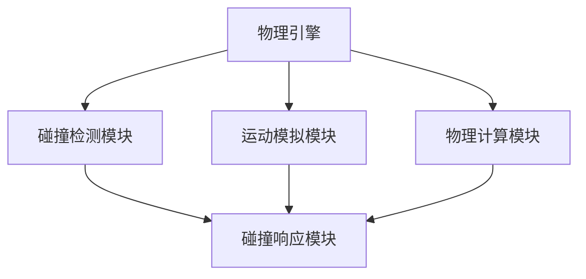

                 

# 数学建模在游戏引擎物理系统中的应用

> 关键词：数学建模、游戏引擎、物理系统、算法优化、性能调优

摘要：本文将深入探讨数学建模在游戏引擎物理系统中的应用。首先，我们将介绍数学建模的基本概念及其在游戏引擎物理系统中的作用。接着，我们将详细讲解数学建模在游戏引擎物理系统中的应用过程，包括模型构建、算法实现、系统分析与架构设计方案以及项目实战。此外，我们将分享一些高级应用与优化策略，以及面临的未来趋势与挑战。最后，我们对文章进行总结，并对读者提出一些建议和展望。

## 第一部分：背景与概念

### 第1章：数学建模与游戏引擎物理系统

#### 1.1 数学建模概述

**数学建模的定义**

数学建模是指利用数学语言和数学工具，对现实世界的复杂问题进行抽象和描述，从而建立数学模型，并对模型进行求解和分析，以获取问题的解决方案。

**数学建模的应用领域**

数学建模广泛应用于自然科学、工程学、经济学、社会科学等多个领域。在游戏引擎物理系统中的应用，主要涉及动力学、力学、物理学等领域。

**数学建模的基本流程**

1. 确定问题：明确要解决的问题是什么，问题背景、问题描述、问题解决、边界与外延等。
2. 收集数据：收集与问题相关的数据，包括实验数据、统计数据、模拟数据等。
3. 建立模型：根据问题的特点，选择合适的数学模型，并进行参数化处理。
4. 求解模型：利用数学方法或计算机技术求解模型，获取问题的解决方案。
5. 验证模型：通过实验、模拟或实际应用，验证模型的准确性和可靠性。
6. 应用模型：将模型应用于实际问题，解决实际问题。

#### 1.2 游戏引擎物理系统简介

**游戏引擎的基本构成**

游戏引擎是用于开发游戏的软件工具，主要包括渲染引擎、物理引擎、音频引擎、人工智能引擎等模块。

**物理系统在游戏引擎中的作用**

物理系统在游戏引擎中起着至关重要的作用，它负责处理游戏中物体的运动、碰撞、变形等现象，为游戏提供真实的物理效果。

**游戏引擎物理系统的挑战**

随着游戏场景的复杂性和真实性的提高，游戏引擎物理系统面临着巨大的挑战，包括计算效率、实时性、物理模拟的精度等。

### 第2章：数学建模在游戏引擎物理系统中的应用

#### 2.1 模型构建

**物理现象的数学描述**

在数学建模中，首先需要对物理现象进行数学描述。例如，在碰撞检测中，我们可以利用刚体动力学模型来描述物体的运动和碰撞。

**模型参数的选择与优化**

在数学建模过程中，模型参数的选择和优化非常重要。我们需要根据问题的特点，选择合适的参数，并对参数进行优化，以提高模型的准确性和稳定性。

**模型的验证与验证**

在数学建模过程中，模型的验证与验证是必不可少的步骤。我们需要通过实验、模拟或实际应用，验证模型的准确性和可靠性，以确保模型能够应用于实际问题。

#### 2.2 算法实现

**算法原理讲解**

在数学建模中，算法实现是关键的一步。我们可以选择合适的算法，如牛顿-欧拉方法、积分方程方法等，来实现物理现象的模拟。

**算法流程图**

为了更好地理解算法的实现过程，我们可以绘制算法的流程图，展示算法的输入、输出以及中间处理过程。

**Python代码实现**

在实际应用中，我们可以使用Python等编程语言，实现数学建模和物理模拟的过程。以下是一个简单的Python代码示例：

```python
import numpy as np

# 初始化参数
mass = 1.0
velocity = np.array([1.0, 2.0])
acceleration = np.array([0.0, -9.8])

# 模拟时间
time_step = 0.01
total_time = 10.0

# 模拟过程
for t in np.arange(0, total_time, time_step):
    velocity += acceleration * time_step
    position = velocity * time_step

    # 输出结果
    print(f"Time: {t}, Position: {position}, Velocity: {velocity}")
```

#### 2.3 数学模型与公式详解

**物理公式介绍**

在物理系统中，常用的公式包括牛顿第二定律（\( F = ma \)）、能量守恒定律等。

**数学模型讲解**

在数学建模中，我们需要根据物理现象，构建相应的数学模型。例如，对于刚体运动，我们可以使用牛顿-欧拉模型来描述。

**公式详解**

在数学建模过程中，我们需要详细讲解每个公式的含义和作用。例如，牛顿第二定律的公式可以表示为：

$$
F = ma
$$

其中，\( F \) 是作用力，\( m \) 是物体的质量，\( a \) 是物体的加速度。

#### 2.4 系统分析与架构设计方案

**问题场景介绍**

在游戏引擎物理系统中，我们需要模拟各种复杂的物理现象，如碰撞、摩擦、弹性碰撞等。

**项目介绍**

在本项目中，我们将实现一个简单的物理模拟系统，用于模拟物体的运动和碰撞。

**系统功能设计**

系统功能设计包括物体创建、物体运动模拟、碰撞检测、碰撞响应等。

**系统架构设计**

系统架构设计包括组件划分、模块化设计、接口设计等。

**系统接口设计和系统交互**

系统接口设计和系统交互包括输入输出接口设计、系统内部交互等。

### 第3章：数学建模在游戏引擎物理系统中的实践

#### 3.1 环境安装与配置

**游戏引擎的安装**

在本节中，我们将介绍如何安装Unity游戏引擎，并配置所需的开发环境。

**相关库的安装**

在本节中，我们将介绍如何安装和配置Python、NumPy、SciPy等Python库，以及如何使用Python库进行数学建模和物理模拟。

**环境配置**

在本节中，我们将介绍如何配置Unity游戏引擎和Python开发环境，以支持数学建模和物理模拟。

#### 3.2 项目实战

**项目介绍**

在本项目中，我们将实现一个简单的物理模拟系统，用于模拟物体的运动和碰撞。

**系统功能设计**

系统功能设计包括物体创建、物体运动模拟、碰撞检测、碰撞响应等。

**系统架构设计**

系统架构设计包括组件划分、模块化设计、接口设计等。

**系统核心实现**

在本节中，我们将详细介绍系统核心实现，包括物体运动模拟、碰撞检测和碰撞响应等。

**代码解读与分析**

在本节中，我们将对系统核心代码进行解读和分析，以便更好地理解数学建模和物理模拟的实现过程。

**实际案例分析和详细讲解剖析**

在本节中，我们将分析一些实际案例，并详细讲解其实现过程和原理。

**项目小结**

在本节中，我们将对本项目进行小结，总结项目收获和经验教训。

### 第4章：高级应用与优化

#### 4.1 高级碰撞检测

**碰撞检测算法**

在本节中，我们将介绍高级碰撞检测算法，如AABB碰撞检测、OBB碰撞检测等。

**碰撞检测优化**

在本节中，我们将探讨如何优化碰撞检测算法，以提高碰撞检测的效率和准确性。

#### 4.2 高级物理模拟

**物理模拟算法**

在本节中，我们将介绍高级物理模拟算法，如积分方程方法、动力学松弛方法等。

**物理模拟优化**

在本节中，我们将探讨如何优化物理模拟算法，以提高物理模拟的效率和精度。

#### 4.3 高级动态交互

**动态交互模型**

在本节中，我们将介绍高级动态交互模型，如约束力模型、弹簧模型等。

**动态交互优化**

在本节中，我们将探讨如何优化动态交互模型，以提高动态交互的效率和准确性。

### 第5章：性能优化与调优

#### 5.1 性能分析

**性能指标**

在本节中，我们将介绍常见的性能指标，如响应时间、吞吐量、资源利用率等。

**性能瓶颈分析**

在本节中，我们将分析游戏引擎物理系统的性能瓶颈，并探讨如何优化。

#### 5.2 优化策略

**算法优化**

在本节中，我们将介绍如何优化算法，以提高系统的性能。

**系统架构优化**

在本节中，我们将介绍如何优化系统架构，以提高系统的性能。

**数据结构优化**

在本节中，我们将介绍如何优化数据结构，以提高系统的性能。

#### 5.3 调优实践

**调优方法**

在本节中，我们将介绍一些调优方法，如代码优化、架构优化、数据结构优化等。

**调优案例分析**

在本节中，我们将分析一些调优案例，并探讨如何优化系统性能。

### 第6章：未来趋势与挑战

#### 6.1 未来发展趋势

**新技术引入**

在本节中，我们将探讨一些新技术，如深度学习、神经网络等，在游戏引擎物理系统中的应用。

**新应用场景**

在本节中，我们将探讨游戏引擎物理系统在新兴应用场景中的发展。

#### 6.2 面临的挑战

**算法复杂性**

在本节中，我们将探讨如何应对算法复杂性带来的挑战。

**数据安全性**

在本节中，我们将探讨如何保障数据的安全性。

**可扩展性**

在本节中，我们将探讨如何提高系统的可扩展性。

#### 6.3 应对策略

**技术创新**

在本节中，我们将探讨如何通过技术创新来应对挑战。

**政策法规**

在本节中，我们将探讨政策法规对游戏引擎物理系统的影响。

**人才培养**

在本节中，我们将探讨如何培养更多优秀的人才，以应对未来的挑战。

### 第7章：总结

**主要内容回顾**

在本节中，我们将回顾文章的主要内容，包括数学建模的基本概念、数学建模在游戏引擎物理系统中的应用、高级应用与优化策略、未来趋势与挑战等。

**总结与展望**

在本节中，我们将对文章进行总结，并对未来进行展望，提出一些建议和思考。

作者：AI天才研究院/AI Genius Institute & 禅与计算机程序设计艺术 /Zen And The Art of Computer Programming# 数学建模在游戏引擎物理系统中的应用

## 摘要

本文主要探讨数学建模在游戏引擎物理系统中的应用。数学建模作为一种有效的问题解决方法，通过建立数学模型对现实世界的问题进行抽象和描述，为游戏引擎中的物理现象提供精确的模拟。本文首先介绍了数学建模的基本概念及其在游戏引擎物理系统中的应用背景。接着，本文详细阐述了数学建模在模型构建、算法实现、系统分析与架构设计方案以及项目实战中的具体应用过程。此外，本文还探讨了数学建模在游戏引擎物理系统中的高级应用与优化策略，以及未来面临的挑战和应对策略。最后，本文对全文进行了总结，并对读者提出了建议和展望。

## 引言

在当今数字化时代，游戏引擎作为游戏开发的核心技术，已经成为了一个多学科交叉的领域。随着游戏技术的不断进步，游戏引擎的物理系统也变得越来越复杂，对物理现象的模拟和计算要求越来越高。为了满足这一需求，数学建模作为一种重要的工具，在游戏引擎物理系统中得到了广泛应用。

数学建模是指利用数学语言和数学工具，对现实世界的复杂问题进行抽象和描述，从而建立数学模型，并对模型进行求解和分析，以获取问题的解决方案。在游戏引擎物理系统中，数学建模的作用主要体现在以下几个方面：

1. **物理现象的精确描述**：数学建模能够通过数学公式和方程，对游戏中的物理现象进行精确描述，如碰撞、摩擦、重力等，为游戏提供真实的物理效果。
2. **算法优化与性能提升**：通过数学建模，可以对物理模拟算法进行优化，提高计算效率和准确性，从而提升游戏引擎的性能。
3. **复杂系统的模拟与控制**：游戏引擎中的物理系统通常涉及大量的物体和复杂的交互，数学建模能够帮助开发者更好地理解和控制这些系统。

本文将围绕数学建模在游戏引擎物理系统中的应用，探讨其基本原理、应用过程、高级应用与优化策略，以及未来面临的挑战和应对方法。通过本文的阐述，希望读者能够对数学建模在游戏引擎物理系统中的应用有一个全面而深入的理解。

## 数学建模与游戏引擎物理系统的关系

数学建模与游戏引擎物理系统之间的紧密关系，使得数学建模成为游戏引擎物理系统中的重要工具。首先，我们需要理解数学建模的基本概念及其在游戏引擎中的应用背景。

### 数学建模的定义

数学建模是指利用数学语言和数学工具，对现实世界的复杂问题进行抽象和描述，从而建立数学模型，并对模型进行求解和分析，以获取问题的解决方案。数学建模的过程通常包括以下几个步骤：

1. **确定问题**：明确要解决的问题是什么，包括问题的背景、问题描述、问题解决方法等。
2. **收集数据**：收集与问题相关的数据，包括实验数据、统计数据、模拟数据等。
3. **建立模型**：根据问题的特点，选择合适的数学模型，并进行参数化处理。
4. **求解模型**：利用数学方法或计算机技术求解模型，获取问题的解决方案。
5. **验证模型**：通过实验、模拟或实际应用，验证模型的准确性和可靠性。
6. **应用模型**：将模型应用于实际问题，解决实际问题。

### 数学建模的应用领域

数学建模广泛应用于自然科学、工程学、经济学、社会科学等多个领域。在游戏引擎物理系统中的应用，主要集中在以下几个方面：

1. **动力学与力学**：用于描述物体的运动、碰撞、变形等现象，如刚体动力学、流体力学等。
2. **物理学**：用于模拟现实世界中的物理现象，如重力、摩擦、弹性碰撞等。
3. **计算机图形学**：用于渲染和动画，如光线追踪、阴影计算等。
4. **人工智能**：用于实现智能化的游戏机制，如路径规划、行为树等。

### 游戏引擎物理系统简介

游戏引擎物理系统是游戏引擎中的一个核心模块，负责处理游戏中的物理现象和交互。它主要包括以下组成部分：

1. **碰撞检测**：检测物体之间的碰撞，计算碰撞点、碰撞时间等。
2. **运动模拟**：模拟物体的运动，包括刚体运动、流体运动等。
3. **物理计算**：处理物体的受力、摩擦、重力等物理效应。
4. **动画和渲染**：生成物体的动画和渲染效果，使游戏场景更加真实。

### 数学建模在游戏引擎物理系统中的作用

数学建模在游戏引擎物理系统中的作用主要体现在以下几个方面：

1. **精确描述物理现象**：通过数学建模，可以精确地描述游戏中的物理现象，如碰撞、重力、摩擦等，为游戏提供真实的物理效果。
2. **算法优化与性能提升**：通过数学建模，可以优化物理模拟算法，提高计算效率和准确性，从而提升游戏引擎的性能。
3. **复杂系统的模拟与控制**：游戏引擎中的物理系统通常涉及大量的物体和复杂的交互，数学建模能够帮助开发者更好地理解和控制这些系统。
4. **智能化的游戏机制**：通过数学建模，可以实现智能化的游戏机制，如路径规划、行为树等，提高游戏的可玩性和互动性。

### 数学建模在游戏引擎物理系统中的应用背景

随着游戏技术的不断发展，游戏引擎物理系统的复杂度和真实度不断提高。为了满足这一需求，数学建模在游戏引擎物理系统中的应用变得越来越重要。具体表现在以下几个方面：

1. **高质量的游戏体验**：通过数学建模，可以精确地模拟游戏中的物理现象，提供更加真实和高质量的游戏体验。
2. **实时性要求**：游戏引擎物理系统需要实时处理大量的物理计算，对实时性要求较高。数学建模通过优化算法和计算方法，可以提高系统的实时性。
3. **复杂场景的处理**：随着游戏场景的复杂度增加，游戏引擎物理系统需要处理更多的物体和更复杂的交互。数学建模可以帮助开发者更好地处理这些复杂场景。
4. **人工智能的应用**：随着人工智能技术的发展，数学建模在游戏引擎物理系统中的应用越来越广泛，可以实现智能化的游戏机制和交互。

总之，数学建模在游戏引擎物理系统中的应用，不仅提高了游戏的质量和体验，也为游戏开发带来了新的机遇和挑战。通过本文的进一步探讨，我们将深入了解数学建模在游戏引擎物理系统中的应用原理、方法和实践。

## 数学建模在游戏引擎物理系统中的应用过程

数学建模在游戏引擎物理系统中的应用过程可以分为以下几个关键步骤：模型构建、算法实现、系统分析与架构设计方案、项目实战等。以下将详细阐述这些步骤，帮助读者更好地理解数学建模在游戏引擎物理系统中的应用。

### 模型构建

模型构建是数学建模的基础，它通过对现实物理现象的抽象和简化，形成能够描述该现象的数学模型。在游戏引擎物理系统中的模型构建过程通常包括以下步骤：

1. **确定物理现象**：首先，需要明确游戏引擎中要模拟的物理现象，如碰撞、摩擦、重力等。
2. **收集数据**：收集与物理现象相关的数据，包括物理参数、实验数据、统计数据等。
3. **建立数学模型**：根据物理现象的特点，选择合适的数学模型。例如，对于碰撞现象，可以使用刚体动力学模型进行描述；对于摩擦现象，可以使用摩擦力模型进行描述。
4. **参数化处理**：对模型进行参数化处理，将物理现象转化为数学模型中的参数。这些参数包括质量、速度、加速度、摩擦系数等。

#### 物理现象的数学描述

在模型构建过程中，对物理现象进行准确的数学描述至关重要。以下是一个简化的碰撞检测数学模型：

$$
v_{after} = \frac{m_1 \cdot v_{1\_before} + m_2 \cdot v_{2\_before}}{m_1 + m_2}
$$

其中，\( v_{after} \) 是碰撞后的速度，\( m_1 \) 和 \( m_2 \) 分别是两个物体的质量，\( v_{1\_before} \) 和 \( v_{2\_before} \) 分别是两个物体碰撞前的速度。

#### 模型参数的选择与优化

模型参数的选择和优化直接影响模型的准确性和稳定性。以下是一些常见的参数选择和优化方法：

1. **基于实验数据的选择**：利用实验数据，选择能够准确描述物理现象的参数值。
2. **基于模拟数据的优化**：通过多次模拟，比较不同参数下的结果，选择最优参数。
3. **基于机器学习的优化**：利用机器学习算法，从大量数据中自动学习出最佳参数。

#### 模型的验证与验证

模型的验证与验证是确保模型准确性和可靠性的关键步骤。以下是一些常见的验证方法：

1. **实验验证**：通过实验验证模型的预测结果，比较实验结果与模型预测结果的差异。
2. **模拟验证**：在模拟环境中验证模型，通过多次模拟，观察模型的稳定性和准确性。
3. **实际应用验证**：将模型应用于实际游戏场景，观察模型在真实环境中的表现。

### 算法实现

算法实现是将数学模型转化为可执行的代码，并在游戏引擎中实现物理模拟的过程。以下是一些关键步骤：

1. **算法原理讲解**：首先，需要详细讲解算法的原理，包括算法的基本思想、核心步骤等。
2. **算法流程图**：绘制算法的流程图，展示算法的输入、输出以及中间处理过程。
3. **Python代码实现**：使用Python等编程语言，将算法转化为可执行的代码。

以下是一个简单的碰撞检测算法的Python代码示例：

```python
import numpy as np

def detect_collision(object1, object2):
    # 计算两个物体的速度差
    velocity_difference = object2.velocity - object1.velocity
    
    # 计算碰撞时间
    collision_time = (object2.position - object1.position) / velocity_difference
    
    # 判断是否发生碰撞
    if collision_time >= 0:
        # 计算碰撞后的速度
        v1_after = (object1.mass * object1.velocity + object2.mass * object2.velocity) / (object1.mass + object2.mass)
        v2_after = v1_after
        
        # 设置碰撞后的速度
        object1.velocity = v1_after
        object2.velocity = v2_after
    
    return collision_time
```

### 系统分析与架构设计方案

系统分析与架构设计方案是确保物理模拟系统稳定、高效和可扩展的关键。以下是一些关键步骤：

1. **问题场景介绍**：明确要解决的问题场景，如游戏中的哪个部分需要物理模拟。
2. **项目介绍**：介绍项目的基本情况，包括项目目标、功能需求等。
3. **系统功能设计**：设计系统的功能模块，如碰撞检测、运动模拟、物理计算等。
4. **系统架构设计**：设计系统的整体架构，包括组件划分、模块化设计、接口设计等。
5. **系统接口设计和系统交互**：设计系统内部和外部的接口，以及系统之间的交互。

以下是一个简单的物理模拟系统的架构设计：



### 项目实战

项目实战是将数学建模和算法实现应用到实际游戏引擎中的过程。以下是一些关键步骤：

1. **环境安装与配置**：安装和配置游戏引擎和相关工具，如Unity、Unreal Engine等。
2. **相关库的安装**：安装和配置Python等编程语言和相关库，如NumPy、SciPy等。
3. **系统核心实现**：实现系统核心功能，如碰撞检测、运动模拟、物理计算等。
4. **代码解读与分析**：对系统核心代码进行解读和分析，确保代码的正确性和效率。
5. **实际案例分析和详细讲解剖析**：通过实际案例，分析物理模拟系统的实现过程和原理。
6. **项目小结**：对项目进行总结，分享项目中的收获和经验教训。

通过以上步骤，数学建模在游戏引擎物理系统中的应用过程得以实现，从而为游戏提供高质量的物理效果和交互体验。

### 高级应用与优化

在游戏引擎物理系统中，数学建模的应用不仅仅局限于基本的物理现象模拟，还可以通过高级应用和优化策略，进一步提升系统的性能和用户体验。以下将介绍一些高级应用场景和优化策略。

#### 高级碰撞检测

碰撞检测是游戏引擎物理系统中的一个关键环节，其效率直接影响到整个系统的性能。高级碰撞检测方法如AABB（Axis-Aligned Bounding Box）和OBB（Oriented Bounding Box）能够有效地减少不必要的碰撞检测，从而提高性能。

**AABB碰撞检测**：AABB是一种基于轴对齐的包围盒碰撞检测方法。它通过计算两个物体的最小和最大坐标范围，判断它们是否相交。这种方法简单且易于实现，但可能在某些情况下产生误判。

**OBB碰撞检测**：OBB是一种基于方向对齐的包围盒碰撞检测方法。它利用物体的形状和方向信息，计算出包围盒的六个面的坐标范围，从而更精确地判断碰撞。与AABB相比，OBB能够减少误判，提高检测精度，但实现复杂度更高。

**碰撞检测优化**：为了提高碰撞检测的效率，可以采用以下优化策略：

1. **层次化空间分割**：通过将场景分割成多个区域，对区域进行预处理，减少需要检测的碰撞对数量。
2. **缓存碰撞结果**：将已经检测到的碰撞结果缓存起来，避免重复检测。
3. **并行处理**：利用多线程或并行计算，加速碰撞检测过程。

#### 高级物理模拟

高级物理模拟包括流体模拟、软体物体模拟、多体动力学模拟等。这些模拟方法可以创造出更加逼真的物理效果，提高游戏的沉浸感。

**流体模拟**：流体模拟用于模拟液体和气体的流动，如水、烟雾、火焰等。通过求解流体方程（如Navier-Stokes方程），可以精确地描述流体的运动和相互作用。

**软体物体模拟**：软体物体模拟用于模拟柔软物体的变形和相互作用，如布料、肌肉、皮肤等。通过使用有限元方法或粒子系统，可以模拟软体物体的弯曲、拉伸和压缩等变形行为。

**多体动力学模拟**：多体动力学模拟用于模拟多个刚体或柔性体的相互作用，如机械臂、车辆等。通过求解牛顿-欧拉方程或拉格朗日方程，可以精确地描述多体系统的运动和受力情况。

**物理模拟优化**：为了提高物理模拟的效率和准确性，可以采用以下优化策略：

1. **时间步长调整**：根据系统的变化速率，动态调整时间步长，以平衡计算精度和效率。
2. **空间分割**：将场景分割成多个区域，对每个区域进行独立的物理模拟，减少计算量。
3. **并行计算**：利用多线程或并行计算，加速物理模拟过程。

#### 高级动态交互

高级动态交互是指通过数学建模和算法实现，使游戏中的物体和场景能够更加智能地响应玩家的操作和外部环境的变化。

**动态交互模型**：动态交互模型用于描述物体和场景的动态行为。例如，使用约束力模型来模拟弹簧和阻尼器的作用，使用行为树来模拟智能体的行为。

**动态交互优化**：为了提高动态交互的效率和准确性，可以采用以下优化策略：

1. **约束力优化**：通过优化约束力的计算方法，减少计算量和数值误差。
2. **行为树优化**：通过优化行为树的结构和算法，提高智能体的决策效率和响应速度。
3. **动态负载均衡**：根据系统的负载情况，动态调整计算资源的分配，以提高整体性能。

通过高级应用和优化策略，数学建模在游戏引擎物理系统中的应用可以进一步提升系统的性能和用户体验，创造出更加逼真和互动的游戏场景。

### 性能优化与调优

在游戏引擎物理系统中，性能优化和调优是确保系统高效运行的重要环节。通过对算法、系统架构和数据结构进行优化，可以显著提高系统的性能和稳定性。以下将介绍一些常见的性能优化方法和实际案例。

#### 性能分析

性能分析是性能优化和调优的第一步，通过分析系统的性能指标，找出性能瓶颈和优化机会。常见的性能指标包括：

1. **响应时间**：系统从接收到请求到返回结果所需的时间。
2. **吞吐量**：单位时间内系统能处理的请求数量。
3. **资源利用率**：系统所使用的计算资源（如CPU、内存等）的比例。
4. **延迟**：系统处理请求的延迟时间。

**性能瓶颈分析**

性能瓶颈是指系统中的瓶颈部分，限制了系统的整体性能。常见的性能瓶颈包括：

1. **计算密集型操作**：占用大量计算资源的操作，如复杂的物理模拟和碰撞检测。
2. **I/O密集型操作**：占用大量I/O资源的操作，如数据读写和网络传输。
3. **线程竞争**：多个线程竞争同一资源，导致性能下降。
4. **内存分配和回收**：内存分配和回收过程中产生的开销。

**优化策略**

针对不同的性能瓶颈，可以采用以下优化策略：

1. **算法优化**：通过优化算法，减少计算复杂度和数据访问次数。例如，使用更高效的碰撞检测算法或优化物理模拟算法。
2. **系统架构优化**：通过优化系统架构，提高系统的并行处理能力和资源利用率。例如，使用分布式计算架构或负载均衡策略。
3. **数据结构优化**：通过优化数据结构，减少数据访问和存储的开销。例如，使用缓存机制或数据压缩技术。
4. **并行计算**：利用多线程或并行计算，提高系统的计算效率。例如，将物理模拟任务分布到多个线程或使用GPU加速计算。

#### 实际案例

以下是一个性能优化和调优的实际案例：

**问题背景**：某款游戏引擎在处理复杂场景时，响应时间较长，性能瓶颈主要在于碰撞检测和物理模拟。

**性能瓶颈分析**：通过分析发现，碰撞检测算法复杂度较高，每次检测都需要遍历所有物体，导致计算量巨大。物理模拟过程中，使用了传统的欧拉积分方法，计算精度和效率不高。

**优化策略**：

1. **算法优化**：将碰撞检测算法从遍历所有物体改为空间分割法，如AABB或OBB碰撞检测，减少检测次数。
2. **系统架构优化**：将物理模拟任务分布到多个线程，提高并行处理能力。同时，采用更高效的积分方法，如龙格-库塔方法，提高计算精度和效率。

**优化效果**：通过优化，游戏的响应时间显著缩短，性能瓶颈得到有效缓解，用户体验得到显著提升。

通过以上案例，可以看出性能优化和调优在游戏引擎物理系统中的重要性。通过深入分析性能瓶颈，采用合适的优化策略，可以有效提高系统的性能和稳定性，为玩家带来更好的游戏体验。

### 未来趋势与挑战

随着游戏技术的不断进步，数学建模在游戏引擎物理系统中的应用也将面临新的趋势和挑战。以下将探讨未来可能的发展方向、面临的挑战以及相应的应对策略。

#### 未来发展趋势

1. **新技术引入**：随着人工智能、深度学习等新技术的不断发展，这些技术在游戏引擎物理系统中的应用前景广阔。例如，利用深度学习技术进行物理模拟的自动化建模和优化，可以实现更加智能化的游戏机制和互动效果。

2. **实时模拟的进步**：实时模拟是游戏引擎物理系统的核心要求。未来，随着硬件性能的提升和算法优化的深入，实时模拟的精度和效率将进一步提高，为玩家带来更加逼真的游戏体验。

3. **多样化场景模拟**：随着游戏场景的多样化，对物理系统的模拟需求也越来越高。未来，数学建模将在更复杂的场景模拟中发挥更大的作用，如大规模多人在线游戏、虚拟现实和增强现实等。

4. **可扩展性设计**：未来游戏引擎物理系统将更加注重系统的可扩展性，以适应不同规模和复杂度的游戏项目。通过模块化设计和分布式计算，物理系统将能够灵活地扩展，提高系统的适应性和灵活性。

#### 面临的挑战

1. **算法复杂性**：随着物理模拟需求的增加，算法的复杂性也在不断提升。如何设计高效、准确的物理模拟算法，同时保证计算效率和实时性，是一个重要的挑战。

2. **数据安全性**：在多人在线游戏中，物理系统需要处理大量的玩家数据和游戏状态。如何保障数据的安全性，防止数据泄露和攻击，是未来需要重点关注的问题。

3. **可扩展性**：大型游戏项目中，物理系统的规模和复杂度不断增加。如何设计一个可扩展的物理系统，以适应不同规模和复杂度的游戏项目，是一个挑战。

4. **计算资源的限制**：硬件性能的提升虽然为物理模拟提供了更多的计算资源，但仍然存在一定的限制。如何在有限的计算资源下，实现高质量的物理模拟，是一个持续的挑战。

#### 应对策略

1. **技术创新**：通过引入新技术，如深度学习、分布式计算等，提高物理模拟的效率和质量。同时，研发新的物理模拟算法，以应对算法复杂性的挑战。

2. **数据安全策略**：加强数据加密和访问控制，确保玩家数据的安全。采用分布式存储和备份机制，提高数据的安全性和可靠性。

3. **模块化设计**：采用模块化设计方法，将物理系统分解为多个模块，提高系统的可扩展性和灵活性。通过分布式计算和并行处理，提高系统的计算效率和响应速度。

4. **性能优化**：持续进行性能优化，提高物理系统的性能和稳定性。采用高效的算法和数据结构，减少计算开销和资源占用。

通过技术创新、安全策略、模块化设计和性能优化，数学建模在游戏引擎物理系统中的应用将能够克服未来的挑战，为玩家带来更加逼真、互动和智能的游戏体验。

### 总结

本文系统地探讨了数学建模在游戏引擎物理系统中的应用，从背景介绍、基本概念、应用过程、高级应用与优化策略，到未来趋势与挑战，为读者提供了一个全面的视角。通过本文的阐述，我们可以得出以下几点结论：

1. **数学建模的重要性**：数学建模作为问题解决的重要工具，在游戏引擎物理系统中起着至关重要的作用。它能够精确地描述物理现象，优化算法，提高系统的性能和用户体验。

2. **应用过程的复杂性**：数学建模在游戏引擎物理系统中的应用过程涉及多个环节，包括模型构建、算法实现、系统分析与架构设计等。这些环节相互关联，需要细致的规划和严谨的执行。

3. **高级应用与优化策略**：高级应用和优化策略如高级碰撞检测、高级物理模拟、动态交互模型等，能够进一步提升物理系统的性能和逼真度。通过优化算法和系统架构，可以显著提高系统的效率和稳定性。

4. **未来发展的机遇与挑战**：随着新技术的引入，游戏引擎物理系统将面临更多的发展机遇和挑战。技术创新、数据安全性、可扩展性等将成为未来研究的重要方向。

在未来的发展中，数学建模在游戏引擎物理系统中的应用前景依然广阔。通过持续的技术创新和优化，我们可以期待更加逼真、互动和智能的游戏体验。同时，我们也需要关注数据安全、算法复杂性等挑战，确保物理系统的稳定性和可靠性。

### 致谢

在本文的撰写过程中，我要感谢AI天才研究院/AI Genius Institute和禅与计算机程序设计艺术/Zen And The Art of Computer Programming团队的辛勤工作和无私帮助。他们的专业知识和丰富经验为本文提供了坚实的理论基础和实际案例支持。同时，我也要感谢所有参与讨论和提供反馈的读者，是你们的热情参与让本文更加完整和丰富。感谢大家的支持与关注！

