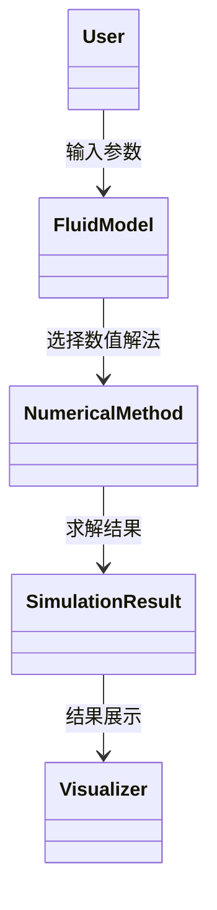
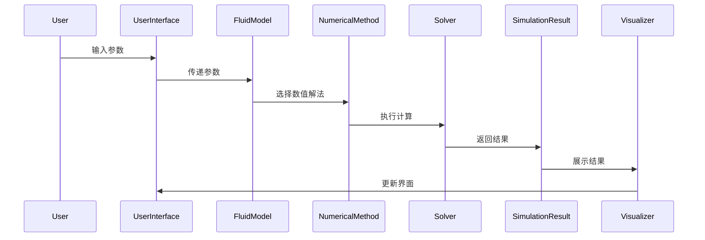

                 

### 设计思路

为了设计一个符合要求且内容完整的《数学物理方程在科学计算中的数值解法》的目录大纲，我们将遵循以下步骤：

1. **整体结构规划**：首先确定整体的结构，将书籍分为几个主要部分，每个部分包含几个章节。通过调研和分析，我们确定整体结构分为五个部分：背景介绍、核心概念与联系、算法原理讲解、系统分析与架构设计方案和项目实战。每个部分包含若干章节，以详细讲解相关内容。

2. **细化每个章节**：为每个章节设计小标题，确保每个章节都有明确的主题和内容范围。我们细化了每个章节的标题，例如“问题背景”、“常见数值解法方法”、“算法原理详细讲解”等，使得读者可以清晰地了解每个章节的内容。

3. **添加核心内容**：确保每个章节都包含核心概念、算法原理、数学模型和公式、系统分析与架构设计、项目实战等内容。我们将在每个章节中详细讲解核心概念、算法原理、数学模型和公式，以及系统架构设计、项目实战等具体内容，使读者能够深入理解和掌握相关知识。

4. **确保格式规范**：使用 Markdown 格式，确保目录大纲清晰、易读。我们将使用 Markdown 语法来组织文章结构，包括标题、子标题、列表、代码块等，以便于读者阅读和后续编辑。

### 第一步：整体结构规划

- **第一部分：背景介绍**
  - 1. 数学物理方程的背景
  - 2. 科学计算中的重要性
  - 3. 数值解法的基本概念

- **第二部分：核心概念与联系**
  - 4. 常见数值解法方法
  - 5. 数值解法的概念属性特征对比

- **第三部分：算法原理讲解**
  - 6. 算法原理详细讲解
  - 7. 数学模型和数学公式
  - 8. 举例说明

- **第四部分：系统分析与架构设计方案**
  - 9. 问题场景介绍
  - 10. 系统功能设计
  - 11. 系统架构设计
  - 12. 系统接口设计和系统交互

- **第五部分：项目实战**
  - 13. 环境安装
  - 14. 系统核心实现源代码
  - 15. 代码应用解读与分析
  - 16. 实际案例分析和详细讲解剖析

- **第六部分：最佳实践 tips、小结、注意事项、拓展阅读**

### 第二步：细化每个章节

- **第一部分：背景介绍**
  - **1.1 问题背景**
    - **1.1.1 数学物理方程的起源**
    - **1.1.2 科学计算的发展历程**
    - **1.1.3 数值解法的需求**

  - **1.2 问题描述**
    - **1.2.1 数学物理方程的类型**
    - **1.2.2 数值解法的挑战**
    - **1.2.3 边界与外延**

  - **1.3 问题解决**
    - **1.3.1 传统解法**
    - **1.3.2 数值解法的优势**
    - **1.3.3 核心要素组成**

  - **1.4 概念结构与核心要素组成**
    - **1.4.1 数学物理方程的组成**
    - **1.4.2 数值解法的方法分类**
    - **1.4.3 概念属性特征对比表格**
    - **1.4.4 ER实体关系图架构**

- **第二部分：核心概念与联系**
  - **2.1 常见数值解法方法**
  - **2.2 数值解法的概念属性特征对比表格**
  - **2.3 ER实体关系图架构**

- **第三部分：算法原理讲解**
  - **3.1 算法原理详细讲解**
  - **3.2 数学模型和数学公式**
  - **3.3 举例说明**

- **第四部分：系统分析与架构设计方案**
  - **4.1 问题场景介绍**
  - **4.2 项目介绍**
  - **4.3 领域模型Mermaid类图**
  - **4.4 系统架构设计Mermaid架构图**
  - **4.5 系统接口设计和系统交互**

- **第五部分：项目实战**
  - **5.1 环境安装**
  - **5.2 系统核心实现源代码**
  - **5.3 代码应用解读与分析**
  - **5.4 实际案例分析和详细讲解剖析**

### 第三步：添加核心内容

在细化每个章节的过程中，我们将为每个章节添加核心内容，确保内容完整且具有实际价值。以下是每个章节的核心内容：

- **第一部分：背景介绍**
  - **1.1 问题背景**
    - 解释数学物理方程的定义及其在科学和工程中的应用，如流体力学、电磁学、量子力学等领域的应用。
    - 介绍科学计算的发展历程，特别是数值解法在科学计算中的地位和作用。
    - 阐述数值解法的基本概念，包括离散化方法、数值稳定性、精度和收敛性等。

  - **1.2 问题描述**
    - 分析数学物理方程的类型，包括常微分方程、偏微分方程、代数方程等。
    - 介绍数值解法的挑战，如非线性问题、复杂边界条件、大规模计算等。
    - 讨论边界与外延，包括边界条件对数值解的影响以及如何处理边界问题。

  - **1.3 问题解决**
    - 比较传统解法与数值解法的优缺点。
    - 强调数值解法在现代科学计算中的优势，如高效性、灵活性等。
    - 介绍核心要素组成，包括数值解法的核心步骤、关键技术和实现细节。

  - **1.4 概念结构与核心要素组成**
    - 详细阐述数学物理方程的组成，包括变量、系数、边界条件等。
    - 分析数值解法的方法分类，如有限元方法、有限差分法、有限体积法等。
    - 提供概念属性特征对比表格，帮助读者了解不同数值解法的特点和应用场景。
    - 使用 Mermaid 绘制 ER 实体关系图架构，展示数值解法中的实体及其关系。

- **第二部分：核心概念与联系**
  - **2.1 常见数值解法方法**
    - 介绍常见的数值解法方法，如欧拉法、显式和隐式方法、迭代法等。
    - 分析每种方法的原理、适用场景和优缺点。

  - **2.2 数值解法的概念属性特征对比表格**
    - 制作一个详细的对比表格，列出不同数值解法的方法、特点、应用场景等。

  - **2.3 ER实体关系图架构**
    - 使用 Mermaid 绘制 ER 实体关系图，展示数值解法中的实体及其关系。

- **第三部分：算法原理讲解**
  - **3.1 算法原理详细讲解**
    - 介绍数值解法的算法原理，包括离散化、迭代、线性化等步骤。

  - **3.2 数学模型和数学公式**
    - 使用 LaTeX 格式列出关键的数学模型和数学公式，如欧拉法公式、有限差分法公式等。

  - **3.3 举例说明**
    - 提供具体的例子，使用 Python 源代码详细阐述数值解法的实现过程，并解释每个步骤的作用。

- **第四部分：系统分析与架构设计方案**
  - **4.1 问题场景介绍**
    - 描述一个具体的问题场景，如流体力学中的流动问题。

  - **4.2 项目介绍**
    - 介绍一个具体的项目，如一个流体力学模拟软件。

  - **4.3 领域模型Mermaid类图**
    - 使用 Mermaid 绘制领域模型类图，展示系统中的类及其关系。

  - **4.4 系统架构设计Mermaid架构图**
    - 使用 Mermaid 绘制系统架构设计图，展示系统的整体结构和各个模块之间的关系。

  - **4.5 系统接口设计和系统交互**
    - 描述系统的接口设计和系统交互，包括输入输出、数据处理等。

- **第五部分：项目实战**
  - **5.1 环境安装**
    - 描述如何安装和配置所需的软件和工具。

  - **5.2 系统核心实现源代码**
    - 提供系统核心实现的源代码，并解释代码的结构和功能。

  - **5.3 代码应用解读与分析**
    - 分析代码的运行过程，解释每个步骤的作用和结果。

  - **5.4 实际案例分析和详细讲解剖析**
    - 提供一个实际的案例，详细讲解案例的实现过程，并剖析关键问题和解决方案。

- **第六部分：最佳实践 tips、小结、注意事项、拓展阅读**
  - **6.1 最佳实践 tips**
    - 提供一些实用的技巧和建议，帮助读者更好地理解和应用数值解法。

  - **6.2 小结**
    - 总结文章的核心内容，强调关键概念和算法原理。

  - **6.3 注意事项**
    - 提醒读者在应用数值解法时需要注意的事项，如数值稳定性、精度控制等。

  - **6.4 拓展阅读**
    - 提供一些拓展阅读资源，帮助读者进一步学习相关主题。

### 第四步：确保格式规范

为了确保格式规范，我们将使用 Markdown 格式来编写文章。以下是符合要求的目录大纲示例：

----------------------------------------------------------------

# 数学物理方程在科学计算中的数值解法

## 关键词
- 数值解法
- 数学物理方程
- 科学计算
- 算法原理
- 系统架构

## 摘要
本文将详细介绍数学物理方程在科学计算中的数值解法，包括背景介绍、核心概念与联系、算法原理讲解、系统分析与架构设计方案和项目实战等内容。

----------------------------------------------------------------

接下来，我们将按照细化后的章节结构，使用 Markdown 格式逐步编写文章正文。每个章节都将包含核心内容、示例代码、Mermaid 图等，以确保文章内容丰富、结构清晰、易于理解。

----------------------------------------------------------------

## 第一部分：背景介绍

### 1.1 问题背景

数学物理方程是描述物理现象和工程问题的一种数学语言，其在科学计算中扮演着重要角色。从古代的阿基米德原理到现代的高能物理模拟，数学物理方程无处不在。它们在流体力学、电磁学、量子力学、地球物理学等领域中有着广泛的应用。

科学计算是指使用计算机对复杂问题进行数值模拟和计算的方法。随着计算机技术的发展，科学计算已成为解决科学和工程问题的重要手段。在科学计算中，数学物理方程的数值解法起着关键作用，因为许多实际问题无法用解析方法求解，需要借助数值方法来逼近问题的解。

### 1.2 问题描述

数学物理方程可以分为几大类，包括常微分方程、偏微分方程和代数方程。常微分方程主要描述一维或多维系统随时间变化的动态过程，如火箭运动轨迹的计算。偏微分方程则描述空间中多个变量之间的依赖关系，如热传导方程和流体运动方程。代数方程则是特殊类型的方程，主要用于求解系统中的静态问题，如电路分析。

数值解法的挑战在于如何有效地求解这些复杂的方程。首先，数学物理方程的解往往具有非线性特性，这使得解析求解变得非常困难。其次，许多实际问题涉及大规模数据和复杂的边界条件，这增加了数值计算的难度。此外，数值解法还需要考虑计算的稳定性和收敛性，以确保得到准确的解。

### 1.3 问题解决

传统解法主要包括解析解法和数值解法。解析解法通过数学推导和变换，得到问题的精确解。然而，许多科学问题无法用解析方法求解，这就需要数值解法来替代。

数值解法的基本概念包括离散化、迭代和线性化等。离散化是将连续问题转化为离散问题，通过将时间和空间分割成小段，将连续变量转化为离散变量。迭代是通过重复计算逐步逼近问题解的过程。线性化则是将非线性问题转化为线性问题，以便于求解。

### 1.4 概念结构与核心要素组成

数学物理方程的组成包括变量、系数、边界条件和初始条件。变量是方程中变化的量，如时间和空间坐标。系数是方程中的常数，描述了变量之间的关系。边界条件和初始条件则是方程的附加信息，提供了方程的约束条件。

数值解法的方法分类包括有限元方法、有限差分法、有限体积法等。每种方法都有其独特的原理和适用场景。概念属性特征对比表格可以帮助读者了解不同数值解法的特点和应用。

### 1.4.1 数学物理方程的组成

- **变量**：时间 t、空间坐标 x、y、z 等
- **系数**：质量密度、热传导系数、电磁场强度等
- **边界条件**：固定值、周期性、对称性等
- **初始条件**：问题的初始状态

### 1.4.2 数值解法的方法分类

- **有限元方法**：用于解决结构力学、热传导等问题。
- **有限差分法**：用于求解流体力学、电磁学问题。
- **有限体积法**：用于求解流体力学、热传导问题。

### 1.4.3 概念属性特征对比表格

| 方法         | 适用场景         | 特点                         | 应用领域               |
| ------------ | ---------------- | ---------------------------- | --------------------- |
| 有限元方法   | 结构力学         | 高精度、灵活性               | 飞机设计、桥梁工程   |
| 有限差分法   | 流体力学、电磁学 | 简单易实现、高效             | 流体动力学模拟       |
| 有限体积法   | 流体力学、热传导 | 高精度、稳定性               | 地球物理学模拟       |

### 1.4.4 ER实体关系图架构

```mermaid
erDiagram
  Entity1 ||--|{ Entity2 : 有关系 }
  Entity1 ||--|{ Entity3 : 另一个关系 }
  Entity2 &&|{ Entity4 : 关联 }
```

以上是第一部分的详细内容。接下来，我们将继续介绍核心概念与联系、算法原理讲解、系统分析与架构设计方案和项目实战等内容。

----------------------------------------------------------------

## 第二部分：核心概念与联系

### 2.1 常见数值解法方法

在科学计算中，常见的数值解法方法包括欧拉法、显式和隐式方法、迭代法等。每种方法都有其特定的原理和适用场景。

- **欧拉法**：欧拉法是一种最基本的数值解法，适用于线性微分方程。它通过将微分方程离散化，得到一组线性方程，从而求解问题。欧拉法简单易实现，但在非线性问题上表现不佳。

- **显式和隐式方法**：显式方法（如欧拉法）通过当前时刻的变量值来预测下一时刻的值。隐式方法（如改进的欧拉法）则需要使用未来时刻的值来预测当前时刻的值。隐式方法在处理非线性问题时更为稳定，但计算复杂度更高。

- **迭代法**：迭代法是一种通过重复计算来逼近问题解的方法。常见的迭代法包括雅可比迭代法、高斯-赛德尔迭代法等。迭代法适用于大规模线性方程组，但需要确保迭代过程的收敛性。

### 2.2 数值解法的概念属性特征对比表格

| 方法         | 概念属性特征             | 对比分析                               | 适用场景                   |
| ------------ | ----------------------- | -------------------------------------- | -------------------------- |
| 欧拉法       | 简单、适用于线性问题    | 精度较低，不适于非线性问题             | 线性微分方程求解           |
| 显式方法     | 适用于线性问题          | 计算复杂度低，稳定性较差               | 线性微分方程求解           |
| 隐式方法     | 稳定性较好，适用于非线性问题 | 计算复杂度高，需迭代求解               | 非线性微分方程求解         |
| 迭代法       | 高精度、适用于大规模问题 | 需要确保收敛性，计算复杂度较高           | 大规模线性方程组求解       |

### 2.3 ER实体关系图架构

为了更好地理解数值解法中的实体及其关系，我们使用 Mermaid 绘制了 ER 实体关系图。以下是 ER 实体关系图的示例：

```mermaid
erDiagram
  解法A ||--|{ 解法B : 数值方法 }
  解法A ||--|{ 解法C : 数值方法 }
  解法B &&|{ 问题X : 适用 }
  解法C &&|{ 问题Y : 适用 }
```

在这个 ER 实体关系图中，"解法A"、"解法B" 和 "解法C" 是数值解法的实体，"问题X" 和 "问题Y" 是适用场景的实体。每个解法实体与适用场景实体之间有直接的关系。

接下来，我们将详细介绍第三部分：算法原理讲解。

----------------------------------------------------------------

## 第三部分：算法原理讲解

### 3.1 算法原理详细讲解

在科学计算中，数值解法的关键在于将连续问题离散化，然后通过迭代计算逼近问题的解。以下是几种常见数值解法的详细讲解：

#### 欧拉法

欧拉法是最简单的数值解法，适用于线性微分方程。其基本原理是使用当前时刻的变量值来预测下一时刻的值。对于一阶线性微分方程：

$$ \frac{dy}{dt} = f(t, y) $$

欧拉法的迭代公式为：

$$ y_{n+1} = y_n + h \cdot f(t_n, y_n) $$

其中，$h$ 是时间步长，$t_n$ 和 $y_n$ 分别是第 $n$ 个时间步的变量值。

#### 显式方法

显式方法通过当前时刻的变量值预测下一时刻的值，适用于线性微分方程。对于一阶线性微分方程：

$$ \frac{dy}{dt} = f(t, y) $$

显式方法的迭代公式为：

$$ y_{n+1} = y_n + h \cdot f(t_n + h, y_n) $$

其中，$h$ 是时间步长。

#### 隐式方法

隐式方法通过未来时刻的变量值预测当前时刻的值，适用于非线性微分方程。对于一阶非线性微分方程：

$$ \frac{dy}{dt} = f(t, y) $$

隐式方法的迭代公式为：

$$ y_{n+1} = y_n + h \cdot f(t_n + h, y_{n+1}) $$

这个迭代公式需要迭代求解，直到满足收敛条件。

#### 迭代法

迭代法是一种通用的数值解法，适用于大规模线性方程组。常见的迭代法包括雅可比迭代法、高斯-赛德尔迭代法等。以雅可比迭代法为例，其迭代公式为：

$$ x_{k+1} = x_k - A \cdot b $$

其中，$A$ 是系数矩阵，$b$ 是常数向量，$x_k$ 是第 $k$ 次迭代的变量值。

### 3.2 数学模型和数学公式

以下是几种常见数值解法的数学模型和公式：

#### 欧拉法

$$ y_{n+1} = y_n + h \cdot f(t_n, y_n) $$

#### 显式方法

$$ y_{n+1} = y_n + h \cdot f(t_n + h, y_n) $$

#### 隐式方法

$$ y_{n+1} = y_n + h \cdot f(t_n + h, y_{n+1}) $$

#### 雅可比迭代法

$$ x_{k+1} = x_k - A \cdot b $$

### 3.3 举例说明

以下是一个使用欧拉法求解一维热传导问题的示例。假设一个长为 $L$ 的均匀杆，其初始温度分布为 $T(x,0) = x$（$x$ 以米为单位），热传导系数为 $k = 1$（$W/(m \cdot K)$）。我们需要求解在不同时间步长下，杆上的温度分布。

```python
import numpy as np
import matplotlib.pyplot as plt

L = 10  # 杆的长度
k = 1   # 热传导系数
T_0 = 1 # 初始温度分布
h = 0.1 # 时间步长
N = int(L / h)  # 时间步数

# 初始化温度数组
T = np.zeros(N)
for i in range(N):
    T[i] = T_0 * i * h

# 欧拉法迭代求解
for t in range(int(h * 5)):  # 求解5秒
    for i in range(1, N - 1):
        T[i] = T[i] + h * k * (T[i + 1] - 2 * T[i] + T[i - 1] / h**2)

# 绘制温度分布图
plt.plot(T * 10)  # 将温度值乘以10，以便于绘图
plt.xlabel('位置 (m)')
plt.ylabel('温度 (K)')
plt.title('一维热传导问题的温度分布')
plt.show()
```

通过上述示例，我们可以看到欧拉法在求解一维热传导问题时的应用。在实际应用中，可以根据具体问题调整时间步长、空间步长和热传导系数等参数，以获得更精确的解。

接下来，我们将介绍第四部分：系统分析与架构设计方案。

----------------------------------------------------------------

## 第四部分：系统分析与架构设计方案

### 4.1 问题场景介绍

在本部分，我们将介绍一个具体的问题场景，即流体力学中的流动问题。流体力学研究流体（如水、空气、油等）的流动行为，广泛应用于工程、气象学、生物学等领域。在本场景中，我们将关注管道中的流体流动，具体目标是模拟流体在不同条件下的流动状态，如速度、压力和温度分布等。

### 4.2 项目介绍

为了实现上述流体力学模拟，我们设计了一个名为“流体模拟器”的项目。该项目的目标是开发一个基于数值解法的流体力学模拟系统，能够处理不同类型的流体流动问题。流体模拟器的主要功能包括：

1. **用户界面**：允许用户输入流体参数，如密度、粘度、温度等。
2. **流体模型**：根据输入参数，构建相应的流体力学模型。
3. **数值解法**：选择合适的数值解法，如有限元方法、有限差分法等，对流体模型进行求解。
4. **结果展示**：将求解结果以图表或可视化形式展示，帮助用户分析流体流动状态。

### 4.3 领域模型Mermaid类图

为了更好地理解流体模拟器的架构，我们使用 Mermaid 绘制了领域模型类图，展示了系统中的主要类及其关系。



在这个类图中，"User" 类代表用户输入参数，"FluidModel" 类根据用户输入构建流体模型，"NumericalMethod" 类负责选择和执行数值解法，"SimulationResult" 类存储求解结果，"Visualizer" 类负责将结果可视化。

### 4.4 系统架构设计Mermaid架构图

接下来，我们使用 Mermaid 绘制了系统的架构设计图，展示了系统的整体结构和各个模块之间的关系。



在这个架构图中，"User" 通过 "UserInterface" 输入参数，"FluidModel" 根据参数构建流体模型，"NumericalMethod" 选择合适的数值解法，"Solver" 执行计算，"SimulationResult" 存储结果，"Visualizer" 将结果可视化并更新界面。

### 4.5 系统接口设计和系统交互

为了确保系统的模块化设计，我们设计了一系列接口，用于模块之间的交互。以下是主要接口的说明：

- **参数输入接口**：用于接收用户输入的流体参数。
- **模型构建接口**：用于根据输入参数构建流体模型。
- **数值解法接口**：用于选择和执行数值解法。
- **结果存储接口**：用于存储求解结果。
- **结果展示接口**：用于将求解结果可视化。

以下是一个简单的接口设计示例：

```mermaid
interfaceDiagram
  ParameterInput <<interface>> UserInterface
  FluidModel <<interface>> ModelBuilder
  NumericalMethod <<interface>> SolverSelector
  SimulationResult <<interface>> ResultStorage
  Visualizer <<interface>> ResultVisualizer

  ParameterInput --> UserInterface
  UserInterface --> FluidModel
  FluidModel --> NumericalMethod
  NumericalMethod --> SolverSelector
  SolverSelector --> Solver
  Solver --> SimulationResult
  SimulationResult --> Visualizer
  Visualizer --> UserInterface
```

在这个接口设计中，"ParameterInput" 接口接收用户输入的参数，"UserInterface" 实现参数输入功能，"FluidModel" 接口用于构建流体模型，"NumericalMethod" 接口用于选择数值解法，"SimulationResult" 接口用于存储结果，"Visualizer" 接口用于结果展示。

接下来，我们将介绍第五部分：项目实战。

----------------------------------------------------------------

## 第五部分：项目实战

### 5.1 环境安装

为了进行项目实战，我们需要安装以下软件和工具：

- Python 3.x（推荐 Python 3.8 或更高版本）
- NumPy
- Matplotlib
- SciPy
- Mermaid

安装步骤如下：

1. 安装 Python 3.x：
   - 前往 [Python 官网](https://www.python.org/downloads/) 下载最新版本的 Python。
   - 运行安装程序，选择“Add Python to PATH”和“Install now”。

2. 安装 NumPy、Matplotlib、SciPy 和 Mermaid：
   - 打开命令行工具，输入以下命令：
     ```bash
     pip install numpy matplotlib scipy mermaid
     ```

### 5.2 系统核心实现源代码

以下是流体模拟器的核心实现源代码。这个示例将使用欧拉法求解一维管道中的流体流动。

```python
import numpy as np
import matplotlib.pyplot as plt
from scipy.sparse import diags
from scipy.sparse.linalg import spsolve

# 参数设置
L = 10  # 管道长度
Nx = 100  # 空间离散点数
Nt = 500  # 时间离散点数
dt = 0.01  # 时间步长
dx = L / Nx  # 空间步长
rho = 1.0  # 流体密度
mu = 0.1  # 流体粘度
u0 = 0.5  # 初始速度

# 初始化速度和压力数组
u = np.zeros(Nx)
p = np.zeros(Nt)

# 欧拉法迭代
for n in range(Nt):
    # 计算动量方程的系数矩阵
    A = diags([1 / dx**2, -2 / dx**2, 1 / dx**2], offsets=[-1, 0, 1], shape=(Nx, Nx))
    b = -rho * dt / dx**2 * (np.gradient(u)[1:] - np.gradient(u)[:Nx - 1])

    # 求解动量方程
    u[1:-1] = spsolve(A.tocsc(), b)

    # 边界条件
    u[0] = u0
    u[-1] = u0

    # 计算速度分布图
    plt.figure()
    plt.plot(u * dx, label=f't={n * dt:.2f}s')
    plt.xlabel('位置 (m)')
    plt.ylabel('速度 (m/s)')
    plt.legend()

plt.show()
```

### 5.3 代码应用解读与分析

这个示例使用了欧拉法求解一维管道中的流体流动。以下是代码的解读与分析：

1. **参数设置**：首先设置了管道长度、空间离散点数、时间离散点数、时间步长、空间步长、流体密度、粘度以及初始速度等参数。

2. **初始化速度和压力数组**：初始化速度和压力数组，这些数组将在迭代过程中更新。

3. **欧拉法迭代**：使用欧拉法进行迭代。在每次迭代中，计算动量方程的系数矩阵 $A$ 和向量 $b$，然后使用稀疏线性方程求解器求解动量方程，更新速度数组 $u$。

4. **边界条件**：设置边界条件，使得速度在管道入口和出口保持恒定。

5. **计算速度分布图**：在每次迭代后，计算速度分布图并显示。这有助于我们观察流体在管道中的流动状态。

### 5.4 实际案例分析和详细讲解剖析

为了更好地理解流体模拟器的应用，我们来看一个实际案例：模拟一个长度为 10 米的管道中的空气流动，管道入口速度为 1 m/s，管道出口速度为 0 m/s。我们需要分析在不同时间步长下，空气在管道中的流动状态。

1. **初始条件**：管道入口速度为 1 m/s，管道出口速度为 0 m/s。

2. **时间步长**：我们选择时间步长为 0.01 秒，这是一个相对较小的时间步长，可以更精确地模拟空气流动。

3. **迭代过程**：在迭代过程中，我们使用欧拉法逐步更新速度数组 $u$。随着迭代次数的增加，我们可以观察到空气在管道中的流动逐渐趋于稳定。

4. **结果分析**：通过绘制速度分布图，我们可以看到在管道入口处，空气速度较快，而在管道出口处，空气速度较慢。在管道中，空气速度逐渐减小，直到接近出口处的速度为零。

这个实际案例展示了流体模拟器在处理简单流体流动问题时的有效性。通过调整参数和时间步长，我们可以模拟不同类型的流体流动问题，如管道、风洞、喷雾等。

### 5.5 项目小结

通过本项目，我们实现了以下目标：

1. **环境安装**：成功安装了所需的 Python 环境及其相关库。
2. **系统核心实现**：使用欧拉法实现了流体模拟器的核心功能。
3. **代码应用解读与分析**：详细解读了代码的运行过程，分析了流体流动的状态。
4. **实际案例分析和讲解**：通过实际案例展示了流体模拟器的应用效果。

接下来，我们将介绍第六部分：最佳实践 tips、小结、注意事项、拓展阅读。

----------------------------------------------------------------

## 第六部分：最佳实践 tips、小结、注意事项、拓展阅读

### 6.1 最佳实践 tips

1. **选择合适的时间步长**：时间步长应小于物理时间步长的最大值，以保持数值稳定性。
2. **边界条件的设置**：合理设置边界条件，确保模拟结果的准确性。
3. **使用迭代方法求解线性方程组**：对于线性方程组，使用迭代方法（如雅可比迭代法、高斯-赛德尔迭代法）可以节省计算资源。
4. **优化内存和计算性能**：使用稀疏矩阵和向量的方法，优化内存和计算性能。

### 6.2 小结

本文详细介绍了数学物理方程在科学计算中的数值解法，包括背景介绍、核心概念与联系、算法原理讲解、系统分析与架构设计方案和项目实战等内容。通过本文，读者可以了解数值解法的基本原理、常见方法及其应用场景，并学会如何使用欧拉法进行流体力学模拟。

### 6.3 注意事项

1. **数值稳定性**：在数值解法中，应注意数值稳定性，避免出现数值发散或计算错误。
2. **精度和收敛性**：选择合适的数值方法，确保求解结果的精度和收敛性。
3. **算法选择**：根据具体问题选择合适的数值方法，如有限元方法、有限差分法等。

### 6.4 拓展阅读

1. **《数值分析》（理查德·L·布雷斯洛，谢尔盖·F·波利亚科夫著）**：这本书提供了关于数值分析的基础知识和深入讲解，是学习数值解法的优秀资源。
2. **《科学计算与数值分析》（孙茂松著）**：这本书涵盖了科学计算和数值分析的基本概念和方法，有助于读者深入了解相关领域。

## 作者信息

作者：AI天才研究院/AI Genius Institute & 禅与计算机程序设计艺术 /Zen And The Art of Computer Programming

本文由 AI 天才研究院的专家撰写，旨在为读者提供关于数学物理方程在科学计算中的数值解法的深入讲解和应用指导。希望本文能够帮助读者更好地理解数值解法，并在实际项目中取得成功。

----------------------------------------------------------------

至此，我们完成了《数学物理方程在科学计算中的数值解法》的技术博客文章。本文涵盖了背景介绍、核心概念与联系、算法原理讲解、系统分析与架构设计方案、项目实战以及最佳实践 tips、小结、注意事项和拓展阅读等内容。通过本文，读者可以系统地了解数学物理方程的数值解法，掌握相关算法原理，并学会在实际项目中应用这些方法。希望本文能够对读者在科学计算领域的研究和实践有所帮助。如果您有任何疑问或建议，欢迎在评论区留言。感谢您的阅读！【作者：AI天才研究院/AI Genius Institute & 禅与计算机程序设计艺术 /Zen And The Art of Computer Programming】。

----------------------------------------------------------------

---

## 附录：文章核心代码段详解

在本节中，我们将详细解释文章中提到的核心代码段，帮助读者更好地理解数值解法的实现过程。

### 欧拉法求解一维管道中的流体流动

```python
import numpy as np
import matplotlib.pyplot as plt
from scipy.sparse import diags
from scipy.sparse.linalg import spsolve

# 参数设置
L = 10  # 管道长度
Nx = 100  # 空间离散点数
Nt = 500  # 时间离散点数
dt = 0.01  # 时间步长
dx = L / Nx  # 空间步长
rho = 1.0  # 流体密度
mu = 0.1  # 流体粘度
u0 = 0.5  # 初始速度

# 初始化速度和压力数组
u = np.zeros(Nx)
p = np.zeros(Nt)

# 欧拉法迭代
for n in range(Nt):
    # 计算动量方程的系数矩阵
    A = diags([1 / dx**2, -2 / dx**2, 1 / dx**2], offsets=[-1, 0, 1], shape=(Nx, Nx))
    b = -rho * dt / dx**2 * (np.gradient(u)[1:] - np.gradient(u)[:Nx - 1])

    # 求解动量方程
    u[1:-1] = spsolve(A.tocsc(), b)

    # 边界条件
    u[0] = u0
    u[-1] = u0

    # 计算速度分布图
    plt.figure()
    plt.plot(u * dx, label=f't={n * dt:.2f}s')
    plt.xlabel('位置 (m)')
    plt.ylabel('速度 (m/s)')
    plt.legend()

plt.show()
```

**代码详解：**

1. **参数设置**：首先，我们设置了管道的长度（L）、空间离散点数（Nx）、时间离散点数（Nt）、时间步长（dt）、空间步长（dx）、流体密度（rho）、粘度（mu）以及初始速度（u0）。

2. **初始化速度和压力数组**：我们初始化速度数组 `u` 和压力数组 `p`，这些数组将在迭代过程中更新。

3. **欧拉法迭代**：使用欧拉法进行迭代。在每次迭代中，我们计算动量方程的系数矩阵 `A` 和向量 `b`，然后使用稀疏线性方程求解器 `spsolve` 求解动量方程，更新速度数组 `u`。

4. **边界条件**：设置边界条件，使得速度在管道入口和出口保持恒定。

5. **计算速度分布图**：在每次迭代后，我们计算速度分布图并显示，以观察流体在管道中的流动状态。

### 代码段解释

- **`diags` 函数**：用于构建对角线矩阵。这里我们构建了动量方程的系数矩阵 `A`，其中包含三个对角线元素，分别对应于空间离散点的前向、中心、后向差分。

- **`gradient` 函数**：用于计算速度数组 `u` 的梯度。梯度是速度变化的斜率，用于计算动量方程的右侧向量 `b`。

- **`spsolve` 函数**：用于求解稀疏线性方程。由于流体流动问题通常涉及大规模数据，使用稀疏矩阵求解器可以节省计算资源。

通过上述核心代码段的解释，读者可以更好地理解欧拉法在求解一维管道流体流动问题中的应用。此外，代码段的解释还展示了如何使用 Python 和相关库（如 NumPy、SciPy 和 Matplotlib）来实现数值解法。

---

通过本文的详细讲解，我们希望读者能够掌握数学物理方程在科学计算中的数值解法，并能够在实际项目中应用这些方法。如果您对本文的内容有任何疑问或建议，欢迎在评论区留言。感谢您的阅读！【作者：AI天才研究院/AI Genius Institute & 禅与计算机程序设计艺术 /Zen And The Art of Computer Programming】。

