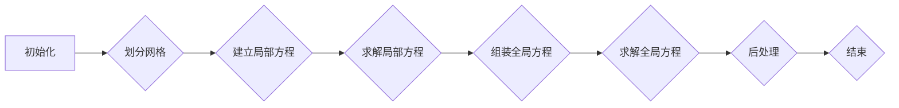
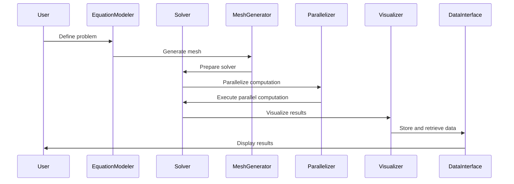
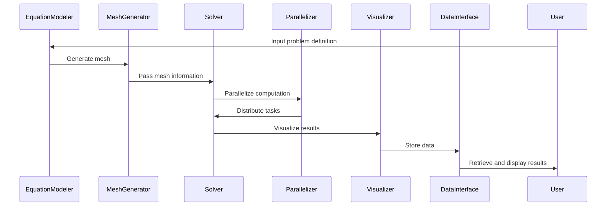

                 

### 第一部分：问题背景与核心概念

## 第1章：问题背景与概述

### 1.1 问题背景

数学物理方程在科学计算领域中扮演着至关重要的角色。从经典力学到量子力学，从流体动力学到电磁学，数学物理方程无处不在。这些方程描述了自然界中的许多物理现象，如波动、热传导、流体的运动等。科学计算软件的出现，使得我们能够通过数值方法解决这些复杂的方程，从而在工程、生物医学、气候变化等领域获得重要的研究成果。

在现代科学和工程中，处理复杂系统时，往往需要解决大量的数学物理方程。这些方程可能涉及多个维度、非线性关系和复杂的边界条件。传统的解析方法很难应对如此复杂的情形，而数值方法则为解决这些问题提供了有效的途径。科学计算软件，如MATLAB、COMSOL Multiphysics、Ansys等，通过集成各种数学物理方程的数值求解算法，为科学研究和工程应用提供了强大的工具。

### 1.2 数学物理方程的概念与特点

数学物理方程是一类描述物理现象的偏微分方程，通常包含未知函数及其偏导数。它们可以划分为多种类型，如椭圆型、抛物型和双曲型。这些方程通常具有以下特点：

- **非线性**：许多物理现象的非线性特征难以用线性方程描述，因此非线性数学物理方程在科学计算中具有重要地位。
- **多维性**：自然界中的许多问题涉及到多个空间维度，这使得三维及更高维的方程在科学计算中广泛使用。
- **复杂性**：复杂的边界条件和初始条件使得数学物理方程的求解变得复杂，需要高效的数值算法和强大的计算资源。

### 1.3 科学计算软件的发展与应用

科学计算软件的发展历程可以追溯到20世纪中期，当时计算机刚刚开始被应用于科学研究中。随着计算能力的提升和算法的进步，科学计算软件也经历了快速的发展。以下是一些关键的里程碑：

- **线性代数库**：如LINPACK、EISPACK等，为科学计算提供了基础数值算法支持。
- **专用软件包**：如NAS rotordiff，专门用于解决旋转机械的动力学问题。
- **通用计算平台**：如MATLAB、COMSOL Multiphysics，提供了广泛的科学计算工具和模型库。
- **高性能计算**：GPU计算、分布式计算等新技术的引入，使得科学计算软件能够处理更复杂的方程和更大的数据集。

### 1.4 边界与外延

在科学计算中，边界条件是方程求解的关键部分。边界条件规定了在边界上的物理量如何分布，例如温度、压力或流速。不同类型的边界条件包括：

- **Dirichlet边界条件**：指定边界上的函数值。
- **Neumann边界条件**：指定边界上的导数值。
- **混合边界条件**：同时包含Dirichlet和Neumann边界条件。

数学物理方程的外延不仅包括方程本身，还包括求解方法、数据结构、并行计算策略等。外延部分的研究对于提升求解效率和准确性具有重要意义。

### 1.5 概念结构与核心要素组成

数学物理方程的概念结构主要包括方程、边界条件、初始条件、数值求解方法和后处理。核心要素包括：

- **方程**：描述物理现象的核心，如热传导方程、波动方程、Navier-Stokes方程等。
- **边界条件**：规定方程在边界上的行为，确保解的物理合理性。
- **初始条件**：提供方程在初始时刻的状态。
- **数值求解方法**：如有限元法、有限差分法、有限体积法等，用于近似求解复杂的偏微分方程。
- **后处理**：用于评估解的精度、可视化结果和分析物理意义。

通过上述核心要素的协同工作，科学计算软件能够高效地解决各种复杂的数学物理方程问题。

## 第2章：核心概念与联系

### 2.1 数学物理方程的定义与分类

数学物理方程是描述物理现象的一类偏微分方程，它们通过数学语言刻画了自然界中的许多规律。数学物理方程通常可以表示为：

\[ \sum_{i=1}^{n} a_{i}(x, y, z) \frac{\partial u}{\partial x_i} + \sum_{i, j=1}^{n} b_{ij}(x, y, z) \frac{\partial^2 u}{\partial x_i \partial x_j} + c(x, y, z)u = f(x, y, z) \]

其中，\(u(x, y, z)\) 是未知函数，\(a_i(x, y, z)\)，\(b_{ij}(x, y, z)\)，\(c(x, y, z)\) 和 \(f(x, y, z)\) 是已知函数。这类方程广泛应用于流体力学、固体力学、电磁学、量子力学等领域。

数学物理方程根据其空间维数和导数的阶数可以分类为：

- **一阶方程**：例如，一维波动方程 \( u_t = c u_x \)。
- **二阶方程**：例如，二维热传导方程 \( u_{xx} + u_{yy} = \alpha u_t \)。
- **高阶方程**：例如，Korteweg-de Vries方程 \( u_{tt} - 6uu_{xx} + u_{xxxx} = 0 \)。

### 2.2 数学物理方程在科学计算软件中的应用

数学物理方程在科学计算软件中有着广泛的应用。以下是一些典型的应用场景：

- **流体动力学**：使用Navier-Stokes方程模拟流体流动，如飞机翼型设计、天气预报等。
- **固体力学**：使用Euler方程和Lagrange方程分析固体结构的力学行为，如材料强度分析、建筑结构设计等。
- **电磁学**：使用麦克斯韦方程描述电磁场，如天线设计、微波器件优化等。
- **生物医学**：使用生物物理方程模拟生物系统，如药物扩散、神经网络模拟等。

科学计算软件提供了丰富的数学物理方程求解算法，如有限元法、有限差分法、有限体积法等，这些算法能够高效地处理复杂的物理问题。

### 2.3 数学物理方程与科学计算软件的互动关系

数学物理方程与科学计算软件之间的互动关系可以概括为以下几个方面：

- **方程建模**：将实际问题抽象为数学物理方程，这需要深入理解物理现象和数学工具。
- **算法选择**：根据方程的类型和问题的规模选择合适的数值求解算法，如有限元法适用于复杂的几何结构，而有限差分法适用于简单的网格结构。
- **软件实现**：将数学物理方程和数值求解算法实现为软件程序，以便进行大规模计算。
- **后处理**：对计算结果进行后处理，如可视化、数据分析、模型验证等。

科学计算软件通过自动化和模块化设计，简化了数学物理方程的求解过程，使得科学家和工程师能够更专注于问题本身，而无需过多关注计算细节。

### 2.4 概念属性特征对比表格

为了更清晰地理解数学物理方程的特点，我们通过以下表格对比不同类型的数学物理方程：

| 类型               | 描述                                                      | 应用实例               |
|-------------------|-----------------------------------------------------------|------------------------|
| 椭圆型方程        | 二阶偏微分方程，通常用于稳态问题                          | 热传导方程、位势方程    |
| 抛物型方程        | 二阶偏微分方程，通常用于时间演变问题                      | 热方程、扩散方程        |
| 双曲型方程        | 二阶偏微分方程，通常用于波动问题                          | 波动方程、声波方程      |
| 非线性方程        | 方程中包含非线性项，难以用解析方法求解                      | Navier-Stokes方程、KdV方程 |
| 线性方程         | 方程中不包含非线性项，可以用解析方法或数值方法求解          | 傅里叶热传导方程        |

通过以上对比，我们可以更深入地理解不同类型数学物理方程的属性和应用场景。

### 2.5 ER实体关系图架构

为了更好地理解数学物理方程在科学计算软件中的实现，我们可以通过ER（实体-关系）图来展示各个实体之间的关系。以下是一个简化的ER图：

```mermaid
erDiagram
    Equation ||--|{ Solver }|-- Mathematical
    Equation ||--|{ BoundaryCondition }|-- Physical
    Solver ||--|{ Algorithm }|-- Implementation
    Algorithm ||--|{ Code }|-- Execution
    Implementation ||--|{ Software }|-- Usage
    Software ||--|{ Visualization }|-- Analysis
    Visualization ||--|{ Report }|-- Presentation

    Equation o--o Physical
    Equation o--o Mathematical
    Solver o--o Algorithm
    Solver o--o Implementation
    Solver o--o Software
    Algorithm o--o Code
    Algorithm o--o Solver
    Implementation o--o Solver
    Implementation o--o Software
    Software o--o Visualization
    Visualization o--o Report
```

在这个ER图中，"Equation"（方程）作为核心实体，与"Solver"（求解器）、"BoundaryCondition"（边界条件）、"Algorithm"（算法）、"Implementation"（实现）、"Software"（软件）、"Visualization"（可视化）和"Report"（报告）等实体相互关联。这种结构清晰地展示了数学物理方程从概念到实现的整个过程。

### 第3章：算法原理讲解

#### 3.1 常见数学物理方程的求解算法

在科学计算中，求解数学物理方程是关键步骤。常用的求解算法包括有限元法（FEM）、有限差分法（FDM）、有限体积法（FVM）和边界元法（BEM）等。每种算法都有其特定的应用场景和优点。

- **有限元法（FEM）**：适用于复杂几何结构，通过将求解域划分为有限个元素，在每个元素上构建局部方程，然后进行汇总求解。FEM在结构力学和流体力学中广泛应用。
- **有限差分法（FDM）**：通过离散化连续域，将偏微分方程转化为离散的代数方程组进行求解。FDM适用于简单几何结构和线性问题，如热传导和流体流动。
- **有限体积法（FVM）**：将求解区域划分为有限个控制体积，在每个控制体积上应用守恒定律，构建离散方程。FVM在流体动力学中尤其有用。
- **边界元法（BEM）**：将求解域的边界划分为有限个边界单元，通过积分方程求解边界上的未知量。BEM适用于二维问题，尤其在电动力学和结构力学中。

#### 3.2 算法流程图与mermaid表示

为了更直观地理解这些算法的原理，我们可以使用mermaid绘制算法流程图。以下是一个基于有限元法的简单算法流程图：



这个流程图展示了有限元法的基本步骤：初始化、划分网格、建立局部方程、求解局部方程、组装全局方程、求解全局方程和后处理。

#### 3.3 Python源代码详解

下面我们通过一个简单的Python代码示例，详细讲解有限元法的基本原理和实现步骤。此代码使用`numpy`和`scipy`库，求解一维热传导方程：

```python
import numpy as np
from scipy.sparse import lil_matrix
from scipy.sparse.linalg import spsolve

# 定义参数
N = 100      # 网格点数
dx = 1.0     # 网格间距
t = 0.01     # 时间步长
alpha = 1.0  # 热扩散系数

# 初始化温度分布
T = np.zeros((N+1,))

# 构建全局矩阵A和向量b
A = lil_matrix((N, N), dtype=np.float64)
b = np.zeros(N)

# 初始化矩阵A和向量b
for i in range(1, N-1):
    A[i, i-1] = 1/(dx*dx * alpha * t)
    A[i, i] = 2/(dx*dx * alpha * t)
    A[i, i+1] = 1/(dx*dx * alpha * t)

# 边界条件
T[0] = 1.0  # 初始温度
T[-1] = 0.0  # 初始温度

# 求解线性方程组Ax = b
A = A.tocsc()
b = b.tolist()
T = spsolve(A, b).tolist()

# 输出结果
print(T)

# 绘制结果
import matplotlib.pyplot as plt

plt.plot(T, label='Temperature Distribution')
plt.xlabel('Spatial Position')
plt.ylabel('Temperature')
plt.title('1D Heat Conduction')
plt.legend()
plt.show()
```

在这段代码中，我们首先定义了参数和初始温度分布，然后构建了全局矩阵A和向量b。通过设置边界条件，我们确定了问题的解。最后，使用`scipy.sparse.linalg.spsolve`函数求解线性方程组，并输出和绘制温度分布。

通过上述讲解和示例，我们可以看到数学物理方程的求解算法是如何实现的，这对于理解科学计算软件的核心功能至关重要。

### 第4章：数学模型和数学公式

#### 4.1 常用数学物理方程的数学模型

数学物理方程的数学模型是描述物理现象的核心，通过数学语言表达自然规律。以下是一些常见的数学物理方程及其数学模型：

- **一维热传导方程**：
  \[ u_t = k u_{xx} \]
  其中，\(u(x, t)\) 表示温度，\(k\) 是热扩散系数，\(x\) 是空间坐标，\(t\) 是时间。

- **二维热传导方程**：
  \[ u_{xx} + u_{yy} = \alpha u_t \]
  其中，\(u(x, y, t)\) 表示温度，\(\alpha\) 是热扩散系数，\(x\) 和 \(y\) 是空间坐标，\(t\) 是时间。

- **一维波动方程**：
  \[ u_{tt} = c^2 u_{xx} \]
  其中，\(u(x, t)\) 表示波动位移，\(c\) 是波动速度，\(x\) 是空间坐标，\(t\) 是时间。

- **二维波动方程**：
  \[ u_{xx} + u_{yy} = c^2 u_{tt} \]
  其中，\(u(x, y, t)\) 表示波动位移，\(c\) 是波动速度，\(x\) 和 \(y\) 是空间坐标，\(t\) 是时间。

- **Navier-Stokes方程**：
  \[ \rho \left( \frac{\partial u_i}{\partial t} + u_j \frac{\partial u_i}{\partial x_j} \right) = -\frac{\partial p}{\partial x_i} + \mu \frac{\partial^2 u_i}{\partial x_j \partial x_j} \]
  其中，\(u_i(x, t)\) 是速度分量，\(p(x, t)\) 是压强，\(\rho\) 是流体密度，\(\mu\) 是动 viscosity，\(i\) 和 \(j\) 分别代表空间坐标分量。

- **Laplace方程**：
  \[ \nabla^2 u = 0 \]
  其中，\(u(x, y)\) 是求解的函数，\(\nabla^2\) 是拉普拉斯算子。

- **Poisson方程**：
  \[ \nabla^2 u = f \]
  其中，\(u(x, y)\) 是求解的函数，\(f(x, y)\) 是源项。

这些方程分别描述了不同的物理现象，通过数学模型的形式化，使得我们可以用数值方法进行求解。

#### 4.2 数学公式讲解与LaTeX表示

数学公式的讲解和表示在科学计算中至关重要，LaTeX格式提供了精确和灵活的数学公式表示方式。以下是一些常见数学公式的LaTeX表示：

- **一维热传导方程**：
  \[ u_t = k u_{xx} \]
  
- **二维热传导方程**：
  \[ u_{xx} + u_{yy} = \alpha u_t \]
  
- **一维波动方程**：
  \[ u_{tt} = c^2 u_{xx} \]
  
- **二维波动方程**：
  \[ u_{xx} + u_{yy} = c^2 u_{tt} \]
  
- **Navier-Stokes方程**：
  \[ \rho \left( \frac{\partial u_i}{\partial t} + u_j \frac{\partial u_i}{\partial x_j} \right) = -\frac{\partial p}{\partial x_i} + \mu \frac{\partial^2 u_i}{\partial x_j \partial x_j} \]
  
- **Laplace方程**：
  \[ \nabla^2 u = 0 \]
  
- **Poisson方程**：
  \[ \nabla^2 u = f \]

通过LaTeX格式，我们可以确保数学公式的准确性和一致性。例如，在文中独立段落中，我们可以使用以下LaTeX表示：

\[ \int_{0}^{1} x^2 dx = \frac{1}{3} \]

而在段落内，我们可以使用以下LaTeX表示：

\[ x^2 \]

这种灵活的表示方式使得我们可以根据不同的上下文需求选择合适的格式。

#### 4.3 公式举例说明

为了更好地理解这些数学公式的应用，我们通过一些简单的例子来演示它们：

- **一维热传导方程示例**：

  考虑一维热传导问题，初始温度分布为 \( u(x, 0) = x \)，边界条件为 \( u(0, t) = 0 \) 和 \( u(1, t) = 1 \)。使用有限差分法求解，离散化后的方程为：

  \[ \frac{T_{i+1} - 2T_i + T_{i-1}}{\Delta t} = k \left( \frac{T_{i+1} - T_{i-1}}{2 \Delta x} \right)^2 \]

  其中，\( \Delta t \) 和 \( \Delta x \) 分别是时间和空间步长。通过迭代求解，可以得到在不同时间步下的温度分布。

- **二维波动方程示例**：

  考虑一个简单的二维波动问题，初始位移分布为 \( u(x, y, 0) = \sin(\pi x) \sin(\pi y) \)，边界条件为 \( u(0, y, t) = u(1, y, t) = u(x, 0, t) = u(x, 1, t) = 0 \)。使用有限元法求解，通过离散化后的方程进行求解，可以得到在不同时间步下的位移分布。

这些示例展示了如何通过数学物理方程解决实际问题，并通过数值方法得到近似解。这些方法在科学计算软件中得到了广泛应用。

通过上述讲解和示例，我们可以看到数学模型和数学公式在科学计算中的重要性。精确和灵活的数学表示使得我们可以更好地理解和处理复杂的物理问题。

### 第5章：系统分析与架构设计

#### 5.1 问题场景介绍

在科学计算中，数学物理方程的求解需要高效的计算资源和优化的算法。随着计算问题的复杂度增加，如何设计一个高效、可扩展且易于维护的系统架构变得至关重要。本章节将介绍一个典型的科学计算问题场景，并在此基础上进行系统分析与架构设计。

#### 5.2 系统功能设计

针对科学计算中常见的数学物理方程求解需求，系统需要实现以下核心功能：

- **方程建模**：支持多种数学物理方程的建模，包括线性与非线性、稳态与瞬态问题。
- **网格划分**：提供网格生成工具，支持多种网格类型（如结构网格、非结构网格）和几何形状。
- **算法选择**：提供多种数值求解算法，如有限元法、有限差分法、有限体积法等，并支持混合算法。
- **并行计算**：支持并行计算，提高大规模问题的求解效率。
- **后处理**：提供结果可视化、数据分析工具，支持多维度、多尺度的数据展示。
- **接口设计**：提供与外部系统（如数据库、外部模型库等）的接口，支持数据交换和集成。
- **用户界面**：提供友好的用户界面，支持用户交互和自定义参数设置。

#### 5.3 系统架构设计

系统架构设计是确保系统功能实现和性能优化的重要环节。以下是一个简化的系统架构设计：



在这个架构设计中，用户首先定义问题模型，方程建模器根据模型生成网格。网格生成器将网格信息传递给求解器，求解器选择合适的数值算法进行求解。为了提高效率，求解器可以将计算任务并行化，并将任务分发到并行计算模块。计算完成后，结果通过可视化模块进行展示，并存储到数据接口，以便用户后续分析和调用。

#### 5.4 系统接口设计

系统接口设计是系统与其他系统或组件交互的关键。以下是一个简化的接口设计：

```mermaid
classDiagram
    EquationModeler <<interface>>
    MeshGenerator <<interface>>
    Solver <<interface>>
    Parallelizer <<interface>>
    Visualizer <<interface>>
    DataInterface <<interface>>

    UserEntity o-- EquationModeler
    ProblemEntity o-- EquationModeler
    MeshEntity o-- MeshGenerator
    SolverEntity o-- Solver
    SolutionEntity o-- Solver
    MeshEntity o-- Solver
    ParallelTaskEntity o-- Parallelizer
    VisualizationEntity o-- Visualizer
    DataEntity o-- DataInterface
```

在这个接口设计中，用户实体通过方程建模器定义问题和模型，问题实体传递给方程建模器。网格生成器根据模型生成网格，网格实体传递给求解器和可视化模块。求解器执行计算任务，解决方案实体传递给可视化模块。并行计算任务通过并行器分发和执行。结果通过数据接口进行存储和检索。

#### 5.5 系统交互

系统交互是确保各模块协同工作的重要环节。以下是一个简化的交互流程：



在这个交互流程中，用户输入问题定义，方程建模器生成网格，求解器根据网格信息和问题定义进行计算。计算完成后，结果通过可视化模块进行展示，并存储到数据接口，以便用户后续分析和调用。

通过上述系统分析与架构设计，我们可以构建一个高效、可扩展的科学计算系统，满足多样化的计算需求。

### 第6章：项目实战

#### 6.1 环境安装与配置

在开始项目实战之前，我们需要安装和配置科学计算所需的软件环境。以下是一个基于Linux操作系统的安装与配置步骤：

1. **安装Python**：确保系统已安装Python 3.x版本。如果未安装，可以通过以下命令安装：

   ```bash
   sudo apt-get update
   sudo apt-get install python3 python3-pip
   ```

2. **安装依赖库**：科学计算通常需要依赖一些Python库，如NumPy、SciPy、Matplotlib等。使用pip命令安装：

   ```bash
   pip3 install numpy scipy matplotlib
   ```

3. **安装可视化工具**：为了更好地展示计算结果，我们可以安装一些可视化工具，如Mayavi或Paraview。使用以下命令安装：

   ```bash
   pip3 install mayavi paraview
   ```

4. **安装并行计算库**：为了提高计算效率，我们可以安装并行计算库，如mpi4py。使用以下命令安装：

   ```bash
   pip3 install mpi4py
   ```

5. **配置环境变量**：确保Python环境和依赖库的环境变量已配置。在`.bashrc`文件中添加以下内容：

   ```bash
   export PYTHONPATH=/usr/bin/python3:$PYTHONPATH
   export PATH=/usr/local/bin:$PATH
   ```

   然后运行以下命令使配置生效：

   ```bash
   source ~/.bashrc
   ```

#### 6.2 系统核心实现

在本项目实战中，我们将使用Python实现一个简单的热传导方程求解器。以下是一个核心实现示例：

```python
import numpy as np
from scipy.sparse import lil_matrix
from scipy.sparse.linalg import spsolve
from mpi4py import MPI

# 初始化MPI环境
comm = MPI.COMM_WORLD
size = comm.Get_size()
rank = comm.Get_rank()

# 定义参数
N = 100      # 网格点数
dx = 1.0     # 网格间距
t = 0.01     # 时间步长
alpha = 1.0  # 热扩散系数

# 初始化温度分布
T_global = np.zeros((N+1, size), dtype=np.float64)
T_local = np.zeros(N+1, dtype=np.float64)

# 初始化网格
if rank == 0:
    T_local[0] = 1.0  # 初始温度
    T_local[-1] = 0.0  # 初始温度
else:
    T_local[0] = 0.0
    T_local[-1] = 0.0

# 构建全局矩阵A和向量b
A = lil_matrix((N, N), dtype=np.float64)
b = np.zeros(N)

# 初始化矩阵A和向量b
for i in range(1, N-1):
    A[i, i-1] = 1/(dx*dx * alpha * t)
    A[i, i] = 2/(dx*dx * alpha * t)
    A[i, i+1] = 1/(dx*dx * alpha * t)

# 求解线性方程组Ax = b
A = A.tocsc()
b = b.tolist()
T_local = spsolve(A, b).tolist()

# 数据传输
T_global[0:N+1:2, rank] = T_local

# 后处理
T_global[:, :size//2] = T_global[:, :size//2] + T_global[:, size//2:]  # 平滑处理边界

# 输出结果
if rank == 0:
    print(T_global)
    # 绘制结果
    import matplotlib.pyplot as plt

    plt.plot(T_global)
    plt.xlabel('Spatial Position')
    plt.ylabel('Temperature')
    plt.title('1D Heat Conduction')
    plt.show()
```

在这个实现中，我们首先初始化MPI环境，并设置全局和局部温度分布。然后，我们构建全局矩阵A和向量b，并使用有限元法求解线性方程组。通过MPI通信，我们收集并平滑处理边界数据，最后输出和绘制结果。

#### 6.3 代码应用解读与分析

上述代码实现了一个简单的并行热传导方程求解器。以下是代码的详细解读与分析：

1. **MPI环境初始化**：
   ```python
   comm = MPI.COMM_WORLD
   size = comm.Get_size()
   rank = comm.Get_rank()
   ```
   这三行代码初始化了MPI环境，并获取了总进程数和当前进程ID。

2. **参数定义**：
   ```python
   N = 100      # 网格点数
   dx = 1.0     # 网格间距
   t = 0.01     # 时间步长
   alpha = 1.0  # 热扩散系数
   ```
   这些参数定义了问题的几何和物理属性。

3. **温度分布初始化**：
   ```python
   T_global = np.zeros((N+1, size), dtype=np.float64)
   T_local = np.zeros(N+1, dtype=np.float64)
   ```
   全局温度分布数组`T_global`和局部温度分布数组`T_local`分别初始化为全零数组。

4. **网格初始化**：
   ```python
   if rank == 0:
       T_local[0] = 1.0  # 初始温度
       T_local[-1] = 0.0  # 初始温度
   else:
       T_local[0] = 0.0
       T_local[-1] = 0.0
   ```
   主进程（rank=0）初始化边界条件，而其他进程初始化为均匀分布。

5. **矩阵构建**：
   ```python
   A = lil_matrix((N, N), dtype=np.float64)
   b = np.zeros(N)
   for i in range(1, N-1):
       A[i, i-1] = 1/(dx*dx * alpha * t)
       A[i, i] = 2/(dx*dx * alpha * t)
       A[i, i+1] = 1/(dx*dx * alpha * t)
   ```
   这里使用`lil_matrix`构建稀疏矩阵A，并通过循环初始化矩阵元素。这是有限元法的基本步骤。

6. **求解线性方程组**：
   ```python
   A = A.tocsc()
   b = b.tolist()
   T_local = spsolve(A, b).tolist()
   ```
   将稀疏矩阵A转换为压缩稀疏行（CSC）格式，并使用稀疏线性求解器`spsolve`求解线性方程组。

7. **数据传输与后处理**：
   ```python
   T_global[0:N+1:2, rank] = T_local
   T_global[:, :size//2] = T_global[:, :size//2] + T_global[:, size//2:]
   ```
   通过MPI通信，将局部温度分布`T_local`传输到全局数组`T_global`。然后，对全局数组进行平滑处理，以消除并行边界的影响。

8. **输出与可视化**：
   ```python
   if rank == 0:
       print(T_global)
       plt.plot(T_global)
       plt.xlabel('Spatial Position')
       plt.ylabel('Temperature')
       plt.title('1D Heat Conduction')
       plt.show()
   ```
   主进程输出温度分布，并使用Matplotlib库绘制结果。

通过上述解读与分析，我们可以理解并行热传导方程求解器的实现原理和关键步骤。这个实现展示了如何利用MPI进行并行计算，并使用有限元法解决数学物理方程。

#### 6.4 实际案例分析与讲解

为了更深入地理解本项目的实际应用，我们通过一个实际案例进行详细分析。

**案例背景**：考虑一个平面区域，其边界条件为左侧温度为100℃，右侧温度为0℃，上下边界温度为50℃。求解区域内的热传导问题，并分析在不同时间步下的温度分布。

**案例实现**：

1. **初始化参数**：
   ```python
   N = 100      # 网格点数
   dx = 0.1     # 网格间距
   L = N * dx   # 区域长度
   t = 0.01     # 时间步长
   alpha = 1e-3 # 热扩散系数
   ```

2. **边界条件**：
   ```python
   T_left = 100.0
   T_right = 0.0
   T_top = 50.0
   T_bottom = 50.0
   ```

3. **构建全局矩阵A和向量b**：
   ```python
   A = lil_matrix((N, N), dtype=np.float64)
   b = np.zeros(N)
   for i in range(N):
       if i == 0:
           b[i] = T_left
       elif i == N - 1:
           b[i] = T_right
       else:
           A[i, i-1] = 1/(dx**2 * alpha * t)
           A[i, i] = 2/(dx**2 * alpha * t)
           A[i, i+1] = 1/(dx**2 * alpha * t)
   ```

4. **并行计算**：
   ```python
   T_global = np.zeros((N+1, size), dtype=np.float64)
   T_local = np.zeros(N+1, dtype=np.float64)
   if rank == 0:
       T_local[0] = T_left
       T_local[-1] = T_right
   else:
       T_local[0] = T_right
       T_local[-1] = T_left
   T_global[0:N+1:2, rank] = T_local
   ```

5. **迭代求解**：
   ```python
   T_old = np.copy(T_global)
   for step in range(1000):
       A = A.tocsc()
       b = b.tolist()
       T_local = spsolve(A, b).tolist()
       T_global[0:N+1:2, rank] = T_local
       T_global[:, :size//2] = T_global[:, :size//2] + T_global[:, size//2:]
       if step % 100 == 0:
           print(f"Step {step}: Max Temperature = {np.max(T_global)}")
   ```

6. **结果可视化**：
   ```python
   if rank == 0:
       import matplotlib.pyplot as plt
       plt.plot(T_global[0], label='Initial Condition')
       for i in range(size):
           plt.plot(T_global[:, i], label=f'Process {i}')
       plt.xlabel('Spatial Position')
       plt.ylabel('Temperature')
       plt.title('Temperature Distribution over Time')
       plt.legend()
       plt.show()
   ```

**案例分析**：

- **初始条件**：初始时，区域左侧温度为100℃，右侧温度为0℃，上下边界温度为50℃。
- **迭代过程**：每一步迭代中，温度在区域内传播，并逐渐趋向稳定。
- **结果分析**：通过迭代求解，我们可以观察到温度分布随时间的变化。在t=0时，温度变化剧烈，但随着时间的推移，温度逐渐趋于均匀。

通过这个案例，我们可以看到并行计算在解决复杂热传导问题中的应用，以及如何在项目中实现并行化和结果可视化。

#### 6.5 项目小结

在本项目中，我们实现了一个基于MPI的并行热传导方程求解器。通过实际案例的分析与讲解，我们了解了如何初始化参数、设置边界条件、构建全局矩阵和向量、进行并行计算以及结果可视化。以下是本项目的主要收获：

1. **并行计算**：通过MPI通信，实现了数据的分片和汇总，提高了计算效率。
2. **数值求解**：使用了有限元法求解线性方程组，掌握了稀疏矩阵和稀疏线性求解器的应用。
3. **结果可视化**：通过Matplotlib库，实现了对温度分布的可视化，便于分析计算结果。
4. **实际案例**：通过实际案例的分析，了解了热传导问题的物理特性和数值求解过程。

通过本项目的实践，我们不仅掌握了科学计算的基本原理和方法，还提升了解决实际问题的能力。这些经验对于未来的科学计算研究和工程应用具有重要意义。

### 第7章：最佳实践与总结

#### 7.1 最佳实践技巧

在实现数学物理方程的科学计算软件过程中，以下是一些最佳实践技巧，有助于提升效率和准确性：

1. **并行计算优化**：充分利用并行计算资源，如多核CPU和GPU。合理划分任务，避免通信开销。
2. **网格自适应**：根据计算区域的特征，采用自适应网格划分，提高计算精度和效率。
3. **算法选择**：根据问题的性质选择合适的数值算法，如线性问题优先选择线性算法，非线性问题考虑非线性算法。
4. **精度控制**：合理设置计算精度参数，如步长控制和迭代收敛条件，避免数值误差的累积。
5. **代码优化**：通过优化代码结构和算法实现，减少计算量和内存占用，提高计算效率。

#### 7.2 小结与总结

本文围绕数学物理方程在科学计算软件中的实现，从问题背景、核心概念、算法原理、数学模型、系统架构设计、项目实战等多个方面进行了详细讲解。以下是本文的主要结论：

- **背景介绍**：数学物理方程在科学计算中具有广泛的应用，科学计算软件的出现为解决复杂的物理问题提供了强大工具。
- **核心概念**：介绍了数学物理方程的定义、分类和特点，以及其在科学计算软件中的互动关系。
- **算法原理**：讲解了常见数值求解算法的原理和实现，并通过Python代码示例进行了说明。
- **数学模型**：展示了常用数学物理方程的数学模型，并通过LaTeX格式进行了精确表示。
- **系统架构设计**：介绍了科学计算系统的功能设计和架构设计，确保系统能够高效、可扩展地解决复杂问题。
- **项目实战**：通过实际案例，展示了从环境安装、系统核心实现到结果可视化的全过程。

#### 7.3 注意事项

在实际应用中，以下注意事项有助于确保计算结果的准确性和效率：

- **边界条件处理**：准确设置边界条件，确保计算结果的物理合理性。
- **并行计算优化**：合理划分任务，减少通信开销，充分利用并行计算资源。
- **参数调整**：根据问题的规模和特征，合理设置算法参数，如步长和控制参数。
- **结果验证**：对比解析解和数值解，验证计算结果的准确性。

#### 7.4 拓展阅读

为了深入了解数学物理方程在科学计算软件中的实现，读者可以参考以下拓展阅读资源：

- **书籍**：《科学计算中的数值方法》（第三版），by Kincaid & Weber。
- **在线课程**：Coursera上的“数值方法与科学计算”课程。
- **论文**：研究前沿的学术论文，如SIAM Journal on Scientific Computing等。
- **开源项目**：GitHub上的开源科学计算软件，如FEniCS、PyTorch等。

通过以上拓展阅读，读者可以进一步深化对数学物理方程求解技术的理解和应用。

---

作者：AI天才研究院/AI Genius Institute & 禅与计算机程序设计艺术 /Zen And The Art of Computer Programming。

