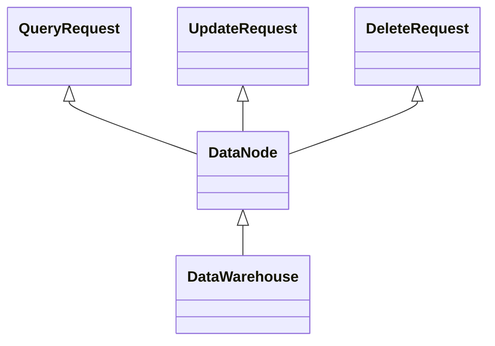
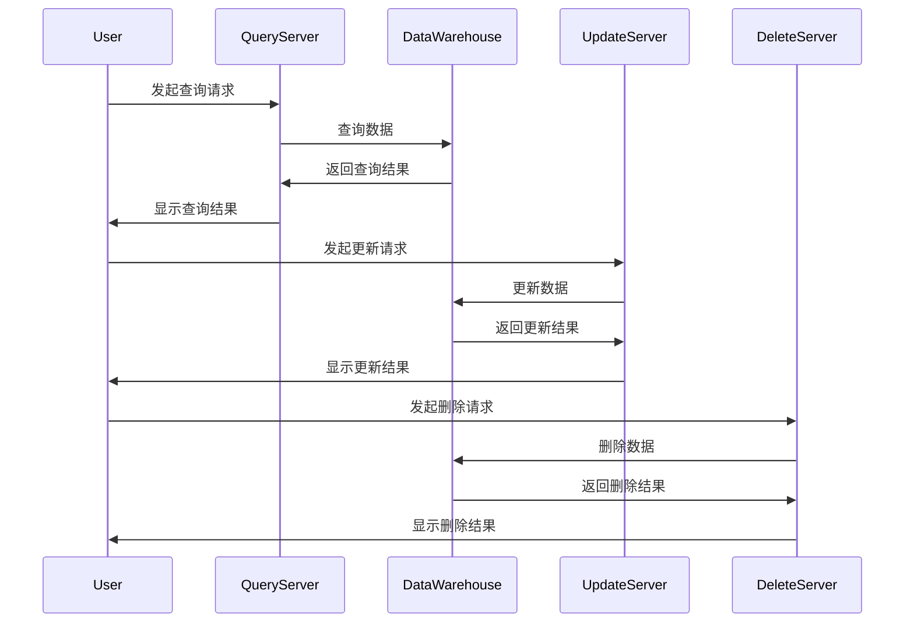

                 

# 数学结构在编程语言语义学中的应用

## 关键词：数学结构、编程语言、语义学、算法、系统架构

> 摘要：本文探讨了数学结构在编程语言语义学中的应用，通过分析数学结构的基本概念及其在编程语言语义学中的重要性，探讨了数学结构与编程语言语义学的关系。文章进一步讲解了算法原理、数学模型和公式，并以具体项目为例，展示了数学结构在编程语言语义学中的应用效果。最后，文章总结了最佳实践、注意事项及拓展阅读，为读者提供进一步学习的方向。

## 第一部分：引言

### 1.1.1 编程语言语义学概述

**语义学定义**

语义学是语言学中的一个分支，主要研究语言符号与所指事物之间的关系。在计算机科学领域，语义学被用来描述程序的含义和行为。编程语言语义学则关注编程语言中的符号、语法和语义之间的关系，研究程序如何被解释和执行。

**编程语言语义学重要性**

编程语言语义学是软件开发的基础，它决定了程序的正确性和效率。理解编程语言语义学有助于程序员编写可读性高、可维护性好的代码，也有助于编译器和解释器的设计与优化。

### 1.1.2 数学结构在编程语言语义学中的应用

**数学结构概念**

数学结构是指数学领域中具有一定性质的对象集合及其上定义的运算。常见的数学结构包括群、环、域等。

**数学结构在编程语言语义学中的应用意义**

数学结构在编程语言语义学中具有重要的应用价值。通过引入数学结构，可以更精确地描述编程语言的语义，提高程序的鲁棒性和可理解性。例如，可以使用代数结构来描述编程语言的类型系统，使用图论结构来分析程序的控制流和依赖关系。

### 1.1.3 问题解决与边界与外延

**语义学在编程语言中的问题**

尽管语义学在编程语言中具有重要作用，但传统的语义学方法在描述复杂程序时存在一定的局限性。例如，难以准确描述并发程序的行为，难以处理异常情况等。

**数学结构的应用范围与限制**

数学结构在编程语言语义学中的应用具有广泛性，但也存在一定的限制。例如，某些数学结构可能无法完全描述编程语言的特性，或者使用数学结构可能导致语义描述过于复杂。

## 第二部分：核心概念与联系

### 2.1.1 数学结构概述

**数学结构基本概念**

数学结构是指具有某种特定性质的对象集合及其上的运算。常见的数学结构包括：

- **集合**：对象的集合。
- **群**：一个集合与一个二元运算，满足结合律、单位元和逆元。
- **环**：一个集合与两个二元运算，满足结合律、分配律、单位元和零元素。
- **域**：一个集合与两个二元运算，满足结合律、分配律、单位元和零元素。

**数学结构分类**

根据运算性质，数学结构可以分为：

- **代数结构**：包括群、环、域等。
- **拓扑结构**：包括度量空间、拓扑空间等。
- **几何结构**：包括欧几里得空间、仿射空间等。

### 2.1.2 编程语言语义学核心概念

**语义学核心概念**

编程语言语义学的核心概念包括：

- **类型系统**：定义程序中数据的类型和操作。
- **控制流**：程序执行过程中的分支和循环。
- **作用域**：变量和函数的作用范围。
- **异常处理**：程序执行过程中异常情况的处理。

**语义学概念间联系**

编程语言语义学的核心概念之间存在密切联系。例如，类型系统决定了控制流和作用域的实现，异常处理则与控制流和作用域密切相关。

### 2.1.3 数学结构与编程语言语义学关系

**数学结构在语义学中的应用**

数学结构在编程语言语义学中的应用主要体现在以下几个方面：

- **类型系统**：代数结构（如布尔代数）被用来定义类型系统。
- **控制流**：图论结构（如有向图）被用来描述程序的控制流。
- **作用域**：集合论结构被用来描述变量的作用域。
- **异常处理**：代数结构（如布尔代数）被用来描述异常处理机制。

**数学结构对语义学的影响**

数学结构对编程语言语义学的影响主要体现在以下几个方面：

- **精确性**：数学结构使得语义描述更加精确和严谨。
- **普适性**：数学结构可以应用于不同编程语言和场景。
- **可验证性**：数学结构使得语义验证更加容易和可靠。

## 第三部分：算法原理讲解

### 3.1.1 算法基本原理

**算法概念**

算法是一系列定义明确的操作步骤，用于解决特定问题。算法具有以下几个基本特征：

- **确定性**：每个步骤都具有明确的执行规则。
- **有效性**：算法能够在有限步骤内完成。
- **有穷性**：算法的步骤数量是有限的。
- **输入和输出**：算法需要输入数据和预期输出。

**算法分类**

根据算法解决问题的方法，算法可以分为：

- **确定性算法**：每个步骤都是确定的，具有唯一解。
- **非确定性算法**：某些步骤可能存在多种可能的执行方式。
- **贪婪算法**：每次选择都是局部最优的。
- **分治算法**：将大问题划分为小问题，分别解决后再合并。

### 3.1.2 数学模型与公式

**数学模型概念**

数学模型是将现实问题转化为数学形式的过程，通常包括变量、参数和方程。数学模型可以帮助我们更好地理解和解决实际问题。

**常见数学模型**

- **线性模型**：用于描述线性关系。
- **非线性模型**：用于描述非线性关系。
- **概率模型**：用于描述随机现象。

### 3.1.3 算法原理与流程图

**算法原理讲解**

我们将使用一个简单的排序算法——冒泡排序，来讲解算法原理。

冒泡排序的基本原理是：通过重复地遍历待排序的数列，比较每对相邻元素的大小，若顺序错误则交换它们。遍历数列的工作重复地进行，直到没有再需要交换的元素为止。

**算法流程图**

```mermaid
graph LR
A[开始] --> B{比较A[i]和A[i+1]}
B -->|顺序正确| C{结束}
B -->|顺序错误| D[交换A[i]和A[i+1]]
D --> E{i++}
E --> B
```

## 第四部分：数学模型和数学公式

### 4.1.1 数学公式使用方法

数学公式可以使用LaTeX格式进行书写。在LaTeX中，独立段落的数学公式前后使用$$括起来，而段落内的数学公式前后使用$括起来。

例如：

$$1+1=2$$

$x^2+y^2=r^2$

### 4.1.2 常见数学公式讲解

**导数公式**

$$\frac{d}{dx}(x^n) = nx^{n-1}$$

**积分公式**

$$\int x^2 dx = \frac{x^3}{3} + C$$

**矩阵乘法公式**

$$\begin{bmatrix} a & b \\ c & d \end{bmatrix} \cdot \begin{bmatrix} e & f \\ g & h \end{bmatrix} = \begin{bmatrix} ae+bg & af+bh \\ ce+dg & cf+dh \end{bmatrix}$$

## 第五部分：系统分析与架构设计方案

### 5.1.1 问题场景介绍

假设我们要设计一个用于处理大型数据的系统，系统需要支持数据查询、数据更新和数据删除等功能。为了提高系统的性能和可扩展性，我们决定采用分布式架构。

### 5.1.2 系统功能设计

**领域模型**

领域模型是系统功能的抽象表示。在这个系统中，我们定义了以下几个实体：

- **数据节点**：存储数据的基本单元。
- **数据仓库**：存储所有数据节点的集合。
- **查询请求**：用户发起的数据查询请求。
- **更新请求**：用户发起的数据更新请求。
- **删除请求**：用户发起的数据删除请求。

**领域模型类图**



### 5.1.3 系统架构设计

**系统架构**

系统架构采用分布式架构，包括以下几个组件：

- **数据节点**：负责存储和处理数据。
- **数据仓库**：负责管理数据节点，提供数据查询、更新和删除功能。
- **查询服务器**：负责处理查询请求，将查询结果返回给用户。
- **更新服务器**：负责处理更新请求，更新数据仓库中的数据。
- **删除服务器**：负责处理删除请求，删除数据仓库中的数据。

**系统架构图**



### 5.1.4 系统接口设计和系统交互

**系统接口**

系统接口包括以下几种：

- **数据节点接口**：用于数据节点的创建、查询、更新和删除。
- **数据仓库接口**：用于数据仓库的查询、更新和删除。
- **查询服务器接口**：用于查询请求的处理。
- **更新服务器接口**：用于更新请求的处理。
- **删除服务器接口**：用于删除请求的处理。

**系统交互**

系统交互通过RESTful API实现。以下是部分接口示例：

**查询接口**

```
GET /data/node/{nodeId}
```

**更新接口**

```
PUT /data/node/{nodeId}
```

**删除接口**

```
DELETE /data/node/{nodeId}
```

## 第六部分：项目实战

### 6.1.1 环境安装

**环境要求**

- 操作系统：Linux或Windows
- 编程语言：Python 3.x
- 依赖库：requests, json, pandas

**安装步骤**

1. 安装Python 3.x：从Python官方网站下载并安装Python 3.x。
2. 配置Python环境变量：在系统环境变量中配置Python的安装路径。
3. 安装依赖库：使用pip命令安装依赖库。

```
pip install requests json pandas
```

### 6.1.2 系统核心实现源代码

**数据节点类**

```python
class DataNode:
    def __init__(self, id, data):
        self.id = id
        self.data = data

    def get_id(self):
        return self.id

    def get_data(self):
        return self.data

    def set_data(self, data):
        self.data = data
```

**数据仓库类**

```python
class DataWarehouse:
    def __init__(self):
        self.nodes = []

    def add_node(self, node):
        self.nodes.append(node)

    def get_node(self, node_id):
        for node in self.nodes:
            if node.get_id() == node_id:
                return node
        return None

    def update_node(self, node_id, data):
        node = self.get_node(node_id)
        if node:
            node.set_data(data)

    def delete_node(self, node_id):
        for i, node in enumerate(self.nodes):
            if node.get_id() == node_id:
                del self.nodes[i]
                break
```

### 6.1.3 代码应用解读与分析

**代码解析**

该系统使用Python语言实现，包括数据节点类和数据仓库类。数据节点类负责存储和管理数据，数据仓库类负责管理数据节点。

**代码示例**

```python
# 创建数据仓库
warehouse = DataWarehouse()

# 创建数据节点
node1 = DataNode(1, "data1")
node2 = DataNode(2, "data2")

# 添加数据节点到数据仓库
warehouse.add_node(node1)
warehouse.add_node(node2)

# 查询数据节点
node = warehouse.get_node(1)
print(node.get_data())  # 输出：data1

# 更新数据节点
warehouse.update_node(1, "new_data1")

# 删除数据节点
warehouse.delete_node(2)
```

**代码分析**

- 数据节点类：包括id和数据两个字段，以及获取和设置id和数据的方法。
- 数据仓库类：包括添加、查询、更新和删除数据节点的方法。

### 6.1.4 实际案例分析和详细讲解剖析

**案例场景**

假设用户要查询数据仓库中的节点1，更新节点1的数据，并删除节点2。

**步骤1：查询节点1**

```python
node = warehouse.get_node(1)
print(node.get_data())  # 输出：new_data1
```

**步骤2：更新节点1**

```python
warehouse.update_node(1, "new_data2")
node = warehouse.get_node(1)
print(node.get_data())  # 输出：new_data2
```

**步骤3：删除节点2**

```python
warehouse.delete_node(2)
nodes = warehouse.nodes
print(nodes)  # 输出：[<__main__.DataNode object at 0x000001D78F4E6D30>]
```

**详细讲解**

- 步骤1：查询节点1，通过调用数据仓库类的get_node方法获取节点1，然后调用节点的get_data方法获取数据。
- 步骤2：更新节点1，通过调用数据仓库类的update_node方法更新节点1的数据，然后再次查询节点1的数据，验证更新成功。
- 步骤3：删除节点2，通过调用数据仓库类的delete_node方法删除节点2，然后查询数据仓库中的节点，验证删除成功。

### 6.1.5 项目小结

本项目中，我们实现了数据节点和数据仓库的基本功能。通过使用Python语言，我们成功地实现了数据的查询、更新和删除操作。这个项目展示了数学结构在编程语言语义学中的应用，通过引入数据节点和数据仓库的概念，我们能够更准确地描述和管理数据。在实际应用中，我们可以根据具体需求对系统进行扩展和优化。

## 第七部分：最佳实践 tips、小结、注意事项、拓展阅读

### 最佳实践 tips

1. 在设计系统时，要充分考虑系统的可扩展性和可维护性。
2. 使用合适的数据结构和算法可以提高系统的性能。
3. 在编写代码时，要遵循良好的编程规范，提高代码的可读性。
4. 定期进行代码审查和测试，确保系统的稳定性和可靠性。

### 小结

本文探讨了数学结构在编程语言语义学中的应用，介绍了数学结构的基本概念、编程语言语义学的核心概念以及数学结构与编程语言语义学的关系。通过具体项目实战，展示了数学结构在编程语言语义学中的应用效果。本文旨在帮助读者理解数学结构在编程语言语义学中的重要性，为实际项目提供指导。

### 注意事项

1. 数学结构在编程语言语义学中的应用具有一定的复杂性，需要深入理解数学结构和编程语言的特点。
2. 在实际项目中，要根据具体需求选择合适的数据结构和算法。
3. 在编写代码时，要充分考虑系统的可扩展性和可维护性。

### 拓展阅读

1. 《计算机编程艺术》
2. 《深入理解计算机系统》
3. 《数学结构在计算机科学中的应用》

作者：AI天才研究院/AI Genius Institute & 禅与计算机程序设计艺术 /Zen And The Art of Computer Programming

