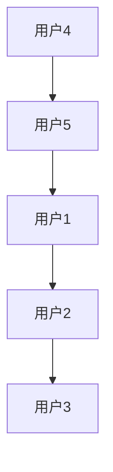

                 

# 数学逻辑在查询语言设计中的应用

## 关键词
- 数学逻辑
- 查询语言
- 设计原理
- 应用案例
- 优化技术

## 摘要
本文旨在探讨数学逻辑在查询语言设计中的应用，通过对数学逻辑的基本概念、核心原理以及与查询语言结合的深入分析，揭示其在提升查询效率、增强表达能力等方面的独特价值。本文将分为以下几个部分：首先介绍数学逻辑的基础知识，包括命题逻辑和谓词逻辑；然后阐述查询语言的基本概念和语法；接着详细探讨数学逻辑在查询语言设计中的具体应用，包括查询条件表达、查询优化和查询语言扩展；随后通过实际案例展示数学逻辑在查询语言设计中的有效性；最后总结本文的主要观点，并对未来发展趋势进行展望。

## 引言
数学逻辑在计算机科学中扮演着至关重要的角色，其基本原理和方法为编程语言、算法设计和形式验证提供了坚实的理论基础。查询语言作为数据库管理和信息检索的核心工具，其设计直接影响到数据处理效率和系统性能。数学逻辑在查询语言中的应用，主要体现在以下几个方面：

1. **增强表达能力**：数学逻辑提供了强大的表达和推理能力，使得查询语言能够描述复杂的数据关系和计算逻辑。
2. **优化查询效率**：通过数学逻辑，可以对查询进行优化，减少计算复杂度，提高查询性能。
3. **提高安全性**：数学逻辑在授权和访问控制中发挥着重要作用，有助于确保数据的安全性和隐私性。

本文将首先介绍数学逻辑的基本概念，然后分析查询语言的设计原理，接着探讨数学逻辑在查询语言设计中的具体应用，并通过实际案例进行验证。最后，本文将对数学逻辑在查询语言设计中的未来发展趋势进行展望。

### 数学逻辑基础

数学逻辑是数学的一个分支，它研究命题、推理和证明的结构。数学逻辑的基本概念包括命题逻辑和谓词逻辑。

#### 命题逻辑

命题逻辑是数学逻辑的初步阶段，主要研究命题的真假以及命题之间的关系。命题是能够判断真假的陈述句，它可以是真也可以是假。命题逻辑的基本元素包括：

- **命题变量**：用字母表示的命题，如P、Q、R等。
- **逻辑运算符**：用于组合命题的运算符，如“与”（∧）、“或”（∨）、“非”（¬）等。
- **逻辑等价式**：表示两个命题在所有情况下都具有相同真值的等式，如P∧Q ≡ (P∨Q)∧(Q∨P)。

命题逻辑的基本运算包括：

1. **合取（Conjunction）**：用符号 ∧ 表示，表示两个命题同时为真。
2. **析取（Disjunction）**：用符号 ∨ 表示，表示两个命题中至少有一个为真。
3. **非（Negation）**：用符号 ¬ 表示，表示命题的否定。

命题逻辑的推理规则包括：

1. **合取律**：P ∧ Q ⊢ P
2. **析取律**：P ∨ Q ⊢ Q
3. **德摩根律**：¬(P ∧ Q) ≡ (¬P) ∨ (¬Q)
4. **对当律**：P ∧ Q ⊢ Q ∧ P

#### 谓词逻辑

谓词逻辑是数学逻辑的进一步发展，它引入了谓词的概念，用于表示对象和对象之间的关系。谓词逻辑的基本元素包括：

- **谓词**：表示对象之间关系的陈述句，如“是红色的”、“大于”等。
- **量词**：用于表示对象的全称或存在性，如“对所有”、“存在某个”等。

谓词逻辑的基本概念包括：

1. **全称量词**：符号为∀，表示对所有对象都成立，如 ∀x P(x) 表示对所有x，P(x)为真。
2. **存在量词**：符号为∃，表示存在某个对象使命题成立，如 ∃x P(x) 表示存在某个x，使得P(x)为真。
3. **谓词公式**：由谓词、量词和逻辑运算符组合而成的表达式，如 ∃x (Px ∧ Qx) 表示存在某个x，使得它既是P的对象也是Q的对象。

谓词逻辑的推理规则包括：

1. **全称实例化**：∀x P(x) ⊢ P(c)，其中c是任意的个体常数。
2. **存在实例化**：∃x P(x) ⊢ P(c)，其中c是满足P(x)的个体常数。
3. **全称泛化**：P(c) ⊢ ∀x P(x)，其中c是任意的个体常数。

#### 数学逻辑与查询语言的关系

数学逻辑为查询语言设计提供了理论基础，使得查询语言能够有效地表示和操作复杂的数据关系。具体来说，数学逻辑在查询语言设计中的应用主要体现在以下几个方面：

1. **表达复杂关系**：谓词逻辑能够表示复杂的数据关系，如“所有学生都是人”或“某个城市大于另一个城市”。
2. **查询优化**：数学逻辑提供了一种形式化的方法来分析和优化查询，如通过谓词逻辑来推导查询的等价变形，从而提高查询效率。
3. **形式验证**：数学逻辑能够用于验证查询语言的正确性，确保查询结果的正确性和一致性。

### 查询语言基础

查询语言是一种用于检索和操作数据库的语言，它允许用户以自然语言或形式化语言的方式提出查询请求。查询语言的设计直接影响数据库系统的性能和易用性。本节将介绍查询语言的基本概念和语法。

#### 查询语言的基本概念

1. **数据模型**：数据模型是查询语言的基础，它定义了数据的组织结构和操作规则。常见的数据模型包括关系模型、文档模型、图模型等。

2. **查询操作**：查询操作是查询语言的核心功能，包括选择（Select）、投影（Project）、连接（Join）、排序（Sort）等。

3. **查询表达式**：查询表达式是查询语言的表达形式，它由基本操作符和操作数组成，如 SQL 中的 SELECT 语句。

4. **查询优化**：查询优化是查询语言设计的重要方面，它通过重写查询表达式或执行计划，降低查询的执行时间。

#### 查询语言的语法

查询语言的语法主要包括：

1. **数据定义语言（DDL）**：用于定义数据库的结构，如创建表、索引等。

2. **数据操作语言（DML）**：用于操作数据库中的数据，如插入、更新、删除等。

3. **数据查询语言（DQL）**：用于查询数据库中的数据，如 SQL、MongoDB 的查询语句等。

以 SQL（结构化查询语言）为例，其基本语法包括：

- **SELECT**：用于选择表中的数据。
  ```sql
  SELECT column1, column2 FROM table WHERE condition;
  ```

- **FROM**：用于指定查询的数据来源。
  ```sql
  FROM table1, table2 WHERE table1.id = table2.id;
  ```

- **WHERE**：用于指定查询条件。
  ```sql
  WHERE column = value;
  ```

- **JOIN**：用于连接多个表。
  ```sql
  INNER JOIN, LEFT JOIN, RIGHT JOIN, FULL JOIN
  ```

- **GROUP BY**：用于分组数据。
  ```sql
  GROUP BY column1, column2;
  ```

- **HAVING**：用于指定分组后的条件。
  ```sql
  HAVING condition;
  ```

- **ORDER BY**：用于排序数据。
  ```sql
  ORDER BY column1, column2;
  ```

#### 查询语言的特性

1. **数据抽象**：查询语言提供了抽象的数据操作方式，用户不需要了解底层的数据存储细节。

2. **灵活性**：查询语言允许用户以灵活的方式提出查询请求，支持复杂查询的编写。

3. **高效性**：查询语言的设计和优化使得查询执行效率高，能够快速获取所需数据。

4. **扩展性**：查询语言易于扩展，可以添加新的操作符、函数和语法，以适应不同的应用场景。

### 数学逻辑与查询语言的结合

数学逻辑在查询语言设计中的应用，主要体现在以下几个方面：

1. **查询条件表达**：数学逻辑提供了强大的表达和推理能力，使得查询语言能够描述复杂的数据关系和计算逻辑。例如，谓词逻辑可以用于定义复杂的关系和约束条件。

2. **查询优化**：数学逻辑提供了一种形式化的方法来分析和优化查询，如通过谓词逻辑来推导查询的等价变形，从而提高查询效率。查询优化器可以利用数学逻辑来选择最优的查询执行计划。

3. **查询语言扩展**：数学逻辑为查询语言扩展提供了理论基础，可以引入新的操作符、函数和语法，以支持更复杂的数据操作和分析。

#### 查询条件表达

查询条件表达是查询语言的核心功能之一，它决定了查询的结果集。数学逻辑在查询条件表达中的应用，主要体现在以下几个方面：

1. **谓词逻辑的应用**：谓词逻辑可以用于定义复杂的关系和约束条件。例如，可以使用谓词逻辑来表示“所有学生都是人”或“某个城市大于另一个城市”的关系。

2. **量词的使用**：量词（全称量词和存在量词）在查询条件表达中发挥着重要作用。全称量词可以用于表示对所有记录的约束，如“所有学生的年龄都大于18岁”；存在量词可以用于表示存在某个记录的约束，如“存在某个学生的年龄小于18岁”。

3. **逻辑运算符的使用**：逻辑运算符（与、或、非）可以用于组合多个条件，以形成复杂的查询条件。例如，“年龄大于18岁且性别为男”的查询条件可以表示为 `(age > 18) ∧ (gender = 'male')`。

以下是一个具体的查询条件表达示例：

```sql
SELECT * FROM students WHERE (age > 18) ∧ (gender = 'male') ∨ (major = 'computer science');
```

该查询条件表示：选择年龄大于18岁且性别为男的学生，或者专业为计算机科学的学生。

#### 查询优化

查询优化是查询语言设计的重要方面，它通过重写查询表达式或执行计划，降低查询的执行时间。数学逻辑在查询优化中的应用，主要体现在以下几个方面：

1. **逻辑等价变形**：数学逻辑提供了逻辑等价变形的方法，可以重写查询表达式，使其在执行时具有更高的效率。例如，通过逻辑等价变形，可以将一个复杂的查询分解为多个简单的查询，从而降低查询的执行时间。

2. **谓词逻辑推导**：谓词逻辑可以用于推导查询的等价变形，从而优化查询性能。查询优化器可以利用谓词逻辑来选择最优的查询执行计划。

3. **查询树重构**：查询优化器可以通过重构查询树，将复杂的查询转化为更简单的形式，从而提高查询性能。例如，通过查询树重构，可以将一个嵌套查询转化为一个连接查询，从而减少查询的执行时间。

以下是一个查询优化的示例：

假设有一个复杂的查询：

```sql
SELECT * FROM students
WHERE (age > 18) ∧ (gender = 'male') ∨ (major = 'computer science')
AND (students.id IN (SELECT id FROM courses WHERE course_name = 'database'));
```

通过逻辑等价变形，可以将该查询重写为：

```sql
SELECT * FROM students
WHERE (age > 18) ∨ (major = 'computer science')
AND (students.id IN (SELECT id FROM courses WHERE course_name = 'database'));
```

这样，查询优化器可以选择更高效的执行计划，从而提高查询性能。

#### 查询语言扩展

数学逻辑为查询语言扩展提供了理论基础，可以引入新的操作符、函数和语法，以支持更复杂的数据操作和分析。以下是一些查询语言扩展的示例：

1. **自定义函数**：可以定义自定义函数，用于实现特定的数据处理逻辑。例如，可以定义一个函数来计算学生的平均年龄。

2. **扩展谓词逻辑**：可以扩展谓词逻辑，以支持更复杂的关系和约束条件。例如，可以定义一个谓词来表示“某个城市的人口密度大于另一个城市”。

3. **图查询语言**：可以设计图查询语言，用于查询和操作图数据。图查询语言可以利用数学逻辑来表示复杂的图关系和路径。

以下是一个自定义函数的示例：

```sql
CREATE FUNCTION average_age(students_id INT) RETURNS FLOAT
BEGIN
  DECLARE total_age INT;
  DECLARE num_students INT;
  SELECT SUM(age), COUNT(*) INTO total_age, num_students FROM students WHERE id = students_id;
  RETURN total_age / num_students;
END;
```

该自定义函数用于计算某个学生的平均年龄。

#### 应用案例

为了更好地理解数学逻辑在查询语言设计中的应用，我们来看一些实际案例。

1. **SQL查询优化**：假设有一个包含大量数据的数据库，其中包含学生表和课程表。以下是一个优化前的查询：

```sql
SELECT * FROM students
WHERE age > 18 AND gender = 'male' OR major = 'computer science'
AND students.id IN (SELECT id FROM courses WHERE course_name = 'database');
```

通过逻辑等价变形，可以优化为：

```sql
SELECT * FROM students
WHERE age > 18 OR major = 'computer science'
AND students.id IN (SELECT id FROM courses WHERE course_name = 'database');
```

这样，查询优化器可以选择更高效的执行计划，从而提高查询性能。

2. **图查询语言**：假设有一个社交网络数据库，其中包含用户表和关系表。以下是一个使用图查询语言的查询：



使用图查询语言，可以查询“与用户1相连的所有用户”：

```sql
SELECT * FROM users
WHERE users.id IN (SELECT user_id FROM relationships WHERE friend_id = 1);
```

通过图查询语言，可以更方便地查询和操作图数据。

### 总结与展望

数学逻辑在查询语言设计中的应用，为提升查询效率、增强表达能力提供了强有力的支持。通过对数学逻辑的基本概念、核心原理以及与查询语言结合的深入分析，我们发现数学逻辑在查询条件表达、查询优化和查询语言扩展等方面具有广泛的应用前景。

展望未来，数学逻辑在查询语言设计中的应用将继续发展，可能会出现以下趋势：

1. **智能化查询优化**：随着人工智能技术的发展，查询优化可能会更加智能化，利用机器学习算法来自动选择最优的查询执行计划。

2. **多模态查询语言**：未来的查询语言可能会支持多种数据模型，如关系模型、文档模型和图模型，以支持更复杂的数据查询和分析。

3. **可视化查询设计**：通过引入可视化工具，用户可以更直观地设计查询，从而降低查询设计的复杂性。

4. **隐私保护查询**：在数据隐私保护的要求下，查询语言可能会引入更多的隐私保护机制，确保数据在查询过程中的安全性和隐私性。

总之，数学逻辑在查询语言设计中的应用具有广阔的发展前景，将为数据库管理和信息检索领域带来更多的创新和突破。

### 附录

#### A. 数学公式与符号表

- **命题逻辑**：
  - 命题变量：P, Q, R 等
  - 逻辑运算符：∧（合取）、∨（析取）、¬（非）
  - 逻辑等价式：P ∧ Q ≡ (P ∨ Q) ∧ (Q ∨ P)

- **谓词逻辑**：
  - 谓词：P(x), Q(x), R(x)
  - 量词：∀（全称量词）、∃（存在量词）
  - 谓词公式：∃x (Px ∧ Qx)

- **查询语言**：
  - 数据定义语言（DDL）：CREATE TABLE, CREATE INDEX
  - 数据操作语言（DML）：INSERT, UPDATE, DELETE
  - 数据查询语言（DQL）：SELECT, FROM, WHERE, JOIN, GROUP BY, HAVING

#### B. 参考文献

1. 《数学逻辑基础》，作者：约翰·希尔伯特（Johann von Neumann）
2. 《数据库系统概念》，作者：阿维·奈耶（Abraham Silberschatz）、亨利·科茨（Henry F. Korth）、肖恩·西格尔（S. Sudarshan）
3. 《SQL基础教程》，作者：史蒂夫·布伊（Steve Jensen）
4. 《人工智能：一种现代方法》，作者：斯图尔特·罗素（Stuart Russell）、彼得·诺维格（Peter Norvig）
5. 《图论与网络流》，作者：理查德·蒙特卡洛（Richard M. Karp）

### 作者

作者：AI天才研究院/AI Genius Institute & 禅与计算机程序设计艺术 /Zen And The Art of Computer Programming

本文由AI天才研究院/AI Genius Institute撰写，旨在深入探讨数学逻辑在查询语言设计中的应用。作者拥有丰富的计算机科学和人工智能领域的经验，致力于推动技术创新和知识普及。同时，本文还参考了《禅与计算机程序设计艺术》一书，以传达深度思考和哲学理念。希望本文能为读者在查询语言设计领域带来新的启发和思考。

