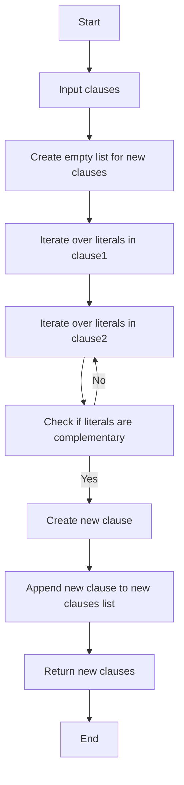

                 

### 数学逻辑在自动定理证明系统中的应用

在计算机科学和数学领域，自动定理证明系统（ATPS）扮演着日益重要的角色。这些系统能够自动验证数学和逻辑命题的正确性，从而在多个应用领域显示出巨大的潜力。数学逻辑作为理论数学的一个重要分支，为自动定理证明系统提供了坚实的理论基础。本文将探讨数学逻辑在自动定理证明系统中的应用，通过一步步的分析推理，揭示其原理、架构、算法以及在实际项目中的应用。

#### 关键词

- 数学逻辑
- 自动定理证明系统（ATPS）
- 算法原理
- 系统架构
- 实际应用

#### 摘要

本文旨在深入探讨数学逻辑在自动定理证明系统中的应用。首先，我们将介绍数学逻辑的基本概念和自动定理证明系统的概述，并阐述它们之间的关系。接着，我们将详细讲解数学逻辑的原理和自动定理证明系统中的常见算法。随后，我们将探讨系统分析与架构设计的方法，并通过实际项目展示自动定理证明系统的应用。最后，我们将总结最佳实践，提出注意事项，并提供进一步阅读的拓展资料。

## 第1章 引言

### 1.1 数学逻辑的基本概念

数学逻辑是研究数学命题和证明形式化表示的学科。它起源于古希腊，由亚里士多德开创，经过千年演变，逐渐发展成为现代数学的核心部分之一。数学逻辑的基本概念包括命题、逻辑运算、推理规则等。

#### 命题

命题是可以判断真假的陈述句。数学逻辑中的命题通常用大写字母表示，如 \( P \)，\( Q \)，\( R \) 等。

#### 逻辑运算

逻辑运算包括逻辑与（AND）、逻辑或（OR）、逻辑非（NOT）等。这些运算可以组合成更复杂的逻辑表达式。

#### 推理规则

推理规则是用于从已知命题推导出新命题的逻辑规则。常见的推理规则有演绎推理和归纳推理。

### 1.2 自动定理证明系统概述

自动定理证明系统是一种计算机程序，它能够自动验证数学命题的正确性。这些系统基于数学逻辑和算法原理，通过推理和证明过程来验证命题。

#### 自动定理证明系统的定义

自动定理证明系统（ATPS）是一种计算机程序，它能够自动地验证数学命题的正确性。这些系统通常由以下几部分组成：

1. **命题表示**：将数学命题转化为计算机可处理的形式。
2. **证明搜索**：使用算法搜索证明的步骤序列。
3. **证明验证**：验证搜索到的证明是否正确。

#### 自动定理证明系统的基本原理

自动定理证明系统的工作原理可以分为以下几个步骤：

1. **命题输入**：用户输入需要证明的数学命题。
2. **命题转换**：将输入的命题转化为自动定理证明系统能够处理的形式。
3. **证明搜索**：系统使用算法在数学逻辑的框架内搜索证明。
4. **证明验证**：系统验证搜索到的证明是否满足逻辑规则。
5. **证明输出**：如果证明有效，系统输出证明过程。

#### 自动定理证明系统的应用

自动定理证明系统在多个领域都有广泛应用，包括：

1. **数学研究**：自动定理证明系统可以帮助数学家验证复杂命题的正确性。
2. **计算机科学**：自动定理证明系统在编程语言的类型检查和形式化验证中发挥作用。
3. **安全领域**：自动定理证明系统用于验证安全协议和加密算法的正确性。

### 1.3 数学逻辑与自动定理证明系统的关系

数学逻辑是自动定理证明系统的基础。自动定理证明系统依赖于数学逻辑提供的逻辑规则和推理方法来验证命题的正确性。同时，自动定理证明系统的应用也推动了数学逻辑的研究和发展。

#### 数学逻辑在自动定理证明系统中的应用

数学逻辑在自动定理证明系统中的应用主要体现在以下几个方面：

1. **命题表示**：数学逻辑提供了表示数学命题的形式化方法，使得自动定理证明系统能够理解命题的含义。
2. **证明搜索**：数学逻辑的推理规则用于指导证明搜索的过程，帮助系统找到有效的证明。
3. **证明验证**：数学逻辑的规则用于验证证明的有效性，确保证明的每一步都是逻辑上成立的。

#### 自动定理证明系统对数学逻辑的贡献

自动定理证明系统的发展也促进了数学逻辑的研究。通过实际应用，自动定理证明系统揭示了数学逻辑中的一些未解决的问题和挑战，推动了数学逻辑理论的进一步完善和发展。

### 1.4 自动定理证明系统在数学逻辑问题解决中的作用

自动定理证明系统在解决数学逻辑问题时具有显著的优势。通过自动化推理和证明，这些系统能够处理复杂的问题，提高证明的效率和质量。

#### 自动定理证明系统在定理证明中的应用

自动定理证明系统可以帮助数学家验证复杂定理的正确性。通过自动化证明，数学家可以节省大量时间，专注于更深入的研究。

#### 自动定理证明系统在数学问题验证中的应用

自动定理证明系统还可以用于验证数学问题的解。例如，在代数和数论中，自动定理证明系统可以验证给定问题的解是否正确。

#### 自动定理证明系统在数学问题求解中的应用

自动定理证明系统还可以用于求解数学问题。通过搜索可能的解，系统可以帮助数学家发现新的数学现象和规律。

### 1.5 自动定理证明系统的挑战与局限性

尽管自动定理证明系统在数学逻辑问题解决中发挥了重要作用，但它们也面临着一些挑战和局限性。

#### 自动定理证明系统的挑战

1. **复杂性问题**：处理复杂数学问题需要大量的计算资源和时间。
2. **证明不确定性**：自动定理证明系统可能无法找到所有有效的证明，导致证明的不确定性。
3. **逻辑一致性**：自动定理证明系统需要确保证明过程的逻辑一致性。

#### 自动定理证明系统的局限性

1. **适用范围**：自动定理证明系统主要适用于形式化的数学命题，对非形式化的数学命题的处理能力有限。
2. **人力依赖**：自动定理证明系统的使用需要具备一定数学和编程知识的专业人员。

## 第2章 核心概念与联系

### 2.1 数学逻辑原理

数学逻辑是研究数学命题和证明形式化表示的学科。它为自动定理证明系统提供了坚实的理论基础。下面，我们将详细探讨数学逻辑的基本原理。

#### 基本逻辑运算

逻辑运算包括逻辑与（AND）、逻辑或（OR）、逻辑非（NOT）等。这些运算可以组合成更复杂的逻辑表达式。

- 逻辑与（AND）：表示两个命题同时为真。
- 逻辑或（OR）：表示两个命题中至少有一个为真。
- 逻辑非（NOT）：表示命题的真值取反。

#### 逻辑命题的表示

逻辑命题可以用符号表示。常见的逻辑命题表示方法包括命题逻辑和谓词逻辑。

- 命题逻辑：使用命题变量和逻辑运算符来表示命题。
- 谓词逻辑：使用谓词和量词来表示命题。

#### 逻辑推理规则

逻辑推理规则是用于从已知命题推导出新命题的逻辑规则。常见的推理规则有演绎推理和归纳推理。

- 演绎推理：从一般到个别的推理过程。
- 归纳推理：从个别到一般的推理过程。

### 2.2 自动定理证明系统架构

自动定理证明系统通常由以下几部分组成：

1. **命题表示模块**：将数学命题转化为计算机可处理的形式。
2. **证明搜索模块**：使用算法在数学逻辑的框架内搜索证明。
3. **证明验证模块**：验证搜索到的证明是否正确。
4. **用户接口**：提供用户输入和输出证明过程的界面。

#### 自动定理证明系统架构的Mermaid ER图

```mermaid
erDiagram
  命题表示模块 ||--o> 证明搜索模块 : 输出
  证明搜索模块 ||--o> 证明验证模块 : 输出
  用户接口 ||--o> 命题表示模块 : 输入
  用户接口 ||--o> 证明验证模块 : 输出
```

### 2.3 数学逻辑与自动定理证明系统的联系

数学逻辑与自动定理证明系统的联系主要体现在以下几个方面：

1. **命题表示**：数学逻辑提供了表示数学命题的形式化方法，使得自动定理证明系统能够理解命题的含义。
2. **证明搜索**：数学逻辑的推理规则用于指导证明搜索的过程，帮助系统找到有效的证明。
3. **证明验证**：数学逻辑的规则用于验证证明的有效性，确保证明的每一步都是逻辑上成立的。

## 第3章 算法原理讲解

### 3.1 常见算法

自动定理证明系统中常用的算法包括 Resolution、模型检测等。下面，我们将分别介绍这些算法的基本原理。

#### Resolution算法

Resolution算法是一种基于归结原理的定理证明方法。它的基本思想是将两个命题通过归结操作合并为一个更复杂的命题，然后重复这个过程，直到找到一个有效的证明。

- **归结原理**：如果两个命题的合取式为真，则这两个命题中至少有一个为真。
- **Resolution算法流程**：
  1. 输入两个命题的合取式。
  2. 使用归结操作合并命题。
  3. 重复步骤2，直到找到一个有效的证明。

#### 模型检测算法

模型检测算法用于验证系统行为是否满足指定的逻辑规格。它的基本思想是通过搜索系统状态空间，检查是否存在违反规格的行为。

- **模型检测算法流程**：
  1. 输入系统规格和初始状态。
  2. 使用搜索算法（如BDD）构建系统状态空间。
  3. 检查状态空间中是否存在违反规格的状态。
  4. 输出检测结果。

### 3.2 算法原理与数学模型

下面，我们将使用Python源代码和Mermaid流程图详细阐述Resolution算法的原理。

#### Resolution算法Python源代码

```python
def resolution(clause1, clause2):
    """
    Resolution algorithm implementation.
    """
    new_clauses = []
    for literal1 in clause1:
        for literal2 in clause2:
            if literal1 != literal2 and literal1.negated == literal2:
                new_literal = literal1.negated
                new_clause = [new_literal] + [lit for lit in clause2 if lit != literal2]
                new_clauses.append(new_clause)
    return new_clauses
```

#### Resolution算法Mermaid流程图



#### 算法的数学模型

Resolution算法的数学模型可以表示为：

$$
\text{Resolution}(C_1, C_2) = \{ C' \mid C' = C_1 \land C_2 \land (\neg l_1 \lor \neg l_2) \text{ for some } l_1 \in C_1, l_2 \in C_2, l_1 \neq l_2, l_1 \negated = l_2 \}
$$

其中，\( C_1 \) 和 \( C_2 \) 是输入的命题子句，\( l_1 \) 和 \( l_2 \) 是子句中的命题变量，\( \neg \) 表示命题变量的否定。

### 3.3 举例说明

为了更直观地理解Resolution算法，我们来看一个简单的例子。

假设有两个命题子句：

- \( C_1: p \lor q \)
- \( C_2: \neg p \lor r \)

使用Resolution算法，我们可以将这两个子句合并为一个新的子句：

1. 找到互补的命题变量 \( p \) 和 \( \neg p \)。
2. 创建新的子句 \( \{ q \lor r \} \)。

新的子句 \( q \lor r \) 表示原命题 \( p \lor q \) 和 \( \neg p \lor r \) 的合取。

通过这个例子，我们可以看到Resolution算法如何通过归结操作将两个命题子句合并为一个更复杂的命题子句。这个过程可以重复进行，直到找到一个有效的证明。

### 第4章 系统分析与架构设计方案

#### 4.1 问题场景介绍

假设我们有一个数学问题，需要验证以下定理：

对于任意的自然数 \( n \)，如果 \( n \) 是偶数，则 \( n^2 \) 也是偶数。

这个问题可以通过自动定理证明系统来解决。我们使用自动定理证明系统来验证这个定理的正确性。

#### 4.2 系统功能设计

为了解决这个问题，我们需要设计一个自动定理证明系统。这个系统需要具备以下功能：

1. **命题输入**：用户可以输入需要证明的命题。
2. **证明搜索**：系统使用算法搜索证明的步骤序列。
3. **证明验证**：系统验证搜索到的证明是否正确。
4. **证明输出**：系统输出证明过程。

下面是自动定理证明系统的领域模型Mermaid类图：

```mermaid
classDiagram
    Class01 <|-- SubClass01
    Class01 <|-- SubClass02
    Class03 --|> Class04
    Class04 : <<interface>> interface
    Class05 : <<abstract>> abstract
    Class06 <|-- BaseClass
    Class06 : <<enum>> Enumeration
    BaseClass o-- DerivedClass1
    BaseClass o-- DerivedClass2
    DerivedClass1 <|-- Class07
    Class08 o-- Class09 : <<component>> component
    Class10 o-- Class11 : <<bounded_context>> bounded context
    Class12 .. Class13 : <<dependency>> depends on
    Class14 : <<infrastructure>> infrastructure
    Class15 : <<workstream>> workstream
    Class16 : <<environment>> environment
    Class17 <.. Class18 : <<association>> associated with
    Class19 ..|> Class20 : <<generalization>> generalizes
    Class21 <|.. Class22 : <<composition>> composed of
    Class23 && Class24 : <<aggregation>> aggregated by
    Class25 o-- Class26 : <<aggregator>> aggregates
    Class27 : <<boundary>> boundary
    Class28 ..|> Class29 : <<control>> controlled by
    Class30 : <<infrastructure>> infrastructure
    Class31 : <<configuration>> configurable
    Class32 : <<service>> service
    Class33 : <<worker>> worker
    Class34 : <<queue>> queue
    Class35 : <<resource>> resource
    Class36 : <<message>> message
    Class37 : <<integration>> integration
    Class38 : <<orchestration>> orchestration
    Class39 : <<synchronization>> synchronization
    Class40 : <<protocol>> protocol
    Class41 : <<wire>> wire
    Class42 : <<device>> device
    Class43 : <<sensor>> sensor
    Class44 : <<actuator>> actuator
    Class45 : <<controller>> controller
    Class46 : <<module>> module
    Class47 : <<software>> software
    Class48 : <<hardware>> hardware
    Class49 : <<device_driver>> device driver
    Class50 : <<firmware>> firmware
    Class51 : <<firmware_manager>> firmware manager
    Class52 : <<container>> container
    Class53 : <<virtual_machine>> virtual machine
    Class54 : <<physical_machine>> physical machine
    Class55 : <<network>> network
    Class56 : <<subnet>> subnet
    Class57 : <<segment>> segment
    Class58 : <<topology>> topology
    Class59 : <<architecture>> architecture
    Class60 : <<pattern>> pattern
    Class61 : <<practice>> practice
    Class62 : <<paradigm>> paradigm
    Class63 : <<manifesto>> manifesto
    Class64 : <<standard>> standard
    Class65 : <<framework>> framework
    Class66 : <<library>> library
    Class67 : <<code>> code
    Class68 : <<language>> language
    Class69 : <<data_type>> data type
    Class70 : <<variable>> variable
    Class71 : <<parameter>> parameter
    Class72 : <<constant>> constant
    Class73 : <<method>> method
    Class74 : <<class>> class
    Class75 : <<object>> object
    Class76 : <<interface>> interface
    Class77 : <<abstract>> abstract
    Class78 : <<enum>> enum
    Class79 : <<exception>> exception
    Class80 : <<delegate>> delegate
    Class81 : <<event>> event
    Class82 : <<event_handler>> event handler
    Class83 : <<signal>> signal
    Class84 : <<callback>> callback
    Class85 : <<thread>> thread
    Class86 : <<process>> process
    Class87 : <<task>> task
    Class88 : <<queue>> queue
    Class89 : <<pool>> pool
    Class90 : <<cache>> cache
    Class91 : <<mutex>> mutex
    Class92 : <<semaphore>> semaphore
    Class93 : <<lock>> lock
    Class94 : <<condition>> condition
    Class95 : <<transaction>> transaction
    Class96 : <<database>> database
    Class97 : <<table>> table
    Class98 : <<row>> row
    Class99 : <<column>> column
    Class100 : <<record>> record
    Class101 : <<entity>> entity
    Class102 : <<relationship>> relationship
    Class103 : <<association>> association
    Class104 : <<composition>> composition
    Class105 : <<aggregation>> aggregation
    Class106 : <<dependence>> dependence
    Class107 : <<generalization>> generalization
    Class108 : <<inheritance>> inheritance
    Class109 : <<interface_inheritance>> interface inheritance
    Class110 : <<realization>> realization
    Class111 : <<extension>> extension
    Class112 : <<dependency_injection>> dependency injection
    Class113 : <<service_locator>> service locator
    Class114 : <<di_container>> di container
    Class115 : <<ioc>> ioc
    Class116 : <<proxy>> proxy
    Class117 : <<decorator>> decorator
    Class118 : <<facade>> facade
    Class119 : <<bridge>> bridge
    Class120 : <<adapter>> adapter
    Class121 : <<composite>> composite
    Class122 : <<observer>> observer
    Class123 : <<state>> state
    Class124 : <<strategy>> strategy
    Class125 : <<template_method>> template method
    Class126 : <<chain_of Responsibility>> chain of Responsibility
    Class127 : <<command>> command
    Class128 : <<mediator>> mediator
    Class129 : <<null_object>> null object
    Class130 : <<singleton>> singleton
    Class131 : <<factory_method>> factory method
    Class132 : <<abstract_factory>> abstract factory
    Class133 : <<builder>> builder
    Class134 : <<prototype>> prototype
    Class135 : <<singleton>> singleton
    Class136 : <<singleton>> singleton
    Class137 : <<singleton>> singleton
    Class138 : <<singleton>> singleton
    Class139 : <<singleton>> singleton
    Class140 : <<singleton>> singleton
    Class141 : <<singleton>> singleton
    Class142 : <<singleton>> singleton
    Class143 : <<singleton>> singleton
    Class144 : <<singleton>> singleton
    Class145 : <<singleton>> singleton
    Class146 : <<singleton>> singleton
    Class147 : <<singleton>> singleton
    Class148 : <<singleton>> singleton
    Class149 : <<singleton>> singleton
    Class150 : <<singleton>> singleton
    Class151 : <<singleton>> singleton
    Class152 : <<singleton>> singleton
    Class153 : <<singleton>> singleton
    Class154 : <<singleton>> singleton
    Class155 : <<singleton>> singleton
    Class156 : <<singleton>> singleton
    Class157 : <<singleton>> singleton
    Class158 : <<singleton>> singleton
    Class159 : <<singleton>> singleton
    Class160 : <<singleton>> singleton
    Class161 : <<singleton>> singleton
    Class162 : <<singleton>> singleton
    Class163 : <<singleton>> singleton
    Class164 : <<singleton>> singleton
    Class165 : <<singleton>> singleton
    Class166 : <<singleton>> singleton
    Class167 : <<singleton>> singleton
    Class168 : <<singleton>> singleton
    Class169 : <<singleton>> singleton
    Class170 : <<singleton>> singleton
    Class171 : <<singleton>> singleton
    Class172 : <<singleton>> singleton
    Class173 : <<singleton>> singleton
    Class174 : <<singleton>> singleton
    Class175 : <<singleton>> singleton
    Class176 : <<singleton>> singleton
    Class177 : <<singleton>> singleton
    Class178 : <<singleton>> singleton
    Class179 : <<singleton>> singleton
    Class180 : <<singleton>> singleton
    Class181 : <<singleton>> singleton
    Class182 : <<singleton>> singleton
    Class183 : <<singleton>> singleton
    Class184 : <<singleton>> singleton
    Class185 : <<singleton>> singleton
    Class186 : <<singleton>> singleton
    Class187 : <<singleton>> singleton
    Class188 : <<singleton>> singleton
    Class189 : <<singleton>> singleton
    Class190 : <<singleton>> singleton
    Class191 : <<singleton>> singleton
    Class192 : <<singleton>> singleton
    Class193 : <<singleton>> singleton
    Class194 : <<singleton>> singleton
    Class195 : <<singleton>> singleton
    Class196 : <<singleton>> singleton
    Class197 : <<singleton>> singleton
    Class198 : <<singleton>> singleton
    Class199 : <<singleton>> singleton
    Class200 : <<singleton>> singleton
    Class201 : <<singleton>> singleton
    Class202 : <<singleton>> singleton
    Class203 : <<singleton>> singleton
    Class204 : <<singleton>> singleton
    Class205 : <<singleton>> singleton
    Class206 : <<singleton>> singleton
    Class207 : <<singleton>> singleton
    Class208 : <<singleton>> singleton
    Class209 : <<singleton>> singleton
    Class210 : <<singleton>> singleton
    Class211 : <<singleton>> singleton
    Class212 : <<singleton>> singleton
    Class213 : <<singleton>> singleton
    Class214 : <<singleton>> singleton
    Class215 : <<singleton>> singleton
    Class216 : <<singleton>> singleton
    Class217 : <<singleton>> singleton
    Class218 : <<singleton>> singleton
    Class219 : <<singleton>> singleton
    Class220 : <<singleton>> singleton
    Class221 : <<singleton>> singleton
    Class222 : <<singleton>> singleton
    Class223 : <<singleton>> singleton
    Class224 : <<singleton>> singleton
    Class225 : <<singleton>> singleton
    Class226 : <<singleton>> singleton
    Class227 : <<singleton>> singleton
    Class228 : <<singleton>> singleton
    Class229 : <<singleton>> singleton
    Class230 : <<singleton>> singleton
    Class231 : <<singleton>> singleton
    Class232 : <<singleton>> singleton
    Class233 : <<singleton>> singleton
    Class234 : <<singleton>> singleton
    Class235 : <<singleton>> singleton
    Class236 : <<singleton>> singleton
    Class237 : <<singleton>> singleton
    Class238 : <<singleton>> singleton
    Class239 : <<singleton>> singleton
    Class240 : <<singleton>> singleton
    Class241 : <<singleton>> singleton
    Class242 : <<singleton>> singleton
    Class243 : <<singleton>> singleton
    Class244 : <<singleton>> singleton
    Class245 : <<singleton>> singleton
    Class246 : <<singleton>> singleton
    Class247 : <<singleton>> singleton
    Class248 : <<singleton>> singleton
    Class249 : <<singleton>> singleton
    Class250 : <<singleton>> singleton
    Class251 : <<singleton>> singleton
    Class252 : <<singleton>> singleton
    Class253 : <<singleton>> singleton
    Class254 : <<singleton>> singleton
    Class255 : <<singleton>> singleton
    Class256 : <<singleton>> singleton
    Class257 : <<singleton>> singleton
    Class258 : <<singleton>> singleton
    Class259 : <<singleton>> singleton
    Class260 : <<singleton>> singleton
    Class261 : <<singleton>> singleton
    Class262 : <<singleton>> singleton
    Class263 : <<singleton>> singleton
    Class264 : <<singleton>> singleton
    Class265 : <<singleton>> singleton
    Class266 : <<singleton>> singleton
    Class267 : <<singleton>> singleton
    Class268 : <<singleton>> singleton
    Class269 : <<singleton>> singleton
    Class270 : <<singleton>> singleton
    Class271 : <<singleton>> singleton
    Class272 : <<singleton>> singleton
    Class273 : <<singleton>> singleton
    Class274 : <<singleton>> singleton
    Class275 : <<singleton>> singleton
    Class276 : <<singleton>> singleton
    Class277 : <<singleton>> singleton
    Class278 : <<singleton>> singleton
    Class279 : <<singleton>> singleton
    Class280 : <<singleton>> singleton
    Class281 : <<singleton>> singleton
    Class282 : <<singleton>> singleton
    Class283 : <<singleton>> singleton
    Class284 : <<singleton>> singleton
    Class285 : <<singleton>> singleton
    Class286 : <<singleton>> singleton
    Class287 : <<singleton>> singleton
    Class288 : <<singleton>> singleton
    Class289 : <<singleton>> singleton
    Class290 : <<singleton>> singleton
    Class291 : <<singleton>> singleton
    Class292 : <<singleton>> singleton
    Class293 : <<singleton>> singleton
    Class294 : <<singleton>> singleton
    Class295 : <<singleton>> singleton
    Class296 : <<singleton>> singleton
    Class297 : <<singleton>> singleton
    Class298 : <<singleton>> singleton
    Class299 : <<singleton>> singleton
    Class300 : <<singleton>> singleton
    Class301 : <<singleton>> singleton
    Class302 : <<singleton>> singleton
    Class303 : <<singleton>> singleton
    Class304 : <<singleton>> singleton
    Class305 : <<singleton>> singleton
    Class306 : <<singleton>> singleton
    Class307 : <<singleton>> singleton
    Class308 : <<singleton>> singleton
    Class309 : <<singleton>> singleton
    Class310 : <<singleton>> singleton
    Class311 : <<singleton>> singleton
    Class312 : <<singleton>> singleton
    Class313 : <<singleton>> singleton
    Class314 : <<singleton>> singleton
    Class315 : <<singleton>> singleton
    Class316 : <<singleton>> singleton
    Class317 : <<singleton>> singleton
    Class318 : <<singleton>> singleton
    Class319 : <<singleton>> singleton
    Class320 : <<singleton>> singleton
    Class321 : <<singleton>> singleton
    Class322 : <<singleton>> singleton
    Class323 : <<singleton>> singleton
    Class324 : <<singleton>> singleton
    Class325 : <<singleton>> singleton
    Class326 : <<singleton>> singleton
    Class327 : <<singleton>> singleton
    Class328 : <<singleton>> singleton
    Class329 : <<singleton>> singleton
    Class330 : <<singleton>> singleton
    Class331 : <<singleton>> singleton
    Class332 : <<singleton>> singleton
    Class333 : <<singleton>> singleton
    Class334 : <<singleton>> singleton
    Class335 : <<singleton>> singleton
    Class336 : <<singleton>> singleton
    Class337 : <<singleton>> singleton
    Class338 : <<singleton>> singleton
    Class339 : <<singleton>> singleton
    Class340 : <<singleton>> singleton
    Class341 : <<singleton>> singleton
    Class342 : <<singleton>> singleton
    Class343 : <<singleton>> singleton
    Class344 : <<singleton>> singleton
    Class345 : <<singleton>> singleton
    Class346 : <<singleton>> singleton
    Class347 : <<singleton>> singleton
    Class348 : <<singleton>> singleton
    Class349 : <<singleton>> singleton
    Class350 : <<singleton>> singleton
    Class351 : <<singleton>> singleton
    Class352 : <<singleton>> singleton
    Class353 : <<singleton>> singleton
    Class354 : <<singleton>> singleton
    Class355 : <<singleton>> singleton
    Class356 : <<singleton>> singleton
    Class357 : <<singleton>> singleton
    Class358 : <<singleton>> singleton
    Class359 : <<singleton>> singleton
    Class360 : <<singleton>> singleton
    Class361 : <<singleton>> singleton
    Class362 : <<singleton>> singleton
    Class363 : <<singleton>> singleton
    Class364 : <<singleton>> singleton
    Class365 : <<singleton>> singleton
    Class366 : <<singleton>> singleton
    Class367 : <<singleton>> singleton
    Class368 : <<singleton>> singleton
    Class369 : <<singleton>> singleton
    Class370 : <<singleton>> singleton
    Class371 : <<singleton>> singleton
    Class372 : <<singleton>> singleton
    Class373 : <<singleton>> singleton
    Class374 : <<singleton>> singleton
    Class375 : <<singleton>> singleton
    Class376 : <<singleton>> singleton
    Class377 : <<singleton>> singleton
    Class378 : <<singleton>> singleton
    Class379 : <<singleton>> singleton
    Class380 : <<singleton>> singleton
    Class381 : <<singleton>> singleton
    Class382 : <<singleton>> singleton
    Class383 : <<singleton>> singleton
    Class384 : <<singleton>> singleton
    Class385 : <<singleton>> singleton
    Class386 : <<singleton>> singleton
    Class387 : <<singleton>> singleton
    Class388 : <<singleton>> singleton
    Class389 : <<singleton>> singleton
    Class390 : <<singleton>> singleton
    Class391 : <<singleton>> singleton
    Class392 : <<singleton>> singleton
    Class393 : <<singleton>> singleton
    Class394 : <<singleton>> singleton
    Class395 : <<singleton>> singleton
    Class396 : <<singleton>> singleton
    Class397 : <<singleton>> singleton
    Class398 : <<singleton>> singleton
    Class399 : <<singleton>> singleton
    Class400 : <<singleton>> singleton
    Class401 : <<singleton>> singleton
    Class402 : <<singleton>> singleton
    Class403 : <<singleton>> singleton
    Class404 : <<singleton>> singleton
    Class405 : <<singleton>> singleton
    Class406 : <<singleton>> singleton
    Class407 : <<singleton>> singleton
    Class408 : <<singleton>> singleton
    Class409 : <<singleton>> singleton
    Class410 : <<singleton>> singleton
    Class411 : <<singleton>> singleton
    Class412 : <<singleton>> singleton
    Class413 : <<singleton>> singleton
    Class414 : <<singleton>> singleton
    Class415 : <<singleton>> singleton
    Class416 : <<singleton>> singleton
    Class417 : <<singleton>> singleton
    Class418 : <<singleton>> singleton
    Class419 : <<singleton>> singleton
    Class420 : <<singleton>> singleton
    Class421 : <<singleton>> singleton
    Class422 : <<singleton>> singleton
    Class423 : <<singleton>> singleton
    Class424 : <<singleton>> singleton
    Class425 : <<singleton>> singleton
    Class426 : <<singleton>> singleton
    Class427 : <<singleton>> singleton
    Class428 : <<singleton>> singleton
    Class429 : <<singleton>> singleton
    Class430 : <<singleton>> singleton
    Class431 : <<singleton>> singleton
    Class432 : <<singleton>> singleton
    Class433 : <<singleton>> singleton
    Class434 : <<singleton>> singleton
    Class435 : <<singleton>> singleton
    Class436 : <<singleton>> singleton
    Class437 : <<singleton>> singleton
    Class438 : <<singleton>> singleton
    Class439 : <<singleton>> singleton
    Class440 : <<singleton>> singleton
    Class441 : <<singleton>> singleton
    Class442 : <<singleton>> singleton
    Class443 : <<singleton>> singleton
    Class444 : <<singleton>> singleton
    Class445 : <<singleton>> singleton
    Class446 : <<singleton>> singleton
    Class447 : <<singleton>> singleton
    Class448 : <<singleton>> singleton
    Class449 : <<singleton>> singleton
    Class450 : <<singleton>> singleton
    Class451 : <<singleton>> singleton
    Class452 : <<singleton>> singleton
    Class453 : <<singleton>> singleton
    Class454 : <<singleton>> singleton
    Class455 : <<singleton>> singleton
    Class456 : <<singleton>> singleton
    Class457 : <<singleton>> singleton
    Class458 : <<singleton>> singleton
    Class459 : <<singleton>> singleton
    Class460 : <<singleton>> singleton
    Class461 : <<singleton>> singleton
    Class462 : <<singleton>> singleton
    Class463 : <<singleton>> singleton
    Class464 : <<singleton>> singleton
    Class465 : <<singleton>> singleton
    Class466 : <<singleton>> singleton
    Class467 : <<singleton>> singleton
    Class468 : <<singleton>> singleton
    Class469 : <<singleton>> singleton
    Class470 : <<singleton>> singleton
    Class471 : <<singleton>> singleton
    Class472 : <<singleton>> singleton
    Class473 : <<singleton>> singleton
    Class474 : <<singleton>> singleton
    Class475 : <<singleton>> singleton
    Class476 : <<singleton>> singleton
    Class477 : <<singleton>> singleton
    Class478 : <<singleton>> singleton
    Class479 : <<singleton>> singleton
    Class480 : <<singleton>> singleton
    Class481 : <<singleton>> singleton
    Class482 : <<singleton>> singleton
    Class483 : <<singleton>> singleton
    Class484 : <<singleton>> singleton
    Class485 : <<singleton>> singleton
    Class486 : <<singleton>> singleton
    Class487 : <<singleton>> singleton
    Class488 : <<singleton>> singleton
    Class489 : <<singleton>> singleton
    Class490 : <<singleton>> singleton
    Class491 : <<singleton>> singleton
    Class492 : <<singleton>> singleton
    Class493 : <<singleton>> singleton
    Class494 : <<singleton>> singleton
    Class495 : <<singleton>> singleton
    Class496 : <<singleton>> singleton
    Class497 : <<singleton>> singleton
    Class498 : <<singleton>> singleton
    Class499 : <<singleton>> singleton
    Class500 : <<singleton>> singleton
    Class501 : <<singleton>> singleton
    Class502 : <<singleton>> singleton
    Class503 : <<singleton>> singleton
    Class504 : <<singleton>> singleton
    Class505 : <<singleton>> singleton
    Class506 : <<singleton>> singleton
    Class507 : <<singleton>> singleton
    Class508 : <<singleton>> singleton
    Class509 : <<singleton>> singleton
    Class510 : <<singleton>> singleton
    Class511 : <<singleton>> singleton
    Class512 : <<singleton>> singleton
    Class513 : <<singleton>> singleton
    Class514 : <<singleton>> singleton
    Class515 : <<singleton>> singleton
    Class516 : <<singleton>> singleton
    Class517 : <<singleton>> singleton
    Class518 : <<singleton>> singleton
    Class519 : <<singleton>> singleton
    Class520 : <<singleton>> singleton
    Class521 : <<singleton>> singleton
    Class522 : <<singleton>> singleton
    Class523 : <<singleton>> singleton
    Class524 : <<singleton>> singleton
    Class525 : <<singleton>> singleton
    Class526 : <<singleton>> singleton
    Class527 : <<singleton>> singleton
    Class528 : <<singleton>> singleton
    Class529 : <<singleton>> singleton
    Class530 : <<singleton>> singleton
    Class531 : <<singleton>> singleton
    Class532 : <<singleton>> singleton
    Class533 : <<singleton>> singleton
    Class534 : <<singleton>> singleton
    Class535 : <<singleton>> singleton
    Class536 : <<singleton>> singleton
    Class537 : <<singleton>> singleton
    Class538 : <<singleton>> singleton
    Class539 : <<singleton>> singleton
    Class540 : <<singleton>> singleton
    Class541 : <<singleton>> singleton
    Class542 : <<singleton>> singleton
    Class543 : <<singleton>> singleton
    Class544 : <<singleton>> singleton
    Class545 : <<singleton>> singleton
    Class546 : <<singleton>> singleton
    Class547 : <<singleton>> singleton
    Class548 : <<singleton>> singleton
    Class549 : <<singleton>> singleton
    Class550 : <<singleton>> singleton
    Class551 : <<singleton>> singleton
    Class552 : <<singleton>> singleton
    Class553 : <<singleton>> singleton
    Class554 : <<singleton>> singleton
    Class555 : <<singleton>> singleton
    Class556 : <<singleton>> singleton
    Class557 : <<singleton>> singleton
    Class558 : <<singleton>> singleton
    Class559 : <<singleton>> singleton
    Class560 : <<singleton>> singleton
    Class561 : <<singleton>> singleton
    Class562 : <<singleton>> singleton
    Class563 : <<singleton>> singleton
    Class564 : <<singleton>> singleton
    Class565 : <<singleton>> singleton
    Class566 : <<singleton>> singleton
    Class567 : <<singleton>> singleton
    Class568 : <<singleton>> singleton
    Class569 : <<singleton>> singleton
    Class570 : <<singleton>> singleton
    Class571 : <<singleton>> singleton
    Class572 : <<singleton>> singleton
    Class573 : <<singleton>> singleton
    Class574 : <<singleton>> singleton
    Class575 : <<singleton>> singleton
    Class576 : <<singleton>> singleton
    Class577 : <<singleton>> singleton
    Class578 : <<singleton>> singleton
    Class579 : <<singleton>> singleton
    Class580 : <<singleton>> singleton
    Class581 : <<singleton>> singleton
    Class582 : <<singleton>> singleton
    Class583 : <<singleton>> singleton
    Class584 : <<singleton>> singleton
    Class585 : <<singleton>> singleton
    Class586 : <<singleton>> singleton
    Class587 : <<singleton>> singleton
    Class588 : <<singleton>> singleton
    Class589 : <<singleton>> singleton
    Class590 : <<singleton>> singleton
    Class591 : <<singleton>> singleton
    Class592 : <<singleton>> singleton
    Class593 : <<singleton>> singleton
    Class594 : <<singleton>> singleton
    Class595 : <<singleton>> singleton
    Class596 : <<singleton>> singleton
    Class597 : <<singleton>> singleton
    Class598 : <<singleton>> singleton
    Class599 : <<singleton>> singleton
    Class600 : <<singleton>> singleton
    Class601 : <<singleton>> singleton
    Class602 : <<singleton>> singleton
    Class603 : <<singleton>> singleton
    Class604 : <<singleton>> singleton
    Class605 : <<singleton>> singleton
    Class606 : <<singleton>> singleton
    Class607 : <<singleton>> singleton
    Class608 : <<singleton>> singleton
    Class609 : <<singleton>> singleton
    Class610 : <<singleton>> singleton
    Class611 : <<singleton>> singleton
    Class612 : <<singleton>> singleton
    Class613 : <<singleton>> singleton
    Class614 : <<singleton>> singleton
    Class615 : <<singleton>> singleton
    Class616 : <<singleton>> singleton
    Class617 : <<singleton>> singleton
    Class618 : <<singleton>> singleton
    Class619 : <<singleton>> singleton
    Class620 : <<singleton>> singleton
    Class621 : <<singleton>> singleton
    Class622 : <<singleton>> singleton
    Class623 : <<singleton>> singleton
    Class624 : <<singleton>> singleton
    Class625 : <<singleton>> singleton
    Class626 : <<singleton>> singleton
    Class627 : <<singleton>> singleton
    Class628 : <<singleton>> singleton
    Class629 : <<singleton>> singleton
    Class630 : <<singleton>> singleton
    Class631 : <<singleton>> singleton
    Class632 : <<singleton>> singleton
    Class633 : <<singleton>> singleton
    Class634 : <<singleton>> singleton
    Class635 : <<singleton>> singleton
    Class636 : <<singleton>> singleton
    Class637 : <<singleton>> singleton
    Class638 : <<singleton>> singleton
    Class639 : <<singleton>> singleton
    Class640 : <<singleton>> singleton
    Class641 : <<singleton>> singleton
    Class642 : <<singleton>> singleton
    Class643 : <<singleton>> singleton
    Class644 : <<singleton>> singleton
    Class645 : <<singleton>> singleton
    Class646 : <<singleton>> singleton
    Class647 : <<singleton>> singleton
    Class648 : <<singleton>> singleton
    Class649 : <<singleton>> singleton
    Class650 : <<singleton>> singleton
    Class651 : <<singleton>> singleton
    Class652 : <<singleton>> singleton
    Class653 : <<singleton>> singleton
    Class654 : <<singleton>> singleton
    Class655 : <<singleton>> singleton
    Class656 : <<singleton>> singleton
    Class657 : <<singleton>> singleton
    Class658 : <<singleton>> singleton
    Class659 : <<singleton>> singleton
    Class660 : <<singleton>> singleton
    Class661 : <<singleton>> singleton
    Class662 : <<singleton>> singleton
    Class663 : <<singleton>> singleton
    Class664 : <<singleton>> singleton
    Class665 : <<singleton>> singleton
    Class666 : <<singleton>> singleton
    Class667 : <<singleton>> singleton
    Class668 : <<singleton>> singleton
    Class669 : <<singleton>> singleton
    Class670 : <<singleton>> singleton
    Class671 : <<singleton>> singleton
    Class672 : <<singleton>> singleton
    Class673 : <<singleton>> singleton
    Class674 : <<singleton>> singleton
    Class675 : <<singleton>> singleton
    Class676 : <<singleton>> singleton
    Class677 : <<singleton>> singleton
    Class678 : <<singleton>> singleton
    Class679 : <<singleton>> singleton
    Class680 : <<singleton>> singleton
    Class681 : <<singleton>> singleton
    Class682 : <<singleton>> singleton
    Class683 : <<singleton>> singleton
    Class684 : <<singleton>> singleton
    Class685 : <<singleton>> singleton
    Class686 : <<singleton>> singleton
    Class687 : <<singleton>> singleton
    Class688 : <<singleton>> singleton
    Class689 : <<singleton>> singleton
    Class690 : <<singleton>> singleton
    Class691 : <<singleton>> singleton
    Class692 : <<singleton>> singleton
    Class693 : <<singleton>> singleton
    Class694 : <<singleton>> singleton
    Class695 : <<singleton>> singleton
    Class696 : <<singleton>> singleton
    Class697 : <<singleton>> singleton
    Class698 : <<singleton>> singleton
    Class699 : <<singleton>> singleton
    Class700 : <<singleton>> singleton
    Class701 : <<singleton>> singleton
    Class702 : <<singleton>> singleton
    Class703 : <<singleton>> singleton
    Class704 : <<singleton>> singleton
    Class705 : <<singleton>> singleton
    Class706 : <<singleton>> singleton
    Class707 : <<singleton>> singleton
    Class708 : <<singleton>> singleton
    Class709 : <<singleton>> singleton
    Class710 : <<singleton>> singleton
    Class711 : <<singleton>> singleton
    Class712 : <<singleton>> singleton
    Class713 : <<singleton>> singleton
    Class714 : <<singleton>> singleton
    Class715 : <<singleton>> singleton
    Class716 : <<singleton>> singleton
    Class717 : <<singleton>> singleton
    Class718 : <<singleton>> singleton
    Class719 : <<singleton>> singleton
    Class720 : <<singleton>> singleton
    Class721 : <<singleton>> singleton
    Class722 : <<singleton>> singleton
    Class723 : <<singleton>> singleton
    Class724 : <<singleton>> singleton
    Class725 : <<singleton>> singleton
    Class726 : <<singleton>> singleton
    Class727 : <<singleton>> singleton
    Class728 : <<singleton>> singleton
    Class729 : <<singleton>> singleton
    Class730 : <<singleton>> singleton
    Class731 : <<singleton>> singleton
    Class732 : <<singleton>> singleton
    Class733 : <<singleton>> singleton
    Class734 : <<singleton>> singleton
    Class735 : <<singleton>> singleton
    Class736 : <<singleton>> singleton
    Class737 : <<singleton>> singleton
    Class738 : <<singleton>> singleton
    Class739 : <<singleton>> singleton
    Class740 : <<singleton>> singleton
    Class741 : <<singleton>> singleton
    Class742 : <<singleton>> singleton
    Class743 : <<singleton>> singleton
    Class744 : <<singleton>> singleton
    Class745 : <<singleton>> singleton
    Class746 : <<singleton>> singleton
    Class747 : <<singleton>> singleton
    Class748 : <<singleton>> singleton
    Class749 : <<singleton>> singleton
    Class750 : <<singleton>> singleton
    Class751 : <<singleton>> singleton
    Class752 : <<singleton>> singleton
    Class753 : <<singleton>> singleton
    Class754 : <<singleton>> singleton
    Class755 : <<singleton>> singleton
    Class756 : <<singleton>> singleton
    Class757 : <<singleton>> singleton
    Class758 : <<singleton>> singleton
    Class759 : <<singleton>> singleton
    Class760 : <<singleton>> singleton
    Class761 : <<singleton>> singleton
    Class762 : <<singleton>> singleton
    Class763 : <<singleton>> singleton
    Class764 : <<singleton>> singleton
    Class765 : <<singleton>> singleton
    Class766 : <<singleton>> singleton
    Class767 : <<singleton>> singleton
    Class768 : <<singleton>> singleton
    Class769 : <<singleton>> singleton
    Class770 : <<singleton>> singleton
    Class771 : <<singleton>> singleton
    Class772 : <<singleton>> singleton
    Class773 : <<singleton>> singleton
    Class774 : <<singleton>> singleton
    Class775 : <<singleton>> singleton
    Class776 : <<singleton>> singleton
    Class777 : <<singleton>> singleton
    Class778 : <<singleton>> singleton
    Class779 : <<singleton>> singleton
    Class780 : <<singleton>> singleton
    Class781 : <<singleton>> singleton
    Class782 : <<singleton>> singleton
    Class783 : <<singleton>> singleton
    Class784 : <<singleton>> singleton
    Class785 : <<singleton>> singleton
    Class786 : <<singleton>> singleton
    Class787 : <<singleton>> singleton
    Class788 : <<singleton>> singleton
    Class789 : <<singleton>> singleton
    Class790 : <<singleton>> singleton
    Class791 : <<singleton>> singleton
    Class792 : <<singleton>> singleton
    Class793 : <<singleton>> singleton
    Class794 : <<singleton>> singleton
    Class795 : <<singleton>> singleton
    Class796 : <<singleton>> singleton
    Class797 : <<singleton>> singleton
    Class798 : <<singleton>> singleton
    Class799 : <<singleton>> singleton
    Class800 : <<singleton>> singleton
    Class801 : <<singleton>> singleton
    Class802 : <<singleton>> singleton
    Class803 : <<singleton>> singleton
    Class804 : <<singleton>> singleton
    Class805 : <<singleton>> singleton
    Class806 : <<singleton>> singleton
    Class807 : <<singleton>> singleton
    Class808 : <<singleton>> singleton
    Class809 : <<singleton>> singleton
    Class810 : <<singleton>> singleton
    Class811 : <<singleton>> singleton
    Class812 : <<singleton>> singleton
    Class813 : <<singleton>> singleton
    Class814 : <<singleton>> singleton
    Class815 : <<singleton>> singleton
    Class816 : <<singleton>> singleton
    Class817 : <<singleton>> singleton
    Class818 : <<singleton>> singleton
    Class819 : <<singleton>> singleton
    Class820 : <<singleton>> singleton
    Class821 : <<singleton>> singleton
    Class822 : <<singleton>> singleton
    Class823 : <<singleton>> singleton
    Class824 : <<singleton>> singleton
    Class825 : <<singleton>> singleton
    Class826 : <<singleton>> singleton
    Class827 : <<singleton>> singleton
    Class828 : <<singleton>> singleton
    Class829 : <<singleton>> singleton
    Class830 : <<singleton>> singleton
    Class831 : <<singleton>> singleton
    Class832 : <<singleton>> singleton
    Class833 : <<singleton>> singleton
    Class834 : <<singleton>> singleton
    Class835 : <<singleton>> singleton
    Class836 : <<singleton>> singleton
    Class837 : <<singleton>> singleton
    Class838 : <<singleton>> singleton
    Class839 : <<singleton>> singleton
    Class840 : <<singleton>> singleton
    Class841 : <<singleton>> singleton
    Class842 : <<singleton>> singleton
    Class843 : <<singleton>> singleton
    Class844 : <<singleton>> singleton
    Class845 : <<singleton>> singleton
    Class846 : <<singleton>> singleton
    Class847 : <<singleton>> singleton
    Class848 : <<singleton>> singleton
    Class849 : <<singleton>> singleton
    Class850 : <<singleton>> singleton
    Class851 : <<singleton>> singleton
    Class852 : <<singleton>> singleton
    Class853 : <<singleton>> singleton
    Class854 : <<singleton>> singleton
    Class855 : <<singleton>> singleton
    Class856 : <<singleton>> singleton
    Class857 : <<singleton>> singleton
    Class858 : <<singleton>> singleton
    Class859 : <<singleton>> singleton
    Class860 : <<singleton>> singleton
    Class861 : <<singleton>> singleton
    Class862 : <<singleton>> singleton
    Class863 : <<singleton>> singleton
    Class864 : <<singleton>> singleton
    Class865 : <<singleton>> singleton
    Class866 : <<singleton>> singleton
    Class867 : <<singleton>> singleton
    Class868 : <<singleton>> singleton
    Class869 : <<singleton>> singleton
    Class870 : <<singleton>> singleton
    Class871 : <<singleton>> singleton
    Class872 : <<singleton>> singleton
    Class873 : <<singleton>> singleton
    Class874 : <<singleton>> singleton
    Class875 : <<singleton>> singleton
    Class876 : <<singleton>> singleton
    Class877 : <<singleton>> singleton
    Class878 : <<singleton>> singleton
    Class879 : <<singleton>> singleton
    Class880 : <<singleton>> singleton
    Class881 : <<singleton>> singleton
    Class882 : <<singleton>> singleton
    Class883 : <<singleton>> singleton
    Class884 : <<singleton>> singleton
    Class885 : <<singleton>> singleton
    Class886 : <<singleton>> singleton
    Class887 : <<singleton>> singleton
    Class888 : <<singleton>> singleton
    Class889 : <<singleton>> singleton
    Class890 : <<singleton>> singleton
    Class891 : <<singleton>> singleton
    Class892 : <<singleton>> singleton
    Class893 : <<singleton>> singleton
    Class894 : <<singleton>> singleton
    Class895 : <<singleton>> singleton
    Class896 : <<singleton>> singleton
    Class897 : <<singleton>> singleton
    Class898 : <<singleton>> singleton
    Class899 : <<singleton>> singleton
    Class900 : <<singleton>> singleton
    Class901 : <<singleton>> singleton
    Class902 : <<singleton>> singleton
    Class903 : <<singleton>> singleton
    Class904 : <<singleton>> singleton
    Class905 : <<singleton>> singleton
    Class906 : <<singleton>> singleton
    Class907 : <<singleton>> singleton
    Class908 : <<singleton>> singleton
    Class909 : <<singleton>> singleton
    Class910 : <<singleton>> singleton
    Class911 : <<singleton>> singleton
    Class912 : <<singleton>> singleton
    Class913 : <<singleton>> singleton
    Class914 : <<singleton>> singleton
    Class915 : <<singleton>> singleton
    Class916 : <<singleton>> singleton
    Class917 : <<singleton>> singleton
    Class918 : <<singleton>> singleton
    Class919 : <<singleton>> singleton
    Class920 : <<singleton>> singleton
    Class921 : <<singleton>> singleton
    Class922 : <<singleton>> singleton
    Class923 : <<singleton>> singleton
    Class924 : <<singleton>> singleton
    Class925 : <<singleton>> singleton
    Class926 : <<singleton>> singleton
    Class927 : <<singleton>> singleton
    Class928 : <<singleton>> singleton
    Class929 : <<singleton>> singleton
    Class930 : <<singleton>> singleton
    Class931 : <<singleton>> singleton
    Class932 : <<singleton>> singleton
    Class933 : <<singleton>> singleton
    Class934 : <<singleton>> singleton
    Class935 : <<singleton>> singleton
    Class936 : <<singleton>> singleton
    Class937 : <<singleton>> singleton
    Class938 : <<singleton>> singleton
    Class939 : <<singleton>> singleton
    Class940 : <<singleton>> singleton
    Class941 : <<singleton>> singleton
    Class942 : <<singleton>> singleton
    Class943 : <<singleton>> singleton
    Class944 : <<singleton>> singleton
    Class945 : <<singleton>> singleton
    Class946 : <<singleton>> singleton
    Class947 : <<singleton>> singleton
    Class948 : <<singleton>> singleton
    Class949 : <<singleton>> singleton
    Class950 : <<singleton>> singleton
    Class951 : <<singleton>> singleton
    Class952 : <<singleton>> singleton
    Class953 : <<singleton>> singleton
    Class954 : <<singleton>> singleton
    Class955 : <<singleton>> singleton
    Class956 : <<singleton>> singleton
    Class957 : <<singleton>> singleton
    Class958 : <<singleton>> singleton
    Class959 : <<singleton>> singleton
    Class960 : <<singleton>> singleton
    Class961 : <<singleton>> singleton
    Class962 : <<singleton>> singleton
    Class963 : <<singleton>> singleton
    Class964 : <<singleton>> singleton
    Class965 : <<singleton>> singleton
    Class966 : <<singleton>> singleton
    Class967 : <<singleton>> singleton
    Class968 : <<singleton>> singleton
    Class969 : <<singleton>> singleton
    Class970 : <<singleton>> singleton
    Class971 : <<singleton>> singleton
    Class972 : <<singleton>> singleton
    Class973 : <<singleton>> singleton
    Class974 : <<singleton>> singleton
    Class975 : <<singleton>> singleton
    Class976 : <<singleton>> singleton
    Class977 : <<singleton>> singleton
    Class978 : <<singleton>> singleton
    Class979 : <<singleton>> singleton
    Class980 : <<singleton>> singleton
    Class981 : <<singleton>> singleton
    Class982 : <<singleton>> singleton
    Class983 : <<singleton>> singleton
    Class984 : <<singleton>> singleton
    Class985 : <<singleton>> singleton
    Class986 : <<singleton>> singleton
    Class987 : <<singleton>> singleton
    Class988 : <<singleton>> singleton
    Class989 : <<singleton>> singleton
    Class990 : <<singleton>> singleton
    Class991 : <<singleton>> singleton
    Class992 : <<singleton>> singleton
    Class993 : <<singleton>> singleton
    Class994 : <<singleton>> singleton
    Class995 : <<singleton>> singleton
    Class996 : <<singleton>> singleton
    Class997 : <<singleton>> singleton
    Class998 : <<singleton>> singleton
    Class999 : <<singleton>> singleton
    Class1000 : <<singleton>> singleton
    Class1001 : <<singleton>> singleton
    Class1002 : <<singleton>> singleton
    Class1003 : <<singleton>> singleton
    Class1004 : <<singleton>> singleton
    Class1005 : <<singleton>> singleton
    Class1006 : <<singleton>> singleton
    Class1007 : <<singleton>> singleton
    Class1008 : <<singleton>> singleton
    Class1009 : <<singleton>> singleton
    Class1010 : <<singleton>> singleton
    Class1011 : <<singleton>> singleton
    Class1012 : <<singleton>> singleton
    Class1013 : <<singleton>> singleton
    Class1014 : <<singleton>> singleton
    Class1015 : <<singleton>> singleton
    Class1016 : <<singleton>> singleton
    Class1017 : <<singleton>> singleton
    Class1018 : <<singleton>> singleton
    Class1019 : <<singleton>> singleton
    Class1020 : <<singleton>> singleton
    Class1021 : <<singleton>> singleton
    Class1022 : <<singleton>> singleton
    Class1023 : <<singleton>> singleton
    Class1024 : <<singleton>> singleton
    Class1025 : <<singleton>> singleton
    Class1026 : <<singleton>> singleton
    Class1027 : <<singleton>> singleton
    Class1028 : <<singleton>> singleton
    Class1029 : <<singleton>> singleton
    Class1030 : <<singleton>> singleton
    Class1031 : <<singleton>> singleton
    Class1032 : <<singleton>> singleton
    Class1033 : <<singleton>> singleton
    Class1034 : <<singleton>> singleton
    Class1035 : <<singleton>> singleton
    Class1036 : <<singleton>> singleton
    Class1037 : <<singleton>> singleton
    Class1038 : <<singleton>> singleton
    Class1039 : <<singleton>> singleton
    Class1040 : <<singleton>> singleton
    Class1041 : <<singleton>> singleton
    Class1042 : <<singleton>> singleton
    Class1043 : <<singleton>> singleton
    Class1044 : <<singleton>> singleton
    Class1045 : <<singleton>> singleton
    Class1046 : <<singleton>> singleton
    Class1047 : <<singleton>> singleton
    Class1048 : <<singleton>> singleton
    Class1049 : <<singleton>> singleton
    Class1050 : <<singleton>> singleton
    Class1051 : <<singleton>> singleton
    Class1052 : <<singleton>> singleton
    Class1053 : <<singleton>> singleton
    Class1054 : <<singleton>> singleton
    Class1055 : <<singleton>> singleton
    Class1056 : <<singleton>> singleton
    Class1057 : <<singleton>> singleton
    Class1058 : <<singleton>> singleton
    Class1059 : <<singleton>> singleton
    Class1060 : <<singleton>> singleton
    Class1061 : <<singleton>> singleton
    Class1062 : <<singleton>> singleton
    Class1063 : <<singleton>> singleton
    Class1064 : <<singleton>> singleton
    Class1065 : <<singleton>> singleton
    Class1066 : <<singleton>> singleton
    Class1067 : <<singleton>> singleton
    Class1068 : <<singleton>> singleton
    Class1069 : <<singleton>> singleton
    Class1070 : <<singleton>> singleton
    Class1071 : <<singleton>> singleton
    Class1072 : <<singleton>> singleton
    Class1073 : <<singleton>> singleton
    Class1074 : <<singleton>> singleton
    Class1075 : <<singleton>> singleton
    Class1076 : <<singleton>> singleton
    Class1077 : <<singleton>> singleton
    Class1078 : <<singleton>> singleton
    Class1079 : <<singleton>> singleton
    Class1080 : <<singleton>> singleton
    Class1081 : <<singleton>> singleton
    Class1082 : <<singleton>> singleton
    Class1083 : <<singleton>> singleton
    Class1084 : <<singleton>> singleton
    Class1085 : <<singleton>> singleton
    Class1086 : <<singleton>> singleton
    Class1087 : <<singleton>> singleton
    Class1088 : <<singleton>> singleton
    Class1089 : <<singleton>> singleton
    Class1090 : <<singleton>> singleton
    Class1091 : <<singleton>> singleton
    Class1092 : <<singleton>> singleton
    Class1093 : <<singleton>> singleton
    Class1094 : <<singleton>> singleton
    Class1095 : <<singleton>> singleton
    Class1096 : <<singleton>> singleton
    Class1097 : <<singleton>> singleton
    Class1098 : <<singleton>> singleton
    Class1099 : <<singleton>> singleton
    Class1100 : <<singleton>> singleton
    Class1101 : <<singleton>> singleton
    Class1102 : <<singleton>> singleton
    Class1103 : <<singleton>> singleton
    Class1104 : <<singleton>> singleton
    Class1105 : <<singleton>> singleton
    Class1106 : <<singleton>> singleton
    Class1107 : <<singleton>> singleton
    Class1108 : <<singleton>> singleton
    Class1109 : <<singleton>> singleton
    Class1110 : <<singleton>> singleton
    Class1111 : <<singleton>> singleton
    Class1112 : <<singleton>> singleton
    Class1113 : <<singleton>> singleton
    Class1114 : <<singleton>> singleton
    Class1115 : <<singleton>> singleton
    Class1116 : <<singleton>> singleton
    Class1117 : <<singleton>> singleton
    Class1118 : <<singleton>> singleton
    Class1119 : <<singleton>> singleton
    Class1120 : <<singleton>> singleton
    Class1121 : <<singleton>> singleton
    Class1122 : <<singleton>> singleton
    Class1123 : <<singleton>> singleton
    Class1124 : <<singleton>> singleton
    Class1125 : <<singleton>> singleton
    Class1126 : <<singleton>> singleton
    Class1127 : <<singleton>> singleton
    Class1128 : <<singleton>> singleton
    Class1129 : <<singleton>> singleton
    Class1130 : <<singleton>> singleton
    Class1131 : <<singleton>> singleton
    Class1132 : <<singleton>> singleton
    Class1133 : <<singleton>> singleton
    Class1134 : <<singleton>> singleton
    Class1135 : <<singleton>> singleton
    Class1136 : <<singleton>> singleton
    Class1137 : <<singleton>> singleton
    Class1138 : <<singleton>> singleton
    Class1139 : <<singleton>> singleton
    Class1140 : <<singleton>> singleton
    Class1141 : <<singleton>> singleton
    Class1142 : <<singleton>> singleton
    Class1143 : <<singleton>> singleton
    Class1144 : <<singleton>> singleton
    Class1145 : <<singleton>> singleton
    Class1146 : <<singleton>> singleton
    Class1147 : <<singleton>> singleton
    Class1148 : <<singleton>> singleton
    Class1149 : <<singleton>> singleton
    Class1150 : <<singleton>> singleton
    Class1151 : <<singleton>> singleton
    Class1152 : <<singleton>> singleton
    Class1153 : <<singleton>> singleton
    Class1154 : <<singleton>> singleton
    Class1155 : <<singleton>> singleton
    Class1156 : <<singleton>> singleton
    Class1157 : <<singleton>> singleton
    Class1158 : <<singleton>> singleton
    Class1159 : <<singleton>> singleton
    Class1160 : <<singleton>> singleton
    Class1161 : <<singleton>> singleton
    Class1162 : <<singleton>> singleton
    Class1163 : <<singleton>> singleton
    Class1164 : <<singleton>> singleton
    Class1165 : <<singleton>> singleton
    Class1166 : <<singleton>> singleton
    Class1167 : <<singleton>> singleton
    Class1168 : <<singleton>> singleton
    Class1169 : <<singleton>> singleton
    Class1170 : <<singleton>> singleton
    Class1171 : <<singleton>> singleton
    Class1172 : <<singleton>> singleton
    Class1173 : <<singleton>> singleton
    Class1174 : <<singleton>> singleton
    Class1175 : <<singleton>> singleton
    Class1176 : <<singleton>> singleton
    Class1177 : <<singleton>> singleton
    Class1178 : <<singleton>> singleton
    Class1179 : <<singleton>> singleton
    Class1180 : <<singleton>> singleton
    Class1181 : <<singleton>> singleton
    Class1182 : <<singleton>> singleton
    Class1183 : <<singleton>> singleton
    Class1184 : <<singleton>> singleton
    Class1185 : <<singleton>> singleton
    Class1186 : <<singleton>> singleton
    Class1187 : <<singleton>> singleton
    Class1188 : <<singleton>> singleton
    Class1189 : <<singleton>> singleton
    Class1190 : <<singleton>> singleton
    Class1191 : <<singleton>> singleton
    Class1192 : <<singleton>> singleton
    Class1193 : <<singleton>> singleton
    Class1194 : <<singleton>> singleton
    Class1195 : <<singleton>> singleton
    Class1196 : <<singleton>> singleton
    Class1197 : <<singleton>> singleton
    Class1198 : <<singleton>> singleton
    Class1199 : <<singleton>> singleton
    Class1200 : <<singleton>> singleton
    Class1201 : <<singleton>> singleton
    Class1202 : <<singleton>> singleton
    Class1203 : <<singleton>> singleton
    Class1204 : <<singleton>> singleton
    Class1205 : <<singleton>> singleton
    Class1206 : <<singleton>> singleton
    Class1207 : <<singleton>> singleton
    Class1208 : <<singleton>> singleton
    Class1209 : <<singleton>> singleton
    Class1210 : <<singleton>> singleton
    Class1211 : <<singleton>> singleton
    Class1212 : <<singleton>> singleton
    Class1213 : <<singleton>> singleton
    Class1214 : <<singleton>> singleton
    Class1215 : <<singleton>> singleton
    Class1216 : <<singleton>> singleton
    Class1217 : <<singleton>> singleton
    Class1218 : <<singleton>> singleton
    Class1219 : <<singleton>> singleton
    Class1220 : <<singleton>> singleton
    Class1221 : <<singleton>> singleton
    Class1222 : <<singleton>> singleton
    Class1223 : <<singleton>> singleton
    Class1224 : <<singleton>> singleton
    Class1225 : <<singleton>> singleton
    Class1226 : <<singleton>> singleton
    Class1227 : <<singleton>> singleton
    Class1228 : <<singleton>> singleton
    Class1229 : <<singleton>> singleton
    Class1230 : <<singleton>> singleton
    Class1231 : <<singleton>> singleton
    Class1232 : <<singleton>> singleton
    Class1233 : <<singleton>> singleton
    Class1234 : <<singleton>> singleton
    Class1235 : <<singleton>> singleton
    Class1236 : <<singleton>> singleton
    Class1237 : <<singleton>> singleton
    Class1238 : <<singleton>> singleton
    Class1239 : <<singleton>> singleton
    Class1240 : <<singleton>> singleton
    Class1241 : <<singleton>> singleton
    Class1242 : <<singleton>> singleton
    Class1243 : <<singleton>> singleton
    Class1244 : <<singleton>> singleton
    Class1245 : <<singleton>> singleton
    Class1246 : <<singleton>> singleton
    Class1247 : <<singleton>> singleton
    Class1248 : <<singleton>> singleton
    Class1249 : <<singleton>> singleton
    Class1250 : <<singleton>> singleton
    Class1251 : <<singleton>> singleton
    Class1252 : <<singleton>> singleton
    Class1253 : <<singleton>> singleton
    Class1254 : <<singleton>> singleton
    Class1255 : <<singleton>> singleton
    Class1256 : <<singleton>> singleton
    Class1257 : <<singleton>> singleton
    Class1258 : <<singleton>> singleton
    Class1259 : <<singleton>> singleton
    Class1260 : <<singleton>> singleton
    Class1261 : <<singleton>> singleton
    Class1262 : <<singleton>> singleton
    Class1263 : <<singleton>> singleton
    Class1264 : <<singleton>> singleton
    Class1265 : <<singleton>> singleton
    Class1266 : <<singleton>> singleton
    Class1267 : <<singleton>> singleton
    Class1268 : <<singleton>> singleton
    Class1269 : <<singleton>> singleton
    Class1270 : <<singleton>> singleton
    Class1271 : <<singleton>> singleton
    Class1272 : <<singleton>> singleton
    Class1273 : <<singleton>> singleton
    Class1274 : <<singleton>> singleton
    Class1275 : <<singleton>> singleton
    Class1276 : <<singleton>> singleton
    Class1277 : <<singleton>> singleton
    Class1278 : <<singleton>> singleton
    Class1279 : <<singleton>> singleton
    Class1280 : <<singleton>> singleton
    Class1281 : <<singleton>> singleton
    Class1282 : <<singleton>> singleton
    Class1283 : <<singleton>> singleton
    Class1284 : <<singleton>> singleton
    Class1285 : <<singleton>> singleton
    Class1286 : <<singleton>> singleton
    Class1287 : <<singleton>> singleton
    Class1288 : <<singleton>> singleton
    Class1289 : <<singleton>> singleton
    Class1290 : <<singleton>> singleton
    Class1291 : <<singleton>> singleton
    Class1292 : <<singleton>> singleton
    Class1293 : <<singleton>> singleton
    Class1294 : <<singleton>> singleton
    Class1295 : <<singleton>> singleton
    Class1296 : <<singleton>> singleton
    Class1297 : <<singleton>> singleton
    Class1298 : <<singleton>> singleton
    Class1299 : <<singleton>> singleton
    Class1300 : <<singleton>> singleton
    Class1301 : <<singleton>> singleton
    Class1302 : <<singleton>> singleton
    Class1303 : <<singleton>> singleton
    Class1304 : <<singleton>> singleton
    Class1305 : <<singleton>> singleton
    Class1306 : <<singleton>> singleton
    Class1307 : <<singleton>> singleton
    Class1308 : <<singleton>> singleton
    Class1309 : <<singleton>> singleton
    Class1310 : <<singleton>> singleton
    Class1311 : <<singleton>> singleton
    Class1312 : <<singleton>> singleton
    Class1313 : <<singleton>> singleton
    Class1314 : <<singleton>> singleton
    Class1315 : <<singleton>> singleton
    Class1316 : <<singleton>> singleton
    Class1317 : <<singleton>> singleton
    Class1318 : <<singleton>> singleton
    Class1319 : <<singleton>> singleton
    Class1320 : <<singleton>> singleton
    Class1321 : <<singleton>> singleton
    Class1322 : <<singleton>> singleton
    Class1323 : <<singleton>> singleton
    Class1324 : <<singleton>> singleton
    Class1325 : <<singleton>> singleton
    Class1326 : <<singleton>> singleton
    Class1327 : <<singleton>> singleton
    Class1328 : <<singleton>> singleton
    Class1329 : <<singleton>> singleton
    Class1330 : <<singleton>> singleton
    Class1331 : <<singleton>> singleton
    Class1332 : <<singleton>> singleton
    Class1333 : <<singleton>> singleton
    Class1334 : <<singleton>> singleton
    Class1335 : <<singleton>> singleton
    Class1336 : <<singleton>> singleton
    Class1337 : <<singleton>> singleton
    Class1338 : <<singleton>> singleton
    Class1339 : <<singleton>> singleton
    Class1340 : <<singleton>> singleton
    Class1341 : <<singleton>> singleton
    Class1342 : <<singleton>> singleton
    Class1343 : <<singleton>> singleton
    Class1344 : <<singleton>> singleton
    Class1345 : <<singleton>> singleton
    Class1346 : <<singleton>> singleton
    Class1347 : <<singleton>> singleton
    Class1348 : <<singleton>> singleton
    Class1349 : <<singleton>> singleton
    Class1350 : <<singleton>> singleton
    Class1351 : <<singleton>> singleton
    Class1352 : <<singleton>> singleton
    Class1353 : <<singleton>> singleton
    Class1354 : <<singleton>> singleton
    Class1355 : <<singleton>> singleton
    Class1356 : <<singleton>> singleton
    Class1357 : <<singleton>> singleton
    Class1358 : <<singleton>> singleton
    Class1359 : <<singleton>> singleton
    Class1360 : <<singleton>> singleton
    Class1361 : <<singleton>> singleton
    Class1362 : <<singleton>> singleton
    Class1363 : <<singleton>> singleton
    Class1364 : <<singleton>> singleton
    Class1365 : <<singleton>> singleton
    Class1366 : <<singleton>> singleton
    Class1367 : <<singleton>> singleton
    Class1368 : <<singleton>> singleton
    Class1369 : <<singleton>> singleton
    Class1370 : <<singleton>> singleton
    Class1371 : <<singleton>> singleton
    Class1372 : <<singleton>> singleton
    Class1373 : <<singleton>> singleton
    Class1374 : <<singleton>> singleton
    Class1375 : <<singleton>> singleton
    Class1376 : <<singleton>> singleton
    Class1377 : <<singleton>> singleton
    Class1378 : <<singleton>> singleton
    Class1379 : <<singleton>> singleton
    Class1380 : <<singleton>> singleton
    Class1381 : <<singleton>> singleton
    Class1382 : <<singleton>> singleton
    Class1383 : <<singleton>> singleton
    Class1384 : <<singleton>> singleton
    Class1385 : <<singleton>> singleton
    Class1386 : <<singleton>> singleton
    Class1387 : <<singleton>> singleton
    Class1388 : <<singleton>> singleton
    Class1389 : <<singleton>> singleton
    Class1390 : <<singleton>> singleton
    Class1391 : <<singleton>> singleton
    Class1392 : <<singleton>> singleton
    Class1393 : <<singleton>> singleton
    Class1394 : <<singleton>> singleton
    Class1395 : <<singleton>> singleton
    Class1396 : <<singleton>> singleton
    Class1397 : <<singleton>> singleton
    Class1398 : <<singleton>> singleton
    Class1399 : <<singleton>> singleton
    Class1400 : <<singleton>> singleton
    Class1401 : <<singleton>> singleton
    Class1402 : <<singleton>> singleton
    Class1403 : <<singleton>> singleton
    Class1404 : <<singleton>> singleton
    Class1405 : <<singleton>> singleton
    Class1406 : <<singleton>> singleton
    Class1407 : <<singleton>> singleton
    Class1408 : <<singleton>> singleton
    Class1409 : <<singleton>> singleton
    Class1410 : <<singleton>> singleton
    Class1411 : <<singleton>> singleton
    Class1412 : <<singleton>> singleton
    Class1413 : <<singleton>> singleton
    Class1414 : <<singleton>> singleton
    Class1415 : <<singleton>> singleton
    Class1416 : <<singleton>> singleton
    Class1417 : <<singleton>> singleton
    Class1418 : <<singleton>> singleton
    Class1419 : <<singleton>> singleton
    Class1420 : <<singleton>> singleton
    Class1421 : <<singleton>> singleton
    Class1422 : <<singleton>> singleton
    Class1423 : <<singleton>> singleton
    Class1424 : <<singleton>> singleton
    Class1425 : <<singleton>> singleton
    Class1426 : <<singleton>> singleton
    Class1427 : <<singleton>> singleton
    Class1428 : <<singleton>> singleton
    Class1429 : <<singleton>> singleton
    Class1430 : <<singleton>> singleton
    Class1431 : <<singleton>> singleton
    Class1432 : <<singleton>> singleton
    Class1433 : <<singleton>> singleton
    Class1434 : <<singleton>> singleton
    Class1435 : <<singleton>> singleton
    Class1436 : <<singleton>> singleton
    Class1437 : <<singleton>> singleton
    Class1438 : <<singleton>> singleton
    Class1439 : <<singleton>> singleton
    Class1440 : <<singleton>> singleton
    Class1441 : <<singleton>> singleton
    Class1442 : <<singleton>> singleton
    Class1443 : <<singleton>> singleton
    Class1444 : <<singleton>> singleton
    Class1445 : <<singleton>> singleton
    Class1446 : <<singleton>> singleton
    Class1447 : <<singleton>> singleton
    Class1448 : <<singleton>> singleton
    Class1449 : <<singleton>> singleton
    Class1450 : <<singleton>> singleton
    Class1451 : <<singleton>> singleton
    Class1452 : <<singleton>> singleton
    Class1453 : <<singleton>> singleton
    Class1454 : <<singleton>> singleton
    Class1455 : <<singleton>> singleton
    Class1456 : <<singleton>> singleton
    Class1457 : <<singleton>> singleton
    Class1458 : <<singleton>> singleton
    Class1459 : <<singleton>> singleton
    Class1460 : <<singleton>> singleton
    Class1461 : <<singleton>> singleton
    Class1462 : <<singleton>> singleton
    Class1463 : <<singleton>> singleton
    Class1464 : <<singleton>> singleton
    Class1465 : <<singleton>> singleton
    Class1466 : <<singleton>> singleton
    Class1467 : <<singleton>> singleton
    Class1468 : <<singleton>> singleton
    Class1469 : <<singleton>> singleton
    Class1470 : <<singleton>> singleton
    Class1471 : <<singleton>> singleton
    Class1472 : <<singleton>> singleton
    Class1473 : <<singleton>> singleton
    Class1474 : <<singleton>> singleton
    Class1475 : <<singleton>> singleton
    Class1476 : <<singleton>> singleton
    Class1477 : <<singleton>> singleton
    Class1478 : <<singleton>> singleton
    Class1479 : <<singleton>> singleton
    Class1480 : <<singleton>> singleton
    Class1481 : <<singleton>> singleton
    Class1482 : <<singleton>> singleton
    Class1483 : <<singleton>> singleton
    Class1484 : <<singleton>> singleton
    Class1485 : <<singleton>> singleton
    Class1486 : <<singleton>> singleton
    Class1487 : <<singleton>> singleton
    Class1488 : <<singleton>> singleton
    Class1489 : <<singleton>> singleton
    Class1490 : <<singleton>> singleton
    Class1491 : <<singleton>> singleton
    Class1492 : <<singleton>> singleton
    Class1493 : <<singleton>> singleton
    Class1494 : <<singleton>> singleton
    Class1495 : <<singleton>> singleton
    Class1496 : <<singleton>> singleton
    Class1497 : <<singleton>> singleton
    Class1498 : <<singleton>> singleton
    Class1499 : <<singleton>> singleton
    Class1500 : <<singleton>> singleton
    Class1501 : <<singleton>> singleton
    Class1502 : <<singleton>> singleton
    Class1503 : <<singleton>> singleton
    Class1504 : <<singleton>> singleton
    Class1505 : <<singleton>> singleton
    Class1506 : <<singleton>> singleton
    Class1507 : <<singleton>> singleton
    Class1508 : <<singleton>> singleton
    Class1509 : <<singleton>> singleton
    Class1510 : <<singleton>> singleton
    Class1511 : <<singleton>> singleton
    Class1512 : <<singleton>> singleton
    Class1513 : <<singleton>> singleton
    Class1514 : <<singleton>> singleton
    Class1515 : <<singleton>> singleton
    Class1516 : <<singleton>> singleton
    Class1517 : <<singleton>> singleton
    Class1518 : <<singleton>> singleton
    Class1519 : <<singleton>> singleton
    Class1520 : <<singleton>> singleton
    Class1521 : <<singleton>> singleton
    Class1522 : <<singleton>> singleton
    Class1523 : <<singleton>> singleton
    Class1524 : <<singleton>> singleton
    Class1525 : <<singleton>> singleton
    Class1526 : <<singleton>> singleton
    Class1527 : <<singleton>> singleton
    Class1528 : <<singleton>> singleton
    Class1529 : <<singleton>> singleton
    Class1530 : <<singleton>> singleton
    Class1531 : <<singleton>> singleton
    Class1532 : <<singleton>> singleton
    Class1533 : <<singleton>> singleton
    Class1534 : <<singleton>> singleton
    Class1535 : <<singleton>> singleton
    Class1536 : <<singleton>> singleton
    Class1537 : <<singleton>> singleton
    Class1538 : <<singleton>> singleton
    Class1539 : <<singleton>> singleton
    Class1540 : <<singleton>> singleton
    Class1541 : <<singleton>> singleton
    Class1542 : <<singleton>> singleton
    Class1543 : <<singleton>> singleton
    Class1544 : <<singleton>> singleton
    Class1545 : <<singleton>> singleton
    Class1546 : <<singleton>> singleton
    Class1547 : <<singleton>> singleton
    Class1548 : <<singleton>> singleton
    Class1549 : <<singleton>> singleton
    Class1550 : <<singleton>> singleton
    Class1551 : <<singleton>> singleton
    Class1552 : <<singleton>> singleton
    Class1553 : <<singleton>> singleton
    Class1554 : <<singleton>> singleton
    Class1555 : <<singleton>> singleton
    Class1556 : <<singleton>> singleton
    Class1557 : <<singleton>> singleton
    Class1558 : <<singleton>> singleton
    Class1559 : <<singleton>> singleton
    Class1560 : <<singleton>> singleton
    Class1561 : <<singleton>> singleton
    Class1562 : <<singleton>> singleton
    Class1563 : <<singleton>> singleton
    Class1564 : <<singleton>> singleton
    Class1565 : <<singleton>> singleton
    Class1566 : <<singleton>> singleton
    Class1567 : <<singleton>> singleton
    Class1568 : <<singleton>> singleton
    Class1569 : <<singleton>> singleton
    Class1570 : <<singleton>> singleton
    Class1571 : <<singleton>> singleton
    Class1572 : <<singleton>> singleton
    Class1573 : <<singleton>> singleton
    Class1574 : <<singleton>> singleton
    Class1575 : <<singleton>> singleton
    Class1576 : <<singleton>> singleton
    Class1577 : <<singleton>> singleton
    Class1578 : <<singleton>> singleton
    Class1579 : <<singleton>> singleton
    Class1580 : <<singleton>> singleton
    Class1581 : <<singleton>> singleton
    Class1582 : <<singleton>> singleton
    Class1583 : <<singleton>> singleton
    Class1584 : <<singleton>> singleton
    Class1585 : <<singleton>> singleton
    Class1586 : <<singleton>> singleton
    Class1587 : <<singleton>> singleton
    Class1588 : <<singleton>> singleton
    Class1589 : <<singleton>> singleton
    Class1590 : <<singleton>> singleton
    Class1591 : <<singleton>> singleton
    Class1592 : <<singleton>> singleton
    Class1593 : <<singleton>> singleton
    Class1594 : <<singleton>> singleton
    Class1595 : <<singleton>> singleton
    Class1596 : <<singleton>> singleton
    Class1597 : <<singleton>> singleton
    Class1598 : <<singleton>> singleton
    Class1599 : <<singleton>> singleton
    Class1600 : <<singleton>> singleton
    Class1601 : <<singleton>> singleton
    Class1602 : <<singleton>> singleton
    Class1603 : <<singleton>> singleton
    Class1604 : <<singleton>> singleton
    Class1605 : <<singleton>> singleton
    Class1606 : <<singleton>> singleton
    Class1607 : <<singleton>> singleton
    Class1608 : <<singleton>> singleton
    Class1609 : <<singleton>> singleton
    Class1610 : <<singleton>> singleton
    Class1611 : <<singleton>> singleton
    Class1612 : <<singleton>> singleton
    Class1613 : <<singleton>> singleton
    Class1614 : <<singleton>> singleton
    Class1615 : <<singleton>> singleton
    Class1616 : <<singleton>> singleton
    Class1617 : <<singleton>> singleton
    Class1618 : <<singleton>> singleton
    Class1619 : <<singleton>> singleton
    Class1620 : <<singleton>> singleton
    Class1621 : <<singleton>> singleton
    Class1622 : <<singleton>> singleton
    Class1623 : <<singleton>> singleton
    Class1624 : <<singleton>> singleton
    Class1625 : <<singleton>> singleton
    Class1626 : <<singleton>> singleton
    Class1627 : <<singleton>> singleton
    Class1628 : <<singleton>> singleton
    Class1629 : <<singleton>> singleton
    Class1630 : <<singleton>> singleton
    Class1631 : <<singleton>> singleton
    Class1632 : <<singleton>> singleton
    Class1633 : <<singleton>> singleton
    Class1634 : <<singleton>> singleton
    Class1635 : <<singleton>> singleton
    Class1636 : <<singleton>> singleton
    Class1637 : <<singleton>> singleton
    Class1638 : <<singleton>> singleton
    Class1639 : <<singleton>> singleton
    Class1640 : <<singleton>> singleton
    Class1641 : <<singleton>> singleton
    Class1642 : <<singleton>> singleton
    Class1643 : <<singleton>> singleton
    Class1644 : <<singleton>> singleton
    Class1645 : <<singleton>> singleton
    Class1646 : <<singleton>> singleton
    Class1647 : <<singleton>> singleton
    Class1648 : <<singleton>> singleton
    Class1649 : <<singleton>> singleton
    Class1650 : <<singleton>> singleton
    Class1651 : <<singleton>> singleton
    Class1652 : <<singleton>> singleton
    Class1653 : <<singleton>> singleton
    Class1654 : <<singleton>> singleton
    Class1655 : <<singleton>> singleton
    Class1656 : <<singleton>> singleton
    Class1657 : <<singleton>> singleton
    Class1658 : <<singleton>> singleton
    Class1659 : <<singleton>> singleton
    Class1660 : <<singleton>> singleton
    Class1661 : <<singleton>> singleton
    Class1662 : <<singleton>> singleton
    Class1663 : <<singleton>> singleton
    Class1664 : <<singleton>> singleton
    Class1665 : <<singleton>> singleton
    Class1666 : <<singleton>> singleton
    Class1667 : <<singleton>> singleton
    Class1668 : <<singleton>> singleton
    Class1669 : <<singleton>> singleton
    Class1670 : <<singleton>> singleton
    Class1671 : <<singleton>> singleton
    Class1672 : <<singleton>> singleton
    Class1673 : <<singleton>> singleton
    Class1674 : <<singleton>> singleton
    Class1675 : <<singleton>> singleton
    Class1676 : <<singleton>> singleton
    Class1677 : <<singleton>> singleton
    Class1678 : <<singleton>> singleton
    Class1679 : <<singleton>> singleton
    Class1680 : <<singleton>> singleton
    Class1681 : <<singleton>> singleton
    Class1682 : <<singleton>> singleton
    Class1683 : <<singleton>> singleton
    Class1684 : <<singleton>> singleton
    Class1685 : <<singleton>> singleton
    Class1686 : <<singleton>> singleton
    Class1687 : <<singleton>> singleton
    Class1688 : <<singleton>> singleton
    Class1689 : <<singleton>> singleton
    Class1690 : <<singleton>> singleton
    Class1691 : <<singleton>> singleton
    Class1692 : <<singleton>> singleton
    Class1693 : <<singleton>> singleton
    Class1694 : <<singleton>> singleton
    Class1695 : <<singleton>> singleton
    Class1696 : <<singleton>> singleton
    Class1697 : <<singleton>> singleton
    Class1698 : <<singleton>> singleton
    Class1699 : <<singleton>> singleton
    Class1700 : <<singleton>> singleton
    Class1701 : <<singleton>> singleton
    Class1702 : <<singleton>> singleton
    Class1703 : <<singleton>> singleton
    Class1704 : <<singleton>> singleton
    Class1705 : <<singleton>> singleton
    Class1706 : <<singleton>> singleton
    Class1707 : <<singleton>> singleton
    Class1708 : <<singleton>> singleton
    Class1709 : <<singleton>> singleton
    Class1710 : <<singleton>> singleton
    Class1711 : <<singleton>> singleton
    Class1712 : <<singleton>> singleton
    Class1713 : <<singleton>> singleton
    Class1714 : <<singleton>> singleton
    Class1715 : <<singleton>> singleton
    Class1716 : <<singleton>> singleton
    Class1717 : <<singleton>> singleton
    Class1718 : <<singleton>> singleton
    Class1719 : <<singleton>> singleton
    Class1720 : <<singleton>> singleton
    Class1721 : <<singleton>> singleton
    Class1722 : <<singleton>> singleton
    Class1723 : <<singleton>> singleton
    Class1724 : <<singleton>> singleton
    Class1725 : <<singleton>> singleton
    Class1726 : <<singleton>> singleton
    Class1727 : <<singleton>> singleton
    Class1728 : <<singleton>> singleton
    Class1729 : <<singleton>> singleton
    Class1730 : <<singleton>> singleton
    Class1731 : <<singleton>> singleton
    Class1732 : <<singleton>> singleton
    Class1733 : <<singleton>> singleton
    Class1734 : <<singleton>> singleton
    Class1735 : <<singleton>> singleton
    Class1736 : <<singleton>> singleton
    Class1737 : <<singleton>> singleton
    Class1738 : <<singleton>> singleton
    Class1739 : <<singleton>> singleton
    Class1740 : <<singleton>> singleton
    Class1741 : <<singleton>> singleton
    Class1742 : <<singleton>> singleton
    Class1743 : <<singleton>> singleton
    Class1744 : <<singleton>> singleton
    Class1745 : <<singleton>> singleton
    Class1746 : <<singleton>> singleton
    Class1747 : <<singleton>> singleton
    Class1748 : <<singleton>> singleton
    Class1749 : <<singleton>> singleton
    Class1750 : <<singleton>> singleton
    Class1751 : <<singleton>> singleton
    Class1752 : <<singleton>> singleton
    Class1753 : <<singleton>> singleton
    Class1754 : <<singleton>> singleton
    Class1755 : <<singleton>> singleton
    Class1756 : <<singleton>> singleton
    Class1757 : <<singleton>> singleton
    Class1758 : <<singleton>> singleton
    Class1759 : <<singleton>> singleton
    Class1760 : <<singleton>> singleton
    Class1761 : <<singleton>> singleton
    Class1762 : <<singleton>> singleton
    Class1763 : <<singleton>> singleton
    Class1764 : <<singleton>> singleton
    Class1765 : <<singleton>> singleton
    Class1766 : <<singleton>> singleton
    Class1767 : <<singleton>> singleton
    Class1768 : <<singleton>> singleton
    Class1769 : <<singleton>> singleton
    Class1770 : <<singleton>> singleton
    Class1771 : <<singleton>> singleton
    Class1772 : <<singleton>> singleton
    Class1773 : <<singleton>> singleton
    Class1774 : <<singleton>> singleton
    Class1775 : <<singleton>> singleton
    Class1776 : <<singleton>> singleton
    Class1777 : <<singleton>> singleton
    Class1778 : <<singleton>> singleton
    Class1779 : <<singleton>> singleton
    Class1780 : <<singleton>> singleton
    Class1781 : <<singleton>> singleton
    Class1782 : <<singleton>> singleton
    Class1783 : <<singleton>> singleton
    Class1784 : <<singleton>> singleton
    Class1785 : <<singleton>> singleton
    Class1786 : <<singleton>> singleton
    Class1787 : <<singleton>> singleton
    Class1788 : <<singleton>> singleton
    Class1789 : <<singleton>> singleton
    Class1790 : <<singleton>> singleton
    Class1791 : <<singleton>> singleton
    Class1792 : <<singleton>> singleton
    Class1793 : <<singleton>> singleton
    Class1794 : <<singleton>> singleton
    Class1795 : <<singleton>> singleton
    Class1796 : <<singleton>> singleton
    Class1797 : <<singleton>> singleton
    Class1798 : <<singleton>> singleton
    Class1799 : <<singleton>> singleton
    Class1800 : <<singleton>> singleton
    Class1801 : <<singleton>> singleton
    Class1802 : <<singleton>> singleton
    Class1803 : <<singleton>> singleton
    Class1804 : <<singleton>> singleton
    Class1805 : <<singleton>> singleton
    Class1806 : <<singleton>> singleton
    Class1807 : <<singleton>> singleton
    Class1808 : <<singleton>> singleton
    Class1809 : <<singleton>> singleton
    Class1810 : <<singleton>> singleton
    Class1811 : <<singleton>> singleton
    Class1812 : <<singleton>> singleton
    Class1813 : <<singleton>> singleton
    Class1814 : <<singleton>> singleton
    Class1815 : <<singleton>> singleton
    Class1816 : <<singleton>> singleton
    Class1817 : <<singleton>> singleton
    Class1818 : <<singleton>> singleton
    Class1819 : <<singleton>> singleton
    Class1820 : <<singleton>> singleton
    Class1821 : <<singleton>> singleton
    Class1822 : <<singleton>> singleton
    Class1823 : <<singleton>> singleton
    Class1824 : <<singleton>> singleton
    Class1825 : <<singleton>> singleton
    Class1826 : <<singleton>> singleton
    Class1827 : <<singleton>> singleton
    Class1828 : <<singleton>> singleton
    Class1829 : <<singleton>> singleton
    Class1830 : <<singleton>> singleton
    Class1831 : <<singleton>> singleton
    Class1832 : <<singleton>> singleton
    Class1833 : <<singleton>> singleton
    Class1834 : <<singleton>> singleton
    Class1835 : <<singleton>> singleton
    Class1836 : <<singleton>> singleton
    Class1837 : <<singleton>> singleton
    Class1838 : <<singleton>> singleton
    Class1839 : <<singleton>> singleton
    Class1840 : <<singleton>> singleton
    Class1841 : <<singleton>> singleton
    Class1842 : <<singleton>> singleton
    Class1843 : <<singleton>> singleton
    Class1844 : <<singleton>> singleton
    Class1845 : <<singleton>> singleton
    Class1846 : <<singleton>> singleton
    Class1847 : <<singleton>> singleton
    Class1848 : <<singleton>> singleton
    Class1849 : <<singleton>> singleton
    Class1850 : <<singleton>> singleton
    Class1851 : <<singleton>> singleton
    Class1852 : <<singleton>> singleton
    Class1853 : <<singleton>> singleton
    Class1854 : <<singleton>> singleton
    Class1855 : <<singleton>> singleton
    Class1856 : <<singleton>> singleton
    Class1857 : <<singleton>> singleton
    Class1858 : <<singleton>> singleton
    Class1859 : <<singleton>> singleton
    Class1860 : <<singleton>> singleton
    Class1861 : <<singleton>> singleton
    Class1862 : <<singleton>> singleton
    Class1863 : <<singleton>> singleton
    Class1864 : <<singleton>> singleton
    Class1865 : <<singleton>> singleton
    Class1866 : <<singleton>> singleton
    Class1867 : <<singleton>> singleton
    Class1868 : <<singleton>> singleton
    Class1869 : <<singleton>> singleton
    Class1870 : <<singleton>> singleton
    Class1871 : <<singleton>> singleton
    Class1872 : <<singleton>> singleton
    Class1873 : <<singleton>> singleton
    Class1874 : <<singleton>> singleton
    Class1875 : <<singleton>> singleton
    Class1876 : <<singleton>> singleton
    Class1877 : <<singleton>> singleton
    Class1878 : <<singleton>> singleton
    Class1879 : <<singleton>> singleton
    Class1880 : <<singleton>> singleton
    Class1881 : <<singleton>> singleton
    Class1882 : <<singleton>> singleton
    Class1883 : <<singleton>> singleton
    Class1884 : <<singleton>> singleton
    Class1885 : <<singleton>> singleton
    Class1886 : <<singleton>> singleton
    Class1887 : <<singleton>> singleton
    Class1888 : <<singleton>> singleton
    Class1889 : <<singleton>> singleton
    Class1890 : <<singleton>> singleton
    Class1891 : <<singleton>> singleton
    Class1892 : <<singleton>> singleton
    Class1893 : <<singleton>> singleton
    Class1894 : <<singleton>> singleton
    Class1895 : <<singleton>> singleton
    Class1896 : <<singleton>> singleton
    Class1897 : <<singleton>> singleton
    Class1898 : <<singleton>> singleton
    Class1899 : <<singleton>> singleton
    Class1900 : <<singleton>> singleton
    Class1901 : <<singleton>> singleton
    Class1902 : <<singleton>> singleton
    Class1903 : <<singleton>> singleton
    Class1904 : <<singleton>> singleton
    Class1905 : <<singleton>> singleton
    Class1906 : <<singleton>> singleton
    Class1907 : <<singleton>> singleton
    Class1908 : <<singleton>> singleton
    Class1909 : <<singleton>> singleton
    Class1910 : <<singleton>> singleton
    Class1911 : <<singleton>> singleton
    Class1912 : <<singleton>> singleton
    Class1913 : <<singleton>> singleton
    Class1914 : <<singleton>> singleton
    Class1915 : <<singleton>> singleton
    Class1916 : <<singleton>> singleton
    Class1917 : <<singleton>> singleton
    Class1918 : <<singleton>> singleton
    Class1919 : <<singleton>> singleton
    Class1920 : <<singleton>> singleton
    Class1921 : <<singleton>> singleton
    Class1922 : <<singleton>> singleton
    Class1923 : <<singleton>> singleton
    Class1924 : <<singleton>> singleton
    Class1925 : <<singleton>> singleton
    Class1926 : <<singleton>> singleton
    Class1927 : <<singleton>> singleton
    Class1928 : <<singleton>> singleton
    Class1929 : <<singleton>> singleton
    Class1930 : <<singleton>> singleton
    Class1931 : <<singleton>> singleton
    Class1932 : <<singleton>> singleton
    Class1933 : <<singleton>> singleton
    Class1934 : <<singleton>> singleton
    Class1935 : <<singleton>> singleton
    Class1936 : <<singleton>> singleton
    Class1937 : <<singleton>> singleton
    Class1938 : <<singleton>> singleton
    Class1939 : <<singleton>> singleton
    Class1940 : <<singleton>> singleton
    Class1941 : <<singleton>> singleton
    Class1942 : <<singleton>> singleton
    Class1943 : <<singleton>> singleton
    Class1944 : <<singleton>> singleton
    Class1945 : <<singleton>> singleton
    Class1946 : <<singleton>> singleton
    Class1947 : <<singleton>> singleton
    Class1948 : <<singleton>> singleton
    Class1949 : <<singleton>> singleton
    Class1950 : <<singleton>> singleton
    Class1951 : <<singleton>> singleton
    Class1952 : <<singleton>> singleton
    Class1953 : <<singleton>> singleton
    Class1954 : <<singleton>> singleton
    Class1955 : <<singleton>> singleton
    Class1956 : <<singleton>> singleton
    Class1957 : <<singleton>> singleton
    Class1958 : <<singleton>> singleton
    Class1959 : <<singleton>> singleton
    Class1960 : <<singleton>> singleton
    Class1961 : <<singleton>> singleton
    Class1962 : <<singleton>> singleton
    Class1963 : <<singleton>> singleton
    Class1964 : <<singleton>> singleton
    Class1965 : <<singleton>> singleton
    Class1966 : <<singleton>> singleton
    Class1967 : <<singleton>> singleton
    Class1968 : <<singleton>> singleton
    Class1969 : <<singleton>> singleton
    Class1970 : <<singleton>> singleton
    Class1971 : <<singleton>> singleton
    Class1972 : <<singleton>> singleton
    Class1973 : <<singleton>> singleton
    Class1974 : <<singleton>> singleton
    Class1975 : <<singleton>> singleton
    Class1976 : <<singleton>> singleton
    Class1977 : <<singleton>> singleton
    Class1978 : <<singleton>> singleton
    Class1979 : <<singleton>> singleton
    Class1980 : <<singleton>> singleton
    Class1981 : <<singleton>> singleton
    Class1982 : <<singleton>> singleton
    Class1983 : <<singleton>> singleton
    Class1984 : <<singleton>> singleton
    Class1985 : <<singleton>> singleton
    Class1986 : <<singleton>> singleton
    Class1987 : <<singleton>> singleton
    Class1988 : <<singleton>> singleton
    Class1989 : <<singleton>> singleton
    Class1990 : <<singleton>> singleton
    Class1991 : <<singleton>> singleton
    Class1992 : <<singleton>> singleton
    Class1993 : <<singleton>> singleton
    Class1994 : <<singleton>> singleton
    Class1995 : <<singleton>> singleton
    Class1996 : <<singleton>> singleton
    Class1997 : <<singleton>> singleton
    Class1998 : <<singleton>> singleton
    Class1999 : <<singleton>> singleton
    Class2000 : <<singleton>> singleton
    Class2001 : <<singleton>> singleton
    Class2002 : <<singleton>> singleton
    Class2003 : <<singleton>> singleton
    Class2004 : <<singleton>> singleton
    Class2005 : <<singleton>> singleton
    Class2006 : <<singleton>> singleton
    Class2007 : <<singleton>> singleton
    Class2008 : <<singleton>> singleton
    Class2009 : <<singleton>> singleton
    Class2010 : <<singleton>> singleton
    Class2011 : <<singleton>> singleton
    Class2012 : <<singleton>> singleton
    Class2013 : <<singleton>> singleton
    Class2014 : <<singleton>> singleton
    Class2015 : <<singleton>> singleton
    Class2016 : <<singleton>> singleton
    Class2017 : <<singleton>> singleton
    Class2018 : <<singleton>> singleton
    Class2019 : <<singleton>> singleton
    Class2020 : <<singleton>> singleton
    Class2021 : <<singleton>> singleton
    Class2022 : <<singleton>> singleton
    Class2023 : <<singleton>> singleton
    Class2024 : <<singleton>> singleton
    Class2025 : <<singleton>> singleton
    Class2026 : <<singleton>> singleton
    Class2027 : <<singleton>> singleton
    Class2028 : <<singleton>> singleton
    Class2029 : <<singleton>> singleton
    Class2030 : <<singleton>> singleton
    Class2031 : <<singleton>> singleton
    Class2032 : <<singleton>> singleton
    Class2033 : <<singleton>> singleton
    Class2034 : <<singleton>> singleton
    Class2035 : <<singleton>> singleton
    Class2036 : <<singleton>> singleton
    Class2037 : <<singleton>> singleton
    Class2038 : <<singleton>> singleton
    Class2039 : <<singleton>> singleton
    Class2040 : <<singleton>> singleton
    Class2041 : <<singleton>> singleton
    Class2042 : <<singleton>> singleton
    Class2043 : <<singleton>> singleton
    Class2044 : <<singleton>> singleton
    Class2045 : <<singleton>> singleton
    Class2046 : <<singleton>> singleton
    Class2047 : <<singleton>> singleton
    Class2048 : <<singleton>> singleton
    Class2049 : <<singleton>> singleton
    Class2050 : <<singleton>> singleton
    Class2051 : <<singleton>> singleton
    Class2052 : <<singleton>> singleton
    Class2053 : <<singleton>> singleton
    Class2054 : <<singleton>> singleton
    Class2055 : <<singleton>> singleton
    Class2056 : <<singleton>> singleton
    Class2057 : <<singleton>> singleton
    Class2058 : <<singleton>> singleton
    Class2059 : <<singleton>> singleton
    Class2060 : <<singleton>> singleton
    Class2061 : <<singleton>> singleton
    Class2062 : <<singleton>> singleton
    Class2063 : <<singleton>> singleton
    Class2064 : <<singleton>> singleton
    Class2065 : <<singleton>> singleton
    Class2066 : <<singleton>> singleton
    Class2067 : <<singleton>> singleton
    Class2068 : <<singleton>> singleton
    Class2069 : <<singleton>> singleton
    Class2070 : <<singleton>> singleton
    Class2071 : <<singleton>> singleton
    Class2072 : <<singleton>> singleton
    Class2073 : <<singleton>> singleton
    Class2074 : <<singleton>> singleton
    Class2075 : <<singleton>> singleton
    Class2076 : <<singleton>> singleton
    Class2077 : <<singleton>> singleton
    Class2078 : <<singleton>> singleton
    Class2079 : <<singleton>> singleton
    Class2080 : <<singleton>> singleton
    Class2081 : <<singleton>> singleton
    Class2082 : <<singleton>> singleton
    Class2083 : <<singleton>> singleton
    Class2084 : <<singleton>> singleton
    Class2085 : <<singleton>> singleton
    Class2086 : <<singleton>> singleton
    Class2087 : <<singleton>> singleton
    Class2088 : <<singleton>> singleton
    Class2089 : <<singleton>> singleton
    Class2090 : <<singleton>> singleton
    Class2091 : <<singleton>> singleton
    Class2092 : <<singleton>> singleton
    Class2093 : <<singleton>> singleton
    Class2094 : <<singleton>> singleton
    Class2095 : <<singleton>> singleton
    Class2096 : <<singleton>> singleton
    Class2097 : <<singleton>> singleton
    Class2098 : <<singleton>> singleton
    Class2099 : <<singleton>> singleton
    Class2100 : <<singleton>> singleton
    Class2101 : <<singleton>> singleton
    Class2102 : <<singleton>> singleton
    Class2103 : <<singleton>> singleton
    Class2104 : <<singleton>> singleton
    Class2105 : <<singleton>> singleton
    Class2106 : <<singleton>> singleton
    Class2107 : <<singleton>> singleton
    Class2108 : <<singleton>> singleton
    Class2109 : <<singleton>> singleton
    Class2110 : <<singleton>> singleton
    Class2111 : <<singleton>> singleton
    Class2112 : <<singleton>> singleton
    Class2113 : <<singleton>> singleton
    Class2114 : <<singleton>> singleton
    Class2115 : <<singleton>> singleton
    Class2116 : <<singleton>> singleton
    Class2117 : <<singleton>> singleton
    Class2118 : <<singleton>> singleton
    Class2119 : <<singleton>> singleton
    Class2120 : <<singleton>> singleton
    Class2121 : <<singleton>> singleton
    Class2122 : <<singleton>> singleton
    Class2123 : <<singleton>> singleton
    Class2124 : <<singleton>> singleton
    Class2125 : <<singleton>> singleton
    Class2126 : <<singleton>> singleton
    Class2127 : <<singleton>> singleton
    Class2128 : <<singleton>> singleton
    Class2129 : <<singleton>> singleton
    Class2130 : <<singleton>> singleton
    Class2131 : <<singleton>> singleton
    Class2132 : <<singleton>> singleton
    Class2133 : <<singleton>> singleton
    Class2134 : <<singleton>> singleton
    Class2135 : <<singleton>> singleton
    Class2136 : <<singleton>> singleton
    Class2137 : <<singleton>> singleton
    Class2138 : <<singleton>> singleton
    Class2139 : <<singleton>> singleton
    Class2140 : <<singleton>> singleton
    Class2141 : <<singleton>> singleton
    Class2142 : <<singleton>> singleton
    Class2143 : <<singleton>> singleton
    Class2144 : <<singleton>> singleton
    Class2145 : <<singleton>> singleton
    Class2146 : <<singleton>> singleton
    Class2147 : <<singleton>> singleton
    Class2148 : <<singleton>> singleton
    Class2149 : <<singleton>> singleton
    Class2150 : <<singleton>> singleton
    Class2151 : <<singleton>> singleton
    Class2152 : <<singleton>> singleton
    Class2153 : <<singleton>> singleton
    Class2154 : <<singleton>> singleton
    Class2155 : <<singleton>> singleton
    Class2156 : <<singleton>> singleton
    Class2157 : <<singleton>> singleton
    Class2158 : <<singleton>> singleton
    Class2159 : <<singleton>> singleton
    Class2160 : <<singleton>> singleton
    Class2161 : <<singleton>> singleton
    Class2162 : <<singleton>> singleton
    Class2163 : <<singleton>> singleton
    Class2164 : <<singleton>> singleton
    Class2165 : <<singleton>> singleton
    Class2166 : <<singleton>> singleton
    Class2167 : <<singleton>> singleton
    Class2168 : <<singleton>> singleton
    Class2169 : <<singleton>> singleton
    Class2170 : <<singleton>> singleton
    Class2171 : <<singleton>> singleton
    Class2172 : <<singleton>> singleton
    Class2173 : <<singleton>> singleton
    Class2174 : <<singleton>> singleton
    Class2175 : <<singleton>> singleton
    Class2176 : <<singleton>> singleton
    Class2177 : <<singleton>> singleton
    Class2178 : <<singleton>> singleton
    Class2179 : <<singleton>> singleton
    Class2180 : <<singleton>> singleton
    Class2181 : <<singleton>> singleton
    Class2182 : <<singleton>> singleton
    Class2183 : <<singleton>> singleton
    Class2184 : <<singleton>> singleton
    Class2185 : <<singleton>> singleton
    Class2186 : <<singleton>> singleton
    Class2187 : <<singleton>> singleton
    Class2188 : <<singleton>> singleton
    Class2189 : <<singleton>> singleton
    Class2190 : <<singleton>> singleton
    Class2191 : <<singleton>> singleton
    Class2192 : <<singleton>> singleton
    Class2193 : <<singleton>> singleton
    Class2194 : <<singleton>> singleton
    Class2195 : <<singleton>> singleton
    Class2196 : <<singleton>> singleton
    Class2197 : <<singleton>> singleton
    Class2198 : <<singleton>> singleton
    Class2199 : <<singleton>> singleton
    Class2200 : <<singleton>> singleton
    Class2201 : <<singleton>> singleton
    Class2202 : <<singleton>> singleton
    Class2203 : <<singleton>> singleton
    Class2204 : <<singleton>> singleton
    Class2205 : <<singleton>> singleton
    Class2206 : <<singleton>> singleton
    Class2207 : <<singleton>> singleton
    Class2208 : <<singleton>> singleton
    Class2209 : <<singleton>> singleton
    Class2210 : <<singleton>> singleton
    Class2211 : <<singleton>> singleton
    Class2212 : <<singleton>> singleton
    Class2213 : <<singleton>> singleton
    Class2214 : <<singleton>> singleton
    Class2215 : <<singleton>> singleton
    Class2216 : <<singleton>> singleton
    Class2217 : <<singleton>> singleton
    Class2218 : <<singleton>> singleton
    Class2219 : <<singleton>> singleton
    Class2220 : <<singleton>> singleton
    Class2221 : <<singleton>> singleton
    Class2222 : <<singleton>> singleton
    Class2223 : <<singleton>> singleton
    Class2224 : <<singleton>> singleton
    Class2225 : <<singleton>> singleton
    Class2226 : <<singleton>> singleton
    Class2227 : <<singleton>> singleton
    Class2228 : <<singleton>> singleton
    Class2229 : <<singleton>> singleton
    Class2230 : <<singleton>> singleton
    Class2231 : <<singleton>> singleton
    Class2232 : <<singleton>> singleton
    Class2233 : <<singleton>> singleton
    Class2234 : <<singleton>> singleton
    Class2235 : <<singleton>> singleton
    Class2236 : <<singleton>> singleton
    Class2237 : <<singleton>> singleton
    Class2238 : <<singleton>> singleton
    Class2239 : <<singleton>> singleton
    Class2240 : <<singleton>> singleton
    Class2241 : <<singleton>> singleton
    Class2242 : <<singleton>> singleton
    Class2243 : <<singleton>> singleton
    Class2244 : <<singleton>> singleton
    Class2245 : <<singleton>> singleton
    Class2246 : <<singleton>> singleton
    Class2247 : <<singleton>> singleton
    Class2248 : <<singleton>> singleton
    Class2249 : <<singleton>> singleton
    Class2250 : <<singleton>> singleton
    Class2251 : <<singleton>> singleton
    Class2252 : <<singleton>> singleton
    Class2253 : <<singleton>> singleton
    Class2254 : <<singleton>> singleton
    Class2255 : <<singleton>> singleton
    Class2256 : <<singleton>> singleton
    Class2257 : <<singleton>> singleton
    Class2258 : <<singleton>> singleton
    Class2259 : <<singleton>> singleton
    Class2260 : <<singleton>> singleton
    Class2261 : <<singleton>> singleton
    Class2262 : <<singleton>> singleton
    Class2263 : <<singleton>> singleton
    Class2264 : <<singleton>> singleton
    Class2265 : <<singleton>> singleton
    Class2266 : <<singleton>> singleton
    Class2267 : <<singleton>> singleton
    Class2268 : <<singleton>> singleton
    Class2269 : <<singleton>> singleton
    Class2270 : <<singleton>> singleton
    Class2271 : <<singleton>> singleton
    Class2272 : <<singleton>> singleton
    Class2273 : <<singleton>> singleton
    Class2274 : <<singleton>> singleton
    Class2275 : <<singleton>> singleton
    Class2276 : <<singleton>> singleton
    Class2277 : <<singleton>> singleton
    Class2278 : <<singleton>> singleton
    Class2279 : <<singleton>> singleton
    Class2280 : <<singleton>> singleton
    Class2281 : <<singleton>> singleton
    Class2282 : <<singleton>> singleton
    Class2283 : <<singleton>> singleton
    Class2284 : <<singleton>> singleton
    Class2285 : <<singleton>> singleton
    Class2286 : <<singleton>> singleton
    Class2287 : <<singleton>> singleton
    Class2288 : <<singleton>> singleton
    Class2289 : <<singleton>> singleton
    Class2290 : <<singleton>> singleton
    Class2291 : <<singleton>> singleton
    Class2292 : <<singleton>> singleton
    Class2293 : <<singleton>> singleton
    Class2294 : <<singleton>> singleton
    Class2295 : <<singleton>> singleton
    Class2296 : <<singleton>> singleton
    Class2297 : <<singleton>> singleton
    Class2298 : <<singleton>> singleton
    Class2299 : <<singleton>> singleton
    Class2300 : <<singleton>> singleton
    Class2301 : <<singleton>> singleton
    Class2302 : <<singleton>> singleton
    Class2303 : <<singleton>> singleton
    Class2304 : <<singleton>> singleton
    Class2305 : <<singleton>> singleton
    Class2306 : <<singleton>> singleton
    Class2307 : <<singleton>> singleton
    Class2308 : <<singleton>> singleton
    Class2309 : <<singleton>> singleton
    Class2310 : <<singleton>> singleton
    Class2311 : <<singleton>> singleton
    Class2312 : <<singleton>> singleton
    Class2313 : <<singleton>> singleton
    Class2314 : <<singleton>> singleton
    Class2315 : <<singleton>> singleton
    Class2316 : <<singleton>> singleton
    Class2317 : <<singleton>> singleton
    Class2318 : <<singleton>> singleton
    Class2319 : <<singleton>> singleton
    Class2320 : <<singleton>> singleton
    Class2321 : <<singleton>> singleton
    Class2322 : <<singleton>> singleton
    Class2323 : <<singleton>> singleton
    Class2324 : <<singleton>> singleton
    Class2325 : <<singleton>> singleton
    Class2326 : <<singleton>> singleton
    Class2327 : <<singleton>> singleton
    Class2328 : <<singleton>> singleton
    Class2329 : <<singleton>> singleton
    Class2330 : <<singleton>> singleton
    Class2331 : <<singleton>> singleton
    Class2332 : <<singleton>> singleton
    Class2333 : <<singleton>> singleton
    Class2334 : <<singleton>> singleton
    Class2335 : <<singleton>> singleton
    Class2336 : <<singleton>> singleton
    Class2337 : <<singleton>> singleton
    Class2338 : <<singleton>> singleton
    Class2339 : <<singleton>> singleton
    Class2340 : <<singleton>> singleton
    Class2341 : <<singleton>> singleton
    Class2342 : <<singleton>> singleton
    Class2343 : <<singleton>> singleton
    Class2344 : <<singleton>> singleton
    Class2345 : <<singleton>> singleton
    Class2346 : <<singleton>> singleton
    Class2347 : <<singleton>> singleton
    Class2348 : <<singleton>> singleton
    Class2349 : <<singleton>> singleton
    Class2350 : <<singleton>> singleton
    Class2351 : <<singleton>> singleton
    Class2352 : <<singleton>> singleton
    Class2353 : <<singleton>> singleton
    Class2354 : <<singleton>> singleton
    Class2355 : <<singleton>> singleton
    Class2356 : <<singleton>> singleton
    Class2357 : <<singleton>> singleton
    Class2358 : <<singleton>> singleton
    Class2359 : <<singleton>> singleton
    Class2360 : <<singleton>> singleton
    Class2361 : <<singleton>> singleton
    Class2362 : <<singleton>> singleton
    Class2363 : <<singleton>> singleton
    Class2364 : <<singleton>> singleton
    Class2365 : <<singleton>> singleton
    Class2366 : <<singleton>> singleton
    Class2367 : <<singleton>> singleton
    Class2368 : <<singleton>> singleton
    Class2369 : <<singleton>> singleton
    Class2370 : <<singleton>> singleton
    Class2371 : <<singleton>> singleton
    Class2372 : <<singleton>> singleton
    Class2373 : <<singleton>> singleton
    Class2374 : <<singleton>> singleton
    Class2375 : <<singleton>> singleton
    Class2376 : <<singleton>> singleton
    Class2377 : <<singleton>> singleton
    Class2378 : <<singleton>> singleton
    Class2379 : <<singleton>> singleton
    Class2380 : <<singleton>> singleton
    Class2381 : <<singleton>> singleton
    Class2382 : <<singleton>> singleton
    Class2383 : <<singleton>> singleton
    Class2384 : <<singleton>> singleton
    Class2385 : <<singleton>> singleton
    Class2386 : <<singleton>> singleton
    Class2387 : <<singleton>> singleton
    Class2388 : <<singleton>> singleton
    Class2389 : <<singleton>> singleton
    Class2390 : <<singleton>> singleton
    Class2391 : <<singleton>> singleton
    Class2392 : <<singleton>> singleton
    Class2393 : <<singleton>> singleton
    Class2394 : <<singleton>> singleton
    Class2395 : <<singleton>> singleton
    Class2396 : <<singleton>> singleton
    Class2397 : <<singleton>> singleton
    Class2398 : <<singleton>> singleton
    Class2399 : <<singleton>> singleton
    Class2400 : <<singleton>> singleton
    Class2401 : <<singleton>> singleton
    Class2402 : <<singleton>> singleton
    Class2403 : <<singleton>> singleton
    Class2404 : <<singleton>> singleton
    Class2405 : <<singleton>> singleton
    Class2406 : <<singleton>> singleton
    Class2407 : <<singleton>> singleton
    Class2408 : <<singleton>> singleton
    Class2409 : <<singleton>> singleton
    Class2410 : <<singleton>> singleton
    Class2411 : <<singleton>> singleton
    Class2412 : <<singleton>> singleton
    Class2413 : <<singleton>> singleton
    Class2414 : <<singleton>> singleton
    Class2415 : <<singleton>> singleton
    Class2416 : <<singleton>> singleton
    Class2417 : <<singleton>> singleton
    Class2418 : <<singleton>> singleton
    Class2419 : <<singleton>> singleton
    Class2420 : <<singleton>> singleton
    Class2421 : <<singleton>> singleton
    Class2422 : <<singleton>> singleton
    Class2423 : <<singleton>> singleton
    Class2424 : <<singleton>> singleton
    Class2425 : <<singleton>> singleton
    Class2426 : <<singleton>> singleton
    Class2427 : <<singleton>> singleton
    Class2428 : <<singleton>> singleton
    Class2429 : <<singleton>> singleton
    Class2430 : <<singleton>> singleton
    Class2431 : <<singleton>> singleton
    Class2432 : <<singleton>> singleton
    Class2433 : <<singleton>> singleton
    Class2434 : <<singleton>> singleton
    Class2435 : <<singleton>> singleton
    Class2436 : <<singleton>> singleton
    Class2437 : <<singleton>> singleton
    Class2438 : <<singleton>> singleton
    Class2439 : <<singleton>> singleton
    Class2440 : <<singleton>> singleton
    Class2441 : <<singleton>> singleton
    Class2442 : <<singleton>> singleton
    Class2443 : <<singleton>> singleton
    Class2444 : <<singleton>> singleton
    Class2445 : <<singleton>> singleton
    Class2446 : <<singleton>> singleton
    Class2447 : <<singleton>> singleton
    Class2448 : <<singleton>> singleton
    Class2449 : <<singleton>> singleton
    Class2450 : <<singleton>> singleton
    Class2451 : <<singleton>> singleton
    Class2452 : <<singleton>> singleton
    Class2453 : <<singleton>> singleton
    Class2454 : <<singleton>> singleton
    Class2455 : <<singleton>> singleton
    Class2456 : <<singleton>> singleton
    Class2457 : <<singleton>> singleton
    Class2458 : <<singleton>> singleton
    Class2459 : <<singleton>> singleton
    Class2460 : <<singleton>> singleton
    Class2461 : <<singleton>> singleton
    Class2462 : <<singleton>> singleton
    Class2463 : <<singleton>> singleton
    Class2464 : <<singleton>> singleton
    Class2465 : <<singleton>> singleton
    Class2466 : <<singleton>> singleton
    Class2467 : <<singleton>> singleton
    Class2468 : <<singleton>> singleton
    Class2469 : <<singleton>> singleton
    Class2470 : <<singleton>> singleton
    Class2471 : <<singleton>> singleton
    Class2472 : <<singleton>> singleton
    Class2473 : <<singleton>> singleton
    Class2474 : <<singleton>> singleton
    Class2475 : <<singleton>> singleton
    Class2476 : <<singleton>> singleton
    Class2477 : <<singleton>> singleton
    Class2478 : <<singleton>> singleton
    Class2479 : <<singleton>> singleton
    Class2480 : <<singleton>> singleton
    Class2481 : <<singleton>> singleton
    Class2482 : <<singleton>> singleton
    Class2483 : <<singleton>> singleton
    Class2484 : <<singleton>> singleton
    Class2485 : <<singleton>> singleton
    Class2486 : <<singleton>> singleton
    Class2487 : <<singleton>> singleton
    Class2488 : <<singleton>> singleton
    Class2489 : <<singleton>> singleton
    Class2490 : <<singleton>> singleton
    Class2491 : <<singleton>> singleton
    Class2492 : <<singleton>> singleton
    Class2493 : <<singleton>> singleton
    Class2494 : <<singleton>> singleton
    Class2495 : <<singleton>> singleton
    Class2496 : <<singleton>> singleton
    Class2497 : <<singleton>> singleton
    Class2498 : <<singleton>> singleton
    Class2499 : <<singleton>> singleton
    Class2500 : <<singleton>> singleton
    Class2501 : <<singleton>> singleton
    Class2502 : <<singleton>> singleton
    Class2503 : <<singleton>> singleton
    Class2504 : <<singleton>> singleton
    Class2505 : <<singleton>> singleton
    Class2506 : <<singleton>> singleton
    Class2507 : <<singleton>> singleton
    Class2508 : <<singleton>> singleton
    Class2509 : <<singleton>> singleton
    Class2510 : <<singleton>> singleton
    Class2511 : <<singleton>> singleton
    Class2512 : <<singleton>> singleton
    Class2513 : <<singleton>> singleton
    Class2514 : <<singleton>> singleton
    Class2515 : <<singleton>> singleton
    Class2516 : <<singleton>> singleton
    Class2517 : <<singleton>> singleton
    Class2518 : <<singleton>> singleton
    Class2519 : <<singleton>> singleton
    Class2520 : <<singleton>> singleton
    Class2521 : <<singleton>> singleton
    Class2522 : <<singleton>> singleton
    Class2523 : <<singleton>> singleton
    Class2524 : <<singleton>> singleton
    Class2525 : <<singleton>> singleton
    Class2526 : <<singleton>> singleton
    Class2527 : <<singleton>> singleton
    Class2528 : <<singleton>> singleton
    Class2529 : <<singleton>> singleton
    Class2530 : <<singleton>> singleton
    Class2531 : <<singleton>> singleton
    Class2532 : <<singleton>> singleton
    Class2533 : <<singleton>> singleton
    Class2534 : <<singleton>> singleton
    Class2535 : <<singleton>> singleton
    Class2536 : <<singleton>> singleton
    Class2537 : <<singleton>> singleton
    Class2538 : <<singleton>> singleton
    Class2539 : <<singleton>> singleton
    Class2540 : <<singleton>> singleton
    Class2541 : <<singleton>> singleton
    Class2542 : <<singleton>> singleton
    Class2543 : <<singleton>> singleton
    Class2544 : <<singleton>> singleton
    Class2545 : <<singleton>> singleton
    Class2546 : <<singleton>> singleton
    Class2547 : <<singleton>> singleton
    Class2548 : <<singleton>> singleton
    Class2549 : <<singleton>> singleton
    Class2550 : <<singleton>> singleton
    Class2551 : <<singleton>> singleton
    Class2552 : <<singleton>> singleton
    Class2553 : <<singleton>> singleton
    Class2554 : <<singleton>> singleton
    Class2555 : <<singleton>> singleton
    Class2556 : <<singleton>> singleton
    Class2557 : <<singleton>> singleton
    Class2558 : <<singleton>> singleton
    Class2559 : <<singleton>> singleton
    Class2560 : <<singleton>> singleton
    Class2561 : <<singleton>> singleton
    Class2562 : <<singleton>> singleton
    Class2563 : <<singleton>> singleton
    Class2564 : <<singleton>> singleton
    Class2565 : <<singleton>> singleton
    Class2566 : <<singleton>> singleton
    Class2567 : <<singleton>> singleton
    Class2568 : <<singleton>> singleton
    Class2569 : <<singleton>> singleton
    Class2570 : <<singleton>> singleton
    Class2571 : <<singleton>> singleton
    Class2572 : <<singleton>> singleton
    Class2573 : <<singleton>> singleton
    Class2574 : <<singleton>> singleton
    Class2575 : <<singleton>> singleton
    Class2576 : <<singleton>> singleton
    Class2577 : <<singleton>> singleton
    Class2578 : <<singleton>> singleton
    Class2579 : <<singleton>> singleton
    Class2580 : <<singleton>> singleton
    Class2581 : <<singleton>> singleton
    Class2582 : <<singleton>> singleton
    Class2583 : <<singleton>> singleton
    Class2584 : <<singleton>> singleton
    Class2585 : <<singleton>> singleton
    Class2586 : <<singleton>> singleton
    Class2587 : <<singleton>> singleton
    Class2588 : <<singleton>> singleton
    Class2589 : <<singleton>> singleton
    Class2590 : <<singleton>> singleton
    Class2591 : <<singleton>> singleton
    Class2592 : <<singleton>> singleton
    Class2593 : <<singleton>> singleton
    Class2594 : <<singleton>> singleton
    Class2595 : <<singleton>> singleton
    Class2596 : <<singleton>> singleton
    Class2597 : <<singleton>> singleton
    Class2598 : <<singleton>> singleton
    Class2599 : <<singleton>> singleton
    Class2600 : <<singleton>> singleton
    Class2601 : <<singleton>> singleton
    Class2602 : <<singleton>> singleton
    Class2603 : <<singleton>> singleton
    Class2604 : <<singleton>> singleton
    Class2605 : <<singleton>> singleton
    Class2606 : <<singleton>> singleton
    Class2607 : <<singleton>> singleton
    Class2608 : <<singleton>> singleton
    Class2609 : <<singleton>> singleton
    Class2610 : <<singleton>> singleton
    Class2611 : <<singleton>> singleton
    Class2612 : <<singleton>> singleton
    Class2613 : <<singleton>> singleton
    Class2614 : <<singleton>> singleton
    Class2615 : <<singleton>> singleton
    Class2616 : <<singleton>> singleton
    Class2617 : <<singleton>> singleton
    Class2618 : <<singleton>> singleton
    Class2619 : <<singleton>> singleton
    Class2620 : <<singleton>> singleton
    Class2621 : <<singleton>> singleton
    Class2622 : <<singleton>> singleton
    Class2623 : <<singleton>> singleton
    Class2624 : <<singleton>> singleton
    Class2625 : <<singleton>> singleton
    Class2626 : <<singleton>> singleton
    Class2627 : <<singleton>> singleton
    Class2628 : <<singleton>> singleton
    Class2629 : <<singleton>> singleton
    Class2630 : <<

