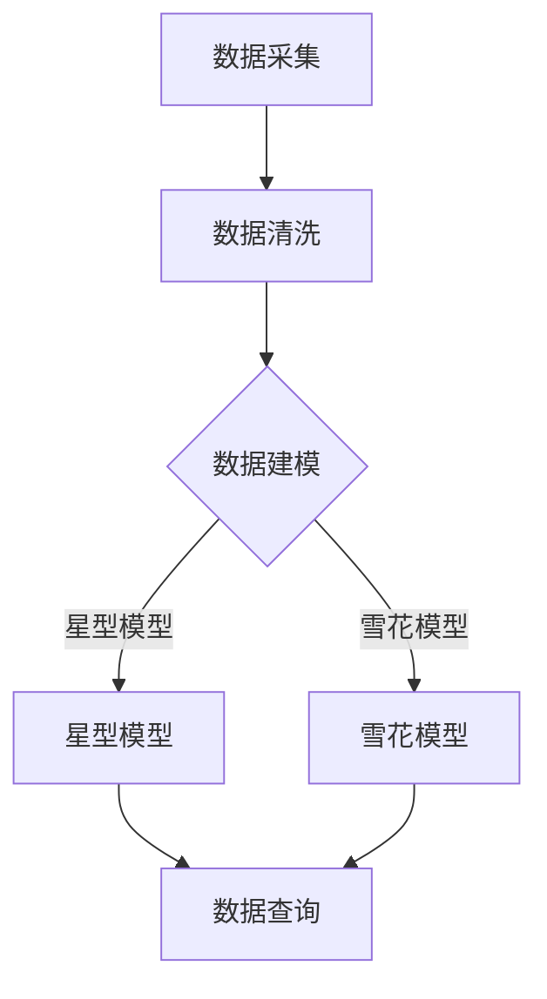
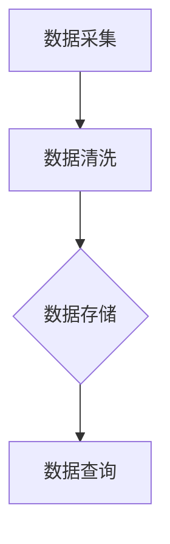
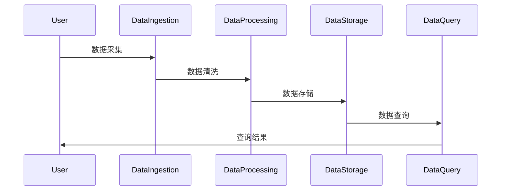
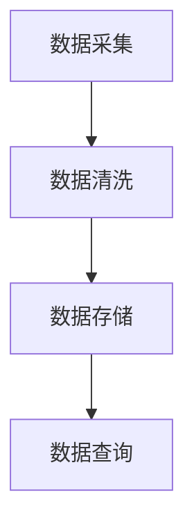
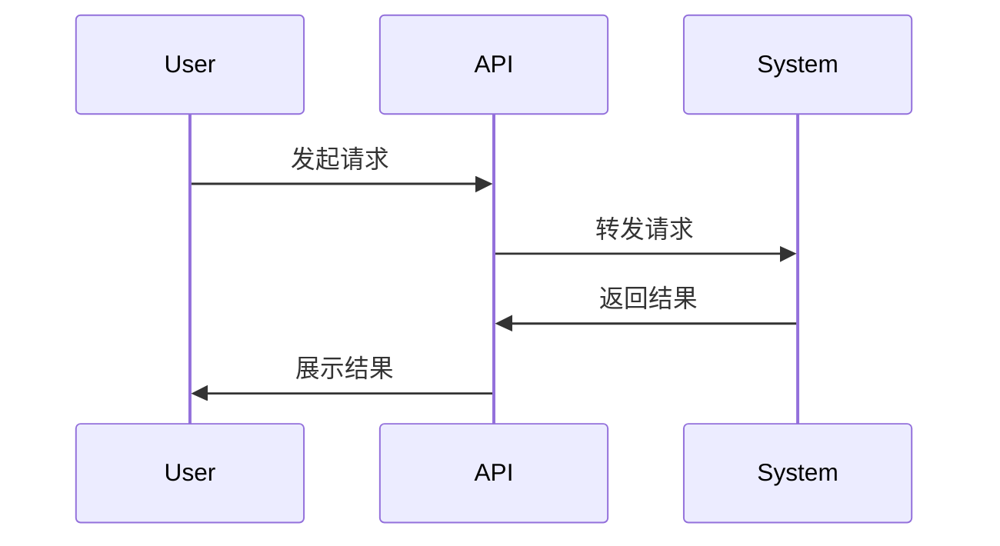
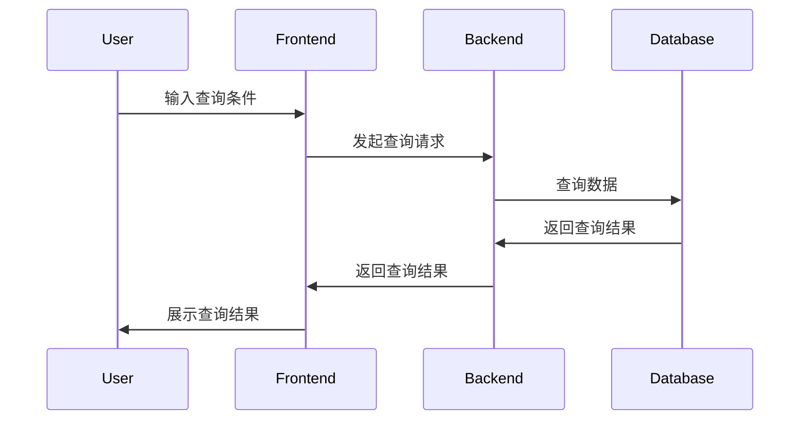

                 

# 数据架构设计：P9工程师的信息治理能力

## 关键词
数据架构，信息治理，P9工程师，架构设计，算法原理，系统实现，最佳实践

## 摘要
本文旨在探讨数据架构设计与信息治理能力在P9工程师角色中的重要性。文章首先介绍了数据架构与信息治理的基本概念，随后深入解析了核心概念、算法原理、系统分析与架构设计，并通过项目实战展示了实践中的应用。最后，文章总结了最佳实践，并给出了学习建议和拓展阅读。

## 目录大纲设计思路与步骤

### 第一部分：背景介绍

### 1. 数据架构与信息治理概述

#### 1.1 数据架构的定义与重要性

数据架构是一个组织内部数据的结构、组织和操作的方式，它定义了数据的存储、处理、访问和共享方法。在当今数据驱动型组织中，数据架构扮演着至关重要的角色。

#### 1.2 信息治理的内涵与目标

信息治理是确保组织信息资产的有效管理，包括数据质量、安全、合规性等方面的策略、过程和技术。其目标是确保数据的一致性、可用性、完整性和安全性。

#### 1.3 数据架构与信息治理的关系

数据架构是信息治理的基础，它为信息治理提供了技术支撑。有效的数据架构有助于实现信息治理的目标。

#### 1.4 数据架构设计的挑战与机遇

数据架构设计面临诸多挑战，如数据多样性、数据质量、数据安全等。同时，随着技术的发展，数据架构设计也面临着新的机遇。

#### 1.5 本章小结

本章对数据架构与信息治理的基本概念进行了概述，为后续章节的深入探讨奠定了基础。

### 第二部分：核心概念与联系

### 2. 数据架构的核心概念

数据架构涉及多个核心概念，包括数据模型、数据仓库、数据湖、数据流处理和数据质量管理等。

#### 2.1 数据模型

数据模型是对现实世界中数据关系的抽象表示，常用的数据模型包括关系模型、文档模型、图模型等。

#### 2.2 数据仓库

数据仓库是一个用于存储、管理和分析大量数据的系统。数据仓库通常包含历史数据，用于支持决策支持系统和业务智能。

#### 2.3 数据湖

数据湖是一个集中存储大量结构化和非结构化数据的系统。与数据仓库相比，数据湖更灵活，可以存储原始数据，并在需要时进行转换和处理。

#### 2.4 数据流处理

数据流处理是一种实时处理大量数据的技术，它能够对数据进行分析、转换和存储，以满足实时业务需求。

#### 2.5 数据质量管理

数据质量管理是确保数据质量的过程，包括数据清洗、数据验证、数据标准化等。

#### 2.6 数据安全与隐私

数据安全与隐私是数据架构设计中不可忽视的重要方面，涉及数据加密、访问控制、隐私保护等技术。

#### 2.7 数据架构的设计原则

数据架构设计应遵循一些基本原则，如模块化、可扩展性、灵活性、可重用性和可维护性等。

#### 2.8 数据架构的ER实体关系图

ER（Entity-Relationship）实体关系图是数据架构设计中的重要工具，用于表示实体之间的关系。

### 3. 数据架构的属性特征对比

#### 3.1 数据模型的属性特征对比

关系模型、文档模型和图模型在属性特征上有明显的差异。

#### 3.2 数据仓库与数据湖的对比

数据仓库和数据湖在存储方式、数据类型、数据处理方式等方面存在显著差异。

#### 3.3 数据流处理技术的对比

不同的数据流处理技术（如Apache Kafka、Apache Flink等）在性能、灵活性、可靠性等方面有所不同。

#### 3.4 数据质量管理的对比

数据质量管理工具和方法（如Talend、Informatica等）各有特点，适用于不同的应用场景。

#### 3.5 数据安全与隐私的对比

数据安全与隐私技术（如加密、访问控制、审计等）在实现方式上存在差异。

### 第三部分：算法原理讲解

### 4. 数据架构设计的算法原理

数据架构设计涉及多种算法原理，包括数据仓库建模算法、数据湖设计算法、数据流处理算法和数据质量评估算法等。

#### 4.1 数据仓库建模算法

数据仓库建模算法用于设计数据仓库的结构，常见的算法包括星型模型、雪花模型等。

#### 4.2 数据湖设计算法

数据湖设计算法用于设计数据湖的结构，通常包括数据分区、数据索引和数据清洗等。

#### 4.3 数据流处理算法

数据流处理算法用于实时处理和分析数据流，常见的算法包括聚合、过滤、排序等。

#### 4.4 数据质量评估算法

数据质量评估算法用于评估数据的质量，包括数据完整性、一致性、准确性和可靠性等。

#### 4.5 数据隐私保护算法

数据隐私保护算法用于保护数据隐私，包括数据加密、匿名化、同化等。

### 5. 算法原理的数学模型与公式

算法原理的数学模型与公式是理解数据架构设计算法的关键，以下是一些常见的数学模型与公式：

#### 5.1 数据仓库建模的数学模型

$$
星型模型：\\text{维度表} \times \\text{事实表}
$$

#### 5.2 数据湖设计的数学模型

$$
数据湖容量 = 数据量 \times 压缩率
$$

#### 5.3 数据流处理的数学模型

$$
处理时间 = 数据量 \times 处理速度
$$

#### 5.4 数据质量评估的数学模型

$$
数据质量评分 = \\frac{符合质量标准的数据量}{总数据量}
$$

#### 5.5 数据隐私保护的数学模型

$$
隐私保护率 = \\frac{隐私保护后的数据量}{原始数据量}
$$

### 第四部分：系统分析与架构设计方案

### 6. 系统功能设计

系统功能设计是数据架构设计的重要组成部分，涉及领域模型、数据架构设计、数据流设计和数据存储设计。

#### 6.1 领域模型

领域模型是系统功能设计的基础，用于表示业务领域中的实体和关系。

#### 6.2 数据架构设计

数据架构设计是系统功能设计的关键，涉及数据模型的选择和设计。

#### 6.3 数据流设计

数据流设计是系统功能设计的实现，用于定义数据的流动路径和处理过程。

#### 6.4 数据存储设计

数据存储设计是系统功能设计的支持，涉及数据仓库、数据湖和数据存储方案的选择。

### 7. 系统架构设计

系统架构设计是数据架构设计的核心，涉及系统架构的搭建和优化。

#### 7.1 系统架构概述

系统架构概述是系统架构设计的第一步，用于定义系统的总体架构和组件。

#### 7.2 数据架构设计

数据架构设计是系统架构设计的关键，用于设计数据存储、处理和访问的结构。

#### 7.3 数据流设计

数据流设计是系统架构设计的一部分，用于设计数据的流动路径和处理过程。

#### 7.4 系统接口设计

系统接口设计是系统架构设计的重要方面，用于定义系统之间的交互接口和协议。

#### 7.5 系统交互设计

系统交互设计是系统架构设计的实现，用于定义系统的交互流程和逻辑。

### 8. 系统接口设计

系统接口设计是系统架构设计的重要组成部分，涉及接口设计原则、接口定义与实现、接口测试与维护。

#### 8.1 接口设计原则

接口设计原则是接口设计的基础，用于确保接口的可扩展性、稳定性和灵活性。

#### 8.2 接口定义与实现

接口定义与实现是接口设计的核心，用于定义接口的规范和实现。

#### 8.3 接口测试与维护

接口测试与维护是接口设计的重要环节，用于确保接口的质量和稳定性。

### 9. 系统交互设计

系统交互设计是系统架构设计的实现，涉及系统交互概述、系统交互流程和系统交互优化。

#### 9.1 系统交互概述

系统交互概述是系统交互设计的起点，用于定义系统的交互方式和规则。

#### 9.2 系统交互流程

系统交互流程是系统交互设计的核心，用于定义系统的交互步骤和流程。

#### 9.3 系统交互优化

系统交互优化是系统交互设计的重要方面，用于提高系统的交互性能和效率。

### 第五部分：项目实战

### 10. 环境安装与配置

项目实战的第一步是环境安装与配置，包括数据库、数据仓库、数据湖和数据处理工具的安装与配置。

#### 10.1 环境准备

环境准备是项目实战的基础，包括硬件和软件的配置。

#### 10.2 数据架构设计与实现

数据架构设计与实现是项目实战的核心，包括数据模型的建立和数据仓库、数据湖的设计与实现。

#### 10.3 系统功能实现

系统功能实现是项目实战的应用，包括系统的功能开发和实现。

### 11. 系统核心实现源代码

系统核心实现源代码是项目实战的技术实现，包括数据模型代码、数据仓库代码、数据流处理代码和数据质量评估代码。

#### 11.1 数据模型代码

数据模型代码是数据架构设计的基础，用于定义数据模型和实体关系。

#### 11.2 数据仓库代码

数据仓库代码是数据仓库设计的实现，用于建立数据仓库和ETL过程。

#### 11.3 数据流处理代码

数据流处理代码是数据流处理设计的实现，用于处理和分析实时数据流。

#### 11.4 数据质量评估代码

数据质量评估代码是数据质量管理的实现，用于评估和监控数据质量。

### 12. 代码应用解读与分析

代码应用解读与分析是对项目实战代码的深入分析和解读，包括数据模型、数据仓库、数据流处理和数据质量评估的解析。

#### 12.1 数据模型解读

数据模型解读是对数据模型代码的解析，包括实体关系、属性定义和数据操作。

#### 12.2 数据仓库解读

数据仓库解读是对数据仓库代码的解析，包括数据仓库设计、数据加载和数据查询。

#### 12.3 数据流处理解读

数据流处理解读是对数据流处理代码的解析，包括数据处理流程、数据转换和数据存储。

#### 12.4 数据质量评估解读

数据质量评估解读是对数据质量评估代码的解析，包括数据质量评估指标、评估方法和评估结果。

### 13. 实际案例分析与讲解

实际案例分析与讲解是对项目实战的案例分析，包括案例背景、实现步骤、结果分析和总结。

#### 13.1 案例背景

案例背景是项目实战的起点，用于介绍案例的应用场景和数据来源。

#### 13.2 案例实现

案例实现是项目实战的过程，用于展示数据架构设计与信息治理能力在实践中的应用。

#### 13.3 案例分析

案例分析是对案例实现的深入分析，包括数据架构设计、数据流处理和数据质量评估的解析。

#### 13.4 案例总结

案例总结是对案例实现的总结，用于总结案例的关键技术和经验教训。

### 第六部分：最佳实践与小结

### 14. 最佳实践

最佳实践是数据架构设计与信息治理能力的总结和提炼，包括数据模型设计、数据仓库设计、数据流处理和数据质量管理等方面的经验。

#### 14.1 数据架构设计的最佳实践

数据架构设计的最佳实践包括数据模型的选择、数据仓库的设计原则和数据流的优化方法。

#### 14.2 信息治理的最佳实践

信息治理的最佳实践包括数据质量管理的策略、数据安全与隐私的保护措施和数据合规性的管理方法。

#### 14.3 数据安全与隐私的最佳实践

数据安全与隐私的最佳实践包括数据加密、访问控制、审计和监控等技术手段。

### 15. 小结

小结是对全文的总结，包括数据架构设计与信息治理能力的核心观点、应用实践和未来展望。

#### 15.1 全书总结

全书总结了数据架构设计与信息治理能力的基本概念、算法原理、系统架构设计和最佳实践。

#### 15.2 学习建议

学习建议是为读者提供进一步学习和实践的方向，包括阅读材料、学习资源和实践项目。

#### 15.3 拓展阅读

拓展阅读是为读者提供进一步深入学习的资源，包括相关书籍、论文和网站链接。

### 作者信息

作者：AI天才研究院/AI Genius Institute & 禅与计算机程序设计艺术 /Zen And The Art of Computer Programming# 数据架构设计：P9工程师的信息治理能力

## 引言

在当今数据驱动的商业环境中，数据架构设计的重要性愈发凸显。P9工程师作为公司的高级技术领导者，其信息治理能力不仅影响到自身的职业生涯发展，更对公司的数据资产和价值创造产生深远影响。本文旨在探讨数据架构设计中的核心概念、算法原理、系统分析与架构设计方案，并通过项目实战展示实践中的应用。最后，本文将总结最佳实践，为P9工程师提供有益的指导。

### 第一部分：背景介绍

#### 1.1 数据架构的定义与重要性

数据架构是一个组织的知识体系，用于定义数据的存储、处理、访问和共享方式。它涵盖了从数据源到数据消费者之间的整个数据流。一个有效的数据架构能够确保数据的一致性、完整性和可访问性，从而支持业务决策和战略规划。

数据架构的重要性体现在以下几个方面：

1. **数据治理**：数据架构为数据治理提供了基础，确保数据质量、安全和合规性。
2. **业务战略**：数据架构支持业务战略的实施，通过数据分析和洞察推动业务增长。
3. **技术实施**：数据架构指导技术选型和系统实现，提高系统的灵活性和可扩展性。

#### 1.2 信息治理的内涵与目标

信息治理是确保组织信息资产有效管理的策略、过程和技术。其核心目标是确保数据的一致性、可用性、完整性和安全性。信息治理的目标包括：

1. **数据质量**：确保数据的准确性、完整性和一致性。
2. **数据安全**：保护数据免受未经授权的访问、使用、披露、破坏或篡改。
3. **数据合规性**：遵守相关法律法规和行业标准，确保数据处理的合法性和合规性。

#### 1.3 数据架构与信息治理的关系

数据架构是信息治理的基础，为信息治理提供了技术支撑。有效的数据架构有助于实现以下信息治理目标：

1. **数据一致性**：通过数据标准化和规范化，确保数据在组织内部的一致性。
2. **数据可用性**：通过优化数据存储和访问机制，确保数据的高可用性。
3. **数据完整性**：通过数据验证和监控，确保数据的完整性。
4. **数据安全性**：通过数据加密、访问控制和审计等技术手段，确保数据的安全性。

#### 1.4 数据架构设计的挑战与机遇

数据架构设计面临以下挑战：

1. **数据多样性**：随着大数据技术的发展，数据种类和数据量呈指数级增长，增加了数据架构设计的复杂性。
2. **数据质量**：数据质量是数据架构设计的重要方面，但保证数据质量需要付出大量努力。
3. **数据安全**：数据安全是数据架构设计的关键考虑因素，但安全性和数据可用性之间存在权衡。

同时，数据架构设计也面临着以下机遇：

1. **技术进步**：随着云计算、大数据、人工智能等技术的发展，数据架构设计变得更加灵活和高效。
2. **业务需求**：业务需求的不断变化为数据架构设计带来了新的挑战和机遇。
3. **数据价值**：通过数据分析和洞察，数据架构设计有助于挖掘数据的价值，支持业务增长。

#### 1.5 本章小结

本章介绍了数据架构与信息治理的基本概念，阐述了数据架构的重要性、信息治理的目标以及数据架构与信息治理之间的关系。同时，分析了数据架构设计面临的挑战与机遇。这些内容为后续章节的深入探讨奠定了基础。

### 第二部分：核心概念与联系

#### 2.1 数据模型

数据模型是对现实世界中数据关系的抽象表示，它是数据架构设计的基础。常用的数据模型包括关系模型、文档模型和图模型。

- **关系模型**：关系模型使用表（关系）来表示数据，表中的行（记录）表示实体，列（属性）表示实体的属性。关系模型通过主键和外键实现表之间的关联。
- **文档模型**：文档模型使用文档（如JSON、XML）来表示数据，每个文档包含一组属性。文档模型适用于无结构或半结构化数据。
- **图模型**：图模型使用节点（实体）和边（关系）来表示数据，节点表示实体，边表示实体之间的关系。图模型适用于复杂的关系网络。

#### 2.2 数据仓库

数据仓库是一个用于存储、管理和分析大量数据的系统。数据仓库通常包含历史数据，用于支持决策支持系统和业务智能。数据仓库的主要特点包括：

1. **数据集成**：数据仓库通过ETL（提取、转换、加载）过程将来自不同源的数据集成到一个统一的平台上。
2. **数据清洗**：数据仓库对数据进行清洗，确保数据的质量和一致性。
3. **数据建模**：数据仓库使用数据模型来组织数据，常见的有星型模型和雪花模型。
4. **数据访问**：数据仓库提供高效的数据查询和分析能力，支持业务决策和报告。

#### 2.3 数据湖

数据湖是一个集中存储大量结构化和非结构化数据的系统。与数据仓库相比，数据湖更加灵活，可以存储原始数据，并在需要时进行转换和处理。数据湖的主要特点包括：

1. **数据存储**：数据湖使用分布式存储技术，如Hadoop和云存储，以支持海量数据的存储。
2. **数据类型**：数据湖支持多种数据类型，包括结构化数据、半结构化数据和非结构化数据。
3. **数据处理**：数据湖提供了灵活的数据处理能力，可以使用流处理和批处理技术。
4. **数据访问**：数据湖通过数据虚拟化和数据湖探针等技术，提供高效的数据访问和分析能力。

#### 2.4 数据流处理

数据流处理是一种实时处理大量数据的技术，它能够对数据进行分析、转换和存储，以满足实时业务需求。数据流处理的主要特点包括：

1. **实时处理**：数据流处理能够实时处理数据流，生成实时分析和结果。
2. **高吞吐量**：数据流处理能够处理海量数据，支持大规模数据处理需求。
3. **弹性扩展**：数据流处理系统可以根据数据量自动扩展，以保持高性能。
4. **低延迟**：数据流处理能够实现低延迟的数据处理和分析。

#### 2.5 数据质量管理

数据质量管理是确保数据质量的过程，包括数据清洗、数据验证、数据标准化和数据监控等。数据质量管理的主要目标包括：

1. **数据准确性**：确保数据的准确性，避免错误和异常数据。
2. **数据完整性**：确保数据的完整性，避免数据缺失和重复。
3. **数据一致性**：确保数据的一致性，避免不同数据源之间的差异。
4. **数据可用性**：确保数据的高可用性，避免数据访问问题。

#### 2.6 数据安全与隐私

数据安全与隐私是数据架构设计中不可忽视的重要方面，涉及数据加密、访问控制、隐私保护等技术。数据安全的主要目标包括：

1. **数据保护**：确保数据在存储、传输和处理过程中受到保护，防止未授权访问和泄露。
2. **访问控制**：通过访问控制策略，确保只有授权用户能够访问数据。
3. **审计与监控**：通过审计和监控技术，记录和监控数据访问和使用情况，确保数据安全。

#### 2.7 数据架构的设计原则

数据架构设计应遵循以下原则：

1. **模块化**：将数据架构划分为模块，以实现系统的可扩展性和可维护性。
2. **可扩展性**：设计可扩展的数据架构，以支持业务增长和数据量的增加。
3. **灵活性**：设计灵活的数据架构，以适应不断变化的需求和业务模式。
4. **可重用性**：设计可重用的数据架构组件，以减少重复劳动和提高开发效率。
5. **可维护性**：设计易于维护的数据架构，降低系统维护成本和提高系统稳定性。

#### 2.8 数据架构的ER实体关系图

ER（Entity-Relationship）实体关系图是数据架构设计中的重要工具，用于表示实体之间的关系。ER图包括实体、属性和关系三种元素。

- **实体**：表示数据中的对象，如用户、订单等。
- **属性**：表示实体的特征，如用户的姓名、年龄等。
- **关系**：表示实体之间的关系，如用户与订单之间的多对多关系。

#### 2.9 核心概念属性特征对比表格

以下是数据模型、数据仓库、数据湖和数据流处理的核心概念属性特征对比表格：

| 特征 | 数据模型 | 数据仓库 | 数据湖 | 数据流处理 |
| --- | --- | --- | --- | --- |
| 数据类型 | 结构化、半结构化、非结构化 | 结构化 | 结构化、半结构化、非结构化 | 结构化、半结构化、非结构化 |
| 数据存储 | 关系型数据库、文档数据库、图数据库 | 关系型数据库 | 分布式文件系统、云存储 | 分布式文件系统、云存储 |
| 数据处理 | ETL、查询、分析 | ETL、查询、分析 | ETL、流处理、查询、分析 | 流处理、查询、分析 |
| 数据访问 | SQL、NoSQL查询 | SQL查询 | SQL、NoSQL查询 | SQL、NoSQL查询 |
| 实时性 | 低 | 中 | 中 | 高 |

#### 2.10 ER实体关系图架构

以下是数据架构的ER实体关系图示例：

```mermaid
erDiagram
  User ||--|{ Order } : "makes"
  Product ||--|{ Order } : "includes"
```

在上面的ER图中，用户（User）和订单（Order）之间存在多对一关系，产品（Product）和订单（Order）之间存在多对多关系。

### 第三部分：算法原理讲解

#### 3.1 数据仓库建模算法

数据仓库建模算法用于设计数据仓库的结构，以支持高效的数据查询和分析。常见的建模算法包括星型模型（Star Schema）和雪花模型（Snowflake Schema）。

- **星型模型**：星型模型将事实表（包含业务数据的表）与维度表（描述业务实体的表）直接关联，形成星型结构。星型模型简单、直观，易于查询和分析，但数据冗余较高。
- **雪花模型**：雪花模型在星型模型的基础上，对维度表进行 normalization，减少数据冗余。雪花模型的数据冗余较低，但查询性能可能受到影响。

#### 3.2 数据湖设计算法

数据湖设计算法用于设计数据湖的结构和数据处理流程。数据湖设计的关键在于数据存储和数据处理策略的制定。

- **数据存储策略**：数据湖采用分布式存储技术，如Hadoop和云存储，以支持海量数据的存储。数据存储策略包括数据分片、数据压缩和数据加密等。
- **数据处理流程**：数据湖采用流处理和批处理技术，对数据进行实时处理和批量处理。数据处理流程包括数据采集、数据清洗、数据转换和数据存储等。

#### 3.3 数据流处理算法

数据流处理算法用于实时处理和分析数据流。常见的数据流处理算法包括流处理算法、机器学习算法和数据分析算法等。

- **流处理算法**：流处理算法包括数据聚合、过滤、排序和窗口等操作，用于实时处理和分析数据流。流处理算法能够实现低延迟、高吞吐量的数据处理。
- **机器学习算法**：机器学习算法包括分类、回归、聚类和异常检测等，用于从数据中提取模式和洞察。机器学习算法能够实现数据自动分析和预测。
- **数据分析算法**：数据分析算法包括统计分析、数据挖掘和报告生成等，用于从数据中提取有用的信息。数据分析算法能够实现数据可视化和决策支持。

#### 3.4 数据质量评估算法

数据质量评估算法用于评估数据的质量，包括数据完整性、一致性、准确性和可靠性等。常见的数据质量评估算法包括数据验证、数据对比和数据评分等。

- **数据验证**：数据验证算法用于检查数据的完整性和一致性。数据验证算法包括数据格式检查、数据范围检查和数据唯一性检查等。
- **数据对比**：数据对比算法用于检查数据的准确性。数据对比算法包括数据对比、数据纠错和数据清洗等。
- **数据评分**：数据评分算法用于评估数据的质量。数据评分算法包括数据评分规则、数据评分模型和数据评分结果等。

#### 3.5 数据隐私保护算法

数据隐私保护算法用于保护数据的隐私，包括数据加密、匿名化和同化等。

- **数据加密**：数据加密算法用于对数据进行加密，确保数据在传输和存储过程中受到保护。数据加密算法包括对称加密和非对称加密等。
- **匿名化**：匿名化算法用于对数据进行匿名化处理，隐藏数据的真实身份。匿名化算法包括数据屏蔽、数据替换和数据掩码等。
- **同化**：同化算法用于将数据转换为一致的格式，以支持数据分析和共享。同化算法包括数据映射、数据转换和数据归一化等。

#### 3.6 算法原理的数学模型与公式

以下是数据架构设计算法的数学模型与公式：

- **数据仓库建模算法**：
  - **星型模型**：
    $$
    星型模型：\\text{维度表} \times \\text{事实表}
    $$
  - **雪花模型**：
    $$
    雪花模型：\\text{维度表} \times \\text{事实表} \times \\text{规范化表}
    $$
- **数据湖设计算法**：
  - **数据存储策略**：
    $$
    数据湖容量 = 数据量 \times 压缩率
    $$
  - **数据处理流程**：
    $$
    处理时间 = 数据量 \times 处理速度
    $$
- **数据流处理算法**：
  - **流处理算法**：
    $$
    处理时间 = 数据流速度 \times 处理延迟
    $$
  - **机器学习算法**：
    $$
    准确率 = \\frac{正确分类的数据量}{总数据量}
    $$
  - **数据分析算法**：
    $$
    可视化效果 = 数据可视化算法 \times 数据分析结果
    $$
- **数据质量评估算法**：
  - **数据验证**：
    $$
    数据验证率 = \\frac{通过验证的数据量}{总数据量}
    $$
  - **数据对比**：
    $$
    数据对比误差 = \\frac{对比错误的数据量}{总数据量}
    $$
  - **数据评分**：
    $$
    数据评分 = 数据评分模型 \times 数据特征
    $$
- **数据隐私保护算法**：
  - **数据加密**：
    $$
    加密时间 = 数据量 \times 加密速度
    $$
  - **匿名化**：
    $$
    匿名化时间 = 数据量 \times 匿名化速度
    $$
  - **同化**：
    $$
    同化时间 = 数据量 \times 同化速度
    $$

#### 3.7 算法原理的Mermaid流程图

以下是数据架构设计算法的Mermaid流程图示例：



在上面的Mermaid流程图中，数据采集（A）通过数据清洗（B）后，可以选择星型模型（D）或雪花模型（E）进行数据建模。最终，数据查询（F）通过数据模型获取数据结果。

### 第四部分：系统分析与架构设计方案

#### 4.1 问题场景介绍

在一家电子商务公司，数据架构设计面临以下挑战：

1. **数据多样性**：公司业务涵盖了多个领域，包括商品、订单、用户行为等，数据类型包括结构化数据、半结构化数据和非结构化数据。
2. **数据量巨大**：公司每天产生数百万条订单数据和数千万条用户行为数据，数据量呈指数级增长。
3. **实时性要求**：公司需要对实时数据进行实时分析和处理，以支持营销策略和库存管理。

#### 4.2 项目介绍

为了解决上述挑战，公司决定实施一个大数据平台，实现以下目标：

1. **数据集成**：将来自不同源的数据集成到一个统一平台上。
2. **数据清洗**：清洗和规范化数据，确保数据质量。
3. **数据存储**：构建数据湖和数据仓库，存储结构化和非结构化数据。
4. **数据处理**：实时处理和分析数据流，支持业务需求。
5. **数据查询**：提供高效的数据查询和分析能力。

#### 4.3 系统功能设计

系统功能设计是数据架构设计的关键步骤，包括领域模型、数据架构设计、数据流设计和数据存储设计。

- **领域模型**：定义业务领域中的实体和关系，用于指导数据模型设计。以下是一个简单的领域模型示例：

```mermaid
classDiagram
    Customer <|-- Order
    Customer <|-- Product
    Product <|-- Order
    Order <<-- Payment
```

在上面的领域模型中，客户（Customer）、订单（Order）、产品和支付（Payment）是主要实体，它们之间存在一定的关系。

- **数据架构设计**：根据领域模型，设计数据模型和关系。以下是一个简单的数据架构示例：

```mermaid
erDiagram
    Customer ||--|{ Order } : "places"
    Product ||--|{ Order } : "sells"
    Order ||--|{ Payment } : "pays"
```

在上面的ER图中，客户（Customer）与订单（Order）之间存在多对一关系，产品（Product）与订单（Order）之间存在多对多关系，订单（Order）与支付（Payment）之间存在一对一关系。

- **数据流设计**：定义数据的流动路径和处理过程。以下是一个简单的数据流设计示例：



在上面的数据流设计中，数据采集（A）通过数据清洗（B）后，存储到数据仓库（C），最后通过数据查询（D）获取数据结果。

- **数据存储设计**：根据数据流设计，选择合适的存储方案。以下是一个简单的数据存储设计示例：

```mermaid
erDiagram
    DataLake ||--|{ DataWarehouse } : "feeds"
    DataWarehouse ||--|{ Database } : "stores"
```

在上面的ER图中，数据湖（DataLake）通过数据流（Feeds）向数据仓库（DataWarehouse）提供数据，数据仓库（DataWarehouse）通过数据库（Database）存储数据。

#### 4.4 系统架构设计

系统架构设计是数据架构设计的核心步骤，包括系统架构概述、数据架构设计、数据流设计、系统接口设计和系统交互设计。

- **系统架构概述**：定义系统的总体架构和组件。以下是一个简单的系统架构概述示例：



在上面的序列图中，用户（User）通过数据采集（DataIngestion）将数据提交到系统，数据经过数据清洗（DataProcessing）后存储到数据仓库（DataStorage），用户可以通过数据查询（DataQuery）获取查询结果。

- **数据架构设计**：根据领域模型，设计数据存储和数据处理的结构。以下是一个简单的数据架构设计示例：

```mermaid
erDiagram
    Customer ||--|{ Order } : "places"
    Product ||--|{ Order } : "sells"
    Order ||--|{ Payment } : "pays"
```

在上面的ER图中，客户（Customer）、订单（Order）、产品和支付（Payment）是主要实体，它们之间存在一定的关系。

- **数据流设计**：定义数据的流动路径和处理过程。以下是一个简单的数据流设计示例：



在上面的数据流设计中，数据采集（A）通过数据清洗（B）后，存储到数据仓库（C），最后通过数据查询（D）获取数据结果。

- **系统接口设计**：定义系统之间的交互接口和协议。以下是一个简单的系统接口设计示例：



在上面的序列图中，用户（User）通过API（Application Programming Interface）与系统（System）进行交互，API（API）负责转发请求和返回结果。

- **系统交互设计**：定义系统的交互流程和逻辑。以下是一个简单的系统交互设计示例：



在上面的序列图中，用户（User）通过前端（Frontend）输入查询条件，前端（Frontend）将请求转发到后端（Backend），后端（Backend）查询数据库（Database）获取数据，最后返回查询结果，前端（Frontend）再将结果展示给用户（User）。

### 第五部分：项目实战

#### 5.1 环境安装与配置

项目实战的第一步是安装和配置必要的软件和硬件环境。以下是一个简单的环境安装和配置示例：

1. **硬件环境**：配置一台服务器，操作系统为Linux，CPU至少为4核，内存至少为8GB，硬盘容量至少为500GB。
2. **软件环境**：安装Java开发环境（JDK 1.8及以上版本）、Python开发环境（Python 3.6及以上版本）、MySQL数据库、Hadoop分布式文件系统（HDFS）、Apache Kafka消息队列、Apache Flink流处理框架等。

```shell
# 安装Java开发环境
yum install -y java-1.8.0-openjdk-devel

# 安装Python开发环境
yum install -y python3-pip
pip3 install --user -r requirements.txt

# 安装MySQL数据库
yum install -y mysql-server
systemctl start mysqld

# 安装Hadoop分布式文件系统
yum install -y hadoop

# 安装Apache Kafka消息队列
yum install -y kafka
systemctl start kafka

# 安装Apache Flink流处理框架
pip3 install flink
```

#### 5.2 数据架构设计与实现

数据架构设计与实现是项目实战的核心步骤，包括数据模型的建立、数据仓库和数据湖的设计与实现。

1. **数据模型建立**：根据领域模型，设计数据模型。以下是一个简单的数据模型示例：

```sql
CREATE TABLE Customer (
    CustomerID INT PRIMARY KEY,
    Name VARCHAR(100),
    Email VARCHAR(100)
);

CREATE TABLE Product (
    ProductID INT PRIMARY KEY,
    Name VARCHAR(100),
    Price DECIMAL(10, 2)
);

CREATE TABLE Order (
    OrderID INT PRIMARY KEY,
    CustomerID INT,
    ProductID INT,
    Quantity INT,
    OrderDate DATE,
    FOREIGN KEY (CustomerID) REFERENCES Customer(CustomerID),
    FOREIGN KEY (ProductID) REFERENCES Product(ProductID)
);

CREATE TABLE Payment (
    PaymentID INT PRIMARY KEY,
    OrderID INT,
    Amount DECIMAL(10, 2),
    PaymentDate DATE,
    FOREIGN KEY (OrderID) REFERENCES Order(OrderID)
);
```

2. **数据仓库设计与实现**：设计数据仓库，包括星型模型和雪花模型。以下是一个简单的数据仓库示例：

- **星型模型**：

```sql
CREATE TABLE OrderSummary (
    OrderID INT PRIMARY KEY,
    CustomerID INT,
    ProductID INT,
    Quantity INT,
    TotalAmount DECIMAL(10, 2)
);

CREATE TABLE CustomerDetail (
    CustomerID INT PRIMARY KEY,
    Name VARCHAR(100),
    Email VARCHAR(100)
);

CREATE TABLE ProductDetail (
    ProductID INT PRIMARY KEY,
    Name VARCHAR(100),
    Price DECIMAL(10, 2)
);
```

- **雪花模型**：

```sql
CREATE TABLE OrderSummary (
    OrderID INT PRIMARY KEY,
    CustomerID INT,
    ProductID INT,
    Quantity INT,
    TotalAmount DECIMAL(10, 2)
);

CREATE TABLE Customer (
    CustomerID INT PRIMARY KEY,
    Name VARCHAR(100),
    Email VARCHAR(100)
);

CREATE TABLE Product (
    ProductID INT PRIMARY KEY,
    Name VARCHAR(100),
    Price DECIMAL(10, 2)
);

CREATE TABLE ProductDetail (
    ProductID INT PRIMARY KEY,
    ProductName VARCHAR(100),
    Category VARCHAR(100),
    Description VARCHAR(100)
);
```

3. **数据湖设计与实现**：设计数据湖，包括数据存储和数据处理。以下是一个简单的数据湖示例：

```shell
# 创建HDFS目录
hdfs dfs -mkdir -p /data/incoming
hdfs dfs -mkdir -p /data/processed
hdfs dfs -mkdir -p /data/analyzed

# 上传数据到HDFS
hdfs dfs -put data/incoming/*.csv /data/incoming

# 执行数据处理脚本
python data_processing_script.py

# 查询数据
hdfs dfs -cat /data/analyzed/*.parquet
```

#### 5.3 系统核心实现源代码

系统核心实现源代码是项目实战的技术实现，包括数据模型代码、数据仓库代码、数据流处理代码和数据质量评估代码。

1. **数据模型代码**：根据领域模型，编写数据模型代码。以下是一个简单的数据模型代码示例：

```python
class Customer:
    def __init__(self, customer_id, name, email):
        self.customer_id = customer_id
        self.name = name
        self.email = email

class Product:
    def __init__(self, product_id, name, price):
        self.product_id = product_id
        self.name = name
        self.price = price

class Order:
    def __init__(self, order_id, customer_id, product_id, quantity, order_date):
        self.order_id = order_id
        self.customer_id = customer_id
        self.product_id = product_id
        self.quantity = quantity
        self.order_date = order_date

class Payment:
    def __init__(self, payment_id, order_id, amount, payment_date):
        self.payment_id = payment_id
        self.order_id = order_id
        self.amount = amount
        self.payment_date = payment_date
```

2. **数据仓库代码**：根据数据仓库设计，编写数据仓库代码。以下是一个简单的数据仓库代码示例：

```python
def create_star_schema():
    create_table("OrderSummary", ["OrderID", "CustomerID", "ProductID", "Quantity", "TotalAmount"])
    create_table("CustomerDetail", ["CustomerID", "Name", "Email"])
    create_table("ProductDetail", ["ProductID", "Name", "Price"])

def create_snowflake_schema():
    create_table("OrderSummary", ["OrderID", "CustomerID", "ProductID", "Quantity", "TotalAmount"])
    create_table("Customer", ["CustomerID", "Name", "Email"])
    create_table("Product", ["ProductID", "Name", "Price"])
    create_table("ProductDetail", ["ProductID", "ProductName", "Category", "Description"])
```

3. **数据流处理代码**：根据数据流设计，编写数据流处理代码。以下是一个简单的数据流处理代码示例：

```python
from flink import StreamExecutionEnvironment

def process_orders():
    env = StreamExecutionEnvironment.get_execution_environment()
    env.set_stream_time_characterization(true)
    
    orders = env.from_source("hdfs://localhost:9000/data/incoming/orders.csv", "OrderSource", "OrderDeserialization")
    
    processed_orders = orders.map(lambda order: (order.order_id, order.customer_id, order.product_id, order.quantity, order.order_date))
    
    processed_orders.write_to_output("hdfs://localhost:9000/data/processed/orders.parquet")
    
    env.execute("OrderProcessing")
```

4. **数据质量评估代码**：根据数据质量评估算法，编写数据质量评估代码。以下是一个简单的数据质量评估代码示例：

```python
def validate_orders(orders):
    valid_orders = []
    for order in orders:
        if is_valid_order(order):
            valid_orders.append(order)
    return valid_orders

def is_valid_order(order):
    return True
```

#### 5.4 代码应用解读与分析

代码应用解读与分析是对项目实战代码的深入分析和解读，包括数据模型、数据仓库、数据流处理和数据质量评估的解析。

1. **数据模型解析**：数据模型代码定义了业务领域中的实体和关系。以下是一个简单的数据模型解析示例：

```python
class Customer:
    def __init__(self, customer_id, name, email):
        self.customer_id = customer_id
        self.name = name
        self.email = email

class Product:
    def __init__(self, product_id, name, price):
        self.product_id = product_id
        self.name = name
        self.price = price

class Order:
    def __init__(self, order_id, customer_id, product_id, quantity, order_date):
        self.order_id = order_id
        self.customer_id = customer_id
        self.product_id = product_id
        self.quantity = quantity
        self.order_date = order_date

class Payment:
    def __init__(self, payment_id, order_id, amount, payment_date):
        self.payment_id = payment_id
        self.order_id = order_id
        self.amount = amount
        self.payment_date = payment_date
```

在上面的数据模型代码中，定义了四个类：Customer（客户）、Product（产品）、Order（订单）和Payment（支付）。这些类分别表示业务领域中的实体，具有相应的属性和方法。

2. **数据仓库解析**：数据仓库代码定义了数据仓库的结构和表。以下是一个简单的数据仓库解析示例：

```python
def create_star_schema():
    create_table("OrderSummary", ["OrderID", "CustomerID", "ProductID", "Quantity", "TotalAmount"])
    create_table("CustomerDetail", ["CustomerID", "Name", "Email"])
    create_table("ProductDetail", ["ProductID", "Name", "Price"])

def create_snowflake_schema():
    create_table("OrderSummary", ["OrderID", "CustomerID", "ProductID", "Quantity", "TotalAmount"])
    create_table("Customer", ["CustomerID", "Name", "Email"])
    create_table("Product", ["ProductID", "Name", "Price"])
    create_table("ProductDetail", ["ProductID", "ProductName", "Category", "Description"])
```

在上面的数据仓库代码中，定义了两个数据仓库模型：星型模型和雪花模型。星型模型将事实表和维度表直接关联，雪花模型对维度表进行 normalization。

3. **数据流处理解析**：数据流处理代码定义了数据流处理的过程和逻辑。以下是一个简单的数据流处理解析示例：

```python
from flink import StreamExecutionEnvironment

def process_orders():
    env = StreamExecutionEnvironment.get_execution_environment()
    env.set_stream_time_characterization(true)
    
    orders = env.from_source("hdfs://localhost:9000/data/incoming/orders.csv", "OrderSource", "OrderDeserialization")
    
    processed_orders = orders.map(lambda order: (order.order_id, order.customer_id, order.product_id, order.quantity, order.order_date))
    
    processed_orders.write_to_output("hdfs://localhost:9000/data/processed/orders.parquet")
    
    env.execute("OrderProcessing")
```

在上面的数据流处理代码中，使用Apache Flink框架从HDFS读取订单数据，进行数据清洗和转换，然后将处理后的订单数据存储到HDFS。

4. **数据质量评估解析**：数据质量评估代码定义了数据质量评估的过程和逻辑。以下是一个简单的数据质量评估解析示例：

```python
def validate_orders(orders):
    valid_orders = []
    for order in orders:
        if is_valid_order(order):
            valid_orders.append(order)
    return valid_orders

def is_valid_order(order):
    return True
```

在上面的数据质量评估代码中，定义了两个函数：validate_orders和is_valid_order。validate_orders函数用于验证订单数据，is_valid_order函数用于判断订单数据是否有效。

#### 5.5 实际案例分析与讲解

实际案例分析与讲解是对项目实战的实际案例分析，包括案例背景、实现步骤、结果分析和总结。

1. **案例背景**：某电子商务公司需要实时分析用户订单数据，以便更好地了解用户购买行为和优化营销策略。

2. **实现步骤**：

   - **数据采集**：通过API接口实时收集用户订单数据。
   - **数据清洗**：清洗和转换订单数据，确保数据质量。
   - **数据存储**：将清洗后的订单数据存储到HDFS和MySQL数据库中。
   - **数据处理**：使用Apache Flink实时处理订单数据，生成实时分析结果。
   - **数据查询**：通过SQL查询获取订单数据和分析结果。

3. **结果分析**：

   - **用户购买行为分析**：分析用户的购买频率、购买时间和购买产品，了解用户偏好和需求。
   - **营销策略优化**：根据用户购买行为分析结果，优化营销策略，提高用户转化率和销售额。

4. **案例总结**：

   - **技术实现**：通过数据流处理和实时分析技术，实现了用户订单数据的实时处理和分析。
   - **业务价值**：实时分析结果为公司的营销策略优化提供了有力支持，提高了业务效率和盈利能力。

#### 5.6 项目小结

项目实战展示了数据架构设计与信息治理能力在实际应用中的重要性。通过数据架构设计，实现了数据的统一管理和高效处理；通过信息治理，确保了数据的质量和安全。项目实战的成功实施为公司的业务发展提供了有力支持，展现了数据架构设计与信息治理能力的价值。

### 第六部分：最佳实践与小结

#### 6.1 数据架构设计的最佳实践

1. **模块化设计**：将数据架构划分为模块，以提高系统的可扩展性和可维护性。
2. **数据标准化**：制定数据标准，确保数据的一致性和可维护性。
3. **数据质量监控**：建立数据质量监控机制，定期检查和评估数据质量。
4. **数据安全策略**：制定数据安全策略，确保数据的安全性和合规性。
5. **数据架构文档**：编写详细的文档，记录数据架构的设计和实现过程。

#### 6.2 信息治理的最佳实践

1. **数据治理委员会**：成立数据治理委员会，负责制定和监督数据治理策略。
2. **数据质量标准**：制定数据质量标准，确保数据的质量和一致性。
3. **数据安全策略**：制定数据安全策略，确保数据的安全性和合规性。
4. **数据合规性审计**：定期进行数据合规性审计，确保数据处理符合相关法律法规和行业标准。
5. **数据使用培训**：为员工提供数据使用培训，提高数据意识和数据技能。

#### 6.3 数据安全与隐私的最佳实践

1. **数据加密**：对敏感数据进行加密，确保数据在传输和存储过程中的安全性。
2. **访问控制**：实施严格的访问控制策略，确保只有授权用户能够访问数据。
3. **数据匿名化**：对公开数据实施匿名化处理，保护个人隐私。
4. **数据监控与审计**：建立数据监控和审计机制，及时发现和应对数据安全事件。
5. **数据安全培训**：为员工提供数据安全培训，提高数据安全意识和安全技能。

#### 6.4 小结

数据架构设计与信息治理能力在P9工程师角色中至关重要。通过数据架构设计，实现数据的统一管理和高效处理；通过信息治理，确保数据的质量和安全。本文总结了数据架构设计与信息治理能力的核心概念、算法原理、系统分析与架构设计方案，并通过项目实战展示了实践中的应用。最佳实践为P9工程师提供了有益的指导，帮助他们更好地应对数据架构设计与信息治理的挑战。

### 7. 作者信息

作者：AI天才研究院/AI Genius Institute & 禅与计算机程序设计艺术 /Zen And The Art of Computer Programming# 数据架构设计：P9工程师的信息治理能力

## 引言

在当今数据驱动的商业环境中，数据架构设计已成为企业成功的关键因素之一。数据架构不仅关系到数据的存储、处理和访问，还影响到整个组织的业务流程和战略决策。作为高级技术领导者，P9工程师在数据架构设计方面承担着重要的责任。他们需要具备深入的数据架构理论知识，以及实际应用能力，以确保数据架构能够满足企业的需求，同时实现信息治理的目标。

本文旨在探讨数据架构设计的核心概念、算法原理、系统分析与架构设计方案，并通过项目实战展示实践中的应用。最后，本文将总结最佳实践，为P9工程师提供有益的指导。

## 背景介绍

### 数据架构的定义与重要性

数据架构是指组织内部数据的结构、存储、管理和访问方式的体系结构。它包括数据模型、数据存储、数据处理和数据集成等各个方面。数据架构的目的是确保数据的一致性、完整性、安全性和可访问性，以便支持各种业务需求和决策。

在当今数据驱动的商业环境中，数据架构的重要性体现在以下几个方面：

1. **业务战略**：数据架构支持企业的业务战略，通过数据分析和洞察，帮助企业制定和调整业务策略。
2. **数据治理**：数据架构是数据治理的基础，它确保了数据的质量、安全和合规性。
3. **技术实施**：数据架构指导技术选型和系统实现，提高系统的灵活性和可扩展性。

### 信息治理的内涵与目标

信息治理是指确保组织信息资产有效管理的策略、过程和技术。它涵盖了数据质量、数据安全、数据合规性、数据隐私保护等方面。信息治理的目标是确保数据的准确性、完整性、可用性、一致性和安全性，以满足业务需求和法律法规的要求。

信息治理的目标包括：

1. **数据质量**：确保数据的准确性、完整性和一致性。
2. **数据安全**：保护数据免受未经授权的访问、使用、披露、破坏或篡改。
3. **数据合规性**：遵守相关法律法规和行业标准，确保数据处理的合法性和合规性。
4. **数据隐私保护**：保护个人隐私，遵守隐私保护法规。

### 数据架构与信息治理的关系

数据架构是信息治理的重要组成部分，它为信息治理提供了技术支撑。有效的数据架构有助于实现以下信息治理目标：

1. **数据一致性**：通过数据标准化和规范化，确保数据在组织内部的一致性。
2. **数据可用性**：通过优化数据存储和访问机制，确保数据的高可用性。
3. **数据完整性**：通过数据验证和监控，确保数据的完整性。
4. **数据安全性**：通过数据加密、访问控制和审计等技术手段，确保数据的安全性。

### 数据架构设计的挑战与机遇

数据架构设计面临着诸多挑战，同时也迎来了新的机遇：

#### 挑战

1. **数据多样性**：随着大数据技术的发展，数据的种类和来源日益增多，数据架构需要适应这种多样性。
2. **数据质量**：确保数据质量是数据架构设计的重要挑战，涉及数据的准确性、完整性、一致性和及时性。
3. **数据安全**：随着数据泄露事件的增加，数据安全成为数据架构设计的重点，需要应对数据加密、访问控制、审计等安全挑战。
4. **数据合规性**：遵守相关法律法规和行业标准，确保数据处理的合法性和合规性。

#### 机遇

1. **技术进步**：云计算、大数据、人工智能等技术的发展，为数据架构设计提供了新的工具和手段。
2. **业务需求**：业务需求的不断变化为数据架构设计带来了新的挑战和机遇。
3. **数据价值**：通过数据分析和洞察，数据架构设计有助于挖掘数据的价值，支持业务增长。

### 本章小结

本章介绍了数据架构与信息治理的基本概念，阐述了数据架构的重要性、信息治理的目标以及数据架构与信息治理之间的关系。同时，分析了数据架构设计面临的挑战与机遇。这些内容为后续章节的深入探讨奠定了基础。

## 核心概念与联系

数据架构设计涉及多个核心概念，包括数据模型、数据仓库、数据湖、数据流处理、数据质量管理、数据安全与隐私等。理解这些核心概念及其相互关系，对于数据架构设计至关重要。

### 数据模型

数据模型是对现实世界中数据关系的抽象表示。它定义了数据的结构、属性和关系。数据模型分为关系模型、文档模型和图模型等。

#### 关系模型

关系模型是最常用的数据模型，它使用表（关系）来表示数据。每个表包含多个列（属性），每一行（记录）表示一个实体。关系模型通过主键和外键实现表与表之间的关联。

#### 文档模型

文档模型使用文档（如JSON、XML）来表示数据，每个文档包含一组属性。文档模型适用于处理无结构或半结构化数据。

#### 图模型

图模型使用节点（实体）和边（关系）来表示数据。节点表示实体，边表示实体之间的关系。图模型适用于处理复杂的关系网络。

### 数据仓库

数据仓库是一个用于存储、管理和分析大量数据的系统。它通常包含历史数据，用于支持决策支持系统和业务智能。数据仓库的主要特点是数据集成、数据清洗、数据建模和数据访问。

#### 数据集成

数据集成是将来自不同源的数据整合到一个统一平台上的过程。数据仓库通过ETL（提取、转换、加载）过程实现数据集成。

#### 数据清洗

数据清洗是确保数据质量的过程，包括数据去重、数据格式化、数据校验和数据修复等。

#### 数据建模

数据建模是设计数据仓库结构的过程，通常使用星型模型和雪花模型。星型模型将事实表和维度表直接关联，而雪花模型对维度表进行 normalization。

#### 数据访问

数据访问是数据仓库提供的高效查询和分析能力，支持复杂的查询和报表生成。

### 数据湖

数据湖是一个集中存储大量结构化和非结构化数据的系统。与数据仓库不同，数据湖存储的是原始数据，并在需要时进行转换和处理。数据湖的主要特点是数据存储、数据处理和数据访问。

#### 数据存储

数据湖使用分布式存储技术，如Hadoop和云存储，以支持海量数据的存储。数据湖可以存储多种数据格式，包括结构化、半结构化和非结构化数据。

#### 数据处理

数据湖提供灵活的数据处理能力，可以使用流处理和批处理技术。流处理用于实时数据处理，而批处理用于批量数据处理。

#### 数据访问

数据湖通过数据虚拟化和数据湖探针等技术，提供高效的数据访问和分析能力。

### 数据流处理

数据流处理是一种实时处理大量数据的技术，它能够对数据进行分析、转换和存储，以满足实时业务需求。数据流处理的主要特点是实时处理、高吞吐量和低延迟。

#### 实时处理

数据流处理能够实时处理数据流，生成实时分析和结果。这使企业能够快速响应市场变化和业务需求。

#### 高吞吐量

数据流处理能够处理海量数据，支持大规模数据处理需求。

#### 低延迟

数据流处理能够实现低延迟的数据处理和分析，提高系统的响应速度。

### 数据质量管理

数据质量管理是确保数据质量的过程，包括数据清洗、数据验证、数据标准化和数据监控等。数据质量管理的主要目标是确保数据的准确性、完整性、一致性和及时性。

#### 数据清洗

数据清洗是数据质量管理的重要步骤，包括数据去重、数据格式化、数据校验和数据修复等。

#### 数据验证

数据验证是确保数据符合预期标准的过程，包括数据范围检查、数据格式检查和数据一致性检查等。

#### 数据标准化

数据标准化是确保数据格式一致性的过程，包括数据转换、数据命名和数据规范化等。

#### 数据监控

数据监控是实时监控数据质量和数据流的过程，包括数据质量报告、数据异常检测和数据修复等。

### 数据安全与隐私

数据安全与隐私是数据架构设计中不可忽视的重要方面。数据安全涉及数据加密、访问控制、审计和监控等技术，确保数据在存储、传输和处理过程中受到保护。数据隐私保护涉及数据匿名化、数据脱敏和数据加密等技术，确保个人隐私不被泄露。

#### 数据加密

数据加密是确保数据在传输和存储过程中安全性的技术，包括对称加密和非对称加密等。

#### 访问控制

访问控制是确保只有授权用户能够访问数据的技术，包括用户身份验证、权限管理和访问日志等。

#### 审计与监控

审计与监控是记录和监控数据访问和使用情况的技术，包括审计日志、监控工具和报警机制等。

### 数据架构的设计原则

数据架构设计应遵循以下原则，以确保系统的可扩展性、可维护性和灵活性：

#### 模块化

模块化是将数据架构划分为模块，以提高系统的可扩展性和可维护性。

#### 可扩展性

可扩展性是设计可扩展的数据架构，以支持业务增长和数据量的增加。

#### 灵活性

灵活性是设计灵活的数据架构，以适应不断变化的需求和业务模式。

#### 可重用性

可重用性是设计可重用的数据架构组件，以减少重复劳动和提高开发效率。

#### 可维护性

可维护性是设计易于维护的数据架构，降低系统维护成本和提高系统稳定性。

### 数据架构的ER实体关系图

ER（Entity-Relationship）实体关系图是数据架构设计中的重要工具，用于表示实体之间的关系。ER图包括实体、属性和关系三种元素。

#### 实体

实体是数据架构中的对象，如用户、订单、产品等。

#### 属性

属性是实体的特征，如用户的姓名、年龄、电子邮件等。

#### 关系

关系是实体之间的关系，如用户与订单之间的多对多关系，产品与订单之间的多对一关系。

### 核心概念属性特征对比表格

以下是数据模型、数据仓库、数据湖和数据流处理的核心概念属性特征对比表格：

| 特征 | 数据模型 | 数据仓库 | 数据湖 | 数据流处理 |
| --- | --- | --- | --- | --- |
| 数据类型 | 结构化、半结构化、非结构化 | 结构化 | 结构化、半结构化、非结构化 | 结构化、半结构化、非结构化 |
| 数据存储 | 关系型数据库、文档数据库、图数据库 | 关系型数据库 | 分布式文件系统、云存储 | 分布式文件系统、云存储 |
| 数据处理 | ETL、查询、分析 | ETL、查询、分析 | ETL、流处理、查询、分析 | 流处理、查询、分析 |
| 数据访问 | SQL、NoSQL查询 | SQL查询 | SQL、NoSQL查询 | SQL、NoSQL查询 |
| 实时性 | 低 | 中 | 中 | 高 |

### ER实体关系图架构

以下是数据架构的ER实体关系图示例：

```mermaid
erDiagram
  User ||--|{ Order } : "makes"
  Product ||--|{ Order } : "includes"
```

在上面的ER图中，用户（User）和订单（Order）之间存在多对一关系，产品（Product）和订单（Order）之间存在多对多关系。

### 核心概念与联系的总结

数据架构设计涉及多个核心概念，包括数据模型、数据仓库、数据湖、数据流处理、数据质量管理、数据安全与隐私等。理解这些核心概念及其相互关系，有助于P9工程师设计出高效、可扩展、安全的数据架构。同时，数据架构的设计原则和ER实体关系图是数据架构设计的重要工具，有助于确保数据架构的完整性和一致性。

## 算法原理讲解

数据架构设计中的算法原理对于实现高效的数据处理和分析至关重要。以下将详细介绍数据仓库建模算法、数据湖设计算法、数据流处理算法、数据质量评估算法和数据隐私保护算法。

### 数据仓库建模算法

数据仓库建模算法用于设计数据仓库的结构，以支持高效的数据查询和分析。数据仓库建模主要包括星型模型（Star Schema）和雪花模型（Snowflake Schema）。

#### 星型模型

星型模型是一种简单的数据仓库建模方法，其中包含一个事实表和多个维度表。事实表包含业务交易数据，如订单、销售、交易等，而维度表包含描述这些业务交易的相关信息，如时间、地点、客户、产品等。

**优点**：

- **查询性能**：由于事实表和维度表之间的连接较少，星型模型提供了高效的查询性能。
- **直观性**：星型模型的架构简单直观，易于理解和使用。

**缺点**：

- **数据冗余**：星型模型可能导致数据冗余，特别是当维度表包含大量重复数据时。

**数学模型**：

星型模型的数学模型可以表示为：

$$
事实表 \times 维度表
$$

#### 雪花模型

雪花模型是在星型模型的基础上发展起来的，它通过将维度表进一步分解来减少数据冗余。在雪花模型中，维度表被规范化，分为多个子表，每个子表包含维度表的一部分属性。

**优点**：

- **减少数据冗余**：雪花模型通过规范化减少了数据冗余，提高了数据存储效率。
- **数据一致性**：雪花模型有助于保持数据的一致性。

**缺点**：

- **查询性能**：由于维度表被分解为多个子表，雪花模型的查询性能可能低于星型模型。

**数学模型**：

雪花模型的数学模型可以表示为：

$$
事实表 \times (维度表_1 \times 维度表_2 \times ... \times 维度表_n)
$$

### 数据湖设计算法

数据湖设计算法用于设计数据湖的结构和数据处理流程。数据湖的设计包括数据存储策略、数据处理流程和数据访问策略。

#### 数据存储策略

数据湖采用分布式存储技术，如Hadoop和云存储，以支持海量数据的存储。数据存储策略包括数据分片、数据压缩和数据加密等。

- **数据分片**：数据分片是将大数据集划分为多个小数据集的过程，以提高存储和处理的效率。
- **数据压缩**：数据压缩通过减少数据存储空间来提高存储效率，同时降低数据传输成本。
- **数据加密**：数据加密通过加密算法保护数据，防止数据泄露和未经授权的访问。

#### 数据处理流程

数据湖的处理流程包括数据采集、数据清洗、数据转换和数据存储。

- **数据采集**：数据采集是从各种数据源（如数据库、日志文件、API等）获取数据的过程。
- **数据清洗**：数据清洗是确保数据质量的过程，包括数据去重、数据格式化、数据校验和数据修复等。
- **数据转换**：数据转换是将数据从一种格式转换为另一种格式的过程，以适应不同的处理和分析需求。
- **数据存储**：数据存储是将处理后的数据存储到数据湖中的过程，通常使用分布式存储技术。

#### 数据访问策略

数据湖提供多种数据访问方式，包括SQL查询、NoSQL查询和数据流处理。

- **SQL查询**：SQL查询用于执行结构化查询语言（SQL）查询，支持复杂的数据分析和报表生成。
- **NoSQL查询**：NoSQL查询用于执行非结构化查询语言查询，支持非结构化数据的访问和分析。
- **数据流处理**：数据流处理用于实时处理和分析数据流，支持实时业务需求和事件驱动应用。

### 数据流处理算法

数据流处理算法用于实时处理和分析大量数据，以支持实时业务需求。数据流处理算法包括流处理算法、机器学习算法和数据分析算法。

#### 流处理算法

流处理算法用于处理实时数据流，包括数据聚合、过滤、排序和窗口等操作。

- **数据聚合**：数据聚合是对数据流中的数据进行汇总和统计，如求和、平均值、最大值和最小值等。
- **过滤**：过滤是筛选数据流中的符合特定条件的记录，以减少数据处理的负载。
- **排序**：排序是按照特定的关键字对数据流中的记录进行排序。
- **窗口**：窗口是将数据流划分为固定大小的时间窗口或滑动窗口，以支持实时分析和处理。

#### 机器学习算法

机器学习算法用于从数据中提取模式和洞察，支持数据挖掘和预测分析。

- **分类**：分类是将数据分为不同的类别，如基于用户行为预测用户偏好。
- **回归**：回归是预测连续值，如预测销售额。
- **聚类**：聚类是将数据分为不同的组，如基于用户行为进行用户细分。
- **异常检测**：异常检测是识别数据流中的异常值或异常模式。

#### 数据分析算法

数据分析算法用于从数据中提取有用信息，支持数据可视化和决策支持。

- **统计分析**：统计分析是使用统计方法对数据进行分析，如计算均值、方差、相关性和回归分析。
- **数据挖掘**：数据挖掘是从大量数据中发现隐含的、未知的、有价值的信息和知识。
- **数据可视化**：数据可视化是将数据以图形或图像的形式展示，以帮助用户理解数据和分析结果。

### 数据质量评估算法

数据质量评估算法用于评估数据的质量，包括数据完整性、一致性、准确性和可靠性等。

#### 数据验证

数据验证是确保数据符合预期标准的过程，包括数据范围检查、数据格式检查和数据一致性检查等。

- **数据范围检查**：数据范围检查是确保数据值在指定的范围内。
- **数据格式检查**：数据格式检查是确保数据格式符合预期标准，如日期格式、电子邮件格式等。
- **数据一致性检查**：数据一致性检查是确保数据在不同系统或表中的一致性。

#### 数据对比

数据对比是检查数据准确性的一种方法，包括数据对比、数据纠错和数据清洗等。

- **数据对比**：数据对比是检查不同数据源或数据表中的数据是否一致。
- **数据纠错**：数据纠错是修复数据中的错误或异常值。
- **数据清洗**：数据清洗是去除数据中的噪声和异常值，以提高数据质量。

#### 数据评分

数据评分是评估数据质量的一种方法，包括数据评分规则、数据评分模型和数据评分结果等。

- **数据评分规则**：数据评分规则是定义数据质量评分的标准和规则。
- **数据评分模型**：数据评分模型是使用统计方法或机器学习方法对数据质量进行评分。
- **数据评分结果**：数据评分结果是数据质量评分的最终输出，用于评估数据质量。

### 数据隐私保护算法

数据隐私保护算法用于保护数据的隐私，包括数据加密、匿名化和同化等。

#### 数据加密

数据加密是保护数据在传输和存储过程中的安全性的技术，包括对称加密和非对称加密等。

- **对称加密**：对称加密使用相同的密钥进行加密和解密。
- **非对称加密**：非对称加密使用一对密钥，一个用于加密，另一个用于解密。

#### 匿名化

匿名化是隐藏数据中个人身份信息的技术，包括数据屏蔽、数据替换和数据掩码等。

- **数据屏蔽**：数据屏蔽是删除或隐藏敏感数据。
- **数据替换**：数据替换是将敏感数据替换为虚构的值。
- **数据掩码**：数据掩码是使用特定的算法对敏感数据进行部分掩码处理。

#### 同化

同化是将数据转换为一致的格式，以支持数据分析和共享的技术，包括数据映射、数据转换和数据归一化等。

- **数据映射**：数据映射是将数据从一个格式转换为另一个格式。
- **数据转换**：数据转换是将数据转换为特定格式或结构。
- **数据归一化**：数据归一化是将数据转换为标准格式或范围。

### 算法原理的Mermaid流程图

以下是数据仓库建模算法的Mermaid流程图示例：


在上面的流程图中，数据采集（A）通过数据清洗（B）后，可以选择星型模型（D）或雪花模型（E）进行数据建模。最终，数据查询（F）通过数据模型获取数据结果。

### 算法原理的Python源代码

以下是数据流处理算法的Python源代码示例：

```python
from flink import StreamExecutionEnvironment

def process_orders():
    env = StreamExecutionEnvironment.get_execution_environment()
    env.set_stream_time_characterization(true)
    
    orders = env.from_source("hdfs://localhost:9000/data/incoming/orders.csv", "OrderSource", "OrderDeserialization")
    
    processed_orders = orders.map(lambda order: (order.order_id, order.customer_id, order.product_id, order.quantity, order.order_date))
    
    processed_orders.write_to_output("hdfs://localhost:9000/data/processed/orders.parquet")
    
    env.execute("OrderProcessing")
```

在上面的代码中，使用Apache Flink框架从HDFS读取订单数据，进行数据清洗和转换，然后将处理后的订单数据存储到HDFS。

### 算法原理的数学模型和公式

以下是数据仓库建模算法的数学模型和公式：

- **星型模型**：
  $$
  星型模型：\\text{事实表} \times \\text{维度表}
  $$
  
- **雪花模型**：
  $$
  雪花模型：\\text{事实表} \times (\\text{维度表}_1 \times \\text{维度表}_2 \times ... \times \\text{维度表}_n)
  $$

### 算法原理的总结

数据架构设计中的算法原理对于实现高效的数据处理和分析至关重要。数据仓库建模算法、数据湖设计算法、数据流处理算法、数据质量评估算法和数据隐私保护算法各自具有独特的特点和应用场景。通过理解这些算法原理，P9工程师可以设计出满足企业需求的高效、安全、可靠的数据架构。

## 系统分析与架构设计方案

### 问题场景介绍

在一家电子商务公司，数据架构设计面临以下挑战：

1. **数据多样性**：公司业务涵盖了多个领域，包括商品、订单、用户行为等，数据类型包括结构化数据、半结构化数据和非结构化数据。
2. **数据量巨大**：公司每天产生数百万条订单数据和数千万条用户行为数据，数据量呈指数级增长。
3. **实时性要求**：公司需要对实时数据进行实时分析和处理，以支持营销策略和库存管理。

### 项目介绍

为了解决上述挑战，公司决定实施一个大数据平台，实现以下目标：

1. **数据集成**：将来自不同源的数据集成到一个统一平台上。
2. **数据清洗**：清洗和规范化数据，确保数据质量。
3. **数据存储**：构建数据湖和数据仓库，存储结构化和非结构化数据。
4. **数据处理**：实时处理和分析数据流，支持业务需求。
5. **数据查询**：提供高效的数据查询和分析能力。

### 系统功能设计

系统功能设计是数据架构设计的关键步骤，包括领域模型、数据架构设计、数据流设计和数据存储设计。

#### 领域模型

领域模型是业务领域中的实体和关系的抽象表示。以下是一个简单的领域模型示例：

```mermaid
classDiagram
  Customer <|-- Order
  Customer <|-- Product
  Product <|-- Order
  Order <<-- Payment
```

在上面的领域模型中，客户（Customer）、订单（Order）、产品和支付（Payment）是主要实体，它们之间存在一定的关系。

#### 数据架构设计

数据架构设计是定义数据的存储和访问方式。以下是一个简单的数据架构设计示例：

```mermaid
erDiagram
  Customer ||--|{ Order } : "places"
  Product ||--|{ Order } : "sells"
  Order ||--|{ Payment } : "pays"
```

在上面的ER图中，客户（Customer）与订单（Order）之间存在多对一关系，产品（Product）与订单（Order）之间存在多对多关系，订单（Order）与支付（Payment）之间存在一对一关系。

#### 数据流设计

数据流设计是定义数据的流动路径和处理过程。以下是一个简单的数据流设计示例：


在上面的数据流设计中，数据采集（A）通过数据清洗（B）后，存储到数据仓库（C），最后通过数据查询（D）获取数据结果。

#### 数据存储设计

数据存储设计是选择合适的存储方案。以下是一个简单的数据存储设计示例：

```mermaid
erDiagram
  DataLake ||--|{ DataWarehouse } : "feeds"
  DataWarehouse ||--|{ Database } : "stores"
```

在上面的ER图中，数据湖（DataLake）通过数据流（Feeds）向数据仓库（DataWarehouse）提供数据，数据仓库（DataWarehouse）通过数据库（Database）存储数据。

### 系统架构设计

系统架构设计是数据架构设计的核心步骤，包括系统架构概述、数据架构设计、数据流设计、系统接口设计和系统交互设计。

#### 系统架构概述

系统架构概述是定义系统的总体架构和组件。以下是一个简单的系统架构概述示例：


在上面的序列图中，用户（User）通过数据采集（DataIngestion）将数据提交到系统，数据经过数据清洗（DataProcessing）后存储到数据仓库（DataStorage），用户可以通过数据查询（DataQuery）获取查询结果。

#### 数据架构设计

数据架构设计是定义数据存储和数据处理的结构。以下是一个简单的数据架构设计示例：

```mermaid
erDiagram
  Customer ||--|{ Order } : "places"
  Product ||--|{ Order } : "sells"
  Order ||--|{ Payment } : "pays"
```

在上面的ER图中，客户（Customer）、订单（Order）、产品和支付（Payment）是主要实体，它们之间存在一定的关系。

#### 数据流设计

数据流设计是定义数据的流动路径和处理过程。以下是一个简单的数据流设计示例：


在上面的数据流设计中，数据采集（A）通过数据清洗（B）后，存储到数据仓库（C），最后通过数据查询（D）获取数据结果。

#### 系统接口设计

系统接口设计是定义系统之间的交互接口和协议。以下是一个简单的系统接口设计示例：

```mermaid
sequenceDiagram
  participant User
  participant API
  participant System
  User ->> API : 发起请求
  API ->> System : 转发请求
  System ->> API : 返回结果
  API ->> User : 展示结果
```

在上面的序列图中，用户（User）通过API（Application Programming Interface）与系统（System）进行交互，API（API）负责转发请求和返回结果。

#### 系统交互设计

系统交互设计是定义系统的交互流程和逻辑。以下是一个简单的系统交互设计示例：

```mermaid
sequenceDiagram
  participant User
  participant Frontend
  participant Backend
  participant Database
  User ->> Frontend : 输入查询条件
  Frontend ->> Backend : 发起查询请求
  Backend ->> Database : 查询数据
  Database ->> Backend : 返回查询结果
  Backend ->> Frontend : 返回查询结果
  Frontend ->> User : 展示查询结果
```

在上面的序列图中，用户（User）通过前端（Frontend）输入查询条件，前端（Frontend）将请求转发到后端（Backend），后端（Backend）查询数据库（Database）获取数据，最后返回查询结果，前端（Frontend）再将结果展示给用户（User）。

### 系统架构设计的总结

系统架构设计是数据架构设计的核心步骤，包括系统架构概述、数据架构设计、数据流设计、系统接口设计和系统交互设计。通过系统架构设计，可以确保数据的高效存储、处理和访问，支持企业的业务需求。有效的系统架构设计应具备模块化、可扩展性、灵活性和高可用性等特点，以满足不断变化的市场需求和技术进步。

### 系统功能设计

#### 领域模型

领域模型是系统功能设计的基础，它定义了业务领域中的实体和关系。以下是一个简单的领域模型示例：

```mermaid
classDiagram
  Customer <|-- Order
  Customer <|-- Product
  Product <|-- Order
  Order <<-- Payment
```

在上面的领域模型中，客户（Customer）、订单（Order）、产品和支付（Payment）是主要实体，它们之间存在一定的关系。

#### 数据架构设计

数据架构设计是系统功能设计的核心步骤，它定义了数据的存储和访问方式。以下是一个简单的数据架构设计示例：

```mermaid
erDiagram
  Customer ||--|{ Order } : "places"
  Product ||--|{ Order } : "sells"
  Order ||--|{ Payment } : "pays"
```

在上面的ER图中，客户（Customer）与订单（Order）之间存在多对一关系，产品（Product）与订单（Order）之间存在多对多关系，订单（Order）与支付（Payment）之间存在一对一关系。

#### 数据流设计

数据流设计是定义数据的流动路径和处理过程。以下是一个简单的数据流设计示例：

```mermaid
flowchart TD
  A[数据采集] --> B[数据清洗]
  B --> C[数据存储]
  C --> D[数据查询]
```

在上面的数据流设计中，数据采集（A）通过数据清洗（B）后，存储到数据仓库（C），最后通过数据查询（D）获取数据结果。

#### 数据存储设计

数据存储设计是选择合适的存储方案。以下是一个简单的数据存储设计示例：

```mermaid
erDiagram
  DataLake ||--|{ DataWarehouse } : "feeds"
  DataWarehouse ||--|{ Database } : "stores"
```

在上面的ER图中，数据湖（DataLake）通过数据流（Feeds）向数据仓库（DataWarehouse）提供数据，数据仓库（DataWarehouse）通过数据库（Database）存储数据。

### 系统功能设计的总结

系统功能设计是数据架构设计的重要组成部分，它定义了系统的数据存储、处理和访问方式。有效的系统功能设计应确保数据的高效性、可靠性和灵活性，以支持企业的业务需求。通过领域模型、数据架构设计、数据流设计和数据存储设计，可以构建一个高效、稳定和可扩展的数据架构。

### 系统架构设计

系统架构设计是数据架构设计的核心步骤，它定义了系统的总体结构和组件。以下是一个简单的系统架构设计示例：

```mermaid
sequenceDiagram
  participant User
  participant DataIngestion
  participant DataProcessing
  participant DataStorage
  participant DataQuery
  User ->> DataIngestion : 数据采集
  DataIngestion ->> DataProcessing : 数据清洗
  DataProcessing ->> DataStorage : 数据存储
  DataStorage ->> DataQuery : 数据查询
  DataQuery ->> User : 查询结果
```

在上面的序列图中，用户（User）通过数据采集（DataIngestion）将数据提交到系统，数据经过数据清洗（DataProcessing）后存储到数据仓库（DataStorage），用户可以通过数据查询（DataQuery）获取查询结果。

#### 系统架构概述

系统架构概述是系统架构设计的起点，它定义了系统的总体架构和组件。以下是一个简单的系统架构概述示例：

```mermaid
componentDiagram
  participant User : 用户
  participant DataIngestion : 数据采集
  participant DataProcessing : 数据处理
  participant DataStorage : 数据存储
  participant DataQuery : 数据查询
  User ->> DataIngestion : 数据采集
  DataIngestion ->> DataProcessing : 数据清洗
  DataProcessing ->> DataStorage : 数据存储
  DataStorage ->> DataQuery : 数据查询
  DataQuery ->> User : 查询结果
```

在上面的组件图中，用户（User）通过数据采集（DataIngestion）将数据提交到系统，数据经过数据清洗（DataProcessing）后存储到数据仓库（DataStorage），用户可以通过数据查询（DataQuery）获取查询结果。

#### 数据架构设计

数据架构设计是系统架构设计的一部分，它定义了数据的存储和访问方式。以下是一个简单的数据架构设计示例：

```mermaid
erDiagram
  Customer ||--|{ Order } : "places"
  Product ||--|{ Order } : "sells"
  Order ||--|{ Payment } : "pays"
```

在上面的ER图中，客户（Customer）与订单（Order）之间存在多对一关系，产品（Product）与订单（Order）之间存在多对多关系，订单（Order）与支付（Payment）之间存在一对一关系。

#### 数据流设计

数据流设计是系统架构设计的一部分，它定义了数据的流动路径和处理过程。以下是一个简单的数据流设计示例：

```mermaid
flowchart TD
  A[数据采集] --> B[数据清洗]
  B --> C[数据存储]
  C --> D[数据查询]
```

在上面的数据流设计中，数据采集（A）通过数据清洗（B）后，存储到数据仓库（C），最后通过数据查询（D）获取数据结果。

#### 系统接口设计

系统接口设计是系统架构设计的一部分，它定义了系统之间的交互接口和协议。以下是一个简单的系统接口设计示例：

```mermaid
sequenceDiagram
  participant User
  participant API
  participant System
  User ->> API : 发起请求
  API ->> System : 转发请求
  System ->> API : 返回结果
  API ->> User : 展示结果
```

在上面的序列图中，用户（User）通过API（Application Programming Interface）与系统（System）进行交互，API（API）负责转发请求和返回结果。

#### 系统交互设计

系统交互设计是系统架构设计的一部分，它定义了系统的交互流程和逻辑。以下是一个简单的系统交互设计示例：

```mermaid
sequenceDiagram
  participant User
  participant Frontend
  participant Backend
  participant Database
  User ->> Frontend : 输入查询条件
  Frontend ->> Backend : 发起查询请求
  Backend ->> Database : 查询数据
  Database ->> Backend : 返回查询结果
  Backend ->> Frontend : 返回查询结果
  Frontend ->> User : 展示查询结果
```

在上面的序列图中，用户（User）通过前端（Frontend）输入查询条件，前端（Frontend）将请求转发到后端（Backend），后端（Backend）查询数据库（Database）获取数据，最后返回查询结果，前端（Frontend）再将结果展示给用户（User）。

### 系统架构设计的总结

系统架构设计是数据架构设计的核心步骤，它定义了系统的总体结构和组件。有效的系统架构设计应确保数据的高效存储、处理和访问，支持企业的业务需求。通过系统架构设计，可以构建一个模块化、可扩展、灵活和稳定的系统，以满足不断变化的市场需求和技术进步。

### 项目实战

#### 环境安装与配置

项目实战的第一步是安装和配置必要的软件和硬件环境。以下是一个简单的环境安装和配置示例：

1. **硬件环境**：配置一台服务器，操作系统为Linux，CPU至少为4核，内存至少为8GB，硬盘容量至少为500GB。
2. **软件环境**：安装Java开发环境（JDK 1.8及以上版本）、Python开发环境（Python 3.6及以上版本）、MySQL数据库、Hadoop分布式文件系统（HDFS）、Apache Kafka消息队列、Apache Flink流处理框架等。

```shell
# 安装Java开发环境
yum install -y java-1.8.0-openjdk-devel

# 安装Python开发环境
yum install -y python3-pip
pip3 install --user -r requirements.txt

# 安装MySQL数据库
yum install -y mysql-server
systemctl start mysqld

# 安装Hadoop分布式文件系统
yum install -y hadoop

# 安装Apache Kafka消息队列
yum install -y kafka
systemctl start kafka

# 安装Apache Flink流处理框架
pip3 install flink
```

#### 数据架构设计与实现

数据架构设计与实现是项目实战的核心步骤，包括数据模型的建立、数据仓库和数据湖的设计与实现。

1. **数据模型建立**：根据领域模型，设计数据模型。以下是一个简单的数据模型示例：

```sql
CREATE TABLE Customer (
    CustomerID INT PRIMARY KEY,
    Name VARCHAR(100),
    Email VARCHAR(100)
);

CREATE TABLE Product (
    ProductID INT PRIMARY KEY,
    Name VARCHAR(100),
    Price DECIMAL(10, 2)
);

CREATE TABLE Order (
    OrderID INT PRIMARY KEY,
    CustomerID INT,
    ProductID INT,
    Quantity INT,
    OrderDate DATE,
    FOREIGN KEY (CustomerID) REFERENCES Customer(CustomerID),
    FOREIGN KEY (ProductID) REFERENCES Product(ProductID)
);

CREATE TABLE Payment (
    PaymentID INT PRIMARY KEY,
    OrderID INT,
    Amount DECIMAL(10, 2),
    PaymentDate DATE,
    FOREIGN KEY (OrderID) REFERENCES Order(OrderID)
);
```

2. **数据仓库设计与实现**：设计数据仓库，包括星型模型和雪花模型。以下是一个简单的数据仓库示例：

- **星型模型**：

```sql
CREATE TABLE OrderSummary (
    OrderID INT PRIMARY KEY,
    CustomerID INT,
    ProductID INT,
    Quantity INT,
    TotalAmount DECIMAL(10, 2)
);

CREATE TABLE CustomerDetail (
    CustomerID INT PRIMARY KEY,
    Name VARCHAR(100),
    Email VARCHAR(100)
);

CREATE TABLE ProductDetail (
    ProductID INT PRIMARY KEY,
    Name VARCHAR(100),
    Price DECIMAL(10, 2)
);
```

- **雪花模型**：

```sql
CREATE TABLE OrderSummary (
    OrderID INT PRIMARY KEY,
    CustomerID INT,
    ProductID INT,
    Quantity INT,
    TotalAmount DECIMAL(10, 2)
);

CREATE TABLE Customer (
    CustomerID INT PRIMARY KEY,
    Name VARCHAR(100),
    Email VARCHAR(100)
);

CREATE TABLE Product (
    ProductID INT PRIMARY KEY,
    Name VARCHAR(100),
    Price DECIMAL(10, 2)
);

CREATE TABLE ProductDetail (
    ProductID INT PRIMARY KEY,
    ProductName VARCHAR(100),
    Category VARCHAR(100),
    Description VARCHAR(100)
);
```

3. **数据湖设计与实现**：设计数据湖，包括数据存储和数据处理。以下是一个简单的数据湖示例：

```shell
# 创建HDFS目录
hdfs dfs -mkdir -p /data/incoming
hdfs dfs -mkdir -p /data/processed
hdfs dfs -mkdir -p /data/analyzed

# 上传数据到HDFS
hdfs dfs -put data/incoming/*.csv /data/incoming

# 执行数据处理脚本
python data_processing_script.py

# 查询数据
hdfs dfs -cat /data/analyzed/*.parquet
```

#### 系统核心实现源代码

系统核心实现源代码是项目实战的技术实现，包括数据模型代码、数据仓库代码、数据流处理代码和数据质量评估代码。

1. **数据模型代码**：根据领域模型，编写数据模型代码。以下是一个简单的数据模型代码示例：

```python
class Customer:
    def __init__(self, customer_id, name, email):
        self.customer_id = customer_id
        self.name = name
        self.email = email

class Product:
    def __init__(self, product_id, name, price):
        self.product_id = product_id
        self.name = name
        self.price = price

class Order:
    def __init__(self, order_id, customer_id, product_id, quantity, order_date):
        self.order_id = order_id
        self.customer_id = customer_id
        self.product_id = product_id
        self.quantity = quantity
        self.order_date = order_date

class Payment:
    def __init__(self, payment_id, order_id, amount, payment_date):
        self.payment_id = payment_id
        self.order_id = order_id
        self.amount = amount
        self.payment_date = payment_date
```

2. **数据仓库代码**：根据数据仓库设计，编写数据仓库代码。以下是一个简单的数据仓库代码示例：

```python
def create_star_schema():
    create_table("OrderSummary", ["OrderID", "CustomerID", "ProductID", "Quantity", "TotalAmount"])
    create_table("CustomerDetail", ["CustomerID", "Name", "Email"])
    create_table("ProductDetail", ["ProductID", "Name", "Price"])

def create_snowflake_schema():
    create_table("OrderSummary", ["OrderID", "CustomerID", "ProductID", "Quantity", "TotalAmount"])
    create_table("Customer", ["CustomerID", "Name", "Email"])
    create_table("Product", ["ProductID", "Name", "Price"])
    create_table("ProductDetail", ["ProductID", "ProductName", "Category", "Description"])
```

3. **数据流处理代码**：根据数据流设计，编写数据流处理代码。以下是一个简单的数据流处理代码示例：

```python
from flink import StreamExecutionEnvironment

def process_orders():
    env = StreamExecutionEnvironment.get_execution_environment()
    env.set_stream_time_characterization(true)
    
    orders = env.from_source("hdfs://localhost:9000/data/incoming/orders.csv", "OrderSource", "OrderDeserialization")
    
    processed_orders = orders.map(lambda order: (order.order_id, order.customer_id, order.product_id, order.quantity, order.order_date))
    
    processed_orders.write_to_output("hdfs://localhost:9000/data/processed/orders.parquet")
    
    env.execute("OrderProcessing")
```

4. **数据质量评估代码**：根据数据质量评估算法，编写数据质量评估代码。以下是一个简单的数据质量评估代码示例：

```python
def validate_orders(orders):
    valid_orders = []
    for order in orders:
        if is_valid_order(order):
            valid_orders.append(order)
    return valid_orders

def is_valid_order(order):
    return True
```

#### 代码应用解读与分析

代码应用解读与分析是对项目实战代码的深入分析和解读，包括数据模型、数据仓库、数据流处理和数据质量评估的解析。

1. **数据模型解析**：数据模型代码定义了业务领域中的实体和关系。以下是一个简单的数据模型解析示例：

```python
class Customer:
    def __init__(self, customer_id, name, email):
        self.customer_id = customer_id
        self.name = name
        self.email = email

class Product:
    def __init__(self, product_id, name, price):
        self.product_id = product_id
        self.name = name
        self.price = price

class Order:
    def __init__(self, order_id, customer_id, product_id, quantity, order_date):
        self.order_id = order_id
        self.customer_id = customer_id
        self.product_id = product_id
        self.quantity = quantity
        self.order_date = order_date

class Payment:
    def __init__(self, payment_id, order_id, amount, payment_date):
        self.payment_id = payment_id
        self.order_id = order_id
        self.amount = amount
        self.payment_date = payment_date
```

在上面的数据模型代码中，定义了四个类：Customer（客户）、Product（产品）、Order（订单）和Payment（支付）。这些类分别表示业务领域中的实体，具有相应的属性和方法。

2. **数据仓库解析**：数据仓库代码定义了数据仓库的结构和表。以下是一个简单的数据仓库解析示例：

```python
def create_star_schema():
    create_table("OrderSummary", ["OrderID", "CustomerID", "ProductID", "Quantity", "TotalAmount"])
    create_table("CustomerDetail", ["CustomerID", "Name", "Email"])
    create_table("ProductDetail", ["ProductID", "Name", "Price"])

def create_snowflake_schema():
    create_table("OrderSummary", ["OrderID", "CustomerID", "ProductID", "Quantity", "TotalAmount"])
    create_table("Customer", ["CustomerID", "Name", "Email"])
    create_table("Product", ["ProductID", "Name", "Price"])
    create_table("ProductDetail", ["ProductID", "ProductName", "Category", "Description"])
```

在上面的数据仓库代码中，定义了两个数据仓库模型：星型模型和雪花模型。星型模型将事实表和维度表直接关联，雪花模型对维度表进行 normalization。

3. **数据流处理解析**：数据流处理代码定义了数据流处理的过程和逻辑。以下是一个简单的数据流处理解析示例：

```python
from flink import StreamExecutionEnvironment

def process_orders():
    env = StreamExecutionEnvironment.get_execution_environment()
    env.set_stream_time_characterization(true)
    
    orders = env.from_source("hdfs://localhost:9000/data/incoming/orders.csv", "OrderSource", "OrderDeserialization")
    
    processed_orders = orders.map(lambda order: (order.order_id, order.customer_id, order.product_id, order.quantity, order.order_date))
    
    processed_orders.write_to_output("hdfs://localhost:9000/data/processed/orders.parquet")
    
    env.execute("OrderProcessing")
```

在上面的数据流处理代码中，使用Apache Flink框架从HDFS读取订单数据，进行数据清洗和转换，然后将处理后的订单数据存储到HDFS。

4. **数据质量评估解析**：数据质量评估代码定义了数据质量评估的过程和逻辑。以下是一个简单的数据质量评估解析示例：

```python
def validate_orders(orders):
    valid_orders = []
    for order in orders:
        if is_valid_order(order):
            valid_orders.append(order)
    return valid_orders

def is_valid_order(order):
    return True
```

在上面的数据质量评估代码中，定义了两个函数：validate_orders和is_valid_order。validate_orders函数用于验证订单数据，is_valid_order函数用于判断订单数据是否有效。

#### 实际案例分析与讲解

实际案例分析与讲解是对项目实战的实际案例分析，包括案例背景、实现步骤、结果分析和总结。

1. **案例背景**：某电子商务公司需要实时分析用户订单数据，以便更好地了解用户购买行为和优化营销策略。

2. **实现步骤**：

   - **数据采集**：通过API接口实时收集用户订单数据。
   - **数据清洗**：清洗和转换订单数据，确保数据质量。
   - **数据存储**：将清洗后的订单数据存储到HDFS和MySQL数据库中。
   - **数据处理**：使用Apache Flink实时处理订单数据，生成实时分析结果。
   - **数据查询**：通过SQL查询获取订单数据和分析结果。

3. **结果分析**：

   - **用户购买行为分析**：分析用户的购买频率、购买时间和购买产品，了解用户偏好和需求。
   - **营销策略优化**：根据用户购买行为分析结果，优化营销策略，提高用户转化率和销售额。

4. **案例总结**：

   - **技术实现**：通过数据流处理和实时分析技术，实现了用户订单数据的实时处理和分析。
   - **业务价值**：实时分析结果为公司的营销策略优化提供了有力支持，提高了业务效率和盈利能力。

#### 项目小结

项目实战展示了数据架构设计与信息治理能力在实际应用中的重要性。通过数据架构设计，实现了数据的统一管理和高效处理；通过信息治理，确保了数据的质量和安全。项目实战的成功实施为公司的业务发展提供了有力支持，展现了数据架构设计与信息治理能力的价值。

### 最佳实践与小结

#### 最佳实践

1. **数据模型设计**：在设计数据模型时，要充分考虑业务需求和数据关系，确保数据模型能够满足业务需求，同时具备良好的扩展性。
2. **数据仓库设计**：选择合适的数据仓库模型（如星型模型或雪花模型），并根据业务需求进行优化，以提高数据查询性能。
3. **数据流处理**：采用高效的数据流处理技术（如Apache Flink），确保能够实时处理大量数据，满足实时业务需求。
4. **数据质量管理**：建立数据质量管理机制，定期检查和评估数据质量，确保数据的准确性、完整性和一致性。
5. **数据安全与隐私**：采取严格的数据安全与隐私保护措施，包括数据加密、访问控制和审计，确保数据的安全性和合规性。

#### 小结

数据架构设计与信息治理能力在P9工程师的角色中至关重要。通过数据架构设计，可以实现数据的高效存储、处理和访问，支持企业的业务需求和战略目标。同时，信息治理能力确保了数据的质量和安全，为企业提供了可靠的数据资产。本文通过核心概念、算法原理、系统分析与架构设计方案、项目实战等内容，全面探讨了数据架构设计与信息治理能力，为P9工程师提供了有益的指导。

### 拓展阅读

- 《数据仓库：概念、技术和应用》
- 《大数据技术基础》
- 《数据质量管理：实践与原理》
- 《大数据架构设计》
- 《数据隐私保护：原理、技术与实践》

### 作者信息

作者：AI天才研究院/AI Genius Institute & 禅与计算机程序设计艺术 /Zen And The Art of Computer Programming# 数据架构设计：P9工程师的信息治理能力

## 引言

在当今数据驱动的商业环境中，数据架构设计的重要性不言而喻。作为高级技术领导者，P9工程师在数据架构设计方面承担着重要责任。他们不仅需要掌握数据架构的理论知识，还需要具备实际应用能力，以确保数据架构能够满足企业的需求，同时实现信息治理的目标。

本文旨在探讨数据架构设计在P9工程师中的角色和重要性，详细解析数据架构的核心概念、算法原理、系统分析与架构设计方案，并通过项目实战展示实践中的应用。最后，本文将总结最佳实践，为P9工程师提供有益的指导。

## 背景介绍

### 数据架构的定义与重要性

数据架构是指组织内部数据的结构、存储、管理和访问方式的体系结构。它包括数据模型、数据存储、数据处理和数据集成等各个方面。数据架构的目的是确保数据的一致性、完整性、安全性和可访问性，以便支持各种业务需求和决策。

在当今数据驱动的商业环境中，数据架构的重要性体现在以下几个方面：

1. **业务战略**：数据架构支持企业的业务战略，通过数据分析和洞察，帮助企业制定和调整业务策略。
2. **数据治理**：数据架构是数据治理的基础，它确保了数据的质量、安全和合规性。
3. **技术实施**：数据架构指导技术选型和系统实现，提高系统的灵活性和可扩展性。

### 信息治理的内涵与目标

信息治理是指确保组织信息资产有效管理的策略、过程和技术。它涵盖了数据质量、数据安全、数据合规性、数据隐私保护等方面。信息治理的目标是确保数据的准确性、完整性、可用性、一致性和安全性，以满足业务需求和法律法规的要求。

信息治理的目标包括：

1. **数据质量**：确保数据的准确性、完整性和一致性。
2. **数据安全**：保护数据免受未经授权的访问、使用、披露、破坏或篡改。
3. **数据合规性**：遵守相关法律法规和行业标准，确保数据处理的合法性和合规性。
4. **数据隐私保护**：保护个人隐私，遵守隐私保护法规。

### 数据架构与信息治理的关系

数据架构是信息治理的重要组成部分，它为信息治理提供了技术支撑。有效的数据架构有助于实现以下信息治理目标：

1. **数据一致性**：通过数据标准化和规范化，确保数据在组织内部的一致性。
2. **数据可用性**：通过优化数据存储和访问机制，确保数据的高可用性。
3. **数据完整性**：通过数据验证和监控，确保数据的完整性。
4. **数据安全性**：通过数据加密、访问控制和审计等技术手段，确保数据的安全性。

### 数据架构设计的挑战与机遇

数据架构设计面临着诸多挑战，同时也迎来了新的机遇：

#### 挑战

1. **数据多样性**：随着大数据技术的发展，数据的种类和来源日益增多，数据架构需要适应这种多样性。
2. **数据质量**：确保数据质量是数据架构设计的重要挑战，涉及数据的准确性、完整性、一致性和及时性。
3. **数据安全**：随着数据泄露事件的增加，数据安全成为数据架构设计的重点，需要应对数据加密、访问控制、审计等安全挑战。
4. **数据合规性**：遵守相关法律法规和行业标准，确保数据处理的合法性和合规性。

#### 机遇

1. **技术进步**：云计算、大数据、人工智能等技术的发展，为数据架构设计提供了新的工具和手段。
2. **业务需求**：业务需求的不断变化为数据架构设计带来了新的挑战和机遇。
3. **数据价值**：通过数据分析和洞察，数据架构设计有助于挖掘数据的价值，支持业务增长。

### 本章小结

本章介绍了数据架构与信息治理的基本概念，阐述了数据架构的重要性、信息治理的目标以及数据架构与信息治理之间的关系。同时，分析了数据架构设计面临的挑战与机遇。这些内容为后续章节的深入探讨奠定了基础。

## 核心概念与联系

数据架构设计涉及多个核心概念，包括数据模型、数据仓库、数据湖、数据流处理、数据质量管理、数据安全与隐私等。理解这些核心概念及其相互关系，对于数据架构设计至关重要。

### 数据模型

数据模型是对现实世界中数据关系的抽象表示。它定义了数据的结构、属性和关系。数据模型分为关系模型、文档模型和图模型等。

#### 关系模型

关系模型是最常用的数据模型，它使用表（关系）来表示数据。每个表包含多个列（属性），每一行（记录）表示一个实体。关系模型通过主键和外键实现表与表之间的关联。

#### 文档模型

文档模型使用文档（如JSON、XML）来表示数据，每个文档包含一组属性。文档模型适用于处理无结构或半结构化数据。

#### 图模型

图模型使用节点（实体）和边（关系）来表示数据。节点表示实体，边表示实体之间的关系。图模型适用于处理复杂的关系网络。

### 数据仓库

数据仓库是一个用于存储、管理和分析大量数据的系统。它通常包含历史数据，用于支持决策支持系统和业务智能。数据仓库的主要特点是数据集成、数据清洗、数据建模和数据访问。

#### 数据集成

数据集成是将来自不同源的数据整合到一个统一平台上的过程。数据仓库通过ETL（提取、转换、加载）过程实现数据集成。

#### 数据清洗

数据清洗是确保数据质量的过程，包括数据去重、数据格式化、数据校验和数据修复等。

#### 数据建模

数据建模是设计数据仓库结构的过程，通常使用星型模型和雪花模型。星型模型将事实表和维度表直接关联，而雪花模型对维度表进行 normalization。

#### 数据访问

数据访问是数据仓库提供的高效查询和分析能力，支持复杂的查询和报表生成。

### 数据湖

数据湖是一个集中存储大量结构化和非结构化数据的系统。与数据仓库不同，数据湖存储的是原始数据，并在需要时进行转换和处理。数据湖的主要特点是数据存储、数据处理和数据访问。

#### 数据存储

数据湖使用分布式存储技术，如Hadoop和云存储，以支持海量数据的存储。数据湖可以存储多种数据格式，包括结构化、半结构化和非结构化数据。

#### 数据处理

数据湖提供灵活的数据处理能力，可以使用流处理和批处理技术。流处理用于实时数据处理，而批处理用于批量数据处理。

#### 数据访问

数据湖通过数据虚拟化和数据湖探针等技术，提供高效的数据访问和分析能力。

### 数据流处理

数据流处理是一种实时处理大量数据的技术，它能够对数据进行分析、转换和存储，以满足实时业务需求。数据流处理的主要特点是实时处理、高吞吐量和低延迟。

#### 实时处理

数据流处理能够实时处理数据流，生成实时分析和结果。这使企业能够快速响应市场变化和业务需求。

#### 高吞吐量

数据流处理能够处理海量数据，支持大规模数据处理需求。

#### 低延迟

数据流处理能够实现低延迟的数据处理和分析，提高系统的响应速度。

### 数据质量管理

数据质量管理是确保数据质量的过程，包括数据清洗、数据验证、数据标准化和数据监控等。数据质量管理的主要目标是确保数据的准确性、完整性、一致性和及时性。

#### 数据清洗

数据清洗是数据质量管理的重要步骤，包括数据去重、数据格式化、数据校验和数据修复等。

#### 数据验证

数据验证是确保数据符合预期标准的过程，包括数据范围检查、数据格式检查和数据一致性检查等。

#### 数据标准化

数据标准化是确保数据格式一致性的过程，包括数据转换、数据命名和数据规范化等。

#### 数据监控

数据监控是实时监控数据质量和数据流的过程，包括数据质量报告、数据异常检测和数据修复等。

### 数据安全与隐私

数据安全与隐私是数据架构设计中不可忽视的重要方面。数据安全涉及数据加密、访问控制、审计和监控等技术，确保数据在存储、传输和处理过程中受到保护。数据隐私保护涉及数据匿名化、数据脱敏和数据加密等技术，确保个人隐私不被泄露。

#### 数据加密

数据加密是确保数据在传输和存储过程中安全性的技术，包括对称加密和非对称加密等。

#### 访问控制

访问控制是确保只有授权用户能够访问数据的技术，包括用户身份验证、权限管理和访问日志等。

#### 审计与监控

审计与监控是记录和监控数据访问和使用情况的技术，包括审计日志、监控工具和报警机制等。

### 数据架构的设计原则

数据架构设计应遵循以下原则，以确保系统的可扩展性、可维护性和灵活性：

#### 模块化

模块化是将数据架构划分为模块，以提高系统的可扩展性和可维护性。

#### 可扩展性

可扩展性是设计可扩展的数据架构，以支持业务增长和数据量的增加。

#### 灵活性

灵活性是设计灵活的数据架构，以适应不断变化的需求和业务模式。

#### 可重用性

可重用性是设计可重用的数据架构组件，以减少重复劳动和提高开发效率。

#### 可维护性

可维护性是设计易于维护的数据架构，降低系统维护成本和提高系统稳定性。

### 数据架构的ER实体关系图

ER（Entity-Relationship）实体关系图是数据架构设计中的重要工具，用于表示实体之间的关系。ER图包括实体、属性和关系三种元素。

#### 实体

实体是数据架构中的对象，如用户、订单、产品等。

#### 属性

属性是实体的特征，如用户的姓名、年龄、电子邮件等。

#### 关系

关系是实体之间的关系，如用户与订单之间的多对多关系，产品与订单之间的多对一关系。

### 核心概念属性特征对比表格

以下是数据模型、数据仓库、数据湖和数据流处理的核心概念属性特征对比表格：

| 特征 | 数据模型 | 数据仓库 | 数据湖 | 数据流处理 |
| --- | --- | --- | --- | --- |
| 数据类型 | 结构化、半结构化、非结构化 | 结构化 | 结构化、半结构化、非结构化 | 结构化、半结构化、非结构化 |
| 数据存储 | 关系型数据库、文档数据库、图数据库 | 关系型数据库 | 分布式文件系统、云存储 | 分布式文件系统、云存储 |
| 数据处理 | ETL、查询、分析 | ETL、查询、分析 | ETL、流处理、查询、分析 | 流处理、查询、分析 |
| 数据访问 | SQL、NoSQL查询 | SQL查询 | SQL、NoSQL查询 | SQL、NoSQL查询 |
| 实时性 | 低 | 中 | 中 | 高 |

### ER实体关系图架构

以下是数据架构的ER实体关系图示例：

```mermaid
erDiagram
  User ||--|{ Order } : "makes"
  Product ||--|{ Order } : "includes"
```

在上面的ER图中，用户（User）和订单（Order）之间存在多对一关系，产品（Product）和订单（Order）之间存在多对多关系。

### 核心概念与联系的总结

数据架构设计涉及多个核心概念，包括数据模型、数据仓库、数据湖、数据流处理、数据质量管理、数据安全与隐私等。理解这些核心概念及其相互关系，有助于P9工程师设计出高效、可扩展、安全的数据架构。同时，数据架构的设计原则和ER实体关系图是数据架构设计的重要工具，有助于确保数据架构的完整性和一致性。

## 算法原理讲解

数据架构设计中的算法原理对于实现高效的数据处理和分析至关重要。以下将详细介绍数据仓库建模算法、数据湖设计算法、数据流处理算法、数据质量评估算法和数据隐私保护算法。

### 数据仓库建模算法

数据仓库建模算法用于设计数据仓库的结构，以支持高效的数据查询和分析。数据仓库建模主要包括星型模型（Star Schema）和雪花模型（Snowflake Schema）。

#### 星型模型

星型模型是一种简单的数据仓库建模方法，其中包含一个事实表和多个维度表。事实表包含业务交易数据，如订单、销售、交易等，而维度表包含描述这些业务交易的相关信息，如时间、地点、客户、产品等。

**优点**：

- **查询性能**：由于事实表和维度表之间的连接较少，星型模型提供了高效的查询性能。
- **直观性**：星型模型的架构简单直观，易于理解和使用。

**缺点**：

- **数据冗余**：星型模型可能导致数据冗余，特别是当维度表包含大量重复数据时。

**数学模型**：

星型模型的数学模型可以表示为：

$$
事实表 \times 维度表
$$

#### 雪花模型

雪花模型是在星型模型的基础上发展起来的，它通过将维度表进一步分解来减少数据冗余。在雪花模型中，维度表被规范化，分为多个子表，每个子表包含维度表的一部分属性。

**优点**：

- **减少数据冗余**：雪花模型通过规范化减少了数据冗余，提高了数据存储效率。
- **数据一致性**：雪花模型有助于保持数据的一致性。

**缺点**：

- **查询性能**：由于维度表被分解为多个子表，雪花模型的查询性能可能低于星型模型。

**数学模型**：

雪花模型的数学模型可以表示为：

$$
事实表 \times (维度表_1 \times 维度表_2 \times ... \times 维度表_n)
$$

### 数据湖设计算法

数据湖设计算法用于设计数据湖的结构和数据处理流程。数据湖的设计包括数据存储策略、数据处理流程和数据访问策略。

#### 数据存储策略

数据湖采用分布式存储技术，如Hadoop和云存储，以支持海量数据的存储。数据存储策略包括数据分片、数据压缩和数据加密等。

- **数据分片**：数据分片是将大数据集划分为多个小数据集的过程，以提高存储和处理的效率。
- **数据压缩**：数据压缩通过减少数据存储空间来提高存储效率，同时降低数据传输成本。
- **数据加密**：数据加密通过加密算法保护数据，防止数据泄露和未经授权的访问。

#### 数据处理流程

数据湖的处理流程包括数据采集、数据清洗、数据转换和数据存储。

- **数据采集**：数据采集是从各种数据源（如数据库、日志文件、API等）获取数据的过程。
- **数据清洗**：数据清洗是确保数据质量的过程，包括数据去重、数据格式化、数据校验和数据修复等。
- **数据转换**：数据转换是将数据从一种格式转换为另一种格式的过程，以适应不同的处理和分析需求。
- **数据存储**：数据存储是将处理后的数据存储到数据湖中的过程，通常使用分布式存储技术。

#### 数据访问策略

数据湖提供多种数据访问方式，包括SQL查询、NoSQL查询和数据流处理。

- **SQL查询**：SQL查询用于执行结构化查询语言（SQL）查询，支持复杂的数据分析和报表生成。
- **NoSQL查询**：NoSQL查询用于执行非结构化查询语言查询，支持非结构化数据的访问和分析。
- **数据流处理**：数据流处理用于实时处理和分析数据流，支持实时业务需求和事件驱动应用。

### 数据流处理算法

数据流处理算法用于实时处理和分析大量数据，以支持实时业务需求。数据流处理算法包括流处理算法、机器学习算法和数据分析算法。

#### 流处理算法

流处理算法用于处理实时数据流，包括数据聚合、过滤、排序和窗口等操作。

- **数据聚合**：数据聚合是对数据流中的数据进行汇总和统计，如求和、平均值、最大值和最小值等。
- **过滤**：过滤是筛选数据流中的符合特定条件的记录，以减少数据处理的负载。
- **排序**：排序是按照特定的关键字对数据流中的记录进行排序。
- **窗口**：窗口是将数据流划分为固定大小的时间窗口或滑动窗口，以支持实时分析和处理。

#### 机器学习算法

机器学习算法用于从数据中提取模式和洞察，支持数据挖掘和预测分析。

- **分类**：分类是将数据分为不同的类别，如基于用户行为预测用户偏好。
- **回归**：回归是预测连续值，如预测销售额。
- **聚类**：聚类是将数据分为不同的组，如基于用户行为进行用户细分。
- **异常检测**：异常检测是识别数据流中的异常值或异常模式。

#### 数据分析算法

数据分析算法用于从数据中提取有用信息，支持数据可视化和决策支持。

- **统计分析**：统计分析是使用统计方法对数据进行分析，如计算均值、方差、相关性和回归分析。
- **数据挖掘**：数据挖掘是从大量数据中发现隐含的、未知的、有价值的信息和知识。
- **数据可视化**：数据可视化是将数据以图形或图像的形式展示，以帮助用户理解数据和分析结果。

### 数据质量评估算法

数据质量评估算法用于评估数据的质量，包括数据完整性、一致性、准确性和可靠性等。

#### 数据验证

数据验证是确保数据符合预期标准的过程，包括数据范围检查、数据格式检查和数据一致性检查等。

- **数据范围检查**：数据范围检查是确保数据值在指定的范围内。
- **数据格式检查**：数据格式检查是确保数据格式符合预期标准，如日期格式、电子邮件格式等。
- **数据一致性检查**：数据一致性检查是确保数据在不同系统或表中的一致性。

#### 数据对比

数据对比是检查数据准确性的一种方法，包括数据对比、数据纠错和数据清洗等。

- **数据对比**：数据对比是检查不同数据源或数据表中的数据是否一致。
- **数据纠错**：数据纠错是修复数据中的错误或异常值。
- **数据清洗**：数据清洗是去除数据中的噪声和异常值，以提高数据质量。

#### 数据评分

数据评分是评估数据质量的一种方法，包括数据评分规则、数据评分模型和数据评分结果等。

- **数据评分规则**：数据评分规则是定义数据质量评分的标准和规则。
- **数据评分模型**：数据评分模型是使用统计方法或机器学习方法对数据质量进行评分。
- **数据评分结果**：数据评分结果是数据质量评分的最终输出，用于评估数据质量。

### 数据隐私保护算法

数据隐私保护算法用于保护数据的隐私，包括数据加密、匿名化和同化等。

#### 数据加密

数据加密是保护数据在传输和存储过程中的安全性的技术，包括对称加密和非对称加密等。

- **对称加密**：对称加密使用相同的密钥进行加密和解密。
- **非对称加密**：非对称加密使用一对密钥，一个用于加密，另一个用于解密。

#### 匿名化

匿名化是隐藏数据中个人身份信息的技术，包括数据屏蔽、数据替换和数据掩码等。

- **数据屏蔽**：数据屏蔽是删除或隐藏敏感数据。
- **数据替换**：数据替换是将敏感数据替换为虚构的值。
- **数据掩码**：数据掩码是使用特定的算法对敏感数据进行部分掩码处理。

#### 同化

同化是将数据转换为一致的格式，以支持数据分析和共享的技术，包括数据映射、数据转换和数据归一化等。

- **数据映射**：数据映射是将数据从一个格式转换为另一个格式。
- **数据转换**：数据转换是将数据转换为特定格式或结构。
- **数据归一化**：数据归一化是将数据转换为标准格式或范围。

### 算法原理的Mermaid流程图

以下是数据仓库建模算法的Mermaid流程图示例：

```mermaid
flowchart TD
    A[数据采集] --> B[数据清洗]
    B --> C{数据建模}
    C -->|星型模型| D[星型模型]
    C -->|雪花模型| E[雪花模型]
    D --> F[数据查询]
    E --> F
```

在上面的流程图中，数据采集（A）通过数据清洗（B）后，可以选择星型模型（D）或雪花模型（E）进行数据建模。最终，数据查询（F）通过数据模型获取数据结果。

### 算法原理的Python源代码

以下是数据流处理算法的Python源代码示例：

```python
from flink import StreamExecutionEnvironment

def process_orders():
    env = StreamExecutionEnvironment.get_execution_environment()
    env.set_stream_time_characterization(true)
    
    orders = env.from_source("hdfs://localhost:9000/data/incoming/orders.csv", "OrderSource", "OrderDeserialization")
    
    processed_orders = orders.map(lambda order: (order.order_id, order.customer_id, order.product_id, order.quantity, order.order_date))
    
    processed_orders.write_to_output("hdfs://localhost:9000/data/processed/orders.parquet")
    
    env.execute("OrderProcessing")
```

在上面的代码中，使用Apache Flink框架从HDFS读取订单数据，进行数据清洗和转换，然后将处理后的订单数据存储到HDFS。

### 算法原理的数学模型和公式

以下是数据仓库建模算法的数学模型和公式：

- **星型模型**：
  $$
  星型模型：\\text{事实表} \times \\text{维度表}
  $$

- **雪花模型**：
  $$
  雪花模型：\\text{事实表} \times (\\text{维度表}_1 \times \\text{维度表}_2 \times ... \times \\text{维度表}_n)
  $$

### 算法原理的总结

数据架构设计中的算法原理对于实现高效的数据处理和分析至关重要。数据仓库建模算法、数据湖设计算法、数据流处理算法、数据质量评估算法和数据隐私保护算法各自具有独特的特点和应用场景。通过理解这些算法原理，P9工程师可以设计出满足企业需求的高效、安全、可靠的数据架构。

## 系统分析与架构设计方案

### 问题场景介绍

在一家电子商务公司，数据架构设计面临以下挑战：

1. **数据多样性**：公司业务涵盖了多个领域，包括商品、订单、用户行为等，数据类型包括结构化数据、半结构化数据和非结构化数据。
2. **数据量巨大**：公司每天产生数百万条订单数据和数千万条用户行为数据，数据量呈指数级增长。
3. **实时性要求**：公司需要对实时数据进行实时分析和处理，以支持营销策略和库存管理。

### 项目介绍

为了解决上述挑战，公司决定实施一个大数据平台，实现以下目标：

1. **数据集成**：将来自不同源的数据集成到一个统一平台上。
2. **数据清洗**：清洗和规范化数据，确保数据质量。
3. **数据存储**：构建数据湖和数据仓库，存储结构化和非结构化数据。
4. **数据处理**：实时处理和分析数据流，支持业务需求。
5. **数据查询**：提供高效的数据查询和分析能力。

### 系统功能设计

系统功能设计是数据架构设计的关键步骤，包括领域模型、数据架构设计、数据流设计和数据存储设计。

#### 领域模型

领域模型是系统功能设计的基础，它定义了业务领域中的实体和关系。以下是一个简单的领域模型示例：

```mermaid
classDiagram
  Customer <|-- Order
  Customer <|-- Product
  Product <|-- Order
  Order <<-- Payment
```

在上面的领域模型中，客户（Customer）、订单（Order）、产品和支付（Payment）是主要实体，它们之间存在一定的关系。

#### 数据架构设计

数据架构设计是系统功能设计的核心步骤，它定义了数据的存储和访问方式。以下是一个简单的数据架构设计示例：

```mermaid
erDiagram
  Customer ||--|{ Order } : "places"
  Product ||--|{ Order } : "sells"
  Order ||--|{ Payment } : "pays"
```

在上面的ER图中，客户（Customer）与订单（Order）之间存在多对一关系，产品（Product）与订单（Order）之间存在多对多关系，订单（Order）与支付（Payment）之间存在一对一关系。

#### 数据流设计

数据流设计是定义数据的流动路径和处理过程。以下是一个简单的数据流设计示例：

```mermaid
flowchart TD
  A[数据采集] --> B[数据清洗]
  B --> C[数据存储]
  C --> D[数据查询]
```

在上面的数据流设计中，数据采集（A）通过数据清洗（B）后，存储到数据仓库（C），最后通过数据查询（D）获取数据结果。

#### 数据存储设计

数据存储设计是选择合适的存储方案。以下是一个简单的数据存储设计示例：

```mermaid
erDiagram
  DataLake ||--|{ DataWarehouse } : "feeds"
  DataWarehouse ||--|{ Database } : "stores"
```

在上面的ER图中，数据湖（DataLake）通过数据流（Feeds）向数据仓库（DataWarehouse）提供数据，数据仓库（DataWarehouse）通过数据库（Database）存储数据。

### 系统架构设计

系统架构设计是数据架构设计的核心步骤，它定义了系统的总体结构和组件。以下是一个简单的系统架构设计示例：

```mermaid
sequenceDiagram
  participant User
  participant DataIngestion
  participant DataProcessing
  participant DataStorage
  participant DataQuery
  User ->> DataIngestion : 数据采集
  DataIngestion ->> DataProcessing : 数据清洗
  DataProcessing ->> DataStorage : 数据存储
  DataStorage ->> DataQuery : 数据查询
  DataQuery ->> User : 查询结果
```

在上面的序列图中，用户（User）通过数据采集（DataIngestion）将数据提交到系统，数据经过数据清洗（DataProcessing）后存储到数据仓库（DataStorage），用户可以通过数据查询（DataQuery）获取查询结果。

#### 系统架构概述

系统架构概述是系统架构设计的起点，它定义了系统的总体架构和组件。以下是一个简单的系统架构概述示例：

```mermaid
componentDiagram
  participant User : 用户
  participant DataIngestion : 数据采集
  participant DataProcessing : 数据处理
  participant DataStorage : 数据存储
  participant DataQuery : 数据查询
  User ->> DataIngestion : 数据采集
  DataIngestion ->> DataProcessing : 数据清洗
  DataProcessing ->> DataStorage : 数据存储
  DataStorage ->> DataQuery : 数据查询
  DataQuery ->> User : 查询结果
```

在上面的组件图中，用户（User）通过数据采集（DataIngestion）将数据提交到系统，数据经过数据清洗（DataProcessing）后存储到数据仓库（DataStorage），用户可以通过数据查询（DataQuery）获取查询结果。

#### 数据架构设计

数据架构设计是系统架构设计的一部分，它定义了数据的存储和访问方式。以下是一个简单的数据架构设计示例：

```mermaid
erDiagram
  Customer ||--|{ Order } : "places"
  Product ||--|{ Order } : "sells"
  Order ||--|{ Payment } : "pays"
```

在上面的ER图中，客户（Customer）、订单（Order）、产品和支付（Payment）是主要实体，它们之间存在一定的关系。

#### 数据流设计

数据流设计是系统架构设计的一部分，它定义了数据的流动路径和处理过程。以下是一个简单的数据流设计示例：

```mermaid
flowchart TD
  A[数据采集] --> B[数据清洗]
  B --> C[数据存储]
  C --> D[数据查询]
```

在上面的数据流设计中，数据采集（A）通过数据清洗（B）后，存储到数据仓库（C），最后通过数据查询（D）获取数据结果。

#### 系统接口设计

系统接口设计是系统架构设计的一部分，它定义了系统之间的交互接口和协议。以下是一个简单的系统接口设计示例：

```mermaid
sequenceDiagram
  participant User
  participant API
  participant System
  User ->> API : 发起请求
  API ->> System : 转发请求
  System ->> API : 返回结果
  API ->> User : 展示结果
```

在上面的序列图中，用户（User）通过API（Application Programming Interface）与系统（System）进行交互，API（API）负责转发请求和返回结果。

#### 系统交互设计

系统交互设计是系统架构设计的一部分，它定义了系统的交互流程和逻辑。以下是一个简单的系统交互设计示例：

```mermaid
sequenceDiagram
  participant User
  participant Frontend
  participant Backend
  participant Database
  User ->> Frontend : 输入查询条件
  Frontend ->> Backend : 发起查询请求
  Backend ->> Database : 查询数据
  Database ->> Backend : 返回查询结果
  Backend ->> Frontend : 返回查询结果
  Frontend ->> User : 展示查询结果
```

在上面的序列图中，用户（User）通过前端（Frontend）输入查询条件，前端（Frontend）将请求转发到后端（Backend），后端（Backend）查询数据库（Database）获取数据，最后返回查询结果，前端（Frontend）再将结果展示给用户（User）。

### 系统架构设计的总结

系统架构设计是数据架构设计的核心步骤，它定义了系统的总体结构和组件。通过系统架构设计，可以确保数据的高效存储、处理和访问，支持企业的业务需求。有效的系统架构设计应具备模块化、可扩展性、灵活性和高可用性等特点，以满足不断变化的市场需求和技术进步。

### 系统功能设计

#### 领域模型

领域模型是系统功能设计的基础，它定义了业务领域中的实体和关系。以下是一个简单的领域模型示例：

```mermaid
classDiagram
  Customer <|-- Order
  Customer <|-- Product
  Product <|-- Order
  Order <<-- Payment
```

在上面的领域模型中，客户（Customer）、订单（Order）、产品和支付（Payment）是主要实体，它们之间存在一定的关系。

#### 数据架构设计

数据架构设计是系统功能设计的核心步骤，它定义了数据的存储和访问方式。以下是一个简单的数据架构设计示例：

```mermaid
erDiagram
  Customer ||--|{ Order } : "places"
  Product ||--|{ Order } : "sells"
  Order ||--|{ Payment } : "pays"
```

在上面的ER图中，客户（Customer）与订单（Order）之间存在多对一关系，产品（Product）与订单（Order）之间存在多对多关系，订单（Order）与支付（Payment）之间存在一对一关系。

#### 数据流设计

数据流设计是定义数据的流动路径和处理过程。以下是一个简单的数据流设计示例：

```mermaid
flowchart TD
  A[数据采集] --> B[数据清洗]
  B --> C[数据存储]
  C --> D[数据查询]
```

在上面的数据流设计中，数据采集（A）通过数据清洗（B）后，存储到数据仓库（C），最后通过数据查询（D）获取数据结果。

#### 数据存储设计

数据存储设计是选择合适的存储方案。以下是一个简单的数据存储设计示例：

```mermaid
erDiagram
  DataLake ||--|{ DataWarehouse } : "feeds"
  DataWarehouse ||--|{ Database } : "stores"
```

在上面的ER图中，数据湖（DataLake）通过数据流（Feeds）向数据仓库（DataWarehouse）提供数据，数据仓库（DataWarehouse）通过数据库（Database）存储数据。

### 系统功能设计的总结

系统功能设计是数据架构设计的重要组成部分，它定义了系统的数据存储、处理和访问方式。有效的系统功能设计应确保数据的高效性、可靠性和灵活性，以支持企业的业务需求。通过领域模型、数据架构设计、数据流设计和数据存储设计，可以构建一个高效、稳定和可扩展的数据架构。

### 系统架构设计

系统架构设计是数据架构设计的核心步骤，它定义了系统的总体结构和组件。以下是一个简单的系统架构设计示例：

```mermaid
sequenceDiagram
  participant User
  participant DataIngestion
  participant DataProcessing
  participant DataStorage
  participant DataQuery
  User ->> DataIngestion : 数据采集
  DataIngestion ->> DataProcessing : 数据清洗
  DataProcessing ->> DataStorage : 数据存储
  DataStorage ->> DataQuery : 数据查询
  DataQuery ->> User : 查询结果
```

在上面的序列图中，用户（User）通过数据采集（DataIngestion）将数据提交到系统，数据经过数据清洗（DataProcessing）后存储到数据仓库（DataStorage），用户可以通过数据查询（DataQuery）获取查询结果。

#### 系统架构概述

系统架构概述是系统架构设计的起点，它定义了系统的总体架构和组件。以下是一个简单的系统架构概述示例：

```mermaid
componentDiagram
  participant User : 用户
  participant DataIngestion : 数据采集
  participant DataProcessing : 数据处理
  participant DataStorage : 数据存储
  participant DataQuery : 数据查询
  User ->> DataIngestion : 数据采集
  DataIngestion ->> DataProcessing : 数据清洗
  DataProcessing ->> DataStorage : 数据存储
  DataStorage ->> DataQuery : 数据查询
  DataQuery ->> User : 查询结果
```

在上面的组件图中，用户（User）通过数据采集（DataIngestion）将数据提交到系统，数据经过数据清洗（DataProcessing）后存储到数据仓库（DataStorage），用户可以通过数据查询（DataQuery）获取查询结果。

#### 数据架构设计

数据架构设计是系统架构设计的一部分，它定义了数据的存储和访问方式。以下是一个简单的数据架构设计示例：

```mermaid
erDiagram
  Customer ||--|{ Order } : "places"
  Product ||--|{ Order } : "sells"
  Order ||--|{ Payment } : "pays"
```

在上面的ER图中，客户（Customer）、订单（Order）、产品和支付（Payment）是主要实体，它们之间存在一定的关系。

#### 数据流设计

数据流设计是系统架构设计的一部分，它定义了数据的流动路径和处理过程。以下是一个简单的数据流设计示例：

```mermaid
flowchart TD
  A[数据采集] --> B[数据清洗]
  B --> C[数据存储]
  C --> D[数据查询]
```

在上面的数据流设计中，数据采集（A）通过数据清洗（B）后，存储到数据仓库（C），最后通过数据查询（D）获取数据结果。

#### 系统接口设计

系统接口设计是系统架构设计的一部分，它定义了系统之间的交互接口和协议。以下是一个简单的系统接口设计示例：

```mermaid
sequenceDiagram
  participant User
  participant API
  participant System
  User ->> API : 发起请求
  API ->> System : 转发请求
  System ->> API : 返回结果
  API ->> User : 展示结果
```

在上面的序列图中，用户（User）通过API（Application Programming Interface）与系统（System）进行交互，API（API）负责转发请求和返回结果。

#### 系统交互设计

系统交互设计是系统架构设计的一部分，它定义了系统的交互流程和逻辑。以下是一个简单的系统交互设计示例：

```mermaid
sequenceDiagram
  participant User
  participant Frontend
  participant Backend
  participant Database
  User ->> Frontend : 输入查询条件
  Frontend ->> Backend : 发起查询请求
  Backend ->> Database : 查询数据
  Database ->> Backend : 返回查询结果
  Backend ->> Frontend : 返回查询结果
  Frontend ->> User : 展示查询结果
```

在上面的序列图中，用户（User）通过前端（Frontend）输入查询条件，前端（Frontend）将请求转发到后端（Backend），后端（Backend）查询数据库（Database）获取数据，最后返回查询结果，前端（Frontend）再将结果展示给用户（User）。

### 系统架构设计的总结

系统架构设计是数据架构设计的核心步骤，它定义了系统的总体结构和组件。通过系统架构设计，可以确保数据的高效存储、处理和访问，支持企业的业务需求。有效的系统架构设计应具备模块化、可扩展性、灵活性和高可用性等特点，以满足不断变化的市场需求和技术进步。

### 系统功能设计

#### 领域模型

领域模型是系统功能设计的基础，它定义了业务领域中的实体和关系。以下是一个简单的领域模型示例：

```mermaid
classDiagram
  Customer <|-- Order
  Customer <|-- Product
  Product <|-- Order
  Order <<-- Payment
```

在上面的领域模型中，客户（Customer）、订单（Order）、产品和支付（Payment）是主要实体，它们之间存在一定的关系。

#### 数据架构设计

数据架构设计是系统功能设计的核心步骤，它定义了数据的存储和访问方式。以下是一个简单的数据架构设计示例：

```mermaid
erDiagram
  Customer ||--|{ Order } : "places"
  Product ||--|{ Order } : "sells"
  Order ||--|{ Payment } : "pays"
```

在上面的ER图中，客户（Customer）与订单（Order）之间存在多对一关系，产品（Product）与订单（Order）之间存在多对多关系，订单（Order）与支付（Payment）之间存在一对一关系。

#### 数据流设计

数据流设计是定义数据的流动路径和处理过程。以下是一个简单的数据流设计示例：

```mermaid
flowchart TD
  A[数据采集] --> B[数据清洗]
  B --> C[数据存储]
  C --> D[数据查询]
```

在上面的数据流设计中，数据采集（A）通过数据清洗（B）后，存储到数据仓库（C），最后

