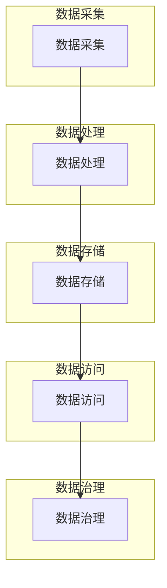

                 

### 文章标题

# 数据湖架构：统一数据管理的新方向

### 文章关键词

- 数据湖架构
- 统一数据管理
- 分布式计算
- 大数据存储
- 数据治理

### 文章摘要

本文将深入探讨数据湖架构作为统一数据管理新方向的重要性和必要性。通过逐步分析数据管理的挑战、数据湖的概念与优势、核心设计原则和技术基础，我们将了解如何实施和优化数据湖架构。文章还将通过案例分析，展示数据湖在实际应用中的成功故事，并展望其未来的发展趋势。最终，我们希望读者能够全面理解数据湖架构的价值，并掌握其在现代数据管理中的关键应用。

## 引言

### 1.1 数据管理的挑战

在当今数字化时代，数据已成为企业最宝贵的资产之一。然而，随着数据量的爆炸性增长和来源的多样化，数据管理面临着前所未有的挑战。首先，数据类型日益丰富，包括结构化数据、半结构化数据和非结构化数据。其次，数据来源多样化，包括内部系统、外部第三方数据以及实时流数据。这些变化使得传统的数据仓库模型难以满足现代数据管理的要求。

### 1.2 数据湖的概念与优势

为了应对上述挑战，数据湖作为一种新的数据管理架构应运而生。数据湖是一个集中存储所有原始数据的系统，无论是结构化、半结构化还是非结构化数据，都可以在数据湖中找到其容身之所。数据湖具有以下优势：

1. **灵活性**：数据湖允许数据以原始格式存储，无需预先定义数据结构，这使得数据能够保持其原始特性，方便后续处理和分析。
2. **高吞吐量**：数据湖支持海量数据的存储和快速处理，通过分布式计算框架实现高效的数据处理能力。
3. **低成本**：数据湖通常采用分布式文件系统进行存储，降低了硬件成本，同时提供了弹性伸缩的能力。
4. **数据治理**：数据湖提供了数据清洗、转换、存储和访问的一站式解决方案，有助于实现高效的数据治理。

### 1.3 数据湖与传统数据仓库的区别

传统数据仓库主要用于存储结构化数据，并通过ETL（提取、转换、加载）过程将数据清洗和转换后加载到仓库中。而数据湖则更倾向于存储原始数据，并支持各种类型的数据。数据仓库强调数据的一致性和完整性，而数据湖更注重数据的灵活性和可扩展性。两者的主要区别可以概括为以下几点：

1. **数据类型**：数据仓库主要处理结构化数据，而数据湖可以处理结构化、半结构化和非结构化数据。
2. **数据预处理**：数据仓库在数据加载前需要进行详细的预处理，而数据湖则允许数据以原始形式存储，后续处理更为灵活。
3. **架构风格**：数据仓库通常采用集中式架构，而数据湖则采用分布式架构，能够更好地处理海量数据。

通过以上分析，我们可以看到数据湖架构在应对现代数据管理挑战方面的独特优势和重要性。接下来的章节将深入探讨数据湖的核心概念、设计原则和技术基础，帮助读者全面理解数据湖架构。

## 数据湖架构的设计原则

数据湖架构的成功实施依赖于一系列关键的设计原则，这些原则确保了数据湖能够高效、安全地支持各种类型的数据存储和数据处理需求。以下是数据湖架构设计的主要原则及其具体应用：

### 2.1 数据湖架构的核心要素

数据湖架构包含几个核心要素，这些要素共同作用，确保数据湖的稳定性和性能。核心要素包括：

1. **数据存储**：数据存储是数据湖架构的核心部分，用于存储各种类型的数据。常见的数据存储技术包括Hadoop分布式文件系统（HDFS）和云存储服务（如Amazon S3）。

2. **数据处理**：数据处理用于对存储在数据湖中的数据进行加工和处理，包括ETL（提取、转换、加载）和数据清洗等操作。常用的数据处理框架包括Apache Spark和Apache Flink。

3. **数据访问**：数据访问提供了对数据湖中数据的查询和访问接口，使得用户能够方便地获取所需数据。常见的数据访问技术包括SQL查询引擎和NoSQL数据库。

4. **数据治理**：数据治理确保数据的质量、安全和合规性。数据治理包括数据分类、标签、元数据管理和访问控制等。

### 2.2 数据湖的层次结构

数据湖的层次结构是设计数据湖架构的重要方面，它将数据分为不同的层次，便于管理和访问。常见的层次结构包括：

1. **原始数据层**：存储未经处理的原始数据，包括结构化、半结构化和非结构化数据。

2. **数据处理层**：存储经过ETL和清洗处理后的数据，这些数据已经格式化并准备好用于分析。

3. **数据存储层**：存储经过处理和清洗后的数据，这些数据可用于进一步的分析和应用。

4. **数据访问层**：提供数据查询和访问接口，使得最终用户能够方便地获取数据。

### 2.3 数据湖的安全与隐私保护

数据湖中的数据安全与隐私保护至关重要。以下是几个关键的安全和隐私保护措施：

1. **访问控制**：通过设置访问控制策略，确保只有授权用户才能访问敏感数据。

2. **加密**：对敏感数据进行加密，防止未授权访问和数据泄露。

3. **审计与监控**：实施审计和监控机制，记录数据访问和操作，以便在发生安全事件时进行调查。

4. **合规性**：确保数据湖架构符合相关法律法规和行业标准，如GDPR和HIPAA。

### 2.4 可扩展性和容错性

数据湖架构需要具备高可扩展性和容错性，以应对不断增长的数据量和可能出现的系统故障。以下措施有助于实现这些特性：

1. **分布式存储**：采用分布式存储技术，如HDFS和云存储，实现数据的高可用性和弹性伸缩。

2. **备份与恢复**：定期备份数据，并建立灾难恢复机制，确保数据在系统故障时能够快速恢复。

3. **负载均衡**：通过负载均衡技术，合理分配数据处理任务，提高系统的处理能力和性能。

4. **自动扩展**：根据数据量和处理需求，自动调整资源分配，确保系统稳定运行。

通过遵循上述设计原则，数据湖架构能够实现高效、安全、可扩展的数据管理，满足现代企业的数据需求。在接下来的章节中，我们将进一步探讨构建数据湖所需的技术基础，包括存储、计算和数据处理技术。

### 数据湖架构的技术基础

构建一个高效、可靠的数据湖架构需要依赖一系列关键技术，这些技术涵盖了存储、计算、数据处理等方面。以下将详细介绍这些技术，并分析其优缺点。

#### 3.1 存储技术

数据湖中的数据存储技术至关重要，它决定了数据湖的扩展性、性能和成本。以下是几种常用的存储技术：

1. **Hadoop分布式文件系统（HDFS）**：
   - **优点**：HDFS是一种分布式文件系统，能够处理大规模数据存储，提供高吞吐量和容错性。
   - **缺点**：HDFS不支持随机读写，对于小文件处理效率较低。

2. **云存储服务（如Amazon S3）**：
   - **优点**：云存储服务具有弹性伸缩、低成本和高可靠性等优点，能够满足海量数据的存储需求。
   - **缺点**：云存储服务的访问速度可能受网络带宽影响，且一些云存储服务可能收费较高。

3. **分布式文件系统（如GlusterFS）**：
   - **优点**：GlusterFS是一种分布式文件系统，支持多种存储协议，具有高扩展性和高容错性。
   - **缺点**：GlusterFS在某些情况下可能需要较多的配置和维护。

4. **分布式块存储（如Ceph）**：
   - **优点**：Ceph是一种分布式块存储系统，支持多种接口，具有高可用性和高性能。
   - **缺点**：Ceph的配置和运维相对复杂，需要一定的专业知识和经验。

#### 3.2 计算技术

计算技术在数据湖架构中扮演着核心角色，用于处理和分析存储在数据湖中的数据。以下是几种常见的计算技术：

1. **MapReduce**：
   - **优点**：MapReduce是一种分布式数据处理框架，能够高效地处理大规模数据集。
   - **缺点**：MapReduce不支持实时数据处理，且编程复杂度较高。

2. **Apache Spark**：
   - **优点**：Spark是一种高速分布式计算框架，支持内存计算和实时数据处理，性能优于MapReduce。
   - **缺点**：Spark的编程模型相对复杂，需要学习新的API。

3. **Apache Flink**：
   - **优点**：Flink是一种流处理框架，能够实时处理和分析数据流，性能优秀。
   - **缺点**：Flink的编程模型较为复杂，需要一定的时间来学习和掌握。

4. **Apache Storm**：
   - **优点**：Storm是一种实时大数据处理框架，适用于低延迟、高并发的实时数据处理场景。
   - **缺点**：Storm在某些方面可能不如Spark和Flink成熟。

#### 3.3 数据处理技术

数据处理技术用于对存储在数据湖中的数据进行分析、转换和提取。以下是几种常用的数据处理技术：

1. **ETL工具**：
   - **优点**：ETL工具能够自动化地提取、转换和加载数据，提高数据处理效率。
   - **缺点**：ETL工具通常较为昂贵，且需要大量的配置和优化。

2. **数据仓库**：
   - **优点**：数据仓库能够存储和查询大规模数据集，提供高效的查询性能。
   - **缺点**：数据仓库通常不支持实时数据处理，且数据迁移成本较高。

3. **NoSQL数据库**：
   - **优点**：NoSQL数据库能够灵活地处理各种类型的数据，提供高扩展性。
   - **缺点**：NoSQL数据库在查询性能和一致性方面可能不如传统数据库。

通过以上分析，我们可以看到，构建数据湖架构需要综合考虑多种技术，以满足不同的需求。每种技术都有其优缺点，选择合适的技术组合是实现高效数据湖架构的关键。在接下来的章节中，我们将进一步探讨数据湖的具体架构设计和实现方法。

### 数据湖的架构设计

数据湖的架构设计是构建高效、可扩展数据湖的关键步骤。一个合理的数据湖架构能够确保数据存储、处理和访问的高效性和稳定性。以下将详细介绍数据湖的架构设计流程，包括领域模型、架构图和关键组件的交互。

#### 4.1 数据湖架构设计流程

1. **需求分析**：首先，明确数据湖的设计目标和应用场景，包括数据来源、数据类型、处理需求等。需求分析是整个设计流程的基础。

2. **领域模型设计**：根据需求分析，设计数据湖的领域模型，包括实体、属性和关系。领域模型有助于理清数据结构和处理流程。

3. **架构图设计**：基于领域模型，绘制数据湖的架构图，明确各组件之间的交互和依赖关系。架构图是数据湖设计的重要文档，有助于团队成员理解和沟通。

4. **技术选型**：根据架构图，选择合适的存储、计算和数据处理技术，并确保各组件之间的兼容性和性能。

5. **实施方案**：制定详细的实施方案，包括硬件资源规划、软件安装和配置、数据迁移和测试等。

6. **部署与运维**：部署数据湖架构，并进行持续监控、优化和维护，确保系统的稳定运行。

#### 4.2 数据湖的领域模型

领域模型用于描述数据湖中的实体、属性和关系。以下是数据湖领域模型的一个例子：

```mermaid
classDiagram
    DataIngestion <<class>> 数据采集
    DataProcessing <<class>> 数据处理
    DataStorage <<class>> 数据存储
    DataAccess <<class>> 数据访问
    DataGovernance <<class>> 数据治理

    DataIngestion --|> DataProcessing : 处理
    DataProcessing --|> DataStorage : 存储
    DataStorage --|> DataAccess : 访问
    DataAccess --|> DataGovernance : 监控
```

在这个领域模型中，数据采集、数据处理、数据存储、数据访问和数据治理是核心实体。数据采集负责数据的收集和加载，数据处理负责对数据进行清洗、转换和加工，数据存储负责数据的存储和管理，数据访问负责提供数据的查询和访问接口，数据治理负责确保数据的质量和安全。

#### 4.3 数据湖的架构图

数据湖的架构图是描述数据湖各组件之间关系和交互的重要工具。以下是数据湖架构图的一个示例：



在这个架构图中，数据采集模块负责从各种数据源收集数据，并将数据传递给数据处理模块。数据处理模块对数据进行清洗、转换和加工，然后将处理后的数据存储到数据存储模块。数据存储模块提供了数据的持久化存储，并支持数据的检索和访问。数据访问模块提供了数据查询和访问接口，使得最终用户能够方便地获取所需数据。数据治理模块负责监控和确保数据的质量、安全和合规性。

通过领域模型和架构图的描述，我们可以清晰地了解数据湖的架构设计和组件之间的交互关系。在实际应用中，数据湖架构可以根据具体需求进行定制和优化，以满足不同场景下的数据管理需求。

### 实践中的数据湖架构

在实际应用中，数据湖架构的成功实施需要结合具体业务场景和技术环境，通过合理的规划和实施来满足企业的数据管理需求。以下将介绍几个典型的数据湖建设案例，并探讨在实施过程中遇到的最佳实践和挑战。

#### 5.1 数据湖建设案例

1. **金融行业的数据湖架构**：
   - **背景**：某大型金融机构面临海量金融交易数据的存储和处理需求，传统的数据仓库已经难以满足其性能和扩展性要求。
   - **解决方案**：该金融机构采用Hadoop分布式文件系统（HDFS）作为数据存储层，使用Apache Spark进行数据处理，并利用Amazon S3进行云存储。通过数据湖架构，实现了数据的集中管理和高效处理，提高了数据处理速度和性能。

2. **零售行业的数据湖架构**：
   - **背景**：某大型零售企业希望通过数据湖实现全渠道数据的整合和分析，以支持精准营销和业务优化。
   - **解决方案**：该零售企业采用Apache Flink进行实时数据处理，使用HDFS和云存储服务（如Google Cloud Storage）进行数据存储。通过数据湖架构，实现了实时数据的采集、处理和存储，为业务部门提供了高效的数据支持。

3. **医疗行业的数据湖架构**：
   - **背景**：某大型医疗集团需要处理和管理大量的医疗数据，包括电子病历、医学影像、基因数据等。
   - **解决方案**：该医疗集团采用分布式存储技术（如Ceph）和分布式计算框架（如Apache Hadoop），构建了一个高性能的数据湖。通过数据湖架构，实现了不同类型医疗数据的集中存储和高效处理，为医生和研究人员提供了便捷的数据访问和分析工具。

#### 5.2 架构优化实践

在数据湖的实施过程中，架构优化是确保系统稳定性和性能的关键。以下是一些架构优化的最佳实践：

1. **负载均衡**：通过负载均衡技术，合理分配数据处理任务，提高系统的处理能力和性能。可以使用如Kubernetes等容器编排工具来实现负载均衡。

2. **资源规划**：根据实际业务需求和数据量，合理规划硬件资源，包括存储、计算和网络资源。通过监控和分析，及时调整资源分配，确保系统的高效运行。

3. **数据压缩**：采用数据压缩技术，减少存储空间的需求，同时提高数据传输速度。常见的压缩算法包括LZ4、Snappy和Gzip等。

4. **缓存策略**：利用缓存技术，提高数据访问速度。可以使用如Redis、Memcached等内存缓存技术，或者使用分布式缓存系统（如Apache Ignite）。

5. **数据分区和分片**：通过数据分区和分片技术，将大量数据分散存储在多个节点上，提高数据处理的并行度和性能。可以使用如HDFS的分区功能或NoSQL数据库的分片机制。

#### 5.3 跨部门协同与数据治理

数据湖的实施不仅涉及到技术层面，还涉及到跨部门协同和数据治理。以下是一些关键点：

1. **跨部门协作**：建立跨部门的数据协作机制，确保不同部门之间的数据需求能够得到满足。可以通过数据共享平台或数据服务接口，实现数据的互联互通。

2. **数据治理**：建立完善的数据治理体系，包括数据分类、标签、元数据管理和访问控制等。通过数据治理，确保数据的质量、安全和合规性。

3. **数据安全和隐私保护**：实施严格的数据安全和隐私保护措施，包括访问控制、数据加密和审计等。确保数据在传输和存储过程中的安全。

4. **培训与支持**：为员工提供数据湖相关的培训和支持，提高员工的技能和意识，确保数据湖的有效使用和管理。

通过以上实践和优化，企业可以成功构建和实施数据湖架构，实现高效的数据管理和分析，为业务增长和决策提供有力支持。

### 数据湖架构面临的挑战与未来趋势

#### 6.1 数据湖架构面临的挑战

数据湖架构虽然在数据管理和分析方面具有显著优势，但在实际应用过程中也面临着一系列挑战：

1. **数据质量问题**：数据湖中的数据来源多样，质量参差不齐。如果不对数据进行严格的质量管理和清洗，可能会导致数据不准确、不完整，影响分析结果。

2. **数据治理困难**：数据湖中数据的多样性和海量性使得数据治理变得更加复杂。如何确保数据的安全、合规和有效利用是一个重大挑战。

3. **性能优化难度**：随着数据量的不断增加，数据湖的性能优化也变得越来越困难。如何确保数据存储、处理和访问的高效性是一个需要不断探索的问题。

4. **成本管理**：数据湖架构的实施和维护成本较高，特别是在大规模应用场景下。如何合理管理成本，同时保证数据湖的性能和可靠性是一个重要问题。

5. **数据隐私保护**：数据湖中的数据包含敏感信息，如何确保数据在存储、传输和处理过程中的隐私保护是一个关键挑战。

#### 6.2 数据湖的未来发展趋势

尽管面临诸多挑战，数据湖架构仍然具有广阔的发展前景。以下是一些未来发展趋势：

1. **智能化数据治理**：随着人工智能技术的发展，数据治理将变得更加智能化。利用机器学习算法，可以自动识别和修复数据质量问题，提高数据治理效率。

2. **实时数据处理**：随着实时数据处理技术的不断成熟，数据湖将能够更好地支持实时数据分析和决策。通过集成流处理框架，如Apache Flink和Apache Storm，实现实时数据处理。

3. **边缘计算与数据湖结合**：边缘计算技术的发展使得数据湖能够更好地利用边缘设备收集和处理数据。通过将数据湖与边缘计算结合，可以进一步降低数据传输成本，提高数据处理的实时性。

4. **混合云数据湖架构**：随着混合云的普及，数据湖架构也将向混合云方向发展。通过将数据湖部署在公有云和私有云之间，可以更好地平衡成本、性能和灵活性。

5. **数据湖与分析平台集成**：未来的数据湖将更加紧密地与分析平台集成，提供一站式数据分析服务。通过集成机器学习、数据挖掘和可视化工具，可以实现更强大的数据分析和洞察。

#### 6.3 案例分析：数据湖在不同行业的应用

以下是数据湖在不同行业应用的一些案例分析：

1. **金融行业**：金融机构通过数据湖实现了海量交易数据的集中管理和分析。通过实时数据处理，金融机构能够快速识别市场趋势，提高风险控制和决策效率。

2. **零售行业**：零售企业利用数据湖整合线上线下数据，实现了全渠道数据的统一管理和分析。通过数据湖，零售企业能够更好地了解消费者行为，实现精准营销和库存优化。

3. **医疗行业**：医疗集团通过数据湖管理海量医疗数据，包括电子病历、医学影像和基因数据。通过数据湖，医疗机构能够实现个性化医疗和疾病预测，提高医疗服务质量。

4. **制造业**：制造企业利用数据湖整合生产数据、供应链数据和客户数据，实现了生产过程的智能化和优化。通过数据湖，制造企业能够实现预测性维护和供应链协同，提高生产效率和降低成本。

通过以上案例分析，我们可以看到数据湖在不同行业的广泛应用及其带来的显著价值。未来，随着技术的不断进步，数据湖架构将继续发展和完善，为各行各业的数据管理和分析提供更强有力的支持。

### 总结与展望

#### 7.1 数据湖架构的关键要点

在本文中，我们详细探讨了数据湖架构作为统一数据管理新方向的重要性。通过逐步分析数据管理的挑战、数据湖的概念与优势、核心设计原则和技术基础，我们总结了以下关键要点：

1. **灵活性**：数据湖允许以原始格式存储多种类型的数据，无需预先定义数据结构。
2. **高吞吐量**：数据湖采用分布式计算框架，能够高效处理海量数据。
3. **低成本**：数据湖通常采用分布式文件系统，降低硬件成本。
4. **数据治理**：数据湖提供了数据清洗、转换、存储和访问的一站式解决方案。
5. **扩展性**：数据湖具备高扩展性，能够弹性伸缩以满足不断增长的数据需求。

#### 7.2 遇到的问题与解决方案

在实际应用中，数据湖架构也面临一系列问题。以下是几个常见的问题及其解决方案：

1. **数据质量问题**：解决数据质量问题需要建立严格的数据治理流程，包括数据清洗、验证和监控。
2. **性能优化**：性能优化可以通过负载均衡、数据分区和缓存策略等手段实现。
3. **成本管理**：合理规划资源、选择合适的技术方案和云服务可以降低成本。
4. **数据隐私保护**：通过加密、访问控制和审计机制确保数据安全和隐私保护。

#### 7.3 推荐阅读与进一步学习

为了深入了解数据湖架构，我们推荐以下书籍和资源：

1. 《大数据架构：设计原理与最佳实践》（作者：John R. Rymer，Peter J. Weinschenk）
2. 《数据湖与大数据处理技术》（作者：顾培柱）
3. 《数据湖实战：构建大规模数据处理系统》（作者：David Loshin）
4. Apache Spark官方文档：https://spark.apache.org/docs/latest/
5. Apache Hadoop官方文档：https://hadoop.apache.org/docs/stable/

通过进一步学习这些资源和书籍，读者可以更深入地了解数据湖架构的原理和实践，为实际应用提供有力支持。

### 作者信息

作者：AI天才研究院/AI Genius Institute & 禅与计算机程序设计艺术 /Zen And The Art of Computer Programming

---

本文旨在为广大技术从业者和研究者提供关于数据湖架构的深入分析和全面了解，通过详细阐述其核心概念、设计原则和技术基础，以及实践中的应用和挑战，帮助读者掌握数据湖架构的关键要点和最佳实践。希望本文能为您的数据管理之路提供有价值的参考和启示。

---

在本篇技术博客文章中，我们系统地介绍了数据湖架构的概念、设计原则、技术基础以及实践应用。通过对数据管理的挑战和传统数据仓库的不足进行分析，我们引出了数据湖作为统一数据管理新方向的重要性和优势。文章详细探讨了数据湖的核心要素、层次结构、安全与隐私保护措施，并阐述了如何进行数据湖的架构设计。同时，我们还介绍了数据湖在实际应用中的成功案例，以及架构优化实践、跨部门协同和数据治理的关键点。

在面临数据湖架构的挑战时，我们提出了相应的解决方案，并展望了其未来的发展趋势。通过推荐书籍和资源，我们鼓励读者进一步学习和探索数据湖架构的深层次知识和最佳实践。

总之，数据湖架构作为一种新型的数据管理方法，正日益受到业界的关注和认可。它不仅能够高效地存储和处理海量数据，还能够为不同行业和企业提供强大的数据分析和决策支持。随着技术的不断进步，数据湖架构将在未来发挥更加重要的作用，推动数据管理的创新和发展。

未来，随着人工智能、边缘计算和混合云等新技术的不断发展，数据湖架构将迎来更多机遇和挑战。我们期待着数据湖技术能够继续优化，为各行各业的数据管理和智能化应用提供更加完善和强大的解决方案。希望本文能够为读者在数据湖架构的学习和应用中提供有价值的指导，推动数据湖技术在实践中的广泛应用。

