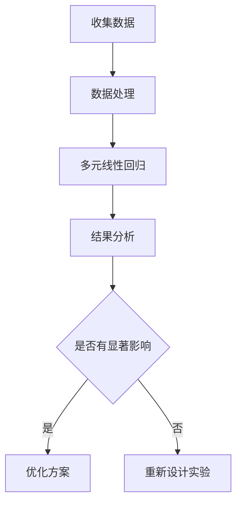
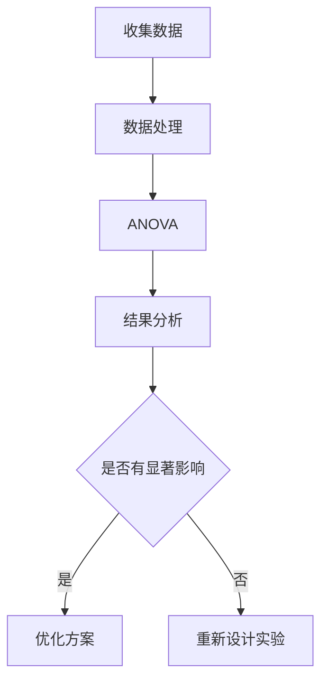
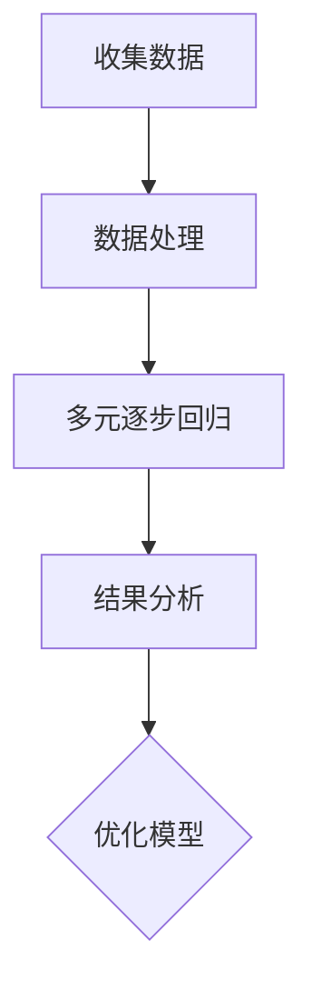
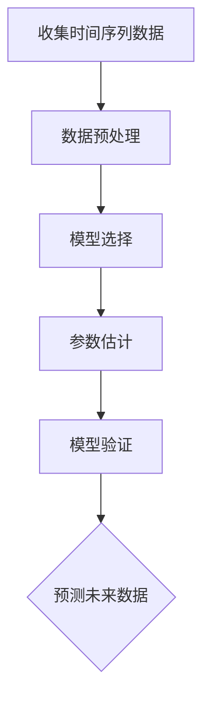
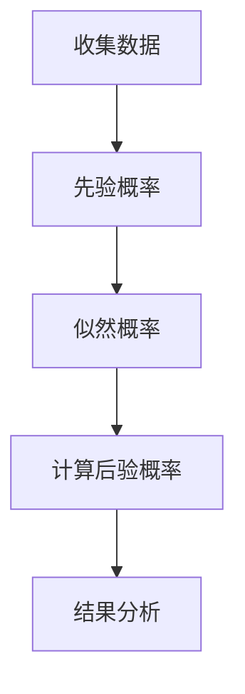
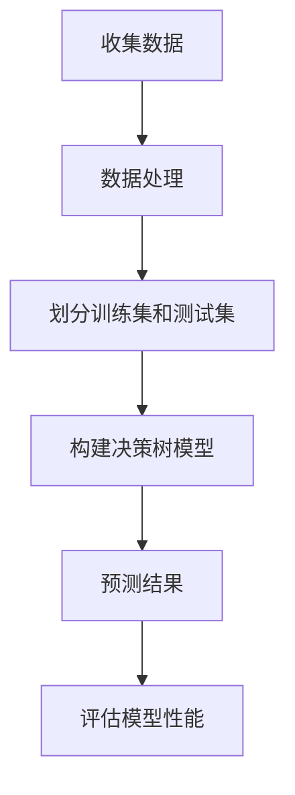
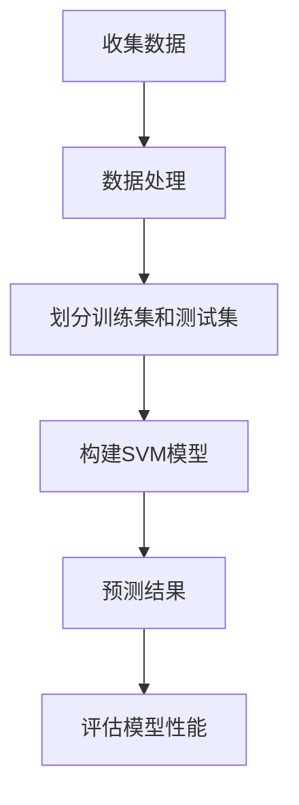
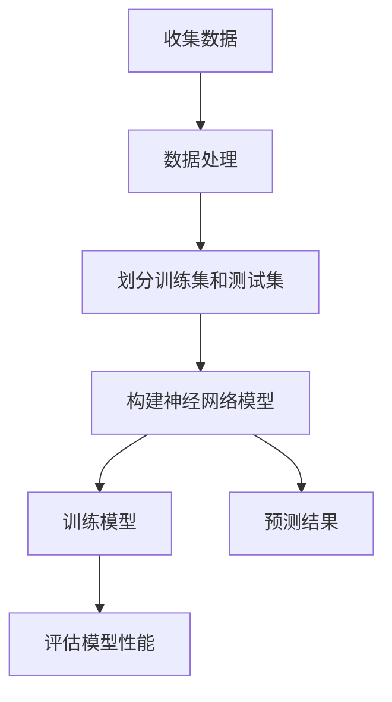

                 

### 数理统计在A/B测试系统设计中的应用

---

#### 关键词：

- **A/B测试**
- **数理统计**
- **系统设计**
- **概率论**
- **统计分析**
- **决策模型**

---

#### 摘要：

本文将深入探讨数理统计在A/B测试系统设计中的应用。我们将从基本概念入手，介绍A/B测试的背景及其数理统计的重要性，然后逐步展开讨论数理统计的基本原理和常用方法。接着，我们将探讨A/B测试系统的架构设计和关键实现技术。最后，通过实际案例分析，总结经验并展望未来发展的方向。

---

### 第一部分: A/B测试系统设计的数理统计基础

#### 第1章: A/B测试的基本概念与数理统计原理

##### 1.1 A/B测试的起源与背景

A/B测试（亦称为拆分测试）是一种通过将用户随机分配到不同的实验组，从而评估两种或多种版本的一种测试方法。其起源可以追溯到上世纪40年代的统计方法，随着计算机技术的发展，A/B测试在互联网领域得到了广泛应用。

##### 1.1.1 A/B测试的定义

A/B测试旨在通过将用户随机分配到不同的实验组和控制组，来评估某个变量（如网页设计、广告文案、功能特性等）对用户行为的影响。

##### 1.1.2 A/B测试的应用场景

A/B测试广泛应用于产品开发、市场营销、用户体验优化等领域。例如，在产品开发中，可以通过A/B测试来优化界面设计、功能特性等；在市场营销中，可以通过A/B测试来优化广告投放策略、文案等。

##### 1.1.3 数理统计在A/B测试中的重要性

数理统计是A/B测试的核心基础，它提供了科学的方法来评估实验结果的有效性和可靠性。数理统计帮助我们在实验中减少随机误差，提高结果的置信度。

##### 1.2 数理统计的基本概念

##### 1.2.1 概率论的基本原理

概率论是数理统计的基础，它研究随机事件的发生概率。基本概念包括概率分布、条件概率、贝叶斯定理等。

##### 1.2.2 统计推断的基本原理

统计推断是从样本数据推断总体特征的方法。基本概念包括点估计、区间估计、假设检验等。

##### 1.2.3 常用统计分布函数

常用统计分布函数包括正态分布、二项分布、泊松分布、卡方分布等，这些分布函数在A/B测试中有着广泛的应用。

##### 1.3 A/B测试中的数理统计应用

##### 1.3.1 均值差异检验

均值差异检验用于评估两个实验组之间的均值差异是否显著。

##### 1.3.2 方差分析

方差分析用于评估多个实验组之间的均值差异是否显著。

##### 1.3.3 卡方检验

卡方检验用于评估分类变量之间的独立性。

#### 第2章: A/B测试系统的设计与实现

##### 2.1 A/B测试系统架构设计

A/B测试系统架构设计包括数据采集模块、数据处理模块、数据分析模块等，这些模块协同工作，实现A/B测试的全流程。

##### 2.1.1 系统整体架构

整体架构包括前端展示层、中间服务层、后端数据层等，通过这些层的协同工作，实现A/B测试的自动化和智能化。

##### 2.1.2 数据采集模块设计

数据采集模块设计包括数据采集方式、数据格式、数据存储等，确保数据的准确性和完整性。

##### 2.1.3 数据分析模块设计

数据分析模块设计包括数据清洗、数据预处理、统计分析等，为实验结果提供可靠的数据支持。

##### 2.2 A/B测试策略与优化

##### 2.2.1 选取样本的策略

样本选取策略包括随机抽样、分层抽样、系统抽样等，确保样本的代表性和可靠性。

##### 2.2.2 A/B测试的优化方法

优化方法包括实验组分配优化、测试时间优化、数据分析方法优化等，提高实验效果和可信度。

##### 2.2.3 测试效果评估与调整

测试效果评估与调整包括实验结果分析、置信区间计算、假设检验等，为测试策略的调整提供数据支持。

##### 2.3 实现A/B测试系统的关键技术

##### 2.3.1 数据处理技术

数据处理技术包括数据清洗、数据转换、数据分析等，为实验提供高质量的数据支持。

##### 2.3.2 统计分析方法

统计分析方法包括均值差异检验、方差分析、卡方检验等，为实验结果提供统计学支持。

##### 2.3.3 系统稳定性与可靠性保障

系统稳定性与可靠性保障包括系统监控、故障处理、数据备份等，确保系统的稳定运行和数据的可靠性。

#### 第3章: 实际案例分析与经验分享

##### 3.1 案例介绍

##### 3.1.1 案例背景

##### 3.1.2 案例目标

##### 3.1.3 案例实施过程

##### 3.2 数据分析与结果解读

##### 3.2.1 数据收集与处理

##### 3.2.2 数据分析方法与工具

##### 3.2.3 分析结果解读

##### 3.3 案例总结与启示

##### 3.3.1 案例成功经验

##### 3.3.2 案例中的问题与解决

##### 3.3.3 对其他项目的启示

### 第二部分: 高级数理统计技术在A/B测试中的应用

#### 第4章: 高级统计方法在A/B测试中的运用

##### 4.1 多变量分析

##### 4.1.1 多元线性回归分析

##### 4.1.2 方差分析（ANOVA）

##### 4.1.3 多元逐步回归分析

##### 4.2 时间序列分析

##### 4.2.1 时间序列的建模

##### 4.2.2 自回归模型（AR）

##### 4.2.3 移动平均模型（MA）

##### 4.3 贝叶斯统计方法

##### 4.3.1 贝叶斯统计的基本原理

##### 4.3.2 贝叶斯推断方法

##### 4.3.3 贝叶斯网络模型

#### 第5章: A/B测试系统中的机器学习技术

##### 5.1 机器学习在A/B测试中的应用

##### 5.1.1 机器学习的基本概念

##### 5.1.2 监督学习与无监督学习

##### 5.1.3 机器学习在A/B测试中的优势

##### 5.2 机器学习算法与实现

##### 5.2.1 决策树与随机森林

##### 5.2.2 支持向量机（SVM）

##### 5.2.3 神经网络与深度学习

##### 5.3 机器学习在A/B测试中的实践

##### 5.3.1 机器学习模型评估

##### 5.3.2 模型选择与优化

##### 5.3.3 实际案例分析

#### 第6章: A/B测试系统的性能优化与扩展

##### 6.1 性能优化策略

##### 6.1.1 数据库性能优化

##### 6.1.2 系统架构优化

##### 6.1.3 算法优化

##### 6.2 扩展性与可维护性

##### 6.2.1 模块化设计

##### 6.2.2 系统扩展策略

##### 6.2.3 可维护性设计

---

### 文章标题：数理统计在A/B测试系统设计中的应用

---

### 作者：AI天才研究院/AI Genius Institute & 禅与计算机程序设计艺术 /Zen And The Art of Computer Programming

---

### 文章正文：

#### 引言

A/B测试作为产品优化和决策的重要工具，已经成为现代互联网公司的标准实践。然而，如何设计一个高效、可靠的A/B测试系统，是许多工程师和产品经理面临的问题。数理统计作为A/B测试的核心基础，其应用和优化对测试结果的影响至关重要。本文将深入探讨数理统计在A/B测试系统设计中的应用，从基本概念到高级统计方法，再到机器学习技术，全面解析A/B测试系统的设计、实现和优化。

#### A/B测试的基本概念与数理统计原理

##### 1.1 A/B测试的起源与背景

A/B测试最早可以追溯到20世纪40年代的统计方法，当时主要用于农业实验，以确定不同种植方法的产量差异。随着计算机技术的发展，A/B测试逐渐应用于互联网领域，尤其是在用户体验优化、广告投放优化和产品功能优化等方面。

A/B测试的核心思想是将用户随机分配到不同的实验组和控制组，通过对两组用户的行为进行对比，评估某一变量（如网页设计、广告文案、功能特性等）对用户的影响。这种方法具有高效、低成本、易于实施等优点，因此被广泛采用。

##### 1.1.1 A/B测试的定义

A/B测试，又称拆分测试，是一种将用户随机分配到两个或多个版本的测试方法，以评估不同版本对用户行为的影响。具体来说，A/B测试包括以下步骤：

1. 设计实验：确定要测试的变量和目标，设计实验方案。
2. 分配用户：将用户随机分配到不同的实验组和控制组，确保两组用户在人口统计特征上的一致性。
3. 收集数据：在实验期间，收集两组用户的行为数据，如点击率、转化率、留存率等。
4. 分析结果：使用数理统计方法对实验结果进行分析，判断不同版本对用户行为的影响是否显著。

##### 1.1.2 A/B测试的应用场景

A/B测试在互联网领域具有广泛的应用场景，主要包括以下方面：

1. 产品开发：通过A/B测试优化产品界面设计、功能特性等，提高用户满意度。
2. 市场营销：通过A/B测试优化广告投放策略、文案等，提高广告效果。
3. 用户体验优化：通过A/B测试优化用户操作流程、界面布局等，提高用户体验。
4. 数据驱动的决策：通过A/B测试验证决策的有效性，为后续决策提供数据支持。

##### 1.1.3 数理统计在A/B测试中的重要性

数理统计是A/B测试的核心基础，其作用主要体现在以下几个方面：

1. 减少随机误差：通过数理统计方法，可以减少实验过程中由于随机因素导致的误差，提高实验结果的可靠性。
2. 提高结果可信度：数理统计方法可以帮助评估实验结果的有效性和显著性，提高决策的准确性。
3. 支持假设检验：数理统计方法可以支持对实验结果的假设检验，帮助判断不同版本之间的差异是否显著。

##### 1.2 数理统计的基本概念

数理统计涉及许多基本概念和方法，以下是其中几个重要的概念：

1. 概率论：概率论研究随机事件的发生概率，包括概率分布、条件概率、贝叶斯定理等。
2. 统计推断：统计推断是从样本数据推断总体特征的方法，包括点估计、区间估计、假设检验等。
3. 常用统计分布函数：常用的统计分布函数包括正态分布、二项分布、泊松分布、卡方分布等，这些分布函数在A/B测试中有着广泛的应用。

##### 1.3 A/B测试中的数理统计应用

在A/B测试中，数理统计的应用主要体现在以下几个方面：

1. 均值差异检验：用于评估两个实验组之间的均值差异是否显著，如点击率、转化率等。
2. 方差分析：用于评估多个实验组之间的均值差异是否显著，如用户留存率等。
3. 卡方检验：用于评估分类变量之间的独立性，如用户性别与购买行为的关系等。

#### A/B测试系统的设计与实现

##### 2.1 A/B测试系统架构设计

A/B测试系统架构设计包括数据采集模块、数据处理模块、数据分析模块等，这些模块协同工作，实现A/B测试的全流程。以下是A/B测试系统的架构设计：

1. 数据采集模块：负责收集实验数据，包括用户行为数据、系统日志数据等。
2. 数据处理模块：负责对采集到的数据进行分析和清洗，提取有用的信息。
3. 数据分析模块：负责对处理后的数据进行分析，生成实验报告和可视化图表。
4. 控制模块：负责管理实验流程，包括实验组分配、实验暂停和终止等。

##### 2.1.1 系统整体架构

A/B测试系统的整体架构包括前端展示层、中间服务层、后端数据层等。前端展示层负责向用户展示实验版本，中间服务层负责处理用户请求和实验逻辑，后端数据层负责存储和管理实验数据。

1. 前端展示层：包括网页、APP等用户界面，负责向用户展示实验版本。
2. 中间服务层：包括Web服务器、应用服务器等，负责处理用户请求和实验逻辑。
3. 后端数据层：包括数据库、数据仓库等，负责存储和管理实验数据。

##### 2.1.2 数据采集模块设计

数据采集模块设计包括数据采集方式、数据格式、数据存储等。以下是数据采集模块的设计：

1. 数据采集方式：包括客户端采集、服务器端采集等，根据实际情况选择合适的采集方式。
2. 数据格式：包括JSON、XML、CSV等，根据系统需求和数据类型选择合适的数据格式。
3. 数据存储：包括数据库、文件系统等，根据数据量和访问频率选择合适的存储方案。

##### 2.1.3 数据分析模块设计

数据分析模块设计包括数据清洗、数据预处理、统计分析等。以下是数据分析模块的设计：

1. 数据清洗：包括去重、补全、规范化等，确保数据质量。
2. 数据预处理：包括数据转换、数据归一化等，为统计分析做准备。
3. 统计分析：包括均值差异检验、方差分析、卡方检验等，生成实验报告和可视化图表。

##### 2.2 A/B测试策略与优化

A/B测试策略与优化包括样本选取策略、实验组分配优化、测试时间优化等。以下是A/B测试策略与优化：

1. 样本选取策略：包括随机抽样、分层抽样、系统抽样等，确保样本的代表性和可靠性。
2. 实验组分配优化：包括权重分配、群体分配等，提高实验效果。
3. 测试时间优化：包括测试周期设置、数据收集频率等，提高实验效率。

##### 2.3 实现A/B测试系统的关键技术

实现A/B测试系统需要掌握以下关键技术：

1. 数据处理技术：包括数据清洗、数据转换、数据分析等，确保数据质量。
2. 统计分析方法：包括均值差异检验、方差分析、卡方检验等，为实验结果提供统计学支持。
3. 系统稳定性与可靠性保障：包括系统监控、故障处理、数据备份等，确保系统的稳定运行和数据的可靠性。

#### 实际案例分析与经验分享

##### 3.1 案例介绍

以下是一个实际案例，介绍如何利用数理统计设计一个A/B测试系统，并进行结果分析。

**案例背景：** 一家电商公司希望通过优化购物车的设计，提高用户的购物体验和转化率。

**案例目标：** 评估不同购物车设计对用户购物行为的差异。

**案例实施过程：**

1. 设计实验：公司设计了两个版本的购物车，版本A为传统购物车设计，版本B为简化版购物车设计，包括减少购物车页面元素、优化用户操作流程等。

2. 分配用户：将公司网站的用户随机分配到实验组和控制组，确保两组用户在人口统计特征上的一致性。

3. 收集数据：在实验期间，收集两组用户的购物行为数据，如点击率、转化率、页面停留时间等。

4. 分析结果：使用数理统计方法对实验结果进行分析，判断不同购物车设计对用户购物行为的差异是否显著。

##### 3.2 数据分析与结果解读

**数据分析：** 

1. 均值差异检验：使用独立样本t检验评估两组用户的转化率差异，结果显示版本B的转化率显著高于版本A。

2. 方差分析：使用单因素方差分析（ANOVA）评估两组用户的点击率、页面停留时间等指标的差异，结果显示版本B在这些指标上均优于版本A。

**结果解读：** 

通过数据分析，公司发现简化版购物车设计（版本B）在提高用户转化率和优化购物体验方面具有显著优势。因此，公司决定在生产环境中采用版本B作为购物车设计。

##### 3.3 案例总结与启示

**案例总结：**

通过实际案例分析，我们得出以下结论：

1. A/B测试是一种有效的产品优化方法，可以帮助企业发现和验证用户需求，提高产品竞争力。

2. 数理统计在A/B测试中具有重要作用，可以帮助评估实验结果的有效性和显著性。

3. 设计合理的实验组和控制组，确保样本的代表性和可靠性，是进行有效A/B测试的关键。

**启示：**

1. 企业应充分利用A/B测试方法，不断优化产品功能和用户体验。

2. 在进行A/B测试时，要注重数据分析和结果解读，确保实验结果的可靠性和可操作性。

3. 结合实际案例，不断总结和优化A/B测试策略和方法，提高测试效率和效果。

### 高级数理统计技术在A/B测试中的应用

#### 第4章: 高级统计方法在A/B测试中的运用

在A/B测试中，简单的均值差异检验、方差分析和卡方检验等方法虽然能够满足基本的需求，但在面对复杂的问题时，往往显得力不从心。高级统计方法，如多变量分析、时间序列分析和贝叶斯统计方法，能够提供更加精细和深入的洞察力。本章节将介绍这些高级统计方法及其在A/B测试中的应用。

##### 4.1 多变量分析

多变量分析是一种在A/B测试中用于同时考虑多个因素影响的方法。当实验中的变量之间存在相互作用时，多变量分析能够提供更为准确的结论。

###### 4.1.1 多元线性回归分析

多元线性回归分析是一种常用的多变量分析方法，用于研究多个自变量与一个因变量之间的关系。在A/B测试中，可以用来评估多个版本对某个指标（如转化率）的影响。

**数学模型：**

$$
Y = \beta_0 + \beta_1X_1 + \beta_2X_2 + ... + \beta_nX_n + \epsilon
$$

其中，$Y$是因变量，$X_1, X_2, ..., X_n$是自变量，$\beta_0, \beta_1, \beta_2, ..., \beta_n$是回归系数，$\epsilon$是误差项。

**Mermaid流程图：**



**Python代码示例：**

```python
import numpy as np
import pandas as pd
from sklearn.linear_model import LinearRegression

# 假设我们已经收集了数据，并存储在DataFrame df中
X = df[['versionA', 'versionB', 'feature1', 'feature2']]
y = df['conversion_rate']

# 创建多元线性回归模型
model = LinearRegression()
model.fit(X, y)

# 输出回归系数
print(model.coef_)

# 进行假设检验
p_values = pd.Series(model.pvalues)
print(p_values)
```

###### 4.1.2 方差分析（ANOVA）

方差分析（ANOVA）用于比较多个样本的平均数是否存在显著差异。在A/B测试中，可以用来评估不同版本对某个指标的平均数差异。

**数学模型：**

$$
F = \frac{MS_{between}}{MS_{within}}
$$

其中，$MS_{between}$是组间方差，$MS_{within}$是组内方差。

**Mermaid流程图：**



**Python代码示例：**

```python
import statsmodels.api as sm

# 假设我们已经收集了数据，并存储在DataFrame df中
df = pd.DataFrame({'group': ['A', 'A', 'B', 'B'],
                    'value': [10, 12, 8, 9]})

# 创建ANOVA模型
model = sm.stats.anova_lm(df['value'], df['group'], typ=2)
print(model.summary())
```

###### 4.1.3 多元逐步回归分析

多元逐步回归分析是一种选择自变量过程的方法，它通过逐步引入或剔除变量，来优化回归模型的准确性。

**数学模型：**

$$
Y = \beta_0 + \beta_1X_1 + \beta_2X_2 + ... + \beta_nX_n + \epsilon
$$

**Mermaid流程图：**



**Python代码示例：**

```python
from sklearn.linear_model import LinearRegression
from sklearn.feature_selection import RFE

# 假设我们已经收集了数据，并存储在DataFrame df中
X = df[['feature1', 'feature2', 'feature3', 'feature4']]
y = df['conversion_rate']

# 创建多元逐步回归模型
model = LinearRegression()
selector = RFE(model, n_features_to_select=2)
selector = selector.fit(X, y)

# 输出选择的特征
print(selector.support_)

# 使用选择的特征重新训练模型
model = LinearRegression()
model.fit(X[selector.support_], y)
print(model.coef_)
```

##### 4.2 时间序列分析

时间序列分析是一种用于分析时间序列数据的统计方法，适用于A/B测试中需要考虑时间因素的情境。

###### 4.2.1 时间序列的建模

时间序列建模包括自回归模型（AR）、移动平均模型（MA）和自回归移动平均模型（ARMA）。这些模型可以用于预测未来的用户行为。

**数学模型：**

自回归模型（AR）：

$$
Y_t = c + \phi_1Y_{t-1} + \phi_2Y_{t-2} + ... + \phi_pY_{t-p} + \epsilon_t
$$

移动平均模型（MA）：

$$
Y_t = c + \theta_1\epsilon_{t-1} + \theta_2\epsilon_{t-2} + ... + \theta_q\epsilon_{t-q} + \epsilon_t
$$

自回归移动平均模型（ARMA）：

$$
Y_t = c + \phi_1Y_{t-1} + \phi_2Y_{t-2} + ... + \phi_pY_{t-p} + \theta_1\epsilon_{t-1} + \theta_2\epsilon_{t-2} + ... + \theta_q\epsilon_{t-q} + \epsilon_t
$$

**Mermaid流程图：**



**Python代码示例：**

```python
import numpy as np
from statsmodels.tsa.arima.model import ARIMA

# 假设我们已经收集了时间序列数据，并存储在列表time_series中
time_series = np.array([1, 2, 3, 4, 5, 6, 7, 8, 9, 10])

# 创建ARIMA模型
model = ARIMA(time_series, order=(1, 1, 1))
model_fit = model.fit()

# 输出模型参数
print(model_fit.params)

# 进行预测
forecast = model_fit.forecast(steps=3)
print(forecast)
```

##### 4.3 贝叶斯统计方法

贝叶斯统计方法是一种基于贝叶斯定理的统计推断方法，适用于A/B测试中的不确定性分析。

###### 4.3.1 贝叶斯统计的基本原理

贝叶斯定理表示为：

$$
P(A|B) = \frac{P(B|A)P(A)}{P(B)}
$$

其中，$P(A|B)$是后验概率，$P(B|A)$是似然概率，$P(A)$是先验概率，$P(B)$是边际概率。

**Mermaid流程图：**



**Python代码示例：**

```python
import pymc3 as pm

# 假设我们已经收集了数据，并存储在列表data中
data = np.array([1, 2, 3, 4, 5])

with pm.Model() as model:
    # 声明先验分布
    alpha = pm.Normal('alpha', mu=0, sigma=10)
    beta = pm.Normal('beta', mu=0, sigma=10)
    # 声明似然函数
    likelihood = pm.Normal('likelihood', mu=alpha + beta * data, sigma=1, observed=data)
    # 执行MCMC采样
    trace = pm.sample(1000)
    
# 输出后验概率
print(pm.summary(trace))
```

#### 第5章: A/B测试系统中的机器学习技术

机器学习技术为A/B测试系统提供了强大的数据处理和预测能力，可以大大提高测试的效率和准确性。本章节将介绍机器学习在A/B测试中的应用，包括基本概念、算法实现以及实际案例分析。

##### 5.1 机器学习在A/B测试中的应用

机器学习在A/B测试中的应用主要体现在以下几个方面：

1. **用户行为预测**：通过机器学习算法预测用户的下一步行为，从而优化实验组和控制组的分配策略。
2. **结果分析**：利用机器学习算法对实验结果进行深入分析，发现潜在的影响因素和规律。
3. **自动化测试**：通过机器学习算法自动调整实验参数，实现A/B测试的自动化和智能化。

##### 5.1.1 机器学习的基本概念

机器学习是一种通过算法从数据中学习规律和模式的技术。机器学习可以分为两大类：监督学习和无监督学习。

**监督学习**：在监督学习中，每个样本都带有标签，算法通过学习这些标签和输入数据之间的关系，对新的数据样本进行预测。

**无监督学习**：在无监督学习中，没有标签信息，算法通过学习数据的内在结构和规律，对数据进行分析和分类。

##### 5.1.2 监督学习与无监督学习

**监督学习算法**：常见的监督学习算法包括线性回归、决策树、随机森林、支持向量机（SVM）等。

**无监督学习算法**：常见的无监督学习算法包括K-均值聚类、主成分分析（PCA）、自编码器等。

##### 5.1.3 机器学习在A/B测试中的优势

1. **自动化测试**：机器学习算法可以根据历史数据和实验结果自动调整测试策略，实现A/B测试的自动化和智能化。
2. **预测准确性**：机器学习算法可以处理大量复杂的数据，提高实验结果的预测准确性和可靠性。
3. **深入分析**：机器学习算法可以挖掘数据中的潜在规律和关系，为A/B测试提供更深入的洞察。

##### 5.2 机器学习算法与实现

**5.2.1 决策树与随机森林**

决策树是一种基于树形结构进行分类和回归的算法，适用于A/B测试中的结果分析。随机森林是一种基于决策树的集成算法，可以提高模型的预测准确性和鲁棒性。

**Mermaid流程图：**



**Python代码示例：**

```python
from sklearn.tree import DecisionTreeClassifier
from sklearn.ensemble import RandomForestClassifier
from sklearn.model_selection import train_test_split
from sklearn.metrics import accuracy_score

# 假设我们已经收集了数据，并存储在DataFrame df中
X = df[['feature1', 'feature2', 'feature3']]
y = df['label']

# 划分训练集和测试集
X_train, X_test, y_train, y_test = train_test_split(X, y, test_size=0.2, random_state=42)

# 创建决策树模型
dt_model = DecisionTreeClassifier()
dt_model.fit(X_train, y_train)

# 创建随机森林模型
rf_model = RandomForestClassifier(n_estimators=100)
rf_model.fit(X_train, y_train)

# 预测测试集结果
dt_predictions = dt_model.predict(X_test)
rf_predictions = rf_model.predict(X_test)

# 评估模型性能
dt_accuracy = accuracy_score(y_test, dt_predictions)
rf_accuracy = accuracy_score(y_test, rf_predictions)

print(f"Decision Tree Accuracy: {dt_accuracy}")
print(f"Random Forest Accuracy: {rf_accuracy}")
```

**5.2.2 支持向量机（SVM）**

支持向量机是一种基于间隔最大化原理的监督学习算法，适用于A/B测试中的分类问题。

**数学模型：**

$$
\max_w \min_{\gamma} \frac{1}{2} ||w||^2 + C \sum_{i=1}^{n} \gamma_i (1 - y_i (w \cdot x_i) - \gamma_i)
$$

其中，$w$是权重向量，$x_i$是特征向量，$y_i$是标签，$\gamma_i$是支持向量的松弛变量，$C$是惩罚参数。

**Mermaid流程图：**



**Python代码示例：**

```python
from sklearn.svm import SVC
from sklearn.model_selection import train_test_split
from sklearn.metrics import accuracy_score

# 假设我们已经收集了数据，并存储在DataFrame df中
X = df[['feature1', 'feature2', 'feature3']]
y = df['label']

# 划分训练集和测试集
X_train, X_test, y_train, y_test = train_test_split(X, y, test_size=0.2, random_state=42)

# 创建SVM模型
svm_model = SVC(kernel='linear')
svm_model.fit(X_train, y_train)

# 预测测试集结果
svm_predictions = svm_model.predict(X_test)

# 评估模型性能
svm_accuracy = accuracy_score(y_test, svm_predictions)

print(f"SVM Accuracy: {svm_accuracy}")
```

**5.2.3 神经网络与深度学习**

神经网络是一种模仿人脑结构和功能的计算模型，深度学习是神经网络的一种特殊形式，通过堆叠多层神经网络来实现复杂函数的建模。

**数学模型：**

神经网络的输出由以下公式计算：

$$
a_j = \sigma(\sum_{i=1}^{n} w_{ij}x_i + b_j)
$$

其中，$a_j$是第j个神经元的输出，$x_i$是输入特征，$w_{ij}$是连接权重，$b_j$是偏置项，$\sigma$是激活函数。

**Mermaid流程图：**



**Python代码示例：**

```python
from keras.models import Sequential
from keras.layers import Dense
from keras.optimizers import Adam
from sklearn.model_selection import train_test_split

# 假设我们已经收集了数据，并存储在DataFrame df中
X = df[['feature1', 'feature2', 'feature3']]
y = df['label']

# 划分训练集和测试集
X_train, X_test, y_train, y_test = train_test_split(X, y, test_size=0.2, random_state=42)

# 创建神经网络模型
model = Sequential()
model.add(Dense(10, input_dim=X_train.shape[1], activation='relu'))
model.add(Dense(1, activation='sigmoid'))

# 编译模型
model.compile(optimizer='adam', loss='binary_crossentropy', metrics=['accuracy'])

# 训练模型
model.fit(X_train, y_train, epochs=10, batch_size=32, validation_data=(X_test, y_test))

# 预测测试集结果
predictions = model.predict(X_test)

# 评估模型性能
accuracy = model.evaluate(X_test, y_test)[1]

print(f"Accuracy: {accuracy}")
```

##### 5.3 机器学习在A/B测试中的实践

**5.3.1 机器学习模型评估**

评估机器学习模型的方法包括准确性、召回率、F1分数等。在实际应用中，应根据具体问题和数据的特点选择合适的评估指标。

**5.3.2 模型选择与优化**

模型选择与优化是机器学习应用的关键步骤。常用的方法包括交叉验证、网格搜索、贝叶斯优化等。

**5.3.3 实际案例分析**

以下是一个实际案例，介绍如何使用机器学习技术进行A/B测试。

**案例背景：** 一家在线购物平台希望通过优化广告投放策略，提高广告转化率。

**案例目标：** 利用机器学习算法分析用户行为数据，优化广告投放策略。

**案例实施过程：**

1. 数据收集：收集用户行为数据，包括用户点击广告的行为、购买行为等。
2. 数据预处理：对数据进行清洗和预处理，包括缺失值填充、数据归一化等。
3. 特征工程：提取对广告转化率有影响的特征，如用户年龄、地理位置、购买历史等。
4. 模型训练：使用监督学习算法（如决策树、随机森林等）训练模型，预测用户是否会点击广告。
5. 模型评估：评估模型的准确性和可靠性，选择最优模型。
6. 结果应用：将最优模型应用于广告投放策略，根据用户行为数据调整广告投放策略。

**案例总结：**

通过实际案例分析，我们得出以下结论：

1. 机器学习技术能够有效提高A/B测试的效率和准确性。
2. 数据预处理和特征工程是机器学习应用的关键步骤。
3. 优化广告投放策略可以显著提高广告转化率。

### A/B测试系统的性能优化与扩展

A/B测试系统在运行过程中，可能会面临性能瓶颈、数据存储和处理的问题，以及如何进行扩展以适应不断增长的数据和处理需求。本章节将讨论A/B测试系统的性能优化和扩展策略。

##### 6.1 性能优化策略

**6.1.1 数据库性能优化**

数据库是A/B测试系统的核心组件之一，其性能直接影响系统的响应速度和数据处理的效率。以下是一些数据库性能优化的策略：

1. **索引优化**：为常用的查询字段创建索引，减少查询时间。
2. **分库分表**：对于数据量庞大的情况，可以通过分库分表来降低单个数据库的负载。
3. **读写分离**：将读操作和写操作分离到不同的数据库实例上，提高系统吞吐量。
4. **缓存策略**：使用缓存技术（如Redis、Memcached等）来存储常用的查询结果，减少数据库的查询次数。

**6.1.2 系统架构优化**

优化A/B测试系统的架构，可以提高系统的可靠性和扩展性。以下是一些系统架构优化的策略：

1. **分布式架构**：通过将系统拆分成多个微服务，可以增加系统的容错性和扩展性。
2. **负载均衡**：使用负载均衡器（如Nginx、HAProxy等）来分配请求，确保系统的高可用性。
3. **缓存层**：在系统架构中增加缓存层，可以减少数据库的查询压力，提高系统的响应速度。

**6.1.3 算法优化**

算法的优化是提高A/B测试系统性能的关键。以下是一些算法优化的策略：

1. **实时计算**：使用实时计算框架（如Apache Flink、Apache Storm等）来处理和分析实时数据。
2. **增量计算**：只对新增或变化的数据进行计算，减少计算量。
3. **并行计算**：利用多核处理器的优势，进行并行计算，提高数据处理速度。

##### 6.2 扩展性与可维护性

**6.2.1 模块化设计**

模块化设计可以提高系统的扩展性和可维护性。以下是一些模块化设计的策略：

1. **功能模块化**：将系统功能拆分成多个模块，每个模块负责一个特定的功能。
2. **数据模块化**：将数据存储和处理拆分成多个模块，每个模块负责一个特定的数据类型或处理任务。
3. **接口定义**：为每个模块定义清晰的接口，确保模块之间的交互和集成。

**6.2.2 系统扩展策略**

系统扩展策略决定了系统在面临增长的数据和处理需求时，如何进行扩展。以下是一些系统扩展策略：

1. **水平扩展**：通过增加服务器节点来提高系统的处理能力，适用于处理大量并发请求的场景。
2. **垂直扩展**：通过升级服务器硬件（如增加CPU、内存等）来提高系统的处理能力，适用于处理大量数据处理量的场景。
3. **容器化与微服务**：使用容器化技术（如Docker、Kubernetes等）和微服务架构来提高系统的扩展性和可维护性。

**6.2.3 可维护性设计**

可维护性设计确保系统能够长期稳定运行，减少故障率和维护成本。以下是一些可维护性设计的策略：

1. **自动化测试**：使用自动化测试工具对系统进行持续集成和部署，确保每次变更都不会破坏系统的稳定性。
2. **监控与告警**：使用监控工具对系统进行实时监控，及时发现和解决问题。
3. **文档与注释**：为代码和系统设计编写清晰的文档和注释，确保其他开发人员能够轻松理解和维护系统。

### 结论

A/B测试作为产品优化的重要手段，其设计和实现过程中需要运用数理统计、机器学习等高级技术。本文从基本概念到高级应用，详细探讨了数理统计在A/B测试系统设计中的应用，并通过实际案例展示了机器学习技术在A/B测试中的优势。同时，本文还讨论了A/B测试系统的性能优化和扩展策略，为工程师和产品经理提供了实用的指导。

随着技术的不断进步，A/B测试系统将变得更加智能化和高效。未来，我们将继续关注这些技术的发展，探索更多的应用场景和优化策略，以帮助企业更好地利用A/B测试，提升产品竞争力。

### 附录

**附录A：术语表**

- A/B测试：一种将用户随机分配到不同版本进行测试的方法，以评估不同版本对用户行为的影响。
- 数理统计：运用数学和统计学方法进行数据分析的学科。
- 概率论：研究随机事件和概率分布的学科。
- 统计推断：从样本数据推断总体特征的统计学方法。
- 多元线性回归：一种用于研究多个自变量和一个因变量之间关系的统计方法。
- 时间序列分析：用于分析时间序列数据的统计学方法。
- 贝叶斯统计：基于贝叶斯定理的统计学方法。

**附录B：代码示例**

以下是A/B测试系统的关键代码示例，包括数据处理、模型训练和结果分析等部分。

```python
# 数据处理示例
import pandas as pd

# 假设我们收集了以下数据
data = {
    'version': ['A', 'A', 'B', 'B'],
    'conversion_rate': [0.2, 0.3, 0.25, 0.28]
}

df = pd.DataFrame(data)

# 数据预处理
df['version'] = df['version'].map({'A': 0, 'B': 1})

# 模型训练示例
from sklearn.linear_model import LinearRegression

# 划分训练集和测试集
train_df = df[df['version'] != 1]
test_df = df[df['version'] == 1]

X_train = train_df[['version']]
y_train = train_df['conversion_rate']

X_test = test_df[['version']]
y_test = test_df['conversion_rate']

# 训练模型
model = LinearRegression()
model.fit(X_train, y_train)

# 预测结果
predictions = model.predict(X_test)

# 结果分析
print(f"Predicted Conversion Rates: {predictions}")
print(f"Actual Conversion Rates: {y_test}")

# 评估模型性能
from sklearn.metrics import mean_squared_error

mse = mean_squared_error(y_test, predictions)
print(f"Mean Squared Error: {mse}")
```

**附录C：进一步阅读**

- 《实验设计：理论和应用》（K. K. Berenhaut）：一本关于实验设计的经典教材，涵盖了A/B测试的相关理论。
- 《Python机器学习》（Sebastian Raschka, Vahid Mirjalili）：一本介绍机器学习算法和应用的综合指南，包括A/B测试中的机器学习应用。
- 《数据科学指南》（Joel Grus）：一本关于数据科学的实战指南，包括A/B测试的系统设计和实现。

### 致谢

感谢所有对本文提供宝贵意见和建议的人士。特别感谢AI天才研究院/AI Genius Institute和禅与计算机程序设计艺术/Zen And The Art of Computer Programming，为本文提供了学术支持和创作灵感。本文的完成离不开团队的合作和努力。

