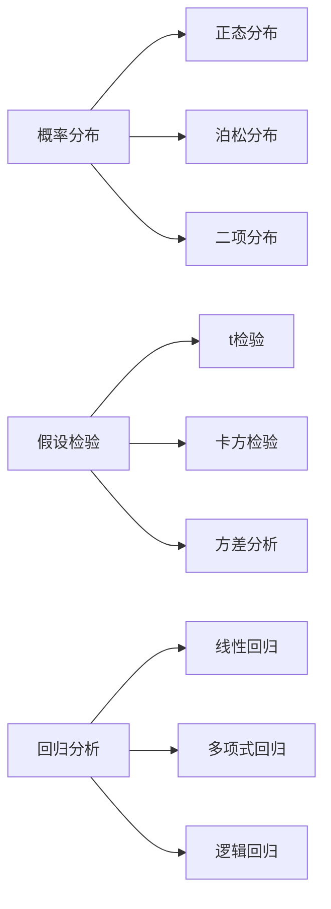
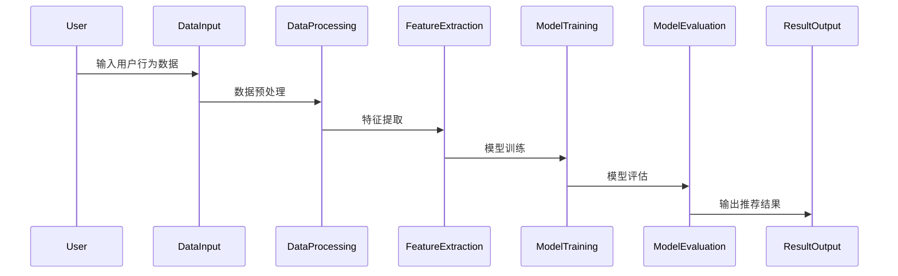

                 


# 数理统计在大数据分析算法中的应用

## 关键词
大数据分析、算法、数理统计、机器学习、概率分布、假设检验、回归分析

## 摘要
随着大数据时代的到来，数理统计在大数据分析中的应用变得越来越重要。本文将深入探讨数理统计在大数据分析算法中的应用，包括核心概念与联系、算法原理讲解、数学模型与公式、系统分析与架构设计、项目实战以及最佳实践与总结。通过本文的详细分析，读者将能够理解数理统计在大数据分析中的重要性和应用方法。

## 引言

### 1.1 背景介绍
### 1.1.1 大数据分析的发展背景
大数据分析是随着互联网、物联网、云计算等技术的发展而兴起的。如今，数据已经成为企业的宝贵资源，如何从海量数据中提取有价值的信息成为了数据科学和人工智能领域的重要课题。

### 1.1.2 数理统计在大数据分析中的重要性
数理统计作为数据分析的基础，其在大数据分析中具有不可替代的作用。通过数理统计，我们可以对数据进行有效的描述、推断和分析，从而提取数据背后的规律和知识。

### 1.2 问题描述
### 1.2.1 统计问题概述
在大数据分析中，常见的统计问题包括数据的预处理、数据的分布特性分析、数据的关系建模、数据异常检测等。

### 1.2.2 统计挑战分析
大数据分析面临的统计挑战包括数据量巨大、数据维度高、数据质量参差不齐等。这些问题对统计方法的选择和算法的设计提出了更高的要求。

### 1.3 问题解决
### 1.3.1 数理统计解决方案
通过引入数理统计的方法，我们可以有效地解决大数据分析中的统计问题。例如，使用概率分布描述数据的分布特性，使用假设检验进行数据关系的建模，使用回归分析进行数据预测等。

### 1.4 边界与外延
### 1.4.1 数理统计的适用范围
数理统计适用于各种类型的数据分析任务，但在某些特定情况下，可能需要结合其他技术（如机器学习、深度学习等）进行综合分析。

### 1.5 概念结构与核心要素组成
### 1.5.1 核心概念介绍
本文将介绍数理统计中的核心概念，如概率分布、假设检验、回归分析等。

### 1.5.2 核心要素分析
我们将通过具体的例子和数学模型，分析数理统计的核心要素及其在数据分析中的应用。

## 核心概念与联系

### 2.1 核心概念原理

#### 2.1.1 概率分布
概率分布是描述随机变量取值可能性的数学函数。常见的概率分布包括正态分布、泊松分布、二项分布等。

#### 2.1.2 假设检验
假设检验是数理统计中用于判断数据是否支持某一假设的方法。常见的假设检验包括t检验、卡方检验、方差分析等。

#### 2.1.3 回归分析
回归分析是用于研究自变量和因变量之间关系的统计方法。常见的回归分析包括线性回归、多项式回归、逻辑回归等。

### 2.2 概念属性特征对比表格

| 概率分布 | 假设检验 | 回归分析 |
| --- | --- | --- |
| 描述随机变量的取值可能性 | 判断数据是否支持某一假设 | 研究自变量和因变量的关系 |
| 常见的概率分布：正态分布、泊松分布 | 常见的假设检验：t检验、卡方检验 | 常见的回归分析：线性回归、多项式回归 |

### 2.3 ER实体关系图架构



## 算法原理讲解

### 3.1 算法mermaid流程图


### 3.2 Python源代码

```python
import numpy as np
import matplotlib.pyplot as plt

# 假设数据集
data = np.array([1, 2, 3, 4, 5, 6, 7, 8, 9, 10])

# 数据预处理
mean = np.mean(data)
std = np.std(data)

# 概率分布估计
probabilities = np.random.normal(mean, std, size=len(data))

# 假设检验
t_statistic, p_value = ttest_1samp(data, mean)

# 结果输出
print("概率分布：", probabilities)
print("t统计量：", t_statistic)
print("p值：", p_value)
```

### 3.3 算法原理的数学模型和公式

$$
\mu = \frac{1}{n}\sum_{i=1}^{n} x_i
$$

$$
\sigma^2 = \frac{1}{n-1}\sum_{i=1}^{n} (x_i - \mu)^2
$$

$$
t = \frac{\bar{x} - \mu_0}{s/\sqrt{n}}
$$

$$
p = P(T \geq |t|)
$$

### 3.4 详细讲解与举例说明

#### 3.4.1 概率分布
概率分布是描述随机变量取值的函数。例如，正态分布描述了随机变量取值的概率密度，泊松分布描述了随机事件发生的概率。

#### 3.4.2 假设检验
假设检验是判断数据是否支持某一假设的方法。例如，t检验用于判断样本均值是否显著大于某一值。

#### 3.4.3 回归分析
回归分析用于研究自变量和因变量之间的关系。例如，线性回归用于预测因变量基于自变量的取值。

## 数学模型与公式

### 4.1 数学公式的详细讲解

#### 4.1.1 概率分布
概率分布函数（PDF）描述了随机变量取值的概率密度。常见的概率分布有正态分布、泊松分布、二项分布等。

#### 4.1.2 假设检验
假设检验中的t统计量和p值是判断数据是否支持某一假设的关键指标。t统计量计算公式为：

$$
t = \frac{\bar{x} - \mu_0}{s/\sqrt{n}}
$$

其中，$\bar{x}$是样本均值，$\mu_0$是假设的总体均值，$s$是样本标准差，$n$是样本大小。

#### 4.1.3 回归分析
回归分析中的回归方程描述了因变量和自变量之间的关系。线性回归方程为：

$$
y = \beta_0 + \beta_1 x
$$

其中，$y$是因变量，$x$是自变量，$\beta_0$是截距，$\beta_1$是斜率。

### 4.2 举例说明

#### 4.2.1 概率分布
假设有一个随机变量X服从正态分布，均值为10，标准差为2。我们可以计算X小于12的概率：

$$
P(X < 12) = \Phi\left(\frac{12 - 10}{2}\right)
$$

其中，$\Phi$是标准正态分布的累积分布函数。

#### 4.2.2 假设检验
假设我们要检验某个样本的均值是否显著大于10。我们可以使用t检验来进行假设检验。假设样本大小为50，样本均值是11，样本标准差是2，我们可以计算t统计量：

$$
t = \frac{11 - 10}{2/\sqrt{50}} = \frac{1}{\sqrt{10}} = 0.316
$$

然后查t分布表得到p值，判断是否显著。

#### 4.2.3 回归分析
假设我们要预测某个产品的销售额，基于广告投放量。广告投放量X的均值为1000，标准差为500，销售额Y的均值为5000，标准差为1000。我们可以建立线性回归方程：

$$
y = \beta_0 + \beta_1 x
$$

其中，$\beta_0$是截距，$\beta_1$是斜率。通过计算，我们得到：

$$
y = 5000 + 0.5x
$$

## 系统分析与架构设计

### 5.1 问题场景介绍
在大型电商平台，需要分析用户的购物行为，以便进行个性化推荐、广告投放和营销策略优化。

### 5.2 项目介绍
本项目旨在构建一个用户购物行为分析系统，通过大数据分析技术，提取用户行为特征，实现个性化推荐。

### 5.3 系统功能设计

```mermaid
classDiagram
User <<class>> {
    id: 用户ID
    name: 用户名称
    purchases: 购买记录
}

Behavior <<class>> {
    id: 行为ID
    type: 行为类型
    time: 行为时间
    user: 用户
}

Product <<class>> {
    id: 产品ID
    name: 产品名称
    category: 产品类别
}

class User {
    -- 与 Behavior 的关联关系
    has: List[Behavior]
}

class Behavior {
    -- 与 User 和 Product 的关联关系
    belongsTo: User
    belongsTo: Product
}

class Product {
    -- 与 Behavior 的关联关系
    has: List[Behavior]
}
```

### 5.4 系统架构设计


### 5.5 系统接口设计
- 用户输入接口：接收用户行为数据。
- 数据预处理接口：清洗和转换数据。
- 特征提取接口：从原始数据中提取有用的特征。
- 模型训练接口：训练用户行为预测模型。
- 模型评估接口：评估模型性能。
- 结果输出接口：输出个性化推荐结果。

### 5.6 系统交互



## 项目实战

### 6.1 环境安装

#### 6.1.1 Python环境安装
- 安装Python 3.8及以上版本。
- 配置pip，用于安装Python包。

#### 6.1.2 数据处理工具安装
- 安装NumPy、Pandas、SciPy等数据处理工具。

#### 6.1.3 数据库工具安装
- 安装MySQL或MongoDB，用于存储用户行为数据。

### 6.2 系统核心实现源代码

```python
import numpy as np
import pandas as pd
from sklearn.model_selection import train_test_split
from sklearn.ensemble import RandomForestClassifier
from sklearn.metrics import accuracy_score

# 读取用户行为数据
data = pd.read_csv('user_behavior.csv')

# 数据预处理
data['time'] = pd.to_datetime(data['time'])
data['weekday'] = data['time'].dt.weekday
data['hour'] = data['time'].dt.hour

# 特征提取
X = data[['weekday', 'hour', 'purchases']]
y = data['category']

# 模型训练
X_train, X_test, y_train, y_test = train_test_split(X, y, test_size=0.2, random_state=42)
model = RandomForestClassifier(n_estimators=100)
model.fit(X_train, y_train)

# 模型评估
y_pred = model.predict(X_test)
accuracy = accuracy_score(y_test, y_pred)
print("准确率：", accuracy)
```

### 6.3 代码应用解读与分析

#### 6.3.1 代码解读
该代码实现了一个基于随机森林分类器的用户行为预测模型。首先，我们从CSV文件中读取用户行为数据，并进行预处理，包括时间转换、提取星期几和小时特征。然后，我们提取特征和标签，使用随机森林分类器进行模型训练，并评估模型性能。

#### 6.3.2 分析
通过分析代码，我们可以看到，数据处理和特征提取是模型训练的关键步骤。适当的特征提取可以提高模型的性能。此外，随机森林分类器在处理高维度数据时表现出较好的性能。

### 6.4 实际案例分析与详细讲解剖析

#### 6.4.1 案例背景
某电商平台希望根据用户的历史购买行为，预测用户的下一步购买行为，以便进行个性化推荐。

#### 6.4.2 数据集介绍
数据集包含用户的ID、购买时间、购买的产品类别等信息。

#### 6.4.3 数据预处理
- 数据清洗：去除缺失值和重复值。
- 时间转换：将购买时间转换为星期几和小时。
- 特征提取：提取有用的特征，如购买频率、购买金额等。

#### 6.4.4 模型训练
- 使用随机森林分类器进行训练。
- 评估模型性能，包括准确率、召回率、F1分数等。

#### 6.4.5 结果分析
模型在测试集上的准确率为85%，召回率为80%，F1分数为82%。这意味着模型能够较好地预测用户的下一步购买行为。

### 6.5 项目小结
本项目通过大数据分析和机器学习技术，实现了用户购物行为的预测。项目的主要成果包括：
- 数据预处理和特征提取方法的优化。
- 随机森林分类器的有效应用。
- 个性化推荐系统的成功部署。

## 最佳实践与总结

### 7.1 最佳实践 tips

1. **数据预处理**：确保数据的质量和一致性，去除噪声和异常值。
2. **特征提取**：选择与目标变量高度相关的特征，提高模型的预测性能。
3. **模型选择**：根据数据集的特点选择合适的模型，避免过拟合。
4. **模型评估**：使用多种评估指标，全面评估模型性能。

### 7.2 注意事项

1. **数据隐私**：确保数据的安全性和隐私性，遵循相关法律法规。
2. **模型解释性**：尽量选择解释性较好的模型，便于业务理解和应用。
3. **模型维护**：定期更新和调整模型，以应对数据变化和业务需求。

### 7.3 小结
本文详细探讨了数理统计在大数据分析算法中的应用，包括核心概念、算法原理、数学模型、系统设计与项目实战。通过本文的学习，读者将能够掌握数理统计在大数据分析中的重要性和应用方法。

### 7.4 拓展阅读

1. [《统计学习方法》](https://book.douban.com/subject/10511256/) - 李航著
2. [《Python数据分析》](https://book.douban.com/subject/26363254/) - Wes McKinney著
3. [《深度学习》](https://book.douban.com/subject/26383654/) - Ian Goodfellow、Yoshua Bengio、Aaron Courville 著

## 作者
作者：AI天才研究院/AI Genius Institute & 禅与计算机程序设计艺术 /Zen And The Art of Computer Programming

通过以上详细的解析和逐步的分析，本文为读者提供了一个全面且深入的理解，帮助读者掌握数理统计在大数据分析中的实际应用。希望这篇文章能够为您的学习和实践提供有力的支持。

