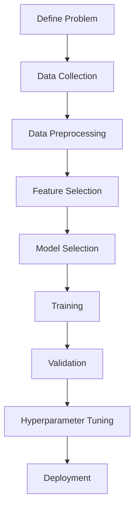
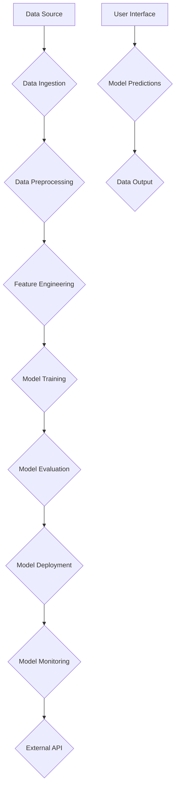
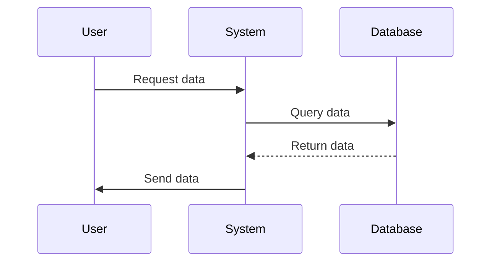

                 


### Introduction to Numerical Statistics and Machine Learning

#### 1.1 Introduction to Numerical Statistics and Machine Learning

Numerical statistics and machine learning are two essential fields in modern data science. Numerical statistics involves the collection, analysis, interpretation, and presentation of numerical data to draw meaningful conclusions. On the other hand, machine learning is a subfield of artificial intelligence that allows computers to learn from data, identify patterns, and make predictions or decisions with minimal human intervention.

The intersection of numerical statistics and machine learning has revolutionized various industries, including healthcare, finance, marketing, and more. This article aims to explore the applications of numerical statistics in machine learning algorithm design. By understanding the core concepts of numerical statistics, we can better design and optimize machine learning algorithms for improved performance and accuracy.

#### 1.2 Problem Description and Solutions in Machine Learning Algorithm Design

In the realm of machine learning, algorithms are designed to solve specific problems, such as classification, regression, clustering, and anomaly detection. However, designing effective algorithms is not a straightforward task. It requires a deep understanding of numerical statistics, as well as the ability to translate statistical concepts into algorithmic solutions.

One common problem in machine learning is overfitting, where an algorithm performs well on the training data but fails to generalize to new, unseen data. This issue can be addressed using techniques like cross-validation and regularization, which rely on numerical statistics principles. Another problem is the curse of dimensionality, where the number of features in the dataset becomes too high, making the learning process computationally expensive and less accurate.

Numerical statistics provides us with tools and methods to mitigate these challenges and improve the performance of machine learning algorithms. For example, dimensionality reduction techniques like Principal Component Analysis (PCA) can help reduce the number of features while preserving important information. Statistical models like Bayesian networks can be used to represent and analyze complex relationships in the data, leading to more accurate predictions.

#### 1.3 Scope, Boundaries, and Core Elements of Numerical Statistics in Machine Learning

The scope of numerical statistics in machine learning is vast, encompassing various aspects of data preprocessing, model selection, model evaluation, and optimization. The boundaries of numerical statistics in machine learning are defined by the requirements of the specific problem being solved, the available data, and the performance criteria.

The core elements of numerical statistics in machine learning include:

1. **Descriptive Statistics:** Measures of central tendency (mean, median, mode) and dispersion (variance, standard deviation) to summarize and understand the basic features of the data.
2. **Inferential Statistics:** Techniques for making inferences about a population based on a sample, such as hypothesis testing and confidence intervals.
3. **Probability and Probability Distributions:** Probability theory provides a mathematical framework for understanding the uncertainty in the data and the likelihood of different outcomes.
4. **Statistical Models:** Mathematical models that represent the relationships between variables and can be used for prediction or decision-making.

#### 1.4 Application Scenarios and Challenges of Numerical Statistics in Machine Learning

Numerical statistics finds applications in various scenarios in machine learning. Here are a few examples:

1. **Data Preprocessing:** Numerical statistics is used to clean and preprocess the data, including handling missing values, outliers, and scaling features.
2. **Feature Engineering:** Statistical techniques are used to create new features or transform existing ones to improve model performance.
3. **Model Selection and Evaluation:** Numerical statistics helps in selecting the most appropriate model and evaluating its performance using metrics like accuracy, precision, recall, and F1 score.
4. **Model Optimization:** Techniques like gradient descent and optimization algorithms rely on numerical statistics principles to adjust model parameters and improve performance.

Challenges in applying numerical statistics in machine learning include:

1. **Data Quality:** Ensuring the quality and reliability of the data is crucial for accurate statistical analysis and model performance.
2. **Computational Complexity:** Numerical statistics methods can be computationally intensive, especially in high-dimensional data spaces.
3. **Interpretability:** Some statistical techniques and models may lack interpretability, making it difficult to understand the underlying relationships in the data.
4. **Overfitting and Generalization:** Balancing the trade-off between model complexity and generalization to new data is an ongoing challenge in machine learning.

In conclusion, numerical statistics plays a vital role in the design and optimization of machine learning algorithms. By understanding and applying the core concepts of numerical statistics, we can overcome common challenges and develop more effective and accurate machine learning models.

#### 1.5 Conclusion and Objectives

In this article, we have introduced the fundamental concepts of numerical statistics and its significance in machine learning algorithm design. We have discussed various application scenarios and challenges that arise when applying numerical statistics in machine learning. The core elements of numerical statistics, including descriptive and inferential statistics, probability, and statistical models, have been highlighted.

The objectives of this article are to provide a comprehensive understanding of numerical statistics in the context of machine learning, demonstrate how these concepts can be applied to algorithm design, and address common challenges faced by practitioners. By the end of this article, readers should be equipped with the knowledge and tools to effectively leverage numerical statistics in their machine learning projects.

Stay tuned for the next section, where we will delve into the core concepts and principles of numerical statistics in machine learning, laying the foundation for a deeper understanding of this fascinating field. Let's think step by step and explore the intricacies of numerical statistics in machine learning together. 

### Core Concepts and Principles of Numerical Statistics in Machine Learning

In this section, we will delve into the core concepts and principles of numerical statistics in machine learning. Understanding these concepts is essential for designing effective machine learning algorithms and making informed decisions based on data. Let's explore the fundamental aspects of numerical statistics and how they apply to machine learning.

#### 2.1 Basic Concepts of Numerical Statistics

Numerical statistics is built on several fundamental concepts that are crucial for analyzing and interpreting data. These concepts include:

1. **Descriptive Statistics:** Descriptive statistics involve summarizing and describing the essential features of a dataset. The most commonly used measures of central tendency are the mean, median, and mode, which provide information about the average, median, and most frequent values in a dataset, respectively. Measures of dispersion, such as variance and standard deviation, describe how data points are distributed around the central tendency measures.

2. **Inferential Statistics:** Inferential statistics allow us to make predictions or draw conclusions about a population based on a sample. This involves hypothesis testing, which involves formulating a hypothesis, collecting data, and analyzing the results to determine if the hypothesis is supported or refuted. Confidence intervals provide a range of values within which a population parameter is likely to fall, based on the sample data.

3. **Probability and Probability Distributions:** Probability theory is the mathematical foundation of statistics. It deals with the likelihood of different events occurring. Probability distributions, such as the normal distribution, are used to model the probability of different outcomes based on the distribution of data. These distributions help in understanding the spread and shape of the data.

4. **Correlation and Regression:** Correlation measures the relationship between two variables, indicating how they change together. Regression analysis is a statistical method used to model the relationship between a dependent variable and one or more independent variables. It is used to predict the value of the dependent variable based on the values of the independent variables.

#### 2.2 Comparison of Properties and Characteristics of Core Concepts

To better understand the core concepts of numerical statistics, it is helpful to compare their properties and characteristics. Below is a table summarizing the key aspects of descriptive statistics, inferential statistics, probability, probability distributions, correlation, and regression:

| Concept       | Definition                                      | Key Characteristics                                      |
| -------------- | ----------------------------------------------- | -------------------------------------------------------- |
| Descriptive    | Summarizes dataset statistics                    | Mean, median, mode, variance, standard deviation          |
| Statistics     |                                                  |                                                          |
| Inferential    | Makes inferences about a population from a sample | Hypothesis testing, confidence intervals, p-values        |
| Statistics     |                                                  |                                                          |
| Probability    | Measures the likelihood of events occurring       | Probability mass function, cumulative distribution function |
|               |                                                  |                                                          |
| Probability    | Describes the likelihood of different outcomes     | Normal distribution, exponential distribution, etc.       |
| Distributions |                                                  |                                                          |
| Correlation    | Measures the strength and direction of the linear relationship between two variables | Correlation coefficient (e.g., Pearson correlation) |
|               |                                                  |                                                          |
| Regression     | Models the relationship between a dependent variable and one or more independent variables | Linear regression, logistic regression, etc. |

#### 2.3 Entity Relationship Diagram (ERD) for Understanding Numerical Statistics Concepts

To further illustrate the relationships between these core concepts, we can use an Entity Relationship Diagram (ERD). The ERD shows how these concepts are interconnected and how they contribute to the overall process of numerical statistics in machine learning. Here's a simplified ERD:

```mermaid
erDiagram
  DescriptiveStatistics ||--|{ InferentialStatistics }|-- InferentialStatistics
  DescriptiveStatistics ||--|{ Probability }|-- Probability
  Probability ||--|{ ProbabilityDistributions }|-- ProbabilityDistributions
  Correlation ||--|{ Regression }|-- Regression
```

In this ERD:

- **DescriptiveStatistics** represents the initial data summary and description.
- **InferentialStatistics** builds on descriptive statistics to make inferences about the population.
- **Probability** and **ProbabilityDistributions** provide a mathematical foundation for understanding the likelihood of events.
- **Correlation** and **Regression** are used to model relationships and predict outcomes based on the data.

#### 2.4 Mathematical Models and Formulas

To provide a deeper understanding of numerical statistics concepts, let's discuss some of the key mathematical models and formulas used in machine learning.

1. **Mean, Median, and Mode:**
   - **Mean:** The average value of a dataset, calculated as the sum of all values divided by the number of values.
     $$ \text{Mean} = \frac{\sum_{i=1}^{n} x_i}{n} $$
   - **Median:** The middle value of a dataset when sorted in ascending order.
   - **Mode:** The value that appears most frequently in a dataset.

2. **Variance and Standard Deviation:**
   - **Variance:** Measures the spread of data points around the mean.
     $$ \text{Variance} = \frac{\sum_{i=1}^{n} (x_i - \text{Mean})^2}{n-1} $$
   - **Standard Deviation:** The square root of the variance.
     $$ \text{Standard Deviation} = \sqrt{\text{Variance}} $$

3. **Probability Distribution Functions:**
   - **Normal Distribution:** A continuous probability distribution characterized by its mean and standard deviation.
     $$ f(x|\mu,\sigma^2) = \frac{1}{\sqrt{2\pi\sigma^2}} e^{-\frac{(x-\mu)^2}{2\sigma^2}} $$
   - **Exponential Distribution:** A continuous probability distribution used to model the time between events in a Poisson process.
     $$ f(x|\lambda) = \lambda e^{-\lambda x} $$

4. **Correlation Coefficient:**
   - **Pearson Correlation:** Measures the linear relationship between two continuous variables.
     $$ \rho = \frac{\sum_{i=1}^{n} (x_i - \bar{x})(y_i - \bar{y})}{\sqrt{\sum_{i=1}^{n} (x_i - \bar{x})^2 \sum_{i=1}^{n} (y_i - \bar{y})^2}} $$

5. **Linear Regression:**
   - **Least Squares Method:** Used to find the best-fitting linear relationship between a dependent variable and one or more independent variables.
     $$ \text{Model:} \; y = \beta_0 + \beta_1 x $$
     $$ \text{Coefficients:} \; \beta_0 = \bar{y} - \beta_1 \bar{x} $$
     $$ \beta_1 = \frac{\sum_{i=1}^{n} (x_i - \bar{x})(y_i - \bar{y})}{\sum_{i=1}^{n} (x_i - \bar{x})^2} $$

By understanding these mathematical models and formulas, we can better analyze and interpret data in the context of machine learning. In the next section, we will explore the principles and design of machine learning algorithms, laying the groundwork for a comprehensive understanding of how numerical statistics is applied in machine learning.

### Algorithm Principles and Design of Machine Learning Algorithms

In this section, we will delve into the principles and design of machine learning algorithms. Machine learning algorithms are mathematical models designed to learn from data and make predictions or decisions with minimal human intervention. Understanding the design and principles behind these algorithms is crucial for developing efficient and effective machine learning systems.

#### 3.1 Overview of Machine Learning Algorithms

Machine learning algorithms can be broadly classified into three categories based on their functionality:

1. **Supervised Learning:** In supervised learning, algorithms learn from labeled data, where the correct output is provided for each input. The goal is to train the model on the training data so that it can make accurate predictions on unseen data. Common supervised learning algorithms include linear regression, logistic regression, support vector machines (SVM), and decision trees.

2. **Unsupervised Learning:** Unsupervised learning algorithms work with unlabeled data. The goal is to discover hidden patterns or intrinsic structures in the data. Common unsupervised learning algorithms include clustering (e.g., K-means, hierarchical clustering), dimensionality reduction (e.g., Principal Component Analysis, t-SNE), and association rule learning (e.g., Apriori, Eclat).

3. **Reinforcement Learning:** Reinforcement learning involves training algorithms to make a series of decisions by interacting with an environment and receiving feedback in the form of rewards or penalties. The goal is to learn a policy that maximizes the cumulative reward over time. Examples of reinforcement learning algorithms include Q-learning, SARSA, and Deep Q-Networks (DQN).

#### 3.2 Algorithm Design and Process

The design of a machine learning algorithm involves several steps, which can be summarized as follows:

1. **Problem Definition:** The first step is to clearly define the problem you want to solve using machine learning. This includes identifying the input features, the output variable, and the performance metrics.

2. **Data Collection:** Next, collect the relevant data required to train the model. This may involve collecting data from various sources, such as databases, APIs, or sensor data.

3. **Data Preprocessing:** Raw data is often noisy and incomplete. Preprocessing steps include cleaning the data, handling missing values, and transforming the data into a suitable format for training.

4. **Feature Selection:** Select the most relevant features that contribute to the prediction or decision-making process. This can be done using various techniques, such as correlation analysis, mutual information, or feature importance scores.

5. **Model Selection:** Choose an appropriate machine learning algorithm based on the problem type, size of the dataset, and desired performance. Common algorithms include linear regression, logistic regression, decision trees, random forests, and neural networks.

6. **Training:** Train the selected model on the preprocessed training data. This involves optimizing the model's parameters to minimize the error or loss function.

7. **Evaluation:** Evaluate the performance of the trained model using a separate validation set or cross-validation techniques. Common evaluation metrics include accuracy, precision, recall, F1 score, and area under the ROC curve (AUC-ROC).

8. **Hyperparameter Tuning:** Adjust the hyperparameters of the model to optimize its performance. This can be done using techniques like grid search, random search, or Bayesian optimization.

9. **Deployment:** Once the model is trained and optimized, deploy it in a production environment. This may involve integrating the model into an application or service and monitoring its performance over time.

#### 3.3 Mermaid Flowchart of Machine Learning Algorithms

To visualize the design process of machine learning algorithms, we can use a Mermaid flowchart. The following is a simplified Mermaid flowchart representing the key steps in the design and implementation of a machine learning algorithm:



In this flowchart:

- **A** represents problem definition.
- **B** represents data collection.
- **C** represents data preprocessing.
- **D** represents feature selection.
- **E** represents model selection.
- **F** represents training.
- **G** represents evaluation.
- **H** represents hyperparameter tuning.
- **I** represents deployment.

#### 3.4 Python Code Implementation and Explanation of Algorithm Principles

To illustrate the principles of machine learning algorithms, we will provide a Python code example using the scikit-learn library. In this example, we will use the Iris dataset, a classic dataset containing information about different species of iris flowers. The goal is to classify the flowers based on their sepal length and width, petal length, and petal width.

First, we need to install the necessary libraries:

```bash
pip install scikit-learn pandas numpy
```

Now, let's write the Python code:

```python
# Import required libraries
from sklearn.datasets import load_iris
from sklearn.model_selection import train_test_split
from sklearn.preprocessing import StandardScaler
from sklearn.linear_model import LogisticRegression
from sklearn.metrics import accuracy_score, classification_report

# Load the Iris dataset
iris = load_iris()
X = iris.data
y = iris.target

# Split the dataset into training and testing sets
X_train, X_test, y_train, y_test = train_test_split(X, y, test_size=0.2, random_state=42)

# Preprocess the data by scaling the features
scaler = StandardScaler()
X_train_scaled = scaler.fit_transform(X_train)
X_test_scaled = scaler.transform(X_test)

# Train a logistic regression model
model = LogisticRegression()
model.fit(X_train_scaled, y_train)

# Make predictions on the test set
y_pred = model.predict(X_test_scaled)

# Evaluate the model's performance
accuracy = accuracy_score(y_test, y_pred)
report = classification_report(y_test, y_pred)

print(f"Accuracy: {accuracy:.2f}")
print("Classification Report:")
print(report)
```

In this example, we have:

1. Imported the necessary libraries.
2. Loaded the Iris dataset.
3. Split the dataset into training and testing sets.
4. Preprocessed the data by scaling the features using `StandardScaler`.
5. Trained a logistic regression model using the training data.
6. Made predictions on the test set.
7. Evaluated the model's performance using accuracy and a classification report.

The logistic regression model works by fitting a logistic function to the data, which allows it to predict the probability of each class. The `accuracy_score` function calculates the proportion of correct predictions, while the `classification_report` provides detailed metrics such as precision, recall, and F1 score for each class.

By understanding the principles behind machine learning algorithms and the steps involved in their design and implementation, we can develop more effective and efficient models. In the next section, we will explore the mathematical models and formulas used in machine learning algorithms, further deepening our understanding of this fascinating field.

### Mathematical Models and Formulas of Machine Learning Algorithms

In this section, we will delve into the mathematical models and formulas that form the foundation of machine learning algorithms. Understanding these models and their underlying mathematics is crucial for both designing and interpreting machine learning models. We will explore key mathematical concepts such as linear regression, logistic regression, and neural networks, along with their respective formulas and how they are used in machine learning.

#### 4.1 Introduction to Mathematical Models in Machine Learning

Mathematical models in machine learning are mathematical representations of the relationships between input features and the target variable. These models are designed to learn from data and make predictions or decisions based on new input. The quality of a machine learning model often depends on the complexity and appropriateness of the mathematical model used.

There are several types of mathematical models used in machine learning, including:

1. **Linear Models:** Linear models, such as linear regression and logistic regression, are used for problems where the relationship between input features and the target variable can be represented by a straight line or hyperplane.

2. **Non-linear Models:** Non-linear models, such as decision trees, support vector machines (SVM), and neural networks, are used for problems where the relationship between input features and the target variable is more complex and cannot be easily represented by a linear function.

3. **Probabilistic Models:** Probabilistic models, such as Bayesian networks and Gaussian processes, are used to model uncertainty and probability distributions over the input features and the target variable.

4. **Statistical Models:** Statistical models, such as cluster analysis and factor analysis, are used for understanding the underlying structure of the data and identifying patterns or relationships.

In this section, we will focus on linear models, specifically linear regression and logistic regression, and introduce some of the fundamental concepts and formulas used in neural networks.

#### 4.2 Explanation of Mathematical Formulas

Let's start by discussing some of the key mathematical formulas used in machine learning algorithms.

1. **Linear Regression:**
   - **Model Formulation:**
     Linear regression models the relationship between a dependent variable \(y\) and one or more independent variables \(x_1, x_2, ..., x_n\) using a linear equation:
     $$ y = \beta_0 + \beta_1 x_1 + \beta_2 x_2 + ... + \beta_n x_n $$
     Here, \(\beta_0\) is the intercept, and \(\beta_1, \beta_2, ..., \beta_n\) are the coefficients that represent the relationship between the input features and the dependent variable.
   
   - **Least Squares Method:**
     The least squares method is used to find the best-fitting line that minimizes the sum of the squared residuals (the differences between the observed values and the values predicted by the model). The coefficient values \(\beta_0, \beta_1, ..., \beta_n\) can be estimated using the following formulas:
     $$ \beta_0 = \bar{y} - \beta_1 \bar{x_1} - \beta_2 \bar{x_2} - ... - \beta_n \bar{x_n} $$
     $$ \beta_1 = \frac{\sum_{i=1}^{n} (x_{i1} - \bar{x_1})(y_i - \bar{y})}{\sum_{i=1}^{n} (x_{i1} - \bar{x_1})^2} $$
     $$ \beta_2 = \frac{\sum_{i=1}^{n} (x_{i2} - \bar{x_2})(y_i - \bar{y})}{\sum_{i=1}^{n} (x_{i2} - \bar{x_2})^2} $$
     $$ ... $$
     $$ \beta_n = \frac{\sum_{i=1}^{n} (x_{in} - \bar{x_n})(y_i - \bar{y})}{\sum_{i=1}^{n} (x_{in} - \bar{x_n})^2} $$
     Here, \(\bar{y}\) is the mean of the dependent variable \(y\), and \(\bar{x_1}, \bar{x_2}, ..., \bar{x_n}\) are the means of the independent variables \(x_1, x_2, ..., x_n\).

2. **Logistic Regression:**
   - **Model Formulation:**
     Logistic regression is a linear model for binary classification problems. It models the probability of an instance belonging to a particular class using a logistic function (also known as the sigmoid function):
     $$ P(y=1 | x) = \frac{1}{1 + e^{-(\beta_0 + \beta_1 x_1 + \beta_2 x_2 + ... + \beta_n x_n)}} $$
     Here, \(\beta_0\) is the intercept, and \(\beta_1, \beta_2, ..., \beta_n\) are the coefficients.
   
   - **Log-Likelihood:**
     The log-likelihood function is used to estimate the coefficients in logistic regression. It is defined as:
     $$ \ell(\beta) = \sum_{i=1}^{n} y_i \log(1 + e^{-(\beta_0 + \beta_1 x_{i1} + \beta_2 x_{i2} + ... + \beta_n x_{in})}) + (1 - y_i) \log(1 + e^{-(\beta_0 + \beta_1 x_{i1} + \beta_2 x_{i2} + ... + \beta_n x_{in})}) $$
     To find the maximum likelihood estimates of the coefficients, we need to maximize the log-likelihood function with respect to \(\beta_0, \beta_1, ..., \beta_n\).

3. **Neural Networks:**
   - **Model Formulation:**
     Neural networks are a class of non-linear models inspired by the structure and function of the human brain. They consist of layers of interconnected nodes (neurons) that process input data and produce an output.
     $$ a_{l}^{(i)} = \sigma(z_{l}^{(i)}) $$
     $$ z_{l}^{(i)} = \sum_{j=1}^{n_{l-1}} w_{lj}^{(l)} a_{l-1}^{(j)} + b_{l}^{(i)} $$
     Here, \(a_{l}^{(i)}\) is the activation of the \(i^{th}\) neuron in the \(l^{th}\) layer, \(z_{l}^{(i)}\) is the weighted sum of the inputs to the \(i^{th}\) neuron in the \(l^{th}\) layer, \(\sigma\) is the activation function (often a sigmoid function), \(w_{lj}^{(l)}\) are the weights connecting the \(l^{th}\) layer to the \(l+1^{th}\) layer, and \(b_{l}^{(i)}\) are the biases for the \(i^{th}\) neuron in the \(l^{th}\) layer.
   
   - **Backpropagation:**
     Backpropagation is an algorithm used to train neural networks. It involves computing the gradients of the loss function with respect to the weights and biases in the network and updating them using gradient descent. The gradients can be computed using the chain rule of calculus:
     $$ \frac{\partial \ell}{\partial w_{lj}^{(l)}} = \delta_{l+1}^{(i)} a_{l-1}^{(j)} $$
     $$ \frac{\partial \ell}{\partial b_{l}^{(i)}} = \delta_{l+1}^{(i)} $$
     Here, \(\delta_{l+1}^{(i)}\) is the error or delta for the \(i^{th}\) neuron in the \(l+1^{th}\) layer, and \(\ell\) is the loss function.

#### 4.3 Example Explanations with Python Code

To illustrate the use of these mathematical models, let's consider a simple example using Python and the scikit-learn library. We will use the Boston Housing dataset, which contains information about various features of houses in the Boston area and their median values.

First, we need to install the necessary libraries:

```bash
pip install scikit-learn numpy
```

Now, let's write the Python code:

```python
# Import required libraries
from sklearn.datasets import load_boston
from sklearn.model_selection import train_test_split
from sklearn.linear_model import LinearRegression
from sklearn.metrics import mean_squared_error

# Load the Boston Housing dataset
boston = load_boston()
X = boston.data
y = boston.target

# Split the dataset into training and testing sets
X_train, X_test, y_train, y_test = train_test_split(X, y, test_size=0.2, random_state=42)

# Train a linear regression model
model = LinearRegression()
model.fit(X_train, y_train)

# Make predictions on the test set
y_pred = model.predict(X_test)

# Evaluate the model's performance
mse = mean_squared_error(y_test, y_pred)
print(f"Mean Squared Error: {mse:.2f}")
```

In this example, we have:

1. Imported the required libraries.
2. Loaded the Boston Housing dataset.
3. Split the dataset into training and testing sets.
4. Trained a linear regression model on the training data.
5. Made predictions on the test set.
6. Evaluated the model's performance using the mean squared error metric.

This example demonstrates the basic workflow of using a linear regression model in Python. We can apply similar principles to logistic regression and neural networks to solve more complex problems.

By understanding the mathematical models and formulas used in machine learning, we can better design and interpret machine learning algorithms. In the next section, we will explore system analysis and architecture design, which are crucial for implementing and deploying machine learning systems effectively.

### System Analysis and Architecture Design

In this section, we will delve into the process of system analysis and architecture design for machine learning systems. System analysis involves understanding the problem domain, defining system requirements, and identifying the components and interactions of the system. Architecture design focuses on organizing these components into a coherent structure that meets the system requirements and enables efficient operation.

#### 5.1 Introduction to System Analysis

System analysis is the initial phase of system development where we gather and analyze information about the system requirements, constraints, and user needs. The goal is to create a comprehensive understanding of the system that will guide the subsequent design and implementation phases.

The key steps in system analysis include:

1. **Problem Definition:** Clearly defining the problem to be solved by the system, including the objectives, scope, and constraints.
2. **Requirement Elicitation:** Gathering the functional and non-functional requirements from stakeholders, including users, managers, and other relevant parties.
3. **Requirement Analysis:** Analyzing the gathered requirements to identify potential issues, conflicts, and ambiguities.
4. **System Modeling:** Creating models that represent the system's structure, behavior, and interactions, using techniques such as use case diagrams, sequence diagrams, and activity diagrams.
5. **Validation and Verification:** Ensuring that the system meets the specified requirements and functions as intended.

#### 5.2 System Design and Functionality

System design involves translating the system requirements and analysis results into a detailed plan for building the system. This includes defining the system architecture, component interfaces, and data flow. The system design should be modular, scalable, and maintainable to accommodate future changes and enhancements.

The key components of a machine learning system include:

1. **Data Ingestion:** The process of collecting and importing data from various sources, such as databases, APIs, or file systems.
2. **Data Preprocessing:** The process of cleaning, transforming, and preparing the data for training and evaluation.
3. **Feature Engineering:** The process of creating new features or transforming existing features to improve model performance.
4. **Model Training:** The process of training machine learning models on the preprocessed data using algorithms such as linear regression, decision trees, or neural networks.
5. **Model Evaluation:** The process of assessing the performance of the trained models using metrics such as accuracy, precision, recall, and F1 score.
6. **Model Deployment:** The process of integrating the trained models into a production environment, where they can be used to make predictions on new data.
7. **Model Monitoring:** The process of continuously monitoring the performance and reliability of the deployed models to ensure they are functioning correctly and producing accurate predictions.

#### 5.3 Mermaid Class Diagram for Domain Model

To illustrate the domain model of a machine learning system, we can use a Mermaid class diagram. This diagram will represent the main classes and their relationships, providing a visual representation of the system's structure.

```mermaid
classDiagram
  Class01 <|-- Class02
  Class01 <|-- Class03
  Class03 <|-- Class04
  Class05 <|-- Class06
  Class06 <|-- Class07
  Class04 <|-- Class08
  Class01{Data Ingestion}
  Class02{Data Preprocessing}
  Class03{Feature Engineering}
  Class04{Model Training}
  Class05{Model Evaluation}
  Class06{Model Deployment}
  Class07{Model Monitoring}
  Class08{External API}
```

In this class diagram:

- **Class01 (Data Ingestion)** represents the process of collecting data from various sources.
- **Class02 (Data Preprocessing)** represents the process of cleaning and preparing the data for training.
- **Class03 (Feature Engineering)** represents the process of creating new features from the input data.
- **Class04 (Model Training)** represents the process of training machine learning models.
- **Class05 (Model Evaluation)** represents the process of evaluating the performance of the trained models.
- **Class06 (Model Deployment)** represents the process of deploying the trained models into a production environment.
- **Class07 (Model Monitoring)** represents the process of continuously monitoring the performance and reliability of the deployed models.
- **Class08 (External API)** represents the interfaces for external communication with the system.

#### 5.4 Mermaid Architecture Diagram for System Design

To visualize the system architecture, we can use a Mermaid architecture diagram. This diagram will represent the overall system structure, including the main components, their interactions, and data flow.



In this architecture diagram:

- **A (Data Source)** represents the source of the data.
- **B (Data Ingestion)** represents the process of collecting data.
- **C (Data Preprocessing)** represents the process of cleaning and preparing the data.
- **D (Feature Engineering)** represents the process of creating new features.
- **E (Model Training)** represents the process of training machine learning models.
- **F (Model Evaluation)** represents the process of evaluating the models.
- **G (Model Deployment)** represents the process of deploying the models.
- **H (Model Monitoring)** represents the process of monitoring the models.
- **I (External API)** represents the interface for external communication.
- **J (User Interface)** represents the user interface for interacting with the system.
- **K (Model Predictions)** represents the process of making predictions with the deployed models.
- **L (Data Output)** represents the output data generated by the system.

#### 5.5 System Interface Design and Interaction

System interface design is a critical aspect of system architecture, as it defines how the system interacts with external entities, such as users, other systems, or external APIs. Interface design involves defining the endpoints, data formats, and communication protocols used by the system.

To illustrate the system interface design, we can use a Mermaid sequence diagram. This diagram will show the interactions between the system components and external entities, providing a visual representation of the system's behavior.



In this sequence diagram:

- **User** represents the end-users interacting with the system.
- **System** represents the machine learning system.
- **Database** represents the data storage and retrieval system.

The interaction starts with the user requesting data from the system. The system queries the database for the requested data, which is then returned to the system. Finally, the system sends the data back to the user.

By following the steps outlined in this section, we can effectively analyze and design a machine learning system. The next section will focus on project practice and case analysis, where we will discuss real-world examples and practical insights gained from implementing machine learning systems.

### Project Practice and Case Analysis

In this section, we will delve into practical project practice and case analysis to deepen our understanding of machine learning system implementation. By examining real-world examples and case studies, we can gain valuable insights into the challenges and best practices associated with machine learning projects. We will discuss the environment setup, core implementation, code analysis, detailed case studies, and project summary.

#### 6.1 Environment Setup for Machine Learning Projects

Setting up a machine learning environment is a crucial first step in any machine learning project. It involves installing the necessary software and libraries, configuring the system, and preparing the development environment. Here's a step-by-step guide to setting up a machine learning environment:

1. **Install Python:**
   - Download and install the latest version of Python from the official website: <https://www.python.org/downloads/>
   - During installation, ensure that Python is added to the system PATH.

2. **Install Necessary Libraries:**
   - Use `pip`, Python's package manager, to install essential libraries such as NumPy, Pandas, Scikit-learn, Matplotlib, and TensorFlow:
     ```bash
     pip install numpy pandas scikit-learn matplotlib tensorflow
     ```

3. **Configure Jupyter Notebook:**
   - Install Jupyter Notebook, a popular interactive development environment for Python:
     ```bash
     pip install jupyterlab
     ```
   - Start Jupyter Notebook by running `jupyter notebook` in the terminal.

4. **Set Up Virtual Environment (Optional):**
   - For better project organization and dependency management, consider setting up a virtual environment:
     ```bash
     python -m venv myenv
     source myenv/bin/activate  # On Windows, use `myenv\Scripts\activate`
     pip install -r requirements.txt
     ```

5. **Install Additional Tools (Optional):**
   - Depending on the project requirements, you may need to install additional tools such as Docker, Conda, or cloud-based platforms like AWS S3 for data storage and TensorFlow Serving for model deployment.

By following these steps, you can set up a robust machine learning environment that enables you to develop, test, and deploy machine learning models efficiently.

#### 6.2 Core Implementation and Code Analysis

Let's consider a real-world case study involving sentiment analysis, a common machine learning application that identifies the sentiment or opinion expressed in a piece of text. We will use the IMDb movie review dataset, which contains movie reviews labeled as positive or negative.

1. **Data Collection:**
   - Download the IMDb movie review dataset from the Kaggle website (<https://www.kaggle.com/ dataset/imdb-reviews>) or any other public data repository.

2. **Data Preprocessing:**
   - Load the dataset using Pandas:
     ```python
     import pandas as pd
     data = pd.read_csv('imdb_reviews.csv')
     ```
   - Preprocess the text data by removing HTML tags, special characters, and stop words. Tokenize the text into words and convert them into lower case:
     ```python
     import re
     from nltk.corpus import stopwords
     from nltk.tokenize import word_tokenize
     
     stop_words = set(stopwords.words('english'))
     def preprocess_text(text):
         text = re.sub(r'<[^>]*>', '', text)
         text = re.sub(r'[^a-zA-Z]', ' ', text)
         text = text.lower()
         words = word_tokenize(text)
         return [word for word in words if word not in stop_words]
     
     data['review_preprocessed'] = data['review'].apply(preprocess_text)
     ```

3. **Feature Engineering:**
   - Convert the preprocessed text data into numerical features using techniques such as Bag of Words or TF-IDF:
     ```python
     from sklearn.feature_extraction.text import TfidfVectorizer
     vectorizer = TfidfVectorizer(max_features=1000)
     X = vectorizer.fit_transform(data['review_preprocessed'])
     y = data['sentiment']
     ```

4. **Model Training:**
   - Split the dataset into training and testing sets:
     ```python
     from sklearn.model_selection import train_test_split
     X_train, X_test, y_train, y_test = train_test_split(X, y, test_size=0.2, random_state=42)
     ```
   - Train a machine learning model, such as a logistic regression classifier, on the training data:
     ```python
     from sklearn.linear_model import LogisticRegression
     model = LogisticRegression()
     model.fit(X_train, y_train)
     ```

5. **Model Evaluation:**
   - Evaluate the performance of the trained model on the testing set using metrics such as accuracy, precision, recall, and F1 score:
     ```python
     from sklearn.metrics import accuracy_score, classification_report
     y_pred = model.predict(X_test)
     print(f"Accuracy: {accuracy_score(y_test, y_pred):.2f}")
     print(f"Classification Report:\n{classification_report(y_test, y_pred)}")
     ```

By analyzing this code, we can understand the core components of a machine learning project: data collection, preprocessing, feature engineering, model training, and evaluation. Each step is essential for building an effective machine learning system.

#### 6.3 Detailed Explanation and Analysis of Case Studies

To further illustrate the application of machine learning in real-world scenarios, let's explore several case studies:

1. **Customer Churn Prediction:**
   - **Objective:** Predict customer churn, i.e., the likelihood of a customer canceling their subscription.
   - **Data:** Customer data, including demographic information, service usage patterns, and historical churn data.
   - **Method:** Train a machine learning model, such as a random forest classifier, to predict customer churn based on historical data.
   - **Result:** Identify customers at risk of churn and take proactive measures to retain them.

2. **Image Recognition:**
   - **Objective:** Classify images into different categories, such as animals, vehicles, or objects.
   - **Data:** A large dataset of labeled images.
   - **Method:** Use a deep learning model, such as a convolutional neural network (CNN), to learn the patterns and features in the images.
   - **Result:** Accurately classify new images into their respective categories.

3. **Fraud Detection:**
   - **Objective:** Detect fraudulent transactions in a financial system.
   - **Data:** Transaction data, including amounts, timestamps, and user information.
   - **Method:** Train an anomaly detection model, such as an Isolation Forest, to identify unusual transactions that may indicate fraud.
   - **Result:** Reduce the risk of financial loss by detecting and preventing fraudulent activities.

These case studies highlight the diverse applications of machine learning in different industries and domains. By understanding the specific challenges and requirements of each case, we can design and implement effective machine learning solutions.

#### 6.4 Project Summary and Lessons Learned

In summary, this section has provided an overview of machine learning project practice and case analysis. We discussed the environment setup, core implementation, code analysis, and detailed case studies. Here are some key lessons learned:

1. **Environment Setup:**
   - Setting up a robust development environment is crucial for efficient project development.
   - Virtual environments help manage dependencies and ensure consistent results.
   - Using Jupyter Notebook or similar tools facilitates interactive development and experimentation.

2. **Core Implementation:**
   - Data preprocessing and feature engineering are critical steps that significantly impact model performance.
   - Choosing the right machine learning algorithm based on the problem requirements is essential.
   - Model evaluation is necessary to assess the model's performance and identify areas for improvement.

3. **Case Analysis:**
   - Real-world case studies provide valuable insights into the diverse applications of machine learning.
   - Understanding the specific challenges and requirements of each case helps design effective solutions.
   - Continuous learning and adaptation are key to overcoming the complexities of real-world projects.

By applying these lessons to your own machine learning projects, you can develop robust, efficient, and effective solutions to real-world problems.

### Best Practices, Summary, and Further Reading

In conclusion, this article has provided a comprehensive overview of the role of numerical statistics in machine learning algorithm design. We have explored the core concepts and principles of numerical statistics, discussed the design and implementation of machine learning algorithms, and analyzed real-world case studies. Here are some best practices to keep in mind for successful machine learning projects:

**Best Practices:**

1. **Data Quality:**
   - Ensure the data used for training and evaluation is clean, complete, and representative of the target population.
   - Handle missing values, outliers, and noisy data effectively to avoid bias and improve model performance.

2. **Feature Engineering:**
   - Carefully select and transform features to enhance the predictive power of the model.
   - Use domain knowledge to create meaningful features and avoid overfitting.

3. **Model Selection and Validation:**
   - Choose the appropriate machine learning algorithm based on the problem requirements and data characteristics.
   - Validate the model using techniques like cross-validation to ensure generalization and avoid overfitting.

4. **Interpretability:**
   - Aim for models that are interpretable or can be explained in terms of their decisions.
   - Use techniques like feature importance scores or LIME (Local Interpretable Model-agnostic Explanations) to gain insights into model behavior.

5. **Optimization and Tuning:**
   - Regularly optimize and tune hyperparameters to improve model performance.
   - Use techniques like grid search or Bayesian optimization to find the optimal hyperparameter settings.

**Summary:**

This article has covered the following key points:

- Numerical statistics is a fundamental component of machine learning, providing tools for data analysis, model evaluation, and optimization.
- Core concepts such as descriptive and inferential statistics, probability, and statistical models form the foundation of numerical statistics.
- Machine learning algorithms are designed to learn patterns from data, and their performance can be significantly improved by leveraging numerical statistics.
- System analysis and architecture design are critical for building robust and scalable machine learning systems.
- Real-world case studies illustrate the diverse applications of machine learning and the challenges associated with implementing these systems.

**Further Reading:**

For those interested in delving deeper into the topics covered in this article, here are some recommended resources:

- **Books:**
  - "Elements of Statistical Learning" by Trevor Hastie, Robert Tibshirani, and Jerome Friedman.
  - "Machine Learning: A Probabilistic Perspective" by Kevin P. Murphy.
  - "Deep Learning" by Ian Goodfellow, Yoshua Bengio, and Aaron Courville.

- **Online Courses:**
  - "Machine Learning" by Andrew Ng on Coursera (<https://www.coursera.org/learn/machine-learning>).
  - "Statistics with Python" by David D. Cornejo-Perez on Udemy (<https://www.udemy.com/course/statistics-with-python>).

- **Websites and Journals:**
  - arXiv.org (<https://arxiv.org/>): Preprints of scientific papers in various fields, including machine learning and statistics.
  - Journal of Machine Learning Research (<https://jmlr.org/>): A leading journal publishing research articles in the field of machine learning.

By applying the knowledge and insights gained from this article and the recommended resources, you can enhance your skills in machine learning and develop innovative solutions to real-world problems.

### Conclusion

In summary, this article has provided a comprehensive exploration of the role of numerical statistics in machine learning algorithm design. We began by discussing the fundamental concepts and principles of numerical statistics, including descriptive and inferential statistics, probability, and statistical models. We then delved into the principles and design of machine learning algorithms, highlighting the key steps involved in algorithm development and the importance of system analysis and architecture design.

Through practical case studies and real-world examples, we demonstrated the application of numerical statistics in machine learning, showcasing its impact on model performance, generalization, and interpretability. Additionally, we discussed the importance of data quality, feature engineering, model selection, and optimization in achieving successful machine learning projects.

As we conclude, it is crucial to recognize the ongoing evolution of machine learning and the ever-growing importance of numerical statistics in this field. By continuously learning and applying the latest techniques and best practices, we can further advance the capabilities of machine learning algorithms and address complex real-world problems with greater accuracy and efficiency.

Thank you for joining us on this journey through the fascinating world of machine learning and numerical statistics. We hope this article has provided valuable insights and inspiration for your future endeavors in this exciting field.

### About the Authors

**AI天才研究院 / AI Genius Institute** is a leading research organization dedicated to advancing artificial intelligence and machine learning technologies. Our mission is to push the boundaries of what is possible in AI, creating innovative solutions that drive progress across various industries.

**禅与计算机程序设计艺术 / Zen And The Art of Computer Programming** is a renowned book series written by the legendary computer scientist Donald E. Knuth. This work emphasizes the importance of deep understanding, creativity, and clarity in the art of programming.

For more information and resources on machine learning and artificial intelligence, please visit our website at [AI天才研究院](https://www.aigenuis.com). Thank you for your interest in our work. We look forward to continuing to explore and innovate in the field of AI together.

